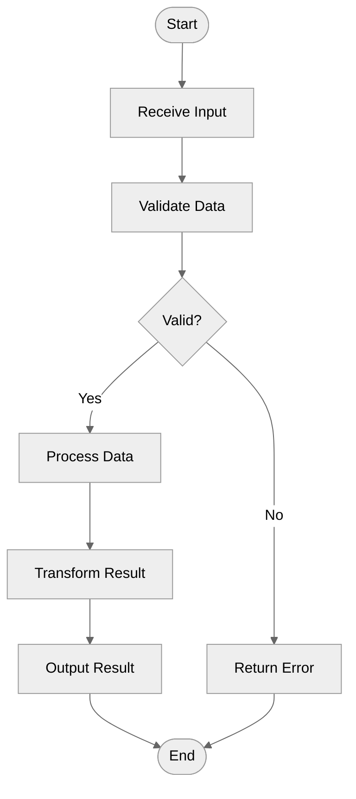
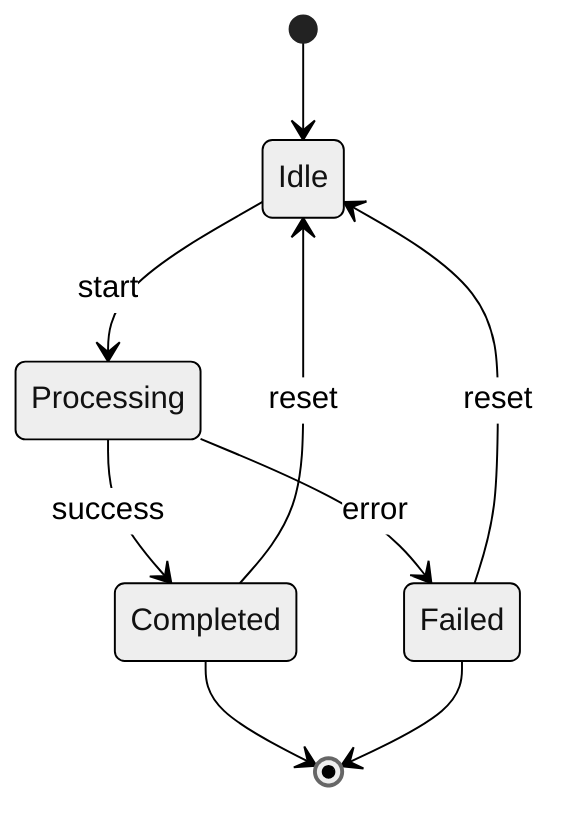
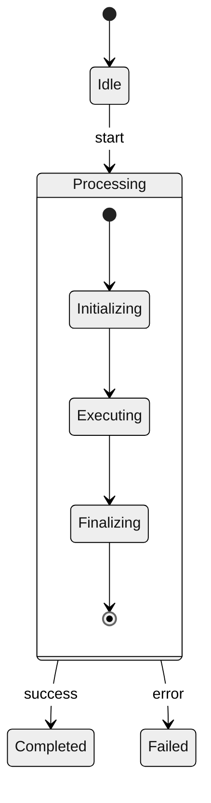

# Behavioral Modeling

How to model the dynamic behavior of a module during execution.

---

## Purpose

Behavioral models show:
- How the module responds to events and inputs
- Sequence of actions during data processing
- State transitions in response to stimuli
- Runtime behavior vs static structure

---

## Types of Behavioral Models

### 1. Data-Driven Models
Show sequence of actions processing input data to produce output.
- Activity diagrams
- Data-flow representations

### 2. Event-Driven Models
Show how the module responds to internal and external events.
- State diagrams
- Event-response mappings

---

## Data-Driven Modeling

### When to Use
- Data processing pipelines
- Batch processing systems
- Request-response workflows
- ETL (Extract-Transform-Load) operations

### Activity Diagram Elements

| Element | Symbol | Purpose |
|---------|--------|---------|
| **Start** | ● | Initial point |
| **End** | ◉ | Final point |
| **Activity** | ⬜ (rounded) | Processing step |
| **Decision** | ◇ | Branch point |
| **Fork/Join** | ━ (bar) | Parallel execution |
| **Data Object** | 📄 | Data flowing between activities |

### Activity Diagram Template



### Data Flow Documentation

| Step | Input | Processing | Output |
|------|-------|------------|--------|
| 1 | Raw data | Validation | Valid/Error |
| 2 | Valid data | Transform | Processed |
| 3 | Processed | Format | Result |

---

## Event-Driven Modeling

### When to Use
- Real-time systems
- Event-based architectures
- State machines
- UI interactions
- Protocol implementations

### State Diagram Elements

| Element | Symbol | Purpose |
|---------|--------|---------|
| **State** | ⬜ (rounded) | System condition |
| **Initial** | ● | Starting state |
| **Final** | ◉ | Ending state |
| **Transition** | → | State change |
| **Guard** | [condition] | Transition condition |
| **Action** | do: action | Activity in state |

### State Diagram Template



### State Documentation

| State | Description | Entry Action | Exit Action |
|-------|-------------|--------------|-------------|
| Idle | Waiting for input | Initialize | - |
| Processing | Executing task | Start timer | Stop timer |
| Completed | Task finished | Log success | - |
| Failed | Task failed | Log error | - |

### Stimulus Documentation

| Stimulus | Source | Description | Triggers |
|----------|--------|-------------|----------|
| start | User | Begin operation | Idle → Processing |
| success | Internal | Task completed | Processing → Completed |
| error | Internal | Task failed | Processing → Failed |
| reset | User | Return to idle | * → Idle |

---

## Superstates (Complex State Machines)

For modules with many states, use superstates to manage complexity:



---

## Behavioral Analysis Process

### Step 1: Identify Behavior Type
- Is this module primarily data-driven or event-driven?
- Or a combination of both?

### Step 2: For Data-Driven Modules
1. Identify the input data
2. Trace the processing steps
3. Identify decision points
4. Document the output

### Step 3: For Event-Driven Modules
1. List all possible states
2. Identify all stimuli (events)
3. Map state transitions
4. Document actions in each state

### Step 4: Document Key Scenarios
- Happy path (success flow)
- Error handling
- Edge cases

---

## Common Behavioral Patterns

### Pipeline Pattern (Data-Driven)
```
Input → [Step 1] → [Step 2] → [Step 3] → Output
```

### Request-Response Pattern
```
Request → Validate → Process → Format → Response
```

### State Machine Pattern (Event-Driven)
```
Idle ↔ Active ↔ Complete
         ↓
       Error
```

### Workflow Pattern (Combined)
```
Start → [State 1 with processing] → [State 2 with processing] → End
```

---

## Output Format

### Behavioral Summary

```markdown
## Module Behavior: [module-name]

### Behavior Type
- **Primary**: [Data-driven / Event-driven / Mixed]
- **Characteristics**: [Description]

### Data Processing Flow

| Input | Processing Steps | Output |
|-------|-----------------|--------|
| Request | Validate → Process → Transform | Response |

### State Model

| State | Description | Allowed Transitions |
|-------|-------------|---------------------|
| Idle | Waiting | start → Processing |
| Processing | Working | success → Done, error → Failed |

### Stimuli

| Event | Source | Effect |
|-------|--------|--------|
| start | User command | Begin processing |
| timeout | Timer | Cancel operation |

### Key Scenarios

#### Scenario 1: Success Path
1. User initiates [action]
2. System transitions to [state]
3. Processing completes
4. Result returned

#### Scenario 2: Error Handling
1. Error occurs during [step]
2. System transitions to [error state]
3. Error logged and reported
```

---

## Checklist

Before completing behavioral analysis:

- [ ] Behavior type identified (data/event/mixed)
- [ ] For data-driven: processing steps documented
- [ ] For event-driven: states and stimuli documented
- [ ] State transitions mapped
- [ ] Actions in each state documented
- [ ] Success scenario described
- [ ] Error handling documented
- [ ] Activity or state diagram created (or described)
