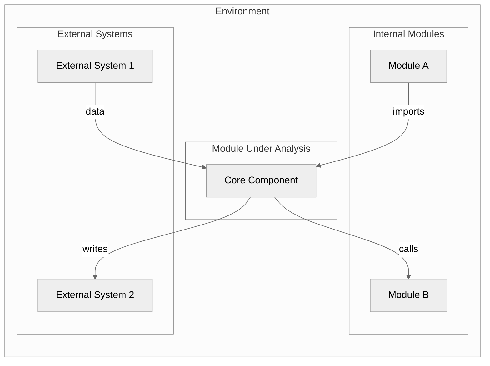
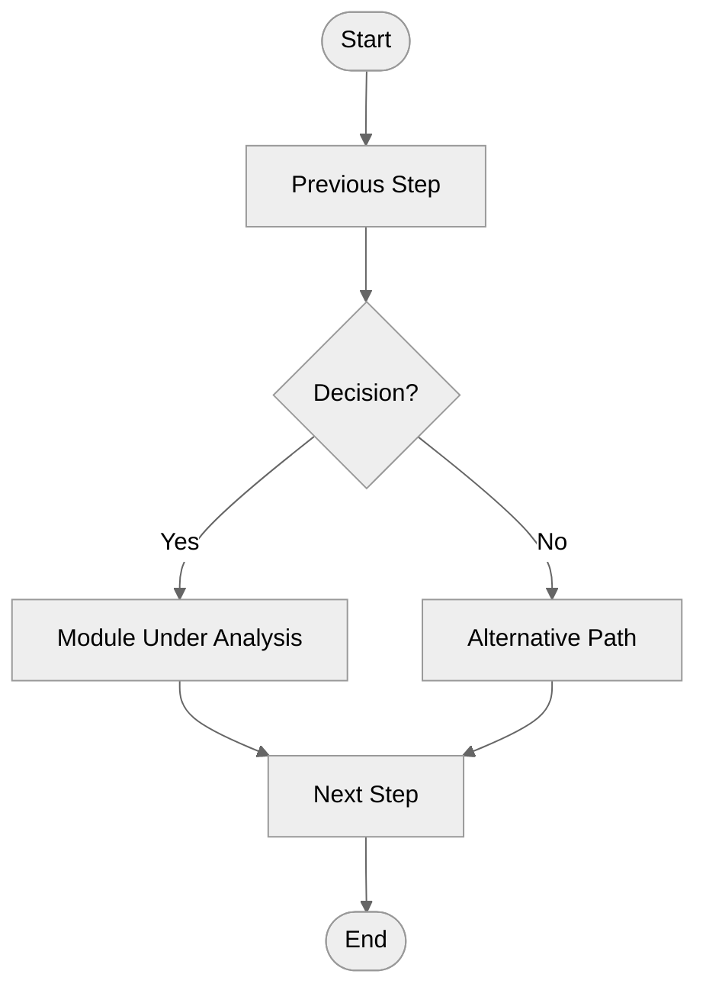

# Context Modeling

How to model a module's environment and system boundaries.

---

## Purpose

Context models show how a module fits within its broader environment. They help:
- Define what is inside vs outside the module scope
- Identify dependencies on external systems and modules
- Understand data and control flow with the environment
- Make informed decisions about module boundaries

---

## System Boundary Definition

### Questions to Answer

| Question | Guidance |
|----------|----------|
| What functionality is inside this module? | List core responsibilities |
| What functionality depends on other modules? | Identify delegated responsibilities |
| What external systems does this module interact with? | APIs, services, databases, etc. |
| What processes are manual vs automated? | Identify automation boundaries |
| Where are potential overlaps with other modules? | Risk of duplication |

### Boundary Types

```
┌─────────────────────────────────────────────────┐
│                  Environment                    │
│  ┌─────────────┐      ┌─────────────┐          │
│  │External Sys │      │Other Module │          │
│  └──────┬──────┘      └──────┬──────┘          │
│         │                    │                  │
│         ▼                    ▼                  │
│  ┌────────────────────────────────────────┐    │
│  │          Module Boundary               │    │
│  │  ┌──────────────────────────────────┐  │    │
│  │  │     Module Under Analysis        │  │    │
│  │  │                                  │  │    │
│  │  │  [Core Functionality]            │  │    │
│  │  │                                  │  │    │
│  │  └──────────────────────────────────┘  │    │
│  └────────────────────────────────────────┘    │
└─────────────────────────────────────────────────┘
```

---

## Context Diagram Components

### Module Under Analysis
- Name and primary purpose
- Core responsibilities (bullet list)
- Key interfaces exposed

### Adjacent Modules
For each connected module, document:

| Field | Description |
|-------|-------------|
| **Name** | Module identifier |
| **Relationship** | Depends-on / Provides-to / Shares-with |
| **Data Exchanged** | What data flows between them |
| **Connection Type** | Direct import / Event bus / API / Shared state |

### External Systems
For each external system:

| Field | Description |
|-------|-------------|
| **Name** | System identifier |
| **Type** | Database / API / Service / Hardware / File system |
| **Direction** | Produces data / Consumes data / Both |
| **Protocol** | HTTP / gRPC / File / Direct call |

---

## Context Diagram Template (Mermaid)



---

## Business Process Context

Context models should be used alongside business process models showing how the module participates in workflows.

### Process Model Questions

1. What business processes use this module?
2. What is the module's role in each process?
3. What triggers module execution?
4. What outputs does the module produce?

### Activity Diagram for Process Context



---

## Output Format

### Context Summary

```markdown
## Module Context: [module-name]

### System Boundary
- **Scope**: [What the module is responsible for]
- **Exclusions**: [What is explicitly outside scope]

### Adjacent Modules
| Module | Relationship | Data Exchanged |
|--------|--------------|----------------|
| rv-android-core | Depends-on | Domain models, events |
| rv-platform | Provides-to | Execution services |

### External Systems
| System | Type | Direction |
|--------|------|-----------|
| Android Device | Hardware | Both |
| LLM Server | API | Both |

### Process Context
- Used in: [List business processes]
- Triggered by: [What initiates the module]
- Produces: [What outputs it generates]
```

---

## Checklist

Before completing context analysis:

- [ ] Module boundaries clearly defined
- [ ] All adjacent modules identified
- [ ] All external systems documented
- [ ] Data flow direction documented
- [ ] Connection types specified
- [ ] Business process context understood
- [ ] Context diagram created (or described)
