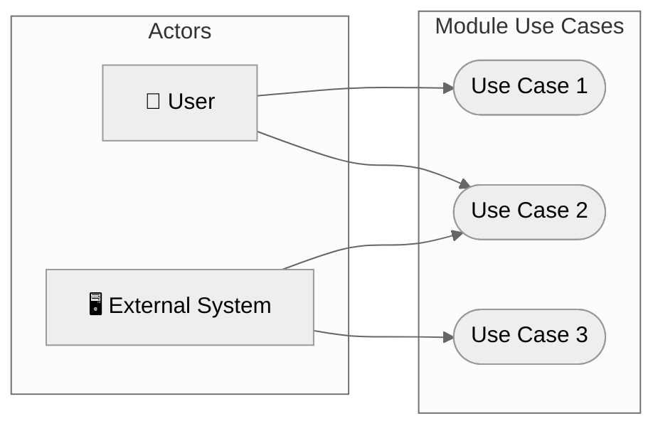
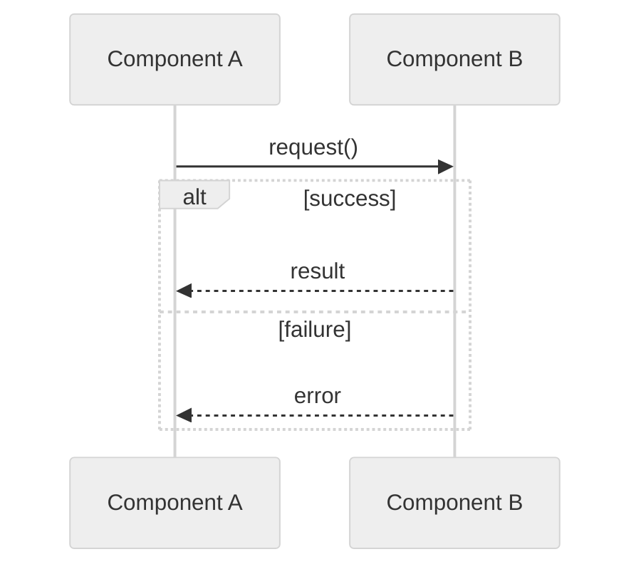

# Interaction Modeling

How to model interactions between a module and its environment, and between components within the module.

---

## Purpose

Interaction models show:
- How users interact with the module
- How the module communicates with external systems
- How internal components collaborate
- Sequence of operations for key use cases

---

## Types of Interaction Models

### 1. Use Case Modeling
Models interactions between the module and external actors (users or systems).

### 2. Sequence Diagrams
Models detailed interactions between components, showing message flow over time.

---

## Use Case Modeling

### Use Case Identification

For each discrete task involving external interaction:

| Field | Description | Example |
|-------|-------------|---------|
| **Name** | Action verb + noun | "Execute Test" |
| **Actor(s)** | Who/what initiates | User, External System |
| **Description** | What happens | User runs test on Android app |
| **Data** | Input/output data | APK path, test results |
| **Stimulus** | What triggers it | User command, scheduled job |
| **Response** | Expected outcome | Test report generated |
| **Comments** | Preconditions, constraints | Requires device connected |

### Use Case Diagram Template



### Use Case Tabular Format

```markdown
| Use Case | Actor(s) | Description | Stimulus | Response |
|----------|----------|-------------|----------|----------|
| Execute Test | User | Run test session | CLI command | Test report |
| Process Event | EventBus | Handle system event | Event received | State updated |
```

---

## Sequence Diagrams

### When to Use
- Document complex interactions between components
- Show order of operations
- Identify communication problems
- Validate proposed structure

### Key Elements

| Element | Notation | Purpose |
|---------|----------|---------|
| **Lifeline** | Vertical dashed line | Object existence over time |
| **Activation** | Rectangle on lifeline | Object processing |
| **Message** | Arrow between lifelines | Method call or data |
| **Return** | Dashed arrow | Response from call |
| **Alt** | Box labeled "alt" | Alternative flows |
| **Loop** | Box labeled "loop" | Repeated operations |

### Sequence Diagram Template

```mermaid
%%{init: {'theme': 'neutral'}}%%
sequenceDiagram
    participant Actor as 👤 Actor
    participant Comp1 as Component A
    participant Comp2 as Component B
    participant Ext as External System

    Actor->>Comp1: request(params)
    activate Comp1
    Comp1->>Comp2: process(data)
    activate Comp2
    Comp2->>Ext: externalCall()
    Ext-->>Comp2: result
    Comp2-->>Comp1: processed
    deactivate Comp2
    Comp1-->>Actor: response
    deactivate Comp1
```

### Alternatives and Conditionals



---

## Interaction Analysis Process

### Step 1: Identify Actors
- Who/what initiates interactions with the module?
- Who/what receives output from the module?

### Step 2: List Use Cases
- What discrete tasks does the module support?
- What external interactions are required?

### Step 3: Document Key Sequences
For each important use case:
1. Identify participating components
2. Trace the message flow
3. Note alternative paths
4. Document error handling

### Step 4: Validate Interactions
- Are all actors accounted for?
- Are all public interfaces covered?
- Are error paths documented?

---

## Output Format

### Interaction Summary

```markdown
## Module Interactions: [module-name]

### Actors
| Actor | Type | Description |
|-------|------|-------------|
| User | Human | CLI operator |
| EventBus | System | Event dispatcher |
| Device | Hardware | Android device |

### Use Cases
| Use Case | Actor(s) | Description |
|----------|----------|-------------|
| Execute Test | User | Run test session on device |
| Handle Event | EventBus | Process system events |

### Key Sequences

#### Sequence: [Use Case Name]
[Sequence diagram or description]

**Flow**:
1. Actor initiates [action]
2. Component A processes [data]
3. Component B calls [external]
4. Result returned to actor
```

---

## Checklist

Before completing interaction analysis:

- [ ] All actors identified (users, systems, hardware)
- [ ] All use cases documented
- [ ] Use case descriptions include stimulus/response
- [ ] Key sequences documented
- [ ] Alternative paths identified
- [ ] Error handling paths documented
- [ ] Public interfaces covered by use cases
