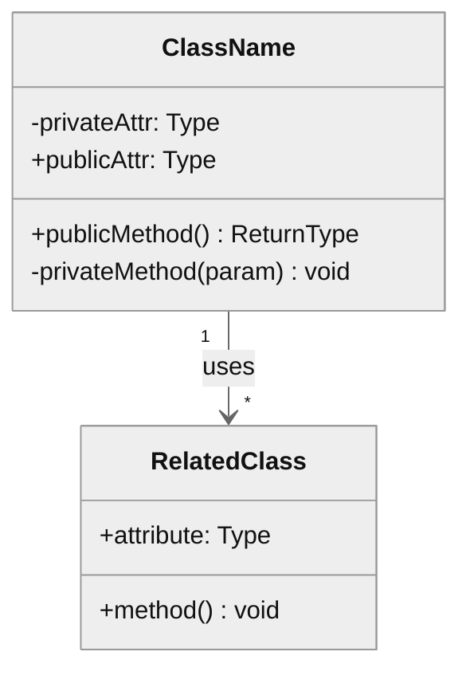
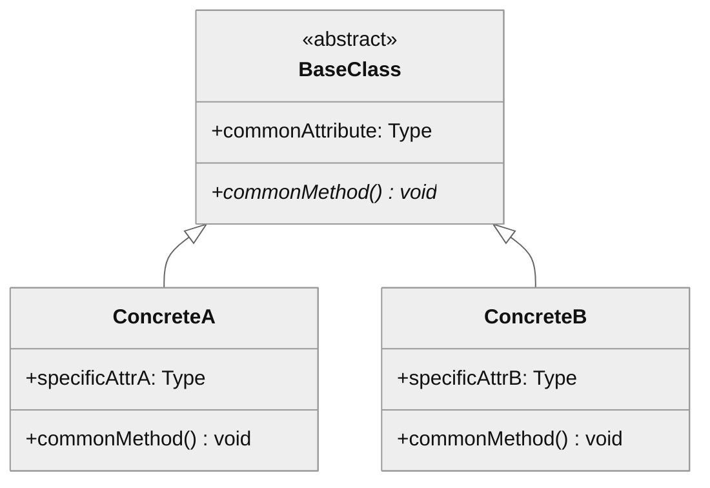
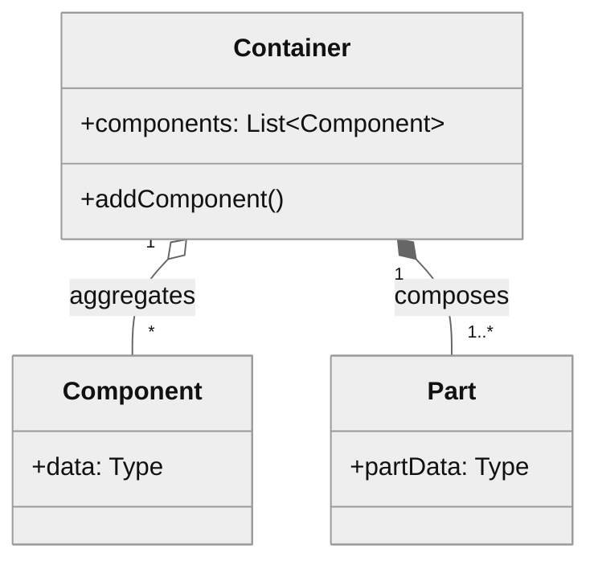

# Structural Modeling

How to model the static structure and organization of a module.

---

## Purpose

Structural models show:
- Organization of components in terms of classes and their relationships
- Static design structure (compile-time)
- Data structures and their associations
- Inheritance and composition hierarchies

---

## Types of Structural Models

### 1. Class Diagrams
Show object classes, attributes, operations, and associations.

### 2. Generalization Hierarchies
Show inheritance relationships between classes.

### 3. Aggregation/Composition
Show whole-part relationships.

---

## Class Diagrams

### Class Representation

```
┌───────────────────────┐
│     ClassName         │  ← Name
├───────────────────────┤
│ - attribute1: Type    │  ← Attributes
│ + attribute2: Type    │     (- private, + public)
├───────────────────────┤
│ + method1(): Type     │  ← Operations
│ - method2(param): void│
└───────────────────────┘
```

### Association Types

| Type | Notation | Meaning |
|------|----------|---------|
| **Association** | Solid line | Classes are related |
| **Directed** | Arrow → | One class knows the other |
| **Bidirectional** | Line (no arrow) | Both classes know each other |
| **Dependency** | Dashed arrow --> | Uses but doesn't own |

### Multiplicity

| Notation | Meaning |
|----------|---------|
| `1` | Exactly one |
| `0..1` | Zero or one |
| `*` or `0..*` | Zero or more |
| `1..*` | One or more |
| `n..m` | Range from n to m |

### Class Diagram Template



---

## Generalization (Inheritance)

### When to Model Inheritance
- When classes share common attributes/operations
- When subclasses specialize superclass behavior
- When polymorphism is used

### Generalization Diagram



### Hierarchy Documentation

| Class | Parent | Specialization |
|-------|--------|----------------|
| ConcreteA | BaseClass | Handles case A |
| ConcreteB | BaseClass | Handles case B |

---

## Aggregation and Composition

### Aggregation (has-a, weak ownership)
- Part can exist independently of whole
- Diamond outline: ◇

### Composition (owns-a, strong ownership)
- Part cannot exist without whole
- Filled diamond: ◆

### Composition Diagram



---

## Structural Analysis Process

### Step 1: Identify Key Classes
- What are the main domain entities?
- What are the core service classes?
- What are the data structures?

### Step 2: Map Associations
For each class pair:
- Is there a relationship?
- What is the direction?
- What is the multiplicity?

### Step 3: Identify Hierarchies
- Are there abstract base classes?
- Are there interface implementations?
- Are there inheritance chains?

### Step 4: Document Compositions
- What objects own other objects?
- What is the lifecycle relationship?

---

## Structural Patterns to Identify

| Pattern | Structure | Purpose |
|---------|-----------|---------|
| **Factory** | Creator → Product | Object creation |
| **Strategy** | Context → Strategy interface | Interchangeable algorithms |
| **Observer** | Subject → Observer | Event notification |
| **Decorator** | Component ← Decorator | Dynamic behavior |
| **Facade** | Facade → Subsystems | Simplified interface |

---

## Output Format

### Structural Summary

```markdown
## Module Structure: [module-name]

### Key Classes

| Class | Responsibility | Key Methods |
|-------|----------------|-------------|
| MainClass | Primary orchestrator | execute(), process() |
| ServiceClass | Business logic | doWork() |
| DataClass | Data container | (attributes only) |

### Class Relationships

| From | To | Type | Multiplicity |
|------|----|------|--------------|
| MainClass | ServiceClass | Association | 1:1 |
| ServiceClass | DataClass | Composition | 1:* |

### Inheritance Hierarchies

```
BaseStrategy (abstract)
├── StrategyA
├── StrategyB
└── StrategyC
```

### Composition Structures

```
Container
├── Part1 (owned)
├── Part2 (owned)
└── Reference (aggregated)
```

### Patterns Identified
- **Strategy**: [Where used and why]
- **Factory**: [Where used and why]
```

---

## Checklist

Before completing structural analysis:

- [ ] Key classes identified with responsibilities
- [ ] Associations mapped with direction and multiplicity
- [ ] Inheritance hierarchies documented
- [ ] Composition relationships identified
- [ ] Design patterns recognized
- [ ] Class diagram created (or described)
- [ ] Public interfaces documented
