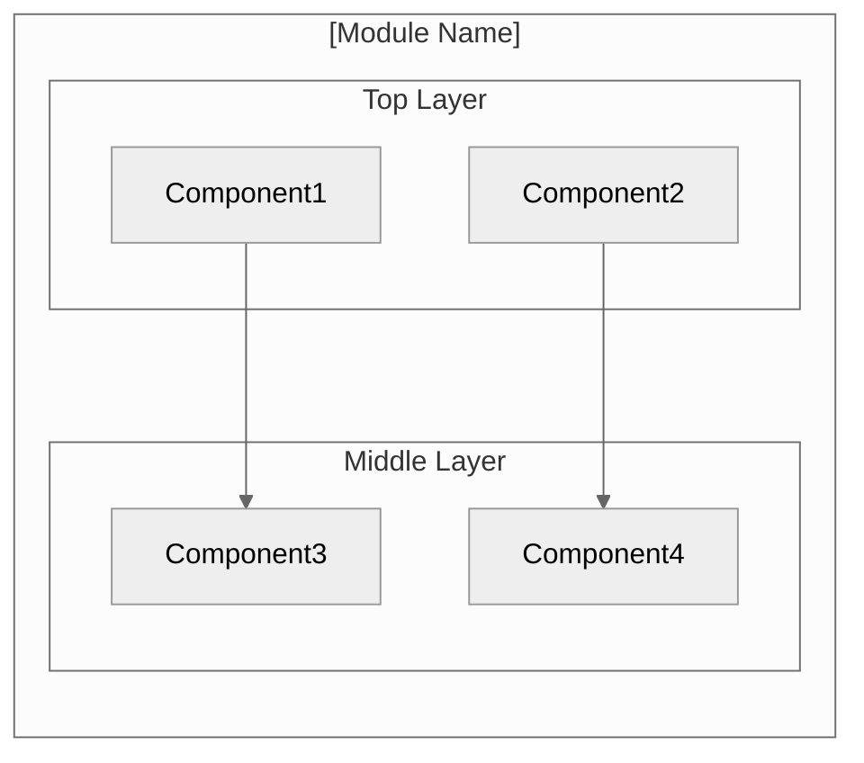
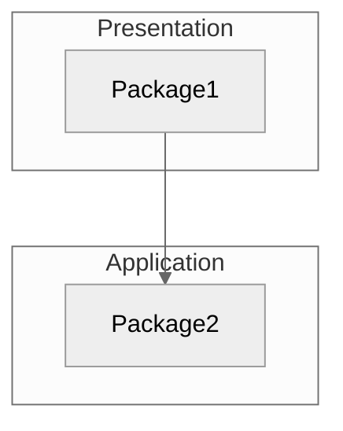
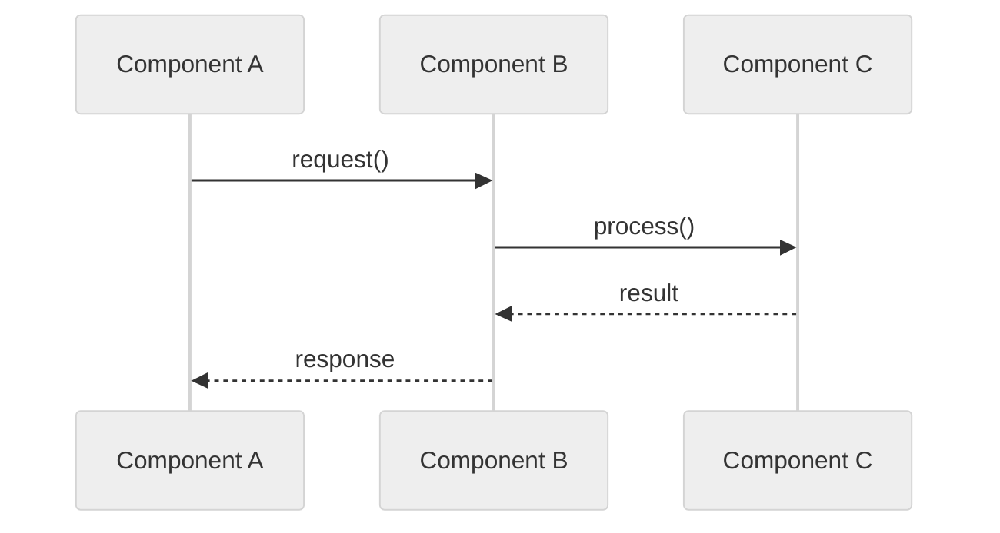
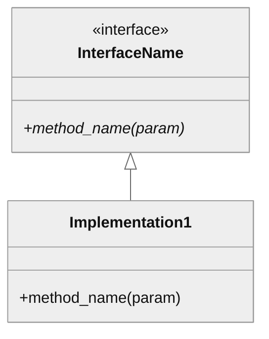

# Generate Architecture Documentation: $ARGUMENTS

Creates standardized architecture documentation at `modules/$ARGUMENTS/docs/architecture.md`.

## Supporting Files

Reference these checklists from this skill directory:
- `checklists/architectural-views.md` - 4+1 view model (Logical, Process, Development, Physical)
- `checklists/design-decisions.md` - 9 key architectural questions to answer
- `checklists/nfr-architecture-mapping.md` - How NFRs influence architecture
- `checklists/pattern-documentation.md` - Format for documenting patterns

## Documentation Guidelines

**CRITICAL**: Follow these guidelines for all documentation:

1. **Language**: English only (code, comments, documentation)
2. **Tone**: Professional, objective, no promotional language
3. **No bias terms**: Avoid "modern", "sophisticated", "elegant", "cutting-edge"
4. **Current state only**: Do not reference migration, legacy, or what was changed
5. **Target audience**: Developers and researchers

## Diagram Guidelines

**Use Mermaid diagrams** with the `neutral` theme for all architecture visualizations.

```
%%{init: {'theme': 'neutral'}}%%
```

**Mermaid Reserved Words** - Do NOT use as node IDs:
- `graph`, `subgraph`, `end`, `style`, `class`, `default`
- Use alternatives: `StateGraph`, `GraphManager`, `EndNode`, etc.

**Diagram Types to Use**:
- `flowchart TB/LR` - Component architecture, data flow
- `sequenceDiagram` - Execution flow between components
- `classDiagram` - Interface hierarchies
- `stateDiagram-v2` - State machines

## Workflow

```
STEP 1: ANALYZE MODULE ──────────────────────────────────────────►
    │  Understand structure, components, patterns
    ▼
STEP 2: CREATE DOCS DIR ─────────────────────────────────────────►
    │  mkdir -p modules/$MODULE/docs
    ▼
STEP 3: GENERATE DOC ────────────────────────────────────────────►
    │  Write architecture.md from template
    ▼
VERIFY ──────────────────────────────────────────────────────────►
```

## Steps

### 1. Analyze Module

First, use the **Skill tool** to invoke the module analysis skill:

```
Skill tool: skill="rv-analyze-module", args="$ARGUMENTS"
```

**IMPORTANT**: You MUST call the Skill tool before proceeding. Wait for results.

This provides:
- Module structure and components
- Key classes and their purposes
- Internal and external dependencies
- Design patterns used

Additionally, verify module exists:

```bash
ls modules/$ARGUMENTS/src/
```

### 2. Create Docs Directory

```bash
mkdir -p modules/$ARGUMENTS/docs
```

### 3. Generate Documentation

Write to `modules/$ARGUMENTS/docs/architecture.md` using template below.

## Template: architecture.md

Reference `checklists/architectural-views.md` for view definitions.

````markdown
# [Module Name] Architecture

## Overview

[One paragraph describing the module's purpose and role in rv-android]

## Key Architectural Decisions

Reference: `checklists/design-decisions.md`

| Decision | Choice | Rationale |
|----------|--------|-----------|
| Application Type | [CLI/Library/Service] | [Why] |
| Structuring | [Layered/Modular/etc.] | [Why] |
| Primary Pattern | [Pattern name] | [Why] |
| Control Strategy | [Event/Call-based] | [Why] |

## Architectural Patterns

Reference: `checklists/pattern-documentation.md`

### Pattern: [Primary Pattern Name]

**Description**: [How this pattern structures the module]

**When Used**: [Why this pattern was chosen]

**Advantages**:
- [Benefit in this context]

**Disadvantages**:
- [Trade-off accepted]

---

## Logical View

Reference: `checklists/architectural-views.md`

Shows key domain entities and their relationships.

### Domain Entities

| Entity | Responsibility |
|--------|----------------|
| [Entity1] | [What it represents] |
| [Entity2] | [What it represents] |

### Component Architecture



---

## Development View

Shows code organization for developers.

### Module Structure

```
module/
├── src/
│   └── package/
│       ├── layer1/
│       └── layer2/
├── tests/
└── pyproject.toml
```

### Package Dependencies



---

## Process View

Shows run-time behavior (include if concurrency is relevant).

### Execution Flow



---

## Core Components

### [Component Name]

**Purpose**: [What it does]

**Location**: `src/[package]/[component].py`

**Key Classes**:
- `ClassName`: [Purpose]

**Dependencies**:
- Internal: [list]
- External: [list]

### [Next Component]
...

---

## NFR Support

Reference: `checklists/nfr-architecture-mapping.md`

How the architecture supports non-functional requirements.

| NFR | Priority | Architectural Support |
|-----|----------|----------------------|
| Performance | P1 | [How architecture enables] |
| Maintainability | P0 | [How architecture enables] |
| Extensibility | P1 | [How architecture enables] |

---

## Key Interfaces

### [Interface/Protocol Name]

```python
class IComponentName(Protocol):
    """Description of interface contract."""

    def method_name(self, param: Type) -> ReturnType:
        """What this method does."""
        ...
```



---

## Scenarios

Key use cases that validate the architecture.

### Scenario 1: [Name]

**Description**: [What happens]

**Flow**:
1. [Step involving logical entities]
2. [Step involving components]
3. [Result]

---

## Extension Points

- **[Extension Point]**: How to extend this module
- **[Configuration]**: How to configure behavior

## Dependencies

### Internal (rv-android modules)

| Module | Purpose |
|--------|---------|
| rv-android-core | [What for] |
| rv-[module] | [What for] |

### External

| Package | Version | Purpose |
|---------|---------|---------|
| package-name | ^X.Y | [What for] |

## Testing Strategy

| Type | Location | Purpose |
|------|----------|---------|
| Unit | tests/unit/ | Isolated component tests |
| Integration | tests/integration/ | Component interaction tests |

## Related Documentation

- [CLAUDE.md](../CLAUDE.md) - Quick reference for Claude
- [ADR-001](./adr/ADR-001.md) - Relevant architectural decision
````

## Documentation Principles

Apply these principles to all generated documentation:

1. **Reader perspective**: Write from the reader's viewpoint. What do they need to know? What will they look for first? Structure content for their workflow, not for comprehensiveness.
2. **No repetition**: State information once in the most logical location. Cross-reference instead of duplicating. If the same fact appears in two sections, one is wrong.
3. **No ambiguity**: Define terminology on first use. Use precise file paths. Prefer concrete examples over abstract descriptions. If a notation is used (diagram, table), explain how to read it.
4. **Standard organization**: Follow the established templates and section order. Consistency across documents reduces cognitive load. Deviations must be justified by content needs.
5. **Capture rationale**: Document WHY, not just WHAT. Every significant choice should have a brief explanation. Future readers need to understand the reasoning to make informed changes.
6. **Currency**: Only document current state (P4). Do not include migration history, version notes, or planned features. If something changed, describe the current behavior only.
7. **Stakeholder awareness**: Know the audience. CLAUDE.md is for LLMs (precise paths, exact commands). architecture.md is for developers (conceptual understanding). README.md is for newcomers (getting started).

## Output

Report what was generated:

```
## Generated: Architecture Documentation

### File Created
- **Path**: modules/[module]/docs/architecture.md
- **Sections**: X

### Architectural Views
- Logical View: ✅ (entities, component diagram)
- Development View: ✅ (module structure, packages)
- Process View: ✅/⏭️ (if concurrency relevant)
- Scenarios: ✅ (at least one)

### Content
- Overview: ✅
- Key Architectural Decisions: ✅
- Architectural Patterns: ✅
- Core Components: ✅
- NFR Support: ✅
- Key Interfaces: ✅
- Dependencies: ✅

### Next Steps
- Review diagrams in VS Code with Mermaid extension
- Test rendering on GitHub
- Create ADRs for significant decisions
- Link to related ADRs
```

## Rules

1. **Follow documentation guidelines** - English, no bias, current state only
2. **Use Mermaid diagrams** - With `%%{init: {'theme': 'neutral'}}%%`
3. **Avoid reserved words** - Don't use `graph`, `end`, `class`, `style` as node IDs
4. **Document decisions** - Not just structure, but why
5. **Include multiple views** - At minimum: Logical, Development, one Scenario
6. **Map NFRs to architecture** - Explain how architecture supports quality attributes
7. **Document patterns** - Name patterns used and their trade-offs
8. **Link to related docs** - Reference CLAUDE.md and ADRs
