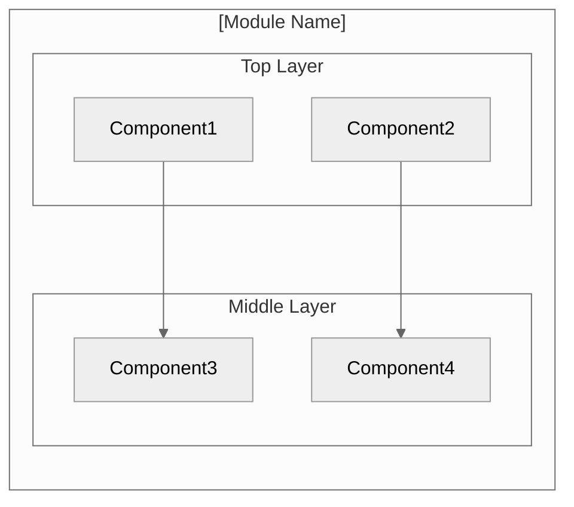
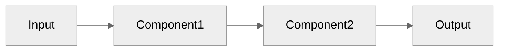
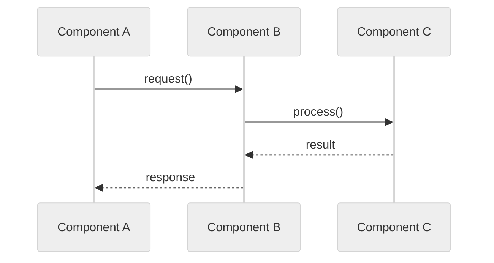
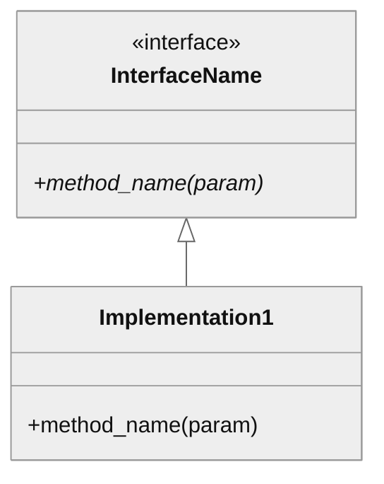

# Generate Architecture Documentation: $ARGUMENTS

Creates standardized architecture documentation at `modules/$ARGUMENTS/docs/architecture.md`.

## Documentation Guidelines

**CRITICAL**: Follow these guidelines for all documentation:

1. **Language**: English only (code, comments, documentation)
2. **Tone**: Professional, objective, no promotional language
3. **No bias terms**: Avoid "modern", "sophisticated", "elegant", "cutting-edge"
4. **Current state only**: Do not reference migration, legacy, or what was changed
5. **Target audience**: Developers and researchers

## Diagram Guidelines

**Use Mermaid diagrams** with the `neutral` theme for all architecture visualizations.

```
%%{init: {'theme': 'neutral'}}%%
```

**Mermaid Reserved Words** - Do NOT use as node IDs:
- `graph`, `subgraph`, `end`, `style`, `class`, `default`
- Use alternatives: `StateGraph`, `GraphManager`, `EndNode`, etc.

**Diagram Types to Use**:
- `flowchart TB/LR` - Component architecture, data flow
- `sequenceDiagram` - Execution flow between components
- `classDiagram` - Interface hierarchies
- `stateDiagram-v2` - State machines

## Workflow

```
STEP 1: ANALYZE MODULE ──────────────────────────────────────────►
    │  Understand structure, components, patterns
    ▼
STEP 2: CREATE DOCS DIR ─────────────────────────────────────────►
    │  mkdir -p modules/$MODULE/docs
    ▼
STEP 3: GENERATE DOC ────────────────────────────────────────────►
    │  Write architecture.md from template
    ▼
VERIFY ──────────────────────────────────────────────────────────►
```

## Steps

### 1. Analyze Module

First, invoke the module analysis skill for comprehensive understanding:

```
Invoke /rv-analyze-module $ARGUMENTS
```

This provides:
- Module structure and components
- Key classes and their purposes
- Internal and external dependencies
- Design patterns used

Additionally, verify module exists:

```bash
ls modules/$ARGUMENTS/src/
```

### 2. Create Docs Directory

```bash
mkdir -p modules/$ARGUMENTS/docs
```

### 3. Generate Documentation

Write to `modules/$ARGUMENTS/docs/architecture.md` using template below.

## Template: architecture.md

````markdown
# [Module Name] Architecture

## Overview

[One paragraph describing the module's purpose and role in rv-android]

## Design Principles

- **[Principle 1]**: [Brief explanation]
- **[Principle 2]**: [Brief explanation]

## Component Architecture



## Core Components

### [Component Name]

**Purpose**: [What it does]

**Location**: `src/[package]/[component].py`

**Key Classes**:
- `ClassName`: [Purpose]

**Dependencies**:
- Internal: [list]
- External: [list]

### [Next Component]
...

## Data Flow



## Execution Flow



## Key Interfaces

### [Interface/Protocol Name]

```python
class IComponentName(Protocol):
    """Description of interface contract."""

    def method_name(self, param: Type) -> ReturnType:
        """What this method does."""
        ...
```



## Extension Points

- **[Extension Point]**: How to extend this module
- **[Configuration]**: How to configure behavior

## Dependencies

### Internal (rv-android modules)

| Module | Purpose |
|--------|---------|
| rv-android-core | [What for] |
| rv-[module] | [What for] |

### External

| Package | Version | Purpose |
|---------|---------|---------|
| package-name | ^X.Y | [What for] |

## Testing Strategy

| Type | Location | Purpose |
|------|----------|---------|
| Unit | tests/unit/ | Isolated component tests |
| Integration | tests/integration/ | Component interaction tests |

## Related Documentation

- [CLAUDE.md](../CLAUDE.md) - Quick reference for Claude
- [ADR-001](./adr/ADR-001.md) - Relevant architectural decision
````

## Output

Report what was generated:

```
## Generated: Architecture Documentation

### File Created
- **Path**: modules/[module]/docs/architecture.md
- **Sections**: X

### Content
- Overview: ✅
- Design Principles: ✅
- Component Architecture (Mermaid): ✅
- Core Components: ✅
- Data Flow (Mermaid): ✅
- Execution Flow (Mermaid): ✅
- Key Interfaces: ✅
- Dependencies: ✅

### Next Steps
- Review diagrams in VS Code with Mermaid extension
- Test rendering on GitHub
- Add specific implementation details
- Link to related ADRs
```

## Rules

1. **Follow documentation guidelines** - English, no bias, current state only
2. **Use Mermaid diagrams** - With `%%{init: {'theme': 'neutral'}}%%`
3. **Avoid reserved words** - Don't use `graph`, `end`, `class`, `style` as node IDs
4. **Keep concise** - Focus on architecture, not implementation details
5. **Link to related docs** - Reference CLAUDE.md and ADRs
