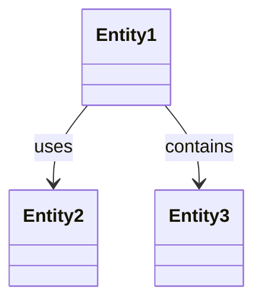
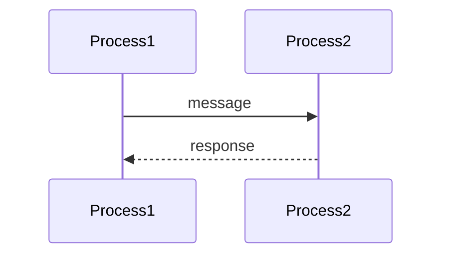
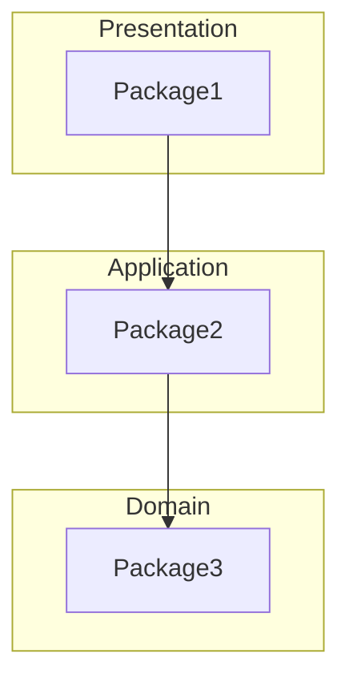
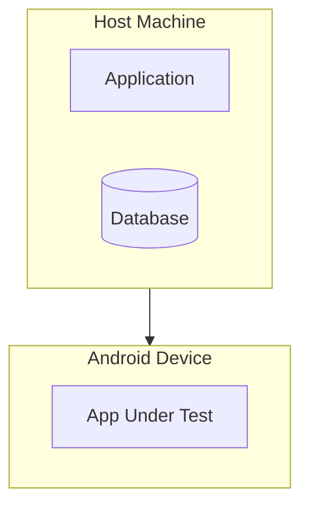
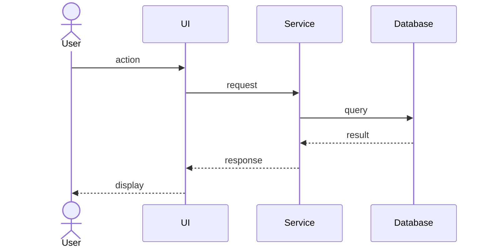

# Architectural Views (4+1 Model)

A complete architecture requires multiple perspectives. No single view captures everything.

---

## The 4+1 View Model

```
                    Use Cases/Scenarios
                          (+1)
                           │
    ┌──────────────────────┼──────────────────────┐
    │                      │                      │
    ▼                      ▼                      ▼
┌─────────┐          ┌─────────┐           ┌─────────┐
│ Logical │◄────────►│ Process │◄─────────►│ Physical│
│  View   │          │  View   │           │  View   │
└────┬────┘          └────┬────┘           └────┬────┘
     │                    │                     │
     └────────────────────┼─────────────────────┘
                          │
                    ┌─────────┐
                    │ Develop │
                    │  View   │
                    └─────────┘
```

---

## View 1: Logical View

**Purpose**: Shows key abstractions as objects or classes.

**Audience**: Architects, developers understanding domain.

**Questions Answered**:
- What are the main domain entities?
- How do they relate to each other?
- What are the system's key abstractions?

**Contents**:
- Class diagrams (high-level)
- Entity relationships
- Key domain objects
- Responsibilities allocation

**Template**:
```markdown
## Logical View

### Domain Entities

| Entity | Responsibility |
|--------|----------------|
| [Entity1] | [What it represents] |
| [Entity2] | [What it represents] |

### Entity Relationships



### Key Abstractions

- **[Abstraction]**: [What it represents in the domain]
```

---

## View 2: Process View

**Purpose**: Shows run-time composition of interacting processes.

**Audience**: Performance engineers, operations.

**Questions Answered**:
- What processes exist at run-time?
- How do they communicate?
- What are the concurrency concerns?

**Contents**:
- Process diagrams
- Inter-process communication
- Synchronization mechanisms
- Thread pools, executors

**Template**:
```markdown
## Process View

### Runtime Processes

| Process | Purpose | Type |
|---------|---------|------|
| [Process1] | [What it does] | Thread/Process |

### Process Communication



### Concurrency Model

[Description of how concurrency is handled]
```

---

## View 3: Development View

**Purpose**: Shows software decomposition for development.

**Audience**: Developers, build engineers.

**Questions Answered**:
- How is the code organized?
- What modules exist?
- What are the build dependencies?

**Contents**:
- Package diagrams
- Module organization
- Build structure
- Layer assignments

**Template**:
```markdown
## Development View

### Module Organization

```
module/
├── src/
│   └── package/
│       ├── layer1/
│       └── layer2/
├── tests/
└── pyproject.toml
```

### Package Dependencies



### Build Dependencies

| Module | Depends On | Type |
|--------|------------|------|
| [module] | [dependency] | Internal/External |
```

---

## View 4: Physical View

**Purpose**: Shows hardware topology and software distribution.

**Audience**: System administrators, deployment engineers.

**Questions Answered**:
- What hardware is needed?
- How is software distributed across nodes?
- What are the network requirements?

**Contents**:
- Deployment diagrams
- Node specifications
- Network topology
- Scalability considerations

**Template**:
```markdown
## Physical View

### Deployment Topology



### Hardware Requirements

| Component | Specification |
|-----------|---------------|
| Host | [Requirements] |
| Device | [Requirements] |

### Network Requirements

[Network configuration and protocols]
```

---

## View +1: Use Cases / Scenarios

**Purpose**: Relates the other views through concrete scenarios.

**Audience**: All stakeholders.

**Questions Answered**:
- How do the views work together?
- What are the key usage scenarios?
- How does data flow through the system?

**Contents**:
- Key use cases
- Scenario walkthroughs
- End-to-end flows

**Template**:
```markdown
## Scenarios

### Scenario 1: [Name]

**Description**: [What happens]

**Flow**:
1. User does X (triggers Logical View entities)
2. Process A handles request (Process View)
3. Module M processes (Development View)
4. Deployed on Node N (Physical View)
5. Result returned

### End-to-End Flow


```

---

## When to Use Each View

| View | When to Document |
|------|------------------|
| **Logical** | Always - forms the foundation |
| **Process** | When concurrency, performance matter |
| **Development** | Always - helps developers navigate |
| **Physical** | For distributed or deployed systems |
| **Scenarios** | Always - validates the architecture |

---

## Minimum Documentation

For most modules, document at least:

1. **Logical View** - Component architecture
2. **Development View** - Package organization
3. **Key Scenarios** - Main use cases

Add other views when:
- Process View: System has significant concurrency
- Physical View: System is distributed or deployed

---

## Checklist

Before finalizing architecture documentation:

- [ ] Logical View shows key entities and relationships
- [ ] Development View shows code organization
- [ ] At least one scenario documented
- [ ] Views are consistent with each other
- [ ] Specification Alignment section present with FRs from domain spec
- [ ] FRs (from `openspec/specs/<domain>/spec.md`) traceable to architectural components
- [ ] NFRs use PRD IDs (NFR01-08 from `docs/PRD.md` Section 7)
- [ ] Key invariants (INV-XX-NN) documented with enforcement mechanisms
- [ ] At least 2 specification scenarios traced through architecture
- [ ] Related Documentation includes domain spec and PRD links
