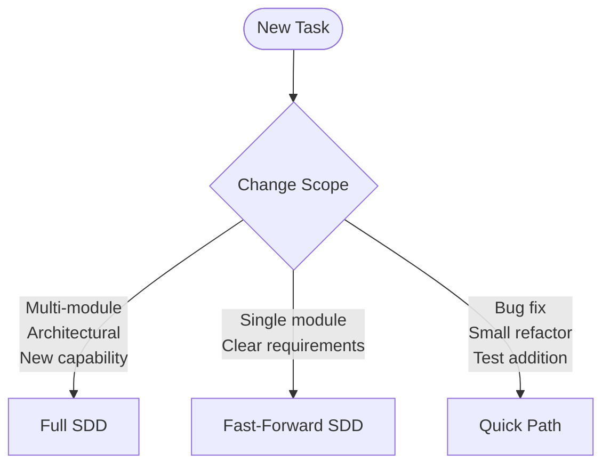

# CLAUDE.md

This file provides guidance to Claude Code (claude.ai/code) when working with code in this repository.

## Project Architecture Overview

RV-Android is a modular framework for runtime verification of Android applications with LLM-driven testing capabilities. The system uses a Poetry workspace architecture with modules in the `modules` directory.

### Core Architecture Principles

- **Modular Design**: Independent Poetry modules with clear dependencies and interfaces
- **Event-Driven Communication**: EventBus system for coordinated interaction between components
- **Component-Based Execution**: TaskExecutor uses pluggable components for different execution phases
- **Configuration Management**: Unified configuration across all modules using Pydantic models
- **Error Handling**: Error handling with proper context and recovery strategies

### System Modules

The system consists of the following modules:

**Core Infrastructure:**
1. **rv-android-core**: Foundation infrastructure with domain models, event system, error handling, and logging
2. **rv-platform**: Central execution platform coordinating task execution and result processing
3. **rv-tools**: Testing tool plugin system with registry and factory patterns
4. **rv-uiautomator**: Shared UIAutomator components for direct device interaction

**Analysis and Processing:**
5. **rv-monitor-generator**: JavaMOP/RV-Monitor integration for generating runtime verification monitors
6. **rv-instrumentation**: APK instrumentation with monitor weaving capabilities
7. **rv-static-analysis**: Static analysis tools (GATOR, GESDA, REACH) for Android applications
8. **rv-coverage**: Coverage analysis and tracking for monitored operations
9. **rv-screen-parser**: Android UI parsing with visitor patterns for state analysis

**LLM Testing:**
10. **rv-agent**: Main LLM-driven testing tool using LangGraph for workflow orchestration
11. **rv-llm**: LLM client abstraction and integration layer

**Experiment Orchestration:**
12. **rv-experiment**: Experiment orchestration and coordination system
13. **rv-agent-validation**: Validation framework for rv-agent testing and benchmarking

## Development Commands

### Environment Setup
```bash
# Set environment variables
export RV_PYDANTIC=true  # Enable validation during development
export RVSEC_HOME="/path/to/rvsec"  # Required for monitor generation and static analysis
export ANDROID_HOME="/path/to/android-sdk"

# Install all modules (Poetry workspace with editable mode)
cd modules
./install.sh

# Or directly from root
poetry install

# Verify installation
poetry run python -c "import rv_android_core, rv_agent; print('Setup complete')"
```

### Poetry Workspace Architecture

The project uses **Poetry workspaces** with all modules defined in the root `pyproject.toml` with `develop = true`. This means:

1. **Single `poetry install`** at root installs ALL modules in editable mode
2. **Source changes are immediate** - no reinstall needed after editing code
3. **Shared virtual environment** - all modules use the root `.venv`

```bash
# Root pyproject.toml structure:
[tool.poetry.dependencies]
rv-android-core = {path = "modules/rv-android-core", develop = true}
rv-agent = {path = "modules/rv-agent", develop = true}
# ... all other modules
```

### Common Development Tasks
```bash
# Run all tests from workspace root
poetry run pytest

# Test specific module
poetry run pytest modules/rv-android-core/tests/ -v

# Reinstall all modules (only needed if pyproject.toml changes)
cd modules && ./install.sh
# Or: poetry install --sync  (removes unused packages)

# Verify modules are editable
./modules/install.sh --verify

# Run with coverage
poetry run pytest --cov=modules --cov-report=html

# Generate configuration templates
poetry run rv-experiment config --template-type basic --output basic_config.json
```

### Monitor Generation Workflow
```bash
# Generate JCA cryptography monitors
poetry run rv-monitor-generator generate \
  --specs-dir $RVSEC_HOME/rvsec/rvsec-mop/src/main/resources/jca \
  --output ./output/jca-monitors

# Auto-discover specifications
poetry run rv-monitor-generator generate --output ./output/auto-monitors
```

### Experiment Execution
```bash
# Run complete experiment
poetry run python run_test_framework.py

# Execute with specific configuration
poetry run rv-experiment run --tools monkey,droidbot:dfs_greedy --specification-set jca

# Run rv-platform directly
poetry run rv-platform run --tools monkey --apks-dir ./apks_examples
```

### RV-Agent Commands

RV-Agent can run in two modes:
1. **Standalone CLI** (`rv-agent`): User manages emulator and APK installation
2. **Via rv-experiment** (`rvagent` tool): Platform manages emulator and APK installation

#### Standalone Mode (requires manual setup)
```bash
# Prerequisites:
# 1. Start emulator
./scripts/run_emulator.sh
# 2. Wait for device
adb wait-for-device
# 3. Install APK
adb install apks_examples/cryptoapp.apk

# Run with pure algorithm (no LLM needed - quick testing)
cd modules/rv-agent
poetry run rv-agent run --package br.unb.cic.cryptoapp --mode pure_algorithm --timeout 60

# Run with multimode (requires SGLang server)
poetry run rv-agent run --package br.unb.cic.cryptoapp --mode multimode --timeout 300

# Test device connection
poetry run rv-agent test
```

#### Via rv-experiment (recommended - handles emulator and APK)

**IMPORTANT**: Set RVSEC_HOME for static analysis (WTG, REACH, GESDA):
```bash
export RVSEC_HOME=/path/to/rvsec  # Required for full functionality
```

Without RVSEC_HOME, rv-experiment will run but skip static analysis and instrumentation.

```bash
# Run with rvagent tool (note: no hyphen in tool name)
# Headless mode (default)
poetry run rv-experiment run --tools rvagent:pure_algorithm --apks-dir ./apks_examples --timeout 60 --no-window

# With emulator window visible
poetry run rv-experiment run --tools rvagent:pure_algorithm --apks-dir ./apks_examples --timeout 60 --window

# Run multimode (requires SGLang server)
poetry run rv-experiment run --tools rvagent:multimode --apks-dir ./apks_examples --timeout 300

# Multiple tools
poetry run rv-experiment run --tools monkey,rvagent:multimode --apks-dir ./apks_examples
```

### Code Quality and Linting
```bash
# Format code
poetry run black modules/

# Lint code
poetry run flake8 modules/

# Type checking
poetry run mypy modules/

# Security analysis
poetry run bandit -r modules/
```

## Execution Flow

### Primary Entry Points

1. **rv-experiment CLI** (`modules/rv-experiment/src/rv_experiment/__main__.py`):
   - Main experiment orchestration interface
   - Supports tool specification DSL and configuration files
   - Coordinates three-phase workflow (pre-processing, execution, post-processing)

2. **rv-platform CLI** (`modules/rv-platform/src/rv_platform/__main__.py`):
   - Direct platform execution without experiment wrapper
   - Task generation and execution coordination
   - Result processing and metrics collection

3. **rv-agent CLI** (`modules/rv-agent/src/rv_agent/cli/main.py`):
   - Standalone LLM-driven testing tool
   - Supports multiple execution modes (pure_algorithm, llm_only, multimode)
   - Requires: emulator running + APK installed (use `rv-agent install <apk>`)
   - Can also run via rv-experiment as `rvagent` tool (platform manages emulator/APK)
   - Can run independently or through rv-platform

### Core Execution Flow

1. **Experiment Controller** (`modules/rv-experiment/src/rv_experiment/experiment/experiment_controller.py`):
   - Orchestrates complete experiment lifecycle
   - Manages pre-processing (instrumentation, static analysis)
   - Delegates execution to rv-platform via ExecutionController
   - Handles post-processing and cleanup

2. **Platform** (`modules/rv-platform/src/rv_platform/platform.py`):
   - Central execution engine for Android testing tasks
   - Generates tasks from APK discovery and tool configurations
   - Manages task execution through TaskExecutor with component-based architecture
   - Processes results and generates reports

3. **Task Executor** (`modules/rv-platform/src/rv_platform/execution/executor.py`):
   - Component-based task execution with proper lifecycle management
   - Coordinates emulator, static analysis, coverage, logcat, and tool execution components
   - Manages Android emulator sessions and application installation
   - Provides error handling and performance monitoring

### RV-Agent Integration

1. **RVAgent** (`modules/rv-agent/src/rv_agent/agent/rv_agent.py`):
   - LLM-guided Android application testing using LangGraph
   - Supports three execution modes: pure_algorithm, llm_only, multimode
   - Uses SGLang (OpenAI-compatible API) as LLM backend
   - Externalized workflow nodes in `agent/nodes/` directory

2. **Workflow Nodes** (`modules/rv-agent/src/rv_agent/agent/nodes/`):
   - `parse_node.py`: UI capture and parsing
   - `decision_node.py`: LLM/algorithm routing
   - `algorithm_node.py`: Algorithmic action generation
   - `llm_node.py`: LLM-based action generation
   - `validation_node.py`: Action validation and loop detection
   - `execute_node.py`: Device action execution
   - `learn_node.py`: Memory updates and stuck detection

3. **RVAgentStrategy** (`modules/rv-agent/src/rv_agent/strategies/rvagent_strategy/`):
   - Main exploration strategy with DFS-based traversal
   - Successor Tracker for handling state transitions
   - Plateau Detector for stagnation detection
   - MOP Prioritization for security-sensitive method coverage

4. **LLMClient** (`modules/rv-agent/src/rv_agent/llm/llm_client.py`):
   - LLM interaction and tool call handling
   - Configured for Qwen3-VL model via SGLang

## Module Dependencies and Relationships

### Core Infrastructure Modules
- **rv-android-core**: Provides foundation services (EventBus, ErrorHandler, LoggingManager, domain models)
- **rv-tools**: Tool registry and plugin system used by all testing components
- **rv-uiautomator**: Shared UIAutomator components for device interaction

### Analysis and Processing Modules
- **rv-static-analysis**: Provides static analysis data to other modules
- **rv-coverage**: Tracks coverage during task execution
- **rv-screen-parser**: UI parsing for state analysis in LLM-driven testing
- **rv-monitor-generator**: Creates runtime verification monitors for instrumentation

### Execution and Orchestration
- **rv-platform**: Central execution engine used by rv-experiment
- **rv-experiment**: Experiment orchestration with pre/post processing
- **rv-agent**: Main LLM-driven testing tool
- **rv-instrumentation**: APK instrumentation using monitors from rv-monitor-generator

## Configuration Management

### Environment Variables
- `RV_PYDANTIC=true`: Enable development validation (recommended during development)
- `RVSEC_HOME`: Required for monitor generation (path to RVSEC installation)
- `ANDROID_HOME`: Android SDK path for emulator management
- `RVAGENT_MODE`: Override rv-agent execution mode (pure_algorithm, llm_only, multimode)

### Configuration Files
- Tool configurations support unified configuration through Pydantic models
- Experiment configurations in JSON format with validation
- Module-specific configuration classes with composition patterns

## Directory Structure and Cleanup

### Output Directory Structure
```
rv-android/
├── apks_examples/              # Source APKs (input, not cleaned)
├── out/                        # Temporary artifacts (cleaned by clear.sh)
│   ├── monitors/               # Generated monitors from rv-monitor-generator
│   ├── instrumented_apks/      # APKs with monitors woven by rv-instrumentation
│   └── static_analysis/        # GATOR, GESDA, REACH output files
├── results/                    # Persistent experiment results
│   └── <experiment_id>/        # Per-experiment directory
│       └── <apk_name>/         # Per-APK results
│           ├── coverage.csv    # Per-method coverage data
│           ├── errors.csv      # Monitored operations violations
│           ├── summary.csv     # Aggregate metrics per task
│           ├── results.json    # Complete experiment data (JSON)
│           ├── performance.csv # Task execution timing
│           └── tasks.json      # Task state persistence
├── tmp/, rvm_tmp/, lib_tmp/    # Various temporary files
├── sootOutput/                 # Soot compiler output
└── clear.sh                    # Cleanup script
```

### Cleanup Script (clear.sh)
Located at project root: `./clear.sh`

```bash
# Clean temporary artifacts only (keeps results/)
./clear.sh

# Clean everything including experiment results
./clear.sh --clean-results

# Show help
./clear.sh --help
```

**What gets cleaned:**
- `out/` - Default output directory with monitors/, instrumented_apks/, static_analysis/
- `tmp/`, `rvm_tmp/`, `lib_tmp/` - Temporary files
- `sootOutput/` - Soot compiler output
- `output/`, `mop_out/` - Legacy directories
- `__pycache__/` - Python cache
- `*.dex`, `ajcore*.txt` - Compilation artifacts

**What is preserved (unless --clean-results):**
- `results/` - Persistent experiment results
- `apks_examples/` - Source APKs

### Pre-Experiment Cleanup
Before running experiments, clean previous artifacts:
```bash
# Recommended: clean artifacts but keep results
./clear.sh

# Full clean for fresh start
./clear.sh --clean-results
```

### Reusing Pre-Processed Artifacts (--skip-* flags)

When running experiments with `--skip-monitors`, `--skip-instrument`, or `--skip-static` flags, **the `--apks-dir` must point to the instrumented APKs directory** from a previous pre-processing run, not the original APKs directory.

**Why**: The `--skip-*` flags assume pre-processing was already done. If you point to original (non-instrumented) APKs, the experiment will run but coverage will be 0% because the APKs don't have runtime verification monitors.

```bash
# WRONG: Skipping pre-processing but pointing to original APKs
# Coverage will be 0% because APKs are not instrumented
rv-experiment run \
  --tools rvagent:pure_algorithm \
  --apks-dir ./apks_examples \
  --skip-monitors --skip-instrument --skip-static

# CORRECT: Point to instrumented APKs from a previous run
# First, run full pre-processing (or find existing instrumented APKs)
rv-experiment run --tools monkey --specification-set jca

# Then reuse instrumented APKs (found in results/<experiment_id>/instrumented_apks/)
rv-experiment run \
  --tools rvagent:pure_algorithm \
  --apks-dir ./results/cli_experiment_20260127_150952_ce3eec6c/instrumented_apks \
  --skip-monitors --skip-instrument --skip-static
```

**Pre-processed artifact locations** (from a completed experiment):
- `results/<experiment_id>/instrumented_apks/` - Instrumented APKs with monitors
- `results/<experiment_id>/static_analysis/` - Static analysis output (GATOR, GESDA, REACH)
- `out/monitors/` - Generated monitors (may be cleaned by clear.sh)

## Key Architectural Patterns

### Event-Driven Architecture
- EventBus system (`rv_android_core.event.bus`) coordinates communication
- Components publish lifecycle, task, and error events
- Event handlers provide system monitoring and coordination

### Component-Based Execution
- TaskExecutor uses pluggable components for different execution phases
- Components follow initialize/execute/cleanup lifecycle
- Proper resource management and error handling

### Factory and Registry Patterns
- ToolFactory creates configured tool instances
- ToolRegistry manages available tools and variants
- AgentFactory creates configured rv-agent instances

### Error Handling Strategy
- ErrorHandler decorator provides consistent error management
- Context-aware error reporting with proper logging
- Graceful degradation and recovery mechanisms

## Testing Strategy

### Test Organization
```bash
# Fast unit tests (no external dependencies)
poetry run pytest -m "not slow" -v

# Integration tests (requires RVSEC)
poetry run pytest -m "slow" -v

# Module-specific testing
poetry run pytest modules/MODULE_NAME/tests/ -v
```

### RV-Agent Test Structure

The rv-agent module has a well-organized test structure in `modules/rv-agent/tests/`:

| Directory | Purpose | Command |
|-----------|---------|---------|
| `unit/` | Isolated unit tests (no external deps) | `pytest tests/unit/ -v` |
| `integration/` | Component integration tests | `pytest tests/integration/ -v` |
| `smoke/` | Quick sanity checks | `pytest tests/smoke/ -v` |
| `online/` | Tests requiring device/LLM server | `pytest tests/online/ -v` |
| `performance/` | Performance and latency tests | `pytest tests/performance/ -v` |
| `regression/` | Regression tests | `pytest tests/regression/ -v` |
| `system/` | Full system tests | `pytest tests/system/ -v` |
| `fixtures/` | Test data (screenshots, XML dumps) | N/A |

**Running rv-agent tests:**
```bash
cd modules/rv-agent

# Unit tests only (fast, no external dependencies)
PYTHONPATH=../rv-android-core/src:src poetry run pytest tests/unit/ -v

# Smoke tests (quick sanity checks)
PYTHONPATH=../rv-android-core/src:src poetry run pytest tests/smoke/ -v

# All tests
PYTHONPATH=../rv-android-core/src:src poetry run pytest tests/ -v
```

### Test Categories
- Unit tests for individual components and functions
- Integration tests for module interactions
- End-to-end tests for complete workflows
- Performance tests for optimization validation

### Test Data and Datasets
- **Primary screenshot dataset**: `/home/pedro/desenvolvimento/RV_ANDROID/teste_llm/screenshots`
  - Contains screenshots from 28+ Android apps for LLM testing
  - Organized by app package name (e.g., `cryptoapp/`, `hashpass/`, `ludo/`)
- **Project test fixtures**: `modules/rv-agent/tests/fixtures/screenshots/`
  - Curated screenshots for unit and integration tests
  - Includes: cryptoapp, hashpass, ludo
- **UI dump fixtures**: `modules/rv-agent/tests/fixtures/ui_dumps/`
  - UIAutomator XML dumps corresponding to screenshots

## Development Guidelines

### Code Structure and Comments
- Use English for all code and comments
- Include detailed comments at critical architectural points
- Comments should reflect current state only (not migration history or "what was done")
- Avoid promotional language and bias terms (no "modern", "sophisticated", "elegant", etc.)
- Target audience: developers and researchers
- Follow the comment template in: `EventBus`, `ExecutionManager`, `TaskExecutor`

### Constants
- Use constants instead of magic values whenever possible
- Main constant files:
  - `modules/rv-android-core/src/rv_android_core/constants.py`
  - `modules/rv-experiment/src/rv_experiment/constants.py`
  - `modules/rv-llm/src/rv_llm/llm/constants.py`
- Each module may have its own constants file

### Error Handling
- Use ErrorHandler decorators for consistent error management
- Provide meaningful error messages with context
- Implement proper cleanup in error scenarios
- Log errors with appropriate context information

### Configuration Management
- Use unified configuration objects instead of parameter duplication
- Validate configuration at module boundaries
- Provide clear configuration schemas and examples
- Support both programmatic and file-based configuration

### Performance Considerations
- Use PerformanceMonitor for metrics collection
- Implement lazy initialization where appropriate
- Proper resource cleanup and lifecycle management
- Monitor memory usage in long-running operations

## Important Implementation Notes

### Code Evolution Guidelines
- **Complete implementation**: All changes must be fully implemented, not partial
- **No legacy wrappers**: Do not use adapters, shims, or compatibility layers for old code
- **Remove, don't wrap**: Legacy code must be removed or overwritten, never wrapped
- **Backup first**: Move old files to `backup/` directory before replacement
- **Update references**: All imports and references must point to new implementations
- **Simplicity**: Prefer simple, elegant solutions over complex ones

### Module Interactions
- rv-experiment coordinates but does not duplicate rv-platform functionality
- rv-platform handles all task execution and result processing
- Clean separation between orchestration (rv-experiment) and execution (rv-platform)
- rv-agent integrates with rv-platform through the tool plugin system

### Instrumentation and Monitoring
- Monitor generation requires RVSEC_HOME environment variable
- APK instrumentation creates monitored versions for runtime verification
- Coverage tracking coordinates with tool execution timing
- Static analysis provides foundation data for other analysis modules

### Specification Sets (Runtime Verification)
The system supports two distinct specification sets for runtime verification:

1. **JCA Specifications**: Detect misuse of Java Cryptography Architecture (JCA) API
   - Example: Proper initialization of ciphers, key generation, secure random

2. **Generic Specifications**: Detect violations of general API usage patterns
   - Example: Must call `hasNext()` before `next()` on Iterator
   - Example: Must close streams after use

**Important**: These sets are used separately in experiments. In one experiment, APKs are instrumented with JCA specifications; in another, with generic specifications. The term "MOP" (Monitored Operations) refers to operations being monitored by ANY specification, not specifically security-related operations. Do not use "security" terminology when referring to MOP - use "monitored operations" instead.

### RV-Agent Specifics
- Uses LangGraph for workflow orchestration
- SGLang server required for LLM backend (default: http://192.168.0.36:30000/v1)
- Default model: Qwen/Qwen3-VL-4B-Instruct
- Multimode default: 70% LLM / 30% algorithm decisions

### Tool Calling Híbrido (Qwen3-VL + SGLang)

**Contexto**: O SGLang não possui suporte oficial a tool calling para modelos Qwen3-VL (vision/multimodal). O comportamento observado é não-determinístico: ~50% native tool_calls, ~50% XML no content.

**Decisão (2026-01-07)**: Usar abordagem híbrida com fallback parser.

**Fluxo**:
1. LangChain `bind_tools()` tenta obter `response.tool_calls` (native)
2. Se vazio, `tool_call_parser.py` extrai do `response.content` (XML/JSON)
3. Ambas as estratégias funcionam com 100% de sucesso

**Estratégias de parsing** (em ordem de prioridade):
- `native`: tool_calls estruturados da API
- `xml`: tags `<tool_call>` no content (formato Hermes)
- `json_array`, `json_object`, `markdown`, `pythonic`: fallbacks adicionais

**Observações**:
- Latência XML (~700ms) é menor que native (~1500ms) devido a menos tokens gerados
- Parser robusto em `rv_agent/llm/tools/tool_call_parser.py`
- Métricas coletadas via `parser_stats.get_stats()`

**Documentação completa**: `/home/pedro/desenvolvimento/workspaces/workspaces-doutorado/workspace-rv/rvsec-vision-llm/docs/022_problema_sglang_native_tools.md`

### Qwen3-VL Coordinate System
- Qwen3-VL returns coordinates in normalized [0, 1000) range for both x and y
- Conversion to device pixels: `pixel_x = int((x / 1000) * device_width)`
- `ActionNormalizer` in `domain/action.py` handles this conversion using `denormalize_qwen_coords()`
- Reference: https://github.com/QwenLM/Qwen3-VL/issues/1486
- Validated empirically: 84.2% hit rate with 20 apps (see `docs/20260107_rvagent_validacao_multimodal.md`)

---

## Current Work

### Active Tasks (2026-01-06)

**Status**: Integração do TransitionManager (WTG) no rv-agent

**Documentos Relevantes**:
- `docs/20260105_rvagent_refactoring.md` - Plano de refatoração com 3 melhorias
- `docs/20251231_rvagent_validacao.md` - Plano de validação extensiva (Seção 13 adicionada)

**Contexto**:
Integração do TransitionManager para guiar exploração usando Window Transition Graph (WTG) da análise estática.

**TransitionManager Integration** (2026-01-06):
- ✅ TransitionManager criado em `services/transition_manager.py`
- ✅ Integrado em `agent_factory.py` (criação)
- ✅ Integrado em `strategy_registry.py` (passagem de parâmetro)
- ✅ Integrado em `rvagent_strategy.py` (uso via `_get_wtg_guided_action`)
- ✅ **NavigationGuidance** criado em `services/navigation_guidance.py` (abstração unificada)
- ✅ Integrado em `llm_client.py` (parâmetro navigation_hint)
- ✅ Integrado em `llm_node.py` (obtém guidance e passa para LLM)
- ✅ Integrado em `prompts/v12.py` (build_user_message aceita navigation_hint)

**Melhorias Planejadas** (3 de alta prioridade):
1. **Failed Actions Tracking**: Evitar re-execução de ações que causaram crash
2. **UI Mutation Detection**: Detectar mudanças de estado enabled/disabled/checked
3. **Scroll Detection**: Revelar conteúdo oculto em listas e views scrollable

**Fluxo de Trabalho**:
1. ✅ Análise de sugestões de outras LLMs
2. ✅ Criação do plano de refatoração (`docs/20260106_rvagent_refactoring.md`)
3. ✅ Integração do TransitionManager (algoritmo)
4. ⏳ Integração do TransitionManager (LLM) - ver TODO acima
5. ⏳ Executar validação baseline (14 apps, 4 estratégias)
6. ⏳ Analisar resultados e refinar plano
7. ⏳ Implementar melhorias restantes
8. ⏳ Validar novamente e comparar com baseline

**Arquivos Principais do rv-agent**:
- `modules/rv-agent/src/rv_agent/agent/rv_agent.py` - Agente principal (LangGraph)
- `modules/rv-agent/src/rv_agent/agent/nodes/` - Nodes externalizados do workflow
- `modules/rv-agent/src/rv_agent/agent/dynamic_state_graph.py` - Grafo de estados
- `modules/rv-agent/src/rv_agent/strategies/rvagent_strategy/` - Estratégia principal
- `modules/rv-agent/src/rv_agent/strategies/base_strategy.py` - Classe base de estratégias
- `modules/rv-agent/src/rv_agent/services/transition_manager.py` - Integração WTG + DynamicGraph
- `modules/rv-agent/src/rv_agent/services/navigation_guidance.py` - Abstração unificada para LLM e algoritmo
- `modules/rv-agent/src/rv_agent/routing/` - Routing entre LLM e algoritmo
- `modules/rv-agent/src/rv_agent/llm/llm_client.py` - Cliente LLM com navigation_hint
- `modules/rv-agent/src/rv_agent/prompts/v12.py` - Prompt com suporte a navigation guidance

---

## Skills and Agents

**Full documentation**: See `.claude/AGENTS.md` for complete reference.

### Quick Reference

**Skills** (invoke via `/skill-name`):
- `/rv-analyze-*` - Code analysis (complexity, dependencies, dead-code, module, file)
- `/rv-refactor-*` - Refactoring (simplify, extract, cleanup, constants)
- `/rv-test-*` - Testing (run, add)
- `/rv-qa-*` - Quality (lint, lint-fix)
- `/rv-verify` - Run all checks (tests + lint + type)
- `/rv-impact-analyzer` - Change impact analysis
- `/rv-debug-regression` - Regression bug investigation
- `/rv-doc-*` - Documentation (generate-claude-md, docs-sync)

**Agents** (auto-delegated by Claude):
- `rv-refactor` - Code restructuring workflow
- `rv-feature` - Feature implementation workflow
- `rv-tdd` - Test-driven development workflow
- `rv-cleanup` - Dead code removal workflow
- `rv-code-reviewer` - Code review (final gate)

### Directory Structure

```
.claude/
├── AGENTS.md                # Full documentation (authoritative)
├── project-info.md          # Quick reference (paths, env vars)
├── agents/                  # Orchestrator agents + supporting files
│   ├── rv-*.md              # Agent definitions
│   └── rv-*/                # Templates, checklists, examples
└── skills/                  # Invocable skills
    └── rv-*/SKILL.md        # Skill definitions
```

---

## SDD Artifacts (Spec-Driven Development)

The system is documented via Spec-Driven Development. Specs document current behavior; changes follow the OpenSpec workflow.

### Key Artifacts

| Artifact | Path | Description |
|----------|------|-------------|
| **PRD** | `docs/PRD.md` | Product Requirements Document (37 FRs, 8 NFRs) |
| **Plan** | `docs/20260209_plano_spec_driven.md` | SDD adoption plan |
| **Config** | `openspec/config.yaml` | OpenSpec rules and conventions |

### Domain Specifications (7)

| Domain | Path | Modules | FRs |
|--------|------|---------|-----|
| Core | `openspec/specs/core/spec.md` | rv-android-core | FR33-FR37 |
| Platform | `openspec/specs/platform/spec.md` | rv-platform | FR07-FR11, FR14 |
| Experiment | `openspec/specs/experiment/spec.md` | rv-experiment | FR15-FR17 |
| Agent | `openspec/specs/agent/spec.md` | rv-agent, rv-llm | FR21-FR32 |
| Instrumentation | `openspec/specs/instrumentation/spec.md` | rv-monitor-generator, rv-instrumentation | FR01-FR03 |
| Analysis | `openspec/specs/analysis/spec.md` | rv-static-analysis, rv-coverage, rv-screen-parser | FR04-FR06, FR12-FR13 |
| Tools | `openspec/specs/tools/spec.md` | rv-tools, rv-uiautomator | FR18-FR20 |

### Templates

| Template | Path |
|----------|------|
| Spec | `docs/templates/spec-template.md` |
| Design | `docs/templates/design-template.md` |
| ADR | `docs/templates/adr-template.md` |

### Making Changes

All non-trivial changes follow the OpenSpec workflow. See `docs/WORKFLOW.md` for track selection (Full SDD, Fast-Forward SDD, or Quick Path). Specs are updated via delta specs in changes, then synced to main specs via `/opsx:sync`.

---

## Development Workflows

**Full reference**: See `docs/WORKFLOW.md` for detailed workflow documentation with examples.
**Skill reference**: See `.claude/AGENTS.md` for complete skill and agent documentation.

### Workflow Track Selection

Match workflow formality to change scope. Three tracks:



| Track | When | Phases |
|-------|------|--------|
| **Full SDD** | Multi-module, architectural, new features | Explore -> Propose -> Design -> Implement -> Verify -> Archive |
| **Fast-Forward SDD** | Single module, clear requirements | Explore -> Fast-Forward -> Implement -> Close |
| **Quick Path** | Bug fixes, refactoring, test additions | Analyze -> Fix -> Verify |

### Full SDD (6 phases)

| Phase | OpenSpec | RV Skills |
|-------|----------|-----------|
| 1. Explore | `/opsx:explore` | `/rv-analyze-module`, `/rv-impact-analyzer` |
| 2. Propose | `/opsx:new` + `/opsx:continue` (x2) | -- |
| 3. Design | `/opsx:continue` (x2) | `/rv-doc-adr` (if architectural) |
| 4. Implement | `/opsx:apply` | `/rv-tdd`, `/rv-refactor`, `/rv-feature` |
| 5. Verify | `/opsx:verify` | `/rv-verify` |
| 6. Archive | `/opsx:sync` + `/opsx:archive` | `/rv-docs-sync` |

### Fast-Forward SDD (4 phases)

| Phase | Skills |
|-------|--------|
| 1. Explore | `/opsx:explore` or `/rv-analyze-module` |
| 2. Fast-Forward | `/opsx:ff` (generates all artifacts at once) |
| 3. Implement | `/opsx:apply` + orchestrators |
| 4. Close | `/rv-verify` + `/opsx:verify` + `/opsx:archive` |

### Quick Path (3 phases)

| Phase | Skills |
|-------|--------|
| 1. Analyze | `/rv-analyze-module`, `/rv-analyze-file`, `/rv-debug-regression` |
| 2. Fix | `/rv-tdd`, `/rv-refactor`, `/rv-cleanup`, or direct edit |
| 3. Verify | `/rv-verify` or `/rv-test-run` |

### Quick Reference: Common Scenarios

| Scenario | Track | Skill Sequence |
|----------|-------|----------------|
| New feature in rv-agent | Full SDD | `opsx:explore` -> `opsx:new` -> `opsx:continue` (x4) -> `opsx:apply` -> `rv-verify` -> `opsx:verify` -> `opsx:archive` |
| Add config option to module | FF SDD | `opsx:ff` -> `opsx:apply` -> `rv-verify` -> `opsx:archive` |
| Refactor module internals | Quick | `rv-analyze-module` -> `rv-refactor` -> `rv-verify` |
| Fix a bug | Quick | `rv-debug-regression` -> `rv-tdd` -> `rv-verify` |
| Add tests to existing code | Quick | `rv-test-add` -> `rv-test-run` |
| Remove dead code | Quick | `rv-analyze-dead-code` -> `rv-cleanup` -> `rv-verify` |

### Skill Architecture (3 layers)

1. **Process Layer** (OpenSpec): `opsx:new`, `opsx:ff`, `opsx:continue`, `opsx:apply`, `opsx:verify`, `opsx:sync`, `opsx:archive`
2. **Execution Layer** (rv-*): 4 orchestrators (`rv-feature`, `rv-refactor`, `rv-tdd`, `rv-cleanup`) + 26 component skills
3. **Quality Gate**: `rv-code-reviewer` agent (auto-chained by orchestrators)

**Key principle**: Unidirectional flow — Process Layer invokes Execution Layer, never the reverse.

### MCP Tools Usage in Workflows

| MCP Tool | When to Use |
|----------|-------------|
| **context7** | Fetch docs for LangGraph, pytest, pydantic, etc. |
| **sequential-thinking** | Complex analysis requiring step-by-step reasoning |
| **memory** | Persist module analysis, track findings over time |

---

## Claude Code Configuration

### MCP Servers (configurados via `claude mcp add --scope user`)
- **context7**: Docs atualizadas de bibliotecas (`npx -y @upstash/context7-mcp`)
- **sequential-thinking**: Raciocínio estruturado (`npx -y @modelcontextprotocol/server-sequential-thinking`)
- **memory**: Memória persistente entre sessões (`npx -y @modelcontextprotocol/server-memory`)

### Incompatibilidades Conhecidas
- **gemini MCP** (`github:aliargun/mcp-server-gemini`): Schema usa oneOf/allOf/anyOf - incompatível com API Anthropic
- **pyright-lsp plugin**: Causa erro de LSP na inicialização - não usar

### Arquivos Locais (gitignored)
- `.claude/.mcp.json` - Contém API keys
- `.claude/memory.json` - Estado local do MCP memory
- `.claude/settings.local.json` - Configuração local
