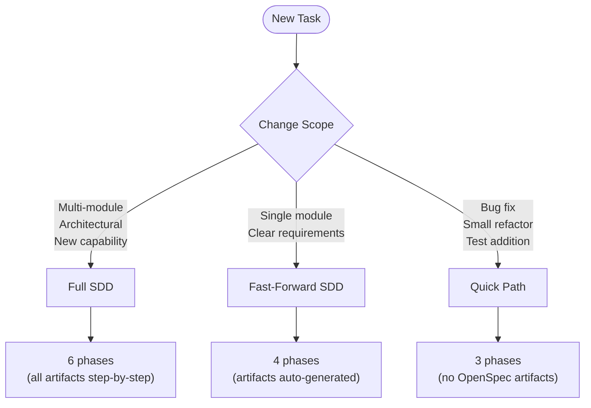
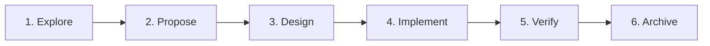
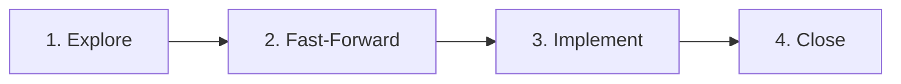
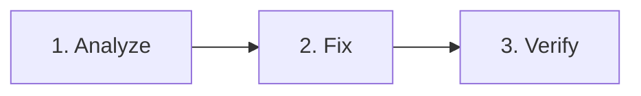
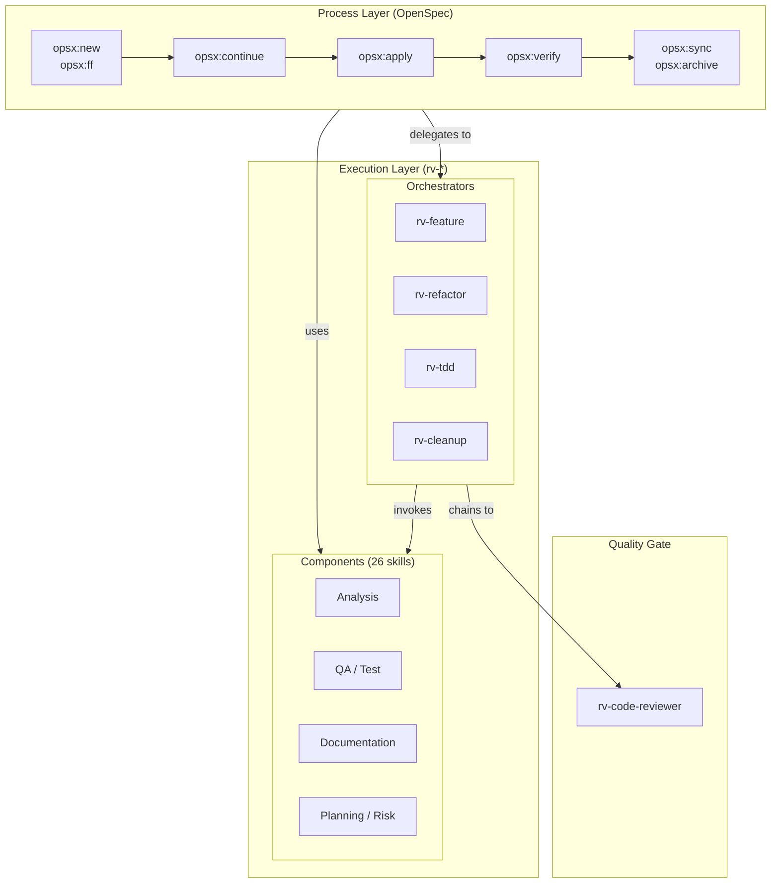

# Plan: Spec-Driven Development Adoption for RV-Android

## Context

RV-Android is a modular framework for Android application testing with runtime verification (JavaMOP) and LLM-guided exploration (Qwen3-VL). The system has 14 Poetry modules, extensive documentation, and an academic paper submitted to ICST. It is part of a PhD thesis at UnB and the broader RVSEC ecosystem. The instrumentation pipeline was inspired by the original RV-Android project by Daian et al. (Runtime Verification Inc., 2015).

**Problem**: Despite good existing documentation, there is no formal specification layer serving as a single source of truth for system behavior. Changes are made ad-hoc, without formal traceability between requirements and implementation.

**Solution**: Adopt Spec-Driven Development (SDD) using OpenSpec as the framework. Create a detailed PRD and per-domain specs that document the current system. Future changes will follow the full SDD workflow (proposal -> specs -> design -> tasks -> implement -> archive).

**Reference**: The `agente-documentador` project already uses SDD successfully and serves as a model for workflow and structure (though it uses PT-BR, we will use English for rv-android).

**Expected outcome**: Complete SDD structure with PRD + 7 domain specs + customized config.yaml + templates + workflow guide.

**Language**: All content in English (PRD, specs, proposals, designs, tasks).

---

## Progress

| Phase | Status | Deliverable | Notes |
|-------|--------|-------------|-------|
| 0 | **COMPLETE** | OpenSpec setup | config.yaml, templates, dirs |
| 1 | **COMPLETE** | docs/PRD.md | 14 sections, 37 FRs, 8 NFRs, Glossary. Reviewed: promotional language removed, 23 CrySL corrected, experiments expanded, rvagent-tool added, rv-llm marked deprecated |
| 2 | **COMPLETE** | 7 domain specs | 7 specs, 111 invariants, 217 scenarios, all FR01-FR37 + NFR01-NFR08 covered. ADR template added. |
| 3-4 | **COMPLETE** | Validation + process docs | Cross-domain validated, 1 spec bug fixed (.methods), CLAUDE.md updated with SDD artifacts section. Phase 4 was done in Phase 5. |
| 5 | **COMPLETE** | Skills integration + workflow | `docs/WORKFLOW.md` (authoritative), CLAUDE.md (condensed) |

---

## Phase 0: OpenSpec Setup

**Goal**: Configure OpenSpec with rv-android context and conventions.

### Tasks

#### 0.1 Update `openspec/config.yaml`

Customize with project context:

```yaml
schema: spec-driven

context: |
  Project: RV-Android
  Type: Modular framework for Android app testing with runtime verification
  Language: Python 3.11+
  Stack: Poetry workspace, Pydantic v2, LangGraph, SGLang/Qwen3-VL, JavaMOP/RV-Monitor
  Architecture: 14 Poetry modules with develop=true (shared venv)
  Academic context: PhD thesis on detecting cryptographic API misuses via RV

  CRITICAL RULE — Existing system (brownfield):
  Specs document the CURRENT behavior of the system.
  Future changes use the OpenSpec workflow (proposal -> specs -> design -> tasks).
  Do not create aspirational specs — only what is implemented.

  Spec Domains:
  - core: rv-android-core (domain models, events, errors, logging, utilities)
  - platform: rv-platform (task execution engine, components, storage, results)
  - experiment: rv-experiment (orchestration, CLI, 3-phase workflow)
  - agent: rv-agent + rv-llm (LLM exploration, LangGraph, strategies, memory)
  - instrumentation: rv-monitor-generator + rv-instrumentation (RV pipeline)
  - analysis: rv-static-analysis + rv-coverage + rv-screen-parser
  - tools: rv-tools + rv-uiautomator (tool infrastructure, device interaction)

rules:
  proposal:
    - English language throughout
    - Reference FRs/NFRs from PRD
    - List affected specs and impacted modules
    - Include impact section with dependencies
  specs:
    - English language throughout
    - RFC 2119 keywords (MUST, SHALL, SHOULD, MAY)
    - WHEN/THEN/AND format for scenarios
    - Include Data Contracts (Input/Output/Side-Effects/Error)
    - Include testable Invariants (INV-XX-NN)
    - Reference specific Python modules and files
  design:
    - English language throughout
    - Reference existing module files
    - Include Pydantic schemas when applicable
    - Include Mapping table: Spec -> Implementation -> Test
  tasks:
    - English language throughout
    - Completable in one Claude Code session
    - Include test tasks
    - Order: models -> utils -> core -> integration
```

**File**: `openspec/config.yaml`

#### 0.2 Create templates

Adapt templates from agente-documentador (translated to English):

- `docs/templates/spec-template.md` — Spec template
- `docs/templates/design-template.md` — Design document template

**Source**: `/home/pedro/desenvolvimento/workspaces/workspaces-doutorado/workspace-rv/agente-documentador/docs/templates/`

#### 0.3 Create directory structure

```
openspec/
├── config.yaml              # Already exists (update)
├── specs/
│   ├── README.md            # Explains spec organization
│   ├── core/
│   │   └── spec.md
│   ├── platform/
│   │   └── spec.md
│   ├── experiment/
│   │   └── spec.md
│   ├── agent/
│   │   └── spec.md
│   ├── instrumentation/
│   │   └── spec.md
│   ├── analysis/
│   │   └── spec.md
│   └── tools/
│       └── spec.md
└── changes/
    └── archive/             # Future changes archived here
```

---

## Phase 1: PRD (Product Requirements Document)

**Goal**: Create an extremely detailed PRD that documents the complete system.

**File**: `docs/PRD.md`

### PRD Structure

```markdown
# RV-Android — Product Requirements Document

## 1. Overview
- What RV-Android is
- Academic context (master's thesis, ICST paper)
- Problem it solves

## 2. Problem Statement
- Android apps have inadequate test suites (median 5 tests, 0.23 coverage)
- Cryptographic APIs (JCA) frequently misused
- Existing tools don't guide exploration toward RV specification methods
- MOP method coverage remains low (~17% best case)

## 3. Solution
- Modular platform combining:
  - JavaMOP instrumentation for runtime verification
  - Static analysis (GATOR, GESDA, REACH) for complementary data
  - Automated test generation tools (Monkey, DroidBot, APE, etc.)
  - LLM agent (rv-agent) with vision-guided exploration
- Complete pipeline: instrumentation -> analysis -> execution -> results

## 4. System Architecture
- 14 Poetry modules with shared workspace
- High-level diagram (from rv_android_architecture.md)
- Layer grouping (core, analysis, instrumentation, execution, LLM)

## 5. Functional Requirements

### Instrumentation and Monitors
- FR01: Monitor generation from JavaMOP specifications
- FR02: APK instrumentation with monitors (dex2jar -> javamop -> ajc -> d8)
- FR03: Specification set support (JCA, generic)

### Static Analysis
- FR04: GATOR analysis (Window Transition Graph)
- FR05: GESDA analysis (GUI-Event-Sequence-Driven Analysis)
- FR06: REACH analysis (reachability analysis for MOP)

### Execution and Management
- FR07: Android emulator management (start, stop, install, dynamic ports)
- FR08: Task generation (APK x tool x variant x repetition x timeout)
- FR09: Component-based execution (StaticAnalysis, Emulator, Coverage, Tool, Logcat)
- FR10: Persistent task storage with atomic transactions
- FR11: Logcat capture and parsing for coverage and errors

### Coverage and Results
- FR12: Method coverage tracking (overall + MOP)
- FR13: Specification violation detection (RV errors)
- FR14: Result generation (coverage.csv, errors.csv, summary.csv, results.json, performance.csv)

### Experiment Orchestration
- FR15: Three-phase workflow (pre-processing, execution, post-processing)
- FR16: CLI with tool specification DSL (tool:variant@param=value)
- FR17: Just-in-time sub-module configuration

### Tool System
- FR18: Plugin system with registry and factory patterns
- FR19: External tool support (Monkey, DroidBot, APE, DroidMate, FastBot, Humanoid, QTesting, Ares)
- FR20: Per-tool variant system

### LLM Agent (rv-agent)
- FR21: LangGraph workflow with externalized nodes
- FR22: Three execution modes (pure_algorithm, llm_only, multimode)
- FR23: UI parsing via UIAutomator XML + Screen Processor
- FR24: Vision-based exploration (Qwen3-VL via SGLang)
- FR25: Probabilistic routing (70% LLM / 30% algorithm in multimode)
- FR26: RVAgentStrategy with coverage-optimized DFS
- FR27: Composite action ranking (MOP, WTG, Decay, Component, Execution, Failed scorers)
- FR28: Memory systems (ShortTerm, LongTerm, DynamicStateGraph, UICoverageTracker)
- FR29: Stuck state detection and recovery (hash monitoring, deadlock, forced BACK)
- FR30: WTG-guided navigation (TransitionManager + NavigationGuidance)
- FR31: Qwen3-VL coordinate normalization ([0,1000) -> pixels)
- FR32: Hybrid tool calling (native + fallback XML/JSON parser)

### Infrastructure
- FR33: Event-driven communication (EventBus with channels)
- FR34: Error handling with recovery strategies
- FR35: Pydantic validation (BaseValidatedModel)
- FR36: Centralized logging (LoggingManager)
- FR37: Performance monitoring (PerformanceMonitor)

## 6. Non-Functional Requirements
- NFR01: Modularity (independent Poetry modules)
- NFR02: Extensibility (plugin system, component interfaces)
- NFR03: Testability (unit, integration, smoke, online, performance tests)
- NFR04: Resilience (circuit breaker, error recovery, timeout handling)
- NFR05: Configurability (Pydantic models, env vars, JSON configs)
- NFR06: Observability (EventBus, RVTRACK logging, PerformanceMonitor)
- NFR07: Compatibility (Android SDK, RVSEC_HOME, SGLang server)
- NFR08: Reproducibility (task storage, experiment continuation)

## 7. System Modules
- Table: module, responsibility, internal dependencies, external dependencies

## 8. Execution Modes
- rv-experiment CLI (full with pre-processing)
- rv-platform CLI (direct execution)
- rv-agent CLI (standalone — manual emulator)
- rv-agent via rv-experiment (automatic emulator management)

## 9. Research Integration
- RQ1: Effectiveness of test generation tools in revealing JCA violations
- RQ2: Correlation between coverage and violation detection
- RQ3: Nature of detected violations
- Paper results: 230 unique violations, 188 apps, 11 tool configurations

## 10. Current Status and Roadmap
- Status per module (implemented, in development, planned)
- Planned rv-agent improvements (failed actions, UI mutation, scroll detection)
```

### PRD Sources

| Source | Information | Location |
|--------|------------|----------|
| ICST Paper | RQs, results, academic context | `ase-journal/main-icst.pdf` |
| rv_android_architecture.md | Overall architecture, diagrams, modules | `docs/rv_android_architecture.md` |
| CLAUDE.md (root) | Commands, workflows, configuration | `CLAUDE.md` |
| CLAUDE.md (modules) | Per-module details | `modules/*/CLAUDE.md` |
| architecture.md (modules) | Detailed per-module architecture | `modules/*/docs/architecture.md` |

---

## Phase 2: Main Specs (7 domains)

**Goal**: Create one spec per domain documenting the current system behavior.

Each spec follows the template with: Purpose, Data Contracts, Invariants, Requirements (with WHEN/THEN/AND scenarios).

### Spec 1: `openspec/specs/core/spec.md`

**Modules covered**: rv-android-core

**FRs covered**: FR33-FR37

**Key content**:
- EventBus: channels, publish/subscribe, typed events
- ErrorHandler: classification, recovery strategies, decorators
- Domain models: Task, App, StaticAnalysisData, WTG
- BaseValidatedModel: Pydantic validation
- Command: system command execution, circuit breaker
- AbstractTool: base contract for testing tools
- LoggingManager and PerformanceMonitor

**Sources**: `modules/rv-android-core/CLAUDE.md`, `modules/rv-android-core/src/rv_android_core/`

### Spec 2: `openspec/specs/platform/spec.md`

**Modules covered**: rv-platform

**FRs covered**: FR07-FR11, FR14

**Key content**:
- Platform: APK discovery, task generation
- TaskExecutor: component-based execution with lifecycle
- Components: Emulator, Coverage, StaticAnalysis, Logcat, ToolExecution, ResultProcessor
- TaskStorage: atomic persistence with transactions
- PlatformConfig: Pydantic validation
- ResultProcessor: CSV/JSON generation

**Sources**: `modules/rv-platform/CLAUDE.md`, `modules/rv-platform/docs/architecture.md`

### Spec 3: `openspec/specs/experiment/spec.md`

**Modules covered**: rv-experiment

**FRs covered**: FR15-FR17

**Key content**:
- ExperimentController: three-phase workflow orchestration
- PreProcessor: monitor generation, instrumentation, static analysis
- ExecutionController: bridge to rv-platform
- PostProcessor: basic diagnostics
- CLI: tool specification DSL, Click commands
- ExperimentConfig: just-in-time configuration

**Sources**: `modules/rv-experiment/CLAUDE.md`, `modules/rv-experiment/docs/architecture.md`

### Spec 4: `openspec/specs/agent/spec.md`

**Modules covered**: rv-agent, rv-llm

**FRs covered**: FR21-FR32

**Key content** (most complex spec):
- RVAgent: LangGraph workflow with externalized nodes
- AgentFactory: dependency injection
- Workflow nodes: parse, decision, algorithm, capture, llm, validate, execute, learn
- LLMClient: SGLang communication, hybrid tool calling
- RVAgentStrategy: coverage-optimized DFS, SuccessorTracker, PlateauDetector
- ActionRanker: composite scoring system (6 scorers)
- RoutingManager: probabilistic routing between LLM and algorithm
- MemoryCoordinator: ShortTerm, LongTerm, DynamicStateGraph, UICoverageTracker
- TransitionManager: WTG integration + NavigationGuidance
- ScreenProcessor: UI parsing via UIAutomator XML
- Qwen3-VL coordinate normalization
- RVAgentConfig: agent configuration

**Sources**: `modules/rv-agent/CLAUDE.md`, `modules/rv-agent/docs/architecture.md`

### Spec 5: `openspec/specs/instrumentation/spec.md`

**Modules covered**: rv-monitor-generator, rv-instrumentation

**FRs covered**: FR01-FR03

**Key content**:
- Instrumentation pipeline: dex2jar -> javamop -> rv-monitor -> ajc -> d8
- Monitor generation from MOP specifications
- Specification sets: JCA, generic
- APK instrumentation with monitors (AspectJ weaving)
- Coverage aspect for method call capture
- DEX -> JAR -> instrumented JAR -> DEX conversion

**Sources**: ICST Paper (Section III), `modules/rv-monitor-generator/CLAUDE.md`, `modules/rv-instrumentation/CLAUDE.md`

### Spec 6: `openspec/specs/analysis/spec.md`

**Modules covered**: rv-static-analysis, rv-coverage, rv-screen-parser

**FRs covered**: FR04-FR06, FR12-FR13

**Key content**:
- Static analysis: GATOR (WTG), GESDA, REACH
- StaticAnalysisData: unified model for static data
- CoverageTracker: coverage tracking via logcat
- LogcatRepository: method call and RV error registration
- Coverage metrics: overall coverage, MOP coverage
- ScreenParser: visitor pattern for UI XML analysis
- PackageDetector: app package detection (4 heuristics)
- SignatureNormalizer: Java signature normalization

**Sources**: `modules/rv-static-analysis/CLAUDE.md`, `modules/rv-coverage/CLAUDE.md`, `modules/rv-screen-parser/CLAUDE.md`

### Spec 7: `openspec/specs/tools/spec.md`

**Modules covered**: rv-tools, rv-uiautomator

**FRs covered**: FR18-FR20

**Key content**:
- ToolRegistry: tool registration and discovery
- ToolFactory: configured tool instance creation
- AbstractTool: base contract (get_variants, get_tool_spec, configure, execute)
- ToolSpec: tool specification model
- Tool variant system: multiple variants per tool
- UIAutomator2: adapter for device interaction
- DeviceInterface: device operations abstraction

**Sources**: `modules/rv-tools/CLAUDE.md`, `modules/rv-uiautomator/CLAUDE.md`

---

## Phase 3: Validation and Integration

**Goal**: Ensure consistency and completeness.

### Tasks

- 3.1 Verify all PRD FRs are covered by at least one spec
- 3.2 Verify all specs are consistent with each other (interfaces, contracts)
- 3.3 Verify all invariants are testable
- 3.4 Update root `CLAUDE.md` with SDD workflow section
- 3.5 Add references to PRD and specs in existing documentation

---

## Phase 4: Process Documentation

**Goal**: Document how to use SDD in daily project work.

### Tasks

- 4.1 Add SDD workflow section to CLAUDE.md
- 4.2 Document workflow: how to propose, implement, and archive changes
- 4.3 Document conventions: language, format, templates

---

## Recommended Execution Order

| Session | Phase | Deliverable | Dependency |
|---------|-------|-------------|------------|
| 1 | 0 | OpenSpec setup (config.yaml, templates, dirs) | — |
| 2 | 1 | docs/PRD.md | Phase 0 |
| 3 | 2.1 | openspec/specs/core/spec.md | PRD |
| 4 | 2.2 | openspec/specs/platform/spec.md | PRD |
| 5 | 2.3 | openspec/specs/experiment/spec.md | PRD |
| 6 | 2.4 | openspec/specs/agent/spec.md | PRD |
| 7 | 2.5 | openspec/specs/instrumentation/spec.md | PRD |
| 8 | 2.6 | openspec/specs/analysis/spec.md | PRD |
| 9 | 2.7 | openspec/specs/tools/spec.md | PRD |
| 10 | 3 | Validation and integration | All specs |
| 11 | 4 | Process documentation | Phase 3 |
| 12 | 5 | Skills audit and SDD integration ✅ | Phase 4 (done early) |

**Note**: Specs (sessions 3-9) are independent of each other and can be done in any order. The suggested order follows logical dependency (core first, then modules that depend on it).

**Alternative**: Sessions 3-9 can be parallelized using subagents, reducing total to ~4-5 sessions.

---

## Conventions

### Language
- **All content**: English (PRD, specs, proposals, designs, tasks, scenarios)
- **RFC 2119 keywords**: MUST, MUST NOT, SHALL, SHOULD, MAY
- **Code/types**: English

### Spec Format
- Follow template from `docs/templates/spec-template.md`
- Invariants: `INV-XX-NN` (XX = domain abbreviation, NN = number)
  - `INV-CORE-01`, `INV-PLT-01`, `INV-EXP-01`, `INV-AGT-01`, `INV-INS-01`, `INV-ANA-01`, `INV-TOOL-01`
- Requirements: `### Requirement: Name (FR/NFR ID)`
- Scenarios: `#### Scenario: Descriptive Name`

### Change Format (future changes)
- Kebab-case naming: `add-scroll-detection`, `fix-coverage-tracking`
- 4 artifacts: proposal.md, design.md, tasks.md, specs/ (delta)
- Workflow: `/opsx:new` -> `/opsx:ff` -> review -> `/opsx:apply` -> `/opsx:verify` -> `/opsx:archive`

---

## Verification

### How to validate the final result

1. **Structure**: Verify all directories and files exist
```bash
ls openspec/specs/*/spec.md  # 7 specs
cat docs/PRD.md | head -5    # PRD exists
cat openspec/config.yaml     # Config customized
```

2. **Completeness**: Verify FR coverage
```bash
# All PRD FRs should appear in at least one spec
grep -r "FR[0-9]" openspec/specs/ | sort | uniq
```

3. **Format**: Verify specs follow the template
```bash
# Each spec must have: Purpose, Data Contracts, Invariants, Requirements
for f in openspec/specs/*/spec.md; do
  echo "=== $f ==="
  grep "^## " "$f"
done
```

4. **Consistency**: Manually review that cross-domain interfaces are consistent

5. **OpenSpec CLI**: Validate specs with OpenSpec tools
```bash
openspec validate --specs
openspec status
```

---

## Critical Files

### To Create
| File | Description |
|------|-------------|
| `docs/PRD.md` | Product Requirements Document |
| `docs/20260209_plano_spec_driven.md` | This plan |
| `docs/templates/spec-template.md` | Spec template |
| `docs/templates/design-template.md` | Design doc template |
| `openspec/config.yaml` | OpenSpec configuration (update) |
| `openspec/specs/README.md` | Organization guide |
| `openspec/specs/core/spec.md` | Spec: core infrastructure |
| `openspec/specs/platform/spec.md` | Spec: execution engine |
| `openspec/specs/experiment/spec.md` | Spec: orchestration |
| `openspec/specs/agent/spec.md` | Spec: LLM agent |
| `openspec/specs/instrumentation/spec.md` | Spec: RV pipeline |
| `openspec/specs/analysis/spec.md` | Spec: analysis and coverage |
| `openspec/specs/tools/spec.md` | Spec: tool infrastructure |
| `docs/WORKFLOW.md` | Authoritative workflow reference (Phase 5) |

### To Modify
| File | Change |
|------|--------|
| `CLAUDE.md` (root) | Add condensed SDD workflow section with link to WORKFLOW.md |

### Sources (read-only)
| File | Usage |
|------|-------|
| `docs/rv_android_architecture.md` | Overall architecture |
| `modules/*/CLAUDE.md` | Per-module details |
| `modules/*/docs/architecture.md` | Detailed per-module architecture |
| `ase-journal/main-icst.pdf` | Paper with academic context |
| `docs/monografia.pdf` | Qualification thesis (DSR cycles, RVSEC architecture, accuracy study) |
| agente-documentador (`openspec/`, `docs/PRD.md`, `docs/templates/`) | SDD reference |

---

## Phase 5: Skills Integration in SDD Workflow

**Goal**: Define a track-based development workflow that integrates the existing rv-* and openspec-* skills. Match workflow formality to change scope. Grounded in SDD principles from Martin Fowler (spec-anchored), GitHub Spec Kit, OpenSpec, and ThoughtWorks.

**Approach**: RV-Android follows **spec-anchored SDD** — specs persist and document the system, but code remains the maintained artifact. The OpenSpec framework provides the process layer; rv-* skills provide the execution layer. The workflow is **fluid, not rigid** (OpenSpec principle: "no phase gates, work on what makes sense").

**Authoritative reference**: `docs/WORKFLOW.md` contains the full detailed workflow documentation with examples, complete skill inventory, and design principles. This section provides the summary; see WORKFLOW.md for the complete reference.

### 5.1 Workflow Track Selection

Not every change requires the full SDD ceremony. Three tracks match change scope to workflow formality.



| Track | When | Artifacts | Phases |
|-------|------|-----------|--------|
| **Full SDD** | Multi-module, architectural, new features | proposal, delta specs, design, tasks (step by step) | 6 |
| **Fast-Forward SDD** | Single module, clear requirements | All artifacts (auto-generated via `/opsx:ff`) | 4 |
| **Quick Path** | Bug fixes, refactoring, test additions | None (no OpenSpec ceremony) | 3 |

### 5.2 Full SDD Workflow

For changes that cross module boundaries or introduce new capabilities. Each phase produces artifacts reviewed before advancing.



| Phase | What Happens | OpenSpec | RV Skills |
|-------|-------------|----------|-----------|
| **1. Explore** | Understand the problem, assess impact | `/opsx:explore` | `/rv-analyze-module`, `/rv-impact-analyzer` |
| **2. Propose** | Create change, write proposal + delta specs | `/opsx:new` then `/opsx:continue` (x2) | -- |
| **3. Design** | Write design doc + task list | `/opsx:continue` (x2) | `/rv-doc-adr` (if architectural decision) |
| **4. Implement** | Execute tasks from `tasks.md` | `/opsx:apply` | `/rv-tdd`, `/rv-refactor`, `/rv-feature` |
| **5. Verify** | Run checks, validate against specs | `/opsx:verify` | `/rv-verify` |
| **6. Archive** | Sync delta specs, archive change, update docs | `/opsx:sync` + `/opsx:archive` | `/rv-docs-sync` |

### 5.3 Fast-Forward SDD Workflow

For single-module changes with clear requirements. `/opsx:ff` generates all planning artifacts at once.



| Phase | What Happens | Skills |
|-------|-------------|--------|
| **1. Explore** | Quick analysis of the problem | `/opsx:explore` or `/rv-analyze-module` |
| **2. Fast-Forward** | Generate all artifacts at once | `/opsx:ff` |
| **3. Implement** | Execute tasks | `/opsx:apply` + orchestrators |
| **4. Close** | Verify, sync specs, archive | `/rv-verify` + `/opsx:verify` + `/opsx:archive` |

### 5.4 Quick Path

For targeted fixes that do not need OpenSpec formality. No artifacts created.



| Phase | What Happens | Skills |
|-------|-------------|--------|
| **1. Analyze** | Understand the issue | `/rv-analyze-module`, `/rv-analyze-file`, or direct reading |
| **2. Fix** | Implement the change | `/rv-tdd` (test-first), `/rv-refactor`, or direct edit |
| **3. Verify** | Run tests, check quality | `/rv-verify` or `/rv-test-run` |

### 5.5 Skill Architecture

Three layers with unidirectional flow.



#### Design Principles

1. **Unidirectional flow**: Process Layer (OpenSpec) invokes Execution Layer (rv-*). Never the reverse. This keeps rv-* skills reusable independently of OpenSpec.

2. **Separation of concerns**: OpenSpec manages the change lifecycle (what and why). rv-* skills handle technical execution (how). Each skill has a single responsibility.

3. **Orchestrator / Component hierarchy**: Orchestrators manage multi-phase workflows with user checkpoints and code review gates. Components perform focused, single tasks. Orchestrators invoke components; components do not invoke orchestrators.

4. **Proportional ceremony**: Match workflow formality to change scope. Full SDD for traceability; Quick Path for speed.

5. **Fluid, not rigid**: Following OpenSpec's principle — artifact dependencies are enablers, not gates. Work on what makes sense at each point. Refine artifacts as you learn during implementation.

### 5.6 Quick Reference: Common Scenarios

| Scenario | Track | Skill Sequence |
|----------|-------|----------------|
| New feature in rv-agent | Full SDD | `opsx:explore` -> `opsx:new` -> `opsx:continue` (x4) -> `opsx:apply` (w/ `rv-tdd`) -> `rv-verify` -> `opsx:verify` -> `opsx:archive` |
| Add config option to module | FF SDD | `opsx:ff` -> `opsx:apply` -> `rv-verify` -> `opsx:archive` |
| Refactor module internals | Quick | `rv-analyze-module` -> `rv-refactor` -> `rv-verify` |
| Fix a bug | Quick | `rv-debug-regression` or analysis -> `rv-tdd` -> `rv-verify` |
| Add tests to existing code | Quick | `rv-test-add` -> `rv-test-run` |
| Remove dead code | Quick | `rv-analyze-dead-code` -> `rv-cleanup` -> `rv-verify` |
| Architectural change | Full SDD | `opsx:explore` -> `opsx:new` -> `opsx:continue` (x4) -> `rv-doc-adr` -> `opsx:apply` -> `rv-verify` -> `opsx:archive` |

### 5.7 Assessment of External Feedback

| Source | Suggestion | Decision | Rationale |
|--------|-----------|----------|-----------|
| Gemini | Create `/rv-help` skill | Skip | Quick reference table (Section 5.6) addresses discoverability without adding complexity |
| Gemini | Create `/rv-onboard` skill | Skip | `/openspec-onboard` already exists for SDD; workflow docs serve as rv-* onboarding |
| Gemini | Improve discoverability | Accept | Addressed via workflow track selection + quick reference table + CLAUDE.md update |
| Both | Unidirectional flow is sound | Keep | Preserved as Design Principle #1 |
| Both | Orchestrator/Component pattern is sound | Keep | Preserved as Design Principle #3 |
| ThoughtWorks | SDD is not waterfall | Align | "Fluid, not rigid" principle (Design Principle #5) ensures short feedback cycles |
| Fowler | Beware MDD parallels | Noted | RV-Android uses spec-anchored approach (code is maintained artifact, not specs) |

**Skill set**: Keep all 43 skills + 1 agent. The discoverability gap is addressed through documentation, not removal. Each skill serves a distinct purpose and the orchestrator/component hierarchy provides clear entry points.

### 5.8 Tasks

- 5.8.1 **Replace Phase 5 in plan file**: Replace verbose 10-step workflow with track-based workflow (this section) ✅
- 5.8.2 **Create `docs/WORKFLOW.md`**: Authoritative detailed workflow reference with examples, complete skill inventory, and design principles ✅
- 5.8.3 **Update CLAUDE.md**: Add condensed workflow section with link to WORKFLOW.md ✅
- 5.8.4 **Verify skill consistency**: Confirm all referenced skills exist and descriptions match ✅ (41 skills + 1 agent verified)
