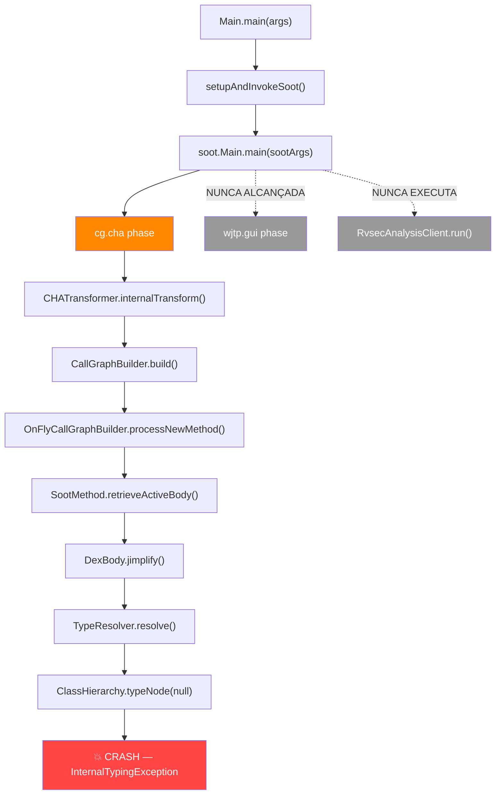
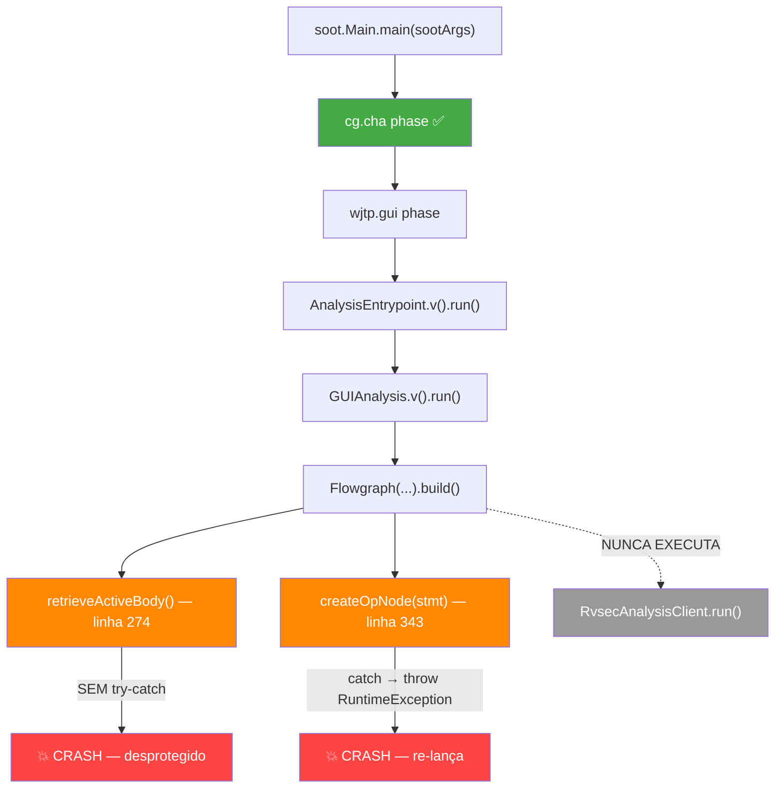
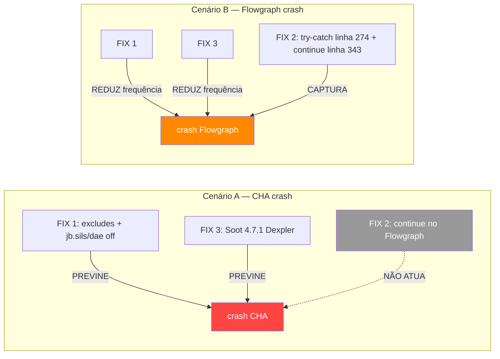
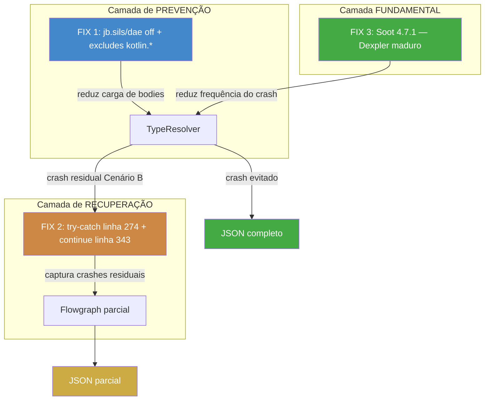
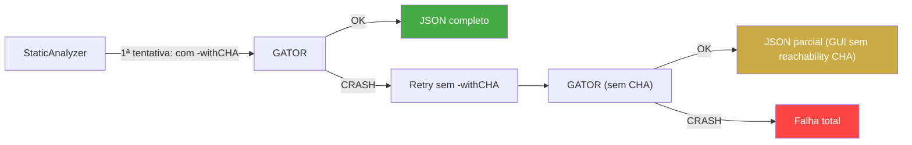
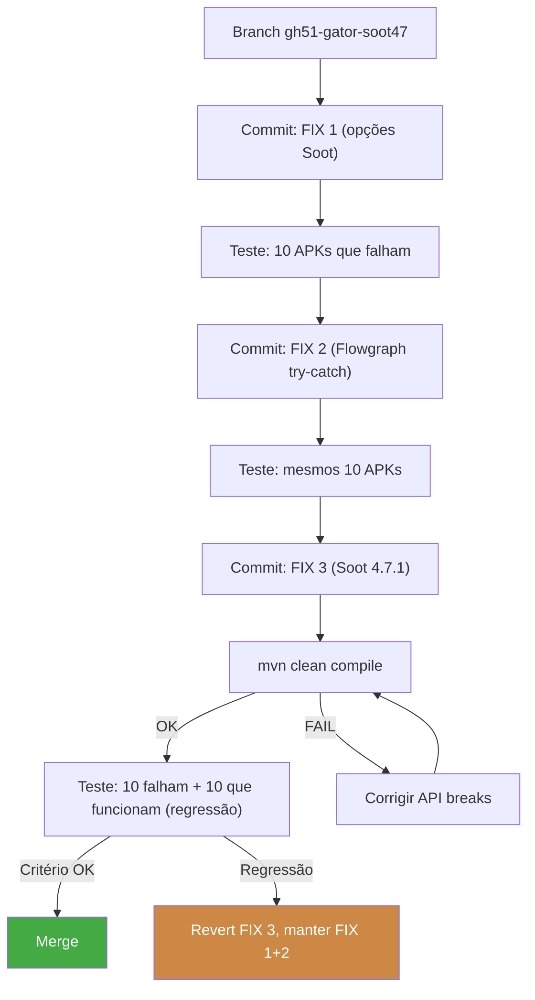

# Pré-plano: Melhoria da Análise Estática (GATOR/Soot)

**Data**: 2026-04-19
**Contexto**: Resultados da gh50 mostram instrumentação em 352/400 APKs (88%), mas SA consegue analisar apenas 97/352 (27.6%). A causa raiz é uma combinação de: (1) GATOR configura Soot com ZERO opções defensivas, (2) Soot 3.3.0 tem bug no `TypeResolver` que crasha em bytecode Kotlin moderno, e (3) GATOR re-lança exceções em vez de continuar com dados parciais. Este documento analisa o problema, explora soluções, e serve de entrada para a fase de ideação do workflow SDD.

**Relação com gh50**: A gh50 melhorou a instrumentação (17.5% → 88%) mas **não toca** na análise estática. Este pré-plano propõe uma change futura para melhorar a taxa de SA (27.6% → alvo 50-70%).

---

## 1. Diagnóstico Detalhado

### 1.1 O erro

```
Unexpected type null
    at soot.jimple.toolkits.typing.integer.ClassHierarchy.typeNode(ClassHierarchy.java:152)
    at soot.jimple.toolkits.typing.integer.TypeResolver.typeVariable(TypeResolver.java:121)
    at soot.jimple.toolkits.typing.integer.ConstraintCollector.caseAssignStmt(ConstraintCollector.java:406)
    at soot.dexpler.DexBody.jimplify(DexBody.java:660)
    at soot.SootMethod.retrieveActiveBody(SootMethod.java:402)
    at soot.jimple.toolkits.callgraph.OnFlyCallGraphBuilder.processNewMethod(OnFlyCallGraphBuilder.java:755)
    at soot.jimple.toolkits.callgraph.CallGraphBuilder.build(CallGraphBuilder.java:107)
    at soot.jimple.toolkits.callgraph.CHATransformer.internalTransform(CHATransformer.java:51)
```

O crash ocorre no pipeline Dexpler (conversor DEX → Jimple) durante inferência de tipos inteiros. O `ClassHierarchy.typeNode()` tem um mapa fixo de 5 tipos conhecidos (boolean, byte, short, char, int). Quando o Dexpler converte bytecode Kotlin moderno, produz tipos intermediários (`Integer1Type`, range types) ou referências `null_type` que **não estão registrados** no `typeNodeMap`. O lookup retorna `null` → `InternalTypingException` → crash.

### 1.2 Fluxo exato do crash no GATOR

O crash pode ocorrer em **dois cenários distintos**, dependendo de qual chamada a `retrieveActiveBody()` dispara o `InternalTypingException`:

**Cenário A — Crash durante CHA (dominante, conforme stack trace §1.1)**:



**Cenário B — Crash durante Flowgraph (se CHA completar)**:



**Ponto crítico**: A stack trace (§1.1) mostra que o crash dominante ocorre no **Cenário A** — durante a construção do call graph CHA, **antes** da fase `wjtp.gui` (Flowgraph) sequer executar. No Cenário B, há dois pontos vulneráveis: `retrieveActiveBody()` na linha 274 (sem try-catch) e `createOpNode()` na linha 343 (com catch que re-lança como RuntimeException). Em ambos os cenários, o JSON nunca é produzido.

**Cobertura dos fixes por cenário**:



### 1.3 Comportamento observado

- **Exit code**: 0 quando chamado pelo wrapper Python; 1 quando chamado diretamente via Java
- **JSON produzido**: Não — o crash ocorre antes do `RvsecAnalysisClient`
- **Tempo**: 7-50 segundos (crash instantâneo, não timeout)
- **Padrão**: Apps Java puros e Kotlin pequenos (< 30 classes) funcionam. Apps Kotlin/Compose médios/grandes falham.

### 1.4 Evidência empírica

| Categoria | APKs | Taxa SA | Exemplo |
|-----------|------|---------|---------|
| Java puro | ~20 | ~80% | NoteSR (162 .java, 0 .kt) |
| Kotlin pequeno (< 30 .kt) | ~30 | ~60% | NanoLedger (31 .kt, 165s SA OK) |
| Kotlin + Compose (> 50 .kt) | ~250 | ~15% | Podcini.X (167 .kt), HypoStats (63 .kt) |
| Flutter/other | ~50 | ~40% | pomodorot (Flutter) |

### 1.5 Setup atual

- **Soot**: `3.3.0` via `ca.mcgill.sable:soot` (Maven group descontinuado em 2019)
- **GATOR**: Fork do Ohio State SootAndroid (~2016-2017)
- **Arquivo chave**: `rvsec/rvsec-android/rvsec-gator/sootandroid/src/main/java/presto/android/Main.java`
- **Configuração Soot** (linhas 204-215): apenas 10 flags básicos, ZERO opções defensivas

---

## 2. Análise Comparativa: GATOR vs CryptoAnalysis vs FlowDroid

### 2.1 Comparação de configuração Soot

Esta é a tabela mais importante do documento. Mostra que o GATOR configura Soot com **nenhuma** opção defensiva enquanto CryptoAnalysis e FlowDroid usam múltiplas:

| Opção Soot | GATOR (3.3.0) | CryptoAnalysis 5.0.1 (4.6.0) | FlowDroid 2.15+ (4.8.0) | Efeito |
|------------|---------------|-------------------------------|------------------------|--------|
| `no_bodies_for_excluded` | **Não** | **Sim** | **Sim** | Não jimplifica classes excluídas |
| Exclude `android.*`, `androidx.*` | **Não** | **Sim** | **Sim** | Evita jimplificar framework |
| Exclude `kotlin.*`, `kotlinx.*` | **Não** | Não | Não | Evita crash em Kotlin stdlib |
| `ignore_resolution_errors` | **Não** | **Sim** | **Sim** | Trata tipos não-resolvíveis graciosamente |
| `throw_analysis_dalvik` | **Não** | **Sim** | **Sim** | Análise de exceções correta para DEX |
| `jb.sils` disabled | **Não** | **Sim** | Não | Evita typing errors no static inlining |
| `jb.dae` disabled | **Não** | **Sim** | Não | Evita typing errors em dead assignment elimination |
| `jb.ulp` disabled | Não | Não | **Sim** | Desabilita unused local packer |
| `src_prec_apk_class_jimple` | Não (usa `apk`) | **Sim** | **Sim** | Mais robusto para input misto |
| Per-method try-catch | **Re-lança** | N/A (FlowDroid) | **Não** | Tratamento de crash por método |
| Soot version | **3.3.0** | **4.6.0** | **4.8.0** | Dexpler improvements |

### 2.2 CryptoAnalysis 5.0.1 — detalhes

Já instalado em `rvsec-cognicrypt/`:
- `HeadlessAndroidScanner-5.0.1-jar-with-dependencies.jar` (100 MB)
- CrySL rules em `./CrySL-Rules/`
- Scripts de batch analysis existentes (`run_batch_analysis.py`)
- Resultados anteriores em `results/cognicrypt_metrics.csv` (437 linhas, 134 erros/timeouts)

**Comando para teste**:
```bash
cd /home/pedro/desenvolvimento/workspaces/workspaces-doutorado/workspace-rv/rvsec-cognicrypt
java -Xmx8g -Xss600m -jar HeadlessAndroidScanner-5.0.1-jar-with-dependencies.jar \
  --apkFile /path/to/apk \
  --platformDirectory $ANDROID_HOME/platforms \
  --rulesDir ./CrySL-Rules/ \
  --reportFormat CSV \
  --reportPath /tmp/cognicrypt_test
```

### 2.3 Versões Soot no projeto RVSEC

| Módulo | Soot | FlowDroid | Uso |
|--------|------|-----------|-----|
| **rvsec-gator** | **3.3.0** | Nenhum | GUI analysis, WTG, reachability |
| rvsec-reachability | 4.3.0 (via FlowDroid) | 2.10.0 | Reachability alternativa |
| rvsec-gesda | 4.3.0 (via FlowDroid) | 2.10.0 | GESDA analysis |
| **CryptoAnalysis 5.0.1** | **4.6.0** | **2.14.1** | Crypto misuse detection |

**Observação**: `rvsec-analysis-client` (o fat JAR do GATOR) **exclui explicitamente** versões mais novas do Soot para evitar conflito de classpath com o Soot 3.3.0 do GATOR.

---

## 3. Issues Soot Relevantes

| Issue | Título | Status | Versão | Relevância |
|-------|--------|--------|--------|-----------|
| [#1071](https://github.com/soot-oss/soot/issues/1071) | `InternalTypingException for Integer1Type` | **Aberta** | 3.x | Stack trace idêntico ao nosso |
| [#1279](https://github.com/soot-oss/soot/issues/1279) | Same error, Soot 4.0.0 | Fechada (sem fix) | **4.0.0** | Confirma que 4.x também tem o bug |
| [#262](https://github.com/soot-oss/soot/issues/262) | `Failed to apply jb` with "Unexpected type null" | Aberta | 3.x | Stack trace idêntico |
| [#201](https://github.com/soot-oss/soot/issues/201) | `null_type` crash in Dexpler | Aberta | 3.x | Variante do mesmo bug |
| [#980](https://github.com/soot-oss/soot/issues/980) | `InternalTypingException` on APK | Aberta | 3.x/4.x | Mesmo problema |
| [#1189](https://github.com/Sable/soot/issues/1189) | Nondeterministic crashes (race condition) | Aberta | 4.x | Multi-thread em FastHierarchy |
| [#1975](https://github.com/soot-oss/soot/issues/1975) | `Failed to apply jb` | Aberta | 4.x | Variante |
| [#2083](https://github.com/soot-oss/soot/issues/2083) | `UnitThrowAnalysis StmtSwitch` com `use-original-names` | — | 4.x | CryptoAnalysis desabilitou `use-original-names` por causa disso |

**Conclusão das issues**: O `ClassHierarchy.typeNode()` é **idêntico** em Soot 3.3.0 e 4.8.0. O bug nunca foi corrigido. A diferença é que versões mais novas têm melhorias incrementais no Dexpler que reduzem (mas não eliminam) a frequência do crash.

---

## 4. Soluções Propostas

### 4.1 FIX 1: Opções Soot no Main.java (BAIXO ESFORÇO, ALTO IMPACTO)

**O que é**: Adicionar opções defensivas ao Soot no `Main.java`, baseado na configuração do CryptoAnalysis/FlowDroid que funciona com APKs modernos.

**Mudanças em `Main.java`** (ambos branches: `withCHA` e non-CHA):

Adicionar aos `sootArgs`:
```java
"-p", "jb.sils", "enabled:false",     // desabilita static inlining (trigger de typing errors)
"-p", "jb.dae", "enabled:false",      // desabilita dead assignment elimination
"-no-bodies-for-excluded",            // não jimplifica pacotes excluídos
"-exclude", "kotlin.",
"-exclude", "kotlinx.",
```

Adicionar programaticamente (antes de `soot.Main.main()`):
```java
Options.v().set_ignore_resolution_errors(true);   // boa prática geral (phantom refs)
Options.v().set_throw_analysis(Options.throw_analysis_dalvik);  // semântica correta para DEX
```

**Racional**: As sub-fases `jb.sils` (issue [soot#1641](https://github.com/soot-oss/soot/issues/1641)) e `jb.dae` são as que mais frequentemente disparam o `InternalTypingException` durante transformação de bodies — desabilitá-las é a intervenção com maior evidência direta. Excluir `kotlin.*`/`kotlinx.*` com `-no-bodies-for-excluded` evita jimplificação da stdlib Kotlin (onde muitos crashes ocorrem).

**Nota sobre `ignore_resolution_errors` e `throw_analysis_dalvik`**: Estas opções NÃO previnem o `InternalTypingException` especificamente — `ignore_resolution_errors` trata resolução de classes ausentes (não typing de inteiros) e `throw_analysis_dalvik` corrige semântica de exceções para DEX. São boas práticas gerais para análise de APKs, mas não atacam o bug documentado em §1.1. As opções que realmente atuam contra o crash são: `jb.sils off`, `jb.dae off`, excludes + `no_bodies_for_excluded`.

**Nota**: NÃO excluir `android.*`/`androidx.*` do body loading (diferente do CryptoAnalysis) porque o GATOR precisa analisar widgets e listeners do framework para construir o WTG.

**Esforço**: ~15 minutos
**Risco**: Baixo — pior caso: não muda nada (os APKs que funcionam continuam funcionando)
**Impacto esperado**: Moderado a alto — pode desviar o crash em APKs onde o crash é na stdlib Kotlin

### 4.2 FIX 2: Flowgraph.java — tratar crash graciosamente (BAIXO ESFORÇO, IMPACTO COMPLEMENTAR)

**O que é**: Proteger os dois pontos vulneráveis do `Flowgraph.processApplicationClasses()` para que crashes residuais (não evitados por FIX 1 + FIX 3) não matem o processo.

**Escopo**: FIX 2 só atua no **Cenário B** (§1.2) — quando o CHA completa mas o Flowgraph crasha. Para o **Cenário A** (crash durante CHA, dominante conforme stack trace §1.1), apenas FIX 1 + FIX 3 atuam. FIX 2 é a rede de segurança para crashes residuais.

**Mudança 1** — Proteger `retrieveActiveBody()` (Flowgraph.java, linha 274, **fora de qualquer try-catch**):
```java
// ANTES (desprotegido):
Body b = currentMethod.retrieveActiveBody();

// DEPOIS (protegido):
Body b;
try {
    b = currentMethod.retrieveActiveBody();
} catch (Exception e) {
    Logger.verb(this.getClass().getSimpleName(),
        "Skipping method (body load failed): " + currentMethod.getSignature()
        + " (" + e.getMessage() + ")");
    continue;
}
```

**Mudança 2** — Trocar throw por continue em `createOpNode()` (Flowgraph.java, linha 343):
```java
// ANTES (mata o processo):
} catch (Exception e) {
    Logger.verb(this.getClass().getSimpleName(), "Stmt: " + currentStmt.toString());
    e.printStackTrace();
    throw new RuntimeException(e);  // FATAL
}

// DEPOIS (pula e continua):
} catch (Exception e) {
    Logger.verb(this.getClass().getSimpleName(),
        "Skipping problematic stmt: " + currentStmt.toString()
        + " (" + e.getMessage() + ")");
    continue;  // parcial > nada
}
```

**Racional**: Mesma filosofia do `-proceedOnError` do ajc na gh50 — dados parciais são melhores que nenhum dado. O Flowgraph será incompleto (faltando alguns OpNodes), mas o GUIAnalysis completará, e o RvsecAnalysisClient produzirá JSON com dados parciais. A reachability não é afetada (calculada via `Scene.v().getCallGraph()` + BFS, independente do Flowgraph).

**Risco**: Baixo — o Flowgraph parcial pode perder algumas transições/widgets, mas reachability e classes são preservadas
**Impacto**: Complementar — captura crashes residuais no Cenário B que FIX 1 + FIX 3 não evitaram

### 4.3 FIX 3: Upgrade Soot para 4.7.1 no RVSEC inteiro (ESFORÇO MÉDIO, ALTO IMPACTO)

**O que é**: Unificar a versão do Soot em **todo** o projeto RVSEC para `org.soot-oss:soot:4.7.1` (mais recente estável). Atualmente o RVSEC tem versões fragmentadas:

```
rvsec (parent pom)
├── soot.version = 4.4.1 (org.soot-oss)     ← usado por methods-extractor
├── flowdroid.version = 2.10.0               ← traz soot ~4.3.0 transitivamente
│
├── rvsec-methods-extractor ──→ soot 4.4.1 (via parent)
├── rvsec-reachability ────────→ FlowDroid 2.10.0 → soot ~4.3.0
├── rvsec-gesda ───────────────→ FlowDroid 2.10.0 → soot ~4.3.0
├── rvsec-taint ───────────────→ FlowDroid 2.10.0 → soot ~4.3.0
├── rvsec-apk ─────────────────→ FlowDroid 2.10.0 → soot ~4.3.0
│
└── rvsec-gator ───────────────→ soot 3.3.0 (ca.mcgill.sable)  ← O PROBLEMA
    ├── sootandroid ───────────→ soot 3.3.0
    ├── commons ───────────────→ soot 3.3.0
    └── client (fat jar) ──────→ EXCLUI soot para evitar conflito!
```

**Mudanças**:
1. `rvsec/pom.xml`: `<soot.version>4.4.1</soot.version>` → `<soot.version>4.7.1</soot.version>`
2. `rvsec-gator/pom.xml`: trocar `<gator.soot.version>3.3.0</gator.soot.version>` + `ca.mcgill.sable:soot` por usar `${soot.version}` do parent (`org.soot-oss:soot`)
3. `rvsec-gator/sootandroid/pom.xml`: mesma mudança
4. `rvsec-gator/commons/pom.xml`: mesma mudança
5. `rvsec-gator/client/pom.xml`: remover exclusão de Soot do assembly (não há mais conflito de versão)
6. Corrigir eventuais API breaks na compilação

**Racional**:
- O parent pom já usa `org.soot-oss` (4.4.1). Só o GATOR está preso no `ca.mcgill.sable` (3.3.0, grupo descontinuado em 2019)
- CogniCrypt 5.0.1 com Soot 4.6.0 **não crasha** nos APKs que crasham Soot 3.3.0 (testado empiricamente)
- A API core é backward-compatible: `Scene.v()`, `SootClass`, `SootMethod`, `CallGraph`, `Options.v()`, `Transform`, `SceneTransformer` — tudo preservado de 3.x para 4.x
- Unificar elimina o conflito de classpath que obrigava o client a excluir Soot do fat JAR

**Nota sobre o bug**: O `ClassHierarchy.typeNode()` é idêntico em Soot 3.3.0 e 4.7.1 — o bug nunca foi corrigido (issue [#1071](https://github.com/soot-oss/soot/issues/1071) aberta). A vantagem do 4.x é que o **Dexpler** (6 anos de melhorias) emite menos bodies que disparam o caminho problemático. O upgrade **reduz drasticamente a frequência** do crash, não o corrige na origem.

**Impacto da atualização na API**:
- **Preservada (~126 ocorrências)**: `Scene.v().getCallGraph()`, `Scene.v().getApplicationClasses()`, `SootClass.getMethods()`, `SootMethod.getSignature()`, `SootMethod.retrieveActiveBody()`, `Options.v().set_*()`, `Transform`, `SceneTransformer`, `Pack`, todas as classes Jimple
- **Riscos de API identificados**:

| Local no GATOR | Risco | Severidade |
|----------------|-------|-----------|
| `Configs.java:235-237` — `Options.v().set_force_android_jar()`, `set_src_prec()` | Setters reestruturados em 4.x | **ALTO** |
| `EpiccBasedIntentAnalysis.java:125-128` — `soot.dexpler.Util.splitParameters()`, `Util.getType()` | `soot.dexpler.Util` refatorada em 4.x | **ALTO** |
| `Flowgraph.java:267`, `Hierarchy.java:536` — `SootClass.getMethods()` | Retorno mudou de `Chain` para `List` em 4.4+ (código já usa `Lists.newArrayList()` defensivamente) | **MÉDIO** |
| Phase options (`-p cg cha all-reachable:true`) | String format estável entre 3.3 e 4.7 | **BAIXO** |

**FlowDroid 2.10.0**: O `rvsec-android/pom.xml` declara `flowdroid.version=2.10.0`, que traz Soot ~4.3.0 transitivamente. Com Soot 4.7.1 declarado no parent, Maven resolve pelo "nearest definition" (4.7.1 ganha). Se FlowDroid 2.10.0 tiver incompatibilidades, considerar upgrade para **2.14.1** (validada com Soot 4.6.0 no CryptoAnalysis) ou **2.15.1** (mais recente, 2025-02-23). Módulos que usam FlowDroid (`rvsec-apk`) devem ser testados.

**Esforço**: ~4-8 horas (mudança em poms + compilação + fix de API breaks + teste)
**Risco**: Médio (API core preservada, riscos em classes internas)
**Impacto**: Alto — Dexpler com 6 anos de melhorias, combinado com FIX 1 + FIX 2 maximiza o ganho

### 4.4 FIX 1 + FIX 2 + FIX 3 combinados (RECOMENDADO)

Os três fixes são independentes e complementares, sem interação negativa:



**Analogia com gh50**:

| gh50 (instrumentação) | GATOR fix (SA) |
|----------------------|----------------|
| aop.xml (exclui libs do weaving) | FIX 1: `-no-bodies-for-excluded` + excludes |
| `-proceedOnError` (continua após falhas) | FIX 2: `continue` em vez de `throw` |
| COMPUTE_FRAMES (repara frames corrompidos) | FIX 1: `jb.sils`/`jb.dae` disabled (evita corrupção de tipos) |
| AspectJ 1.9.25.1 upgrade | FIX 3: Soot 4.7.1 upgrade |
| Resultado: 17.5% → 88% | Estimativa: 27.6% → 50-70% |

**Impacto estimado**: 27.6% → 50-70%

### 4.5 W5: Fallback Androguard para reachability (ESFORÇO ALTO, IMPACTO MÁXIMO)

**O que é**: Se FIX 1+2+3 não for suficiente, usar Androguard (Python) como fallback para reachability quando GATOR falha. Androguard lê DEX diretamente sem Jimple — o bug do TypeResolver não existe.

**Limitação**: Sem WTG (`windows` e `transitions` ficam vazios). Impacta `NavigationGuidance` do rv-agent mas NÃO impacta coverage MOP (que depende apenas de `reachability`).

**Esforço**: ~2-3 dias
**Impacto**: Máximo — potencialmente 100% dos APKs com reachability

### 4.6 CryptoAnalysis direto como complemento

CryptoAnalysis 5.0.1 (Soot 4.6.0 + FlowDroid 2.14.1) já está instalado. Pode ser testado diretamente nos APKs que falham para validar que as opções defensivas funcionam:

```bash
cd /home/pedro/desenvolvimento/workspaces/workspaces-doutorado/workspace-rv/rvsec-cognicrypt
java -Xmx8g -Xss600m -jar HeadlessAndroidScanner-5.0.1-jar-with-dependencies.jar \
  --apkFile <APK> \
  --platformDirectory $ANDROID_HOME/platforms \
  --rulesDir ./CrySL-Rules/ \
  --reportFormat CSV \
  --reportPath /tmp/cognicrypt_test
```

### 4.7 Resultados de teste: CogniCrypt vs GATOR (2026-04-19)

Testamos CryptoAnalysis 5.0.1 (Soot 4.6.0 + FlowDroid 2.14.1) nos mesmos APKs que crasham o GATOR (Soot 3.3.0):

| APK | Tamanho | GATOR (Soot 3.3.0) | CogniCrypt (Soot 4.6.0) |
|-----|---------|-------------------|------------------------|
| `app.zornslemma.mypricelog_4.apk` | Pequeno, 1 DEX | **CRASH** (7s, TypeResolver) | **OK** (26s, Call Graph construído, 0 crypto seeds) |
| `be.chvp.nanoledger_2026040501.apk` | 31 .kt, Compose | **OK** (165s, JSON 834KB) | **OK** (24s, Call Graph construído, 0 crypto seeds) |
| `ac.mdiq.podcini.X_256.apk` | 167 .kt, grande | **CRASH** (50s, TypeResolver) | **TIMEOUT** (>5min, não crash — SPARK CG é lento) |
| `app.fluffy_730.apk` | 53 .kt, Compose | **CRASH** (18s, TypeResolver) | **TIMEOUT** (>2min, não crash) |
| `app.siftrecipes_6.apk` | Médio, target 34 | **CRASH** (17s, TypeResolver) | **TIMEOUT** (>2min, não crash) |

**Conclusões do teste**:

1. **Soot 4.6.0 NÃO crasha** nos APKs que crasham Soot 3.3.0. O `InternalTypingException` não ocorre — confirmando que as melhorias incrementais do Dexpler em 4.x + opções defensivas do FlowDroid evitam o crash.

2. **Os timeouts não são crash** — CogniCrypt usa SPARK call graph (mais preciso mas mais lento que CHA do GATOR) + taint analysis completa. Com timeout maior provavelmente completaria. O GATOR usa CHA (rápido) e crasha em segundos — são problemas diferentes.

3. **Validação do FIX 1**: O fato de CogniCrypt funcionar com Soot 4.6.0 + opções defensivas valida que a direção está correta. A dúvida é se as opções defensivas sozinhas (sem upgrade de Soot) são suficientes no Soot 3.3.0.

4. **Validação do W4 (Soot upgrade)**: Se FIX 1 não funcionar sozinho, o upgrade Soot 3.3.0 → 4.6.0 **definitivamente resolve** o crash (confirmado empiricamente).

---

## 5. Análise de Impacto por Spec Set

### 5.1 JCA (foco principal)

APIs monitoradas: `javax.crypto.*`, `java.security.*`. Chamadas pelo código do app, não pelo Kotlin stdlib.

- **FIX 1 (excluir kotlin.*)**: Impacto mínimo na reachability JCA
- **FIX 2 (continue)**: Flowgraph parcial pode perder widgets mas reachability preservada
- **W5 (Androguard)**: Reachability completa, sem WTG

### 5.2 generic/generic_new

APIs monitoradas: `Iterator`, `InputStream`, `Map`. Kotlin stdlib usa intensivamente.

- **FIX 1**: Pode perder reachability em stdlib Kotlin (trade-off aceitável — mesmo da gh50)
- **FIX 2**: Mesmo impacto que JCA
- **W5**: Reachability OK, sem WTG

### 5.3 Trade-off WTG

| Modo rv-agent | Precisa WTG? |
|---------------|-------------|
| `pure_algorithm` | Não (DFS-based) |
| `multimode`/`llm_only` | Sim (navigation hints) — mas funciona sem |
| APE-RV | Não |
| Monkey/Droidbot | Não |

Na prática, a maioria dos experimentos não depende criticamente do WTG.

---

## 6. Estratégia Recomendada

### Fase única: FIX 1 + FIX 2 + FIX 3 (~4-8h) — FF SDD

Aplicar os três fixes simultaneamente:
1. **FIX 1**: Opções Soot defensivas no `Main.java` (~15 min)
2. **FIX 2**: `continue` em vez de `throw` no `Flowgraph.java` (~5 min)
3. **FIX 3**: Upgrade Soot 3.3.0 → 4.7.1 no GATOR + unificar versão no parent pom (~4-8h)

Testar em 10 APKs que falham. Critério de sucesso: ≥7/10 produzem JSON.

**Track SDD**: FF SDD (design decision: versão Soot, impacto API).

**Validação já feita**: CogniCrypt 5.0.1 (Soot 4.6.0 + opções defensivas FlowDroid) não crasha nos APKs que crasham nosso Soot 3.3.0 (testado em 5 APKs, 2026-04-19).

### Fase futura (se necessário): Androguard fallback — Full SDD

Se FIX 1+2+3 não atingir a meta, implementar fallback Androguard para reachability (~2-3 dias).

---

## 7. Arquivos a Modificar

### FIX 1 + FIX 2 (GATOR Java)

| Arquivo | Mudança |
|---------|---------|
| `rvsec/rvsec-android/rvsec-gator/sootandroid/src/main/java/presto/android/Main.java` | Adicionar opções Soot defensivas: `jb.sils` off, `jb.dae` off, excludes, `no_bodies_for_excluded`, `ignore_resolution_errors`, `throw_analysis_dalvik` (linhas 204-215, 222-232) |
| `rvsec/rvsec-android/rvsec-gator/sootandroid/src/main/java/presto/android/gui/Flowgraph.java` | (1) Envolver `retrieveActiveBody()` na linha 274 em try-catch com continue; (2) Trocar `throw new RuntimeException(e)` por `continue` na linha 343 |

### FIX 3 (Soot 4.7.1 — RVSEC inteiro)

| Arquivo | Mudança |
|---------|---------|
| `rvsec/pom.xml` | `<soot.version>4.4.1</soot.version>` → `<soot.version>4.7.1</soot.version>` |
| `rvsec/rvsec-android/rvsec-gator/pom.xml` | Remover `<gator.soot.version>3.3.0</gator.soot.version>`, usar `${soot.version}` do parent. Trocar `ca.mcgill.sable:soot` por `org.soot-oss:soot` |
| `rvsec/rvsec-android/rvsec-gator/sootandroid/pom.xml` | Mesma mudança de grupo/versão se Soot é redeclarado |
| `rvsec/rvsec-android/rvsec-gator/commons/pom.xml` | Mesma mudança se Soot é declarado |
| `rvsec/rvsec-android/rvsec-gator/client/pom.xml` | Remover exclusão de Soot do assembly (não há mais conflito `ca.mcgill.sable` vs `org.soot-oss`) |
| Eventuais fixes de API breaks | A verificar na compilação (`mvn clean compile`) |

### Androguard fallback (se necessário)

| Arquivo | Mudança |
|---------|---------|
| `modules/rv-static-analysis/src/rv_static_analysis/analysis/static/static_analysis.py` | Lógica de fallback |
| Novo: `modules/rv-static-analysis/src/rv_static_analysis/analysis/androguard/` | Reachability via Androguard |

---

## 8. Estimativa de Ganho

| Cenário | Taxa SA | Melhoria |
|---------|---------|----------|
| Baseline (atual) | 97/352 (27.6%) | — |
| FIX 1 + FIX 2 + FIX 3 (Soot 4.7.1) | ~200-280/352 (57-80%) | +29-52 pp |
| + Androguard fallback (se necessário) | ~300-352/352 (85-100%) | +57-72 pp |

Os três fixes combinados atacam o problema em três camadas: FIX 1 evita que Soot tente processar código problemático, FIX 2 garante que o processo continua se ainda crashar, e FIX 3 traz 6 anos de melhorias no Dexpler que reduzem drasticamente a frequência do crash (confirmado empiricamente com CogniCrypt/Soot 4.6.0).

---

### 7.1 Módulos deprecados (limpar antes do upgrade)

Investigação confirmou que os seguintes módulos NÃO são usados pelo rv-android e devem ser comentados no pom antes do upgrade Soot:

| Módulo | Status atual no pom | Evidência | Ação |
|--------|-------------------|-----------|------|
| `rvsec-methods-extractor` | `<module>` ativo, com `<!-- deprecated ??? -->` | 0 referências no Python. JAR em `lib/methods-extractor/` não é importado. gh48 plan confirma: "deprecated". | **Comentar** no `rvsec-android/pom.xml` |
| `rvsec-taint` | `<module>` ativo, com `<!-- deprecated ... apenas para testes -->` | Não usado. | **Comentar** no `rvsec-android/pom.xml` |
| `rvsec-gesda` | Já comentado | — | Já tratado |
| `rvsec-reachability` | Já comentado | Superseded pelo GATOR unified analysis (gh27). O **conceito** reachability é usado em 20+ arquivos Python, mas o **dado** vem do `RvsecAnalysisClient.java`, não deste módulo Java. | Já tratado |

**Impacto no upgrade Soot**: Podemos ignorar esses módulos deprecados. Só precisamos garantir que compilam os módulos ativos: `rvsec-gator`, `rvsec-apk`, `rvsec-frame-computer`.

---

## 9. Mitigações Python-side (quick wins sem tocar Java)

Duas mitigações que podem ser implementadas no lado Python antes ou em paralelo com os fixes Java:

### 9.1 Retry sem `-withCHA`

Se GATOR crashar com `-withCHA`, retentar sem essa flag. Perde precisão de reachability (sem call graph, usa apenas classes da aplicação) mas obtém dados de GUI (windows, widgets, transitions).



**Impacto**: Pode melhorar a taxa SA imediatamente, sem tocar código Java.

### 9.2 Desabilitar `all-reachable:true`

O GATOR usa `-p cg cha all-reachable:true`, que faz o CHA processar **todos** os métodos (inclusive os que não são alcançáveis por entry points). Com os entry points do `RvsecAnalysisClient` (Activity, Service, Receiver, Provider lifecycles), o BFS no call graph já cobre os métodos relevantes. Sem `all-reachable:true`, o CHA processa menos bodies → menos crashes.

**Trade-off**: Pode perder reachability para métodos que não são alcançáveis por nenhum entry point de componente Android. Na prática, esses métodos raramente contêm chamadas JCA.

---

## 10. Plano de Rollback

1. Trabalhar em branch `gh51-gator-soot47` separada
2. Aplicar fixes em commits isolados (FIX 1, FIX 2, FIX 3 separados) para permitir revert pontual
3. Antes de iniciar: preservar o fat JAR `rvsec-analysis-client.jar` atual como backup
4. Critério de merge: `(novos APKs analisáveis) > 50 AND (regressão sobre baseline) < 5 APKs`
5. Se FIX 3 quebrar FlowDroid ou regredir APKs existentes: reverter apenas FIX 3 e manter FIX 1 + FIX 2



---

## 11. Questões para Ideação

1. **Prioridade**: A taxa SA (27.6%) é suficiente para os experimentos da tese? Se sim, esta change é nice-to-have. Se não, é bloqueante.

2. **Escopo**: Devemos atacar apenas JCA (foco da tese) ou também generic/generic_new?

3. **FlowDroid**: O upgrade do Soot para 4.7.1 pode quebrar a compatibilidade com FlowDroid 2.10.0 (que traz Soot ~4.3.0 transitivamente). Devemos também atualizar FlowDroid? Se sim, para qual versão? (2.14.1 usada pelo CryptoAnalysis, ou 2.15.1 mais recente?)

4. **Kotlin stdlib**: Excluir `kotlin.*`/`kotlinx.*` do body loading é aceitável para generic/generic_new? Impacto na reachability de specs que monitoram APIs de uso geral (Iterator, Map, InputStream)?

---

## 12. Fontes

### Issues Soot
- [soot-oss/soot#1071](https://github.com/soot-oss/soot/issues/1071) — `InternalTypingException for Integer1Type` (aberta)
- [soot-oss/soot#1641](https://github.com/soot-oss/soot/issues/1641) — `jb.sils` como fase trigger de crashes de typing (confirma FIX 1)
- [soot-oss/soot#1279](https://github.com/soot-oss/soot/issues/1279) — Same error on Soot 4.0.0 (fechada sem fix)
- [soot-oss/soot#262](https://github.com/soot-oss/soot/issues/262) — `Failed to apply jb` (aberta)
- [soot-oss/soot#201](https://github.com/soot-oss/soot/issues/201) — `null_type` crash in Dexpler (aberta)
- [soot-oss/soot#980](https://github.com/soot-oss/soot/issues/980) — `InternalTypingException` on APK (aberta)
- [Sable/soot#1189](https://github.com/Sable/soot/issues/1189) — Nondeterministic crashes (aberta)
- [soot-oss/soot#1975](https://github.com/soot-oss/soot/issues/1975) — `Failed to apply jb` (aberta)
- [soot-oss/soot#2083](https://github.com/soot-oss/soot/issues/2083) — `use-original-names` bug

### Código-fonte analisado (GATOR)
- `Main.java`: configuração Soot, invocação, linhas 196-270
- `AnalysisEntrypoint.java`: entry point do wjtp.gui phase
- `GUIAnalysis.java`: GUI analysis, chama Flowgraph.build()
- `Flowgraph.java`: itera métodos, `retrieveActiveBody()` desprotegido (linha 274), `createOpNode()` com catch+re-throw (linha 343)
- `RvsecAnalysisClient.java`: produz JSON com flush entre seções (linhas 862-897)

### Código-fonte analisado (CryptoAnalysis/FlowDroid)
- FlowDroid `SetupApplication.java`: [GitHub](https://github.com/secure-software-engineering/FlowDroid/blob/develop/soot-infoflow-android/src/soot/jimple/infoflow/android/SetupApplication.java)
- FlowDroid `SootConfigForAndroid.java`: [GitHub](https://github.com/secure-software-engineering/FlowDroid/blob/develop/soot-infoflow-android/src/soot/jimple/infoflow/android/config/SootConfigForAndroid.java)
- FlowDroid `AbstractInfoflow.java`: [GitHub](https://github.com/secure-software-engineering/FlowDroid/blob/develop/soot-infoflow/src/soot/jimple/infoflow/AbstractInfoflow.java)
- Soot `TypeAssigner.java`: [GitHub](https://github.com/soot-oss/soot/blob/master/src/main/java/soot/jimple/toolkits/typing/TypeAssigner.java)
- Soot `ClassHierarchy.java`: [GitHub](https://github.com/soot-oss/soot/blob/master/src/main/java/soot/jimple/toolkits/typing/integer/ClassHierarchy.java)
- Soot `DexBody.java`: [GitHub](https://github.com/soot-oss/soot/blob/master/src/main/java/soot/dexpler/DexBody.java)

### Soot Releases
- [Soot 4.7.1](https://github.com/soot-oss/soot/releases/tag/v4.7.1) — Feb 2025 (mais recente estável)
- [Soot 4.6.0](https://github.com/soot-oss/soot/releases/tag/v4.6.0) — Oct 2024
- [SootUp 2.0.0](https://github.com/soot-oss/SootUp/releases/tag/v2.0.0) — Mar 2025

### CryptoAnalysis
- [CryptoAnalysis 5.0.1](https://github.com/CROSSINGTUD/CryptoAnalysis/releases/tag/5.0.1) — Aug 2024
- Instalado em `rvsec-cognicrypt/HeadlessAndroidScanner-5.0.1-jar-with-dependencies.jar`

### FlowDroid
- [FlowDroid 2.15.1](https://github.com/secure-software-engineering/FlowDroid/releases/tag/v2.15.1) — Feb 2025 (mais recente estável)
- [FlowDroid 2.14.1](https://github.com/secure-software-engineering/FlowDroid/releases/tag/v2.14.1) — usada pelo CryptoAnalysis 5.0.1 (Soot 4.6.0)
- [FlowDroid develop](https://github.com/secure-software-engineering/FlowDroid) — Soot 4.8.0-SNAPSHOT

### Dados Empíricos (dataset F-Droid 2026)
- Instrumentação gh50: 352/400 (88%)
- SA GATOR: 97/352 (27.6%)
- Código-fonte clonado: NanoLedger (funciona), NoteSR (funciona), Podcini.X (falha), HypoStats (falha), fluffy (falha)
- Teste manual GATOR direto: confirmou `Unexpected type null` em todos os APKs que falham
