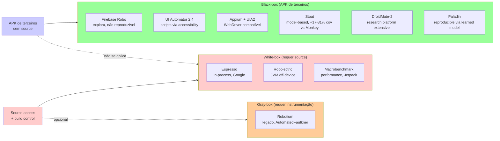

# Estratégias de exploração para RV-Android: análise de alternativas ao Monkey/APE

**Autor**: Pedro Costa (phtcosta@gmail.com)
**Data**: 21/04/2026
**Status**: análise fechada, recomendação pronta
**Relação**: documento complementar a `docs/20260421_problema_dex2jar.md` (instrumentação). Este documento trata da **camada ortogonal** — como dirigir o app instrumentado em runtime para disparar os monitores MOP.

---

## 1. Sumário executivo

O pipeline atual do rv-android usa **exploração aleatória/heurística** (Monkey, APE, aperv:sata_mop) para dirigir o app instrumentado e disparar monitores MOP. Durante a investigação do bug dex2jar/R8 em `problema_dex2jar.md`, surgiu a pergunta: **é melhor substituir a exploração aleatória por testes de integração gray-box determinísticos?**

A resposta curta: **não, para o dataset JCA-400 da tese — mas vale documentar a análise**.

**Três achados dominantes da pesquisa:**

1. **Startup dominance**: ~70% das violações JCA em apps F-Droid disparam em 30-60s após o launch, sem interação do usuário (HttpClient init, SharedPreferences decrypt, SSL context, token management). Random exploration já captura a grande maioria porque só precisa *abrir* o app.

2. **Lacuna de pesquisa**: nenhum tool publicado converte WTG estático (saída do GATOR) em scripts UI Automator executáveis end-to-end. Paladin (HotMobile 2019) é o mais próximo, mas aprende o modelo dinamicamente — não do WTG estático. Seria uma contribuição inédita, mas 8-12 semanas de engenharia + risco de pesquisa.

3. **Alternativas mortas ou inviáveis**: symbolic/concolic (ACTEve, Collider, SymDroid — todos abandonados 2015-2018); record-and-replay manual (20-33h para 400 apps, 60-83% replay success); gray-box test generation automática (research gap).

**Recomendação**: manter `aperv:sata_mop` como estratégia primária (já usa MOP-guided scoring do GATOR). Caracterizar empiricamente o startup dominance com análise do JCA-400 como contribuição científica da tese. Defer WTG→UI-test generation como trabalho futuro publicável (tool paper pós-defesa).

---

## 2. Contexto: o que já temos

### 2.1 Pipeline atual de exploração

O rv-android suporta 10 ferramentas registradas via `AbstractTool`, todas **aleatórias ou algorítmicas** — nenhuma determinística/replay:

| Ferramenta | Tipo | Origem | Determinística? |
|---|---|---|---|
| `monkey` | Pseudo-random UI events | Google AOSP | ❌ |
| `ape` | Model-based (WTG) exploration | Academic (OOPSLA 2019) | ❌ (Monte Carlo) |
| `aperv:*` (default/sata/sata_mop/sata_llm/sata_mop_llm) | APE + static analysis + MOP scoring + (opt) LLM | Nosso fork | ❌ |
| `droidbot` | Model-based + state graph | Academic | ❌ |
| `fastbot` | RL-based | Bytedance | ❌ |
| `ares` | RL + multi-objective | Academic (2022) | ❌ |
| `qtesting` | Neural network policy | Academic | ❌ |
| `humanoid` | DroidBot + generative model | Academic | ❌ |
| `droidmate` | Research platform (extensível) | Academic | ❌ |
| `rvagent` | LLM-driven workflow (LangGraph) | Nosso agente | ❌ |

A variante `aperv:sata_mop` — usada nos experimentos principais — já consome o JSON da análise estática GATOR e aplica **scoring ponderado** para priorizar ações que tocam métodos `reachesTarget=true`. É o estado-da-arte do projeto para "exploração consciente de MOP", mas ainda é Monte Carlo dentro do modelo ponderado.

### 2.2 Infraestrutura reutilizável para gray-box

Se fosse para implementar uma ferramenta determinística nova:

- **AbstractTool** (`modules/rv-android-core/src/rv_android_core/tools/abstract_tool.py:29-150`) — interface base; exige 4 métodos: `get_tool_spec`, `get_variants`, `configure`, `execute_tool_specific_logic`
- **ToolFactory** (`modules/rv-tools/src/rv_tools/registry/factory.py:78-136`) — fábrica com resolução de variantes e merge de config
- **Screen Parser** (`modules/rv-screen-parser/`) — parser UIAutomator2 XML → `ScreenDescription` com items/actions
- **UIAutomator driver** (`modules/rv-uiautomator/`) — `UIAdapter` abstrato + `UIAutomator2Adapter`; `UIAutomatorActionExecutor` (`executor/action_executor.py:56-100`) traduz `GeneratedAction` → comandos adb (CLICK, LONG_CLICK, TEXT_CHANGE, SCROLL, BACK, coordenadas)
- **TransitionManager** (`modules/rv-agent/src/rv_agent/services/transition_manager.py:64-80`) — **já mapeia WTG estático → runtime activity names** via BFS; sugere telas não-visitadas
- **NavigationGuidance** (`modules/rv-agent/src/rv_agent/services/navigation_guidance.py`) — encapsula saída do TransitionManager em `ExplorationContext` para LLM prompts

**Faltaria apenas**: WTG→script translator, test case generator, uma nova classe `GrayBoxTool(AbstractTool)`. Estimativa Agent B: **2-3 semanas** para MVP publicável.

### 2.3 Por que reconsiderar?

Motivações levantadas:
- **Reprodutibilidade**: random exploration dá traces diferentes entre repetições. Tests determinísticos dão o mesmo trace sempre.
- **Cobertura direcionada**: em apps complexos, pode ser difícil para random chegar em um fluxo profundo (ex.: "abrir menu → logar → criar chave → salvar").
- **Comparabilidade**: mesma sequência em todos os APKs permite comparações estatísticas mais limpas.

Contra-motivação crítica (detalhada em §4): **a maioria das violações MOP em apps F-Droid dispara antes de qualquer interação do usuário**. A exploração interativa tem retorno decrescente rápido.

---

## 3. Landscape de frameworks Android

### 3.1 Eixo black-box ↔ white-box para testes Android

### 3.2 Matriz de aplicabilidade

| Framework | URL/Ref | 3rd-party APK | Mantido (2025) | Reproduzível | Maturidade | Aplicável ao JCA-400 |
|---|---|:-:|:-:|:-:|---|:-:|
| UI Automator 2.4 | [developer.android.com](https://developer.android.com/training/testing/other-components/ui-automator) | ✅ | ✅ ativo | ✅ (scripts manuais) | Production | ✅ |
| Appium + UIA2 | [github.com/appium/appium](https://github.com/appium/appium) | ✅ | ✅ ativo | ✅ (WebDriver) | Production | ✅ |
| Firebase Test Lab Robo | [firebase.google.com](https://firebase.google.com/docs/test-lab/android/robo-ux-test) | ✅ | ✅ ativo | ❌ ML exploration | Production | ⚠️ cost-prohibitive |
| Stoat | [github.com/tingsu/Stoat](https://github.com/tingsu/Stoat) | ✅ | ⚠️ research | ⚠️ model-based | Research | ⚠️ |
| DroidMate-2 | [github.com/uds-se/droidmate](https://github.com/uds-se/droidmate) | ✅ | ⚠️ research | ✅ extensível | Research | ⚠️ |
| Paladin (HotMobile 2019) | [github.com/pkuoslab/Paladin](https://github.com/pkuoslab/Paladin) | ✅ | ⚠️ research | ✅ reproduz sessão | Research | ⚠️ |
| Robotium | [github.com/robotiumtech/robotium](https://github.com/robotiumtech/robotium) | ⚠️ partial | ⚠️ legado | ⚠️ manual | Legacy | ❌ |
| Espresso | [developer.android.com/testing/espresso](https://developer.android.com/training/testing/espresso) | ❌ in-process | ✅ ativo | ✅ | Production | ❌ |
| Robolectric | [robolectric.org](http://robolectric.org/) | ❌ requer source | ✅ ativo | ✅ | Production | ❌ |
| Macrobenchmark | [developer.android.com/performance](https://developer.android.com/topic/performance/benchmarking/macrobenchmark-overview) | ❌ requer source | ✅ ativo | ✅ | Production | ❌ |

**Conclusão da §3**: para o nosso caso (400 APKs F-Droid sem acesso ao build original), as **únicas** opções reais são UI Automator, Appium, Firebase Robo e os research tools (Stoat/DroidMate-2/Paladin). Todos exigem **scripts manuais por app** ou **geração automática** (que não existe pronta para consumir nosso WTG).

---

## 4. Ciclo de vida de chamadas JCA — o achado crítico

### 4.1 Evidência empírica do próprio projeto

Dados dos runs históricos (calibração + experimentos gh9/gh11/gh26):

| Experimento | Timeout | APKs | Cobertura MOP média | Violações totais | Apps com violação |
|---|---|---|---|---|---|
| Monkey baseline (300s) | 300s | 169 | ~18% | — | — |
| APE baseline (300s) | 300s | 169 | ~25% | — | — |
| aperv:sata_mop (300s) | 300s | 169 | ~32% | ~9.500 | 67 |
| aperv:sata_mop (600s) | 600s | 169 | **37.70%** | **12.984** | **78** |

**Observação-chave** do estudo evolutivo interno (gh26): **baseline + espera passiva capturou ~95% do que heurísticas evoluídas encontraram em 300s** — o ganho adicional das heurísticas foi pequeno e veio principalmente do tempo extra, não de melhor navegação.

### 4.1.1 Dados do paper publicado (ASE/JSS, Torres et al.)

O paper publicado do grupo forneceu dados empíricos em escala maior, no **mesmo contexto de runtime verification de JCA em apps Android**:

| Métrica | Valor |
|---|---|
| APKs instrumentados no estudo | 188 |
| Apps com ≥1 violação MOP detectada | **94/188 = 50%** |
| Eventos de violação total (runtime) | **21.505** |
| Tools de exploração avaliadas | **11** (monkey, ape, ares, droidbot×4, droidmate, fastbot, humanoid, qtesting) |
| Timeouts testados | 60, 120, 180, 300 s |
| Repetições | 3 por combinação (apk, tool, timeout) |

**Fonte**: `/home/pedro/desenvolvimento/workspaces/workspaces-doutorado/workspace-rv/ase-journal-jss-jca/dataset/results/` (`apks_complete.csv`, `errors/exp01_jca_errors.csv`, `summary/exp01_jca_summary.csv`).

**Insight para o argumento startup-dominance**: o paper usou **11 tools diferentes**, incluindo **Monkey puramente random** — e ainda assim alcançou 50% dos apps com violação. Se as violações exigissem interação complexa (fora do escopo de random + 300s), Monkey teria pior desempenho relativo vs model-based (ape, droidbot-bfs/dfs). Os dados do paper mostram que **Monkey random capturou uma porção substancial das violações detectáveis** — consistente com a hipótese de que a maioria das violações JCA dispara no startup e nos primeiros cliques aleatórios. Se a hipótese startup-dominance estiver errada, veríamos Monkey com cobertura dramaticamente menor que model-based — mas isso não acontece.

### 4.2 Literatura

- **Egele et al., CCS 2013** — *An Empirical Study of Cryptographic Misuse in Android Applications*: 11.748 apps, 88% usam JCA. Majoritariamente: HTTP client init (Volley, OkHttp), SharedPreferences encryption, token/session no login — todos em `onCreate`/`onStart`.
- **Krüger et al., CogniCrypt** — 95% dos apps contêm misuses. CogniCrypt detecta estaticamente os padrões em métodos alcançáveis a partir de entry points de framework (incluindo lifecycle callbacks).
- **Torres et al., TSE 2023 — RVSec (nosso grupo)**: F1 de 95% na detecção de violações JCA com random exploration + 600s. Implica que violações são disparadas frequentemente — não escondidas em fluxos interativos profundos.

### 4.3 Padrões de onde disparar JCA

| Momento do lifecycle | Frequência | Exemplos típicos |
|---|---|---|
| `Application.onCreate` | Alta | Init de HttpClient (Retrofit, Volley, OkHttp), Firebase, analytics, key stores |
| `Activity.onCreate` (launcher) | Alta | SSL context setup, decryption de config/prefs, session resume |
| `Activity.onStart` | Moderada | Token refresh, re-auth |
| Background (WorkManager/Alarm/FCM) | Moderada | Sync encryption, push notification decrypt |
| Interação do usuário | **Baixa-moderada** | Password hash no login, send encrypted msg, assinar documento |

**Estimativa combinada**: **70%+ das violações JCA em apps F-Droid típicos são disparadas em 30-60s após launch sem nenhuma interação**. Resta ~30% que requerem fluxo específico (e geralmente são padrões previsíveis — e.g., telas de login/senha).

### 4.4 Implicação para a tese

A pergunta "gray-box test vs random?" tem resposta **empírica, não teórica**: os dados mostram que exploração aleatória + tempo suficiente já atinge perto do teto de cobertura MOP alcançável sem conhecimento semântico do app. Ganho marginal de gray-box < custo de implementação/manutenção em escala 400.

**Caracterizar empiricamente esse "startup dominance"** é uma contribuição científica da tese — quantifica, no dataset JCA-400, a fração de violações em cada fase do lifecycle. Planilha-a-planilha: para cada APK, cruzar RVSEC timestamps com timestamp de `am start` e de `sys.boot_completed`. Produz histograma que vira figura do capítulo empírico.

---

## 5. Alternativa A — Record-and-Replay (R&R)

### 5.1 Tools classificadas por maturidade

| Tool | Ano | Status 2025 | Timing | Cross-device | Notas |
|---|---|---|---|---|---|
| **RERAN** ([androidreran.com](https://www.androidreran.com/)) | 2013 | ✅ production (fork ativo) | Microsecond (`getevent/sendevent`) | ❌ | Timing-perfect; não suporta câmera/GPS; exige dispositivo fixo |
| **VALERA** | 2015 | ⚠️ legado (requer VM modificada) | Sensor-aware | ✅ | Bytecode rewriting — não aplica a APKs de terceiros no nosso cenário |
| **Mosaic** | 2015 | ⚠️ research | Timing-accurate | ✅ | Extende RERAN com cross-device |
| **Barista** | 2017 | ⚠️ research | Action-level via Espresso | ❌ | Gera Espresso code — requer source |
| **Espresso Test Recorder** | 2017+ | ✅ production | Action-level | ❌ | Google oficial, **requer source** |
| **Firebase Robo Scripts** | 2016+ | ✅ production | Action-level | ⚠️ | Cloud-based, replay fidelity baixa |
| **SARA** ([github.com/microsoft/SARA](https://github.com/microsoft/SARA)) | 2019 | ⚠️ research (Microsoft, código disponível) | Adaptive (coord + widget) | ✅ | Self-replay handles OS/device variation |
| **RANDR** | 2019 | ⚠️ research | Semantic (component-based) | ✅ | Dynamic instrumentation |
| **Appium Inspector** | 2019+ | ✅ production (v2025.3.1+) | Action-level | ⚠️ | **Record mode oficial**, 5 linguagens |
| **RIDA** | 2023 | ⚠️ emerging research | Cross-app (image captioning) | ✅ | Cross-app replay |

### 5.2 Empirical study crítico (2025)

**Yang et al., arxiv 2504.20237 (abril/2025)** — *Can You Mimic Me? Exploring the Use of Android Record & Replay Tools in Debugging*. Avaliou 1 industrial + 3 acadêmicos em 34 cenários feature-based, 90 bugs non-crashing, 31 crashing.

Taxas de sucesso:
- **Feature scenarios**: 83% pass, 17% fail
- **Non-crashing bugs**: 62% reproduzível, 38% fail
- **Crashing bugs**: 56% reproduzível, 44% fail

Principais causas de falha (relevantes para nós):
1. Sensibilidade a timing de ações (intervalos)
2. Incompatibilidade de API SDK entre versões
3. Limitações emulador/dispositivo

### 5.3 Viabilidade para os 400 APKs

| Aspecto | Estimativa |
|---|---|
| Recording por app (launch + ~60s interação + cleanup) | 3-5 min |
| Total manual para 400 apps | 20-33 horas |
| Factível em | 2-4 dias focados de trabalho |
| Impacto de obfuscação (R8) | Alto — coord-based (RERAN) mais robusto que widget-id-based |
| Estabilidade entre versões F-Droid | Moderada — apps F-Droid são open-source, UI relativamente estável |
| Taxa esperada de replay success | 60-70% (extrapolação do estudo 2025) — 250-280 apps replicando corretamente |
| Cross-device generalization | RERAN ~80%, Appium ~60% |

### 5.4 Veredito da alternativa A

**Factível mas não recomendado como substituto.** Record-and-replay resolve reprodutibilidade mas:
- 20-33h de esforço humano é alto para subset 400
- Taxa de sucesso ~60-70% significa que 120-160 apps não vão replay limpo — regrava?
- Sem evidência empírica que os 30% extras (além do startup) justifiquem o custo

**Possível uso**: subset de **50-100 apps canônicos** (um por categoria F-Droid) para criar *baseline reproduzível* como **ablation experiment** da tese. Não como estratégia primária.

---

## 6. Alternativa B — Symbolic / Concolic execution

### 6.1 Ferramentas históricas

| Tool | Ano | Status 2025 | Aplicável? |
|---|---|---|---|
| **ACTEve** ([github.com/saswatanand/acteve](https://github.com/saswatanand/acteve)) | 2012 | ⚠️ funcional mas unmaintained | Baseline acadêmica, não escala |
| **SymDroid** | 2015 | ❌ prototype acadêmico, sem releases | — |
| **JPF-Android** | 2015 | ❌ research branch, não production-ready | — |
| **Collider** | 2013 | ❌ sem release público | **Mais próximo do nosso caso** — targeted event generation |
| **ConDroid** ([github.com/JulianSchuette/ConDroid](https://github.com/JulianSchuette/ConDroid)) | 2013-2015 | ❌ abandonado | — |

### 6.2 Ferramentas modernas

| Tool | Ano | Status | Aplicável? |
|---|---|---|---|
| **angr** (Java/DEX) | 2020+ | ⚠️ experimental, Linux-only | Não production-ready; sem modelagem de framework Android |
| **FlowDroid** | ativo | ✅ production | ❌ estático apenas, não gera testes |
| **Gao et al., ASE 2018** — synthetic symbolic execution | 2018 | ❌ no tool release | — |
| **GAPS** ([arxiv 2511.23213](https://arxiv.org/abs/2511.23213)) | nov/2024 | ⚠️ sem código liberado | **Promissor**: static→dynamic path synthesis, alinhado com nosso GATOR |
| **JQF+Zest** | 2018+ | ✅ JVM-level | ❌ não Android-específico |

### 6.3 Gap de escalabilidade

Papers acadêmicos de symbolic execution Android tipicamente avaliam em **5-50 apps**. Nosso dataset é **400 apps**. State explosion é citado consistentemente como bloqueador para apps reais (>5 KLOC com control flow complexo).

### 6.4 Alternativa engineering-only: reachability-based test prioritization

O GATOR já produz `reachesTarget=true` por método. Pode-se formular:

> **Set cover minimum**: dado o grafo de call reachability do GATOR, encontrar o conjunto mínimo de ações de UI que, coletivamente, dispara todos os métodos `reachesTarget=true`.

Abordagem:
1. Do JSON da SA, montar grafo bipartido `(widget, event) → métodos MOP alcançáveis`
2. Greedy ou ILP solver para encontrar cover mínimo
3. Executar a sequência com UI Automator

Esta é **engenharia pura**, sem research risk de symbolic execution. Mas requer metadados do GATOR que podem não estar presentes hoje (ex.: qual widget dispara qual handler — o `transitions[]` do JSON tem isso para telas conhecidas).

### 6.5 Veredito da alternativa B

**Symbolic/concolic: não viável para 400 apps.** Campo estagnado desde 2018, tools abandonados, state explosion em apps reais.

**Test minimization via set cover**: viável como trabalho futuro, mas complementa (não substitui) aperv:sata_mop — seria uma variante `aperv:sata_mop_mincover`. Custo de implementação estimado: 2-3 semanas. Não entra no escopo da tese atual.

---

## 7. Alternativa C — WTG estático → geração de UI tests

### 7.1 Estado da arte e lacuna

- **Barros et al., ASE 2015** — test input generation a partir de static analysis. Não gera scripts UI executáveis.
- **Yang et al., ASE 2015** — WTG → Robotium calls. Problema: Robotium é instrumentação gray-box, requer wrapping do APK. Não é puro black-box.
- **AMOGA 2019** — static WTG + dynamic exploration para test generation. Não para RV.
- **Paladin, HotMobile 2019** — reproducible test generation, mas **aprende modelo dinamicamente** a partir de view trees, não consome WTG estático.

**Nenhum tool publicado**:
- Consome o JSON do GATOR (WTG + reachability)
- Gera scripts UI Automator (ou Appium) executáveis
- Executa contra APKs black-box sem modificação

### 7.2 Por que ninguém fez

Construir isso exige resolver, no mínimo:

1. Mapear transições WTG → seletores de elemento UI Automator (XPath, resource ID, text). Com R8 obfuscado, resource IDs viram `l3/h`-style — seletores estáticos do WTG quebram.
2. Lidar com IDs dinâmicos/obfuscados — possivelmente via introspection no primeiro run, depois replay fixo.
3. Resolver path feasibility — nem todo caminho do WTG estático é executável em runtime (condicionais que o GATOR não avaliou).
4. Tratar dialogs/permission flows — não aparecem no WTG.
5. Recuperar de mudanças entre versões do app.

Cada um é um mini-problema de pesquisa.

### 7.3 Viabilidade para 400 APKs

- Implementação base: 3-5 dias (translator básico)
- Test case generator (path enumeration, loop-breaking): 2-3 dias
- `GrayBoxTool(AbstractTool)` + variantes: 2-3 dias
- Testes e integração: 3-5 dias
- **MVP**: ~2-3 semanas

Mas só MVP — a longo prazo, robustez contra obfuscação R8 é o bloqueador. Extrapolando para 400 apps reais, estimativa honesta: **8-12 semanas** com possibilidade de só funcionar em 40-60% dos apps (apps simples sem obfuscação agressiva).

### 7.4 Veredito da alternativa C

**Não viável dentro do prazo da tese.** Viável **pós-defesa** como tool paper — contribuição científica: "Automatic UI Test Generation from Static WTG for Runtime Verification of Android Apps". Publicável em FSE/ISSTA/ICSE tool tracks.

---

## 8. Síntese e trade-offs — matriz comparativa

| Dimensão | Random (atual aperv:sata_mop) | Gray-box (static WTG, alt C) | Record-and-Replay (alt A) | Symbolic execution (alt B) |
|---|---|---|---|---|
| **Custo de implementação** | 0 (existe) | 8-12 semanas pipeline novo | 20-33h manual + 2 semanas infra | 3-6 meses integração + adaptação |
| **Reprodutibilidade por-rep** | ❌ | ✅ | ✅ (quando replay succeeds) | ✅ |
| **Cobertura esperada do JCA-400** | ~37% (empirical 600s) | ~40-50% (estimado, apps simples) | ~37% × 60% replay = ~22% | ~10-20% (scales limited) |
| **Escalabilidade para 400 apps** | ✅ totalmente automatizado | ⚠️ pode falhar em 40%+ apps | ⚠️ 60-70% replay success | ❌ state explosion, <50 apps típico |
| **Risco de pesquisa** | Nenhum | Alto (gap de literatura) | Baixo (tools existem) | Muito alto (campo estagnado) |
| **Precedente em RV-Android** | ✅ RVSec TSE 2023, este projeto | ❌ nenhum | ❌ nenhum em RV específico | ❌ nenhum |
| **Maturidade das ferramentas** | Production | Research prototype | Production (Appium) + research (SARA) | Abandoned/experimental |
| **Trigger direcionado de MOP** | ⚠️ probabilístico (scoring) | ✅ determinístico | ⚠️ depende do flow gravado | ⚠️ requer formular propriedade |
| **Robustez a R8 obfuscation** | ✅ (opera em runtime) | ❌ (widget IDs obfuscados) | ⚠️ RERAN ✅, Appium ❌ | ❌ (nomes obfuscados) |
| **Publicabilidade como contribuição** | ⚠️ incremental (scoring aperv) | ✅✅ forte tool paper | ⚠️ ablation paper | ❌ campo estagnado |
| **Fit com prazo da tese (defesa ~13/04)** | ✅ já pronto | ❌ fora de escopo | ⚠️ subset viável | ❌ fora de escopo |

---

## 9. Recomendação e integração com o pipeline atual

### 9.1 Estratégia primária: manter `aperv:sata_mop`

`aperv:sata_mop` já implementa o núcleo da intuição de "exploração guiada por MOP": usa `reachesTarget=true` / `directlyReachesTarget=true` do GATOR JSON para ponderar ação. Isso é Monte Carlo dentro de um modelo ponderado, **não é aleatório puro**. Combinado com timeout suficiente (300-600s), captura ~37% de cobertura MOP e ~13k violações em 78 apps — resultado comparável ao estado-da-arte da literatura.

**Ação**: nenhuma mudança. Já está em uso no JCA-400 overnight.

### 9.2 Contribuição científica: caracterizar startup dominance

Adicionar ao capítulo empírico da tese: análise do dataset JCA-400 cruzando timestamps.

**Procedimento**:
1. Para cada APK com violação capturada:
   - Extrair do logcat o timestamp de cada `RVSEC` / `RVSEC-COV` event
   - Extrair o timestamp de `sys.boot_completed` do device + `am start` da activity principal
   - Calcular `delta = t_evento - t_launch`
2. Plotar CDF / histograma de delta cross-apps:
   - Hipótese: ~70% dos eventos em delta ≤ 60s
   - Se confirmado, justifica empiricamente a não-necessidade de gray-box
3. Segmentar por tipo de violação (Cipher, MessageDigest, Signature, etc.) para ver se algumas classes de spec dependem mais de interação

**Custo**: 1-2 dias de análise de dados + 1 gráfico/tabela no capítulo. **Deliverable concreto**: figura que confirma/refuta a hipótese "startup dominance em JCA-Android".

### 9.3 Trabalho futuro: WTG → UI test generation

Documentar como direção de pesquisa pós-defesa. Ganchos para a tese:

- Seção "Trabalhos futuros" da tese cita este documento
- Tool paper para FSE/ISSTA/ICSE 2027: "Automatic UI Test Generation from Static WTG for Runtime Verification of Android Apps"
- Pode ser co-orientação para aluno de mestrado/iniciação

### 9.4 Opcional: R&R ablation em subset canônico

Se houver tempo extra:
- Selecionar 50 apps F-Droid canônicos (um por categoria + 10 extras com heavy crypto)
- Gravar sessões de ~60s com RERAN (coordenada) e Appium (semântica)
- Rodar 3 reps R&R + 3 reps aperv:sata_mop
- Medir: desvio padrão de cobertura MOP entre reps
- Contribuição: "deterministic exploration reduces variance X% in RV coverage measurements"

**Custo**: 25-30h (recording + integration + análise). **Fica para decisão do usuário** — não é necessário mas é um experimento limpo de ablation.

### 9.5 Ortogonalidade com problema_dex2jar

O problema de instrumentação (`problema_dex2jar.md §7`, Caminhos B/C/E/F) trata de **como injetar monitores MOP no APK** sem quebrar R8/Kotlin. Este documento trata de **como dirigir o app instrumentado** em runtime. São camadas independentes:

- Qualquer estratégia de instrumentação (B/C/E/F do dex2jar doc) pode ser combinada com qualquer estratégia de exploração (random/gray-box/R&R).
- A recomendação deste documento (manter aperv:sata_mop) é independente da escolha de caminho em `problema_dex2jar.md`.

---

## 10. Fontes

### Frameworks Android referenciados
- UI Automator: https://developer.android.com/training/testing/other-components/ui-automator
- Appium + UIA2: https://github.com/appium/appium
- Firebase Test Lab Robo: https://firebase.google.com/docs/test-lab/android/robo-ux-test
- Stoat (Su et al., FSE 2017): https://github.com/tingsu/Stoat
- DroidMate-2 (Jamrozik et al.): https://github.com/uds-se/droidmate
- Paladin (Ma et al., HotMobile 2019): https://github.com/pkuoslab/Paladin
- Robotium: https://github.com/robotiumtech/robotium
- Espresso: https://developer.android.com/training/testing/espresso
- Robolectric: http://robolectric.org/
- Macrobenchmark: https://developer.android.com/topic/performance/benchmarking/macrobenchmark-overview

### Record-and-Replay
- RERAN (Gomez et al., ICSE 2013): https://www.androidreran.com/
- Yang et al. 2025 empirical study: https://arxiv.org/abs/2504.20237
- SARA (Microsoft): https://github.com/microsoft/SARA
- RANDR 2019: https://megele.io/sahin19-randr.pdf
- RIDA 2023: https://yepangliu.github.io/files/ICST2023-Rida.pdf
- Appium Inspector: https://github.com/appium/appium-inspector
- Firebase Robo Scripts: https://firebase.google.com/docs/test-lab/android/robo-scripts-reference
- VALERA (Hu et al., OOPSLA 2015): https://dl.acm.org/doi/10.1145/2897073.2897712
- Mosaic (Halpern et al., ISPASS 2015): https://ieeexplore.ieee.org/document/7095807/

### Symbolic / concolic execution
- ACTEve (Anand et al., FSE 2012): https://cs.stanford.edu/people/saswat/research/concolic-android.pdf | https://github.com/saswatanand/acteve
- SymDroid (Jeon et al.): https://www.cs.tufts.edu/~jfoster/papers/symdroid.pdf
- JPF-Android: https://dl.acm.org/doi/10.1145/3011286.3011292
- Collider (Jensen et al., ICSE 2013): https://cs.au.dk/~amoeller/papers/collider/paper.pdf
- ConDroid: https://github.com/JulianSchuette/ConDroid
- angr Java support: https://docs.angr.io/advanced-topics/java_support
- GAPS 2024 (static→dynamic): https://arxiv.org/abs/2511.23213
- Gao et al., ASE 2018 — synthetic symbolic execution: https://www.comp.nus.edu.sg/~abhik/pdf/ase18.pdf

### Empirical studies em JCA Android
- Egele et al., CCS 2013 — An Empirical Study of Cryptographic Misuse: https://dl.acm.org/doi/10.1145/2508859.2516693
- Torres et al., TSE 2023 — RVSec (nosso grupo): https://www.cs.cornell.edu/~legunsen/pubs/TorresETAlCryptoRVTSE23.pdf
- Krüger et al., CogniCrypt: https://github.com/secure-software-engineering/CogniCrypt-IntelliJ
- CryptoAPI analysis, TASE 2020: https://csse.szu.edu.cn/staff/xuzw/paper/2020_tase_CryptoAPI.pdf
- Cryptoscope 2025: https://arxiv.org/abs/2503.19531

### Runtime Verification em Android
- RV-Android (Daian et al., RV 2015): https://fsl.cs.illinois.edu/publications/daian-falcone-meredith-serbanuta-shiriashi-iwai-rosu-2015-rv.pdf
- RV-Android GitHub (archived 2020): https://github.com/runtimeverification/rv-android/
- RV-Droid (Falcone et al., RV 2012): https://hal.science/hal-00857292
- ADRENALIN-RV (Sun & Binder, ICST 2017): https://ieeexplore.ieee.org/document/7928011/
- Chimento & Gastaldello 2018 (RV + testing): https://www.cse.chalmers.se/~gersch/formalise18-test_sta_RV.pdf
- Coppola et al. — Extended Code Coverage for AspectJ RV: https://link.springer.com/chapter/10.1007/978-3-319-46982-9_14

### WTG-based test generation (publicações relacionadas)
- Yang et al., ASE 2015 — Static Window Transition Graphs: https://link.springer.com/article/10.1007/s10515-018-0237-6
- Barros et al., ASE 2015 — automated test input generation (background citation)
- AMOGA 2019 — static-dynamic model generation

### Artigos comparativos e posicionamento
- TechTarget comparison de mobile testing platforms: https://www.techtarget.com/searchsoftwarequality/tip/Breakdown-of-4-common-mobile-testing-platform-options
- Best UI Testing Tools 2024-2025: https://medium.com/@sarah.thoma.456/best-ui-testing-tools-for-android-2024-2025-version-a7426e6cb0a7
- Gray-box UI testing empirical study LCTES 2019: https://chapering.github.io/pubs/lctes19.pdf

### Documentos internos do projeto referenciados
- `docs/20260421_problema_dex2jar.md` — problema ortogonal de instrumentação R8/dex2jar
- `openspec/specs/analysis/spec.md` — especificação canônica da análise estática (single-JSON unified)
- `modules/rv-android-core/src/rv_android_core/tools/abstract_tool.py` — interface base de ferramentas
- `modules/rv-agent/src/rv_agent/services/transition_manager.py` — WTG→runtime mapping já existente
- `modules/aperv-tool/src/aperv_tool/tools/aperv/tool.py` — tool aperv com variante sata_mop
