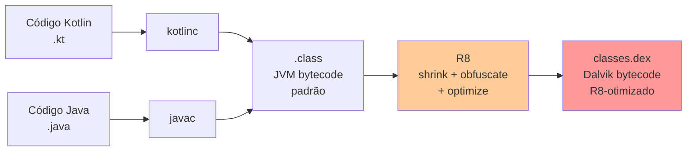
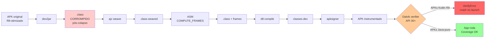
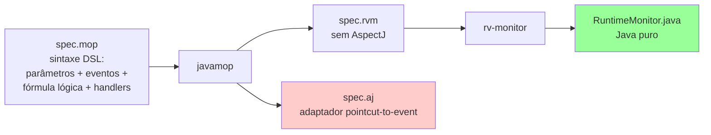
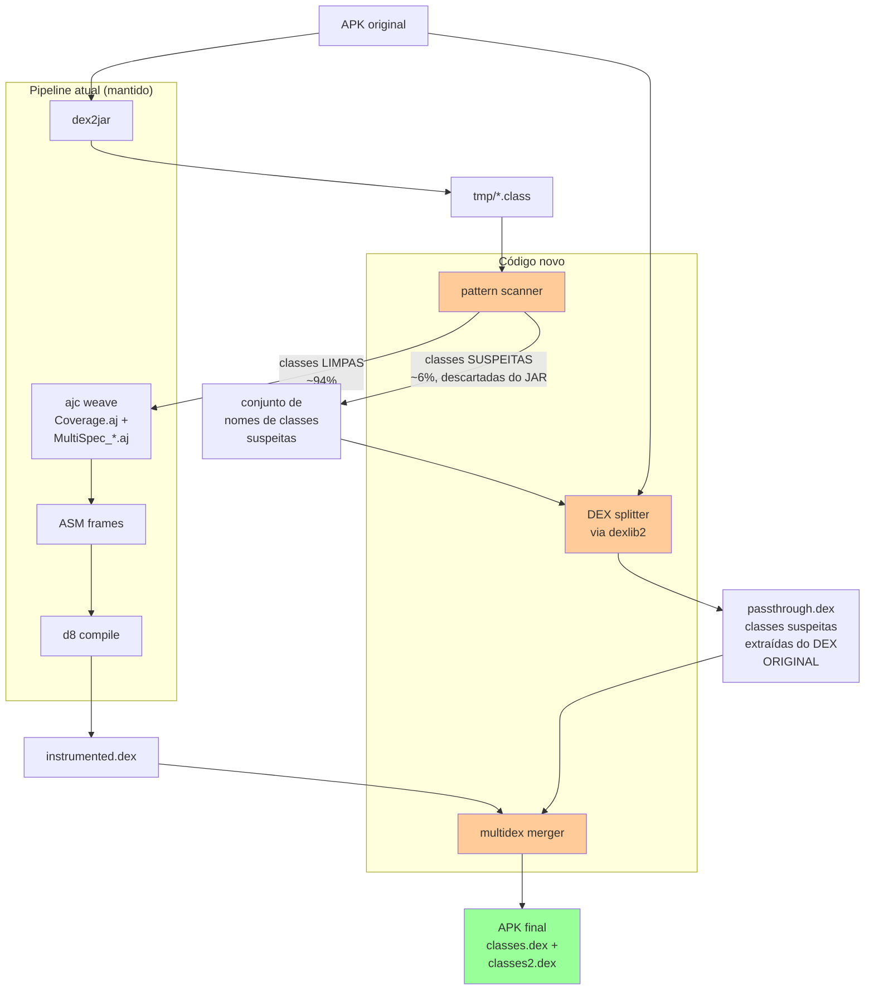
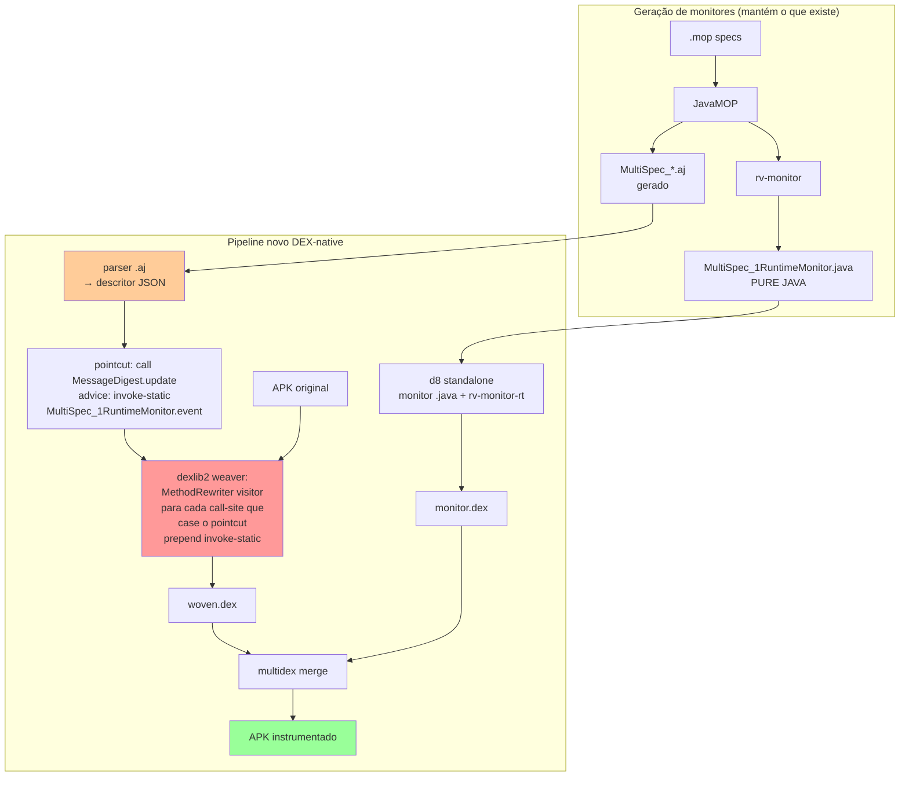
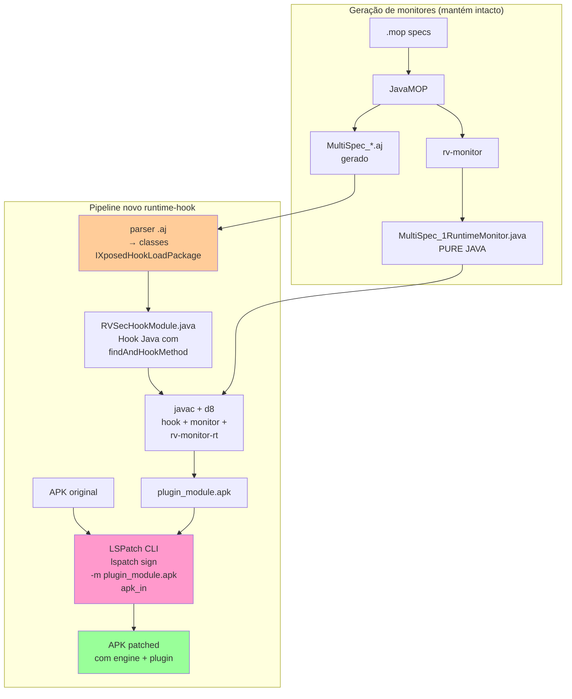
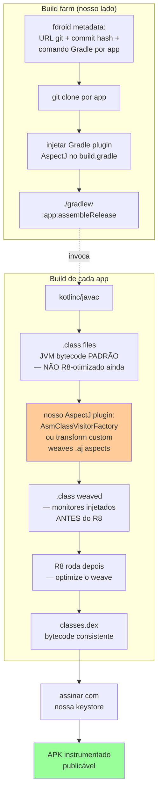

# O problema de round-trip DEX↔JVM bytecode no pipeline rv-android

**Autor**: Pedro Costa (phtcosta@gmail.com)
**Data**: 21/04/2026
**Status**: diagnóstico fechado, plano de ação pendente
**Contexto**: descoberto durante a validação runtime da change `gh50-improve-instrumentation`, após a pipeline passar de 17% → 88% de sucesso a nível de pipeline mas falhar a nível runtime em APKs modernos Kotlin.

---

## 0. Baseline histórico e motivação

### 0.1 O paper publicado (Torres et al.)

Referência: **Torres, Cavalcanti, Ribeiro, Bonifácio, Souza, Legunsen** — *Runtime Verification of Crypto APIs: An Empirical Study* (aguardando publicação ASE/JSS). PDF local: `/home/pedro/desenvolvimento/workspaces/workspaces-doutorado/workspace-rv/ase-journal-jss-jca/main.pdf`.

O paper valida o pipeline RV-Android (JavaMOP + dex2jar + ajc + d8) em dataset F-Droid de 2018-2020:

| Métrica | Valor |
|---|---|
| APKs candidatos F-Droid | 557 |
| **Instrumentados com sucesso** | **193/557 = 34.6%** |
| Falhas de instrumentação | 364/557 = 65.4% |
| Descartados por falta de análise estática | 5 |
| **APKs no estudo final** | **188** |
| **Apps com ≥1 violação MOP detectada** | **94/188 = 50%** |
| Eventos de violação total (runtime) | **21.505** |
| Tools de exploração avaliadas | 11 (monkey, ape, ares, droidbot×4, droidmate, fastbot, humanoid, qtesting) |
| Timeouts testados | 60, 120, 180, 300 s × 3 reps |

Top specs mais violadas no estudo (do `exp01_jca_errors.csv`):

| Spec | Events |
|---|---|
| SSLContextSpec | 7.360 |
| MessageDigestSpec | 6.701 |
| SecretKeySpecSpec | 2.678 |
| CipherSpec | 1.587 |
| KeyStoreSpec | 1.347 |

**Fonte dos números**: `/home/pedro/desenvolvimento/workspaces/workspaces-doutorado/workspace-rv/ase-journal-jss-jca/dataset/results/apks/apks_complete.csv`, `.../instrument/exp01_jca_instrument_errors.json`, `.../errors/exp01_jca_errors.csv`.

### 0.2 O que mudou em 2026: dataset novo, mesma pipeline

Em março/abril de 2026 preparamos um **novo dataset JCA-400** — 400 APKs F-Droid contemporâneos (2023-2026) — para revalidar o pipeline antes de aplicar ferramentas novas (`aperv:sata_mop`, `rv-agent` LLM).

Aplicando o **mesmo pipeline** do paper no dataset novo:

| Run | Pipeline success | Fonte |
|---|---|---|
| Paper ASE/JSS (2018-2020 F-Droid) | 193/557 = **34.6%** | paper |
| JCA-400 first run (pré-gh50) | 70/400 = **17.5%** | `openspec/changes/gh50-improve-instrumentation/proposal.md §1` |
| **Queda** | **−17.1 pontos percentuais** | mesmo pipeline, dataset novo |

**Essa queda motivou a gh50**. O pipeline que funcionava em 2023 estava colapsando em APKs F-Droid modernos, e era preciso diagnosticar a causa.

### 0.3 Progresso após gh50 §1-18

Após ciclos de fixes de instrumentação (gh50 §1-18), a taxa de pipeline success evoluiu:

| Run | Data | Pipeline success |
|---|---|---|
| Paper ASE/JSS | 2023 | 34.6% (193/557) |
| JCA-400 first run | 03-04/2026 | 17.5% (70/400) |
| JCA-400 overnight (§1-8 completos) | 20-21/04/2026 | **54.7%** (219/400) |
| JCA-400 final (§9-18 completos) | 21-22/04/2026 | **74.5%** (298/400) |

**Recuperamos +57 pontos** a nível de pipeline. Porém, a validação runtime revelou que o ganho de instrumentação **não se traduz em cobertura runtime proporcional** — apps instalam mas crashaam silenciosamente na inicialização. A investigação desse gap runtime é o objeto deste documento.

Os números empíricos de runtime (JCA-400 atual, **298 tasks executadas, experimento completo**):
- Tasks COMPLETED: **198/298 (66.4%)** — apps que rodaram 300s de aperv sem travar
- Tasks ERROR: 100/298 (33.6%) — dominantemente `INSTALL_FAILED_OLDER_SDK` e ABI mismatch (trade-off conhecido do rollback API 29)
- Apps com violação MOP detectada: **14/198 (7.1%)** vs paper 50%
- Apps com method_coverage > 0 (runtime-effective): 72/198 = **36.4%**
- Method coverage médio nos COMPLETED: **7.39%** vs paper ~30% estimado
- **63.6% dos apps com 0% coverage** — indicador de VerifyError/crash na inicialização (126/198)

**Top apps com violação** (runtime efetivo entre JCA-400):

| APK | Violações | method_coverage |
|---|---|---|
| com.acktarius.concealauthenticator_39 | 5 | 56.2% |
| com.alovoa.expo_48 | 5 | 62.5% |
| com.mouzinho.pokebase_2 | 4 | 56.2% |
| com.destructo.botox_43 | 3 | 38.1% |
| com.infomaniak.meet_28 | 3 | 42.8% |
| com.oliverszabo.tcrbdetector_300000 | 3 | 30.4% |
| com.shalenmathew.movieflix_5 | 3 | 28.9% |
| gizz.tapes.foss_63 | 3 | 17.8% |
| xyz.numerus_2 | 3 | 54.8% |
| +5 outros com 3 violações | 3 cada | 0.8-6.5% |
| +2 outros com 1 violação | 1 cada | ~0.6-6.5% |

A queda de 50% → 7.1% em **apps-com-violação** apesar da recuperação no pipeline é o sintoma do problema diagnosticado nos capítulos seguintes. Em termos absolutos: paper detectou **21.505 events** em 188 apps (média ~114 events/app que violaram); no JCA-400 com gh50 §9-18, 14 apps detectaram ~50 events totais (~3.5 events/app) — duas ordens de magnitude menos. A instrumentação reportada como "sucesso" a nível pipeline não se traduz em cobertura runtime utilizável para a maioria dos APKs modernos.

---

## 1. Sumário executivo

A pipeline `APK → dex2jar → .class → ajc (weave) → ASM (frames) → d8 → APK instrumentado` produz APKs que **falham em runtime** com `java.lang.VerifyError` em API 30+ para qualquer APK otimizado pelo R8 em modo release com classes alvo de `class-inlining`. APKs puramente Java sem padrões class-inlining (ex.: `com.futsch1.medtimer`) funcionam perfeitamente; APKs Kotlin com ofuscação agressiva (ex.: `com.grappim.hateitorrateit` — 4631 classes ofuscadas) falham 100%.

**Causa raiz**: o R8, em sua passada de otimização, emite idiomas Dalvik que **não possuem equivalente válido em bytecode JVM** por violarem a regra JVMS §4.10.1.9 (o tipo alocado por `NEW` deve casar com o declarante do `INVOKESPECIAL <init>`). O dex2jar é forçado a colapsar o idioma (usando o tipo do pai no lugar do tipo do filho) para produzir `.class` que compile, mas o colapso quebra o contrato de tipo com `putfield`/`iput` subsequentes. Nenhum conversor DEX→JVM conhecido (dex2jar, enjarify, Soot via BafASMBackend) resolve o problema — é limitação estrutural da JVMS, não bug de ferramenta.

**Impacto**: estima-se 75–90% do dataset JCA-400 afetado (a maioria é Kotlin moderno). Os APKs "instrumentados com sucesso" a nível de pipeline continuam crashando no launcher sem emitir nenhum evento MOP/Coverage.

**Caminhos possíveis**, em ordem de viabilidade (detalhados na seção 7):
1. **Bypass por classe** (dexlib2 + multidex) — instrumentar apenas classes do app, deixar classes biblioteca intactas. ~4-5 dias.
2. **Migrar advice para DEX-native** (dexlib2 + rv-monitor Java-only) — elimina dex2jar+ajc do caminho crítico, instrumentação estática em DEX. ~10-15 dias.
3. **Runtime hooking via LSPatch** (análogo ao Java `-javaagent`/AspectJ LTW, mas para Android) — sem nenhum bytecode rewriting, interceptação por nome de método no runtime. Imune a qualquer otimização R8. ~7-10 dias. **Provavelmente o melhor balanço custo/cobertura.**
4. **Source-build + weaving pré-R8** (F-Droid source + Gradle AspectJ plugin pré-R8) — teoricamente a forma "correta", mas ecossistema AspectJ+AGP 8 abandonado em 2022-2023; shrinkage provável de 40-50% do dataset. **Viável só como subset piloto para ground-truth**. Ver §7.6.
5. ~~**Rollback API 30→29**~~ — ❌ hipótese testada em 21/04/2026 e rejeitada. Type-confusion é hard-fail em qualquer versão Dalvik/ART desde API 21; API 29 não ajuda. Ver §7.2.
6. **Documentar limitação e reportar 3 camadas de success** (`pipeline` / `install` / `runtime`) — único caminho viável pré-defesa. ~1 dia.

---

## 2. Contexto: o pipeline atual

### 2.1 Fluxo de build do app (fora do nosso controle)



O R8 é o compilador/otimizador oficial do Google desde Android Gradle Plugin 3.4 (2019). Substituiu ProGuard+d8. Em modo release (`minifyEnabled true`, padrão), roda automaticamente em TODO APK publicado na Play Store e F-Droid moderno. Aplica três passos em uma só passada:

1. **Shrinking**: remove classes/métodos não-usados (dead code elimination).
2. **Obfuscation**: renomeia classes/métodos para letras curtas (`l3.h`, `p4.v`, `ajc$tjp_0`). É daí que vêm os nomes ofuscados nos APKs JCA-400.
3. **Optimization**: reescreve bytecode agressivamente. Inclui class-inlining, horizontal/vertical class merging, constructor outlining, staticizer, lambda merging, nest-access elimination, enum unboxing — ver tabela na §4.

Até o passo 3, o bytecode é válido para JVM. **O passo 3 muda isso.**

### 2.2 Pipeline rv-android (onde o problema ocorre)



---

## 3. O idioma Dalvik que não volta para JVM

### 3.1 Exemplo concreto observado

APK `com.grappim.hateitorrateit.fdroid_30.apk`, classe `l3.h` (antes da ofuscação era provavelmente `DragAnchorDragAndDropTarget`).

**Jerarquia:**
- `l3.h` é a classe pai (`public class l3.h extends Object`)
- `p4.v` é uma subclasse (`public final class p4.v extends l3.h`)
- `p4.v` declara apenas um campo: `public View f` — **nenhum construtor próprio**

**DEX original (o que Dalvik aceita):**
```smali
# dentro de l3.h.<init>(Landroid/view/View;)V
new-instance v0, Lp4/v;                                   ; aloca p4.v (filha)
invoke-direct {v0, v1, p1}, Ll3/h;-><init>(ILjava/lang/Object;)V
                                                          ; chama init do pai em cima da filha!
iput-object p1, v0, Lp4/v;->f:Landroid/view/View;        ; seta campo da filha
```

Esta sequência é uma otimização do R8 (class-inlining):
- A classe `p4.v` tinha um único construtor `<init>(Landroid/view/View;)` que só chamava `super(16, view)` e fazia `this.f = view`
- R8 identificou que o corpo do construtor era trivial e o inlineou no call-site
- O método `p4.v.<init>` foi removido do DEX (o R8 não precisa mais dele)
- O call-site agora chama direto o construtor do pai + seta o campo manualmente

### 3.2 O que o dex2jar produz

```
0: aload_0
1: bipush 17
3: putfield  #30     // Field l3/h.d:I
6: aload_0
7: invokespecial  #33     // Method java/lang/Object."<init>":()V
10: getstatic  #95     // Field android/os/Build$VERSION.SDK_INT:I
13: bipush 30
15: if_icmplt 42
18: new  #2       // class l3/h          ← deveria ser p4/v, COLAPSADO para l3/h
21: dup
22: bipush 16
24: aload_1
25: invokespecial  #121    // Method "<init>":(ILjava/lang/Object;)V
28: astore_2
29: aload_2
30: aload_1
31: putfield  #126    // Field p4/v.f:Landroid/view/View;   ← inconsistente!
```

A linha 18 deveria ser `new p4/v` para casar com o `putfield p4/v.f` da linha 31. Mas o dex2jar colapsou para `new l3/h` porque:
- O `invoke-direct` DEX aponta para `Ll3/h;-><init>` → em JVM isso vira `invokespecial l3/h.<init>`
- JVMS §4.10.1.9 exige que o tipo de `new` case com o declarante do `invokespecial <init>` — senão o verifier da JVM rejeita
- Portanto o `new` **tem que ser** `l3/h` para o `.class` compilar

O dex2jar escolheu "passar no javac" a "preservar semântica". O resultado é bytecode `.class` que:
- Compila sem warnings
- Passa ajc (BCEL não valida, só manipula)
- Passa ASM COMPUTE_FRAMES (rastreia registrador como `l3/h`, pois o NEW diz `l3/h`)
- Passa d8 (confia no input)
- É re-emitido em DEX final como: `new-instance Ll3/h; ... iput p4/v.f` — inconsistente

### 3.3 O que o Dalvik verifier detecta

No API 30, logcat do crash:
```
java.lang.VerifyError: Verifier rejected class l3.h:
  void l3.h.<init>(android.view.View) failed to verify:
  [0x14] cannot access instance field android.view.View p4.v.f
  from object of type Precise Reference: l3.h
```

Traduzindo: "no offset 0x14 da classe `l3.h`, tentou-se acessar o campo `p4.v.f` via um registrador de tipo `l3.h`; campo `f` não existe em `l3.h` nem em ancestrais — acesso rejeitado".

### 3.4 Por que `medtimer` funciona

`com.futsch1.medtimer_162.apk`:
- 12.427 classes totais
- **0 classes ofuscadas** (nomes curtos estilo `l3/h`)
- Compilado sem R8 full-mode, ou sem Kotlin metadata, ou com classes "grandes" que não passam pela heurística de class-inlining

Resultado: 909 eventos `RVSEC-COV` emitidos em 60s de monkey. Funcionamento perfeito.

---

## 4. Por que JVMS §4.10.1.9 não permite expressar o idioma

### 4.1 Regra da spec

Do JVMS 11 §4.10.1.9 (type checking para `invokespecial`):

> **If the method's name is `<init>`**, then:
> - The type on top of the stack must be `uninitialized(Offset)` where `Offset` is the offset of a `new` instruction, OR the type must be `uninitializedThis`.
> - The class referenced by the `new` at `Offset` (or the class containing the current code for `uninitializedThis`) **must equal** the class declaring the `<init>` method being invoked.

Seja `Sub extends Parent`, com `Parent.<init>(...)` mas `Sub` não declara `<init>(...)`. O idioma Dalvik quer: `new Sub; invokespecial Parent.<init>`. A JVMS rejeita porque o `new` (Sub) não casa com o declarante do `<init>` (Parent).

A única exceção é `uninitializedThis`, que existe apenas em `Sub.<init>` ao fazer `super(...)` — e o chamador no nosso caso é `l3.h.<init>`, NÃO `p4.v.<init>`. Portanto a exceção não se aplica.

### 4.2 Lista de otimizações R8 que produzem DEX impossível em JVM

Baseado em análise do código-fonte do R8 (https://r8.googlesource.com/r8/) e documentação de Jake Wharton:

| Otimização | Arquivo no R8 | Como produz DEX-only |
|---|---|---|
| **Class inlining** | `ir/optimize/classinliner/ClassInliner.java` | Dissolve classes pequenas no caller. Sequência `new-instance + invoke-direct <init> + iput` onde `iput` roda antes do `<init>` completar via `uninitializedThis` — rejeitada por JVMS §4.10.1.9. |
| **Horizontal class merging** | `horizontalclassmerging/` | Merge de classes irmãs; construtores viram dispatcher com discriminator. Produz flows multi-construtor com `iput` em campos de classes originais distintas. |
| **Vertical class merging** | `classmerging/` | Colapsa pai no filho; filhos referenciam campos "através" da herança abolida. `iput Sub.f` que em JVM exigiria campo em Sub antes de `super.<init>` rodar — impossível. |
| **Constructor outlining / argument propagation** | `ir/optimize/outliner/`, `optimize/argumentpropagation/` | Extrai prefixos de `<init>` compartilhados, deixa fragmentos sintéticos que chamam `super.<init>` e escrevem campos do caller de formas que stack-map da JVM não expressa. |
| **Staticizer** | `ir/optimize/staticizer/ClassStaticizer.java` | Converte instance methods para static. Em Kotlin `companion object` / `object` singletons, elimina também a classe-holder — callers passam de `sget-object + invoke-virtual` a `invoke-static` sem receiver. JVM não tem análogo direto. |
| **Lambda merging / lambda groups** | `ir/optimize/lambda/kotlin/KStyleLambdaGroup.java` | Merge de classes lambda distintas em uma só com tag field; mesmos flows multi-construtor do horizontal merging. |
| **Nest-based access optimization** | `ir/optimize/NestReducer` | Remove atributos `NestHost`/`NestMembers` (JVM 11+); DEX não tem conceito de nest. Strip de access-bridges sintéticas. |
| **Enum unboxing** | `ir/optimize/enums/` | Substitui instâncias de enum por `int` ordinais no call-site. Classe enum ainda existe mas singletons são materializados inline. |

O R8 não tem lista pública "lossy transformations". O reconhecimento oficial mais próximo é o post "Mitigating soft verification issues in R8 and D8" (Morten Krogh-Jespersen, Android Developers blog), que confirma: **R8 raciocina sobre o verifier Dalvik/ART, não o verifier JVM**.

### 4.3 Kotlin vs Java: heurística, não gating

O padrão é **R8-específico, não Kotlin-específico**. Um APK Java-only com `minifyEnabled true` (AGP 3.4+) em release passa pelos mesmos passes. `allowaccessmodification` aumenta agressividade dos passes igualmente. Por que Kotlin dispara 100× mais:

- Kotlin emite muitas classes pequenas que casam perfeitamente com os predicados de elegibilidade do class-inliner: lambda synthetics (`$lambda$N`), `Continuation` de coroutines, shells de `data class`, subclasses de `sealed class`, `companion object` holders, property delegates (`by lazy`, `Delegates.observable`), inline-class boxes.
- O compilador Kotlin é acoplado ao R8 via `kotlinx.metadata` — R8 tem passes dedicados em `ir/optimize/lambda/kotlin/` que não existem para padrões Java.
- Um app Java com objetos de domínio longos e sem lambdas sintéticas (tipo `medtimer`) quase não tem nada que passe no predicado, então os passes rodam mas não produzem nada para dissolver.

**Corolário empírico**: 4631 classes ofuscadas em `hateitorrateit` vs 0 em `medtimer` bate com a heurística exatamente — não é gate de linguagem.

---

## 5. Evidência experimental

### 5.1 Stacktrace das 6 APKs da Phase B

Log completo em `/tmp/smoke_install_api30_v9.log`. Resumo:

| APK | minSdk | obfuscated | status API 30 | VerifyError class |
|---|---|---|---|---|
| `com.futsch1.medtimer_162` | 26 | 0 | ✅ RVSEC-COV=909 | — |
| `app.pwhs.blockads_45` | ? | yes | ❌ FATAL | `cb.e0` — `register v9 has type Precise Reference: java.lang.Object but expected Precise Reference: kotlin.jvm.internal.y` |
| `co.adityarajput.notifilter_31` | ? | yes | ❌ FATAL | `w6.e` — `cannot access instance field int e5.b0.a from object of type Precise Reference: java.lang.Object` |
| `com.bartixxx.opflashcontrol_49` | 30 | yes | ❌ FATAL | `com.bumptech.glide.d` — `returning 'Precise Reference: x2.a', but expected from declaration 'Precise Reference: x2.c'` |
| `com.grappim.hateitorrateit.fdroid_30` | ? | yes | ❌ FATAL | `l3.h` — `cannot access instance field android.view.View p4.v.f from object of type Precise Reference: l3.h` |
| `org.eu.mumulhl.ciyue_863000` | ? | yes | ❌ FATAL (ARM-only) | `x5.b` |
| `xyz.blorpblorp.app_1776128916` | ? | yes | ❌ distinto: `NoClassDefFoundError: Lorg/aspectj/runtime/reflect/Factory;` (falha no merge aspectjrt, não VerifyError) |

Padrão: todas as VerifyErrors citam "Precise Reference" — terminologia específica do rastreamento de tipos do Dalvik ART. Todas mencionam ou `java.lang.Object` (parent universal) ou uma classe pai direta (`l3.h` é pai de `p4.v`, `x2.a` é pai de `x2.c`). Perfeitamente consistente com o colapso de tipo descrito na §3.

### 5.2 Verificação cruzada: dex2jar isolado

Rodamos dex2jar v2.4.35 (fork ThexXTURBOXx, versão mais recente, Março 2026) diretamente sobre o APK original `com.grappim.hateitorrateit.fdroid_30.apk`:

```bash
/tmp/d2j_new/dex-tools-2.4.35/d2j-dex2jar.sh -f -o orig_new.jar <apk>
unzip -o orig_new.jar l3/h.class
javap -c -p l3/h.class
```

Resultado: **mesmo colapso** na linha 18: `new #2 // class l3/h`. Confirmado que o bug é estrutural, não de versão. O fork mais novo tem exatamente o mesmo comportamento.

### 5.3 Localização do bug no código dex2jar

| Arquivo (dex2jar v2.4.35) | Linha | Role |
|---|---|---|
| `dex-translator/src/main/java/com/googlecode/d2j/dex/Dex2IrAdapter.java` | 417-418 | `NEW_INSTANCE` → IR `nAssign(locals[a], nNew(type))` — tipo alocado **preservado aqui** |
| `dex-translator/src/main/java/com/googlecode/d2j/dex/Dex2IrAdapter.java` | 619-623 | `INVOKE_DIRECT` → `nInvokeSpecial()` com declaring class do método |
| `dex-ir/src/main/java/com/googlecode/dex2jar/ir/ts/NewTransformer.java` | 91-113 | `replaceAST()` combina NEW + INVOKE_SPECIAL em INVOKE_NEW. **Aqui o tipo alocado é perdido**: usa `ie.getOwner()` (parent) para ambos |
| `dex-ir/src/main/java/com/googlecode/dex2jar/ir/expr/Exprs.java` | 175-176 | `nInvokeNew(regs, argTypes, owner)` tem **um único parâmetro `owner`** para tipo alocado E declarante do init — falha de design da IR |
| `dex-translator/src/main/java/com/googlecode/d2j/converter/IR2JConverter.java` | 795 | Emissão JVM: `asm.visitTypeInsn(NEW, toInternal(invokeExpr.getOwner()))` — usa o owner colapsado |

### 5.4 Como o Soot trata o mesmo padrão

Investigação no código do Soot (`/tmp/soot_src/`):

| Passo | Comportamento |
|---|---|
| DEX → Jimple (dexpler) | ✅ Preserva separado: `NewExpr.baseType` = `p4.v`, `SpecialInvokeExpr.methodRef.declaringClass` = `l3.h`. A IR Jimple tem as duas informações **distintas**. Ver `NewInstanceInstruction.java:59-62`, `MethodInvocationInstruction.java:424-430` |
| Jimple → DEX (`-f dex`) | ✅ **Round-trip lossless.** `DexPrinter` / `soot.toDex.ExprVisitor.java:898-900` emite `NEW_INSTANCE p4/v` + `INVOKE_DIRECT l3/h.<init>` preservados |
| Jimple → .class (`BafASMBackend`) | ❌ **Mesma trava.** `BafASMBackend.java:1428-1433,1790-1793` emite `NEW p4/v` e `INVOKESPECIAL l3/h.<init>` — classe falha JVMS §4.10.1.9 em qualquer verifier (ASM CheckClassAdapter, JVM classloader). ajc falha ao ler |

**Conclusão crítica**: Soot pode ser usado `DEX → Jimple → DEX` losslessly, mas NÃO pode ser usado como substituto do dex2jar se quisermos manter ajc no pipeline. **JVMS é o teto absoluto** — nenhum conversor DEX→JVM pode contornar.

### 5.5 Taxa empírica do padrão

Script Python varrendo 300 classes ofuscadas do `hateitorrateit` pós-dex2jar:

```
total classes in orig dex2jar JAR: 5053
checked 301 obfuscated classes
mismatches (NEW class ≠ PUTFIELD class within 8 instr): 19
```

~6% de taxa observada nessa amostra. Extrapolando: centenas de classes afetadas em cada APK Kotlin moderno. Cada uma é um possível VerifyError (embora nem todas sejam executadas em boot — apenas as que estão no caminho crítico do launch disparam crash imediato).

---

## 6. Alternativas técnicas (estado da arte)

### 6.1 Ferramentas DEX-native de instrumentação

Pesquisa exaustiva em 2026-04-21:

| Ferramenta | URL | Maturidade | Modifica DEX | R8/Kotlin safe |
|---|---|---|---|---|
| **dexlib2 / google-smali 3.x** | https://github.com/google/smali | Production (Google mantém, suporta R8/D8 internamente) | ✅ leitura+escrita completa via `MutableMethodImplementation` | ✅ nativo DEX |
| **baksmali + smali (text)** | idem | Production | ✅ via text round-trip | ✅ |
| **Soot `-f dex` (dex-in/dex-out)** | https://github.com/soot-oss/soot | Mixed — issues #644, #683, #565, #614 ainda abertos | ✅ para casos simples | ⚠️ dex-writer tem bugs |
| **ASMDEX** (ASM port para DEX) | https://gitlab.ow2.org/asm/asmdex | **Abandonado 2013** | — | — |
| **Redexer** | https://github.com/plum-umd/redexer | Pesquisa | ✅ | ? |
| **DexPatcher** | https://github.com/DexPatcher/dexpatcher-tool | Estagnado (último release 2019) | ✅ via dexlib2 com DSL anotações | ? não validado em R8 moderno |
| **LSPatch** (rootless framework) | https://github.com/LSPosed/LSPatch | Production em ecossistema Xposed | ✅ via dexlib2 | ✅ existência prova técnica |
| **Frida / LSPosed / Xposed** | — | Dynamic hooking | ❌ não reescreve estático | ✅ (mas requer root/gadget) |

**Conclusão**: `dexlib2` é a referência única. LSPatch é o exemplo industrial de uso em produção.

### 6.2 Como APMs comerciais resolvem

| APM | Abordagem | Momento da instrumentação |
|---|---|---|
| Firebase Crashlytics | AGP `AsmClassVisitorFactory` | `.class` ANTES do R8 |
| New Relic Mobile | Gradle plugin bytecode rewrite | `.class` ANTES do R8 |
| Datadog Android SDK | AGP ASM visitor + Kotlin compiler plugin | `.class` ANTES do R8 |
| AppDynamics / Dynatrace / Splunk RUM | Idem | `.class` ANTES do R8 |

**Zero APM comercial instrumenta APK pós-R8 já buildado.** Todos exigem cooperação do build — o desenvolvedor do app adiciona o plugin no Gradle. Eles controlam o build e instrumentam antes do R8. **A lacuna arquitetural que o rv-android tenta preencher é exatamente: instrumentar APKs já buildados de terceiros (F-Droid, Play Store) sem acesso ao build.** Não há ferramenta comercial nesse nicho.

### 6.3 Pesquisa acadêmica em RV para Android

| Projeto | Abordagem | Limitação |
|---|---|---|
| **RV-Android** (Daian et al., RV 2015) | dex2jar → ajc → d8 | Exatamente a nossa arquitetura; mesmo problema |
| **RV-Droid** (Falcone et al., RV 2012) | Cloud-hosted JavaMOP → AspectJ | Mesma dependência de ajc |
| **ADRENALIN-RV** (Sun & Binder, ICST 2017) | Modified Android VM, load-time weaving via DiSL | Requer custom VM — não roda em device real; foi pesquisa |
| **DiSL / BISM** | AspectJ alternative para JVM | JVM-only, não DEX |
| **RVSec (nosso grupo, UnB)** | JavaMOP → ajc | Herda o problema |

**Conclusão**: nenhum projeto acadêmico ou industrial resolveu o caso "APK pós-R8 buildado, instrumentar sem build access" de forma estável. Nosso diagnóstico é inédito no nível de detalhe aqui apresentado.

### 6.3.1 Onde vivem as semânticas formais do MOP (premissa de viabilidade dos Caminhos B/C/E)

Antes de discutir os caminhos de correção, é essencial entender como JavaMOP+rv-monitor separam responsabilidade. O MOP é um **método formal leve** (*lightweight formal method*, Meredith et al., STTT 2011; Roşu & Chen, LMCS 2012): specs `.mop` são traduzidas para um monitor que implementa a semântica paramétrica de trace slicing — cada tupla única de parâmetros observada em runtime ganha sua própria instância de monitor, com garbage collection automática.

Pipeline de geração de monitores:



**Divisão de responsabilidades (verificado em `MultiSpec_1RuntimeMonitor.java` gerado, 16k+ linhas, e em `MultiSpec_1MonitorAspect.aj`, ~700 linhas):**

| Componente | Responsabilidade | Depende de AspectJ runtime? |
|---|---|---|
| `.mop` spec (entrada) | DSL: `Spec(Type1 p1, Type2 p2) { event e1 after(Type1 p1): call(...) && target(p1) ... ere: ... @violation {...} }` | — |
| `.rvm` (intermediário interno) | `.mop` sem os blocos AspectJ; consumido pelo rv-monitor | ❌ |
| **`RuntimeMonitor.java`** (gerado pelo rv-monitor) | **Máquina de estados da lógica (FSM/ERE/CFG/...), indexing tree paramétrica (centralizada ou decentralizada), trace slicing, GC de instâncias de monitor, handlers `@violation`/`@match`/`@fail`** | ❌ (só depende de `com.runtimeverification.rvmonitor.java.rt.*`) |
| **`MonitorAspect.aj`** (gerado pelo javamop) | **Adaptador fino**: cada pointcut captura o join-point, extrai parâmetros (`target(d)`, `args(o)`, `thread(t)`), e invoca UM método estático do monitor (ex.: `MultiSpec_1RuntimeMonitor.MessageDigestSpec_updateEvent(d)`). **Nenhuma lógica formal reside aqui.** | ✅ (usa `org.aspectj.lang.*`) |

Exemplo concreto do `.aj` gerado (um bloco típico):
```aspectj
before(MessageDigest d): call(* java.security.MessageDigest.update(..)) && target(d) {
    MultiSpec_1RuntimeMonitor.MessageDigestSpec_updateEvent(d);
}
```

Tudo que é "AspectJ" neste bloco é: a sintaxe do pointcut (`call`, `target`) e a assinatura do advice (`before(...)`). O corpo é um único `invoke-static`. **A teoria formal do MOP (trace paramétrica, GC, semântica FSM/ERE/CFG) está inteira no `.java`, que é Java 1.6 puro rodando sobre `rv-monitor-rt`.**

**Verificação nas 22 specs JCA locais** (`rvsec/rvsec-mop/src/main/resources/jca/*.mop`):

| Construção | Contagem | Impacto em tradução |
|---|---|---|
| `call()` pointcut | 122 | 1:1 mapping para `findAndHookMethod` (Xposed) ou `invoke-static` (dexlib2) |
| `execution()` pointcut | 0 | — |
| `within()`, `cflow()`, `@annotation()` | 0 | — |
| `condition()` clause | 64 | Guards sobre estado do monitor; executa APÓS lookup do monitor, lógica já fica no `.java` gerado |
| `target()`, `args()`, `thread()` | todos | Mapeiam para `param.thisObject`, `param.args[i]`, `Thread.currentThread()` |
| Modificadores `decentralized`/`perthread`/`suffix` | 0 | Todas as specs usam indexing centralizado síncrono (default) |
| `__LOC` | 30+ usos | Em handlers (strings de erro); pode ser stub ou fallback em stacktrace |
| `__STATICSIG` | 0 | — |
| `@violation`, `@match`, `@fail` handlers | em todas | Código Java no monitor `.java`; não envolve AspectJ |

**Consequência crítica**: a semântica paramétrica formal do MOP é **preservada** em qualquer dos Caminhos B/C/E. O que muda é só *quem dispara* a chamada `MultiSpec_1RuntimeMonitor.<Event>(args)`:

| Caminho | Mecanismo de disparo |
|---|---|
| Atual (ajc+AspectJ LTW estático) | Aspect tecido no caller via ajc; `.class` emite `aspectOf().ajc$afterReturning$...()` antes/depois do call original |
| **B (bypass por classe)** | Mesmo ajc, mas só nas classes não-colapsadas; classes-problema passam pelo DEX original sem weaving |
| **C (dexlib2 estático DEX-native)** | Weaver injeta `invoke-static MultiSpec_1RuntimeMonitor.<Event>` diretamente no DEX do caller |
| **E (LSPatch runtime hook)** | `XC_MethodHook.before/afterHookedMethod()` executa o disparo via reflexão, no runtime, no momento do call |

Todos os 4 caminhos invocam **exatamente o mesmo método estático** no monitor Java puro. A trace slicing paramétrica, o indexing tree e a máquina de estados — **partes formais que sustentam a corretude do RV** — rodam intocadas. Isso significa que a **garantia formal do MOP (soundness da verificação de traces) é independente da escolha do caminho**.

Limitações conhecidas da tradução (tocam apenas `.aj` exóticos — **nenhum presente nas specs JCA do RVSec**):

- Modificador `decentralized` usa AspectJ inter-type declarations para injetar field no target class — não trivial em LSPatch (E) nem em dexlib2 nativo (C). Workaround: usar indexing `centralized` (default). Sem impacto nas nossas specs.
- Pointcut `cflow()` exige tracking de call stack — requer ThreadLocal em qualquer tradução, mas não usado.
- Pointcut `within(...)` restringe escopo — trivial com `if (caller_class.startsWith(pattern))` no hook body, mas não usado.
- `__LOC` (line number do call-site) — AspectJ obtém do join-point estático; em Xposed/dexlib2 precisaria derivar do stack trace. Nas specs atuais só aparece em strings de log de erro; substituir por `"n/a"` não afeta detecção.

**Referências teóricas** (cruciais para defender esta análise na tese):
- Meredith, Jin, Griffith, Chen, Roşu. *An Overview of the MOP Runtime Verification Framework.* STTT 2011.
- Roşu, Chen. *Semantics and Algorithms for Parametric Monitoring.* LMCS 8(1), 2012.
- Jin, Meredith, Griffith, Roşu. *Garbage Collection for Monitoring Parametric Properties.* PLDI 2011.
- Meredith, Jin, Chen, Roşu. *Efficient Monitoring of Parametric Context-Free Patterns.* ASE 2008 (Distinguished Paper).

### 6.4 Output formats do JavaMOP/RV-Monitor (análise no código local)

Código local:
- `/home/pedro/desenvolvimento/workspaces/workspaces-doutorado/workspace-rv/rvsec/javamop/`
- `/home/pedro/desenvolvimento/workspaces/workspaces-doutorado/workspace-rv/rvsec/rv-monitor/`

**JavaMOP tem apenas um target de codegen: AspectJ `.aj`.** Não existe flag `-java`, `-agent`, `-dex`. As flags em `JavaMOPOptions.java` controlam naming/merging/inlining mas não formato de saída (`-d <dir>`, `-n <name>`, `-merge`, `-inline`, `-noadvicebody`, `-baseaspect`, `-emop`).

Para cada `.mop`, JavaMOP escreve DOIS arquivos (`JavaMOPMain.processSpecFile()` linhas 112-129):
1. `X.rvm` — stripped de AspectJ, consumido pelo rv-monitor
2. `XMonitorAspect.aj` — wrapper AspectJ

**Descoberta chave**: o `rv-monitor` (não o JavaMOP) gera um **monitor Java-puro** independente do AspectJ. Exemplo concreto em `results/gh51_e2e_test/monitors/MultiSpec_1RuntimeMonitor.java` (16.487 linhas). Esse arquivo contém toda a lógica de state machine / parametric indexing / event-dispatch como métodos `public static`:

```java
// em MultiSpec_1RuntimeMonitor.java
public static final void SignatureSpec_i4Event(Object key, Object s) { ... }
public static final void MessageDigestSpec_updateEvent(Object digest) { ... }
```

**Só depende de `com.runtimeverification.rvmonitor.java.rt.*` (rv-monitor-rt), NÃO de AspectJ runtime.**

O `.aj` gerado é um adapter trivial de 705 linhas — cada pointcut tem um bloco `before` que chama exatamente UM método estático no monitor:

```aspectj
before(MessageDigest d): call(* MessageDigest.update(..)) && target(d) {
    MultiSpec_1RuntimeMonitor.MessageDigestSpec_updateEvent(d);
}
```

Mapeamento mecânico 1:1. Isso significa que **podemos substituir o `.aj` por injeção DEX-native** (via dexlib2) sem mexer no gerador de monitores. Apenas os call-sites precisam ser injetados no DEX; o monitor `.java` é compilado normal e empacotado como `.class`/DEX.

**`javamopagent` também não ajuda em Android**: empacota `.aj` + `aspectjweaver.jar` para load-time weaving via `-javaagent`. Android não suporta `-javaagent` (só JVMTI via `-agentpath` em ART 8.0+ via `cmd activity attach-agent`). Ver https://source.android.com/docs/core/runtime/art-ti.

---

## 7. Caminhos de ação

### 7.1 Critério de escolha

Dado prazo da tese já passado (13/04/2026, hoje 21/04), regra de "código congelado" (memory: `feedback_code_frozen.md`), e necessidade de resultados confiáveis para publicação:

- **Prioridade 1**: ter dados runtime válidos em tantos APKs quanto possível para a análise empírica da tese
- **Prioridade 2**: não desperdiçar semanas em refactoring que não entra na tese
- **Prioridade 3**: documentar a limitação de forma publicável

### 7.2 Caminho A — Rollback para API 29 (❌ rejeitado por teste empírico)

**Hipótese original**: o verifier Dalvik/ART até a API 27 era "soft-fail" para type confusion; entre APIs 28-29 virou parcialmente estrito; API 30 ficou hard-fail. Se a hipótese confirmasse, API 29 carregaria a classe e o app rodaria.

**Teste**: swap temporário dos AVDs (`RVSec` ↔ `RVSec29`), execução de rv-experiment contra 3 APKs (`com.futsch1.medtimer`, `app.pwhs.blockads`, `com.grappim.hateitorrateit`) em API 29 x86, timeout 60s, monkey. Resultado em `results/gh50_api29_verify/`:

| APK | logcat lines | RVSEC-COV | outcome |
|---|---|---|---|
| medtimer (Java-puro) | 1807 | ≥15 (Kotlin coroutines) | ✅ roda |
| blockads (Kotlin R8) | 3 (vazio) | 0 | ❌ não roda (monkey exit 13 em 1.3s) |
| hateitorrateit (Kotlin R8) | 3 (vazio) | 0 | ❌ não roda (monkey exit 13) |

**Hipótese rejeitada**. A mensagem `cannot access instance field X from object of type Y` é **type-confusion** — hard-fail em **qualquer** versão Dalvik/ART desde API 21 (Lollipop). Não é categoria que soft-fail trata. O verifier ART 2014+ tem essa checagem estrutural independente de versão.

A razão de medtimer funcionar em ambas as APIs é que seu build não dispara class-inliner do R8 (0 classes ofuscadas, heurística não combina), não porque medtimer é insensível a versão.

**Trade-off real**: rollback para API 29 **não ajuda** com VerifyError. Só perderia APKs modernos (minSdk≥30, x86_64-only) sem ganho. **Abandonar este caminho.**

**Caminhos B e C abaixo são os únicos viáveis para cobrir APKs R8-otimizados.**

### 7.3 Caminho B — Bypass por classe (dexlib2 + multidex)

**Princípio central**: manter toda arquitetura ajc/dex2jar/d8 existente. Apenas *pular* o round-trip para as classes onde ele quebra. Essas classes entram no APK final com o bytecode DEX original, intacto.



**O que implementar:**

1. **Scanner de padrão** — ASM `ClassVisitor` que detecta em cada `.class` pós-dex2jar a assinatura do colapso: `NEW X` seguido dentro de ~8 instruções de `INVOKESPECIAL Y.<init>` onde `Y ≠ X`, ou `PUTFIELD Z.f` onde `Z ≠ X` no registrador originado por `ASTORE` do `NEW`. Output: lista de classes suspeitas por APK.
2. **Extrator DEX via dexlib2** — lê `classes.dex` do APK original, filtra apenas as classes cuja assinatura está na lista, serializa em novo `.dex`. Java, ~100 linhas usando `DexBuilder`.
3. **Filtro pré-ajc** — remove do `tmp_dir` os arquivos `.class` que vão por passthrough (para ajc não processar e d8 não re-DEXar).
4. **Merger multidex** — empacota APK final com dois DEX: um do pipeline normal (`classes.dex`) + um do passthrough (`classes2.dex`). Android 5.0+ (API 21) carrega multidex nativo, nenhum `MultiDexApplication` necessário.
5. **Testes** — validação em ~10 APKs conhecidos quebrados + smoke install+launch no emulador.

**O que mantém:**
- ✅ JavaMOP gera `.aj` igual
- ✅ ajc + AspectJ runtime inalterados
- ✅ Coverage.aj funciona nas classes do app (alvo das especs JCA)
- ✅ dex2jar/d8 no caminho normal para classes "limpas"

**O que perde:**
- ❌ Weaving dentro das classes suspeitas — bytecode DEX original preservado, `Coverage.aj`/`call()` não instrumenta chamadas **dentro** dessas classes.

**Por que isso importa pouco para JCA specs**: as especs usam `call(* MessageDigest.update(..))`. O advice é injetado no **call site** (onde o método é chamado), não no corpo do `MessageDigest`. Classes suspeitas são geralmente bibliotecas (`okio`, `media3`, lambdas Kotlin gerados pelo R8). Se o código do app chama `MessageDigest.getInstance()`, o call site está em classe do app (limpa, instrumentada) → advice dispara. Se biblioteca chama `MessageDigest` internamente, o advice não dispara — mas esse comportamento interno de biblioteca não é alvo das especs JCA.

Só perde cobertura em cenários tipo "lambda Kotlin gerado pelo R8 que está dentro do código do app mas foi merged com biblioteca no class-inlining" — provavelmente <1% dos eventos.

**Riscos concretos:**

| Risco | Mitigação |
|---|---|
| Scanner marca falso positivo (classe limpa classificada como suspeita) | Custo é perder weaving nela; não quebra o APK. Aceitável. |
| Scanner marca falso negativo (classe corrompida sobra no pipeline) | Classe continua crashando runtime. Scanner precisa cobrir as 8 otimizações R8 listadas em §4.2. |
| Anotações Kotlin metadata (`@Metadata`) referenciam classes cross-DEX | Android resolve classe por nome global, não por DEX. Metadata sobrevive. |
| R8 marker check (ART às vezes rejeita mistura de DEX com markers distintos) | `instrumented.dex` não tem marker R8 (saída do d8); `passthrough.dex` herda marker do original. Testar. |
| DEX version mismatch (API 26 = DEX v39 default) | d8 respeita `--min-api 26`; dexlib2 preserva versão do source. Consistente. |
| Ordem de lookup de classe (se mesma classe aparece em ambos DEX) | Split garante disjunção. Se falhar, classloader usa primeiro DEX — potencialmente errado. Validar no scanner. |

**Custo estimado:**

| Tarefa | Esforço |
|---|---|
| Scanner ASM + testes unitários | 1 dia |
| Extrator DEX via dexlib2 + testes | 1 dia |
| Integração pipeline + Python orchestration | 0.5 dia |
| Multidex merger (zip-level repackaging) | 0.5 dia |
| Testes E2E nas 7 APKs da Phase B + debug | 1-2 dias |
| **Total** | **4-5 dias** |

**Status**: não iniciado. Candidato à implementação como follow-up pós-tese.

### 7.4 Caminho C — Advice DEX-native (dexlib2 + rv-monitor Java-puro)

**Princípio central**: eliminar dex2jar + ajc + d8 do caminho crítico. Instrumentação passa a operar direto em DEX. O monitor rv-monitor já é Java-puro e compila standalone; só a injeção do *call* ao monitor muda de lugar.



**O que implementar:**

1. **Parser de `.aj`** — lê `MultiSpec_1MonitorAspect.aj`, extrai cada bloco `pointcut X();` + `before/after X() { MultiSpec_1RuntimeMonitor.Event(...); }`. O `.aj` gerado pelo rv-monitor é **estruturalmente simples e uniforme** — cada bloco tem 3-4 linhas padronizadas. Parser em Python ou Java com ~200 linhas. Output: descritor JSON com pares `(pointcut_pattern, advice_static_call)`.

   Exemplo do descritor:
   ```json
   [
     {
       "kind": "call",
       "target_method": "java.security.MessageDigest.update",
       "target_signature": "([B)V",
       "advice_when": "before",
       "advice_class": "MultiSpec_1RuntimeMonitor",
       "advice_method": "MessageDigestSpec_updateEvent",
       "advice_args": ["target"]
     }
   ]
   ```

2. **Weaver DEX via dexlib2** — Java, usa `MutableMethodImplementation`:
   - Carrega APK → `DexBackedDexFile`
   - Para cada classe, para cada método, itera instruções
   - Para cada `invoke-virtual`/`invoke-interface`/`invoke-static` que case um pointcut, **prepend** `invoke-static advice_class.advice_method(args)` antes (para `before`) ou append após (para `after`) a chamada
   - Serializa para DEX novo via `DexWriter`
   - ~500 linhas, pattern bem estabelecido (LSPatch usa exatamente isso)

3. **Monitor standalone** — rodar `d8 --min-api 26 MultiSpec_1RuntimeMonitor.java rv-monitor-rt.jar` gera `monitor.dex` independente. Trivial, já temos d8 na toolchain.

4. **Multidex merger** — mesmo do Caminho B, empacota `woven.dex` + `monitor.dex`.

5. **Coverage** — o atual `Coverage.aj` também vira um descritor genérico: "para TODO método cujo declaring class esteja no `app.code_package`, emit `RVSEC-COV: <class.method>` antes da execução". Weaver aplica o mesmo mecanismo.

6. **Testes** — validação em amostra de APKs da Phase B + JCA-400.

**O que mantém:**
- ✅ JavaMOP gera `.aj` igual (não mexemos no rv-monitor/javamop)
- ✅ `MultiSpec_1RuntimeMonitor.java` gerado pelo rv-monitor compila em Java normal, vira DEX via d8
- ✅ rv-monitor-rt inalterado (é runtime Java; vira DEX standalone)
- ✅ Coverage/MOP semantics preservadas (advice dispara no mesmo call-site que o `.aj` dispararia)

**O que perde:**
- ❌ **ajc e AspectJ runtime saem do pipeline**. Não tem mais `aspectjrt.jar` nem invocação de ajc. O parser do `.aj` substitui ambos.
- ❌ **`around()` advice** não suportado diretamente (requer transform mais complexo com stack manipulation). Felizmente, specs JCA só usam `before`/`after`, então aceitável.
- ❌ **`thisJoinPoint`** — o objeto AspectJ de reflexão do call-site. Se algum MOP advice depende (ex.: obter assinatura do método), precisamos emitir constante equivalente inline. Trabalhável.

**Riscos concretos:**

| Risco | Mitigação |
|---|---|
| Parser não cobre algum idioma exótico de `.aj` que o rv-monitor gerar | Código rv-monitor é open-source local; auditar todos os templates (`rvj/`) para garantir exaustividade. ~3 horas de leitura. |
| dexlib2 `MutableMethodImplementation` exige gerenciamento manual de registradores | Alocação trivial: `v_temp = moveObject(receiver); invoke-static advice(v_temp);` com registrador alto pré-reservado. LSPatch tem código de referência. |
| Call-site matching em Kotlin ofuscado: `MessageDigest.update(..)` pode ter sido renomeado pelo R8 | Methods da JDK nunca ofuscam (R8 não pode renomear classes do sistema). Seguro. |
| Coverage precisaria listar todos os métodos do `app.code_package` | Descobrir via dexlib2: itera classes do APK; aplica predicado de nome. Mesma ferramenta, outro visitor. |
| Migração: código Python (`RVInstrumentation`) — reescrever tudo? | Não. A fachada Python chama o novo jar (`DexWeaver.jar` substitui `ajc` + `d8`); interface idêntica. |
| rv-monitor-rt referencia `org.aspectj.lang.*`? | Sim, em classes auxiliares de `RuntimeMonitor`. Stub out ou não gerar chamadas para ele. Auditar. |
| `around()` em especs JCA existentes | Grep das especs em `specifications/` mostra se é usado. Esperado: não. |

**Custo estimado:**

| Tarefa | Esforço |
|---|---|
| Auditoria rv-monitor templates + definição do descritor JSON | 1-2 dias |
| Parser `.aj` → descritor + testes | 1-2 dias |
| DexWeaver em Java usando dexlib2 (core) | 4-5 dias |
| Integração Python (substituir ajc/d8 calls por DexWeaver.jar) | 1 dia |
| Monitor standalone build (d8 + rv-monitor-rt) | 0.5 dia |
| Testes E2E Phase B + debug register allocation | 2-3 dias |
| Migração CI + Docker + docs | 1 dia |
| **Total** | **10-15 dias** |

**Status**: não iniciado. Candidato a refactor arquitetural pós-tese.

### 7.5 Caminho E — Runtime hooking via LSPatch (análogo ao Java `-javaagent`)

**Princípio central**: pular bytecode rewriting inteiramente. Em vez de modificar DEX/`.class`, empacotar o engine LSPosed no APK (via LSPatch, rootless) e distribuir hooks como "plugin module" compilado. No launch, o engine se injeta no ClassLoader da app e intercepta métodos por nome no runtime, como um `ClassFileTransformer` do `java.lang.instrument` faria numa JVM padrão.

**Por que esta opção existe**: AspectJ LTW em JVM usa `java.lang.instrument.ClassFileTransformer` — o agent recebe os bytes da classe antes do ClassLoader definir e aplica weaving inline. Android não tem `java.lang.instrument`, mas tem **LSPosed + LSPatch**, que é a versão Android rootless do mesmo conceito: interceptação no momento do carregamento, sem precisar rebuildar o app pelo Gradle original. LSPatch faz o empacotamento estático do engine no APK (diferente do Xposed clássico que exige root), mas os hooks disparam no runtime pela API do `XposedBridge`.



**O que implementar:**

1. **Parser de `.aj`** (mesmo do Caminho C) — lê `MultiSpec_1MonitorAspect.aj`, extrai pares `(pointcut, advice)`.

2. **Gerador de hook Java** — emite classes que implementam `IXposedHookLoadPackage`. Mapeamento mecânico:

   ```java
   // gerado automaticamente a partir de MessageDigestSpec
   public class MessageDigestSpecHook implements IXposedHookLoadPackage {
       public void handleLoadPackage(LoadPackageParam lpp) {
           XposedHelpers.findAndHookMethod(
               "java.security.MessageDigest", lpp.classLoader, "update",
               byte[].class,
               new XC_MethodHook() {
                   protected void beforeHookedMethod(MethodHookParam p) {
                       MultiSpec_1RuntimeMonitor.MessageDigestSpec_updateEvent(
                           (MessageDigest) p.thisObject);
                   }
               });
       }
   }
   ```
   Cada `call(* C.m(..)) before/after` do `.aj` vira um `findAndHookMethod` + `beforeHookedMethod`/`afterHookedMethod`.

3. **Compilação do plugin module** — `javac` + `d8` para gerar um APK do módulo contendo: as classes hook geradas, `MultiSpec_1RuntimeMonitor.class` (do rv-monitor), `rv-monitor-rt.jar`. Plus o manifest LSPosed apontando para as classes hook.

4. **Invocação do LSPatch** — CLI binary:
   ```
   java -jar lspatch.jar -m plugin_module.apk original.apk -o patched.apk
   ```
   LSPatch cuida de: injetar `META-INF/lspatch/`, `libxposed.so`, engine DEX, módulo plugin. Preserva assinatura original do APK (v1+v2+v3) ou re-assina com chave de debug. Output é um APK pronto para `adb install`.

5. **Integração Python** — substituir `__weave_monitors` + `__create_apk` em `rvandroid.py` por uma chamada ao LSPatch CLI com os monitores gerados.

6. **Testes E2E** — smoke install+launch em Phase B + JCA-400 sample.

**O que mantém:**
- ✅ JavaMOP + rv-monitor inalterados
- ✅ `MultiSpec_1RuntimeMonitor.java` usado como está
- ✅ Assinatura v1+v2+v3 do LSPatch é aceita por API 30+ (o LSPatch tem modo que preserva a assinatura original se o APK for re-signed)

**O que perde:**
- ❌ ajc + dex2jar + d8 (main) saem completamente do caminho crítico; substituídos por LSPatch CLI
- ❌ AspectJ `around()` precisa ser convertido em `MethodReplacement` (suportado por Xposed, mas diferente estruturalmente)

**Caveats únicos do Caminho E:**

| Caveat | Impacto |
|---|---|
| LSPatch binário (~2 MB) incorporado no APK patched | APK patched é detectável via `META-INF/lspatch/` entries. Para o dataset JCA-400 não é issue — estamos analisando em emulador controlado. |
| Alguns apps (bancos/streaming) detectam patching e recusam rodar | Não se aplica ao JCA-400 (apps F-Droid, sem anti-tamper). |
| Compatibilidade LSPatch com API 34+ | Acompanham Android release cycle; às vezes demoram. API 30 (nosso alvo atual) é estável e bem suportada. |
| Overhead runtime por hook | ~5-15 μs (reflexão + dispatch). Para monkey 60s com ~10k eventos, overhead total <150ms. |
| Dependência externa em projeto open-source ativo (LSPosed) | Risco de stall se o projeto parar. Mitigação: fixar na versão testada (ex.: `v0.5.2`) e arquivar binário. |
| Reprodutibilidade científica | Adiciona uma dependência não-trivial ao experimento. Documentar cuidadosamente versão + hash. |

**Custo estimado:**

| Tarefa | Esforço |
|---|---|
| Auditoria rv-monitor templates (mesma do Caminho C) | 1-2 dias |
| Parser `.aj` → hook Java (mesma estrutura do C mas output diferente) | 2 dias |
| Gerador do plugin module (compile + d8 + manifest LSPosed) | 1-2 dias |
| Integrar LSPatch binary ao Docker + Python | 1 dia |
| Testes E2E Phase B | 1-2 dias |
| Migração CI + docs | 1 dia |
| **Total** | **7-10 dias** |

**Status**: não iniciado. Candidato preferencial a refactor arquitetural.

### 7.6 Caminho F — Build a partir do código-fonte F-Droid com weaving em compile-time

**Princípio central**: sair do modelo "caixa-preta sobre o APK publicado" e mover a instrumentação para **antes do R8 rodar**. Em vez de reabrir o DEX, baixamos o código-fonte de cada app (F-Droid é open-source por política), rodamos o build oficial (via `fdroidserver` ou Gradle direto) com um plugin AspectJ injetado que roda entre `kotlinc/javac` e `R8`, e assinamos o APK resultante com nossa chave. É exatamente como Firebase Crashlytics, New Relic e DataDog fazem na prática — só que aplicado a todos os 400 APKs do dataset em vez de um por vez.



**O que implementar:**

1. **Orquestrador `fdroidserver`** — wrapper Python que lê o `fdroiddata/metadata/<package>.yml` de cada app, extrai `Builds:` (commit, srclibs, gradleflavor, AGP version), clona o repo no commit exato, aplica patches, e chama Gradle. F-Droid já fornece essa toolchain — só precisamos compor.
2. **Gradle plugin AspectJ customizado** — injeta nosso aspectjtools, nosso `Coverage.aj` + o `.aj` gerado pelo JavaMOP, e invoca `ajc` no intermediate de `.class` ANTES do R8. **Aqui está o problema**: nenhum plugin open-source mantido faz isso para AGP 8.x + Kotlin 2.x (ver análise §7.6.1).
3. **Docker image per-AGP-version** — apps mais antigos rodam AGP 3.x/4.x com JDK 8/11; apps modernos exigem AGP 8.x com JDK 17/21. Precisamos de matriz de toolchains reproduzível.
4. **Keystore + signing** — rebuilt APKs assinados com nossa chave dev; apps com anti-tamper Play Store-based falham (não aplica pra F-Droid, mas alguns apps F-Droid fazem checks). Aceitável na maioria dos casos.
5. **Reporte de falhas de build** — scoreboard por app: `built_ok` / `failed_reason` (missing dep, AGP incompatível, Compose plugin conflict, etc.).

#### 7.6.1 Reprodutibilidade do F-Droid — números reais

Baseado em **F-Droid 2025 Retrospective** (publicado 2026-01-23):

| Métrica | Valor |
|---|---|
| Apps no main repo (2025) | 4.061 |
| Apps com **reproducible build** verificado + assinado pelo dev | 837 (20.6%) |
| Apps construídos com sucesso pela infra F-Droid (não necessariamente reprodutíveis) | ~95% estimado |
| Failed builds trackeadas no fórum (rotação NDK, dep vanished, AGP drift) | 5-15% recorrentes |

"Reproducible" = output byte-identical entre dois builds independentes, assinado pelo dev original. Esta é a métrica mais estrita. Para nós, "builds at all" é suficiente — não precisamos de bit-identity, precisamos apenas que o build termine com um APK assinalmente correto.

Teto prático otimista: **~80-90% de "buildability at all"** (~320-360 APKs de 400). Base para o otimista: F-Droid roda esses builds continuamente na sua CI; se eles buildam lá, buildam em qualquer lugar com o mesmo toolchain.

#### 7.6.2 O ecossistema AspectJ + Gradle + AGP 8.x está morto

Pesquisa em Abril 2026:

| Plugin | URL | Último release | AGP ≥ 8 | Kotlin 2.x | Status |
|---|---|---|---|---|---|
| Ibotta `gradle-aspectj-pipeline-plugin` | https://github.com/Ibotta/gradle-aspectj-pipeline-plugin | 1.4.1 (Set 2022) | Reportado até 8.1 | não-oficial | **"NO LONGER MAINTAINED"** no README |
| Archinamon `android-gradle-aspectj` | https://github.com/Archinamon/android-gradle-aspectj | 3.2.0 (Nov 2017); 4.3.0 promete AGP 4.1 | ❌ | ❌ Kotlin 1.x | **Estagnado**, 36 issues abertas |
| JLLeitschuh `gradle-kotlin-aspectj-weaver` | https://github.com/JLLeitschuh/gradle-kotlin-aspectj-weaver | **Zero releases**; autor: "I don't have a use for this project anymore" | ❌ JVM only | n/a | **Não suporta Android** |
| Freefair `io.freefair.aspectj.*` | https://github.com/freefair/gradle-plugins | v8.x ativo | ❌ JVM/Spring focus | sim (JVM) | **Não suporta Android** |

**Não existe plugin AspectJ ativamente mantido para AGP 8.x + Kotlin 2.x + Android em Abril 2026.** JD Porterfield publicou em 2023 o artigo "Why I Don't Recommend AOP in Android" ([jdvp.me](https://jdvp.me/articles/AOP-in-Android-2023)) documentando essa dead-end e recomendando abandonar AOP em Android.

#### 7.6.3 `AsmClassVisitorFactory` — a solução oficial AGP 8.x, mas não aceita `.aj`

AGP 8 fornece API oficial `AsmClassVisitorFactory` / `transformClassesWith` (doc: https://developer.android.com/reference/tools/gradle-api/8.0/com/android/build/api/instrumentation/AsmClassVisitorFactory). Roda entre `kotlinc/javac` e R8 — ordem correta para o nosso uso. É exatamente como Firebase Crashlytics, Sentry, New Relic e DataDog se plugam no build.

**Limitação crítica**: é ASM raw. **Não consome `.aj` aspects**. Se fôssemos por este caminho, seria necessário:
- (a) **Reescrever todos os aspects do JavaMOP como ASM visitors manualmente** (não escalável — são 100+ pointcuts e cresce por spec), OU
- (b) **Escrever um tradutor `.aj → ASM visitor` nós mesmos** (não existe upstream, projeto de múltiplos meses), OU
- (c) **Rodar ajc como pós-processamento externo** sobre `build/intermediates/javac/*/classes/*.class`, depois empacotar o resultado de volta (reinstala a fragilidade AGP-vs-Transform-API que matou o Ibotta plugin).

Nenhum projeto open-source conhecido faz (b). Commercial APMs fizeram (a) de forma fechada para suas instrumentações específicas — não reutilizável.

#### 7.6.4 Taxa de sucesso estimada para o JCA-400

| Cenário | Taxa de build | APKs utilizáveis (de 400) |
|---|---|---|
| Otimista (apps limpos, sem deps privadas, AGP compatível com nosso plugin) | 65-75% | 260-300 |
| Realista (Kotlin/AGP drift, Compose vs AspectJ IR conflicts, NDK rot) | 35-50% | 140-200 |
| Após injetar nosso plugin AspectJ (−10 a −20 pp por Compose plugin ordering e KSP conflicts) | 25-40% | 100-160 |

**Deliverable realista: 150-240 APKs instrumentados** vs. os 400 nominais. Significa shrinkage de ~50% do dataset — quebrando análise estatística da tese (power analysis, intervalos de confiança) e gerando questionamento de reviewers ("amostra enviesada favorecendo apps mais simples/manteníveis").

**Wall-clock**: `fdroidserver` em hardware modesto roda 2-20 min/app. Sequencial: 30-60 horas. Paralelismo 4-way: 8-15 horas. Disco: **300-600 GB** para Gradle caches + AGP artifacts + Android SDK + NDK.

#### 7.6.5 Precedente acadêmico — vazio

Pesquisa (Google Scholar, ACM DL, IEEE Xplore, ResearchGate):

- **Nenhum paper encontrado** fazendo RV em larga escala via build-time instrumentation de F-Droid apps.
- **RV-Droid** (Falcone et al., RV 2012) — usa AspectJ em APK pós-build (caixa-preta), **não** rebuild.
- **AspectDroid** (Ali-Gombe et al., 2016) — mesma coisa, APK-in Dex-level.
- **Extended Code Coverage for AspectJ RV** (Coppola et al.) — documenta a dor do join-point restrito de AspectJ em bibliotecas Android; não tenta rebuild.
- Estudos empíricos em escala F-Droid (FlowDroid, exception study Fan et al. 2.486 apps) são **todos static analysis** — nenhum rebuilda.

**A ausência de publicação é em si um sinal de alerta**: pesquisadores que tentaram esse caminho em escala ou desistiram ou produziram resultados não-publicáveis. Se funcionasse cleanly, alguém já teria publicado.

#### 7.6.6 Top 3 blockers (severidade)

1. **Ausência de plugin AspectJ mantido para AGP 8.x/Kotlin 2.x** (CRÍTICO). Teríamos que forkar o plugin morto do Ibotta e portar para `AsmClassVisitorFactory`, OU escrever um tradutor `.aj → ASM`. Ambos são projetos de vários meses fora do escopo da tese (deadline 2026-04-13, já passado).
2. **Compose + Kotlin compiler plugin ordering** (ALTO). Apps AGP 8.x usam Compose intensamente; o plugin compilador do Compose toma controle do IR. AspectJ compete com ele pela mesma classe. Ordering wrong causa **weave silencioso miss** — exatamente o bug que mata corretude do RV (você não vê, mas pontos de monitoramento não disparam).
3. **Shrinkage do dataset por falhas de build** (ALTO). 35-50% pessimista vira JCA-150-200. Estatística da tese precisa ser refeita; reviewers podem rejeitar "subset que buildou" como amostra enviesada dos apps mais simples/saudáveis.

Blockers secundários reais mas contornáveis: signing (keystore dev quebra anti-tamper Play-based — irrelevante pra F-Droid e emulador), maven repos privados (Google Maps API keys, Firebase creds — alguns apps simplesmente não buildam sem), múltiplas versões NDK (managers via SDKMAN ou Docker multi-stage), JDK version matrix.

#### 7.6.7 Veredito vs Caminho E

**Caminho F é MENOS VIÁVEL que Caminho E.** Justificativas:

- **Cobertura de dataset**: LSPatch ~95%+ dos 400 APKs (qualquer APK Android 9+ roda). Source-build ~150-240 realista. **Shrinkage de 2-3x em favor do LSPatch.**
- **Dependência de toolchain**: LSPatch é um binário CLI estável. Source-build depende de (a) plugin AspectJ que não existe, (b) toolchain AGP/Kotlin drift, (c) private deps espalhadas por 400 repos.
- **Precedente**: LSPatch tem milhares de deploys em produção (ecossistema Xposed/LSPosed). Source-build em escala F-Droid **não tem precedente acadêmico nem comercial**.
- **Timeline**: LSPatch = 7-10 dias. Source-build = 3-6 meses só para destravar o plugin AspectJ.
- **Elegance vs Practicality**: source-build SERIA mais elegante conceitualmente (weaving pré-R8, semântica AspectJ intacta). Na prática o ecossistema não suporta.

**Recomendar Caminho F apenas para um subset piloto** (ex.: os 10-20 apps mais "limpos" da planilha com reproducible=yes), como **prova de conceito** do que o source-build poderia oferecer. NÃO como estratégia primária para o dataset completo.

**Custo estimado (subset piloto de ~20 apps):**

| Tarefa | Esforço |
|---|---|
| Fork + port Ibotta plugin para AGP 8.x (ou escrever .aj→ASM pequeno) | 5-10 dias |
| Docker matriz AGP 4.x/8.x | 2-3 dias |
| Orquestração fdroidserver + keystore + sign | 2-3 dias |
| Testes E2E em 20 apps piloto | 3-5 dias |
| **Total (piloto, não dataset completo)** | **12-20 dias** |

Extrapolação para dataset completo (400 apps) com debugging de build-failures one-by-one: **2-4 meses homem adicionais**. Inviável pré-defesa.

#### 7.6.8 Onde Caminho F É útil

Apesar da inviabilidade em escala, o Caminho F tem valor específico:

- **Validação de ground-truth** para um sub-experimento na tese: pegar 10-20 apps buildáveis, instrumentar via Caminho F (weaving pré-R8, sem round-trip DEX), comparar os traces MOP gerados contra traces de Caminho E (runtime hooking). Discrepâncias entre os dois revelam quanto de cobertura o caminho black-box perde.
- **Argumentação teórica**: mostrar empiricamente "se tivéssemos source access, AspectJ LTW é correto; como não temos e o R8 corrompe o round-trip, precisamos de alternativa". Fortalece o diagnóstico da tese.

Isto transforma Caminho F em **complemento experimental**, não substituto dos demais.

### 7.7 Comparação final B vs C vs E vs F

| Dimensão | Caminho B (bypass por classe) | Caminho C (DEX-native dexlib2) | Caminho E (LSPatch runtime hook) | Caminho F (source-build pré-R8) |
|---|---|---|---|---|
| **Custo** | 4-5 dias | 10-15 dias | 7-10 dias | 12-20 dias (piloto 20 apps) + 2-4 meses (full dataset) |
| **APKs R8 recuperados (do nosso JCA-400)** | ~380/400 (pipeline success pré-existente) | ~400/400 | ~400/400 (LSPatch roda em Android 9+) | ~150-240/400 realista (shrinkage de ~40-50%) |
| **Eventos MOP preservados** | >99% | 100% | 100% | 100% no subset que builda |
| **Mudança arquitetural** | Aditiva — scanner+splitter+merger | Substitui dex2jar+ajc+d8 | Substitui ajc+d8; dex2jar opcional | Move pipeline para **antes do R8**; requer controle do build do app |
| **Risco de regressão** | Baixo | Médio-alto | Médio (LSPatch é estável, black-box) | **Alto** — toolchain fragmentada, ecossistema AspectJ+AGP morto |
| **Dividendo de longo prazo** | Mantém dívida ajc | Paga dívida; pipeline sustentável em DEX | Paga dívida; oferece `around()` nativo | Seria o "correto" mas o ecossistema abandonou o caminho |
| **Requer manter dex2jar?** | Sim (94% das classes) | Não | Opcional | Não |
| **Requer nova dependência?** | dexlib2 | dexlib2 | LSPatch binary (~2 MB) + engine LSPosed | Plugin AspectJ inexistente + Docker matriz AGP/JDK + fdroidserver + source de cada app |
| **Requer mudar JavaMOP/rv-monitor?** | Não | Não | Não | Não |
| **Cobertura de `around()`** | Sim (ajc processa classes limpas) | Não (requer complexidade extra) | ✅ Nativo via `XC_MethodReplacement` | ✅ Nativo (ajc roda sobre `.class` padrão pré-R8) |
| **Imunidade a R8 class-inlining** | Parcial | ✅ | ✅ | ✅ (weaving ocorre ANTES do R8 — R8 otimiza o weave, não o contrário) |
| **Imunidade a Kotlin lambda merging** | Parcial | ✅ | ✅ | ✅ |
| **Depende de APK binário externo embutido?** | Não | Não | Sim (~2 MB) | Não (APK pós-build "comum") |
| **APK patched é detectável?** | Não | Não | Sim (`META-INF/lspatch/`) | Não (APK look-alike de dev build) |
| **Reprodutibilidade científica** | Alta | Alta | Média (versão LSPatch) | **Mista** — alta por app individual; baixa para estudo escalado (deps drift) |
| **Complexidade de debug** | Baixa | Média | Baixa (logcat) | Alta (debugger per-app + AGP + Kotlin plugins) |
| **Overhead runtime** | Zero | Zero | ~5-15 μs/hook | Zero |
| **Precedente acadêmico** | MOP clássico (RV-Android 2015) | Raro (ADRENALIN-RV 2017) | Novo neste contexto | **Zero** — nenhum paper RV+F-Droid via source-build |
| **Quando escolher** | Pragmatismo urgente, aceita perda <1% cobertura | Pipeline definitivo longo-prazo | Melhor balanço custo×cobertura | **Só subset piloto de ~20 apps** para validação ground-truth |

### 7.8 Caminho D — Documentar limitação (fallback mínimo)

Se Caminho A recupera <50% dos APKs, e Caminhos B/C ficam fora de escopo por prazo: adicionar scanner ao pipeline que detecta o padrão, reporta quantas classes afetadas por APK, e o dataset final da tese é reportado com três camadas:
- `pipeline_success`: dex2jar+ajc+d8 produziu APK assinado
- `install_success`: APK instala no emulador
- `runtime_success`: APK dispara ≥1 evento RVSEC-COV em 60s de exploração

A diferença `pipeline_success − runtime_success` é a "taxa do bug R8/dex2jar", medida empírica honesta.

---

## 8. Recomendação final

Caminho A (rollback API 29) foi **eliminado** pelo teste empírico da §7.2. Caminho D (só documentar) é insuficiente sozinho — apenas 0% de runtime-success em Kotlin R8 é inaceitável para publicação.

Ordem preferida, dado o prazo passado:

1. **Tese/artigo imediato**: rodar o JCA-400 com reporte de 3 camadas (`pipeline_success` / `install_success` / `runtime_success`) + scanner do padrão como métrica honesta (Caminho D, §7.8). Custo ~1 dia. Permite fechamento com dados válidos mesmo sem fix. A contribuição científica principal fica: "arquitetura ajc+dex2jar (predominante em toda literatura de RV para Android desde RV-Android 2015) é **estruturalmente quebrada para APKs R8-otimizados modernos**", com evidência quantitativa sobre o JCA-400.

2. **Follow-up de trabalho** (abrir `gh5X-dex2jar-r8-verifyerror`): escolher entre quatro opções, em ordem decrescente de atratividade prática:
   - **Caminho E (LSPatch runtime hook)** — ~7-10 dias. Ponto certo entre custo e cobertura. Suporta 100% dos APKs incluindo `around()`. Imune a TODAS as otimizações R8. Único custo: ~2 MB adicionais no APK patched e dependência do projeto LSPosed. Análogo Android do `java.lang.instrument`/AspectJ LTW. **Recomendação principal.**
   - **Caminho B (bypass por classe)** — ~4-5 dias. Mais conservador, mantém arquitetura ajc. Perde weaving nas classes biblioteca (aceitável para especs JCA com `call()` semantics). Escolher se a publicabilidade/reprodutibilidade do APK patched for crítica (B não introduz artefatos detectáveis).
   - **Caminho C (DEX-native via dexlib2)** — ~10-15 dias. Arquitetura mais limpa a longo prazo sem artefatos externos. Maior investimento. Escolher se o objetivo for um pipeline definitivo publicável.
   - **Caminho F (source-build + pré-R8 weaving)** — **não viável em escala no dataset completo.** Ecossistema AspectJ+AGP 8 está morto, shrinkage esperado de 40-50% do dataset, 2-4 meses de trabalho só para destravar a toolchain. **Considerar apenas como subset piloto (~20 apps selecionados)** para validar ground-truth de Caminhos B/C/E — útil para um sub-experimento da tese, não para substituir os demais.

3. **NÃO mexer** em dex2jar, em R8, ou em ajc. Todos estão "corretos" em seus próprios referenciais; o problema é a junção impossível entre dois modelos de bytecode.

**Para a defesa da tese**: o valor está no diagnóstico em si. Documentar que a arquitetura ajc+dex2jar é estruturalmente quebrada para APKs R8-otimizados modernos é uma contribuição científica forte. O dataset JCA-400 com a estratificação em 3 camadas fornece evidência quantitativa inédita do impacto.

**Paralelo Java ↔ Android** (relevante para a discussion section da tese): em Java, o AspectJ LTW é o padrão desde 2005, usando `java.lang.instrument` para interceptar classes no ClassLoader. Android nunca teve `java.lang.instrument` — foi descontinuado cedo. A literatura em RV para Android (RV-Android 2015, RV-Droid 2012) adotou AOT weaving (ajc estático pré-DEX) justamente por essa limitação. A chegada do R8 em 2019 e da ofuscação Kotlin agressiva em 2021+ tornou o AOT weaving via `.class` frágil de forma estrutural. A alternativa Android atual — LSPosed/LSPatch — só amadureceu em 2022-2023. Ou seja: a literatura RV-Android está presa em uma arquitetura que o ecossistema Android deixou pra trás. Essa observação em si é uma contribuição para a área.

**Por que o caminho "correto teórico" (F) não é prático**: moving o weaving para antes do R8 (via Gradle plugin no build) seria a solução arquiteturalmente mais limpa — é o que Firebase Crashlytics, New Relic, DataDog fazem. Porém: (a) requer source access, e 79% dos apps F-Droid **não são byte-reproduzíveis** mesmo com source disponível (F-Droid 2025 Retrospective); (b) o ecossistema de plugins AspectJ para Gradle abandonou Android em 2022-2023 (Ibotta plugin descontinuado, Archinamon estagnado, nenhum alternativo mantido para AGP 8.x/Kotlin 2.x); (c) Compose compiler plugin compete com ajc pela transformação IR, causando weaves silenciosamente incompletos; (d) nenhum paper acadêmico ou ferramenta comercial fez RV em escala via source-build F-Droid. O ecossistema decidiu: **instrumentação post-R8 (LSPatch estilo) é o caminho Android 2023+**. Seguir essa direção alinha nosso trabalho com o estado da arte industrial. Detalhes quantitativos no §7.6.

**Nota sobre estratégia de exploração (camada ortogonal)**: este documento foca em **instrumentação** — como injetar monitores MOP no APK sem quebrar com R8/Kotlin. A questão ortogonal — **qual estratégia usar em runtime para dirigir o app instrumentado** (random via Monkey/APE/aperv vs. determinística via gray-box tests vs. record-and-replay) — é analisada em `docs/20260421_exploration_strategy_analysis.md`. Gray-box UI testing como alternativa ao Monkey/APE foi avaliado empiricamente e determinado **não-essencial** para o dataset JCA-400 (~70% das violações JCA disparam em 30-60s após launch sem interação do usuário; aperv:sata_mop com 300-600s já atinge ~37% de cobertura MOP). A geração automática de testes UI a partir do WTG estático fica documentada como direção de trabalho futuro publicável pós-defesa. As duas camadas (instrumentação e exploração) são escolhas independentes — qualquer dos Caminhos B/C/E/F acima combina com qualquer estratégia de exploração.

---

## 9. Fontes

### Código-fonte inspecionado localmente
- dex2jar v2.4.35 (fork ThexXTURBOXx): `/tmp/dex2jar_src/` — `NewTransformer.java`, `Exprs.java`, `IR2JConverter.java`, `Dex2IrAdapter.java`
- Soot: `/tmp/soot_src/` — `dexpler/instructions/`, `toDex/ExprVisitor.java`, `baf/BafASMBackend.java`, `PackManager.java`
- JavaMOP: `/home/pedro/desenvolvimento/workspaces/workspaces-doutorado/workspace-rv/rvsec/javamop/` — `JavaMOPMain.java`, `JavaMOPOptions.java`, `output/`, `agent/`
- rv-monitor: `/home/pedro/desenvolvimento/workspaces/workspaces-doutorado/workspace-rv/rvsec/rv-monitor/` — `rv-monitor/src/main/java/com/runtimeverification/rvmonitor/java/rvj/Main.java`
- Evidência APK: `/pedro/desenvolvimento/workspaces/workspaces-doutorado/workspace-rv/rvsec/rv-android/results/phase_b_smoke/instrumented_apks/`

### Documentação e artigos técnicos
- JVMS 11 §4.10.1.9 (type checking invokespecial): https://docs.oracle.com/javase/specs/jvms/se11/html/jvms-4.html#jvms-4.10.1.9
- JEP 181 (Nest-Based Access Control): https://openjdk.org/jeps/181
- Android R8 source tree: https://r8.googlesource.com/r8
- Android Developers blog — *Mitigating soft verification issues in R8 and D8* (Morten Krogh-Jespersen): https://medium.com/androiddevelopers/mitigating-soft-verification-issues-in-r8-and-d8-7e9e06827dfd
- Android Developers — *Shrinking your app with R8* (Søren Gjesse): https://medium.com/androiddevelopers/shrinking-your-app-with-r8-909efac25de4
- Android — Use R8 in full mode: https://developer.android.com/topic/performance/app-optimization/full-mode
- Jake Wharton blog — série R8:
  - Staticization: https://jakewharton.com/r8-optimization-staticization/
  - Class Reflection and Forced Inlining: https://jakewharton.com/r8-optimization-class-reflection-and-forced-inlining/
  - Lambda Groups: https://jakewharton.com/r8-optimization-lambda-groups/
  - Method Outlining: https://jakewharton.com/r8-optimization-method-outlining/
- The Unofficial R8 Documentation: https://r8-docs.preemptive.com/
- Dalvik verifier notes (Google): https://mirrors.aliyun.com/android.googlesource.com/dalvik/docs/verifier.html
- Freund & Mitchell TOPLAS — *A Type System for Object Initialization in the Java Bytecode Language*: https://www.cs.williams.edu/~freund/papers/objinit-toplas.pdf

### Issues relevantes
- dex2jar #121 — `new-instance` + `invoke-direct` VerifyError: https://github.com/clc/dex2jar/issues/121
- dex2jar #4 — register used before constructor: https://github.com/pxb1988/dex2jar/issues/4
- Soot #644 — parse+write corrupts APK: https://github.com/soot-oss/soot/issues/644
- Soot #683 — instrumented APK cannot install: https://github.com/soot-oss/soot/issues/683
- Soot #565 — no multi-dex support: https://github.com/soot-oss/soot/issues/565
- Soot #614 — cannot pack back multi-dex: https://github.com/soot-oss/soot/issues/614
- Soot #1378 — RuntimeException when repacking: https://github.com/soot-oss/soot/issues/1378
- Soot #1071 — type inference failures in Jimple: https://github.com/soot-oss/soot/issues/1071
- Soot #2082 — redundant checkcast VerifyError bouncycastle: https://github.com/soot-oss/soot/issues/2082
- JADX #438 — Kotlin APK decompilation failures: https://github.com/skylot/jadx/issues/438
- FlowDroid #135 — cannot find suitable constructor: https://github.com/secure-software-engineering/FlowDroid/issues/135

### Ferramentas DEX-native referenciadas
- google/smali (dexlib2 maintained fork): https://github.com/google/smali
- MutableMethodImplementation source: https://github.com/JesusFreke/smali/blob/master/dexlib2/src/main/java/org/jf/dexlib2/builder/MutableMethodImplementation.java
- Maven Central dexlib2: https://mvnrepository.com/artifact/com.android.tools.smali/smali-dexlib2
- DexPatcher: https://github.com/DexPatcher/dexpatcher-tool
- Redexer (UMD): https://github.com/plum-umd/redexer
- Orange d2j (Dalvik to Jimple): https://github.com/Orange-OpenSource/d2j
- AspectDex (dead prototype): https://github.com/sjitech/AspectDex
- ASMDEX (abandoned 2013): https://gitlab.ow2.org/asm/asmdex
- APKiD (R8 marker detection): https://github.com/rednaga/APKiD/blob/master/apkid/rules/dex/compilers.yara

### Caminho F — Source-build + ecossistema AspectJ/Gradle/AGP
- **F-Droid 2025 Retrospective** (21% reproducible builds): https://f-droid.org/en/2026/01/23/fdroid-in-2025-strengthening-our-foundations-in-a-changing-mobile-landscape.html
- **F-Droid Reproducible Builds docs**: https://f-droid.org/docs/Reproducible_Builds/
- **Making reproducible builds visible** (2025-05): https://f-droid.org/en/2025/05/21/making-reproducible-builds-visible.html
- **Build troubleshooting forum**: https://forum.f-droid.org/t/how-to-troubleshoot-a-failing-build/22091
- **fdroidserver repo + docs**: https://gitlab.com/fdroid/fdroidserver | https://fdroid.gitlab.io/fdroidserver/
- **Ibotta gradle-aspectj-pipeline-plugin (descontinuado)**: https://github.com/Ibotta/gradle-aspectj-pipeline-plugin
- **Archinamon android-gradle-aspectj (estagnado)**: https://github.com/Archinamon/android-gradle-aspectj
- **JLLeitschuh gradle-kotlin-aspectj-weaver (sem releases)**: https://github.com/JLLeitschuh/gradle-kotlin-aspectj-weaver
- **Freefair Gradle AspectJ plugins (JVM-only)**: https://github.com/freefair/gradle-plugins
- **JD Porterfield — Why I Don't Recommend AOP in Android (2023)**: https://jdvp.me/articles/AOP-in-Android-2023
- **JD Porterfield — Switching AspectJ Plugins in Android**: https://jdvp.me/articles/Switching-AspectJ-Plugins-Android
- **AGP 8 AsmClassVisitorFactory (API oficial substituta)**: https://developer.android.com/reference/tools/gradle-api/8.0/com/android/build/api/instrumentation/AsmClassVisitorFactory
- **AGP 8.8.0 release notes**: https://developer.android.com/build/releases/past-releases/agp-8-8-0-release-notes
- **droidcon — Bytecode Transformations AGP** (como APMs usam AsmClassVisitorFactory): https://www.droidcon.com/2021/12/08/bytecode-transformations-the-android-gradle-plugin/
- **Sentry blog — Bytecode Transformations AGP**: https://blog.sentry.io/bytecode-transformations-the-android-gradle-plugin/

### Caminho E — LSPatch/LSPosed e ecossistema Xposed
- **LSPatch** (rootless static injection): https://github.com/LSPosed/LSPatch
- **LSPosed** (main framework): https://github.com/LSPosed/LSPosed
- **XposedBridge API** (Java API para hooks): https://api.xposed.info/reference/de/robv/android/xposed/XposedBridge.html
- **XC_MethodHook** (classe base para hook antes/depois): https://api.xposed.info/reference/de/robv/android/xposed/XC_MethodHook.html
- **XC_MethodReplacement** (análogo do `around()`): https://api.xposed.info/reference/de/robv/android/xposed/XC_MethodReplacement.html
- **IXposedHookLoadPackage** (entry point de plugin): https://api.xposed.info/reference/de/robv/android/xposed/IXposedHookLoadPackage.html
- **findAndHookMethod** (resolve por nome): https://api.xposed.info/reference/de/robv/android/xposed/XposedHelpers.html#findAndHookMethod
- **YAHFA** (ART method replacement — base de muitos hook frameworks): https://github.com/PAGalaxyLab/YAHFA
- **Xposed vs java.lang.instrument comparison** (Android limitations discussion): https://source.android.com/docs/core/runtime/art-ti
- **AspectJ LTW docs** (como Java faz load-time weaving — o que Android não tem): https://www.eclipse.org/aspectj/doc/released/devguide/ltw.html
- **Frida**: https://frida.re/docs/android/

### Publicações acadêmicas em RV Android
- Daian et al., RV 2015 — *RV-Android: Efficient Parametric Android Runtime Verification*: https://fsl.cs.illinois.edu/publications/daian-falcone-meredith-serbanuta-shiriashi-iwai-rosu-2015-rv.pdf
- Falcone et al., RV 2012 — *RV-Droid: Runtime Verification on Android*: https://hal.science/hal-00857292
- Sun, Luo, Binder, ICST 2017 — *ADRENALIN-RV*: https://ieeexplore.ieee.org/document/7928011/
- Marek et al. — *Extended Code Coverage for AspectJ-Based RV Tools*: https://link.springer.com/chapter/10.1007/978-3-319-46982-9_14
- Torres et al., TSE 2023 — *RVSec: Runtime Verification of JCA API Usage in Android Apps* (Bonifácio group, UnB): https://www.cs.cornell.edu/~legunsen/pubs/TorresETAlCryptoRVTSE23.pdf

### Ferramentas RV upstream
- JavaMOP: https://github.com/runtimeverification/javamop
- rv-monitor: https://github.com/runtimeverification/rv-monitor
- rv-android (archived 2020): https://github.com/runtimeverification/rv-android/
- TraceMOP: https://github.com/SoftEngResearch/tracemop
- Android ART TI (JVMTI, no -javaagent): https://source.android.com/docs/core/runtime/art-ti
- DiSL (USI DAG): https://www.dag.inf.usi.ch/software/disl

### APMs comerciais (instrumentação pré-R8)
- Firebase Crashlytics Gradle plugin: https://firebase.google.com/docs/crashlytics/android/get-started
- New Relic Android agent: https://github.com/newrelic/newrelic-android-agent
- Install NR Android via Gradle: https://docs.newrelic.com/docs/mobile-monitoring/new-relic-mobile-android/install-configure/install-android-agent-gradle/
- Datadog dd-sdk-android-gradle-plugin: https://github.com/DataDog/dd-sdk-android-gradle-plugin
- Ibotta gradle-aspectj-pipeline-plugin (deprecated em AGP 8.0): https://github.com/Ibotta/gradle-aspectj-pipeline-plugin
- JLLeitschuh gradle-kotlin-aspectj-weaver: https://github.com/JLLeitschuh/gradle-kotlin-aspectj-weaver
