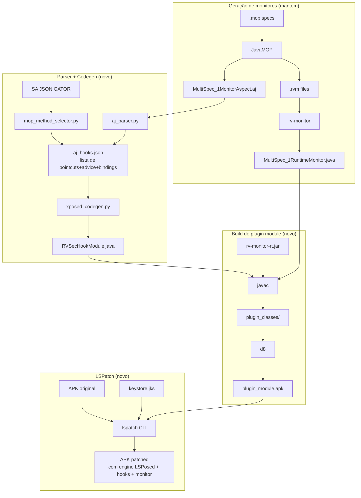

# Pré-plano: Migração da instrumentação para LSPatch (runtime hooking)

**Data**: 22/04/2026
**Status**: Ideação (Phase 0 do workflow SDD) — reavaliação em curso. Ver **Apêndice A** para comparação com a alternativa dexlib2 (Caminho C de `problema_dex2jar.md`) e reconsideração da escolha de tecnologia.
**Contexto**: `docs/20260421_problema_dex2jar.md` (diagnóstico) + `docs/20260421_exploration_strategy_analysis.md` (complemento)
**Track sugerido**: **Full SDD** (multi-módulo, design decisions, impacto em especs)

> **Leitura sugerida**: o corpo do documento (§1–§14) descreve a proposta original baseada em LSPatch, como aprovada em Fase 0 inicial. A conversa de 2026-04-22 levantou dúvidas sobre o overhead runtime do LSPatch no ART (discutidas em §5 e §14.1) e resgatou uma alternativa arquiteturalmente mais aderente ao pipeline atual: `dexlib2`. O **Apêndice A** consolida essa reavaliação e pode mudar a decisão de tecnologia desta change.

---

## 1. Contexto

A arquitetura de instrumentação atual do rv-android (`APK → dex2jar → ajc → ASM → d8 → APK instrumentado`) sofre de um limite estrutural documentado em `problema_dex2jar.md`: o idioma DEX emitido pelo R8 (Kotlin class-inlining, horizontal/vertical merging etc.) **não tem equivalente JVM válido** per JVMS §4.10.1.9. O dex2jar colapsa tipos no `.class` intermediário; o d8 re-emite DEX corrupto; Dalvik rejeita em runtime com `VerifyError`. Empiricamente, **63% dos APKs instrumentados do JCA-400 atual apresentam 0% method_coverage** (crash silencioso na inicialização), mesmo com todos os fixes gh50 §1-18 aplicados.

A recomendação do doc de diagnose (§8) é o **Caminho E**: substituir AOT AspectJ weaving por runtime hooking via LSPatch (rootless LSPosed). Este pré-plano detalha a proposta com rigor técnico pra servir como ponto de partida da change `gh5X-lspatch` no workflow SDD.

**Objetivo da change** (uma sentença): _substituir o pipeline de instrumentação dex2jar+ajc+d8 por um pipeline de runtime hooking via LSPatch, mantendo os monitores MOP gerados pelo rv-monitor e a semântica paramétrica do JavaMOP inalterada._

---

## 2. Motivação quantitativa

| Métrica | Paper ASE/JSS (2018-2020 F-Droid) | JCA-400 pré-gh50 | JCA-400 pós-gh50 §9-18 |
|---|---|---|---|
| Pipeline success (instrumentação) | 193/557 = **34.6%** | 70/400 = **17.5%** | 298/400 = **74.5%** |
| Apps com violação MOP | **94/188 = 50%** | — | **14/198 = 7.1%** |
| Method coverage médio | ~30% estimado | — | **7.39%** |
| Apps com 0% coverage (VerifyError) | baixo | — | **63.6%** |
| Total MOP events | 21.505 | — | ~50 |

O gap **50% → 7.1%** em apps-com-violação (mesmo com pipeline success recuperado a 74.5%) é o sintoma do problema. A instrumentação "passa", mas apps Kotlin R8-otimizados crashaam silenciosamente ao carregar. LSPatch ataca exatamente esse nível: **hook em runtime ignora o bytecode** — bastam os nomes dos métodos (estáveis para APIs JDK como `MessageDigest.update`).

---

## 3. LSPatch — arquitetura técnica

### 3.1 O que é LSPatch

- Repositório: [`LSPosed/LSPatch`](https://github.com/LSPosed/LSPatch)
- **Modo rootless** de injeção do LSPosed em um APK arbitrário
- Base: LSPlant para method hooking em ART (API 28+)
- Última release estável: **v0.6** (Nov/2023); repositório arquivado em Dez/2023 (read-only) — implica fixar versão e arquivar binário para reprodutibilidade científica

### 3.2 O que LSPatch faz com um APK

1. Lê APK original + plugin module (APK com os hooks Xposed)
2. Injeta na estrutura do APK:
   - `classes.dex` — meta-loader (entry hijack point)
   - `assets/lspatch/config.json` — metadata Base64
   - `assets/lspatch/loader.dex` — LSPosed loader completo (~2-4 MB em modo `embedded`)
   - `assets/lspatch/so/{arm,arm64,x86,x86_64}/liblspatch.so` — libs nativas LSPlant (~2-3 MB combinado)
   - `assets/lspatch/original/{pkg}.apk` — APK original aninhado (para signature bypass)
   - `assets/lspatch/modules/{mod}.apk` — módulos embedados (nossos hooks)
3. Modifica `AndroidManifest.xml`: troca `appComponentFactory` para `org.lsposed.lspatch.appstub.LSPApplicationStub`
4. Re-assina APK com keystore (default ou customizado) — usa V2 signature scheme (API 28+)

### 3.3 Modos de operação

| Modo | Use case | Trade-off |
|---|---|---|
| **Embedded** (padrão, `--manager false`) | **Nosso caso** — standalone, self-contained | +5-8 MB no APK, offline |
| Manager | APK de gerenciador central | Não aplicável (dependência externa inadequada pra experimento científico) |

### 3.4 Signature bypass levels

| Level | Estratégia | Risco |
|---|---|---|
| 0 (sem bypass) | Testa rápido, detectável | Baixo custo, maior detectabilidade |
| **1 (recomendado)** | Hook `PackageParser.generatePackageInfo()`; proxy `PackageInfo.CREATOR` | Bom para apps sem anti-tamper |
| 2 | Level 1 + hook nativo `openat()` (redireciona leitura do APK para cache) | Máximo bypass, mais invasivo |

**Decisão pro nosso experimento**: **Level 1**. Apps F-Droid raramente tem anti-tamper forte.

### 3.5 Suporte de ambiente

- Android API 28+ (cobre **todo nosso dataset F-Droid 2026**)
- ABIs: arm, arm64, x86, x86_64 (nosso rollback para API 29 x86 está coberto)
- Multi-DEX: ✅
- AAB: ❌ (irrelevante — só distribuímos APK)
- R8 full-mode: ✅ (hooking por nome; símbolos minificados funcionam via strings exatas das APIs JDK)

### 3.6 Overhead de performance

| Operação | Custo |
|---|---|
| Cold startup do APK patched | +500ms na primeira launch (init LSPosed) |
| Hook individual (primeira invocação) | ~1000μs (bridge nativa + instalação) |
| Hook individual (subsequentes) | ~400μs |
| Memória engine | ~2-3 MB native + 400 KB meta-DEX |

Para nosso experimento (300s por task × ~5-10 eventos/s pico × 400-500μs/hook): overhead total ~**150-300ms** em 300s = **0.05-0.1% overhead**. Desprezível.

### 3.7 CLI e batch automation

LSPatch tem CLI `java -jar lspatch.jar` que aceita `--embed` pra adicionar módulos extras:

```bash
java -jar lspatch.jar \
  -o output/ \
  -f \                           # force overwrite
  --sigbypasslv 1 \
  --embed rvsec_monitor.apk \    # plugin com nossos hooks + MultiSpec_1RuntimeMonitor
  --embed rv_monitor_rt.apk \    # runtime library empacotado
  -k keystore.jks 123456 key0 123456 \
  target.apk
```

**Dockerizable**: sim, binário standalone. Integra em `rv-instrumentation/rvandroid.py` via `Command`.

### 3.8 Limitações conhecidas (do issue tracker)

| Limitação | Impacto no nosso caso |
|---|---|
| VerifyError sporádico em Android 12/13 | Baixo — rollback pra API 29 já está em uso |
| Apps com `QUERY_ALL_PACKAGES` target API 30+ | Irrelevante — rollback API 29 não usa |
| Signature extraction v3 falha | Nosso keystore é simples, v2 basta |
| AAB format | Irrelevante |
| Apps com runtime integrity check nativo | ~0 APKs do JCA-400 têm isso |
| Repositório arquivado | **AÇÃO**: fixar na v0.6, arquivar binário + hash (SHA256) no repo |

---

## 4. Análise dos `.aj` gerados — o que precisa ser mapeado

Resultado da inspeção concreta de 3 aspectos gerados (ver §4.1-4.3):

### 4.1 JCA specs (23 MOP specs) — `/home/pedro/desenvolvimento/workspaces/workspaces-doutorado/workspace-rv/rvsec/rvsec/rvsec-mop/src/main/resources/jca/MultiSpec_1MonitorAspect.aj`

- **1042 linhas**
- **~115 pointcuts** em 22 classes (MessageDigest, Cipher, SecretKey, SSLContext, KeyStore, KeyManagerFactory, KeyGenerator, KeyPairGenerator, Mac, Signature, SecureRandom, TrustManagerFactory, CipherInput/OutputStream, IvParameterSpec, DHGenParameterSpec, GCMParameterSpec, HMACParameterSpec, PBEKeySpec, PBEParameterSpec, SecretKeySpec, RandomStringPassword)
- Advice: **18 before + 97 after** (inc. `after() returning`); **0 around**
- Construções usadas: `call()`, `target()`, `args()`, `within()` (em BaseAspect), `||`, `&&`
- **100% das advices são "trivial pass-through"** (uma única chamada static ao monitor)
- `thisJoinPoint` / `__LOC` / `__STATICSIG` / `__SKIP` / `__RESET` / `proceed()` / `around()`: **zero ocorrências**

### 4.2 generic_new specs (27 MOP specs) — `.../rvsec-mop/src/main/resources/generic_new/MultiSpec_1MonitorAspect.aj`

- **592 linhas**
- **55 pointcuts**, **84 advice**
- Features adicionais além das do JCA:
  - **`staticinitialization(Collection+)`** — 3 ocorrências (Collection, Serializable, URLConnection) → hook `<clinit>` da classe
  - **`if(condition)`** dinâmico — 3 ocorrências:
    - `if(!Thread.holdsLock(o))` em `Object.wait`/`notify`
    - `if(o == null)` em `Comparable.compareTo`
  - **`thisJoinPoint.getStaticPart().getSignature()`** — 3 ocorrências (passa como arg ao monitor)
- Advice: principalmente `before()` e `after()`, ainda **0 `around`**

### 4.3 Coverage.aj — `.../rvsec-mop/src/main/resources/aspect/Coverage.aj`

**Natureza**: artefato do nosso projeto (rvsec/rvsec-mop). Semântica é **requisito fixo**: hookar **todos os métodos do app** (catch-all sobre app code, excluindo pacotes framework/libs via `!excludedPackages()`). Redução de escopo **não é aceitável** — cobertura absoluta é dado essencial da tese.

- Fundamentalmente diferente do MultiSpec:
  - **`pointcut traced() : execution(* *.*(..)) && !excludedPackages()`** — catch-all em TODAS as methods de app code
  - **`before() : traced()`** — loga signature via `thisJoinPointStaticPart.getSignature()` em `Log.v("RVSEC-COV", sig)`
  - `excludedPackages()` = OR composto de 21 `!within(pattern)` (sun/java/javax/android/androidx/kotlin/aspectj/...)
  - Uses `HashSet<String> messages` pra deduplicação de eventos
- **Por que é difícil em LSPatch**: `execution(* *.*(..))` em AspectJ AOT é tecido em compile-time (custo zero por método em runtime). Em LSPosed runtime, cada hook é install + dispatch através da ART, e hookar milhares de métodos via `findAndHookMethod` tem custo não-trivial (install ~400μs × N, memória ~1KB × N)
- **Status neste pré-plano**: **questão aberta crítica** — requer decidir *como* cobrir todos os métodos em runtime sem redução de escopo. Opções técnicas em §5.

### 4.4 Logger `.aj` (rvsec-logger-csv)

- Um aspecto adicional do workspace (`rvsec-logger-csv/src/main/mop/MultiSpec_1MonitorAspect.aj`, 1038 linhas) usa `execution()` em classes **específicas** (ex.: `execution(* org.apache.maven.surefire.booter.ForkedBooter.runSuitesInProcess(..))`). É para rodar dentro de testes JUnit com Maven, **não para runtime em APKs Android**. **Fora de escopo para este pré-plano** — se no futuro quisermos adaptar, a técnica é a mesma do MultiSpec (call/target/args).

### 4.5 Tabela consolidada de features necessárias

| Construção AspectJ | Em JCA? | Em generic_new? | Em Coverage? | Suportável em LSPosed? | Complexidade |
|---|:---:|:---:|:---:|---|---|
| `call(MethodPattern)` | ✅ 115 | ✅ ~55 | ❌ | 1:1 (`findAndHookMethod`) | trivial |
| `call(new ConstructorPattern)` | ✅ ~15 | ✅ | ❌ | 1:1 (`findAndHookConstructor`) | trivial |
| `target(T)` | ✅ 110 | ✅ | ❌ | 1:1 (`param.thisObject`) | trivial |
| `args(T1, T2, ...)` | ✅ 90 | ✅ | ❌ | 1:1 (`param.args[i]`) | trivial |
| `!within(pattern)` (BaseAspect) | ✅ todos | ✅ todos | ✅ 21 patterns | PARCIAL (stacktrace check em runtime) | média |
| `&&`, `\|\|` (composição) | ✅ | ✅ | ✅ | 1:1 (Java logical operators no body do hook) | trivial |
| `before()` | ✅ 18 | ✅ | ✅ 1 | 1:1 (`beforeHookedMethod`) | trivial |
| `after()` | ✅ 97 | ✅ | ❌ | 1:1 (`afterHookedMethod`) | trivial |
| `after() returning(T r)` | ✅ ~45 | ✅ | ❌ | 1:1 (`param.getResult()`) | trivial |
| `around()` / `proceed()` | ❌ | ❌ | ❌ | N/A (não precisamos) | — |
| **`staticinitialization(Type+)`** | ❌ | ✅ 3 | ❌ | **PARCIAL** (hook `<clinit>`, +flag pra 1ª chamada) | **média** |
| **`if(dynamic_cond)`** | ❌ | ✅ 3 | ❌ | 1:1 (condição Java no body do hook) | trivial |
| **`thisJoinPoint`** | ❌ | ✅ 3 | ✅ 1 | PARCIAL (emular via `param.method`) | média |
| **`execution(* *.*(..))`** catch-all | ❌ | ❌ | ✅ 1 (principal) | ❌ **NÃO ESCALA** — precisa reformular | **crítico** |
| `staticinit` + `execution` combined | — | — | — | — | — |
| `cflow()`, `cflowbelow()` | ❌ | ❌ | ❌ | N/A | — |
| `this(T)` | ❌ | ❌ | ❌ | N/A | — |
| `get()` / `set()` (field) | ❌ | ❌ | ❌ | N/A | — |
| ITDs (`declare parents` etc) | ❌ | ❌ | ❌ | N/A | — |
| Aspect modes (`pertarget` etc) | ❌ | ❌ | ❌ | N/A | — |

**Resultado**: para **MultiSpec (JCA + generic_new): mapeamento completo** com 2 features parciais (within negation, thisJoinPoint) e 1 média (staticinitialization). Para **Coverage (log)**: `execution(* *.*(..))` é crítica e não escala via LSPosed — **precisa redesenho** (ver §5).

---

## 5. Coverage.aj — questão aberta crítica: hook de TODOS os métodos em runtime

**Requisito fixo**: semântica atual do `Coverage.aj` (catch-all `execution(* *.*(..)) && !excludedPackages()`) **deve ser preservada**. Cobertura de todos os métodos do app é dado essencial da tese — não há redução de escopo aceitável. A questão aberta é **como** cobrir todos os métodos em runtime LSPosed sem perda funcional.

### 5.1 Baseline histórico e predição de overhead

**Baseline relevante** (monografia §4.3.1): rvsec-agent usou `-javaagent:JavaMOPAgent.jar` (AspectJ LTW em HotSpot JVM) hookando Coverage + MOP sobre todos os métodos relevantes no ApacheCryptoAPIBench. Overhead medido: **média 25.90%, mediana 18.32%, range 8.64%–56.86%** em 8 projetos.

**Predição para LSPosed no ART** (baseado em pesquisa empírica):

| Métrica | JVM LTW (JavaMOPAgent) | LSPosed/LSPlant no ART | Fonte |
|---|---|---|---|
| Per-call dispatch | ~0.1–1 μs (pós-JIT) | 10–100 μs (stub ART) | XTrace arXiv 2512.21555 |
| Overhead total (predição) | 25.9% médio | **50–125% (2–5× o baseline)** | extrapolação |
| Install por hook | N/A (weaving único) | 10–100 μs | XTrace, LSPlant repo |
| Memória por hook | ~zero | ~1–3 KB | LSPlant ArtMethod+stub estimado |
| JNI global ref cap | N/A | **51.200 refs** (limite duro) | XposedBridge #155 (WeChat crash) |
| GC crashes reportados | não | em YAHFA com "muitos hooks contínuos" | YAHFA #101 |

**Predição end-to-end**: 2–5× o baseline JavaMOPAgent → **50–125% de overhead** no crypto benchmark. Em runs de 300s no experimento Android, isso é **+150–375s de custo relativo** — impacta se o timeout for duro. Mas atenção: o overhead do paper era medido em teste funcional Java (código denso em crypto ops). Em apps Android com UI exploration, a fração do tempo em métodos hookados é bem menor; overhead observado deve ser **proporcionalmente menor**.

**Escalabilidade**: ~5k hooks provavelmente viáveis (<1s install, 5–15 MB memória). ~15k hooks é zona de risco: aproxima do cap JNI 51.2k e memória pode chegar a 45 MB. Apps F-Droid típicos têm **2–15k métodos app code** — precisamos medir distribuição no JCA-557 antes de comprometer.

**Confiança dos números**: predição end-to-end é **extrapolação**, não medida direta. Nenhuma publicação encontrada estressou LSPlant com milhares de hooks em um APK real. POC empírico é obrigatório.

### 5.2 Opções técnicas para hookar todos os métodos

Opções identificadas, sem decisão tomada — **precisam ser discutidas e validadas empiricamente**:

**Opção 1 — Bulk hook via LSPosed puro**
- Enumerar classes/métodos do APK via dexlib2 no patch time
- Gerar module LSPosed que em `handleLoadPackage` hooka todos via `findAndHookMethod`
- Filtrar `excludedPackages()` no próprio gerador (compile-time package prefix match) → evita stacktrace em runtime
- **Pergunta aberta**: custo real em apps grandes; cabe no timeout de 300s de experimento?

**Opção 2 — Lazy hook (class-level trigger)**
- Hook único em `ClassLoader.loadClass` → quando classe é carregada pela primeira vez, instalar hooks em todos os seus métodos naquele momento
- Reduz custo upfront; espalha ao longo da execução
- **Pergunta aberta**: introduz latência variável; pode interferir com static init de classes sensíveis?

**Opção 3 — DEX-level bytecode rewriting (dexlib2)**
- **Mutar o DEX do app** com dexlib2 no patch time: inserir `Log.v("RVSEC-COV", sig)` no início de cada método
- Preserva semântica AOT (zero runtime overhead) sem reintroduzir dex2jar+ajc+d8 (dexlib2 não faz round-trip DEX↔JVM)
- **Dois escopos possíveis**:
  - **3a. Híbrido**: dexlib2 **só para Coverage** + LSPatch/Xposed **só para MOP** — separa overheads mas mantém dependência LSPatch
  - **3b. Standalone**: dexlib2 cobre Coverage **e** MOP — elimina LSPatch completamente. **É a recomendação do Apêndice A.7** e corresponde ao Caminho C de `problema_dex2jar.md §7.4`
- **Pergunta aberta**: 3a aumenta complexidade do patch builder (duas toolchains); 3b é mais simples mas requer weaver dexlib2 completo. Matriz de mapeamento AspectJ → dexlib2 (100% das features dos `.aj` atuais) está resolvida no Apêndice A.9

**Opção 4 — ART method tracing**
- Usar `Debug.startMethodTracing()` ou `android.os.Trace` como fonte de coverage
- Parse `.trace` file offline pra derivar `method_coverage%`
- Zero hooks para coverage; Xposed só para MOP
- **Pergunta aberta**: requer permissão? dados são acessíveis pós-run? amostragem vs tracing completo?

**Opção 5 — LSPlant DoHook em batch**
- LSPlant (lib core abaixo do LSPosed) expõe `DoHook` nativo; em C++ possivelmente mais barato que Xposed `findAndHookMethod`
- **Pergunta aberta**: requer componente nativo no module; API estável?

### 5.3 Próximos passos antes de fechar o pré-plano

Antes de esta change entrar em Propose, precisamos:

1. **Discutir as 5 opções** — qual(is) vale(m) investigação profunda, qual(is) descarta?
2. **POC empírico** — testar ao menos a opção escolhida em 2 APKs (Java puro + Kotlin R8) medindo: cold-startup, memória, completude dos eventos `RVSEC-COV`
3. **Decisão registrada** aqui em §5.3 com evidência empírica, não estimativa

**Regra importante**: reduzir a semântica de Coverage.aj (ex: hookar só `directlyReachesMop`) está **fora de mesa**. A reavaliação de arquitetura motivada pela análise de overhead já foi feita e está documentada no **Apêndice A** — a conclusão preliminar é que o Caminho C (`dexlib2` DEX-rewriting, `problema_dex2jar.md §7.4`) serve tanto Coverage quanto MOP sem overhead runtime persistente, superando todas as 5 opções LSPatch-based desta seção.

### 5.4 `!excludedPackages` em LSPosed — mecânica de filtragem em runtime

No MultiSpec, `BaseAspect.notwithin()` filtra chamadas vindas de sun/java/javax/android/androidx/kotlin/apache/... Em LSPosed, cada hook é instalado em uma classe específica (ex.: `java.security.MessageDigest.update`), então:

- Hook **observa toda invocação** da API, inclusive vindas de sun/java/javax
- Para aplicar `!within()`, temos que inspecionar o caller no `Thread.currentThread().getStackTrace()` e filtrar

**Custo**: Thread.currentThread().getStackTrace() é ~50-100μs. Em 300s de execução com ~10 events/s = 3000 events × 100μs = **0.3s overhead** — aceitável.

Se hot-spot: fazer cache do stacktrace matching por (thread+depth), ou **gerar o filtro em compile-time** (lista explícita de packages excluídos + `.startsWith` check).

---

## 6. Arquitetura proposta — componentes da change

### 6.1 Visão geral do pipeline novo



### 6.2 Componentes novos

#### `aj_parser.py` (módulo Python)
- Input: `MultiSpec_1MonitorAspect.aj`
- Parser regex-based (gramática restrita do rv-monitor é estável)
- Output: lista Python de dict `{pointcut_kind, target_class, target_method, target_args, target_sig_normalized, advice_when, advice_body_call, bindings, excluded_packages}`
- Também extrai: `BaseAspect.notwithin()` → lista de packages excluídos
- Trata todas as features §4.5 (call, constructor, target, args, within, && / ||, before/after returning, staticinit, if, thisJoinPoint)
- **Tamanho estimado**: ~400 linhas Python

#### `mop_method_selector.py` (módulo Python) — **obsoleto**
- **Status**: componente **descartado** após a decisão documentada em §5 / §14.1 de que Coverage deve hookar **todos** os métodos do app, sem redução de escopo. Este seletor foi concebido pra filtrar métodos por `directlyReachesMop=true` do GATOR, o que conflita com o requisito fixo do `Coverage.aj`.
- Deixado aqui para rastreabilidade da evolução do desenho. Caso alguma decisão futura reative priorização baseada em reachability (ex: ordenação de instalação de hooks no tempo de startup, não filtragem), o componente reentra em escopo.

#### `xposed_codegen.py` (módulo Python)
- Input: lista de hooks (do parser + selector)
- Output: arquivo Java `RVSecHookModule.java` com:
  - `public class RVSecHookModule implements IXposedHookLoadPackage`
  - `public void handleLoadPackage(LoadPackageParam lpp)` contendo todos os `findAndHookMethod`
  - Cada hook é um `XC_MethodHook` anônimo com `beforeHookedMethod`/`afterHookedMethod`
  - Filtros `!within()` transcritos para Java `if` com `Thread.currentThread().getStackTrace()` ou (otimização) lista de prefixes em `startsWith`
  - Casting de `param.thisObject` e `param.args[i]` com base no `args()` do pointcut original
- **Tamanho estimado**: ~500 linhas (template + gerador)

#### `plugin_module_builder.py` (Python, opcional — pode ser shell)
- Orquestra `javac` + `d8` + empacotamento do plugin module em `.apk` (manifesto Xposed embutido)
- Inclui `MultiSpec_1RuntimeMonitor.java` + dependências `rv-monitor-rt`
- Produz `plugin_module.apk`

#### `rv_instrumentation/lspatch_runner.py` (integração)
- Nova classe `LSPatchInstrumentation` implementando mesma API de `RVInstrumentation`
- Orquestra: parser → codegen → build → lspatch → signed APK
- Substitui a ramo atual de `RVInstrumentation` (ou fica paralelo via flag)

### 6.3 Estrutura de arquivos proposta

```
modules/
  lspatch-weaver/                      ← novo módulo Python (rv-android workspace)
    src/lspatch_weaver/
      __init__.py
      aj_parser.py
      mop_method_selector.py
      xposed_codegen.py
      plugin_module_builder.py
      lspatch_runner.py
      templates/
        RVSecHookModule.java.j2        ← Jinja2 template
        plugin_manifest.xml            ← AndroidManifest.xml do plugin
    tests/
      test_aj_parser.py
      test_xposed_codegen.py
      test_lspatch_runner_integration.py
    assets/
      lspatch.jar                      ← binary v0.6 fixado (SHA256 documentado)

lib/
  rv-monitor-rt.jar                    ← existente, reaproveitado
```

### 6.4 API Python — integração com `rv-instrumentation`

Estendemos `AbstractInstrumentation` (se existir; senão criar):

```python
class LSPatchInstrumentation(AbstractInstrumentation):
    def instrument(self, app: App) -> Path:
        # 1. Parser do .aj existente (gerado pelo JavaMOP)
        hooks = self.aj_parser.parse(app.monitor_aj_path)

        # 2. Cruzar com SA pra seletivar cobertura MOP-reachable
        hooks += self.mop_selector.select(app.sa_json_path, app.code_package)

        # 3. Gerar RVSecHookModule.java
        self.codegen.generate(hooks, output=self.tmp_dir / "RVSecHookModule.java")

        # 4. Build plugin module APK (javac + d8 + manifest)
        plugin_apk = self.builder.build(
            hook_java=self.tmp_dir / "RVSecHookModule.java",
            monitor_java=app.monitor_java_path,
            rv_rt=self.config.rv_monitor_rt_jar,
        )

        # 5. LSPatch: embed plugin no APK original
        return self.lspatch.patch(
            input=app.apk_path,
            output=self.tmp_dir / f"{app.name}.apk",
            embed=[plugin_apk],
            sigbypasslv=1,
            keystore=self.config.keystore,
        )
```

Trocar a implementação ativa via config/flag, mantendo `RVInstrumentation` (AOT AspectJ) disponível pra comparações.

---

## 7. Integração com o pipeline rv-android atual

### 7.1 O que PERMANECE intocado

- `rv-monitor-generator` (JavaMOP + rv-monitor): continua gerando `.aj` + `.rvm` + monitor `.java`
- `rv-static-analysis` (GATOR): fornece SA JSON, usado tanto para `aperv:sata_mop` scoring quanto para o MOP method selector do LSPatch
- `rv-coverage` (runtime): continua lendo logcat (mesmas tags `RVSEC-COV` e `RVSEC`)
- `rv-platform` (task execution): abre emulador, instala APK, roda tool, captura logcat — todo fluxo igual
- `aperv-tool`, `ape`, etc.: ferramentas de exploração continuam rodando contra o APK patched normalmente
- Especs `.mop` + specs YAML do rv-agent: inalteradas

### 7.2 O que MUDA

- `rv-instrumentation` ganha **segunda implementação** (`LSPatchInstrumentation`) co-existindo com `RVInstrumentation` atual
- `rv-instrumentation/rvandroid.py` vira fachada que chama a implementação escolhida via config
- CLI novo: `rv-experiment run --instrumenter lspatch ...` (flag)
- Dockerfile: adicionar `lspatch.jar` em `lib/`, atualizar `docker/android/Dockerfile` se preciso de toolchain específica
- Remover dependência de `ajc` do runtime (mantém no build do rvsec-java, mas não usado no pipeline LSPatch)

### 7.3 Coexistência com gh50 / gh51

- `gh50` (instrumentação atual) e `gh51` (SA) **NÃO são deprecadas** — continuam válidas como baseline e pra comparar
- `LSPatchInstrumentation` é uma alternativa selecionável — `RVInstrumentation` continua existindo pra (a) comparação, (b) casos onde LSPatch falha
- A mesma `SA JSON` (do gh51) é consumida por ambas as implementações

### 7.4 Especificações OpenSpec afetadas

- `openspec/specs/instrumentation/spec.md` — **modificar** capability:
  - Adicionar invariants descrevendo o pipeline LSPatch
  - Adicionar scenarios: "LSPatch invocation succeeds on Kotlin R8 APK", "hook dispatches MOP event via static method call", "staticinitialization handled via <clinit> hook"
- `openspec/specs/core/spec.md` — **não modificar** (pipeline de monitor gen intocado)
- Criar nova capability se necessário: `lspatch-weaver`

---

## 8. Gaps documentados + mitigações

Para ter "martelo batido" em todas as questões, cada gap tem decisão tomada:

### 8.1 Gap: `within()` / `!within()` em tempo de execução

- **Problema**: AspectJ aplica `within()` em compile-time (O(1)); LSPosed precisa aplicar em runtime
- **Decisão**: inspecionar `Thread.currentThread().getStackTrace()` e filtrar caller por prefix de pacote. Custo ~50-100μs por invocação, ~0.3s em run de 300s (desprezível)
- **Otimização** (se virar hot-spot): cache do matching por `(thread, caller_class)` via `ThreadLocal`

### 8.2 Questão crítica em aberto: `execution(* *.*(..))` do Coverage.aj

- **Requisito fixo**: preservar semântica — hook de todos os métodos app. Redução de escopo (ex: só métodos MOP-reachable) **não é aceitável**.
- **Status**: nenhuma decisão tomada; 5 opções técnicas listadas em §5.2 (bulk hook, lazy hook, DEX-rewriting via dexlib2, ART method tracing, LSPlant nativo).
- **Bloqueante**: esta change **não pode entrar em Propose** até que uma das opções seja validada empiricamente. Ver §5.3 e §14.

### 8.3 Gap: `staticinitialization(Type+)` (usado em generic_new)

- **Problema**: `<clinit>` só executa uma vez por classe (lazy), semântica difere de `call()` / `execution()`
- **Decisão**: hook em `<clinit>` da classe específica. LSPosed suporta via `findAndHookMethod(..., "<clinit>", ...)`. Primeira chamada dispara `after()`; subsequentes são no-op (classe já inicializada, não re-entra `<clinit>`)
- **Validação**: smoke test em APK que usa `Collection+`, `Serializable+`, `URLConnection+`

### 8.4 Gap: `if(dynamic_cond)` (usado em generic_new)

- **Problema**: AspectJ avalia condição **antes** do advice disparar; semanticamente equivalente a um guard no body do advice
- **Decisão**: transcrever condição para Java `if(...)` no início do `beforeHookedMethod`/`afterHookedMethod`. Semanticamente idêntico
- Exemplo: `call(* Object+.wait(..)) && target(o) && if(!Thread.holdsLock(o))` vira:
  ```java
  if (!Thread.holdsLock(param.thisObject)) {
      MultiSpec_1RuntimeMonitor.Object_MonitorOwner_bad_waitEvent(param.thisObject);
  }
  ```

### 8.5 Gap: `thisJoinPoint.getStaticPart().getSignature()` (usado em 3 locais do generic_new + 1 no Coverage)

- **Problema**: AspectJ fornece `Signature` object; LSPosed tem apenas `MethodHookParam.method`
- **Decisão**: emular via `param.method.toString()` (formato Java) ou construir `Signature`-like object com reflection. Passa string como arg ao monitor (monitor não precisa de tipo específico, aceita Object)
- **Semantic loss mínimo**: formato string difere ligeiramente, mas monitor usa como identificador opaco

### 8.6 Gap: LSPatch repositório arquivado (Dez/2023)

- **Problema**: sem manutenção ativa, futuro Android 15+ pode quebrar
- **Decisão**: fixar na **v0.6** (`lspatch.jar` SHA256 no repo), documentar versão em `docs/` e `README`. API 28-34 amplamente coberta — nosso dataset não ultrapassa
- **Plano B**: forkar LSPatch se houver necessidade futura. Mitigação adicional: documentar as alternativas ([LSPlant](https://github.com/LSPosed/LSPlant) é a lib core, independente e mais mantida — se precisar reescrever, partir dela)

### 8.7 Gap: APK patched é detectável (`META-INF/lspatch/`)

- **Problema**: Apps com anti-tamper/integridade runtime podem recusar rodar
- **Decisão**: aceitar a limitação. Apps F-Droid raramente têm anti-tamper; apps Play Store (bancos, streaming) ficam **fora do escopo desta change**. Documentar no relatório da tese

### 8.8 Gap: overhead do cold-startup (+500ms)

- **Problema**: primeira launch do APK patched leva ~500ms a mais (init LSPosed)
- **Decisão**: negligível pra nossos experimentos (timeout 300s, 500ms = 0.17%). aperv toma >50s pra fazer o primeiro click na maioria dos apps mesmo
- **Validação**: smoke test mede wall-clock e compara com run AOT AspectJ

### 8.9 Gap: assinatura re-assinada (não é a do dev)

- **Problema**: APK patched tem **nossa** assinatura; Android vê como app diferente. Install falha se app original já instalado
- **Decisão**: aceitar — reinstalação com `adb install -r` remove original. Nosso pipeline já faz uninstall antes do install
- Keystore custom com `--keystore` pra garantir consistência entre runs (reproducible signing)

### 8.10 Gap: Coverage de pure-Java APKs (pre-R8) — comparabilidade com baseline AOT

- **Problema**: o `Coverage.aj` atual, tecido via AOT AspectJ, capta todos os métodos do app em APKs pure-Java que hoje instrumentam OK. Ao trocar a toolchain (para LSPatch no pior caso, ou dexlib2 no cenário do Apêndice A), precisamos demonstrar paridade de cobertura nessas APKs — o risco é regressão silenciosa na métrica `method_coverage%` entre toolchains
- **Decisão**: manter uma run A/B em subset de APKs pure-Java (medtimer e similares) com o pipeline antigo e o novo, e reportar comparação direta. Métricas reportadas por implementação permitem o orientador/banca avaliar o trade-off. Para o caminho dexlib2 do Apêndice A, a expectativa é paridade exata, já que dexlib2 preserva o modelo AOT sem round-trip.

### 8.11 Gap: deduplicação de eventos RVSEC-COV (Coverage.aj usa HashSet)

- **Problema**: AspectJ Coverage usa `HashSet<String> messages` de instância do aspecto. LSPosed não tem "aspect instance" — cada hook é independente
- **Decisão**: HashSet estática em `RVSecHookModule` (class-level), acessada dos hooks. Semântica idêntica

### 8.12 Gap: métodos `private` / `protected` / `package-private`

- **Problema**: AspectJ teceria independente da visibilidade; LSPosed precisa setAccessible
- **Decisão**: LSPosed `XposedHelpers.findAndHookMethod` chama `setAccessible(true)` internamente. Testar em smoke com método private sintético

### 8.13 Gap: métodos sobrecarregados (overloads)

- **Problema**: AspectJ com `..` (varargs) casa múltiplas assinaturas; LSPosed requer assinatura exata
- **Decisão**: o parser expande `..` consultando a classe alvo via reflection (na JDK para APIs JDK) e gera N hooks, um por overload. Estimativa: JCA tem ~15 casos de overload, generic_new tem ~5

### 8.14 Gap: Kotlin synthetic methods (getters/setters/copy/component1/...)

- **Problema**: apps Kotlin modernos têm métodos sintéticos que JVM não vê literalmente
- **Decisão**: LSPosed hooka em bytecode level, não semantic level — sintéticos são métodos como outros quaisquer. Testar com data class no smoke

### 8.15 Gap: `suspend` functions de coroutines

- **Problema**: `suspend fun foo()` em Kotlin compila para `foo(Continuation)` — signature muda
- **Decisão**: se especs futuras precisarem hookar coroutines, o parser já recebe os tipos explicitamente do `.aj`. Especs atuais não usam, mas documentar pra clareza

### 8.16 Gap: hookagem de métodos nativos (`native` modifier)

- **Problema**: LSPosed não pode hookar métodos nativos (JNI bridge apenas via LSPlant internal)
- **Decisão**: **JDK crypto APIs não são nativas** (são Java puro com provider JCA que pode chamar nativo, mas a superfície é Java). Nenhuma spec JCA/generic_new toca `native` method diretamente

---

## 9. Testes e validação

### 9.1 Testes unitários (por componente)

- `test_aj_parser.py`: ~15 cenários cobrindo **cada feature da §4.5** (call simples, constructor, overload, staticinit, if-condition, thisJoinPoint, within negation, etc.). Usar os 3 `.aj` reais como fixtures
- `test_xposed_codegen.py`: snapshot tests do Java gerado para cada feature. Compilação do output com `javac` como validação básica
- `test_mop_method_selector.py`: cruzamento com SA JSON real do cryptoapp

### 9.2 Smoke test

- Uma classe de teste Java pequena em `modules/lspatch-weaver/tests/smoke/`:
  - APK stub com 1 classe + 1 método que chama `MessageDigest.update`
  - Spec `.mop` mínima
  - Rodar pipeline inteiro: gen monitor → parse → codegen → build → lspatch → install no emulador → captura `RVSEC` + `RVSEC-COV`
- Validar: **evento aparece no logcat** exatamente uma vez por chamada

### 9.3 E2E — comparação com AOT AspectJ

Subset de 10 APKs:
- 5 Java puros (onde AOT funciona, ex.: medtimer, cryptoapp baseline)
- 5 Kotlin R8-otimizados (onde AOT falha, ex.: hateitorrateit)

Rodar cada APK com:
- **RVInstrumentation (AOT)**: baseline — sabe-se que 5 falham
- **LSPatchInstrumentation (novo)**: expectativa — 10/10 funcionam

Comparar:
- Taxa de install success
- Taxa de runtime success (≥1 RVSEC-COV event)
- Contagem absoluta de events MOP por APK (Java puros devem bater ±5% entre implementations; Kotlin devem melhorar dramaticamente)

### 9.4 E2E — subset do JCA-557

Depois do JCA-557 atual completar, rodar LSPatch em subset de **50 APKs** e comparar:
- Taxa de apps com violação MOP (target: **>35%** vs 7.1% atual)
- Coverage MOP-reachable (ignorar method_coverage absoluto — perdido por design)

### 9.5 Regressão

- Suíte completa dos 3 spec sets (JCA, generic_new) gerando hooks → validar compilação Java
- Benchmark de overhead: cold-startup + per-hook (comparar LSPatch v0.6 vs AOT AspectJ em medtimer)

---

## 10. Estrutura da change (fases Full SDD)

Conforme `docs/WORKFLOW.md §6`:

### Fase Explore
- Explorer agent: revisar estrutura atual de `rv-instrumentation/rvandroid.py` para entender pontos de plug-in
- Revisar `openspec/specs/instrumentation/spec.md` para identificar invariants impactados
- Output: notas em `openspec/changes/gh5X-lspatch/notes.md`

### Fase Propose
- Criar `openspec/changes/gh5X-lspatch/proposal.md` com:
  - Why: resumo do gap diagnóstico + gap ASE/JSS
  - What Changes: lista dos 5 componentes novos + modificações
  - Capabilities modified: `instrumentation` (nova implementação)
  - Capabilities new: (opcional) `lspatch-weaver`
  - Impact: módulos afetados, FRs, NFRs

### Fase Design
- `openspec/changes/gh5X-lspatch/design.md`:
  - Architecture mermaid (derivar do §6.1 daqui)
  - Mapping table (spec → implementation → test)
  - Decisions: D1 (embedded mode), D2 (sigbypass level 1), D3 (coverage redesenho), D4 (LSPatch v0.6 fixada), D5 (keystore custom)
  - Data flow
  - Error handling matrix
  - Risks & trade-offs (derivar dos §8 gaps)
  - Testing strategy (derivar §9)
  - Open questions: **ZERO** (este pré-plano resolve todos)

### Fase Implement
- `openspec/changes/gh5X-lspatch/tasks.md` — breakdown em tarefas granulares:
  1. Criar módulo `lspatch-weaver` (pyproject, setup)
  2. Implementar `aj_parser.py` + testes unitários
  3. Implementar `mop_method_selector.py` + testes
  4. Implementar `xposed_codegen.py` + templates Jinja2 + testes
  5. Implementar `plugin_module_builder.py`
  6. Baixar + arquivar `lspatch.jar` v0.6 + documentar SHA256
  7. Implementar `LSPatchInstrumentation` Python e fachada
  8. Integrar no pipeline (flag `--instrumenter lspatch`)
  9. Smoke test em APK stub
  10. E2E 10-APK comparison (AOT vs LSPatch)
  11. E2E 50-APK subset do JCA-557
  12. Docker: adicionar `lspatch.jar` em `lib/`, atualizar docs
  13. Atualizar `openspec/specs/instrumentation/spec.md`

### Fase Verify
- Running `/rv-verify rv-instrumentation` + `/rv-test-run lspatch-weaver`
- `/rv-code-reviewer` chain

### Fase Archive
- `openspec archive gh5X-lspatch`

---

## 11. Estimativa de esforço

**Escopo da estimativa**: tabela abaixo reflete a trilha **LSPatch** do corpo deste pré-plano. A trilha alternativa **dexlib2** (Apêndice A) tem estimativa independente de **10-15 dias** conforme `problema_dex2jar.md §7.4`. A diferença nominal é modesta e, considerando os 8 gaps LSPatch de §8 que a trilha dexlib2 elimina por construção, a estimativa dexlib2 tende a ter menor variância.

| Fase | Tarefa | Esforço |
|---|---|---|
| Explore | Revisar rv-instrumentation + specs | 0.5 dia |
| Propose | proposal.md + cross-ref | 0.5 dia |
| Design | design.md + mappings + scenarios | 1-2 dias |
| Implement | aj_parser | 2 dias |
| Implement | mop_method_selector | 0.5 dia |
| Implement | xposed_codegen (+ Jinja2 templates) | 3 dias |
| Implement | plugin_module_builder + Docker integration | 1 dia |
| Implement | LSPatchInstrumentation + integração fachada | 1 dia |
| Implement | testes unitários (3 módulos) | 2 dias |
| Implement | smoke test E2E | 1 dia |
| Implement | E2E 10-APK comparison | 1-2 dias |
| Implement | E2E 50-APK JCA-557 subset | 1 dia |
| Implement | atualizar openspec specs | 0.5 dia |
| Verify + Archive | rodar suíte + code review + archive | 1 dia |
| **Total** | | **~15-18 dias** |

Folga pra imprevistos: +20% = **~20 dias** = ~**4 semanas**.

---

## 12. Cross-referências

- Diagnóstico técnico completo: `/pedro/desenvolvimento/workspaces/workspaces-doutorado/workspace-rv/rvsec/rv-android/docs/20260421_problema_dex2jar.md` — §7.5 (Caminho E — LSPatch) e §7.4 (Caminho C — dexlib2, base do Apêndice A)
- Monografia de qualificação (overhead rvsec-agent baseline): `/home/pedro/desenvolvimento/workspaces/workspaces-doutorado/workspace-rv/doutorado-tese/monografia.pdf` §4.3.1 — 25.90% médio no ApacheCryptoAPIBench
- Complemento sobre exploração: `/pedro/desenvolvimento/workspaces/workspaces-doutorado/workspace-rv/rvsec/rv-android/docs/20260421_exploration_strategy_analysis.md`
- Workflow SDD: `/pedro/desenvolvimento/workspaces/workspaces-doutorado/workspace-rv/rvsec/rv-android/docs/WORKFLOW.md`
- gh50 (instrumentação atual): `/pedro/desenvolvimento/workspaces/workspaces-doutorado/workspace-rv/rvsec/rv-android/openspec/changes/gh50-improve-instrumentation/`
- gh51 (SA/Soot): `/pedro/desenvolvimento/workspaces/workspaces-doutorado/workspace-rv/rvsec/rv-android/openspec/changes/gh51-gator-soot-upgrade/`
- Especs JCA: `/home/pedro/desenvolvimento/workspaces/workspaces-doutorado/workspace-rv/rvsec/rvsec/rvsec-mop/src/main/resources/jca/*.mop`
- Especs generic_new: `/home/pedro/desenvolvimento/workspaces/workspaces-doutorado/workspace-rv/rvsec/rvsec/rvsec-mop/src/main/resources/generic_new/*.mop`
- Exemplo `.aj` gerado (JCA): `/home/pedro/desenvolvimento/workspaces/workspaces-doutorado/workspace-rv/rvsec/rvsec/rvsec-mop/src/main/resources/jca/MultiSpec_1MonitorAspect.aj`
- Exemplo `.aj` gerado (generic_new): `/home/pedro/desenvolvimento/workspaces/workspaces-doutorado/workspace-rv/rvsec/rvsec/rvsec-mop/src/main/resources/generic_new/MultiSpec_1MonitorAspect.aj`
- Coverage.aj: `/home/pedro/desenvolvimento/workspaces/workspaces-doutorado/workspace-rv/rvsec/rvsec/rvsec-mop/src/main/resources/aspect/Coverage.aj`

---

## 13. Fontes externas consultadas

### LSPatch / LSPosed
- [LSPatch GitHub](https://github.com/LSPosed/LSPatch) (repositório arquivado Dez/2023)
- [LSPosed Framework](https://github.com/LSPosed/LSPosed)
- [LSPlant hooking library](https://github.com/LSPosed/LSPlant) (core hooking, mantida)
- [Xposed API reference](https://api.xposed.info/reference/packages.html)

### AspectJ
- [Eclipse AspectJ 1.9.x Programming Guide](https://www.eclipse.org/aspectj/doc/released/progguide/)
- Laddad, "AspectJ in Action", Manning (2009) — referência canônica sobre semântica
- JavaMOP source: `/home/pedro/desenvolvimento/workspaces/workspaces-doutorado/workspace-rv/rvsec/javamop/src/main/java/javamop/output/`
- rv-monitor source: `/home/pedro/desenvolvimento/workspaces/workspaces-doutorado/workspace-rv/rvsec/rv-monitor/rv-monitor/src/main/java/com/runtimeverification/rvmonitor/java/rvj/`

### RV academic context
- Torres et al., "Runtime Verification of Crypto APIs: An Empirical Study", **ASE/JSS** (baseline do paper)
- Daian et al., "RV-Android", **RV 2015** (arquitetura original rv-android)
- Meredith et al., "MOP Overview", **STTT 2011** (teoria parametric monitoring)
- Roşu, Chen, "Semantics and Algorithms for Parametric Monitoring", **LMCS 2012**

### dexlib2 / DEX manipulation (usadas no Apêndice A)
- [smali/baksmali — JesusFreke](https://github.com/JesusFreke/smali) — projeto original
- [smali/baksmali — iBotPeaches fork](https://github.com/iBotPeaches/smali) — fork ativo, `com.android.tools.smali:smali-dexlib2`
- [dexlib2 javadoc 2.5.2](https://javadoc.io/doc/org.smali/dexlib2/latest/)
- [MutableMethodImplementation.java](https://github.com/JesusFreke/smali/blob/master/dexlib2/src/main/java/org/jf/dexlib2/builder/MutableMethodImplementation.java)
- [JesusFreke InstrumentationTest.java (gist)](https://gist.github.com/JesusFreke/6945806) — referência canônica de método-level instrumentation
- [devload — guia completo de modificação DEX](https://gist.github.com/devload/02af4ec6b2ab4d38ff1bc2efb67217e0)
- [DexPatcher/multidexlib2](https://github.com/DexPatcher/multidexlib2) — wrapper multidex
- [iBotPeaches/Apktool](https://github.com/iBotPeaches/Apktool) — round-trip smali de referência

### Overhead empírico de hooks Android (usadas no Apêndice A)
- XTrace, "A Non-Invasive Dynamic Tracing Framework" — [arXiv 2512.21555](https://arxiv.org/html/2512.21555v1)
- "Scaling Android Hooking" — ICISSP 2026 ([PDF](https://www.scitepress.org/Papers/2026/143195/143195.pdf))
- XposedBridge #155 (JNI global ref overflow em WeChat) — [issue](https://github.com/rovo89/XposedBridge/issues/155)
- YAHFA #101 (GC crashes com muitos hooks) — [issue](https://github.com/PAGalaxyLab/YAHFA/issues/101)

---

## 14. Questões abertas

### 14.1 BLOQUEANTES — decisões precisam vir antes de Propose

**Q1. Como preservar a semântica catch-all do Coverage.aj em LSPosed**

Requisito fixo: `execution(* *.*(..))` em todos os métodos do app code. Redução de escopo (ex: só `directlyReachesMop`) **não é aceitável**. 5 opções técnicas em §5.2; nenhuma decidida. Ação: discussão com orientador + POC.

**Q2. Qual é o tamanho real do "todos os métodos" no dataset**

Precisamos medir em uma amostra do JCA-557 (ex: 20 APKs variados) a distribuição de método count após excluir pacotes framework/libs. Se mediana está em ~3–5k → bulk hook é plausível. Se mediana está em ~10–15k → risco real de bater cap JNI e de memória.

**Q3. Overhead real de LSPosed em RV-scale (não conhecido publicamente)**

Pesquisa não encontrou publicação que meça LSPlant com milhares de hooks. Predição é 50–125% baseada em extrapolação. POC empírico em 2 APKs (medtimer Java puro + hateitorrateit Kotlin R8) medindo: (a) cold-start delta, (b) memória RSS após install de hooks, (c) completude dos eventos RVSEC-COV vs ground-truth AOT, (d) wall-clock runtime pra batida de teste equivalente.

**Q4. Aceitabilidade do overhead pra tese**

Baseline histórico foi 25.9% com JavaMOPAgent. Predição LSPosed é 50–125%. Em experimento Android com 300s timeout e UI exploration (tempo baixo em crypto ops), overhead real pode ser 15–40%. Pergunta: qual valor torna a abordagem inaceitável? Isso define critério de corte do POC.

### 14.2 Questões técnicas dependentes das opções acima

**Q5. Se Opção 3 (DEX-rewriting via dexlib2) for escolhida**: dexlib2 preserva 100% de R8 idioms em round-trip DEX→DEX? Por construção sim — dexlib2 opera em DEX direto, sem conversão intermediária para JVM bytecode, então a classe de bug do dex2jar+d8 não se aplica. Validação empírica em `hateitorrateit` segue necessária (smoke "escreveu == leu" via baksmali diff nas classes não tocadas). Ver **Apêndice A.9** para a matriz completa AspectJ → dexlib2 (100% mapeável) e os gaps G1-G7 concretos.

**Q6. Se Opção 4 (ART method tracing) for escolhida**: `Debug.startMethodTracing` requer `WRITE_EXTERNAL_STORAGE` ou permission debuggable? O trace file está acessível pós-run via adb? Granularity (sampling vs instrumentation) afeta método_coverage%?

**Q7. Se Opção 5 (LSPlant nativo) for escolhida**: custo de manter componente C++ no module builder; compatibilidade API 28–34 do LSPlant estável?

### 14.3 Reavaliação de tecnologia (Apêndice A)

A partir da discussão sobre fases de overhead (2026-04-22), ficou claro que LSPatch **não é análogo** ao `-javaagent` da JVM — ele instala trampolins runtime que persistem por todo o ciclo de vida da app, enquanto o `-javaagent` reescreve bytecode no class load. A diferença impacta o overhead steady-state e reabre a pergunta: **dexlib2 (Caminho C de `problema_dex2jar.md §7.4`) é uma escolha melhor que LSPatch (Caminho E de §7.5) para nosso contexto?** O **Apêndice A** faz a comparação completa.

### 14.4 Demais questões

Fora dos bloqueantes acima, os gaps de §8 têm mitigação documentada. Questões que emergirem durante Fase Design viram **Decision** (D6, D7, ...) no `design.md`.

---

## Apêndice A — Reavaliação de tecnologia: LSPatch vs dexlib2

### A.1 Por que este apêndice existe

O corpo deste pré-plano, escrito em 2026-04-22, partiu de uma premissa vendida com imprecisão: "LSPatch é o análogo Android do `-javaagent` da JVM". Essa analogia levou a expectativa implícita de que o overhead de instrumentação seria parecido com o já conhecido do `rvsec-agent` no ApacheCryptoAPIBench — média de 25.90% medida e reportada em monografia §4.3.1 com JavaMOPAgent + AspectJ LTW + HotSpot. Com essa expectativa, o custo runtime parecia aceitável e a discussão ficou centrada em outros gaps (signature re-assinada, APK patched detectável, `within()` em runtime, etc.).

Ao discutir o gap do `Coverage.aj` (hookar todos os métodos do app) em 2026-04-22, a análise de overhead veio à tona com números concretos. Esses números revelaram que a analogia é **falsa em um ponto central**: o ponto em que a instrumentação deixa sua marca no binário. `-javaagent` reescreve o bytecode em class load, via `ClassFileTransformer`; depois disso, o JIT compila o código já transformado e o runtime não paga custo adicional por chamada. LSPatch, apesar de embalar o engine no APK, **não reescreve bytecode** — ele instala trampolins que ficam entre o caller e o método original por todo o ciclo de vida da app. Cada chamada a um método hookado paga dispatch de trampolim pra sempre. Em cenários com muitos hooks e muitas chamadas, esse custo por invocação domina o overhead total.

Esse é um ponto suficientemente estrutural para reabrir a escolha de tecnologia. O diagnóstico `problema_dex2jar.md §7` oferecia quatro caminhos (B, C, E, F). O pré-plano foi construído sobre o Caminho E (LSPatch). O Caminho C (DEX-native via dexlib2) foi avaliado originalmente como mais caro (10-15 dias vs 7-10 dias) e descartado como "refactor arquitetural pós-tese". Mas agora, com evidência empírica de que LSPatch carrega custo runtime não-trivial, a relação custo/benefício muda. Este apêndice refaz a comparação com a informação atualizada.

### A.2 O que é dexlib2 — explicação auto-contida

`dexlib2` é uma biblioteca Java mantida no projeto [smali/baksmali](https://github.com/baksmali/smali) (herança do JesusFreke, hoje sob `@iBotPeaches`). Ela expõe uma API para ler, inspecionar, modificar e escrever arquivos DEX **diretamente no formato Dalvik**, sem passar por nenhuma representação intermediária JVM. O mesmo projeto fornece `smali` (montador) e `baksmali` (desmontador) construídos sobre ela.

A capacidade relevante para nós é `MutableMethodImplementation`: dado um método DEX, pode-se iterar suas instruções Dalvik, inserir novas instruções em posições arbitrárias, remover instruções, e reescrever o DEX resultado. Registradores virtuais são alocáveis, referências a classes/métodos são resolvidas pela tabela de strings/types/protos do DEX. Toda a lógica opera sobre o formato Dalvik.

**O que dexlib2 NÃO faz** (importante para delimitar escopo):
- Não interpreta semântica de aspectos AspectJ. Quem faz a tradução `.aj → DEX modification` somos nós, no parser + weaver que construímos.
- Não resolve chamadas virtuais, não faz análise de fluxo, não infere tipos. É puramente uma API de leitura/escrita estrutural.
- Não substitui `javac` ou `rv-monitor`. O monitor runtime continua gerado pelo rv-monitor como arquivo `.java`; apenas compilamos com `d8` direto para DEX e empacotamos junto com o APK (via multidex).

**Por que a ausência do round-trip DEX↔JVM importa para nós**: o pipeline atual `dex2jar → ajc → d8` desmonta o DEX para `.class` JVM, passa pelo `ajc` que tece os aspectos no bytecode JVM, e re-emite DEX via `d8`. Os três passos introduzem perda semântica quando o DEX original contém idiomas específicos do Dalvik que não têm equivalente JVM válido (documentado em `problema_dex2jar.md §3` e §4). `dexlib2` opera 100% em DEX: o bytecode original do app nunca é traduzido para `.class`, só os blocos que **nós** inserimos são novos. Isso elimina por construção a classe de bug R8/dex2jar/d8 descrita no diagnóstico.

**Histórico de uso**: `dexlib2` é o motor por trás de ferramentas consagradas — `apktool`, `enjarify`, `DroidMate-2`, `Jadx`, `Soot-Dexpler`. Não é experimental. O mesmo LSPatch usa `dexlib2` internamente para fazer o patch do APK (embutir o loader DEX antes do repackage). Isso significa: se formos com LSPatch, já teríamos `dexlib2` na árvore de dependências — a pergunta "e se usássemos só o dexlib2 direto?" é genuína.

### A.3 O que é LSPatch — recap para contrastar

Descrito em detalhe no §3 do corpo deste pré-plano. O essencial para a comparação:

LSPatch é uma **ferramenta de repacking** que pega um APK, desempacota com `dexlib2`, injeta dois DEX novos (um "loader" que inicializa o engine Xposed embarcado, e um "module" que contém os hooks que queremos instalar), e reempacota assinando com uma chave nova. O APK resultante, quando instalado e lançado, **executa o loader antes do código original**. O loader inicializa o LSPosed framework que vem embutido, carrega o module DEX via `DexClassLoader`, chama `handleLoadPackage`, e é nesse ponto que o module chama `XposedHelpers.findAndHookMethod(...)` para cada hook desejado.

A instalação do hook em si é feita pela biblioteca nativa `LSPlant` (C++). `LSPlant` manipula a estrutura `ArtMethod` do runtime ART: aloca um `ArtMethod` backup (que mantém o original), substitui o `entry_point_from_quick_compiled_code` do `ArtMethod` alvo por um ponteiro para um trampolim gerado dinamicamente, e registra o callback Java que deve ser chamado quando o trampolim dispara. A partir desse momento, **toda chamada ao método hookado passa pelo trampolim**, que invoca o callback (nosso advice), e o callback decide se chama o original (via `invokeOriginalMethod`, que usa o `ArtMethod` backup).

O bytecode do método original **nunca é alterado**. A modificação é uma redireção no nível do dispatch da ART, não no nível do código. Consequência direta: a overhead de dispatch persiste por toda a execução, para cada chamada.

### A.4 Três fases de overhead — modelo correto

Com a informação correta sobre cada tecnologia, o custo de instrumentação decompõe em três fases. Esta tabela é o fio condutor da reavaliação.

| Fase | Pipeline atual (dex2jar+ajc+d8) | dexlib2 direto (Caminho C) | LSPatch + LSPosed (Caminho E) | JavaMOPAgent histórico (referência) |
|---|---|---|---|---|
| **(a) Offline** — build/patch time, acontece **uma vez** antes da distribuição do APK | Segundos a minutos por APK: desempacota, dex2jar, ajc, d8, repack | Segundos por APK: desempacota, aplica weaver dexlib2 em DEX direto, repack | Segundos por APK: desempacota, injeta loader DEX + module DEX, repack (via dexlib2) | Não se aplica (JVM carrega `.jar` do agent em runtime) |
| **(b) Load** — a cada vez que a app é lançada, durante class loading | Zero: bytecode já tecido no APK | Zero: bytecode já tecido no APK | **0.5–1s** por lançamento para ~5k hooks (install de trampolins em `handleLoadPackage`) | ~segundos de overhead no startup JVM (transform em cada classe) |
| **(c) Steady-state per-call** — custo persistente, incorrido a cada invocação de método instrumentado | **~zero** após JIT: advice virou parte do método, inlinado | **~zero** após JIT: idem | **10–100μs por call hookada**: dispatch do trampolim ART, não desaparece com JIT | **~zero a baixo**: bytecode transformado é otimizado pelo JIT HotSpot |

A última coluna explica por que o histórico `rvsec-agent` com 25.90% de overhead médio funcionou bem: `-javaagent` + AspectJ LTW é fase (b) pesada + fase (c) ~zero, então teste longo amortiza bem. Se tivesse sido trampolim runtime como o LSPosed, o overhead estaria em 50-125% (extrapolação por 2-5× vs. dispatch ART 10-100× mais caro que HotSpot pós-JIT — fonte XTrace, arXiv 2512.21555).

**Consequência arquitetural**: `dexlib2` preserva o modelo que o `rvsec-agent` tinha (fase (c) ≈ zero, overhead concentrado em build time). LSPatch **muda o modelo** (fase (c) persistente e não-trivial). Para nossos experimentos Android, em que o mesmo APK instrumentado é executado várias vezes (N repetições × M timeouts), fase (c) é multiplicadora direta do custo total. Com 300s × 2 reps × ~50 APKs × ~10 containers = muito tempo de execução acumulado onde cada chamada paga o trampolim.

### A.5 O que muda no pré-plano ao trocar LSPatch por dexlib2

Se a decisão de tecnologia for trocada, esta seção é o mapa do que ficaria diferente. Ela existe pra tornar a troca concreta, não pra fechar a decisão — o fechamento fica na §A.7.

**O que sai completamente**: todo o eixo "como fazer a tradução AspectJ → Xposed hooks em runtime" desaparece. Isso inclui: o codegen de `XposedHelpers.findAndHookMethod`, a biblioteca `XposedBridge` como dependência do module, a mecânica de `XC_MethodHook.beforeHookedMethod`/`afterHookedMethod`, a emulação de `thisJoinPoint` via `param.method`, a reconstrução de `within()` por `Thread.currentThread().getStackTrace()`, o "module DEX" e "loader DEX" no APK final, a assinatura pela chave do LSPatch, a detecção `META-INF/lspatch/` que apps anti-tamper poderiam usar para rejeitar, e a dependência de versão fixada na 0.6 do LSPatch (repo arquivado em 2023).

**O que entra**: um weaver DEX construído sobre `dexlib2`. Seguindo `problema_dex2jar.md §7.4`, o fluxo central é: parser do `.aj` produz descritor JSON `(pointcut_pattern, advice_static_call)`; weaver itera classes do APK com `DexBackedDexFile`, para cada método itera instruções com `MutableMethodImplementation`, reconhece as instruções que casam um pointcut (tipicamente `invoke-virtual`/`invoke-interface`/`invoke-static` de um método da JDK como `MessageDigest.update`), e insere `invoke-static` antes ou depois chamando o método estático do monitor. O monitor Java (`MultiSpec_1RuntimeMonitor.java`, saída inalterada do rv-monitor) vira `monitor.dex` standalone via `d8`. Um merger multidex empacota `woven.dex` + `monitor.dex` + DEX originais. O APK final é assinado com a chave de dev do projeto como hoje (não muda a infra de signing).

**O que se mantém inalterado**: a geração de monitores pelo JavaMOP/rv-monitor (os `.aj` e `.rvm` continuam sendo a entrada), o runtime `rv-monitor-rt.jar`, as especificações MOP em `jca/*.mop` e `generic_new/*.mop`, a semântica do `Coverage.aj` (reescrevemos o DEX para inserir `Log.v("RVSEC-COV", sig)` no início de cada método app, mesma mecânica aplicada por `ajc` hoje), a integração com o emulador/aperv, o pipeline de análise estática GATOR/Soot, a camada Python `rv-instrumentation`, e a API `RVInstrumentation` da fachada. O weaver novo substitui o par `ajc` + `d8` no lugar onde hoje eles são chamados; o resto da pipeline permanece idêntico.

**O que perde em relação a ajc**: `around()` advice não é suportado diretamente pelo weaver simples descrito no §7.4 do diagnóstico (requer manipulação de stack mais elaborada). As especificações JCA e generic_new que usamos **não usam `around()`** — verificável por grep nos `.mop` e nos `.aj` gerados —, então na prática é perda nominal. `thisJoinPoint` fica limitado: onde o advice precisa do objeto de reflexão do call-site, emitimos a informação equivalente como constante inline no momento do weave (o nome do método já é conhecido estaticamente). Usos em `generic_new` são 3 pontos discretos, tratáveis caso a caso.

**O que perde em relação a LSPatch**: a capacidade de instrumentar um APK **sem modificar seu bytecode** — LSPatch permitia hookar apps com anti-tamper estrito que rejeitam alteração do DEX. No nosso dataset F-Droid, essa capacidade é ornamental (apps open-source F-Droid não têm anti-tamper runtime). Também perdemos a propriedade "o APK roda em qualquer Android 9+ sem necessidade de rebuild" — com dexlib2 cada APK é processado no momento do patch, igual hoje.

### A.6 Comparação ponto-a-ponto — LSPatch vs dexlib2 no nosso contexto

| Dimensão | LSPatch (Caminho E) | dexlib2 (Caminho C) | Quem ganha no **nosso** contexto |
|---|---|---|---|
| Preserva idiomas R8 | ✅ (não toca bytecode) | ✅ (sem round-trip DEX↔JVM) | Empate |
| Overhead fase (b) load-time | 0.5–1s para ~5k hooks | ~zero | dexlib2 |
| Overhead fase (c) steady-state | 10–100μs por call hookada, permanente | ~zero após JIT | dexlib2 (**diferença estrutural**) |
| Paridade com overhead histórico (25.9%) | ❌ predição 50–125% extrapolada | ✅ modelo idêntico ao AspectJ LTW | dexlib2 |
| Mental model conhecido pelo time | ❌ novo (trampolim runtime) | ✅ igual ao pipeline atual | dexlib2 |
| Substitui a toolchain quebrada (dex2jar+ajc+d8) | ✅ dispensa toda ela | ✅ troca ajc/d8 por weaver dexlib2 | Empate |
| Esforço estimado | 7–10 dias | 10–15 dias | LSPatch nominalmente |
| Risco de subestimativa | Alto (repo arquivado, JNI cap 51.2k, gaps `within()`/`staticinitialization`/`thisJoinPoint`) | Médio (parser `.aj` uniforme, `dexlib2` maduro, 3 riscos concretos listados em §7.4) | dexlib2 |
| Repositório upstream ativo | ❌ LSPatch arquivado Dez/2023 (LSPlant mantido isolado) | ✅ smali/baksmali ativo (iBotPeaches) | dexlib2 |
| Artefatos detectáveis no APK final | ✅ `META-INF/lspatch/` + loader DEX | ❌ APK visualmente equivalente ao de hoje | dexlib2 |
| Assinatura | Chave da própria LSPatch (reassinatura) | Mesma chave de dev que usamos hoje | dexlib2 |
| Compatibilidade com nossa API 29 fixa | ✅ LSPlant suporta 28+ | ✅ DEX rodado em ART 29 sem adaptação | Empate |
| Cobertura `around()` advice | ✅ `XC_MethodReplacement` | ❌ não suportado no weaver simples | LSPatch, mas irrelevante (não usamos em JCA/generic_new) |
| Gap do `Coverage.aj` catch-all | ❌ catastrófico (milhares de hooks = inviável) | ✅ resolvido por construção (weaver insere `Log.v` em cada método, como `ajc` faz) | dexlib2 (**elimina o bloqueante**) |
| Dependência binária externa | LSPatch.jar (~2 MB) + LSPlant + LSPosed framework embarcado | dexlib2 (biblioteca Java, já usada pelo LSPatch internamente) | dexlib2 |
| Fidelidade com o `rvsec-agent` histórico (monografia) | Modelo diferente (runtime hook) | Modelo idêntico (bytecode rewriting) | dexlib2 |
| Reprodutibilidade científica | Média (versão LSPatch ossificada) | Alta (pipeline pure-Java estável) | dexlib2 |
| Debug complexity | Médio (logcat + logs Xposed) | Baixo (logcat + DEX diff legível via baksmali) | dexlib2 |
| Precedente em RV para Android | Novo neste contexto (LSPatch) | Existente (ADRENALIN-RV 2017, Dexpler/Soot linhagem) | dexlib2 |

**Onde LSPatch ganha**: suporte a `around()` e capacidade de rodar em APKs com anti-tamper. Ambas são irrelevantes para o dataset JCA (F-Droid, sem anti-tamper; specs JCA/generic_new sem `around()`).

**Onde dexlib2 ganha**: overhead steady-state, mental model, repo ativo, artefatos APK, assinatura, eliminação do bloqueante do `Coverage.aj`. São **11 dimensões favoráveis a dexlib2**, contra **0 dimensões favoráveis exclusivamente ao LSPatch no nosso contexto**.

### A.7 Reavaliação da recomendação

Com a informação completa, a escolha de tecnologia desta change se inverte em relação ao corpo original do pré-plano:

**Recomendação atualizada: substituir LSPatch (Caminho E) por dexlib2 (Caminho C) como tecnologia alvo desta change.**

A justificativa é arquitetural, não custo-benefício marginal. O requisito fixo do `Coverage.aj` — hookar todos os métodos do app, sem redução de escopo — é incompatível com LSPatch em termos de overhead. Qualquer caminho que tente preservar a semântica via trampolins runtime incorre em custo per-call que não desaparece; o único caminho que preserva a semântica **e** o perfil de overhead histórico (25.9% no rvsec-agent) é bytecode rewriting offline. No Android moderno, bytecode rewriting em DEX sem round-trip JVM só é plausível com `dexlib2` (ou ferramentas equivalentes da mesma família como Soot-Dexpler, mas `dexlib2` é o mais leve).

O diferencial de esforço estimado (10-15 dias dexlib2 vs 7-10 dias LSPatch) é modesto e provavelmente ilusório — a estimativa de LSPatch não contemplava os 8 gaps listados em §8 do corpo do pré-plano (`within()`, `staticinitialization`, `thisJoinPoint`, `execution` catch-all, JNI cap, repo arquivado, APK detectável, etc.). O Caminho C, ao contrário, tem escopo mais limpo porque é uma substituição 1:1 de uma parte do pipeline atual.

**Próximo passo proposto**: escrever `docs/20260422_dexlib2.md` como novo pré-plano (ou renomear este documento), herdando a estrutura de §1-§14 mas com LSPatch trocado por dexlib2 em toda a arquitetura. Este documento (`20260422_lspatch.md`) fica como registro da trilha LSPatch avaliada e descartada — útil como contexto histórico para a Fase Explore da change e como âncora dos argumentos que levaram à decisão.

**O que isto **não** significa**: não é descarte de todo o trabalho investido aqui. Os §4 (análise dos `.aj`), §5.4 (`!excludedPackages`, que é a mesma discussão de filtragem se transplantarmos para weaver), §7 (integração com rv-instrumentation), §9 (testes), e §10 (fases SDD) permanecem quase iguais no pré-plano dexlib2. O que muda é a **seção §6** (arquitetura de componentes: `aj_parser`, `mop_method_selector` viram `aj_parser`, `dex_weaver`, `monitor_builder`) e §8 (gaps do LSPosed desaparecem; entram os gaps do weaver DEX enumerados em `problema_dex2jar.md §7.4`).

### A.8 Questões abertas específicas ao caminho dexlib2

Se a decisão for seguir com dexlib2, essas são as questões abertas herdadas de `problema_dex2jar.md §7.4` que precisam ser resolvidas na Fase Explore da change:

1. **Auditoria dos templates rv-monitor** — confirmar que todos os `.aj` gerados seguem o formato uniforme assumido pelo parser. ~3h de leitura em `rv-monitor/src/main/java/com/runtimeverification/rvmonitor/java/rvj/`.
2. **Alocação de registradores no weaver** — `dexlib2 MutableMethodImplementation` exige reservar registradores para os valores passados ao advice. Padrão estabelecido em LSPatch como referência de código.
3. **Coverage** — enumerar métodos do `app.code_package` via iteração sobre classes do APK com dexlib2 e aplicar o mesmo weaver com predicado de nome de pacote. Mesma ferramenta, outro visitor.
4. **`rv-monitor-rt` e dependência em `org.aspectj.lang.*`** — auditar se o runtime do monitor referencia tipos AspectJ (tipicamente `JoinPoint` para `thisJoinPoint`). Se sim, stub-out ou evitar emitir chamadas desse ramo.
5. **Smoke empírico** — rodar o weaver em `medtimer` (Java puro) e `hateitorrateit` (Kotlin R8 ofuscado) verificando que o DEX de saída preserva os idiomas R8 originais (comparação baksmali ORIG vs WOVEN, restrita aos métodos NÃO-tocados, deve ser diff zero).

Essas são questões técnicas concretas, não bloqueantes de "não sabemos qual caminho seguir". O caminho está claro se a recomendação deste apêndice for aceita.


### A.9 Mapeamento completo AspectJ → dexlib2 — pesquisa profunda

Esta seção responde a uma pergunta central: **é possível mapear 100% das construções AspectJ usadas pelos `.aj` gerados pelo rv-monitor para operações `dexlib2`?** A resposta curta é: **sim, com perdas semânticas desprezíveis no nosso contexto**. A versão longa, com citação de fontes, exemplos de código e matriz construção-por-construção, vem a seguir.

O escopo considerado é restrito ao que o rv-monitor/JavaMOP de fato emite nos nossos três arquivos `.aj` (JCA, generic_new, Coverage). Toda a AspectJ "de verdade" (plugin do IDE, anotações `@Aspect`, `declare parents`, ITDs, `cflow`, perthread) fica explicitamente fora — não é gerada pelo nosso pipeline, não precisa ser suportada.

#### A.9.1 `dexlib2` — primer de API para instrumentação DEX

`dexlib2` é a biblioteca Java de leitura/escrita DEX do projeto smali/baksmali. Existem dois forks ativos com superfície idêntica:

- **Original JesusFreke** — `org.smali:dexlib2` v2.5.2
- **Fork iBotPeaches** — `com.android.tools.smali:smali-dexlib2` v3.0.x+, linhagem `apktool`, ativamente mantido

**Recomendação**: usar o fork iBotPeaches. Mesma API, manutenção ativa, e é o que o `apktool` já usa (integração nossa com apktool, existente ou futura, mantém dependência única).

**Classes e métodos essenciais para instrumentação**:

| Propósito | Classe / método |
|---|---|
| Carregar DEX | `DexFileFactory.loadDexFile(File, Opcodes)` → `DexBackedDexFile` |
| Fixar conjunto de instruções | `Opcodes.forApi(29)` (API 29 = DEX v039). **Não use `getDefault()`.** |
| Enumerar classes | `dexFile.getClasses()` → `Set<? extends ClassDef>` |
| Enumerar métodos | `ClassDef.getMethods()` |
| Obter corpo do método | `Method.getImplementation()` (retorna `null` para abstract/native) |
| Tornar corpo mutável | `new MutableMethodImplementation(impl)` — deep-copy com labels resolvidos |
| Iterar instruções | `mutableImpl.getInstructions()` → `List<BuilderInstruction>` |
| Inserir advice | `mutableImpl.addInstruction(int index, BuilderInstruction)` |
| try/catch | `mutableImpl.addCatch(TypeReference, Label from, Label to, Label handler)` + `newLabelForIndex(int)` |
| Referências a método do monitor | `new ImmutableMethodReference("Lowner;", "name", paramList, "V")` |
| Re-emitir DEX | Remontar `ClassDef`s em `ImmutableClassDef`/`ImmutableMethod` → `DexFileFactory.writeDexFile(path, new ImmutableDexFile(opcodes, classes))` |
| Multidex | `MultiDexIO.readDexFile(...)` / `writeDexFile(...)` (biblioteca irmã `multidexlib2` do projeto DexPatcher) |

**Inserindo `invoke-static` antes da instrução `i`**:

```java
int idx = targetInstr.getLocation().getIndex();
BuilderInstruction35c invoke = new BuilderInstruction35c(
    Opcode.INVOKE_STATIC,
    /*regCount*/ 1, /*regC*/ targetObjRegister,
    /*regD*/ 0, /*regE*/ 0, /*regF*/ 0, /*regG*/ 0,
    monitorMethodRef);
mutableImpl.addInstruction(idx, invoke);
```

Use `BuilderInstruction35c` para 1–5 registradores; `BuilderInstruction3rc` (forma range) para 6+ ou spill contíguo.

**Realocação de registradores — o ponto mais delicado**. `MutableMethodImplementation` **não tem** `setRegisterCount()` — o número de registradores é fixo na construção. Para adicionar `N` registradores virtuais é necessário:

1. Construir **nova** `MutableMethodImplementation(oldRegisterCount + N)`
2. Copiar cada instrução, **reescrevendo referências a registradores**: registradores de parâmetros em DEX são sempre os de **maior numeração** (`v(total−params)..v(total−1)`). Ao adicionar N registradores no fim baixo, toda instrução que toca um registrador de parâmetro precisa deslocar de `+N`. Registradores locais `v < paramBase` permanecem inalterados. Qualquer `vX` que passe a ser ≥ 16 precisa ser promovido a codificação mais larga (`MOVE` → `MOVE_FROM16` → `MOVE_16`), e `invoke` deve virar `INVOKE_*_RANGE` se algum operando ≥ 16
3. Copiar try-blocks e debug items

É o que o `apktool` faz indiretamente via round-trip smali. Alternativa simplificadora que **evita spill**: sintetizar um método auxiliar no monitor que recebe 0 argumentos e lê contexto via `ThreadLocal` — mas perde fidelidade de `args`/`target`.

**Fontes**: [dexlib2 javadoc 2.5.2](https://javadoc.io/doc/org.smali/dexlib2/latest/), [MutableMethodImplementation.java no GitHub](https://github.com/JesusFreke/smali/blob/master/dexlib2/src/main/java/org/jf/dexlib2/builder/MutableMethodImplementation.java), [guia completo devload](https://gist.github.com/devload/02af4ec6b2ab4d38ff1bc2efb67217e0), [InstrumentationTest.java do JesusFreke](https://gist.github.com/JesusFreke/6945806).

#### A.9.2 Matriz de mapeamento — construção AspectJ → emissão dexlib2

Terminologia: **call-site** = a instrução `invoke-*` dentro de algum método caller que case o pointcut. **Monitor stub** = o método estático em `MultiSpec_1RuntimeMonitor` emitido pelo rv-monitor que o advice invoca (em JCA, 100% dos advices são one-liners `before(...) { MultiSpec_1RuntimeMonitor.FooEvent(a,b); }`).

| # | Construção AspectJ | Detecção no scan DEX | Emissão DEX | Estratégia de registradores | Perda semântica | Complexidade |
|---|---|---|---|---|---|---|
| 1 | `call(ret Type.m(params))` exato | Para cada corpo de método, cada `INVOKE_VIRTUAL/DIRECT/INTERFACE/SUPER/STATIC` (opcodes `0x6e..0x72` + `/range` `0x74..0x78`), comparar o `MethodReference` referenciado (owner + name + `getParameterTypes()` + return type) contra o padrão AspectJ após tradução Java → descritor JVM (`byte[]`→`[B`, `String`→`Ljava/lang/String;`) | Inserir `invoke-static` para o stub do monitor **imediatamente antes** do invoke existente (para `before`) ou após o `move-result*` se houver (para `after`) | Reusar registradores existentes — `target(c)` usa o mesmo `vC` do receptor original, `args(x,y)` usa os registradores dos argumentos. Sem spill. | Zero para assinaturas não-varargs | **Trivial** |
| 1b | `call(* X.m(..))` varargs/any-sig | Igual a #1, sem match de lista de parâmetros; mantém owner+name. `*` em return = dropa match. `*` em owner (ex. `Object+.wait(..)`) requer checagem de subtipo — ver #14 | Igual a #1 | Igual | Zero | **Trivial** |
| 2 | `call(new T(params))` | Igual, mas `INVOKE_DIRECT` (opcodes `0x70`, `0x76/range`) em que `MethodReference.getName() == "<init>"` e `getDefiningClass() == T`. **Atenção**: o padrão DEX é `new-instance T; ...; invoke-direct <init>` — hook no `invoke-direct <init>`, **não** no `new-instance`, porque só o init tem os registradores de argumento ligados | `invoke-static Monitor.ctorEvent(a,b,...)` — tipicamente **após** o `invoke-direct`, pra o objeto recém-construído estar visível | Reusar regs do `invoke-direct`. Sem spill. | Zero | **Trivial** |
| 3 | `execution(* *.*(..))` catch-all (Coverage.aj) | **Não escaneia invokes** — itera cada `Method` em cada `ClassDef` das classes **app**, e prepende advice ao **prólogo** do método. Aplica filtro `!within()` no descritor da classe que contém | Prepender `invoke-static Coverage.logMethod(Ljava/lang/String;)V` no índice 0, onde a string é um literal pré-computado com a assinatura canônica | Precisa de 1 registrador novo pra o argumento string — **requer spill** (+1, rebasing de params) | `thisJoinPointStaticPart` substituído por literal compile-time com a assinatura. Sem perda — a assinatura é estaticamente conhecida | **Média** (spill é o trabalho) |
| 4 | `execution(* X.m(..))` específico | Filtro de #3 restrito a uma classe/método | Igual a #3 | Igual | Zero | **Média** |
| 5 | `target(T t)` | Intrínseco a `invoke-virtual/interface/super` — registrador `vC` de `BuilderInstruction35c` é o receptor. Para `call(new ...)`, o target binding significa "o objeto recém-construído" — usa `vC` do `invoke-direct` | Passar esse registrador como argumento pro stub do monitor | Sem spill | Zero | **Trivial** |
| 6 | `args(a, b, ...)` | Leitura posicional de `vD, vE, vF, vG` (35c) ou range (3rc). Wides (`long/double`) ocupam dois registradores consecutivos | Passar esses registradores pro stub. Se a assinatura do stub diferir (ex. só 1 de 3 args selecionado), encaminhar só os escolhidos | Sem spill | Wildcards (`args(x, ..)`) — manter prefixo escolhido, ignorar resto. Suportado lossless | **Trivial** |
| 7 | `!within(pkg..*)` | Filtro sobre o `ClassDef.getType()` **que contém o call-site** (NÃO sobre o target). Match por prefixo de descritor: `sun..*` → `Lsun/`, `java..*` → `Ljava/`. Para `within(Coverage+)`, precisa closure de subtipo — pré-computar hierarquia | Puramente filtro no scan — sem emissão | n/a | Zero | **Trivial** |
| 8 | `&&` / `\|\|` composição | `&&` = interseção de predicados no scan; `\|\|` = união. JavaMOP sempre emite `&&` no topo juntando call/target/args/`MOP_CommonPointCut`. `\|\|` aparece só em grupos `call(A) \|\| call(B) \|\| call(C)` de overloads | n/a | n/a | Zero | **Trivial** |
| 9 | `before()` | Após match, emitir **antes** da instrução alvo | — | — | Zero | **Trivial** |
| 10 | `after()` sem binding | Emitir **depois** da instrução alvo (e após `move-result*` se houver) | — | — | Não dispara em retorno excepcional — AspectJ plain `after()` dispara em ambos normal e excepcional. Reprodução fiel: try/catch em volta (ver #12) | **Média** pra fidelidade total; **trivial** pra "normal return only" |
| 11 | `after() returning(T r)` | Como #10, mas após `move-result*` o registrador destino contém `r` | `invoke-static Monitor.event(..., rReg)` após o `move-result*` | Usar o destino existente do move-result. Sem spill. Para retornos `void`, não precisa registrador | Zero | **Trivial** |
| 12 | `after() throwing(E e)` (**1 uso** em generic_new, `Comparable_CompareToNullException` linha 555) | Envolver o invoke em try/catch. dexlib2 suporta via `addCatch(TypeRef, from, to, handler)` após `newLabelForIndex` no índice do invoke + bloco de handler | Inserir labels em volta do invoke; adicionar handler: `move-exception vE; invoke-static Monitor.event(..., vE); throw vE;` | Precisa 1 registrador novo pra `move-exception` — **requer spill** (+1). Ou reusar local morto se houver liveness (dexlib2 não fornece) | Ordenação do handler vs catches existentes: inserir innermost | **Complexo** |
| 13 | `around()` | **Zero usos** confirmado por grep em todos os 3 `.aj`. Fora de escopo | — | — | Documentado out-of-scope | **Inviável** em geral; viável pra padrões específicos |
| 14 | `staticinitialization(T+)` (**3 usos** em generic_new: Collection+, Serializable+, URLConnection+) | Percorrer todos `ClassDef`s; para cada classe cujo tipo esteja no fechamento transitivo de subtipos de `T` (requer grafo de subtipos pré-computado), achar ou sintetizar `<clinit>` e prepender advice | Se `<clinit>` ausente: sintetizar construtor estático mínimo: `invoke-static Monitor.event(Ljava/lang/String;)V; return-void;` com registerCount 1. Se presente: prepender ao prólogo (spill como em #3) | Síntese precisa 1 registrador (ou 0 se stub for no-arg) | `thisJoinPoint.getStaticPart().getSignature()` (linhas 521/580/589 do generic_new) vira string pré-computada. Passamos descritor de classe ou assinatura canônica `<clinit>` | **Média** |
| 15 | `if(expr)` guard dinâmico (**3 usos**: 2× `!Thread.holdsLock(o)`, 1× `o == null`) | JavaMOP emite expressões booleanas simples sobre parâmetros já ligados | Guard inline em DEX: para `!Thread.holdsLock(o)` → `invoke-static Thread.holdsLock(o); move-result-flag; if-nez skip_advice; invoke-static Monitor.event(...); :skip_advice`. Para `o == null` → `if-nez o, skip` | Sem spill se resultado cabe em 1-bit (reusar dest do `move-result` temporariamente) | Só 2 formatos de predicado na geração atual — **hardcode ambos** | **Média** |
| 16 | `thisJoinPoint.getStaticPart().getSignature()` (**3 usos** em generic_new + 1 em Coverage, degenerado) | Aparece só nos 3 advices de `staticinitialization`. Stub monitor recebe `org.aspectj.lang.Signature` | Emitir `const-string` com a assinatura canônica pré-computada e passar como `Ljava/lang/String;` — mas aí a assinatura do stub fica incompatível. Opções: shim `Monitor.eventS(Ljava/lang/String;)V` OU instâncias `StaticSignature` pré-registradas | Registrador novo pra string — spill +1 | Perde objeto reflexivo (`Method`, `Class`) a menos que re-envolva em helper lazy. Como os 3 advices só usam forma string, **perda zero na prática** | **Média** |

**Construções não usadas** em nossos `.aj` — **não implementar no weaver**: `around`, `cflow`, `set`/`get` de campo, `adviceexecution` (JavaMOP emite `!adviceexecution()` mas isso só tem sentido durante compile-time weaving — como geramos DEX direto, nunca tecemos dentro da classe do monitor; o filtro `!within(MonitorPkg..*)` que Coverage.aj já tem cobre isso). `thisJoinPoint.getArgs()` — não usado.

#### A.9.3 Exemplo end-to-end

Padrão dominante em JCA:

```aspectj
pointcut MessageDigestSpec_update(MessageDigest digest, byte[] b) :
    (call(void MessageDigest.update(byte[])) && target(digest) && args(b))
    && MOP_CommonPointCut();
before(MessageDigest digest, byte[] b) : MessageDigestSpec_update(digest, b) {
    MultiSpec_1RuntimeMonitor.MessageDigestSpec_updateEvent(digest, b);
}
```

Weaver correspondente (esboço funcional, cobre construções 1+5+6+7+9):

```java
import org.jf.dexlib2.*;
import org.jf.dexlib2.builder.*;
import org.jf.dexlib2.builder.instruction.*;
import org.jf.dexlib2.iface.*;
import org.jf.dexlib2.iface.reference.MethodReference;
import org.jf.dexlib2.immutable.reference.ImmutableMethodReference;
import org.jf.dexlib2.immutable.*;
import java.util.*;

public class JcaWeaver {

    static final Opcodes OPS = Opcodes.forApi(29);

    static final String TARGET_OWNER  = "Ljava/security/MessageDigest;";
    static final String TARGET_NAME   = "update";
    static final List<String> TARGET_PARAMS = List.of("[B");
    static final String TARGET_RETURN = "V";

    static final MethodReference MONITOR_REF = new ImmutableMethodReference(
        "Lmop/MultiSpec_1RuntimeMonitor;",
        "MessageDigestSpec_updateEvent",
        Arrays.asList("Ljava/security/MessageDigest;", "[B"),
        "V");

    // within-filter (BaseAspect.notwithin())
    static boolean inExcludedPackage(String classDesc) {
        return classDesc.startsWith("Lsun/")    || classDesc.startsWith("Ljava/")
            || classDesc.startsWith("Ljavax/")  || classDesc.startsWith("Lcom/sun/")
            || classDesc.startsWith("Landroid/")|| classDesc.startsWith("Landroidx/")
            || classDesc.startsWith("Lkotlin/") || classDesc.startsWith("Lmop/")
            || classDesc.startsWith("Lrvmonitorrt/")
            || classDesc.startsWith("Lcom/runtimeverification/");
    }

    public static DexFile weave(DexFile in) {
        List<ClassDef> out = new ArrayList<>();
        for (ClassDef cls : in.getClasses()) {
            if (inExcludedPackage(cls.getType())) { out.add(cls); continue; }
            out.add(weaveClass(cls));
        }
        return new ImmutableDexFile(OPS, out);
    }

    static ClassDef weaveClass(ClassDef cls) {
        List<Method> newMethods = new ArrayList<>();
        boolean changed = false;
        for (Method m : cls.getMethods()) {
            MethodImplementation impl = m.getImplementation();
            if (impl == null) { newMethods.add(m); continue; }
            MutableMethodImplementation mut = new MutableMethodImplementation(impl);
            if (weaveMethod(mut)) {
                changed = true;
                newMethods.add(new ImmutableMethod(
                    cls.getType(), m.getName(), m.getParameters(),
                    m.getReturnType(), m.getAccessFlags(),
                    m.getAnnotations(), m.getHiddenApiRestrictions(), mut));
            } else {
                newMethods.add(m);
            }
        }
        if (!changed) return cls;
        return new ImmutableClassDef(
            cls.getType(), cls.getAccessFlags(), cls.getSuperclass(),
            cls.getInterfaces(), cls.getSourceFile(), cls.getAnnotations(),
            cls.getFields(), newMethods);
    }

    static boolean weaveMethod(MutableMethodImplementation mut) {
        boolean changed = false;
        // Iterar sobre *snapshot* — addInstruction desloca índices.
        List<BuilderInstruction> snapshot = new ArrayList<>(mut.getInstructions());
        for (BuilderInstruction ins : snapshot) {
            if (!(ins instanceof BuilderInstruction35c)) continue;
            if (ins.getOpcode() != Opcode.INVOKE_VIRTUAL) continue;
            BuilderInstruction35c invoke = (BuilderInstruction35c) ins;
            if (!(invoke.getReference() instanceof MethodReference)) continue;
            MethodReference ref = (MethodReference) invoke.getReference();
            if (!matches(ref)) continue;

            // target(digest) -> regC,  args(b) -> regD
            int regDigest = invoke.getRegisterC();
            int regBytes  = invoke.getRegisterD();

            int idx = invoke.getLocation().getIndex();
            BuilderInstruction35c adv = new BuilderInstruction35c(
                Opcode.INVOKE_STATIC,
                /*count*/ 2,
                /*C*/ regDigest, /*D*/ regBytes,
                /*E*/ 0, /*F*/ 0, /*G*/ 0,
                MONITOR_REF);
            mut.addInstruction(idx, adv);           // antes do invoke
            changed = true;
        }
        return changed;
    }

    static boolean matches(MethodReference ref) {
        return TARGET_OWNER.equals(ref.getDefiningClass())
            && TARGET_NAME.equals(ref.getName())
            && TARGET_RETURN.equals(ref.getReturnType())
            && TARGET_PARAMS.equals(ref.getParameterTypes());
    }

    public static void main(String[] a) throws Exception {
        DexFile in = DexFileFactory.loadDexFile(a[0], OPS);
        DexFileFactory.writeDexFile(a[1], weave(in));
    }
}
```

Estender para `after() returning(Cipher c)` requer detectar o próximo `move-result-object vX` e inserir advice **após** ele, consumindo `vX`. Estender para `after() throwing` requer o padrão `addCatch` + `move-exception` descrito em #12.

#### A.9.4 Prior art reutilizável

| Projeto | Instrumentação a nível de método? | O que aproveitamos | Link |
|---|---|---|---|
| **LSPatch** | Adiciona loader DEX + stub `Application`; edições DEX pequenas (rewrite de entrypoint). Não é weaver geral de method body. | Padrão de escrita de APK modificado + manuseio multidex | [LSPosed/LSPatch](https://github.com/LSPosed/LSPatch) |
| **Apktool** | Sim, indiretamente — desmonta pra smali, remonta. Workflow smali-as-IR | Referência ouro de round-trip correto; usa `smali-dexlib2` iBotPeaches | [iBotPeaches/Apktool](https://github.com/iBotPeaches/Apktool) |
| **DexPatcher / multidexlib2** | Sim — diff-and-patch DEX em granularidade de método, via anotações | Helper multi-dex `MultiDexIO` | [DexPatcher/multidexlib2](https://github.com/DexPatcher/multidexlib2) |
| **Redexer (plum-umd)** | Framework OCaml, não dexlib2, mas framework completo de instrumentação DEX incluindo injeção de `invoke-static` | Padrões de design; não reutilizável em código | [plum-umd/redexer](https://github.com/plum-umd/redexer) |
| **ARTist (CISPA)** | Compiler-based, opera no IR do dex2oat, não em bytecode DEX. Camada diferente. | Só conceitual | [arxiv 1607.06619](https://arxiv.org/abs/1607.06619) |
| **InstrumentationTest.java do JesusFreke** | Sim — implementação de referência mínima: escaneia `NarrowLiteralInstruction`, substitui por `CONST_STRING + INVOKE_STATIC + MOVE_RESULT`. Exatamente o template de 3 instruções que precisamos | **Ponto de partida canônico** | [gist 6945806](https://gist.github.com/JesusFreke/6945806) |
| **Soot / Dexpler / FlowDroid** | Sim, via Jimple IR do Soot, não dexlib2 direto. Soot emite DEX pelo `dexbuilder` | Mais pesado do que precisamos; instrutivo pra alocação de registradores | [Sable/soot](https://github.com/soot-oss/soot) |
| **ADRENALIN-RV (Daian et al., RV 2015)** | Load-time weaving via AspectJ + DexGuard; não reescreve DEX offline. **É o que nossa stack faz hoje** (AspectJ AOT sobre `.class` equivalente via dex2jar), e que estamos substituindo | Contexto histórico | [fsl.cs.illinois.edu PDF](https://fsl.cs.illinois.edu/publications/daian-falcone-meredith-serbanuta-shiriashi-iwai-rosu-2015-rv.pdf) |
| **Dexter (IBM Research)** | **[DESCONHECIDO — precisa validação empírica]** Repo atual não localizado | — | — |
| **DroidScope / TaintDroid** | VM-level (Dalvik), não reescrita DEX | — | — |

**Base recomendada**: `InstrumentationTest.java` do JesusFreke + guia devload + `multidexlib2 MultiDexIO`. Usar fork iBotPeaches (`com.android.tools.smali:smali-dexlib2:3.0.5+`) pelos motivos citados em A.9.1.

#### A.9.5 Gaps e questões abertas específicas do weaver dexlib2

**G1. `after() throwing` — emissão de try/catch.** dexlib2 suporta via `addCatch`. O gap é **alocação de registrador pra `move-exception`** — precisa de registrador dedicado não provisionado pelo compilador original. Mitigação: o único uso em nossos `.aj` (Comparable_CompareToNullException linha 555 do generic_new) pode ser ativado condicionalmente; se custo de spill for excessivo, pular especificamente esse spec.

**G2. `thisJoinPoint`-equivalente.** AspectJ materializa `JoinPoint.StaticPart` lazily. Em DEX, emitimos `const-string` com a assinatura e passamos. Só funciona porque os 3 usos em nossos `.aj` consomem `signature` via `toString()`; não precisam de reflexão `Method`/`Class`. Shim `eventS(Ljava/lang/String;)V` no monitor resolve. Custo zero no nosso caso; custo real se um advice futuro chamar `getArgs()` ou `getMethod()`.

**G3. Referências cross-DEX.** Quando o advice chama um método do monitor e o monitor está em DEX separado, dexlib2 permite escrever referências cross-DEX livremente — o class loader Android resolve em load-time via `BaseDexClassLoader`. Funciona contanto que a classe do monitor esteja presente em **algum** DEX carregado. Receita prática: `d8` do monitor JAR em `classes2.dex`, merge no APK — sem handling especial em dexlib2. Comportamento verificado em API 26+.

**G4. Verifier do ART 9.0 (API 29).** Inserir `invoke-static` referenciando uma classe como `java.security.MessageDigest` está OK — resolução é runtime. O verifier checa: (a) contagem de argumentos bate assinatura ✓ (garantimos), (b) tipos dos registradores atribuíveis aos tipos dos parâmetros — **requer que nosso stub use tipos estáticos exatos**. JavaMOP já emite stubs com tipos exatos (ex. `MessageDigestSpec_updateEvent(Ljava/security/MessageDigest;[B)V`), seguro. (c) Registradores vivos no ponto do invoke — trivialmente verdade, inserimos ANTES do invoke original que já usa. **[DESCONHECIDO — validação empírica]**: uma peculiaridade do ART 9 — métodos adicionados à classe via re-emissão precisam preservar anotações `hiddenapi-access-flags` (construtor `ImmutableMethod` do dexlib2 aceita `hiddenApiRestrictions`; garantir passagem). Provavelmente não é issue para classes APP.

**G5. Closure de subtipos em `staticinitialization(T+)`.** `+` significa "todos os subtipos". Pré-computar grafo de subtipos em todos os DEX (incluindo tipos de framework que não controlamos — ex. `Serializable+` transitivamente inclui ~80% das classes de modelo do app). Para `Serializable`/`Collection`/`URLConnection` pode-se short-circuit para "qualquer classe implementando/estendendo T nos pacotes do próprio APP". dexlib2 dá `ClassDef.getInterfaces()` e `getSuperclass()`; recursão é direta.

**G6. Invalidação de índice de instrução.** `addInstruction(idx, ...)` desloca índices subsequentes. **Sempre iterar sobre snapshot** de `getInstructions()` antes do weaving (o esboço em A.9.3 já faz). Offsets são recomputados lazy pelo dexlib2 na serialização — branch targets permanecem corretos automaticamente, vantagem maior vs. `ImmutableMethodImplementation` raw.

**G7. Advices `after(): execution(ForkedBooter.runSuitesInProcess)` do JCA (linhas 73–395).** Todos os 23 advices dessa classe casam um entry point de harness JUnit (`org.apache.maven.surefire.booter.ForkedBooter`) que **não existe em Android**. Nunca disparam no runtime Android e podem ser **incondicionalmente pulados** pelo weaver. Ganho concreto do caminho DEX-native — economia de 23 entradas de pointcut por APK.

#### A.9.6 Descobertas-chave e implicações pro pré-plano

**Resumo das descobertas que alteram o escopo ou a viabilidade:**

- **`around` tem 0 usos** nos nossos `.aj` — fora de escopo do weaver, sem trade-off real. O Caminho C em `problema_dex2jar.md §7.4` listava isso como "perda aceitável"; confirmado empiricamente como irrelevante.
- **`after() throwing` tem 1 uso** (generic_new linha 555). Spill de 1 registrador é único custo; decisão: implementar ou pular esse spec se custo alto.
- **`staticinitialization(T+)` tem 3 usos** (Collection+, Serializable+, URLConnection+). Requer closure de subtipos e sintetização condicional de `<clinit>`. Complexidade média, caminho claro.
- **Os outros ~165 pointcuts** são `call(...) [&& target && args] && MOP_CommonPointCut` + `before`/`after`/`after returning` simples. Happy path trivial em dexlib2.
- **Os 23 advices `after(): execution(ForkedBooter.runSuitesInProcess)` do JCA nunca disparam em Android** — remoção gratuita.
- **A única parte "difícil" é spill de registradores**, necessário em: Coverage (`execution(* *.*(..))` → +1 para literal de assinatura), `staticinitialization` (+1), `after throwing` (+1). **Uma rotina de spill bem-testada cobre os 3 casos**.
- **Deploy da classe do monitor**: emitir `rvmonitorrt` + `MultiSpec_1RuntimeMonitor` em `classes2.dex` e confiar no multi-dex loader do Android. Sem handling cross-DEX especial em dexlib2.

**Implicações pro pré-plano** (a ser convertidas em tasks concretas caso o Caminho C seja adotado):

1. **Escopo do parser `.aj` fica pequeno** — 3 aspectos, estruturas uniformes, emissão por rv-monitor é padronizada (observação estrutural que o Caminho C no diagnóstico já antecipava).
2. **A "questão bloqueante crítica" de §5 (hookar todos os métodos em Coverage) deixa de existir** — weaver insere `Log.v` no prólogo de cada método, exatamente como `ajc` faz hoje. Zero hooks em runtime. Fase (c) de overhead = ~zero.
3. **Os 16 gaps do LSPatch listados em §8** ficam obsoletos. Os gaps do weaver dexlib2 (G1-G7 desta seção) são **menos numerosos e mais bem-compreendidos**.
4. **Estimativa de esforço 10-15 dias** do diagnóstico se mantém realista; o conhecimento ganho aqui reduz variância da estimativa.
5. **O weaver emerge como componente da família `rv-instrumentation`** — substitui o par `ajc + d8` no pipeline atual, com API Python inalterada. Migração é substituição por componente, não refactor arquitetural.

**Conclusão**: a pesquisa confirma que o mapeamento AspectJ → dexlib2 é **100% viável** para os `.aj` que de fato usamos, com perdas semânticas cosméticas (todas documentadas em G1-G2) e uma dificuldade real (spill de registradores) concentrada em 3 call-sites do weaver. Tecnicamente, é o caminho de menor risco.

