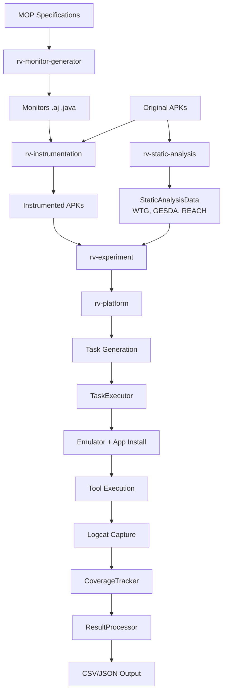
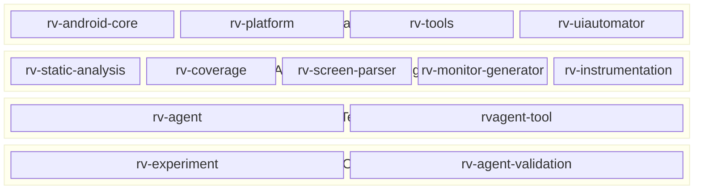
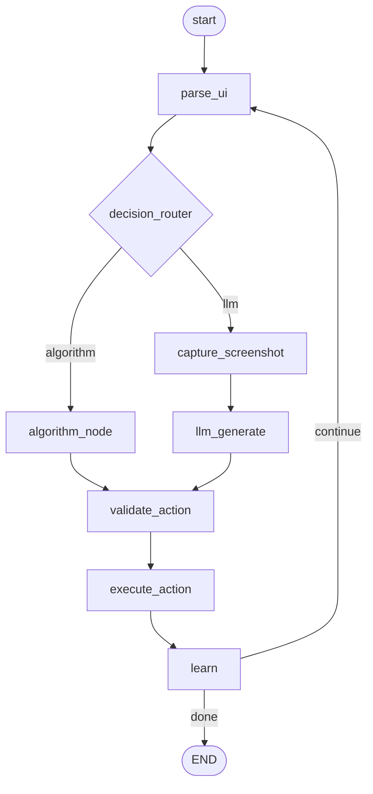

# RV-Android — Product Requirements Document

## 1. Overview

RV-Android is a modular platform for Android application testing that integrates runtime verification (JavaMOP/RV-Monitor), static analysis, automated test generation, and LLM-guided exploration. The platform is developed as part of a PhD thesis at the University of Brasilia (UnB), investigating the effectiveness of combining automated test-case generation tools with runtime verification to detect cryptographic API misuses in Android applications.

The system was the subject of an empirical study submitted to the IEEE International Conference on Software Testing, Verification and Validation (ICST), titled *"On the Effectiveness of Integrating Android Test-Case Generation with Runtime Verification for Detecting Cryptographic API Misuses"*.

### 1.1 Key Facts

- **14 Python modules** managed in a uv workspace with shared virtual environment
- **188 Android applications** analyzed in the ICST study (from F-Droid, filtered by JCA API reachability)
- **230 unique JCA violations** detected across all tool configurations
- **124 violations** found exclusively by RV (not detected by CogniCrypt static analysis)
- **11 tool configurations** evaluated (8 third-party tools + 3 DroidBot variants)
- **LLM-driven testing** via rv-agent with Qwen3-VL vision model (active development)

### 1.2 RVSEC Parent Project

RV-Android is part of the broader **RVSEC** (Runtime Verification for Security) ecosystem, a multi-project infrastructure developed at the University of Brasilia (UnB) for detecting cryptographic API misuses via runtime verification. RVSEC is available at [github.com/PAMunb/rvsec](https://github.com/PAMunb/rvsec).

The RVSEC ecosystem consists of the following components:

| Component | Language | Description |
|-----------|----------|-------------|
| **JavaMOP** | Java | Reads MOP specifications, generates AspectJ code (events) and RVM intermediaries |
| **RV-Monitor** | Java | Reads RVM specifications, synthesizes Java monitor classes |
| **mop-maven-plugin** | Java | Maven plugin for generating the Java agent from MOP specs |
| **rvsec** (Java classes) | Java | Core runtime classes: rvsec-core, rvsec-logger (CSV/logcat), rvsec-agent |
| **rv-android** | Python | APK instrumentation, test execution, and LLM-guided exploration (this project) |

RVSEC can be used in two modes:
1. **Java Libraries**: A Java agent is generated from MOP specifications and used during unit test execution (via Maven Surefire plugin with `-javaagent` flag)
2. **Android Applications**: APKs are instrumented with generated monitors and exercised on an emulator with test generation tools

The JCA MOP specifications were derived from **23 CrySL rules** for JCA, previously validated by cryptography experts, producing **23 MOP specifications** (one-to-one translation). CrySL was chosen as the starting point because: (a) CrySL specs for JCA were validated by cryptography experts, (b) CrySL and JavaMOP share similarities (both use Extended Regular Expressions for method call sequences), and (c) a test suite with 31 JUnit classes and 200+ test methods was available from CogniCrypt for validation. The translation from CrySL to JavaMOP followed a TDD approach.

In a prior study (qualification thesis, 2023), RVSEC was compared against two state-of-the-art static analyzers — CogniCrypt and CryptoGuard — across five benchmarks (MASCBench, SmallCryptoAPIBench, OWASPBench, JulietBench, ApacheCryptoAPIBench). RVSEC achieved an average F1 score of **0.95**, compared to 0.83 for CogniCrypt and 0.78 for CryptoGuard.

The research follows a **Design Science Research (DSR)** methodology with 4 planned cycles:
1. **Cycle 1** (completed): RVSEC infrastructure + accuracy comparison with static analyzers
2. **Cycle 2** (completed, ICST paper): Effectiveness of test generation tools with RV on Android
3. **Cycle 3** (in progress): LLM-guided exploration (rv-agent) for improved MOP coverage
4. **Cycle 4** (planned): Specification-driven test generation

**RVSEC installation path**: `$RVSEC_HOME` (typically `/path/to/rvsec`)
**Repository**: `https://github.com/PAMunb/rvsec`
**Replication package**: `https://github.com/PAMunb/RVSec-replication-package`

### 1.3 Origin: RV-Android by Runtime Verification Inc.

The RVSEC instrumentation pipeline was inspired by the original **RV-Android** project by Daian et al. (Runtime Verification Inc., 2015), a bash-script-based tool for instrumenting Android APKs with runtime monitors. The original tool's CLI (`instrument_apk.sh`) implemented the same core pipeline used in RVSEC today: dex2jar (DEX → JAR) → rv-monitor (RVM → Java monitors) → ajc (AspectJ weaving) → jar2dex (JAR → DEX) → jarsigner (APK signing).

As the research requirements grew — supporting multiple specification sets, integrating static analysis, managing emulators, orchestrating experiments with multiple tools, and adding LLM-guided exploration — the bash scripts were replaced by a modular Python framework (this project). The instrumentation pipeline itself (now implemented in `rv-instrumentation`) preserves the same steps as the original script, with additions such as the Coverage.aj aspect and d8 compiler (replacing jar2dex).

**Original project**: [github.com/runtimeverification/rv-android](https://github.com/runtimeverification/rv-android)
**Original paper**: Daian, P., Falcone, Y., Meredith, P., Serbanuță, T.F., Shiriashi, S., Iwai, A., Rosu, G. "RV-Android: Efficient Parametric Android Runtime Verification, a Brief Tutorial." RV 2015.

## 2. Problem Statement

### 2.1 Inadequate Testing of Android Apps

Android applications are often poorly tested. Pecorelli et al. report that only 40% of over 1,693 open-source apps contain Java test suites, with a median of five test cases and a median instruction coverage of 0.23. This severely limits the applicability of dynamic analysis techniques like runtime verification, which fundamentally depend on test executions.

### 2.2 Cryptographic API Misuse

Cryptographic APIs (specifically the Java Cryptography Architecture — JCA) are frequently misused by developers. Common misuses include:
- Relying on weak hashing algorithms (MD5, SHA-1)
- Using outdated TLS versions (TLSv1)
- Insufficient randomness in key generation
- Password-based encryption with fewer than 1,000 iterations

These misuses lead to security vulnerabilities in real-world applications.

### 2.3 Limited Coverage of Monitored Methods

Even with automated test generation tools, the achieved method coverage remains limited. The best observed overall method coverage in the ICST study was 26.77% (Humanoid at 300s timeout), and the best MOP method coverage was 17.16%. This means over 80% of methods that directly use the JCA API are never exercised, preventing runtime verification from detecting potential misuses in those code paths.

### 2.4 Gap in Tool-Guided Exploration

Existing test generation tools do not guide their exploration toward methods monitored by RV specifications. There is a need for test generation techniques that leverage runtime verification specifications to direct exploration toward API-relevant methods, which could further increase the effectiveness of RV-based analysis.

## 3. Solution

RV-Android addresses these problems with a modular platform that combines:

1. **JavaMOP Instrumentation**: Transforms MOP specifications into runtime monitors that are woven into Android APKs via AspectJ, enabling detection of API usage violations during execution.

2. **Coverage Aspect (Coverage.aj)**: In addition to MOP monitors, a custom AspectJ aspect (`Coverage.aj`) is woven into every instrumented APK. This aspect intercepts all method executions (excluding system packages like `java.*`, `android.*`, `dalvik.*`) and logs unique method signatures via Android logcat using the `RVSEC-COV` tag. The signature format is `<className: returnType methodName(params)>`. A `HashSet` ensures each signature is logged only once per execution, providing efficient real-time method coverage tracking without duplicates.

3. **Static Analysis**: Runs GATOR (Window Transition Graph), GESDA (GUI-Event-Sequence-Driven Analysis), and REACH (method reachability for MOP) to produce complementary data that guides exploration and coverage calculation. REACH serves two purposes: (a) it defines the **universe of methods** for coverage calculation — the total set of reachable methods is the denominator used to compute overall method coverage and MOP method coverage percentages; (b) it computes for each method whether it is reachable from framework entry points, whether it has a path to a monitored API method (`reaches_target`), and whether it directly invokes a monitored API method (`directly_reaches_target`), which rv-agent uses to prioritize exploration toward MOP-relevant code paths.

4. **Automated Test Generation Tools**: Integrates 8 third-party Android testing tools (Monkey, DroidBot, APE, FastBot, ARES, DroidMate, Humanoid, QTesting) through a plugin system with registry and factory patterns.

5. **LLM Agent (rv-agent)**: An LLM-guided testing tool using Qwen3-VL vision model via SGLang, with LangGraph workflow orchestration, coverage-optimized DFS exploration, and hybrid LLM/algorithm decision routing. This is the active focus of development (DSR Cycle 3).

6. **Complete Pipeline**: Orchestrated by rv-experiment, the full workflow covers pre-processing (monitor generation, instrumentation, static analysis), execution (task generation, emulator management, tool execution, coverage tracking), and post-processing (result generation in CSV/JSON).

### 3.1 Pipeline Overview



## 4. System Architecture

### 4.1 Module Organization

The system is organized into 14 uv workspace modules grouped in four layers:



### 4.2 Module Dependency Map

| Module | Internal Dependencies |
|--------|---------------------|
| rv-android-core | (none — foundation) |
| rv-tools | rv-android-core |
| rv-uiautomator | rv-android-core, rv-screen-parser |
| rv-screen-parser | rv-android-core |
| rv-coverage | rv-android-core |
| rv-static-analysis | rv-android-core |
| rv-monitor-generator | rv-android-core |
| rv-instrumentation | rv-android-core |
| rv-agent | rv-android-core, rv-screen-parser, rv-uiautomator, rv-static-analysis |
| rvagent-tool | rv-android-core, rv-agent, rv-tools |
| rv-platform | rv-android-core, rv-tools, rv-coverage, rv-static-analysis |
| rv-experiment | rv-android-core, rv-platform, rv-tools, rv-monitor-generator, rv-instrumentation, rv-static-analysis |
| rv-agent-validation | rv-android-core, rv-agent, rv-static-analysis, rv-screen-parser, rv-monitor-generator, rv-instrumentation |

### 4.3 Key External Dependencies

| Dependency | Version | Used By |
|-----------|---------|---------|
| pydantic | ^2.9.0 | All modules (configuration validation) |
| langchain / langgraph | ^0.3 | rv-agent (workflow orchestration) |
| langchain-openai | ^0.3 | rv-agent (SGLang communication) |
| uiautomator2 | ^3.3.1 | rv-uiautomator, rv-screen-parser |
| lxml | ^5.3.0 | rv-screen-parser (XML parsing) |
| click | ^8.0 | rv-experiment (CLI) |
| pandas | ^2.3.1 | rv-platform, rv-agent-validation |
| scipy | ^1.14 | rv-agent, rv-agent-validation |
| pillow | ^10.0 | rv-agent, rv-uiautomator, rv-screen-parser |
| optuna | — | rv-agent-validation (calibration) |

## 5. Functional Requirements

### 5.1 Instrumentation and Monitors

#### FR01: Monitor Generation from JavaMOP Specifications

The system MUST generate runtime verification monitors from MOP specification files. The generation pipeline processes `.mop` files through JavaMOP (producing `.aj` aspects and `.rvm` intermediaries) and RV-Monitor (producing `.java` monitor classes). The pipeline has 6 steps: validate configuration, prepare output, execute JavaMOP, copy custom aspects, execute RV-Monitor, clean up intermediaries.

**Module**: rv-monitor-generator
**Key component**: `RuntimeVerificationGenerator`

#### FR02: APK Instrumentation with Monitors

The system MUST instrument Android APKs with generated monitors through a 6-step pipeline: decompilation (dex2jar: DEX → JAR), monitor integration, AspectJ weaving (ajc), dependency integration (rv-monitor-rt, aspectjrt, rvsec-core), recompilation (d8: JAR → DEX), and APK signing (jarsigner). The system also weaves a coverage aspect that captures all method calls via logcat.

**Module**: rv-instrumentation
**Key component**: `RVInstrumentation`

**External tools**: dex2jar, ajc (AspectJ), d8 (Android SDK), jarsigner, Maven

#### FR03: Specification Set Support

The system MUST support multiple specification sets for different API domains:
- **JCA**: Java Cryptography Architecture monitors — 23 specifications detecting cryptographic API misuses (Cipher, MessageDigest, SSLContext, SecretKeySpec, KeyGenerator, Signature, Mac, KeyStore, etc.)
- **Generic (FSM)**: General programming pattern monitors — 118 FSM-based specifications from JavaMOP's specification database (e.g., Iterator hasNext before next, stream closing)
- **Generic (new)**: Curated generic specifications — 27 specifications with descriptive names (e.g., `Closeable_MeaninglessClose`, `Map_UnsafeIterator`, `InputStream_ManipulateAfterClose`)
- **Custom**: User-defined specification directories

Specification sets are used independently in experiments — in one experiment APKs are instrumented with JCA specifications, in another with generic specifications. Sets are never mixed within a single experiment.

**Specification source**: `$RVSEC_HOME/rvsec/rvsec-mop/src/main/resources/`

**Modules**: rv-monitor-generator, rv-instrumentation, rv-experiment

### 5.2 Static Analysis

#### FR04: GATOR Analysis (Window Transition Graph)

The system MUST run GATOR static analysis to produce a Window Transition Graph (WTG) representing the navigation structure of an Android application. Output is a `.wtg` JSON file parsed into a `WindowTransitionGraph` domain model containing windows (activities) and transitions (edges with event types).

**Module**: rv-static-analysis
**Key component**: `GatorParser`

#### FR05: GESDA Analysis (GUI-Event-Sequence-Driven Analysis)

The system MUST run GESDA analysis to extract GUI elements including activities, widgets, and event listeners. Output is a `.gesda` JSON file parsed into `Windows` and widget models. REACH depends on GESDA output; GATOR is independent.

**Module**: rv-static-analysis
**Key component**: `GesdaParser`

#### FR06: REACH Analysis (Reachability for MOP)

The system MUST run REACH analysis to compute method reachability information relative to MOP specifications. For each method, REACH produces three boolean flags: `reachable` (reachable from Android framework entry points), `reaches_target` (has a direct or indirect path to a monitored API method), and `directly_reaches_target` (directly invokes a monitored API method). Output is a `.reach` CSV file.

**Module**: rv-static-analysis
**Key component**: `ReachParser`

### 5.3 Execution and Management

#### FR07: Android Emulator Management

The system MUST manage Android emulator lifecycle including start, stop, app installation, and dynamic port allocation for parallel execution. The EmulatorComponent manages emulator startup within TaskExecutor and raises `EmulatorError` if APK installation fails (checked via `CommandResult.is_failure()`).

**Module**: rv-platform
**Key component**: `EmulatorComponent`

#### FR08: Task Generation

The system MUST generate tasks as the cartesian product of: APK × tool × variant × repetition × timeout. Tasks follow a lifecycle: CREATED → CONFIGURED → INITIALIZING → READY → RUNNING → COMPLETED → CLEANUP → ARCHIVED (with ERROR as an alternative terminal state from RUNNING).

**Module**: rv-platform
**Key component**: `Platform.generate_tasks()`

#### FR09: Component-Based Task Execution

The system MUST execute tasks through a component-based architecture with coordinated phases:
1. **Phase 1**: Static analysis data loading (outside emulator session)
2. **Phase 2**: Coverage tracker initialization (outside emulator session)
3. **Phase 3**: Emulator session with app installation, logcat capture, coverage tracking, and tool execution (inside emulator context)

Components follow the `ITaskComponent` interface with `initialize()`, `execute()`, and `cleanup()` lifecycle methods.

**Module**: rv-platform
**Key components**: `TaskExecutor`, `EmulatorComponent`, `CoverageComponent`, `StaticAnalysisComponent`, `LogcatComponent`, `ToolExecutionComponent`

#### FR10: Persistent Task Storage

The system MUST provide persistent task storage with atomic file operations and transaction support. `TaskStorage` supports experiment continuation via configuration checksum validation, enabling interrupted experiments to resume.

**Module**: rv-platform
**Key component**: `TaskStorage`

#### FR11: Logcat Capture and Parsing

The system MUST capture and parse Android logcat output in real-time to extract:
- **Coverage events**: Method calls tagged with `RVSEC-COV`, parsed into `RvCoverageLog` (supports both modern `<class: returnType method(params)>` and legacy `class:::method:::params` formats)
- **RV errors**: Specification violations tagged with `RVSEC`, parsed into `RvErrorLog` (supports standard CSV, FSM, and generic formats)

**Modules**: rv-coverage (parsing and tracking), rv-platform (capture via LogcatComponent)
**Key components**: `LogcatParser`, `CoverageTracker`, `LogcatRepository`

### 5.4 Coverage and Results

#### FR12: Method Coverage Tracking

The system MUST track two types of method coverage:
- **Overall method coverage**: Percentage of application methods exercised during testing (best observed: 26.77% with Humanoid at 300s)
- **MOP method coverage**: Percentage of methods that directly use monitored API methods exercised (best observed: 17.16% with Humanoid at 300s)

Coverage is tracked in real-time via a background thread monitoring logcat, with `COVERAGE_UPDATED` events published to the EventBus when changes are detected.

**Module**: rv-coverage
**Key component**: `CoverageTracker`

#### FR13: Specification Violation Detection

The system MUST detect and record violations of MOP specifications (RV errors) reported via logcat during test execution. Violations are classified by specification (e.g., SSLContextSpec, MessageDigestSpec, CipherSpec, SecretKeySpecSpec) and include class, method, source file, error type, and message. `MOP_ERROR_DETECTED` events are published to the EventBus.

In the ICST study, the top 4 violation classes (SSLContext, MessageDigest, Cipher, SecretKeySpec) accounted for 78% of 230 unique violations. 33.91% originated from application code; the rest from external libraries.

**Module**: rv-coverage
**Key component**: `CoverageTracker`, `LogcatRepository`

#### FR14: Result Generation

The system MUST generate standardized output files from completed experiments:

| File | Content |
|------|---------|
| `coverage.csv` | Per-method coverage data with timing and progressive metrics |
| `errors.csv` | Monitored operations violations with timing and context |
| `summary.csv` | Aggregate metrics per task (activities, methods, MOP coverage, errors) |
| `results.json` | Hierarchical JSON with complete experiment data |
| `performance.csv` | Task execution timing and performance metrics |
| `tasks.json` | Task state persistence for experiment continuation |

Result processing can be skipped during execution and run standalone later.

**Module**: rv-platform
**Key components**: `ResultProcessorComponent`, `PerformanceProcessorComponent`

### 5.5 Experiment Orchestration

#### FR15: Three-Phase Workflow

The system MUST orchestrate experiments through three sequential phases:
1. **Pre-processing** (PreProcessor): Monitor generation → APK instrumentation → Static analysis (GATOR, GESDA, REACH)
2. **Execution** (ExecutionController): Creates PlatformConfig → Delegates to rv-platform → No data transfer back (results stay in rv-platform)
3. **Post-processing** (PostProcessor): Generates instrumentation errors JSON → Completion diagnostics → Publishes events

**Module**: rv-experiment
**Key component**: `ExperimentController`

#### FR16: CLI with Tool Specification DSL

The system MUST provide a CLI (Click-based) that accepts a tool specification DSL with the format:
```
tool_name[:variant][@param1=value1,param2=value2]
```

Examples:
- `monkey` — Basic tool with default variant
- `droidbot:dfs_greedy` — DroidBot with DFS greedy variant
- `rvagent:multimode@temperature=0.3` — rv-agent with multimode and custom temperature
- `monkey,droidbot:bfs_greedy,rvagent:pure_algorithm` — Multiple tools

**Module**: rv-experiment
**Key component**: CLI in `__main__.py`

#### FR17: Just-in-Time Sub-Module Configuration

The system MUST create sub-module configurations only when needed during experiment execution. JIT configuration methods (`get_monitored_operations_config()`, `get_rv_instrumentation_config()`, `get_static_analysis_config()`) derive sub-module configs from the experiment-level configuration.

**Module**: rv-experiment
**Key component**: `ExperimentConfig`

### 5.6 Tool System

#### FR18: Plugin System with Registry and Factory Patterns

The system MUST provide a centralized tool registry (singleton) and factory for tool management:
- **ToolRegistry**: Stores tool classes, specifications, and variants. Tools self-register at module import via `_register_builtin_tools()`.
- **ToolFactory**: Creates configured tool instances from `ToolConfig` by resolving the tool class, getting variant configuration, merging with additional parameters, and calling `tool.configure()`.

**Module**: rv-tools
**Key components**: `ToolRegistry`, `ToolFactory`

#### FR19: External Tool Support

The system MUST support 8 third-party Android test generation tools:

| Tool | Strategy | Key Variants |
|------|----------|-------------|
| Monkey | Pseudo-random event generation | default, fast, stress |
| DroidBot | Policy-based UI exploration (state-transition model) | dfs_greedy, bfs_greedy, dfs_naive, bfs_naive, random |
| APE | CEGAR model abstraction (decision tree) | default, sata, bfs, dfs, random |
| FastBot | Multi-agent model-based with RL | conservative, aggressive, balanced |
| ARES | Deep RL exploration | default, debug, fast |
| DroidMate | JAR-based research tool | default, systematic, quick, research |
| Humanoid | Deep learning (human-like interactions) | default, visual, nlp, hybrid |
| QTesting | Q-learning with curiosity mechanism | default, qlearning, dqn, ddqn |

**Module**: rv-tools
**Key component**: Built-in tools in `builtin/` directory

#### FR20: Per-Tool Variant System

Each tool MUST support multiple variants representing different operational modes and parameter sets. Tools implement the `AbstractTool` contract: `get_variants()` returns available variants with their configurations, `get_tool_spec()` returns the tool specification, `configure()` applies variant configuration, and `execute_tool_specific_logic()` runs the tool.

**Module**: rv-tools (infrastructure), rv-android-core (`AbstractTool` base class)

### 5.7 LLM Agent (rv-agent)

#### FR21: LangGraph Workflow with Externalized Nodes

rv-agent MUST use LangGraph for workflow orchestration with the following node graph:



Nodes are externalized in `agent/nodes/` directory: `parse_node.py`, `decision_node.py`, `algorithm_node.py`, `llm_node.py`, `validation_node.py`, `execute_node.py`, `learn_node.py`.

**Module**: rv-agent
**Key component**: `RVAgent`

#### FR22: Three Execution Modes

rv-agent MUST support three execution modes:

| Mode | Description | LLM Usage |
|------|-------------|-----------|
| `pure_algorithm` | Algorithmic exploration using RVAgentStrategy | None |
| `llm_only` | LLM decides all actions via Qwen3-VL | 100% |
| `multimode` | Hybrid approach with probabilistic routing | 70% LLM / 30% Algorithm (default) |

**Module**: rv-agent
**Key component**: `RoutingManager`

#### FR23: UI Parsing via UIAutomator XML + Screen Processor

rv-agent MUST capture and parse the Android UI state using UIAutomator2 XML hierarchy dumps. The `ScreenProcessor` uses visitor patterns (BasicTextVisitor for compact descriptions, ~69% token reduction vs raw XML hierarchy) to produce `ScreenDescription` objects containing `ScreenItem` elements with `ItemAction` objects that include coordinates and MOP tracking metadata.

**Modules**: rv-screen-parser (parsing infrastructure), rv-agent (ScreenProcessor, RVAgentVisitor)
**Key components**: `UIAutomator2Parser`, `BasicTextVisitor`, `ScreenProcessor`

#### FR24: Vision-Based Exploration (Qwen3-VL via SGLang)

rv-agent MUST support vision-based exploration using the Qwen3-VL model served via SGLang (OpenAI-compatible API). The `LLMClient` sends screenshots alongside parsed UI context to the model, which returns tool calls specifying actions to execute on the device.

Default configuration: `Qwen/Qwen3-VL-4B-Instruct`, temperature=0.01, top_p=0.6, max_tokens=2048.

**Module**: rv-agent
**Key component**: `LLMClient`

#### FR25: Probabilistic Routing

In `multimode`, the `RoutingManager` MUST route decisions between the LLM and the algorithm using configurable probabilities (default: 70% LLM / 30% algorithm). The routing uses Gumbel-max sampling (via scipy) for stochastic selection.

**Module**: rv-agent
**Key component**: `RoutingManager`

#### FR26: Coverage-Optimized DFS Strategy

The `RVAgentStrategy` MUST implement a coverage-optimized depth-first search with:
- **Successor Tracker**: Tracks state transitions and re-enables actions if successors are not fully explored (solves the "combobox problem")
- **Plateau Detector**: Monitors exploration progress and detects stagnation when no new states are discovered over a configurable window
- **Continuous Exploration**: Never reports being "exhausted" — always finds actions to try

**Module**: rv-agent
**Key component**: `RVAgentStrategy`, `SuccessorTracker`, `PlateauDetector`

#### FR27: Composite Action Ranking

The strategy MUST rank available actions using a composite scoring system with 6 scorers:

| Scorer | Score | Purpose |
|--------|-------|---------|
| `GradualDecayScorer` | 200 × 0.7^visits | Exponential decay prevents premature abandonment |
| `MopScorer` | +100 (directly_reaches_target), +50 (reaches_target) | Prioritize MOP-reaching actions |
| `WtgScorer` | +100 | Prioritize WTG-guided transitions |
| `ComponentPriorityScorer` | +50 (buttons), +40 (toggles), etc. | Widget type priority |
| `ExecutionCountScorer` | 10/(1+count) | Lower execution count = higher score |
| `FailedActionScorer` | -9999 | Blacklist permanently failed actions |

**Module**: rv-agent
**Key component**: `ActionRanker`

#### FR28: Memory Systems

rv-agent MUST maintain multiple coordinated memory systems:
- **ShortTermMemory**: Recent actions and states within a configurable sliding window
- **LongTermMemory**: Persistent state patterns and learned behaviors across the entire session
- **DynamicStateGraph**: Graph of explored states and transitions with structural screen hashing
- **UICoverageTracker**: Tracks UI element coverage and interaction history

The `MemoryCoordinator` orchestrates updates to all memory systems.

**Module**: rv-agent
**Key components**: `MemoryCoordinator`, `DynamicStateGraph`, `UICoverageTracker`

#### FR29: Stuck State Detection and Recovery

rv-agent MUST detect and recover from stuck states through:
1. **Screen Hash Monitoring**: Detects when the screen doesn't change after actions
2. **Deadlock Detection**: Identifies when no actions are available
3. **Forced BACK**: Automatically navigates back after threshold consecutive stuck iterations
4. **Loop Detection**: Prevents repetitive action sequences

Stuck detection is performed in `learn_node` based on screen hash changes.

**Module**: rv-agent
**Key component**: `learn_node.py`

#### FR30: WTG-Guided Navigation

rv-agent MUST use the Window Transition Graph (from GATOR static analysis) to guide exploration. The `TransitionManager` integrates WTG data with the `DynamicStateGraph`, and `NavigationGuidance` provides unified navigation hints to both the LLM (via prompt) and algorithm (via WtgScorer).

**Module**: rv-agent
**Key components**: `TransitionManager`, `NavigationGuidance`

#### FR31: Qwen3-VL Coordinate Normalization

rv-agent MUST convert coordinates from Qwen3-VL's normalized [0, 1000) range to device pixel coordinates using: `pixel_x = int((x / 1000) * device_width)`. The `ActionNormalizer` in `domain/action.py` handles this conversion via `denormalize_qwen_coords()`.

**Module**: rv-agent
**Key component**: `ActionNormalizer`

#### FR32: Hybrid Tool Calling

rv-agent MUST support hybrid tool call parsing to handle SGLang's non-deterministic behavior with Qwen3-VL (~50% native tool_calls, ~50% XML in content):
1. First attempt: Extract structured `tool_calls` from LLM response (native)
2. Fallback: Parse from `response.content` using strategies in priority order: XML tags, JSON array, JSON object, markdown, pythonic

**Module**: rv-agent
**Key component**: `tool_call_parser.py`

### 5.8 Infrastructure

#### FR33: Event-Driven Communication

The system MUST use an EventBus for decoupled component communication with typed channels:
- `LIFECYCLE_CHANNEL`: Experiment/task lifecycle events (started, completed, failed)
- `ERROR_CHANNEL`: Error events
- `METRICS_CHANNEL`: Performance metrics events
- `LLM_CHANNEL`: LLM request/response events

Event types include: `EXPERIMENT_STARTED/COMPLETED/FAILED`, `TASK_CREATED/STARTED/COMPLETED/FAILED`, `EMULATOR_STARTED/STOPPED`, `TOOL_STARTED/COMPLETED`, `LLM_REQUEST_SENT/RESPONSE_RECEIVED/ERROR`, `COVERAGE_UPDATED`, `MOP_ERROR_DETECTED`.

**Module**: rv-android-core
**Key component**: `EventBus`

#### FR34: Error Handling with Recovery Strategies

The system MUST provide error handling with classification and recovery strategies. The `ErrorHandler` maps error types to recovery strategies: `EmulatorError` → `EmulatorRecoveryStrategy`, `ToolError` → `ToolRecoveryStrategy`, `LLMError` → `LLMRecoveryStrategy`, `ExecutionError` → `GeneralRecoveryStrategy`. ErrorHandler is used as a decorator pattern across all modules.

**Module**: rv-android-core
**Key component**: `ErrorHandler`

#### FR35: Pydantic Validation

The system MUST use Pydantic v2 for configuration validation. `BaseValidatedModel` provides the foundation for all validated models. All configuration classes (`PlatformConfig`, `ExperimentConfig`, `RVAgentConfig`, `RVGeneratorConfig`, `RVInstrumentationConfig`, `RVStaticAnalysisConfig`, `LLMConfig`) use Pydantic with field validators.

**Module**: rv-android-core
**Key component**: `BaseValidatedModel`

#### FR36: Centralized Logging

The system MUST provide centralized logging through `LoggingManager` with consistent formatting. rv-agent uses a unified tracking system with `[RVTRACK:<CATEGORY>]` prefix and categories: PARSE, ROUTE, RANK, SELECT, VALIDATE, EXEC, STATE, LEARN, LLM, NAV.

**Module**: rv-android-core
**Key component**: `LoggingManager`

#### FR37: Performance Monitoring

The system MUST collect performance metrics via `PerformanceMonitor`. All major operations in rv-uiautomator and rv-platform are tracked for execution time. LLM responses capture `total_duration`, `load_duration`, `input_tokens`, `output_tokens`, and `tokens_per_second`.

**Module**: rv-android-core
**Key component**: `PerformanceMonitor`

## 6. LLM Evolution and Inference Infrastructure

The project developed four LLM-based testing tools exploring different integration approaches — pure prompt engineering, LLM as guidance, and agentic — before converging on rv-agent as the production tool. The selection of the inference server and the characterization of VLM visual grounding capabilities followed a multi-phase empirical evaluation conducted in a dedicated benchmark framework (`rvsec-vision-llm`). Full documentation is in `docs/vision/`.

### 6.1 Tool Evolution

RV-Android developed four LLM-based testing tools, each representing a different approach to integrating LLMs with Android test generation. Only rv-agent reached production; the others were discontinued before completion.

**Approach 1 — Pure Prompt Engineering (rvandroid, rvsmart)**

**rvandroid** (`modules/rvandroid-tool`, deleted) was built on DroidBot's exploration engine. DroidBot's policy sent the current device state via REST to rvandroid, which used the `rv-llm` PromptFramework — a 3-layer architecture (Information Layer with reusable fragments, Template Layer with Jinja2, Strategy Layer with Single/Batch/Vision modes) — to convert `ScreenDescription` objects into prompts. The LLM generated actions that were returned to DroidBot for execution. The dependency on DroidBot's state-transition model limited the LLM's autonomy.

**rvsmart** (`modules/rvsmart-tool`, discontinued) removed DroidBot, using UIAutomator directly. A `TestOrchestrator` loop captured the UI state, converted it to the same ScreenDescription format, sent it to `LLMActionService` (which used the same rv-llm PromptFramework), and executed the returned actions via UIAutomator. Same prompt engineering approach, but with direct device control.

**Approach 2 — LLM as Guidance (rvdroid)**

**rvdroid** (`modules/rvdroid-tool`, discontinued) used a `GuidanceService` where the LLM did not generate actions directly. Instead, it returned `GuidanceDecision` objects with three types: `STRATEGIC_ADVICE` (exploration suggestions), `FLOW_CHANGE` (recommended direction changes), or `NO_GUIDANCE` (defer to algorithm). An algorithmic exploration engine made the actual action decisions, optionally incorporating LLM hints. Development was not completed.

**Approach 3 — Agentic (rv-agent)**

**rv-agent** (`modules/rv-agent`, active) uses LangGraph for workflow orchestration where the VLM (Qwen3-VL with vision) is a first-class decision-maker. Unlike the previous approaches, the LLM directly generates device actions via tool calling, maintains structured memory systems, and participates in hybrid routing with algorithmic strategies. This is the production tool for Cycle 3 of the research (see Section 1.2).

### 6.2 The Visual Grounding Problem

Initial experiments revealed a limitation of current VLMs: they are poor at **generating** pixel coordinates from screenshots — a task known as "visual grounding." When asked to identify the location of a UI element without coordinate hints (`visual_only` mode), models showed low accuracy:

| Model | visual_only Hit Rate | coords_provided Hit Rate |
|-------|---------------------|-------------------------|
| Qwen3-VL-4B (initial) | 3.6% | 100% |
| gemma-3-4b-it | 0.9% | 100% |

The 100% hit rate in `coords_provided` mode is trivial — the model copies the coordinates from the prompt. The near-zero `visual_only` rates demonstrate that these models cannot reliably locate elements visually.

Analysis of Qwen3-VL errors showed systematic biases: the model tends to point ~225px to the right and ~270px above the target, typically landing in the center of a dialog instead of on the specific button.

### 6.3 The Solution: Selection over Generation

The adopted approach reframes the VLM's task from *coordinate generation* to *element selection*:

1. **Parse the UI** via UIAutomator2 XML to obtain all interactive elements with their exact coordinates
2. **Present the element list** to the VLM in the prompt (text description + coordinates per element)
3. **Ask the VLM to choose** which element to interact with, using the pre-determined coordinates

This approach uses the VLM for what it does well (understanding screen content and deciding what to do) while bypassing its limitation (precise coordinate generation). The VLM still processes the screenshot for visual context, but does not need to generate coordinates from scratch.

With this approach, the hit rate in rv-agent approaches 100% for elements present in the UIAutomator hierarchy, because the VLM selects from known-correct coordinates rather than generating its own. The `visual_only` benchmark numbers (57.7% for Qwen3-VL) measure raw visual grounding capability without UIAutomator data.

### 6.4 Inference Server Selection

The selection of the inference server was the primary infrastructure decision. Three servers were evaluated for serving Qwen3-VL:

| Server | Backend | Loop Bug | Tool Calling | Decision |
|--------|---------|----------|--------------|----------|
| **SGLang** | PyTorch/FlashInfer | No (0%) | Native + fallback | **Selected** |
| **vLLM** | PyTorch/PagedAttention | No (0%) | Native (100%) | Fallback |
| Ollama | llama.cpp/GGUF | **Yes (16.7%)** | Requires parser | Excluded |

**Ollama Infinite Loop Bug**: The initial rv-agent deployment used Ollama, which exhibited a critical infinite loop bug with Qwen3-VL. The root cause is the GGUF/llama.cpp backend ignoring the `repeat_penalty` parameter. Trigger conditions: temperature < 0.3 and num_predict = 8192 with screenshots containing repetitive UI patterns. Duration: 60-70 seconds of token generation with zero tool calls produced. The bug is probabilistic and affects all GGUF-based servers (Ollama, LM Studio). PyTorch-based servers (SGLang, vLLM) are not affected. This bug was the primary motivation for building the `rvsec-vision-llm` evaluation framework.

**SGLang was selected** as the primary server for: (1) no loop bug (PyTorch backend), (2) FlashInfer attention backend with RTX 5070 Ti SM120 support, (3) native Qwen tool call parsing, (4) consistent performance. vLLM is maintained as a fallback option.

### 6.5 Visual Grounding Benchmark

With SGLang selected as the inference server, a comprehensive benchmark was conducted to characterize Qwen3-VL's visual grounding capabilities and compare against alternative VLMs. The evaluation used a custom framework (`rvsec-vision-llm`) with a LangGraph-based pipeline mirroring rv-agent's architecture.

**Dataset**: 468 screenshots from 28 Android apps, 812 unique UI elements, 2,847 total tests (3 repetitions per element).

**Configuration**: `visual_only` grounding mode (no coordinates in prompt), temperature=0.01, top_p=0.6, hit tolerance=50px.

#### Results

| Model | Server | Quantization | Hit Rate | Tool Call Rate | Avg Latency |
|-------|--------|-------------|----------|----------------|-------------|
| **Qwen3-VL-4B** | SGLang | bf16 | **57.7%** | **90.3%** | 1,821ms |
| Fara-7B | vLLM | 4-bit | 44.3% | 79.9% | 1,015ms |
| gemma-3-4b-it | SGLang | bf16 | 0.9% | 76.8% | 805ms |

Six additional models were evaluated but excluded: Qwen3-VL-4B-Thinking (generates multilingual noise), Llava-OneVision-7B (unsupported architecture), Molmo-7B-D-0924 (requires TensorFlow), InternVL2-8B (no structured tool calls), AutoGLM-Phone-9B (incompatible with bitsandbytes), MiniCPM-V-4.5 (does not respond to standard prompts).

**Quantization impact**: 4-bit quantization (bitsandbytes) caused severe degradation for Qwen3-VL — hit rate dropped from 67.1% (bf16) to 23.9% (4-bit), a ~3x decrease. bf16 without quantization is required.

#### Element Type Performance

| Element Type | Qwen3-VL | Fara-7B | Advantage |
|--------------|----------|---------|-----------|
| EditText | 93.1% | 12.4% | Qwen (+80.7%) |
| Button | 78.2% | 66.2% | Qwen (+12.0%) |
| TextView | 60.2% | 33.9% | Qwen (+26.3%) |
| CheckedTextView | 29.2% | 71.6% | Fara (+42.4%) |
| RadioButton | 0.0% | 61.5% | Fara (+61.5%) |
| CheckBox | 25.0% | 54.6% | Fara (+29.6%) |

Qwen3-VL has higher accuracy on text-based elements (EditText, Button, TextView), which are the most common in Android UIs. Fara-7B performs better on selection controls (CheckedTextView, RadioButton, CheckBox). Qwen3-VL was selected for rv-agent based on its overall hit rate and text-element accuracy.

### 6.6 Production Configuration

**Model**: Qwen/Qwen3-VL-4B-Instruct
**Inference Server**: SGLang (bf16, no quantization)
**Hardware**: NVIDIA RTX 5070 Ti (16GB VRAM)

| Parameter | Value |
|-----------|-------|
| Hit rate (visual_only) | 57.7% |
| Hit rate (with UIAutomator selection) | ~100% |
| Tool call rate | 90.3% |
| Consistency | 98.9% across repetitions |
| Avg latency | 1,821ms (~33 inferences/minute) |
| VRAM usage | ~8GB |

**Default LLM parameters**: temperature=0.01, top_p=0.6, top_k=50, max_tokens=2048.

### 6.7 Hybrid Tool Calling

SGLang does not officially support tool calling for Qwen3-VL (vision/multimodal models). The observed behavior is non-deterministic: approximately 50% of responses use native `tool_calls` (structured), while 50% embed tool calls as XML `<tool_call>` tags in the `content` field.

The solution is a hybrid fallback parser:

1. First attempt: extract structured `tool_calls` from the LLM response (native)
2. Fallback: parse from `response.content` using strategies in priority order — XML tags (Hermes format), JSON array, JSON object, markdown code blocks, pythonic function calls

The XML fallback parser achieves a higher hit rate (69.5%) than native tool calls (60.2%), suggesting the model is more deliberate about coordinates when using the XML format. The combined approach achieves 100% tool call extraction success.

### 6.8 Coordinate Normalization

Qwen3-VL returns coordinates in a normalized [0, 1000) range, not pixel coordinates. Before this was understood, coordinates were treated as raw pixels, resulting in a 3.6% hit rate. Applying the correct conversion raised the rate to ~50% (further improved to 57.7% in the final benchmark with tuned parameters):

```
pixel_x = int((x / 1000) * device_width)
pixel_y = int((y / 1000) * device_height)
```

Example: raw (499, 547) on a 1080x1920 screen converts to pixel (539, 1050), which is 4px from the target (540, 1054).

The `ActionNormalizer` in `domain/action.py` handles this conversion via `denormalize_qwen_coords()`. Reference: [Qwen3-VL GitHub Issue #1486](https://github.com/QwenLM/Qwen3-VL/issues/1486).

## 7. Non-Functional Requirements

#### NFR01: Modularity

The system MUST be organized as independent uv workspace modules in a shared workspace. A single `uv sync` at the root installs all modules in editable mode. Source changes are reflected immediately without reinstallation.

#### NFR02: Extensibility

The system MUST support extensibility through:
- Plugin system for testing tools (ToolRegistry + ToolFactory)
- Component interfaces for task execution phases (ITaskComponent)
- Strategy pattern for exploration strategies (ExplorationStrategy)
- Factory pattern for component creation (AgentFactory, LLMComponentFactory)
- Provider abstraction for LLM backends (LanguageModel)

#### NFR03: Testability

The system MUST support multiple test categories:
- **Unit tests**: Isolated tests without external dependencies
- **Integration tests**: Component interaction tests
- **Smoke tests**: Quick sanity checks
- **Online tests**: Tests requiring device/LLM server
- **Performance tests**: Latency and throughput tests
- **Regression tests**: Preventing recurrence of fixed bugs

#### NFR04: Resilience

The system MUST handle failures gracefully:
- Tool timeouts are considered successful completion (expected behavior)
- Static analysis loading is non-critical — execution continues without it
- ErrorHandler provides recovery strategies per error type
- Infrastructure error retry: up to 3 attempts for device/installation failures
- Experiment continuation via TaskStorage checksum validation

#### NFR05: Configurability

The system MUST be configurable through:
- Pydantic models with field validators (all configuration classes)
- Environment variables (`RVSEC_HOME`, `ANDROID_HOME`, `RV_PYDANTIC`, `RVAGENT_MODE`)
- JSON configuration files with validation and template generation
- CLI arguments with tool specification DSL
- Priority-based path resolution (explicit → root → env var → fallback)

#### NFR06: Observability

The system MUST provide observability through:
- EventBus for lifecycle, error, metrics, and LLM events
- `[RVTRACK:<CATEGORY>]` logging system in rv-agent (10 categories)
- PerformanceMonitor for execution time tracking
- LLM response metrics (tokens, latency, tokens/second)
- Structured output files (CSV/JSON) for post-hoc analysis

#### NFR07: Compatibility

The system MUST be compatible with:
- Python 3.11+ (3.12 recommended)
- Android SDK (ANDROID_HOME for emulator, d8 compiler)
- RVSEC toolchain (JavaMOP, RV-Monitor, AspectJ — Java 8+)
- SGLang server (OpenAI-compatible API for Qwen3-VL)
- Ubuntu Linux (with tesseract-ocr, libopencv-dev for screenshot analysis)

#### NFR08: Reproducibility

The system MUST support reproducible experiments through:
- Persistent task storage with atomic operations and transactions
- Experiment continuation via configuration checksum validation
- Deterministic seed management (MD5 hash-based, standard seeds: 42, 123, 456)
- Checkpoint/resume capability in rv-agent-validation

## 8. System Modules

| Module | Responsibility | Internal Deps | Key External Deps |
|--------|---------------|---------------|-------------------|
| rv-android-core | Domain models, EventBus, ErrorHandler, logging, validation, Command | — | pydantic |
| rv-platform | Task execution engine, components, storage, result processing | core, tools, coverage, static-analysis | pydantic, pandas |
| rv-experiment | Experiment orchestration, CLI, 3-phase workflow | core, platform, tools, monitor-gen, instrumentation, static-analysis | pydantic, click |
| rv-agent | LLM-guided testing with LangGraph, strategies, memory | core, screen-parser, uiautomator, static-analysis | langchain, langgraph, scipy, pillow |
| rvagent-tool | Tool wrapper integrating rv-agent with rv-platform/rv-experiment | core, agent, tools | — |
| rv-llm | LLM provider abstraction, prompt framework **(removed from workspace)** | core, screen-parser | langchain, jinja2 |
| rv-tools | Tool registry, factory, 8 built-in tools | core | pydantic |
| rv-uiautomator | UIAutomator2 adapter, device interaction | core, screen-parser | uiautomator2, pillow |
| rv-coverage | Coverage tracking, logcat parsing, metrics | core | pydantic, regex |
| rv-static-analysis | GATOR/GESDA/REACH execution and parsing | core | pydantic |
| rv-screen-parser | UI XML parsing, visitor pattern, screenshot analysis | core | lxml, opencv, pytesseract |
| rv-monitor-generator | JavaMOP/RV-Monitor pipeline | core | pydantic |
| rv-instrumentation | APK instrumentation with monitor weaving | core | pydantic |
| rv-agent-validation | Validation framework, statistical analysis, calibration | core, agent, static-analysis, screen-parser, monitor-gen, instrumentation | scipy, optuna, pandas |

## 9. Execution Modes

### 9.1 rv-experiment CLI (Full Pipeline)

The primary entry point for complete experiments with pre-processing (monitors, instrumentation, static analysis), execution, and post-processing.

```bash
uv run rv-experiment run --tools monkey,droidbot:dfs_greedy --specification-set jca --apks-dir ./apks_examples
```

### 9.2 rv-platform CLI (Direct Execution)

Direct task execution without the experiment wrapper. Assumes APKs are already instrumented if RV coverage is desired.

```bash
uv run rv-platform run --tools monkey --apks-dir ./apks_examples --timeouts 300
```

### 9.3 rv-agent CLI (Standalone)

Standalone mode where the user manages the emulator and APK installation. Useful for development and debugging.

```bash
# Start emulator and install APK manually
uv run rv-agent run --package br.unb.cic.cryptoapp --mode pure_algorithm --timeout 60
```

### 9.4 rv-agent via rv-experiment (Managed)

rv-agent runs as a tool within rv-experiment, which manages the emulator, APK installation, and coverage tracking.

```bash
uv run rv-experiment run --tools rvagent:multimode --apks-dir ./apks_examples --timeouts 300
```

## 10. Research Integration

### 10.1 Research Questions (ICST Paper)

**RQ1**: How effective are Android test-generation tools in revealing JCA violations via runtime verification in Android apps?

*Finding*: Integrating test generation tools with RV is effective. The tools revealed 230 unique JCA violations across 188 apps, including 124 violations not detected by CogniCrypt (a state-of-the-art static analysis tool). Among 99 apps with no manual tests, the integration detected at least one vulnerability in 48 of them.

**RQ2**: To what extent does code coverage correlate with the number of detected violations of the JCA API in Android apps?

*Finding*: Strong correlation. A generalized linear model reveals that each additional percentage point of overall coverage increases expected detected errors by approximately 2.1%. MOP method coverage is less impactful (0.7% increase per percentage point), though both are statistically significant.

**RQ3**: What is the nature of the JCA violations detected when combining Android test-generation tools with runtime verification?

*Finding*: Most violations cluster on a few core JCA classes. SSLContextSpec (66), MessageDigestSpec (63), CipherSpec (31), and SecretKeySpecSpec (21) account for 78% of the 230 unique violations. Common patterns: weak hashing (MD5, SHA-1), outdated TLS (TLSv1), insufficient randomness, weak PBE iterations. 66.09% of violations originate from external libraries, with OkHttp, Google Tink, and androidx.security being major contributors.

### 10.2 Key Results

| Metric | Value |
|--------|-------|
| Apps analyzed (final dataset) | 188 |
| Apps successfully instrumented | 193 of 557 (34.6%) |
| Unique JCA violations detected | 230 |
| Violations exclusive to RV (not in CogniCrypt) | 124 |
| CogniCrypt unique violations | 520 (414 exclusive) |
| Shared violations (RV ∩ CogniCrypt) | 106 |
| Best overall method coverage | 26.77% (Humanoid, 300s) |
| Best MOP method coverage | 17.16% (Humanoid, 300s) |
| Highest violation count per tool | 221 (Humanoid, 300s) |
| Tools evaluated | 11 configurations |
| Timeouts tested | 60, 120, 180, 300 seconds |
| Repetitions per configuration | 3 |
| Statistically superior tools (vs Monkey) | Humanoid, FastBot, APE |

### 10.3 Coverage Results by Tool (300s timeout)

| Tool | Overall Coverage (%) | MOP Coverage (%) | Violations |
|------|---------------------|------------------|------------|
| APE | 25.27 | 14.56 | 198 |
| ARES | 21.65 | 11.84 | 184 |
| DroidBot | 19.57 | 9.86 | 150 |
| DroidBot BFS Greedy | 24.45 | 15.72 | 205 |
| DroidBot DFS Greedy | 24.45 | 15.16 | 202 |
| DroidBot Naive | 18.74 | 10.03 | 148 |
| DroidMate | 15.29 | 9.07 | 142 |
| FastBot | 26.60 | 15.81 | 213 |
| **Humanoid** | **26.77** | **17.16** | **221** |
| Monkey | 21.00 | 12.35 | 166 |
| QTesting | 22.36 | 13.42 | 170 |

## 11. Experiments

### 11.1 Experiment 01 (ICST Paper — Completed)

The first Android experiment evaluated 8 third-party test generation tools across 188 F-Droid applications instrumented with JCA monitors. This experiment corresponds to DSR Cycle 2.

- **Specification set**: JCA (23 specifications)
- **Apps**: 188 (filtered from 557 by successful instrumentation and JCA reachability)
- **Tools**: 11 configurations (Monkey, DroidBot ×4 variants, APE, FastBot, ARES, DroidMate, Humanoid, QTesting)
- **Timeouts**: 60, 120, 180, 300 seconds
- **Repetitions**: 3 per configuration
- **Key results**: 230 unique JCA violations, best coverage 26.77% (Humanoid), best MOP coverage 17.16%
- **Paper**: Submitted to ICST 2026

### 11.2 Experiment 02 (JCA Extended — Completed)

An extended experiment using JCA specifications with longer timeout and the best-performing tools from Experiment 01.

- **Specification set**: JCA (23 specifications)
- **Apps**: 10
- **Tools**: 7 configurations (best from Experiment 01)
- **Timeout**: 3 hours (10,800 seconds)
- **Repetitions**: 1

### 11.3 Experiments with Generic Specifications (Journal Extension — Completed)

Experiments 01 and 02 were re-executed using the `generic_new` specification set (27 specifications) instead of JCA, for a journal extension of the ICST paper. This demonstrates the system's applicability beyond cryptographic API misuses.

- **Specification set**: generic_new (27 specifications)
- **Same configurations** as Experiments 01 and 02 respectively
- **Results repository**: [github.com/PAMunb/rvsec-02](https://github.com/PAMunb/rvsec-02/tree/new-specs)

### 11.4 Experiment 03 (rv-agent Comparison — In Progress)

The ongoing experiment compares calibrated rv-agent against the best-performing tools from Experiment 01. This experiment corresponds to DSR Cycle 3.

**Calibration Framework** (rv-agent-validation):
- **Optimization**: Optuna with TPESampler (Bayesian optimization)
- **Calibration APKs**: 15 apps (10 calibration set + 5 holdout for generalization)
- **Calibration phases**:
  - **Fase B (Baseline)**: Completed — APE 26.7%, FastBot 21.2%, RVAgent 19.3% method coverage
  - **Fase C (Macro calibration)**: Completed — 8 macro parameters, 50 trials, best Trial #33 (score 62.14), coverage improved from 22.1% to 24.3%
  - **Fase D (Micro calibration)**: In progress — multimode with 17 parameters (including LLM temperature, top_p, routing probabilities), 80 trials
- **Parameters tuned**: 24 total (8 macro + 16 micro + 1 categorical mode)
- **Scoring function**: Composite metric balancing method coverage, activity coverage, and MOP coverage

**Goal**: Evaluate whether LLM-guided exploration (rv-agent) can achieve competitive or superior coverage and violation detection compared to the best third-party tools.

## 12. Current Status and Roadmap

### 12.1 Module Status

| Module | Status | Notes |
|--------|--------|-------|
| rv-android-core | Stable | Foundation module |
| rv-platform | Stable | Full task execution engine |
| rv-experiment | Stable | CLI and 3-phase workflow |
| rv-tools | Stable | 8 built-in tools + rvagent |
| rv-uiautomator | Stable | UIAutomator2 adapter |
| rv-coverage | Stable | Real-time tracking |
| rv-static-analysis | Stable | GATOR, GESDA, REACH |
| rv-monitor-generator | Stable | JavaMOP pipeline |
| rv-instrumentation | Stable | APK weaving |
| rv-screen-parser | Stable | XML parsing + CV analysis |
| rv-llm | Removed | Module removed from workspace; rv-agent uses langchain-openai directly |
| rv-agent | Active development | LangGraph workflow, 3 modes, Fase D calibration |
| rvagent-tool | Stable | Tool wrapper integrating rv-agent with rv-experiment |
| rv-agent-validation | Active development | Calibration framework with Optuna |

### 12.2 Planned Improvements

1. **Failed Actions Tracking**: Avoid re-executing actions that caused crashes (partially implemented via FailedActionScorer)
2. **UI Mutation Detection**: Detect state changes in enabled/disabled/checked attributes
3. **Scroll Detection**: Reveal hidden content in scrollable views and lists
4. **Improved Instrumentation**: Address d8 and ajc compilation failures (currently 34.6% success rate)
5. **Extended Specification Sets**: Support for API domains beyond cryptography
6. **~~Remove discontinued modules~~** (completed): rv-llm, rvsmart-tool, and rvdroid-tool have been removed from the workspace. Module directories moved to `backup/`, dead imports and references cleaned from all source files, pyproject.toml entries removed, and documentation updated.

## 13. Environment Requirements

### 13.1 Required Environment Variables

| Variable | Required | Description |
|----------|----------|-------------|
| `RVSEC_HOME` | Yes (for full pipeline) | Path to RVSEC installation (JavaMOP, RV-Monitor, specs) |
| `ANDROID_HOME` | Yes | Android SDK path (emulator, d8 compiler) |
| `RV_PYDANTIC` | No (default: false) | Enable development validation |
| `RVAGENT_MODE` | No | Override rv-agent execution mode |

### 13.2 External Tool Requirements

| Tool | Version | Purpose |
|------|---------|---------|
| JavaMOP | — | MOP specification processing |
| RV-Monitor | — | Runtime monitor generation |
| AspectJ (ajc) | — | Aspect weaving |
| dex2jar | — | DEX to JAR conversion |
| d8 | Android SDK | JAR to DEX compilation |
| jarsigner | JDK | APK signing |
| Maven | — | Dependency resolution |
| SGLang | — | LLM server for Qwen3-VL |

### 13.3 System Dependencies (Ubuntu)

```
tesseract-ocr libtesseract-dev libopencv-dev
```

## 14. Glossary

| Term | Definition |
|------|-----------|
| **ajc** | AspectJ Compiler — weaves aspects into Java bytecode |
| **AspectJ** | Aspect-oriented programming extension for Java; used for weaving monitors and coverage aspects into APKs |
| **CrySL** | Cryptographic Specification Language — formal language for specifying correct API usage |
| **d8** | Android DEX compiler (replaces dx) — converts JAR to DEX format |
| **DEX** | Dalvik Executable — bytecode format for Android applications |
| **dex2jar** | Tool to convert Android DEX bytecode to JAR format |
| **DFS** | Depth-First Search — graph traversal algorithm used by RVAgentStrategy |
| **DSR** | Design Science Research — research methodology used in this project (4 cycles) |
| **GATOR** | Static analysis tool that produces Window Transition Graphs (WTG) for Android apps |
| **GESDA** | GUI-Event-Sequence-Driven Analysis — extracts GUI elements, widgets, and event listeners |
| **GGUF** | File format for LLM weights used by llama.cpp and Ollama |
| **JCA** | Java Cryptography Architecture — the standard Java API for cryptographic operations |
| **JavaMOP** | Monitoring-Oriented Programming framework for Java — reads MOP specs, generates AspectJ code |
| **LangGraph** | Framework for building stateful LLM workflows as directed graphs |
| **MOP** | Monitored Operations — methods being monitored by JavaMOP specifications (not specifically security-related) |
| **MOP coverage** | Percentage of methods with paths to monitored API methods that were exercised during testing |
| **PBE** | Password-Based Encryption — encryption using a user-supplied password |
| **REACH** | Static analysis computing method reachability relative to MOP specs; defines the method universe for coverage |
| **RV** | Runtime Verification — technique for checking system behavior against formal specifications at runtime |
| **RV-Monitor** | Component that reads RVM specifications and synthesizes Java monitor classes |
| **RVSEC** | Runtime Verification for Security — the parent project ecosystem |
| **SGLang** | Inference server for LLMs using PyTorch/FlashInfer backend |
| **UIAutomator** | Android framework for UI testing — provides programmatic access to UI hierarchy and interactions |
| **VLM** | Vision Language Model — LLM that can process both text and images |
| **vLLM** | Inference server for LLMs using PyTorch/PagedAttention backend |
| **WTG** | Window Transition Graph — represents navigation structure of an Android app (from GATOR) |

---

*This PRD documents the current state of the RV-Android system as of February 2026. It serves as the source of truth for functional and non-functional requirements, supporting the Spec-Driven Development workflow adopted via OpenSpec.*
