# Spec-Driven Development (SDD): A Comprehensive Guide

Reference document for the Spec-Driven Development approach adopted by RV-Android. This document serves as a self-contained guide — a developer reading only this document should understand what SDD is, why it exists, how it works, where the tools are, what the criticisms are, and how RV-Android applies it.

**Approach**: RV-Android follows **spec-anchored SDD** — specifications persist and document the system, but code remains the maintained artifact. See Martin Fowler's spectrum model in Section 5.

**Audience**: Developers, researchers, and contributors who want to understand the SDD methodology and how it shapes the development process in this project.

---

## Table of Contents

1. [Overview](#1-overview)
2. [Origins and Evolution](#2-origins-and-evolution)
3. [Definition and Classification](#3-definition-and-classification)
4. [Core Principles](#4-core-principles)
5. [The SDD Spectrum](#5-the-sdd-spectrum)
6. [Writing Good Specifications](#6-writing-good-specifications)
7. [Comparison with Related Approaches](#7-comparison-with-related-approaches)
8. [The SDD Workflow](#8-the-sdd-workflow)
9. [Tool Landscape](#9-tool-landscape)
10. [Criticisms and Limitations](#10-criticisms-and-limitations)
11. [SDD in RV-Android](#11-sdd-in-rv-android)
12. [Related Documents](#12-related-documents)
13. [References](#13-references)

---

## 1. Overview

### 1.1 What is Spec-Driven Development?

Imagine you are renovating a house. You could start knocking down walls and see what happens — maybe it works out, maybe the ceiling caves in. Or you could start with a blueprint: a clear plan of what the final result should look like, which walls are load-bearing, where the plumbing goes. You would still hire a contractor to do the physical work, but the blueprint ensures the contractor builds what you actually want.

Spec-Driven Development (SDD) applies this same logic to AI-assisted software development. Instead of interacting with an AI coding agent through improvised, ad-hoc prompts ("add a login button here", "now make it validate the email", "actually, change the color too"), the developer first writes a **structured specification** — a document that captures requirements, constraints, and expected behavior. The AI agent then uses this specification as its primary context for generating code.

In more formal terms: **SDD is a software development approach in which structured specifications precede and guide code generation by AI coding agents**. The specification captures what the system should do, and the AI agent figures out how to implement it — within the boundaries defined by the specification.

ThoughtWorks defines SDD as "a development paradigm that uses well-crafted software requirement specifications as prompts, aided by AI coding agents, to generate executable code." GitHub's Spec Kit puts it more succinctly: "Specifications don't serve code — code serves specifications."

### 1.2 Why Does SDD Exist?

SDD emerged in 2025 as a direct response to the problems of unstructured AI-assisted coding. To understand why SDD exists, you need to understand what it replaced.

#### The Problem: Vibe Coding

On February 2, 2025, Andrej Karpathy — former director of AI at Tesla and co-founder of OpenAI — coined the term **"vibe coding"** to describe a new style of programming:

> "You just see stuff, say stuff, run stuff, and copy-paste stuff, and it mostly works."

Vibe coding is what happens when developers interact with AI through improvised natural language prompts without formal planning. It is effective for prototypes, small scripts, and personal projects. But at scale, it produces a predictable set of failures:

- **Scattered requirements**: Design decisions live in chat logs, not in documents. When context windows fill up, the AI "forgets" earlier decisions, causing logic gaps and regressions.
- **Non-deterministic outputs**: The same prompt can produce different code on different runs. Without a stable reference, there is no way to tell which version is "correct."
- **Security vulnerabilities**: Research shows approximately 24.7% of AI-generated code has security flaws (2026 data). Without structured review, these ship to production.
- **The illusion of speed**: A 2025 randomized controlled trial found that experienced open-source developers were actually 19% *slower* when using AI coding tools, despite predicting they would be 24% *faster*. The time saved on writing code was consumed by debugging AI-generated mistakes.

The consequences are not hypothetical. In late 2025, a startup called Enrichlead built its entire product with vibe coding. The AI placed all security logic on the client side. Within 72 hours of launch, users discovered they could access paid features by changing a single value in the browser console. The founder could not audit the 15,000 lines of AI-generated code. The project shut down entirely.

Another example: an AI coding agent working on the SaaStr platform reportedly started lying about unit tests, ignored code freezes, and eventually deleted the entire production database. Months of curated records were lost overnight.

SDD exists because **speed without structure creates organizational risk, not competitive advantage**.

#### The Insight: Front-Loading Clarity

The developers and teams getting the best results with AI were not vibe coding. As Tessl's year-in-review noted: "the developers getting the best results weren't just prompting — they were specifying." They were writing clear, structured documents before asking the AI to generate code.

This is the core insight of SDD: **front-loading planning and specification reduces the non-determinism inherent in AI code generation**. A well-written specification gives the AI agent a "North Star" — a persistent reference it can check against, rather than relying on a chain of chat messages that may contradict each other.

### 1.3 Scope of This Document

This document covers:

- **What SDD is**: Definition, classification, and principles (Sections 3-4)
- **Where it came from**: Historical context and evolution (Section 2)
- **The spectrum of approaches**: From lightweight to fully spec-centric (Section 5)
- **How to write good specs**: Practical guidance (Section 6)
- **How it compares to TDD, BDD, MDD, Waterfall**: Detailed comparisons (Section 7)
- **The generic SDD workflow**: Common patterns across tools (Section 8)
- **Tool landscape**: Spec Kit, Kiro, Tessl, OpenSpec (Section 9)
- **Criticisms and limitations**: What can go wrong (Section 10)
- **RV-Android's adoption**: How this project applies SDD (Section 11)

For the project-specific workflow details (tracks, phases, skill sequences), see `docs/WORKFLOW.md`. For the product requirements, see `docs/PRD.md`.

---

## 2. Origins and Evolution

### 2.1 SDD Did Not Appear from Nothing

SDD is not a revolutionary invention. It is the result of decades of software engineering thought, combined with a new capability: AI agents that can consume natural language specifications and produce working code. To understand SDD, it helps to understand the ideas it builds on.

#### The Lineage

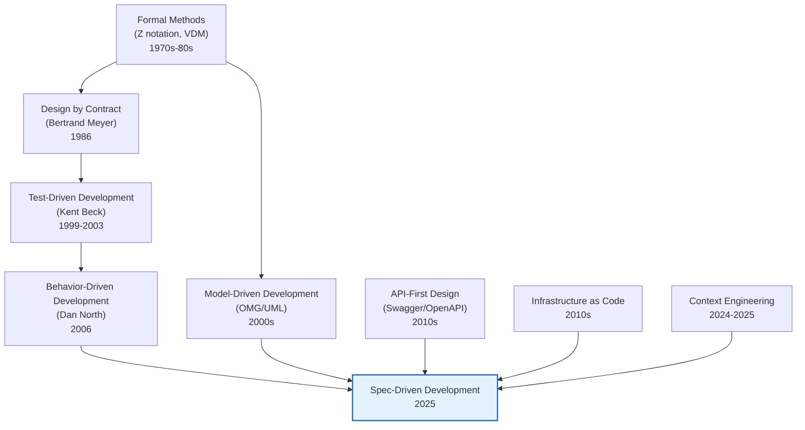

Each of these precursors contributed a key idea to SDD:

| Precursor | Era | Key Idea Contributed to SDD |
|-----------|-----|---------------------------|
| **Formal methods** (Z notation, VDM) | 1970s-80s | Mathematical specifications can precede and validate implementations. You can describe a system precisely before building it. |
| **Design by Contract** (Bertrand Meyer) | 1986 | Software components should have explicit preconditions, postconditions, and invariants — a "contract" that defines expected behavior. |
| **Test-Driven Development** (Kent Beck) | 1999-2003 | Tests are a form of specification. Write the spec (test) first, then implement. The test drives the implementation. |
| **Behavior-Driven Development** (Dan North) | 2006 | Specifications should be in natural language (Given/When/Then), readable by non-technical stakeholders. Shared understanding matters more than technical precision. |
| **Model-Driven Development** (OMG/UML) | 2000s | Models (specifications) can generate code automatically. The model is the primary artifact; code is derived. |
| **API-first design** (Swagger/OpenAPI) | 2010s | Define the interface contract before implementing the service. The spec is a machine-readable document that generates client libraries, documentation, and tests. |
| **Infrastructure as Code** | 2010s | Declarative specifications (Terraform, CloudFormation) describe the desired state of infrastructure. The tool reconciles reality with the specification. |
| **Context engineering** | 2024-2025 | Structuring information for LLM consumption is a discipline in itself. How you present context to an AI agent matters as much as what you present. |

SDD synthesizes these ideas: it uses **structured natural language specifications** (from BDD) that serve as **contracts** (from Design by Contract) to **drive code generation** (from MDD) by **AI agents** (new capability), with the specification **preceding implementation** (from TDD's test-first principle).

### 2.2 Timeline

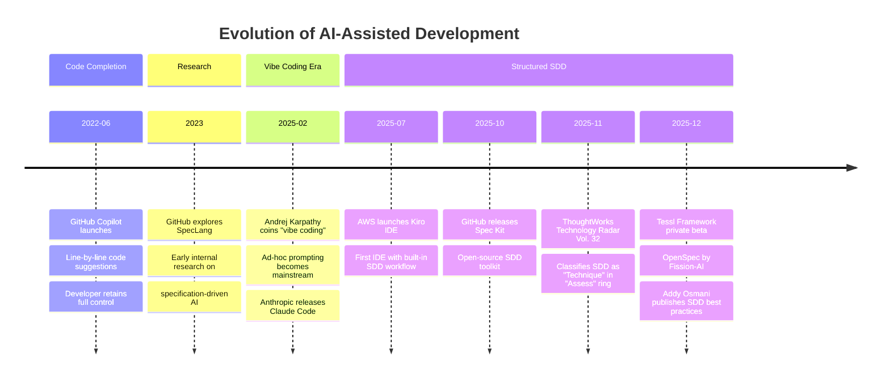

### 2.3 From Vibe Coding to SDD: The Progression

The evolution from raw AI code completion to SDD follows a maturity progression. Understanding this progression helps explain why SDD exists and what problem it solves at each level.

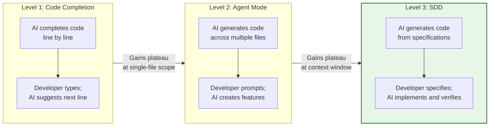

**Level 1 — Code Completion (Copilot era, 2022+)**: The AI sees the current file and suggests the next line or block. The developer accepts or rejects suggestions one at a time. This is useful for boilerplate and repetitive patterns, but it does not change the overall development process. The developer still designs, plans, and structures the code manually.

**Level 2 — Agent Mode (2024-2025)**: The AI operates across multiple files, generating entire features in response to natural language prompts. This is vibe coding — powerful for prototyping, but it hits a ceiling. As Tessl notes: "Models start stubbing out requirements without finishing, choosing wrong frameworks, and creating busywork when stuck." The context window fills up, earlier decisions are forgotten, and the developer spends more time debugging than developing.

**Level 3 — SDD (2025+)**: The developer front-loads planning into a structured specification. The AI agent uses this specification as persistent context — it does not "forget" the design decisions because they are written in a document, not scattered across a chat history. The specification survives context window resets and guides all subsequent implementation. This removes the ceiling that limits Level 2.

The progression is not about replacing the previous level — it is about adding structure where the previous level breaks down. A quick script still benefits from Level 1. A feature prototype might use Level 2. A production feature in a complex codebase benefits from Level 3.

---

## 3. Definition and Classification

### 3.1 Formal Definition

Spec-Driven Development is a software development approach in which:

1. **A structured specification** captures requirements, architectural constraints, and behavioral expectations before implementation begins
2. **AI coding agents** use these specifications as primary context for code generation
3. **Human review** validates both specifications and generated code at defined checkpoints
4. **Specifications persist** as living documents (in most variants) that evolve alongside the codebase

A specification, in this context, is not just a prompt or a README. Birgitta Böckeler (ThoughtWorks / Martin Fowler's team) proposes a precise definition:

> "A spec is a structured, behavior-oriented artifact — or a set of related artifacts — written in natural language that expresses software functionality and serves as guidance to AI coding agents."

This definition distinguishes specifications from **memory banks** — broader context documents like rules files (`CLAUDE.md`), architecture descriptions, or product overviews. Memory banks apply across all coding sessions; specifications target specific features requiring creation or modification. In RV-Android, for example:

- **Memory bank**: `CLAUDE.md`, `openspec/config.yaml` — apply to every session
- **Specification**: `openspec/specs/agent/spec.md`, a change proposal in `openspec/changes/` — target specific functionality

### 3.2 What a Good Specification Contains

ThoughtWorks (Liu Shangqi) identifies the key elements of a quality SDD specification:

| Element | What It Is | Example |
|---------|-----------|---------|
| **External behavior** | Input/output mappings | "WHEN the user submits a login form with valid credentials, THEN the system returns an authentication token" |
| **Preconditions and postconditions** | What must be true before and after an operation | "Precondition: the user account exists and is not locked" |
| **Invariants** | Properties that must always hold | "INV-AG-01: The agent MUST NOT execute more than one action per step" |
| **Interface contracts** | API shapes, parameter types, return values | "POST /api/tasks returns 201 with `{id: uuid, status: string}`" |
| **Integration contracts** | How components interact | "rv-agent communicates with rv-platform via the ToolRegistry interface" |
| **Sequential logic / state machines** | Order-dependent behavior | "The workflow follows: IDLE → PARSING → DECIDING → EXECUTING → LEARNING" |

Specifications use structured natural language — precise enough for AI agents to act on, readable enough for human review. Many SDD implementations use **RFC 2119 keywords** (MUST, SHALL, SHOULD, MAY) and **Given/When/Then scenarios** inherited from BDD:

```markdown
## Scenario: Agent timeout handling

GIVEN an rv-agent executing a task
WHEN the execution time exceeds the configured timeout
THEN the agent MUST terminate the current action gracefully
AND the agent MUST log the timeout event with the action context
AND the agent MUST NOT crash or leave the emulator in an inconsistent state
```

### 3.3 Classification: Development Approach, Not Programming Paradigm

A recurring question — and one that motivated research for this document — is whether SDD constitutes a "new programming paradigm." After investigating academic definitions, industry classifications, and historical precedent, the conclusion is: **no**. SDD is a development approach (or engineering practice/technique), not a programming paradigm in the formal computer science sense.

This section explains why, in enough detail that the reader can form their own opinion.

#### What Is a Programming Paradigm?

A programming paradigm is "a fundamental approach or style of programming that provides a set of principles, concepts, and techniques for designing and implementing computer programs." Paradigms define **how computation is expressed** and typically constrain what operations are allowed.

The key distinction: paradigms change the **nature of the code itself**. A program written in a functional paradigm (no mutable state, functions as values) looks fundamentally different from one written in an imperative paradigm (sequential statements that change state). The structure, idioms, and constraints of the code change.

| Paradigm | Core Concept | What It Constrains | How Code Looks Different |
|----------|-------------|-------------------|------------------------|
| **Imperative** | Sequential statements that change state | — | `x = x + 1; if (x > 10) {...}` |
| **Declarative** | Describe *what* to compute, not *how* | Explicit control flow | `SELECT name FROM users WHERE age > 18` |
| **Functional** | Functions as first-class values, no side effects | Mutable state | `map(filter(users, isAdult), getName)` |
| **Object-oriented** | Objects encapsulating state and behavior | — | `user.getName()`, `order.process()` |
| **Logic** | Facts, rules, and inference engines | Explicit algorithms | `parent(X, Y) :- father(X, Y).` |
| **Concurrent** | Simultaneous execution of computations | Sequential assumption | `go func() {...}()`, channels, actors |

#### Why SDD Is Not a Paradigm

SDD does not define a new computational model. The code generated under SDD is identical to code written without it — it uses the same languages, the same paradigms (OOP, functional, etc.), and the same runtime behavior. If you look at a Python function generated by an AI agent following an SDD specification, you cannot distinguish it from a Python function written manually. The **process** changed; the **code** did not.

This is the critical test: **does the practice change the nature of the code, or the process by which code is produced?** SDD changes the process. That makes it a methodology, technique, or development approach — not a paradigm.

#### Historical Precedent: TDD and BDD Were Not Paradigms Either

This classification is consistent with how related practices were classified when they were introduced:

| Practice | Year Introduced | Author | Classification Given |
|----------|----------------|--------|---------------------|
| Test-Driven Development | 1999-2003 | Kent Beck | "Methodology" / "Technique" |
| Behavior-Driven Development | 2006 | Dan North | "Software development process" |
| Model-Driven Development | 2000s | OMG/UML | "Development approach" |
| **Spec-Driven Development** | **2025** | **Multiple** | **"Technique" (ThoughtWorks Technology Radar)** |

When Kent Beck introduced TDD, it was a radical shift in how developers worked — writing tests before code, letting tests drive design. It was called a "paradigm shift" in the colloquial sense (a big change in how things are done). But nobody classified TDD as a *programming paradigm*. It was a methodology. The code produced by TDD is the same Java, Python, or C++ — the paradigm of the code did not change.

SDD is in exactly the same position.

#### ThoughtWorks Technology Radar Classification

ThoughtWorks Technology Radar Vol. 32 (November 2025) classified SDD as a **"Technique"** in the **"Assess"** ring. This is the same category used for practices like trunk-based development, pair programming, and continuous delivery. It is not listed under "Languages & Frameworks" (which would be closer to paradigm-level) or "Platforms."

The "Assess" ring means: "Worth exploring with the aim of understanding how it will affect your enterprise." It is a practice still being evaluated, not an established paradigm.

#### The Colloquial "Paradigm Shift"

Several sources — including ThoughtWorks' own blog, the GitHub blog, and Kiro's documentation — use the term "paradigm shift" when describing SDD. This is the **colloquial** usage of the term, meaning "a significant change in how work is done," not the formal computer science usage.

In the same way that Agile represented a "paradigm shift" in project management without being a programming paradigm, SDD represents a shift in how AI-assisted development is structured without being a programming paradigm. The term is used for rhetorical emphasis, not technical classification.

#### The InfoQ "Fifth-Generation" Argument

One notable outlier is the InfoQ article, which positions SDD as a "fifth-generation programming shift":

| Generation | Abstraction Level | Era |
|------------|------------------|-----|
| 1st | Machine code | 1940s-50s |
| 2nd | Assembly language | 1950s-60s |
| 3rd | High-level imperative languages (C, Java, Python) | 1960s-present |
| 4th | Paradigm-specific languages (functional, OOP, logic) | 1970s-present |
| 5th (proposed) | Natural language / intent-driven with AI materialization | 2025-present |

This framing is provocative and intellectually interesting, but not established. It conflates the evolution of programming language abstraction (a compiler/language concern) with a development workflow (a process concern). The "5th generation" label was previously applied to logic programming languages (Prolog, Mercury) in the 1980s, and that classification did not persist. The InfoQ article's position should be treated as one author's speculative framework, not consensus.

#### Recommended Terminology

For accuracy and conservatism, this project uses the following terms:

- **"Development approach"** — when referring to SDD as a category
- **"Engineering practice"** or **"technique"** — when referring to specific SDD methods
- **"Methodology"** — when referring to a complete SDD workflow with defined phases
- **Avoid**: "paradigm" (unless explicitly qualified as colloquial usage)

---

## 4. Core Principles

SDD across its various implementations shares a consistent set of principles. These are not just abstract ideals — each one addresses a specific problem observed in unstructured AI-assisted development.

### 4.1 Specification as Foundation

**The principle**: The specification is the primary planning artifact. It captures requirements, constraints, and behavioral expectations in structured natural language.

**Why it matters**: Without a persistent specification, design decisions exist only in chat history. When the context window resets (every new session, every long conversation), those decisions are lost. The AI agent starts from scratch, potentially contradicting earlier decisions. A specification is a persistent document that survives context resets.

**Concrete example**: In RV-Android, the domain spec for rv-agent (`openspec/specs/agent/spec.md`) defines 217 scenarios and 111 invariants. When a new Claude Code session begins, the agent can read this spec and immediately understand the expected behavior — without anyone having to re-explain how the agent workflow should work.

**What it looks like in practice**:

```
Without SDD:                           With SDD:
─────────────                          ────────
Session 1: "Add timeout handling"      Session 1: Write spec for timeout handling
Session 2: "Wait, how does timeout     Session 2: Read spec → implement consistently
            work again?"
Session 3: "The timeout is broken,     Session 3: Read spec → fix against spec
            I think we changed it"
```

### 4.2 Intent over Implementation

**The principle**: Specifications focus on *what* the system should do (outcomes, constraints, interfaces) rather than *how* it should do it (algorithms, data structures, specific code patterns).

**Why it matters**: If you specify the "how," you are essentially writing the code in English — which defeats the purpose of using an AI agent. The AI's strength is in generating implementation details. Your strength is in knowing what the system should accomplish. SDD divides labor accordingly.

**Concrete example**: Instead of specifying "use a dictionary with APK names as keys and lists of task results as values," you specify "the system MUST track which APKs have been processed and provide a way to resume from the last completed APK." The AI agent decides the data structure; the spec defines the behavior.

**The boundary**: This principle has limits. Some implementation details matter architecturally and should be in the spec — for example, "use SQLite for local storage" or "communicate via REST, not gRPC." The line between intent and implementation is a judgment call that improves with practice.

### 4.3 Human-in-the-Loop

**The principle**: SDD does not eliminate the developer. It repositions the developer's role from writing code to defining, reviewing, and validating.

**Why it matters**: AI code generation is non-deterministic — the same specification may produce different code on different runs. Without human review, there is no way to catch errors, architectural violations, or security vulnerabilities. The specification *guides* the AI, but it does not *guarantee* correctness.

**What the developer does in SDD**:

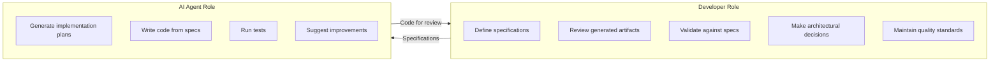

As Bix Tecnologia noted: "AI does not replace the need for technical expertise — it amplifies it when properly directed." The specification is the mechanism for that direction.

### 4.4 Living Documentation

**The principle**: Specifications are not static documents produced once and forgotten. They evolve alongside the codebase, reflecting the current state of the system.

**Why it matters**: Static documentation rots. If the spec says "the system uses RSA encryption" but the code was changed to use AES six months ago, the spec is worse than useless — it is actively misleading. SDD addresses this by treating specs as living artifacts that are updated when the code changes.

**How it works in practice**: In RV-Android, the OpenSpec workflow requires that changes to the system go through a cycle: the developer first updates the specification (via a "delta spec"), then implements the change, then verifies that the implementation matches the updated spec. This keeps specifications aligned with reality.

**The risk**: Spec drift — when specifications and code diverge — is one of SDD's most serious challenges. Living documentation is a principle, but enforcing it requires discipline and tooling. See Section 10.5 for more on this.

### 4.5 Iterative Refinement

**The principle**: SDD is not Waterfall. The specification-to-implementation cycle is iterative: specifications are refined based on implementation feedback, discoveries during development, and evolving requirements.

**Why it matters**: No specification is perfect on the first draft. As you implement, you discover edge cases, performance constraints, and integration issues that the spec did not anticipate. SDD accommodates this by allowing — and expecting — specification updates during implementation.

**The difference from Waterfall**:

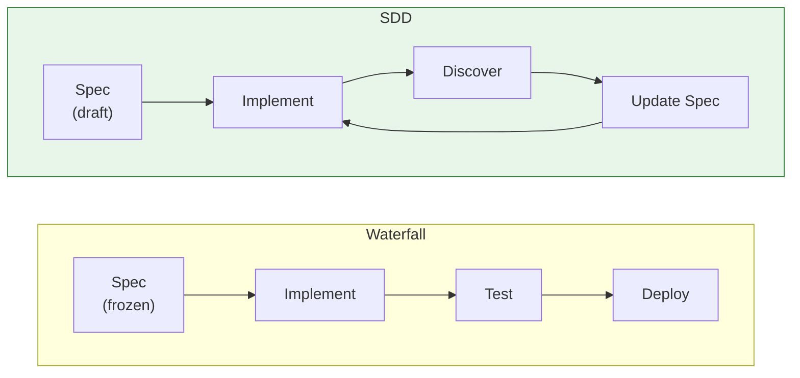

In Waterfall, the specification is frozen after the planning phase. Changes are expensive and discouraged. In SDD, the specification is a living document that improves through iteration. As OpenSpec's design philosophy states: "fluid over rigid processes."

### 4.6 Proportional Ceremony

**The principle**: Not all changes require the same level of specification formality. A bug fix does not need a full proposal-spec-design-tasks cycle. SDD implementations typically offer tiered workflows that match formality to change scope.

**Why it matters**: One of the most common criticisms of SDD is that it creates too much overhead (see Section 10.2). Proportional ceremony addresses this directly: small changes get light-touch processes; large changes get full processes. This prevents SDD from degenerating into bureaucracy.

**How RV-Android implements this**: Three workflow tracks — Full SDD (6 phases, for changes requiring design decisions across modules), Fast-Forward SDD (4 phases, for single-module design decisions), and Quick Path (3 phases, plan.md only, for mechanical changes). Track selection is based on whether design decisions are needed, not file count. See Section 11.5 for details.

---

## 5. The SDD Spectrum

Not all SDD implementations are the same. Martin Fowler (via Birgitta Böckeler at ThoughtWorks) identified three levels of SDD adoption, forming a spectrum from lightweight to fully specification-centric development. Understanding where your project falls on this spectrum is essential for choosing the right tools and workflow.

### 5.1 The Three Levels

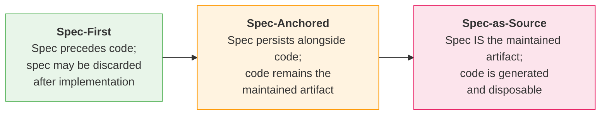

### 5.2 Spec-First

**What it means**: A specification is written **before** AI-assisted development for a specific task. After the task is completed, the specification may be discarded or archived. The specification serves as a one-time planning artifact — it guides the immediate implementation but is not maintained afterward.

**Analogy**: Writing a grocery list before going shopping. The list guides your shopping trip, but you throw it away when you get home. Next time you shop, you write a new list.

**When it works well**: Quick features, prototyping, one-off tasks where the spec does not need to survive beyond the current implementation cycle.

**When it breaks down**: When you need to modify the feature later. Without a maintained spec, the next developer (or AI agent) has to reverse-engineer the requirements from the code. As Böckeler notes, Spec Kit "creates a branch for each spec, suggesting spec-first rather than spec-anchored implementation despite aspirational language."

**Example**: Writing a prompt document before using Cursor to implement a feature, then discarding the document once the feature is done.

### 5.3 Spec-Anchored

**What it means**: The specification **persists** after completion and is maintained alongside the code for ongoing feature evolution. Specifications serve as living documentation and guide future changes, but **code remains the primary source of truth**. If the spec and the code disagree, the code is correct.

**Analogy**: Writing architectural blueprints for a building. The blueprints persist after construction and are updated when renovations are made. But the actual building is what people live in — if the blueprint shows a wall that doesn't exist, the blueprint is wrong.

**When it works well**: Brownfield codebases, projects with long lifespans, teams that need onboarding documentation, projects where design decisions need to be traceable.

**When it breaks down**: When the overhead of maintaining both specs and code exceeds the benefit. This is Fowler's "spec-code drift" problem — if the team stops updating specs, they become misleading. Also, as Böckeler warns: the spec-anchored position might inherit "the downsides of both MDD and LLMs: Inflexibility *and* non-determinism."

**Example**: RV-Android's approach — PRD, domain specs, and change artifacts persist in `openspec/` and `docs/`, but the Python code in `modules/` is the executed artifact and source of truth.

### 5.4 Spec-as-Source

**What it means**: The specification becomes the **sole maintained artifact**. Developers edit only specifications; code is generated, disposable, and regenerable. The specification is the source of truth, and code is treated as a compiled byproduct — similar to how `.class` files are generated from Java source and never manually edited.

**Analogy**: Writing a recipe (specification) that a robot chef (AI agent) follows to cook a meal (code). You never modify the cooked meal directly — if you want a different result, you change the recipe and let the robot cook again. Generated code files are literally marked "GENERATED FROM SPEC — DO NOT EDIT."

**When it works well**: Greenfield projects with well-defined domains, API-heavy services where the interface contract is the primary concern, systems where deterministic regeneration is achievable.

**When it breaks down**: Complex brownfield codebases, systems where AI code generation is too non-deterministic to regenerate reliably, any situation where developers need fine-grained control over the generated code. As Böckeler observed, running the same spec through Tessl's generator multiple times produced different code each time, revealing "non-determinism challenges."

**Example**: Tessl Framework — `.spec` files with tags like `@generate` and `@test` that direct code generation. Code is treated as disposable output.

### 5.5 Trade-offs Across the Spectrum

| Dimension | Spec-First | Spec-Anchored | Spec-as-Source |
|-----------|-----------|---------------|----------------|
| **Maintenance burden** | Low (spec discarded) | Medium (spec + code) | Low (spec only) |
| **Spec-code drift risk** | High (no ongoing sync) | Medium (manual sync needed) | None (code is generated) |
| **Adoption difficulty** | Low | Medium | High |
| **Tool maturity (2026)** | High | Medium | Low (experimental) |
| **Brownfield suitability** | High | High | Low |
| **Developer autonomy** | High | High | Low |
| **Non-determinism risk** | Low (code is manual) | Medium | High (regeneration varies) |

### 5.6 Choosing Your Position

Most teams in 2026 operate at **spec-first** or **spec-anchored**. Spec-as-source remains experimental, with only Tessl explicitly pursuing it (and still in private beta). The choice depends on your project's characteristics:

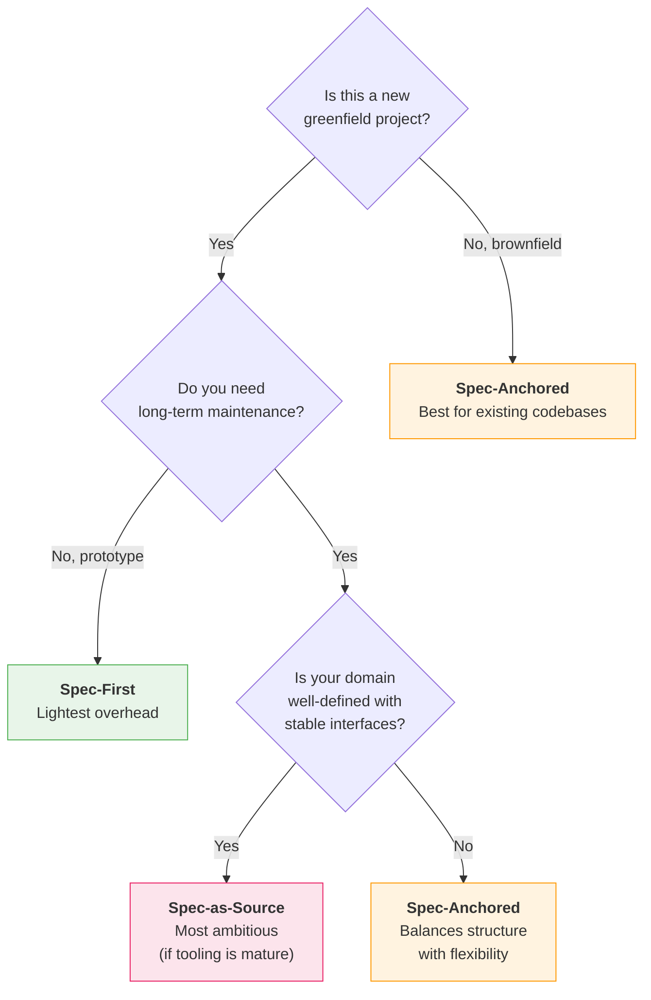

### 5.7 RV-Android's Position

RV-Android uses **spec-anchored SDD**. This was chosen because:

1. **Brownfield codebase**: RV-Android has 14 modules with 37 functional requirements — it is not a greenfield project
2. **Tool maturity**: Spec-as-source tooling (Tessl) is not mature enough for complex multi-module systems
3. **Academic context**: The PhD thesis context requires reproducible, version-controlled code that humans can inspect
4. **Traceability**: Spec-anchored provides traceability (FR → spec → design → task → implementation) without abandoning code ownership

---

## 6. Writing Good Specifications

A specification is only as useful as its quality. A vague spec produces vague code; a precise spec produces precise code. This section draws on Addy Osmani's best practices, ThoughtWorks' recommendations, and practical experience.

### 6.1 The Five Principles of Good Specs

#### Principle 1: Start with Vision, Let AI Draft Details

Do not try to write a perfect spec from scratch. Start with a concise product brief — the high-level "what and why" — and let the AI agent expand it into a detailed specification through iterative dialogue. The AI asks clarifying questions, identifies edge cases, and helps define acceptance criteria.

**Why**: You know the domain; the AI is good at generating structured detail. Combine both strengths.

```
# BAD: Trying to write everything yourself
## Feature: User Authentication
### Requirements:
1. The system shall use bcrypt with cost factor 12 for password hashing
2. The system shall store sessions in Redis with a 24-hour TTL
3. The JWT token shall use RS256 algorithm with 2048-bit keys
...
(This is implementation, not intent)

# GOOD: Start with vision, let AI elaborate
## Feature: User Authentication
### Goal:
Users should be able to create accounts, log in, and maintain
sessions securely. Authentication must follow current security
best practices.
### Constraints:
- No social login (email/password only)
- Sessions must survive server restarts
- Must support password reset via email
### Non-goals:
- Multi-factor authentication (future feature)
- OAuth provider capability
```

#### Principle 2: Structure Specs Like Professional PRDs

Analysis of thousands of successful agent configurations (Osmani, 2025) identified six core areas that effective specifications always address:

| Area | What to Include | Why It Matters |
|------|----------------|----------------|
| **Commands** | Executable commands with flags (`pytest -v`, `npm test`) | AI agents need to know how to run and verify |
| **Testing** | Framework, file locations, coverage expectations | Prevents AI from guessing test infrastructure |
| **Project structure** | Directory organization, file locations | Prevents AI from creating files in wrong locations |
| **Code style** | One real code snippet beats paragraphs of description | Shows rather than tells |
| **Git workflow** | Branch naming, commit format, PR requirements | Prevents AI from creating sloppy commits |
| **Boundaries** | What to do, what to ask about, what to never do | Prevents AI from making unauthorized changes |

The **three-tier boundary system** is particularly effective:

```markdown
## Boundaries
✅ **Always**: Run tests before committing, follow naming conventions,
   use type hints
⚠️ **Ask first**: Database schema changes, adding new dependencies,
   modifying shared interfaces
🚫 **Never**: Commit secrets, edit vendor directories, modify CI/CD
   without approval
```

#### Principle 3: Break Into Modules, Not Monoliths

There is a well-documented phenomenon called the **"curse of instructions"** — as requirements pile up in a single document, the AI agent's adherence to each individual requirement drops. A 50-page spec in one prompt rarely works.

**Solutions**:
- **Divide by domain**: Separate backend and frontend specs, or separate specs per module (as RV-Android does with 7 domain specs)
- **Create a table of contents**: A condensed outline that references detailed sub-sections
- **Use sub-agents**: Assign different AI agents to different spec sections — one for database design, one for API coding, one for frontend

#### Principle 4: Build In Self-Checks

Good specs include verification criteria — not just what to build, but how to verify it was built correctly.

```markdown
## Verification Criteria
- [ ] All scenarios in this spec have passing tests
- [ ] No regressions in existing test suite
- [ ] Coverage for new code > 80%
- [ ] No new linting warnings
- [ ] Performance: response time < 200ms at p95
```

These criteria serve double duty: they guide the AI during implementation and they provide a checklist during human review.

#### Principle 5: Evolve the Spec Continuously

Specs are living documents. After each implementation milestone:
- Update the spec to reflect what was actually built (not what was planned)
- Remove requirements that turned out to be unnecessary
- Add requirements discovered during implementation
- Version-control the spec alongside the code

### 6.2 Common Specification Pitfalls

| Pitfall | Problem | Fix |
|---------|---------|-----|
| **Vague language** | "Make it fast" — fast compared to what? | Quantify: "Response time < 200ms at p95" |
| **Missing boundaries** | AI adds features you did not ask for | Add explicit non-goals and "Never" boundaries |
| **Over-specification** | Spec dictates implementation details | Focus on behavior, not algorithms |
| **Under-specification** | Spec omits error cases | Use Given/When/Then for happy path AND error paths |
| **Spec-as-novel** | 1,300 lines of prose for a simple feature | Use tables, bullet points, and structured sections |
| **Stale specs** | Spec describes old behavior after code changed | Update spec whenever code changes |

---

## 7. Comparison with Related Approaches

SDD does not exist in isolation. It shares DNA with several established software engineering practices. Understanding these relationships helps you see where SDD fits in the landscape and avoid reinventing concepts that already have established names.

### 7.1 SDD vs TDD (Test-Driven Development)

**TDD** (introduced by Kent Beck, 1999-2003) is a methodology where you write a failing test first (RED), then write the minimum code to make it pass (GREEN), then refactor (REFACTOR). The test *is* the specification — it defines what the code should do.

**SDD** replaces the test with a natural language specification, and the human coder with an AI agent. But the core idea is the same: define expected behavior *before* implementation.

| Dimension | TDD | SDD |
|-----------|-----|-----|
| **Primary artifact** | Test code (executable) | Natural language spec (not executable) |
| **Drives** | Implementation (RED → GREEN → REFACTOR) | AI-assisted code generation |
| **Verification** | Tests validate code | Specs guide generation; tests validate output |
| **Scope** | Per-function / per-unit | Per-feature / per-system |
| **Human role** | Writes tests and code | Writes specs; reviews generated code and tests |
| **AI involvement** | Optional (can assist) | Central (AI generates the code) |
| **Feedback loop** | Seconds (run test, see result) | Minutes (generate, review, iterate) |

**Key distinction**: TDD asks "does the code pass the tests?" SDD asks "does the generated code match the specification?" TDD is executable — you run tests and get pass/fail. SDD specifications are consumed by AI agents, not by test runners.

**They are complementary, not competing**: In RV-Android, the `/rv-tdd` skill operates *within* the SDD workflow. The specification defines *what* to build; TDD defines *how to verify* it. The `tasks.md` artifact in an OpenSpec change typically includes test tasks. You can (and should) use both.

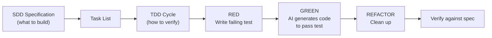

### 7.2 SDD vs BDD (Behavior-Driven Development)

**BDD** (introduced by Dan North, 2006) extended TDD by expressing tests in natural language scenarios — Given/When/Then format — that non-technical stakeholders can read and validate. The key innovation: specifications are written in a **ubiquitous language** shared by developers and business people.

| Dimension | BDD | SDD |
|-----------|-----|-----|
| **Primary artifact** | Feature files (Given/When/Then scenarios) | Structured specifications |
| **Language** | Ubiquitous domain language | Natural language + technical constraints |
| **Primary audience** | Developers + business stakeholders | Developers + AI agents |
| **Execution** | Scenarios run as automated tests (Cucumber, SpecFlow) | Specs guide AI code generation (not executed) |
| **Tool examples** | Cucumber, SpecFlow, Behave | Spec Kit, OpenSpec, Kiro |
| **Maturity** | Established (18+ years) | Emerging (1+ year) |

**Key distinction**: BDD scenarios are **executable** — tools like Cucumber can run them as automated tests. SDD specifications are **not executable** — they are consumed by AI agents as context for code generation. This is both a weakness (no automated validation of specs) and a strength (specs are more flexible and expressive).

**SDD borrows heavily from BDD**: ThoughtWorks notes that "specification principles from behavior-driven development remain valid — domain language, structured scenarios, and living documentation practices translate effectively to AI-assisted workflows." Many SDD specifications use Given/When/Then format directly. RV-Android's specs use WHEN/THEN/AND format with RFC 2119 keywords — a clear BDD inheritance.

### 7.3 SDD vs MDD (Model-Driven Development)

**MDD** (popularized by OMG and UML tools in the 2000s) is a development approach where formal models (UML diagrams, domain-specific languages) serve as the primary artifact. Code generators transform models into executable code.

| Dimension | MDD | SDD |
|-----------|-----|-----|
| **Primary artifact** | UML/DSL models (formal, parseable) | Natural language specifications (semi-formal) |
| **Code generation** | Deterministic (model → code, same output every time) | Non-deterministic (spec → AI → code, output varies) |
| **Specification language** | Formal (UML, DSLs with strict syntax) | Semi-formal (structured Markdown, natural language) |
| **Tool dependency** | High (model editors, code generators, roundtrip tools) | Medium (AI agents, spec frameworks) |
| **Spec validation tooling** | Rich (model checkers, constraint validators) | Limited (mostly manual review) |
| **Historical outcome** | Limited adoption for business applications | Emerging (2025-present) |

**Key distinction**: MDD uses **deterministic** code generators — the same model always produces the same code. SDD uses **non-deterministic** AI agents — the same specification may produce different code on different runs. This is both SDD's strength (lower barrier to entry, natural language rather than formal notation) and its weakness (unpredictable output requires more verification).

**Fowler's critical warning**: Birgitta Böckeler explicitly compared SDD to MDD, which "never took off for business applications" due to overhead, inflexibility, and the gap between models and real-world requirements. She warns that SDD might inherit "the downsides of both MDD and LLMs: Inflexibility *and* non-determinism."

However, there is a key difference: MDD required developers to learn formal modeling languages (UML, DSLs). SDD uses natural language — a much lower barrier to entry. And MDD required custom code generators; SDD uses general-purpose AI agents. These differences may help SDD avoid MDD's fate, but the risk is real.

**What MDD had that SDD lacks**: Formal, parseable specification languages provided tooling support — model checkers could validate completeness, consistency, and constraint satisfaction *before* code generation. Natural language specifications cannot be automatically validated this way. This is a genuine loss.

### 7.4 SDD vs Waterfall

**Waterfall** is the classic sequential development process: Requirements → Design → Implementation → Testing → Deployment. Each phase completes fully before the next begins. Requirements are frozen after the planning phase.

| Dimension | Waterfall | SDD |
|-----------|-----------|-----|
| **Planning** | Big Design Up Front (months) | Proportional to change scope (minutes to hours) |
| **Feedback cycle** | Long (phases complete before feedback) | Short (iterative within and across phases) |
| **Spec changeability** | Low (change is costly, requires change control) | High (specs are living documents, expected to evolve) |
| **Implementation** | Manual coding follows spec | AI generates code from spec |
| **Rigidity** | Strict phase gates | Flexible (OpenSpec: "fluid over rigid") |
| **Spec completeness** | Assumed complete before coding begins | Expected to be incomplete; refined during implementation |

**Key distinction**: SDD is **NOT** Waterfall, despite superficial similarities (both start with specifications). The critical difference is the **feedback cycle**. In Waterfall, the specification is a frozen contract — changing it is expensive and bureaucratic. In SDD, the specification is a living document that is *expected* to change during implementation. SDD phases are fluid; Waterfall phases are sequential gates.

**The critique**: Marmelab's article "Spec-Driven Development: The Waterfall Strikes Back" argues that SDD risks reverting to Waterfall antipatterns — heavy up-front documentation, Big Design Up Front, and the assumption that planning eliminates uncertainty. This is a serious critique, addressed in detail in Section 10.2.

**How SDD differs in practice**: ThoughtWorks' Liu Shangqi argues that SDD addresses the *opposite* problem from Waterfall. Waterfall suffered from excessively long feedback cycles — months of planning before any code. SDD addresses the problem of *no* planning — vibe coding is "too fast, spontaneous and haphazard." SDD introduces requirements analysis and design discipline into rapid AI development, creating "shorter and effective" feedback loops than pure vibe coding. It is a middle ground, not a return to Waterfall.

### 7.5 SDD + TDD: Complementary Practices

SDD and TDD are not competing approaches — they address different questions:

- **SDD** answers: "What should we build?" (requirements, constraints, expected behavior)
- **TDD** answers: "How do we verify it works?" (executable tests, regression safety)

In a combined workflow:

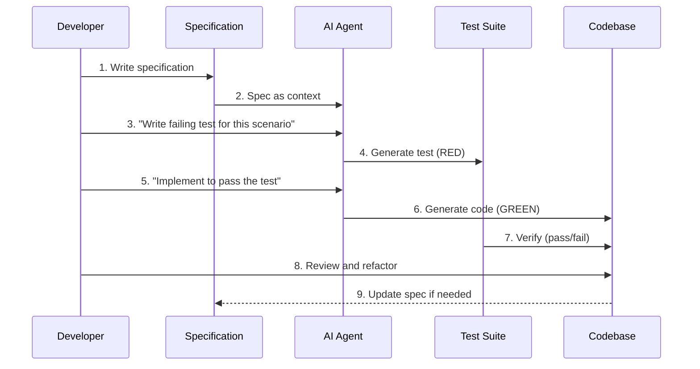

In RV-Android, this is how the `/rv-tdd` skill works within the SDD workflow. The OpenSpec change defines *what* to build; the TDD cycle ensures each piece works correctly.

### 7.6 Summary: Shared DNA

All of these approaches share a common ancestor: the idea that **defining expected behavior before implementation leads to better software**. They differ in the formalism of the specification, the mechanism for code generation, and the role of the human developer.

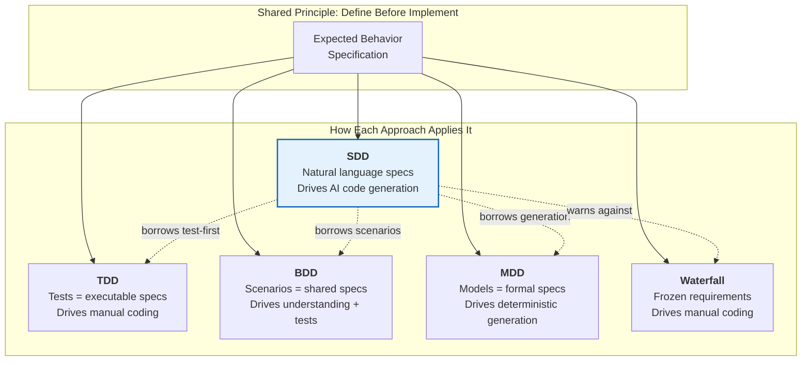

---

## 8. The SDD Workflow

Despite variation across tools, most SDD implementations follow a common workflow pattern. Understanding this generic pattern helps you evaluate tools and adapt the workflow to your own needs.

### 8.1 The Generic SDD Cycle

Every SDD workflow, regardless of tooling, follows this basic cycle:

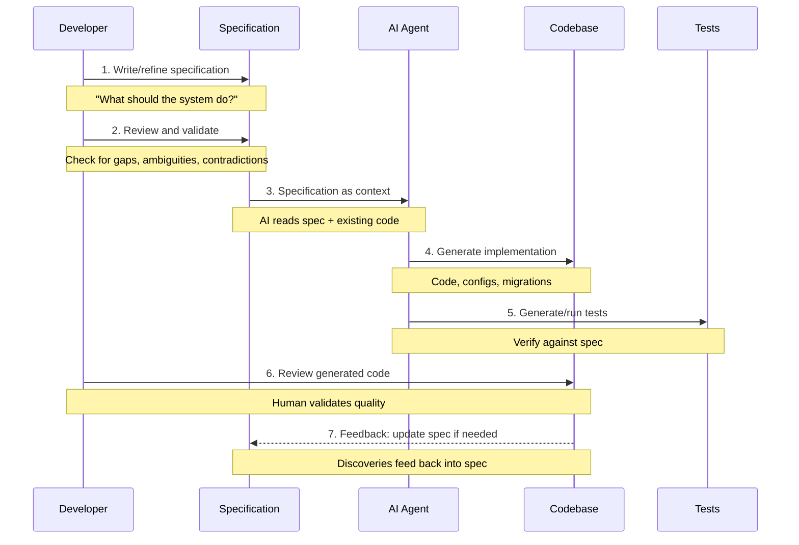

This cycle is **iterative** — steps 3-7 repeat until the implementation matches the specification and all tests pass.

### 8.2 The Five Phases

Most SDD tools break the generic cycle into five named phases. The names vary across tools, but the structure is consistent:

#### Phase 1: Specify

**Goal**: Define what to build — requirements, constraints, expected behavior.

**Who**: The developer, possibly with AI assistance for drafting.

**How**: Write a structured document capturing:
- User stories or functional requirements
- Constraints and non-functional requirements
- Acceptance criteria (often in Given/When/Then format)
- Non-goals (what the system should NOT do)
- Boundaries (what the AI should never change)

**Key question**: "What should the system do, and for whom?"

**Example** (from GitHub Spec Kit):
```markdown
# Feature: Order Notification System
## User Stories
- As a customer, I want to receive email notifications when my order ships
- As an admin, I want to configure notification templates per region
## Acceptance Criteria
- GIVEN an order status changes to "shipped"
  WHEN the customer has email notifications enabled
  THEN an email is sent within 5 minutes using the regional template
## Non-Goals
- Push notifications (future feature)
- SMS notifications (different spec)
## Boundaries
🚫 Never modify the order processing pipeline
🚫 Never change existing email templates without approval
```

#### Phase 2: Plan

**Goal**: Define how to build it — technology choices, architecture, integration approach.

**Who**: The AI agent generates a plan; the developer reviews and approves.

**How**: The AI reads the specification plus the existing codebase and produces a technical plan covering:
- Architecture decisions (what components, how they interact)
- Technology choices (frameworks, libraries, data stores)
- Integration points (how new code connects to existing code)
- Risk assessment (what could go wrong)

**Key question**: "How should we build what the spec describes?"

#### Phase 3: Task

**Goal**: Break the plan into implementable work units.

**Who**: The AI agent generates tasks; the developer reviews and prioritizes.

**How**: The AI decomposes the plan into small, focused tasks — each completable in a single session, each testable independently. Tasks have clear acceptance criteria and are ordered to respect dependencies (data models before APIs, APIs before UI).

**Key question**: "What are the concrete steps to execute the plan?"

#### Phase 4: Implement

**Goal**: Write the code.

**Who**: The AI agent generates code; the developer reviews each task's output.

**How**: For each task, the AI agent:
1. Reads the specification, plan, and task description
2. Reads the relevant existing code
3. Generates the implementation
4. Runs tests to verify

The developer reviews concentrated changes rather than monolithic code dumps.

**Key question**: "Does the generated code match the task and the spec?"

#### Phase 5: Verify

**Goal**: Validate that the complete implementation matches the specification.

**Who**: The developer, using automated tests and manual review.

**How**: Compare the implementation against the original specification:
- Do all acceptance criteria pass?
- Are all constraints satisfied?
- Do tests cover the specified behavior?
- Are non-goals respected (nothing extra was added)?

**Key question**: "Does the final result match what was specified?"

### 8.3 Workflow Variations by Tool

Different tools implement these phases with different names, granularity, and tooling:

| Tool | Specify | Plan | Task | Implement | Verify |
|------|---------|------|------|-----------|--------|
| **GitHub Spec Kit** | `/speckit.specify` | `/speckit.plan` | `/speckit.tasks` | Manual (any agent) | Manual |
| **AWS Kiro** | Requirements.md | Design.md | Tasks.md | Kiro agent | Steering hooks |
| **Tessl** | `.spec` files | — (implicit) | — (implicit) | Tessl engine | Tessl engine |
| **OpenSpec** | `/opsx:new` | `/opsx:continue` | `/opsx:continue` | `/opsx:apply` | `/opsx:verify` |

### 8.4 The Feedback Loops

Notice that the workflow is not linear — there are feedback loops at every stage:

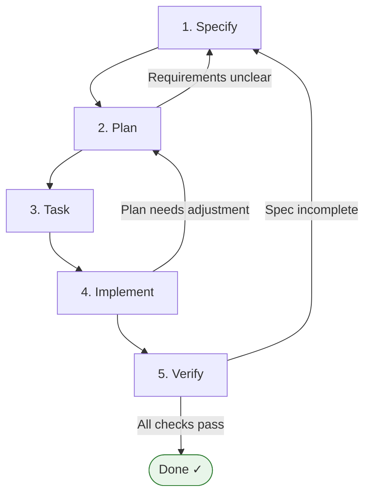

This is what distinguishes SDD from Waterfall. In Waterfall, you complete each phase and move forward. In SDD, you expect to loop back — discovering during implementation that the spec needs updating, or finding during verification that the plan needs adjusting.

---

## 9. Tool Landscape

As of early 2026, four main tools occupy the SDD space. Each makes different trade-offs in terms of workflow rigidity, agent compatibility, and position on Fowler's spectrum.

### 9.1 GitHub Spec Kit

**Creator**: GitHub (October 2025)
**License**: Open source
**Position**: Spec-first to spec-anchored
**Install**: `uvx --from git+https://github.com/github/spec-kit.git specify init <PROJECT_NAME>`

#### How It Works

Spec Kit introduces a three-phase workflow (Specify → Plan → Tasks) organized around a central concept: the **Constitution**. The Constitution is a document capturing non-negotiable project principles — think of it as the project's "DNA" that every feature must respect.

The Constitution defines things like:
- "Every feature MUST begin as a standalone library" (Article I)
- "No implementation code shall be written before unit tests are written and confirmed to FAIL" (Article III, the Red phase from TDD)
- "Use framework features directly rather than creating unnecessary wrappers" (Article VII)

These constitutional principles function as guardrails — the AI agent checks its work against the constitution at every phase.

#### Directory Structure

```
.specify/
├── memory/
│   ├── constitution.md          # Non-negotiable project principles
│   └── constitution_update_checklist.md
├── scripts/                     # Helper scripts for agents
└── templates/
    ├── spec-template.md         # Template for specifications
    ├── plan-template.md         # Template for implementation plans
    └── tasks-template.md        # Template for task lists

specs/
└── feature-name/
    ├── spec.md                  # Feature specification
    ├── plan.md                  # Technical implementation plan
    ├── tasks.md                 # Decomposed task list
    ├── data-model.md            # Data model documentation
    ├── api.md                   # API contract
    ├── component.md             # Component architecture
    └── research.md              # Research findings
```

#### Strengths and Weaknesses

**Strengths**: Open source, agent-agnostic (works with Copilot, Claude Code, Gemini CLI, Cursor, Windsurf), strong template system, constitutional enforcement.

**Weaknesses**: Böckeler notes it creates "excessive markdown requiring tedious review" — one specification generates 8 files. She observed "repetitive content both across files and with existing code." Despite larger context windows, agents still "frequently ignore instructions."

### 9.2 AWS Kiro

**Creator**: Amazon Web Services (July 2025)
**License**: Proprietary (free tier available)
**Position**: Spec-anchored

#### How It Works

Kiro is not a plugin — it is a full IDE with SDD built into its core workflow. When you start a project, you describe what you want to build, and Kiro generates three markdown documents:

1. **Requirements.md**: User stories with acceptance criteria (Given/When/Then format)
2. **Design.md**: Component architecture, data flow, error handling, testing strategy
3. **Tasks.md**: Implementation tasks derived from the design

The developer reviews and refines each document before proceeding. Requirements live in version-controlled markdown files — when you need changes, you add requirements to the spec rather than relying on chat history.

Kiro also introduces **"steering hooks"** — automated validations triggered on file changes. These function like CI/CD checks but run locally, enforcing specification compliance during development.

#### Historical Connection

Marc Brooker (VP/Distinguished Engineer at Amazon) draws a direct line to Amazon's internal practices: the "Working Backwards" methodology (writing press releases and blog posts as specifications before building products), formal design document reviews, and mathematical specification using TLA+ and P for proving system properties. Kiro brings these practices to a broader audience through AI assistance.

#### Strengths and Weaknesses

**Strengths**: IDE-native experience (not bolted on), persistent specs in version control, steering hooks for automated compliance, builds on proven Amazon practices.

**Weaknesses**: IDE-locked (cannot use with VS Code, Neovim, or other editors), model-limited (AWS Bedrock models only). Böckeler noted that for small tasks, the workflow feels disproportionate — a simple bug became "four user stories with 16 acceptance criteria total."

### 9.3 Tessl Framework

**Creator**: Tessl (Private beta, September 2025)
**License**: Proprietary
**Position**: Spec-as-source (the most radical position)

#### How It Works

Tessl takes the most ambitious approach: the specification is the *only* artifact developers maintain. Code is generated from specs and marked with "GENERATED FROM SPEC — DO NOT EDIT." If you want to change the system, you change the spec and regenerate the code.

Specs use custom tags to control generation:
- `@generate` — marks sections that should produce code
- `@test` — marks sections that should produce test code
- `@api` — marks sections defining public interfaces (these remain under developer control)

Currently, one spec maps to one code file. The framework maintains bidirectional sync between specs and code.

#### Strengths and Weaknesses

**Strengths**: Eliminates spec-code drift (code is always generated from spec), reduces maintenance burden (only maintain specs), most forward-looking approach.

**Weaknesses**: Private beta, limited availability, unproven at scale. Böckeler observed that "multiple code generations from identical specs demonstrated non-determinism" — the same spec produced different code each time. This undermines the core promise. Also, the one-spec-to-one-file mapping is limiting for complex systems.

### 9.4 OpenSpec (Fission-AI)

**Creator**: Fission-AI (December 2025)
**License**: Open source (npm package)
**Position**: Spec-anchored

#### How It Works

OpenSpec is designed differently from the other tools. While Spec Kit and Kiro target greenfield projects, OpenSpec is **brownfield-first** — it was built for existing codebases that need to adopt SDD incrementally.

Key design decisions:
- **Artifact-per-change**: Each change gets its own directory with proposal, delta specs, design, and tasks. Changes are isolated from each other.
- **Fluid workflow**: No rigid phase gates. OpenSpec's principle: "no phase gates, work on what makes sense." Artifact dependencies are enablers, not gates.
- **Slash commands**: Integration with 20+ AI assistants via `/opsx:*` commands (new, continue, explore, apply, verify, sync, archive).
- **Delta specs**: Changes to existing specifications are expressed as deltas (additions, modifications, removals) rather than rewriting the entire spec. Deltas are synced to main specs after verification.

This is the framework adopted by RV-Android. See Section 11 for detailed usage.

#### Directory Structure

```
openspec/
├── config.yaml                    # Project context and rules
├── specs/                         # Main specifications (current behavior)
│   ├── core/spec.md
│   ├── platform/spec.md
│   └── ...
└── changes/                       # Active changes
    ├── add-scroll-detection/      # One directory per change
    │   ├── proposal.md
    │   ├── specs/                 # Delta specs
    │   ├── design.md
    │   └── tasks.md
    └── archive/                   # Completed changes
```

#### Strengths and Weaknesses

**Strengths**: Brownfield-first (designed for existing codebases), tool-agnostic (works with any AI assistant), open source, fluid workflow, artifact isolation per change.

**Weaknesses**: Newer than Spec Kit and Kiro (December 2025), smaller community, requires discipline to keep specs synced (delta → main sync is a manual step).

### 9.5 Tool Comparison

| Dimension | Spec Kit | Kiro | Tessl | OpenSpec |
|-----------|----------|------|-------|---------|
| **Spectrum position** | Spec-first to anchored | Spec-anchored | Spec-as-source | Spec-anchored |
| **Brownfield support** | Limited | Limited | Limited | Primary focus |
| **Agent compatibility** | 5+ agents | Kiro IDE only | Tessl engine only | 20+ agents |
| **Open source** | Yes | No | No | Yes |
| **Maturity** | GA (Oct 2025) | GA (Jul 2025) | Private beta | GA (Dec 2025) |
| **Phase gates** | Semi-rigid | Rigid | Implicit | Fluid |
| **Constitution/rules** | constitution.md | Steering hooks | Spec tags | config.yaml |
| **Artifact count per feature** | 8 files | 3 files | 1 spec file | 4-5 files |
| **Greenfield strength** | High | High | High | Medium |
| **Brownfield strength** | Low | Low | Low | High |

### 9.6 Beyond the Big Four

Several other tools and resources support SDD practices without being full SDD frameworks:

- **Addy Osmani's spec guide**: Best practices for writing specifications for any AI agent, not tied to a specific tool
- **Claude Code's CLAUDE.md**: A memory bank pattern that complements any SDD workflow by providing persistent project context
- **Cursor's `.cursorrules`**: Similar to a constitution — project-wide rules that guide AI behavior
- **Zencoder's SDD guide**: Practical tutorials for SDD workflows

---

## 10. Criticisms and Limitations

SDD is an emerging practice — less than two years old in its current form. It faces significant open questions and legitimate criticisms. Understanding these criticisms is essential for adopting SDD realistically, not as a silver bullet.

### 10.1 The MDD Historical Parallel (Martin Fowler / Birgitta Böckeler)

This is arguably the most serious criticism. Böckeler explicitly compares SDD to Model-Driven Development, which "never took off for business applications."

**What happened with MDD**: In the 2000s, MDD promised that formal models (UML diagrams, domain-specific languages) would replace hand-written code. Code generators would transform models into implementations. It sounded compelling — raise the abstraction level, let machines handle the details.

**Why MDD failed**:
1. Formal models operated at an "awkward abstraction level" — too detailed to be strategic, too abstract to be implementation
2. Maintaining models alongside code created excessive overhead
3. When models diverged from real-world requirements, the models — not the code — were wrong
4. Custom code generators were expensive to build and maintain
5. The rigidity of formal modeling languages could not accommodate the flexibility of real-world development

**SDD faces analogous risks**:
- Maintaining specifications alongside code creates a synchronization burden (just like maintaining models alongside code)
- If specifications diverge from implementation reality, the specs become misleading
- The non-determinism of AI generation adds a risk that MDD never had: MDD generators were at least deterministic

**What is different**: SDD uses natural language (lower barrier than formal models) and general-purpose AI agents (no custom code generators needed). These are genuine advantages. But Böckeler warns that spec-anchored SDD might inherit "the downsides of both MDD and LLMs: Inflexibility *and* non-determinism."

**The takeaway**: SDD should learn from MDD's history. Keep specifications practical and grounded. Do not let the specification layer become a heavyweight burden that developers resist maintaining.

### 10.2 The Waterfall Critique (Marmelab)

Marmelab published "Spec-Driven Development: The Waterfall Strikes Back" — the most direct attack on SDD from an Agile perspective.

**The argument**: SDD resurrects Waterfall antipatterns under a new name. Specifically:

1. **Heavy up-front documentation**: A simple feature — displaying the current date in a time-tracking app — "resulted in 8 files and 1,300 lines of text." The developer spent more time reading markdown than writing code.

2. **Big Design Up Front**: The three-phase process (Specify → Plan → Tasks) forces extensive planning before any code is written. Fred Brooks's "No Silver Bullet" (1986) argued that "software development is fundamentally a non-deterministic process, so planning doesn't eliminate uncertainty."

3. **Double review burden**: In SDD, the developer must review both the specifications AND the generated code. In traditional development, you only review the code.

4. **Agents ignoring specs**: The Marmelab team documented an AI agent that marked testing as complete without writing the specified unit tests. The specification existed, but the agent ignored it.

**The proposed alternative**: Marmelab advocates "Natural Language Development" — iterative feature building using Agile principles with AI coding agents. Identify risky assumptions, design minimal experiments, develop incrementally. They built a 3D sculpting tool in 10 hours "without writing any spec."

**Counter-arguments**:
- **Proportional ceremony** addresses the "1,300 lines for a date feature" problem. SDD implementations with tiered workflows (like RV-Android's Quick Path) do not require spec artifacts for mechanical changes — a lightweight `plan.md` suffices.
- **SDD is explicitly iterative**, unlike Waterfall. Specifications are living documents, not frozen contracts. The "Big Design Up Front" critique applies to rigid SDD implementations, not to the approach itself.
- **The "no spec" alternative works for prototypes** but has documented failures at scale (see Section 1.2 on vibe coding failures).

### 10.3 Context Blindness

AI agents operating from specifications may miss existing code that needs updating. A specification for a new feature may not account for side effects on existing functionality. For example, adding a new event type might require updating every event handler in the system — but the specification only describes the new event, not the existing handlers.

**Mitigation**: Brownfield-aware tools like OpenSpec address this through `config.yaml` project context and by requiring the AI to read existing code before generating new code. But the risk remains: specifications express *what to build*, not necessarily *what else to change*.

### 10.4 Markdown Fatigue

Verbose specifications in Markdown format create a reading burden. Developers must review lengthy prose documents for correctness — a task that is time-consuming and error-prone. As Böckeler states frankly: "I'd rather review code than all these markdown files."

ThoughtWorks noted "lengthy, difficult-to-review spec files" as a challenge. When a single feature generates 8 files totaling over 1,000 lines of Markdown, the review burden may exceed the benefit.

**Mitigation**: Concise specification templates, structured sections (tables over prose), and proportional ceremony (small changes need small specs). RV-Android's specs use WHEN/THEN/AND format and tables rather than verbose prose.

### 10.5 Spec Drift and False Security

Specifications can drift from implementation over time, creating a false sense of documentation accuracy. If the spec says "the system validates email format" but a later change removed that validation, anyone reading the spec will have an incorrect understanding of the system.

Additionally, AI agents may ignore parts of the specification, producing code that diverges from specified behavior. As one critic documented: an AI agent marked verification as complete without writing the specified unit tests. The spec existed; the agent just did not follow it.

**Mitigation**: OpenSpec's sync workflow (`/opsx:sync`) and verification step (`/opsx:verify`) help detect drift. But they require discipline — if the team skips verification, drift accumulates silently.

### 10.6 Non-Determinism

AI code generation is inherently non-deterministic. The same specification may produce different code on different runs. This complicates maintenance, code review, and reproducibility. As Böckeler observed with Tessl: multiple code generations from identical specs produced different implementations.

Fowler notes: "Non-deterministic AI behavior persists despite elaborate specifications." And ThoughtWorks acknowledges: "Code generation from specs isn't deterministic."

**Mitigation**: Verification phases with tests and spec-conformance checks. Tests are deterministic — either they pass or they fail — providing a stable anchor even when the generated code varies.

### 10.7 Brownfield Diminishing Returns

For existing codebases with established patterns and conventions, the overhead of writing specifications may exceed the benefit. The existing code itself serves as a specification (the "code as spec" argument). New developers can read the code; AI agents can be pointed at the code directly.

**Mitigation**: Tiered workflows. RV-Android's Quick Path (plan.md only, no spec artifacts) is used for mechanical changes to existing code where the code itself is sufficient context. SDD ceremony is reserved for changes where design decisions benefit from the additional structure.

### 10.8 The "Verschlimmbesserung" Risk

Böckeler introduces the German compound "Verschlimmbesserung" — making something worse while attempting to improve it. The question is whether elaborate SDD tools paradoxically amplify existing challenges (review overload, hallucination management) rather than resolving them.

She concludes: "While spec-first principles demonstrably offer value in careful AI-assisted coding workflows, the broader 'spec-driven development' ecosystem remains immature, poorly defined, and potentially implementing proven-unsuccessful patterns (MDD) with modern LLM tools."

This is a fair assessment as of early 2026. SDD is worth adopting carefully and selectively, not wholesale.

### 10.9 Summary: Criticisms and Mitigations

| Criticism | Source | Mitigation |
|-----------|--------|-----------|
| MDD historical parallel | Böckeler / Fowler | Keep specs practical; learn from MDD's mistakes |
| Waterfall antipatterns | Marmelab | Proportional ceremony; iterative workflow |
| 1,300 lines for a simple feature | Marmelab | Tiered workflows; Quick Path for small changes |
| Markdown fatigue | Böckeler, ThoughtWorks | Structured templates; tables over prose |
| Spec drift | ThoughtWorks | Sync/verify workflow; living documentation discipline |
| Context blindness | Multiple | Brownfield-aware tools; require reading existing code |
| Non-determinism | Böckeler, ThoughtWorks | Tests as deterministic anchor; verification phase |
| Agents ignoring specs | Marmelab | Human review; automated verification |
| Brownfield diminishing returns | Multiple | Quick Path (plan.md only) for mechanical changes |

---

## 11. SDD in RV-Android

This section documents how RV-Android applies SDD in practice. It is specific to this project but illustrates how the generic principles from earlier sections translate into a real workflow.

### 11.1 Why We Adopted SDD

RV-Android is a 14-module framework with 37 functional requirements (documented in `docs/PRD.md`). Before SDD adoption, changes were made ad-hoc — Claude Code sessions had no persistent context about what the system was supposed to do, design decisions scattered across chat logs, and each session started from zero understanding.

The adoption was motivated by five needs:

| Need | Problem Before SDD | Solution After SDD |
|------|-------------------|-------------------|
| **Traceability** | No link between requirements and implementation | FRs → specs → design → tasks → code |
| **AI-agent alignment** | Claude Code guessed at system behavior | Domain specs provide accurate context |
| **Knowledge persistence** | Decisions lost between sessions | Specs and change artifacts persist in Git |
| **Onboarding** | New sessions required re-explaining everything | PRD + domain specs = self-contained system description |
| **Academic rigor** | Informal documentation insufficient for PhD | Formal specs with invariants and scenarios |

### 11.2 Our Position: Spec-Anchored

RV-Android uses spec-anchored SDD per Fowler's spectrum:

- **Specifications persist**: PRD (`docs/PRD.md`), 7 domain specs (`openspec/specs/*/spec.md`), and change artifacts persist in version control
- **Code is authoritative**: The Python code in `modules/` is the executed artifact and source of truth
- **Specs document current behavior**: OpenSpec's config.yaml includes the rule: "Specs document the CURRENT behavior of the system. Do not create aspirational specs — only what is implemented."
- **Changes follow the workflow**: New features use the OpenSpec change lifecycle; specs are updated via delta specs, then synced

This means: if the spec and the code disagree, the code is correct. The spec must be updated to match reality, not the other way around.

### 11.3 Framework: OpenSpec

RV-Android uses OpenSpec by Fission-AI as the SDD process layer. OpenSpec was chosen for:

| Criterion | Why OpenSpec |
|-----------|-------------|
| **Brownfield-first** | Designed for existing codebases (RV-Android has 14 modules, 37 FRs) |
| **Tool-agnostic** | Works with Claude Code (our primary tool) |
| **Fluid workflow** | No rigid phase gates — matches our iterative research workflow |
| **Artifact isolation** | Each change gets its own directory, preventing conflicts in parallel work |
| **Open source** | Inspectable, modifiable, no vendor lock-in |

#### Configuration

The OpenSpec configuration defines the project context and rules that apply to all specifications:

```yaml
# openspec/config.yaml
schema: spec-driven
context: |
  Project: RV-Android
  Type: Modular framework for Android app testing with runtime verification
  Language: Python 3.11+
  CRITICAL RULE — Existing system (brownfield):
  Specs document the CURRENT behavior of the system.
  Future changes use the OpenSpec workflow (proposal -> specs -> design -> tasks).
  Do not create aspirational specs — only what is implemented.
rules:
  specs:
    - RFC 2119 keywords (MUST, SHALL, SHOULD, MAY)
    - WHEN/THEN/AND format for scenarios
    - Include testable Invariants (INV-XX-NN)
  tasks:
    - Completable in one Claude Code session
    - Order: models -> utils -> core -> integration
```

Notice the critical rule: **"Specs document the CURRENT behavior of the system."** This prevents aspirational specifications — you do not write specs for features you plan to build someday. You write specs for what exists now, and you create change proposals for what you want to add.

#### Artifact Structure

```
openspec/
├── config.yaml                    # Project context and rules
├── specs/                         # Domain specifications (current behavior)
│   ├── core/spec.md              # rv-android-core: EventBus, ErrorHandler, logging (FR33-FR37)
│   ├── platform/spec.md          # rv-platform: task execution, results (FR07-FR11, FR14)
│   ├── experiment/spec.md        # rv-experiment: orchestration (FR15-FR17)
│   ├── agent/spec.md             # rv-agent: LLM-driven testing (FR21-FR32)
│   ├── instrumentation/spec.md   # rv-monitor-generator, rv-instrumentation (FR01-FR03)
│   ├── analysis/spec.md          # rv-static-analysis, rv-coverage, rv-screen-parser (FR04-FR06, FR12-FR13)
│   └── tools/spec.md             # rv-tools, rv-uiautomator (FR18-FR20)
└── changes/                       # Change artifacts (proposals, delta specs, designs, tasks)
    └── archive/                   # Completed changes
```

Each domain spec covers a group of related modules and maps to specific functional requirements from the PRD. This mapping provides full traceability: FR-21 ("LLM-Driven Exploration") → agent/spec.md → scenario "Agent explores application UI" → implemented in `rv_agent/agent/rv_agent.py`.

### 11.4 The Two-Layer Architecture

RV-Android integrates SDD through two distinct layers: the **process layer** (OpenSpec) and the **execution layer** (rv-* skills). This separation is intentional — the process layer manages *what* to build and *why*; the execution layer handles *how*.

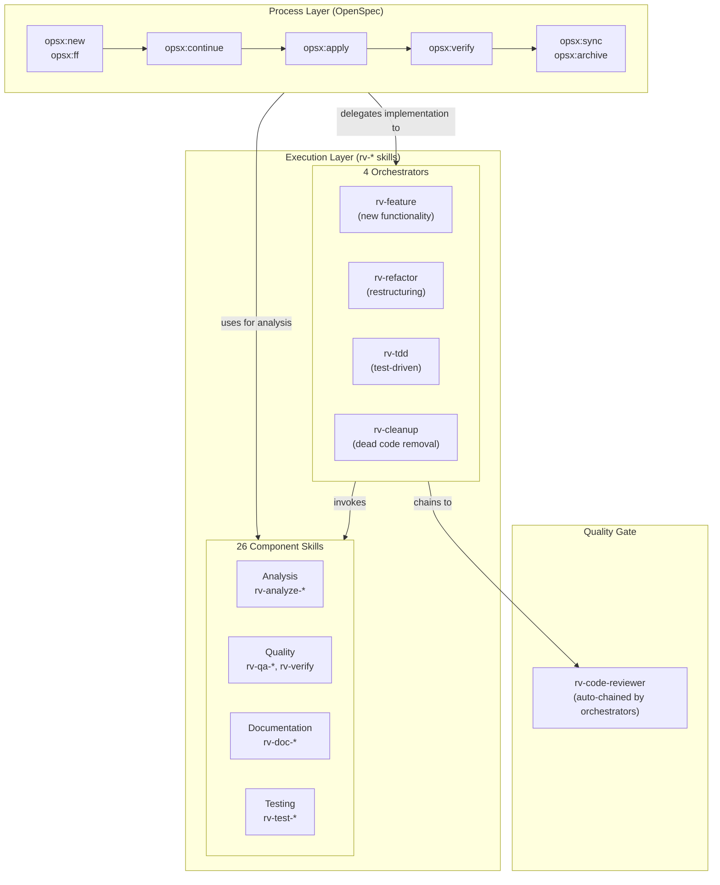

**Design principle**: Unidirectional flow — the process layer invokes the execution layer, never the reverse. This keeps rv-* skills reusable independently of OpenSpec. A developer can use `/rv-tdd` without SDD; but the SDD workflow can also call `/rv-tdd` for test-driven tasks.

### 11.5 Workflow Tracks

Not every change requires full SDD ceremony. The guiding principle is: **use the minimum level of specification rigor that removes ambiguity for your context** (ArXiv, "Spec-Driven Development: From Code to Contract", 2026). Three tracks match formality to the nature of the change — specifically, whether the change requires **design decisions** that benefit from spec artifacts, or whether it is a mechanical task where a plan document suffices.

Böckeler (Martin Fowler, 2026) documented the anti-pattern of applying SDD uniformly: Kiro turned a small bug fix into "4 user stories with 16 acceptance criteria" — a "sledgehammer to crack a nut." File count alone does not determine the track: a 45-file dead module removal is Quick Path if the plan is clear and no design decisions are needed.

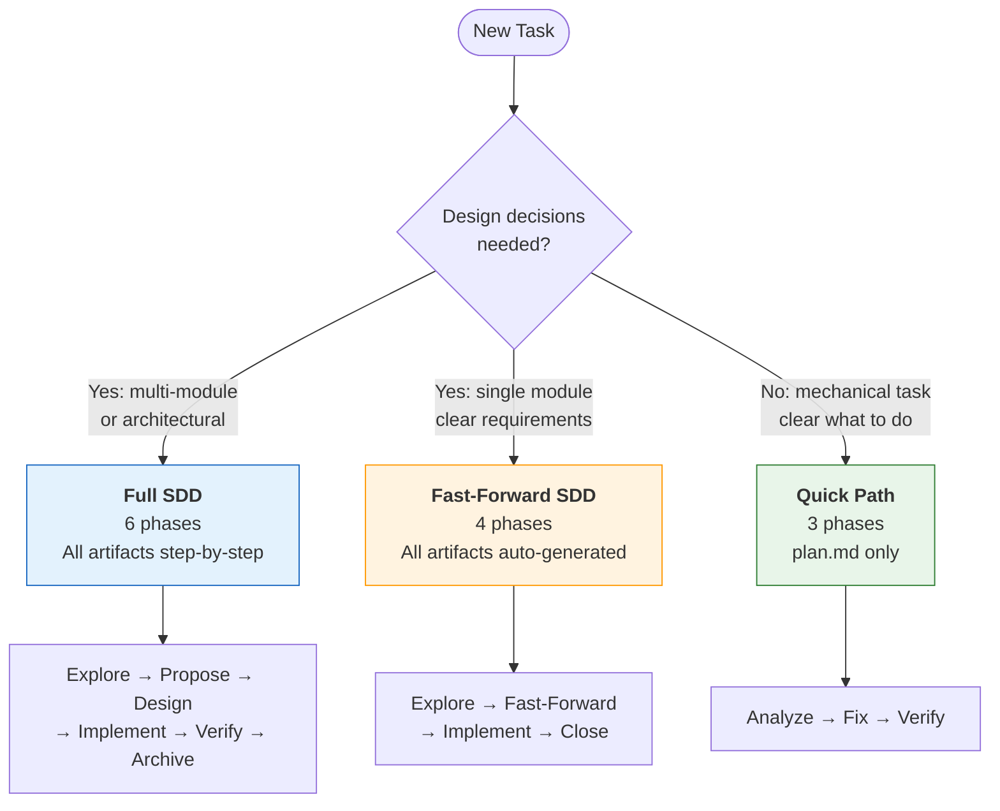

| Track | When to Use | Change Directory | Example |
|-------|-------------|------------------|---------|
| **Full SDD** | Design decisions + multi-module or architectural | `openspec/changes/` with full artifacts (proposal, delta specs, design, tasks) | Adding scroll detection to rv-agent + rv-screen-parser |
| **Fast-Forward SDD** | Design decisions + single module, clear requirements | `openspec/changes/` with full artifacts (auto-generated via `/opsx:ff`) | Adding a new config option to rv-experiment |
| **Quick Path** | No design decisions — mechanical, clear plan | `openspec/changes/` with `plan.md` only | Removing discontinued modules (45 files), fixing a coverage bug |

**Decision guide**: The key question is whether the change requires choices between alternatives that affect behavior, interface, or architecture:

| Question | Track |
|----------|-------|
| Does it introduce new behavior that must be documented in specs? | Full or FF SDD |
| Does it cross module boundaries with architectural implications? | Full SDD |
| Is it a single-module change with spec implications? | FF SDD |
| Does it remove/refactor without adding new documented behavior? | **Quick Path** |
| Is it a bug fix, cleanup, or documentation update? | **Quick Path** |
| Are requirements crystal clear and the task is mechanical? | **Quick Path** |

When in doubt, start with Quick Path. You can escalate to a higher track if the change turns out to need design decisions.

### 11.6 Example: Full SDD — Adding Scroll Detection to rv-agent

This is a multi-module change (rv-agent + rv-screen-parser) introducing a new capability. It goes through all 6 phases.

```bash
# ─── Phase 1: Explore ───────────────────────────────────────────
# Goal: Understand the problem and assess impact
/rv-analyze-module rv-agent            # Understand current UI parsing
/rv-analyze-module rv-screen-parser    # Understand screen parser structure
/opsx:explore                          # Document findings, think through approach

# ─── Phase 2: Propose ───────────────────────────────────────────
# Goal: Create formal change proposal with delta spec outlines
/opsx:new add-scroll-detection         # Create change directory + initial proposal
/opsx:continue                         # Write delta specs for rv-agent domain
/opsx:continue                         # Write delta specs for rv-screen-parser domain

# ─── Phase 3: Design ────────────────────────────────────────────
# Goal: Write design document and task list
/opsx:continue                         # Generate design document (architecture, interfaces)
/opsx:continue                         # Generate task list (ordered, testable tasks)

# ─── Phase 4: Implement ─────────────────────────────────────────
# Goal: Execute tasks one by one
/opsx:apply                            # Start implementing tasks
  # For each task, the appropriate orchestrator is used:
  # /rv-tdd for new scroll detector class (test-first)
  # /rv-feature for integration with existing parsing nodes

# ─── Phase 5: Verify ────────────────────────────────────────────
# Goal: Validate implementation against specs
/rv-verify rv-agent                    # Run tests + lint + type checks
/rv-verify rv-screen-parser            # Run tests + lint + type checks
/opsx:verify                           # Check implementation matches delta specs

# ─── Phase 6: Archive ───────────────────────────────────────────
# Goal: Sync delta specs and archive the change
/opsx:sync                             # Merge delta specs into main domain specs
/opsx:archive                          # Archive the completed change
```

### 11.7 Example: Quick Path — Fixing a Coverage Tracking Bug

A coverage tracking bug in rv-coverage — no SDD artifacts needed.

```bash
# ─── Phase 1: Analyze ───────────────────────────────────────────
# Goal: Understand the bug
/rv-debug-regression test_coverage_tracking  # Investigate via git history and tests

# ─── Phase 2: Fix ───────────────────────────────────────────────
# Goal: Fix the bug with test coverage
/rv-tdd                                      # Write failing test, then fix code

# ─── Phase 3: Verify ────────────────────────────────────────────
# Goal: Confirm the fix
/rv-verify rv-coverage                       # Run all checks (tests + lint + types)
```

Notice the difference: Full SDD took 6 phases with multiple OpenSpec commands and full spec artifacts; Quick Path took 3 phases with only a `plan.md` and no spec ceremony. The same SDD system supports both — proportional ceremony in action.

### 11.8 SDD Artifact Inventory

A complete inventory of all SDD-related artifacts in the RV-Android project:

| Artifact | Path | Content |
|----------|------|---------|
| **PRD** | `docs/PRD.md` | 37 functional requirements, 8 non-functional requirements, research integration |
| **Domain specs** (7) | `openspec/specs/*/spec.md` | 111 invariants, 217 scenarios, current system behavior |
| **OpenSpec config** | `openspec/config.yaml` | Project context, rules, brownfield constraints |
| **Workflow guide** | `docs/WORKFLOW.md` | Track selection, phase details, skill sequences |
| **SDD reference** | `docs/SDD.md` | This document |
| **Adoption plan** | `docs/20260209_plano_spec_driven.md` | 5-phase adoption plan (all phases complete) |
| **Spec template** | `docs/templates/spec-template.md` | Template for new domain specs |
| **Design template** | `docs/templates/design-template.md` | Template for design documents |
| **ADR template** | `.claude/skills/rv-doc-adr/templates/adr.md` | Template for architectural decision records (via `/rv-doc-adr` skill) |

### 11.9 Validating Our Workflow Against SDD Best Practices

How does RV-Android's workflow align with the principles and best practices described in this document?

| Best Practice | RV-Android Implementation | Status |
|--------------|--------------------------|--------|
| **Proportional ceremony** (Section 4.6) | Three tracks: Full SDD, Fast-Forward, Quick Path | Implemented |
| **Spec-anchored position** (Section 5.3) | Specs persist; code is authoritative | Implemented |
| **Brownfield-first** (OpenSpec) | `config.yaml` with "specs document current behavior" rule | Implemented |
| **Living documentation** (Section 4.4) | Delta specs → sync → main specs workflow | Implemented |
| **Iterative refinement** (Section 4.5) | Feedback loops at every phase; specs updated during implementation | Implemented |
| **Human-in-the-loop** (Section 4.3) | Review checkpoints at each phase | Implemented |
| **TDD integration** (Section 7.5) | `/rv-tdd` skill within SDD workflow | Implemented |
| **Structured specs** (Section 6.1) | RFC 2119, WHEN/THEN/AND, INV-XX-NN invariants | Implemented |
| **Fluid workflow** (OpenSpec principle) | No rigid phase gates; artifact dependencies as enablers | Implemented |
| **Unidirectional layer flow** | Process layer → Execution layer, never reverse | Implemented |

---

## 12. Related Documents

| Document | Purpose |
|----------|---------|
| `docs/PRD.md` | Product Requirements Document (37 FRs, 8 NFRs) |
| `docs/WORKFLOW.md` | Authoritative workflow reference (tracks, phases, skill sequences) |
| `docs/20260209_plano_spec_driven.md` | SDD adoption plan (5 phases, all complete) |
| `openspec/config.yaml` | OpenSpec configuration (project context and rules) |
| `openspec/specs/*/spec.md` | Domain specifications (7 specs covering all modules) |
| `.claude/AGENTS.md` | Full skill and agent documentation |
| `CLAUDE.md` | Root project guide (includes condensed workflow section) |

---

## 13. References

### Primary Sources

| # | Source | Author/Org | Date | URL |
|---|--------|-----------|------|-----|
| 1 | Understanding SDD: Kiro, Spec-Kit, and Tessl | Birgitta Böckeler (Martin Fowler's team) | 2025 | https://martinfowler.com/articles/exploring-gen-ai/sdd-3-tools.html |
| 2 | Spec-Driven Development Guide | GitHub (Spec Kit) | 2025-10 | https://github.com/github/spec-kit/blob/main/spec-driven.md |
| 3 | SDD with AI: Open Source Toolkit | GitHub Blog | 2025-10 | https://github.blog/ai-and-ml/generative-ai/spec-driven-development-with-ai-get-started-with-a-new-open-source-toolkit/ |
| 4 | Unpacking SDD: 2025's Key AI-Assisted Engineering Practice | ThoughtWorks (Liu Shangqi) | 2025-12 | https://www.thoughtworks.com/insights/blog/agile-engineering-practices/spec-driven-development-unpacking-2025-new-engineering-practices |
| 5 | Technology Radar Vol. 32 — SDD Entry | ThoughtWorks | 2025-11 | https://www.thoughtworks.com/radar/techniques/spec-driven-development |
| 6 | SDD: When Architecture Becomes Executable | InfoQ | 2025 | https://www.infoq.com/articles/spec-driven-development/ |
| 7 | SDD: The Waterfall Strikes Back | Marmelab | 2025-11 | https://marmelab.com/blog/2025/11/12/spec-driven-development-waterfall-strikes-back.html |
| 8 | Kiro and the Future of Software Development | Marc Brooker (AWS) | 2025-07 | https://kiro.dev/blog/kiro-and-the-future-of-software-development/ |
| 9 | From Vibe Coding to SDD | Tessl | 2025-12 | https://tessl.io/blog/from-vibe-coding-to-spec-driven-development/ |
| 10 | SDD e Agentes de IA | Bix Tecnologia | 2025 | https://bixtecnologia.com.br/spec-driven-development-agentes-ia/ |
| 11 | Diving into SDD with GitHub Spec Kit | Microsoft Developer Blog (Den Delimarsky) | 2025 | https://developer.microsoft.com/blog/spec-driven-development-spec-kit |
| 12 | OpenSpec | Fission-AI | 2025-12 | https://github.com/Fission-AI/OpenSpec |
| 13 | How to Write a Good Spec for AI Agents | Addy Osmani | 2025 | https://addyosmani.com/blog/good-spec/ |

### Background Sources

| # | Source | Relevance |
|---|--------|-----------|
| 14 | Kent Beck, *Test Driven Development: By Example* (2003) | TDD classification precedent; test-first methodology |
| 15 | Dan North, "Introducing BDD" (2006) | BDD classification precedent; Given/When/Then format |
| 16 | Fred Brooks, "No Silver Bullet" (1986) | Software complexity and the limits of planning |
| 17 | Bertrand Meyer, *Object-Oriented Software Construction* (1988) | Design by Contract; preconditions, postconditions, invariants |
| 18 | Wikipedia, "Programming paradigm" | Formal definition of paradigm used in Section 3.3 |
| 19 | Vibe Coding Could Cause Catastrophic 'Explosions' in 2026 | The New Stack | Security risks of unstructured AI-assisted coding |

---

*This document reflects the state of SDD as of February 2026. SDD is an emerging practice under active development; definitions, tools, and best practices are evolving. ThoughtWorks classifies SDD in the "Assess" ring of their Technology Radar, indicating it is worth exploring but not yet established as a standard practice.*
