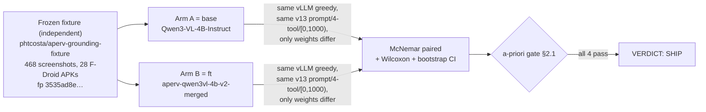

# Multimodal Vision Model Selection for RV-Agent

## 1. Introduction

RV-Agent is the LLM-driven Android testing tool in the RV-Android platform. It uses a Vision Language Model (VLM) to analyze device screenshots and decide which UI element to interact with during automated exploration. The selection of the right VLM — and the infrastructure to serve it — is a foundational decision that directly affects testing effectiveness: a wrong click derails the entire exploration sequence, while a correct one advances coverage of monitored operations.

This document consolidates the complete methodology and results of the multimodal vision model evaluation conducted between December 2025 and January 2026. The evaluation spanned two phases — an initial exploration using Ollama with early models, followed by a systematic benchmark using dedicated inference servers — and produced over 22 technical notes. The goal was to select a VLM that could reliably identify and click on Android UI elements from screenshots, given the hardware constraints of a single consumer GPU.

The evaluation was conducted in a dedicated benchmark framework (`rvsec-vision-llm`), separate from RV-Agent itself, to isolate the visual grounding capability from the complexities of the full testing pipeline. The framework mirrors RV-Agent's architecture (LangChain + LangGraph) to ensure that findings transfer directly to production.

**Selected model**: Qwen3-VL-4B-Instruct, served via SGLang on an NVIDIA RTX 5070 Ti (16GB VRAM), achieving a 57.7% hit rate in pure visual grounding mode and a 90.3% tool call rate across 2,847 tests.

### 1.1 Document Scope

This document covers:

- The visual grounding problem and why coordinate generation from screenshots fails with current VLMs
- Hardware and infrastructure constraints that shaped the evaluation
- Phase 1: Initial exploration with Ollama, including the discovery of a critical infinite loop bug
- Phase 2: Inference server selection, model screening (9 candidates), and the evaluation framework
- Prompt engineering, configuration optimization, and full benchmark results
- The final model selection decision and its integration into RV-Agent
- Limitations and directions for future work

All numerical data in this document is sourced from the technical notes in `docs/vision/` and `docs/vision/old/`. Cross-references to source documents are provided throughout.

### 1.2 Relationship to RV-Agent

RV-Agent uses a LangGraph workflow where the VLM is a first-class decision-maker. Unlike earlier LLM-based tools in the project (rvandroid, rvsmart, rvdroid — all discontinued), RV-Agent gives the VLM direct control over device actions via tool calling. The VLM receives a screenshot and a list of UI elements with their coordinates, then calls an `android_click` tool to interact with the chosen element. The visual grounding evaluation measures the raw capability underlying this interaction: given a screenshot and a target element description, can the model produce coordinates that land on the correct element?

See `docs/PRD.md` Section 6 for the full tool evolution history and `modules/rv-agent/docs/architecture.md` for the agent's architecture.

---

## 2. Background and Motivation

### 2.1 The Visual Grounding Problem

The project's initial assumption was that Vision Language Models could directly generate pixel coordinates for UI elements shown in screenshots — a task known as "visual grounding." Early experiments disproved this assumption. When asked to identify the location of a UI element without coordinate hints, models showed near-zero accuracy:

| Model | visual_only Hit Rate | coords_provided Hit Rate |
|-------|---------------------|-------------------------|
| Qwen3-VL-4B (initial, before coordinate fix) | 3.6% | 100% |
| gemma-3-4b-it | 0.9% | 100% |

The 100% hit rate in `coords_provided` mode is trivial — the model simply copies the coordinates from the prompt. The near-zero `visual_only` rates demonstrate that current VLMs cannot reliably locate elements visually when asked to generate pixel coordinates from scratch.

Analysis of Qwen3-VL errors revealed systematic biases: the model tends to point approximately 225 pixels to the right and 270 pixels above the target, typically landing in the center of a dialog instead of on the specific button. This consistent offset suggested a coordinate system mismatch rather than a fundamental inability to understand screen content — a hypothesis later confirmed by the discovery of the normalized coordinate system (Section 7.1).

Source: `docs/vision/008_visual_grounding.md`, `docs/PRD.md` Section 6.2.

### 2.2 The Solution: Selection over Generation

The adopted approach reframes the VLM's task from *coordinate generation* to *element selection*:

1. **Parse the UI** via UIAutomator2 XML to obtain all interactive elements with their exact coordinates
2. **Present the element list** to the VLM in the prompt (text description + coordinates per element)
3. **Ask the VLM to choose** which element to interact with, using the pre-determined coordinates

This approach uses the VLM for what it does well — understanding screen content and deciding what to do — while bypassing its limitation at precise coordinate generation. The VLM still processes the screenshot for visual context, but does not need to generate coordinates from scratch.

With this approach, the hit rate in RV-Agent approaches 100% for elements present in the UIAutomator hierarchy, because the VLM selects from known-correct coordinates rather than generating its own. The `visual_only` benchmark numbers (57.7% for Qwen3-VL) measure the raw visual grounding capability without UIAutomator data — a characterization of what the model can do when coordinate hints are unavailable.

Source: `docs/PRD.md` Section 6.3.

### 2.3 Why a Dedicated Evaluation Was Needed

The Ollama infinite loop bug (Section 4.3) was the immediate trigger for building the evaluation framework. When RV-Agent was first deployed with Ollama serving Qwen3-VL, approximately 16.7% of inferences at low temperature produced an infinite loop of repeated tokens instead of a tool call, wasting 60–70 seconds per occurrence and consuming up to 58% of the testing time budget. This bug made Ollama unsuitable for production and motivated a systematic search for a reliable inference server and model combination.

Beyond the loop bug, the evaluation needed to answer several open questions: Which VLMs could produce structured tool calls with coordinates? What inference server should replace Ollama? How accurate is visual grounding across different element types? What configuration parameters matter? The `rvsec-vision-llm` framework was built to answer these questions rigorously.

---

## 3. Hardware and Infrastructure Constraints

### 3.1 Hardware Specifications

All experiments were conducted on a single workstation with the following GPU:

| Component | Specification |
|-----------|---------------|
| GPU | NVIDIA GeForce RTX 5070 Ti |
| VRAM | 16GB |
| Architecture | Blackwell |
| Compute Capability | 12.0 (SM120) |
| Host CUDA | 13.0 |
| Container CUDA | 12.9.1 |
| Driver | 580.95.05 |
| Host OS | Linux 6.14.0-37-generic |

Source: `docs/vision/FINAL_REPORT.md`.

### 3.2 VRAM Constraints

The 16GB VRAM budget constrains model selection. Models up to 4B parameters can run in bf16 (full precision) within this budget, using approximately 8GB. Models in the 7B–9B range require 4-bit quantization (via bitsandbytes) to fit, which reduces accuracy (Section 11.4). Models larger than 9B are excluded entirely.

| Model Size | Quantization | Approximate VRAM | Feasibility |
|------------|-------------|-------------------|-------------|
| 4B | bf16 (none) | ~8GB | Full precision possible |
| 7B | bitsandbytes 4-bit | ~6GB | Quantization required |
| 9B | bitsandbytes 4-bit | ~8–10GB | Tight fit |
| 13B+ | — | >16GB | Exceeds budget |

### 3.3 RTX 5070 Ti Compatibility (SM120 Issue)

The RTX 5070 Ti reports compute capability 12.0 (SM120), which is a Blackwell desktop GPU. SGLang's TRTLLM MHA attention backend expects SM100 for Blackwell detection, causing a compatibility failure. The workaround is to use the FlashInfer attention backend, which supports SM120:

```bash
python -m sglang.launch_server \
    --model-path Qwen/Qwen3-VL-4B-Instruct \
    --port 30000 \
    --attention-backend flashinfer \
    --tool-call-parser qwen \
    --trust-remote-code
```

This configuration was validated in Phase 2 and is used for all SGLang deployments throughout this evaluation.

Source: `docs/vision/001_sglang_validation.md`.

---

## 4. Phase 1: Initial Exploration (Ollama + Early Models)

Phase 1 took place in November–December 2025 and used Ollama as the inference server. This phase established the baseline understanding of VLM capabilities for Android UI interaction and uncovered several critical issues that shaped the subsequent evaluation.

### 4.1 Gemma 4b Investigation

The first model investigated was `gemma-3-4b-it` (Google Gemma 3, 4B parameters), served via Ollama. The investigation focused on whether the model could generate valid coordinates for UI elements in Android screenshots.

**Initial results** (visual grounding without coordinate hints): approximately 30% accuracy. This was unexpectedly low for what appeared to be a capable vision model.

**Coordinate validation strategy**: When the prompt included the target element's coordinates (asking the model to click on a specific element whose position was provided), accuracy jumped to 100%. This demonstrated that the model could parse and return coordinates but could not reliably generate them from visual inspection alone.

The investigation revealed the fundamental limitation discussed in Section 2.1: VLMs are poor at generating pixel coordinates from screenshots. The 100% accuracy in `coords_provided` mode was the first evidence that the "selection over generation" approach would be viable.

Source: `docs/vision/old/001_gemma.md`.

### 4.2 First Multi-Model Benchmark (7 Models, 420 Tests)

Following the Gemma investigation, a broader benchmark was conducted with 7 vision models across 420 tests and 4 evaluation scenarios. All models were served via Ollama.

**Models tested**: gemma-3-4b-it, qwen2.5vl:7b, llava:7b, llava:13b, moondream:1.8b, bakllava, and minicpm-v.

**Benchmark results summary**:

| Model | Overall Accuracy | Coordinate Validation | Visual Generation |
|-------|-----------------|----------------------|-------------------|
| qwen2.5vl:7b | Highest overall | 98.3% | 96.7% |
| gemma-3-4b-it | Second overall | 100% | 30% |
| Others | Lower | Varies | Varies |

The benchmark declared `qwen2.5vl:7b` as the winner based on its consistency across all scenarios. However, this result came from Phase 1 (Ollama-based) and was later superseded by the Phase 2 evaluation which used PyTorch-based servers and a larger dataset.

**Methodology validation**: A separate validation study (`docs/vision/old/003_validacao.md`) confirmed that the benchmark methodology was sound. The ground truth coordinates were generated programmatically from UIAutomator `.state` files — not by any AI model — making the evaluation objective and reproducible. The center of each UI element was calculated from its bounding box coordinates: `center_x = (left + right) / 2`, `center_y = (top + bottom) / 2`.

Source: `docs/vision/old/002_vision.md`, `docs/vision/old/003_validacao.md`.

### 4.3 The Ollama Infinite Loop Bug

During RV-Agent deployment with Ollama, a critical infinite loop bug was discovered with Qwen3-VL. The model would enter a repetition loop, generating the same text fragment thousands of times until hitting the `num_predict` token limit.

**Symptoms**:
- Repetitive text generation (same tool call repeated hundreds of times)
- No usable tool calls produced
- Duration: 60–70 seconds per occurrence
- `done_reason: "length"` (hit token limit, not normal completion)

**Example output**:
```
Input: Screenshot + "What action should I take?"
Output: {reasoning: "I should click the button", tool_calls: [...]}
        {reasoning: "I should click the button", tool_calls: [...]}
        [... repeated until 8192 tokens in ~58 seconds]
```

**Root cause**: The GGUF/llama.cpp backend used by Ollama ignores the `repeat_penalty` parameter for vision-language models. This is confirmed by multiple upstream issues:
- QwenLM/Qwen3-VL #1611: Infinite loop in table transcription
- ollama/ollama #10767: `repeat_penalty` has no effect
- llama.cpp #14663: Problem in non-Q4 GGUF with flash attention

**Trigger conditions**:

| Parameter | Safe Value | Risky Value |
|-----------|------------|-------------|
| Temperature | >= 0.6 | < 0.3 |
| num_predict | <= 2048 | 8192 |
| UI pattern | Simple screens | Repetitive patterns (lists, grids, forms) |

**Measured loop rate**: 16.7% (2 out of 12 tests) under low-temperature conditions.

**Impact on RV-Agent**: In one test session with the Simplenotes app, 3 loop occurrences consumed 174 seconds of a 300-second test budget (58% of testing time). The success rate dropped from 88.6% (with 8K context) to 48.1% (with 16K context, where loops lasted longer).

**PyTorch-based servers are not affected**: This bug is specific to the GGUF quantization format. SGLang (PyTorch + FlashInfer) and vLLM (PyTorch + PagedAttention) showed a 0% loop rate across all tests.

Source: `docs/vision/old/ANALISE_LOOP_INFINITO_QWEN3VL.md`, `docs/vision/006_ollama_loop_bug.md`.

### 4.4 Multimode Integration Problems

Phase 1 also uncovered several integration issues when running RV-Agent in multimode (hybrid LLM + algorithm):

1. **SET_TEXT vs TYPE_TEXT mismatch**: The DFS algorithm generated `SET_TEXT` actions, but the ToolExecutor only recognized `TYPE_TEXT`. Actions failed silently, causing the agent to get stuck in loops on the same screen. Fix: added `SET_TEXT` as a synonym for `TYPE_TEXT`.

2. **Wrong model name**: The comparison script was configured with `qwen2.5:7b` (text model) instead of `qwen3-vl:4b` (vision model), causing 404 errors.

3. **Excessive LLM latency (44 seconds)**: Ollama's default 4096-token context window was too small for vision prompts. A custom Modelfile with 8192 tokens reduced latency to acceptable levels.

4. **Graph state not resetting between tests**: The `DynamicStateGraph` was being reused across test runs, contaminating results.

These issues were resolved during Phase 1 and informed the more robust Phase 2 design.

Source: `docs/vision/old/ANALISE_PROBLEMAS_MULTIMODE.md`.

### 4.5 Lessons Learned from Phase 1

Phase 1 established several key conclusions that shaped the Phase 2 evaluation:

1. **Ollama is unsuitable for production** due to the infinite loop bug in GGUF-based inference
2. **VLMs cannot reliably generate coordinates** — the "selection over generation" approach is necessary
3. **A dedicated evaluation framework is needed** to systematically compare models and servers
4. **PyTorch-based servers** (SGLang, vLLM) should be the focus of Phase 2
5. **Qwen-family models** showed the most promise for tool calling with vision inputs

---

## 5. Phase 2: Inference Server Selection

Phase 2 began in late December 2025 with the selection of an inference server to replace Ollama. Three servers were evaluated for serving Qwen3-VL:

### 5.1 SGLang (Primary — PyTorch + FlashInfer)

**SGLang** is a fast serving framework for LLMs that uses PyTorch with the FlashInfer attention backend. It was selected as the primary server for the following reasons:

- **No loop bug**: 0% loop rate across all tests (PyTorch backend)
- **FlashInfer backend**: Supports RTX 5070 Ti SM120 architecture
- **Native Qwen tool call parsing**: Built-in `--tool-call-parser qwen` option
- **Consistent performance**: Low-variance latency across inferences

**Deployment configuration**:
```bash
python -m sglang.launch_server \
    --model-path Qwen/Qwen3-VL-4B-Instruct \
    --port 30000 \
    --trust-remote-code \
    --attention-backend flashinfer \
    --tool-call-parser qwen
```

**Validation results** (Phase 0, initial tests):
- Qwen3-VL-4B-Instruct: 100% accuracy in `coords_provided` mode
- Tool calling: Functional with both native and XML fallback parsing
- Latency: ~1.8 seconds per inference

Source: `docs/vision/001_sglang_validation.md`.

### 5.2 vLLM (Fallback — PyTorch + PagedAttention)

**vLLM** is an alternative PyTorch-based serving framework with PagedAttention for efficient memory management. It serves as the fallback server:

- **No loop bug**: 0% loop rate (PyTorch backend)
- **bitsandbytes quantization**: Supports on-the-fly 4-bit quantization for larger models (7B+)
- **Broader model support**: Handles architectures that SGLang does not

**Deployment configuration** (for Fara-7B):
```bash
python -m vllm.entrypoints.openai.api_server \
    --model microsoft/Fara-7B \
    --port 8000 \
    --trust-remote-code \
    --max-model-len 8192 \
    --dtype bfloat16 \
    --quantization bitsandbytes \
    --enable-auto-tool-choice \
    --tool-call-parser pythonic
```

vLLM was used primarily for models requiring 4-bit quantization (Fara-7B) and as a validation cross-check for models also tested on SGLang.

Source: `docs/vision/002_server_comparison.md`.

### 5.3 Ollama Disqualification (GGUF Backend)

Ollama was formally disqualified based on the infinite loop bug documented in Phase 1. A controlled reproduction test (12 trials, low temperature) confirmed the 16.7% loop rate:

| Server | Backend | Loop Rate | Tests |
|--------|---------|-----------|-------|
| SGLang | PyTorch + FlashInfer | 0% (0/12) | 12 |
| vLLM | PyTorch + PagedAttention | 0% (0/12) | 12 |
| Ollama | GGUF (llama.cpp) | 16.7% (2/12) | 12 |

The loop rate is probabilistic and depends on temperature, token limit, and input complexity. At the low temperatures required for deterministic tool calling (temperature < 0.3), the 16.7% failure rate is unacceptable for autonomous testing.

Source: `docs/vision/006_ollama_loop_bug.md`.

### 5.4 Server Comparison Summary

| Server | Backend | Loop Bug | Tool Calling | RTX 5070 Ti | Decision |
|--------|---------|----------|--------------|-------------|----------|
| **SGLang** | PyTorch/FlashInfer | No (0%) | Native + fallback | FlashInfer | **Selected** |
| **vLLM** | PyTorch/PagedAttention | No (0%) | Native (100%) | Compatible | Fallback |
| Ollama | llama.cpp/GGUF | **Yes (16.7%)** | Requires parser | Compatible | Excluded |

---

## 6. Phase 2: Model Screening (9 Candidates)

With SGLang and vLLM established as the serving infrastructure, 9 candidate VLMs were screened for compatibility and basic functionality.

### 6.1 Candidate Overview Table

| Model | Parameters | Architecture | Server | Quantization | Status |
|-------|------------|--------------|--------|-------------|--------|
| **Qwen3-VL-4B-Instruct** | 4B | Qwen3-VL | SGLang | bf16 | **Selected** |
| **microsoft/Fara-7B** | 7B | Qwen2.5-VL | vLLM | bitsandbytes 4-bit | **Finalist** |
| google/gemma-3-4b-it | 4B | Gemma | SGLang | bf16 | Low performance |
| openbmb/MiniCPM-V-4.5 | 4B | MiniCPM-V | vLLM | bf16 | Functional |
| Qwen3-VL-4B-Thinking | 4B | Qwen3-VL | SGLang | bf16 | Excluded |
| lmms-lab/llava-onevision-7b | 7B | LLaVA | vLLM | — | Excluded |
| allenai/Molmo-7B-D-0924 | 7B | Molmo | — | — | Excluded |
| OpenGVLab/InternVL2-8B | 8B | InternVL | vLLM | 4-bit | Excluded |
| zai-org/AutoGLM-Phone-9B | 9B | GLM4V | vLLM | 4-bit | Excluded |

Source: `docs/vision/010_model_validation.md`.

### 6.2 Excluded Models (with Reasons)

**Qwen3-VL-4B-Thinking**: A "thinking" variant of Qwen3-VL that generates chain-of-thought reasoning before responding. In practice, the model produced corrupted multilingual output — a mix of Japanese, Arabic, Russian, and other scripts — instead of coherent reasoning or tool calls. Zero tool call rate across all tests, with approximately 28-second latency per inference. Example output: `"ありました越來'\"... relentسري thieves(Matรวม apologies..."`.

**Llava-OneVision-7B** (`lmms-lab/llava-onevision-qwen2-7b-si-hf`): Architecture incompatibility. vLLM reported `Model architectures ['LlavaQwenForCausalLM'] are not supported for this model`. The model uses `LlavaQwenForCausalLM` but vLLM's LLaVA support expects `LlavaOnevisionForConditionalGeneration`.

**Molmo-7B-D-0924** (`allenai/Molmo-7B-D-0924`): Requires TensorFlow as a dependency, which was not available in the Docker containers used for evaluation. The model's `max_position_embeddings` of 4096 is also limiting for vision tasks.

**InternVL2-8B** (`OpenGVLab/InternVL2-8B`): The model generates plain text descriptions of what tool to call instead of structured tool calls. Example response: `"To click on the \"Allow\" button using android_click tool... android_click 540 1054"`. Zero tool call extraction rate.

**AutoGLM-Phone-9B** (`zai-org/AutoGLM-Phone-9B`): Assertion error during bitsandbytes 4-bit quantization: `AssertionError: param_data.shape == loaded_weight.shape` in `linear.py:781`. The `Glm4vForConditionalGeneration` architecture is incompatible with bitsandbytes. At 9B parameters, the model does not fit in 16GB VRAM without quantization.

**MiniCPM-V-4.5** (`openbmb/MiniCPM-V-4.5`): Functional in initial tests (92.9% in coords_provided, 46.4% in visual_only on a small sample), but did not respond to standard prompts consistently in the full benchmark. Uses the same [0, 1000) normalized coordinate system as Qwen3-VL.

Source: `docs/vision/010_model_validation.md`, `docs/vision/FINAL_REPORT.md`.

### 6.3 Two Finalists: Qwen3-VL-4B-Instruct and Fara-7B

After screening, two models advanced to the full benchmark:

**Qwen3-VL-4B-Instruct** (Alibaba, 4B parameters): The best-performing model in initial tests. Runs on SGLang in bf16 (no quantization needed), using approximately 8GB VRAM. Produces tool calls in a consistent format with coordinates in the [0, 1000) normalized range.

**microsoft/Fara-7B** (Microsoft, 7B parameters): Based on the Qwen2.5-VL architecture. Requires 4-bit quantization to fit in 16GB VRAM, running on vLLM. Produces tool calls with pixel coordinates directly (no normalization). Multiple output format variations — `coordinate`, `bbox`, `bbox_2d`, `bounds`, `bndbox`, `center` — required a robust parser.

**gemma-3-4b-it** was also included in the full benchmark for comparison despite its poor visual grounding (0.9% hit rate in visual_only mode), as it demonstrated 100% accuracy in coords_provided mode and served as a lower-bound reference.

---

## 7. Critical Technical Discoveries

Three technical discoveries made during the evaluation had a significant impact on model accuracy and the evaluation methodology.

### 7.1 Qwen3-VL Normalized Coordinate System [0, 1000)

**Discovery date**: December 25, 2025.

This was the single most impactful finding of the evaluation. Before understanding Qwen3-VL's coordinate system, the initial visual grounding hit rate was 3.6%. After applying the correct conversion, it jumped to approximately 50%, and later to 57.7% with tuned parameters.

**The problem**: Qwen3-VL returns coordinates in a normalized [0, 1000) range, not in pixel coordinates. The model internally processes images at an optimized resolution (e.g., 704x1248 for a 1080x1920 device) and outputs coordinates in a 1000-unit grid regardless of the actual image dimensions.

**How the discovery was made**: When analyzing model predictions, coordinates like (499, 547) appeared nonsensical for a 1080x1920 screen — the target element was at pixel (540, 1054). Treating these as pixel values produced a 3.6% hit rate. The breakthrough came from GitHub Issue #1486 on the QwenLM/Qwen3-VL repository, which documented that "Qwen3-VL's bbox output uses normalized 1000 relative coordinates."

**Conversion formula**:
```python
def denormalize_qwen_coords(x, y, image_width, image_height):
    pixel_x = int((x / 1000) * image_width)
    pixel_y = int((y / 1000) * image_height)
    return pixel_x, pixel_y
```

**Validation example**:
- Raw model output: (499, 547)
- Converted: (499/1000 × 1080, 547/1000 × 1920) = (539, 1050)
- Target element center: (540, 1054)
- Distance: **4 pixels** (well within the 50-pixel tolerance)

**Impact on hit rate**:

| Stage | Hit Rate |
|-------|----------|
| Before coordinate conversion | 3.6% |
| After coordinate conversion | ~50% |
| After parameter tuning | 57.7% |

**When to apply conversion**: Only in `visual_only` mode (where the model generates coordinates from visual inspection). In `coords_provided` mode, coordinates in the prompt are already in pixel space, and the model copies them directly.

The `ActionNormalizer` in `modules/rv-agent/src/rv_agent/domain/action.py` handles this conversion via `denormalize_qwen_coords()` in production.

Source: `docs/vision/003_coordinate_conversion.md`, `docs/vision/009_qwen3vl_coordinates.md`.

### 7.2 Tool Calling Inconsistency (Native vs XML)

SGLang does not officially support tool calling for Qwen3-VL (vision/multimodal models). The documentation for SGLang's tool calling feature lists parsers for text-only models (llama3, mistral, qwen25, deepseekv3, hermes) but no parser specifically designed for vision-language models.

**Observed behavior**: Approximately 50% of Qwen3-VL responses use native structured `tool_calls` (the OpenAI-compatible format), while the other 50% embed tool calls as XML `<tool_call>` tags in the `content` field.

**Native format** (response.tool_calls populated):
```python
response.tool_calls = [
    {'name': 'android_click', 'args': {'x': 540, 'y': 143}, 'id': 'call_xxx'}
]
```

**XML format** (response.tool_calls empty, tool call in content):
```xml
<tool_call>
{"name": "android_click", "arguments": {"x": [499, 141]}
</tool_call>
```

**Root cause**: LangChain's `bind_tools()` injects tool definitions in the OpenAI format, but does not inject the Hermes-style system prompt that would instruct the model to consistently use `<tool_call>` XML tags. The Qwen3-VL model was trained with the Hermes format and sometimes "remembers" to use it, but the behavior is non-deterministic.

**Investigation results** (10 iterations each):
- Simple prompt: 0% native, 100% XML
- Full RV-Agent V12 prompt: 50% native, 50% XML
- Across iterations: Non-deterministic distribution

**Solution**: A hybrid fallback parser that handles both formats. The parser first checks for native `tool_calls`, then falls back to XML parsing if none are found. This approach achieves 100% tool call extraction success.

An interesting finding: the XML fallback parser achieves a higher hit rate (69.5%) than native tool calls (60.2%), suggesting the model is more deliberate about coordinates when using the XML format.

Source: `docs/vision/022_problema_sglang_native_tools.md`.

### 7.3 Model-Specific Output Formats

Each model uses a different format for outputting coordinates, requiring model-specific parsing:

| Model | Coordinate Format | Range | Example |
|-------|-------------------|-------|---------|
| Qwen3-VL | Normalized [0, 1000) | 0–999 | `{"x": 499, "y": 547}` |
| MiniCPM-V | Normalized [0, 1000) | 0–999 | `{"x": 495, "y": 547}` |
| Fara-7B | Pixel coordinates | 0–1080/1920 | `{"coordinate": [540, 1054]}` |
| Gemma | Action format | 0–1080/1920 | `{"action": "android_click", "x": 480, "y": 1600}` |

Fara-7B is particularly inconsistent, using at least six different coordinate key names: `coordinate`, `bbox`, `bbox_2d`, `bounds`, `bndbox`, and `center`. It also uses three different tool call structures:

```json
// Format 1: Standard
{"name": "left_click", "arguments": {"coordinate": [540, 1057]}}

// Format 2: Nested
{"name": "Deny", "arguments": {"type": "left_click", "coordinate": [540, 1205]}}

// Format 3: Minimal (x as array)
{"name": "android_click", "arguments": {"x": [906, 1059]}}
```

The tool call parser (`tool_call_parser.py`) handles all these variations through a series of normalization steps.

Source: `docs/vision/013_prompt_and_parser_fixes.md`, `docs/vision/021_fara7b_parser_improvements.md`.

---

## 8. Evaluation Framework and Methodology

### 8.1 The rvsec-vision-llm Evaluation Project

The evaluation was conducted using a dedicated project (`rvsec-vision-llm`), separate from RV-Agent, that focuses exclusively on measuring visual grounding accuracy. The framework was designed to mirror RV-Agent's architecture so that findings transfer directly to production.

The framework automates the full evaluation pipeline: screenshot selection, prompt generation, model inference, tool call parsing, coordinate extraction, hit validation, and result aggregation.

### 8.2 Architecture (LangChain + LangGraph)

The evaluation framework uses LangChain for LLM communication and LangGraph for workflow orchestration, matching RV-Agent's architecture:

```
prepare_inference → run_inference → extract_coordinates → validate_result
```

**Key components**:

| Component | Description |
|-----------|-------------|
| `EvaluationConfig` | Pydantic model for evaluation parameters |
| `VisionLLMClient` | LangChain wrapper with `ChatOpenAI` + `bind_tools()` |
| `EvaluatorState` | TypedDict for LangGraph workflow state |
| `tool_call_parser` | Multi-format parser supporting 6 extraction strategies |
| `click_validator` | Euclidean distance validation against ground truth |
| `uiautomator_parser` | UIElement extraction from `.state` files |

**Alignment with RV-Agent**:

| RV-Agent Component | Evaluator Equivalent |
|-------------------|---------------------|
| `AgentConfig` | `EvaluationConfig` |
| `LLMClient` | `VisionLLMClient` |
| `AgentState` | `EvaluatorState` |
| Graph nodes | `prepare_inference`, `run_inference`, etc. |
| `@tool` decorators | `android_tools.py` |

This alignment ensures that improvements discovered in the evaluation framework (parser fixes, prompt engineering, configuration tuning) can be ported directly to RV-Agent.

Source: `docs/vision/015_langchain_refactoring.md`.

### 8.3 Dataset (468 Screenshots, 28 Apps, 812 Elements)

The evaluation dataset consists of screenshots collected from 28 Android applications installed from F-Droid:

| Parameter | Value |
|-----------|-------|
| Total APKs | 28 |
| Total screenshots | 468 |
| Elements per screenshot | ~3 (visually identifiable) |
| Total unique elements | 812 |
| Total tests (with repetitions) | 2,847 |

**Element type distribution**:

| Element Type | Count | Percentage |
|--------------|-------|------------|
| Button | 290 | 35.7% |
| ImageButton | 148 | 18.2% |
| TextView | 123 | 15.1% |
| EditText | 102 | 12.6% |
| CheckedTextView | 88 | 10.8% |
| ImageView | 70 | 8.6% |
| Spinner | 49 | 6.0% |
| CheckBox | 36 | 4.4% |
| Switch | 24 | 3.0% |
| RadioButton | 13 | 1.6% |
| Other | 6 | 0.7% |

Screenshots were collected using DroidBot's exploration engine, which generates `.state` files containing the UIAutomator XML hierarchy for each screenshot. These `.state` files provide the ground truth element coordinates.

**Ground truth generation**: The expected coordinates for each element are computed programmatically from the element's bounding box in the `.state` file: `center_x = (left + right) / 2`, `center_y = (top + bottom) / 2`. No human annotation or AI-generated data is used for ground truth.

Source: `docs/vision/016_full_benchmark_plan.md`, `docs/vision/018_benchmark_methodology.md`.

### 8.4 Evaluation Modes (coords_provided, visual_only)

Two evaluation modes measure different capabilities:

**coords_provided**: The prompt includes the target element's coordinates along with its description. The model's task is to copy those coordinates into a tool call. This mode tests basic instruction following and tool calling capability. Expected hit rate: ~100%.

**visual_only**: The prompt includes only the target element's text description (e.g., "Click on the 'Allow' button") and the screenshot, without coordinates. The model must locate the element visually and generate coordinates. This mode measures true visual grounding capability.

The `visual_only` mode is the primary evaluation mode. The `coords_provided` mode serves as a baseline to verify that the model's tool calling pipeline works correctly.

### 8.5 Success Criteria and Result Categories

**Hit tolerance**: 50 pixels (Euclidean distance from predicted coordinates to element center).

**Result categories**:

| Category | Description |
|----------|-------------|
| **HIT** | Tool called, coordinates within 50px of element center |
| **MISS** | Tool called, coordinates outside 50px tolerance |
| **NO_TOOL** | Model produced a text response instead of a tool call |
| **PARSE_ERROR** | Tool call detected but coordinates could not be extracted |

The 50-pixel tolerance was chosen to accommodate the varying sizes of UI elements. Most interactive elements in Android UIs span at least 48dp (approximately 96 pixels at xxhdpi), so a 50-pixel tolerance is roughly the radius of a typical button.

### 8.6 Visual Element Filtering

Not all UI elements are visually identifiable in a screenshot. Container elements like `LinearLayout`, `RelativeLayout`, and `FrameLayout` have no visual representation — they exist only in the UIAutomator XML hierarchy. Including them in the visual grounding evaluation would unfairly penalize models.

The framework filters elements using an `is_visually_identifiable` property:

- **Always identifiable**: Button, EditText, CheckBox, Switch, RadioButton, Spinner, SeekBar
- **Identifiable with content**: TextView (requires text), ImageButton (requires content-desc), ImageView (requires content-desc)
- **Never identifiable**: LinearLayout, FrameLayout, RelativeLayout, ScrollView, and other container types

Only visually identifiable elements are included in the benchmark. This filtering was added after early analysis showed that layout containers had 5–8% hit rates, skewing overall results downward.

**Impact of filtering**:

| Metric | With Layouts | Without Layouts |
|--------|-------------|-----------------|
| Total Tests | 495 | 383 |
| Hit Rate | 41.6% | 52.0% |

Source: `docs/vision/011_element_type_analysis.md`, `docs/vision/015_langchain_refactoring.md`.

---

## 9. Prompt Engineering

### 9.1 Three Prompt Versions

Three prompt versions were tested, each progressively more directive:

**Prompt V1 (Generic)**:
```
You are an Android UI automation assistant.
The screen image has dimensions {width}x{height} pixels.
When asked to click on an element, you MUST:
1. Look at the screenshot and find the element visually
2. Determine its coordinates by analyzing the image
3. Use the android_click tool with the coordinates you found
```

**Prompt V2 (Directive)**:
```
You are an Android UI automation assistant.
The screen image has dimensions {width}x{height} pixels.
When asked to click on an element, you MUST:
1. Look at the screenshot and find the element visually
2. Determine its EXACT PIXEL coordinates (x, y) by analyzing the image
3. Use the android_click tool with x and y parameters

CRITICAL: You MUST always provide numeric x,y pixel coordinates.
Never use element IDs or names.
The x coordinate must be between 0 and {width}, y between 0 and {height}.
```

**Prompt V3 (Production — used in RV-Agent)**: The full V12 prompt used in RV-Agent production, which includes the UI element list, exploration context, and tool definitions. This prompt is specific to RV-Agent's workflow and not reproduced here.

### 9.2 Impact on Tool Call Rate and Hit Rate

| Prompt Version | Tool Call Rate | Hit Rate | Key Change |
|----------------|---------------|----------|------------|
| V1 (Generic) | ~70% | ~30% | Baseline |
| V2 (Directive) | ~100% | ~50% | Added "CRITICAL", "EXACT PIXEL" |
| V3 (Production) | ~90% | ~58% | Full RV-Agent context |

The jump from V1 to V2 was the most significant improvement. Two changes drove the increase:

1. **Explicit prohibition of non-coordinate responses**: Adding `"CRITICAL: You MUST always provide numeric x,y pixel coordinates. Never use element IDs or names."` eliminated the problem of models returning element descriptions instead of coordinates (particularly affecting Fara-7B).

2. **Tool description enhancement**: Adding pixel ranges and "REQUIRED: must be a number" to the tool parameter descriptions:
```python
"x": {
    "type": "integer",
    "description": "X pixel coordinate (0-1080, horizontal position from left edge). REQUIRED: must be a number."
}
```

Source: `docs/vision/004_prompt_engineering.md`, `docs/vision/013_prompt_and_parser_fixes.md`.

### 9.3 The Fallback Parser

The fallback parser handles the non-deterministic tool call format described in Section 7.2. It attempts 6 extraction strategies in priority order:

1. **Native tool calls**: LangChain's `response.tool_calls` field
2. **XML tags**: `<tool_call>{JSON}</tool_call>` (Hermes format)
3. **JSON array**: `[{"name": "tool", "parameters": {...}}]`
4. **JSON object**: `{"name": "tool", "parameters": {...}}`
5. **Markdown code blocks**: ````json {...} ````
6. **Pythonic calls**: `android_click(x=540, y=1054)`

The parser also applies JSON repair patterns to handle common malformations in model output:

| Pattern | Example | Fix |
|---------|---------|-----|
| Double colon | `"x":\": 541` | `"x": 541` |
| Trailing quote | `"y": 473"` | `"y": 473` |
| Missing leading zero | `"x": .91` | `"x": 0.91` |
| Array as coordinate | `"x": [352, 782]` | `"x": 352, "y": 782` |
| Truncated JSON | `{"x": 352...` | Add missing `}` |

**Parser improvement impact**:

| Metric | Before Fixes | After Fixes |
|--------|-------------|-------------|
| Parse success rate | 64.8% | ~90% |
| Recovered tool calls | 0 | ~20 per benchmark run |

The parser also normalizes model-specific coordinate formats (Section 7.3), handling the 6+ different key names used by Fara-7B and the `action` key format used by Gemma.

Source: `docs/vision/004_prompt_engineering.md`, `docs/vision/012_parser_stats_analysis.md`.

---

## 10. Configuration Optimization

### 10.1 Parameter Sweep (27 Configurations)

A systematic parameter sweep tested 27 configurations (3×3×3 factorial design) in `coords_provided` mode to determine the impact of sampling parameters on accuracy:

| Parameter | Values Tested |
|-----------|--------------|
| Temperature | 0.01, 0.1, 0.3, 0.6 |
| Top-P | 0.1, 0.6, 0.9 |
| Top-K | 10, 50, 100 |

Each configuration was tested across 150 screenshots with 3 repetitions, totaling 11,190 individual tests.

### 10.2 Key Finding: Minimal Impact on Accuracy

The most important finding was that sampling parameters have negligible impact on visual grounding accuracy. Across all 27 configurations, the hit rate in `coords_provided` mode ranged from 99.4% to 100%, with a variance of approximately 0.5%.

**Best result**: 99.946% (11,184 hits out of 11,190 tests) — the 6 misses were edge cases unrelated to parameter choice.

This finding simplifies the production configuration: since parameters do not meaningfully affect accuracy, they can be chosen for other properties (determinism, speed, consistency).

### 10.3 Recommended Configuration

Based on the sweep results and the goal of deterministic, reproducible behavior:

| Parameter | Value | Rationale |
|-----------|-------|-----------|
| Temperature | 0.01 | Near-deterministic output |
| Top-P | 0.6 | Focused sampling without excessive truncation |
| Top-K | 50 | Standard vocabulary limitation |
| Max Tokens | 2048 | Sufficient for tool calls, prevents token explosion |

Source: `docs/vision/005_config_sweep.md`.

---

## 11. Full Benchmark Results

The full benchmark was conducted with the recommended configuration (temperature=0.01, top_p=0.6, top_k=50) in `visual_only` mode across 468 screenshots, 812 elements, and 3 repetitions per element (2,847 tests total). Hit tolerance: 50 pixels.

### 11.1 Qwen3-VL-4B-Instruct (2,847 Tests)

**Server**: SGLang, bf16 (no quantization), ~8GB VRAM.

| Metric | Value |
|--------|-------|
| **Hit Rate** | **57.7%** |
| **Tool Call Rate** | **90.3%** |
| Average Distance (hits only) | 6.2px |
| Average Latency | 1,821ms |
| Consistency across repetitions | 98.9% |

**Result distribution**:

| Category | Count | Rate |
|----------|-------|------|
| HIT | 1,642 | 57.7% |
| MISS | 878 | 30.8% |
| NO_TOOL | 277 | 9.7% |
| PARSE_ERROR | 50 | 1.8% |

**Parser strategy distribution**:

| Strategy | Usage Rate | Hit Rate |
|----------|-----------|----------|
| native | 54.8% | 60.2% |
| xml (fallback) | 35.5% | 69.5% |
| none (no tool call) | 9.7% | 0% |

The XML fallback parser achieves a higher hit rate (69.5%) than native tool calls (60.2%). This suggests the model is more deliberate about coordinates when it generates XML format output, possibly because the XML serialization process engages different internal processing.

Source: `docs/vision/017_full_benchmark_results.md`, `docs/vision/FINAL_REPORT.md`.

### 11.2 Fara-7B (2,847 Tests)

**Server**: vLLM, bitsandbytes 4-bit quantization, ~6GB VRAM.

| Metric | Value |
|--------|-------|
| **Hit Rate** | **44.3%** |
| **Tool Call Rate** | **79.9%** |
| Average Distance (hits only) | 4.1px |
| Average Latency | 1,015ms |

**Result distribution**:

| Category | Count | Rate |
|----------|-------|------|
| HIT | 1,261 | 44.3% |
| MISS | 458 | 16.1% |
| NO_TOOL | 573 | 20.1% |
| PARSE_ERROR | 555 | 19.5% |

Fara-7B has significantly higher NO_TOOL (20.1% vs 9.7%) and PARSE_ERROR (19.5% vs 1.8%) rates than Qwen3-VL. The NO_TOOL rate indicates that the model frequently responds with text explanations instead of tool calls. The PARSE_ERROR rate reflects Fara-7B's inconsistent output formats, which the parser cannot always resolve.

Source: `docs/vision/019_fara7b_results_comparison.md`, `docs/vision/FINAL_REPORT.md`.

### 11.3 Per-Element-Type Performance

Element type analysis reveals complementary strengths between the two models:

**Qwen3-VL excels at text-based elements**:

| Element Type | Qwen3-VL | Fara-7B | Advantage |
|--------------|----------|---------|-----------|
| EditText | **93.1%** | 12.4% | Qwen (+80.7%) |
| Button | **78.2%** | 66.2% | Qwen (+12.0%) |
| View | **75.0%** | 25.0% | Qwen (+50.0%) |
| Switch | **69.4%** | 61.1% | Qwen (+8.3%) |
| Spinner | **63.3%** | 29.3% | Qwen (+34.0%) |
| TextView | **60.2%** | 33.9% | Qwen (+26.3%) |
| ImageButton | **43.5%** | 34.0% | Qwen (+9.5%) |

**Fara-7B excels at selection controls**:

| Element Type | Qwen3-VL | Fara-7B | Advantage |
|--------------|----------|---------|-----------|
| CheckedTextView | 29.2% | **71.6%** | Fara (+42.4%) |
| RadioButton | 0.0% | **61.5%** | Fara (+61.5%) |
| CheckBox | 25.0% | **54.6%** | Fara (+29.6%) |

**Both models struggle with**:

| Element Type | Qwen3-VL | Fara-7B |
|--------------|----------|---------|
| ImageView | 0.0% | 1.4% |

Qwen3-VL's strength on text-based elements (EditText, Button, TextView) is more valuable for RV-Agent, because these are the most common interactive elements in Android UIs and the primary interaction points during app exploration. Buttons alone account for 35.7% of all elements in the dataset.

**Precision when hitting**: Both models are precise when they successfully locate an element. Qwen3-VL averages 6.2px distance on hits; Fara-7B averages 4.1px. The challenge is finding the correct element, not precision within it.

**CheckBox/RadioButton benchmark limitation**: Both models show misleadingly low hit rates for CheckBox and RadioButton elements. The model correctly clicks on the checkbox icon (left side), but the ground truth uses the element center (middle of text + icon combined). Example: target (237, 382) vs predicted (50, 380) — the X coordinate is off by ~187px because the model clicked the checkbox itself, not the center of the entire CheckBox + label region. This is a methodology limitation, not a model failure.

Source: `docs/vision/011_element_type_analysis.md`, `docs/vision/014_benchmark_comparison.md`, `docs/vision/019_fara7b_results_comparison.md`.

### 11.4 Comparative Analysis

**Overall comparison**:

| Metric | Qwen3-VL | Fara-7B | Winner |
|--------|----------|---------|--------|
| Hit Rate | **57.7%** | 44.3% | Qwen3-VL (+13.4%) |
| Tool Call Rate | **90.3%** | 79.9% | Qwen3-VL (+10.4%) |
| Avg Distance | 6.2px | **4.1px** | Fara-7B |
| Avg Latency | 1,821ms | **1,015ms** | Fara-7B (44% faster) |
| PARSE_ERROR | **1.8%** | 19.5% | Qwen3-VL |
| NO_TOOL | **9.7%** | 20.1% | Qwen3-VL |
| Consistency | **98.9%** | N/A | Qwen3-VL |
| VRAM Usage | ~8GB | **~6GB** | Fara-7B |

**Quantization impact on Qwen3-VL**: A separate test compared Qwen3-VL in bf16 (SGLang) vs 4-bit quantization (vLLM with bitsandbytes):

| Configuration | Hit Rate | Tool Call Rate | Avg Distance |
|---------------|----------|----------------|-------------|
| SGLang (bf16) | 67.1% | 91.8% | 5.7px |
| vLLM (4-bit) | 23.9% | 81.6% | 35.6px |

4-bit quantization causes catastrophic degradation for Qwen3-VL: hit rate drops by nearly 3x, and average distance increases by 6x. bf16 without quantization is required for acceptable performance. This constraint is the reason Qwen3-VL runs on SGLang (which supports bf16 natively) rather than vLLM (where 4-bit quantization was being used to fit larger models).

Source: `docs/vision/014_benchmark_comparison.md`, `docs/vision/019_fara7b_results_comparison.md`.

### 11.5 gemma-3-4b-it (Reference)

For completeness, the gemma-3-4b-it results in visual_only mode:

| Metric | Value |
|--------|-------|
| Hit Rate | 0.9% |
| Tool Call Rate | 76.8% |
| Avg Distance | 17.0px |
| Avg Latency | 805ms |

Gemma cannot locate elements visually — its 0.9% hit rate makes it unsuitable for visual grounding. It produces systematically wrong coordinates with Y values 500–700px off target. The model is fast (805ms) and can copy coordinates perfectly in `coords_provided` mode (100%), but visual grounding is beyond its capability.

Source: `docs/vision/014_benchmark_comparison.md`.

---

## 12. Model Selection Decision

### 12.1 Selection Rationale

**Selected model**: Qwen3-VL-4B-Instruct, served via SGLang in bf16.

The selection is based on four factors:

1. **Accuracy is more critical than speed**: In autonomous testing, a wrong click derails the entire exploration sequence. The agent must restart from the current state and try again, losing time. Qwen3-VL's 13.4% higher hit rate (57.7% vs 44.3%) means fewer wasted interactions.

2. **Higher tool call rate**: Qwen3-VL produces structured tool calls 90.3% of the time, compared to Fara-7B's 79.9%. Each NO_TOOL response requires fallback handling, adding complexity and delay to the exploration loop.

3. **Lower error rates**: Qwen3-VL's 1.8% PARSE_ERROR rate vs Fara-7B's 19.5% means more predictable output. Combined with the lower NO_TOOL rate, 90.3% of Qwen3-VL interactions produce usable results, compared to only 60.4% for Fara-7B (79.9% tool call − 19.5% parse error).

4. **Strength on common elements**: Qwen3-VL excels on EditText (93.1%), Button (78.2%), and TextView (60.2%) — the three most frequently interacted element types in Android UIs. These elements account for 63.4% of the dataset.

### 12.2 Trade-off Analysis (Accuracy vs Speed)

Fara-7B's 44% speed advantage (1,015ms vs 1,821ms) is meaningful in absolute terms but does not compensate for its lower accuracy:

- **Per-inference time difference**: 806ms (1,821 − 1,015)
- **Inferences per minute**: Qwen3-VL ~33, Fara-7B ~59
- **Effective inferences** (producing usable results): Qwen3-VL ~30 (90.3%), Fara-7B ~36 (60.4%)
- **Effective hits per minute**: Qwen3-VL ~19 (57.7%), Fara-7B ~26 (44.3%)

While Fara-7B produces more raw inferences per minute, the quality-adjusted throughput is closer. And in RV-Agent's exploration loop, each failed interaction (NO_TOOL, PARSE_ERROR, MISS) costs not just the inference time but also the retry overhead, state recovery, and potentially a back-navigation. The time cost of a wrong click is typically 3–5x the inference time.

**A hybrid strategy** (using Fara-7B for selection controls where it excels) was considered but not recommended. Running two models simultaneously doubles the infrastructure complexity (two servers, two configurations, routing logic) for marginal improvement on a small subset of element types.

---

## 13. Integration into RV-Agent

### 13.1 Recommended Configuration

```python
# LLM Configuration
model = "Qwen/Qwen3-VL-4B-Instruct"
server_url = "http://192.168.0.21:30000/v1"  # SGLang endpoint
temperature = 0.01   # Near-deterministic
top_p = 0.6          # Focused sampling
top_k = 50           # Limited vocabulary
max_tokens = 2048    # Sufficient for tool calls
```

**SGLang server launch**:
```bash
python -m sglang.launch_server \
    --model-path Qwen/Qwen3-VL-4B-Instruct \
    --port 30000 \
    --trust-remote-code \
    --attention-backend flashinfer \
    --tool-call-parser qwen
```

### 13.2 Hybrid Strategy (Visual + Coordinate Fallback)

In production, RV-Agent uses the "selection over generation" approach (Section 2.2), where the VLM receives both the screenshot and a list of UI elements with their coordinates. The VLM's task is to choose which element to interact with, not to generate coordinates from scratch. This means the production hit rate approaches 100% for elements in the UIAutomator hierarchy.

The 57.7% visual grounding rate measured in the benchmark characterizes the model's raw capability — useful for understanding the model's visual understanding but not representative of production accuracy.

For elements where the UIAutomator hierarchy is incomplete or unavailable (e.g., WebView content, custom-rendered elements), the visual grounding capability serves as a fallback:

1. **Primary**: Select from UIAutomator element list (near-100% accuracy)
2. **Fallback**: Visual grounding when element list is unavailable (~58% accuracy)
3. **Last resort**: Random exploration using algorithmic DFS strategy

### 13.3 ActionNormalizer and Coordinate Denormalization

The `ActionNormalizer` in `modules/rv-agent/src/rv_agent/domain/action.py` handles Qwen3-VL's normalized coordinate conversion:

```python
def denormalize_qwen_coords(x, y, device_width, device_height):
    """Convert Qwen3-VL normalized [0, 1000) coordinates to device pixels."""
    pixel_x = int((x / 1000) * device_width)
    pixel_y = int((y / 1000) * device_height)
    return pixel_x, pixel_y
```

This conversion is applied only when the model generates coordinates from visual inspection (visual_only mode). When the model selects from a pre-computed element list (coords_provided mode), the coordinates are already in pixel space.

### 13.4 Tool Call Parser Architecture

The production parser in `modules/rv-agent/src/rv_agent/llm/tools/tool_call_parser.py` implements the hybrid parsing strategy:

```python
def _extract_tool_calls(self, response):
    # 1. Try native tool calls first
    if hasattr(response, "tool_calls") and response.tool_calls:
        return response.tool_calls, "native"

    # 2. Fallback: parse from content
    if response.content:
        parsed, strategy = parse_tool_calls_with_strategy(response.content)
        if parsed:
            return parsed, strategy  # "xml", "json_array", etc.

    return [], "none"
```

The parser tracks statistics to monitor the native vs XML distribution:

```python
parser_stats.get_stats()
# {
#     "total_calls": 100,
#     "successful_parses": 100,
#     "strategy_success_counts": {
#         "native": 48,
#         "xml_tool_call": 52,
#     }
# }
```

### 13.5 Performance Expectations

Based on the benchmark results, the following performance characteristics are expected in production:

| Metric | Expected Value |
|--------|---------------|
| Hit rate (with UIAutomator selection) | ~100% |
| Hit rate (visual_only fallback) | ~58% |
| Tool call rate | ~90% |
| Consistency across repetitions | ~99% |
| Average latency per inference | ~1.8 seconds |
| Throughput | ~33 inferences/minute |
| VRAM usage | ~8GB |

**Validated in production**: RV-Agent validation with 20 Android applications showed an 84.2% effective interaction rate (higher than the raw visual_only benchmark because production uses the UIAutomator selection approach). See `docs/20260107_rvagent_validacao_multimodal.md` for the validation study.

---

## 14. Limitations and Future Work

### 14.1 Limitations

**Visual grounding is not 100% reliable**: The 57.7% raw visual grounding rate means the model fails to locate approximately 42% of elements when coordinate hints are unavailable. While production uses UIAutomator-based selection to mitigate this, the limitation affects scenarios where the UIAutomator hierarchy is incomplete.

**Icon-based elements are problematic**: ImageButton (43.5%) and ImageView (0.0%) have low hit rates. The model struggles with elements that lack text labels, relying instead on visual pattern matching that is less reliable.

**Selection controls vary by model**: CheckBox and RadioButton performance differs dramatically between Qwen3-VL and Fara-7B, suggesting that training data composition strongly influences performance on these element types.

**Single GPU constraint**: The 16GB VRAM limit excludes larger models (13B+) that might achieve higher accuracy. The evaluation results are specific to models that fit within this budget.

**Benchmark methodology limitation for checkboxes**: The ground truth uses element center, but users (and models) typically click on the checkbox icon, not the center of the combined checkbox + label region. This leads to artificially low hit rates for CheckBox and RadioButton elements.

**4-bit quantization degrades accuracy**: The ~3x hit rate drop with bitsandbytes 4-bit quantization means that 7B+ models cannot be fairly compared against 4B models running in bf16. A fairer comparison would require either a larger GPU or more efficient quantization methods (GPTQ, AWQ).

### 14.2 Future Work

**Fine-tuning on Android UI screenshots**: Training a Qwen3-VL variant on Android UI data could improve visual grounding accuracy, particularly for element types where the model currently struggles (ImageButton, CheckBox, RadioButton).

**Confidence-based fallback**: Using model confidence scores (logit probabilities) to decide when to fall back from visual grounding to coordinate-based selection, rather than always providing coordinates.

**Evaluate newer/larger models**: As GPU hardware becomes available or more efficient serving methods emerge, evaluating 7B+ models in full precision could reveal significantly better visual grounding.

**Multi-resolution evaluation**: The current benchmark uses a single device resolution (1080x1920). Testing across resolutions (720p, 1440p, tablet) would characterize how resolution affects grounding accuracy.

**Improved checkbox/radio ground truth**: Using the icon center rather than the full element center as ground truth for CheckBox and RadioButton elements would provide more accurate measurement of model performance on these element types.

---

## 15. References

### Technical Notes (Phase 1)

| Document | Description |
|----------|-------------|
| `docs/vision/old/001_gemma.md` | Gemma 4b investigation — coordinate validation strategy |
| `docs/vision/old/002_vision.md` | 7-model benchmark (420 tests) — Qwen2.5VL 7B winner |
| `docs/vision/old/003_validacao.md` | Scientific validation of benchmark methodology |
| `docs/vision/old/ANALISE_LOOP_INFINITO_QWEN3VL.md` | Infinite loop bug discovery and analysis |
| `docs/vision/old/ANALISE_PROBLEMAS_MULTIMODE.md` | Multimode integration problems |

### Technical Notes (Phase 2)

| Document | Description |
|----------|-------------|
| `docs/vision/001_sglang_validation.md` | SGLang Phase 0 validation |
| `docs/vision/002_server_comparison.md` | Server comparison (SGLang vs vLLM vs Ollama) |
| `docs/vision/003_coordinate_conversion.md` | Coordinate system discovery and conversion |
| `docs/vision/004_prompt_engineering.md` | Prompt v1/v2/v3 and fallback parser |
| `docs/vision/005_config_sweep.md` | 27-config parameter sweep |
| `docs/vision/006_ollama_loop_bug.md` | Formal loop bug reproduction |
| `docs/vision/007_methodology.md` | Evaluation methodology documentation |
| `docs/vision/008_visual_grounding.md` | Visual grounding analysis |
| `docs/vision/009_qwen3vl_coordinates.md` | Coordinate system deep dive |
| `docs/vision/010_model_validation.md` | 9-model compatibility screening |
| `docs/vision/011_element_type_analysis.md` | Per-element-type performance |
| `docs/vision/012_parser_stats_analysis.md` | Parser statistics and malformed JSON |
| `docs/vision/013_prompt_and_parser_fixes.md` | Prompt and parser improvements |
| `docs/vision/014_benchmark_comparison.md` | Multi-model benchmark comparison |
| `docs/vision/015_langchain_refactoring.md` | LangChain/LangGraph architecture |
| `docs/vision/016_full_benchmark_plan.md` | Full benchmark planning |
| `docs/vision/017_full_benchmark_results.md` | Qwen3-VL full benchmark results |
| `docs/vision/018_benchmark_methodology.md` | Complete methodology documentation |
| `docs/vision/019_fara7b_results_comparison.md` | Fara-7B results and model comparison |
| `docs/vision/020_final_summary.md` | Final evaluation summary |
| `docs/vision/021_fara7b_parser_improvements.md` | Fara-7B parser improvements |
| `docs/vision/022_problema_sglang_native_tools.md` | SGLang tool calling investigation |

### Final Reports

| Document | Description |
|----------|-------------|
| `docs/vision/FINAL_REPORT.md` | Comprehensive technical report (English) |
| `docs/vision/relatorio_gemini.md` | Summary report (Portuguese) |
| `docs/vision/relatorio_qwen.md` | Qwen evaluation report (Portuguese) |

### Architecture Documents

| Document | Description |
|----------|-------------|
| `docs/PRD.md` Section 6 | LLM Evolution and Inference Infrastructure |
| `modules/rv-agent/docs/architecture.md` | RV-Agent architecture (LangGraph workflow) |
| `docs/rv_android_architecture.md` | RV-Android system architecture |

### External References

| Reference | URL |
|-----------|-----|
| Qwen3-VL Coordinate System (Issue #1486) | https://github.com/QwenLM/Qwen3-VL/issues/1486 |
| Qwen3-VL Infinite Loop (Issue #1611) | https://github.com/QwenLM/Qwen3-VL/issues/1611 |
| Ollama repeat_penalty Bug (Issue #10767) | https://github.com/ollama/ollama/issues/10767 |
| llama.cpp GGUF Bug (Issue #14663) | https://github.com/ggml-org/llama.cpp/issues/14663 |
| SGLang Qwen3-VL Documentation | https://docs.sglang.io/basic_usage/qwen3_vl.html |
| SGLang Tool Parser Documentation | https://docs.sglang.io/advanced_features/tool_parser.html |
| Qwen Function Calling Guide | https://qwen.readthedocs.io/en/latest/framework/function_call.html |
| NousResearch Hermes Function Calling | https://github.com/NousResearch/Hermes-Function-Calling |
| vLLM Tool Calling Issue #29192 | https://github.com/vllm-project/vllm/issues/29192 |
| Qwen3-VL Tool Call Issue #1093 | https://github.com/QwenLM/Qwen3-VL/issues/1093 |
| SGLang Tool Call Tags Issue #9184 | https://github.com/sgl-project/sglang/issues/9184 |

---

## Appendix A: Evaluation Framework File Structure

```
rvsec-vision-llm/
├── src/
│   ├── config/
│   │   └── evaluation_config.py     # Pydantic configuration model
│   ├── llm/
│   │   ├── client.py                # VisionLLMClient (LangChain wrapper)
│   │   ├── tools/
│   │   │   └── android_tools.py     # @tool definitions (android_click, etc.)
│   │   └── graph/
│   │       ├── state.py             # EvaluatorState (TypedDict)
│   │       └── nodes.py             # LangGraph workflow nodes
│   ├── evaluator/
│   │   └── evaluator.py             # LLMEvaluator (main orchestrator)
│   ├── parsers/
│   │   ├── uiautomator_parser.py    # UIElement extraction from .state files
│   │   └── tool_call_parser.py      # Multi-format tool call parsing
│   ├── validation/
│   │   └── click_validator.py       # Euclidean distance hit validation
│   └── utils/
│       └── coordinates.py           # Coordinate conversion utilities
├── tests/
│   └── test_evaluator.py            # Evaluation test runner
├── scripts/
│   ├── run_benchmark.py             # Full benchmark execution
│   └── analyze_element_types.py     # Per-element analysis
├── results/                         # JSON benchmark results
├── screenshots/                     # 468 test screenshots + .state files
└── docs/                            # Evaluation documentation
```

---

## Appendix B: Full Model Exclusion Details

| Model | Server | Error / Issue | Recommendation |
|-------|--------|---------------|----------------|
| Qwen3-VL-4B-Thinking | SGLang | Corrupted multilingual output (JP/AR/RU mix), 0% tool calls, ~28s latency | Do not use |
| llava-onevision-7b-si-hf | vLLM | `LlavaQwenForCausalLM` architecture not supported | Wait for vLLM support |
| Molmo-7B-D-0924 | — | Requires TensorFlow dependency, 4096 max_position_embeddings | Incompatible stack |
| InternVL2-8B | vLLM | Generates plain text instead of tool calls ("android_click 540 1054") | No structured output |
| AutoGLM-Phone-9B | vLLM | `AssertionError` in bitsandbytes quantization (Glm4v architecture) | Incompatible with bitsandbytes |
| MiniCPM-V-4.5 | vLLM | 92.9% coords_provided, 46.4% visual_only (small sample); inconsistent with standard prompts at scale | Requires custom prompt engineering |

---

## Appendix C: Documentation Index

This document consolidates information from 22+ source documents. The following index maps document sections to their primary sources:

| Section | Primary Sources |
|---------|----------------|
| 2. Background | `008_visual_grounding`, PRD §6.2, §6.3 |
| 3. Hardware | `FINAL_REPORT`, `001_sglang_validation` |
| 4.1 Gemma | `old/001_gemma` |
| 4.2 First Benchmark | `old/002_vision`, `old/003_validacao` |
| 4.3 Loop Bug | `old/ANALISE_LOOP_INFINITO_QWEN3VL`, `006_ollama_loop_bug` |
| 4.4 Multimode | `old/ANALISE_PROBLEMAS_MULTIMODE` |
| 5. Server Selection | `001_sglang_validation`, `002_server_comparison`, `006_ollama_loop_bug` |
| 6. Model Screening | `010_model_validation` |
| 7.1 Coordinates | `003_coordinate_conversion`, `009_qwen3vl_coordinates` |
| 7.2 Tool Calling | `022_problema_sglang_native_tools` |
| 7.3 Output Formats | `013_prompt_and_parser_fixes`, `021_fara7b_parser_improvements` |
| 8. Methodology | `007_methodology`, `015_langchain_refactoring`, `016_full_benchmark_plan`, `018_benchmark_methodology` |
| 9. Prompts | `004_prompt_engineering`, `013_prompt_and_parser_fixes` |
| 10. Configuration | `005_config_sweep` |
| 11.1 Qwen3-VL Results | `017_full_benchmark_results`, `FINAL_REPORT` |
| 11.2 Fara-7B Results | `019_fara7b_results_comparison`, `FINAL_REPORT` |
| 11.3 Element Types | `011_element_type_analysis`, `014_benchmark_comparison`, `019_fara7b_results_comparison` |
| 12. Selection | `020_final_summary`, `FINAL_REPORT` |
| 13. Integration | PRD §6.6–§6.8, `rv-agent/docs/architecture.md` |

---

# Appendix A — Domain Fine-Tuning of Qwen3-VL-4B for APE-RV and its A/B Validation

> **Added 2026-06-19.** Sections 1–13 above describe the *selection* of the base VLM (Qwen3-VL-4B-Instruct) for pure visual grounding. This appendix documents the next step: *fine-tuning* that base model for the **APE-RV production task** and the rigorous, statistically-tested validation that the fine-tune actually improved that task. All work lives in the sibling repo **`workspace-rv/rvsec-fine-tuning/`**.

## A.1 Why fine-tune, and for which task

The VLM selection (above) measured **pure visual grounding** — "click the element labeled X", single `android_click(x,y)` tool, **pixel** coordinates, *no widget list in the prompt* (the 57.7% hit rate). The **APE-RV production task is different**: it is an **explore-and-act** task where the model receives the screenshot **plus a list of on-screen widgets with their coordinates already embedded**, and must emit one of **four tools** in **normalized `[0,1000)`** coordinates.

| Dimension | VLM-selection benchmark (§11) | **APE-RV production task (fine-tune target)** |
|---|---|---|
| Tools | 1 (`android_click`) | **4** (`click`, `long_click`, `type_text`, `back`) |
| Coordinates | pixels | **normalized `[0,1000)`** |
| Widget list in prompt | no | **yes** (`N. Class "text" @(nx,ny)`) |
| Instruction | "click element X" | explore-and-act (+ recent-action history) |

The canonical production prompt/schema/parser are defined in `rvsec-fine-tuning/aperv_training/format/prompt.py`, `format/tools.py`, and `reward/parser.py`. The consumer is APE-RV's `LlmRouter` (Java, on-device).

## A.2 How the tuning was done

- **Base model:** `Qwen/Qwen3-VL-4B-Instruct`.
- **Two-phase recipe (gh3 rev 5):** **SFT cold-start → GRPO** (RL), executed on a Colab A100 40 GB. Vision encoder unfrozen during SFT, frozen during GRPO.
- **Training corpus:** `phtcosta/aperv-v2-grpo-corpus` — 3,000 image-bearing samples (2,000 AMEX + 1,000 AndroidControl), each rendered in the exact production prompt/4-tool/`[0,1000)` format with a labeled ground-truth action.
- **Artifacts published to HuggingFace Hub:**

| Artifact | HF repo | Role |
|---|---|---|
| Base / original | `Qwen/Qwen3-VL-4B-Instruct` | comparison baseline |
| SFT adapter | `phtcosta/aperv-qwen3vl-4b-v2-sft` | cold-start LoRA |
| GRPO adapter | `phtcosta/aperv-qwen3vl-4b-v2-grpo` | RL LoRA |
| **Fine-tuned (merged)** | **`phtcosta/aperv-qwen3vl-4b-v2-merged`** | **production artifact** (SFT→GRPO merged, byte-identical verified) |

The merged model **is committed and present on the HF Hub** (verified during validation).

## A.3 How it was validated (A/B protocol)

Prior offline evals (ScreenSpot) were rejected as **out-of-distribution** — generic GUI grounding, not the APE-RV task. We built a fresh, production-faithful A/B re-measurement (full protocol: `rvsec-fine-tuning/docs/20260619_ab_validation_plan.md`).



- **Fixture:** the `rvsec-vision-llm` 468-screenshot set (this VISION.md's benchmark data), **independent of the training corpus** → contamination-free generalization signal. Frozen + published as `phtcosta/aperv-grounding-fixture` (fingerprint `sha256:3535ad8e14586e7b…`).
- **Conditions:** identical for both arms — vLLM 0.18.1 offline, greedy (temp 0), the production v13 prompt, 4-tool schema, normalized `[0,1000)`. **The only variable is the model weights.**
- **Primary metric:** paired per-screenshot **`bounds_hit`** (does the emitted coordinate land inside a real on-screen widget) → McNemar exact test.
- **Production-faithful parsing:** outputs are parsed with APE-RV's `fixMalformedJson` semantics (`reward.parser.try_parse_tool_call`), so the base model's sloppy-but-repairable JSON is treated exactly as production would.
- **A-priori gate (ratified before running):** SHIP iff Δbounds_hit ≥ +15pp **and** McNemar p < 0.01 **and** no emission regression **and** grounding-among-emitted not −5pp.

## A.4 Results — **the fine-tune worked (decisively)**

### Primary — independent fixture, n = 468 paired screenshots (the gate)

| Metric | A — base | B — ft (v2) | Δ (B−A) |
|---|---|---|---|
| **bounds_hit** (primary) | 53.6% [49.1, 58.1] | **92.5% [89.8, 94.6]** | **+38.9 pp** |
| center_hit (≤50px) | 53.2% | 92.5% | +39.3 pp |
| emission (production parse) | 59.4% | 93.8% | +34.4 pp |
| grounding-among-emitted | 90.3% | 98.6% | +8.3 pp |
| strict clean-format JSON | 0.6% | 71.2% | +70.6 pp |

**Statistics:** bootstrap 95% CI of Δ = **[+34.4, +43.6] pp**; **McNemar p = 6.75e-49** (discordant: 187 screenshots where only the FT hits vs 5 where only the base hits); Wilcoxon per-APK (n=28) p = 5.60e-06.

| Gate condition | Threshold | Observed | Pass |
|---|---|---|---|
| Δ bounds_hit ≥ +15pp | +15.0pp | +38.9pp | ✅ |
| McNemar p < 0.01 | <0.01 | 6.75e-49 | ✅ |
| no emission regression | B ≥ A | 93.8% vs 59.4% | ✅ |
| grounding-among-emitted not −5pp | B ≥ A−5pp | 98.6% vs 90.3% | ✅ |

→ **VERDICT: SHIP to the online experiment.**

### Secondary — in-distribution selection correctness (diagnostic, n=200; train split, NOT held-out)

| Metric | base | ft (v2) | Δ |
|---|---|---|---|
| emission | 52.0% | 90.0% | +38.0 pp |
| name_match (right action) | 50.5% | 88.5% | +38.0 pp |
| action_match (name + coord in labeled bbox) | 21.0% | 56.5% | +35.5 pp |

Same direction and magnitude as the primary result. (In-distribution → measures task-fit, not generalization; reported for corroboration only.)

### Key interpretation

The base model **already grounds reasonably** but **formats its tool calls sloppily** (only 0.6% clean JSON; it emits Qwen-native malformations like `{"x": 500, 548}`). The fine-tune's main win is **reliable, well-formed emission** of the production schema (0.6% → 71.2% clean; 59.4% → 93.8% production-repaired emission), which lifts end-to-end `bounds_hit` from 53.6% to 92.5%. This is exactly the specialization APE-RV needs.

## A.5 Essential files & artifacts

| What | Location |
|---|---|
| Fine-tuning pipeline (converters, format, reward, trainers) | `rvsec-fine-tuning/aperv_training/` |
| Production prompt / tool schema / parser | `aperv_training/format/prompt.py`, `format/tools.py`, `reward/parser.py` |
| A/B validation **plan** | `rvsec-fine-tuning/docs/20260619_ab_validation_plan.md` |
| A/B validation **results** (full tables/stats) | `rvsec-fine-tuning/docs/20260619_ab_validation_results.md` |
| A/B harness (vLLM probe, paired stats, in-dist arm) | `rvsec-fine-tuning/scripts/ab_grounding_vllm.py`, `ab_stats.py`, `ab_indist_vllm.py` |
| Colab orchestrator notebook | `rvsec-fine-tuning/notebooks/ab_validation.ipynb` |
| Git branch | `rvsec-fine-tuning@ab-validation` |
| Fine-tuned model (HF) | `phtcosta/aperv-qwen3vl-4b-v2-merged` |
| Training corpus (HF) | `phtcosta/aperv-v2-grpo-corpus` |
| Validation fixture (HF dataset) | `phtcosta/aperv-grounding-fixture` (fp `3535ad8e…`) |
| Raw run artifacts | Colab `/content/ab/` → `ab_validation_results.zip` |

## A.6 Open gates before production use

1. **Serving equivalence (SGLang ↔ vLLM).** The A/B used vLLM; APE-RV production serves **SGLang**. Re-run `rvsec-fine-tuning/scripts/serving_equivalence_test.py --stack sglang` on the pinned fixture (fp `79f2da9639c37c74`) in an SGLang-capable environment and confirm structural agreement before the online run.
2. **Online 3-arm emulator experiment.** Confirm the offline gain translates end-to-end on the 169-APK set used for the v1 online regression (v1 had regressed −1.70pp, p=0.0051), to validate the v2 specialization beats the prior.
