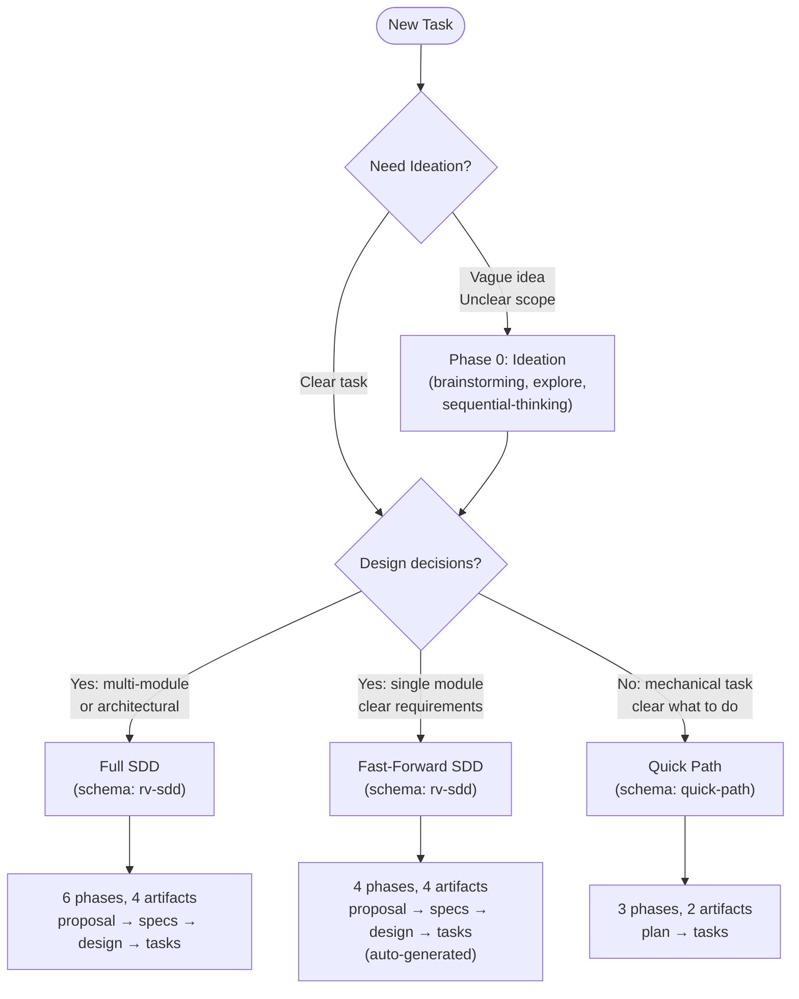
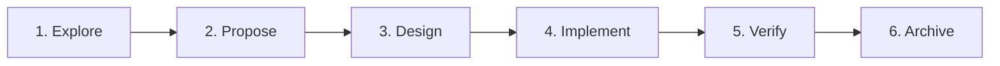
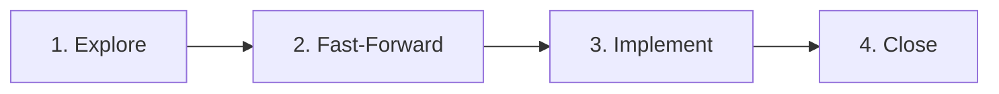
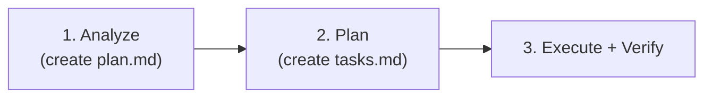
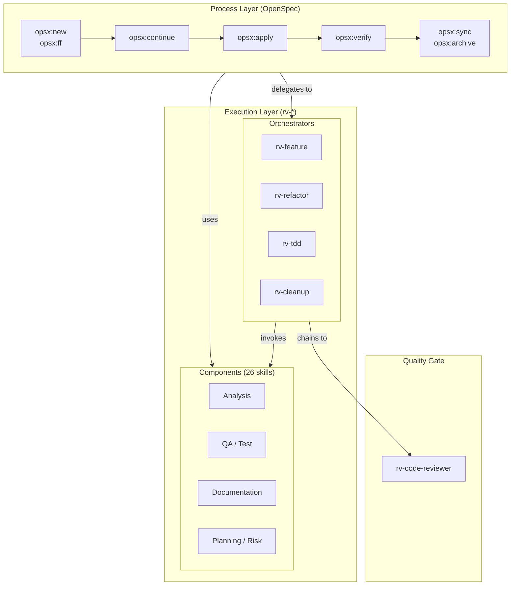

# RV-Android Development Workflow

Authoritative reference for the Spec-Driven Development (SDD) workflow used in RV-Android. This document defines how OpenSpec (process layer) and rv-* skills (execution layer) integrate into daily development.

**SDD approach**: RV-Android follows **spec-anchored SDD** — specs persist and document the system, but code remains the maintained artifact. The OpenSpec framework provides the process layer; rv-* skills provide the execution layer.

**Key principle**: The workflow is **fluid, not rigid**. Following OpenSpec's principle: "no phase gates, work on what makes sense." Artifact dependencies are enablers, not gates.

**Sources**: Martin Fowler (spec-anchored spectrum), Birgitta Böckeler (SDD: 3 Tools, 2026), ArXiv (Spec-Driven Development: From Code to Contract, 2026), GitHub Spec Kit, OpenSpec docs, ThoughtWorks Tech Radar.

---

## 1. Phase 0: Ideation

Before choosing a workflow track or writing any code, take time to understand what you want to build. This phase is about refining a vague idea ("I need Docker support") into a concrete, well-scoped task ("wire the existing resume architecture and create Docker entry point scripts"). Many costly mistakes — wrong track selection, incomplete scope assessment, missed module dependencies — happen because this step was skipped.

Phase 0 is informal and has no artifacts. It is a conversation between the researcher and the tools, aimed at answering three questions: **What exactly do I want to change?**, **Why does this change matter?**, and **What parts of the system are affected?**. Once these questions have clear answers, you move to Track Selection (Section 3).

### When to Use Phase 0

Phase 0 is recommended whenever the task is not immediately obvious. If the researcher says "fix the typo in line 42", there is nothing to ideate — go directly to Quick Path. But if the task involves any ambiguity, multiple possible approaches, or unclear scope, spending 10-15 minutes in Phase 0 prevents hours of wasted work in the wrong direction.

Examples that benefit from Phase 0:
- "I want to add resume support" — What does resume mean? At which level (task, experiment, container)? What already exists?
- "The coverage numbers are wrong" — Wrong how? Too high? Too low? For which spec set? Is this a bug or a measurement methodology issue?
- "We need to parallelize experiments" — Within a single machine? Across Docker containers? How many? What are the resource constraints?

### How to Ideate

Use the tools that match the depth of exploration needed. These are not sequential — pick whichever makes sense:

| Tool | When to Use | What It Does |
|------|-------------|--------------|
| `/opsx:explore` | You want to investigate the codebase while thinking through the approach | Opens explore mode — reads files, searches code, documents findings. Best for understanding what exists before deciding what to change. |
| `brainstorming` | You have a vague idea and need to refine requirements, discuss trade-offs, or consider multiple approaches | Structured ideation that explores user intent, requirements, and design alternatives before any implementation commitment. |
| `sequential-thinking` (MCP) | The problem is complex and requires step-by-step reasoning with potential backtracking | Chain-of-thought reasoning that can branch, revise, and converge on a solution. Best for problems where the full scope is not clear initially. |
| `/rv-planning` | You already understand the problem and want a concrete implementation plan | Creates a detailed plan document with task breakdown, risk assessment, and dependencies. Bridges ideation and execution. |
| `/rv-analyze-module` | You need to understand a specific module's architecture before proposing changes | Deep analysis of module structure, dependencies, and patterns. Persists findings to memory for future reference. |

### Phase 0 Output

Phase 0 has no formal output. Its purpose is to give the researcher enough understanding to:
1. **Describe the change in one sentence** — if you cannot summarize what you want to do, you are not ready to start
2. **Choose the right track** — Full SDD, Fast-Forward SDD, or Quick Path (see Section 3)
3. **Identify affected modules** — which modules will be modified, which will be read-only dependencies

If Phase 0 produces a technical analysis document (like `docs/20260212_plano_docker.md` for the resume-docker change), that document serves as reference material for the subsequent SDD phases — it is not an OpenSpec artifact, but it provides the context that makes the OpenSpec artifacts accurate and deep.

### Skipping Phase 0

Skip Phase 0 when:
- The task is trivial (typo fix, single-line change, adding a test)
- The task is already well-defined by someone else (e.g., a bug report with reproduction steps)
- You have done this exact type of change before and understand all implications

---

## 2. Backlog Management

Work items are tracked as GitHub Issues on `PAMunb/rvsec` and managed through a Kanban board at [GitHub Project #7](https://github.com/orgs/PAMunb/projects/7). Every non-trivial task starts as a GitHub Issue before entering the SDD workflow. This provides traceability from idea to implementation and ensures all work is visible.

### Issue Creation

New issues are created using one of five issue templates. Each template pre-assigns type and track labels and collects structured information (problem statement, affected domains, related FRs/NFRs, priority, acceptance criteria). The problem statement in the issue becomes the direct input for `/opsx:explore` or `/opsx:new` when the SDD workflow begins.

| Template | When to Use | Default Track |
|----------|-------------|---------------|
| **Feature** | New capability that does not exist yet | Full SDD |
| **Enhancement** | Improvement to an existing capability | FF SDD |
| **Bug** | Something is broken | Quick Path |
| **Refactoring** | Code improvement without behavior change | FF SDD |
| **Documentation** | Docs-only change | Quick Path |

Templates are located at `/rvsec/.github/ISSUE_TEMPLATE/` (repo root level).

### Kanban Board

The project board has five columns. New issues always land in "No Status" and must be manually triaged to "Backlog" before work begins:

| Column | Meaning | When to Move Here |
|--------|---------|-------------------|
| **No Status** | Issue just created, not yet triaged | Automatically when issue is created (GitHub default) |
| **Backlog** | Triaged, ready to be picked up | Manually after triage — move from "No Status" via board UI or `gh project item-edit` |
| **In Progress** | Any SDD phase is active (explore through implement) | When starting Phase 0 (ideation, before track selection) or Phase 1 of any track |
| **In Review** | Verification or PR review in progress | When entering Verify phase or when a PR is open |
| **Done** | Change archived and issue closed | When `/opsx:archive` completes or Quick Path verify passes |

**Important**: GitHub Projects automation does not reliably move cards between columns. New issues from `PAMunb/rvsec` are added to the board but land in **"No Status"**, not "Backlog". Closing issues does not automatically move cards to "Done" either. All column transitions must be managed manually by the researcher through the GitHub Projects web UI or via `gh project item-edit`.

### Cross-Referencing Convention

Bidirectional traceability links all artifacts to their originating issue:

| From | To | Mechanism |
|------|----|-----------|
| Issue -> Change directory | Active: `openspec/changes/gh<N>-<short-name>/`. Archived: `openspec/changes/archive/YYYY-MM-DD-gh<N>-<short-name>/` (date added by `openspec archive`) |
| Change -> Issue | Full/FF SDD: `proposal.md` header. Quick Path: `plan.md` header. Each includes `GitHub Issue: #N` |
| Issue -> Commits | Use `refs #N` during work, `closes #N` in the final commit |
| Issue -> PR | Include `Closes #N` in PR body |
| Issue -> Specs | Affected specs are listed in the issue body (domains checkboxes) |
| Kanban card -> Issue | Automatic (GitHub Projects links cards to issues) |

### How Claude Code Manages the Board

Claude Code manages issue **state** (open/closed) via MCP `issue_write`, and **board column** via `gh project item-edit` CLI.

**Protocol:**

| Moment | Action | Mechanism |
|--------|--------|-----------|
| Issue created | Appears in board as "No Status" | Automatic (GitHub Projects default behavior) |
| Triage | Move card from "No Status" to Backlog | `gh project item-edit` with Status → Backlog |
| Work starting | Move card to In Progress | `gh project item-edit` with Status → In Progress |
| Work in progress | Commits reference the issue | `refs #N` in commit messages |
| Work complete (single commit) | Close the issue via commit | `closes #N` in the final commit message |
| Work complete (already committed with `refs`) | Close the issue via MCP | `issue_write` with `state: "closed"`, `state_reason: "completed"` |
| Issue closed | Move card to Done | `gh project item-edit` with Status → Done |

**Rules:**
1. Use `refs #N` in intermediate commits during multi-commit work
2. Use `closes #N` in the final commit to auto-close the issue
3. If the final commit already used `refs #N`, close the issue explicitly via MCP after verification
4. After closing an issue, move the card to Done via `gh project item-edit`
5. New issues land in "No Status" — move to Backlog via `gh project item-edit` when triaged

**Board management via `gh` CLI:**

The `gh` CLI (`~/.local/bin/gh`) is authenticated and has `project` scope. Column transitions use `gh project item-edit` with the project's Status field:

```bash
# Project: PVT_kwDOAJRqj84BPHtv (PAMunb #7 "rvagent")
# Status field: PVTSSF_lADOAJRqj84BPHtvzg9n4kM
# Options: Backlog=efb2287e, In Progress=88b03dd2, In Review=eb8dfe26, Done=53305933

# Example: move item to Done
gh project item-edit --project-id PVT_kwDOAJRqj84BPHtv \
  --id <ITEM_ID> \
  --field-id PVTSSF_lADOAJRqj84BPHtvzg9n4kM \
  --single-select-option-id 53305933

# List items to find ITEM_ID:
gh project item-list 7 --owner PAMunb --format json
```

---

## 3. Workflow Track Selection

Not every change requires the full SDD ceremony. The guiding principle is: **use the minimum level of specification rigor that removes ambiguity for your context** (ArXiv, "Spec-Driven Development: From Code to Contract", 2026). Three tracks match change scope to workflow formality.

Birgitta Böckeler (Martin Fowler, 2026) documented a common anti-pattern: SDD tools that turn a small bug fix into "4 user stories with 16 acceptance criteria" — a "sledgehammer to crack a nut." When spec-kit generated numerous markdown files for a small feature, she observed: "in the same time it took me to run and review the spec-kit results I could have implemented the feature with plain AI-assisted coding." RV-Android avoids this trap by providing three tracks with decreasing ceremony, and by making the **distinguishing question** explicit: **does this change require design decisions that need spec artifacts (proposal, delta specs, design), or is it a mechanical task where a plan document suffices?**



### Selection Criteria

| Track | When to Use | Schema | Artifacts | Phases |
|-------|-------------|--------|-----------|--------|
| **Full SDD** | Design decisions needed + multi-module or architectural | `rv-sdd` | proposal → specs → design → tasks (step by step) | 6 |
| **Fast-Forward SDD** | Design decisions needed + single module, clear requirements | `rv-sdd` | proposal → specs → design → tasks (auto-generated via `/opsx:ff`) | 4 |
| **Quick Path** | No design decisions — mechanical task with clear plan | `quick-path` | plan → tasks | 3 |

### Decision Guide

The key question is whether the change requires **design decisions** — choices between alternatives that affect the system's behavior, interface, or architecture. If the answer to "what should I do?" is obvious and the only question is "where are all the places I need to touch?", that's Quick Path.

| Question | Answer → Track |
|----------|---------------|
| Does it introduce new behavior that must be documented in specs? | Yes → Full or FF SDD |
| Does it cross module boundaries with architectural implications? | Yes → Full SDD |
| Is it a single-module change with spec implications? | Yes → FF SDD |
| Does it remove/refactor without adding new documented behavior? | Yes → **Quick Path** |
| Is it a bug fix, cleanup, or documentation update? | Yes → **Quick Path** |
| Are requirements crystal clear and the task is mechanical? | Yes → **Quick Path** |

**Anti-pattern warning**: Do not select FF SDD or Full SDD based on **file count alone**. A change that touches 45 files but is purely mechanical (remove dead module references, update MODULES arrays, clean documentation) is Quick Path — the plan document captures everything needed. Creating proposal/delta-spec/design/tasks artifacts for such a change wastes time and produces specs that describe removal rather than design. The number of files determines whether to use **subagent orchestration** (Section 5), not which **workflow track** to follow.

When in doubt, start with Quick Path. You can escalate to a higher track if the change turns out to need design decisions.

### Schema Architecture

Each workflow track maps to an OpenSpec schema that defines which artifacts exist, their dependency graph, templates, and AI instructions. Schemas are project-local (version-controlled in `openspec/schemas/`) and override the built-in `spec-driven` schema from the OpenSpec package.

```
openspec/schemas/
├── rv-sdd/                          # Full/FF SDD: proposal → specs → design → tasks
│   ├── schema.yaml                  # Artifact definitions, dependencies, instructions
│   └── templates/
│       ├── proposal.md              # Proposal template (GitHub Issue ref, FR/NFR refs, impact)
│       ├── spec.md                  # Delta spec template (Purpose, Data Contracts, Invariants, Requirements)
│       ├── design.md                # Design template (Architecture, Mapping table, API Design, Error Handling)
│       └── tasks.md                 # Task list template (numbered groups, checkboxes)
└── quick-path/                      # Quick Path: plan → tasks
    ├── schema.yaml                  # Two artifacts only, no spec ceremony
    └── templates/
        ├── plan.md                  # Plan template (Context, Scope, File Inventory, Acceptance Criteria)
        └── tasks.md                 # Task list template (numbered groups, checkboxes, verification group)
```

**How schemas relate to `config.yaml`**: The project configuration (`openspec/config.yaml`) defines three layers of customization. The `context` field provides project-wide information (tech stack, principles, domains) injected into all artifacts regardless of schema. The `rules` field provides per-artifact constraints for artifacts not covered by schemas (e.g., ADRs). The `schema` field sets the default schema (`rv-sdd`). Artifact-specific rules for proposal, specs, design, and tasks are embedded in the schema instructions — not duplicated in `config.yaml`.

**Schema precedence** (highest to lowest):
1. CLI flag: `openspec new change "name" --schema quick-path`
2. Change metadata: `.openspec.yaml` in the change directory
3. Project config: `schema: rv-sdd` in `openspec/config.yaml`
4. Package default: `spec-driven` (built-in, not used by RV-Android)

**How it works in practice**:
- Full/FF SDD changes use the default `rv-sdd` schema — no flag needed: `openspec new change "gh<N>-name"`
- Quick Path changes specify the schema explicitly: `openspec new change "gh<N>-name" --schema quick-path`
- Once created, the `.openspec.yaml` in the change directory records the schema, so subsequent commands (`openspec status`, `openspec instructions`, `openspec archive`) resolve it automatically

**Customizing schemas**: Fork or edit the schema files directly. Validate with `openspec schema validate rv-sdd`. Templates use HTML comments (`<!-- ... -->`) as AI guidance. Instructions use YAML block scalars (`|`) with RV-Android conventions (P1-P4 principles, INV-XX-NN format, WHEN/THEN/AND scenarios, FR/NFR references). See `openspec/schemas/*/schema.yaml` for the full instruction text.

---

## 4. Development Principles

These four principles apply to all workflow tracks and all artifact types. They are binding — not suggestions or aspirational goals. Every code change, every spec, every design document, and every comment must conform to these principles. They are also documented in `CLAUDE.md` under "Development Principles" with implementation-level details.

### P1: Simplicity

The system must be as simple and elegant as possible. Follow established best practices. Do not add unnecessary complexity, premature abstractions, or speculative features. The right amount of complexity is the minimum needed for the current task. Three similar lines of code are better than a premature abstraction. A direct function call is better than an event-driven indirection when only one subscriber exists.

This principle applies to code, to specs (do not over-specify), to design documents (do not over-architect), and to the workflow itself (use Quick Path when Full SDD is not needed).

### P2: Human-Readable Documentation

The target audience for all artifacts is **humans** — developers and researchers who need to understand, maintain, and extend the system. Specs, design docs, proposals, and code comments must be deep, narrative, and explanatory. The reader must have all information needed to implement or review a change without ambiguity or external context.

Requirements and invariant descriptions must be self-contained. Scenarios must be precise with concrete values (WHEN/THEN/AND format). When a behavior has a non-obvious reason (performance, historical constraint from the ICST study, compatibility with an external tool), explain that reason inline. A developer reading any single artifact in isolation must be able to understand it fully.

This principle is the reason why delta specs in Full SDD use multi-paragraph narrative descriptions rather than telegraphic bullet points — the cognitive cost of misinterpretation during implementation far exceeds the cost of writing a longer explanation.

### P3: No Backward Compatibility

RV-Android evolves through **complete replacements**, never through backward-compatible adaptations. When code is dead, abandoned, or superseded, it is deleted entirely. No adapters, wrappers, shims, deprecation annotations, compatibility re-exports, commented-out blocks, or `# removed` comments are created.

During the implementation phase (Phase 4 in Full SDD, Phase 3 in FF SDD/Quick Path):
- Dead code identified in REMOVED sections of delta specs must be **deleted**, not deprecated or commented out
- Old files must be backed up to `backup/` before replacement (safety net, not compatibility mechanism)
- All imports and references must be updated — grep the codebase to confirm zero dangling references
- After the commit, the codebase must be in a consistent state with no vestiges of the old approach

### P4: Current-State Comments

Comments and naming must reflect the **current state of the system only**. They must not describe migration history, previous implementations, what was removed, or how things used to work. No promotional or bias language: avoid "modern", "sophisticated", "elegant", "state-of-the-art", "cutting-edge", "advanced". The target audience evaluates systems on technical merit, not marketing claims.

This applies to code comments, docstrings, spec descriptions, design documents, and commit messages. If historical context is needed, reference the thesis, ICST paper, or a design document — do not embed history in code.

---

## 5. Context Management: Subagent Orchestration

Complex changes (20+ files, multiple modules) consume the main context window rapidly. Context compaction mid-implementation causes loss of state, forcing re-analysis and reducing the probability of completing the change successfully in a single session. This section defines how to use subagents to keep the main context window lean and focused on orchestration.

### The Principle

The main context window acts as a **thin orchestrator**. It holds the plan, dispatches work to subagents, collects their summaries, and runs final verification. Subagents handle the actual file reading, editing, and analysis in their own isolated context windows. When a subagent finishes, its context is discarded — only the summary returns to the main window.

```
Main Window (orchestrator):
├── Reads plan / tasks.md
├── Groups tasks by independence and locality
├── Dispatches subagent per group (parallel when independent)
├── Collects summaries (minimal context consumed)
├── Runs final verification (tests, grep, lint)
└── Commits
```

This pattern works because most implementation tasks are **embarrassingly parallel** — editing constants.py in rv-experiment has no dependency on editing README.md or moving directories to backup. The main window does not need to hold the contents of 45 files simultaneously; it only needs to know which groups succeeded and which need attention.

### When to Use Subagents

| Situation | Subagent? | Rationale |
|-----------|-----------|-----------|
| Implementation phase with 3+ independent task groups | Yes | Each group runs in its own context |
| Documentation updates touching 5+ files | Yes | Doc edits are independent and verbose |
| Deep codebase exploration (Explore phase) | Yes | Exploration produces voluminous output that pollutes the main context |
| Phase 6 Archive (spec sync + doc sync) | Yes | Spec and doc sync are independent |
| Quick Path with 1-3 files | No | Overhead of subagent dispatch exceeds benefit |
| Tasks with strict sequential dependency | No | Subagent N+1 needs the exact output of subagent N |
| Single-file edit | No | Direct edit is faster |

### How to Dispatch Subagents

**What to pass to each subagent**:
- The plan file path or inline task description with acceptance criteria
- The specific file list (paths + line numbers when available)
- Any constants or conventions needed (e.g., "use `backup/` not `deleted/`")
- The development principles (P1-P4) if the subagent writes docs or comments

**What NOT to pass**:
- The entire conversation history (subagent has its own clean context)
- Unrelated context from other task groups
- Verbose exploration results from Phase 1

**What to expect back**:
- A concise summary: files changed, what was done, any issues encountered
- The main window does NOT re-read every file the subagent edited

### Task Grouping Strategy

Group tasks for subagent dispatch using two criteria:

1. **Independence**: Tasks that share no files and have no ordering dependency go to separate subagents (can run in parallel)
2. **Locality**: Tasks that touch files in the same module or directory go to the same subagent (avoids merge conflicts and leverages shared context)

**Sizing**: Each subagent should handle 3-15 files. Fewer than 3 is overhead; more than 15 risks compaction within the subagent itself.

### Example: 45-File Refactoring Change

This is the pattern for the "Remove Discontinued LLM Modules" change (see `docs/20260213_remover_modulos.md`):

```
Main Window:
├── Read plan (1 file)
├── Subagent 1 (Bash): Groups A+B — move dirs and scripts to backup/
├── Subagent 2 (general-purpose): Group C — edit pyproject.toml files, run uv lock
├── Subagent 3 (general-purpose): Group D — clean rv-experiment Python source (7 files)
├── Subagent 4 (general-purpose): Group E — update shell script MODULES arrays (3 files)
├── Subagent 5 (general-purpose): Group F — Docker cleanup (1 file)
├── Subagent 6 (general-purpose): Groups G+H — update all docs/specs/skills (17 files)
├── Verification: uv sync, pytest, grep for dead references
└── Commit
```

Subagents 1-2 must run before 3-6 (file moves and pyproject changes are prerequisites). Subagents 3-6 are independent and can run in parallel.

---

## 6. Full SDD Workflow

For changes that cross module boundaries or introduce new capabilities. Each phase produces artifacts reviewed before advancing.



### Phase Details

#### Phase 1: Explore

**Goal**: Understand the problem and assess impact before committing to a solution.

| Aspect | Detail |
|--------|--------|
| **OpenSpec skill** | `/opsx:explore` |
| **RV skills** | `/rv-analyze-module`, `/rv-impact-analyzer`, `/rv-analyze-dependencies` |
| **Outputs** | Understanding of the problem, affected modules, risk assessment |
| **Exit criteria** | Clear understanding of scope and affected areas |

**What to do**:
1. Run `/rv-analyze-module <module>` on the primary affected module
2. Run `/rv-impact-analyzer <target>` to assess change impact across modules
3. Run `/rv-analyze-dependencies <module>` when the change affects cross-module interfaces — maps the dependency graph to inform the proposal
4. Run `/opsx:explore` to think through the approach and document findings
5. If the change is smaller than expected, consider downgrading to Fast-Forward or Quick Path

#### Phase 2: Propose

**Goal**: Create a formal change proposal with delta spec outlines.

| Aspect | Detail |
|--------|--------|
| **OpenSpec skill** | `/opsx:new` then `/opsx:continue` (x2 for proposal + spec deltas) |
| **RV skills** | -- |
| **Outputs** | `proposal.md` with problem statement, approach, affected specs; initial delta spec outlines |
| **Exit criteria** | Proposal reviewed, approach agreed upon |

**What to do**:
1. Run `/opsx:new <change-name>` to create the change directory and initial proposal
2. Run `/opsx:continue` to refine the proposal with delta spec outlines
3. Run `/opsx:continue` again to complete spec deltas
4. Review the proposal before advancing

#### Phase 3: Design

**Goal**: Write design document and task list.

| Aspect | Detail |
|--------|--------|
| **OpenSpec skill** | `/opsx:continue` (x2 for design + tasks) |
| **RV skills** | `/rv-doc-adr` (if architectural decision needs recording), `/rv-risk` (if risks need assessment) |
| **Outputs** | `design.md` with implementation plan; `tasks.md` with ordered task list |
| **Exit criteria** | Design reviewed, tasks are clear and scoped for single sessions |

**What to do**:
1. Run `/opsx:continue` to generate the design document
2. Run `/opsx:continue` again to generate the task list
3. If making an architectural decision, run `/rv-doc-adr` to record it
4. Run `/rv-risk <change-name>` when the design involves new dependencies, external APIs, or multi-module coordination — produces a risk register with mitigation strategies
5. Annotate tasks with explicit `/rv-*` skill invocations where relevant (see Section 9: Skill Annotations in tasks.md)
6. Review: each task should be completable in one Claude Code session

#### Phase 4: Implement

**Goal**: Execute tasks from `tasks.md`.

| Aspect | Detail |
|--------|--------|
| **OpenSpec skill** | `/opsx:apply` |
| **RV skills** | `/rv-test-run`, `/rv-test-add`, `/rv-doc-code`, `/rv-qa-lint-fix`, `/rv-verify` |
| **Quality gate** | `rv-code-reviewer` (via Task tool) |
| **Outputs** | Implemented code changes, tests |
| **Exit criteria** | All tasks complete, tests passing, code review passed |

**What to do**:
1. Run `/opsx:apply` to begin executing tasks
2. For each task group, use component skills directly — OpenSpec artifacts already cover the analysis, planning, and design that orchestrators would redo:
   - Write tests first, then implementation (TDD discipline from tasks.md test cases)
   - Use `/rv-test-run` after each group to verify
   - Use `/rv-doc-code` for new modules/classes (as annotated in tasks.md)
   - Use `/rv-verify` for final verification
3. After all task groups, invoke `rv-code-reviewer` for code review via the Task tool:
   ```
   Task tool: subagent_type=rv-code-reviewer, prompt="Review [change-name] implementation"
   ```

**Subagent orchestration** (see Section 5): When `tasks.md` has 3+ independent task groups touching 20+ files total, dispatch each group to a subagent. The main window reads the plan, dispatches subagents (parallel when independent, sequential when dependent), collects summaries, and runs final verification. This prevents context compaction mid-implementation.

#### Phase 5: Verify

**Goal**: Run all checks and validate implementation against specs.

| Aspect | Detail |
|--------|--------|
| **OpenSpec skill** | `/opsx:verify` |
| **RV skills** | `/rv-verify` |
| **Outputs** | Verification report, all tests passing |
| **Exit criteria** | Tests pass, lint clean, types check, specs match implementation |

**What to do**:
1. Run `/rv-verify <module>` to run tests + lint + type checks
2. Run `/opsx:verify` to validate implementation matches the spec deltas
3. Fix any issues found, re-verify

#### Phase 6: Archive

**Goal**: Sync delta specs to main specs, archive the change, update docs.

| Aspect | Detail |
|--------|--------|
| **OpenSpec skill** | `/opsx:archive` (or `/opsx:sync` + `/opsx:archive --skip-specs` for manual review) |
| **RV skills** | `/rv-docs-sync` |
| **Outputs** | Updated main specs, archived change, synced documentation |
| **Exit criteria** | Specs up to date, change archived, docs consistent |

**What to do**:
1. Run `/opsx:archive` to sync delta specs to main specs AND archive the completed change in a single step
2. Run `/rv-docs-sync` if CLAUDE.md or other docs need updating

**Alternative** (for manual review of the spec merge): Run `/opsx:sync` first to merge delta specs — review the result — then run `/opsx:archive --skip-specs` to archive without re-syncing. Use this when the delta-to-main merge is complex and you want to inspect the merged specs before archiving.

**Subagent orchestration** (see Section 5): When documentation updates touch 5+ files (specs, CLAUDE.md, README, skills), delegate the doc sync to a subagent. The main window handles `/opsx:archive` (lightweight), while the subagent handles the bulk file edits.

**Optional**: Run `/rv-retrospective` to capture process learnings from this change cycle. Particularly valuable for changes that required deviation from the planned approach or encountered unexpected blockers.

**Closing protocol** (details in Section 2): Commit with `closes #N` in the final commit message (or close the issue via MCP if already committed with `refs #N`). Move the Kanban card to Done. For changes submitted as PRs, include `Closes #N` in the PR body and move the card to In Review until merged.

---

## 7. Fast-Forward SDD Workflow

For single-module changes with clear requirements. `/opsx:ff` generates all planning artifacts at once, skipping the step-by-step proposal/design/tasks phases.



### Phase Details

#### Phase 1: Explore

**Goal**: Quick analysis of the problem.

| Aspect | Detail |
|--------|--------|
| **Skills** | `/opsx:explore` or `/rv-analyze-module` |
| **Outputs** | Understanding of the change needed |
| **Exit criteria** | Requirements are clear, single module confirmed |

#### Phase 2: Fast-Forward

**Goal**: Generate all planning artifacts at once.

| Aspect | Detail |
|--------|--------|
| **Skills** | `/opsx:ff` |
| **Outputs** | proposal.md, delta specs, design.md, tasks.md (all auto-generated) |
| **Exit criteria** | Artifacts generated, quick review confirms correctness |

#### Phase 3: Implement

**Goal**: Execute tasks.

| Aspect | Detail |
|--------|--------|
| **Skills** | `/opsx:apply` + component skills (`/rv-test-run`, `/rv-doc-code`, `/rv-verify`) + `rv-code-reviewer` |
| **Outputs** | Implemented code changes, tests |
| **Exit criteria** | All tasks complete, tests passing, code review passed |

**Subagent orchestration** (see Section 5): Same pattern as Full SDD Phase 4. For changes with multiple independent task groups, dispatch each to a subagent from the main window.

#### Phase 4: Close

**Goal**: Verify, sync specs, and archive in one phase.

| Aspect | Detail |
|--------|--------|
| **Skills** | `/rv-verify` + `/opsx:verify` + `/opsx:archive` |
| **Outputs** | Verification report, updated specs, archived change |
| **Exit criteria** | All checks pass, specs synced, change archived |

**Optional**: Run `/rv-retrospective` to capture process learnings, especially if the fast-forward artifacts needed significant revision during implementation.

**Closing protocol** (details in Section 2): Commit with `closes #N` in the final commit message (or close the issue via MCP if already committed with `refs #N`). Move the Kanban card to Done. For changes submitted as PRs, include `Closes #N` in the PR body and move the card to In Review until merged.

---

## 8. Quick Path

For changes that do not require design decisions — the task is clear, the plan is mechanical, and the only question is execution. Quick Path covers bug fixes, dead code removal, refactoring, test additions, documentation updates, and any multi-file cleanup where requirements are unambiguous.

**Important**: Quick Path is not limited to small changes. A 45-file dead module removal is Quick Path if the plan is clear and no design decisions are needed. File count determines whether to use **subagent orchestration** (Section 5), not which workflow track to follow.

**Schema**: Quick Path uses the `quick-path` schema, which defines two artifacts: `plan` and `tasks`. This separates analysis (understanding the problem) from execution (doing the work), and gives OpenSpec a `tasks.md` to track progress — the same mechanism used by Full/FF SDD.

### Change Directory

Quick Path changes get a change directory in `openspec/changes/` with two artifacts: `plan.md` (analysis) and `tasks.md` (execution). This provides traceability (linked to GitHub Issue), progress tracking via checkboxes, and a consistent archive location across all tracks.

```
openspec/changes/gh<N>-short-name/
├── .openspec.yaml   # schema: quick-path
├── plan.md          # Analysis: context, scope, file inventory, acceptance criteria
└── tasks.md         # Execution: trackable checkboxes, grouped for subagent dispatch
```

The `plan.md` is created during the Analyze phase. For trivial changes (typo fix, single-line edit), the plan can be a few lines. For larger mechanical changes, it includes a complete file inventory with line numbers (e.g., the 310-line plan from `gh2-remove-llm-modules`). The `tasks.md` is created during the Plan phase — it extracts execution items from the plan into trackable checkboxes. For trivial changes, tasks.md can be 2-3 checkboxes. For large changes, it organizes tasks into groups for subagent dispatch.

**Cross-referencing**: The directory name includes the GitHub Issue number (`gh<N>`). The `plan.md` header includes `GitHub Issue: #N`. Commits use `refs #N` during work and `closes #N` in the final commit.

**Creating the change**: Use `openspec new change "gh<N>-short-name" --schema quick-path` to create the directory with the `quick-path` schema. The `.openspec.yaml` will contain `schema: quick-path`, and `openspec status` / `openspec instructions` will understand the plan → tasks workflow.



### Phase Details

#### Phase 1: Analyze

**Goal**: Understand the issue and create the plan.

| Aspect | Detail |
|--------|--------|
| **Skills** | `/rv-analyze-module`, `/rv-analyze-file`, `/rv-debug-regression`, `/rv-analyze-dead-code`, or direct code reading |
| **OpenSpec** | `openspec new change "gh<N>-name" --schema quick-path`, then `openspec instructions plan --change "gh<N>-name"` |
| **Outputs** | `plan.md` in `openspec/changes/` with context, scope, file inventory, and acceptance criteria |
| **Exit criteria** | Clear path to the fix, all affected files identified |

**What to include in `plan.md`**:
- Header: change name, date, track (Quick Path), priority, GitHub Issue link, affected domains
- Context: why this change is needed
- Scope: what modules/files are affected
- File inventory: exact files and line numbers when possible
- Execution order: which groups depend on which, which can run in parallel
- Acceptance criteria: how to verify the change is complete (verification steps, not execution tasks)

#### Phase 2: Plan

**Goal**: Extract execution tasks from the plan into a trackable checklist.

| Aspect | Detail |
|--------|--------|
| **OpenSpec** | `openspec instructions tasks --change "gh<N>-name"` |
| **Outputs** | `tasks.md` with grouped, numbered checkboxes |
| **Exit criteria** | Every file/action from the plan inventory is covered by a task |

**What to include in `tasks.md`**:
- Numbered groups matching plan sections (e.g., "1. Prerequisites", "2. Source Cleanup")
- Each task as a checkbox: `- [ ] X.Y Task description`
- Tasks ordered by dependency (prerequisite groups first)
- For large changes (20+ files): groups annotated for subagent dispatch (e.g., "parallel — subagent")
- Explicit `/rv-*` skill invocations as tasks where relevant (see Section 9: Skill Annotations in tasks.md)
- A final "Verification" group with test and acceptance criteria checks

For trivial changes (typo fix, single-file edit), tasks.md can be as short as:
```
## 1. Fix
- [ ] 1.1 Fix the typo in README.md

## 2. Verify
- [ ] 2.1 Check formatting
```

#### Phase 3: Execute + Verify

**Goal**: Implement the change and confirm it works.

| Aspect | Detail |
|--------|--------|
| **OpenSpec** | `openspec instructions apply --change "gh<N>-name"` |
| **Skills** | `/rv-tdd` (test-first), `/rv-refactor`, `/rv-cleanup`, or direct edit |
| **Verification** | `/rv-verify` or `/rv-test-run` |
| **Outputs** | Code changes, tests passing, acceptance criteria met |
| **Exit criteria** | All tasks checked off, all acceptance criteria from `plan.md` met |

**Subagent orchestration** (see Section 5): When tasks.md has 3+ independent groups or touches 20+ files, dispatch each group to a subagent. The main window reads the plan, dispatches, collects summaries, and runs final verification.

After verification, archive the change with `openspec archive "gh<N>-name" --skip-specs` (Quick Path changes have no delta specs to sync) and close the GitHub Issue.

**Optional**: Run `/rv-retrospective` for changes that revealed workflow improvements or recurring patterns worth documenting.

**Closing protocol** (details in Section 2): Commit with `closes #N` in the final commit message (or close the issue via MCP if already committed with `refs #N`). Move the Kanban card to Done.

---

## 9. Skill Architecture

The skill system has three layers with unidirectional flow. The Process Layer (OpenSpec) invokes the Execution Layer (rv-*), never the reverse.



### Skill Design Principles

These are architectural principles for the skill system itself. For the development principles that govern all code and documentation (simplicity, human-readable docs, no backward compatibility, current-state comments), see **Section 4: Development Principles**.

1. **Unidirectional flow**: Process Layer (OpenSpec) invokes Execution Layer (rv-*). Never the reverse. This keeps rv-* skills reusable independently of OpenSpec.

2. **Separation of concerns**: OpenSpec manages the change lifecycle (what and why). rv-* skills handle technical execution (how). Each skill has a single responsibility.

3. **Orchestrator / Component hierarchy**: Orchestrators manage multi-phase workflows with user checkpoints and code review gates. Components perform focused, single tasks. Orchestrators invoke components; components do not invoke orchestrators.

4. **Proportional ceremony**: Match workflow formality to change scope. Full SDD for traceability; Quick Path for speed.

5. **Fluid, not rigid**: Following OpenSpec's principle — artifact dependencies are enablers, not gates. Work on what makes sense at each point. Refine artifacts as you learn during implementation.

### Complete Skill Inventory

#### Process Layer: OpenSpec Skills (10)

| Skill | Purpose | Used In |
|-------|---------|---------|
| `/opsx:explore` | Think through approach, explore problem space | Full SDD (Phase 1), FF SDD (Phase 1) |
| `/opsx:new` | Create new change with proposal | Full SDD (Phase 2) |
| `/opsx:ff` | Fast-forward: generate all artifacts at once | FF SDD (Phase 2) |
| `/opsx:continue` | Advance to next artifact (specs, design, tasks) | Full SDD (Phases 2-3) |
| `/opsx:apply` | Execute tasks from tasks.md | Full SDD (Phase 4), FF SDD (Phase 3) |
| `/opsx:verify` | Validate implementation against specs | Full SDD (Phase 5), FF SDD (Phase 4) |
| `/opsx:sync` | Sync delta specs to main specs | Full SDD (Phase 6) |
| `/opsx:archive` | Archive completed change | Full SDD (Phase 6), FF SDD (Phase 4) |
| `/opsx:bulk-archive` | Archive multiple completed changes | Maintenance |
| `/opsx:onboard` | Onboard to the SDD workflow | First-time setup |

#### Execution Layer: Orchestrators (4)

| Orchestrator | Purpose | Chains To |
|-------------|---------|-----------|
| `/rv-feature` | Multi-phase feature implementation | `rv-code-reviewer` |
| `/rv-refactor` | Code restructuring workflow | `rv-code-reviewer` |
| `/rv-tdd` | Test-driven development workflow | `rv-code-reviewer` |
| `/rv-cleanup` | Dead code removal workflow | `rv-code-reviewer` |

#### Execution Layer: Components — Analysis (5)

| Skill | Purpose |
|-------|---------|
| `/rv-analyze-module` | Deep analysis of a module (persists to memory) |
| `/rv-analyze-file` | Analyze a specific file |
| `/rv-analyze-complexity` | Find complexity hotspots |
| `/rv-analyze-dependencies` | Check dependency health across modules |
| `/rv-analyze-dead-code` | Find unused code |

#### Execution Layer: Components — Testing and QA (5)

| Skill | Purpose |
|-------|---------|
| `/rv-test-run` | Run tests for a module |
| `/rv-test-add` | Add tests for a function or class |
| `/rv-verify` | Run all checks: tests + lint + type checking |
| `/rv-qa-lint` | Run linter, report issues |
| `/rv-qa-lint-fix` | Run linter and auto-fix issues |

#### Execution Layer: Components — Refactoring (4)

| Skill | Purpose |
|-------|---------|
| `/rv-refactor-simplify` | Simplify complex code |
| `/rv-refactor-extract` | Extract components or functions |
| `/rv-refactor-cleanup` | Remove dead code, clean imports |
| `/rv-refactor-constants` | Extract magic values to constants |

#### Execution Layer: Components — Documentation (6)

| Skill | Purpose |
|-------|---------|
| `/rv-doc-generate-claude-md` | Generate or update CLAUDE.md |
| `/rv-doc-code` | Generate/audit code documentation (docstrings + inline comments) |
| `/rv-docs-sync` | Sync documentation with code changes |
| `/rv-doc-adr` | Record architectural decision |
| `/rv-doc-architecture` | Generate architecture documentation |
| `/rv-doc-readme` | Generate or update README |

#### Execution Layer: Components — Planning and Risk (5)

| Skill | Purpose |
|-------|---------|
| `/rv-impact-analyzer` | Assess change impact across modules |
| `/rv-debug-regression` | Investigate regression bugs via git history |
| `/rv-planning` | Plan implementation approach |
| `/rv-risk` | Risk assessment for changes |
| `/rv-retrospective` | Post-change retrospective |

#### Execution Layer: Components — Other (2)

| Skill | Purpose |
|-------|---------|
| `/rv-security` | Security review |
| `/rv-release` | Release preparation |

#### Quality Gate (1 agent)

| Agent | Purpose |
|-------|---------|
| `rv-code-reviewer` | Automatic code review at the end of orchestrator workflows |

**Total**: 10 OpenSpec + 4 orchestrators + 27 components + 1 agent = **42 skills + 1 agent**

### Skill Annotations in tasks.md

Task lists (`tasks.md`) SHOULD include explicit `/rv-*` skill invocations as trackable checkbox items. This makes the implementation workflow reproducible — any developer or AI session can follow the tasks and know exactly which skills to invoke at each step, with what arguments, following the skill's templates and checklists.

All rv-* skills have `context: fork` — they run as subagents with isolated context. Invoking them from tasks does not consume main window context.

#### Convention

Add skill invocation tasks at the end of each group where a skill adds value. Format:

```
- [ ] X.N Run `/rv-doc-code modules/rv-agent/src/rv_agent/services/new_service.py`
```

#### Common Patterns

| When | Skill | Purpose |
|------|-------|---------|
| After creating a new Python module or class | `/rv-doc-code <file-path>` | Generate docstrings + inline comments following templates |
| After adding complex functions to existing file | `/rv-doc-code <file-path>` | Audit and complete documentation |
| After completing a test group | `/rv-test-run <module>` | Verify tests pass |
| Final verification (all groups done) | `/rv-verify <module>` | Tests + lint + type checks |
| After modifying many files | `/rv-qa-lint-fix <module>` | Auto-fix formatting and imports |

#### When NOT to Annotate

- **Trivial groups**: Single-line config change, simple field addition — no skill needed
- **Test-only groups**: Test files don't need `/rv-doc-code` (test names are self-documenting)
- **Orchestrator skills per group**: Do not annotate `/rv-tdd`, `/rv-feature`, `/rv-refactor`, `/rv-cleanup` per task group — their analysis/planning phases duplicate what OpenSpec artifacts already cover (see "Orchestrators vs Component Skills" below). Use component skills in tasks.md instead.
- **Redundant verification**: If the group already has "Run `uv run pytest ...`" as a task, don't add `/rv-test-run` — the explicit command is equivalent

### Orchestrators vs Component Skills in OpenSpec Workflows

Orchestrators (`/rv-tdd`, `/rv-feature`, `/rv-refactor`, `/rv-cleanup`) have multi-phase workflows that include analysis, planning, and user checkpoints. These phases overlap with OpenSpec's proposal → specs → design → tasks workflow. No orchestrator supports a `--skip-analysis` or `--from-plan` flag.

**Phase overlap:**

| Orchestrator | Phases that duplicate OpenSpec | Unique value |
|-------------|-------------------------------|--------------|
| `/rv-tdd` | Analysis, Test Planning, Checkpoint | RED→GREEN→REFACTOR discipline, code review chain |
| `/rv-feature` | Discovery, Design, Approach Selection, Planning, Checkpoint | TDD implementation, code review chain |
| `/rv-refactor` | Analysis, Planning, Checkpoint | Backup→refactor→test loop, code review chain |
| `/rv-cleanup` | Analysis, Planning, Checkpoint | Backup→remove→verify→rollback loop, code review chain |

**Guidelines by context:**

| Context | Use Orchestrators? | Use Component Skills? | Code Review |
|---------|--------------------|-----------------------|-------------|
| Full SDD Phase 4 | No — duplicates OpenSpec | Yes — tasks.md annotations | `rv-code-reviewer` via Task tool |
| FF SDD Phase 3 | No — duplicates OpenSpec | Yes — tasks.md annotations | `rv-code-reviewer` via Task tool |
| Quick Path Phase 3 | Optional — adds structure | Yes — for specific tasks | Chained by orchestrator, or `rv-code-reviewer` via Task tool |
| No OpenSpec (ad-hoc) | Yes — provides full workflow | Used within orchestrator | Chained by orchestrator |

**In Full SDD and FF SDD changes**: Use component skills directly in tasks.md. The OpenSpec artifacts have already completed the analysis (proposal.md), design (design.md), and planning (tasks.md) that orchestrators would redo. TDD discipline comes from following the test cases in tasks.md. Code review comes from invoking `rv-code-reviewer` independently after all task groups.

**In Quick Path changes**: Orchestrators are appropriate when the change benefits from their structured workflow — especially `/rv-tdd` for bug fixes (ensures tests-first discipline) and `/rv-cleanup` for dead code removal (ensures backup-verify-rollback safety). Quick Path's `plan.md` is lightweight compared to Full SDD's 4 artifacts, so the orchestrator's analysis phase adds value rather than duplicating existing work.

**Standalone use (no OpenSpec)**: Orchestrators are designed for ad-hoc development without OpenSpec pre-planning. When invoked directly (e.g., `/rv-tdd some-feature`), they provide the full analysis → planning → implementation → review workflow.

---

## 10. Quick Reference: Common Scenarios

Sequences below show the key skills for each scenario. All tracks start with change creation (`openspec new change` for rv-sdd, `openspec new change --schema quick-path` for Quick Path) and end with verification + archive. See Sections 6-8 for complete phase-by-phase detail.

| Scenario | Track | Schema | Key Skills |
|----------|-------|--------|------------|
| New feature in rv-agent | Full SDD | `rv-sdd` | `opsx:explore` -> `opsx:new` -> `opsx:continue` (x4) -> `opsx:apply` (w/ component skills) -> `rv-verify` -> `rv-code-reviewer` -> `opsx:verify` -> `opsx:archive` |
| Add config option to module | FF SDD | `rv-sdd` | `rv-analyze-file` -> `opsx:ff` -> `opsx:apply` (w/ component skills) -> `rv-verify` -> `rv-code-reviewer` -> `opsx:verify` -> `opsx:archive` |
| Refactor module internals | Quick | `quick-path` | `rv-analyze-module` -> plan.md -> tasks.md -> `rv-refactor` -> `rv-verify` -> `archive --skip-specs` |
| Fix a bug | Quick | `quick-path` | `rv-debug-regression` -> plan.md -> tasks.md -> `rv-tdd` -> `rv-verify` -> `archive --skip-specs` |
| Add tests to existing code | Quick | `quick-path` | plan.md -> tasks.md -> `rv-test-add` -> `rv-test-run` -> `archive --skip-specs` |
| Remove dead code / modules | Quick | `quick-path` | `rv-analyze-dead-code` -> plan.md -> tasks.md -> `rv-cleanup` (w/ subagents if 20+ files) -> `rv-verify` -> `archive --skip-specs` |
| Architectural change | Full SDD | `rv-sdd` | `opsx:explore` -> `opsx:new` -> `opsx:continue` (x4) -> `rv-doc-adr` -> `opsx:apply` (w/ component skills) -> `rv-verify` -> `rv-code-reviewer` -> `opsx:verify` -> `opsx:archive` |
| Add a new module | Full SDD | `rv-sdd` | `opsx:explore` -> `opsx:new` -> `opsx:continue` (x4) -> `opsx:apply` (w/ component skills) -> `rv-verify` -> `rv-code-reviewer` -> `opsx:verify` -> `opsx:archive` |
| Optimize performance | FF SDD | `rv-sdd` | `rv-analyze-complexity` -> `opsx:ff` -> `opsx:apply` (w/ component skills) -> `rv-verify` -> `rv-code-reviewer` -> `opsx:verify` -> `opsx:archive` |
| Fix lint issues | Quick | `quick-path` | plan.md -> tasks.md -> `rv-qa-lint-fix` -> `rv-test-run` -> `archive --skip-specs` |
| Large mechanical cleanup (45 files) | Quick | `quick-path` | plan.md -> tasks.md -> subagent dispatch -> `rv-verify` -> `archive --skip-specs` |
| Update docs across modules | Quick | `quick-path` | plan.md -> tasks.md -> subagent dispatch -> `rv-verify` -> `archive --skip-specs` |

---

## 11. Workflow Examples

### Example 1: Full SDD — Adding scroll detection to rv-agent

This is a multi-module change (rv-agent + rv-screen-parser) introducing new capability.

```
# Phase 1: Explore
/rv-analyze-module rv-agent            # Understand current UI parsing
/rv-analyze-module rv-screen-parser    # Understand screen parser
/rv-impact-analyzer scroll-detection   # Assess impact
/opsx:explore                          # Document findings

# Phase 2: Propose
/opsx:new add-scroll-detection         # Create change, write proposal
/opsx:continue                         # Write delta specs for rv-agent
/opsx:continue                         # Write delta specs for rv-screen-parser

# Phase 3: Design
/opsx:continue                         # Generate design doc
/opsx:continue                         # Generate task list

# Phase 4: Implement
/opsx:apply                            # Execute tasks
  # Use component skills directly (OpenSpec already did analysis/design):
  # Write tests first, then implementation (TDD discipline from tasks.md)
  # /rv-test-run, /rv-doc-code, /rv-verify as annotated in tasks.md
  # Chain rv-code-reviewer at the end via Task tool

# Phase 5: Verify
/rv-verify rv-agent                    # Tests + lint + types
/rv-verify rv-screen-parser            # Tests + lint + types
/opsx:verify                           # Check against spec deltas

# Phase 6: Archive
/opsx:sync                             # Merge deltas into main specs
/opsx:archive                          # Archive completed change
/rv-docs-sync                          # Update docs
```

### Example 2: Fast-Forward SDD — Adding a config option to rv-agent

Single module, clear requirements: add `max_scroll_attempts` to RVAgentConfig.

```
# Phase 1: Explore
/rv-analyze-file modules/rv-agent/src/rv_agent/config.py  # Check current config

# Phase 2: Fast-Forward
/opsx:ff add-max-scroll-config         # Generate all artifacts at once

# Phase 3: Implement
/opsx:apply                            # Execute tasks (direct edit + test)

# Phase 4: Close
/rv-verify rv-agent                    # Tests + lint + types
/opsx:verify                           # Quick check
/opsx:archive                          # Archive
```

### Example 3: Quick Path — Fix a bug in coverage tracking

```
# Create change with quick-path schema
openspec new change "gh42-fix-coverage" --schema quick-path

# Phase 1: Analyze (create plan.md)
/rv-debug-regression test_coverage_tracking  # Investigate via git history
# Write plan.md with context, file inventory, acceptance criteria

# Phase 2: Plan (create tasks.md)
# Extract execution items from plan into checkboxes:
#   ## 1. Fix
#   - [ ] 1.1 Fix the off-by-one in tracker.py:142
#   - [ ] 1.2 Add regression test
#   ## 2. Verify
#   - [ ] 2.1 Run rv-coverage tests

# Phase 3: Execute + Verify
/rv-tdd                                # Write failing test first, then fix
/rv-verify rv-coverage                 # Tests + lint + types
openspec archive "gh42-fix-coverage" --skip-specs  # Archive (no delta specs)
```

---

## 12. Assessment of External Feedback

Feedback from Gemini, Qwen, and SDD literature was evaluated during workflow design.

| Source | Suggestion | Decision | Rationale |
|--------|-----------|----------|-----------|
| Gemini | Create `/rv-help` skill | Skip | Quick reference table (Section 10) addresses discoverability without adding complexity |
| Gemini | Create `/rv-onboard` skill | Skip | `/opsx:onboard` already exists for SDD; workflow docs serve as rv-* onboarding |
| Gemini | Improve discoverability | Accept | Addressed via workflow track selection + quick reference table + CLAUDE.md update |
| Both LLMs | Unidirectional flow is sound | Keep | Preserved as Design Principle #1 |
| Both LLMs | Orchestrator/Component pattern is sound | Keep | Preserved as Design Principle #3 |
| ThoughtWorks | SDD is not waterfall | Align | "Fluid, not rigid" principle (Design Principle #5) ensures short feedback cycles |
| Fowler | Beware MDD parallels | Noted | RV-Android uses spec-anchored approach (code is maintained artifact, not specs) |

**Skill set decision**: Keep all 41 skills + 1 agent. The discoverability gap is addressed through documentation (this file + CLAUDE.md), not removal. Each skill serves a distinct purpose and the orchestrator/component hierarchy provides clear entry points.

---

## 13. OpenSpec CLI Reference

The `/opsx:*` skills invoke the `openspec` CLI under the hood. These terminal commands are also available directly for inspection, validation, and debugging.

### Change Lifecycle Commands

| Command | Description | Example |
|---------|-------------|---------|
| `openspec new change "<name>"` | Create change directory with rv-sdd schema (default) | `openspec new change "gh20-scroll-detection"` |
| `openspec new change "<name>" --schema quick-path` | Create change directory with quick-path schema | `openspec new change "gh42-fix-coverage" --schema quick-path` |
| `openspec status --change "<name>"` | Show artifact completion status (done/ready/blocked) | `openspec status --change "resume-docker"` |
| `openspec instructions <artifact> --change "<name>"` | Get template + context for creating an artifact | `openspec instructions specs --change "resume-docker"` |
| `openspec instructions apply --change "<name>"` | Get task implementation instructions | `openspec instructions apply --change "resume-docker"` |
| `openspec validate --change "<name>"` | Validate change artifacts for structural issues | `openspec validate --change "resume-docker"` |
| `openspec archive "<name>"` | Archive change + sync delta specs to main specs | `openspec archive "resume-docker"` |
| `openspec archive "<name>" --skip-specs` | Archive without syncing specs (infra/doc changes) | `openspec archive "update-ci" --skip-specs` |

### Browsing Commands

| Command | Description | Example |
|---------|-------------|---------|
| `openspec list` | List active changes | `openspec list` |
| `openspec list --specs` | List all specs | `openspec list --specs` |
| `openspec show "<name>"` | Show details of a change or spec | `openspec show "resume-docker"` |
| `openspec show "<name>" --json` | JSON output for programmatic use | `openspec show "resume-docker" --json` |

### Schema Commands

| Command | Description | Example |
|---------|-------------|---------|
| `openspec schemas` | List available workflow schemas | `openspec schemas` |
| `openspec schema which "<name>"` | Show where a schema resolves from | `openspec schema which "rv-sdd"` |
| `openspec schema validate "<name>"` | Validate schema structure and templates | `openspec schema validate "quick-path"` |
| `openspec schema fork <source> <name>` | Fork a schema for customization | `openspec schema fork rv-sdd my-workflow` |
| `openspec templates --schema "<name>"` | Show template paths for a schema | `openspec templates --schema quick-path` |

### Setup and Maintenance

| Command | Description | Example |
|---------|-------------|---------|
| `openspec init` | Initialize OpenSpec in a project | `openspec init --tools claude` |
| `openspec update` | Update skill files after CLI upgrade | `openspec update` |
| `openspec validate --all` | Validate all changes and specs | `openspec validate --all --json` |

### Artifact Completion Detection

OpenSpec detects artifact completion by **file existence** — no explicit "mark complete" command is needed:

**rv-sdd schema** (Full/FF SDD):

| Artifact | Detected by |
|----------|-------------|
| `proposal` | `proposal.md` exists in change directory |
| `specs` | `specs/` directory exists with at least one `.md` file |
| `design` | `design.md` exists in change directory |
| `tasks` | `tasks.md` exists in change directory |

**quick-path schema** (Quick Path):

| Artifact | Detected by |
|----------|-------------|
| `plan` | `plan.md` exists in change directory |
| `tasks` | `tasks.md` exists in change directory |

### JSON Output

All browsing and status commands support `--json` for programmatic use:

```bash
openspec status --change "resume-docker" --json
openspec list --json
openspec show "resume-docker" --json
openspec validate --all --json
```

### Mapping: Skills to CLI Commands

**Full/FF SDD** (schema: `rv-sdd`):

| Skill | CLI Commands Used |
|-------|-------------------|
| `/opsx:new` | `openspec new change "<name>"` → `openspec status` → `openspec instructions` |
| `/opsx:continue` | `openspec status` → `openspec instructions` → write file |
| `/opsx:ff` | `openspec new change "<name>"` → repeated `openspec instructions` → write all files |
| `/opsx:apply` | `openspec instructions apply` → implement tasks |
| `/opsx:verify` | `openspec validate` + codebase inspection |
| `/opsx:sync` | Read delta specs → merge into `openspec/specs/` (manual review before archive) |
| `/opsx:archive` | `openspec archive` (syncs specs + moves to `archive/`). Use `--skip-specs` after manual `/opsx:sync` or for Quick Path |

**Quick Path** (schema: `quick-path`):

| Phase | CLI Commands Used |
|-------|-------------------|
| Analyze | `openspec new change "<name>" --schema quick-path` → `openspec instructions plan` → write `plan.md` |
| Plan | `openspec instructions tasks` → write `tasks.md` |
| Execute | `openspec instructions apply` → implement tasks |
| Archive | `openspec archive "<name>" --skip-specs` (no delta specs to sync) |

---

## 14. Related Documents

| Document | Purpose |
|----------|---------|
| `docs/20260209_plano_spec_driven.md` | SDD adoption plan (Phase 5 references this workflow) |
| `docs/PRD.md` | Product Requirements Document |
| `.claude/AGENTS.md` | Full skill and agent documentation |
| `openspec/config.yaml` | OpenSpec configuration (default schema, context, rules) |
| `openspec/schemas/rv-sdd/schema.yaml` | Full/FF SDD schema (artifacts, dependencies, instructions, templates) |
| `openspec/schemas/quick-path/schema.yaml` | Quick Path schema (plan + tasks, no spec ceremony) |
| `CLAUDE.md` | Root project guide (condensed workflow section) |
