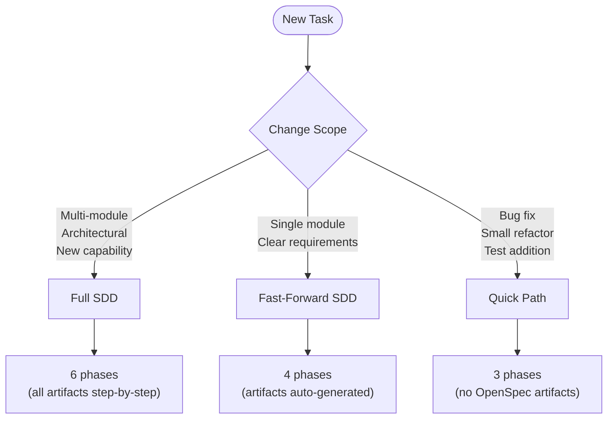
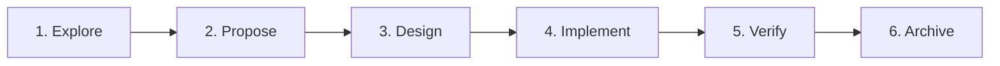
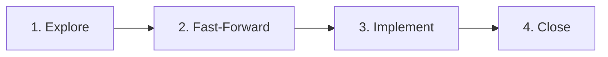
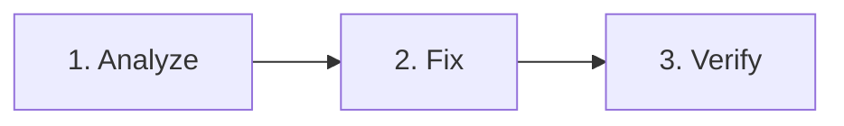
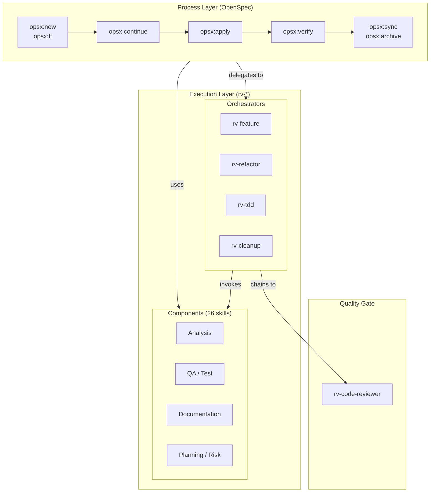

# RV-Android Development Workflow

Authoritative reference for the Spec-Driven Development (SDD) workflow used in RV-Android. This document defines how OpenSpec (process layer) and rv-* skills (execution layer) integrate into daily development.

**SDD approach**: RV-Android follows **spec-anchored SDD** — specs persist and document the system, but code remains the maintained artifact. The OpenSpec framework provides the process layer; rv-* skills provide the execution layer.

**Key principle**: The workflow is **fluid, not rigid**. Following OpenSpec's principle: "no phase gates, work on what makes sense." Artifact dependencies are enablers, not gates.

**Sources**: Martin Fowler (spec-anchored spectrum), GitHub Spec Kit, OpenSpec docs, ThoughtWorks Tech Radar.

---

## 1. Workflow Track Selection

Not every change requires the full SDD ceremony. Three tracks match change scope to workflow formality.



### Selection Criteria

| Track | When to Use | Artifacts Created | Phases |
|-------|-------------|-------------------|--------|
| **Full SDD** | Multi-module changes, architectural decisions, new capabilities | proposal, delta specs, design, tasks (step by step) | 6 |
| **Fast-Forward SDD** | Single module, clear requirements, bounded scope | All artifacts (auto-generated via `/opsx:ff`) | 4 |
| **Quick Path** | Bug fixes, small refactoring, test additions, documentation | None (no OpenSpec ceremony) | 3 |

### Decision Guide

Ask these questions to pick the right track:

1. **Does it cross module boundaries?** Yes -> Full SDD
2. **Does it introduce a new capability or change architecture?** Yes -> Full SDD
3. **Is it a single-module change with clear requirements?** Yes -> Fast-Forward SDD
4. **Is it a bug fix, refactor, or test?** Yes -> Quick Path

When in doubt, start with Quick Path. You can escalate to a higher track if the change turns out to be larger than expected.

---

## 2. Full SDD Workflow

For changes that cross module boundaries or introduce new capabilities. Each phase produces artifacts reviewed before advancing.



### Phase Details

#### Phase 1: Explore

**Goal**: Understand the problem and assess impact before committing to a solution.

| Aspect | Detail |
|--------|--------|
| **OpenSpec skill** | `/opsx:explore` |
| **RV skills** | `/rv-analyze-module`, `/rv-impact-analyzer`, `/rv-analyze-dependencies` |
| **Outputs** | Understanding of the problem, affected modules, risk assessment |
| **Exit criteria** | Clear understanding of scope and affected areas |

**What to do**:
1. Run `/rv-analyze-module <module>` on the primary affected module
2. Run `/rv-impact-analyzer <target>` to assess change impact across modules
3. Run `/opsx:explore` to think through the approach and document findings
4. If the change is smaller than expected, consider downgrading to Fast-Forward or Quick Path

#### Phase 2: Propose

**Goal**: Create a formal change proposal with delta spec outlines.

| Aspect | Detail |
|--------|--------|
| **OpenSpec skill** | `/opsx:new` then `/opsx:continue` (x2 for proposal + spec deltas) |
| **RV skills** | -- |
| **Outputs** | `proposal.md` with problem statement, approach, affected specs; initial delta spec outlines |
| **Exit criteria** | Proposal reviewed, approach agreed upon |

**What to do**:
1. Run `/opsx:new <change-name>` to create the change directory and initial proposal
2. Run `/opsx:continue` to refine the proposal with delta spec outlines
3. Run `/opsx:continue` again to complete spec deltas
4. Review the proposal before advancing

#### Phase 3: Design

**Goal**: Write design document and task list.

| Aspect | Detail |
|--------|--------|
| **OpenSpec skill** | `/opsx:continue` (x2 for design + tasks) |
| **RV skills** | `/rv-doc-adr` (if architectural decision needs recording) |
| **Outputs** | `design.md` with implementation plan; `tasks.md` with ordered task list |
| **Exit criteria** | Design reviewed, tasks are clear and scoped for single sessions |

**What to do**:
1. Run `/opsx:continue` to generate the design document
2. Run `/opsx:continue` again to generate the task list
3. If making an architectural decision, run `/rv-doc-adr` to record it
4. Review: each task should be completable in one Claude Code session

#### Phase 4: Implement

**Goal**: Execute tasks from `tasks.md`.

| Aspect | Detail |
|--------|--------|
| **OpenSpec skill** | `/opsx:apply` |
| **RV skills (orchestrators)** | `/rv-tdd`, `/rv-refactor`, `/rv-feature` |
| **RV skills (components)** | `/rv-test-add`, `/rv-test-run`, `/rv-qa-lint-fix` |
| **Outputs** | Implemented code changes, tests |
| **Exit criteria** | All tasks complete, tests passing |

**What to do**:
1. Run `/opsx:apply` to begin executing tasks
2. For each task, choose the appropriate orchestrator:
   - `/rv-tdd` — when adding new functionality (test-first)
   - `/rv-refactor` — when restructuring existing code
   - `/rv-feature` — when implementing a new capability
3. The orchestrator chains to `rv-code-reviewer` automatically at the end

#### Phase 5: Verify

**Goal**: Run all checks and validate implementation against specs.

| Aspect | Detail |
|--------|--------|
| **OpenSpec skill** | `/opsx:verify` |
| **RV skills** | `/rv-verify` |
| **Outputs** | Verification report, all tests passing |
| **Exit criteria** | Tests pass, lint clean, types check, specs match implementation |

**What to do**:
1. Run `/rv-verify <module>` to run tests + lint + type checks
2. Run `/opsx:verify` to validate implementation matches the spec deltas
3. Fix any issues found, re-verify

#### Phase 6: Archive

**Goal**: Sync delta specs to main specs, archive the change, update docs.

| Aspect | Detail |
|--------|--------|
| **OpenSpec skill** | `/opsx:sync` + `/opsx:archive` |
| **RV skills** | `/rv-docs-sync` |
| **Outputs** | Updated main specs, archived change, synced documentation |
| **Exit criteria** | Specs up to date, change archived, docs consistent |

**What to do**:
1. Run `/opsx:sync` to merge delta specs into main specs
2. Run `/opsx:archive` to archive the completed change
3. Run `/rv-docs-sync` if CLAUDE.md or other docs need updating

---

## 3. Fast-Forward SDD Workflow

For single-module changes with clear requirements. `/opsx:ff` generates all planning artifacts at once, skipping the step-by-step proposal/design/tasks phases.



### Phase Details

#### Phase 1: Explore

**Goal**: Quick analysis of the problem.

| Aspect | Detail |
|--------|--------|
| **Skills** | `/opsx:explore` or `/rv-analyze-module` |
| **Outputs** | Understanding of the change needed |
| **Exit criteria** | Requirements are clear, single module confirmed |

#### Phase 2: Fast-Forward

**Goal**: Generate all planning artifacts at once.

| Aspect | Detail |
|--------|--------|
| **Skills** | `/opsx:ff` |
| **Outputs** | proposal.md, delta specs, design.md, tasks.md (all auto-generated) |
| **Exit criteria** | Artifacts generated, quick review confirms correctness |

#### Phase 3: Implement

**Goal**: Execute tasks.

| Aspect | Detail |
|--------|--------|
| **Skills** | `/opsx:apply` + orchestrators (`/rv-tdd`, `/rv-refactor`, `/rv-feature`) |
| **Outputs** | Implemented code changes, tests |
| **Exit criteria** | All tasks complete, tests passing |

#### Phase 4: Close

**Goal**: Verify, sync specs, and archive in one phase.

| Aspect | Detail |
|--------|--------|
| **Skills** | `/rv-verify` + `/opsx:verify` + `/opsx:archive` |
| **Outputs** | Verification report, updated specs, archived change |
| **Exit criteria** | All checks pass, specs synced, change archived |

---

## 4. Quick Path

For targeted fixes that do not need OpenSpec formality. No planning artifacts created.



### Phase Details

#### Phase 1: Analyze

**Goal**: Understand the issue.

| Aspect | Detail |
|--------|--------|
| **Skills** | `/rv-analyze-module`, `/rv-analyze-file`, `/rv-debug-regression`, or direct code reading |
| **Outputs** | Understanding of the root cause or change needed |
| **Exit criteria** | Clear path to the fix |

#### Phase 2: Fix

**Goal**: Implement the change.

| Aspect | Detail |
|--------|--------|
| **Skills** | `/rv-tdd` (test-first), `/rv-refactor`, `/rv-cleanup`, or direct edit |
| **Outputs** | Code changes, tests |
| **Exit criteria** | Fix implemented |

#### Phase 3: Verify

**Goal**: Confirm the fix works.

| Aspect | Detail |
|--------|--------|
| **Skills** | `/rv-verify` or `/rv-test-run` |
| **Outputs** | Tests passing, quality checks clean |
| **Exit criteria** | All checks pass |

---

## 5. Skill Architecture

The skill system has three layers with unidirectional flow. The Process Layer (OpenSpec) invokes the Execution Layer (rv-*), never the reverse.



### Design Principles

1. **Unidirectional flow**: Process Layer (OpenSpec) invokes Execution Layer (rv-*). Never the reverse. This keeps rv-* skills reusable independently of OpenSpec.

2. **Separation of concerns**: OpenSpec manages the change lifecycle (what and why). rv-* skills handle technical execution (how). Each skill has a single responsibility.

3. **Orchestrator / Component hierarchy**: Orchestrators manage multi-phase workflows with user checkpoints and code review gates. Components perform focused, single tasks. Orchestrators invoke components; components do not invoke orchestrators.

4. **Proportional ceremony**: Match workflow formality to change scope. Full SDD for traceability; Quick Path for speed.

5. **Fluid, not rigid**: Following OpenSpec's principle — artifact dependencies are enablers, not gates. Work on what makes sense at each point. Refine artifacts as you learn during implementation.

### Complete Skill Inventory

#### Process Layer: OpenSpec Skills (10)

| Skill | Purpose | Used In |
|-------|---------|---------|
| `/opsx:explore` | Think through approach, explore problem space | Full SDD (Phase 1), FF SDD (Phase 1) |
| `/opsx:new` | Create new change with proposal | Full SDD (Phase 2) |
| `/opsx:ff` | Fast-forward: generate all artifacts at once | FF SDD (Phase 2) |
| `/opsx:continue` | Advance to next artifact (specs, design, tasks) | Full SDD (Phases 2-3) |
| `/opsx:apply` | Execute tasks from tasks.md | Full SDD (Phase 4), FF SDD (Phase 3) |
| `/opsx:verify` | Validate implementation against specs | Full SDD (Phase 5), FF SDD (Phase 4) |
| `/opsx:sync` | Sync delta specs to main specs | Full SDD (Phase 6) |
| `/opsx:archive` | Archive completed change | Full SDD (Phase 6), FF SDD (Phase 4) |
| `/opsx:bulk-archive` | Archive multiple completed changes | Maintenance |
| `/opsx:onboard` | Onboard to the SDD workflow | First-time setup |

#### Execution Layer: Orchestrators (4)

| Orchestrator | Purpose | Chains To |
|-------------|---------|-----------|
| `/rv-feature` | Multi-phase feature implementation | `rv-code-reviewer` |
| `/rv-refactor` | Code restructuring workflow | `rv-code-reviewer` |
| `/rv-tdd` | Test-driven development workflow | `rv-code-reviewer` |
| `/rv-cleanup` | Dead code removal workflow | `rv-code-reviewer` |

#### Execution Layer: Components — Analysis (5)

| Skill | Purpose |
|-------|---------|
| `/rv-analyze-module` | Deep analysis of a module (persists to memory) |
| `/rv-analyze-file` | Analyze a specific file |
| `/rv-analyze-complexity` | Find complexity hotspots |
| `/rv-analyze-dependencies` | Check dependency health across modules |
| `/rv-analyze-dead-code` | Find unused code |

#### Execution Layer: Components — Testing and QA (5)

| Skill | Purpose |
|-------|---------|
| `/rv-test-run` | Run tests for a module |
| `/rv-test-add` | Add tests for a function or class |
| `/rv-verify` | Run all checks: tests + lint + type checking |
| `/rv-qa-lint` | Run linter, report issues |
| `/rv-qa-lint-fix` | Run linter and auto-fix issues |

#### Execution Layer: Components — Refactoring (4)

| Skill | Purpose |
|-------|---------|
| `/rv-refactor-simplify` | Simplify complex code |
| `/rv-refactor-extract` | Extract components or functions |
| `/rv-refactor-cleanup` | Remove dead code, clean imports |
| `/rv-refactor-constants` | Extract magic values to constants |

#### Execution Layer: Components — Documentation (5)

| Skill | Purpose |
|-------|---------|
| `/rv-doc-generate-claude-md` | Generate or update CLAUDE.md |
| `/rv-docs-sync` | Sync documentation with code changes |
| `/rv-doc-adr` | Record architectural decision |
| `/rv-doc-architecture` | Generate architecture documentation |
| `/rv-doc-readme` | Generate or update README |

#### Execution Layer: Components — Planning and Risk (5)

| Skill | Purpose |
|-------|---------|
| `/rv-impact-analyzer` | Assess change impact across modules |
| `/rv-debug-regression` | Investigate regression bugs via git history |
| `/rv-planning` | Plan implementation approach |
| `/rv-risk` | Risk assessment for changes |
| `/rv-retrospective` | Post-change retrospective |

#### Execution Layer: Components — Other (2)

| Skill | Purpose |
|-------|---------|
| `/rv-security` | Security review |
| `/rv-release` | Release preparation |

#### Quality Gate (1 agent)

| Agent | Purpose |
|-------|---------|
| `rv-code-reviewer` | Automatic code review at the end of orchestrator workflows |

**Total**: 10 OpenSpec + 4 orchestrators + 26 components + 1 agent = **41 skills + 1 agent**

---

## 6. Quick Reference: Common Scenarios

| Scenario | Track | Skill Sequence |
|----------|-------|----------------|
| New feature in rv-agent | Full SDD | `opsx:explore` -> `opsx:new` -> `opsx:continue` (x4) -> `opsx:apply` (w/ `rv-tdd`) -> `rv-verify` -> `opsx:verify` -> `opsx:archive` |
| Add config option to module | FF SDD | `opsx:ff` -> `opsx:apply` -> `rv-verify` -> `opsx:archive` |
| Refactor module internals | Quick | `rv-analyze-module` -> `rv-refactor` -> `rv-verify` |
| Fix a bug | Quick | `rv-debug-regression` or analysis -> `rv-tdd` -> `rv-verify` |
| Add tests to existing code | Quick | `rv-test-add` -> `rv-test-run` |
| Remove dead code | Quick | `rv-analyze-dead-code` -> `rv-cleanup` -> `rv-verify` |
| Architectural change | Full SDD | `opsx:explore` -> `opsx:new` -> `opsx:continue` (x4) -> `rv-doc-adr` -> `opsx:apply` -> `rv-verify` -> `opsx:archive` |
| Add a new module | Full SDD | `opsx:explore` -> `opsx:new` -> `opsx:continue` (x4) -> `opsx:apply` (w/ `rv-feature`) -> `rv-verify` -> `opsx:archive` |
| Optimize performance | FF SDD | `rv-analyze-complexity` -> `opsx:ff` -> `opsx:apply` (w/ `rv-refactor`) -> `rv-verify` -> `opsx:archive` |
| Fix lint issues | Quick | `rv-qa-lint` -> `rv-qa-lint-fix` -> `rv-test-run` |

---

## 7. Workflow Examples

### Example 1: Full SDD — Adding scroll detection to rv-agent

This is a multi-module change (rv-agent + rv-screen-parser) introducing new capability.

```
# Phase 1: Explore
/rv-analyze-module rv-agent            # Understand current UI parsing
/rv-analyze-module rv-screen-parser    # Understand screen parser
/rv-impact-analyzer scroll-detection   # Assess impact
/opsx:explore                          # Document findings

# Phase 2: Propose
/opsx:new add-scroll-detection         # Create change, write proposal
/opsx:continue                         # Write delta specs for rv-agent
/opsx:continue                         # Write delta specs for rv-screen-parser

# Phase 3: Design
/opsx:continue                         # Generate design doc
/opsx:continue                         # Generate task list

# Phase 4: Implement
/opsx:apply                            # Execute tasks
  # For each task, Claude picks appropriate orchestrator:
  # /rv-tdd for new scroll detector class
  # /rv-feature for integration with existing nodes

# Phase 5: Verify
/rv-verify rv-agent                    # Tests + lint + types
/rv-verify rv-screen-parser            # Tests + lint + types
/opsx:verify                           # Check against spec deltas

# Phase 6: Archive
/opsx:sync                             # Merge deltas into main specs
/opsx:archive                          # Archive completed change
/rv-docs-sync                          # Update docs
```

### Example 2: Fast-Forward SDD — Adding a config option to rv-agent

Single module, clear requirements: add `max_scroll_attempts` to RVAgentConfig.

```
# Phase 1: Explore
/rv-analyze-file modules/rv-agent/src/rv_agent/config.py  # Check current config

# Phase 2: Fast-Forward
/opsx:ff add-max-scroll-config         # Generate all artifacts at once

# Phase 3: Implement
/opsx:apply                            # Execute tasks (direct edit + test)

# Phase 4: Close
/rv-verify rv-agent                    # Tests + lint + types
/opsx:verify                           # Quick check
/opsx:archive                          # Archive
```

### Example 3: Quick Path — Fix a bug in coverage tracking

```
# Phase 1: Analyze
/rv-debug-regression test_coverage_tracking  # Investigate via git history
# or: /rv-analyze-file modules/rv-coverage/src/rv_coverage/tracker.py

# Phase 2: Fix
/rv-tdd                                # Write failing test first, then fix

# Phase 3: Verify
/rv-verify rv-coverage                 # Tests + lint + types
```

---

## 8. Assessment of External Feedback

Feedback from Gemini, Qwen, and SDD literature was evaluated during workflow design.

| Source | Suggestion | Decision | Rationale |
|--------|-----------|----------|-----------|
| Gemini | Create `/rv-help` skill | Skip | Quick reference table (Section 6) addresses discoverability without adding complexity |
| Gemini | Create `/rv-onboard` skill | Skip | `/opsx:onboard` already exists for SDD; workflow docs serve as rv-* onboarding |
| Gemini | Improve discoverability | Accept | Addressed via workflow track selection + quick reference table + CLAUDE.md update |
| Both LLMs | Unidirectional flow is sound | Keep | Preserved as Design Principle #1 |
| Both LLMs | Orchestrator/Component pattern is sound | Keep | Preserved as Design Principle #3 |
| ThoughtWorks | SDD is not waterfall | Align | "Fluid, not rigid" principle (Design Principle #5) ensures short feedback cycles |
| Fowler | Beware MDD parallels | Noted | RV-Android uses spec-anchored approach (code is maintained artifact, not specs) |

**Skill set decision**: Keep all 41 skills + 1 agent. The discoverability gap is addressed through documentation (this file + CLAUDE.md), not removal. Each skill serves a distinct purpose and the orchestrator/component hierarchy provides clear entry points.

---

## 9. Related Documents

| Document | Purpose |
|----------|---------|
| `docs/20260209_plano_spec_driven.md` | SDD adoption plan (Phase 5 references this workflow) |
| `docs/PRD.md` | Product Requirements Document |
| `.claude/AGENTS.md` | Full skill and agent documentation |
| `openspec/config.yaml` | OpenSpec configuration for RV-Android |
| `CLAUDE.md` | Root project guide (condensed workflow section) |
