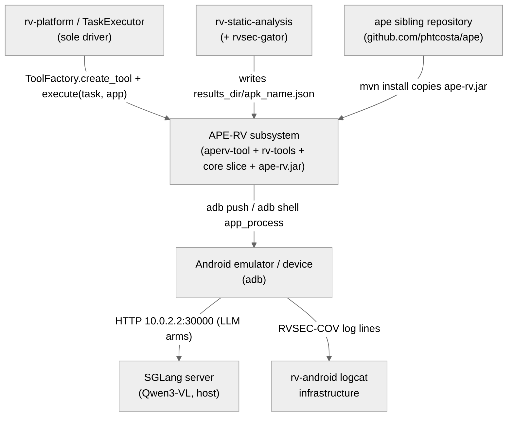
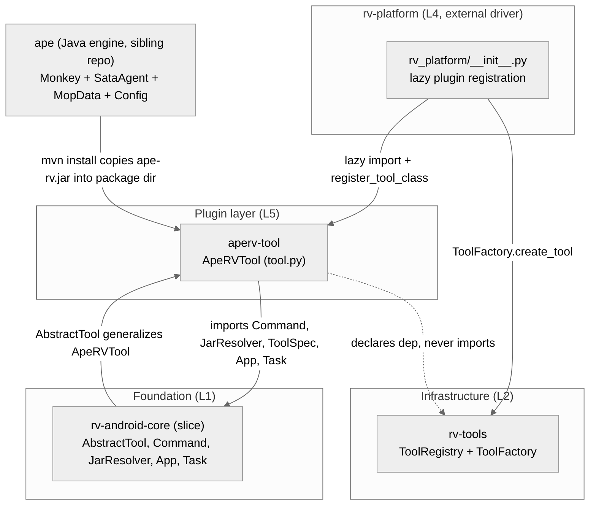
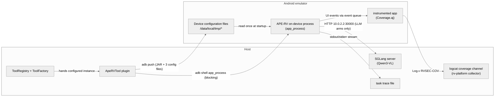
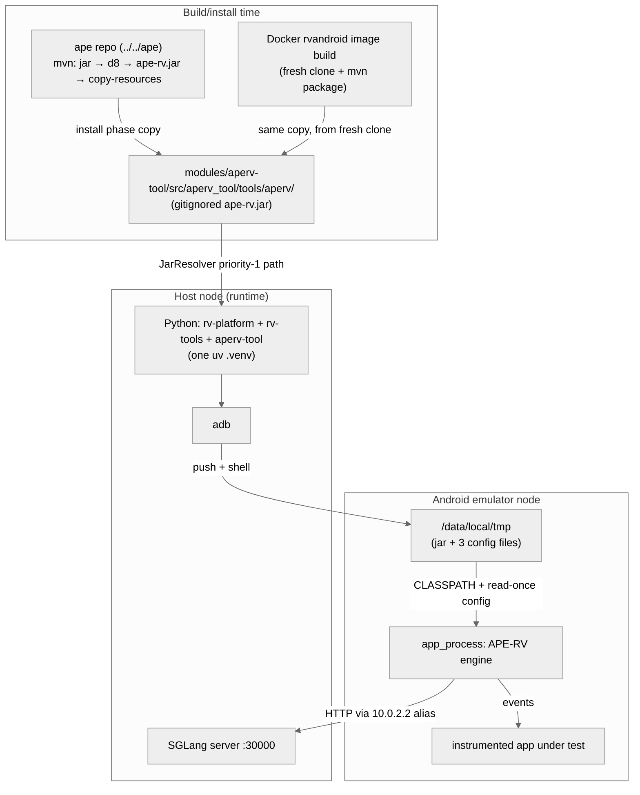

# Architecture — APE-RV Subsystem

> Scope: **subsystem** · Generated by `rv-doc-arch` · Source model: `out/arch/subsystem-ape-rv/architecture-model.json`
> Languages: Python (3 modules, ~14.5k LOC) + Java (1 module, ~63.5k LOC)

## Table of Contents

- [Part I — Beyond Views](#part-i--beyond-views)
  - [1. Documentation overview](#1-documentation-overview)
  - [2. Conceptual primer](#2-conceptual-primer)
  - [3. System overview and context](#3-system-overview-and-context)
  - [4. How it works — end to end](#4-how-it-works--end-to-end)
  - [5. Core components](#5-core-components)
  - [6. Mapping between views](#6-mapping-between-views)
  - [7. Rationale](#7-rationale)
  - [8. Output artifacts](#8-output-artifacts)
  - [9. Directory](#9-directory)
- [Part II — Views](#part-ii--views)
  - [Module view](#module-view)
  - [Component-and-connector view](#component-and-connector-view)
  - [Allocation view](#allocation-view)
- [Appendices](#appendices)
- [Specification traceability](#specification-traceability)

---

## Part I — Beyond Views

### 1. Documentation overview

This document describes the architecture of the **APE-RV subsystem**: the on-device Android
exploration engine of RV-Android and its integration into the experiment platform. It is a
cross-language, cross-repository subsystem — three Python modules inside the rv-android uv
workspace (`aperv-tool`, `rv-tools`, and a slice of `rv-android-core`) plus one Java Maven
module in the sibling `ape` repository that is dexed into `ape-rv.jar` and executed inside the
Android emulator.

The intended reader is a **new engineer with no prior exposure to this subsystem** who needs to
understand what it does, how a run actually unfolds, and why it is shaped the way it is —
before touching any file. It complements, and does not replace, the per-module 4+1 docs under
`modules/<m>/docs/architecture.md` and the OpenSpec domain specs.

**How to read this document:** Part I builds your mental model — what the subsystem is
([primer](#2-conceptual-primer)), how it behaves end to end
([walkthrough](#4-how-it-works--end-to-end)), and why it is shaped this way
([rationale](#7-rationale)). Part II documents the selected views in detail.

### 2. Conceptual primer

The APE-RV subsystem is the on-device Android exploration engine of RV-Android and its
integration into the experiment platform. APE-RV itself is a Java fork of APE (Android
Property Explorer, ETH Zurich, ICSE 2019) that runs inside the Android emulator as
`ape-rv.jar`, driving the app under test through model-based UI exploration and steering it
toward monitored operations (MOP) — API calls that runtime-verification monitors watch. The
Python side (`aperv-tool` plus the `rv-tools` plugin system and a slice of `rv-android-core`)
deploys the JAR to the device, configures it per experiment arm, launches it, and interprets
its exit.

**Why this approach.** The engine runs on the device via `app_process` — the same mechanism
the AOSP Monkey tool uses to load a JAR into an Android runtime process — rather than as a
host-side driver issuing one adb call per UI event, which is how DroidBot and the Python
rv-agent work. The trade-off is throughput versus orchestration richness: an on-device agent
reads the accessibility tree and injects events in-process, reaching event rates an
adb-round-trip driver cannot (the sibling rvsmart agent measures ~14 evt/s on-device versus
~1.4 evt/s for a Python driver), but it must be configured entirely up front, through files
pushed before launch, because there is no host-side control loop during the run. That
constraint shaped the whole Python side: everything an experiment arm needs — exploration
flags, MOP weights, LLM sampling parameters — is serialized into `ape.properties` and a
static-analysis JSON before `app_process` starts. On the host side, wrapping the engine as an
`AbstractTool` plugin (instead of a bespoke launcher script) was chosen so experiments select
it exactly like every other tool (`--tools aperv:sata_mop`), and so the platform's uniform
timeout, cleanup, and error semantics apply unchanged.

**Key concepts**

- **app_process** — The Android command that starts a runtime process from a JAR on the device
  (`CLASSPATH=... app_process <working-dir> <main-class>`). It is how AOSP Monkey — and
  therefore APE-RV, whose entry point is literally `com.android.commands.monkey.Monkey` —
  executes without being an installed app.
- **MOP (monitored operations)** — Operations monitored by any runtime-verification
  specification (e.g. JCA cipher calls). Not security-specific terminology. APE-RV's research
  purpose is to bias exploration toward UI elements whose handlers reach MOP methods.
- **Experiment arm / variant** — A named, complete configuration of the tool used as one
  comparison arm in an experiment (e.g. `sata_mop_widget` vs `sata`).
  `ApeRVTool.get_variants()` defines 17 arms; an arm's identity is its variant dict, never a
  default hidden inside the JAR.
- **Static-analysis JSON / MopData** — The per-APK file produced upstream by
  `rv-static-analysis` (GATOR/Soot) mapping windows, widgets, and transitions to MOP
  reachability. Pushed to the device as `/data/local/tmp/static_analysis.json` and parsed by
  `MopData.java` into the in-memory guidance model.
- **SATA agent** — APE's primary exploration strategy (`SataAgent.java`): epsilon-greedy
  adaptive random testing over an abstract state model. Selected on the command line with
  `--ape sata`.
- **GUITree / State / Naming** — APE's core abstraction: each screen capture (GUITree, from
  `AccessibilityNodeInfo`) is mapped to an abstract State by a Naming (a chosen granularity of
  widget attributes); `NamingFactory` refines the abstraction when it proves too coarse. The
  exploration model is a graph over these abstract states.
- **ape.properties** — The on-device configuration file (at `/data/local/tmp/ape.properties`)
  that `Config.java` loads at startup. The Python plugin generates it per run by translating
  Python config keys through `APERV_PROPERTY_MAPPING` (~50 entries).
- **SGLang LLM guidance** — Optional per-step guidance where the JAR itself (not Python) calls
  a host-side SGLang server (Qwen3-VL) over HTTP at `10.0.2.2:30000` — the emulator's alias
  for host loopback — to pick actions on new states or when exploration stagnates.

### 3. System overview and context

The subsystem sits between the RV-Android experiment platform and the Android emulator. Its
sole driver is **rv-platform's TaskExecutor**, which creates the tool via `ToolFactory` and
calls `execute(task, app)` once per (APK, repetition), managing the emulator lifecycle around
it. Upstream, **rv-static-analysis** (with the rvsec-gator Java engine) produces the per-APK
`<results_dir>/<apk_name>.json` that the plugin compacts and pushes as the MOP guidance
substrate. All device interaction goes exclusively through **adb** — pushes before launch, a
blocking `adb shell` during the run. In LLM arms, the on-device JAR calls the host-side
**SGLang server** (Qwen3-VL) directly at `10.0.2.2:30000`; Python only writes the connection
parameters. Coverage measurement flows through an entirely separate channel: the
**rv-android logcat infrastructure** captures `RVSEC-COV` lines emitted by the instrumented
APK's `Coverage.aj`, independent of anything APE-RV writes. Finally, the **ape sibling
repository** (github.com/phtcosta/ape) is the source of the engine: its Maven install step
(and the Docker image build) delivers `ape-rv.jar` into the plugin's package directory.

**Constraints:** the engine reads its configuration files exactly once at startup, so there is
no mid-run reconfiguration anywhere in the subsystem; the JAR is gitignored and must be built
from the sibling repository; the device-side JSON parser rejects files above
`maxMemory()/6` (~32 MB), which constrains what the host may push.

**System context diagram** (external actors and systems — every view refers back to this):

### 4. How it works — end to end

The following walks through a concrete example: an experiment runs
`uv run rv-experiment run --tools aperv:sata_mop_widget` against `cryptoapp.apk` (package
`br.unb.cic.cryptoapp`) — from tool registration to a MOP-boosted widget click on the device.

**1. Registration.** When rv-platform is imported, `rv_platform/__init__.py` lazily imports
`ApeRVTool` from `aperv_tool.tools.aperv.tool` inside a try/except `ImportError` and calls
`ToolRegistry.register_tool_class(ApeRVTool)`, guarded by `is_tool_registered('aperv')` so
re-imports never double-register. Registration invokes the classmethods `get_tool_spec()`
(name `aperv`, process_pattern `com.android.commands.monkey`) and `get_variants()`, storing
the spec and all 17 variant dicts in the singleton registry's three maps. If aperv-tool is not
installed, the platform logs a warning and continues — the plugin is optional by construction.
(`modules/rv-platform/src/rv_platform/__init__.py:30-38`; `ToolRegistry.get_instance()` in
`modules/rv-tools/src/rv_tools/registry/registry.py`.)

**2. Creation and configuration.** The CLI spec `aperv:sata_mop_widget` is parsed by
`ToolConfig.from_tool_specification` into (name=`aperv`, variant=`sata_mop_widget`).
`ToolFactory.create_tool` resolves the class from the registry, fetches the variant's stored
config, merges it with any overrides as `{**variant_defaults, **parameters}`, instantiates
`ApeRVTool`, and calls `configure()`. `configure()` validates eagerly that `strategy` is one
of `['sata', 'random', 'bfs', 'dfs']` and raises `ConfigurationError` on a typo before any
device interaction (INV-APV-02) — a failed push mid-experiment would waste minutes of
emulator time. The merged dict is stored as `_tool_config`; an empty dict doubles as the
"not configured" sentinel. For this run the variant resolves to
`sata_mop_widget = {**_BASELINE_ARM_FLAGS, **_MOP_SUBSTRATE, 'strategy': 'sata',
'throttle_ms': 200}` — 18 arm-defining flags all explicit, plus `mop_data='static_analysis'`
and weights direct=500 / transitive=300 / open_menu=250 / wtg=200 (`tool.py:377-382`).

**3. JAR resolution and push.** `execute_tool_specific_logic` first resolves `ape-rv.jar`
through `JarResolver` with the module's own directory as the highest-priority search path —
the location `mvn install` in the ape repo (or the Docker image build) copies the freshly
dexed JAR into — falling back to `$RVSEC_HOME`- and `$TOOLS_DIR`-derived paths
(`search_paths = [os.path.dirname(__file__)]`, `tool.py:505`). The resolved JAR is pushed
with `adb -s <serial> push -a -p` to `/data/local/tmp/ape-rv.jar` (deliberately not
`ape.jar`, to avoid colliding with the builtin ape tool, INV-APV-03), with push output
appended to the task's trace file. A missing JAR raises `RVToolExecutionError` immediately:
this is the one true fail-fast in the flow.

**4. MOP substrate push (compaction).** Because the variant sets `mop_data='static_analysis'`,
the tool looks for `<task.results_dir>/cryptoapp.apk.json` — the file rv-static-analysis
wrote during pre-processing. Before pushing, `_compact_static_analysis_json` rewrites it into
a temp file with exactly two lossless operations: deduplicating exact-duplicate `transitions`
entries (fingerprinted by canonical `json.dumps(entry, sort_keys=True)`, preserving
first-occurrence order) and minifying with `separators=(',',':')`. This exists because
`MopData.java` applies a pre-read footprint guard — any file larger than
`maxMemory()/PARSE_FOOTPRINT_FACTOR` (6), about 32 MB at the emulator's ~192 MB heap, is
rejected before parsing (`MopData.java:202`), which would make MOP arms abort with 0 steps
while non-MOP baselines explore normally: a per-app fairness gap, not a crash. The compacted
copy is pushed to `/data/local/tmp/static_analysis.json` and the temp file is unlinked in a
`finally` block; the source on the host stays byte-identical for offline consolidation
(INV-APV-20/25). Compaction never raises — on any failure it logs a warning and pushes the
source unchanged (INV-APV-24). A missing JSON degrades gracefully to a run without MOP data.
Measured on `org.quantumbadger.redreader_117`: 50.6 MB → 21.0 MB, transitions
24,300 → 7,124 (70.7% exact duplicates), ~1.4 s.

**5. ape.properties generation and push.** `_push_properties` translates `_tool_config`
through `APERV_PROPERTY_MAPPING` — only keys present in both the config and the mapping are
written, so Python-only orchestration keys (`strategy`, `mop_data`, `seed`) never leak into
the file. Python booleans are serialized as lowercase `true`/`false` to match what
`Config.java`'s loader expects (the bool check must precede numeric handling because `bool`
is an `int` subclass). Because the MOP push succeeded, the line
`ape.mopDataPath=/data/local/tmp/static_analysis.json` is prepended. The content is written
to a host temp file (adb push needs a local path), pushed to
`/data/local/tmp/ape.properties`, and the temp file unlinked in a `finally`. For
`sata_mop_widget` the file contains `ape.defaultGUIThrottle=200`, `ape.mopWeightDirect=500`,
`ape.mopWeightTransitive=300`, `ape.mopWeightOpenMenu=250`, `ape.mopWeightWtg=200`, all 18
arm flags (e.g. `ape.backMenuPickCap=3`, `ape.apePureMode=false`), and `ape.mopDataPath`.

**6. Launch via app_process.** `_build_main_command` assembles:
`adb -s <serial> shell CLASSPATH=/data/local/tmp/ape-rv.jar /system/bin/app_process
/system/bin com.android.commands.monkey.Monkey -p br.unb.cic.cryptoapp --running-minutes
<max(1, timeout//60)> --ape sata`. `CLASSPATH` is an inline environment variable because
`app_process` reads it from the process environment at startup. The working directory is
`/system/bin`, not `/data/local/tmp/`, because the enhanced binary needs system-level
resource resolution — `/data/local/tmp` causes `ClassNotFoundException` on some API levels
(INV-APV-04, D7). If a seed is configured it is appended as Monkey's `-s <seed>` (parsed at
`Monkey.java:881-882`, seeding `RandomHelper`) — distinct from the adb `-s <serial>` at
position 0 (INV-APV-18). The host `Command` gets `timeout_seconds + 15`: the grace period
lets APE-RV flush its model and exit cleanly after `--running-minutes` expires.
(`APERV_MAIN_CLASS = 'com.android.commands.monkey.Monkey'`;
`running_minutes = max(1, timeout_seconds // 60)` so a 60 s timeout still yields one full
minute, `tool.py:735-776`.)

**7. On-device exploration (Java engine).** Inside the emulator, `Monkey.main` parses
`--ape` and hands event sourcing to `MonkeySourceApe`, which creates the agent via
`ApeAgent.createAgent` — `SataAgent` for `--ape sata`. At startup
`MopData.load('/data/local/tmp/static_analysis.json', package, mainActivity)` runs the
footprint guard, parses the JSON's Target vocabulary
(`reachesTarget`/`directlyReachesTarget`/`targetMethods` — the wire format kept the
producer's generalized naming; aperv's model calls it MOP, and the rename boundary lives in
the `MopData` javadoc, gh13 D7), and logs a `[APE-MOP-DATA] status=loaded` line (or
`status=rejected` with a reason: too-large, file-missing, parse-error, incomplete,
package-mismatch, oom). Each exploration step captures a GUITree from
`AccessibilityNodeInfo`, abstracts it to a State via `NamingFactory`, and asks `SataAgent`
for an action. Action selection runs the `ScoringPipeline` — an ordered list of
`ScoringPass` implementations (`MopWidgetPass`, `MopFrontierPass`, `FrontierPass`,
`MenuGatewayPass`, `WtgPass`, `CoveragePass`, `FormCompletionPass`), each enabled by its
`Config` flags. For cryptoapp, `MopWidgetPass` boosts the button whose handler directly
reaches `Cipher.getInstance` by `mopWeightDirect=500`, so the encrypt screen's action wins
the priority comparison. The chosen `ModelAction` becomes an `ApeEvent` injected through the
Monkey event queue; the resulting GUITree updates the `Model` graph, and `NamingFactory`
refines the abstraction if it detects non-determinism.
(`ScoringPipeline` in `ape/agent/scoring/ScoringPipeline.java`; `SataAgent.java:287-289`
pulls MopData for the activity-gated tracker; `PARSE_FOOTPRINT_FACTOR = 6`,
`MopData.java:160`.)

**8. Optional LLM guidance.** In LLM arms (`sata_llm`, `sata_mop_llm` — not this run's
`sata_mop_widget`), `LlmRouter` intercepts action selection in three cases: a new state
(`Config.llmOnNewState`), stagnation (`Config.llmOnStagnation`), or randomly with
probability `Config.llmPercentage` per step (`LlmRouter.java:193-197` — fires when
`Config.llmPercentage > 0.0 && random.nextDouble() < llmPercentage`; the gh43 prompt arms
pin `llm_percentage=0.7`). It captures a screenshot on demand (`ScreenshotCapture`), builds
a prompt (`ApePromptBuilder`, with variant selected by `ape.llmPromptVariant` in the six
frozen gh43 arms), and calls the host's SGLang server through `SglangClient` at
`http://10.0.2.2:30000/v1` — the emulator's host-loopback alias. `ToolCallParser` handles
the model's tool-call output, `CoordinateNormalizer` maps Qwen3-VL's [0,1000) coordinates to
device pixels, and `LlmCircuitBreaker` stops calling a repeatedly failing server. The Python
side only writes the `llm_*` properties; the HTTP traffic is entirely device-to-host.

**9. Termination and result interpretation.** The run ends one of two ways. Normally
`--running-minutes` elapses, APE-RV flushes and exits, or the host-side `Command` timeout
(+15 s) fires first: `Command.invoke` raises `RVCommandTimeoutError`, which the tool
re-raises as `RVToolTimeoutError` so rv-platform records a completed run, not a failure —
timeout is the designed exit for exploration tools (INV-TOOL-06, INV-APV-11). A non-zero
exit code (e.g. 211 when APE-RV detects app crashes during exploration) is logged at debug
level only (INV-APV-12). The main execution output is written to `task.result.trace_file`
opened `'wb'` — deliberately replacing the earlier push diagnostics, because the exploration
trace is the primary artifact. A 0-byte trace triggers a warning (silent startup crash) but
not an error, because coverage is collected out-of-band: the instrumented APK's
`Coverage.aj` logs `RVSEC-COV` lines to logcat, which rv-android's logcat infrastructure
captures independently of anything APE-RV writes. Finally `AbstractTool.execute()` kills
leftover device processes matching `com.android.commands.monkey`.
(`tool.py:900-923` — `invoke()` with `stdout=stderr=trace_file`;
`except RVCommandTimeoutError → raise RVToolTimeoutError`; `_check_empty_trace` at
`tool.py:778`.)

### 5. Core components

**ApeRVTool plugin.** At runtime this is a stateless-per-run object: `configure()` stores the
merged arm config once, and `execute_tool_specific_logic()` replays the same five-step
deployment for every (APK, repetition) task. It is the only component that touches both
worlds — it reads host artifacts (the JAR, the static-analysis JSON in `results_dir`) and
writes the device's file-based configuration surface — and it deliberately does NOT read
anything back from the engine except the exit condition and the raw trace: coverage
interpretation belongs to the platform's logcat components.

**ToolRegistry + ToolFactory.** Populated once at import time and read for every task. For
this subsystem its role is indirection: rv-platform's TaskExecutor asks the factory for
`aperv:sata_mop_widget` and receives a configured `AbstractTool` without ever importing
`aperv_tool`. The variant dicts stored here ARE the experiment arms — the registry hands out
defensive copies so no caller can mutate an arm definition mid-experiment.

**APE-RV on-device process.** Once launched, this process is autonomous: the host's only
handle on it is the blocking adb shell connection (whose stdout/stderr stream into the trace
file) and the timeout that eventually kills it. Internally it loops
capture-abstract-select-inject: GUITree → State (naming) → `SataAgent` + `ScoringPipeline`
pick a `ModelAction` → `ApeEvent` through the Monkey event queue → new GUITree updates the
`Model` graph. It reads its three configuration files exactly once at startup, which is why
every push must complete before launch and why there is no mid-run reconfiguration anywhere
in the subsystem.

**Device configuration files.** This shared-data seam is the subsystem's real interface.
`ape.properties` carries every tunable (`Config.java` loads it at startup; unknown keys are
ignored silently); `static_analysis.json` is the MOP guidance substrate (present only in MOP
arms, and its path is advertised via `ape.mopDataPath` only when the push succeeded);
`system-broadcast.json` is the optional broadcast-intent catalog for component triggering.
Because the engine reads these once, the files' pre-launch state fully determines the arm's
behavior — which is what makes "the arm is its variant dict" auditable: the properties file
on the device is a faithful serialization of the variant.

**SGLang LLM server.** The unusual property of this connector is its direction: the
device-side Java process is the HTTP client, reaching the host through the emulator's
`10.0.2.2` loopback alias (default `http://10.0.2.2:30000/v1`, overridable via the `llm_url`
parameter which operators set through `APERV_LLM_BASE_URL` propagated by the platform —
never read from `os.environ` inside the plugin). Python configures the connection but never
participates in it. `LlmCircuitBreaker` on the Java side keeps a dead or slow server from
stalling exploration.

**Logcat coverage channel.** Coverage deliberately does not flow through APE-RV or its trace
file. The instrumented APK itself emits `RVSEC-COV` log lines as monitored methods execute,
and rv-platform's logcat component records them for the whole task window. This is why an
empty APE-RV trace is a warning rather than an error, and why the trace file can be
overwritten (`'wb'`) at launch: the exploration trace is diagnostics; the measurement
channel is logcat.

| Component | Realized by | Responsibility |
|-----------|-------------|----------------|
| ApeRVTool plugin | `modules/aperv-tool/src/aperv_tool/tools/aperv/tool.py` | Per-run host-side orchestrator: arm config → device files → app_process launch → exit interpretation |
| ToolRegistry + ToolFactory | `modules/rv-tools/src/rv_tools/registry/{registry.py,factory.py}` | Process-wide singleton mapping tool names to classes/specs/variants; factory turns ToolConfig into a configured instance |
| APE-RV on-device process | `../../ape/src/main/java` (dexed to `target/ape-rv.jar`) | The exploration run itself: an Android runtime process started by app_process that drives the app until its minute budget expires |
| Device configuration files | `/data/local/tmp/{ape-rv.jar, ape.properties, static_analysis.json, system-broadcast.json}` | The entire host→engine configuration surface: one JAR + up to three files pushed before launch |
| SGLang LLM server | host-side SGLang serving Qwen3-VL | OpenAI-compatible vision-LLM endpoint the JAR consults for action guidance in LLM arms |
| Logcat coverage channel | `Coverage.aj` in the instrumented APK + rv-android logcat infrastructure | Out-of-band results path: the app logs RVSEC-COV signatures to logcat; the platform collects them independently of APE-RV |

### 6. Mapping between views

The module structure and the runtime structure line up one-to-one, but the correspondence
crosses both a language boundary and a process boundary, and knowing exactly where is
essential to reading this subsystem correctly.

On the host, the Python module `aperv-tool` realizes the runtime **ApeRVTool plugin**
component; `rv-tools` realizes the **ToolRegistry + ToolFactory** service; and the
`rv-android-core` slice does not appear as a runtime component of its own — it is the
inherited half of the plugin's behavior (`AbstractTool.execute()` is the template method
that wraps `execute_tool_specific_logic()`, and `Command.invoke()` is the subprocess layer
underneath every adb call). Reading `tool.py` without that slice gives a false picture:
timeout conversion, process cleanup, and failure semantics are inherited, not local.

The **cross-language, cross-process boundary** is crossed twice, by two different mechanisms.
First, at build/install time: the Java engine (the `ape` sibling repository) is compiled,
dexed with d8, and its `mvn install` step copies `target/ape-rv.jar` into
`modules/aperv-tool/src/aperv_tool/tools/aperv/` — so the Java module is physically embedded
in the Python module's package directory as a gitignored binary. Second, at run time: the
plugin's host `Command` spawns
`adb -s <serial> shell CLASSPATH=/data/local/tmp/ape-rv.jar app_process /system/bin
com.android.commands.monkey.Monkey ...`, which is what turns the pushed JAR into the
**APE-RV on-device process**. What crosses this boundary is exactly four files (the JAR plus
up to three configuration files, the **device configuration files** store) in one direction,
and a stdout/stderr stream plus an exit code in the other. Nothing else does — no RPC, no
sockets between Python and Java, no mid-run control.

Two runtime connectors bypass the Python side entirely: the on-device Java process is an
HTTP client of the **SGLang server** (device→host via `10.0.2.2`), and the instrumented app
feeds the **logcat coverage channel** that rv-platform's logcat component (outside this
subsystem) consumes. In deployment terms, the Python modules live on the host node, the
engine and the app under test share the emulator node, and SGLang occupies a third node;
the install view maps the ape repository's Maven chain onto the plugin's package directory.

### 7. Rationale

The decisions that shaped this architecture, each with the tension behind it and the failure
mode it avoids.

**On-device execution via app_process with /system/bin working directory.** The tension is
throughput versus controllability. A host-side driver (DroidBot, rv-agent) can adapt per
step with full Python tooling but pays an adb round-trip per event; an on-device agent
explores at native speed but can only be configured up front through pushed files. APE-RV
chooses the device side, inheriting AOSP Monkey's app_process launch mechanism. Within that
choice, the working directory must be `/system/bin` rather than the intuitive
`/data/local/tmp`: the enhanced binary resolves system-level resources relative to it, and
`/data/local/tmp` produces `ClassNotFoundException` on some API levels (design D7). Without
this decision the whole arm taxonomy and file-push machinery would be unnecessary — but
exploration would be an order of magnitude slower, undermining the tool comparison the
subsystem exists to run.

**Arm-defining explicitness: every non-exempt variant pins all 18 arm-defining flags.**
`Config.java` silently ignores unknown properties and silently applies defaults for absent
ones — so if a variant omitted a flag, the arm's actual behavior would depend on whichever
jar happened to be built, and a jar-side default change would silently redefine a published
experiment arm. The rejected alternative was the natural one: only set what differs from the
baseline. Instead, `ARM_DEFINING_KEYS` is a frozenset of the 18 behavior-selecting keys,
`_BASELINE_ARM_FLAGS`/`_APE_PURE_ARM_FLAGS` enumerate exactly those 18, every non-exempt
variant spreads one of them, and guard tests verify membership — making the pushed
`ape.properties` a complete, auditable serialization of the arm. The six frozen gh43 prompt
arms are exempted by an explicit named set rather than a prefix match, precisely so a future
`sata_mop_llm_*` arm cannot silently escape the guard. The `ape_pure` arm goes further
(defense-in-depth, D1): it sets every RV flag off explicitly rather than trusting the
`apePureMode` kill-switch alone.

**Unconditional, lossless, never-failing compaction of the static-analysis JSON.** The Java
side rejects any JSON above `maxMemory()/6` (~32 MB) before parsing, so an oversized file
makes MOP arms explore 0 steps while baselines run normally — a silent per-app fairness gap
that corrupts a paired comparison rather than crashing it. Compaction (dedup exact-duplicate
transitions, which no consumer reads for multiplicity, plus whitespace-free serialization)
clears the guard losslessly. Two rejected alternatives shaped the invariants: gating
compaction behind a size threshold would leave the code path exercised on roughly 1 app in
181 and would duplicate the Java-side `PARSE_FOOTPRINT_FACTOR` as a second cross-repo
constant to keep in sync (INV-APV-23 forbids it); and letting compaction errors raise would
fail the task in one arm only, manufacturing the exact asymmetry the function exists to
remove (INV-APV-24 forbids it). The source file stays byte-identical because offline
consolidation and resume re-parse it (INV-APV-20).

**Timeout is the success path; non-zero exit is normal.** An exploration tool has no natural
completion — it is designed to run until killed — so treating the timeout as an error would
mark every healthy run failed. `AbstractTool.execute()` therefore converts the
infrastructure-level `RVCommandTimeoutError` into `RVToolTimeoutError`, which the platform
records as a completed run and proceeds to collect logcat coverage. Similarly, APE-RV exits
non-zero when it detects app crashes during exploration; since crashing the app under test
is expected (and interesting) behavior, the plugin logs the code at debug and moves on. The
failure mode without this decision is an experiment whose results table shows 100% tool
failure while coverage was collected perfectly. The +15 s command-timeout grace over
`--running-minutes` exists so the engine can flush its model before the host kills the
process.

**Binary hand-off at `mvn install` (and Docker image build) into the plugin's package
directory.** The engine and plugin live in different repositories with independent
histories, so the risk is skew: a plugin expecting a property the shipped jar no longer has
(this actually happened — `Config.triggerMopFirst` was deleted and the Python key had to be
removed), or a jar expecting a JSON schema the analysis no longer produces. The chosen
coupling is an artifact copy at the producer's install step: `../../ape/pom.xml`'s
maven-resources-plugin drops the freshly dexed jar exactly where `_resolve_jar_path()` looks
first, and the Docker rvandroid image re-derives it from a fresh clone plus `mvn package` at
image-build time, deleting the once git-tracked jar. The rejected alternative — committing
the binary — was removed by spec (tools spec line 531) because a tracked jar goes stale
silently. The residual risk, cross-repo semantic coupling through property names and the
footprint constant, is mitigated by inline contracts in `tool.py` citing
`MopData.java`/`Config.java` line numbers and by the arm-guard tests.

**LLM connectivity is device-to-host; Python only writes the configuration.** Because the
host has no channel into the running engine, per-step LLM guidance must originate on the
device; routing it through Python would require inventing a host↔device RPC channel that the
app_process architecture deliberately avoids. So the entire LLM stack (router, client,
parser, circuit breaker) lives in `ape/llm` inside the JAR, and the Python side's only job
is writing `ape.llmUrl` and the sampling parameters into `ape.properties`. The `10.0.2.2`
default is the emulator's alias for host loopback; overriding it flows through
`ToolConfig.parameters['llm_url']` (operators set `APERV_LLM_BASE_URL` and the platform
propagates it) rather than an `os.environ` read in the plugin — the tools spec adds a
regression scenario against reintroducing env reads under `modules/aperv-tool/src` (spec
line 506).

**Decisions at a glance**

| Decision | Drivers | Invariant / ADR |
|----------|---------|-----------------|
| On-device execution via app_process, working dir `/system/bin` | event throughput without per-event adb round-trips; direct AccessibilityNodeInfo access; system-level resource resolution | INV-APV-04 |
| Arm-defining explicitness (18 flags pinned per variant) | experimental validity of paired comparisons; auditable arms from ape.properties alone; guard-testability | INV-APV-13/14/15/17 (code-enforced; gh74 delta partially synced) |
| Unconditional, lossless, never-failing JSON compaction | between-arm fairness; single source of truth for the footprint constant; archived artifact integrity | INV-APV-20..25 |
| Timeout is the success path; non-zero exit is normal | exploration tools run until their time budget; uniform platform semantics; app crashes are data | INV-TOOL-06, INV-APV-11, INV-APV-12 |
| Binary hand-off at `mvn install` into the plugin package dir | jar always matches current ape source and JSON schema; no binary in git; zero-config resolution | tools spec "External Tool Support" scenario, `openspec/specs/tools/spec.md:512-531` |
| LLM connectivity is device-to-host; Python only configures | per-step latency budget; no host-side control loop during a run; layer discipline for env vars (gh55 D8/D10) | INV-APV-09 |

**Patterns and styles**

On the module side the subsystem is strictly **layered** — rv-android-core (L1) ← rv-tools
(L2) ← aperv-tool (L5), with rv-platform (L4) reaching down via the registry; dependency
analysis found 0 cycles, 0 violations, max depth 2 — combined with a **plugin
(registry + factory)** style: `ToolRegistry` singleton + `ToolFactory` in
`rv_tools/registry/`, with `ApeRVTool` registered by lazy optional import in
`rv_platform/__init__.py:30-38` and selected by the string `aperv:<variant>`. At runtime two
styles coexist: **client-server** across two boundaries (host Python client launches and
awaits the on-device Java process over adb/app_process, `tool.py:743-776`; the Java process
is itself an HTTP client of the SGLang server at `10.0.2.2:30000`) and **shared-data** (all
host→engine configuration flows through files pushed to `/data/local/tmp`, read once at
startup; results flow back through the trace file and the independent logcat RVSEC-COV
channel). Allocation-wise, **deployment** spans three execution nodes (host, emulator,
SGLang host) crossed only by adb and the `10.0.2.2` HTTP alias, and **install** is the Maven
three-step chain jar → d8 → copy-resources into the plugin package (Docker rebuilds the JAR
from source at image-build time).

**NFRs served**

*Extensibility (NFR02).* APE-RV was added to the platform without touching orchestration
code: `ApeRVTool` implements the four `AbstractTool` hooks (`get_tool_spec`,
`get_variants`, `configure`, `execute_tool_specific_logic`), and `rv_platform/__init__.py`
registers it with a lazy optional import, so experiments gained `aperv:<variant>` selection
purely through the registry/factory indirection. Adding a new experiment arm is a dict in
`get_variants()`; adding a new engine capability is a property-mapping entry plus a
`Config` flag — neither touches rv-platform or rv-experiment.

*Resilience (NFR04).* Every optional stage degrades instead of failing: a missing
static-analysis JSON logs a warning and runs the arm without MOP data; compaction failure
falls back to pushing the source unchanged; a missing `system-broadcast.json` is skipped; a
0-byte trace (silent startup crash) is a warning because coverage arrives via logcat anyway;
aperv-tool being absent from the venv degrades to a warning in rv-platform rather than an
import error; and on the Java side MopData rejection (too-large, parse-error,
package-mismatch, oom) makes the engine run unguided rather than crash. The only fail-fasts
are deliberate boundary validations: `configure()`'s strategy check and the JAR-not-found
error.

*Configurability (NFR05).* The subsystem exposes 17 named variants composed from four
building-block dicts, a ~50-entry `APERV_PROPERTY_MAPPING` onto the engine's ~119 `Config`
flags, and CLI-level overrides via the `aperv:variant@key=value` parameter merge in
`ToolFactory`. The engine additionally honors on-device overrides at
`/data/local/tmp/ape.properties` and `/sdcard/ape.properties`. Arm-neutral tuning knobs
(`max_idle_timeout_ms`, activity-trigger dose parameters) are deliberately mapped but
excluded from `ARM_DEFINING_KEYS` so global tuning cannot redefine an arm.

*Reproducibility (NFR08).* Three mechanisms: (1) seed propagation — a configured seed
reaches Monkey as `-s <seed>` (`Monkey.java:881-882` seeds `RandomHelper`), so
paired-by-app runs replay the same pseudo-random decisions (INV-APV-18); (2) frozen arms —
the six gh43 prompt-ablation variants are pinned exactly as authored and exempt from later
policy changes so historical results stay re-runnable; (3) arm auditability — because every
arm-defining flag is explicit in the variant dict and serialized into `ape.properties`, the
on-device file reconstructs the arm without trusting jar defaults. The documented caveat:
the `[APE-MOP-DATA] transitions=N` field changed meaning when compaction landed (unique vs
raw edge count) and must not be compared across campaigns spanning that change.

*Observability (NFR06).* The engine self-reports its guidance state through
machine-parseable `[APE-MOP-DATA] status=loaded|rejected reason=...` logcat lines, which is
how a mis-deployed MOP arm is distinguished from a baseline after the fact. The host side
writes all push diagnostics and then the full exploration stdout/stderr into the per-task
trace file, flags 0-byte traces, and logs each lifecycle step through the contextualized
`LoggingManager` (component=ApeRVTool). Step-level telemetry inside the engine is itself an
arm-defining flag (`step_telemetry_enabled`) so its overhead is controlled per arm.

| NFR | PRD ID | Architectural support |
|-----|--------|-----------------------|
| Extensibility | NFR02 | Four AbstractTool hooks + lazy registry registration; new arm = dict, new capability = mapping entry + Config flag |
| Resilience | NFR04 | Graceful degradation at every optional stage; fail-fast only at configure() and JAR resolution |
| Configurability | NFR05 | 17 variants from 4 building blocks; ~50-entry property mapping onto ~119 Config flags; CLI overrides |
| Reproducibility | NFR08 | Seed via Monkey `-s`; frozen gh43 arms; ape.properties as a complete arm serialization |
| Observability | NFR06 | `[APE-MOP-DATA]` status lines; per-task trace with empty-trace flagging; per-arm step telemetry flag |

### 8. Output artifacts

A run leaves artifacts on both sides of the device boundary. Note the deliberate split
between diagnostics (the trace) and measurement (logcat coverage).

| Artifact | Location | Notes |
|----------|----------|-------|
| Task trace file | `task.result.trace_file` (per-task results dir) | APE-RV stdout/stderr from the main run (push diagnostics deliberately overwritten); primary diagnostic artifact, not the measurement channel |
| Coverage log (RVSEC-COV) | logcat, captured by rv-platform's logcat component | The measurement channel; independent of APE-RV output |
| Device-side configuration set | `/data/local/tmp/{ape-rv.jar, ape.properties, static_analysis.json, system-broadcast.json}` | `ape.properties` is a faithful serialization of the experiment arm; `static_analysis.json` is the compacted copy — the host source stays byte-identical |
| `[APE-MOP-DATA]` status lines | logcat / trace | Machine-parseable load/reject telemetry for the MOP substrate; `transitions=N` reports the deduplicated count post-compaction |

### 9. Directory

**Glossary / acronyms**

- **APE** — Android Property Explorer (ETH Zurich, ICSE 2019); the upstream tool APE-RV forks.
- **MOP** — Monitored operations: operations watched by any runtime-verification
  specification (not security-specific).
- **RV** — Runtime verification.
- **SATA** — APE's epsilon-greedy adaptive random exploration strategy.
- **WTG** — Window transition graph (from static analysis).
- **JCA** — Java Cryptography Architecture.
- **adb** — Android Debug Bridge.
- **d8** — Android's DEX compiler, used to dex the engine JAR.
- **SGLang** — The LLM serving framework hosting Qwen3-VL for LLM arms.
- **Arm** — One named, complete tool configuration used as a comparison unit in an experiment.

**References**

- Subsystem spec: `openspec/specs/aperv/spec.md`; tools domain spec: `openspec/specs/tools/spec.md`
- Module docs: `modules/aperv-tool/CLAUDE.md`, `modules/rv-tools/CLAUDE.md`, `modules/rv-android-core/CLAUDE.md`
- PRD: `docs/PRD.md` (FR18–FR20, NFR02/04/05/06/08)
- Engine repository: `github.com/phtcosta/ape` (sibling checkout at `../../ape`)
- System-level architecture: `docs/architecture/rv-android.md`

---

## Part II — Views

### Module view

*Style(s): uses + layered*

This view shows the static structure a maintainer must know before touching any file: the
strict L1→L2→L5 tiering (core contract ← registry ← plugin), the inverted lazy-import
registration edge from rv-platform, and the build-time edge through which the Java engine
delivers its binary into the Python plugin's package directory. The layering is clean by
measurement — dependency analysis found 0 cycles, 0 violations, max depth 2.

**Primary presentation**

**Element catalog**

**aperv-tool** (Python, `modules/aperv-tool`, plugin L5). The entire module is one 931-line
file, `tool.py`, split roughly half declarative data and half orchestration. The top ~210
lines are configuration tables: `APERV_PROPERTY_MAPPING` (the ~50-entry Python-key →
`ape.*` Java-property adapter), `ARM_DEFINING_KEYS` (the frozenset of 18 flags whose values
define what an experiment arm is), and four building-block dicts (`_BASELINE_ARM_FLAGS`
with RV exploration on and MOP/reach off, `_APE_PURE_ARM_FLAGS` with everything off plus
the apePureMode kill-switch on, `_MOP_SUBSTRATE` with mop_data plus the four MOP weights,
`_LLM_FLAGS` with the SGLang sampling block). `get_variants()` composes 17 arms from these
by dict-spread; notably `sata_mop` and `sata_mop_widget` are bound to the same dict object
so the alias holds by construction. `configure()` validates the strategy eagerly and stores
a defensive copy. `execute_tool_specific_logic()` is a five-step pipeline — extract params
from Task, resolve and push the JAR, optionally push the broadcast catalog and the compacted
static-analysis JSON, generate and push `ape.properties`, then run the app_process command
and interpret its exit. The tricky part is the fairness machinery around the MOP JSON:
compaction runs unconditionally, never raises, and its failure is invisible to
`ape.properties`, so a per-app data problem can never fail one arm of a paired comparison
and not the other.

*Why separate:* the plugin is its own workspace module rather than a builtin inside rv-tools
because it carries a binary artifact with an independent build lifecycle: `ape-rv.jar` is
gitignored here and produced by the sibling ape repo's Maven build (or the Docker image
build), which copies it into this module's package directory. Keeping the wrapper next to
its JAR, behind rv-platform's optional lazy import, means a missing or stale binary degrades
one tool instead of breaking the tool system, and the arm taxonomy — pure experiment-design
knowledge — stays out of the generic registry code.

*Gotchas:*
- `ape-rv.jar` is gitignored; the Docker image builds it from
  `https://github.com/phtcosta/ape.git` at image-build time. Standalone runs must build it
  via `mvn install` in the ape repo or `_resolve_jar_path()` raises `RVToolExecutionError`.
- The `[APE-MOP-DATA] transitions=N` log field reports the deduplicated count after
  compaction — do not compare it across campaigns spanning the compaction change (NFR08);
  on the 181-APK cmpma set 27 of 130 JSONs shift.
- `mop_weight_activity` is an inert mapping entry: `ape.mopWeightActivity` was removed from
  `Config.java` (unknown properties are ignored), kept only for pre-mop-fairtest configs.
- The `dfs` strategy is accepted by `configure()` but has no named variant — reachable only
  via override (`aperv:default@strategy=dfs`).
- The six `sata_mop_llm_*` prompt arms are frozen for reproducibility and exempt from the
  arm-defining explicitness guard (INV-APV-17) — as an explicit named set, not a prefix
  match, so a future non-exempt arm cannot silently inherit the exemption.
- The trace file is opened `'ab'` during pushes but `'wb'` for the main run: exploration
  output intentionally overwrites push diagnostics.

**rv-tools** (Python, `modules/rv-tools`, infrastructure L2). `ToolRegistry`
(`registry/registry.py`, singleton via `get_instance()`) keeps three parallel maps — tool
classes, ToolSpecs, and per-tool variant dicts — populated two ways: importing `rv_tools`
auto-registers the 8 builtin wrappers (Monkey, DroidBot, APE, FastBot, ARES, DroidMate,
Humanoid, QTesting) via `_register_builtin_tools()`, and external plugins (aperv-tool,
rvagent-tool, rvsmart) are registered by rv-platform's lazy imports. Registration calls each
class's `get_tool_spec()` and `get_variants()` classmethods and stores defensive copies.
`ToolFactory.create_tool(ToolConfig)` resolves the class, resolves the variant (unknown
variant raises `ConfigurationError`), merges `{**variant_defaults, **parameters}`,
instantiates, and always calls `configure()` before returning (INV-TOOL-05). Per-tool
registration failures are logged and skipped so a broken builtin never breaks the import
(INV-TOOL-08). For the ape-rv subsystem the registry is pure infrastructure: it holds the
aperv spec and its 17 variant dicts and hands rv-platform a configured `ApeRVTool`.

*Why separate:* the registry/factory layer exists so that tool selection is data
(`--tools aperv:sata_mop` → ToolConfig) rather than code: rv-platform and rv-experiment
never import concrete tool classes, and adding an arm to an experiment means adding a dict
to `get_variants()`, not touching orchestration. Separating it from rv-android-core keeps
the foundation dependency-free while letting eight builtin wrappers plus three external
plugins share one discovery mechanism.

*Gotchas:*
- aperv-tool declares rv-tools in `pyproject.toml` but never imports it; conversely
  rv-platform lazily imports `aperv_tool` without declaring it — both work only because the
  uv workspace installs everything into one `.venv`.
- `ToolRegistry.get_tool` and `ToolFactory.create_tool` differ behaviorally: the registry
  skips `configure()` for the `default` variant and warns-and-falls-back on unknown
  variants, while the factory always configures and raises `ConfigurationError` — the
  factory path is the one rv-platform uses.
- The `rv_tools/__init__.py` docstring advertises entry-point plugin classes
  (`PluginLoader`, `ToolPlugin`, ...) that do not exist; registration is hardcoded lazy
  imports in `rv_platform/__init__.py`.

**rv-android-core (ape-rv slice)** (Python,
`modules/rv-android-core/src/rv_android_core/{tools,commands,util/jar_resolver.py,domain}`,
foundation L1). `AbstractTool` (`tools/abstract_tool.py`) is the template method that IS how
APE-RV executes: `execute()` logs, delegates to the subclass's
`execute_tool_specific_logic(task, app)`, then runs
`kill_related_processes(process_pattern)` — an on-device `adb shell ps | grep <pattern>`
followed by per-PID kills — and centrally converts `RVCommandTimeoutError` into
`RVToolTimeoutError` so the platform treats all tool timeouts uniformly without knowing
Command internals. `Command` (`commands/command.py`) is a Pydantic-validated subprocess
wrapper: `invoke()` runs Popen without `shell=True` (enabling reliable `kill_process_tree`
cleanup via psutil on timeout), returns a `CommandResult` (code:int, stdout/stderr:bytes
with decode helpers), and raises `RVCommandTimeoutError` carrying `timeout_seconds`.
`JarResolver` builds a priority-ordered search-path list (caller-supplied paths first, then
`$RVSEC_HOME`- and `$TOOLS_DIR`-derived conventions `<tool_subdir>/<jar_name>`, then
standard locations) and raises `JarNotFoundError` with the full searched list. `App`
(`domain/app.py`) wraps Androguard APK parsing and exposes the crucial `package_name`
(manifest — used for `-p` on the monkey command line) versus `code_package` (detected
implementation package — used upstream by static analysis) distinction, which differ in
~27.5% of APKs. `Task`/`TaskConfiguration`/`ToolConfig` (`domain/task.py`) carry everything
the plugin reads: device_id, timeout, apk_name, results_dir, result.trace_file, and the
(name, variant, parameters) triple the factory consumes.

*Why separate:* these classes live in the dependency-free foundation so that every tool —
builtin or plugin — shares one execution contract, one subprocess/timeout discipline, and
one domain vocabulary. The subsystem pulls this slice in explicitly because reading
aperv-tool without `AbstractTool.execute()` and `Command.invoke()` gives a false picture:
half the runtime behavior (timeout conversion, process cleanup, failure semantics) is
inherited, not local.

*Gotchas:*
- `AbstractTool.execute()`'s timeout conversion means a plugin must NOT swallow
  `RVCommandTimeoutError` if it wants the run recorded as completed — `ApeRVTool` re-raises
  it deliberately as `RVToolTimeoutError` itself to attach its own message.
- `kill_related_processes` runs `ps | grep` inside the device shell (the pipe is on-device,
  not host) and parses the second token of Android's ps format as the PID.
- `JarResolver` embeds a jar-name → tool-subdir heuristic ("ape" in the name maps to subdir
  `ape`); aperv relies instead on passing `os.path.dirname(__file__)` as the priority-1
  path.
- `App` validates the APK with Androguard at construction (`model_post_init`) —
  instantiating App on a non-existent or corrupt APK raises `ConfigurationError` before any
  tool runs.

**ape (Java engine)** (Java, sibling repository `../../ape`, on-device executor). A single
Maven module (`com.android.commands.monkey:ape-rv`, Java 11) of 234 files / ~63.5k LOC. The
`com.android.commands.monkey` package (33 files) is the AOSP-derived Monkey framework —
entry point `Monkey.main` (`Monkey.java:610`) parses `-p`, `--running-minutes`,
`--ape <strategy>`, and `-s <seed>`, and `MonkeySourceApe` bridges the event queue to the
APE brain. Under `ape/`, the exploration machinery: `ape/tree` (6 files) captures the live
screen as a GUITree from `AccessibilityNodeInfo`; `ape/naming` (38 files — the largest
package, APE's core research contribution) abstracts GUITrees into States via a lattice of
Naming granularities with automatic refinement when abstraction proves too coarse;
`ape/model` (23 files) is the exploration graph (`Model`, `State`, `StateTransition`,
`ModelAction`); `ape/agent` holds the strategies (`SataAgent` is the production one;
`RandomAgent`, `ReplayAgent`, `ApeAgent`, `StatefulAgent`) and `ape/agent/scoring` the RV
addition — a `ScoringPipeline` of composable `ScoringPass` implementations
(`MopWidgetPass`, `MopFrontierPass`, `FrontierPass`, `MenuGatewayPass`, `WtgPass`,
`CoveragePass`, `FormCompletionPass`) each gated by `Config` flags, which is how MOP
guidance biases action priorities without entangling the base SATA logic.
`ape/utils/MopData.java` loads the pushed static-analysis JSON behind a pre-read footprint
guard (reject if fileSize > maxMemory()/6, `MopData.java:202`) and translates the wire
format's "Target" vocabulary into the MOP model; `ape/utils/Config.java` (484 lines, ~119
static flags) loads `ape.properties`. `ape/llm` (9 files) is the self-contained LLM stack:
`LlmRouter` decides when to consult the LLM (new state / stagnation / random per-step
probability), `SglangClient` speaks OpenAI-compatible HTTP to the host, `ToolCallParser`
and `CoordinateNormalizer` interpret the response, `LlmCircuitBreaker` caps failure cost.
The build is a three-step Maven chain: jar of compiled classes at prepare-package → d8
dexing to `target/ape-rv.jar` at package (min-api 23) → copy into rv-android's aperv-tool
module directory at install.

*Why separate:* the engine is a separate repository and language because it executes in a
different world: inside the Android runtime via app_process, compiled against the Android
framework's hidden APIs (`framework/classes-full-debug.jar` and `dalvik_stub/classes.jar`
as system-scope, compile-time-only dependencies that must never reach the shipped JAR) and
dexed with d8 rather than packaged for a JVM. Nothing in the Python tree could host it; the
boundary is the JAR artifact plus three pushed files, and keeping it that narrow is what
lets the Python side treat the engine as a black box configured entirely through
`ape.properties`.

*Gotchas:*
- d8 must be on PATH (Android SDK build-tools 28+) for `mvn package`; the compile-only
  system-scope JARs must NOT appear inside `ape-rv.jar`.
- The dalvik_stub org.json classes throw `RuntimeException("Stub!")` — Surefire excludes
  both system-scope stubs from the test classpath and substitutes the real
  `org.json:json` (test scope), otherwise `ToolCallParser` tests silently return null.
- The static-analysis JSON wire format says `reachesTarget`/`directlyReachesTarget`/
  `targetMethods`; the in-memory model says MOP. The rename boundary is deliberately
  confined to `MopData` (gh13 D7) — grep for "Target" only near JSON reading.
- `MopData.load` emits machine-parseable `[APE-MOP-DATA] status=...` lines (loaded /
  rejected with reason: too-large, file-missing, parse-error, incomplete,
  package-mismatch, oom) — the first thing to check when a MOP arm behaves like a
  baseline.
- Unknown `ape.properties` keys are silently ignored by `Config.java` — a typo in
  `APERV_PROPERTY_MAPPING` would not error, it would silently revert that flag to the jar
  default (this is exactly the failure mode the arm-defining explicitness policy exists to
  surface in tests).
- Known issue: `OutOfMemoryError` is possible on long runs because all GUITrees are kept in
  memory; per-step screenshot/XML dumps default off (INV-EXPL-17) for throughput.

| Element | Responsibility | Relations / interfaces |
|---------|----------------|------------------------|
| aperv-tool (`ApeRVTool`) | Plugin: arm definitions, device deployment, launch, exit interpretation | extends `AbstractTool`; imports core slice; registered into rv-tools by rv-platform; receives JAR from ape repo |
| rv-tools (`ToolRegistry`+`ToolFactory`) | Tool discovery, variant storage, configured instantiation | classmethod protocol `get_tool_spec()`/`get_variants()`; consumed by rv-platform per task |
| rv-android-core slice | AbstractTool lifecycle, Command subprocess layer, JarResolver, App/Task domain | dependency-free foundation; generalizes ApeRVTool via template method |
| ape (Java engine) | On-device model-based exploration + MOP scoring + LLM guidance | build-time only: `mvn install` copies `ape-rv.jar` into aperv-tool's package dir |
| rv-platform (`rv_platform/__init__.py`) | External driver: lazy plugin registration + per-task factory calls | `register_tool_class(ApeRVTool)` in try/except ImportError; `ToolFactory.create_tool` |

**Context** — see [system context](#3-system-overview-and-context).

**Variability guide**

Variation happens almost entirely in data, not structure: a new experiment arm is a new dict
in `get_variants()` (composed by spreading the building-block dicts); a new engine tunable
is a `Config.java` flag plus an `APERV_PROPERTY_MAPPING` entry; behavior-selecting flags
must additionally join `ARM_DEFINING_KEYS` and every non-exempt variant. CLI overrides
(`aperv:variant@key=value`) vary any parameter per run without code changes. The strategy
set (`sata`, `random`, `bfs`, `dfs`) is fixed by `configure()`'s validation list; `dfs` has
no named variant and is reachable only by override.

**Rationale**

The layering keeps the foundation dependency-free and the arm taxonomy out of generic
registry code; the plugin lives in its own module because it carries a gitignored binary
with an independent Maven build lifecycle. The inverted registration edge (rv-platform
lazily imports the plugin, not the other way round) is what makes the plugin optional by
construction — a missing binary degrades one tool instead of breaking the tool system. The
generalization edge (`AbstractTool` → `ApeRVTool`) is the single inheritance relation that
matters and is why the core slice is documented here at all: half of APE-RV's runtime
semantics is inherited. A separate module generalization view was excluded because this one
edge is fully covered here.

### Component-and-connector view

*Style(s): client-server + shared-data*

This view shows the subsystem's defining runtime feature: a **double process boundary**. The
host Python plugin is a client that launches and awaits the on-device Java process over
adb/app_process; that Java process is in turn an HTTP client of the host-side SGLang server.
But request/response alone misrepresents the architecture — the actual host↔engine interface
is **shared data**: four files pushed to `/data/local/tmp` and read exactly once at engine
startup, plus the out-of-band logcat coverage channel flowing back. There is no mid-run
control channel of any kind.

**Primary presentation**

**Element catalog**

| Component / connector | Type | Responsibility |
|-----------------------|------|----------------|
| ApeRVTool plugin | component (class) | Per-run orchestrator: deploys files, launches the engine, interprets exit condition and trace |
| ToolRegistry + ToolFactory | component (service) | Resolves `aperv:<variant>` to a configured plugin instance per task |
| APE-RV on-device process | component (subprocess) | Autonomous exploration loop (capture → abstract → select → inject) until the minute budget expires |
| Device configuration files | store | The entire host→engine configuration surface; pre-launch state fully determines arm behavior |
| SGLang server | external component | Vision-LLM endpoint; called by the engine (device→host), never by Python |
| Instrumented app | external component | App under test; emits RVSEC-COV lines as monitored methods execute |
| Logcat coverage channel | connector (out-of-band) | Measurement path from app to platform, independent of APE-RV |
| Task trace file | store | Diagnostic stream of the engine's stdout/stderr via the blocking adb shell |
| adb push / adb shell | connector (client-server) | Host→device deployment and the single blocking launch call |
| HTTP 10.0.2.2:30000 | connector (client-server, inverted) | Device→host LLM guidance in LLM arms; circuit-broken on the Java side |

**Context** — see [system context](#3-system-overview-and-context).

**Variability guide**

Which connectors are active depends on the arm: MOP arms add the `static_analysis.json`
store (and its compaction); LLM arms activate the device→host HTTP connector with sampling
parameters from `_LLM_FLAGS`; `ape_pure` disables all RV additions, leaving only the base
client-server pair. The LLM endpoint is overridable via the `llm_url` parameter
(`APERV_LLM_BASE_URL` propagated by the platform). The engine also honors on-device
property overrides at `/sdcard/ape.properties`.

**Scenarios**

- **WHEN** a MOP arm targets `org.quantumbadger.redreader_117`, whose static-analysis JSON
  is 50.6 MB with 24,300 transitions entries (70.7% exact duplicates), **THEN**
  `_compact_static_analysis_json` dedups and minifies it to 21.0 MB / 7,124 unique
  transitions in ~1.4 s and pushes the compacted temp file, **AND** `MopData.load` accepts
  it because 21.0 MB clears the `maxMemory()/6` (~32 MB) footprint guard, so the MOP arm
  explores with guidance instead of aborting at 0 steps. *Why:* the guard rejects oversized
  files before parsing to avoid device OOM; without compaction the MOP arm would silently
  run 0 steps while the paired non-MOP baseline explored normally, biasing the comparison
  for that app.

- **WHEN** compaction itself fails (e.g. `json.JSONDecodeError` or `MemoryError` while
  re-serializing), **THEN** the exception is caught, a warning is logged, any partial temp
  file is unlinked, and the original source file is pushed unchanged, **AND** the
  `mop_json_pushed` flag is set identically to the success path, so `ape.properties` still
  gains `ape.mopDataPath` and no arm-visible difference exists. *Why:* a compaction error
  raised as a task failure in one arm only would manufacture exactly the between-arm
  asymmetry compaction exists to remove (INV-APV-24); the fallback keeps both arms
  comparable and at worst re-exposes the footprint guard.

- **WHEN** the exploration reaches `task.config.timeout` (say 3600 s) and the host
  Command's timeout of 3615 s fires, **THEN** `Command.invoke` raises
  `RVCommandTimeoutError`, which ApeRVTool re-raises as
  `RVToolTimeoutError('APE-RV timed out after 3600 seconds')`, **AND** rv-platform records
  the task as a completed run and proceeds to collect coverage from logcat. *Why:*
  exploration tools have no natural completion — timeout IS the designed exit
  (INV-TOOL-06/INV-APV-11); the 15 s difference is the grace period letting the engine
  flush its model after `--running-minutes` expires.

- **WHEN** an experiment YAML specifies `aperv:sata` but with an override strategy value of
  `stat` (a typo), **THEN** ToolFactory's merge puts `strategy='stat'` into the config and
  `ApeRVTool.configure()` raises `ConfigurationError` naming the valid strategies
  `['sata', 'random', 'bfs', 'dfs']`, **AND** the failure occurs at tool-creation time,
  before any adb push or emulator interaction. *Why:* eager validation (INV-APV-02)
  converts a mid-experiment device-time waste — a JAR push plus launch that Monkey would
  reject minutes later — into an immediate, attributable configuration error.

- **WHEN** a MOP arm runs standalone (outside rv-experiment) so no static-analysis JSON
  exists at `<results_dir>/<apk_name>.json`, **THEN** the tool logs "sata_mop: static
  analysis file not found in results_dir, running without MOP data" and proceeds, **AND**
  `ape.properties` omits `ape.mopDataPath`, so `Config.mopDataPath` stays null and the
  engine's MOP scoring passes disable themselves. *Why:* pre-processing is a separate
  pipeline stage that may legitimately be absent; degrading to unguided exploration
  preserves the run while the `mopWeight_*` keys are harmless because a null MopData gates
  all scoring regardless of weights.

- **WHEN** the aperv-tool package is not installed in the environment when rv-platform is
  imported, **THEN** the lazy `from aperv_tool.tools.aperv.tool import ApeRVTool` raises
  `ImportError`, which is caught and logged as "aperv tool not available", **AND** the
  registry continues without the aperv entry and every other tool remains usable. *Why:*
  plugins are optional by construction (INV-TOOL-08 pattern extended to external tools); a
  missing binary-bearing plugin must not take down the tool system that experiments with
  other tools depend on.

- **WHEN** APE-RV exits with code 211 after the app under test crashes during exploration,
  **THEN** the plugin logs "APE-RV exited with code 211 (non-zero is normal when app
  crashes are detected)" at debug level and continues to the empty-trace check, **AND** the
  task is not marked failed and logcat coverage collected up to and after the crash is
  preserved. *Why:* provoking app crashes is expected exploration behavior (INV-APV-12);
  treating the engine's crash-detection exit as a tool failure would discard valid coverage
  data and misreport tool health.

- **WHEN** a paired-by-app comparison configures seed=42 on both arms, **THEN**
  `_build_main_command` appends `-s 42` after the `--ape <strategy>` arguments, parsed at
  `Monkey.java:881-882` to seed `RandomHelper`, **AND** the key `seed` never appears in
  `ape.properties` because it has no `APERV_PROPERTY_MAPPING` entry, and this Monkey `-s`
  is distinct from the adb `-s <serial>` at argument position 0. *Why:* reproducible
  pseudo-randomness must reach the engine's RNG through Monkey's own CLI contract
  (INV-APV-18); routing it through properties would be a second, unofficial seeding path
  with unclear precedence.

- **WHEN** APE-RV starts but crashes before producing any output (e.g. incompatible API
  level), leaving a 0-byte trace file, **THEN** `_check_empty_trace` logs "aperv produced
  empty trace file — possible silent hang or startup crash" as a warning, **AND** the task
  still completes and coverage that may have been captured via logcat is retained. *Why:*
  the trace file is diagnostics, not measurement — failing the task on an empty trace would
  discard the independent logcat channel that may hold valid coverage for the window before
  the crash.

**Rationale**

The shared-data style is forced by the app_process decision: once the engine is launched
there is no host-side control loop, so all configuration must be complete before startup and
must travel as files. That in turn makes the store's pre-launch state a complete, auditable
serialization of the experiment arm — the property the arm-explicitness policy depends on.
The inverted LLM connector (device as HTTP client) exists because per-step guidance cannot
originate on the host without a host↔device RPC channel that the architecture deliberately
avoids. The out-of-band logcat channel decouples measurement from the tool's own health,
which is what allows timeout-as-success, non-zero-exit-as-normal, and empty-trace-as-warning
semantics without losing data. A pipe-and-filter view was excluded because the deployment
steps are sequential pushes, not filters over a stream.

### Allocation view

*Style(s): deployment + install*

This view is mandatory for a cross-language, cross-node subsystem: it shows which software
element runs (or lives) where, and which connector crosses each boundary. There are three
execution nodes — the host (Python plugin + adb + SGLang), the Android emulator (the engine
and the app under test), and the ape repository as the build-time source. The install
mapping — the Maven chain that lands `ape-rv.jar` inside the Python package — is the
integration mechanism between the two repositories and the top setup-failure source, because
the JAR is gitignored.

**Primary presentation**

**Element catalog**

| Software element | Allocated to | Notes |
|------------------|--------------|-------|
| rv-platform, rv-tools, aperv-tool (Python) | Host node, single uv `.venv` | Cross-module imports work only because the workspace installs everything into one venv |
| `ape-rv.jar` (source of truth) | `../../ape/target/`, copied to the plugin package dir at `mvn install` | Gitignored in rv-android; `JarResolver` priority-1 path is the package dir itself |
| Docker rvandroid image | Image-build host | Rebuilds the JAR from a fresh clone of `github.com/phtcosta/ape.git` at image-build time |
| Device configuration set | Emulator `/data/local/tmp/` | jar + `ape.properties` + `static_analysis.json` (compacted) + `system-broadcast.json`; pushed fresh per task |
| APE-RV engine process | Emulator, via `app_process` (working dir `/system/bin`) | Not an installed app; an Android runtime process like AOSP Monkey |
| Instrumented app under test | Emulator (installed by rv-platform) | Emits RVSEC-COV to logcat; driven by the engine's injected events |
| adb | Host node | The only host↔emulator connector: push before launch, blocking shell during the run |
| SGLang server | Host node, port 30000 | Reached from the emulator via the `10.0.2.2` host-loopback alias, LLM arms only |

**Context** — see [system context](#3-system-overview-and-context).

**Variability guide**

Two install paths produce the same artifact: a developer's `mvn install` in the sibling
checkout (requires d8 on PATH, Android SDK build-tools 28+), or the Docker image build from
a fresh clone. If neither has run, `JarResolver` falls back to `$RVSEC_HOME`- and
`$TOOLS_DIR`-derived paths before raising `RVToolExecutionError` with the full searched
list. The device paths are constants (`APERV_DEVICE_JAR_PATH = /data/local/tmp/ape-rv.jar`,
deliberately distinct from the builtin ape's `ape.jar`); the SGLang node can be relocated
per run via the `llm_url` parameter.

**Rationale**

The deployment split follows the throughput decision: everything latency-critical
(event injection, accessibility reads, LLM calls in LLM arms) runs on or originates from
the emulator node, while everything orchestration-shaped stays on the host. The emulator/
host boundary is crossed by exactly two mechanisms — adb and the `10.0.2.2` HTTP alias —
which keeps the failure surface enumerable. The install mapping accepts cross-repo skew as
its residual risk and mitigates it by re-deriving the binary from source at every
producer-side install and image build, rather than tracking a binary that would go stale
silently (the spec removed the once-committed jar for exactly that reason). A
work-assignment allocation view was excluded: this is a single-researcher PhD project with
no team-to-module mapping to document.

---

## Appendices

### A. Dependencies

**Python side.** The three modules form a strict dependency chain inside the uv workspace:
`aperv-tool` depends on `rv-android-core` (AbstractTool, Command, JarResolver, ToolSpec,
App, Task) and declares `rv-tools` in `pyproject.toml` without importing it (the
registration edge is inverted — rv-platform imports the plugin). `rv-android-core` brings
the externally visible third-party surface used by this subsystem: Pydantic (Command and
domain model validation), Androguard (APK parsing in `App`), and psutil (process-tree kill
on timeout). No Python code in the subsystem performs HTTP; the LLM traffic is Java-side.

**Java side.** The engine (`com.android.commands.monkey:ape-rv`, Java 11) compiles against
two system-scope, compile-time-only stubs — `framework/classes-full-debug.jar` (Android
framework hidden APIs) and `dalvik_stub/classes.jar` — which must never reach the shipped
JAR. Tests substitute the real `org.json:json` (test scope) because the dalvik stub's
org.json classes throw `RuntimeException("Stub!")`. The build additionally requires the
Android SDK's d8 (build-tools 28+) on PATH for dexing.

**External runtime services.** adb (host↔device), the SGLang server serving Qwen3-VL
(OpenAI-compatible HTTP, LLM arms only), and the rv-platform-managed emulator.

---

## Specification traceability

Domain: **tools** · Spec: `openspec/specs/aperv/spec.md` (related:
`openspec/specs/tools/spec.md`)

The subsystem has a dedicated aperv spec plus the tools domain spec it plugs into. The
functional requirements FR18 (tool integration), FR19, and FR20 (variant selection) are
realized across the registry/factory indirection and the plugin's arm taxonomy. The
INV-APV-* invariants are enforced in `modules/aperv-tool/src/aperv_tool/tools/aperv/tool.py`
and its guard tests (arm-defining explicitness, compaction fairness, device-path and launch
contracts), while the INV-TOOL-* invariants are enforced in `rv-tools`
(registry/factory semantics) and `rv-android-core` (`AbstractTool` timeout conversion,
INV-TOOL-06). Note one documented gap: the gh74 arm-explicitness invariants
(INV-APV-13/14/15/17) are code-enforced but their delta spec is only partially synced into
the main spec. The Java engine, living in the sibling repository, is outside the OpenSpec
tree — its contracts are carried by inline cross-repo citations in `tool.py`
(MopData/Config line references) and the arm-guard tests rather than by spec scenarios.

| Type | IDs | Where realized |
|------|-----|----------------|
| Functional requirements | FR18, FR19, FR20 | ToolRegistry/ToolFactory (`rv-tools`), `ApeRVTool.get_variants()` + `configure()` + `execute_tool_specific_logic()` |
| Invariants | INV-APV-01..12, INV-APV-20..25; INV-TOOL-01/02/05/06/07/08/12/13 | INV-APV-*: `aperv-tool/tool.py` + guard tests; INV-TOOL-*: `rv-tools` registry/factory + `rv-android-core` AbstractTool |
| NFRs | NFR02, NFR04, NFR05, NFR06, NFR08 | see [Rationale](#7-rationale) |

**Related documentation:** per-module 4+1 docs (`modules/<m>/docs/architecture.md`), ADRs
(`modules/<m>/docs/adr/`), PRD (`docs/PRD.md`).
