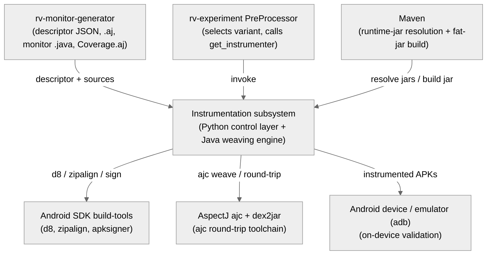
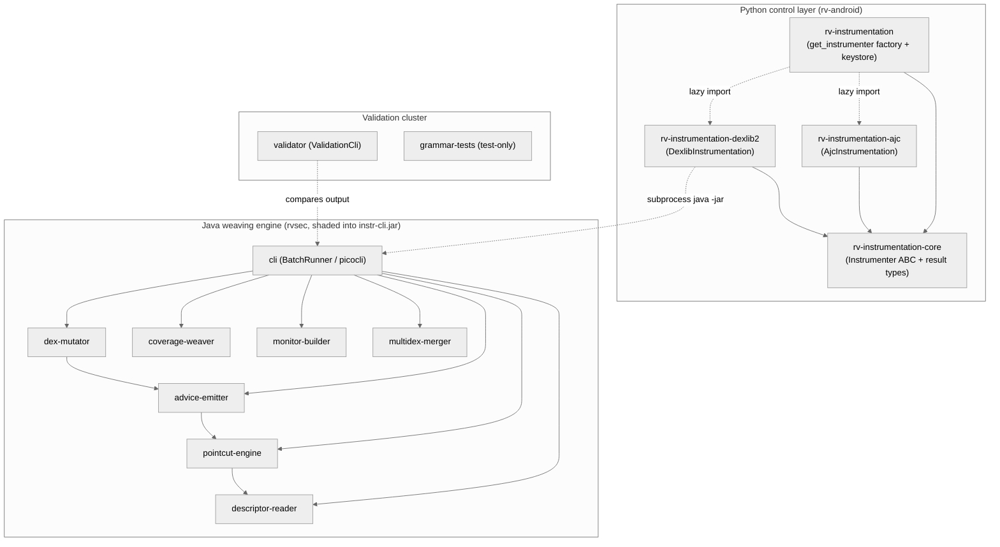
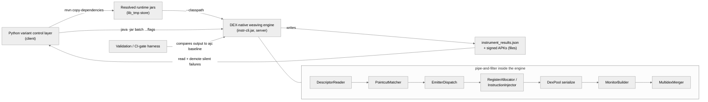

# Architecture — Instrumentation Subsystem

> Scope: **subsystem** · Generated by `rv-doc-arch` · Source model: `out/arch/subsystem-instrumentation/architecture-model.json`
> Languages: Python (4 modules, ~3,976 LOC) and Java (10 Maven modules, ~15,910 LOC)

## Table of Contents

- [Part I — Beyond Views](#part-i--beyond-views)
  - [1. Documentation overview](#1-documentation-overview)
  - [2. Conceptual primer](#2-conceptual-primer)
  - [3. System overview and context](#3-system-overview-and-context)
  - [4. How it works — end to end](#4-how-it-works--end-to-end)
  - [5. Core components](#5-core-components)
  - [6. Mapping between views](#6-mapping-between-views)
  - [7. Rationale](#7-rationale)
  - [8. Output artifacts](#8-output-artifacts)
  - [9. Directory](#9-directory)
- [Part II — Views](#part-ii--views)
  - [Module view](#module-view)
  - [Component-and-connector view](#component-and-connector-view)
  - [Allocation view](#allocation-view)
- [Appendices](#appendices)
- [Specification traceability](#specification-traceability)

---

## Part I — Beyond Views

### 1. Documentation overview

This document describes the **instrumentation subsystem** of RV-Android: the part of the framework that takes a normal Android APK and rewrites it so that, at runtime, calls to APIs under observation fire into generated runtime-verification monitors and every executed application method reports itself for coverage. The subsystem is deliberately cross-cutting: it spans two source trees and two languages — a thin Python control layer in the `rv-android` repository (four uv-workspace modules) and a fat Java/Maven weaving backend in the `rvsec` tree (ten Maven modules) — joined by a single `java -jar instr-cli.jar` subprocess call. The audience is a **new engineer with no prior exposure to the subsystem**; the goal is that a top-to-bottom read leaves you able to follow a real instrumentation run, understand why the code is split the way it is, and know where each responsibility lives.

**How to read this document:** Part I builds your mental model — what the subsystem is ([primer](#2-conceptual-primer)), how it behaves end to end ([walkthrough](#4-how-it-works--end-to-end)), and why it is shaped this way ([rationale](#7-rationale)). Part II documents the selected views in detail.

### 2. Conceptual primer

The instrumentation subsystem takes a normal Android APK and rewrites it so that, at runtime, calls to APIs under observation (e.g. `javax.crypto.Cipher`) fire calls into generated runtime-verification monitors, and every executed application method reports itself for coverage. It is the bridge between the abstract monitor specifications produced by `rv-monitor-generator` and a signed, installable APK that emits RVSEC events on a device. It spans two source trees and two languages: a thin Python control layer in `rv-android` (variant wrappers plus a factory) and a fat Java/Maven backend in the `rvsec` tree (the DEX-native weaving engine), bridged by a `java -jar instr-cli.jar` subprocess call.

**Why this approach.** There are two weaving strategies and the subsystem keeps both behind one interface. The legacy approach (the `ajc` variant) round-trips the APK through dex2jar → AspectJ compiler (ajc) → d8: it decompiles DEX to JVM bytecode, weaves with a real AspectJ weaver, then recompiles to DEX. That chain is mature but fragile on modern apps — R8-desugared Compose/Kotlin-coroutine classes routinely make ajc or d8 emit `VerifyError`, which is why the ajc pipeline carries a quarantine step that physically removes problem classes before weaving and restores them after. The newer approach (the `dexlib2` variant, gh52) rejects the round-trip entirely: it edits DEX bytecode in place with the smali-dexlib2 library, never leaving DEX form. The trade-off is that DEX-native weaving must re-implement, by hand, what AspectJ gives for free — a pointcut parser/matcher, an advice emitter, and (the hard part) a DEX register allocator that respects DEX's 4-bit/16-bit operand-encoding limits. The payoff is fidelity: no desugar round-trip means fewer `VerifyError`s and more faithful coverage (the ajc `Coverage.aj` path under-instruments, ceiling 6–37%, whereas dexlib2's method-entry probes reach far more methods). Both variants stay selectable because legacy apps still instrument more reliably under ajc, so neither is universally better.

**Key concepts**

- **DEX bytecode** — The register-based instruction format that Android runs (Dalvik/ART), distinct from stack-based JVM bytecode. Methods declare a fixed `registerCount`; parameters live in the highest registers and locals in the low ones.
- **pointcut / advice** — AspectJ vocabulary the engine borrows. A pointcut is a predicate selecting program points (e.g. `call(* Cipher.getInstance(..))` — every call to that method); advice is the code to run there (before / after / after-returning / after-throwing). The engine matches pointcuts against DEX instructions and emits advice as injected DEX instructions.
- **weaving** — The act of inserting advice instructions at matched join points. The dexlib2 engine weaves directly into `DexBackedDexFile` structures; the ajc engine weaves at the JVM-bytecode level after dex2jar.
- **descriptor JSON** — The machine-readable contract emitted by patched JavaMOP (`rv-monitor-generator`) alongside the legacy `.aj`. It models the aspect: its advices, their pointcut expressions, and the monitor methods to call. The dexlib2 engine parses this JSON, never the `.aj` text (INV-INS-56).
- **register allocation / shifting** — To inject advice the engine often needs scratch registers. DEX encodes many operands in 4-bit fields (v0–v15 only), so adding registers means growing the method's `registerCount` and shifting every existing operand up — or widening instructions to their 16-bit forms (`move-from16`, `invoke-range`). Getting this wrong yields an on-device `VerifyError` at install time.
- **variant** — One of the two interchangeable instrumentation implementations (`ajc`, `dexlib2`), both satisfying the `Instrumenter` ABC. `rv-experiment` picks one via `--instrumentation-variant`; the factory dispatches.

### 3. System overview and context

The subsystem sits between the monitor generator and the device. Upstream, **`rv-monitor-generator`** (patched JavaMOP / RV-Monitor) produces the JSON descriptor (`MultiSpec_*MonitorAspect.json`), the legacy `.aj`, the `RuntimeMonitor` `.java` sources, and `Coverage.aj` — all consumed by both variants. **`rv-experiment`'s PreProcessor** is the caller: during pre-processing it selects the variant and invokes `get_instrumenter`. **Maven** plays two roles: it resolves the monitors' runtime jars via `dependency:copy-dependencies` (a Template Method shared by both variants) and it builds/shades the Java engine fat jar. The **Android SDK build-tools** supply `d8` (DEX compile), `zipalign`, and `apksigner` used by the dexlib2 engine (d8 is also used by ajc), while **AspectJ (ajc) plus dex2jar** form the ajc variant's weaver and DEX↔JAR round-trip toolchain. Finally, an **Android device or emulator (adb)** is used not on the instrumentation hot path but by the validation harness's `BootValidator`, which installs instrumented APKs and captures logcat for on-device verification.

**Constraints:** Instrumented APKs must install and run on-device across the RVSEC toolchain (JavaMOP/RV-Monitor/AspectJ, Java 8+) and the Android SDK; monitor sources are compiled at `-source/-target 1.8` because d8 accepts ≤ Java 11 and modern javac rejects a bootclasspath at ≥ 9; on API 30+ `resources.arsc` must remain STORED or `PackageManager` rejects the APK with parse failure −124. The Java engine and Python layer share no memory — they communicate only through CLI flags (in) and result files plus signed APKs (out).

**System context diagram** (external actors and systems — every view refers back to this):



### 4. How it works — end to end

The following walks through a concrete example: **instrumenting a call to `javax.crypto.Cipher.getInstance(String)` in `cryptoapp.apk`, using the dexlib2 variant, so a before-advice fires into the generated `CipherSpec` monitor and the enclosing method also reports itself for coverage.** Each stage below transforms a typed artifact and hands it to the next.

1. **Variant selection (Python).** `rv-experiment`'s `PreProcessor` reads `instrumentation_variant` from `ExperimentConfig` and calls `rv_instrumentation.get_instrumenter(variant, config)`. The factory in `factory.py` lazy-imports only the chosen variant's module and returns a `DexlibInstrumentation` instance configured with the monitor output directory, working dir, and signing keystore. Concretely, `get_instrumenter("dexlib2", config)` → `DexlibInstrumentation`; `pre_processor.py:194` is the single dispatch site.

2. **Preparation + runtime classpath (Python).** `DexlibInstrumentation.prepare_instrumentation()` asserts a descriptor JSON exists in `monitor_output_dir` and that `lib/instr-cli.jar` is present, then runs the ABC Template Method `_resolve_runtime_libs` (`mvn dependency:copy-dependencies` against `rv-android/pom.xml`). That pulls ~13 jars; the wrapper narrows them with an allowlist to the three the monitors actually call at runtime, dropping `aspectjrt` and kotlin/surefire noise that would bloat the APK or trigger d8 duplicate-type errors. The allowlist is `("rv-monitor-rt", "rvsec-core", "rvsec-logger-logcat")`; these become `--classpath` entries the Java CLI dexes into the APK (`MonitorBuilder.java:114-129`).

3. **Subprocess boundary (Python → Java).** `instrument_apks()` shells out to `java -jar instr-cli.jar batch <apks_dir> --descriptor ... --monitor-src-dir ... --classpath ... --results-json ...`. The subprocess env is built explicitly (only `PATH`, `HOME`, `JAVA_HOME`, `ANDROID_HOME`, `RVSEC_HOME` — never wholesale `os.environ`, per INV-EXP-30) and runs with no wallclock timeout because weaving is a build operation that legitimately takes 10–30+ minutes on large APKs. `_build_subprocess_env` forwards exactly five keys; `_run_cli` raises `RuntimeError` carrying the CLI's stderr on non-zero exit.

4. **Descriptor read (Java).** Inside the JVM, `BatchRunner` reads the descriptor JSON with `DescriptorReader` (Jackson, `FAIL_ON_UNKNOWN_PROPERTIES=true`) into an `AspectDescriptor`. For our example one `AdviceDescriptor` has `position="before"`, `expression="call(* javax.crypto.Cipher.getInstance(..))"`, and a `MonitorCallDescriptor` naming the monitor event method to invoke — `monitorCall.method = "MultiSpec_1RuntimeMonitor.CipherSpec_g1Event"`, with `args` listing the advice-parameter names in monitor order.

5. **Pointcut parse + match (Java).** `PointcutExpressionParser` turns the expression string into an AST node — a `CallPC` record holding `(isConstructor=false, returnType, declaringType=Ljavax/crypto/Cipher;, methodName=getInstance, params, varargs)`. `PointcutMatcher` walks every method of every `DexBackedDexFile` looking at `invoke-*` instructions; when it finds the invoke of `Cipher.getInstance` it produces a `Match` recording the argument register bindings (`arg00..`) and, since a `move-result` follows, the synthetic `$return` register. The `Match` holds `argBindings` (keys `arg00..argNN` + `$return`), `targetRegister` (receiver or −1), and `isConstructor`; subtype matching delegates to `InheritanceResolver` backed by `AndroidClassIndex` (`android.jar` parsed via ASM).

6. **Advice emit (Java).** `EmitterDispatch` routes the before-advice to `BeforeEmitter`, which builds an `EmitPlan`: a list of DEX instructions (the monitor invoke built by `MonitorInvokeBuilder`), an `InsertionPoint` of `BEFORE`, and a `RegisterRequest` stating how many scratch registers are needed. `MonitorInvokeBuilder` resolves each `monitorCall.args` name to a concrete register; if any binding is unresolved it throws `UnresolvedBindingException` so the plan is skipped rather than emitting a literal `v0` that would `VerifyError` (INV-INS-71). `buildInvokeStatic` picks Format35c `INVOKE_STATIC` (≤5 args, all ≤ v15) or Format3rc `INVOKE_STATIC_RANGE` (contiguous v0–v65535).

7. **Register allocation + injection (Java).** `RegisterAllocator` honors the `RegisterRequest`: `RegisterShifter.bumpRegisterCount` grows the method's `registerCount` by the delta and re-homes labels/try-blocks, exposing fresh scratch slots at the high end; if any existing 4-bit operand would exceed v15 after the shift it widens it (`move` → `move-from16`, etc.) or, when unwidenable, skips the method atomically. `InstructionInjector` then splices `plan.toInsert` before the matched invoke — taking care to insert after any trailing `move-result` the verifier requires to be adjacent. The `VerifyError` trigger is guarded here: a 4-bit operand exceeding v15 without widening, or a `registerCount` not bumped, produces "tried to get class from non-reference register vN" at install.

8. **Coverage weave (Java).** `CoverageWeaver` visits each application class not excluded by `PackageFilter` and injects a 2-instruction probe at method entry: `const-string` the Soot-style method signature, then `invoke-static Lmop/Coverage;.log`. If the method has no free low register it calls `RegisterShifter.spillLowRegisters(impl,1)` to free v0; on spill failure the method is skipped and counted. `PackageFilter` excludes `Ljava/`, `Landroid/`, `Landroidx/`, `Lkotlin/`, `Lmop/`, `Lcom/google/` … so only app code is probed; the probe logs to logcat tag `RVSEC-COV`.

9. **Monitor build (Java).** `MonitorBuilder` compiles the rv-monitor-emitted `MultiSpec_*RuntimeMonitor.java` with javac (`-source/-target 1.8`) against `android.jar` + the allowlisted runtime jars, then runs d8 over the resulting `.class` files **and** the runtime jars as positional args so the support classes (`com.runtimeverification.rvmonitor.java.rt.*`, `br.unb.cic.mop.*`) are dexed inline; d8 auto-splits at the 65,536 method-ref limit. `runD8` passes classpath jars positionally (`MonitorBuilder.java:114-129`); omitting them compiles but yields a runtime `ClassNotFoundException`.

10. **Merge + sign (Java).** `MultidexMerger` repacks the original APK ZIP verbatim (preserving STORED vs DEFLATED so `resources.arsc` stays STORED for API 30+), substitutes the woven app DEXes, appends each monitor DEX as `classes<next>.dex` past the highest app index, then `zipalign -p -f 4` and apksigner v3-signs with the keystore. The signed APK lands in the output dir. API 30+ requires `resources.arsc` STORED or `PackageManager` rejects with parse failure −124; the merger preserves multidex partitioning (INV-INS-52).

11. **Result parse (Python).** The wrapper reads `instrument_results.json`, counts success entries, and — crucially — runs `_demote_silent_failures`: any APK the JSON claims succeeded but is missing on disk is demoted to an error, because the CLI can exit 0 after a silent javac/d8 drop (the gh53 bug that produced phantom 0%-coverage successes). It returns an `InstrumentationResults` tagged `variant="dexlib2"`. `_demote_silent_failures` cross-checks `(results_dir / apkName).is_file()` against each JSON success entry; phase strings on errors include `dex_only`, `build_only`, `dexlib2_pipeline`.

### 5. Core components

At runtime the subsystem is four cooperating components. The **Python variant control layer** is the in-process Python that `rv-experiment`'s `PreProcessor` drives: it picks a variant through `get_instrumenter`, runs `prepare_instrumentation` (which itself spawns a Maven subprocess to resolve runtime jars), then either weaves in-process (ajc, via a chain of dex2jar/ajc/d8 subprocesses) or hands off to the Java engine (dexlib2, via one `java -jar` call). It owns result interpretation: parsing `instrument_results.json`, demoting silent failures, and tagging every result with its variant. It is the only component that touches the experiment's configuration and the only one that knows both variants exist.

The **DEX-native weaving engine (`instr-cli.jar`)** is a separate JVM process launched once per batch (or once per APK in subset mode). Internally it is a pipeline — `DescriptorReader` → `PointcutMatcher` → `EmitterDispatch` → `RegisterAllocator`/`InstructionInjector` → DexPool serialization → `MonitorBuilder` → `MultidexMerger`, orchestrated by `BatchRunner` inside `cli`. It communicates with the Python layer only through CLI flags (in) and `instrument_results.json` + the signed APK files (out); it shares no memory. It is the source of truth for instrumentation behaviour — the Python dexlib2 wrapper only orchestrates it.

The **validation / CI-gate harness** is a separate set of JVM entry points (`ValidationCli` plus the grammar-tests JUnit suite) that run in CI and on-device. Its layers take ajc and dexlib2 outputs for the same input + descriptor and compare hooks, boot `VerifyError`s, event traces, batch coverage equivalence, and coverage recall, each emitting a pass/fail Report. It is not on the instrumentation hot path — it runs offline to gate promotion.

Finally, the **resolved runtime jars** are a per-variant `lib_tmp` directory populated by `mvn dependency:copy-dependencies` against `rv-android/pom.xml`. Both variants read from it: ajc merges the `.class` files into the woven JAR; dexlib2 forwards the allowlisted jar paths to the Java CLI's `--classpath` where d8 dexes them into the APK. It is the shared-data link that lets the two variants agree on which runtime classes the monitors need.

| Component | Realized by | Responsibility |
|-----------|-------------|----------------|
| Python variant control layer | rv-instrumentation-core, rv-instrumentation, rv-instrumentation-ajc, rv-instrumentation-dexlib2 | Select a variant, prepare the runtime classpath, invoke the engine, parse + validate results. |
| DEX-native weaving engine (`instr-cli.jar`) | descriptor-reader, pointcut-engine, advice-emitter, dex-mutator, coverage-weaver, monitor-builder, multidex-merger, cli | Read descriptor, match pointcuts, emit + inject advice into DEX, build monitors, merge + sign. |
| Validation / CI-gate harness | validator, grammar-tests | Prove dexlib2 is non-inferior to the ajc baseline before its results are trusted. |
| Resolved runtime jars | rv-instrumentation-core (`_resolve_runtime_libs`) | Provide rv-monitor-rt, rvsec-core, rvsec-logger-logcat (+ aspectjrt for ajc) on the monitor classpath. |

### 6. Mapping between views

The module structure and the runtime component structure line up cleanly, but across a language boundary that is the defining feature of this subsystem. The four Python modules together **realize** the single runtime component "Python variant control layer": `rv-experiment`'s `PreProcessor` calls `rv-instrumentation` (`get_instrumenter(variant, config)` at `pre_processor.py:194`), which lazy-imports either `rv-instrumentation-ajc` or `rv-instrumentation-dexlib2`; all three depend on `rv-instrumentation-core` for the `Instrumenter` ABC and result types, and only on `-core` (INV-INS-41 keeps the graph acyclic). The eight Java engine modules (`descriptor-reader`, `pointcut-engine`, `advice-emitter`, `dex-mutator`, `coverage-weaver`, `monitor-builder`, `multidex-merger`, and the `cli` that contains them) together realize the runtime component "DEX-native weaving engine", shaded into one `instr-cli.jar`. The two remaining Java modules (`validator`, `grammar-tests`) realize the "validation / CI-gate harness".

The load-bearing cross-language boundary is between `rv-instrumentation-dexlib2` (Python) and the `dexlib2-java-engine` (Java): the mechanism is a **subprocess**, `java -jar instr-cli.jar (instrument|batch)`. Nothing is shared in memory across it. What crosses *in* is a set of CLI flags — the descriptor path, the monitor source dir, the allowlisted `--classpath` jars, and the results-json path. What crosses *out* is files: `instrument_results.json` (per-APK `success`/`phase`/`message`/`weaveCounts`) and the signed APKs on disk. Because the boundary is a subprocess with a file-based result contract, the Python wrapper cannot trust the exit code alone — hence `_demote_silent_failures` re-checks the filesystem. On the install/deploy axis, the shaded `instr-cli.jar` is auto-copied by Maven into `modules/rv-instrumentation-dexlib2/lib/` (design D9), the shared `keystore.jks` lives in `rv-instrumentation/assets`, and the validator's `BootValidator` deploys instrumented APKs onto a device/emulator via `adb install`.

### 7. Rationale

The decisions that shaped this architecture, each with the tension behind it and the failure mode it avoids.

**DEX-native weaving (dexlib2) as an alternative to the dex2jar+ajc+d8 round-trip.** The ajc pipeline must round-trip the APK out of DEX and back, and that round-trip is where modern apps break: R8-desugared Compose/Kotlin classes make ajc or d8 emit `VerifyError`, which is why ajc needs a quarantine step that physically removes problem classes. The rejected alternative was to keep extending that quarantine machinery. dexlib2 instead never leaves DEX form, eliminating the desugar round-trip entirely and producing more faithful coverage (the ajc `Coverage.aj` path under-instruments, ceiling 6–37%). The cost is severe: the engine must re-implement pointcut parsing, advice emission, and — the genuinely hard part — a DEX register allocator that respects 4-bit/16-bit operand limits. Without DEX-native weaving the framework would keep losing measurable apps to quarantine and report systematically low coverage on the very apps the research targets.

**Two interchangeable variants behind one `Instrumenter` ABC, ajc kept as default.** Neither pipeline dominates: dexlib2 gives better coverage fidelity but ajc instruments legacy (OLD-era) apps more reliably and produces ~1.34× fewer `VerifyError`s on some datasets. The rejected alternative was to flip the default to dexlib2 (a Phase-6 plan that was discarded). Instead both implement the same `Instrumenter` ABC with the same `instrument_apks` contract, and `InstrumentationResults` carries a `variant` tag so downstream reports always know which produced them. Without the shared ABC + variant tag, swapping pipelines would mean rewriting every caller and losing the ability to compare them on the same corpus.

**Stage separation: matcher / emitter / mutator as independent Maven modules.** The tension is that all three stages touch the same join point but for different reasons: the matcher decides *where*, the emitter decides *what* instructions and how many registers, the mutator decides *where those registers physically live* and splices the bytecode. Folding them together (the obvious alternative) would scatter DEX register-encoding knowledge throughout pointcut logic and make any stage untestable in isolation. By keeping them separate — matcher produces `Match`, emitter produces `EmitPlan`, mutator consumes both — the gnarly `RegisterShifter`/`RegisterAllocator` logic is concentrated in `dex-mutator` (its 10 test classes), and the pointcut grammar gets its own 40-class corpus (`grammar-tests`). `FeatureMappingChecker` (INV-INS-54) even enforces that every AspectJ construct maps to a named (module, class, method, smali pattern, test). Without this separation a register-allocation bug would be indistinguishable from a pointcut-matching bug.

**Skip rather than emit invalid advice; never default a register to v0.** DEX is strictly verified at install time: a 4-bit operand exceeding v15, a register holding the wrong type, or a stale operand after a shift all produce `VerifyError` and the whole APK fails to install. The naive alternative — emit something and hope — once produced exactly that (a literal v0 default). The decision is to treat every encoding hazard as a reason to skip: `UnresolvedBindingException` skips the plan, `HighRegisterNonContiguous` skips it, an unwidenable shift skips the method, and each skip increments a `WeaveReport` counter. This trades a small loss of instrumentation completeness for a guarantee that the instrumented APK installs and runs. Without it, one unweavable method anywhere in a large app would brick the entire instrumented APK.

**JSON descriptor (not `.aj` text) as the rv-monitor-generator → engine contract.** The engine needs the aspect's advices, pointcuts, and monitor-call targets. The rejected alternative is to scrape the generated `.aj` source text, which is brittle and couples the engine to AspectJ's surface syntax. Instead patched JavaMOP emits `MultiSpec_<N>MonitorAspect.json` alongside the `.aj`, mirroring the AspectJ AST that produced it (INV-INS-56), and `DescriptorReader` parses that with a strict Jackson mapper (`FAIL_ON_UNKNOWN_PROPERTIES=true`) so contract drift fails fast. `DescriptorAjParityChecker` gates that the JSON still matches the `.aj` on name, package, and advice count. Without the JSON contract the engine would re-derive semantics by parsing text, and every JavaMOP formatting change would risk silently corrupting instrumentation.

**No wallclock timeout on the weaving subprocess; explicit env forwarding.** Instrumentation is a build operation whose time scales with APK method count — a 249k-method APK legitimately took 14m14s. A wallclock timeout (the tempting default) would abort exactly those large, real-world apps the corpus contains. The decision is no wallclock cap (an inactivity watchdog would be the correct future hang-detector). Separately, the subprocess env is built from exactly five OS variables rather than wholesale `os.environ`, because INV-EXP-30 (layer purity) forbids leaking user-facing `RV_*` config across the process boundary into the Java toolchain. Without these two choices, big APKs would be falsely failed and experiment config would bleed into the engine.

**Decisions at a glance**

| Decision | Drivers | Invariant / ADR |
|----------|---------|-----------------|
| DEX-native weaving (dexlib2) vs dex2jar+ajc+d8 round-trip | fidelity on R8-desugared apps; fewer VerifyErrors; more faithful coverage | — |
| Two variants behind one `Instrumenter` ABC, ajc default | legacy apps weave more reliably under ajc; empirical A/B; no forced migration | INV-INS-55 |
| Stage separation: matcher / emitter / mutator as separate modules | single responsibility per stage; stage-level testability; isolate register-allocation complexity | INV-INS-54 |
| Skip rather than emit invalid advice; never default to v0 | on-device VerifyError avoidance; fail-soft per method; observable skip counters | INV-INS-71 |
| JSON descriptor (not `.aj` text) as the generator→engine contract | stable machine contract; avoid brittle text parsing; AST-faithful semantics | INV-INS-56 |
| No wallclock timeout on weaving subprocess; explicit env forwarding | weave time scales with method count; layer purity; avoid aborting slow runs | INV-EXP-30 |

**Patterns and styles**

The subsystem is **layered** on both sides of the language boundary. On the Python side the layering is core (abstraction) ← variants ← parent, acyclic and enforced by INV-INS-41 (variants depend only on `-core`, never the parent or each other). On the Java side the `cli` sits above the engine libraries, with `descriptor → matcher → emitter → mutator → builder → merger` forming an allowed-to-use ordering. **Generalization** appears twice: both variants subclass the `Instrumenter` ABC, and `PointcutExpression` is a sealed interface with 11 record implementations enabling exhaustive matching. The **uses** style is visible in `cli/pom.xml` depending on all 7 engine library modules and in the per-APK directed uses-chain. At runtime the subsystem is **client-server** (the Python wrapper invokes the Java engine as a request/response subprocess, no shared memory) wrapped around a **pipe-and-filter** core (`BatchRunner.runPipeline` streams each APK through read → match → emit → mutate/inject → serialize → build → merge/sign, each stage transforming a typed artifact). On the allocation axis the dominant style is **install** (maven-shade shades `cli` into `instr-cli.jar`, finalName `instr-cli`; a maven-resources execution auto-copies it into `modules/rv-instrumentation-dexlib2/lib/` per design D9; the shared `keystore.jks` lives in `rv-instrumentation/assets`), with a secondary **deployment** aspect (the Java engine runs as a separate JVM; `BootValidator` deploys instrumented APKs to a device via `adb install`).

**NFRs served**

*Compatibility (NFR07).* The subsystem must produce APKs that install and run on-device across the RVSEC toolchain (JavaMOP/RV-Monitor/AspectJ, Java 8+) and Android SDK. The dexlib2 engine compiles monitor sources with javac `-source/-target 1.8` and d8 (d8 accepts ≤ Java 11), recomputes `registerCount` and widens 4-bit instructions to from16/range forms so woven methods pass on-device DEX verification, and the merger preserves `resources.arsc` as STORED for API 30+ (parse-failure −124 avoidance). The ajc variant recomputes stack-map frames (`rv-frame-computer`) before and after weaving for the same reason.

*Extensibility (NFR02).* Adding a third weaving strategy means creating a module that declares only `rv-instrumentation-core`, subclassing `Instrumenter`, and adding one lazy-import branch to `get_instrumenter` — no caller changes, because `rv-experiment` codes against the ABC. The documented threshold is that the third concrete variant is the signal to migrate from explicit branches to a registry.

*Resilience (NFR04).* Failure is fail-soft at every granularity. The Java engine encodes how-far-it-got in a phase string (`signed`/`dex_only`/`build_only`/`apk_read`/`io_error`) and degrades gracefully when builder/merger tools are absent (nullable `BuilderConfig`/`MergerConfig`). The dexlib2 wrapper demotes one APK's failure to a per-APK error rather than aborting the batch, and `_demote_silent_failures` rejects phantom successes the CLI claims but did not write. The weaver skips unweavable methods atomically with counters instead of producing an uninstallable APK.

*Observability (NFR06).* Every batch run emits `instrument_results.json` (per-APK success/phase/message/weaveCounts) and `instrument_errors.json`, the wrapper logs structured per-APK `pipeline_stage` events with timings, and on-device monitors log to logcat tags `RVSEC` (events) and `RVSEC-COV` (coverage), which the validator parses to compute recall and VerifyError-site diffs.

*Modularity (NFR01).* The Python side is four uv-workspace modules with an acyclic dependency graph (INV-INS-41) installed editable by one `uv sync`; the Java side is a 10-module Maven reactor where each weaving stage is its own artifact. The two trees couple only through the CLI flag contract and the auto-copied fat jar (D9).

| NFR | PRD ID | Architectural support |
|-----|--------|-----------------------|
| Compatibility | NFR07 | Java-8 javac/d8, registerCount recompute + 4-bit widening, STORED `resources.arsc`, ajc frame recompute |
| Extensibility | NFR02 | New variant = one `-core`-only module + one factory branch; registry migration at the third variant |
| Resilience | NFR04 | Phase strings, nullable builder/merger configs, per-APK error demotion, atomic method skips |
| Observability | NFR06 | `instrument_results.json` / `instrument_errors.json`, structured pipeline logs, RVSEC/RVSEC-COV logcat |
| Modularity | NFR01 | 4 acyclic Python modules + 10-module Maven reactor, coupled only by CLI + fat jar |

### 8. Output artifacts

A successful run leaves a signed, deployable APK plus machine-readable result and error files; the dexlib2 fat jar and the validator reports are build-time and CI-time artifacts respectively.

| Artifact | Location | Notes |
|----------|----------|-------|
| Instrumented + signed APKs | `results_dir` (e.g. `results/<id>/instrumented_apks/`) | Ready to deploy; hash differs from original (INV-INS-06). |
| `instrument_results.json` | `results_dir` | Per-APK `{apkName, success, phase, message, weaveCounts}`; dexlib2 batch path. |
| `instrument_errors.json` | `results_dir` | Per-APK error map keyed by APK name; both variants. |
| `instr-cli.jar` | `modules/rv-instrumentation-dexlib2/lib/` | Shaded fat jar auto-copied by Maven (D9); gitignored. |
| Validation Report JSON | validator output | Per-layer `{layer, passed, message, metrics}`; exit 0/1 CI gate. |

### 9. Directory

**Glossary / acronyms**

- **ABC** — Abstract Base Class (Python); here the `Instrumenter` contract.
- **ajc** — the AspectJ compiler; also the name of the legacy weaving variant.
- **d8** — Android SDK tool that compiles JVM `.class` files to DEX.
- **DEX** — Dalvik Executable bytecode format run by ART/Dalvik.
- **dexlib2** — the smali-dexlib2 DEX-manipulation library; also the name of the DEX-native variant.
- **EmitPlan / Match / RegisterRequest** — the typed artifacts passed matcher → emitter → mutator.
- **JCA** — Java Cryptography Architecture, one of the monitored specification sets.
- **MOP** — monitored operations (the operations a specification watches).
- **R8** — the Android code shrinker/desugarer whose output the ajc round-trip struggles with.
- **VerifyError** — on-device DEX verification failure at install time.

**References**

- Per-module 4+1 docs: `modules/<m>/docs/architecture.md`.
- ADRs: `modules/<m>/docs/adr/`.
- PRD: `docs/PRD.md`.
- Domain spec: `openspec/specs/instrumentation/spec.md`.
- Design D9 (Maven fat-jar copy): `rv-instrumentation-dexlib2` design notes.

---

## Part II — Views

### Module view

*Style(s): layered, decomposition*

This view shows how source modules are organized and which is allowed to depend on which. It matters because the subsystem's whole shape — two interchangeable variants behind one contract, a weaving engine decomposed into testable stages — is a story about module boundaries. There are two clusters: the Python control cluster (a strict layering of core ← variants ← parent) and the Java engine cluster (a 10-module Maven reactor decomposed by pipeline stage). The acyclic constraint INV-INS-41 is the load-bearing rule on the Python side.

**Primary presentation**



**Element catalog**

The Python cluster begins with **rv-instrumentation-core**, which holds only the contract. `Instrumenter` is an ABC with a single `@abstractmethod`, `instrument_apks(apks_dir, results_dir, force_instrumentation, apk_paths) -> InstrumentationResults`, so any variant is interchangeable from the caller's point of view. It also provides one concrete Template Method, `_resolve_runtime_libs`, which both variants reuse (it runs `mvn ... dependency:copy-dependencies -Dmdep.stripVersion=true` into a per-variant `lib_tmp` dir and returns the resolved jars). `InstrumentationResults` is a validated model carrying `success_count`, `total_count`, an `errors` map keyed by APK name, a required `variant` tag, and a computed `success_rate`; a `model_validator(mode="before")` injects `variant="ajc"` for legacy JSON that predates the field (INV-INS-55). The module exists to keep the dependency graph acyclic (INV-INS-41): variants depend on `-core`, the parent depends on `-core` AND the variants — if the ABC and result types lived in the parent, every variant would import the parent and the parent imports the variants, a cycle. Two gotchas: `variant` is a required Field with no default on the construction path (the retrocompat default applies only to incoming dicts via the before-validator), and `_resolve_runtime_libs` depends on `-Dmdep.stripVersion=true` matching the pom or the name-based allowlists silently match nothing.

**rv-instrumentation** is the parent canonical entry point and is deliberately almost empty. `factory.py` defines `get_instrumenter(variant, config)`: for `"ajc"` it lazy-imports `AjcInstrumentation`, for `"dexlib2"` it lazy-imports `DexlibInstrumentation`, otherwise it raises `ValueError`. The lazy import is load-bearing — selecting one variant never imports the other, so a Docker layer that built only one variant's runtime can still call the factory. The parent re-exports `Instrumenter`, `InstrumentationResults`, and `InstrumentationError` so consumers import the whole public API from `rv_instrumentation` regardless of variant, and it owns the single shared signing asset `assets/keystore.jks`. It is the stable public surface and the single dispatch site (INV-INS-36). Note the parent declares all three siblings as dependencies but lazy-imports the impls inside the chosen branch (declaration ≠ import), and the CLI does *not* live here — it is library-only.

**rv-instrumentation-ajc** is the AspectJ-based variant. `AjcInstrumentation` orchestrates a 7-stage subprocess pipeline per APK: dex2jar decompiles DEX to a JAR; desugar shims are stripped and VerifyError-prone library classes are quarantined to a side-jar (gh50); `rv-frame-computer` fixes stack maps; ajc weaves the AspectJ monitors and `Coverage.aj`; frames are recomputed; the quarantined classes are restored; runtime jars are merged; d8 recompiles JAR to DEX; jarsigner/apksigner sign. It shares `_resolve_runtime_libs` via the ABC and tracks per-APK errors keyed by phase. It is kept because legacy apps weave more reliably under it, and it depends only on `-core` so the two toolchains never entangle. Gotchas: the quarantine+restore pair (driven by `assets/weaving_excludes.yaml`) is enabled by default and `--no-quarantine` is for empirical comparison only; coverage is capped (`Coverage.aj` ceiling ~6–37%), so cross-variant coverage numbers are not directly comparable; ajc produces ~1.34× fewer VerifyErrors but loses more methods to quarantine.

**rv-instrumentation-dexlib2** is the DEX-native variant — a subprocess orchestrator, not a weaver. `prepare_instrumentation` validates a descriptor and `instr-cli.jar` exist, resolves runtime libs via the ABC Template Method, then narrows them to a 3-artifact allowlist. `instrument_apks` runs either the CLI `batch` subcommand (whole dir, one JVM, fast path) or, when `apk_paths` names a strict subset, the `instrument` subcommand once per APK. It parses `instrument_results.json` into `InstrumentationResults(variant="dexlib2")` and applies `_demote_silent_failures`. It depends only on `-core`; the actual weaving lives in a separate Maven tree so the Java engine can evolve and be tested independently — the only coupling is the CLI flag contract and the auto-copied jar (design D9). Gotchas: `lib/instr-cli.jar` is gitignored and produced by the Maven build (the Docker build fails loudly if absent); there is deliberately no wallclock timeout (an inactivity watchdog would be the correct future hang-detector); both paths can be lied to by the CLI, which is why `_demote_silent_failures` exists (root cause of the gh53 0%-coverage incident).

The Java engine cluster decomposes the pipeline. **descriptor-reader** parses the descriptor JSON into the `AspectDescriptor` model with a strict Jackson mapper; the advice kind is encoded as `position` string + `isAround` boolean + presence of `returning`/`throwing` (no single enum), and `FAIL_ON_UNKNOWN_PROPERTIES=true` makes contract drift fail fast. **pointcut-engine** parses pointcut strings to an AST (`PointcutExpression` is a sealed interface with 11 record implementations) and matches them against DEX methods/instructions, producing `Match` objects; it must account for wide slots (long/double occupy two operand slots), constructor matching is defence-in-depth (INV-INS-70), and the synthetic `$return` binding is captured by peeking the instruction after the matched invoke (INV-INS-72). **advice-emitter** turns a matched advice into an `EmitPlan` of DEX instructions plus a `RegisterRequest`; around advice throws (out of gh52 scope), an unresolved binding skips the plan (INV-INS-71), and `buildInvokeStatic` throws `HighRegisterNonContiguous` when a register exceeds v15 with non-contiguous operands. **dex-mutator** is the only stage that mutates bytecode and the only one that must understand DEX encoding limits — `RegisterShifter`/`RegisterAllocator` handle bumping `registerCount`, spilling low registers, and widening 4-bit operands; on frame growth the MMI must be swapped via `replaceImpl` (INV-INS-87) or the growth is dropped. **coverage-weaver** injects the method-entry probe under the canonical `PackageFilter` exclusion (INV-INS-53). **monitor-builder** compiles monitor sources (javac then d8, passing classpath jars positionally). **multidex-merger** repacks/zipaligns/signs, preserving STORED `resources.arsc` (INV-INS-52) and using apksigner v3 only (INV-INS-51). **cli** is the picocli entry point that contains and orchestrates all seven engine libraries and shades them into `instr-cli.jar`.

The validation cluster has two modules. **validator** is a layered CI-gate harness (5 layers: hook-recall diff, boot VerifyError diff, trace F1/kappa, batch Wilcoxon TOST non-inferiority, coverage recall) plus parity/feature-mapping checkers. **grammar-tests** is a test-only module (40 test classes, no main sources) exercising the pointcut grammar.

| Element | Responsibility | Relations / interfaces |
|---------|----------------|------------------------|
| rv-instrumentation-core | `Instrumenter` ABC + Pydantic result types + `_resolve_runtime_libs` Template Method | Depended on by all variants and parent (INV-INS-41) |
| rv-instrumentation | `get_instrumenter` factory + shared keystore; re-exports `-core` API | Depends on `-core`; lazy-imports variants |
| rv-instrumentation-ajc | AspectJ 7-stage pipeline with quarantine | Implements `Instrumenter`; depends only on `-core` |
| rv-instrumentation-dexlib2 | Subprocess orchestrator for the Java engine | Implements `Instrumenter`; subprocess → `cli` |
| descriptor-reader | Parse descriptor JSON → `AspectDescriptor` | Consumed by pointcut-engine |
| pointcut-engine | Parse pointcut AST + match against DEX → `Match` | Consumes `AspectDescriptor`; uses `InheritanceResolver` |
| advice-emitter | Build `EmitPlan` + `RegisterRequest` from a match | Consumes `Match` |
| dex-mutator | Register allocation/shifting + instruction injection | Executes `EmitPlan` |
| coverage-weaver | Method-entry coverage probe under `PackageFilter` | Standalone pass in `cli` |
| monitor-builder | javac + d8 of monitor sources → DEX | Invoked by `BatchRunner` |
| multidex-merger | Repack + zipalign + apksigner | Invoked by `BatchRunner` |
| cli | picocli entry; `BatchRunner` orchestration; shaded fat jar | Contains all 7 engine libs |
| validator | 5-layer non-inferiority CI gate | Compares dexlib2 vs ajc output |
| grammar-tests | Pointcut-grammar coverage tests (test-only) | Exercises pointcut-engine |

**Context** — see [system context](#3-system-overview-and-context).

**Variability guide**

The chosen weaving variant is the primary point of variability: `--instrumentation-variant {ajc,dexlib2}` selects which implementation `get_instrumenter` returns; ajc is the Pydantic default and dexlib2 is opt-in. Within the ajc variant, `--no-quarantine` toggles the quarantine/restore steps (empirical comparison only). Adding a third variant is a documented extension point: a new module declaring only `-core`, a new `Instrumenter` subclass, and one factory branch — with the third variant being the documented signal to switch the factory from explicit branches to a registry.

**Rationale**

The Python layering exists to break a dependency cycle while letting both variants share the contract and the Maven-resolution Template Method: pulling the ABC and result types into a leaf module with zero dependencies on any impl (INV-INS-41) is what allows the parent to depend on the variants without the variants depending on the parent. The Java decomposition exists so that the three stages that touch a join point for different reasons (where / what / where-the-registers-live) stay independently testable, concentrating register-encoding complexity in `dex-mutator` and pointcut breadth in `grammar-tests`. The validation cluster is deliberately separate so the gates can run in CI without being entangled with the engine they judge.

### Component-and-connector view

*Style(s): client-server, pipe-and-filter*

This view shows the subsystem at runtime: the processes that exist and how they talk. The defining structural feature is the **client-server subprocess boundary** between the Python control layer and the Java engine — they share no memory and communicate only through CLI flags and result files. Inside the Java engine the structure is **pipe-and-filter**: each APK streams through a chain of filters, each transforming a typed artifact into the next.

**Primary presentation**



**Element catalog**

| Component / connector | Type | Responsibility |
|-----------------------|------|----------------|
| Python variant control layer | component (in-process) | Select variant, prepare classpath, invoke engine, interpret results. |
| DEX-native weaving engine | component (subprocess JVM) | Read descriptor → match → emit → inject → build → merge/sign. |
| Resolved runtime jars | store (`lib_tmp` dir) | Supply rv-monitor-rt / rvsec-core / rvsec-logger-logcat to the monitor classpath. |
| Validation / CI-gate harness | component (subprocess JVM) | Compare dexlib2 output to the ajc baseline; emit pass/fail Reports. |
| `java -jar instr-cli.jar` | connector (subprocess, request/response) | The cross-language boundary; CLI flags in, result file + APKs out. |
| `mvn copy-dependencies` / `--classpath` | connector (subprocess + path passing) | Resolve and forward runtime jars. |
| `instrument_results.json` + APK files | connector (file/data) | The result channel re-validated against the filesystem. |
| Engine filter chain | connector (pipe-and-filter) | `AspectDescriptor → Match → EmitPlan → mutated DEX → DEX files → signed APK`. |

**Context** — see [system context](#3-system-overview-and-context).

**Variability guide**

The dexlib2 wrapper drives the engine in one of two modes over the same subprocess connector: the `batch` subcommand (whole APK dir, one JVM, fast path) or the `instrument` subcommand once per APK when `apk_paths` names a strict subset. The engine itself degrades gracefully along the filter chain: when build-tools or signing tools are absent it stops at `phase=dex_only` or `phase=build_only` (nullable `BuilderConfig`/`MergerConfig`) instead of crashing.

**Scenarios**

*WHEN a before-advice matches a call whose arguments occupy registers up to v14 and the monitor invoke needs one more scratch register*, THEN `RegisterShifter.bumpRegisterCount` grows the method's `registerCount` by 1 and shifts existing operands, widening any operand pushed past v15 to its `from16`/range form, AND the woven method still verifies on-device because the register file was grown (not overflowed) and no 4-bit field exceeds v15. *Why:* DEX packs many operands into 4-bit fields; exceeding v15 without widening produces an invalid instruction and a `VerifyError` at install time.

*WHEN the monitor invoke needs a binding (e.g. a returning value) that the matcher could not resolve to a concrete register*, THEN `MonitorInvokeBuilder` throws `UnresolvedBindingException` and the `EmitPlan` is skipped, incrementing `plansSkippedUnresolvedBinding`, AND the rest of the method and the rest of the APK are woven normally; the APK still installs. *Why:* INV-INS-71 forbids defaulting an unresolved binding to literal v0 — doing so once produced on-device `VerifyError`s; skipping is fail-soft.

*WHEN the CLI's batch run exits 0 and marks an APK `success:true` in `instrument_results.json` but no APK file was actually written to `results_dir`*, THEN `_demote_silent_failures` moves that entry from the success count to the errors map with `phase=dexlib2_pipeline`, AND the reported `success_count` reflects only APKs that exist on disk. *Why:* a silent javac/d8 drop can leave the CLI reporting success without output — the gh53 incident where cryptoapp showed 0% coverage despite a reported success.

*WHEN rv-experiment is configured with `instrumentation_variant="dexlib2"` but `instr-cli.jar` is missing from the module's `lib/`*, THEN `prepare_instrumentation` raises `FileNotFoundError` before any APK is processed (and the Docker build would have failed earlier because it gates on the jar's presence), AND the experiment fails fast at preparation rather than crashing partway through a long batch. *Why:* the jar is a build artifact (D9 copy) that is gitignored; failing loudly up front avoids a half-finished experiment.

*WHEN coverage weaving reaches a method whose every register holds a parameter (`localCount == 0`)*, THEN `CoverageWeaver` calls `RegisterShifter.spillLowRegisters(impl,1)` to free v0 for the const-string probe; on spill failure the method is skipped and counted as `methodsSpillFailed`, AND all other methods of the class are still probed. *Why:* the coverage probe needs one free register for the signature string; an all-parameter method has none free without a spill, and an unspillable method is a small accepted coverage gap rather than a crash.

*WHEN the merger repacks an API-30+ APK that stored `resources.arsc` uncompressed (STORED)*, THEN `MultidexMerger.repackZip` copies `resources.arsc` preserving its STORED flag rather than re-deflating it, AND `PackageManager` accepts the instrumented APK instead of rejecting it with parse failure −124. *Why:* Android API 30+ requires `resources.arsc` to be uncompressed; re-deflating it during repack makes the APK uninstallable.

*WHEN the descriptor JSON contains an `around` advice*, THEN `EmitterDispatch.select` throws `UnsupportedOperationException` for that advice, AND before/after-family and staticinitialization advices in the same descriptor are still woven. *Why:* around weaving is out of gh52 scope for the DEX-native engine; failing explicitly on the unsupported construct is clearer than silently mis-weaving it.

**Rationale**

The subprocess boundary is what lets the Java weaving engine evolve, be unit-tested, and be shaded independently of the Python control layer — the only coupling is the CLI flag contract and the auto-copied jar. Because the connector is request/response over files (not shared memory), the client cannot trust the exit code alone, which is why result interpretation re-checks the filesystem. The pipe-and-filter interior keeps each transformation a pure function of its input artifact, so a failure (or a skip) at any filter is localized and observable in the `WeaveReport` counters rather than corrupting the whole run.

### Allocation view

*Style(s): install*

This view shows how the software is packaged and placed for execution: which artifacts are built, where they are copied, and what shared asset they depend on. It matters because the cross-language boundary is bridged by a *build-time copy* (the shaded fat jar lands in the Python module's `lib/`) and by a *single shared signing asset* used by both variants.

**Primary presentation**

```mermaid
%%{init: {'theme': 'neutral'}}%%
flowchart TB
  shade["maven-shade-plugin<br/>(shade cli → instr-cli.jar)"]
  jar["instr-cli.jar<br/>(finalName instr-cli)"]
  libdir["modules/rv-instrumentation-dexlib2/lib/<br/>(gitignored)"]
  keystore["rv-instrumentation/assets/keystore.jks<br/>(shared signing asset)"]
  ajcvar["rv-instrumentation-ajc<br/>(jarsigner / apksigner)"]
  dexvar["rv-instrumentation-dexlib2<br/>(java -jar)"]
  device["Android device / emulator<br/>(adb install — BootValidator)"]

  shade --> jar
  jar -->|maven-resources copy (D9)| libdir
  libdir --> dexvar
  keystore --> ajcvar
  keystore --> dexvar
  dexvar -->|signed APK| device
```

**Element catalog**

| Software element | Allocated to | Notes |
|------------------|--------------|-------|
| `instr-cli.jar` (shaded engine) | `modules/rv-instrumentation-dexlib2/lib/` | Produced by maven-shade (finalName `instr-cli`); auto-copied by maven-resources execution (design D9); gitignored. |
| `keystore.jks` (shared signing asset) | `rv-instrumentation/assets/` | Used by apksigner (both variants) and jarsigner (ajc). |
| Resolved runtime jars | per-variant `lib_tmp/` | Populated by `mvn dependency:copy-dependencies`; dexed into the APK via `--classpath` (dexlib2) or merged (ajc). |
| Instrumented + signed APKs | `results_dir` | Deployed to a device/emulator by `BootValidator` via `adb install` for on-device verification. |

**Context** — see [system context](#3-system-overview-and-context).

**Variability guide**

The fat-jar copy (D9) is the install mechanism for the dexlib2 engine; because the jar is gitignored, a clean checkout has no engine until the Maven build runs, and a missing jar fails the Docker build loudly and `prepare_instrumentation` early. The deployment aspect (placing instrumented APKs on a device via adb) is exercised only by the validator's `BootValidator`, not by the instrumentation hot path.

**Rationale**

Shading the engine into a single `instr-cli.jar` and copying it into the Python module's `lib/` keeps the cross-language coupling to exactly one artifact plus a flag contract — the Java reactor can be rebuilt and re-shaded without touching Python source. Keeping `keystore.jks` as one shared asset in the parent (rather than duplicated per variant) ensures both pipelines sign with the same identity, so instrumented APKs from either variant are comparable and installable under the same trust assumptions.

---

## Appendices

### A. Dependencies

The subsystem's external dependencies split by language. On the **Python** side the modules are pure-Python uv-workspace members whose only runtime "dependency" of note is Pydantic (for the validated `InstrumentationResults` model) plus the standard library; the heavy lifting is delegated to external processes. The Maven CLI is invoked as a subprocess for runtime-jar resolution. On the **Java** side the engine reactor depends on smali-dexlib2 (DEX manipulation), Jackson (descriptor JSON parsing, strict mode), ASM (parsing `android.jar` in `AndroidClassIndex`), picocli (CLI surface), and the Android SDK build-tools (`d8`, `zipalign`, `apksigner`) plus a JDK (`javac`) located via `JAVA_HOME`. The ajc variant additionally depends on AspectJ (`ajc`, `aspectjrt`), dex2jar, and `rv-frame-computer`. Runtime monitor support comes from `rv-monitor-rt`, `rvsec-core`, and `rvsec-logger-logcat`, resolved from `rv-android/pom.xml`. The two trees are coupled only through the CLI flag contract and the auto-copied `instr-cli.jar` (design D9).

### B. Data model

*Not applicable — the model defines no persistent data entities. The subsystem's structured outputs (`instrument_results.json`, `instrument_errors.json`, validation Report JSON) are described in [Output artifacts](#8-output-artifacts), and the in-flight typed artifacts (`AspectDescriptor`, `Match`, `EmitPlan`, `WeaveReport`) are described in the [pipe-and-filter view](#component-and-connector-view).*

---

## Specification traceability

Domain: **instrumentation** · Spec: `openspec/specs/instrumentation/spec.md`

This subsystem maps cleanly to the instrumentation domain spec: it realizes the three functional requirements for monitor generation, APK instrumentation, and coverage instrumentation, and it enforces a dense set of instrumentation invariants spread across the Python layering and the Java weaving stages. The NFRs are realized as described in [Rationale](#7-rationale). One note on scope: this is a cross-tree subsystem (Python in `rv-android`, Java in `rvsec`), so the invariants below are enforced in both trees — the Python-layer invariants (e.g. INV-INS-41, INV-INS-55, INV-EXP-30) in the control modules, and the weaving invariants (e.g. INV-INS-51/-52/-53/-54/-56/-70/-71/-72) inside the Java engine and validator.

| Type | IDs | Where realized |
|------|-----|----------------|
| Functional requirements | FR01, FR02, FR03 | FR01 monitor generation (`monitor-builder`, descriptor contract); FR02 APK instrumentation (`dex-mutator`, `multidex-merger`, both variants); FR03 coverage instrumentation (`coverage-weaver`, `Coverage.aj`). |
| Invariants | INV-INS-41, -51, -52, -53, -54, -55, -56, -58, -59, -70, -71, -72 | -41 acyclic Python graph (`-core`); -51/-52 apksigner v3 + multidex preservation (`multidex-merger`); -53 canonical coverage filter (`PackageFilter`); -54 feature-mapping (`FeatureMappingChecker`); -55 variant retrocompat default (`InstrumentationResults`); -56 JSON-not-`.aj` contract (`DescriptorReader`, `DescriptorAjParityChecker`); -58 non-inferiority promotion gate (`validator`); -70 constructor match defence-in-depth (`pointcut-engine`); -71 skip-not-default-v0 (`advice-emitter`); -72 synthetic `$return` capture (`pointcut-engine`). |
| NFRs | NFR01, NFR02, NFR04, NFR06, NFR07 | see [Rationale](#7-rationale) |

**Related documentation:** per-module 4+1 docs (`modules/<m>/docs/architecture.md`), ADRs (`modules/<m>/docs/adr/`), PRD (`docs/PRD.md`).
