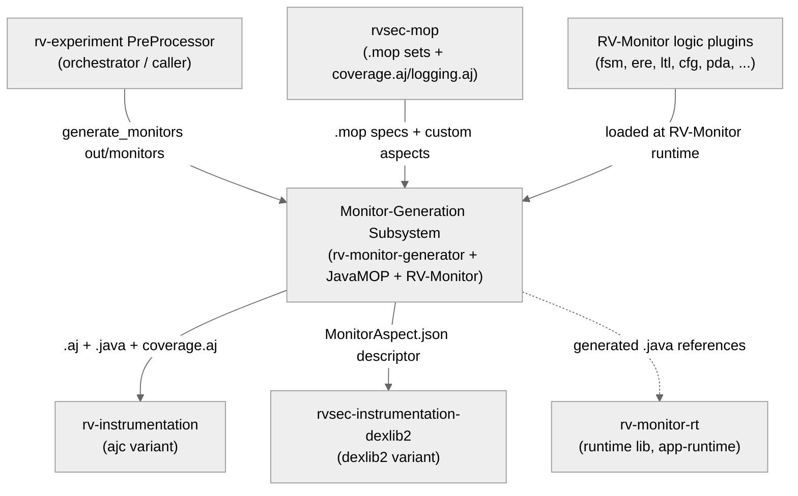
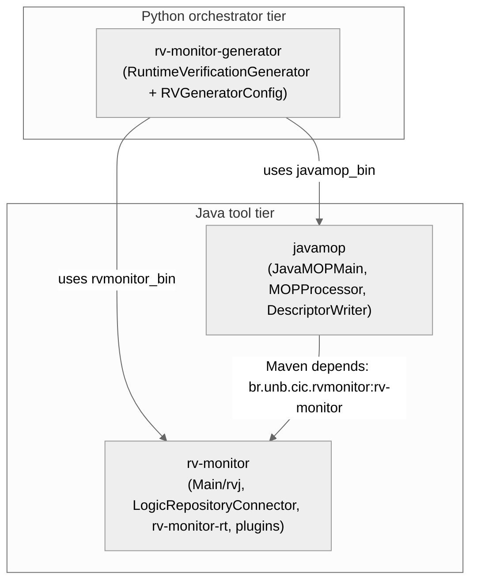
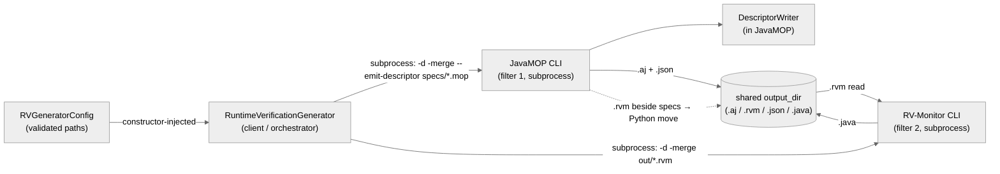
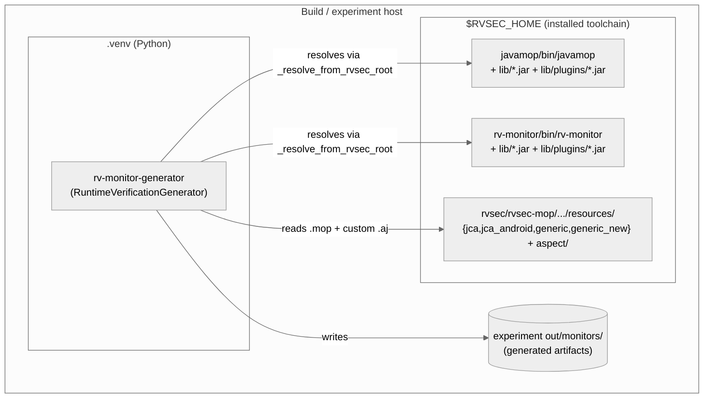

# Architecture — Monitor Generation Subsystem

> Scope: **subsystem** · Generated by `rv-doc-arch` · Source model: `out/arch/subsystem-monitor-generation/architecture-model.json`
> Languages: Python (1 module, ~1,005 LOC orchestration) + Java (6 modules, ~181,265 LOC across the forked JavaMOP and RV-Monitor reactors)

## Table of Contents

- [Part I — Beyond Views](#part-i--beyond-views)
  - [1. Documentation overview](#1-documentation-overview)
  - [2. Conceptual primer](#2-conceptual-primer)
  - [3. System overview and context](#3-system-overview-and-context)
  - [4. How it works — end to end](#4-how-it-works--end-to-end)
  - [5. Core components](#5-core-components)
  - [6. Mapping between views](#6-mapping-between-views)
  - [7. Rationale](#7-rationale)
  - [8. Output artifacts](#8-output-artifacts)
  - [9. Directory](#9-directory)
- [Part II — Views](#part-ii--views)
  - [Module view](#module-view)
  - [Component-and-connector view](#component-and-connector-view)
  - [Allocation view](#allocation-view)
- [Appendices](#appendices)
- [Specification traceability](#specification-traceability)

---

## Part I — Beyond Views

### 1. Documentation overview

This document describes the **monitor-generation subsystem** of RV-Android: the first stage of
the instrumentation pipeline, responsible for turning formal MOP specifications into the
concrete runtime-verification artifacts that the downstream weavers consume. Its scope is one
Python orchestrator module (`rv-monitor-generator`) plus the two forked Java command-line
tools it drives (`javamop` and `rv-monitor`, the latter a small multi-module reactor of its
own). The audience is a new engineer with no prior exposure to this subsystem; by reading top
to bottom you should understand *what* it produces, *how* a concrete generation run flows
through it, and *why* it is shaped as a thin Python driver over heavyweight Java tools.

**How to read this document:** Part I builds your mental model — what the subsystem is
([primer](#2-conceptual-primer)), how it behaves end to end
([walkthrough](#4-how-it-works--end-to-end)), and why it is shaped this way
([rationale](#7-rationale)). Part II documents the selected views in detail.

### 2. Conceptual primer

The monitor-generation subsystem is the first stage of the RV-Android instrumentation
pipeline. It turns formal MOP specifications — `.mop` files that describe legal API-usage
patterns (for example, "a `Cipher` must be `init()`ed before `doFinal()`") — into the concrete
artifacts a runtime-verification run needs: AspectJ aspects (`.aj`) that declare *where* in the
bytecode to intercept method calls, Java monitor classes (`.java`) that implement the state
machines deciding *whether* an observed call sequence is legal, and a JSON descriptor mirroring
each aspect for the DEX-native weaver. Structurally it is a thin Python orchestrator
(`rv-monitor-generator`, one module, ~1k LOC) that drives two large forked Java command-line
tools — JavaMOP and RV-Monitor — as subprocesses.

**Why this approach.** The obvious alternative would be to reimplement MOP compilation in
Python: parse the `.mop` grammar, build the FSM/ERE/LTL/CFG/PDA logic engines, and synthesize
monitor code natively. RVSEC instead reuses the mature Runtime Verification Inc. toolchain
(`runtimeverification/javamop` and `runtimeverification/rv-monitor`), forked into the monorepo
under `br.unb.cic.*` groupIds. The trade-off is deliberate: it pulls in two heavyweight Maven
builds, a JVM start-up per invocation, and a Python→shell→Java process boundary, but it avoids
reimplementing decades of formal monitor-synthesis logic (a JavaCC grammar plus ten logic
plugins). The Python side therefore owns only orchestration, configuration/path resolution, and
two workarounds around JavaMOP quirks — nothing about monitor semantics.

**Key concepts**

- **MOP specification (`.mop`)** — A Monitoring-Oriented Programming spec: a text file pairing
  AspectJ-style events (method-call pointcuts) with a temporal/state-machine property that
  classifies event sequences as valid or violating. It is the subsystem's input; spec sets live
  under `$RVSEC_HOME/rvsec/rvsec-mop/src/main/resources/{jca,jca_android,generic,generic_new}`.
- **AspectJ pointcut / advice** — A pointcut is a pattern selecting join points (for example
  `call(* Cipher.getInstance(..))`); advice is code that runs before/after/around them. JavaMOP
  emits pointcut+advice as an `.aj` file; the advice body calls into the generated monitor.
- **`.rvm` intermediate** — The RV-Monitor input format: a monitor state-machine specification
  distilled from a `.mop`. JavaMOP produces it; RV-Monitor consumes it. It is a transient
  artifact — deleted after monitor synthesis.
- **RV-Monitor logic plugin** — One jar per supported formalism (fsm, ere, ltl, cfg, pda,
  ptltl, …) under `lib/plugins/`. RV-Monitor loads them at runtime by exact filename to
  synthesize the correct monitor code for a spec's logic.
- **merged aspect (`-merge`)** — By default JavaMOP/RV-Monitor emit one aspect per spec. With
  `-merge` all specs in a set are combined into a single `MultiSpec_<N>MonitorAspect.aj` and one
  `MultiSpec_<N>RuntimeMonitor.java`, so one aspect intercepts everything instead of N aspects
  multiplying runtime overhead.
- **descriptor JSON** — A `MultiSpec_<N>MonitorAspect.json` file emitted by the UnB-local
  `--emit-descriptor` patch to JavaMOP. It carries the same pointcut/advice/monitor-call
  information as the `.aj`, but as a machine-readable tree so the DEX-native (dexlib2) weaver
  never has to parse textual AspectJ.
- **specification set** — A named group of `.mop` files used as a unit: `jca` (23
  cryptography-misuse specs), `jca_android` (the same 23 derived against generated CrySL rules
  for a declared Android API level), `generic`/`generic_new` (general API-usage specs). Exactly
  one set is used per experiment run; the caller selects it by pointing `mop_specs_dir` at the
  set.

### 3. System overview and context

The subsystem sits between the RVSEC spec repository and the two instrumentation variants. Its
input is the `rvsec-mop` resource tree, which supplies the `.mop` specification sets
(`jca`/`jca_android`/`generic`/`generic_new`) plus the hand-written custom aspects `coverage.aj` and
`logging.aj`. Its output feeds two consumers: the **ajc variant** of `rv-instrumentation`,
which weaves the generated `.aj` and `.java` (plus `coverage.aj`) into APKs via dex2jar + ajc +
d8; and the **dexlib2 variant** (`rvsec-instrumentation-dexlib2`), which reads only the
`MultiSpec_*MonitorAspect.json` descriptor as its sole pointcut/advice contract for DEX-native
weaving. The whole subsystem is driven by the `rv-experiment` **PreProcessor**, which builds an
`RVGeneratorConfig` (via `ExperimentConfig.get_monitored_operations_config()`) and calls
`RuntimeVerificationGenerator(config).generate_monitors(<out>/monitors)`.

Two further external systems participate at tool-runtime. The **RV-Monitor logic plugins** —
per-formalism jars (fsm, ere, ltl, cfg, pda, …) — are loaded from `lib/plugins/` while
RV-Monitor synthesizes monitor code. And **rv-monitor-rt**, the RV-Monitor runtime library, is
the only `rv-monitor` artifact consumed at *app* runtime: it is woven/linked into instrumented
APKs so the generated monitor classes have their runtime support. It is referenced by the
generated `.java`, but it is not produced by this subsystem's invocation.

**Constraints:** Generation runs entirely on the build/experiment host (no emulator or device
is involved at this stage). It requires an installed RVSEC toolchain resolvable under
`RVSEC_HOME`, and it targets Java 8+ for the forked tools. Exactly one specification set is used
per run; sets are never mixed (INV-INS-09).

**System context diagram** (external actors and systems — every view refers back to this):

### 4. How it works — end to end

The following walks through a concrete example: **generating the merged JCA monitor set**.
`rv-experiment` asks for JCA monitors, so the generator runs JavaMOP + RV-Monitor over the 23
`.mop` files in `$RVSEC_HOME/rvsec/rvsec-mop/src/main/resources/jca/` (including the
Cipher-misuse spec whose event fires on `call(* Cipher.getInstance(..))`) and produces
`MultiSpec_1MonitorAspect.aj`, `MultiSpec_1MonitorAspect.json`, and
`MultiSpec_1RuntimeMonitor.java` in the output directory.

1. **Config resolution + fail-fast validation.** `RVGeneratorConfig.model_post_init` runs
   `_resolve_paths` then `_validate_configuration` at construction time, so a misconfigured
   environment fails before any tool runs. With `RVSEC_HOME` set and no explicit overrides,
   `_resolve_from_rvsec_root` fills `javamop_bin`, `rvmonitor_bin`, `mop_specs_dir`, and
   `aspects_dir` from the standard layout. Validation checks that the two binaries exist and are
   executable, the directories are readable, at least one `.mop` file is present, and that each
   tool prints *something* to stdout/stderr when probed with `-h` (JavaMOP and RV-Monitor exit
   non-zero on `-h`, so the check looks at output, not exit code). Concretely: `javamop_bin =
   $RVSEC_HOME/javamop/bin/javamop`; `rvmonitor_bin = $RVSEC_HOME/rv-monitor/bin/rv-monitor`;
   `mop_specs_dir = $RVSEC_HOME/rvsec/rvsec-mop/src/main/resources/jca`; `aspects_dir =
   .../resources/aspect`.

2. **Reset output directory.** `generate_monitors(output_dir)` first calls
   `self.config.validate_output_directory(output_dir)` (mkdir + write-probe) and then
   `utils.reset_folder(output_dir)` to guarantee a clean generation environment, so stale
   artifacts from a previous set can never leak into the current run. Here `output_dir` is
   `<experiment out>/monitors/` (the `MONITORS_DIR` created by `PreProcessor._generate_monitors`).

3. **JavaMOP: `.mop` → `.aj` + `.rvm` + `.json`.** `_execute_javamop` builds a
   `Command(javamop_bin, ['-d', output_dir, '-merge', '--emit-descriptor',
   '<mop_specs_dir>/*.mop'])` and runs it via `utils.execute_command`. Inside the JVM,
   `JavaMOPMain.main` → `process` → `processMultipleFiles` parses each `.mop` with
   `SpecExtractor`, writes a per-spec `.rvm` via `processor.generateRVFile`, then
   `FileCombiner.combineSpecFiles` merges them and `writeCombinedAspectFile` emits the single
   merged aspect. Because `--emit-descriptor` is set, `processor.generateDescriptorFile` →
   `DescriptorWriter.buildAspect` walks the same `CombinedAspect`/`EventManager`/
   `AdviceAndPointCut` model that produced the `.aj` and serializes it to JSON with Jackson. This
   stage outputs `MultiSpec_1MonitorAspect.aj` and `MultiSpec_1MonitorAspect.json`. The JSON
   `advices[]` entry for the Cipher event carries `expression: "call(...Cipher.getInstance(..))
   && ..."`, an `imports` list (the authority for mapping `Cipher` → `Ljavax/crypto/Cipher;`),
   and `monitorCalls[]` naming the monitor method + args.

4. **`.rvm` move workaround.** JavaMOP's `-d` flag relocates the `.aj`/`.json` outputs but
   leaves the `.rvm` files sitting next to the source `.mop` files in `mop_specs_dir`. The
   generator compensates immediately with `utils.move_files_by_extension('.rvm',
   self.config.mop_specs_dir, output_dir)` so RV-Monitor (which globs the output dir) will find
   them. Without this move, RV-Monitor would see zero `.rvm` files and produce no monitor
   classes. Concretely, the `.rvm` files are moved from `.../resources/jca/` into `output_dir`.

5. **Copy custom aspects.** `utils.copy_files_by_extension('.aj', self.config.aspects_dir,
   output_dir)` copies the hand-written aspects — `coverage.aj` and `logging.aj` — into the
   output directory so they sit alongside the generated monitor aspect and get woven together
   downstream. `coverage.aj` is what makes real-time coverage measurement possible (it logs
   every method execution as `Log.v('RVSEC-COV', signature)`); its absence would leave coverage
   reading 0%. Source: `$RVSEC_HOME/rvsec/rvsec-mop/src/main/resources/aspect/coverage.aj` and
   `logging.aj`.

6. **RV-Monitor: `.rvm` → `.java`.** `_execute_rvmonitor` builds `Command(rvmonitor_bin, ['-d',
   output_dir, '-merge', '<output_dir>/*.rvm'])`. The `bin/rv-monitor` launcher puts `lib/*.jar`
   and `lib/plugins/*.jar` on the classpath and calls the RV-Monitor `Main`;
   `LogicRepositoryConnector` loads the logic plugin matching each spec's formalism and
   synthesizes the merged Java monitor class implementing the verification state machine. This
   produces `MultiSpec_1RuntimeMonitor.java` in `output_dir`. Plugin jars are loaded by exact
   name (`fsm.jar`, `ere.jar`, …) from `lib/plugins/`, per the assembly's `outputFileNameMapping`.

7. **Cleanup + summary.** `_execute_rvmonitor` finishes by calling
   `utils.delete_files_by_extension('.rvm', output_dir)` — the `.rvm` intermediaries have served
   their purpose and MUST NOT remain (INV-INS-04). `generate_monitors` returns `True`; callers
   can then call `get_generation_summary(output_dir)`, which globs the directory and reports
   counts of `.aj`, `.java`, and `*MonitorAspect.json` files plus the spec count. The final
   `output_dir` contains `MultiSpec_1MonitorAspect.aj`, `MultiSpec_1MonitorAspect.json`,
   `MultiSpec_1RuntimeMonitor.java`, `coverage.aj`, `logging.aj`, and zero `.rvm` files.

### 5. Core components

`RuntimeVerificationGenerator` is the single runtime coordinator of the subsystem. It holds a
validated `RVGeneratorConfig`, a `LoggingManager` logger tagged with component context, and the
singleton `ErrorHandler`. Its `generate_monitors` method is the only public behavior: it runs
the two private stage methods (`_execute_javamop`, `_execute_rvmonitor`) sequentially against a
single `output_dir`, and any exception anywhere in the pipeline is funneled to
`ErrorHandler.handle_error` with a context dict (`component`, `operation`, `output_dir`,
`mop_specs_dir`, `pipeline_stage`) and converted into a `False` return. It never manages
processes itself — it delegates each tool run to `rv_android_core`'s `Command` +
`utils.execute_command`.

`RVGeneratorConfig` is a Pydantic model whose `model_post_init` runs resolution and validation
eagerly, so an operational error surfaces at construction (INV-INS-12) rather than mid-pipeline.
It embodies the configurability contract: four explicit path fields (`javamop_bin`,
`rvmonitor_bin`, `mop_specs_dir`, `aspects_dir`), an `rvsec_root` shortcut, and an
`emit_descriptor` toggle. `_resolve_from_rvsec_root` encodes the standard RVSEC layout as string
joins; `_validate_tool_functionality` probes each binary with `-h` and treats *any*
stdout/stderr as success because the tools exit non-zero on help.

The **JavaMOP CLI** is a JVM process launched through the `bin/javamop` shell launcher, which
sets `LOGICPLUGINPATH` and the `lib`/`lib/plugins` classpath and invokes `javamop.JavaMOPMain`.
From the Python side it is a black box invoked once per generation with `-d <out> -merge
[--emit-descriptor] <specs>/*.mop`. It is the first filter in the transformation chain: `.mop`
in, `.aj` + `.rvm` (+ `.json`) out.

The **RV-Monitor CLI** is the second filter: a JVM process invoked with `-d <out> -merge
<out>/*.rvm`. Its launcher classpaths the per-formalism plugin jars, and
`LogicRepositoryConnector` selects the right one per spec to emit the merged
`RuntimeMonitor.java`. It shares the output directory with JavaMOP as the hand-off medium
(JavaMOP writes `.rvm` there via the Python move workaround; RV-Monitor reads them and then they
are deleted).

`DescriptorWriter` is the load-bearing part of the UnB-local patch. It walks the fully-built
`CombinedAspect` → `EventManager.getAdvices()` → `AdviceAndPointCut`, emitting per-advice `name`,
`parameters`, `position`, `expression` (the raw pointcut source), and `monitorCalls[]` (method +
specName + eventId + args), plus aspect-level `package`, `imports`, `commonPointcut`, and the
twelve-entry `baseAspectExclusions`. It intentionally mirrors `AdviceAndPointCut.toString()` so
the JSON stays semantically equivalent to the `.aj`, and it keeps pointcut expressions as strings
because rv-monitor-generated expressions are regular enough for the weaver's pattern matcher.

| Component | Realized by | Responsibility |
|-----------|-------------|----------------|
| `RuntimeVerificationGenerator` | `modules/rv-monitor-generator/src/rv_monitor_generator/runtime_verification_generator.py` | Drives the two-tool pipeline in-process; owns invocation order, workarounds, and error handling. |
| `RVGeneratorConfig` | `modules/rv-monitor-generator/src/rv_monitor_generator/config.py` | Priority-based path resolution and fail-fast validation of tools, directories, and spec availability. |
| JavaMOP CLI (subprocess) | `../javamop/src/main/java/javamop/JavaMOPMain.java`, `../javamop/src/main/scripts/bin/javamop` | Compiles a spec set's `.mop` into a merged `.aj` (+ `.rvm`, + optional `.json`). |
| RV-Monitor CLI (subprocess) | `../rv-monitor/rv-monitor/src/main/java/com/runtimeverification/rvmonitor/java/rvj/Main.java`, `../rv-monitor/bin/rv-monitor` | Synthesizes `.java` monitor classes from the `.rvm` intermediates using logic plugins. |
| `DescriptorWriter` | `../javamop/src/main/java/javamop/output/descriptor/DescriptorWriter.java`, `.../AspectJDescriptor.java` | Serializes the AspectJ output model to a JSON tree so the DEX-native weaver never parses textual `.aj`. |

### 6. Mapping between views

The module-view elements and the runtime (component-and-connector) elements correspond closely,
because this subsystem is small and mostly a driver. The Python module `rv-monitor-generator`
realizes two runtime components: `RuntimeVerificationGenerator` (`rvmg-orchestrator`) and
`RVGeneratorConfig` (`rvmg-config`), both in-process Python objects. The Java module `javamop`
realizes the runtime `JavaMOP CLI` component and contains `DescriptorWriter`; the Java module
`rv-monitor` realizes the runtime `RV-Monitor CLI` component. At build time `javamop` depends on
`rv-monitor` (Maven dependency `br.unb.cic.rvmonitor:rv-monitor`), but at generation *runtime*
the orchestrator drives the two CLIs independently and their only coupling is the shared output
directory.

The **cross-language / process boundary** is the defining feature of this subsystem and must be
made explicit. The Python orchestrator never links against any Java code. It reaches JavaMOP and
RV-Monitor only through `rv_android_core`'s `Command` + `utils.execute_command`, which spawn the
`bin/javamop` and `bin/rv-monitor` shell launchers as **subprocesses** — a new JVM start-up per
call. What crosses the boundary is entirely file-based: command-line arguments in, and files
(`.aj`, `.rvm`, `.json`, `.java`) written to the shared `output_dir` out. There is no shared
memory, no RPC, and no serialized objects across the boundary — the file system is the sole
integration medium, which is exactly why the `.rvm` move workaround (a file operation) is
sufficient to repair the JavaMOP `-d` bug.

For allocation, each Java tool is not consumed as a source module but as an **installed
artifact**: `maven-assembly-plugin` builds `target/release/javamop/` and
`target/release/rv-monitor/` with a `bin/` launcher and `lib/`+`lib/plugins/` jars, and the
Python side resolves the *installed* launchers under `$RVSEC_HOME` via
`_resolve_from_rvsec_root`. The module-root `bin/javamop` and `bin/rv-monitor` scripts are dev
traps that only delegate to those installed launchers.

### 7. Rationale

The decisions that shaped this architecture, each with the tension behind it and the failure
mode it avoids.

**Reuse the forked RV toolchain instead of reimplementing MOP compilation.** The tension is
between owning a small Python codebase and reimplementing an enormous, subtle formal-methods
pipeline. RVSEC chose to fork `runtimeverification/javamop` and `runtimeverification/rv-monitor`
into the monorepo (rebasing groupIds to `br.unb.cic.*`) and invoke them unchanged as CLIs. The
rejected alternative — a native Python MOP compiler — would have to reimplement a JavaCC
grammar, ten logic formalisms (FSM/ERE/LTL/CFG/PDA/…), and monitor code generation, all of which
are research-grade and easy to get subtly wrong. Without this decision the subsystem would be an
order of magnitude larger and would carry the correctness risk of a bespoke monitor
synthesizer; the cost paid instead is a heavyweight Java/Maven build dependency and a
per-invocation JVM/subprocess boundary.

**Merge all specs into one aspect (`-merge`) for both tools.** Both `_execute_javamop` and
`_execute_rvmonitor` pass `-merge`. The alternative — one `.aj`/`.java` per `.mop` — would
produce 23 separate aspects for the JCA set, each installing its own interception machinery into
the woven APK and multiplying per-call overhead. Merging yields a single aspect that intercepts
all monitored operations, which matters because the woven code runs on a resource-constrained
Android device during every test. Without `-merge`, instrumented APKs would be larger and slower
and the downstream weaver would have N artifacts to integrate instead of one.

**Emit a JSON descriptor to decouple the DEX-native weaver from textual `.aj`.** The DEX-native
(dexlib2) instrumentation variant weaves at the bytecode level and needs the
pointcut/advice/monitor-call structure of each aspect, but parsing textual AspectJ is brittle
and duplicative. The decision was to add a UnB-local patch (`DescriptorWriter`/`AspectJDescriptor`,
refs #52) that serializes the *same* in-memory AspectJ model to JSON, making the descriptor the
canonical contract and forbidding `.aj` text parsing (spec: "Parsing of the textual `.aj` is
forbidden as a contract source"). The rejected alternative — have the weaver parse `.aj` — would
couple the weaver to AspectJ surface syntax and break on any formatting change.
`RuntimeVerificationGenerator` enables `emit_descriptor` by default so one generation run serves
both the ajc and dexlib2 variants; if the flag were off (or the JavaMOP unpatched), the dexlib2
variant would raise `MissingDescriptorError`. The descriptor also carries the `imports` list as
the authority for mapping simple type names (`Cipher`) to DEX descriptors
(`Ljavax/crypto/Cipher;`) and a pre-expanded twelve-entry `baseAspectExclusions` list
(INV-INS-97).

**Work around JavaMOP's `-d` bug by moving `.rvm` files in Python.** JavaMOP's `-d` flag
relocates `.aj`/`.json` but leaves `.rvm` beside the source `.mop` files — a real, unfixed
upstream bug. Rather than patch JavaMOP further, the generator owns the fix in one line:
`utils.move_files_by_extension('.rvm', mop_specs_dir, output_dir)` immediately after the JavaMOP
call. The alternative (patch JavaMOP's output routing) would deepen the fork and risk diverging
from upstream; the alternative of pointing RV-Monitor at `mop_specs_dir` would pollute the
read-only spec resources directory with generated artifacts. Without the move, RV-Monitor globs
an empty `output_dir/*.rvm`, synthesizes no monitor classes, and the run violates INV-INS-01 (no
`.java` produced). The pipeline then deletes the `.rvm` files from `output_dir` after synthesis
(INV-INS-04).

**Priority-based path resolution with fail-fast validation.** The subsystem must run in
heterogeneous environments (developer boxes with custom tool builds, CI with a standard RVSEC
install, Docker images). `RVGeneratorConfig` resolves paths in a fixed priority order
(explicit-path > `rvsec_root` > `RVSEC_HOME`) and validates them eagerly in `model_post_init`, so
a missing binary or empty spec set raises `ConfigurationError` at construction, not three
subprocesses deep. The rejected alternative — lazy validation at execution — would surface
failures mid-pipeline after a JVM has already run, with a partially-populated output directory
and a less actionable error. Fail-fast keeps the failure adjacent to its cause (INV-INS-12).

**Decisions at a glance**

| Decision | Drivers | Invariant / ADR |
|----------|---------|-----------------|
| Reuse forked RV toolchain vs. reimplement MOP compilation | avoid reimplementing `.mop` grammar + 10 logic plugins; reuse validated synthesis; small Python surface | — |
| Merge all specs into one aspect (`-merge`) | reduce runtime weaving/interception overhead; single woven aspect vs. N | — |
| Emit JSON descriptor to decouple dexlib2 weaver from `.aj` | weaver must not parse AspectJ; canonical machine-readable contract; type-name resolution via `imports` | INV-INS-97 |
| Work around JavaMOP `-d` bug by moving `.rvm` in Python | JavaMOP `-d` does not relocate `.rvm`; RV-Monitor globs output dir | INV-INS-04 |
| Priority-based path resolution + fail-fast validation | deploy flexibility (dev/CI/prod); fail before running any tool | INV-INS-12 |

**Patterns and styles**

At the module level the subsystem is **layered** and **uses**-structured: the Python
orchestrator sits above the Java tool layer, the dependency is one-directional and acyclic, and
`javamop` depends on `rv-monitor` (not vice versa). At the component-and-connector level it is a
**pipe-and-filter** chain (`.mop` → JavaMOP → `.aj` + `.rvm` → RV-Monitor → `.java`, with the
shared output directory as the connector) realized over a **client-server** substrate (the
Python orchestrator is the client; each Java tool is a request/response subprocess with a JVM
start-up per call). At the allocation level it follows an **install** style: the Maven assembly
produces `bin/` + `lib/` + `lib/plugins/` layouts that the Python side resolves under
`$RVSEC_HOME`.

**NFRs served**

The subsystem's **Compatibility** (NFR07) is what lets it target the RVSEC toolchain entirely
through external processes: the Python side carries no JVM dependency of its own, and it degrades
gracefully across JavaMOP builds because `emit_descriptor` is additive — a patched JavaMOP
produces the extra `.json` while an unpatched one silently ignores `--emit-descriptor` and still
yields byte-identical `.aj`/`.rvm`/`.java`, with `get_generation_summary` reporting
`descriptors:0` so the mismatch is observable rather than silent. **Configurability** (NFR05) is
realized by making every path a Pydantic field with a documented resolution order (explicit →
root → env → `ConfigurationError`); the CLI exposes each field as a flag and `rv-experiment`
injects an `RVGeneratorConfig` via `get_monitored_operations_config()` — this is the canonical
instance of the system-wide "explicit → root → env → fallback" pattern named in NFR05.
**Resilience** (NFR04) comes from wrapping the whole pipeline in a single try/except that routes
any exception (including `CommandException` from a non-zero RV-Monitor exit) through the
centralized `ErrorHandler` with a structured context and returns `False` instead of propagating;
configuration problems are caught even earlier, at construction. **Reproducibility** (NFR08) is
achieved because generation is deterministic for a given spec set: the output directory is reset
before every run, the same `-merge` invocation over the same `.mop` set yields the same merged
artifacts, and additive descriptor emission never perturbs the ajc pipeline's inputs.

| NFR | PRD ID | Architectural support |
|-----|--------|-----------------------|
| Compatibility | NFR07 | External-process integration; additive `emit_descriptor` degrades gracefully across JavaMOP builds; `descriptors:0` makes mismatch observable. |
| Configurability | NFR05 | Priority-based path resolution (explicit → `rvsec_root` → `RVSEC_HOME` → error); every field a CLI flag; injected by `rv-experiment`. |
| Resilience | NFR04 | Whole-pipeline try/except → `ErrorHandler` with structured context → `False`; config errors caught at construction. |
| Reproducibility | NFR08 | Output dir reset each run; deterministic `-merge` output; descriptor emission is byte-additive. |

### 8. Output artifacts

A successful generation leaves five files in the monitor output directory: the two generated
monitor artifacts (aspect and monitor class), the descriptor JSON, and the two copied custom
aspects. These are the entire contract with the downstream weavers.

| Artifact | Location | Notes |
|----------|----------|-------|
| `MultiSpec_<N>MonitorAspect.aj` | `monitor_output_dir` | Merged AspectJ aspect (pointcuts + advice) from JavaMOP; consumed by the ajc weaver. |
| `MultiSpec_<N>RuntimeMonitor.java` | `monitor_output_dir` | Merged monitor class(es) synthesized by RV-Monitor; compiled into instrumented APKs. |
| `MultiSpec_<N>MonitorAspect.json` | `monitor_output_dir` | Descriptor (`emit_descriptor` default on); consumed by the dexlib2 weaver; absent → `MissingDescriptorError` for dexlib2. |
| `coverage.aj` | `monitor_output_dir` | Copied from `aspects_dir`; logs `Log.v('RVSEC-COV', signature)` for coverage; required or coverage reads 0%. |
| `logging.aj` | `monitor_output_dir` | Copied from `aspects_dir`; additional logging aspect. |

### 9. Directory

**Glossary / acronyms**

- **MOP** — Monitoring-Oriented Programming; here, "monitored operations" (any operation watched
  by a specification), not specifically security operations.
- **JCA** — Java Cryptography Architecture; the `jca` spec set (23 cryptography-misuse specs).
- **AspectJ / `.aj`** — Aspect-oriented weaving language; the pointcut+advice source JavaMOP emits.
- **`.rvm`** — RV-Monitor input format; a transient monitor state-machine spec.
- **FSM / ERE / LTL / CFG / PDA** — logic formalisms, one RV-Monitor plugin jar each.
- **ajc / dexlib2** — the two instrumentation (weaving) variants consuming this subsystem's output.
- **`rv-monitor-rt`** — RV-Monitor runtime library, woven into instrumented APKs at app runtime.

**References**

- Instrumentation domain spec: `openspec/specs/instrumentation/spec.md`.
- Module docs: `modules/rv-monitor-generator/CLAUDE.md` and (where present) its per-module 4+1
  architecture doc.
- Forked upstream tools: `runtimeverification/javamop`, `runtimeverification/rv-monitor`
  (internalized under `br.unb.cic.*`).
- Descriptor patch: refs #52 (`DescriptorWriter` / `AspectJDescriptor`).

---

## Part II — Views

### Module view

*Style(s): layered, uses*

This view shows the static build-time structure: the Python orchestrator tier above the two Java
tool tiers, and the acyclic dependencies among them. It matters because it makes clear that the
subsystem is a thin driver over two large, independently-built tools, and that the only
build-time coupling between the tools is JavaMOP's Maven dependency on RV-Monitor (JavaMOP's
`.rvm` output is RV-Monitor's input). The "uses" relations overlaid on the same picture show
which unit requires which: the generator uses both tool binaries, and JavaMOP uses RV-Monitor as
its monitor-synthesis backend.

**Primary presentation**

**Element catalog**

The module `rv-monitor-generator` is the orchestrator tier. It has exactly two behavioral
classes. `RVGeneratorConfig` (a Pydantic `BaseValidatedModel`) resolves and validates every path
at construction via `model_post_init` → `_resolve_paths` → `_validate_configuration`; resolution
follows a strict priority order (explicit tool paths > `rvsec_root` > `RVSEC_HOME` env) and
validation is fail-fast. `RuntimeVerificationGenerator.generate_monitors(output_dir)` is the
pipeline: `validate_output_directory` → `reset_folder` → `_execute_javamop` → `_execute_rvmonitor`,
all wrapped in one try/except. The tricky part is entirely at the seams with JavaMOP: the module
has to know that `-d` does not move `.rvm` files and that a patched JavaMOP may or may not honor
`--emit-descriptor`. **Why separate:** keeping the orchestrator its own Python module (rather
than folding it into `rv-instrumentation`) draws a clean line between *producing* monitors and
*weaving* them; both weaving variants consume the same generated artifacts from one generation
run, so neither weaver owns the JavaMOP/RV-Monitor invocation, and the entire Java-toolchain
dependency (and its subprocess quirks) is isolated behind one small, testable Python surface.

The module `javamop` is the MOP→AspectJ compiler tier. `JavaMOPMain.main` parses CLI flags with
JCommander into `JavaMOPOptions`, then `process(files)` collects `.mop` files and (with
`-merge`) calls `processMultipleFiles`; each spec is parsed by `SpecExtractor` into a
`MOPSpecFile`, `MOPProcessor.generateRVFile` writes the per-spec `.rvm`,
`FileCombiner.combineSpecFiles` merges them, and `writeCombinedAspectFile` emits the merged
`.aj`. The build is Maven with a JavaCC-generated parser and a `maven-assembly-plugin` producing
`target/release/javamop/`. **Why separate:** JavaMOP is a large upstream tool internalized as a
fork; it stays its own Maven module so RVSEC can carry a minimal local patch (the
`--emit-descriptor` seam, refs #52) without diverging from upstream, keeping the `.mop` grammar
and AspectJ-generation logic encapsulated behind a CLI the Python orchestrator treats as a black
box. **Gotchas:** the module-root `bin/javamop` is a dev trap that `exec`s the installed
launcher (only present after `mvn package`); `-merge` relies on auto-naming `MultiSpec_<suffix>`
because the generator does not pass `-n`; the `--emit-descriptor` JSON is UnB-only (jackson-databind
2.18.2 added for it) and will not survive an upstream re-sync — `DescriptorWriter` mirrors
`AdviceAndPointCut.toString()` and must be kept in lockstep; and the `.rvm` files land next to
the source specs, the exact bug the Python side works around.

The module `rv-monitor` is the `.rvm`→`.java` compiler tier and also ships the runtime library.
Its `pom.xml` is a sub-reactor (`rv-monitor-parent`, packaging `pom`) aggregating `rv-monitor`
(the CLI/generator, `com.runtimeverification.rvmonitor.java.rvj.Main`), `rv-monitor-rt` (the
runtime library), `logicrepository` (plugin infra), and `plugins_logicrepository` (one module
per formalism). For each `.rvm` spec, `LogicRepositoryConnector` invokes the matching logic
plugin to translate the property into monitor code, synthesizing `<name>RuntimeMonitor.java`.
Only `rv-monitor-rt.jar` is consumed at *runtime*; the rest is build-time-only synthesis. **Why
separate:** it plays two roles the subsystem must not conflate — a build-time code generator
(invoked here) and a runtime library (`rv-monitor-rt`, part of the output contract but outside
this subsystem's process); keeping the plugin-per-formalism decomposition intact means new
logics can be added as plugin jars without touching the generator. **Gotchas:** the groupId
(`br.unb.cic.rvmonitor`) differs from the Java packages (`com.runtimeverification.rvmonitor.*`)
— grep the packages; the module-root `bin/rv-monitor` is the same dev trap; plugin jars are
loaded by exact filename from `lib/plugins/`, so renaming one breaks logic resolution; and the
`installer` submodule is commented out of `<modules>` while `javacc-maven-plugin` is pinned to
`jdkVersion 1.6` even though the root targets Java 21 — a landmine if the JavaCC toolchain is
modernized.

| Element | Responsibility | Relations / interfaces |
|---------|----------------|------------------------|
| `rv-monitor-generator` (Python) | Orchestrates the two-tool pipeline; owns path resolution, workarounds, error handling. | uses `javamop-cli`, `rvmonitor-cli` (subprocess) |
| `javamop` (Java) | Parses `.mop`; emits `.rvm` + merged `.aj` + (patch) `.json`. | Maven-depends `rv-monitor`; contains `DescriptorWriter` |
| `rv-monitor` (Java reactor) | Compiles `.rvm` → `.java` monitor classes; ships `rv-monitor-rt` runtime lib + logic plugins. | contains `rvmonitor-cli`; consumed by `javamop` build |

**Context** — see [system context](#3-system-overview-and-context).

**Variability guide**

The one build-time variability point is the descriptor patch: the `javamop` module can be built
with or without the UnB-local `--emit-descriptor` support (jackson-databind is the only extra
dependency). Everything else is fixed structure. The spec *set* is not a module-view variation
— it is a runtime input selected by `mop_specs_dir`.

**Rationale**

The layered split exists so that monitor *semantics* (the decades of formal-methods code in
JavaMOP and RV-Monitor) stay entirely inside the Java tier, and the Python tier owns only
orchestration and two file-level workarounds. This keeps the fork minimal and lets both weaving
variants share a single generation run. The acyclic `javamop → rv-monitor` dependency mirrors the
data flow (`.rvm` produced by JavaMOP is RV-Monitor's input) and guarantees there is no
build-time cycle to untangle.

### Component-and-connector view

*Style(s): pipe-and-filter, client-server*

This view shows the runtime shape of a single generation run. Two readings are overlaid: as a
**pipe-and-filter** chain it is a linear transformation `.mop` → `.aj`+`.rvm` → `.java`, where
each tool is a filter and the shared output directory (plus the moved `.rvm` files) is the
connector; as a **client-server** interaction it is the Python orchestrator (client) issuing two
request/response subprocess calls to the Java tools (servers), each with a JVM start-up and a
process boundary. Both readings matter: the pipe-and-filter reading explains the artifact flow
and the `.rvm` move; the client-server reading explains why the boundary is file-based and why
failures come back as `CommandException`.

**Primary presentation**

**Element catalog**

| Component / connector | Type | Responsibility |
|-----------------------|------|----------------|
| `RuntimeVerificationGenerator` | component (class) | In-process client; runs the two stages sequentially and funnels failures to `ErrorHandler`. |
| `RVGeneratorConfig` | component (class) | Validated, constructor-injected configuration; resolves tool/dir paths fail-fast. |
| JavaMOP CLI | component (subprocess) | Filter 1: `.mop` in → `.aj` + `.rvm` (+ `.json`) out. |
| RV-Monitor CLI | component (subprocess) | Filter 2: `.rvm` in → `.java` out. |
| `DescriptorWriter` | component (class, in JavaMOP) | Emits the JSON descriptor mirroring the `.aj` when `--emit-descriptor` is set. |
| shared `output_dir` | connector (pipe) | The hand-off medium; `.rvm` files (moved from `mop_specs_dir`) are the JavaMOP→RV-Monitor pipe. |
| subprocess call | connector (client-server) | `Command` + `utils.execute_command` over `bin/` launchers; request in via argv, response via files + exit code. |

**Context** — see [system context](#3-system-overview-and-context).

**Variability guide**

The single behavioral variability point is the `emit_descriptor` toggle on `RVGeneratorConfig`
(default `True`): with it on, JavaMOP produces the `.json` descriptor for the dexlib2 weaver;
with it off (or an unpatched JavaMOP), the `.aj`/`.rvm`/`.java` outputs are unchanged and only
the descriptor is absent. The spec set is selected at runtime by pointing `mop_specs_dir` at
`jca`, `jca_android`, `generic`, or `generic_new`.

**Scenarios**

- **WHEN** `generate_monitors` runs with `emit_descriptor=True` but the JavaMOP on the resolved
  path is an unpatched upstream build that does not recognize `--emit-descriptor`, **THEN** the
  `.aj`/`.rvm`/`.java` artifacts are still produced correctly, but no
  `MultiSpec_*MonitorAspect.json` appears and `get_generation_summary` reports `descriptors:0`,
  **AND** any subsequent attempt to instrument with the dexlib2 variant raises
  `MissingDescriptorError`, while the ajc variant is unaffected. *Why:* the flag is additive and
  the ajc pipeline never reads the descriptor; surfacing `descriptors:0` lets a caller detect the
  JavaMOP/flag mismatch instead of silently getting an un-weavable dexlib2 run.

- **WHEN** JavaMOP finishes writing artifacts under `-d output_dir`, **THEN** the `.rvm` files are
  found in the source `mop_specs_dir` (not `output_dir`), so the generator runs
  `utils.move_files_by_extension('.rvm', mop_specs_dir, output_dir)` before invoking RV-Monitor,
  **AND** RV-Monitor then globs `output_dir/*.rvm`, synthesizes the monitor `.java`, and the
  generator deletes the `.rvm` files (INV-INS-04). *Why:* JavaMOP's `-d` flag has an unfixed bug
  that relocates `.aj`/`.json` but not `.rvm`; without the move RV-Monitor sees zero inputs and
  produces no monitor classes, violating INV-INS-01.

- **WHEN** RV-Monitor returns a non-zero exit code while processing the `.rvm` files, **THEN**
  `utils.execute_command` raises `CommandException`, `generate_monitors` catches it, calls
  `ErrorHandler.handle_error` with context `{component, operation, output_dir, mop_specs_dir}`,
  and returns `False`, **AND** the caller (PreProcessor) observes a `False` result and can fail
  the run cleanly rather than proceeding to instrument with missing monitors. *Why:* the pipeline
  treats tool failure as a recoverable boolean outcome, not an exception to propagate, so
  orchestration stays in control of the failure path (NFR04).

- **WHEN** `RVGeneratorConfig` is constructed pointing `mop_specs_dir` at a directory containing
  zero `.mop` files, **THEN** `model_post_init` → `_validate_mop_specifications` raises
  `ConfigurationError` at construction time, listing the available specification sets (JCA,
  Generic), **AND** no JavaMOP or RV-Monitor process is ever launched. *Why:* fail-fast validation
  (INV-INS-12) keeps the error adjacent to the misconfiguration instead of surfacing it after a
  JVM has run and left a partial output directory.

- **WHEN** an experiment needs both the ajc and dexlib2 instrumentation variants from a single
  spec set, **THEN** one `generate_monitors` run with `-merge` and `emit_descriptor=True` produces
  the merged `.aj`/`.java` (for ajc) and the `.json` descriptor (for dexlib2) together, **AND**
  the spec set is used as an atomic unit — JCA and generic are never mixed in one run (INV-INS-09);
  the caller selects the set via `mop_specs_dir`. *Why:* merging keeps runtime overhead low (one
  woven aspect) and additive descriptor emission means a single generation serves both weavers
  without re-running the toolchain.

- **WHEN** the standalone CLI is invoked as `rv-monitor-generator generate --output <dir>
  --summary`, **THEN** generation succeeds but printing the summary raises `TypeError`, because
  `get_generation_summary` returns integer counts while `handle_generate_command` indexes them as
  `summary['aspectj_files']['count']`, **AND** the programmatic API (`generate_monitors` +
  `get_generation_summary` consumed as a dict of ints) used by `rv-experiment` is unaffected.
  *Why:* the `--summary` print path drifted from the summary shape; production drives the library
  API, so the bug is latent in the CLI convenience flag only.

**Rationale**

The pipe-and-filter shape is the natural fit for a linear compilation chain, and modeling the
shared directory as the connector is what makes the `.rvm` move a first-class architectural
concern rather than an implementation detail — the connector is momentarily broken by JavaMOP's
`-d` bug and repaired by the Python move. The client-server overlay explains the cost structure
(a JVM per call) that motivates `-merge`, and it explains why failures are boolean returns
rather than exceptions: the client owns the failure path so the caller (PreProcessor) can decide
whether to fail the run. Asynchronous or shared-data styles were rejected because there is no
event bus and no concurrent store — the pipeline is a synchronous two-stage sequence over a
sequential pipe.

### Allocation view

*Style(s): install*

This view shows how the software elements are laid out on the build/experiment host as installed
artifacts, and how the Python side finds them. It matters because the Python orchestrator does
not depend on the Java *source* modules at all — it depends on their *installed* release layout
under `$RVSEC_HOME`, produced by the Maven assembly. Understanding this layout is what lets a new
engineer reason about "tool not found" failures and about why the module-root `bin/` scripts are
traps.

**Primary presentation**

**Element catalog**

| Software element | Allocated to | Notes |
|------------------|--------------|-------|
| `RuntimeVerificationGenerator` / `RVGeneratorConfig` | Python `.venv` on the host | In-process; no JVM dependency of its own. |
| JavaMOP release | `$RVSEC_HOME/javamop/` (`bin/` + `lib/` + `lib/plugins/`) | Built by `maven-assembly-plugin` as `target/release/javamop/`; resolved installed launcher. |
| RV-Monitor release | `$RVSEC_HOME/rv-monitor/` (`bin/` + `lib/` + `lib/plugins/`) | Same assembly layout; plugin jars loaded by exact filename. |
| Spec + aspect resources | `$RVSEC_HOME/rvsec/rvsec-mop/src/main/resources/{jca,jca_android,generic,generic_new,aspect}` | Input `.mop` sets and custom `coverage.aj`/`logging.aj`. |
| Generated artifacts | `<experiment out>/monitors/` | Output of a run; consumed by the weavers. |

**Context** — see [system context](#3-system-overview-and-context).

**Variability guide**

The install locations are variable through `RVGeneratorConfig`'s resolution order: explicit
per-tool paths override the `rvsec_root` shortcut, which overrides the `RVSEC_HOME` environment
variable. This is what lets the same code run against a developer's custom tool build, a
standard CI install, or a Docker image without changing the orchestrator.

**Rationale**

Depending on the *installed* release rather than the source modules keeps the Python side free
of the Java build entirely — it needs only executable launchers and readable resources on disk.
The assembly's `bin/ + lib/ + lib/plugins/` convention is uniform across both tools, so a single
`_resolve_from_rvsec_root` layout function locates both. The deliberate consequence is that the
module-root `bin/javamop` and `bin/rv-monitor` scripts (which delegate to the not-yet-built
`target/release/...` launchers) are never what the generator uses; the installed launchers under
`$RVSEC_HOME` are authoritative.

---

## Appendices

### A. Dependencies

**Python (`rv-monitor-generator`).** The module has no heavy third-party dependencies of its own
for the generation logic. It depends internally on `rv-android-core` for `Command`,
`utils.execute_command`, the file-operation helpers (`reset_folder`,
`move_files_by_extension`, `copy_files_by_extension`, `delete_files_by_extension`),
`LoggingManager`, and the singleton `ErrorHandler`; and on Pydantic for `RVGeneratorConfig`
(subclassing the shared `BaseValidatedModel`). All actual monitor-synthesis dependencies live in
the Java tier, reached only as external processes.

**Java (`javamop`).** Maven module depending on `br.unb.cic.rvmonitor:rv-monitor`; uses JCommander
for CLI parsing and a JavaCC-generated `.mop` parser (`src/main/javacc`); packaged by
`maven-assembly-plugin` into a `bin/` + `lib/` + `lib/plugins/` release. The UnB-local descriptor
patch adds `jackson-databind` 2.18.2 (present only in this fork, for `--emit-descriptor`).

**Java (`rv-monitor`).** A sub-reactor (`rv-monitor-parent`, packaging `pom`) aggregating
`rv-monitor` (generator CLI), `rv-monitor-rt` (runtime library), `logicrepository` (plugin
infrastructure), and `plugins_logicrepository` (one module per formalism: fsm, ere, ltl, cfg,
pda, ptltl, ptcaret, po, srs, tfsm). Uses `javacc-maven-plugin` (pinned `jdkVersion 1.6`) and
`maven-assembly-plugin` (pins `outputFileNameMapping` so plugin jars keep their exact filenames).

### B. Data model

The subsystem has no persistent data entities or database schema. Its "data model" is entirely
file-based: `.mop` inputs, transient `.rvm` intermediates, and the `.aj`/`.java`/`.json` outputs
described in [Output artifacts](#8-output-artifacts). The one structured schema is the descriptor
JSON (`MultiSpec_<N>MonitorAspect.json`), whose shape — `aspectName`, `package`, `imports`,
`commonPointcut`, the twelve-entry `baseAspectExclusions`, and `advices[]` each with `expression`
+ `monitorCalls[]` — is documented under the descriptor decision in [Rationale](#7-rationale) and
governed by INV-INS-97. No further data-model appendix applies.

---

## Specification traceability

Domain: **instrumentation** · Spec: `openspec/specs/instrumentation/spec.md`

This subsystem realizes the "Monitor Generation from JavaMOP Specifications" (FR01, NFR07) and
"Specification Set Support" (FR03) requirements of the instrumentation domain spec. The
invariants below are enforced almost entirely within `rv-monitor-generator` (the orchestrator
and its config), with INV-INS-97 enforced in the `javamop` descriptor patch. All map cleanly to
code in this subsystem; there are no unmapped invariants in this set.

| Type | IDs | Where realized |
|------|-----|----------------|
| Functional requirements | FR01, FR03 | FR01 (monitor generation): `RuntimeVerificationGenerator.generate_monitors` driving JavaMOP + RV-Monitor. FR03 (spec-set support): `RVGeneratorConfig.mop_specs_dir` selecting one of `jca`/`jca_android`/`generic`/`generic_new` as an atomic unit. |
| Invariants | INV-INS-01, INV-INS-02, INV-INS-03, INV-INS-04, INV-INS-05, INV-INS-09, INV-INS-12, INV-INS-97 | INV-INS-01 (≥1 `.aj` + `.java` else `False`): `generate_monitors` return contract. INV-INS-02 (`≥1 .mop` else `ConfigurationError`) & INV-INS-03 (executable binaries respond to `-h`) & INV-INS-12 (fail at construction when unconfigured): `RVGeneratorConfig.model_post_init` validation. INV-INS-04 (no leftover `.rvm`): `delete_files_by_extension('.rvm', ...)` in `_execute_rvmonitor`. INV-INS-05 (`coverage.aj` copied): `copy_files_by_extension('.aj', aspects_dir, ...)` in `_execute_javamop`. INV-INS-09 (sets never mixed): one `mop_specs_dir` per run. INV-INS-97 (`baseAspectExclusions` schema): `DescriptorWriter.defaultBaseAspectExclusions()` in `javamop`. |
| NFRs | NFR07, NFR05, NFR04, NFR08 | see [Rationale](#7-rationale) |

**Related documentation:** per-module 4+1 docs (`modules/rv-monitor-generator/docs/architecture.md`),
module guide (`modules/rv-monitor-generator/CLAUDE.md`), ADRs (`modules/<m>/docs/adr/`), PRD
(`docs/PRD.md`).
