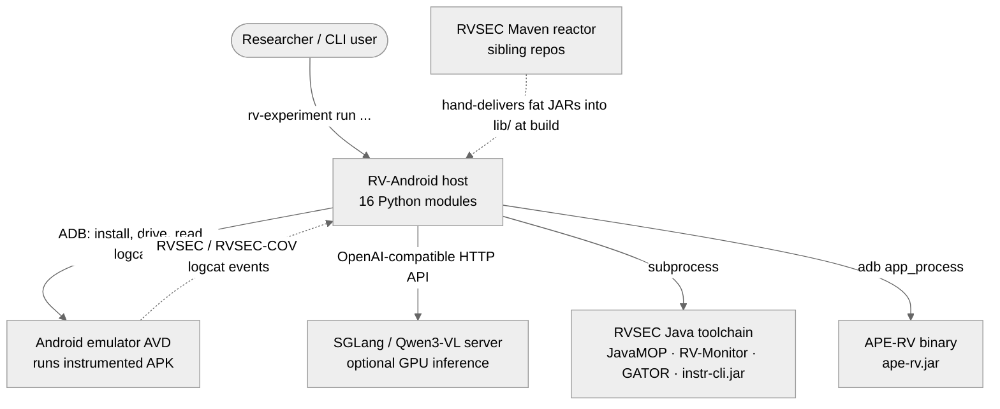
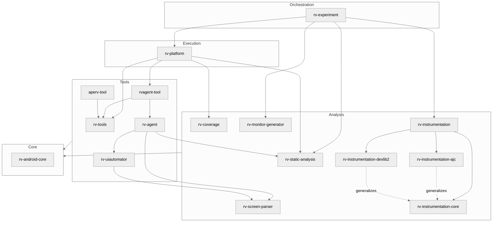
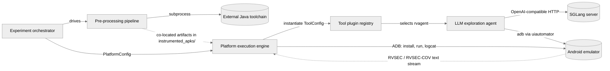
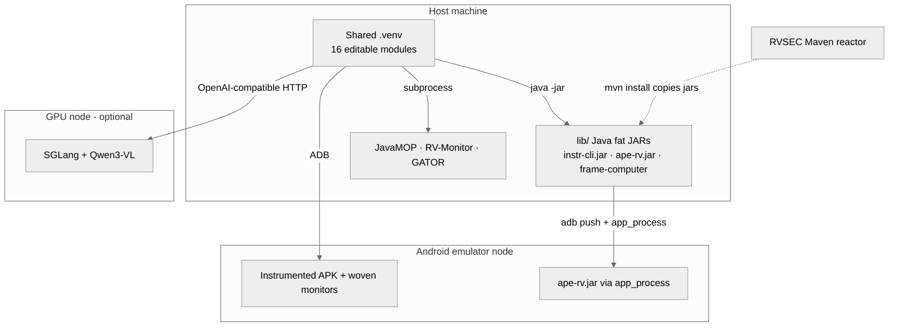

# Architecture — RV-Android (System)

> Scope: **system** · Generated by `rv-doc-arch` · Source model: `out/arch/system/architecture-model.json`
> Languages: Python (16 modules, ~75k LOC) orchestrating an external Java toolchain reached by subprocess.

## Table of Contents

- [Part I — Beyond Views](#part-i--beyond-views)
  - [1. Documentation overview](#1-documentation-overview)
  - [2. Conceptual primer](#2-conceptual-primer)
  - [3. System overview and context](#3-system-overview-and-context)
  - [4. How it works — end to end](#4-how-it-works--end-to-end)
  - [5. Core components](#5-core-components)
  - [6. Mapping between views](#6-mapping-between-views)
  - [7. Rationale](#7-rationale)
  - [8. Output artifacts](#8-output-artifacts)
  - [9. Directory](#9-directory)
- [Part II — Views](#part-ii--views)
  - [Module view](#module-view)
  - [Component-and-connector view](#component-and-connector-view)
  - [Allocation view](#allocation-view)
- [Appendices](#appendices)
- [Specification traceability](#specification-traceability)

---

## Part I — Beyond Views

### 1. Documentation overview

This document is the system-level architecture reference for **RV-Android**, the runtime-verification-plus-automated-testing framework for Android applications. It is written for a **new engineer with no prior exposure to the project**: read it top to bottom and you should come away understanding *what* the framework does, *how* a single run flows end to end through a concrete worked example, and *why* the system is decomposed the way it is. The scope is the whole system — all 16 Python modules and the external Java/Android/LLM services they drive — rather than any one module. Per-module internals are documented separately (see [Related documentation](#specification-traceability)); this document is the map that connects them.

**How to read this document:** Part I builds your mental model — what the subsystem is
([primer](#2-conceptual-primer)), how it behaves end to end
([walkthrough](#4-how-it-works--end-to-end)), and why it is shaped this way
([rationale](#7-rationale)). Part II documents the selected views in detail.

### 2. Conceptual primer

RV-Android is a research framework that finds API-misuse violations in Android apps by combining runtime verification with automated UI testing. It takes an APK, weaves formal-property monitors into its bytecode, launches the instrumented app on an Android emulator, drives the app with a testing tool (a random fuzzer like Monkey, an external Java explorer like APE-RV, or an LLM-guided agent), and reads the emulator's logcat to see which monitored operations were exercised and which properties were violated. The primary target properties are Java Cryptography Architecture (JCA) misuses (for example, a `Cipher` used before it is initialized), but the same machinery handles generic API-usage properties (for example, `Iterator.next()` called without `hasNext()`).

**Why this approach.** The core research bet is that coverage of monitored operations is a *testing* problem, not just an instrumentation problem: a monitor woven into a method only fires if the app is actually driven to that method, so the framework invests heavily in exploration strategies (static-analysis-guided navigation, MOP-prioritized action ranking, an LLM vision agent) to reach monitored code. The obvious alternative — pure static analysis of crypto misuse, as done by CogniCrypt and CryptoGuard — was measured against this framework and lost (RVSec F1 = 0.95 versus 0.83 and 0.78 in the thesis study) because static tools drown in false positives on paths the app never takes; runtime verification only reports a violation on an execution that actually happened. The cost of the runtime approach is operational complexity (an emulator, an instrumentation toolchain, an optional GPU LLM server), which is exactly why the framework is decomposed into 16 narrowly-scoped uv-workspace modules rather than one program.

**Key concepts**

- **Runtime Verification (RV) / MOP** — Monitoring-Oriented Programming: formal properties (written as `.mop` specs) are compiled into monitors and woven into the program so that, at runtime, each relevant API event advances a state machine that reports a violation when the property is broken.
- **Monitored operation (MOP)** — any API method that a specification watches. "MOP coverage" means the fraction of these methods a test run actually executed. Note: *MOP is not a security term here* — it covers both JCA-crypto and generic API properties.
- **Instrumentation / weaving** — rewriting a compiled APK so monitor code runs alongside the original code. Two variants exist: the legacy AspectJ pipeline (dex2jar → ajc → d8) and a DEX-native rewriter (dexlib2).
- **Static analysis / WTG** — a one-shot GATOR analysis of the *original* APK that produces reachability (which methods can reach monitored operations), window widgets/listeners, and the Window Transition Graph (WTG) — a map of which UI action moves between which screens. This data guides exploration toward monitored code.
- **Coverage via logcat** — the instrumented app emits `Log.v` with tag `RVSEC-COV` on every monitored method call and tag `RVSEC` on every property violation. The host reads the device logcat stream to compute coverage and collect violations — there is no in-process callback across the host/emulator boundary.
- **uv workspace / layers** — all 16 Python modules live under `modules/*`, installed editable into one shared `.venv` by a single `uv sync`. They are organized into 5 layers (Core, Tools, Analysis, Execution, Orchestration) with a strict downward dependency rule enforced acyclically.

### 3. System overview and context

RV-Android is Python orchestration wrapped around several external systems, and understanding those boundaries is the fastest way to understand the framework. A researcher launches an experiment from the command line; from there the host process talks to five external systems. The **Android emulator (AVD)** is the execution node that runs the instrumented APK; the host reaches it only over ADB, and the woven monitors report back over logcat with the `RVSEC`/`RVSEC-COV` tags — this asynchronous text channel is the *sole* coverage and violation feedback path across the host/emulator boundary. The optional **SGLang / Qwen3-VL server** is a GPU-backed inference backend used only by the LLM agent's `llm`/`multimode` paths, reached over an OpenAI-compatible HTTP API. The **RVSEC Java toolchain** (JavaMOP, RV-Monitor, GATOR, `instr-cli.jar`) performs monitor compilation, static analysis, and DEX-native weaving, all invoked by subprocess. The **APE-RV binary** (`ape-rv.jar`) is an external Java explorer run on-device via `adb app_process`, wrapped by `aperv-tool`. Finally, the **RVSEC Maven reactor** is a sibling Java project that hand-delivers the fat JARs into `rv-android/lib/` at build time via the `main.basedir` mechanism (design D9).

**Constraints:** The framework is Python orchestration over a Java toolchain reached exclusively by subprocess, plus the Android SDK reached by ADB; the emulator lifecycle is fully managed by `rv-platform` (never manually). GATOR must analyze the *original* APK because Soot's TypeResolver crashes on AspectJ-instrumented bytecode. The SGLang backend is optional and only needed for LLM-driven exploration. The Java engine jars are gitignored and must be present (built by the Maven reactor / Docker image) before a run that needs them.

**System context diagram** (external actors and systems — every view refers back to this):

### 4. How it works — end to end

The clearest way to understand the framework is to follow one command through the whole pipeline. The following walks through a concrete example: running `rv-experiment run --tools monkey --specification-set jca --apks-dir ./apks_examples` on `cryptoapp.apk` (package `br.unb.cic.cryptoapp`), which calls `javax.crypto.Cipher` — so a JCA monitor must fire when a `Cipher` is misused, and only if Monkey drives the app to that code.

1. **CLI + config build.** The Click CLI in `rv-experiment/__main__.py` parses the tool DSL string `monkey` and the specification-set `jca`, and `ExperimentController` builds an `ExperimentConfig`. Sub-module configs are constructed just-in-time only when accessed (`get_monitored_operations_config`, `get_instrumentation_config`, `get_static_analysis_config`), so nothing runs yet. Concretely, specification-set `jca` selects the 23 JCA `.mop` specs under `$RVSEC_HOME/rvsec/rvsec-mop/src/main/resources/`.

2. **Pre-processing: monitor generation.** `PreProcessor` calls rv-monitor-generator's `RuntimeVerificationGenerator`, which runs JavaMOP `-merge` to turn the 23 `.mop` specs into AspectJ `.aj` aspects and `.rvm` files, then RV-Monitor `-merge` to turn `.rvm` into `.java` monitor classes. Because JavaMOP's `-d` flag does not relocate `.rvm` files, the generator moves them manually. With `emit_descriptor` on it also writes `MultiSpec_*MonitorAspect.json` for the dexlib2 variant. Output: `.aj` + `.java` monitor sources for the `Cipher` property, plus `MultiSpec_RVSecMonitorAspect.json` in the monitors output directory.

3. **Pre-processing: instrumentation.** `PreProcessor` calls `rv_instrumentation.get_instrumenter(variant, config)`; with the default `ajc` variant this dispatches to `AjcInstrumentation`, which decompiles `cryptoapp.apk` via dex2jar, quarantines `VerifyError`-prone library classes to a side-jar, weaves the monitor aspects with `ajc`, recomputes stack-map frames with rv-frame-computer, restores the quarantined classes, merges the RV runtime libs, runs d8 to rebuild DEX, and signs with the shared `keystore.jks`. The result is an instrumented APK that logs `RVSEC-COV`/`RVSEC` events — the woven APK now contains a before-advice on `Cipher.getInstance`/`init`, written to `results/<id>/instrumented_apks/`.

4. **Pre-processing: static analysis.** `PreProcessor` runs rv-static-analysis's `StaticAnalyzer` on the *original* (not instrumented) APK — Soot's TypeResolver crashes on AspectJ bytecode. One GATOR invocation produces a single JSON with reachability, windows, transitions, and components sections; `StaticAnalysisParser.parse_file` recovers partial data if GATOR times out. Reachability flags methods that can reach `Cipher` calls, the `code_package` filter keeps only classes under `br.unb.cic.cryptoapp`, and the JSON is co-located in `instrumented_apks/` so rv-platform finds it later.

5. **Task generation.** `ExecutionController` translates `ExperimentConfig` into a `PlatformConfig` and calls `Platform(config).run()`. `Platform._generate_tasks()` computes the cartesian product APK × tool × variant × repetition × timeout, builds `ExperimentMetadata` with a SHA-256 `config_checksum`, and `TaskStorage` checks `tasks.json` to skip any already-completed task (resume). For this example, 1 APK × 1 tool (monkey) × 1 rep × 1 timeout = 1 Task with identity tuple `(cryptoapp, monkey, default, 0, 60)`.

6. **Execution: component pipeline.** `TaskExecutor` runs the task through ordered `ITaskComponent`s. *Outside* the emulator session, `StaticAnalysisComponent` loads the SA JSON and `CoverageComponent` initializes its tracker. *Inside* the session, `EmulatorComponent` boots the AVD and installs the instrumented APK, then `ToolComponent` invokes the Monkey tool (an `AbstractTool`) which fuzzes the UI until the timeout. `CoverageTracker` runs a background thread reading logcat live. rv-platform manages the entire emulator lifecycle; the tool runs until the 60 s timeout, which is treated as SUCCESS.

7. **Coverage + violation capture.** As Monkey exercises cryptoapp, the woven monitors emit `Log.v(RVSEC-COV, signature)` on each monitored `Cipher` call and `Log.v(RVSEC, ...)` if a property is violated. rv-coverage's `LogcatParser` distinguishes the two tags (`RVSEC` = violation, `RVSEC-COV` = coverage) and `CoverageTracker` computes method/activity/MOP coverage incrementally against the static-analysis denominator. If Monkey reaches the crypto Activity, `mop_method_coverage` rises; a misused `Cipher` yields an `RVSEC` violation entry.

8. **Result processing + persistence.** On cleanup, `ResultProcessorComponent` writes `coverage.csv`, `errors.csv`, `summary.csv`, `results.json`, `performance.csv` and `TaskStorage` atomically appends the task to `tasks.json` (write-temp-then-rename). If the run is later resumed, `ResultProcessorComponent._reconstruct_repository_from_logcat` re-reads the logcat file and the co-located SA JSON to rebuild coverage *and* violations rather than trusting the serialized metrics (INV-PLT-16). Results land in `results/<name>/`; a resumed task rebuilds `LogcatRepository` from `task.result.logcat_file` because the repository is not serialized.

### 5. Core components

At runtime the system is a handful of coarse-grained components. Understanding them — and where each one hands off to the next — is the backbone of everything in Part II.

The **experiment orchestrator** is the top-level process the user launches (`rv-experiment run ...`). It sequences the three phases (pre-processing, execution, post-processing) but performs none of the low-level work itself: `PreProcessor` fans out to the monitor generator, instrumenter, and static analyzer to produce on-disk artifacts, `ExecutionController` hands a `PlatformConfig` to the platform engine, and `PostProcessor` writes only diagnostics. Crucially, results never flow back to it — the platform engine owns the result files — so the orchestrator stays a thin coordinator whose main state is the `ExperimentConfig` and the resume decision.

The **pre-processing pipeline** is a three-stage transform run once before any execution, behaving like a pipe-and-filter chain over the file system: JavaMOP/RV-Monitor turn `.mop` specs into `.aj`/`.java` monitors; the instrumenter weaves those monitors into the APK (AspectJ or DEX-native); GATOR analyzes the original APK into a reachability/windows/transitions JSON. The three outputs are co-located under `instrumented_apks/` so the execution phase can find them by convention rather than by passing objects. Each stage degrades gracefully — a failed instrumentation of one APK is recorded and skipped, a timed-out GATOR yields partial JSON — so pre-processing failures do not block the run.

The **platform execution engine** is the heart of a run. It expands configuration into a deterministic task matrix (APK × tool × variant × rep × timeout), then for each pending task drives a `TaskExecutor` whose `ITaskComponent`s split cleanly across the emulator-session boundary: static-analysis load and coverage init happen outside the session; app install, live coverage tracking, and tool execution happen inside it. It writes standardized CSV/JSON and appends each finished task to `tasks.json` with an atomic rename, which is what makes crash-recovery and resume possible. On resume it rebuilds coverage and violations from the logcat file rather than trusting serialized metrics.

The **tool plugin registry** is a registry-plus-factory that both the orchestrator (for selection/validation) and the engine (for instantiation) consult. Built-in tools register on import; external plugins (rvagent-tool, aperv-tool) register via entry points. When the engine needs a tool it hands the factory a `ToolConfig`; the factory merges variant defaults with per-run parameters and returns a configured `AbstractTool` whose `execute()` template method wraps logging, timeout handling, and cleanup around each tool's specific logic.

The **LLM exploration agent** takes over UI driving when the selected tool is `rvagent`. Each iteration parses the current screen (rv-screen-parser), decides an action (algorithmic scorers and/or the Qwen3-VL LLM over SGLang), validates and executes it through the device adapter (rv-uiautomator), and learns from the resulting transition. It consumes the static-analysis WTG and reachability data to prioritize actions that reach monitored operations. It only ever stops on TIMEOUT — there is no saturation or early-exit path by design.

Underneath all of these sits the **core foundation library** — not a runtime process but the shared object model threaded through every component: `App`/`Task`/`StaticAnalysisData`/`LogcatRepository` domain models, the `ErrorHandler` singleton that classifies exceptions as absorbed or propagated, the `LoggingManager`, and the `AbstractTool`/`Instrumenter` contracts. Because it has zero internal dependencies it is the acyclic root every other component references.

Beyond the host process, three **external** components complete the picture: the **Android emulator** running the instrumented app and emitting logcat events; the optional **SGLang inference server** for the LLM agent; and the **external Java toolchain** (JavaMOP, RV-Monitor, GATOR, ajc/dex2jar/d8, `instr-cli.jar`, `ape-rv.jar`) reached exclusively by subprocess.

| Component | Realized by | Responsibility |
|-----------|-------------|----------------|
| Experiment orchestrator | rv-experiment | Owns the CLI and the pre/execute/post workflow; prepares artifacts then delegates execution. |
| Pre-processing pipeline | rv-monitor-generator, rv-instrumentation (+ ajc/dexlib2), rv-static-analysis | Transforms a raw APK + spec set into an instrumented APK + monitor sources + static-analysis JSON. |
| Platform execution engine | rv-platform | Generates tasks, runs each through the component pipeline around an emulator session, persists atomically. |
| Tool plugin registry | rv-tools, rvagent-tool, aperv-tool | Registers and instantiates testing tools (built-in and external) behind the `AbstractTool` contract. |
| LLM exploration agent | rv-agent, rv-uiautomator, rv-screen-parser | Drives the app via a LangGraph workflow mixing algorithmic DFS and an LLM vision model. |
| Core foundation library | rv-android-core, rv-instrumentation-core | Shared domain models, error handling, logging, validation, and abstract contracts. |
| Android emulator (external) | Android SDK AVD | Runs the instrumented APK; emits `RVSEC`/`RVSEC-COV` logcat events. |
| SGLang inference server (external) | SGLang + Qwen3-VL | Serves the Qwen3-VL vision-language model over an OpenAI-compatible API. |
| External Java toolchain (external) | JavaMOP, RV-Monitor, GATOR, ajc/dex2jar/d8, instr-cli.jar, ape-rv.jar | Monitor compilation, static analysis, DEX-native instrumentation, app_process exploration. |

### 6. Mapping between views

The three views in Part II describe the same system from different angles, and the value is in how their elements correspond. The **module view** groups the 16 Python packages into five layers; the **component-and-connector view** groups them into the six runtime components above plus the external services; the **allocation view** places those onto physical nodes. Reading the mapping across them is how you connect "which package do I edit" to "what runs where."

Each runtime component is realized by one or more modules. The experiment orchestrator *is* `rv-experiment` (Orchestration layer). The platform engine *is* `rv-platform` (Execution layer). The pre-processing pipeline is realized by the monitor-generator and the instrumentation family plus static analysis (Analysis layer). The tool plugin registry is `rv-tools` extended by the two plugin modules `rvagent-tool` and `aperv-tool` (Tools layer), and the LLM agent is `rv-agent` composed with `rv-uiautomator` and `rv-screen-parser` (Tools/Analysis layers). The core foundation spans `rv-android-core` and `rv-instrumentation-core`.

The important boundaries are the ones that cross a process or language line, because those are where debugging gets hard and where the "shared-data by convention" style shows up. Although every module is Python, the framework's real work is done by Java engines and by the emulator, all reached out-of-process:

- **Monitor generation → Java toolchain**: `rv-monitor-generator` shells out to `javamop/bin/javamop` and `rv-monitor/bin/rv-monitor -merge`. What crosses the boundary is files (`.mop` in, `.aj`/`.rvm`/`.java`/descriptor JSON out).
- **Static analysis → Java toolchain**: `rv-static-analysis` invokes the GATOR launcher via `sys.executable` (not the literal `python`). A single JSON file crosses back.
- **DEX-native instrumentation → Java toolchain**: `rv-instrumentation-dexlib2` runs `java -jar lib/instr-cli.jar`; the Java CLI is the source of truth and returns `instrument_results.json`.
- **Platform → Android emulator**: `rv-platform` uses ADB to install the APK, run the tool, and read logcat; the `RVSEC`/`RVSEC-COV` text stream is the only feedback channel back across this boundary.
- **APE-RV tool → Android emulator**: `aperv-tool` pushes `ape-rv.jar` and runs `adb shell CLASSPATH=/data/local/tmp/ape-rv.jar app_process` — the Java explorer executes *on-device*.
- **LLM agent → SGLang server**: `rv-agent` calls the OpenAI-compatible HTTP API to reach Qwen3-VL.

Because these hand-offs are file- and text-based rather than in-memory, much of the system communicates through the file system by convention (`tasks.json`, the co-located SA JSON, logcat files). This is what makes resume possible — the platform engine can reconstruct a task's coverage and violations purely from the logcat file and co-located JSON, without any live object graph.

The allocation view then collapses these onto nodes: everything Python plus the Java jars runs on the **host machine** (the `.venv` and `lib/` jars), the app under test runs on the **Android emulator node**, and the optional model runs on the **GPU SGLang node**.

### 7. Rationale

The shape of this system is the result of a small number of deliberate decisions, each resolving a real tension and each avoiding a specific failure mode.

**A uv workspace of 16 single-responsibility modules.** The framework could have been one Python package, but the runtime-verification pipeline has genuinely distinct concerns (monitor generation, instrumentation, static analysis, device driving, LLM exploration, result processing) with very different dependency footprints — rv-agent alone pulls in langchain/langgraph/scipy that nothing else needs. Splitting into 16 layered modules keeps those heavy, churning dependencies out of the import paths of stable modules, lets each be tested in isolation, and forces the dependency direction to stay acyclic. The rejected alternative — a monolith — would couple the platform's import-time to rv-agent's LLM stack and make the layer violations that the ABCs now prevent (a tool reading env vars, a core model importing a variant) impossible to catch.

**Component-based task execution around the emulator session.** Task execution mixes concerns that must run at different times relative to a scarce, slow resource — the emulator. Modeling each concern (static-analysis load, coverage tracking, emulator lifecycle, tool run, result processing) as an `ITaskComponent` with a uniform three-phase lifecycle lets the executor place static-analysis loading and coverage init *outside* the session and app-install/tool-run *inside* it, minimizing emulator hold time. Without this split, either the emulator stays booted while the host parses large SA JSONs (wasting the scarce resource) or the phases tangle into one procedure that cannot be reordered or extended. Adding a new phase becomes registering a component rather than editing the executor.

**Instrumentation contract + variant separation (ajc vs dexlib2).** Two fundamentally different ways to weave monitors coexist: the legacy AspectJ pipeline (dex2jar → ajc → d8, with `VerifyError` quarantine workarounds) and a DEX-native rewriter (dexlib2 via a Java CLI). To let them be swapped at runtime without either importing the other, the contract and result models live in a pure `rv-instrumentation-core`, each variant depends only on `-core`, and the parent facade depends on `-core` plus both variants and lazy-imports the chosen one. The rejected alternative — a single instrumenter with an `if/else` — would drag both toolchains' imports into every consumer and break the acyclic rule INV-INS-41; the failure mode is that choosing `ajc` would still load dexlib2 (and its Java jar requirement) and vice versa.

**Resume reconstructs coverage from logcat, never from serialized metrics.** The in-memory `LogcatRepository` is not serialized into `tasks.json`, so a resumed task has `repository=None`. The tempting shortcut is to trust the serialized `coverage_metrics` on the Task — but that field and the per-method coverage rows come from different code paths, so trusting it makes `summary.csv` report coverage while `coverage.csv` stays empty (the `verify.py` C3 inconsistency). The decision is to always reconstruct from ground truth: re-read `task.result.logcat_file` and re-parse the co-located static-analysis JSON, rebuilding both coverage and MOP violations. Without INV-PLT-16 a resumed experiment silently produces internally inconsistent result files.

**Layer-purity for environment variables (only L5 reads `RV_*`).** If any layer could read environment variables, configuration would have many hidden sources and modules would be untestable without setting global state. The rule (gh55) is that only Layer 5 (rv-experiment) reads user-facing `RV_*` variables and passes everything downward as Pydantic config; the narrow exception is a six-name L1 cross-layer infra family (`RV_PYDANTIC*`, `RVSEC_HOME`, `TOOLS_DIR`, `ANDROID_HOME`) each with exactly one canonical reader. All names are `ENV_*` constants; string literals are forbidden by INV-CORE-31 and caught by `scripts/check_env_vars_drift.py` in CI. Without this discipline, a plugin reading `RV_SKIP_*` directly can invert intent under standalone runs (the negation-flag gotcha) and no test can pin the config.

**Java fat JARs hand-delivered into `lib/` via Maven `main.basedir` (D9).** The Python framework depends on Java engines that live in sibling repositories (`rvsec/rvsec-android`, `../ape`). Rather than publish those jars to a registry, the RVSEC Maven reactor resolves `main.basedir` to the reactor root and copies build artifacts straight into `rv-android/lib/` subdirectories at `mvn install` time (design D9). These jars are gitignored, so the Docker build gates the image on their presence; the failure mode this prevents is selecting `RV_INSTRUMENTATION_VARIANT=dexlib2` (or an aperv MOP arm) and crashing mid-experiment with `FileNotFoundError` because the engine jar was never built.

**Decisions at a glance**

| Decision | Drivers | Invariant / ADR |
|----------|---------|-----------------|
| uv workspace of 16 single-responsibility modules | independent development, acyclic deps, per-module tests/docs | — |
| Component-based task execution around the emulator session | isolate per-phase concerns, run expensive work outside the emulator, extensibility | — |
| Instrumentation contract + variant separation (ajc vs dexlib2) | swappable weaving backends, acyclic deps, single stable import | INV-INS-41 |
| Resume reconstructs coverage from logcat | crash recovery, coverage/summary consistency | INV-PLT-16 |
| Layer-purity for environment variables (only L5 reads `RV_*`) | testability, maintainability, single config source | INV-CORE-31 / `docs/adr/0001-env-var-pattern.md` |
| Java fat JARs hand-delivered into `lib/` (D9) | cross-repo integration without a registry, reproducible Docker images | — |

**Patterns and styles**

At the module level the system is **layered** (five strict layers Core ← Tools ← Analysis ← Execution ← Orchestration with downward-only dependencies; `rv-android-core` has zero internal deps and the instrumentation family is acyclic per INV-INS-41), organized by a **uses** relation (the workspace edges in `pyproject.toml` `[tool.uv.sources]` match the actual imports), with **generalization** as the main extension mechanism (ABC families: `Instrumenter`, `AbstractTool`, `ITaskComponent`, `ExplorationStrategy`, `Scorer`, `AbstractScreenVisitor`, each with multiple implementations). At the component-and-connector level it is **pipe-and-filter** for pre-processing (a file-based transform chain co-located under `instrumented_apks/`), **client-server** at runtime (the Python host is a client to the emulator over ADB, to SGLang over the OpenAI API, and to the Java tools invoked as subprocess servers), and **shared-data** for coordination (components communicate through the file system by convention, and resume reconstructs state from those files). At the allocation level it is a **deployment** split (host machine vs Android emulator vs optional GPU node) plus an **install** structure (uv editable modules in one `.venv`, Maven-delivered Java jars in `lib/`).

**NFRs served**

*Modularity (NFR01):* the system is a uv workspace of 16 modules each with its own `pyproject.toml`, tests, and `CLAUDE.md`, installed editable into one shared `.venv` by a single `uv sync` so source changes take effect immediately; the 5-layer decomposition with downward-only dependencies keeps concerns from tangling. *Extensibility (NFR02):* new testing tools plug in by implementing `AbstractTool` and registering via `ToolRegistry` (entry points for external plugins) with zero platform edits; new execution phases implement `ITaskComponent`; new exploration algorithms implement `ExplorationStrategy` and new ranking criteria implement `Scorer`; new weaving backends implement the `Instrumenter` ABC behind `get_instrumenter`. *Testability (NFR03):* all domain models are Pydantic-based with factory methods and env-toggled validation (`RV_PYDANTIC`), and the layer-purity rule keeps configuration out of hidden env reads so modules can be constructed with explicit config in tests; tests run per-module in isolation with `--import-mode=importlib`. *Resilience (NFR04):* the `ErrorHandler` singleton classifies 23 exception types into absorbed vs propagated categories; pre-processing failures do not block execution; tool timeouts are treated as successful completion; and `TaskStorage`'s atomic write-temp-then-rename plus checksum validation makes crash-recovery safe. *Configurability (NFR05):* configuration is Pydantic models built just-in-time, layered so only L5 reads `RV_*`, fed by a tool DSL and CLI flags, with priority-chain path resolution. *Observability (NFR06):* distinct logcat tags (`RVSEC` violation, `RVSEC-COV` coverage), `[RVTRACK:<CATEGORY>]` agent logs (14 categories), and structured CSV/JSON outputs. *Compatibility (NFR07):* Python 3.12 orchestration drives a Java 8+ toolchain by subprocess and the Android SDK by ADB; instrumentation recomputes stack-map frames and quarantines `VerifyError`-prone classes so instrumented APKs still verify on-device; the SGLang backend is swappable behind an OpenAI-compatible API. *Reproducibility (NFR08):* deterministic task generation, a SHA-256 `config_checksum` validated on resume, saved config JSON, and MD5-hash-based seeds (42/123/456).

| NFR | PRD ID | Architectural support |
|-----|--------|-----------------------|
| Modularity | NFR01 | 16-module uv workspace, 5 layers, downward-only deps |
| Extensibility | NFR02 | ABC + registry seams (`AbstractTool`, `ITaskComponent`, `ExplorationStrategy`, `Scorer`, `Instrumenter`) |
| Testability | NFR03 | Pydantic models, env-toggled validation, per-module isolated tests |
| Resilience | NFR04 | `ErrorHandler`, graceful degradation, timeout-as-success, atomic persistence |
| Configurability | NFR05 | Just-in-time Pydantic config, layered env reads, tool DSL, priority path resolution |
| Observability | NFR06 | Tagged logcat, `[RVTRACK]` logs, structured CSV/JSON |
| Compatibility | NFR07 | Subprocess/ADB boundaries, frame recompute + quarantine, OpenAI-compatible LLM API |
| Reproducibility | NFR08 | Deterministic tasks, `config_checksum`, saved config, hash-based seeds |

### 8. Output artifacts

A run's results are entirely on-disk under `results/<name>/`, and the framework treats these files as the source of truth (which is what makes resume and offline analysis possible). The instrumented APKs and monitor sources are the pre-processing output; the CSV/JSON files are the execution output; `tasks.json` is the resume ledger; and `instrument_errors.json` records any per-APK instrumentation failures.

| Artifact | Location | Notes |
|----------|----------|-------|
| Instrumented APKs + monitor sources | `results/<name>/instrumented_apks/` | signed APKs plus `.aj`/`.java` monitors and the co-located static-analysis JSON |
| `coverage.csv` / `summary.csv` / `errors.csv` | `results/<name>/` | per-method coverage, per-task summary (must stay consistent per INV-PLT-16), and property violations |
| `results.json` / `performance.csv` | `results/<name>/` | consolidated run results and timing metrics |
| `tasks.json` | `results/<name>/` | atomically-written task state enabling crash-recovery and resume |
| `instrument_errors.json` | `results/<name>/` | per-APK instrumentation failures with code/tool/message/phase |

### 9. Directory

**Glossary / acronyms**

- **RV** — Runtime Verification.
- **MOP** — Monitoring-Oriented Programming; also used loosely for "monitored operation". Covers both JCA and generic properties (not a security term).
- **JCA** — Java Cryptography Architecture; the primary property domain.
- **WTG** — Window Transition Graph; the UI action → screen map produced by GATOR.
- **AVD** — Android Virtual Device (the emulator).
- **ADB** — Android Debug Bridge; the host↔emulator control/logcat channel.
- **ABC** — Abstract Base Class; the extension seams (`Instrumenter`, `AbstractTool`, `ITaskComponent`, `ExplorationStrategy`, `Scorer`, `AbstractScreenVisitor`).
- **SGLang** — the inference server hosting the Qwen3-VL vision-language model.
- **VLM** — Vision-Language Model (Qwen3-VL).
- **DFS** — Depth-First Search; the algorithmic exploration strategy in rv-agent.
- **AVD lifecycle / D9** — the Maven `main.basedir` mechanism hand-delivering Java fat JARs into `lib/`.

**References**

- Domain specs and the 7-domain → module → FR/NFR mapping: `openspec/specs/README.md`.
- Product requirements (FRs, NFRs): `docs/PRD.md`.
- Per-module 4+1 architecture docs: `modules/<m>/docs/architecture.md`.
- ADRs: `modules/<m>/docs/adr/` and `docs/adr/0001-env-var-pattern.md`.
- Module dependency map: `docs/rv_android_architecture.md`.

---

## Part II — Views

### Module view

*Style(s): layered, uses, generalization*

The module view is the map a developer needs to navigate 16 modules. It shows the same set of Python packages under three complementary lenses at once: the **layered** structure (five layers with a strict downward-only dependency rule), the fine-grained **uses** graph (which module imports which), and the **generalization** seams (the ABC families that make the system extensible). The layering is not cosmetic — it is enforced acyclically, and the instrumentation sub-family in particular is arranged specifically so that `-core` depends on neither the parent nor any variant (INV-INS-41).

**Primary presentation**

**Element catalog**

Each layer earns its place. The **Core** layer is `rv-android-core`, the single acyclic root: every other module builds on it. `ErrorHandler` and `LoggingManager` are singletons providing type-specific exception handling (a `@handle_errors()` decorator and a registry classifying exceptions as absorbed vs propagated) and context-injected structured logging; `BaseValidatedModel` is the Pydantic base for all domain entities, with validation toggled by `RV_PYDANTIC` so production pays near-zero overhead. Its subtlest feature is the `App` model's dual package identity — `package_name` from the manifest (for device operations) versus `code_package` detected by `PackageDetector` (for static-analysis class filtering) — which differ in about 27.5% of APKs; confusing them silently produces zero coverage. It is separated out precisely because it must be the one place shared abstractions live and can never form a cycle.

The **Tools** layer holds the testing-tool machinery. `rv-tools` is the registry/factory seam: on import `_register_builtin_tools()` registers 8 built-ins, and given a `ToolConfig` the `ToolFactory` merges `{**variant_defaults, **cfg.parameters}` and returns a configured tool — the canonical default for any per-tool URL/path *must* live in `get_variants()` or it is invisible to overrides. It is the single discovery/instantiation seam shared by both rv-experiment and rv-platform. `rv-uiautomator` is the unified device-interaction layer (a UIAutomator2 adapter, action executor, and the `StateConverter` that bridges UIAutomator captures into DroidBot-format parsers); it is kept separate so device adapters stay framework-specific while parsing is reused. `rv-agent` is the heaviest, most experimental module — a LangGraph workflow with a 5-tier action selection and 9 weighted scorers, whose only exit is TIMEOUT — isolated so its large, churning dependency surface (LangGraph, SGLang/langchain, scipy) does not leak into the platform core. `rvagent-tool` and `aperv-tool` are thin plugins: the former exists purely to keep rv-agent's heavy LLM graph out of the platform's import-time registration path (its heavy modules are lazy-imported inside `execute_tool_specific_logic()`), the latter isolates the Java/`app_process` external binary and its device-property injection behind the uniform tool interface.

The **Analysis** layer is the widest. `rv-coverage` owns only the parser + tracker mechanics (`LogcatParser`, `CoverageTracker`), deliberately separated from the resume/reconstruction orchestration that lives in rv-platform, so the live path and the logcat-replay path share exactly one parser; its critical contract is that `RVSEC` = violation and `RVSEC-COV` = coverage, never conflated. `rv-static-analysis` isolates the GATOR/Java invocation and JSON-contract parsing, with graceful degradation on timeout (partial JSON recovered) but a defensive post-condition that raises if GATOR returned no output at all. `rv-screen-parser` centralizes framework-agnostic UI parsing (visitor pattern over both UIAutomator XML and DroidBot JSON) and, importantly, owns the MOP linkage on actions (`ItemAction.reaches_target`/`directly_reaches_target`) — this linkage lives here, not in rv-agent. `rv-monitor-generator` isolates the JavaMOP/RV-Monitor toolchain and its quirks (notably the JavaMOP `-d` bug that fails to relocate `.rvm` files). The instrumentation family is a deliberately acyclic quartet: `rv-instrumentation-core` holds only the `Instrumenter` ABC and result models (zero impl deps); `rv-instrumentation-ajc` and `rv-instrumentation-dexlib2` each implement it depending only on `-core`; and `rv-instrumentation` is the parent facade whose `get_instrumenter(variant, config)` lazy-imports the chosen variant so selecting `ajc` never loads dexlib2.

The **Execution** layer is `rv-platform`, which isolates task-execution mechanics (emulator lifecycle, port allocation, atomic persistence, result processing) from experiment orchestration, and is usable standalone. The **Orchestration** layer is `rv-experiment`, the only layer allowed to read user-facing `RV_*` env vars (gh55); its identity is clean separation — orchestration here, execution in rv-platform, and no results flowing back.

| Element | Responsibility | Relations / interfaces |
|---------|----------------|------------------------|
| rv-android-core (Core) | Domain models, `ErrorHandler`, `LoggingManager`, `AbstractTool`/`Instrumenter` contracts | acyclic root; used by all 15 others |
| rv-tools (Tools) | Tool registry + factory; 8 built-in tools | uses core; used by rv-platform, plugins |
| rv-uiautomator (Tools) | Device-interaction adapter + `StateConverter` | uses rv-screen-parser; used by rv-agent, rv-platform |
| rv-agent (Tools) | LangGraph LLM/DFS explorer, 9 scorers, 3 modes | uses rv-screen-parser, rv-uiautomator, rv-static-analysis; SGLang |
| rvagent-tool (Tools) | Thin plugin wrapping rv-agent as `AbstractTool` | uses rv-agent, rv-tools; entry-point discovered |
| aperv-tool (Tools) | Plugin wrapping `ape-rv.jar` via `app_process` | uses rv-tools; depends on emulator |
| rv-coverage (Analysis) | Logcat parsing + coverage/violation tracking | uses core; used by rv-platform |
| rv-static-analysis (Analysis) | GATOR invocation + JSON parsing | uses core; subprocess GATOR |
| rv-screen-parser (Analysis) | Framework-agnostic UI parsing; owns MOP linkage | uses core; used by rv-agent, rv-uiautomator |
| rv-monitor-generator (Analysis) | Drives JavaMOP + RV-Monitor → `.aj`/`.java` | uses core; subprocess Java |
| rv-instrumentation (Analysis) | Facade `get_instrumenter`; shared keystore | uses -core + both variants |
| rv-instrumentation-core (Analysis) | `Instrumenter` ABC + result models (zero impl deps) | used by parent + both variants |
| rv-instrumentation-ajc (Analysis) | AspectJ variant (dex2jar→ajc→d8); owns CLI | generalizes -core |
| rv-instrumentation-dexlib2 (Analysis) | DEX-native variant via `instr-cli.jar` | generalizes -core; subprocess Java |
| rv-platform (Execution) | Task generation, component pipeline, persistence | uses rv-tools, rv-coverage, rv-static-analysis, rvagent-tool |
| rv-experiment (Orchestration) | CLI + pre/execute/post workflow | uses rv-platform, rv-monitor-generator, rv-instrumentation, rv-static-analysis |

**Context** — see [system context](#3-system-overview-and-context).

**Variability guide**

The system varies along a few well-defined seams. The **instrumentation variant** is chosen at runtime (`RV_INSTRUMENTATION_VARIANT=dexlib2` or `--instrumentation-variant`), dispatched by `get_instrumenter`; add a new backend by implementing `Instrumenter` in a new `-core`-only module and registering it in the factory (add a registry only when a third variant materializes). **Testing tools** are added by implementing four methods on an `AbstractTool` subclass and registering the class (built-in) or an entry point (external plugin); to make a plugin usable in experiments you register it in `rv-platform/src/rv_platform/__init__.py::_register_external_tools()`, not in rv-experiment. **Exploration behavior** varies via `ExplorationStrategy`/`Scorer` implementations inside rv-agent, and **UI output detail** via the three `AbstractScreenVisitor` variants (Basic/Default/Enhanced, trading token cost for detail).

**Rationale**

The layering exists to keep heavy, churning dependencies (rv-agent's LLM stack) out of the import paths of stable modules and to force an acyclic dependency direction; the ABC seams turn that structure into genuine extensibility. The instrumentation quartet's shape is dictated by INV-INS-41: a pure `-core` contract with variants that never import each other is the only arrangement that lets `ajc` and `dexlib2` be swapped without one dragging the other's toolchain into every consumer.

### Component-and-connector view

*Style(s): pipe-and-filter, client-server*

This view is what a new engineer must understand to reason about a *running* experiment rather than the source tree. It exposes two structures at once. The **pipe-and-filter** structure is the pre-processing chain, where three filters transform files in sequence and communicate only through co-located artifacts on disk. The **client-server** structure is the runtime boundary set: the Python host is a client to three servers — the Android emulator (over ADB), the SGLang model server (over the OpenAI API), and the Java tools (invoked as subprocess servers). The connectors here are the load-bearing detail: the host↔emulator connector is an *asynchronous text stream* (logcat), not a function call, and that single fact explains much of the system's design.

**Primary presentation**

**Element catalog**

| Component / connector | Type | Responsibility |
|-----------------------|------|----------------|
| Experiment orchestrator | service (component) | Sequences pre/execute/post; delegates all low-level work; no results flow back. |
| Pre-processing pipeline | service (pipe-and-filter chain) | Monitors → instrumented APK → static-analysis JSON, co-located on disk. |
| Platform execution engine | service (component) | Task matrix + component pipeline around the emulator session; atomic persistence. |
| Tool plugin registry | service (component) | Resolves and configures the selected `AbstractTool`. |
| LLM exploration agent | service (component) | In-process UI driving via LangGraph + LLM/algorithmic decisions. |
| Android emulator | external server | Runs the instrumented APK; emits logcat events. |
| SGLang server | external server | Serves Qwen3-VL over an OpenAI-compatible API. |
| External Java toolchain | external server(s) | Monitor gen, static analysis, DEX instrumentation via subprocess. |
| ADB / logcat connector | connector | Async text channel; sole coverage/violation feedback path across the host/emulator boundary. |
| Co-located-artifacts connector | connector (shared-data) | Filesystem-by-convention hand-off (`instrumented_apks/`, `tasks.json`, logcat files). |
| OpenAI-compatible HTTP connector | connector | Host→SGLang request/response for the vision model. |
| Subprocess connector | connector | Host→Java tools (files in, files out). |

**Context** — see [system context](#3-system-overview-and-context).

**Variability guide**

The runtime topology has two optional legs. The **SGLang server** is present only for the agent's `llm`/`multimode` paths; a `pure_algorithm` run needs no GPU node at all. The **on-device Java explorer** (APE-RV via `app_process`) is present only when the `aperv` tool is selected, and it shares the `com.android.commands.monkey` process pattern with the built-in `ape` tool — the two must not run concurrently. Which testing tool occupies the "tool" slot is fully data-driven from the tool DSL, so the C&C topology is otherwise identical across tools.

**Scenarios**

The following scenarios illustrate the runtime behavior of this view. Each is stated as WHEN / THEN / AND with the concrete values that make it real, and *why* the behavior is what it is.

- **Resume after interruption.** WHEN an experiment is interrupted after completing 12 of 20 tasks and the user re-runs the same command with `--name my_exp`, THEN the CLI detects `results/my_exp/tasks.json`, forces all pre-processing flags to False, loads the 12 completed tasks by identity tuple `(apk, tool, variant, rep, timeout)`, and executes only the 8 remaining, AND result processing consolidates all 20 tasks, reconstructing coverage and MOP violations for the 12 resumed tasks by re-reading their logcat files (INV-PLT-16). *Why:* the in-memory `LogcatRepository` is not serialized, so resumed tasks have `repository=None` and their metrics must be rebuilt from ground truth rather than trusted from `tasks.json`, or `coverage.csv` and `summary.csv` diverge.

- **Tool timeout is success.** WHEN a testing tool is still running when its configured timeout elapses, THEN rv-platform terminates the tool process tree and records the task result as SUCCESS, not failure, AND coverage and violations collected up to that moment are retained and processed normally. *Why:* reaching the timeout is the expected end condition for exploration tools (rv-agent's only exit is timeout), so treating it as failure would discard valid data and break comparisons.

- **GATOR timeout, partial JSON.** WHEN GATOR is killed by its analysis timeout after writing only the reachability section of the static-analysis JSON, THEN `StaticAnalysisParser.parse_file` recovers the reachability section and returns empty windows/transitions rather than raising, AND execution continues using partial static data (coverage denominator survives; WTG-guided navigation degrades). *Why:* the reachability section is written first precisely so a timeout preserves the coverage denominator; static analysis is non-critical (NFR04) and must not block a run — but if GATOR returns with *no* output file at all, a defensive post-condition raises `StaticAnalysisException` to avoid silent zero-coverage.

- **Package identity mismatch.** WHEN the APK's `AndroidManifest` package differs from its actual code package (e.g. Godot: manifest `ir.hsn6.trans`, code `org.godotengine.godot`), THEN device operations use `package_name` from the manifest while static-analysis class filtering and parsing use `code_package` detected by `PackageDetector`, AND a WARNING is logged on the mismatch and downstream parsers are called with `code_package`. *Why:* these two identities diverge in ~27.5% of APKs; using the manifest package for class filtering would keep zero classes and silently produce 0% coverage.

- **AspectJ quarantine.** WHEN the ajc instrumenter encounters a heavily-desugared Compose/Kotlin coroutine library class that the weaver or d8 would reject with a `VerifyError`, THEN that class is quarantined to a side-jar before weaving (driven by `weaving_excludes.yaml` globs) and restored after frame recomputation, AND the resulting instrumented APK still verifies and installs on-device. *Why:* weaving those classes inline yields bytecode the Android verifier rejects at install time; quarantine trades a small MOP-visibility loss for a working APK (the dexlib2 variant avoids this entirely by rewriting DEX directly, so it has no quarantine).

- **Oversized SA JSON for APE-RV.** WHEN an APE-RV MOP arm is run against an app whose static-analysis JSON exceeds ~32 MB (e.g. redreader), THEN aperv-tool compacts the JSON (dedup transitions + minify) into a temp file, pushes the compacted copy to `/data/local/tmp/static_analysis.json`, and unlinks the temp, AND the on-device Java side (`MopData.java`) accepts the file and the MOP arm explores with monitored-operation guidance. *Why:* `MopData.java` rejects any file above ~32 MB before parsing, which would silently abort the MOP arm at 0 steps; deduping transitions to unique edges (e.g. 7,124 vs 24,300) brings it under the limit.

- **Missing descriptor for dexlib2.** WHEN the dexlib2 instrumentation variant is selected but rv-monitor-generator ran with `emit_descriptor` OFF, THEN `DexlibInstrumentation` raises `MissingDescriptorError` because the `MultiSpec_*MonitorAspect.json` it needs was never produced, AND the run fails fast at instrumentation rather than producing an APK with no monitors. *Why:* the DEX-native rewriter is descriptor-driven (unlike ajc which weaves from `.aj` aspects), so the descriptor is a hard prerequisite for that variant.

- **Qwen3-VL coordinate denormalization.** WHEN the LLM agent receives a click target from Qwen3-VL as coordinates `(x, y)` in the normalized `[0, 1000)` range, THEN `ActionNormalizer.denormalize_qwen_coords` converts them to device pixels via `pixel_x = int((x/1000)*device_width)`, AND the action is executed at the correct on-screen location regardless of device resolution. *Why:* Qwen3-VL always emits normalized coordinates; passing them through unconverted would click near the top-left corner and the agent would appear to explore randomly.

**Rationale**

The client-server framing is not incidental — because the only feedback from the emulator is an asynchronous logcat text stream, the system cannot rely on in-memory callbacks and instead communicates through the file system by convention. That "shared-data" style is what makes resume reconstructable from ground truth, and it is why the pre-processing filters hand off through co-located artifacts rather than passing objects to the engine.

### Allocation view

*Style(s): deployment, install*

This view answers "what runs where, and how does it get there." Two structures matter. The **deployment** structure maps the software onto physical nodes: the host machine (Python orchestration + Java tools + optional model client), the Android emulator node, and the optional GPU SGLang node. The **install** structure describes how the bits are laid out before a run: the 16 Python modules installed editable into one shared `.venv`, and the Java fat JARs hand-delivered into `rv-android/lib/` by the Maven `main.basedir` mechanism (design D9), with the Docker image gated on their presence.

**Primary presentation**

**Element catalog**

| Software element | Allocated to | Notes |
|------------------|--------------|-------|
| 16 Python modules | Host machine (`.venv`) | Editable installs via a single `uv sync`; source changes take effect immediately. |
| Java fat JARs (`instr-cli.jar`, `ape-rv.jar`, frame-computer) | Host machine (`rv-android/lib/`) | Gitignored; hand-delivered by the Maven reactor (D9); Docker gates on their presence. |
| JavaMOP / RV-Monitor / GATOR | Host machine (under `$RVSEC_HOME`) | Invoked by subprocess during pre-processing. |
| Instrumented APK + woven monitors | Android emulator node | Installed and driven over ADB; emits `RVSEC`/`RVSEC-COV`. |
| `ape-rv.jar` (APE-RV explorer) | Android emulator node | Pushed to `/data/local/tmp/` and run via `app_process` from `/system/bin`. |
| SGLang + Qwen3-VL | Optional GPU node | Reached over an OpenAI-compatible HTTP API; only for `llm`/`multimode`. |
| RVSEC Maven reactor | Build-time (sibling repos) | Not a runtime node; copies the fat JARs into `lib/` at `mvn install` (design D9). |

**Context** — see [system context](#3-system-overview-and-context).

**Variability guide**

The GPU node is optional and absent for non-LLM runs. Deployment can be containerized: the Docker image bundles the host software and gates on the presence of the Maven-delivered jars, so a build missing `instr-cli.jar` (or an aperv MOP jar) fails at image build rather than mid-experiment. The emulator node is always managed by rv-platform (boot, install, cleanup) — never by hand.

**Rationale**

The install structure is a direct consequence of decision D9: the Python framework depends on Java engines built in sibling repositories, and rather than publish them to a registry the Maven reactor copies them into `lib/` at build time. Gating the Docker image on their presence turns a would-be mid-run `FileNotFoundError` into an early, obvious build failure. The deployment split isolates the scarce, slow emulator resource onto its own node so the host can do expensive pre-processing without holding it.

---

## Appendices

### A. Dependencies

The framework is a single-language codebase (Python) that orchestrates external tools. The Python dependency surface is deliberately concentrated: `rv-android-core` pins the shared infrastructure (androguard 3.4.0a1, pydantic ^2.9.0, networkx ^3.5) and every other module builds on it, while the heavy, specialized dependencies are quarantined in the modules that need them — `rv-agent` alone pulls in LangGraph/langchain, the SGLang client stack, and scipy, and `rv-screen-parser` adds OpenCV + Tesseract OCR for screenshot analysis. This concentration is intentional (see the module-view rationale): it keeps the LLM/vision dependency graph out of the platform's import-time path.

The external (non-Python) dependencies are reached only across process boundaries and are not Python packages: the RVSEC Java toolchain (JavaMOP, RV-Monitor, GATOR under `$RVSEC_HOME`, Java 8+), the Java fat JARs delivered into `lib/` (`instr-cli.jar`, `ape-rv.jar`, `rv-frame-computer`), the Android SDK/emulator reached over ADB, and the optional SGLang + Qwen3-VL inference server reached over an OpenAI-compatible HTTP API. Their presence is a runtime/build precondition (Docker gates on the jars), not a resolved package dependency.

### B. Data model

The model does not define standalone data entities beyond the domain models already documented as part of the core foundation (`App`, `Task`, `StaticAnalysisData`, `WindowTransitionGraph`, `LogcatRepository`, `CoverageMetrics`), all Pydantic `BaseValidatedModel` subclasses in `rv-android-core`. A full entity-relationship view is not warranted at system scope; see the module view element catalog and `modules/rv-android-core/docs/architecture.md` for their fields and relationships.

---

## Specification traceability

Domain: **system** · Spec: `openspec/specs/README.md`

The functional requirements, invariants, and NFRs below trace to where they are realized in the architecture. Coverage is system-wide: the seven functional-requirement groups map onto the module layers, the invariants are enforced at specific seams, and the NFRs are argued in [Rationale](#7-rationale). The spec set is authoritative in `openspec/specs/` (per-domain spec files) with the product requirements in `docs/PRD.md`.

| Type | IDs | Where realized |
|------|-----|----------------|
| Functional requirements | FR01–FR03 (instrumentation/monitors); FR04–FR06, FR12–FR13 (analysis/coverage); FR07–FR11, FR14 (platform); FR15–FR17 (experiment); FR18–FR20 (tools); FR21–FR32 (agent); FR33–FR37 (core) | rv-monitor-generator + rv-instrumentation*; rv-static-analysis + rv-coverage; rv-platform; rv-experiment; rv-tools + plugins; rv-agent; rv-android-core |
| Invariants | INV-INS-41, INV-INS-36, INV-INS-39 (instrumentation contract/keystore); INV-PLT-16, INV-PLT-18 (resume/consistency); INV-TOOL-15, INV-TOOL-20, INV-TOOL-25 (tool/Docker/env purity); INV-CORE-31 (env-var registry) | INV-INS-41 in the instrumentation quartet; INV-PLT-16 in `ResultProcessorComponent`; INV-TOOL-* in rv-tools and the plugins; INV-CORE-31 in rv-android-core `constants.py` (CI-checked by `check_env_vars_drift.py`) |
| NFRs | NFR01, NFR02, NFR03, NFR04, NFR05, NFR06, NFR07, NFR08 | see [Rationale](#7-rationale) |

**Related documentation:** per-module 4+1 docs (`modules/<m>/docs/architecture.md`), ADRs
(`modules/<m>/docs/adr/` and `docs/adr/0001-env-var-pattern.md`), PRD (`docs/PRD.md`).
