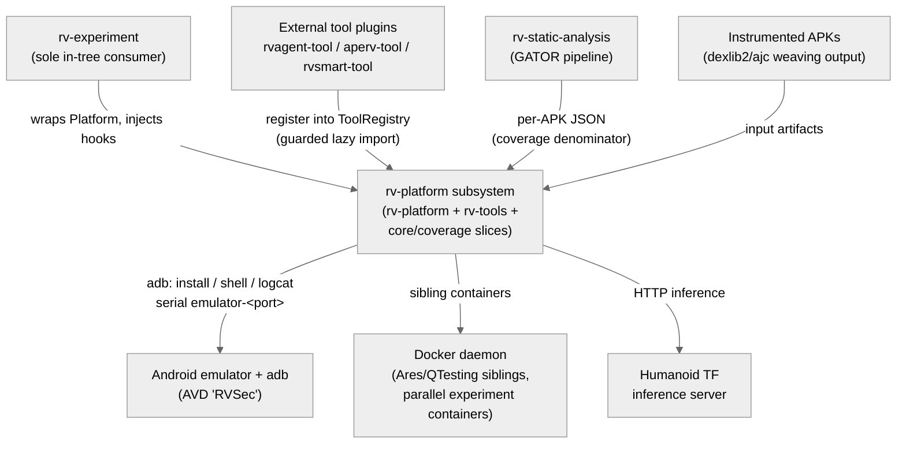
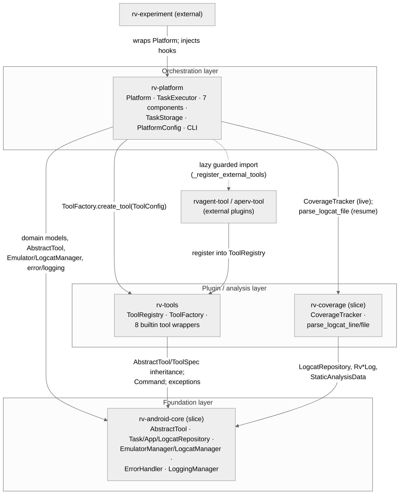
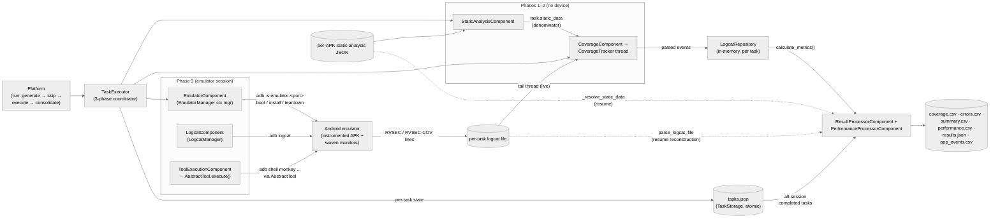
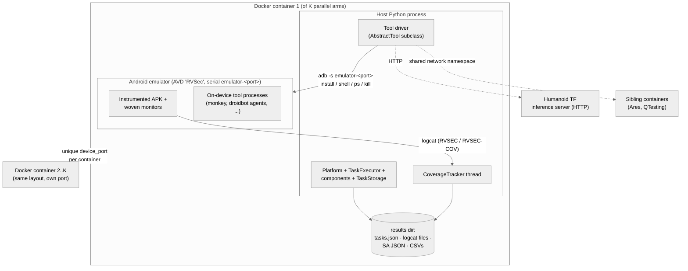

# Architecture — rv-platform subsystem

> Scope: **subsystem** · Generated by `rv-doc-arch` · Source model: `out/arch/subsystem-rv-platform/architecture-model.json`
> Languages: Python (4 modules, ~18,900 LOC)

## Table of Contents

- [Part I — Beyond Views](#part-i--beyond-views)
  - [1. Documentation overview](#1-documentation-overview)
  - [2. Conceptual primer](#2-conceptual-primer)
  - [3. System overview and context](#3-system-overview-and-context)
  - [4. How it works — end to end](#4-how-it-works--end-to-end)
  - [5. Core components](#5-core-components)
  - [6. Mapping between views](#6-mapping-between-views)
  - [7. Rationale](#7-rationale)
  - [8. Output artifacts](#8-output-artifacts)
  - [9. Directory](#9-directory)
- [Part II — Views](#part-ii--views)
  - [Module view](#module-view)
  - [Component-and-connector view](#component-and-connector-view)
  - [Allocation view](#allocation-view)
- [Appendices](#appendices)
- [Specification traceability](#specification-traceability)

---

## Part I — Beyond Views

### 1. Documentation overview

This document describes the architecture of the **rv-platform subsystem** — the execution
engine of RV-Android. The subsystem spans four Python modules of the uv workspace:
`rv-platform` itself (orchestration), `rv-tools` (the tool plugin system), and scoped slices
of `rv-android-core` (the foundation contract) and `rv-coverage` (the coverage tracker and
logcat parser). It is written for a **new engineer with no prior exposure to this subsystem**:
reading it top to bottom should leave you able to trace a task from CLI invocation to its rows
in `coverage.csv`, and to understand why the code is split the way it is before you change any
of it. It follows the SEI *Views and Beyond* method: Part I is the cross-view material
(concepts, worked example, rationale), Part II contains the selected architectural views.

**How to read this document:** Part I builds your mental model — what the subsystem is
([primer](#2-conceptual-primer)), how it behaves end to end
([walkthrough](#4-how-it-works--end-to-end)), and why it is shaped this way
([rationale](#7-rationale)). Part II documents the selected views in detail.

### 2. Conceptual primer

The rv-platform subsystem is the execution engine of RV-Android: it takes a directory of
instrumented APKs and a list of testing tools, expands them into a matrix of tasks (one task =
one APK run by one tool variant for one timeout, repeated N times), and runs each task end to
end — boot an Android emulator, install the APK, run the tool for a bounded time, capture the
device log (logcat), track which app methods executed and which monitored-operation (MOP)
properties were violated, and consolidate everything into CSV/JSON result files. It is the
layer between experiment orchestration (rv-experiment, its only in-tree consumer) and the raw
mechanics of devices, tools, and logs.

**Why this approach.** The obvious alternative is a single script that loops over APKs and
shells out to tools — which is where research prototypes usually start and where they become
unmaintainable. The platform instead splits each task's execution into pluggable components
with an initialize/execute/cleanup lifecycle, coordinated in three phases by a `TaskExecutor`.
The trade-off accepted is indirection (a component registry, a shared context dict, phase
classification by `isinstance`) in exchange for three properties a monolith cannot give:
(1) expensive device-free work (static-analysis loading, coverage-tracker setup) runs before
the emulator boots, so an emulator is never held idle; (2) every tool — Monkey, DroidBot,
APE-RV, RVAgent — runs through one uniform `AbstractTool` contract, so adding a tool never
touches the executor; (3) failure in any component is caught at one place, cleanup always
runs, and the task is marked ERROR without aborting the experiment. A second deliberate choice
is crash-safe persistence: task state is written atomically to `tasks.json` after every task,
so a multi-day experiment that dies at task 400 of 500 resumes by re-running the same
command — completed tasks are skipped by identity tuple, and results for the skipped tasks are
reconstructed from their persisted logcat files rather than trusted from serialized numbers.

**Key concepts**

- **Task** — The atomic unit of execution: one (apk_name, tool, variant, repetition, timeout)
  combination, modeled by `Task`/`TaskConfiguration`/`ToolConfig` in rv-android-core. A task
  moves through a state machine (CREATED → RUNNING → COMPLETED | ERROR) and is persisted after
  each transition.
- **Component** — A pluggable unit of the per-task pipeline with an
  `initialize(context)`/`execute(context)`/`cleanup(context)` duck-typed lifecycle. rv-platform
  ships seven: static analysis, coverage, emulator, logcat, tool execution, result processing,
  performance processing.
- **AbstractTool** — The template-method base class (rv-android-core) every testing tool
  implements. `execute()` orchestrates the run and converts command timeouts into
  `RVToolTimeoutError`; subclasses implement `execute_tool_specific_logic()`, `get_variants()`,
  `configure()`, `get_tool_spec()`.
- **Variant** — A named parameter preset for a tool (e.g. `droidbot:dfs_greedy`). `ToolFactory`
  resolves the variant's defaults and merges user overrides on top (`{**variant, **params}`)
  before calling `tool.configure()`.
- **MOP (Monitored Operations)** — Operations monitored by runtime-verification specifications
  woven into the APK. The instrumented app emits logcat lines tagged `RVSEC` (property
  violation) and `RVSEC-COV` (method executed); these tags are the platform's only window into
  the app's runtime behavior. MOP is not security-specific terminology.
- **LogcatRepository** — The in-memory store (rv-android-core domain) of parsed coverage and
  violation events for one task. Populated live by `CoverageTracker` during execution, or
  rebuilt after the fact by re-parsing the persisted logcat file (resume path).
  `calculate_metrics()` over it is the single source of all coverage numbers.
- **Resume / expand** — Re-running the same platform command after a crash (crash recovery) or
  with more repetitions (expand). Completed tasks matched by the identity tuple
  (apk_name, tool name, variant, repetition, timeout) are skipped; result consolidation then
  covers ALL sessions, reconstructing skipped tasks' data from their logcat + co-located
  static-analysis JSON.
- **Static-analysis JSON** — The per-APK output of the GATOR-based analyzer (produced
  upstream, outside this subsystem). Its reachability section is the coverage denominator: the
  set of app methods that could execute. The platform only loads and parses this file; it
  never runs the analysis.

### 3. System overview and context

The subsystem sits in the middle of the RV-Android pipeline. Above it, **rv-experiment** is
its sole in-tree consumer: it wraps `Platform`, injects pre/post execution hooks for
cross-task coordination, and handles pre/post-processing around the platform run. Below it,
the **Android emulator (AVD `RVSec`)** is the execution environment — the platform owns its
full lifecycle via `EmulatorManager`, and all interaction is adb subprocesses addressed by the
dynamic serial `emulator-<port>`. Two artifact producers feed the platform from upstream:
**rv-static-analysis** (the GATOR pipeline, documented separately in
`docs/architecture/static-analysis.md`) produces the per-APK `<apk_name>.json` whose
reachability section is the coverage denominator — the platform only consumes this file,
parsing it through the module-level `static_analysis_parser` instance of
`StaticAnalysisParser` that `components/static_analysis.py` imports from
`rv_static_analysis.parser.static`; it never runs the analysis — and the
instrumentation pipeline (dexlib2/ajc weaving) produces the **instrumented APKs** whose woven
monitors emit the `RVSEC`/`RVSEC-COV` logcat lines that are the platform's only runtime
signal.

Three further neighbors complete the picture. **External tool plugins** (rvagent-tool,
aperv-tool, rvsmart-tool) register production tools into the `ToolRegistry` via guarded lazy
imports and are executed through the same `AbstractTool` contract as builtins (their internals
are documented in `docs/architecture/ape-rv.md`). The **Docker daemon** hosts two builtin
tools (Ares, QTesting) as sibling containers sharing the network namespace, and the platform
itself also runs inside containers for parallel multi-arm experiments. Finally, the
**Humanoid TF inference server** is an HTTP backend required by the Humanoid builtin tool.

**Constraints:** the subsystem is pure Python inside the uv workspace (no cross-language
build artifacts of its own); the platform must own the entire emulator lifecycle (manual
emulator management is forbidden project-wide); static analysis is produced upstream and only
consumed here; and every tool must be driven exclusively through the `AbstractTool` contract.

**System context diagram** (external actors and systems — every view refers back to this):

### 4. How it works — end to end

The following walks through a concrete example: running
`uv run rv-platform run --tools monkey --apks-dir ./apks_examples --timeouts 60` against the
instrumented `cryptoapp.apk` (package `br.unb.cic.cryptoapp`), and following the single task
(cryptoapp.apk × monkey:default × repetition 1 × 60 s) from generation to its rows in
`coverage.csv`.

**1. CLI and configuration validation.** `cmd_run` in `rv_platform/__main__.py` parses the
arguments and builds a `PlatformConfig`, a Pydantic model whose field validators run at
construction time: `apks_dir` must exist and be a directory, at least one tool must be given,
`repetitions >= 1`, every timeout `>= 1` (INV-PLT-09). The `--timeouts` string is parsed to
`List[int]` with the same rules as the rv-experiment CLI before `PlatformConfig` is even
constructed (INV-PLT-22). Importing `rv_platform` has already triggered
`_register_external_tools()` in `rv_platform/__init__.py`, which lazily and guardedly imports
the external tool plugins (rvagent-tool, aperv-tool) so their registration failure never
breaks a Monkey-only run. Concretely, the result is
`PlatformConfig(apks_dir='./apks_examples', tools=[ToolConfig(name='monkey', variant='default')], timeouts=[60], repetitions=1)`;
validation lives in `modules/rv-platform/src/rv_platform/config/platform_config.py`.

**2. Task generation and resume skip.** `Platform.run()` (`platform.py`) calls
`_generate_tasks()`, which discovers cryptoapp.apk in the APK directory and produces exactly
|APKs| × |tool_configs| × repetitions × |timeouts| tasks (INV-PLT-01) — here, one. Each
`Task` is minted through the `TaskFactory` (`rv_android_core.domain.task`) that
`Platform.__init__` instantiated as `self.task_factory = TaskFactory(Task)`
(`platform.py:88`) — the same factory instance `Platform` hands to `TaskStorage`, so tasks
created here and tasks reconstructed on resume are built by one factory. It then
builds an `ExperimentMetadata` carrying a SHA-256 checksum of the sorted-key JSON-serialized
configuration (INV-PLT-12) and calls `_skip_completed_tasks()`: if a `tasks.json` from a
previous session exists, tasks whose identity tuple (apk_name, tool name, variant, repetition,
timeout) matches a completed task are removed from the run list and counted in
`_skipped_count`. If the stored checksum differs from the new one, `platform.py` logs a
WARNING quoting the first 8 hex chars of each checksum — the run continues, but the operator
is told the configuration drifted. The identity tuple for our task is
`('cryptoapp.apk', 'monkey', 'default', 1, 60)`; on a first run `tasks.json` is absent,
nothing is skipped, and `_skipped_count = 0`.

**3. Tool instantiation via the plugin seam.** For the task's `ToolConfig`,
`ToolFactory.create_tool()` (rv-tools) looks the name up in the `ToolRegistry` singleton —
populated at import time by `_register_builtin_tools()` with the 8 built-in tools — resolves
the `default` variant's parameter dict, merges user overrides over it
(`{**variant_defaults, **params}`), instantiates `MonkeyTool`, and calls
`tool.configure(merged)`. Unknown tool or variant raises `ConfigurationError` here, before any
emulator work. `MonkeyTool` is an `AbstractTool` subclass, so from this point the platform
only sees the abstract contract. `ToolRegistry.get_instance()` holds three parallel name-keyed
maps (classes/specs/variants); `MonkeyTool.get_variants()['default']` supplies the merged
config validated by `MonkeyTool.configure()`
(`modules/rv-tools/src/rv_tools/builtin/monkey/tool.py`).

**4. Executor setup and phase 1 — static-analysis loading (no device).** `Platform` builds a
`TaskExecutor(task, tool, task_storage)` and registers the components in order. `execute()`
validates `task.app`, runs pre-execution hooks (rv-experiment's cross-task coordination
extension point), transitions the task to RUNNING, initializes every component in registration
order, then dispatches components to three phases by `isinstance`
(`executor.py:_execute_coordinated_components`). Phase 1: `StaticAnalysisComponent` loads the
per-APK GATOR JSON (`cryptoapp.json`, co-located with the APK) into `task.static_data`,
parsing it through the module-level `static_analysis_parser` (a `StaticAnalysisParser`
instance imported from `rv_static_analysis.parser.static`) — the platform's only touchpoint
with the upstream analysis. This
is deliberately non-critical: a load failure logs a warning and returns True — the task runs
on without a coverage denominator (INV-PLT-05). The phase classification chain lives in
`modules/rv-platform/src/rv_platform/execution/executor.py` lines 314–324; the static data
gives `CoverageTracker` the universe of reachable `br.unb.cic.cryptoapp` methods.

**5. Phase 2 — coverage tracker initialization (no device).** `CoverageComponent` constructs a
`CoverageTracker` (rv-coverage) wired to the task's future logcat file path and the static
data from phase 1, but does not start its monitoring thread — there is nothing to tail yet.
Doing this outside the emulator session is the point of the phase split: any time spent here
is time the emulator is not burning CPU. The tracker pre-populates a `LogcatRepository` with
the reachable classes/methods via `initialize_repository_from_static_data`, so coverage
percentages have a denominator from the first parsed line. The constructor is
`CoverageTracker(logcat_file, static_data, task_start_time, task_id)` in
`modules/rv-coverage/src/rv_coverage/analysis/coverage/tracker.py`; its background thread uses
adaptive sleep (0.5 s with data, 1.0 s idle) under an `RLock`.

**6. Phase 3 — emulator session: boot, install, capture, run.**
`TaskExecutor._run_emulator_session()` enters `EmulatorComponent.start_emulator('RVSec')`, a
context manager over `EmulatorManager` (rv-android-core) that starts the AVD on a dynamic port
(device serial `emulator-<port>`, enabling parallel Docker containers without port conflicts),
disables the three system animation scales for speed, and guarantees teardown in its `finally`
block. Boot completion is a gate, not an observation: `Android.wait_for_boot()` raises
`TimeoutError` naming the phase that exhausted the shared budget (`RV_EMULATOR_BOOT_TIMEOUT`,
default 300 s), which `start_emulator()` wraps as `EmulatorError`, so no task ever runs against
a half-booted device. The `yield` sits outside that `try`, so an exception from the session
body keeps its own type instead of being relabelled a startup failure. Inside the session the
executor installs the APK (`install_app()` returns False and records the ADB reason in
`last_install_error`; the executor raises `TaskExecutionError` carrying that reason, so an
`INSTALL_FAILED_*` code reaches the stored `error_message`), starts `LogcatComponent` capture
BEFORE the tool runs so
no `RVSEC` line is missed, calls `task.mark_tool_execution_start()` to timestamp tool start
separately from emulator boot (boot time would skew time-relative coverage), starts the
coverage tracker thread, and finally invokes `ToolExecutionComponent.execute()` →
`MonkeyTool.execute(task, app)`. The session opens at
`with emulator_component.start_emulator('RVSec') as android:` (`executor.py:388`);
`EmulatorManager.disable_animations()` sets window/transition/animator scales to `'0.0'` via
`adb shell settings put global`.

**7. Tool run under the template method, timeout as success.**
`MonkeyTool.execute_tool_specific_logic()` drives
`adb shell monkey -p br.unb.cic.cryptoapp ...` through the Command infrastructure. While
Monkey injects events, the instrumented APK logs each first-time method entry as an
`RVSEC-COV` line and each property violation as an `RVSEC` line; `CoverageTracker`'s thread
tails the logcat file, feeds each line to `parse_logcat_line()`, and registers
`RvCoverageLog`/`RvErrorLog` objects into the `LogcatRepository`. When the 60 s budget
expires, Command raises `RVCommandTimeoutError`, which `AbstractTool.execute()` converts to
`RVToolTimeoutError`; `ToolExecutionComponent` catches exactly that type and returns True —
timeout is the expected termination of a bounded-time experiment, not a failure (INV-PLT-04).
Afterwards the executor's single finalization point stops logcat capture first, then
coverage (`process_results()` freezes metrics into `task.result.coverage_metrics`) —
`adb logcat` is the producer writing the file and `CoverageTracker` is the consumer
reading it through its own handle, so stopping the producer first freezes the file and
the consumer's final drain then sees a complete input. Then
`AbstractTool.kill_related_processes()` pkills device-side survivors matching the tool's
`process_pattern`. A coverage line looks like
`RVSEC-COV: <br.unb.cic.cryptoapp.MainActivity: void onCreate(android.os.Bundle)>`; a JCA
violation line is tagged `RVSEC` with comma-separated spec,class,init,method,... fields
(parsed in `modules/rv-coverage/src/rv_coverage/parser/log/logcat_parser.py`).

**8. State transition and atomic persistence.** Back in `execute()`, cleanup runs for every
component (failures logged as warnings, never propagated — INV-PLT-06), the task transitions
to COMPLETED, and post-execution hooks fire with `(task, True)`. `Platform` then persists the
task through `TaskStorage`, whose `save()` writes to a temporary file, fsyncs, and renames —
the storage file can never be half-written even if the process dies mid-save (INV-PLT-03).
`tasks.json` now holds the `ExperimentMetadata` (with `config_checksum`) and this task's
id/config/result, including `result.logcat_file` — the one field that makes later
reconstruction possible. `TaskStorage` lives in
`modules/rv-platform/src/rv_platform/storage/task_storage.py` (853 lines): RLock-guarded
(INV-PLT-07), transaction-buffered (INV-PLT-11), `auto_save` honored per `StorageConfig`
(INV-PLT-08).

**9. Result consolidation across all sessions.** `_process_results()` fetches ALL completed
tasks from storage — this session's and any prior session's — and hands them to
`ResultProcessorComponent`, which writes the five outputs: `coverage.csv` (per-method rows
with timing), `errors.csv` (MOP violations), `summary.csv` (per-task aggregates),
`performance.csv`, `results.json` (INV-PLT-14). For a live task the populated
`task.repository` supplies `calculate_metrics()`; for a resumed task (`repository=None` after
deserialization) the component calls `_reconstruct_repository_from_logcat(task)`: re-read
`result.logcat_file`, derive the per-APK directory as `os.path.dirname(logcat_file)` when
`results_dir` was not serialized, re-parse the co-located `cryptoapp.json` via
`_resolve_static_data`, and re-run `parse_logcat_file` — producing metrics equal to the live
path within 0.01 (INV-PLT-18 round-trip equivalence). Serialized `coverage_metrics` are never
used as a fallback (INV-PLT-16). Finally `_generate_summary()` reports totals including
`_skipped_count`. The four reconstruction call sites are `_write_task_coverage_data`,
`_write_task_error_data`, `_write_task_summary_data`, and `_extract_task_data` in
`modules/rv-platform/src/rv_platform/components/result_processor.py` (1,024 lines — the
module's complexity hotspot, max CC 18).

### 5. Core components

**Platform** is the one object a caller (CLI `cmd_run` or rv-experiment's
`ExecutionController`) touches. Its `run()` method owns the whole session arc: generate the
task matrix, compare against persisted history, execute the remainder one task at a time (each
in a fresh `TaskExecutor`), persist after every task, and finally consolidate results across
all sessions. It carries the `_skipped_count` that makes the end-of-run summary honest about
how much work was inherited from previous sessions.

**TaskExecutor** turns one task into a controlled sequence: pre-hooks → RUNNING → initialize
components in registration order → phase 1 (static analysis, no device) → phase 2 (coverage
init, no device) → phase 3 (emulator session: install, logcat, coverage thread, tool) →
cleanup → COMPLETED → post-hooks. Phase membership is decided by `isinstance` against the five
known component types, not registration order. Its error path is the subsystem's resilience
core: any exception is routed to `ErrorHandler`, the task is marked ERROR, cleanup still runs
(its own exceptions swallowed so they cannot mask the original), and post-hooks fire with
`success=False`; `execute()` itself never raises.

**Execution components** (StaticAnalysis, Coverage, Emulator, Logcat, ToolExecution) each
implement the duck-typed initialize/execute/cleanup lifecycle and communicate through the
context dict built by `get_task_context()` (task_id, apk_name, tool_name, repetition,
timeout), which phase 3 enriches with `'android'` (the live device interface) and
`'device_id'`. `StaticAnalysisComponent` is non-critical by contract; `CoverageComponent`
bridges to rv-coverage's tracker; `EmulatorComponent` wraps `EmulatorManager`'s context
manager and reports install failure by returning False with the ADB reason in
`last_install_error`; `LogcatComponent` brackets the tool run
with capture — when diagnostics are enabled it appends `DIAGNOSTIC_TAGS`
(`["AndroidRuntime:E", "art:E", "dalvikvm:E", "ActivityManager:W"]`, defined in
`rv_android_core.util.android.logcat_manager`) to `logcat_manager.default_tags`, otherwise it
passes no tags so the baseline capture command stays byte-identical; `ToolExecutionComponent`
dispatches to the `AbstractTool` and encodes the timeout-is-success rule.

**ResultProcessorComponent + PerformanceProcessorComponent** run the consolidation pass over
every COMPLETED task in storage regardless of which session produced it (INV-PLT-10/14). Its
defining behavior is uniformity: per-method rows in `coverage.csv` and aggregates in
`summary.csv` are both computed from `LogcatRepository.calculate_metrics()` over a populated
repository — for resumed tasks that repository is rebuilt from the persisted logcat plus the
co-located static-analysis JSON. When the JSON is unresolvable it emits zeroed coverage rows
(errors remain accurate), memoizes the miss per task, and surfaces one aggregate
"N/M resumed tasks had unresolved static data" WARNING instead of failing or silently
corrupting.

**TaskStorage + ExperimentMetadata** form the crash-recovery substrate: `save()` writes to a
temp file, fsyncs, and renames so `tasks.json` is never half-written; all public methods take
an `RLock`; transactions buffer changes in `transaction_tasks` until commit. Its constructor
takes `task_factory: Optional[TaskFactory]` (defaulting to `TaskFactory(Task)`), and `load()`
uses that factory to reconstruct `Task` objects from their serialized dicts — the resume path
re-materializes real `Task` instances through the same factory `Platform` used to create
them. `ExperimentMetadata` rides inside it with a SHA-256 checksum of the sorted-key config JSON —
resume compatibility is checksum equality, and a mismatch produces an operator-visible warning
rather than a refusal.

**ToolRegistry + ToolFactory** are the seam through which every tool reaches the executor.
The registry is an import-time-populated singleton (three name-keyed maps); the factory turns
a declarative `ToolConfig` into a configured `AbstractTool` instance by merging user
parameters over variant defaults. External plugins register through the same API, imported
lazily and guardedly by `rv_platform/__init__.py`, so a missing LLM plugin never blocks a
Monkey experiment.

**AbstractTool** is the type of every tool the platform runs. `execute()` wraps the subclass's
`execute_tool_specific_logic()` with two guarantees the platform relies on:
`RVCommandTimeoutError` from the Command layer is always converted to `RVToolTimeoutError` (so
`ToolExecutionComponent` can pattern-match one exception type for the timeout-is-success
rule), and `kill_related_processes()` sweeps the device for processes matching the tool's
`process_pattern` after the run, preventing leaks across consecutive tasks.

**EmulatorManager + LogcatManager** are the allocation boundary between the host process and
the Android device. `EmulatorManager.start_emulator(avd_name, no_window, device_port)` derives
the serial `emulator-<port>`, disables animations for headless throughput, yields an Android
interface, and its `finally` block kills the emulator even when the session body raised.
Dynamic ports are what let K Docker containers each run their own emulator in parallel.
`LogcatManager` runs the adb logcat subprocess into the per-task file whose path becomes
`TaskResult.logcat_file` — the durable record everything else is reconstructed from.

**CoverageTracker + logcat parser** provide the live and batch sides of one grammar. The
tracker thread tails the logcat file the `LogcatManager` is writing — a deliberate shared-file
connector rather than a pipe, because the file must persist for resume anyway. Each line goes
through the same `parse_logcat_line` grammar used by the batch `parse_logcat_file`, which is
the property that makes live metrics and resume-reconstructed metrics provably equal
(INV-PLT-18).

**LogcatRepository (+ StaticAnalysisData)** is seeded with the reachable classes/methods from
the static-analysis JSON (the denominator), then accumulates `RvCoverageLog` and `RvErrorLog`
events (the numerator and the violations). All five CSV writers derive their numbers from
`calculate_metrics()` over it — there is deliberately no second path, so a repository that
fails to populate is loudly visible as zeroed rows rather than silently patched from stale
serialized values.

**ErrorHandler + exception taxonomy + LoggingManager** give every layer the same error and
logging spine. The 26-class exception tree rooted at `RVAndroidError` encodes handling policy
in the type system: the executor and components decide behavior by `isinstance`
(`RVToolTimeoutError` → success, `EmulatorError` → task failure, `ConfigurationError` → abort
before device work). `ErrorHandler` centralizes reporting with task context; `LoggingManager`
gives every class a logger pre-loaded with structured fields (task_id, apk_name, tool_name,
component) so a multi-container experiment's interleaved logs remain attributable.

**The Android emulator (AVD `RVSec`)** is where the actual verification happens: the woven
monitors inside the APK observe API usage and write `RVSEC`/`RVSEC-COV` lines to logcat. The
platform talks to it exclusively through adb subprocesses (install, shell monkey, shell
ps/kill, logcat) addressed by the dynamic serial `emulator-<port>`. The platform owns its
entire lifecycle — boot, animation tuning, teardown — which is why manual emulator management
is forbidden project-wide.

| Component | Realized by | Responsibility |
|-----------|-------------|----------------|
| Platform | `rv-platform/src/rv_platform/platform.py` | Run-level orchestration: task generation, resume skip, per-task executor dispatch, result consolidation |
| TaskExecutor | `rv-platform/src/rv_platform/execution/executor.py` | Per-task three-phase component coordinator with hook extension points |
| Execution components | `rv-platform/src/rv_platform/components/` | Pluggable per-phase workers sharing a stringly-typed context dict |
| ResultProcessorComponent + PerformanceProcessorComponent | `rv-platform/src/rv_platform/components/result_processor.py`, `.../performance_processor.py` | All-session consolidation into coverage.csv, errors.csv, summary.csv, results.json, performance.csv |
| TaskStorage + ExperimentMetadata | `rv-platform/src/rv_platform/storage/task_storage.py` | Atomic, thread-safe, transactional persistence of task state in tasks.json |
| ToolRegistry + ToolFactory | `rv-tools/src/rv_tools/registry/{registry,factory}.py` | Discovery, registration, and variant-resolved instantiation of testing tools |
| AbstractTool | `rv-android-core/src/rv_android_core/tools/abstract_tool.py` | Uniform tool lifecycle: execute → timeout conversion → device-side process cleanup |
| EmulatorManager + LogcatManager | `rv-android-core/src/rv_android_core/util/android/{emulator_manager,logcat_manager}.py` | Emulator boot/teardown context manager with dynamic ports; adb logcat file capture |
| CoverageTracker + logcat parser | `rv-coverage/src/rv_coverage/analysis/coverage/tracker.py`, `.../parser/log/logcat_parser.py` | Real-time (thread) and batch (file) parsing of RVSEC/RVSEC-COV lines into LogcatRepository |
| LogcatRepository (+ StaticAnalysisData) | `rv-android-core/src/rv_android_core/domain/{coverage,static}.py` | In-memory event store per task; `calculate_metrics()` is the single source of all coverage numbers |
| ErrorHandler + taxonomy + LoggingManager | `rv-android-core/src/rv_android_core/util/{error,logging}/` | Singleton error routing with type-encoded policy; context-injecting structured logging |
| Android emulator (AVD 'RVSec') | Android SDK emulator + adb (external) | Runs the instrumented APK and on-device tool portions; emits the logcat stream |

### 6. Mapping between views

The module and runtime structures line up almost one-to-one, so the map is short but worth
stating explicitly. The **rv-platform module** realizes the run-level and per-task runtime
components: the Platform facade, the TaskExecutor, the five execution components, the two
result processors, and TaskStorage all live in its source tree. The **rv-tools module**
realizes the tool plugin seam (ToolRegistry + ToolFactory) plus the eight builtin tool
wrappers. The **rv-android-core platform slice** realizes the contracts everything else is
written against: the AbstractTool template method, the Task/App/LogcatRepository domain
models, the EmulatorManager/LogcatManager device lifecycle, and the error/logging spine. The
**rv-coverage tracker/parser slice** realizes the CoverageTracker and the logcat line grammar.
The generalization relation cuts across modules: every builtin tool in rv-tools and every
external plugin tool specializes the `AbstractTool` contract defined in core (template method:
`execute()` → `execute_tool_specific_logic()`).

Although the subsystem is single-language Python, it has a hard **process boundary** that
behaves like a language boundary: the host Python process versus the Android emulator. What
crosses it is exclusively adb subprocess invocations (`adb -s emulator-<port> install`,
`adb shell monkey`, `adb shell ps`/`kill`, `adb logcat`) going out, and the logcat text stream
coming back. The instrumented APK and its woven monitors execute on the device; the platform
never runs code there directly — its entire view of the app's runtime behavior is the
`RVSEC`/`RVSEC-COV` lines that `LogcatManager` captures to a file on the host. Some builtin
tools add further process boundaries of their own: DroidMate runs as a JAR subprocess, Ares
and QTesting run as sibling Docker containers sharing the network namespace, and Humanoid
calls an HTTP inference server.

Three **durable files** connect components that never call each other: the per-task logcat
file (written by LogcatManager, tailed live by CoverageTracker, re-parsed on resume by
ResultProcessorComponent), `tasks.json` (written by TaskStorage after each task, read by later
sessions' Platform for skip decisions and by ResultProcessorComponent for all-session
consolidation), and the per-APK static-analysis JSON (produced upstream by rv-static-analysis,
loaded live by StaticAnalysisComponent via `static_analysis_parser` and by
`_resolve_static_data` on resume). These
shared-data connectors are the subject of the C&C view's shared-data style. In deployment
terms, everything in the module view runs in the host Python process (one per Docker container
in parallel experiments); only the emulator, the instrumented APK, and tools' on-device
processes run on the Android device node.

### 7. Rationale

The decisions that shaped this architecture, each with the tension behind it and the failure
mode it avoids.

**Three-phase coordinated component execution.** The tension is between simplicity (one
linear function that boots the emulator first and does everything inside) and throughput (an
emulator burning CPU while the host parses a JSON file is pure waste, multiplied by hundreds
of tasks and K parallel containers). The rejected alternative — a monolithic run function —
also couples every concern to the device lifecycle, making it impossible to unit-test
static-analysis loading or coverage setup without an emulator. The chosen design classifies
registered components by `isinstance` into three phases and only enters
`EmulatorComponent.start_emulator()` for phase 3. Without it, experiment wall-clock time
inflates by the per-task analysis time × task count, and a static-analysis failure could
strand a booted emulator. (INV-PLT-13)

**Tool timeout is successful completion.** Testing tools do not converge — they explore until
stopped, so every properly-configured run ends by hitting its timeout. Treating timeout as
failure (the naive reading of a TimeoutError) would mark essentially all valid data points as
broken and poison downstream statistics. The design therefore builds a dedicated exception
channel: Command raises infrastructure-level `RVCommandTimeoutError`, `AbstractTool.execute()`
converts it to `RVToolTimeoutError`, and `ToolExecutionComponent` pattern-matches exactly that
type to return success while genuine tool failures (non-zero exit, crashes) still fail the
task. The rejected alternative — per-tool timeout handling — was what the conversion in
AbstractTool exists to eliminate: the platform layer handles all tool timeouts uniformly
without knowing Command internals. (INV-PLT-04)

**Atomic task persistence with checksum-validated resume.** The failure mode being designed
against is concrete: a 500-task experiment dies at task 400 (power, OOM, adb wedge) and the
operator either loses four days of results or hand-edits state files. Atomic writes guarantee
`tasks.json` is never torn even mid-save; skipping by the identity tuple (apk_name, tool,
variant, repetition, timeout) makes "re-run the same command" the entire recovery procedure
and doubles as the expand mechanism for adding repetitions. The SHA-256 config checksum
(INV-PLT-12) guards the semantic hazard of resuming under a silently changed configuration —
the platform warns with the first 8 hex chars of both checksums rather than refusing, because
researchers legitimately tweak non-identity settings between sessions. The rejected
alternatives were a database (operational burden for a research pipeline that ships results as
flat files) and best-effort in-memory state (loses everything on crash). (INV-PLT-03)

**Resume reconstruction from logcat, never from serialized metrics.** `Task.to_dict()` cannot
serialize the in-memory repository (thousands of per-method events), so a resumed task arrives
with `repository=None`. The tempting shortcut is to trust the small serialized
`task.result.coverage_metrics` dict — but that path can only fill `summary.csv`, not the
per-method rows of `coverage.csv`, producing the exact inconsistency verify.py C3 flags
(summary != 0 while coverage_rows == 0), and it silently propagates any staleness in the
serialized numbers. The chosen design re-parses the durable ground truth: the logcat file
(whose dirname also locates the co-located static-analysis JSON, since `results_dir` is not
serialized — INV-PLT-15) through the same `parse_logcat_file` grammar the live tracker uses.
INV-PLT-18 pins the payoff as a testable round-trip: resumed metrics equal live metrics within
0.01. When the JSON is genuinely absent the writers emit zeroed rows and one aggregate N/M
health-check WARNING — degradation is visible, never silent. (INV-PLT-16)

**Registry/factory plugin seam with import-time registration.** The platform must run tools
it has never heard of — rvagent-tool, aperv-tool, rvsmart-tool live in separate modules with
heavy dependencies (LangGraph, LLM clients). Hard-importing them from the executor would make
every Monkey smoke-run require the full LLM stack, and the rejected alternative of entry-point
discovery adds packaging machinery for zero gain in a uv workspace (rvagent-tool's vestigial
`rv_tools.plugins` entry-point is consumed by nothing — the real mechanism is the direct
guarded import in `rv_platform/__init__.py`). The variant system carries a second decision:
presets live in `get_variants()` inside each tool and user parameters merge over them in the
factory, so a task's full configuration is reconstructible from its `ToolConfig` alone — which
is precisely what the resume identity tuple and the config checksum need. Without the seam,
adding a tool means editing the executor; with it, the executor has not changed as three
production plugins were added.

**Documentation-only interfaces; duck-typed component contract.** The components could
formally inherit ABCs, but the executor's dispatch already works structurally
(`hasattr(component, 'initialize')` guards, `isinstance` against concrete types for phase
classification), and forcing inheritance would add an import dependency from every component
to an interface module while catching no additional errors — Pydantic validates data at the
boundary, and there are exactly five component types in a fixed phase model. The tension this
decision accepts is drift risk: the ABCs can rot relative to reality, and indeed two
`ITaskExecutor` methods (`get_components`, `set_error_handler`) have implementations but zero
callers. The failure mode of the rejected alternative (full ABC enforcement) would be worse
for this codebase's P1 principle: premature abstraction for a plugin surface that has one
executor.

**AbstractTool contract lives in rv-android-core, not rv-tools.** If `AbstractTool` lived in
rv-tools, rv-platform's executor would import rv-tools for the type it executes, and every
external plugin would depend on the registry module just to subclass the contract — inviting
cycles the moment rv-tools needs a platform-adjacent model. Placing the contract plus the
domain vocabulary (Task, App, ToolConfig) in dependency-free rv-android-core gives the whole
subsystem a dependency depth of 2 with zero cycles (verified by rv-analyze-dependencies). The
executor drives tools knowing only core; rv-tools is purely the discovery/instantiation seam
and could in principle be swapped without touching either the contract or the executor's
execution logic.

**Decisions at a glance**

| Decision | Drivers | Invariant / ADR |
|----------|---------|-----------------|
| Three-phase coordinated component execution | Emulator time is the scarcest resource; component isolation and testability | INV-PLT-13 |
| Tool timeout is successful completion | Experiments are time-budgeted by design; uniform semantics across all tools | INV-PLT-04 |
| Atomic task persistence with checksum-validated resume | Multi-day experiments must survive crashes; expand must not re-run finished work; NFR08 | INV-PLT-03 |
| Resume reconstruction from logcat, never serialized metrics | Live/resumed CSV equivalence; detect corruption loudly | INV-PLT-16 |
| Registry/factory plugin seam, import-time registration | NFR02 extensibility; tools selected by string; LLM plugins must not break non-LLM runs | — |
| Documentation-only interfaces; duck-typed components | P1 simplicity; avoid ceremony duck typing makes redundant | — |
| AbstractTool contract in rv-android-core, not rv-tools | Acyclic dependency graph; plugins must not depend on the registry to define a tool | — |

**Patterns and styles**

At the module level the subsystem is **layered** (high confidence): a strict downward
dependency order rv-platform → rv-tools → rv-android-core (and rv-platform → rv-coverage →
rv-android-core), with rv-analyze-dependencies reporting 0 cycles, depth 2, and declared ==
actual for rv-tools; the only upward edges (platform → tool plugins) are mitigated by lazy
guarded imports in `rv_platform/__init__.py:14–41`. The complementary **uses** style is
equally explicit: pyproject dependencies plus the AbstractTool/ToolSpec contract deliberately
placed in rv-android-core so plugins and platform depend downward on the foundation instead of
on each other.

At runtime the dominant style is a **phased pipe-and-filter pipeline** (high confidence):
`TaskExecutor._execute_coordinated_components` dispatches components into 3 ordered phases
over a shared context dict, and per task the data flows APK → emulator session → logcat →
repository → metrics → CSV writers. Layered on top is a **shared-data** style (high
confidence): three durable stores connect otherwise decoupled parties — the logcat file
(instrumented app → LogcatManager → CoverageTracker tail thread → resume re-parse),
`tasks.json` (Platform sessions ↔ ResultProcessorComponent), and the per-APK static-analysis
JSON (upstream analyzer → StaticAnalysisComponent → `_resolve_static_data`). A
**client-server** flavor (medium confidence) covers device interaction: request/response over
adb subprocesses addressed by serial `emulator-<port>`, with some builtin tools adding their
own client-server edges (Humanoid HTTP inference server, Docker sibling containers for
Ares/QTesting).

For allocation, the **deployment** structure (high confidence) has two execution nodes per
task — the host Python process (platform, tracker thread, tool driver) and the Android
emulator (instrumented APK + woven monitors + on-device tool processes), with
`EmulatorManager.start_emulator(avd_name='RVSec', device_port=N)` allocating unique ports so
parallel Docker containers each own one emulator. An **install**-style file contract (medium
confidence) also exists: the per-APK results subdirectory holds the logcat file and the
co-located `<apk_name>.json`, `tasks.json` sits at the results root, and the resume path
derives directories from `os.path.dirname(task.result.logcat_file)` (INV-PLT-15) — the layout
itself is part of the architecture.

**NFRs served**

*Extensibility (NFR02).* New testing tools plug in without touching the executor: implement
AbstractTool's four abstract methods, register the class into ToolRegistry (builtins at
rv_tools import; external plugins via the guarded imports in `rv_platform/__init__.py`), and
the tool is addressable from the CLI as `name:variant`. The component pipeline is the second
axis: TaskExecutor drives duck-typed initialize/execute/cleanup components, so a new per-task
concern (e.g. the diagnostics CSV added later without altering baseline column order,
INV-PLT-19) lands as a component or writer, not as executor surgery.

*Resilience (NFR04).* Failure policy is encoded in the exception taxonomy and enforced at
single choke points: tool timeouts convert to RVToolTimeoutError and count as success
(INV-PLT-04); static-analysis load failure logs a warning and the task proceeds (INV-PLT-05);
APK install failure becomes a `TaskExecutionError` carrying the ADB reason and fails only that
task; a boot that exhausts its budget becomes an `EmulatorError` before any tool runs;
`TaskExecutor.execute()`
never propagates — every exception routes through ErrorHandler, the task is marked ERROR, and
cleanup of all components still runs with its own exceptions swallowed (INV-PLT-06). The
emulator context manager's `finally` block guarantees device teardown even when the session
body raised, so one bad task cannot wedge the next.

*Reproducibility (NFR08).* TaskStorage's temp-file/fsync/rename writes (INV-PLT-03) plus
per-task persistence make any interrupted experiment resumable by re-running the identical
command; the SHA-256 config checksum (INV-PLT-12) detects configuration drift across sessions;
and the identity tuple (apk_name, tool, variant, repetition, timeout) defines task equality so
expand runs add only new work. The resume reconstruction path (INV-PLT-15/16/18) guarantees
consolidated CSVs are equivalent whether tasks ran in this session or a previous one — the
round-trip metric equality within 0.01 is spec-pinned and testable.

*Configurability (NFR05).* PlatformConfig is a Pydantic model whose field validators reject
invalid input at construction (apks_dir must exist, repetitions >= 1, timeouts >= 1, valid log
level — INV-PLT-09), so misconfiguration aborts before any device or storage side effect. Tool
behavior is configured declaratively through the ToolConfig DSL (`name:variant` plus parameter
overrides merged over `get_variants()` presets), keeping the entire effective configuration in
data — which is what makes it checksummable for resume.

*Observability (NFR06).* Every class obtains its logger from LoggingManager pre-bound with
structured context (task_id, apk_name, tool_name, component), so interleaved logs from
parallel containers remain attributable; lifecycle milestones are logged at fixed phrases
(Task started/completed/failed, Tool started/stopped) that downstream monitoring scripts grep
for. Post-hoc observability is the five-file CSV/JSON output contract plus performance.csv
timing rows, and degraded states are surfaced as aggregate warnings (the N/M resume health
check) rather than buried per-row.

| NFR | PRD ID | Architectural support |
|-----|--------|-----------------------|
| Extensibility | NFR02 | ToolRegistry/ToolFactory seam + AbstractTool contract; duck-typed component pipeline |
| Resilience | NFR04 | Type-encoded failure policy; cleanup-always executor; emulator teardown in `finally` |
| Reproducibility | NFR08 | Atomic tasks.json; identity-tuple skip; config checksum; logcat-based reconstruction |
| Configurability | NFR05 | Pydantic PlatformConfig validation at construction; declarative ToolConfig DSL |
| Observability | NFR06 | Structured context-bound logging; fixed lifecycle phrases; aggregate degradation warnings |

### 8. Output artifacts

Every platform run writes one results directory whose layout is itself contractual (the
resume path depends on it — see the shared-data view). The five consolidated files are
regenerated over all sessions on every run; the per-task logcat files are the durable ground
truth everything else can be rebuilt from.

| Artifact | Location | Notes |
|----------|----------|-------|
| `coverage.csv` | results dir | Per-method coverage rows with timing and progressive metrics; `cov_class` column carries class_coverage (INV-PLT-17) |
| `errors.csv` | results dir | MOP violations with timing/context; accurate even when coverage is degraded (errors counted before the empty-classes early return) |
| `summary.csv` | results dir | Per-task aggregates from the same `calculate_metrics()` source as coverage.csv — no independent fallback path |
| `performance.csv` | results dir | Task execution timing metrics |
| `results.json` | results dir | Hierarchical full-experiment data |
| `tasks.json` | results dir | Task-state persistence: ExperimentMetadata (config_checksum) + per-task id/config/result incl. logcat_file; the resume substrate |
| Per-task logcat files | results dir / per-APK subdirectory | Durable ground truth; co-located with the static-analysis JSON so resume can derive both from one path |
| `app_events.csv` | results dir | Diagnostic events; survives resume reconstruction (INV-PLT-20) and adds no columns to baseline CSVs (INV-PLT-19) |

### 9. Directory

**Glossary / acronyms**

- **adb** — Android Debug Bridge; the subprocess channel for all device interaction.
- **APK** — Android application package; here always the *instrumented* APK with woven monitors.
- **AVD** — Android Virtual Device; the emulator image (named `RVSec`) the platform boots.
- **GATOR** — the upstream static-analysis engine whose per-APK JSON supplies the coverage denominator.
- **Identity tuple** — (apk_name, tool name, variant, repetition, timeout); defines task equality for resume/expand.
- **MOP** — Monitored Operations: operations monitored by any runtime-verification specification (not security-specific).
- **RVSEC / RVSEC-COV** — logcat tags emitted by the woven monitors: property violation / method-executed coverage event.
- **Variant** — a named parameter preset for a tool (`droidbot:dfs_greedy`).

**References**

- Domain spec: `openspec/specs/platform/spec.md` (INV-PLT-01…22)
- Product requirements: `docs/PRD.md` (FR07–FR11, FR14; NFR02/04/05/06/08)
- Per-module 4+1 docs: `modules/rv-platform/docs/architecture.md`, `modules/rv-tools/docs/architecture.md`, `modules/rv-android-core/docs/architecture.md`, `modules/rv-coverage/docs/architecture.md`
- Neighboring subsystem docs: `docs/architecture/static-analysis.md` (GATOR pipeline), `docs/architecture/ape-rv.md` (external tool plugins), `docs/architecture/rv-android.md` (system)

---

## Part II — Views

### Module view

*Style(s): layered, uses*

This view is the map a maintainer needs before touching any dependency: it shows the strict
downward order (rv-platform → rv-tools / rv-coverage → rv-android-core), the
AbstractTool-in-core decision that keeps the graph acyclic, and the guarded upward plugin
edges. It also exposes the concrete seams each module consumes — ToolFactory,
CoverageTracker, `parse_logcat_file`, EmulatorManager — including the two slice-scoped
contracts from rv-android-core and rv-coverage. Note that two of the four elements are
*slices*: only the listed portions of rv-android-core and rv-coverage belong to this
subsystem; the rest of those modules is documented elsewhere.

**Primary presentation**

**Element catalog**

**rv-platform** (`modules/rv-platform`, orchestration layer). `Platform` (`platform.py`,
571 lines) is a facade over the whole run: `_generate_tasks()` expands the APK × tool ×
repetition × timeout matrix, `ExperimentMetadata` records a SHA-256 config checksum,
`_skip_completed_tasks()` removes identity-tuple matches from previous sessions, and the
remaining tasks each get a fresh `TaskExecutor`. `TaskExecutor` (`execution/executor.py`,
511 lines) registers components and dispatches them into three phases by `isinstance`: phase 1
loads the static-analysis JSON, phase 2 builds the CoverageTracker, phase 3 opens the emulator
context manager and inside it installs the APK, starts logcat capture, starts coverage
tracking, and runs the tool. Any component failure is caught in `execute()`; cleanup runs
regardless and the task lands in ERROR without propagating. After each task, `TaskStorage`
(`storage/task_storage.py`, 853 lines) persists state with write-temp/fsync/rename atomicity,
RLock thread safety, and transaction buffering. The tricky part of the module is result
consolidation: `ResultProcessorComponent` (`components/result_processor.py`, 1,024 lines)
must produce identical CSV output whether a task ran live (populated in-memory repository) or
was loaded from tasks.json (`repository=None`) — the resume path re-derives the per-APK
directory from the logcat path, re-parses the co-located static-analysis JSON at most once per
task (memoized via an empty-but-valid StaticAnalysisData and a component-level
`_unresolved_task_ids` set), and rebuilds the repository from the raw log.

*Why separate:* rv-platform isolates "how one task executes and how results are consolidated"
from both sides of its boundary: rv-experiment above it decides WHAT to run (pre-processing,
tool selection, experiment naming) and injects behavior only through pre/post execution hooks,
while rv-tools below it decides HOW each tool behaves. This lets the platform be driven
standalone from its own CLI for debugging a single APK, and lets rv-experiment stay free of
device, storage, and CSV mechanics. The boundary also protects the crash-recovery contract:
only this module knows the persistence format, so resume semantics cannot be accidentally
violated by tool or experiment code.

*Gotchas:*
- Deserialized tasks have `repository=None` and `results_dir=''` — `Task.to_dict` serializes
  only id/config/result. All coverage for resumed tasks flows through
  `_reconstruct_repository_from_logcat`; falling back to serialized
  `task.result.coverage_metrics` is forbidden (INV-PLT-16) because it would make summary.csv
  non-zero while coverage.csv is empty.
- Tool timeout (`RVToolTimeoutError`) is SUCCESS: ToolExecutionComponent returns True on it
  (INV-PLT-04). Treating it as failure would mark every bounded-time run as broken.
- The interfaces in `interfaces/task_interfaces.py` are documentation-only ABCs — concrete
  components deliberately do NOT inherit them; the contract is duck typing (`hasattr` checks
  in the executor). Two `ITaskExecutor` methods (`get_components`, `set_error_handler`) exist
  but have zero callers (dead surface).
- `rv_platform/__init__.py` lazily imports the tool plugins with ImportError guards, but the
  dependency declarations are asymmetric: rvagent-tool is a hard dep in pyproject.toml while
  aperv_tool is imported yet undeclared.
- Stop order in the emulator session matters: logcat stops before coverage, because `adb
  logcat` is the producer writing the file and `CoverageTracker` is the consumer reading it —
  stopping the producer first freezes the file, so `process_results()` reads a complete input.
  Both stops happen in one `finally` inside the emulator `with`, so they run on the failure
  path too, while the device is still alive; logcat's path must be persisted for resume.
- The static-analysis JSON is derived from the ORIGINAL APK upstream but placed next to the
  instrumented APK so the platform finds it; the platform itself never runs GATOR — it only
  loads the JSON (out-of-scope module rv-static-analysis parses it).
- Known dead symbols from analysis: `coverage.py:60 tracker_process` (write-only),
  `platform.py:537 get_tasks_summary`, `task_storage.py:106 backup_count` (configures a
  nonexistent backup-rotation feature).

**rv-tools** (`modules/rv-tools`, plugin layer). Importing `rv_tools` runs
`_register_builtin_tools()`: each builtin package's tool class is registered into the
ToolRegistry singleton in two phases (class+spec first, then variants), with per-tool failure
degrading gracefully — a broken builtin is skipped with a log entry, the import never fails.
The registry keeps three parallel name-keyed maps (classes, specs, variant configs) and hands
out defensive copies of variant dicts so registered defaults cannot be mutated. Creation is
`ToolFactory.create_tool(ToolConfig)`: look up the class, resolve the named variant (hard
failure on unknown variant in the factory path), merge user parameters over variant defaults
(`{**variant, **params}`), instantiate, and call `configure()` on the instance. Execution is
NOT this module's job — rv-platform's ToolExecutionComponent drives the configured instance
through the AbstractTool contract. The wrappers themselves shell out per tool: Monkey and APE
via adb, DroidMate via a JAR subprocess, Ares and QTesting via sibling Docker containers
sharing the network namespace, Humanoid via an HTTP inference server.

*Why separate:* the registry/factory seam is what makes tools plugins instead of platform
code: rv-platform depends only on the seam and the AbstractTool contract, so external modules
(rvagent-tool, aperv-tool, rvsmart-tool) can register production tools without rv-tools or
rv-platform knowing their names at compile time. Splitting it from rv-android-core keeps the
foundation dependency-free — the contract (AbstractTool, ToolSpec) lives in core precisely so
that rv-tools and every plugin depend downward on core rather than sideways on each other.

*Gotchas:*
- Variant defaults must live in `get_variants()`, never in environment reads inside the tool
  (INV-TOOL-20/25) — L2 tools reading env vars breaks reproducibility of the merged
  configuration.
- Re-registration of a tool name is allowed with a warning (hot-reload support in tests via
  `ToolRegistry.reset_instance()`).
- `builtin/qtesting/src/` is ~2,900 SLOC of vendored research code (God-class QLearning,
  MI 0) executed inside a Docker sibling container — do not lint/refactor it as first-party
  code.
- The twin `configure()` methods of fastbot (`tool.py:187`) and monkey (`tool.py:156`) are
  copy-pasted per-key validation blocks, both CC 24 — the module's only first-party complexity
  hotspot.
- rvagent-tool and aperv-tool declare rv-tools in their pyproject but never import it; real
  plugin loading is the direct import in `rv_platform/__init__.py`, and rvagent-tool's
  `rv_tools.plugins` entry-point is consumed by nothing.

**rv-android-core, platform slice** (`modules/rv-android-core`, foundation layer; slices:
`tools/abstract_tool.py`, `domain/`, `util/android/emulator_manager.py`,
`util/android/logcat_manager.py`, `util/error/`, `util/logging/`). This slice is the
vocabulary every higher layer speaks. `AbstractTool.execute()` is a template method: it
delegates to `execute_tool_specific_logic()`, converts infrastructure-level
`RVCommandTimeoutError` into `RVToolTimeoutError` so the platform handles all tool timeouts
uniformly without knowing Command internals, then cleans up device-side processes by grepping
`adb shell ps` for the tool's `process_pattern` and killing the PIDs.
Task/TaskConfiguration/ToolConfig are Pydantic models (`@validated_model` over
`BaseValidatedModel`) with explicit `to_dict`/`from_dict` for tasks.json round-trips;
`TaskState` is the 7-state lifecycle enum whose only terminal states are COMPLETED and ERROR.
`EmulatorManager.start_emulator()` is a context manager that boots an AVD on a caller-chosen
port (device serial `emulator-<port>` for parallel containers), disables the three animation
scales for headless speed, and tears the emulator down in its `finally` block even on
exception. `LogcatManager` runs `adb logcat` capture to a file between
start_capture/stop_capture. The exception taxonomy (26 classes rooted at `RVAndroidError`)
encodes handling policy in the type: `RVToolTimeoutError` means "expected end of run",
`EmulatorError` means "fail this task", `ConfigurationError` means "abort before touching a
device". `ErrorHandler` (singleton, `@handle_errors` decorator) and `LoggingManager`
(context-injecting structured logging) give every layer the same error and logging spine.

*Why separate:* core exists so that rv-tools, rv-platform, and every tool plugin can depend
downward on one dependency-free foundation instead of on each other. The critical case is
AbstractTool: if the contract lived in rv-tools, rv-platform's executor would depend on
rv-tools for the type while rv-tools' plugins depend on platform-adjacent models — placing the
contract plus the domain models in core keeps the graph acyclic (verified: 0 cycles,
dependency depth 2). Only the listed slice is in this subsystem's scope; the rest of core
(package_detector, instrumentation helpers, etc.) belongs to other subsystems.

*Gotchas:*
- `App` has two package properties: `package_name` (from AndroidManifest, used for
  install/launch/`monkey -p`) vs `code_package` (detected implementation package, used for
  static-analysis filtering). They differ in ~27.5% of APKs — using the wrong one silently
  zeroes coverage.
- `AbstractTool.kill_related_processes` runs the ps|grep pipe ON-DEVICE (inside adb shell),
  not on the host, and parses the PID from the second token of Android's ps format; cleanup
  errors are logged but never fail the run.
- `task.py` uses TYPE_CHECKING fallbacks (`App = Any` etc.) so Task imports without the full
  dependency graph — tests and light consumers rely on this.
- `Task.to_dict()` serializes only id/config/result; app, repository, static_data and
  results_dir are deliberately not serialized — the resume path depends on this exact shape
  (gh65).
- LogcatManager's capture tag set is configurable: with `logcat_diagnostics=false` the
  baseline tag set is used with no diagnostic tags (INV-PLT-21).

**rv-coverage, tracker/parser slice** (`modules/rv-coverage`, analysis layer; slices:
`analysis/coverage/tracker.py`, `parser/log/logcat_parser.py`). `parse_logcat_line()` is the
single grammar for the instrumented app's output: it recognizes the standard Android
threadtime line shape (`MM-DD HH:MM:SS.mmm PID TID LEVEL TAG: message`), then dispatches on
tag — `RVSEC` lines become `RvErrorLog` objects (three error formats: JCA comma-separated,
FSM `':::'` and generic-spec), `RVSEC-COV` lines become `RvCoverageLog` objects (modern
angle-bracket Soot signatures or legacy `':::'`). Timestamps lack a year, so the parser
attributes December lines seen in January to the previous year. `CoverageTracker` wraps this
in a background thread that tails the growing logcat file using file-position bookkeeping,
adaptive sleep (0.5 s when data flows, 1.0 s idle), and an RLock so metric readers and the
tail thread coexist; every parsed event lands in a LogcatRepository pre-seeded from
StaticAnalysisData so coverage percentages have their denominator immediately.
`parse_logcat_file()` is the batch twin used by the resume reconstruction path — same grammar,
same repository shape, which is exactly what makes live and resumed metrics equivalent.

*Why separate:* the platform must not own the log grammar: the same parser is used live
(tracker thread during execution) and offline (resume reconstruction, batch analysis in
rv-coverage's CoverageAnalyzer), and the equivalence invariant INV-PLT-18 only holds because
both paths share one implementation. Keeping tracker+parser in rv-coverage lets that module
evolve metrics (progressive coverage, diagnostics) without touching executor code; the
platform consumes exactly two entry points.

*Gotchas:*
- `RVSEC` = violation, `RVSEC-COV` = method call — never conflate; they feed different CSVs
  (errors.csv vs coverage.csv).
- `parse_logcat_file()` also feeds every line through the stateful DiagnosticEventParser
  (imported locally to break an import cycle) so diagnostic events survive resume
  reconstruction too (INV-PLT-20 / gh58).
- `CoverageTracker.tracker_process` is a write-only attribute (dead, flagged by analysis);
  lifecycle is start()/stop() or context manager, and logcat stop must precede it in the
  executor: the tracker is the consumer of the file `adb logcat` writes, so stopping the
  producer first freezes the file and the tracker's final drain sees a complete input.

| Element | Responsibility | Relations / interfaces |
|---------|----------------|------------------------|
| rv-platform | Execution engine: Platform facade, three-phase TaskExecutor, seven components, atomic TaskStorage, PlatformConfig, CLI | uses rv-tools (ToolFactory), rv-coverage (tracker/parser), rv-android-core (contracts); lazily imports external plugins |
| rv-tools | Tool plugin system: ToolRegistry + ToolFactory, 8 builtin wrappers (APE, Monkey, DroidBot, DroidMate, FastBot, Ares, Humanoid, QTesting) | uses rv-android-core (AbstractTool/ToolSpec, Command, exceptions); registration target for external plugins |
| rv-android-core (platform slice) | Foundation contract: AbstractTool, Task/App/LogcatRepository domain, EmulatorManager/LogcatManager, ErrorHandler + 26-type taxonomy, LoggingManager | depended on by all other elements; no dependencies |
| rv-coverage (tracker/parser slice) | Consumed contract: CoverageTracker (live tailing) and parse_logcat_line/file (RVSEC/RVSEC-COV grammar) | uses rv-android-core (LogcatRepository, Rv*Log, StaticAnalysisData) |
| rv-experiment (external) | Sole in-tree consumer: wraps Platform, injects pre/post hooks | depends on rv-platform |
| rvagent-tool / aperv-tool (external plugins) | Production tool plugins registered via guarded lazy import | imported by `rv_platform/__init__.py`; register into ToolRegistry |

**Context** — see [system context](#3-system-overview-and-context).

**Variability guide**

The intended variation point of this structure is the tool set: new tools are added by
subclassing `AbstractTool` (contract in core) and registering into `ToolRegistry` — as a
builtin package inside rv-tools, or as an external module wired into the guarded import list
in `rv_platform/__init__.py`. Tool behavior varies per run through the variant/override
mechanism (`name:variant` + parameter merge in the factory) rather than through code. The
component pipeline is the second, rarer variation axis: a new per-task concern is added as a
duck-typed component, but note that phase classification is by `isinstance` against known
types, so a genuinely new phase-3 component requires touching the executor's classification
chain. The only meaningful generalization hierarchy (AbstractTool ← tool implementations) is
covered here rather than in a standalone generalization view.

**Rationale**

The layered structure exists to keep the dependency graph acyclic at depth 2 with a
dependency-free foundation — verified by rv-analyze-dependencies (0 cycles, declared ==
actual for rv-tools). The single deliberate irregularity is the upward edge from rv-platform
to the external plugins, and it is exactly as weak as it can be: a lazy, ImportError-guarded
import whose failure degrades to "that tool is not available" rather than breaking the run.
The AbstractTool-in-core placement (see [Rationale](#7-rationale)) is what prevents the
otherwise-natural cycle between the plugin system and the platform. The slice boundaries on
core and rv-coverage document that this subsystem consumes narrow contracts — two entry
points from rv-coverage, six areas of core — so those modules can evolve their other concerns
without impact here.

### Component-and-connector view

*Style(s): pipe-and-filter (phased pipeline), shared-data*

This view shows the subsystem's defining runtime structure: the three-phase per-task pipeline
with its shared context dict, and the three durable stores that connect otherwise decoupled
parties. The phase boundaries explain both the throughput rationale (no device is held during
device-free work) and the failure semantics (each phase has its own failure policy). The
shared-data connectors — the logcat file, `tasks.json`, and the co-located static-analysis
JSON — are invisible in a call graph but central to the architecture: they are what makes
resume reconstruction possible.

**Primary presentation**

Solid arrows are the live pipeline for one task; dashed arrows are the resume-reconstruction
path that rebuilds a deserialized task's repository from the durable files.

**Element catalog**

| Component / connector | Type | Responsibility |
|-----------------------|------|----------------|
| Platform | component (facade) | Session arc: task generation, identity-tuple skip, per-task dispatch, consolidation trigger |
| TaskExecutor | component (coordinator) | Three-phase dispatch over the shared context dict; hooks; never-propagate error policy |
| StaticAnalysisComponent | filter (phase 1) | Loads per-APK GATOR JSON into `task.static_data`; non-critical by contract (INV-PLT-05) |
| CoverageComponent / CoverageTracker | filter (phase 2) + thread | Builds tracker pre-seeded with the denominator; phase 3 starts the tail thread feeding the repository |
| EmulatorComponent | filter (phase 3) | Emulator session context manager gated on boot completion; APK install (False + `last_install_error` on failure); guaranteed teardown |
| LogcatComponent | filter (phase 3) | Brackets the tool run with adb logcat capture to the per-task file |
| ToolExecutionComponent | filter (phase 3) | Drives the configured AbstractTool; encodes timeout-is-success (INV-PLT-04) |
| ResultProcessorComponent + PerformanceProcessorComponent | component (consolidator) | All-session CSV/JSON writers; resume reconstruction from durable files |
| LogcatRepository | in-memory store | Per-task event store; `calculate_metrics()` is the single metrics source |
| Android emulator | external component | Runs instrumented APK + on-device tool processes; emits RVSEC/RVSEC-COV lines |
| per-task logcat file | shared-data connector | Durable ground truth: written by LogcatManager, tailed live, re-parsed on resume |
| per-APK static-analysis JSON | shared-data connector | Upstream-produced coverage denominator; loaded live (phase 1) and on resume (`_resolve_static_data`) |
| tasks.json (TaskStorage) | shared-data connector | Atomic task-state persistence; links sessions to the consolidator |
| coverage.csv etc. | output artifacts | The five consolidated outputs plus app_events.csv (see [Output artifacts](#8-output-artifacts)) |
| adb (emulator-\<port\>) | client-server connector | All device interaction: install, shell monkey, shell ps/kill, logcat |

**Context** — see [system context](#3-system-overview-and-context).

**Variability guide**

The pipeline varies along three axes, all in data rather than code. The tool slot is fully
variable: ToolExecutionComponent drives whatever AbstractTool the factory produced, so the
same pipeline runs Monkey, DroidBot, or an LLM agent unchanged. The static-analysis input is
optional by contract: phases 2–3 run identically with `static_data=None`, degrading only the
coverage denominator. And the consolidation pass is source-agnostic: it treats live tasks
(populated repository) and resumed tasks (repository rebuilt from files) through one code
path, which is what allows sessions to be freely mixed. A publish-subscribe view was
excluded deliberately: the pre/post execution hooks are direct synchronous callbacks with a
single registrar (rv-experiment) — there is no event bus at this scope.

**Scenarios**

- **WHEN** MonkeyTool has run for its configured 60 s and the underlying Command raises
  `RVCommandTimeoutError(timeout_seconds=60)` **THEN** `AbstractTool.execute()` converts it to
  `RVToolTimeoutError` and ToolExecutionComponent catches exactly that type and returns True
  **AND** the task proceeds to COMPLETED with all coverage and MOP data collected up to the
  timeout counted as valid results. *Why:* exploration tools never terminate on their own; the
  timeout IS the planned end of a bounded-time experiment (INV-PLT-04). The type conversion
  exists so the platform matches one exception class without knowing Command internals.

- **WHEN** a resumed task's logcat file exists at `results/exp1/cryptoapp/cryptoapp.logcat`
  but the co-located `cryptoapp.json` static-analysis file is absent **THEN**
  ResultProcessorComponent assigns an empty-but-valid `StaticAnalysisData()` to
  `task.static_data` (memoizing the miss), adds the task id to `_unresolved_task_ids`, and
  emits zeroed per-method coverage rows while errors.csv rows remain accurate **AND**
  `execute()` ends with exactly one aggregate WARNING "Resume coverage health: N/M resumed
  tasks had unresolved static data — coverage zeroed for those tasks". *Why:* without the
  reachability denominator, per-method coverage is uncomputable — but violations parsed from
  the logcat need no denominator. The single aggregate warning (INV-PLT-18) makes the
  degradation operator-visible without flooding logs, and the two disjoint memo fields
  guarantee the JSON is parsed and the task counted at most once across the four
  reconstruction call sites (INV-PLT-15).

- **WHEN** adb install of the APK fails inside the phase-3 emulator session
  (`CommandResult.is_failure()`) **THEN** `EmulatorComponent.install_app()` returns False with
  the ADB reason in `last_install_error`, TaskExecutor raises `TaskExecutionError` carrying that
  reason, marks the task ERROR and runs `_cleanup_resources()` **AND** the emulator
  context manager's `finally` block still kills the emulator, post-hooks fire with
  `success=False`, and the platform moves on to the next task. *Why:* one broken APK must cost
  one task, not the experiment: cleanup-always (INV-PLT-06) plus the context-manager teardown
  prevent a wedged device from poisoning subsequent tasks on the same port.

- **WHEN** the operator re-runs the same command after changing a timeout from 60 to 120, and
  tasks.json holds ExperimentMetadata with the old `config_checksum` **THEN** checksum
  comparison fails (SHA-256 over sorted-key config JSON differs) and platform.py logs a
  WARNING quoting the first 8 hex chars of the stored and new checksums **AND** tasks whose
  identity tuple still matches completed ones are skipped anyway; tasks with the new timeout
  run as new work. *Why:* the checksum (INV-PLT-12) detects drift but does not block:
  identity-tuple matching already guarantees only truly-identical work is skipped, and
  researchers legitimately adjust settings between sessions — a hard refusal would force
  manual state deletion.

- **WHEN** StaticAnalysisComponent cannot load the GATOR JSON in phase 1 (file missing or
  parse error) during a live run **THEN** it logs a warning and returns True, and the task
  continues into phases 2–3 with `static_data=None` **AND** CoverageTracker runs without a
  pre-seeded denominator, so method-coverage percentages are unavailable while raw
  called-method counts and MOP violations are still recorded. *Why:* static analysis is
  contractually non-critical (INV-PLT-05): a missing denominator degrades one metric, whereas
  failing the task would discard the violations data that is the experiment's primary outcome.

- **WHEN** the user requests `--tools monkey,droidbot:dfs_greedy` against 5 APKs with
  `--timeouts 60,120` and 3 repetitions **THEN** `_generate_tasks()` produces exactly
  5 × 2 × 3 × 2 = 60 tasks (INV-PLT-01), each ToolConfig representing one tool+variant pair
  expanded at the CLI parser layer **AND** ToolFactory later resolves droidbot's `dfs_greedy`
  variant preset and merges any user parameter overrides over it before `configure()`.
  *Why:* keeping variant expansion at the CLI boundary and preset resolution in the factory
  means the task matrix is fully determined by declarative data — the property that makes both
  the identity tuple and the config checksum meaningful.

- **WHEN** the process is killed (SIGKILL) while `TaskStorage.save()` is mid-write after task
  400 of 500 **THEN** tasks.json still contains the complete pre-save state, because `save()`
  wrote to a temp file and the atomic rename never happened **AND** re-running the same
  command skips tasks 1–399 (task 400's partial execution is not persisted as COMPLETED and
  re-executes from scratch), then consolidates results across both sessions. *Why:*
  write-temp/fsync/rename (INV-PLT-03) makes the crash window safe by construction: the
  visible file is always either the old complete state or the new complete state, never a torn
  intermediate.

- **WHEN** a tool like DroidBot exits but leaves child processes alive on the device **THEN**
  `AbstractTool.kill_related_processes()` greps `adb shell ps` for the tool's
  `process_pattern` and kills each matching PID (second token of Android's ps output) **AND**
  failures to kill individual PIDs are logged as warnings and never fail the task. *Why:*
  lingering device-side processes leak memory and skew the next task's measurements on a
  shared emulator port; cleanup is best-effort because a dead-already PID race is harmless
  while a hard failure here would discard a completed run's data.

**Rationale**

The phased pipeline exists for one economic reason — emulator time is the scarcest resource
in a multi-day experiment — and one engineering reason: each phase has a distinct failure
policy (phase 1 non-critical, phase 3 install failure fatal to the task, tool timeout a
success), which only stays legible because the phases are explicit. The shared-data style is
not an accident of implementation but the load-bearing design for reproducibility: the
tracker tails a *file* rather than a pipe precisely because that file must persist for resume
anyway, and the equivalence of live and resumed metrics (INV-PLT-18, within 0.01) holds only
because both paths run one parser grammar over one durable artifact. `tasks.json` completes
the triangle: it carries the pointers (`result.logcat_file`) from which everything else — the
per-APK directory, the co-located JSON, the rebuilt repository — is derived.

### Allocation view

*Style(s): deployment*

This view shows where the software runs: the host-process ↔ emulator boundary (adb, dynamic
ports `emulator-<port>`) and how parallel Docker containers each own an emulator. It is
required to understand parallel experiment runs and the on-device tool processes — every
element in the C&C view executes on exactly one of these nodes, and everything that crosses
between nodes goes through adb.

**Primary presentation**

**Element catalog**

| Software element | Allocated to | Notes |
|------------------|--------------|-------|
| Platform, TaskExecutor, components, TaskStorage | Host Python process | One process per container; owns the whole task lifecycle |
| CoverageTracker thread | Host Python process | Background thread tailing the logcat file under an RLock |
| Tool driver (AbstractTool subclass) | Host Python process | Shells out via adb / JAR subprocess / Docker / HTTP depending on the tool |
| Instrumented APK + woven monitors | Android emulator node | The verification subject; emits RVSEC/RVSEC-COV to logcat |
| On-device tool processes | Android emulator node | monkey, droidbot agents, etc.; swept post-run by `kill_related_processes()` |
| Results directory (tasks.json, logcat files, SA JSON, CSVs) | Container filesystem | Contractual layout: per-APK subdir co-locates logcat + JSON (INV-PLT-15) |
| Docker containers 2..K | Docker daemon | Parallel experiment arms; each owns one emulator on a unique port |
| Sibling containers (Ares, QTesting) | Docker daemon | Share the network namespace with the platform container |
| Humanoid TF inference server | Separate host (HTTP) | Backend required only by the Humanoid builtin tool |

**Context** — see [system context](#3-system-overview-and-context).

**Variability guide**

The deployment scales horizontally by container count: `EmulatorManager.start_emulator`
accepts a `device_port`, and each container's platform process derives a unique serial
`emulator-<port>`, so K arms of a comparison experiment run without port conflicts. The
emulator itself is variable only in AVD name (default `RVSec`) and headless mode
(`no_window`); the platform always owns its lifecycle — manual emulator management is
forbidden project-wide. Tool-specific deployment satellites (sibling containers, the Humanoid
HTTP server) appear only when the corresponding tool is selected; a Monkey-only run needs
nothing beyond the container and its emulator. An install view was excluded: the subsystem is
a pure-Python uv workspace in editable mode with no artifact hand-off, and the
results-directory layout — the only contractual file structure — is documented in the
shared-data view.

**Rationale**

Two-node allocation per task is forced by the problem: runtime verification happens inside
the app, on the device, while orchestration, tracking, and persistence must survive the
device (emulators are torn down after every task). Putting exactly one emulator in each
container, addressed by a dynamic port, is what makes parallel multi-arm experiments safe —
containers cannot collide on the default adb serial, and a wedged emulator is destroyed with
its container without touching other arms. The results directory lives on the container
filesystem because it is the durable half of the design: everything on the emulator node is
disposable by construction, and everything needed for resume and consolidation must therefore
land in files on the host side before teardown.

---

## Appendices

### A. Dependencies

The subsystem is single-language: four Python modules (~18,900 LOC) inside the uv workspace,
installed in editable mode by `uv sync`. Internal dependencies follow the layered order
documented in the module view — rv-platform → {rv-tools, rv-coverage slice} →
rv-android-core — with two asymmetries worth knowing: rvagent-tool is a hard dependency in
rv-platform's `pyproject.toml` while `aperv_tool` is imported (guardedly) yet undeclared, and
rvagent-tool/aperv-tool declare rv-tools in their pyprojects but never import it. Beyond the
workspace, the subsystem leans on Pydantic (config and domain model validation), the Android
SDK toolchain (emulator, adb) as external processes rather than Python packages, and — per
tool — a JAR runtime (DroidMate), the Docker daemon (Ares, QTesting sibling containers), and
an HTTP inference server (Humanoid). Per-module dependency listings live in each module's
`pyproject.toml` and per-module docs.

---

## Specification traceability

Domain: **platform** · Spec: `openspec/specs/platform/spec.md`

The subsystem maps cleanly onto the platform domain of the SDD spec tree, with the tool
plugin seam additionally governed by tools-domain invariants (INV-TOOL-20/25 on variant
defaults are cited in the module view). The invariants below are enforced at the code sites
named throughout this document — the walkthrough and scenarios cite each one at its
enforcement point.

| Type | IDs | Where realized |
|------|-----|----------------|
| Functional requirements | FR07, FR08, FR09, FR10, FR11, FR14 | Platform task generation/execution (`platform.py`, `executor.py`), tool plugin system (rv-tools), coverage tracking (rv-coverage slice), result consolidation (`result_processor.py`) |
| Invariants | INV-PLT-01…INV-PLT-22 | Task matrix (`_generate_tasks`, INV-PLT-01); atomic storage (`task_storage.py`, INV-PLT-03/07/08/11); timeout-as-success (`tool_execution.py`, INV-PLT-04); non-critical static analysis (INV-PLT-05); cleanup-always (`executor.py`, INV-PLT-06); config validation (`platform_config.py`, INV-PLT-09/22); all-session consolidation + resume reconstruction (`result_processor.py`, INV-PLT-10/14/15/16/17/18); three-phase execution (INV-PLT-13); diagnostics (INV-PLT-19/20/21); checksum (INV-PLT-12) |
| NFRs | NFR02, NFR04, NFR05, NFR06, NFR08 | see [Rationale](#7-rationale) |

**Related documentation:** per-module 4+1 docs (`modules/<m>/docs/architecture.md`), ADRs
(`modules/<m>/docs/adr/`), PRD (`docs/PRD.md`).
