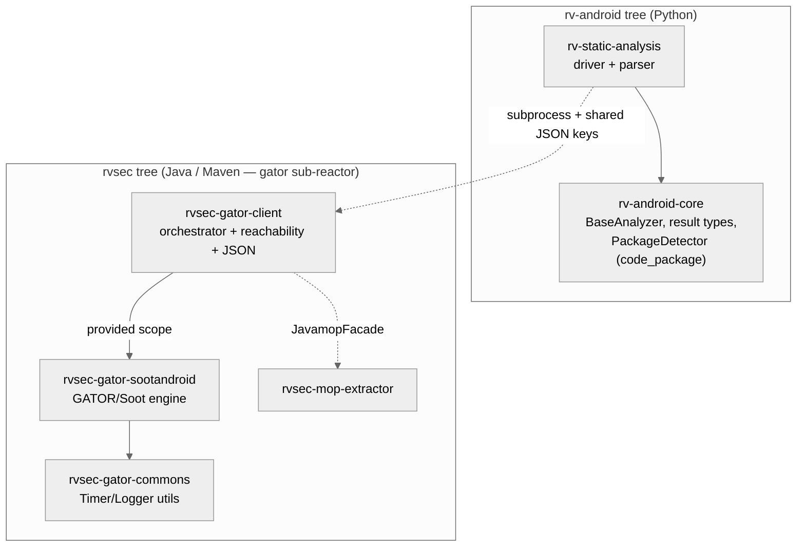
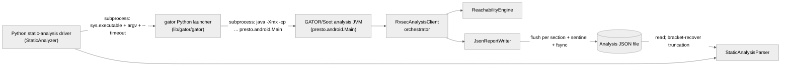
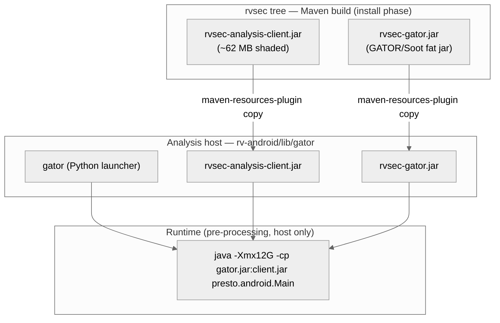

# Architecture — Static-Analysis Subsystem

> Scope: **subsystem** · Generated by `rv-doc-arch` · Source model: `out/arch/subsystem-static-analysis/architecture-model.json`
> Languages: Python (1 module, ~2,276 LOC) and Java (3 modules, ~50,232 LOC)

## Table of Contents

- [Part I — Beyond Views](#part-i--beyond-views)
  - [1. Documentation overview](#1-documentation-overview)
  - [2. Conceptual primer](#2-conceptual-primer)
  - [3. System overview and context](#3-system-overview-and-context)
  - [4. How it works — end to end](#4-how-it-works--end-to-end)
  - [5. Core components](#5-core-components)
  - [6. Mapping between views](#6-mapping-between-views)
  - [7. Rationale](#7-rationale)
  - [8. Output artifacts](#8-output-artifacts)
  - [9. Directory](#9-directory)
- [Part II — Views](#part-ii--views)
  - [Module view](#module-view)
  - [Component-and-connector view](#component-and-connector-view)
  - [Allocation view](#allocation-view)
- [Appendices](#appendices)
- [Specification traceability](#specification-traceability)

---

## Part I — Beyond Views

### 1. Documentation overview

This document describes the **static-analysis subsystem** of RV-Android: the pre-processing pass that reads an Android APK once, before any test runs, and produces a single JSON file describing the app's structure. That file answers four questions that the rest of the framework depends on — which methods exist and which are reachable from the app's entry points (the coverage denominator), which methods have a call path to a monitored API (a *target*, such as a JCA crypto call), what UI windows and widgets/event listeners the app has, and how those windows navigate to each other (the Window Transition Graph). The subsystem is deliberately cross-cutting: it spans two source trees and two languages — a thin Python driver/parser (`rv-static-analysis`, one uv-workspace module in the `rv-android` repository) and a heavyweight Java/Maven analysis engine (a GATOR fork on Soot 4.7.1, three Maven modules in the sibling `rvsec` tree) — joined by a subprocess call. The audience is a **new engineer with no prior exposure to the subsystem**; the goal is that a top-to-bottom read leaves you able to follow a real analysis run, understand why the code is split across two languages, and know where each responsibility lives.

**How to read this document:** Part I builds your mental model — what the subsystem is ([primer](#2-conceptual-primer)), how it behaves end to end ([walkthrough](#4-how-it-works--end-to-end)), and why it is shaped this way ([rationale](#7-rationale)). Part II documents the selected views in detail.

### 2. Conceptual primer

The static-analysis subsystem is the pre-processing pass that reads an Android APK and produces one JSON file describing the app's structure before any test runs: which methods exist and which are reachable from the app's entry points (the coverage denominator), which methods have a call path to a monitored API method (a *target*, e.g. a JCA crypto call), the inventory of UI windows and their widgets/event listeners, the Window Transition Graph (WTG) of how screens navigate to each other, and the non-Activity manifest components (Services, Receivers, Providers). It spans two languages: a thin Python driver/parser (`rv-static-analysis`) in the `rv-android` workspace and a heavyweight Java/Maven analysis engine (`rvsec-gator`, a fork of GATOR on Soot 4.7.1) in the sibling `rvsec` tree, bridged by a subprocess call.

**Why this approach.** The hard part of the work — resolving Android's virtual dispatch and callback-driven control flow into a real call graph, then building a WTG — needs a mature whole-program static-analysis framework. The subsystem delegates that to Soot 4.7.1 via a GATOR fork rather than reimplementing it. The obvious Python-only alternative (androguard / a hand-rolled DEX walker) was rejected because it cannot produce a SPARK points-to call graph, and without an accurate call graph the `reachesTarget` flags and the coverage denominator would be wrong — and those two numbers are the spine of every downstream coverage metric and the agent's MOP prioritization. The cost of the choice is a cross-language, cross-process boundary: a ~62 MB fat JAR launched as a subprocess, JVM startup per APK, and a JSON file as the only contract between the Java producer and the Python consumer. The subsystem is engineered around the failure mode that boundary creates — the Java engine frequently times out on WTG construction for large APKs, so the whole design bends toward producing a still-useful partial result rather than an all-or-nothing one.

**Key concepts**

- **Reachability / method universe** — The set of application methods reachable from the app's entry points (Activity/Service/Receiver/Provider lifecycle handlers). This set is the denominator for every coverage percentage: without it you can count method calls but cannot compute a percentage.
- **Target method (formerly "MOP")** — A method being watched by a specification set (JCA crypto specs or generic FSM specs). `reachesTarget` marks a method that has a call path to any target; `directlyReachesTarget` marks one that invokes a target directly. "MOP" means Monitored Operations, not security.
- **SPARK call graph** — Soot's points-to-based call-graph algorithm. It resolves virtual/interface calls by the set of types actually instantiated, which is what makes `reachesTarget` precise; cheaper algorithms (CHA/RTA/VTA) exist but over-approximate.
- **WTG (Window Transition Graph)** — A graph whose nodes are UI windows (Activities, dialogs, menus) and whose edges are user-triggered transitions carrying the widget and handler that fires them. It is what lets a dynamic explorer know which screen a click leads to.
- **`code_package`** — The package prefix of the app's own code, which in ~27.5% of APKs differs from the AndroidManifest package (e.g. a Godot game: manifest `ir.hsn6.trans`, code `org.godotengine.godot`). It is not a given input: `PackageDetector.detect_package(apk)` in `rv-android-core` computes it from the manifest components via a priority-ordered heuristic and exposes it as the `App` model's lazy `code_package` property. That value is the class filter that defines the coverage denominator — the parser (and the Java client) keep only classes matching `code_package` so framework/library classes stay out of the denominator.
- **Partial JSON / completion sentinel** — The engine writes JSON sections one at a time and flushes after each; a successful run ends with the literal field `"complete": true` (then fsync). A timeout leaves the file without the sentinel, and the Python parser treats it as incomplete but still recovers every fully-flushed section.

### 3. System overview and context

The subsystem runs entirely on the analysis host during pre-processing, never on the device or emulator, and it always reads the **original** APK. Upstream it is fed by **`rvsec-mop`**, which supplies the JavaMOP `.mop` specification directory (JCA or generic) that defines the target methods, and by **`rvsec-mop-extractor`**, whose `JavamopFacade.listUsedMethods(mopDir)` parses those specs into target method signatures for the client. **`rvsec-apk`** provides APK metadata to the client (its own Soot/FlowDroid is excluded there to avoid clashing with the engine's Soot). The **Android SDK (`android.jar`)** is the platform classpath Soot needs to resolve framework types; it is auto-located from `ANDROID_HOME/platforms` across API levels. Downstream, three consumers read the one JSON artifact: **`rv-coverage`** consumes the reachability section (`Classes.methods`) as the coverage denominator and the `reachable` flag to split reachable vs unreachable; **`rv-agent` / aperv** consume the WTG for navigation guidance and the `reachesTarget`/`directlyReachesTarget` flags for action/MOP prioritization; and **`rv-platform`** drives the whole thing — its `StaticAnalysisComponent` invokes `StaticAnalyzer.analyze()` in pre-processing, passing `app.code_package`, and loads `StaticAnalysisData` as a `TaskExecutor` component. That `app.code_package` is not a raw manifest value: it is lazily computed by **`PackageDetector`** (in the shared `rv-android-core` foundation) from the APK's components, and it is the class filter the whole coverage denominator hangs on (see the [walkthrough](#4-how-it-works--end-to-end) and [core components](#5-core-components)).

**Constraints:** The engine is pinned to Soot 4.7.1 and runs under Java 8+ as a self-contained fat JAR, decoupled from the Python 3.12 workspace by the subprocess boundary — the two toolchains never share a runtime. Analysis always runs on the original (non-instrumented) APK because Soot's `TypeResolver` crashes on AspectJ-woven bytecode. Each run is bounded by `-Xmx` (default 12G) and a wall-clock `--timeout` (default 600s); WTG construction is the timeout-prone stage.

**System context diagram** (external actors and systems — every view refers back to this):

```mermaid
%%{init: {'theme': 'neutral'}}%%
flowchart TB
  mopspecs["rvsec-mop<br/>(.mop specification dir: JCA / generic)"]
  extractor["rvsec-mop-extractor<br/>(JavamopFacade.listUsedMethods)"]
  apkmeta["rvsec-apk<br/>(APK metadata)"]
  androidjar["Android SDK android.jar<br/>(platform classpath for Soot)"]
  subsys["Static-analysis subsystem<br/>(Python driver/parser + GATOR/Soot JVM engine)"]
  platform["rv-platform<br/>(StaticAnalysisComponent, pre-processing)"]
  coverage["rv-coverage<br/>(coverage denominator)"]
  agents["rv-agent / aperv<br/>(WTG nav + target prioritization)"]

  mopspecs -->|target specs| extractor
  extractor -->|target method signatures| subsys
  apkmeta -->|APK metadata| subsys
  androidjar -->|framework types| subsys
  platform -->|analyze(app.code_package)| subsys
  subsys -->|reachability section| coverage
  subsys -->|WTG + target flags| agents
```

### 4. How it works — end to end

The following walks through a concrete example: **analyzing `cryptoapp.apk` (package `br.unb.cic.cryptoapp`) with the JCA specification set (`--mop-dir .../jca`), producing `out/br.unb.cic.cryptoapp/cryptoapp.apk.json`, so that downstream coverage knows the reachable-method universe and which methods reach a `javax.crypto` target.** Each stage below transforms a typed artifact and hands it to the next.

1. **Code-package resolution (`App.code_package` → `PackageDetector`).** Before the subsystem builds any command, rv-platform's `StaticAnalysisComponent` reads `app.code_package` on the `App` model. That property is lazy: on first access it delegates to `PackageDetector.detect_package(apk)` in the shared `rv-android-core` foundation (`util/android/package_detector.py`), *not* in `rv-static-analysis`. The detector enumerates the manifest's Activities/Services/Receivers (Providers are deliberately excluded — ContentProviders are frequently third-party, e.g. Firebase/Room, and would pollute the frequency counts), strips framework/library prefixes via `FRAMEWORK_PREFIXES`, then applies a priority-ordered heuristic in descending confidence: `same_package` (every app component under the manifest namespace — the ~72.5% fast path) → **game-engine** detection (Godot/Unity/Cocos2D/LibGDX, whose runtime code lives in the engine package while the developer declares a custom manifest package) → **single package** → valid **common prefix** (multi-package/modular apps) → **60%-dominant** package (frequency) → **string-similarity** match (weighted Jaro-Winkler 0.5 / Levenshtein 0.3 / SequenceMatcher 0.2, threshold 0.85, for typos/variants like `tttrss`↔`ttrss`) → **manifest fallback**. It returns a `PackageDetectionResult(manifest_package, code_package, confidence, detection_method)`. The winning `code_package` is the class filter that will define the coverage denominator. For `cryptoapp` every component is under `br.unb.cic.cryptoapp`, so detection short-circuits on `same_package` with high confidence and `code_package == manifest package`; a Godot game (manifest `ir.hsn6.trans`, code `org.godotengine.godot`) would resolve via the game-engine branch instead. Crucially this single value then feeds **both** sides of the later subprocess boundary — the Java `-clientParam codePackage=` (the client's class-extraction filter) and the Python `parse_file(json, code_package)` (the parser's substring class filter). Concretely, `App.code_package` (lazy) → `PackageDetector(similarity_threshold=0.85).detect_package(apk)` → `PackageDetectionResult(code_package='br.unb.cic.cryptoapp', confidence='high', detection_method='same_package')`.

2. **Python config + command build.** `RVStaticAnalysisConfig` resolves all tool paths through a four-level priority chain (explicit args > `rvsec_root` layout > `RVSEC_HOME` env > cwd parent), validates that the gator launcher, the analysis-client JAR, `android.jar` and the MOP/targets source exist, and enforces INV-ANA-33 (exactly one of `mop_dir` / `targets_file`). `get_tool_command()` then assembles the argv, deliberately using `sys.executable` (not the literal `python`) so the launcher runs on hosts without `/usr/bin/python`. Concretely, `argv = [sys.executable, <lib>/gator/gator, 'a', '-p', cryptoapp.apk, '--client-jar', rvsec-analysis-client.jar, '--out', cryptoapp.apk.json, '-client', 'RvsecAnalysisClient', '-clientParam', 'mopDir=.../jca', '-cgAlgorithm', 'spark', '--timeout', '600', '--jvm-memory', '12G', '-clientParam', 'codePackage=br.unb.cic.cryptoapp']`.

3. **StaticAnalyzer subprocess + caching.** `StaticAnalyzer.model_post_init` builds the output path `<output_dir>/<package>/<app.name>.json`. `_execute_command` first checks whether that file already exists — if so the whole analysis is skipped and a synthetic `CommandResult(0)` is returned (INV-ANA-11), which is what makes experiment resume cheap. Otherwise it invokes the command with the configured timeout. Here `analysis_file = out/br.unb.cic.cryptoapp/cryptoapp.apk.json`; a cache hit logs `execution_status='cached'` and does not spawn the JVM.

4. **gator Python launcher → JVM.** The `gator` launcher is itself a small Python shim in `lib/gator`. It builds a classpath joining the GATOR/Soot fat jar `rvsec-gator.jar` with the `--client-jar` `rvsec-analysis-client.jar`, then runs the JVM via `subprocess.call` with the same timeout. This is the second process hop: Python driver → Python launcher → JVM. Concretely, `cmd = ['java', '-Xmx12G', '-cp', 'rvsec-gator.jar:rvsec-analysis-client.jar', 'presto.android.Main', '-android', android.jar, <client params>]; call(cmd, timeout=600)`.

5. **Soot init + GATOR GUIAnalysis.** `presto.android.Main` configures Soot 4.7.1 defensively (excludes `kotlin.*`, `kotlinx.*`, `androidx.compose.*` from body loading; disables `jb.sils`/`jb.dae` to shrink the crash surface), builds the SPARK call graph and GATOR's GUI flow analysis, then calls the registered client's `run(GUIAnalysisOutput)` method. If SPARK call-graph construction itself throws, the JVM exits non-zero and emits no JSON by design — a hard halt that prevents a "complete-looking" report built on a corrupt call graph. `Configs` parses the client params (`mopDir`, `cgAlgorithm=spark`, `cgDelegation` default false post-M3, `skipWtg=false`, `codePackage`, `succDepth` default 4) before dispatching to `RvsecAnalysisClient.run()`.

6. **Target resolution.** `TargetResolver` constructs a `TargetMethodSource` from the CLI input — here `MopSpecsTargetSource` wrapping `JavamopFacade.listUsedMethods(mopDir)` — calls `source.load()` to get a `Set<TargetMethod>`, then resolves each to concrete Soot `SootMethod`s. MOP specs match LENIENT (class+name only) because AspectJ wildcards in `.mop` files leave the full signature undefined; a `--targets-file` would instead match STRICT per signature (LENIENT only for wildcard `..`/`*` entries). For `cryptoapp.mop` the resolved set has exactly 16 `(className, methodName)` target entries (INV-ANA-35 baseline `b2e04a26`).

7. **Reachability computation.** `ReachabilityEngine` turns the target `SootMethod` set into an immutable `ReachabilityIndex` via a five-step pipeline: (1) build a JGraphT `DefaultDirectedGraph` view of the SPARK `CallGraph` with self-loops filtered; (2) multi-source BFS from the entry points to get `reachableSet`; (3) BFS over an `EdgeReversedGraph` starting from the resolved targets to get `reachesTargetSet` — reversing the graph turns "can reach a target" into ordinary forward reachability from the targets; (4) `directTargetSet` = direct CG callers of targets UNION a bytecode-scan complement (BUG-INV-ANA-19: SPARK quarantines library classes via `IGNORED_CLASSES`, so app→`javax.crypto` edges are recovered by scanning bytecode); (5) a lifecycle/listener callback complement marks callbacks reachable and propagates target flags. Once `run()` returns, the index is immutable so no downstream stage can mutate reachability state. Concretely, `reachesTargetSet` is computed by `multiSourceBfs(new EdgeReversedGraph<>(graph), targets)`; `directlyReachesTarget` is a strict superset-or-equal of the SPARK-only set.

8. **Streaming JSON write + enrichment.** `JsonReportWriter` walks the model and writes each section straight to the output stream, flushing after every section, and asks the `ReachabilityEnricher` callback for each node's flags as it goes (the writer itself never calls the index — INV-ANA-30). The runtime order in code is components → reachability → windows → transitions (the class Javadoc still names the older reachability→windows→transitions→components "priority" order; that comment is stale). Components is written first because it is cheap manifest-derived data, so even a WTG timeout keeps the window→activity lookup intact (D14). If `skipWtg=true` or the WTG handle is null, `transitions[]` is emitted empty but `windows[]` is still fully populated (INV-ANA-20). Concretely, `JsonReportWriter.write()` calls `RvsecAnalysisClient.writeComponentsSection` → `writeReachabilitySection` → `writeWindowsSection` → (if `wtg!=null`) `writeTransitionsSection`, each followed by `w.flush()`.

9. **Completion sentinel + fsync.** After all sections flush, the writer appends the literal top-level field `"complete": true` and calls `fos.getFD().sync()` to force the bytes to disk (INV-ANA-31). A run killed before this point simply lacks the sentinel; the parser then knows the sample is partial. This is the single bit that distinguishes a clean run from a timeout. The trailing bytes are `,"complete":true}\n` then `FileDescriptor.sync()`.

10. **Python post-condition + parse.** Back in Python, `_run_analysis` raises `StaticAnalysisException` if no JSON exists at the expected path — a defensive post-condition that catches a swallowed `CommandNotFoundError` / unreachable launcher and prevents silent zero-coverage downstream. Then `StaticAnalyzer.get_static_data()` calls `StaticAnalysisParser.parse_file(json, code_package)`. The parser loads the JSON (recovering a truncated file by closing at the last complete `]` bracket), parses reachability/windows/transitions/components each independently (a corrupt section yields an empty domain object, never an exception — INV-ANA-06), filters classes by `code_package`, normalizes inner-class `.`→`$` notation, and reads the complete flag. `parse_file` returns `StaticAnalysisData(Classes, Windows, WindowTransitionGraph, Components, complete=bool)`; the JSON key set `_JK` is value-equal to the Java `JsonSchema.Keys` (INV-ANA-32, verified by `tests/parity/json_keys.py`).

### 5. Core components

At runtime the subsystem is a chain of short-lived elements, most of which exist only for the duration of one APK's analysis. The chain begins one step earlier than the driver, with the **Package detector** (`PackageDetector`, `rv-android-core/util/android/package_detector.py`). It is not part of `rv-static-analysis` — it lives in the shared foundation module and is reached through the `App` model's lazy `code_package` property — but it is architecturally the first element of this subsystem because its output *is* the filter that defines the coverage denominator. `PackageDetector.detect_package(apk)` resolves the app's own-code package via the priority heuristic (same-package → game-engine → single → common-prefix → 60%-dominant → string-similarity → manifest fallback), returning a `PackageDetectionResult` whose `code_package` then crosses the subprocess boundary twice (the Java `-clientParam codePackage=` and the Python `parse_file(json, code_package)`). Getting this wrong — filtering on `package_name` instead — silently zeroes coverage on the ~27.5% of APKs whose code and manifest packages differ, which is exactly why it earns first-class status here rather than being buried as a helper.

The **Python static-analysis driver** (`StaticAnalyzer`) is a short-lived object created by rv-platform's `StaticAnalysisComponent` for one APK during pre-processing, outside any emulator session. It owns the timeout policy (a timeout is a partial success, not a failure), the cache check (existing JSON short-circuits the whole run), and the defensive post-condition (no output file → hard error). It never inspects analysis semantics; it only shepherds the process and hands the file path to the parser.

The **gator Python launcher** is a small Python shim installed alongside the JARs in `lib/gator`. It is the intermediate hop: the Python driver runs it as a subprocess, and it in turn joins `rvsec-gator.jar` with the `--client-jar` into one `-cp` and calls `java -Xmx<mem> -cp ... presto.android.Main` via `subprocess.call`, enforcing the same `--timeout`. It also resolves the `-android android.jar` argument. Behind it, the **GATOR/Soot analysis JVM** is the heavyweight runtime element: a JVM process running `presto.android.Main` that configures Soot, builds the SPARK call graph and GATOR GUI flow analysis, then invokes `RvsecAnalysisClient.run()` to produce reachability/windows/transitions/components and stream them to disk. It is the process whose timeout and hard-halt behavior the whole subsystem is designed around.

Inside that JVM, the **RvsecAnalysisClient orchestrator** is the in-JVM coordinator. It constructs the `TargetResolver`, `ReachabilityEngine` and `JsonReportWriter`, runs them in order, and is responsible for the flush-per-section discipline and the trailing `"complete": true` + fsync that makes timeouts recoverable. It still holds the section-writer static methods (`writeComponents`/`Reachability`/`Windows`/`TransitionsSection`) that `JsonReportWriter` calls. The **ReachabilityEngine** is the analytical core: it projects Soot's SPARK `CallGraph` into a JGraphT graph, runs multi-source BFS from entry points for the reachable universe, runs BFS on the edge-reversed graph from the target set for `reachesTarget`, unions direct CG callers with a bytecode-scan complement for `directlyReachesTarget`, and complements callbacks. Its output `ReachabilityIndex` is frozen once `run()` returns, so enrichment and JSON writing cannot mutate reachability. The **JsonReportWriter** is the output connector between the JVM engine and the on-disk contract: it walks the model section by section (components→reachability→windows→transitions), flushing after each so a mid-write kill still leaves every prior section intact, and asks the `ReachabilityEnricher` callback for each node's flags (never the index directly — INV-ANA-30). It terminates a clean run with `"complete": true` and `fos.getFD().sync()`.

The two remaining elements straddle the language boundary. The **Analysis JSON file** is the only contract between the Java producer and the Python consumer: one JSON file per APK. Its keys are centrally defined (`JsonSchema.Keys == _JK`) and its structure is deliberately section-at-a-time so a truncated file is still partially usable. `StaticAnalysisParser` reads it, recovers truncation by closing at the last complete bracket, and turns it into `StaticAnalysisData`. Finally, the **StaticAnalysisParser** is the consumer-side translator: it parses reachability→`Classes`, windows→`Windows`, transitions→`WindowTransitionGraph` and components→`Components`, each independently so one corrupt section cannot lose the others (INV-ANA-06); normalizes inner-class notation, filters by `code_package`, back-fills transition-only widgets, and reads the complete sentinel into `StaticAnalysisData.complete` for downstream gating.

| Component | Realized by | Responsibility |
|-----------|-------------|----------------|
| Package detector (`code_package` resolver) | `modules/rv-android-core/.../util/android/package_detector.py` | Resolve the app's own-code package prefix (`code_package`) via the priority heuristic; feeds both the Java client filter and the Python parser filter. |
| Python static-analysis driver | `modules/rv-static-analysis/.../analysis/static/static_analysis.py`, `config.py` | Resolve config, launch the GATOR subprocess with caching/timeout handling, expose the result. |
| gator Python launcher | `lib/gator/gator` | Assemble the JVM classpath and command line and spawn the analysis JVM with a timeout. |
| GATOR/Soot analysis JVM | `rvsec-gator/sootandroid`, `rvsec-gator/client` | Run whole-program static analysis (Soot SPARK + GATOR GUI + WTG) and stream the JSON. |
| RvsecAnalysisClient orchestrator | `rvsec-gator/client/.../clients/RvsecAnalysisClient.java` | Wire target resolution → reachability → enrichment → streaming write; emit the sentinel. |
| ReachabilityEngine | `rvsec-gator/client/.../clients/reach/ReachabilityEngine.java` | Compute reachable / reachesTarget / directlyReachesTarget into an immutable index. |
| JsonReportWriter | `rvsec-gator/client/.../clients/json/JsonReportWriter.java` | Stream each section with an immediate flush, emit the sentinel, delegate flag lookups to the enricher. |
| Analysis JSON file | `<output_dir>/<package>/<app>.apk.json` | The single shared artifact carrying reachability + windows + transitions + components + complete. |
| StaticAnalysisParser | `modules/rv-static-analysis/.../parser/static/static_analysis_parser.py` | Convert the JSON into `StaticAnalysisData` with per-section graceful degradation and `code_package` filtering. |

### 6. Mapping between views

The module structure and the runtime structure line up along a single seam: the subprocess boundary. On the module side the Python `rv-static-analysis` module contains two runtime roles — the **Python static-analysis driver** (`StaticAnalyzer` + `RVStaticAnalysisConfig`) and the **StaticAnalysisParser**. The driver realizes the config-and-launch component; the parser realizes the consumer-side translator. On the Java side the three Maven modules of the gator sub-reactor map onto the in-JVM components: `rvsec-gator-sootandroid` and `rvsec-gator-client` together realize the **GATOR/Soot analysis JVM**, with the client module specifically realizing the **RvsecAnalysisClient orchestrator**, the **ReachabilityEngine**, and the **JsonReportWriter**; `rvsec-gator-commons` is a leaf utility module beneath both and has no distinct runtime component.

The cross-language, cross-process boundary is explicit and two-hop. The Python driver does not call Java directly — it spawns the **gator Python launcher** (`lib/gator/gator`) as a subprocess (`sys.executable` + the launcher argv), and the launcher in turn spawns the JVM (`java -Xmx<mem> -cp rvsec-gator.jar:rvsec-analysis-client.jar presto.android.Main`). So there are two process hops on the way in: Python driver → Python launcher → JVM. On the way back there is exactly one thing that crosses the boundary: the **Analysis JSON file** on disk. Nothing else is shared — no memory, no sockets, no stdout protocol beyond the exit code. The Java `JsonReportWriter` writes the file section-by-section with a flush after each and a trailing sentinel; the Python `StaticAnalysisParser` reads that same file back. The two sides agree on the file's shape only because every key is a named constant on each side (`JsonSchema.Keys` in Java, `_JK` in Python) kept value-equal by a CI parity test. In deployment terms the whole subsystem is allocated to the analysis host during pre-processing — never the device — and the two JARs it needs are installed by Maven into `rv-android/lib/gator/` where the Python config's default layout expects them.

### 7. Rationale

The decisions that shaped this architecture, each with the tension behind it and the failure mode it avoids.

**Single unified GATOR client (gh27).** Before gh27 three separate tools (GESDA for GUI/WTG, a standalone REACH for reachability, and a WTG client) each launched their own JVM and produced their own output that Python then stitched together with three parsers. The tension was coordination cost and drift: three JVM startups per APK, three chances to time out, and three parsers that could disagree about the method universe. The decision folds all of it into one client that shares a single Soot `Scene` and call graph and writes one JSON. The rejected alternative — keeping the tools separate but caching intermediate results — was rejected because the dominant cost is Soot initialization and the call graph, which all three needed anyway. Without unification the coverage denominator (from REACH) and the WTG (from GESDA) could be computed against subtly different call graphs, making `reachesTarget` and navigation inconsistent.

**Streaming write + priority order + completion sentinel.** WTG construction is the expensive, timeout-prone stage, so an all-or-nothing document would throw away the reachability and window data every time the WTG stage ran long — which is most of the time on real APKs. The design instead streams each section and flushes immediately, orders them so the cheap manifest-derived components and the critical reachability land first (components→reachability→windows→transitions, D14), and marks a clean finish with a single trailing sentinel plus fsync. The rejected alternative — buffer the whole model then serialize — is explicitly forbidden because it defeats partial recovery exactly when timeout is the common failure. Without this, a timeout would yield either a corrupt half-written blob or nothing, and every downstream coverage number would collapse to zero. The Python parser closes the loop by bracket-recovering truncated files and treating a missing sentinel as "incomplete" (INV-ANA-06).

**reachesTarget via edge-reversed BFS.** The question "does method `m` reach a target?" is, per method, an expensive graph search; asking it for every application method would be quadratic. Reversing the call graph turns "`m` reaches some target" into "`m` is reachable FROM a target in the reversed graph", so a single multi-source BFS from the whole target set labels every ancestor at once. The rejected alternative (per-method DFS to any target) is both slower and more error-prone. The subtlety this decision must handle is that SPARK quarantines library classes (`IGNORED_CLASSES`), so direct app→`javax.crypto` edges are missing from the CG; `directlyReachesTarget` therefore unions the CG's direct callers with a bytecode-scan complement (BUG-INV-ANA-19), which can only ADD callers SPARK missed, making the direct set a strict superset of the SPARK-only set.

**Target-source abstraction with mop_dir XOR targets_file.** MOP specs describe targets with AspectJ wildcards, so their full Soot signature is semantically undefined — matching must be LENIENT (class + method name). A hand-authored signature file, by contrast, is precise, so it matches STRICT per signature (LENIENT only for explicit wildcard `..`/`*` entries). Rather than bake a single matching mode into the client (and expose a fragile `--match-mode` flag, explicitly banned by INV-ANA-36), the decision makes `MatchPolicy` an attribute of the source. The mutex (exactly one of `--mop-dir`/`--targets-file`) is enforced twice — at the CLI argparse layer and again at the Pydantic config boundary — so a programmatic caller that sets both or neither fails before the JVM launches. Without the abstraction, adding a new target provenance would mean editing reachability code instead of adding a `TargetMethodSource`.

**Analyze the ORIGINAL (non-instrumented) APK.** Soot's `TypeResolver` crashes on the bytecode shapes AspectJ weaving introduces, so feeding it an instrumented APK would abort the analysis. The pipeline therefore always analyzes the original APK; the pre-processor writes the resulting JSON into the `instrumented_apks/` results location so rv-platform still finds it. The rejected alternative (analyze the instrumented APK to match exactly what runs on the device) is impossible with Soot 4.7.1. The consequence to keep in mind is that the coverage denominator is defined by the original code's reachable methods, which is the correct universe anyway since instrumentation only adds advice, it does not add app methods.

**Shared JSON schema keys (parity-enforced).** Because the producer (Java) and consumer (Python) live in different repositories and languages, a renamed or mistyped key would silently break parsing with no compile-time signal. The decision centralizes every key as a named constant on each side and adds a CI gate (`tests/parity/json_keys.py`) that dumps `JsonSchema.Keys` via `JsonSchemaKeysDump` and compares the two sets value-for-value, failing with the offending key. The rejected alternative — string literals at each read/write site — is exactly how the two sides would drift. This is what let the MOP→Target rename (`reachesMop`→`reachesTarget`) be flipped atomically across producer, parser and domain models.

**cgDelegation default false; relax "do not touch GATOR" for perf (ADR-001).** A standing rule forbade modifying the vendored GATOR fork, to preserve rollback and upstream fidelity. Two forces pushed against it: `cgDelegation=true` (route virtual dispatch through `Scene.v().getCallGraph()` instead of a rebuilt `AndroidCallGraph`) yields 2–23× speedups on some apps but changes results, so it is kept opt-in with the legacy path as the bit-for-bit default (M3 parity gate); and the dominant WTG timeout comes from `FlowgraphRebuilder.buildFlowThroughContainer()`, an O(allocNodes × flowgraph) quadratic pass with no native flag to bound it (`sDepth=3` recovered 0/24 APKs). ADR-001 (Proposed) narrowly relaxes the no-touch rule for semantics-preserving performance fixes to that pass, since neither a larger timeout nor any `Configs` lever helps. Without this, ~97/169 APKs in a sweep produce no transitions at all.

**Decisions at a glance**

| Decision | Drivers | Invariant / ADR |
|----------|---------|-----------------|
| Single unified GATOR client (gh27) | Remove three-process coordination; one denominator source of truth; ~37% faster | INV-ANA-32 |
| Streaming write + priority order + sentinel | WTG times out on 30–50% of large APKs; preserve denominator; distinguish clean vs truncated | INV-ANA-31 |
| reachesTarget via edge-reversed BFS | O(V+E) once instead of per-method search; correctness over SPARK CG | — |
| Target-source abstraction (mop_dir XOR targets_file) | Support spec-driven and ad-hoc targets; match precision follows the source | INV-ANA-33 |
| Analyze the ORIGINAL APK | Soot TypeResolver crashes on woven bytecode; keep denominator valid | — |
| Shared JSON schema keys (parity-enforced) | Prevent producer/consumer key drift across two repos/languages | INV-ANA-32 |
| cgDelegation default false; ADR-001 relax GATOR rule | Bit-for-bit rollback safety; quadratic WTG pass untunable via native flags | INV-ANA-21 / ADR-001 |

**Patterns and styles**

At the module level the subsystem is **layered** and **decomposed**. The gator sub-reactor is strictly ordered `commons ← sootandroid ← client` (the client depends on `sootandroid` at `provided` scope), and on the Python side `rv-static-analysis` depends only on `rv-android-core` — the whole module graph is acyclic. The decomposition is visible both across modules (`rvsec-gator-parent` aggregates commons/sootandroid/client) and within the client, where `RvsecAnalysisClient` was split into `TargetResolver`/`ReachabilityEngine`/`ReachabilityIndex`/`ReachabilityEnricher`/`JsonReportWriter` (the gh57 single-responsibility split). At the component-and-connector level the defining style is **client-server**: a two-hop subprocess boundary (Python `StaticAnalyzer` → gator launcher → JVM `presto.android.Main`) where the request is argv + APK and the response is a JSON file + exit code. Coupled to it is a **shared-data** style — producer and consumer communicate exclusively through the one on-disk JSON file, with a centrally-shared key schema and the completion sentinel as the coordination flag. Inside the JVM there is also a **pipe-and-filter** flavor: the reachability pipeline is a five-stage transform and `JsonReportWriter` streams sections stage-by-stage with a flush between each rather than buffering a whole document. In allocation terms the dominant style is **install** (Maven copies both fat JARs into `lib/gator`) over a host-only **deployment**.

**NFRs served**

The subsystem's most load-bearing NFR is **Resilience (NFR04)**: it is built so that a timeout is a first-class, non-fatal outcome. The Java engine flushes each JSON section as it is produced and orders them so the coverage denominator and manifest data survive a WTG timeout; the Python side treats `RVCommandTimeoutError` as a partial success (returns `CommandResult(0)`, sets `timed_out`), recovers truncated JSON by closing at the last complete bracket, and parses each section independently so a corrupt section yields an empty domain object rather than an exception (INV-ANA-06). A defensive post-condition still hard-fails if NO file is produced, so a swallowed launcher error cannot masquerade as zero coverage.

**Compatibility (NFR07)** comes from the boundary itself: the engine is pinned to Soot 4.7.1 and runs under Java 8+ as a self-contained fat JAR, decoupled from the Python 3.12 workspace by the subprocess — the two toolchains never share a runtime. The Python launcher command uses `sys.executable` rather than a literal `python` so it runs on hosts without `/usr/bin/python` (clean Debian/Ubuntu, containers), and `android.jar` is auto-discovered across API levels 33/29/28/27/26. **Extensibility (NFR02)** is concentrated in the target-source strategy and the CLI-exposed knobs: a new source of target methods is a new `TargetMethodSource` class rather than an edit to reachability code; the call-graph algorithm is a CLI choice (spark/cha/rta/vta) pinned at the Pydantic boundary; and WTG can be bypassed (`skipWtg`) or its dispatch mode switched (`cgDelegation`) without code changes. **Configurability (NFR05)** is provided by `RVStaticAnalysisConfig`, a Pydantic model that resolves every path through the four-level priority chain, validates tool availability eagerly, and pins enum-valued options at construction so an invalid value fails at config time rather than mid-pipeline in the JVM.

| NFR | PRD ID | Architectural support |
|-----|--------|-----------------------|
| Resilience | NFR04 | Timeout is a partial success; flush-per-section + sentinel; per-section graceful degradation; hard-fail only on no file. |
| Compatibility | NFR07 | Soot 4.7.1 fat JAR under Java 8+, isolated by subprocess; `sys.executable`; `android.jar` API-level probe. |
| Extensibility | NFR02 | `TargetMethodSource` strategy; CLI-pinned `cg_algorithm`; `skip_wtg` / `cg_delegation` toggles. |
| Configurability | NFR05 | Pydantic config: four-level path chain, eager tool validation, enum pinning at construction. |

### 8. Output artifacts

The subsystem produces exactly one artifact per APK, and everything downstream reads from it. There is no partial-results directory, no side database — just one JSON file whose presence, key schema, and completion sentinel carry the entire contract.

| Artifact | Location | Notes |
|----------|----------|-------|
| Unified analysis JSON | `<output_dir>/<package>/<app>.apk.json` (copied by rv-platform into results `.../instrumented_apks/`) | One JSON per APK with reachability, windows, transitions, components sections + `"complete": true` sentinel; consumed by `StaticAnalysisParser` into `StaticAnalysisData`. |

### 9. Directory

**Glossary / acronyms**

- **GATOR** — the whole-program Android GUI analysis framework this subsystem forks (`limerick1718/Gator` → `phtcosta/Gator` → in-tree), running on Soot.
- **Soot** — the Java program-analysis framework (pinned 4.7.1) that provides the `Scene`, call graph, and Jimple IR.
- **SPARK** — Soot's points-to-based call-graph algorithm; the precise (and default) `-cgAlgorithm`.
- **CHA / RTA / VTA** — cheaper, over-approximating call-graph algorithms also accepted by `-cgAlgorithm`.
- **WTG** — Window Transition Graph; UI windows as nodes, user-triggered transitions as edges.
- **MOP / target** — Monitored Operations; a target method is one watched by a specification set. `reachesTarget` / `directlyReachesTarget` are the two reachability flags.
- **`code_package`** — the app's own-code package prefix, distinct from the manifest package in ~27.5% of APKs.
- **BFS / JGraphT / EdgeReversedGraph** — graph tooling: multi-source breadth-first search over a JGraphT projection of the SPARK call graph; edge reversal turns "reaches a target" into forward reachability.
- **Completion sentinel** — the trailing `"complete": true` field (plus fsync) that marks a clean, non-truncated run.

**References**

- Analysis domain spec: `openspec/specs/analysis/spec.md`.
- ADR-001 (relax GATOR no-touch rule for perf): `modules/rv-static-analysis/docs/adr/ADR-001-relax-gator-no-touch-rule-for-semantics-preserving-perf-fixes.md`.
- Per-module docs: `modules/rv-static-analysis/CLAUDE.md` and `modules/rv-static-analysis/docs/architecture.md`.
- Product requirements: `docs/PRD.md` (FR04–FR06, NFR02/04/05/07).

---

## Part II — Views

### Module view

*Style(s): decomposition, layered*

This view shows how the source is split across two trees and two languages, and why the split is acyclic. It matters because the subsystem's single most important structural fact — that the whole Python side is free of any Java/Soot dependency, and the whole Java side is free of any Python dependency — is a module-boundary decision, not a runtime one. Read the diagram as two stacks joined only at the bottom by shared JSON keys and at runtime by a subprocess.

**Primary presentation**



**Element catalog**

The Python side is one dedicated module plus one foundation dependency. `rv-static-analysis` is the dedicated driver/parser module; it leans on `rv-android-core` for the `BaseAnalyzer` interface, the shared result/domain types, and — architecturally significant for this subsystem — `PackageDetector`, which resolves the `code_package` filter that the parser and the Java client both apply. `rv-static-analysis` exists to keep the whole Python side of the pipeline free of any Java/Soot dependency: it treats the analysis engine as an opaque command that emits a file. That boundary lets rv-platform, rv-coverage and the agents depend on a small Pydantic surface (`StaticAnalysisData`) while the expensive, JVM-bound analysis lives in a separate process and repository entirely; it also concentrates all the timeout- and truncation-tolerance logic on the consumer side, so the rest of the workspace never has to reason about partial analysis output. Internally three units carry the module: `RVStaticAnalysisConfig` (path resolution, eager validation, the `mop_dir`/`targets_file` mutex, and `get_tool_command()` using `sys.executable`), `StaticAnalyzer` (a Pydantic model that also implements rv-android-core's `BaseAnalyzer`, wrapping the subprocess with file-level caching, timeout-as-partial-success, and the no-file post-condition), and `StaticAnalysisParser` (independent per-section parsing, truncation recovery, `code_package` filtering, transition-only widget back-fill, and a class→`reaches_target` index).

On the Java side the gator sub-reactor is three modules ordered bottom-up. `rvsec-gator-commons` is a tiny leaf of timing and logging helpers with no dependency on the engine or client; it is the bottom of the dependency ordering so the engine and client can share helpers without either depending on the other. `rvsec-gator-sootandroid` is the GATOR fork itself (~181 Java files): `presto.android.Main`, defensive Soot configuration, the GUI flow graph, the WTG builder, and XML parsing. It is kept as its own module because it is a vendored upstream fork of a large third-party framework — quarantining the ~43k lines the project does not own from the ~7k it does lets the standing "do not touch GATOR" rule apply here while RVSEC logic evolves freely in the client (the rule was relaxed only once, narrowly, by ADR-001). `rvsec-gator-client` is the RVSEC analysis logic — target resolution, reachability semantics, the JSON contract — shaded into `rvsec-analysis-client.jar`. It is a separate Maven module so that logic stays isolated from the vendored Soot/GATOR fork, can be unit-tested (~18 JUnit classes: `ReachabilityBfsTest`, `MopSpecsParityTest`, `SentinelEmissionTest`, `JsonReportWriterPurityTest`, …), and can ship as an add-on client jar on the engine's classpath — which is exactly what the `provided` scope on `sootandroid` in the client POM encodes: compile against the engine, but ship separately.

| Element | Responsibility | Relations / interfaces |
|---------|----------------|------------------------|
| `rv-static-analysis` (Python) | Driver + parser: build the GATOR command, run it with caching/timeout, parse the JSON into `StaticAnalysisData`. | depends on `rv-android-core`; subprocess to gator launcher |
| `rv-android-core` (Python) | Foundation: `BaseAnalyzer` interface, shared result/domain types, and **`PackageDetector`** (`util/android/package_detector.py`) — the `code_package` resolver reached via the `App` model's lazy property. | (leaf on the Python side; `rv-static-analysis` and rv-platform depend on it) |
| `rvsec-gator-client` (Java) | Orchestrator: target resolution, reachability, window/WTG/component extraction, streaming JSON. Shaded into `rvsec-analysis-client.jar`. | `provided` dep on `sootandroid`; uses `rvsec-mop-extractor` (`JavamopFacade`) |
| `rvsec-gator-sootandroid` (Java) | GATOR fork: `presto.android.Main`, Soot config, GUI flow graph, WTG builder, XML parsing. Shaded into `rvsec-gator.jar`. | uses `commons`; vendored fork under "do not touch" rule |
| `rvsec-gator-commons` (Java) | Shared Timer/Logger helpers (4 files). | leaf; no dep on engine or client |
| `rvsec-mop-extractor` (Java, external) | Parses `.mop` specs into target method signatures (`JavamopFacade.listUsedMethods`). | consumed by the client's `MopSpecsTargetSource`; see [context](#3-system-overview-and-context) |

**Context** — see [system context](#3-system-overview-and-context).

**Variability guide**

The variation points are all on the consumer/config side, not the module graph. The target provenance is a swap of `TargetMethodSource` implementation (`MopSpecsTargetSource` vs `SignatureFileTargetSource`), selected by which of `--mop-dir` / `--targets-file` is set. The call-graph algorithm is a build-time choice pinned to the four Soot values (`spark`/`cha`/`rta`/`vta`) at the Pydantic boundary. WTG participation is a toggle (`skipWtg`), and virtual-dispatch delegation is a toggle (`cgDelegation`, default false). Adding a new target provenance is a new class in the client's `target/` package; no module dependency changes.

**Rationale**

The two-stack, acyclic split is the whole point: it lets the expensive JVM analysis and the vendored GATOR fork evolve under a strict "do not touch" rule in one repository, while the small Pydantic consumer surface (`StaticAnalysisData`) and all the partiality-tolerance logic live in another. The `commons ← sootandroid ← client` ordering keeps the Java side acyclic and lets the client be rebuilt and unit-tested without touching the 43k-LOC engine, encoded concretely by the `provided` scope. On the Python side the single dependency on `rv-android-core` keeps the driver a thin, testable shim over an opaque command.

### Component-and-connector view

*Style(s): client-server, shared-data, pipe-and-filter*

This view shows the runtime shape: what processes exist while one APK is analyzed, and how bytes move between them. The defining feature is the two-hop subprocess boundary and the fact that the only thing crossing back is a file. Everything about the subsystem's resilience — partial recovery, the sentinel, the post-condition — is a property of this boundary, so this is the view where the scenarios live.

**Primary presentation**



**Element catalog**

| Component / connector | Type | Responsibility |
|-----------------------|------|----------------|
| Python static-analysis driver | service (process) | Resolve config, launch the subprocess with caching/timeout, expose the result. |
| gator Python launcher | subprocess | Assemble the JVM classpath/command and spawn the analysis JVM with a timeout. |
| GATOR/Soot analysis JVM | subprocess | Run Soot SPARK + GATOR GUI analysis + WTG; invoke the client; stream the JSON. |
| RvsecAnalysisClient orchestrator | class (in JVM) | Wire target resolution → reachability → enrichment → streaming write; emit the sentinel. |
| ReachabilityEngine | class (in JVM) | Compute reachable / reachesTarget / directlyReachesTarget into an immutable `ReachabilityIndex`. |
| JsonReportWriter | class (in JVM) | Stream each section with an immediate flush; delegate flag lookups to `ReachabilityEnricher`. |
| Analysis JSON file | store (on disk) | The single producer→consumer contract; section-at-a-time; key-parity schema + sentinel. |
| StaticAnalysisParser | class (in Python) | Convert the JSON into `StaticAnalysisData` with per-section graceful degradation + `code_package` filtering. |
| driver → launcher | connector (subprocess) | `sys.executable` + `lib/gator/gator` argv, enforcing `--timeout`. |
| launcher → JVM | connector (subprocess) | `java -Xmx<mem> -cp rvsec-gator.jar:rvsec-analysis-client.jar presto.android.Main`. |
| writer → JSON → parser | connector (shared file) | Streamed writes with flush per section + trailing sentinel + fsync; reader bracket-recovers truncation. |

**Context** — see [system context](#3-system-overview-and-context).

**Variability guide**

The connector timeout is configurable (`--timeout`, default 600s) and the JVM heap is configurable (`-Xmx`, default 12G). The producer can be told to skip the WTG stage entirely (`skipWtg=true`), in which case `transitions[]` is emitted empty but the run still finishes cleanly with the sentinel. The reachability filter (`code_package`) is passed per-APK by rv-platform. The file-existence cache is the only implicit variation point: an existing JSON short-circuits the entire subprocess.

**Scenarios**

**WHEN** WTG construction runs past `--timeout` (600s default) on a large APK, e.g. inside `FlowgraphRebuilder.buildFlowThroughContainer()`, **THEN** the JVM is killed mid-write, the file already holds components + reachability + windows (flushed) and lacks the `"complete": true` sentinel; Python catches `RVCommandTimeoutError`, sets `timed_out=true`, and the parser bracket-recovers the truncated tail, **AND** downstream still gets a valid coverage denominator and window inventory, `transitions[]` is empty, and consumers degrade cleanly. *Why:* sections are flushed in cheapest/most-critical-first order specifically so a WTG timeout — the common case on ~30–50% of large sweeps — never costs the reachability data.

**WHEN** an APK is known to always time out on WTG and the run is launched with `--skip-wtg`, **THEN** the config appends `-clientParam skipWtg=true`, `RvsecAnalysisClient` writes reachability + `windows[]` and returns without invoking `WTGBuilder.build()`, emitting `transitions[]` as an empty array plus the sentinel, **AND** the run completes as a CLEAN run (`complete=true`), unlike a timeout, so completeness-gated consumers still accept the sample for its non-WTG data. *Why:* `skipWtg` trades the (guaranteed-to-fail) WTG for a fast, complete partial result rather than paying the full timeout and getting an incomplete file.

**WHEN** the APK's code package differs from its manifest package (e.g. Godot: manifest `ir.hsn6.trans`, code `org.godotengine.godot`), **THEN** `PackageDetector.detect_package(apk)` (in `rv-android-core`) skips the `same_package` fast path — the manifest namespace is absent from the components — matches the **game-engine** branch against `GAME_ENGINES`, and returns `code_package='org.godotengine.godot'` with `game_engine='godot'`; rv-platform passes that `app.code_package` to both the Java client (`-clientParam codePackage=`) and `StaticAnalysisParser.parse_file`, which keeps only classes whose normalized name CONTAINS that string (substring, not startswith), **AND** framework/library classes stay out of the coverage denominator and the correct app classes are retained. *Why:* ~27.5% of APKs have this mismatch; using `package_name` or a startswith test would drop the real app code and zero out coverage (INV-ANA-03).

**WHEN** a caller constructs `RVStaticAnalysisConfig` with both `mop_dir` and `targets_file` set (or neither), **THEN** `_validate_mop_directory` raises `ConfigurationError` before any JVM launches (mirroring the CLI argparse mutex), **AND** the failure is deterministic and pre-flight, never a confusing GATOR error mid-analysis. *Why:* MOP specs (LENIENT) and a signature file (STRICT) imply different match policies; exactly one target source must drive reachability (INV-ANA-33).

**WHEN** the output JSON already exists for an APK on a re-run (experiment resume), **THEN** `_execute_command` returns a synthetic `CommandResult(0, b'', b'')` without spawning the JVM and logs `execution_status='cached'`, **AND** the expensive analysis is skipped entirely with no content validation of the cached file. *Why:* analysis is the costliest pre-processing step; file existence is treated as "done or recoverable-partial" so resume is fast (INV-ANA-11). Deleting the file (or `--force`) is the only way to re-analyze.

**WHEN** the gator launcher is unreachable or a `CommandNotFoundError` is swallowed upstream, so the JVM never runs and no JSON is written, **THEN** `_run_analysis`'s post-condition (`not os.path.isfile(analysis_file)`) raises `StaticAnalysisException`, **AND** the caller sees a hard error instead of a silently zeroed coverage denominator. *Why:* a missing file is categorically different from a partial file — partial is recoverable, missing means the invocation failed and must surface, not degrade.

**WHEN** SPARK call-graph construction itself throws (e.g. `InternalTypingException`) during Soot's phase, not inside `Flowgraph`, **THEN** the JVM exits non-zero and emits NO JSON at all (hard halt by design), **AND** Python's post-condition then raises rather than the parser producing a report over a corrupt graph. *Why:* reachability is derived from the call graph; a report built on a broken CG would look complete but be wrong, so the boundary refuses to emit one (layered recovery: defensive config → method-local skip → hard halt).

**Rationale**

The client-server + shared-data pairing is what makes the two toolchains coexist without sharing a runtime, and it is deliberately asymmetric (driver→engine, never peers) so there is exactly one producer and one consumer of the file. The pipe-and-filter discipline inside the JVM — a five-stage reachability transform feeding a section-streaming writer — is not decoration: streaming with a flush after each section is precisely what converts the common WTG timeout from a total loss into a partial success, and the trailing sentinel is the single bit that lets the consumer tell the two apart.

### Allocation view

*Style(s): install*

This view answers a deployment question a newcomer hits immediately: the Python config expects two JARs in `lib/gator`, but the Java source lives in a different repository — how do they get there? The answer is a Maven install-phase copy, and this view documents that hand-off. The subsystem otherwise runs entirely on the analysis host during pre-processing; nothing here is allocated to the device or emulator.

**Primary presentation**



**Element catalog**

| Software element | Allocated to | Notes |
|------------------|--------------|-------|
| `rvsec-analysis-client.jar` (~62 MB shaded) | `${main.basedir}/rv-android/lib/gator/` | Copied by `maven-resources-plugin` (install phase) where `config.py._apply_default_paths` expects it. |
| `rvsec-gator.jar` (GATOR/Soot fat jar) | `${main.basedir}/rv-android/lib/gator/` | Same install-phase copy; joined with the client jar into one `-cp`. |
| `gator` Python launcher | `rv-android/lib/gator/` | Ships alongside the JARs; builds the classpath and spawns the JVM. |
| Analysis JVM (`presto.android.Main`) | Analysis host, pre-processing only | Bounded by `-Xmx` (default 12G) and wall-clock `--timeout`; never runs on device/emulator. |

**Context** — see [system context](#3-system-overview-and-context).

**Variability guide**

The install destination is `${main.basedir}/rv-android/lib/gator/`, resolved by Maven's `directory-maven-plugin` from the reactor root — the same mechanism the rest of the `rvsec`↔`rv-android` hand-off uses. The Python config's four-level path chain lets an operator override the JAR/launcher/`android.jar` locations explicitly, but the default layout is exactly this install target. Heap and timeout are per-run flags; `android.jar` is auto-discovered from `ANDROID_HOME/platforms` across API levels.

**Rationale**

The install-phase copy is what stitches the two repositories into one runnable subsystem without a published-artifact dependency: the Java side builds two fat JARs and drops them exactly where the Python side's default configuration looks, so a developer who has built `rvsec` finds the analysis pipeline already wired. Allocating the whole subsystem to the host during pre-processing (never the device) is a hard constraint, not a preference — Soot analysis is a build-time, memory-heavy operation and the original APK it reads is a host-side file.

---

## Appendices

### A. Dependencies

On the Python side, `rv-static-analysis` depends only on `rv-android-core` within the workspace (for the `BaseAnalyzer` interface and shared result/domain types) and on Pydantic for its config and result models; it deliberately carries no Java/Soot dependency, treating the engine as an opaque subprocess. On the Java side the gator sub-reactor depends on Soot 4.7.1 (pinned), JGraphT (the call-graph projection and BFS), Jackson-style JSON emission via the shaded writer, and ASM/Soot-internal machinery inherited from the GATOR fork; the client additionally depends on `rvsec-mop-extractor` (`JavamopFacade`) and `rvsec-apk` at compile time, and on `rvsec-gator-sootandroid` at `provided` scope. The two toolchains share no runtime dependency — the only thing they share is the JSON key schema, kept in sync by the parity test rather than by a shared library.

### B. Data model

The subsystem has no persistent data model beyond its single output artifact. The one on-disk structure is the analysis JSON, whose logical shape is four sections (`reachability` → `Classes`/methods with `reachable`/`reachesTarget`/`directlyReachesTarget` flags, `windows`, `transitions`, `components`) plus the top-level `complete` sentinel. That structure is defined once as named key constants on each side (`JsonSchema.Keys` in Java, `_JK` in Python) and materialized in Python as `StaticAnalysisData(Classes, Windows, WindowTransitionGraph, Components, complete)`. There is no database, no schema migration, and no other stored entity.

---

## Specification traceability

Domain: **analysis** · Spec: `openspec/specs/analysis/spec.md`

The subsystem maps cleanly onto the analysis domain spec: the three functional requirements it realizes are the unified static analysis (FR04), the reachability/coverage-denominator computation (FR05), and the WTG/window extraction (FR06), all folded into the single gh27 client. Its invariants are enforced across both languages — some in the Java producer (streaming/sentinel, schema parity, write purity, reachability semantics), some in the Python consumer (graceful degradation, cache, `code_package` filtering, the config mutex). Because the subsystem straddles two repositories, the invariant enforcement is split accordingly, noted per row below.

| Type | IDs | Where realized |
|------|-----|----------------|
| Functional requirements | FR04, FR05, FR06 | Unified `RvsecAnalysisClient` (gh27): FR04 whole-program analysis in `sootandroid`+`client`; FR05 reachability in `ReachabilityEngine`; FR06 windows/WTG in `WTGBuilder` + client extraction. |
| Invariants | INV-ANA-02, INV-ANA-03, INV-ANA-06, INV-ANA-11, INV-ANA-20, INV-ANA-21, INV-ANA-30, INV-ANA-31, INV-ANA-32, INV-ANA-33, INV-ANA-35 | Producer (Java): INV-ANA-20 (windows survive skipWtg), -21 (cgDelegation dispatch), -30 (writer purity), -31 (sentinel+fsync), -32 (key parity), -35 (target baseline). Consumer (Python): INV-ANA-03 (`code_package` substring filter), -06 (per-section degradation), -11 (file cache). -02 spans both (single denominator source). |
| NFRs | NFR02, NFR04, NFR05, NFR07 | see [Rationale](#7-rationale) |

**Related documentation:** per-module 4+1 docs (`modules/rv-static-analysis/docs/architecture.md`), ADRs (`modules/rv-static-analysis/docs/adr/ADR-001-...`), PRD (`docs/PRD.md`).
