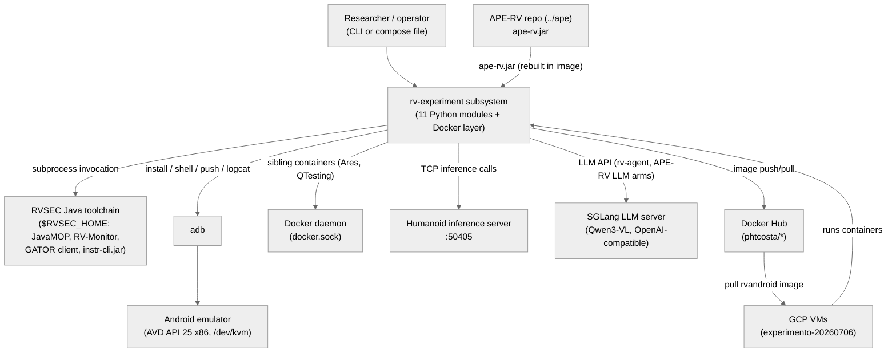
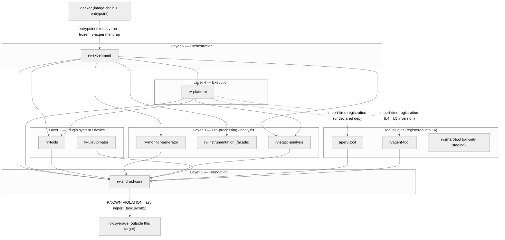
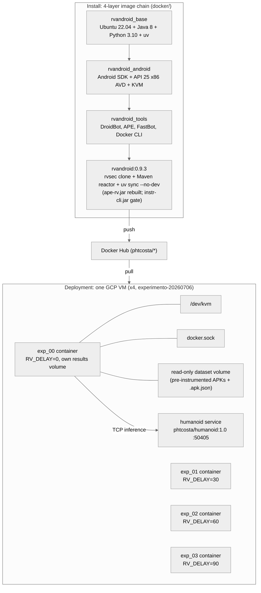

```mermaid
%%{init: {'theme': 'neutral'}}%%
flowchart LR
    DENT["Docker entrypoint<br/>(validate RV_*, exec frozen)"]
    ECTL["ExperimentController<br/>pipeline"]
    PREJ["Java pre-processing toolchain<br/>(JavaMOP, RV-Monitor,<br/>weaving engines, GATOR client)"]
    ARTF[("Filesystem artifacts<br/>out/monitors/,<br/>instrumented_apks/ + .apk.json<br/>(admission gate INV-EXP-16)")]
    PENG["Platform / TaskExecutor<br/>engine"]
    TREG["ToolRegistry +<br/>ToolFactory"]
    TSUB["Testing-tool subprocesses<br/>(adb shell, app_process jars,<br/>sibling containers, LLM agent)"]
    EMUS["Android emulator<br/>session"]
    LOGC["Logcat coverage<br/>channel"]
    TSTO[("TaskStorage<br/>tasks.json")]
    RESD[("Results directory<br/>CSVs, results.json,<br/>traces, logcat files")]

    DENT -. "exec" .-> ECTL
    ECTL -- "Phase 1: subprocess via Command" --> PREJ
    PREJ -- "writes" --> ARTF
    ECTL -- "Phase 2 handoff (one-way)" --> PENG
    ARTF -- "admitted APKs + SA JSON" --> PENG
    PENG -- "resolve + configure per task" --> TREG
    TREG -- "fresh AbstractTool instance" --> TSUB
    PENG -- "boot / install / teardown" --> EMUS
    TSUB -- "adb / uiautomator2 / app_process" --> EMUS
    EMUS -- "RVSEC markers" --> LOGC
    PENG -- "atomic write after every task" --> TSTO
    LOGC -- "per-task logcat files" --> RESD
    PENG -- "coverage/errors/summary/performance" --> RESD
    ECTL -- "Phase 3: instrument_errors.json" --> RESD
```

# Architecture — rv-experiment subsystem

> Scope: **subsystem** · Generated by `rv-doc-arch` · Source model: `out/arch/subsystem-rv-experiment/architecture-model.json`
> Languages: Python (11 modules, ~33,400 LOC) · Docker (1 module, ~1,500 LOC)

## Table of Contents

- [Part I — Beyond Views](#part-i--beyond-views)
  - [1. Documentation overview](#1-documentation-overview)
  - [2. Conceptual primer](#2-conceptual-primer)
  - [3. System overview and context](#3-system-overview-and-context)
  - [4. How it works — end to end](#4-how-it-works--end-to-end)
  - [5. Core components](#5-core-components)
  - [6. Mapping between views](#6-mapping-between-views)
  - [7. Rationale](#7-rationale)
  - [8. Output artifacts](#8-output-artifacts)
  - [9. Directory](#9-directory)
- [Part II — Views](#part-ii--views)
  - [Module view](#module-view)
  - [Component-and-connector view](#component-and-connector-view)
  - [Allocation view](#allocation-view)
- [Appendices](#appendices)
- [Specification traceability](#specification-traceability)

---

## Part I — Beyond Views

### 1. Documentation overview

This document describes the architecture of the **rv-experiment subsystem** — the production
experiment pipeline of RV-Android, spanning eleven Python workspace modules and the Docker
deployment layer that turns them into a scalable experiment instrument. It is written for a
new engineer with no prior exposure to the subsystem: reading it top to bottom should leave
you knowing *what* the pipeline does, *how* a concrete experiment flows through it, and *why*
it is shaped the way it is. It documents the current state of the code only; per-module 4+1
documentation lives in `modules/<name>/docs/architecture.md` and is referenced, not duplicated.

**How to read this document:** Part I builds your mental model — what the subsystem is
([primer](#2-conceptual-primer)), how it behaves end to end
([walkthrough](#4-how-it-works--end-to-end)), and why it is shaped this way
([rationale](#7-rationale)). Part II documents the selected views in detail.

### 2. Conceptual primer

The rv-experiment subsystem is the machinery that turns a research question — "how much of an
Android app's monitored API surface does testing tool X exercise in T seconds?" — into
thousands of reproducible, resumable test runs. It takes a directory of APKs, prepares them
for runtime verification (generating monitors from MOP specifications, weaving those monitors
into the APKs, and statically analyzing the originals), then executes every combination of
APK × tool × repetition × timeout on an Android emulator, and finally aggregates coverage and
error data into CSV/JSON result files. It is the production path behind the thesis
experiments: a single command (`uv run rv-experiment run --tools monkey,droidbot:dfs_greedy
--specification-set jca`) or a Docker container with `RV_*` environment variables drives the
whole pipeline.

**Why this approach.** The obvious alternative is a monolithic script per experiment — which
is what most academic tool-comparison studies use, and which breaks down at this project's
scale (the experimento-20260706 run is 21,681 tasks across 16 containers on 4 VMs, taking
days). Instead, the subsystem is a strict five-layer stack: rv-experiment (Layer 5) owns the
three-phase experiment lifecycle but deliberately never reads results back; rv-platform
(Layer 4) owns task generation, emulator sessions, and atomic per-task persistence; rv-tools
(Layer 2) owns tool discovery and configuration; rv-android-core (Layer 1) owns the shared
domain model and infrastructure. The trade-off accepted is more modules and more indirection
in exchange for two properties a monolith cannot provide: **crash-safe resume** (a killed
container restarted with the same experiment name loses at most one in-flight task, because
`tasks.json` is atomically rewritten after every task) and **tool pluggability** (a new
testing tool is a self-contained `AbstractTool` subclass plus a registry entry — the
executor, coverage, and result pipeline never change). The pre-processing modules
(rv-monitor-generator, rv-instrumentation, rv-static-analysis) are separate because they wrap
foreign toolchains (JavaMOP/RV-Monitor, AspectJ or dexlib2, GATOR/Soot — all Java) behind
subprocess boundaries, and their artifacts are cacheable: a dataset instrumented once is
reused across every experiment arm via skip flags.

**Key concepts**

- **Three-phase workflow** — Every experiment runs pre-processing (monitors →
  instrumentation → static analysis), then execution (the task matrix on emulators), then
  post-processing (diagnostics), in strict order (INV-EXP-01). Data flows one way:
  rv-experiment configures rv-platform and never reads task results back (INV-EXP-02).
- **Task** — The unit of execution: one (APK, tool, variant, repetition, timeout) tuple. The
  task matrix is the cross-product of all configured values; a 219-APK, 11-tool,
  3-repetition, 3-timeout experiment is 21,681 tasks. Each task gets a fresh tool instance
  and its state is persisted to `tasks.json` immediately after it finishes.
- **Monitored operations (MOP)** — API calls monitored by a runtime-verification
  specification — any specification, not only security ones. Two spec sets are used: JCA
  (23 specs for Java Cryptography Architecture misuse) and generic (Iterator/stream
  protocols). MOP coverage = fraction of statically-reachable monitored operations actually
  observed at runtime via logcat.
- **Instrumented APK** — An APK with monitor aspects woven into its bytecode (via the AspectJ
  ajc pipeline or the DEX-native dexlib2 pipeline) so that monitored operations log `RVSEC`
  markers to logcat at runtime. Execution admits only instrumented APKs that also have a
  static-analysis JSON (`<name>.apk.json`) beside them — file presence, not flags, gates the
  pipeline (INV-EXP-16).
- **Tool plugin / variant** — A testing tool wrapped as an `AbstractTool` subclass registered
  in the `ToolRegistry`. A variant is a named configuration preset (e.g.
  `droidbot:dfs_greedy`, `aperv:sata_mop`) declared in the plugin's `get_variants()`;
  experiment arms are variants, and arm-defining keys are frozen in the plugin so no arm
  silently inherits a default.
- **Resume** — Re-running with the same experiment name (or `RV_EXPERIMENT_NAME` in Docker)
  detects `results/<name>/tasks.json`, forces all pre-processing skip flags to True
  (INV-EXP-13), and skips every task whose identity tuple is already COMPLETED. This is what
  makes multi-day containerized experiments survivable: killed containers are simply
  restarted.
- **Skip flags** — `--skip-monitors/--skip-instrument/--skip-static` (or `RV_SKIP_*` env vars
  in Docker) bypass pre-processing phases when artifacts already exist — the standard mode
  for large experiments, where a dataset is instrumented once locally and containers only
  execute. With skips active, `--apks-dir` must point at already-instrumented APKs with their
  `.apk.json` files.
- **Timeout-as-success** — Experiments are bounded-time by design: a tool that runs until its
  timeout expires has completed normally. `RVToolTimeoutError` is recorded as expected
  behavior, and the project hard rule is that timeout is the only exit from exploration
  loops — no early termination.

### 3. System overview and context

The subsystem sits between two worlds. Upstream, it depends on the **RVSEC Java toolchain**
built by the sibling Maven reactor at `$RVSEC_HOME`: JavaMOP and RV-Monitor binaries, the MOP
spec sets (`rvsec/rvsec-mop/src/main/resources`), the GATOR `rvsec-analysis-client.jar`, and
`instr-cli.jar` — all invoked as subprocesses from Python wrappers. A related sibling, the
**APE-RV repository** (`../ape`), produces `ape-rv.jar` consumed by the aperv-tool plugin;
the Docker image rebuilds it from source to prevent schema drift (gh71).

Downstream, everything executes against an **Android emulator** (AVD, API 25 x86), booted and
torn down per task by the platform's EmulatorComponent — headless with `/dev/kvm` passthrough
in Docker, with per-container port allocation for parallelism. **adb** is the universal
device channel: APK install, logcat capture, shell tools (monkey/fastbot), and file push plus
`app_process` launch for on-device jars. Some tools reach further out: Ares and QTesting
spawn sibling containers through the mounted **Docker daemon socket**, joined to the
experiment container's network namespace; the Humanoid tool calls a shared **TensorFlow
inference server** (`phtcosta/humanoid:1.0`, port 50405); and the rv-agent and APE-RV LLM
arms talk to a **SGLang LLM server** (Qwen3-VL, OpenAI-compatible API), reached via a socat
bridge alias inside Docker. Deployment artifacts travel through **Docker Hub** (`phtcosta/*`
images — experiment VMs pull, never receive images by scp), and the production runtime
example runs on **GCP VMs** (experimento-20260706: 4 VMs × 4 containers, dataset delivered by
scp, results consolidated offline).

**Constraints:** Java toolchains are reachable only through `$RVSEC_HOME` path resolution
(explicit `rvsec_root` → `RVSEC_HOME` env var → `ConfigurationError`, INV-EXP-05); GATOR must
analyze original (never instrumented) APKs because Soot's TypeResolver crashes on woven
bytecode; emulator lifecycle is owned exclusively by rv-platform; behavior inside and outside
Docker must be identical, with the `RV_*` env-var surface validated against a canonical
allow-list.

**System context diagram** (external actors and systems — every view refers back to this):

### 4. How it works — end to end

The following walks through a concrete example: running `uv run rv-experiment run --tools
monkey --specification-set jca --apks-dir ./apks_examples --timeouts 60` over `cryptoapp.apk`
(package `br.unb.cic.cryptoapp`, which calls `javax.crypto.Cipher` and `MessageDigest`), and
then the same pipeline as deployed in experimento-20260706 (container exp_00, image
`phtcosta/rvandroid:0.9.3`).

**1. CLI parsing and config assembly.** Click's `main()` in `rv_experiment/__main__.py`
parses the tool-spec DSL and builds a single Pydantic `ExperimentConfig` via
`_create_experiment_config_from_cli` (currently a 24-parameter boundary function — the
module's one complexity hotspot, deliberately confined to the CLI edge per P1 "validate at
boundaries"). `ExperimentConfig.validate()` fail-fasts on empty tools, non-positive timeouts,
a missing APK directory, or an unknown spec set (INV-EXP-03). The timeouts string is parsed
to `List[int]` at this boundary (INV-EXP-33). `ExperimentController.run()` then snapshots the
full config to the results directory before any work, so every run is reproducible from its
own record. Concretely: `--tools monkey` parses to `ToolConfig(name='monkey',
variant='default', parameters={})`; `--tools 'droidbot:dfs_greedy@interval=2'` exercises the
DSL's comma-inside-parameters rule (INV-EXP-09). The snapshot lands as
`results/<name>/experiment_config.json`.

**2. Phase 1a — monitor generation (rv-monitor-generator).** `PreProcessor.process()` calls
`ExperimentConfig.get_monitored_operations_config()` — a just-in-time builder that resolves
RVSEC_HOME by priority (explicit `rvsec_root` field, then the `RVSEC_HOME` env var, else
`ConfigurationError`; INV-EXP-05) — and hands it to
`RuntimeVerificationGenerator.generate_monitors(out/monitors)`. The generator shells out
twice: JavaMOP turns the 23 JCA `.mop` files from
`$RVSEC_HOME/rvsec/rvsec-mop/src/main/resources/jca` into AspectJ aspects (`.aj`) plus
RV-Monitor specs (`.rvm`) — and, via the locally patched `--emit-descriptor` flag,
`MultiSpec_*MonitorAspect.json` descriptors that the dexlib2 instrumentation variant
consumes. Because JavaMOP's `-d` flag does not relocate `.rvm` files, the generator moves
them manually before invoking RV-Monitor, which compiles them into Java monitor classes. A
silent-degradation seam lives here: an unpatched JavaMOP simply emits no descriptors, and
only `get_generation_summary()['descriptors'] == 0` reveals it. For the Cipher spec, JavaMOP
emits `MultiSpec_1MonitorAspect.aj` covering pointcuts like
`call(* javax.crypto.Cipher.getInstance(..))`; `out/monitors/` ends with `.aj` aspects,
monitor `.java` classes, and the JSON descriptors.

**3. Phase 1b — APK instrumentation (rv-instrumentation family).** The pre-processor calls
`get_instrumenter(variant, config)` — the single dispatch site in the `rv-instrumentation`
facade — which lazy-imports exactly one variant: `AjcInstrumentation` (dex2jar + ajc + d8
pipeline) or `DexlibInstrumentation` (DEX-native rewriting via the `instr-cli.jar` Java
engine, driven as a subprocess). The instrumenter weaves the generated monitors into every
APK in `apks_dir`, signs the result with the shared `assets/keystore.jks`, and writes to
`out/instrumented_apks/`. If instrumentation fails or the module is unavailable, the
pre-processor copies the original APKs instead (INV-EXP-08) — the experiment proceeds with 0%
MOP coverage rather than aborting, and the failure surfaces later in
`instrument_errors.json`. With `--instrumentation-variant dexlib2`, `cryptoapp.apk` becomes
`out/instrumented_apks/cryptoapp.apk` with a call to `Cipher.getInstance("AES")` rewritten so
a before-advice logs `Log.v("RVSEC", ...)`; selecting `ajc` never imports
`rv_instrumentation_dexlib2` (verified by tests via `sys.modules` inspection), which is what
lets Docker images ship only one variant runtime.

**4. Phase 1c — static analysis on ORIGINAL APKs (rv-static-analysis).**
`_get_target_apks_for_analysis()` maps each successfully instrumented APK back to its
original (INV-EXP-15) and runs `StaticAnalyzer.analyze()` on the original — never the
instrumented one, because GATOR's Soot TypeResolver crashes on woven bytecode. The analyzer
launches the unified Java `RvsecAnalysisClient` (post-gh27 single client replacing the old
GESDA/GATOR/REACH trio) via `Command.invoke()`, which writes one JSON with reachability,
windows, transitions, and components sections. The reachability section — the coverage
denominator — is written first, so a timeout still preserves it; on `RVCommandTimeoutError`
the parser recovers the truncated JSON by bracket completion. The output is deliberately
placed beside the instrumented APK as `<name>.apk.json`, because that co-location is the
admission ticket to Phase 2. If the output already exists the analyzer short-circuits (cache
hit), which is what makes resumed and skip-flag runs cheap. For cryptoapp, the JSON's
reachability section lists the statically reachable monitored operations — and correctly
excludes `unreachableEncrypt()`/`unreachableHash()`, the methods the test app includes
precisely to exercise this filter; `code_package=br.unb.cic.cryptoapp` (detected by
PackageDetector's 7-priority cascade in rv-android-core) filters the analysis to app code.

**5. Phase 1 → 2 gate — file-presence filtering.** `PreProcessor.get_instrumented_apks()`
admits an APK to execution only if it sits in `instrumented_apks/` AND has its `.apk.json`
beside it (INV-EXP-16). This is a pure file-presence contract, not a status flag — which is
exactly why `--skip-static` with pre-existing artifacts works identically to a fresh run, and
why the fallback-copied originals of INV-EXP-08 (which have no `.apk.json`) are excluded down
the same path. APKs filtered out are logged with warnings; an empty admission list aborts
execution with a clear error rather than running a meaningless experiment. The admission
predicate per APK is literally: `exists(instrumented_apks/cryptoapp.apk) and
exists(instrumented_apks/cryptoapp.apk.json)`.

**6. Phase 2 — handoff to rv-platform (ExecutionController).** `ExecutionController.setup()`
translates `ExperimentConfig` into a `PlatformConfig` (the adapter is the entire job —
INV-EXP-06 enforces setup-before-run) and `Platform.run()` takes over. Platform generates the
task matrix, writes `ExperimentMetadata` with a SHA-256 checksum of the config, and — on
resume — skips every task whose identity tuple `(apk, tool, variant, repetition, timeout)` is
already COMPLETED in `tasks.json`, warning if the checksum differs. Per task,
`ToolFactory.create_tool(ToolConfig)` resolves the variant against the `ToolRegistry`
(registered at import time: 8 builtins by `rv_tools`, plus `RVAgentTool` and `ApeRVTool`
registered by `rv_platform/__init__` with graceful ImportError degradation), merges
`{**variant_defaults, **user_parameters}`, and `configure()`s a fresh instance. From here on,
rv-experiment is out of the loop: no result data flows back except an aggregate
success/failure dict (INV-EXP-02). For the local example the matrix is 1 APK × 1 tool × 1 rep
× 1 timeout = 1 task; for experimento-20260706 it is 219 × 11 × 3 × 3 = 21,681 tasks,
executed as 16 batches of ~13–14 APKs each.

**7. Phase 2 — per-task emulator session (TaskExecutor).** `TaskExecutor` runs each task
through three coordinated phases using pluggable components (the `ITaskComponent` ABCs are
documentation-only by explicit P1 decision — concrete classes conform by convention). Outside
the emulator: `StaticAnalysisComponent` loads the co-located `.apk.json` into
`task.static_data` (non-critical — failure logs and continues), and coverage is initialized.
Inside the emulator session — a context manager owning boot, APK install, and teardown — the
nesting order is load-bearing: logcat capture starts first, then
`mark_tool_execution_start()` stamps the moment coverage timing begins (so progressive
metrics exclude emulator boot), then coverage tracking, then the tool itself; teardown
unwinds coverage first and logcat last so metrics finalize against a complete log. The tool
component treats `RVToolTimeoutError` as success. After every task — success or failure —
`TaskStorage.update_task` atomically rewrites `tasks.json`, which is the crash-safety
contract. Concretely, MonkeyTool builds `adb -s emulator-5554 shell monkey -p
br.unb.cic.cryptoapp --throttle ... 1000000000` (event count "effectively infinite" — the
60 s Command timeout is the real bound, honoring the timeout-only-exit rule), streaming
output to `task.result.trace_file`. When cryptoapp's UI triggers `Cipher.getInstance("AES")`,
the woven advice logs an `RVSEC` marker that logcat capture persists.

**8. Phase 2 — result processing (ResultProcessorComponent).** After all tasks,
`Platform._process_results` runs `ResultProcessorComponent` over ALL sessions found in
TaskStorage — not just the current one — producing `coverage.csv`, `errors.csv`,
`summary.csv`, `performance.csv`, and `results.json`. For resumed tasks (which deserialize
with `repository=None`), coverage and MOP metrics are reconstructed from the persisted logcat
file plus the co-located static-analysis JSON, never from serialized `coverage_metrics`
(INV-PLT-16); tasks whose SA JSON cannot be resolved get a zeroed coverage row plus one
aggregate `N/M` health warning (INV-PLT-18). This reconstruction-from-primary-sources design
is what makes `--process-results` usable standalone to rebuild all CSVs offline. Cryptoapp's
coverage row reports method coverage and MOP coverage as observed/reachable fractions — e.g.
rvsmart's E2E benchmark on this same APK: Activities 100%, Methods 34%, MOP 43%.

**9. Phase 3 — post-processing (rv-experiment again).** Control returns to
`PostProcessor.process()`, which writes `instrument_errors.json` into the results directory
(always — an empty `{}` when nothing failed, INV-EXP-11) and completion diagnostics. This is
deliberately lightweight: because of the one-way data-flow rule, Phase 3 never aggregates or
re-reads platform results; `ResultManager` only reports what TaskStorage exposes. Even if
Phase 2 returned failure, Phase 3 still runs so the diagnostic trail is complete.

**10. Deployment — the same pipeline in a container (experimento-20260706).** In production
the identical flow runs inside `phtcosta/rvandroid:0.9.3`, built as layer 4 of a four-image
chain (base: Ubuntu 22.04 + Java 8 + Python/uv; android: SDK + API 25 x86 emulator + KVM;
tools: DroidBot/APE/FastBot/Docker CLI; rvandroid: the framework, built by cloning the rvsec
`modules` branch, running the Maven reactor, then `uv sync --no-dev`). The Dockerfile bakes
freshness guarantees: APE-RV is rebuilt from source so `ape-rv.jar` always matches the
current static-analysis JSON schema (a committed stale jar once made MOP boost fire in 0 of
147,153 evaluations — gh71), and a build gate fails loudly if Maven's D9 auto-copy did not
deliver `instr-cli.jar` to the dexlib2 module's lib/. At container start,
`docker-entrypoint.sh` validates every `RV_*` variable against the canonical `ENV_*`
allow-list (unknown names exit 64), translates the 5 negation-style skip flags to explicit
CLI flags (Click's `envvar=` would otherwise resolve `RV_SKIP_MONITORS=true` to the POSITIVE
dest and invert the intent — gh55 §9.6), optionally sleeps `RV_DELAY` seconds to stagger
emulator-boot resource peaks, then execs `uv run --frozen --no-dev rv-experiment run`
(frozen because a bare `uv run` implicitly syncs dev dependency-groups over the network at
every container start — a PyPI hiccup once killed 4 of 8 containers before rv-experiment even
started). Container exp_00 on VM m1 runs with:
`RV_TOOLS="monkey,droidbot:dfs_greedy,...,qtesting"` (11 tools),
`RV_SKIP_MONITORS/INSTRUMENT/STATIC_ANALYSIS=true` (dataset pre-instrumented with dexlib2),
`RV_APKS_FILTER=filters/batch_00.txt`, `RV_EXPERIMENT_NAME=exp_00` (auto-resume key), a
read-only dataset volume, a per-container results volume, `/dev/kvm` device, docker.sock
mount for ARES/QTesting sibling containers, and a shared `phtcosta/humanoid:1.0` inference
service at `rv-humanoid:50405`. Three sequential timeout passes (60/180/300 s) reuse the same
experiment names, so pass N+1 skips everything pass N completed.

### 5. Core components

**ExperimentController pipeline.** One `ExperimentController.run()` call is one experiment.
It saves the config snapshot, runs `PreProcessor.process()` (raising on pre-processing
failure), asks the pre-processor for the admitted APK list, creates a tool instance per
ToolConfig via ToolFactory (logging and skipping tools that fail to instantiate), drives
`ExecutionController.setup()`/`.run()`, and always finishes with `PostProcessor.process()` —
even after execution failure, so the diagnostic trail is complete. It holds no execution
state itself; everything downstream of Phase 2 belongs to Platform.

**Platform / TaskExecutor engine.** The runtime heart of the subsystem. `Platform` is a
facade whose `run()` generates tasks, filters by resume identity, executes sequentially, and
processes results; `TaskExecutor` runs each task's three coordinated phases, giving every
task a fresh tool instance and an isolated emulator session. Its crash-safety property —
atomic `tasks.json` persistence after every task — is what the whole multi-day containerized
experiment design leans on.

**TaskStorage (tasks.json).** A Repository over `results/<name>/tasks.json` with atomic
writes, transactions, and `ExperimentMetadata` (SHA-256 config checksum). Resume reads it to
skip completed identity tuples; result processing iterates ALL sessions in it; a checksum
mismatch on resume produces a WARNING rather than a refusal. Because resumed tasks
deserialize without live repositories, it stores facts (states, file paths, timestamps)
rather than computed metrics — coverage is always reconstructed from primary sources
(logcat + SA JSON).

**ToolRegistry + ToolFactory.** A write-once-at-import singleton registry (8 builtins
registered by `import rv_tools`; rvagent and aperv registered by `rv_platform/__init__` with
ImportError degradation) plus a factory that resolves variant defaults and merges user
parameter overrides before `configure()`. It is the extensibility seam: everything above it
speaks `ToolConfig`, everything below it speaks `AbstractTool`.

**Android emulator session.** `EmulatorComponent.start_emulator()` is a context manager
owning the full device lifecycle — boot (headless in Docker, `/dev/kvm` passthrough), APK
install (failure → `EmulatorError` → task FAILED), and teardown — with per-container port
allocation (`RV_DEVICE_PORT`/`device_serial`) enabling parallel containers on one host. The
project hard rule that nothing else ever manages emulators exists because this component's
lifecycle bracketing is what keeps 21,681 sequential tasks from leaking device state into
each other.

**Logcat coverage channel.** Instrumented APKs log a marker per monitored operation
(HashSet-deduped on-device); `LogcatComponent` persists the stream to a per-task file, and
`CoverageComponent` tracks progressive metrics against the static-analysis denominator during
the run. Because the file is persisted, coverage is recomputable offline forever — the
property both resume reconstruction and the standalone `--process-results` path depend on.

**Testing-tool subprocesses.** Each tool plugin turns `execute_tool_specific_logic(task,
app)` into its own connector style: Monkey is a single adb shell command; ApeRVTool pushes a
jar and properties file then runs it on-device via `app_process`; Ares/QTesting spawn sibling
containers through the docker.sock mount joined to the experiment container's network
namespace; Humanoid calls a shared TensorFlow inference server; RVAgentTool runs rv-agent
in-process, which itself talks to the device via uiautomator2 and to a SGLang LLM server. All
of them are bounded by the Command timeout and stream traces to `task.result.trace_file`.

**Java pre-processing toolchain.** Phase 1 is a chain of subprocess boundaries: JavaMOP and
RV-Monitor binaries (resolved under `$RVSEC_HOME`), the instrumentation engines (ajc
toolchain or `java -jar instr-cli.jar`), and the GATOR client
(`java -jar rvsec-analysis-client.jar` behind the gator launcher). Every invocation goes
through rv-android-core's `Command`, so timeouts, process-tree kill, and error semantics are
uniform. Their artifacts — monitors, instrumented APKs, `.apk.json` — flow between stages
purely via the filesystem, which is what makes each stage independently skippable and
cacheable.

**Docker entrypoint.** The container's process 1 boundary. It refuses unknown `RV_*`
variables (exit 64) against the canonical `ENV_*` registry, translates the 5 negation-style
flags to explicit CLI flags (working around Click's envvar-to-positive-dest resolution),
staggers startup via `RV_DELAY`, optionally bridges the SGLang alias with socat, and execs
`uv run --frozen --no-dev rv-experiment run` so container start needs zero network access.
Interactive `bash`/`shell` commands bypass validation for debugging.

**Results directory.** The durable contract of a run. `results/<name>/` holds the resume
source of truth (`tasks.json`), the analysis outputs (`coverage.csv`, `errors.csv`,
`summary.csv`, `performance.csv`, `results.json`), per-task logcat and trace files, the
`instrumented_apks/` directory with co-located `.apk.json` files, the experiment config
snapshot, and `instrument_errors.json`. In Docker each container mounts its own results
volume; in experimento-20260706 the per-VM `results/exp_NN/` trees are later consolidated
offline.

| Component | Realized by | Responsibility |
|-----------|-------------|----------------|
| ExperimentController pipeline | `modules/rv-experiment/src/rv_experiment/experiment/experiment_controller.py` | Sequences the three phases and snapshots the config; top-level control flow |
| Platform / TaskExecutor engine | `modules/rv-platform/src/rv_platform/platform.py`, `.../execution/executor.py` | Task matrix, resume skip, phase-coordinated per-task execution, result production |
| TaskStorage (tasks.json) | `modules/rv-platform/src/rv_platform/storage/task_storage.py` | Atomic JSON persistence of all task state; single source of truth for resume |
| ToolRegistry + ToolFactory | `modules/rv-tools/src/rv_tools/registry/registry.py`, `.../registry/factory.py` | Maps tool names to classes/specs/variants; instantiates configured tools |
| Android emulator session | `modules/rv-platform/src/rv_platform/components/emulator.py` | Boots AVD, installs instrumented APK, hosts the tool run, tears down |
| Logcat coverage channel | `.../components/logcat.py`, `.../components/coverage.py`, `modules/rv-android-core/src/rv_android_core/util/android/logcat_manager.py` | Captures RVSEC/RVSEC-COV markers into per-task files; only runtime coverage channel |
| Testing-tool subprocesses | `modules/rv-tools/src/rv_tools/builtin/*`, `modules/aperv-tool/.../tool.py`, `modules/rvagent-tool/.../tool.py` | The actual exploration engines behind each plugin |
| Java pre-processing toolchain | `modules/rv-monitor-generator`, `modules/rv-instrumentation`, `modules/rv-static-analysis` | JavaMOP, RV-Monitor, weaving engines, GATOR client — foreign Java tools as subprocesses |
| Docker entrypoint | `docker/rvandroid/docker-entrypoint.sh`, `docker/rvandroid/scripts/validate_env_vars.sh` | RV_* allow-list validation, negation-flag translation, frozen exec |
| Results directory | `results/<experiment>/` | Persistent experiment output and resume state |

### 6. Mapping between views

The module view and the component-and-connector view describe the same code from two angles,
and the correspondence is direct. The **ExperimentController pipeline** is realized by the
`rv-experiment` module (Layer 5); the **Platform / TaskExecutor engine** and **TaskStorage**
live inside `rv-platform` (Layer 4); the **ToolRegistry + ToolFactory** is `rv-tools`
(Layer 2), populated at import time both by rv-tools itself (8 builtins) and by
`rv_platform/__init__.py` (the two external plugins). The **Java pre-processing toolchain**
component is realized jointly by the three Layer-3 wrapper modules (`rv-monitor-generator`,
`rv-instrumentation`, `rv-static-analysis`); the **Docker entrypoint** is realized by the
`docker` module; and the **emulator session**, **logcat coverage channel**, and **results
store** are runtime constructs owned by rv-platform components over external substrates
(emulator, adb, filesystem).

Because the subsystem mixes two languages, the **cross-language boundary deserves explicit
statement: every Python-to-Java crossing is a subprocess boundary, and every one goes through
rv-android-core's `Command`** (uniform timeout, process-tree kill, and error semantics).
Concretely, the crossings are: `rv-monitor-generator` → `$RVSEC_HOME/javamop/bin/javamop`
and `rv-monitor/bin/rv-monitor`; `rv-instrumentation` (dexlib2 variant) →
`java -jar instr-cli.jar` (the ajc variant runs the dex2jar+ajc+d8 toolchain);
`rv-static-analysis` → the gator launcher + `rvsec-analysis-client.jar`; and `aperv-tool` →
`adb push ape-rv.jar` followed by `adb shell app_process` (the jar executes *on the device*,
not the host). What crosses these boundaries is never Python objects — it is files and
command lines: `.mop` specs in, `.aj`/`.java`/JSON descriptors out; APKs in, woven signed
APKs out; original APKs in, one `.apk.json` out; a properties file and a compacted SA JSON
pushed to the device, a trace stream back. This file-based data plane is what makes each
stage skippable, cacheable, and reconstructible.

In the allocation view, the whole Python workspace plus every baked Java artifact deploys as
the single `rvandroid` image (layer 4 of the image chain, which runs the sibling Maven
reactor at build time — the install-time counterpart of the subprocess boundary). At runtime,
one container = one rv-experiment process = one emulator = one results volume; sibling
containers (Ares, QTesting) and shared services (Humanoid, SGLang) are separate deployment
units reached through docker.sock and TCP respectively.

### 7. Rationale

The decisions below shaped the subsystem; each is narrated with the tension behind it, the
rejected alternative, and the failure mode it avoids.

**One-way data flow: rv-experiment never reads results back.** The tempting alternative is
for the orchestrator to collect per-task results and build its own reports — which is exactly
what would fossilize rv-platform's internals into rv-experiment's API and duplicate the
result pipeline in two layers. Instead all result production (CSV/JSON, coverage
reconstruction) lives in rv-platform's ResultProcessorComponent, and rv-experiment's Phase 3
writes only its own diagnostics (`instrument_errors.json`). Without this rule, resume would
need two coordinated states (the experiment's view and the platform's view) instead of one
`tasks.json`, and the standalone `rv-platform run` / `--process-results` paths would be
second-class citizens missing report logic held hostage upstream.

**File-presence gating between phases, not status flags.** The alternative — tracking
per-APK phase status in memory or a manifest — breaks the moment a phase is skipped or a run
is resumed, because the status was computed in a different process that no longer exists.
Gating on artifact presence (`instrumented_apks/<name>.apk` AND `<name>.apk.json`) makes the
pipeline stateless between phases: pre-instrumented datasets, `--skip-static` with cached
JSONs, and container restarts all traverse the same predicate. The interplay with INV-EXP-08
is deliberate: fallback-copied originals carry no `.apk.json` and are therefore excluded by
the same filter, so a degraded run cannot silently masquerade as a monitored one.

**Resume as identity-tuple skip over an atomically persisted tasks.json.** The experiments
this subsystem exists for (21,681 tasks over days on preemptible cloud VMs) make failure the
normal case, so the design optimizes restart cost instead of trying to prevent crashes. The
rejected alternative — checkpointing at experiment or batch granularity — loses hours of
work per restart; per-task atomic persistence bounds loss to the single in-flight task.
Forcing pre-processing skips on resume protects artifact integrity: re-running
instrumentation would overwrite APKs with freshly woven versions that may differ if specs or
tools changed mid-experiment, silently corrupting comparability. The config checksum in
ExperimentMetadata warns (not refuses) on drift, keeping the operator in control. The visible
cost is the documented gotcha that resuming with an original-APK `--apks-dir` yields 0%
coverage.

**Timeout is the expected exit; timeout-as-success.** Coverage-over-time experiments compare
tools at fixed budgets (60/180/300 s), so a tool "finishing early" is a design smell, not a
success: it would give that arm less wall-clock exploration than its competitors and bias the
comparison. Hence Monkey gets an effectively infinite event count with the Command timeout as
the real bound, APE-RV gets a +15 s grace to flush its WTG model after the kill, and the
project-wide hard rule forbids any early-termination mechanism in agents. Without this
decision, every per-tool completion heuristic would become a hidden experimental variable.

**Env-var allow-list entrypoint with negation-flag translation (gh55).** Experiment
campaigns are configured by hand-written compose files with a dozen `RV_*` variables each; a
silently ignored typo (`RV_TIMEOUT` for `RV_TIMEOUTS`) once meant a multi-day run with wrong
parameters. The allow-list turns typos into immediate exit-64 failures against a single
registry in rv-android-core constants. The negation-flag translation exists because Click's
`envvar=` resolves an env value to the option's POSITIVE dest: `RV_SKIP_MONITORS=true`
through envvar would set `generate_monitors=True` — the exact opposite of intent — so the
entrypoint emits explicit `--skip-monitors` flags that win via CLI-over-env precedence. The
acknowledged residual gap: outside Docker those 5 env vars remain ineffective.

**Static analysis runs on ORIGINAL APKs; output co-located with instrumented ones.** The
naive pipeline order — instrument, then analyze what you will run — is impossible: Soot's
TypeResolver crashes on AspectJ-woven bytecode, and dexlib2-rewritten code is equally
off-contract. So analysis targets originals, but only originals whose instrumentation
succeeded (analyzing an APK that will never execute wastes the most expensive pre-processing
step). Writing the JSON beside the instrumented APK, named `<name>.apk.json`, gives every
downstream consumer — the execution admission filter, the platform's
StaticAnalysisComponent, aperv-tool's MOP push, offline coverage reconstruction — one path
convention with no lookup service. The reachability-section-first JSON ordering is the same
philosophy applied to timeouts: the coverage denominator survives even a truncated analysis.

**Graceful degradation over abort in pre-processing and plugin loading.** In a 219-APK
batch, a handful of APKs always resist instrumentation (packers, odd manifests). Aborting the
experiment for them — the strict alternative — would make large campaigns practically
unfinishable. Instead each degradation is local and visible: failed instrumentation falls
back to the original APK and is reported in `instrument_errors.json`; an APK without SA data
is excluded from execution with a warning; a tool plugin whose import fails simply doesn't
register; missing static data for rvagent switches WTG guidance off rather than failing the
task (while present-but-CORRUPT data fail-fasts before device time — degradation is only for
absence, never for corruption). The failure mode this prevents is the silent kind: every
fallback leaves a trace in logs or diagnostics.

**Import-time hardcoded plugin registration instead of entry-point discovery.** Entry-point
scanning (`importlib.metadata`) is the canonical alternative and rvagent-tool even declares
one — but nothing scans it. The hardcoded import is a deliberate P1 trade: two lines per
plugin, trivially debuggable, and gracefully degrading (an absent plugin package logs and
skips, so a container image without rv-agent still runs Monkey experiments). The accepted
cost is a Layer 4 → Layer 5 inversion that the dependency analyses consistently flag, plus an
inconsistency: rvagent-tool is declared in rv-platform's pyproject while aperv-tool is not.
If plugin count grows, this decision is the first to revisit — the dead entry point shows the
migration path was already sketched.

**Frozen environment at container start (`uv run --frozen --no-dev`).** A bare `uv run`
performs an implicit sync against ALL dependency groups — including dev-only
pytest/flake8/hypothesis — even though the image was built with `uv sync --no-dev`. Every
container start would fetch ~13 dev packages from PyPI for zero production benefit, and on
2026-07-02 a network hiccup during that fetch killed 4 of 8 containers before rv-experiment
even started. The flags pin execution to the .venv exactly as built at image-build time,
making container start deterministic and offline. This is also why experimento-20260706
bumped to image 0.9.1: the fix had to be baked into the entrypoint inside the image.

**Documentation-only component interfaces (ITaskComponent).** The orthodox alternative —
enforcing inheritance and iterating components polymorphically — buys nothing at 5 fixed,
phase-ordered components whose sequencing is load-bearing (static analysis before emulator,
logcat before tool, coverage-stop before logcat-stop). Real polymorphic dispatch would need a
phase/ordering metadata protocol to encode what the isinstance chain states plainly. The
interfaces stay as executable documentation of the lifecycle contract; the executor keeps
explicit knowledge of every component. The trade-off is honest coupling in one file versus
speculative pluggability nothing currently needs — the components are "pluggable" in the
sense of being separable units, not hot-swappable strategies.

**Decisions at a glance**

| Decision | Drivers | Invariant / ADR |
|----------|---------|-----------------|
| One-way data flow: rv-experiment never reads results back | clean layer separation; standalone rv-platform usability; no duplicated result logic | INV-EXP-02 |
| File-presence gating between phases, not status flags | skip/resume runs behave identically to fresh; no meaningless 0-denominator coverage | INV-EXP-16 (with INV-EXP-15) |
| Resume as identity-tuple skip over atomic tasks.json | multi-day containerized experiments; containers killed by orchestrators; at-most-one-task loss | INV-EXP-13 |
| Timeout is the expected exit (timeout-as-success) | bounded-time design; comparable arms; no tool-specific termination bias | — |
| Env-var allow-list entrypoint + negation-flag translation | typo detection in compose files; identical behavior in/out of Docker; Click envvar semantics | — (gh55) |
| Static analysis on originals; output co-located with instrumented APKs | Soot TypeResolver crash on woven bytecode; single lookup convention | INV-EXP-15 |
| Graceful degradation over abort | large-batch robustness; partial results better than none | INV-EXP-08 |
| Hardcoded plugin registration over entry-point discovery | explicitness (P1); identical in editable installs and Docker; no scanning machinery | — |
| Frozen environment at container start | container start reliability; reproducibility of shipped .venv | — |
| Documentation-only component interfaces | P1 simplicity; 5 fixed components, not an open plugin surface | — |

**Patterns and styles**

At module granularity the subsystem is **layered** with high confidence: a strict downward
dependency order L5 (rv-experiment) → L4 (rv-platform) → L3 (pre-processing/analysis) → L2
(rv-tools, rv-uiautomator) → L1 (rv-android-core), with instability decreasing down the stack
(rv-experiment I=1.0, rv-platform I=0.80, rv-tools I=0.20, core I=0.07). There are exactly
two documented exceptions: rv-platform's plugin-registration imports of
rvagent-tool/aperv-tool (L4→L5) and core's lazy `rv_coverage` import (`task.py:682`). The
**uses** style is equally clean: declared==actual import parity was verified across all 10
analyzed modules with zero static cycles. At runtime, three C&C styles coexist:
**pipe-and-filter** (the three-phase workflow with filesystem hand-offs and file-presence
gates), **client-server** (adb/emulator, Humanoid TCP, SGLang API, uiautomator2 HTTP,
sibling-container spawning), and **shared-data** (`tasks.json` as the coordination store
between sessions and restarts; the results directory and co-located `.apk.json` files as the
inter-phase data plane). In allocation, the **deployment** style is the experimento-20260706
topology (4 VMs × 4 containers each) and the **install** style is the 4-layer image chain
with its baked Maven artifacts and jar hand-off conventions.

**NFRs served**

**Reproducibility (NFR08).** Every run snapshots its full ExperimentConfig to the results
directory before work begins, and ExperimentMetadata stores a SHA-256 checksum of the
configuration that resume compares (warning on mismatch). The Docker image chain pins the
code (`LABEL rvsec.branch`, git clone of a named branch, ape-rv.jar rebuilt from source to
eliminate binary drift — gh71) and the entrypoint's `--frozen --no-dev` execution pins the
Python environment to the image-build state. Result files are reconstructible from primary
sources: coverage is always recomputed from persisted logcat plus the co-located
static-analysis JSON, never from cached metrics (INV-PLT-16), so `--process-results` can
rebuild every CSV offline from a results volume alone.

**Resilience (NFR04).** Failure is treated as the normal case at every level: tool timeouts
are successful completions; instrumentation failure falls back to copying originals
(INV-EXP-08) with the failure surfaced in `instrument_errors.json`; static-analysis loading
is non-critical to task execution; plugin import failures degrade to a smaller registry;
task-level exceptions mark the task ERROR, run shielded cleanup, and never stop the batch;
and TaskStorage's atomic post-task persistence bounds crash loss to one in-flight task. In
deployment, the entire recovery procedure for a killed container is `docker compose up -d`
again — resume via `RV_EXPERIMENT_NAME` does the rest.

**Configurability (NFR05).** One Pydantic ExperimentConfig unifies all knobs, assembled from
three equivalent surfaces with defined precedence (CLI > env > Pydantic default,
INV-EXP-32): the tool-spec DSL `tool[:variant][@k=v]` on the CLI, the `RV_*` env-var registry
in Docker (validated by allow-list), and JSON config files with template generation.
Sub-module configs are built just-in-time by ExperimentConfig methods only when a phase
actually runs (INV-EXP-05 path-resolution priority: explicit `rvsec_root` → `RVSEC_HOME` →
`ConfigurationError`), and tool arms are frozen variant tables in the plugins so no
arm-defining key silently inherits a default (INV-APV-14, INV-RVA-01).

**Extensibility (NFR02).** Adding a testing tool is an AbstractTool subclass implementing 4
methods (`get_tool_spec`, `get_variants`, `configure`, `execute_tool_specific_logic`) plus
one registration call — the executor, coverage pipeline, result processing, and CLI never
change, as demonstrated by the two external plugins (aperv-tool, rvagent-tool) living
entirely outside rv-tools. Instrumentation variants extend through the `get_instrumenter`
factory (one new branch, lazy-imported), and TaskExecutor components follow a documented
initialize/execute/cleanup lifecycle.

**Modularity (NFR01).** The subsystem is 11 uv-workspace modules installed editable by one
`uv sync`, with a verified near-clean dependency DAG: declared==actual imports in all 10
analyzed Python modules, zero static cycles, and an instability gradient that decreases down
the layers (rv-experiment I=1.0 to core I=0.07). The two known deviations are documented,
not accidental: the plugin-registration L4→L5 imports (graceful degradation by design) and
core's lazy rv_coverage import (flagged for removal).

**Observability (NFR06).** Every layer leaves a durable trace: per-task logcat files (the
RVSEC coverage channel), per-task tool trace files (stdout/stderr of the exploration
process), `performance.csv` timing metrics stamped from `mark_tool_execution_start` so boot
time is excluded, structured CSV/JSON results for post-hoc analysis, aggregate health
warnings on degraded reconstruction (the N/M unresolvable-SA warning, INV-PLT-18), and
`instrument_errors.json` capturing pre-processing degradations. The runtime example adds
operational tooling on top: `experimento-20260706/scripts` (rv_status.py, health_check.py,
monitor.sh, reconcile_tasks_to_logcat.py) all read these same artifacts.

| NFR | PRD ID | Architectural support |
|-----|--------|-----------------------|
| Reproducibility | NFR08 | Config snapshot + SHA-256 checksum; pinned image chain; `--frozen --no-dev`; coverage reconstructed from primary sources (INV-PLT-16) |
| Resilience | NFR04 | Timeout-as-success; INV-EXP-08 fallback; non-critical SA loading; plugin degradation; atomic per-task persistence; restart-as-recovery |
| Configurability | NFR05 | Unified ExperimentConfig; CLI > env > default precedence; just-in-time sub-configs (INV-EXP-05); frozen arm tables (INV-APV-14, INV-RVA-01) |
| Extensibility | NFR02 | 4-method AbstractTool contract; registry seam; `get_instrumenter` factory; component lifecycle |
| Modularity | NFR01 | 11 editable workspace modules; verified DAG, zero cycles; instability gradient; two documented deviations |
| Observability | NFR06 | Per-task logcat/trace files; performance.csv; health warnings (INV-PLT-18); instrument_errors.json; operational scripts |

### 8. Output artifacts

Every run leaves a durable, self-describing trail under `results/<name>/` (plus cacheable
pre-processing artifacts under `out/`). These files are simultaneously the experiment's
results, its resume state, and its reproducibility record.

| Artifact | Location | Notes |
|----------|----------|-------|
| `tasks.json` | `results/<name>/` | Atomic task-state store; single source of truth for resume (ExperimentMetadata + per-task records) |
| `coverage.csv` / `errors.csv` / `summary.csv` / `performance.csv` / `results.json` | `results/<name>/` | Produced by ResultProcessorComponent over ALL sessions; rebuildable offline via `--process-results` |
| Per-task logcat and tool trace files | `results/<name>/` | Primary sources: RVSEC coverage markers and tool stdout/stderr; coverage is always reconstructed from these |
| `instrumented_apks/` + `<name>.apk.json` | `out/` or `results/<name>/` | Woven, signed APKs with co-located static-analysis JSON; the `.apk.json` is the execution admission ticket (INV-EXP-16) |
| `out/monitors/` | `out/` | Generated `.aj` aspects, monitor `.java` classes, and `MultiSpec_*MonitorAspect.json` descriptors |
| Experiment config snapshot | `results/<name>/` | Full ExperimentConfig serialized before execution for reproducibility |
| `instrument_errors.json` | `results/<name>/` | Always written by PostProcessor, `{}` when empty (INV-EXP-11) |

### 9. Directory

**Glossary / acronyms**

- **MOP** — Monitored operations: API calls monitored by any runtime-verification
  specification (not security-specific).
- **JCA** — Java Cryptography Architecture; one of the two specification sets (23 specs).
- **WTG** — Window Transition Graph, the GATOR-derived UI model used for steering (APE-RV,
  rvagent MOP arms).
- **Arm** — One experimental condition, expressed as a tool variant with frozen
  arm-defining keys.
- **AVD** — Android Virtual Device (the emulator image; API 25 x86 here).
- **SA JSON** — The static-analysis output `<name>.apk.json`, co-located with the
  instrumented APK.
- **Identity tuple** — `(apk, tool, variant, repetition, timeout)`; the resume skip key.
- **app_process** — Android's mechanism for running a jar with framework classes on-device
  (used by APE-RV and rvsmart).
- **Weaving** — Injecting monitor advice into APK bytecode (ajc or dexlib2 variant).

**References**

- Per-module 4+1 docs: `modules/<name>/docs/architecture.md`; module `CLAUDE.md` files.
- Experiment domain spec: `openspec/specs/experiment/spec.md`; PRD: `docs/PRD.md`.
- Runtime example: `experimento-20260706/` (compose files, batch filters, scripts).
- Companion subsystem docs: `docs/architecture/monitor-generation.md`,
  `docs/architecture/static-analysis.md`, `docs/architecture/system.md` (where present).
- Source model: `out/arch/subsystem-rv-experiment/architecture-model.json`.

---

## Part II — Views

### Module view

*Style(s): layered, uses*

This view shows the subsystem's defining structure: a strict five-layer dependency stack in
which instability decreases monotonically from the orchestrator (rv-experiment, I=1.0) down
to the foundation (rv-android-core, I=0.07). A newcomer should read it as "who is allowed to
know about whom": every arrow points downward except two documented, deliberate deviations —
rv-platform's import-time plugin registration of rvagent-tool and aperv-tool (an L4→L5
inversion accepted for explicitness), and rv-android-core's lazy import of the rv_coverage
logcat parser (the workspace's one known dependency violation, flagged for removal). The
concrete import edges below are what you need to change any module safely.

**Primary presentation**

Solid arrows are declared, verified `uses` dependencies; dashed arrows are the documented
deviations and the deployment entrypoint. `rvsmart-tool` has no import edges in this tree —
it is a jar-only staging directory (see catalog).

**Element catalog**

**rv-experiment** (Layer 5, `modules/rv-experiment`). The Click CLI in `__main__.py`
(1,348 lines — the module's only complexity hotspot, by design at the validation boundary)
parses the tool-spec DSL `tool[:variant][@k=v]` and assembles a single Pydantic
`ExperimentConfig`, which is validated fail-fast (INV-EXP-03) and snapshotted to the results
directory for reproducibility. `ExperimentController.run()` then sequences three components:
`PreProcessor` drives monitor generation, instrumentation, and static analysis via
just-in-time config builders on `ExperimentConfig` (`get_monitored_operations_config()`,
`get_rv_instrumentation_config()`, `get_static_analysis_config()` — lazy construction that
keeps sub-module imports out of the boundary until a phase actually runs);
`ExecutionController` adapts `ExperimentConfig` into a `PlatformConfig` and calls
`Platform.run()`; `PostProcessor` writes `instrument_errors.json` and completion
diagnostics. The tricky part is the gating chain: static analysis targets only originals of
successfully instrumented APKs (INV-EXP-15), and execution admits only instrumented APKs
with a co-located `.apk.json` (INV-EXP-16) — file presence, not status flags, so skip-flag
and resume runs behave identically to fresh ones. It is a separate module because the
boundary protects the one-way data-flow rule (INV-EXP-02): rv-experiment configures the
execution stack but never reads task results back, so experiment lifecycle concerns cannot
leak into the execution engine and vice versa; it is also the only module that knows about
all three pre-processing toolchains at once — rv-platform can be used standalone precisely
because it never learned about monitors or instrumentation. Gotchas: with skip flags active,
`--apks-dir` must point at INSTRUMENTED APKs from a previous run (originals silently yield
0% coverage); `python -m rv_experiment` is currently hijacked — the `__main__` guard calls a
dev-leftover `run_local()` with a hardcoded personal path instead of `main()`, so use the
`rv-experiment` console script; `WorkflowFactory` is entirely dead code and
`rv-screen-parser`/`rv-coverage` are declared in pyproject but never imported; on resume,
all three pre-processing skip flags are forced True regardless of CLI values (INV-EXP-13) —
you cannot re-instrument within a resumed experiment.

**rv-platform** (Layer 4, `modules/rv-platform`). `Platform.run()` is a facade over five
phases: generate the task matrix (APKs × tools × repetitions × timeouts) with an
`ExperimentMetadata` SHA-256 config checksum; skip tasks already COMPLETED by identity tuple;
execute the rest sequentially, instantiating a fresh tool per task via `ToolFactory` and
persisting each task atomically to `tasks.json` immediately after it finishes (success AND
failure — the crash-safety contract); process ALL sessions' results into
coverage/errors/summary/performance CSVs plus `results.json`; and return an aggregate
summary dict. Inside each task, `TaskExecutor` coordinates components in three phases —
static-analysis loading and coverage init outside the emulator, then a nested emulator
session (context manager owning boot/install/teardown) where logcat starts first, the
tool-execution-start timestamp is stamped, coverage tracking begins, and the tool runs;
teardown unwinds coverage first, logcat last, so metrics finalize against a complete log.
The tricky parts: the component ABCs in `task_interfaces.py` are documentation-only by
explicit P1 decision (the executor dispatches by isinstance over the 5 concrete types), and
resumed tasks deserialize with `repository=None`, so coverage is reconstructed from
persisted logcat + co-located SA JSON, never from serialized metrics (INV-PLT-16). It is
separate because it is the reusable execution engine: `rv-platform run` works standalone
without any experiment wrapper, and separating it keeps emulator lifecycle, task
persistence, and result production independent of experiment-lifecycle policy while giving
resume a single source of truth owned by one module. Gotchas: `rv_platform/__init__.py`
registers `RVAgentTool` and `ApeRVTool` at import time via hardcoded lazy imports (aperv-tool
is not even declared in rv-platform's pyproject while rvagent-tool is);
`RVToolTimeoutError` is recorded as EXPECTED successful completion; `TaskStorage.delete_task`
stores a None delete-sentinel that `commit_transaction` merges without filtering — a latent
corruption path if transactional delete is ever used; the nesting order inside
`_run_emulator_session` is load-bearing; `--process-results` reruns result processing over
all sessions without executing tasks — the offline reconsolidation path.

**rv-tools** (Layer 2, `modules/rv-tools`). `import rv_tools` triggers
`_register_builtin_tools()`, which registers each of the 8 builtin classes (Monkey, APE,
DroidBot, DroidMate, FastBot, Ares, Humanoid, QTesting) into the singleton `ToolRegistry`
(three parallel dicts: tool classes, `ToolSpec`s, and variant maps keyed by tool name). At
execution time `ToolFactory.create_tool(ToolConfig)` performs a 4-step resolve: check
registration, look up the variant's default config (falling back to `default`), merge
`{**variant_defaults, **config.parameters}` so user overrides win, then instantiate and
`configure()` the tool. The tool wrappers themselves build external commands: Monkey and
FastBot drive `adb shell`; Ares and QTesting spawn sibling Docker containers via the
docker.sock mount (`--network container:$(hostname)` inside Docker, `--network host`
outside — INV-TOOL-15); Humanoid talks to a shared TensorFlow inference server. The
execution lifecycle template (`AbstractTool.execute()` →
`execute_tool_specific_logic()`) lives upstream in rv-android-core — rv-tools only defines
discovery and configuration. It is separate because the registry/factory must sit BELOW
rv-platform (which consumes it) and ABOVE rv-android-core (whose AbstractTool contract it
fills), so external tool plugins can be added without touching the execution engine.
Gotchas: registration is an import-time side effect wrapped in a silent `except Exception:
pass` — a broken builtin can vanish from the registry with no hard failure;
`builtin/qtesting/src/` is ~3,600 SLOC of VENDORED Q-testing research code that runs inside
a sibling container (do not refactor or lint it); nothing scans `rv_tools.plugins` entry
points — external plugin discovery is actually the hardcoded imports in
`rv_platform/__init__.py`; Monkey's event count is 1e9 ("effectively infinite") — duration
is bounded solely by the Command timeout.

**rv-android-core** (Layer 1, `modules/rv-android-core`). Everything the stack shares lives
here, dependency-free (fan-in 14, fan-out ~1). The `Task` model is the unit of execution
with its `TaskState` machine (created → running → completed/failed) driven by the platform
executor, plus `TaskConfiguration`/`TaskResult`. `Command` wraps subprocess execution with
validated arguments, timeout watching, and process-tree kill — every external toolchain in
the subsystem (JavaMOP, RV-Monitor, GATOR, instr-cli.jar, adb, ape-rv.jar) is invoked
through it, which is why `RVCommandTimeoutError`/`RVToolTimeoutError` semantics are uniform
across the stack. The `AbstractTool` ABC (4 abstract methods) is the Template Method every
tool plugin implements. Cross-cutting infrastructure: a 25-class exception tree rooted at
`RVAndroidError`, `ErrorHandler` decorators, `LoggingManager`, and `BaseValidatedModel` —
the Pydantic base whose validation is toggled by `RV_PYDANTIC`. `PackageDetector` resolves
an APK's real code package via a 7-priority heuristic cascade with Jaro-Winkler fallback;
its output feeds both the GATOR client and the static-analysis parser. It is separate
because it is the shared vocabulary: with 14 downstream consumers, any coupling from core
back up the stack would create cycles across the whole workspace; library semantics (no
CLI, never self-executing) keep it a pure dependency target. Gotchas: `Task.get_repository()`
(`task.py:682`) lazily imports `rv_coverage.parser.log.logcat_parser` — the undeclared
L1↔L3 runtime cycle; coverage markers arrive via `Log.v("RVSEC", ...)`/`RVSEC-COV` logcat
tags with HashSet dedup on the instrumented-app side (logcat is the ONLY runtime coverage
channel); PackageDetector's cascade is why `code_package` can differ from the manifest
package — both the Java analysis client and the Python parser must receive the same value.

**rv-uiautomator** (Layer 2, `modules/rv-uiautomator`). An Adapter-pattern library: the
`UIAdapter` ABC declares 11 device operations (connect, capture UI state, gestures, text
input, app lifecycle) and `UIAutomator2Adapter` implements them over uiautomator2's HTTP
protocol to the device. `UIAutomatorActionExecutor` dispatches `GeneratedAction` objects to
adapter gestures with a fixed 0.3 s stabilization delay; `StateConverter` bridges
UIAutomator XML into DroidBot-format state dicts with SHA-256 screen hashing. Error handling
is uniform boolean degradation — failures log and return False/{}/None, never raise. Timing
is deliberately open-loop (fixed sleeps tuned for SwiftShader headless emulators). It is
separate to keep device I/O framework-agnostic and out of the agent's decision logic: in
this subsystem it participates only transitively — rv-agent's `DeviceInterface` instantiates
`UIAutomator2Adapter` when the rvagent tool runs. Gotchas: the ONLY external consumer in the
current tree is rv-agent importing `UIAutomator2Adapter` (`UIAutomatorActionExecutor`,
`StateConverter`, `DeviceManager`, `ScreenshotManager` have zero external consumers, and the
module CLAUDE.md's claim that rv-platform uses DeviceManager is stale); every method carries
BOTH an `@ErrorHandler.handle_errors` decorator and an inner catch-all try/except — a known
redundancy; `rv-screen-parser` is declared in pyproject but never imported.

**rv-monitor-generator** (Layer 3, `modules/rv-monitor-generator`). `RVGeneratorConfig`
(Pydantic) resolves tool paths by priority — explicit paths, then `rvsec_root`, then
`RVSEC_HOME` — and validates in four fail-fast phases at construction.
`RuntimeVerificationGenerator.generate_monitors(output_dir)` then runs the two-stage
pipeline via rv-android-core `Command`: reset the output dir, invoke JavaMOP over the `.mop`
spec set (JCA: 23 specs; generic: 118 FSM specs), manually move the `.rvm` files (JavaMOP's
`-d` does not relocate them — a documented workaround), copy custom `.aj` aspects, invoke
RV-Monitor over the `.rvm` files, and delete the intermediates. The locally patched JavaMOP
additionally emits `MultiSpec_*MonitorAspect.json` descriptors when `emit_descriptor=True`
— the pointcut metadata the dexlib2 instrumentation variant needs, since it cannot parse
AspectJ source. Pipeline errors are caught and converted to a False return; config errors
raise. It is separate because it wraps two foreign Java toolchains behind one Python facade
with a boolean contract, and its artifacts (`out/monitors/`) are the cacheable input to
instrumentation — what makes `--skip-monitors` a pure file-reuse operation. Gotchas: with
`emit_descriptor=True` but an UNPATCHED JavaMOP, descriptors are silently absent (only
`get_generation_summary()['descriptors'] == 0` reveals it, and the dexlib2 variant fails
downstream); known CLI bug — `generate --summary` crashes with TypeError, reporting a false
failure after a successful generation; otherwise one of the healthiest modules in the
workspace (zero dead code, max CC 7).

**rv-instrumentation** (Layer 3 facade, `modules/rv-instrumentation`). A deliberately
logic-free facade (49 SLOC total): `__init__.py` re-exports `Instrumenter`,
`InstrumentationResults`, and `InstrumentationError` from rv-instrumentation-core, and
`factory.py`'s `get_instrumenter(variant, config)` lazy-imports exactly one concrete
variant — `AjcInstrumentation` (dex2jar + ajc + d8) for `"ajc"` or `DexlibInstrumentation`
(DEX-native, driving the Java `instr-cli.jar` engine as a subprocess) for `"dexlib2"` —
raising `ValueError` on anything else. The lazy import is the point: selecting one variant
never imports the other's package (asserted by tests via `sys.modules`), enabling Docker
layers that ship only one variant runtime. `assets/keystore.jks` is the shared signing asset
both variants use. It is separate because the family split (core ABC ← variant impls ←
parent facade) breaks a dependency cycle: variants depend only on `-core`, never on this
parent, so the facade can depend on both variants without either knowing about the facade;
rv-experiment consumes only this dispatch site (INV-INS-36), so adding a third variant
touches one factory branch. Gotchas: rv-experiment bypasses the facade for CONFIG classes,
importing `AjcInstrumentationConfig`/`DexlibInstrumentationConfig` directly from the
variants (declared, low severity); the actual weaving work happens in the sibling variant
modules — this facade is the only instrumentation entry the orchestrator calls.

**rv-static-analysis** (Layer 3, `modules/rv-static-analysis`). `StaticAnalyzer.analyze()`
builds the GATOR command from `RVStaticAnalysisConfig` (4-level path resolution; android.jar
API 33 with fallback to 26) and runs the Java `rvsec-analysis-client.jar` via
`Command.invoke()` — the post-gh27 single client that replaced the GESDA/GATOR/REACH trio,
~37% faster. The client writes ONE JSON with four sections in priority order: reachability
first (the coverage denominator — written first so a timeout still preserves it), then
windows, transitions, components. If the output file already exists the analyzer
short-circuits with a synthetic success (the cache hit that powers resume). On
`RVCommandTimeoutError` the run is a partial success (`timed_out=True`) and
`StaticAnalysisParser` recovers the truncated JSON by closing brackets at the last `]`.
`parse_file(path, code_package)` parses each section independently (INV-ANA-06 — one corrupt
section yields an empty domain object for that section only), cross-referencing windows into
classes and back-filling dynamic widgets from transitions. The `_JK` namespace mirrors the
Java `JsonSchema.Keys` and is guarded by a parity test (INV-ANA-32). It is separate because
it is the only module that knows the GATOR/Soot toolchain and the JSON schema contract with
the Java side; both rv-platform and rv-experiment consume it through two narrow entry points
(`analyze()`, `parse_file()`). Gotchas: GATOR must analyze ORIGINAL APKs (Soot's
TypeResolver crashes on AspectJ-instrumented bytecode) while the output JSON is deliberately
placed beside the INSTRUMENTED APK; a missing output JSON despite a zero exit raises a hard
`StaticAnalysisException` — a defensive post-condition preventing silent zero-coverage
experiments; the module-level singleton parser is instantiated at import time — a known
test-isolation caveat.

**aperv-tool** (tool plugin, `modules/aperv-tool`). A single-class plugin (`tool.py`, 931
lines, ~34% intentional architecture comments) whose `execute_tool_specific_logic` runs a
6-step device-deployment pipeline: resolve `ape-rv.jar` (module dir →
`$RVSEC_HOME/ape/target/` → `$TOOLS_DIR/aperv/`), `adb push` it, push the broadcast-intent
catalog, then — for MOP arms — locate the co-located static-analysis JSON, compact it
losslessly (dedup + minify, to clear the Java side's ~32 MB `MopData.java` footprint guard;
on compaction failure it falls back to the source file so between-arm symmetry holds,
INV-APV-24), push it, generate `ape.properties` from the ~50-key Python→Java
`APERV_PROPERTY_MAPPING`, and finally launch `adb shell CLASSPATH=... app_process ...
Monkey --ape <strategy>` streaming output to the trace file. Arms are dict-spread
compositions (`{**_BASELINE_ARM_FLAGS, **_MOP_SUBSTRATE, ...}`) so every non-exempt arm
explicitly sets all 18 `ARM_DEFINING_KEYS` by construction (INV-APV-14). Timeout is the
expected exit, with a +15 s grace so APE-RV can flush its WTG model. It is separate because
all exploration intelligence lives in the sibling `../ape` Java repo; this wrapper owns only
the deployment contract, and keeping it a plugin means the platform executor never learns
APE-RV specifics. Gotchas: the jar runs ON-DEVICE via app_process (~10x faster event rates
than host-side Python driving); a missing static-analysis JSON degrades gracefully to a
non-MOP run with a warning — an arm can silently lose its MOP steering if the JSON path is
wrong; `ape-rv.jar` is gitignored and built by the Docker image from source (gh71);
rv-platform imports this plugin WITHOUT declaring aperv-tool in its pyproject.

**rvagent-tool** (tool plugin, `modules/rvagent-tool`). A thin Adapter: `configure()`
stores the merged variant config; `execute_tool_specific_logic(task, app)` calls
`build_agent_config_dict` to translate platform context (Task, App, resolved variant, device
serial, timeout) into an `RVAgentConfig` dict of 40+ parameters, validates it, then
fail-fasts on present-but-invalid static-analysis data BEFORE any device time is spent
(absent static data is a supported degraded mode — WTG guidance off).
`AgentFactory.create_agent` and `agent.run()` are lazily imported at execute time so
registration stays light. A try/finally guarantees `_teardown_agent` stops the app even on
exceptions, and teardown itself never raises (so it cannot mask the original error). The 6
variants are frozen literal dicts spreading `RV_STEERING_OFF` — a pinned copy of the
agent-side kill-switch registry — so no arm-defining key inherits a default
(INV-RVA-01/02), guarded by a CI drift test against `RV_STEERING_FLAGS`. It is separate
because it decouples the platform contract from rv-agent's API: rv-agent remains usable as
a standalone CLI, while this plugin is the only place that knows how to map platform
Task/App context into agent configuration; the frozen-arm tables also give experiments a
single audited source of arm definitions. Gotchas: `RV_STEERING_OFF` is a deliberate
knowledge DUPLICATION of the agent-side registry, acceptable only because a pytest
drift-check enforces equality; the exploration loop's only exit is timeout (project hard
rule); `rv-tools` is declared in pyproject but never imported — actual discovery is
rv-platform's hardcoded import, not the declared entry point.

**rvsmart-tool** (jar-only staging, `modules/rvsmart-tool`). In the current tree this
directory contains exactly one artifact: `src/rvsmart_tool/tools/rvsmart/rvsmart.jar`, the
RVSmart Java exploration agent (gh29: a 4-tier DFS agent with 10 scorers and an LLM hybrid
mode that runs via `app_process` inside the emulator at ~14 evt/s). The Maven build in the
sibling rvsec tree (`$RVSEC_HOME/rvsec/rvsec-android/rvsmart/`) produces the jar, and the
path convention mirrors aperv-tool's plugin layout (`tools/<name>/<jar>`), which is how the
Python `RVSmartTool` plugin resolves it when present. The directory is untracked in git and
holds no registrable Python module — `rv_platform/__init__.py` in this tree registers only
rvagent and aperv. The jar-only layout exists because the Java agent is built by the rvsec
Maven reactor and handed off across trees by path convention — the same fat-JAR hand-off
pattern used for instr-cli.jar and ape-rv.jar. Gotchas: the `ToolRegistry` cannot register
this directory as-is (no pyproject, no importable package) — experiments naming `rvsmart`
will fail tool resolution on this tree; the RVSEC_HOME layout has a double path
(`$RVSEC_HOME/rvsec/rvsec-android/rvsmart/target/rvsmart.jar`).

**docker** (deployment layer, `docker/`). The image chain builds incrementally:
`rvandroid_base` (Ubuntu 22.04, Java 8, Python 3.10, uv), `rvandroid_android` (Android SDK,
API 25 x86 emulator, KVM), `rvandroid_tools` (DroidBot, APE, FastBot, Docker CLI), and
finally `rvandroid` — which clones the rvsec `modules` branch, runs the full Maven reactor
(`mvn clean install -DskipTests -DskipMopAgent`, producing every Java engine the Python side
shells out to), then `uv sync --no-dev` for the workspace. The Dockerfile bakes three
correctness guarantees: APE-RV rebuilt from source (gh71), a build gate on `instr-cli.jar`
presence, and `LABEL rvsec.branch` recording what code shipped. `docker-entrypoint.sh` has
exactly two responsibilities (gh55): validate every `RV_*` env var against the canonical
`ENV_*` allow-list (unknown names exit 64), and exec `uv run --frozen --no-dev
rv-experiment run` — plus three inline special cases: `RV_DELAY` staggering, the socat
bridge for the SGLang LLM alias, and the §9.6 translation of 5 negation-style flags into
explicit CLI flags. Compose files define the run topologies: `docker-compose.yml` (one
container + Humanoid service + docker.sock), `docker-compose.parallel.yml` (YAML-anchor base
service, N containers each with its own experiment name, device port, delay, and results
volume), and ~40 experiment-specific compose files capturing individual campaign designs.
It is separate because containerization is what turns the pipeline into a scalable
experiment instrument: identical behavior inside and outside Docker is a spec requirement,
and the entrypoint's allow-list keeps the env-var surface auditable against a single
registry. Gotchas: outside Docker the 5 negation-style `RV_SKIP_*` env vars are INEFFECTIVE
(the translation lives only in the entrypoint); ARES/QTesting cannot run without the
docker.sock mount; Humanoid's healthcheck is a raw TCP socket connect (the container lacks
curl and the server answers HTTP 501 to GET, with `start_period: 30s` covering TensorFlow
model loading); containers resume purely via `RV_EXPERIMENT_NAME` + a persistent results
volume — kill and restart is the intended failure-recovery procedure.

| Element | Responsibility | Relations / interfaces |
|---------|----------------|------------------------|
| rv-experiment (L5) | Three-phase experiment lifecycle, unified config, CLI | uses rv-platform, rv-monitor-generator, rv-instrumentation, rv-static-analysis, rv-tools, rv-android-core |
| rv-platform (L4) | Task matrix, resume/skip, TaskExecutor, atomic persistence, result CSVs | uses rv-tools, rv-static-analysis, rv-android-core; registers rvagent-tool + aperv-tool at import time |
| rv-tools (L2) | ToolRegistry/ToolFactory + 8 builtin tool wrappers | uses rv-android-core; consumed by rv-platform and rv-experiment |
| rv-android-core (L1) | Domain models, AbstractTool, Command, ErrorHandler, logging, logcat/package utilities | (none declared); KNOWN VIOLATION: lazy rv_coverage import at task.py:682 |
| rv-uiautomator (L2) | UIAdapter ABC + uiautomator2 device interaction | uses rv-android-core; consumed transitively via rv-agent |
| rv-monitor-generator (L3) | JavaMOP + RV-Monitor orchestration (.mop → monitors + descriptors) | uses rv-android-core; subprocess to $RVSEC_HOME binaries |
| rv-instrumentation (L3) | `get_instrumenter(variant, config)` facade; shared keystore | re-exports rv-instrumentation-core; lazy-imports one variant (ajc or dexlib2) |
| rv-static-analysis (L3) | GATOR RvsecAnalysisClient runner + JSON parser | uses rv-android-core; subprocess to rvsec-analysis-client.jar |
| aperv-tool (plugin) | APE-RV deployment contract (jar push, properties, MOP JSON compaction) | uses rv-android-core; registered by rv-platform (undeclared dep) |
| rvagent-tool (plugin) | Platform→rv-agent config adapter; 6 frozen gh77 arms | uses rv-android-core; registered by rv-platform (declared dep) |
| rvsmart-tool (staging) | Holds rvsmart.jar by path convention; no Python plugin in this tree | no import edges; jar hand-off from rvsec Maven reactor |
| docker | 4-layer image chain, allow-list entrypoint, compose topologies | entrypoint execs rv-experiment; bakes all Java artifacts |
| rv-coverage (external) | Logcat parsing (outside this target) | target of core's known lazy-import violation |

**Context** — see [system context](#3-system-overview-and-context).

**Variability guide**

The stack varies along declared seams, not forks. Tool plugins are the primary variation
point: any `AbstractTool` subclass plus one registration call joins the matrix, and variants
(frozen preset dicts) define experiment arms without code changes. The instrumentation
variant (`ajc` vs `dexlib2`) is selected at the single `get_instrumenter` dispatch site, and
the lazy import means images can ship one variant runtime only. The specification set (JCA
vs generic) is a config value resolved to a spec directory under `$RVSEC_HOME`. Optional
plugins degrade gracefully: a missing rv-agent package shrinks the registry rather than
breaking the platform. The `generalization` module style was deliberately excluded as a
separate view — the only significant hierarchies (AbstractTool, BaseValidatedModel, the
exception tree) are captured in this catalog.

**Rationale**

The layered shape exists to make the two hard properties — crash-safe resume and tool
pluggability — structurally enforceable rather than conventions. The measured instability
gradient (I=1.0 down to I=0.07) is evidence the layering is real, not aspirational:
everything volatile sits at the top, everything shared sits at the bottom, and the
dependency analyses verified declared==actual imports with zero static cycles across all 10
analyzed modules. The two deviations are kept visible on the diagram precisely because they
only make sense against the layered baseline: the plugin-registration inversion is a
deliberate P1 trade (see [Rationale](#7-rationale), hardcoded registration), and the core →
rv_coverage lazy import is a flagged defect, not a design.

### Component-and-connector view

*Style(s): pipe-and-filter, client-server*

This view shows the subsystem at runtime: a three-phase pipeline whose stages communicate
exclusively through filesystem artifacts (pipe-and-filter with file hand-offs and
file-presence gates, INV-EXP-15/16), wrapped around a dense set of request/response
boundaries at the bottom (client-server: adb to the emulator, on-device `app_process` jars,
sibling containers via docker.sock, the Humanoid and SGLang servers, and the Java
pre-processing subprocesses). A third style, shared-data, threads through both:
`tasks.json` coordinates sessions across restarts, and the co-located `.apk.json` is read by
three different consumers. The walkthrough in
[Part I §4](#4-how-it-works--end-to-end) traces one run through this exact diagram.

**Primary presentation**

**Element catalog**

| Component / connector | Type | Responsibility |
|-----------------------|------|----------------|
| Docker entrypoint | service (process 1) | RV_* allow-list validation, negation-flag translation, frozen exec of rv-experiment |
| ExperimentController pipeline | class (orchestrator) | Sequences Phase 1 → 2 → 3; snapshots config; never reads results back (INV-EXP-02) |
| Java pre-processing toolchain | subprocess filters | JavaMOP/RV-Monitor, ajc or instr-cli.jar weaving, GATOR RvsecAnalysisClient — all via `Command` |
| Filesystem artifacts | store (pipe) | out/monitors/, instrumented_apks/ + co-located .apk.json; the file-presence gate between phases |
| Platform / TaskExecutor engine | class (engine) | Task matrix, resume skip, phase-coordinated per-task execution, result production |
| ToolRegistry + ToolFactory | class (locator/factory) | Name → class/spec/variant resolution; merged-config instantiation per task |
| Testing-tool subprocesses | subprocess/client connectors | Monkey/FastBot (adb shell), APE-RV (on-device app_process), Ares/QTesting (sibling containers), Humanoid (TCP inference), RVAgent (in-process → uiautomator2 + SGLang) |
| Android emulator session | external (server) | AVD boot, APK install, tool host, teardown; per-container port allocation |
| Logcat coverage channel | store (event stream → file) | Persists RVSEC/RVSEC-COV markers per task; the only runtime coverage channel |
| TaskStorage (tasks.json) | store (shared data) | Atomic task-state persistence; resume source of truth |
| Results directory | store | Durable run output: CSVs, results.json, traces, logcat, config snapshot, instrument_errors.json |

**Context** — see [system context](#3-system-overview-and-context).

**Variability guide**

Each pipeline filter is independently skippable because its input and output are files: the
skip flags (`--skip-monitors/--skip-instrument/--skip-static`) simply reuse existing
artifacts, and the static-analysis cache hit (existing `.apk.json` short-circuits) makes
repeated runs cheap. The connector style per tool is the plugin's own choice — adding a tool
with a new connector kind (say, a gRPC-driven agent) requires no engine change. Result
processing is detachable: `--process-results` reruns the final stage alone over any results
volume. Excluded C&C styles: publish-subscribe (the EventBus lives inside rv-agent, outside
this target's scope — at subsystem level all coordination is pipeline or shared-file) and
peer-to-peer (no symmetric collaboration exists; every connector here is client-server or a
filesystem hand-off).

**Scenarios**

The following concrete scenarios illustrate the runtime behavior this view documents.

1. **WHEN** instrumentation of 7 APKs in a 219-APK batch fails (packer-protected bytecode),
   **THEN** PreProcessor copies those 7 originals to `instrumented_apks/` (INV-EXP-08) and
   the experiment continues; static analysis skips them (INV-EXP-15), **AND** because the
   copies have no `.apk.json`, INV-EXP-16 excludes them from execution, and
   `instrument_errors.json` records each failure in Phase 3. *Why:* aborting a multi-day
   campaign for a few resistant APKs is worse than a documented, locally-degraded run; the
   file-presence chain guarantees the degradation cannot silently produce fake 0% coverage
   rows for monitored arms.

2. **WHEN** container exp_02 (`RV_EXPERIMENT_NAME=exp_02`) is OOM-killed at task 1,847 of
   5,445 and restarted with `docker compose up -d`, **THEN** the entrypoint re-execs
   rv-experiment, which detects `results/exp_02/tasks.json`, forces all pre-processing skip
   flags True (INV-EXP-13), and Platform skips every identity tuple already COMPLETED,
   **AND** at most the single in-flight task re-executes, because TaskStorage rewrote
   `tasks.json` atomically after every finished task. *Why:* per-task atomic persistence
   plus identity-tuple skip makes restart the designed recovery procedure — the same
   mechanism also chains the three sequential timeout passes (60/180/300 s) under one
   experiment name.

3. **WHEN** Monkey runs against cryptoapp.apk with a 60 s timeout and is killed by Command's
   process-tree kill at expiry, **THEN** `RVToolTimeoutError` is caught and the task is
   recorded COMPLETED (timeout-as-success), with the trace file and logcat persisted,
   **AND** coverage metrics are computed from the RVSEC markers captured up to the kill.
   *Why:* bounded-time experiments define success as "explored for the full budget"; an
   early exit would give the arm less wall-clock than its competitors and bias the
   comparison.

4. **WHEN** a compose file contains `RV_TIMEOUT=300` (typo for `RV_TIMEOUTS`), **THEN**
   `validate_env_vars.sh` fails the allow-list check and the container exits with code 64
   before rv-experiment starts, **AND** the operator fixes the variable name instead of
   discovering days later that the default timeout ran. *Why:* hand-written campaign configs
   are the highest-risk input surface; a canonical `ENV_*` registry turns silent
   misconfiguration into immediate failure.

5. **WHEN** `RV_SKIP_MONITORS=true` is set in Docker, **THEN** the entrypoint translates it
   to an explicit `--skip-monitors` CLI flag rather than relying on Click's envvar
   resolution, **AND** monitor generation is actually skipped — whereas Click's `envvar=`
   would have resolved the value to the positive dest `generate_monitors=True`, inverting
   the intent. *Why:* Click resolves env values onto the option's positive destination for
   paired negation flags (gh55 §9.6); outside Docker the 5 `RV_SKIP_*`/`RV_NO_QUARANTINE`
   env vars therefore remain ineffective and the CLI flags must be used.

6. **WHEN** GATOR analysis of a large APK hits its 600 s timeout with the JSON half-written,
   **THEN** StaticAnalyzer records a partial success (`timed_out=True`) and
   StaticAnalysisParser recovers the truncated JSON by closing brackets at the last `]`,
   **AND** the reachability section — written first by design — survives intact, so the
   coverage denominator is preserved even though windows/transitions may be lost. *Why:*
   section priority ordering in the Java client means the one section coverage cannot live
   without is the one a timeout can never destroy.

7. **WHEN** an rvagent MOP-steering task starts and `task.static_data` is present but fails
   `validate_static_data` (corrupt JSON), **THEN** RVAgentTool aborts at the plugin boundary
   before AgentFactory touches the device — zero emulator time is spent, **AND** a task with
   static_data absent (rather than corrupt) instead proceeds in degraded mode with WTG
   guidance off. *Why:* absence is a supported experimental condition (unsteered arms), but
   corruption means the arm would run with undefined steering — fail-fast preserves arm
   integrity and saves device budget.

8. **WHEN** the aperv sata_mop arm finds its static-analysis JSON but lossless compaction
   fails, **THEN** the tool pushes the uncompacted source file instead and sets
   `mop_json_pushed` identically (INV-APV-24), **AND** `ape.properties` gets
   `ape.mopDataPath` either way, so the Java side cannot distinguish the two paths. *Why:*
   if compaction failure silently disabled MOP steering, the arm would differ from its
   design without any trace — symmetry between the compacted and fallback paths keeps arms
   comparable.

9. **WHEN** the rvandroid image is built on a branch where Maven's D9 copy-resources step
   did not produce `instr-cli.jar`, **THEN** the Dockerfile's build gate fails the image
   build loudly with an explanatory error, **AND** no image can ship where
   `RV_INSTRUMENTATION_VARIANT=dexlib2` would crash at runtime. *Why:* a runtime crash in a
   container fleet is discovered mid-campaign; a build-time gate moves the failure to the
   cheapest possible moment.

10. **WHEN** rv-agent (and its heavy LangGraph/LLM dependency tree) is absent from a minimal
    image and `rv_platform` is imported, **THEN** the plugin registration in
    `rv_platform/__init__.py` catches the ImportError, logs, and continues with the 8
    builtin tools plus aperv, **AND** experiments naming rvagent fail tool resolution with a
    clear ConfigurationError, while monkey/droidbot experiments run normally. *Why:*
    optional-plugin degradation keeps the image matrix flexible — the execution engine's
    availability never depends on the heaviest optional tool's dependency tree.

**Rationale**

The pipe-and-filter shape is not aesthetic — it is what makes the pipeline stateless between
phases. Because every stage's contract is "files exist at path X", the same predicate serves
fresh runs, skip-flag runs, resumed runs, and offline reprocessing; there is no in-memory
phase status to lose when a process dies. The client-server boundaries at the bottom are
equally deliberate: each foreign runtime (Java toolchains, the emulator, sibling containers,
inference and LLM servers) stays behind a process or network boundary invoked through
`Command`, so timeout and kill semantics are uniform and a hung external tool can never hang
the engine. The shared-data style (tasks.json + co-located SA JSON + persisted logcat) is
what converts crash recovery and offline reconstruction from features into consequences: all
derived data (coverage, CSVs) can be recomputed from primary sources at any time.

### Allocation view

*Style(s): deployment, install*

This view shows how the subsystem is actually operated. The deployment style documents the
experimento-20260706 topology — 4 GCP VMs, each running 4 `rvandroid` containers plus one
shared Humanoid inference service, partitioning 21,681 tasks into 16 batch filter files —
and the install style documents the 4-layer image chain that bakes every Java artifact the
Python side shells out to. Together they make the cross-language boundary concrete: the
Maven reactor runs at *image build time*, so at *run time* the container is a sealed,
offline-capable unit.

**Primary presentation**

Each of the 4 VMs hosts 4 containers (4 CPU / 10 GB each) with staggered `RV_DELAY` values
(0/30/60/90 s) so emulator boots do not peak simultaneously; every container has its own
experiment name, device port, and results volume, and the dataset volume is mounted
read-only. The `exp_01`–`exp_03` containers share the same mounts as `exp_00` (elided in the
diagram for legibility).

**Element catalog**

| Software element | Allocated to | Notes |
|------------------|--------------|-------|
| rvandroid_base image | image chain layer 1 | Ubuntu 22.04, Java 8, Python 3.10, uv |
| rvandroid_android image | image chain layer 2 | Android SDK, API 25 x86 emulator, KVM support |
| rvandroid_tools image | image chain layer 3 | DroidBot, APE, FastBot, Docker CLI |
| rvandroid:0.9.3 image | image chain layer 4 | Clones rvsec `modules` branch, runs Maven reactor, `uv sync --no-dev`; rebuilds ape-rv.jar (gh71); build gate on instr-cli.jar; `LABEL rvsec.branch` |
| Docker Hub (phtcosta/*) | distribution | VMs pull images; images are never delivered by scp |
| exp_00..exp_03 containers | per GCP VM (4 VMs) | Each: 4 CPU/10 GB, own `RV_EXPERIMENT_NAME`, device port, results volume, staggered `RV_DELAY` |
| humanoid service | one per VM | Shared TensorFlow inference server :50405; raw-TCP healthcheck, `start_period: 30s` |
| /dev/kvm | host device passthrough | Required for x86 emulator acceleration in containers |
| docker.sock | host socket mount | Lets Ares/QTesting spawn sibling containers joined to the experiment container's network namespace |
| Dataset volume | read-only mount | Pre-instrumented APKs with co-located `.apk.json`; batch filter files partition 219 APKs into 16 batches |

**Context** — see [system context](#3-system-overview-and-context).

**Variability guide**

Topology is entirely compose-file-driven: `docker-compose.yml` runs a single container,
`docker-compose.parallel.yml` uses a YAML-anchor base service to stamp out N containers with
per-container experiment names, device ports, delays, and results volumes, and ~40
experiment-specific compose files capture individual campaign designs. Scaling out means
more containers per VM (bounded by CPU/RAM per emulator) or more VMs (batch filter files
partition the APK set). Timeout passes chain by reusing experiment names: pass N+1 (say
180 s) under the same `RV_EXPERIMENT_NAME` auto-skips everything pass N (60 s) completed.
The excluded work-assignment style has nothing to document — this is a single-researcher
PhD project.

**Rationale**

The 4-layer image split exists because the layers change at very different rates: the base
and android layers are near-static, the tools layer changes per tool addition, and only the
rvandroid layer rebuilds per code change — keeping campaign-time rebuilds cheap. Building
the Maven reactor *inside* the image (rather than copying jars in) is a reproducibility
decision with a scar behind it: a committed stale `ape-rv.jar` once nullified MOP boost
across an entire experiment (gh71: 0 of 147,153 evaluations fired), so the image rebuilds it
from source and gates on `instr-cli.jar` presence at build time — moving jar-drift failures
to the cheapest possible moment. At deployment time, the design assumes containers die: the
per-container results volume plus `RV_EXPERIMENT_NAME` is the whole recovery story
(`docker compose up -d` again), staggered `RV_DELAY` flattens emulator-boot resource peaks,
and the frozen entrypoint exec means a container can start with zero network access — a
property bought after a PyPI hiccup killed 4 of 8 containers mid-campaign.

---

## Appendices

### A. Dependencies

The model characterizes the subsystem's external dependency surface at the system level
rather than as per-package inventories (see each module's `pyproject.toml` and
`modules/<name>/docs/architecture.md` for package-level detail).

**Python side** (11 workspace modules, ~33,400 LOC): the modules depend on each other per
the [module view](#module-view) uses edges, all installed editable by a single `uv sync`.
Notable framework dependencies surfaced by the model: Pydantic (`BaseValidatedModel`,
`ExperimentConfig`, `RVGeneratorConfig`, `RVStaticAnalysisConfig` — validation toggled by
`RV_PYDANTIC`), Click (the rv-experiment CLI, including the envvar semantics that motivated
the entrypoint's negation-flag translation), uiautomator2 (device HTTP protocol, via
rv-uiautomator), and — transitively through the rvagent plugin — rv-agent's LangGraph/LLM
stack (optional; its absence degrades gracefully, see scenario 10).

**Java side** (invoked as subprocesses, never imported): JavaMOP and RV-Monitor binaries
under `$RVSEC_HOME`; the GATOR-based `rvsec-analysis-client.jar`; `instr-cli.jar` (dexlib2
weaving engine); the ajc toolchain (dex2jar + ajc + d8) for the AspectJ variant;
`ape-rv.jar` (built from the sibling `../ape` repo); `rvsmart.jar` (built by the rvsec Maven
reactor). All are resolved by path convention and executed through rv-android-core's
`Command`.

**Infrastructure**: Docker Engine (image chain, sibling-container spawning via docker.sock),
`/dev/kvm` for emulator acceleration, adb/Android SDK, the Humanoid inference image
(`phtcosta/humanoid:1.0`), and an external SGLang server for LLM arms.

---

## Specification traceability

Domain: **experiment** · Spec: `openspec/specs/experiment/spec.md`

The subsystem realizes the experiment domain of the SDD spec tree. Because this is a
cross-tree subsystem (it also spans platform, tools, analysis, and instrumentation domain
behavior), the mapping below covers the experiment domain the model traces; invariants from
other domains cited in this document (INV-PLT-16/18, INV-ANA-06/32, INV-APV-14/24,
INV-RVA-01/02, INV-INS-36, INV-TOOL-15) are enforced in their owning modules and documented
in those domains' specs — they are referenced here for context, not claimed as this
subsystem's traceability rows.

| Type | IDs | Where realized |
|------|-----|----------------|
| Functional requirements | FR15, FR16, FR17 | rv-experiment three-phase workflow (`ExperimentController`, `PreProcessor`, `ExecutionController`, `PostProcessor`) over the rv-platform execution engine |
| Invariants | INV-EXP-01..09, INV-EXP-11..16, INV-EXP-33 | INV-EXP-01/02: ExperimentController phase ordering + one-way handoff; INV-EXP-03/33: `ExperimentConfig.validate()` at the CLI boundary; INV-EXP-05: just-in-time config builders' path resolution; INV-EXP-06: `ExecutionController.setup()` before `run()`; INV-EXP-08: PreProcessor instrumentation fallback; INV-EXP-09: tool-spec DSL parsing; INV-EXP-11: PostProcessor always writes `instrument_errors.json`; INV-EXP-13: resume forces skip flags; INV-EXP-15: static analysis targets originals of successfully instrumented APKs; INV-EXP-16: file-presence admission gate |
| NFRs | NFR01, NFR02, NFR04, NFR05, NFR06, NFR08 | see [Rationale](#7-rationale) |

**Related documentation:** per-module 4+1 docs (`modules/<m>/docs/architecture.md`), ADRs
(`modules/<m>/docs/adr/`), PRD (`docs/PRD.md`).
