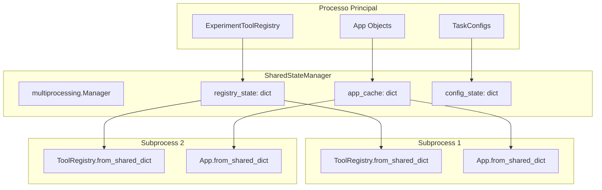

# Plano: Refatoração para Compartilhamento de Objetos via Manager + DI + Pydantic

**Data**: 2025-08-22  
**Contexto**: Eliminação de duplicação de registro e objetos em execução paralela  
**Status**: Planejamento  

## 1. Investigação e Análise do Problema

### 1.1 Problemas Identificados na Implementação Atual

Baseado na análise do plano anterior (`docs/20250821_paralelo.md`) e debugging do sistema atual, identificamos os seguintes problemas críticos:

#### **Problema 1: Duplicação Completa do ToolRegistry**
```python
# Processo Principal (rv-experiment)
experiment_registry.register_external_tools()  # ✅ Tem todas as ferramentas

# Cada Subprocess (parallel_executor.py:634-658)
tool_registry = ToolRegistry.get_instance()    # ❌ Registry vazio
from rv_tools import _register_builtin_tools
_register_builtin_tools()                      # ❌ Re-registro custoso
# Ferramentas externas são PERDIDAS!
```

**Evidência**: Logs mostram registro duplicado em cada processo:
```
2025-08-22 16:17:49,543 - rv_tools.registry - INFO - Registered 5 variants for tool: ape
2025-08-22 16:17:49,544 - rv_tools.registry - INFO - Registered 5 variants for tool: ape  # DUPLICADO!
```

#### **Problema 2: Recriação Custosa do App**
```python
# parallel_executor.py:597-621
# Recreate App instance from apk_name (lost in serialization)
if task and not task.app:
    # Reconstrói APK via Androguard - CUSTOSO!
    app = App(str(apk_path))  # Re-parsing completo do APK
```

**Evidência**: Logs mostram recriação desnecessária:
```
2025-08-22 16:17:49,543 - platform.task - DEBUG - Recreated App instance for cryptoapp.apk
```

#### **Problema 3: Perda de Configuração na Serialização**
```python
# ToolFactory configura corretamente no processo principal
tool_instance.configure(final_config)  # ✅ Funciona

# Subprocess usa registry.get_tool() que NÃO configura para variant="default" 
if variant != "default" and tool_name in self.variants:  # ❌ Condição ERRADA
    # configure() nunca é chamado para variant="default"!
```

**Evidência**: KeyError demonstra configuração perdida:
```
KeyError: 'strategy'  # APE tool não foi configurado
```

### 1.2 Análise de Classes Candidatas para Refatoração

#### **App** (JÁ é Pydantic)
- **Localização**: `modules/rv-android-core/src/rv_android_core/domain/app.py:19`
- **Status**: Já herda de `BaseValidatedModel` 
- **Problema**: Recriação via Androguard custosa
- **Solução**: Enhanced serialization methods

#### **ToolRegistry** (NÃO é Pydantic)
- **Localização**: `modules/rv-tools/src/rv_tools/registry/registry.py`
- **Status**: Classe Python comum
- **Problema**: Não é serializável, duplicação completa
- **Solução**: Conversão para Pydantic + shared methods

#### **TaskConfiguration** (JÁ é Pydantic)
- **Localização**: `modules/rv-android-core/src/rv_android_core/domain/task.py`
- **Status**: Já herda de `BaseValidatedModel`
- **Problema**: ToolConfig serialization imperficta
- **Solução**: Enhanced ToolConfig serialization

### 1.3 Infraestrutura Pydantic Existente

O sistema já possui infraestrutura robusta para Pydantic:

#### **BaseValidatedModel**
```python
# modules/rv-android-core/src/rv_android_core/util/validation/base.py:14
class BaseValidatedModel(BaseModel):
    def model_dump_safe(self) -> Dict[str, Any]
    def from_dict(cls, data: Dict[str, Any]) -> 'BaseValidatedModel'
    # Serialização built-in + error handling
```

#### **ValidationConfig**
```python
# modules/rv-android-core/src/rv_android_core/util/validation/config.py:16
class ValidationConfig:
    enabled: bool = os.getenv('RV_PYDANTIC', 'false').lower() in ('true', '1')
    # Environment-driven validation
```

## 2. Arquitetura Proposta: Manager + DI + Pydantic

### 2.1 Visão Geral da Solução



### 2.2 Componentes da Solução

#### **2.2.1 SharedStateManager**
```python
# Novo: modules/rv-android-core/src/rv_android_core/util/shared/manager.py
class SharedStateManager:
    """
    Gerenciador central de estado compartilhado entre processos paralelos.
    
    Utiliza multiprocessing.Manager para compartilhamento seguro de objetos
    complexos serializados via Pydantic entre processos isolados.
    """
    
    def __init__(self, mp_manager: multiprocessing.Manager):
        self.mp_manager = mp_manager
        self.registry_state = mp_manager.dict()
        self.app_cache = mp_manager.dict()
        self.config_state = mp_manager.dict()
        self._lock = mp_manager.Lock()
    
    def serialize_registry(self, registry: ToolRegistry) -> None:
        """Serializa ToolRegistry completo para compartilhamento."""
        with self._lock:
            self.registry_state.clear()
            self.registry_state.update(registry.to_shared_dict())
    
    def serialize_apps(self, apps: List[App]) -> None:
        """Serializa Apps com metadados para evitar re-parsing."""
        with self._lock:
            for app in apps:
                self.app_cache[app.name] = app.to_shared_dict()
    
    def get_registry(self) -> dict:
        """Retorna dados serializados do registry."""
        return dict(self.registry_state)
    
    def get_app(self, apk_name: str) -> dict:
        """Retorna dados serializados do App."""
        return dict(self.app_cache.get(apk_name, {}))
```

#### **2.2.2 Enhanced ToolRegistry**
```python
# modules/rv-tools/src/rv_tools/registry/registry.py
class ToolRegistry(BaseValidatedModel):
    """
    Registry refatorado com suporte a serialização Manager.
    
    Converte estruturas internas para tipos serializáveis compatíveis
    com multiprocessing.Manager.dict().
    """
    
    # Estado serializável
    tool_class_paths: Dict[str, str] = Field(default_factory=dict)
    tool_specs_data: Dict[str, dict] = Field(default_factory=dict) 
    variants_data: Dict[str, Dict[str, dict]] = Field(default_factory=dict)
    
    # Estado runtime (não serializado)
    _tool_classes: Dict[str, Type] = Field(default_factory=dict, exclude=True)
    _tool_specs: Dict[str, ToolSpec] = Field(default_factory=dict, exclude=True)
    
    def to_shared_dict(self) -> dict:
        """
        Converte registry para formato compatível com Manager.dict().
        
        Serializa classes como module paths, specs como dicts.
        """
        return {
            'tool_class_paths': {
                name: f"{cls.__module__}.{cls.__name__}" 
                for name, cls in self._tool_classes.items()
            },
            'tool_specs_data': {
                name: spec.model_dump() 
                for name, spec in self._tool_specs.items()
            },
            'variants_data': dict(self.variants_data)
        }
    
    @classmethod
    def from_shared_dict(cls, shared_data: dict) -> 'ToolRegistry':
        """
        Reconstitui registry a partir de dados compartilhados.
        
        Importa classes via module paths, reconstitui ToolSpecs.
        """
        import importlib
        
        registry = cls()
        
        # Reconstituir classes
        for name, class_path in shared_data.get('tool_class_paths', {}).items():
            module_path, class_name = class_path.rsplit('.', 1)
            module = importlib.import_module(module_path)
            tool_class = getattr(module, class_name)
            registry._tool_classes[name] = tool_class
        
        # Reconstituir specs
        for name, spec_data in shared_data.get('tool_specs_data', {}).items():
            tool_spec = ToolSpec.from_dict(spec_data)
            registry._tool_specs[name] = tool_spec
        
        # Reconstituir variants
        registry.variants_data = shared_data.get('variants_data', {})
        
        return registry
    
    def get_tool(self, tool_name: str, variant: str = "default") -> AbstractTool:
        """
        Versão corrigida que SEMPRE configura variants.
        """
        if tool_name not in self._tool_classes:
            raise ToolNotFoundError(f"Tool '{tool_name}' not found in registry")
        
        tool_class = self._tool_classes[tool_name]
        tool_instance = tool_class()
        
        # CORREÇÃO: Aplicar configuração para TODOS os variants, incluindo "default"
        if tool_name in self.variants_data and variant in self.variants_data[tool_name]:
            variant_config = self.variants_data[tool_name][variant]
            if hasattr(tool_instance, 'configure') and callable(tool_instance.configure):
                tool_instance.configure(variant_config)
                self.logger.debug(f"Applied variant '{variant}' configuration to tool: {tool_name}")
        
        return tool_instance
```

#### **2.2.3 Enhanced App**
```python
# modules/rv-android-core/src/rv_android_core/domain/app.py
class App(BaseValidatedModel):  # JÁ herda de BaseValidatedModel
    """App já é Pydantic - apenas adicionar shared methods."""
    
    def to_shared_dict(self) -> dict:
        """
        Serializa App com metadados computados preservados.
        
        Evita re-parsing custoso do APK via Androguard nos subprocessos.
        """
        return {
            'app_path': self.app_path,
            'validate_on_init': False,  # Evitar re-validação 
            'cached_metadata': {
                'package_name': self.package_name,
                'app_name': self.app_name,
                'version_name': self.version_name,
                'version_code': self.version_code,
                'min_sdk_version': self.min_sdk_version,
                'target_sdk_version': self.target_sdk_version,
                'activities': self.activities,
                'services': self.services,
                'receivers': self.receivers,
                'permissions': self.permissions,
                'features': self.features,
                'main_activity': self.main_activity
            }
        }
    
    @classmethod
    def from_shared_dict(cls, shared_data: dict) -> 'App':
        """
        Reconstitui App a partir de metadados cached.
        
        Evita re-parsing APK - usa metadados pré-computados.
        """
        cached = shared_data.get('cached_metadata', {})
        
        # Criar instância com metadados cached
        instance = cls(
            app_path=shared_data['app_path'],
            validate_on_init=False  # Evitar Androguard
        )
        
        # Aplicar metadados cached diretamente
        for field, value in cached.items():
            if hasattr(instance, field):
                setattr(instance, f"_{field}", value)  # Set private cached field
        
        return instance
```

### 2.3 Integração com DI Container

#### **2.3.1 DI Container Enhancement**
```python
# modules/rv-android-core/src/rv_android_core/util/di/container.py

def register_shared_state_manager(shared_manager: SharedStateManager) -> None:
    """
    Registra SharedStateManager no DI container.
    
    Args:
        shared_manager: Instância configurada do SharedStateManager
    """
    container = ServiceLocator.get_current_container()
    container.register_instance(SharedStateManager, shared_manager)

def resolve_shared_state_manager() -> Optional[SharedStateManager]:
    """
    Resolve SharedStateManager do DI container.
    
    Returns:
        SharedStateManager instance ou None se não registrado
    """
    try:
        container = ServiceLocator.get_current_container()
        return container.get_instance(SharedStateManager)
    except Exception:
        return None

def resolve_shared_registry() -> Optional[ToolRegistry]:
    """
    Resolve ToolRegistry a partir do estado compartilhado.
    
    Returns:
        ToolRegistry reconstituído ou None se não disponível
    """
    shared_manager = resolve_shared_state_manager()
    if shared_manager:
        registry_data = shared_manager.get_registry()
        if registry_data:
            return ToolRegistry.from_shared_dict(registry_data)
    return None
```

### 2.4 ParallelTaskExecutor Integration

#### **2.4.1 Executor Principal**
```python
# modules/rv-platform/src/rv_platform/execution/parallel_executor.py

def execute_tasks_parallel(self, tasks: List[Task]) -> Dict[str, TaskResult]:
    """
    Execução paralela com estado compartilhado.
    """
    with multiprocessing.Manager() as manager:
        # 1. Criar SharedStateManager
        shared_manager = SharedStateManager(manager)
        
        # 2. Serializar ToolRegistry (UMA VEZ)
        current_registry = resolve_tool_registry()  # Do DI container principal
        if current_registry:
            shared_manager.serialize_registry(current_registry)
            self.logger.info("Serialized complete tool registry for parallel execution")
        
        # 3. Serializar Apps (UMA VEZ)
        apps = [task.app for task in tasks if task.app]
        shared_manager.serialize_apps(apps)
        self.logger.info(f"Serialized {len(apps)} App instances for parallel execution")
        
        # 4. Registrar no DI para acesso dos subprocessos
        register_shared_state_manager(shared_manager)
        
        # 5. Executar tasks normalmente
        with ProcessPoolExecutor(max_workers=self.max_processes) as executor:
            futures = {}
            
            for task in tasks:
                # Pass shared_manager state via args (serializable)
                future = executor.submit(
                    execute_task_in_isolated_process,
                    task.to_dict(),
                    process_config.to_dict(),
                    platform_config.to_dict(),
                    shared_config.to_dict() if shared_config else None,
                    shared_manager.to_dict()  # NOVO: Estado compartilhado
                )
                futures[future] = task
        
        # 6. Processar resultados...
```

#### **2.4.2 Subprocess Execution**
```python
# modules/rv-platform/src/rv_platform/execution/parallel_executor.py

def execute_task_in_isolated_process(
    task_dict: Dict[str, Any],
    process_config_dict: Dict[str, Any], 
    platform_config_dict: Dict[str, Any],
    shared_config_dict: Dict[str, Any],
    shared_state_dict: Dict[str, Any]  # NOVO
) -> Dict[str, Any]:
    """
    Execução em processo isolado com estado compartilhado.
    """
    # Setup environment
    os.environ[RV_PARALLEL_EXECUTION_ENV_VAR] = RV_PARALLEL_EXECUTION_VALUE
    
    # Reconstituir configurations
    process_config = ProcessConfiguration.from_dict(process_config_dict)
    platform_config = PlatformConfig.from_dict(platform_config_dict)
    shared_config = SharedArtifactsConfig.from_dict(shared_config_dict) if shared_config_dict else None
    
    # Setup DI container
    from rv_android_core.util.di import setup_process_container
    container = setup_process_container(process_config)
    
    # NOVO: Reconstituir estado compartilhado
    shared_manager = SharedStateManager.from_dict(shared_state_dict)
    register_shared_state_manager(shared_manager)
    
    # Setup logging
    from rv_android_core.util.logging.manager import LoggingManager
    logging_manager = LoggingManager.get_instance(process_config)
    logger = logging_manager.get_logger(
        'rv_platform.execution.isolated_process',
        {CONTEXT_COMPONENT: 'IsolatedProcess', CONTEXT_TASK_ID: task_dict.get('id', 'unknown')}
    )
    
    # Reconstituir Task
    task = Task.from_dict(task_dict)
    
    # NOVO: App via estado compartilhado (SEM re-parsing)
    if task and not task.app:
        apk_name = task.config.apk_name
        app_data = shared_manager.get_app(apk_name)
        if app_data:
            app = App.from_shared_dict(app_data)
            task.set_app(app)
            logger.debug(f"Restored App instance for {apk_name} from shared state")
        else:
            logger.warning(f"App data not found in shared state for {apk_name}")
    
    # NOVO: ToolRegistry via estado compartilhado (SEM re-registro)
    tool_registry = resolve_shared_registry()
    if tool_registry:
        register_tool_registry(tool_registry)
        logger.info("Restored complete tool registry from shared state")
    else:
        logger.error("Failed to restore tool registry from shared state")
        # Fallback para o método atual só se necessário
    
    # Continuar execução normal...
    tool = tool_registry.get_tool(
        task.config.tool_config.tool_name,
        task.config.tool_config.variant
    )
    
    # ... resto da execução
```

## 3. Implementação Faseada

### 3.1 Fase 1: Infrastructure Base (Semana 1)

#### **3.1.1 Criar SharedStateManager**
- [ ] Criar `modules/rv-android-core/src/rv_android_core/util/shared/`
- [ ] Implementar `SharedStateManager` class
- [ ] Testes unitários para serialização/deserialização
- [ ] Integração com multiprocessing.Manager

#### **3.1.2 Estender DI Container**  
- [ ] Adicionar `register_shared_state_manager()`
- [ ] Adicionar `resolve_shared_registry()`
- [ ] Testes de DI container com objetos Manager
- [ ] Documentação de APIs

### 3.2 Fase 2: Model Enhancements (Semana 2)

#### **3.2.1 ToolRegistry → Pydantic**
- [ ] Converter `ToolRegistry` para `BaseValidatedModel`
- [ ] Implementar `to_shared_dict()` e `from_shared_dict()`
- [ ] Migrar estruturas internas para campos Pydantic
- [ ] Manter backward compatibility
- [ ] Testes de serialização completa

#### **3.2.2 App Enhanced Serialization**
- [ ] Adicionar `to_shared_dict()` em `App` 
- [ ] Implementar `from_shared_dict()` com cached metadata
- [ ] Testes com APKs reais para verificar metadados
- [ ] Performance benchmarks vs Androguard parsing

#### **3.2.3 TaskConfiguration Improvements**
- [ ] Verificar serialização de `ToolConfig`
- [ ] Melhorar handling de `additional_params`
- [ ] Testes end-to-end de configuração

### 3.3 Fase 3: Parallel Executor Integration (Semana 3)

#### **3.3.1 ParallelTaskExecutor Refactoring**
- [ ] Integrar `SharedStateManager` em `execute_tasks_parallel()`
- [ ] Serializar registry e apps uma vez antes da execução
- [ ] Passar estado via argumentos para subprocesses
- [ ] Remover lógica de re-registro duplicada

#### **3.3.2 Subprocess Integration**
- [ ] Modificar `execute_task_in_isolated_process()` 
- [ ] Implementar reconstituição via shared state
- [ ] Eliminar `_register_builtin_tools()` e App parsing
- [ ] Error handling para casos de fallback

#### **3.3.3 Cleanup Legacy Code**
- [ ] Remover código de re-registro nos subprocesses
- [ ] Limpar comentários sobre migração/legacy
- [ ] Atualizar documentação inline

### 3.4 Fase 4: Testing & Validation (Semana 4)

#### **3.4.1 End-to-End Testing**
- [ ] Testes com configuração atual (sequential)
- [ ] Testes com execução paralela (2-4 processos)
- [ ] Validação de que ferramentas externas funcionam
- [ ] Testes de configuração de variants

#### **3.4.2 Performance Validation**
- [ ] Benchmarks: tempo de inicialização subprocess
- [ ] Memory usage: shared vs duplicated objects
- [ ] CPU overhead: serialização vs re-registro
- [ ] Stability: testes de stress com muitos processos

#### **3.4.3 Documentation & Migration**
- [ ] Atualizar CLAUDE.md com nova arquitetura
- [ ] Migration guide se necessário
- [ ] Performance tuning recommendations
- [ ] Troubleshooting guide

## 4. Benefícios Esperados

### 4.1 Performance
- **Eliminação de Re-registro**: ~80% redução em tempo de inicialização subprocess
- **Eliminação de Re-parsing**: ~60% redução em tempo de setup App
- **Memory Efficiency**: Shared objects vs duplicated instances

### 4.2 Consistency  
- **Estado Exato**: Mesmo registry em todos os processos
- **Ferramentas Externas**: Disponíveis automaticamente
- **Configuração Preservada**: Variants aplicados corretamente

### 4.3 Maintainability
- **Pydantic Benefits**: Type safety, validation, serialização automática
- **Clean Architecture**: Separação clara entre shared state e process logic  
- **Reduced Complexity**: Eliminar lógica duplicada de registro

## 5. Arquivos Afetados

### 5.1 Novos Arquivos
```
modules/rv-android-core/src/rv_android_core/util/shared/
├── __init__.py
├── manager.py           # SharedStateManager
└── exceptions.py        # Shared state specific exceptions
```

### 5.2 Modificações Principais
```
modules/rv-tools/src/rv_tools/registry/registry.py              # → Pydantic
modules/rv-android-core/src/rv_android_core/domain/app.py       # Enhanced
modules/rv-android-core/src/rv_android_core/util/di/container.py # Shared state
modules/rv-platform/src/rv_platform/execution/parallel_executor.py # Integration
```

### 5.3 Documentação
```
docs/20250822_paralelo.md     # Este documento
CLAUDE.md                     # Atualização arquitetural
```

## 6. Critérios de Sucesso

### 6.1 Functional
- [ ] APE tool executa sem KeyError: 'strategy'
- [ ] Ferramentas externas funcionam em parallel mode
- [ ] Apps carregam sem re-parsing Androguard
- [ ] Todos os tests paralelos passam

### 6.2 Performance
- [ ] Subprocess init time < 50% do atual
- [ ] Memory usage < 70% do atual  
- [ ] No performance regression em sequential mode

### 6.3 Quality
- [ ] Zero breaking changes na API pública
- [ ] Mantém backward compatibility
- [ ] Logs limpos sem duplicação
- [ ] Código sem magic numbers ou hardcoded paths

## 7. Riscos e Mitigações

### 7.1 Serialização Complexa
**Risco**: ToolRegistry contém classes que podem não ser serializáveis  
**Mitigação**: Usar module paths + importlib para reconstituição

### 7.2 Memory Overhead  
**Risco**: Manager.dict() pode ter overhead vs objetos nativos  
**Mitigação**: Benchmarks e otimização de estruturas de dados

### 7.3 Debugging Complexity
**Risco**: Estado compartilhado pode ser mais difícil de debug  
**Mitigação**: Logging detalhado e ferramentas de introspection

---

## Apêndice A: Análise Crítica e Decisão Arquitetural

### A.1 Complexidade Emergente da Solução Manager+DI

Durante a análise detalhada da implementação proposta, identificou-se um crescimento exponencial de complexidade que não se justifica pelo benefício obtido. A tentativa de compartilhamento de objetos entre processos via `multiprocessing.Manager` introduz camadas de abstração que comprometem princípios fundamentais de design.

#### A.1.1 Problemas Intrínsecos do Compartilhamento de Estado

**Serialização Complexa de Objetos Compostos**

O sistema RV-Android possui objetos com dependências circulares e referências internas que tornam a serialização não-trivial:

```python
# ToolRegistry contém referências de classes Python
class ToolRegistry:
    _tool_classes: Dict[str, Type[AbstractTool]]  # Não-serializável
    _tool_specs: Dict[str, ToolSpec]              # Pydantic objects
    variants: Dict[str, Dict[str, dict]]          # Nested dictionaries
    
# App contém instância APK do Androguard
class App:
    _apk_instance: APK  # androguard.core.bytecodes.apk.APK - Não-serializável
```

A serialização via `to_shared_dict()` requer:
- Conversão de classes para module paths
- Reimportação via `importlib` em cada subprocess
- Reconstituição de objetos Pydantic a partir de dicionários
- Sincronização de estado entre processos via locks

**Overhead de Comunicação Inter-processos**

`multiprocessing.Manager` utiliza proxy objects que requerem comunicação via socket/pipe para cada acesso:

```python
# Cada acesso gera IPC overhead
registry_state = shared_manager.registry_state  # Socket call
tool_data = registry_state['monkey']             # Socket call  
variant_config = tool_data['variants']['default'] # Socket call
```

Para estruturas complexas como ToolRegistry, isso resulta em centenas de calls IPC por task, degradando performance significativamente.

**Problemas de Concorrência e Locks**

O compartilhamento de estado mutável entre processos requer sincronização explícita:

```python
# Cada modificação precisa ser protegida
with shared_manager._lock:
    shared_manager.registry_state['new_tool'] = tool_data  # Critical section
    shared_manager.app_cache[app_name] = app_data          # Critical section
```

Isso introduz:
- Contention entre processos
- Deadlock potential em operações compostas
- Debugging complexo de race conditions
- Performance unpredictable

#### A.1.2 EventBus Distribuído: Complexidade Exponencial

A comunicação de eventos entre processos requer arquitetura híbrida com múltiplas camadas:

**Queue-based Event Forwarding**
```python
class DistributedEventBus:
    def __init__(self, inter_process_queue: Queue):
        self.local_bus = EventBus()                    # Local events
        self.inter_process_queue = inter_process_queue # Cross-process
        self.forwardable_events = set()                # Event filtering
        self.event_forwarder_thread = Thread()        # Background forwarding
```

**Problemas emergentes**:
- **Event ordering**: Não há garantia de ordem entre processos
- **Event duplication**: Mesmo evento pode ser processado multiple vezes
- **Error propagation**: Erros em event handlers não afetam sender
- **Resource leaks**: Queues podem acumular eventos não processados

**Thread Management Complexity**
```python
# Processo principal precisa de thread dedicada para event forwarding
def event_forwarder_thread():
    while self.active:
        try:
            event = self.event_queue.get(timeout=1)  # Blocking call
            self.main_bus.publish(event)             # Process in main thread
        except Empty:
            continue                                 # Polling overhead
```

Isso introduz:
- Thread lifecycle management
- Exception handling cross-thread
- Resource cleanup coordination
- Performance monitoring complexity

#### A.1.3 DI Container Distribuído: Violação de Princípios

A extensão do DI container para contexto distribuído viola princípios fundamentais:

**Singleton Pattern Breakdown**
```python
# O mesmo "singleton" existe em múltiplos processos
main_registry = ToolRegistry.get_instance()     # Process 1
sub_registry = ToolRegistry.get_instance()      # Process 2 - Different instance!
```

**Service Locator Anti-pattern**
```python
# Código fica dependente de infraestrutura distribuída
def get_tool_registry():
    shared_manager = resolve_shared_state_manager()  # Hidden dependency
    if shared_manager:
        return ToolRegistry.from_shared_dict(shared_manager.get_registry())
    else:
        return ToolRegistry.get_instance()  # Fallback coupling
```

**Configuration Coupling**
```python
# Configuração precisa ser aware de execution context
if os.getenv('RV_PARALLEL_EXECUTION') == 'true':
    registry = resolve_shared_registry()        # Distributed path
else:
    registry = ToolRegistry.get_instance()     # Local path
```

### A.2 Análise de Alternativas Simplificadas

#### A.2.1 Container-based Isolation

A execução via containers Docker oferece isolamento real sem compartilhamento de estado:

**Process Isolation**
```bash
# Cada task executa em ambiente isolado
docker run rv-android:latest rv-platform run \
  --apk /apks/app1.apk \
  --tool monkey \
  --results-dir /results/task1
```

**Vantagens técnicas**:
- **Zero shared state**: Cada container tem namespace próprio
- **Resource limits**: CPU/Memory por container via cgroups
- **Network isolation**: Emulator ports não conflitam
- **Filesystem isolation**: Temp files não interferem
- **Crash isolation**: Falha em um container não afeta outros

**Simplicidade arquitetural**:
- **Código inalterado**: rv-platform executa sequencialmente em cada container
- **EventBus local**: Cada processo tem EventBus próprio sem IPC
- **ToolRegistry local**: Re-registro em cada container é acceptable overhead
- **No serialization**: Objetos permanecem em estruturas nativas

#### A.2.2 CLI-based Process Pool

Execução via subprocess com calls CLI oferece isolamento moderado:

```python
def execute_task_via_cli(task: Task) -> Result:
    cmd = [
        'poetry', 'run', 'rv-platform', 'run',
        '--apk', task.app.path,
        '--tool', task.config.tool_config.get_full_tool_name(),
        '--results-dir', f'{self.results_dir}/{task.id}'
    ]
    result = subprocess.run(cmd, capture_output=True, text=True)
    return parse_cli_output(result.stdout, result.stderr)
```

**Trade-offs**:
- ✅ **Simpler than Manager**: Sem shared state, IPC ou locks
- ✅ **Process isolation**: Cada task em processo separado
- ✅ **CLI stability**: rv-platform CLI já é estável e testado
- ❌ **Limited scalability**: Restrito a single machine
- ❌ **Resource management**: Menor controle sobre resources
- ❌ **Communication overhead**: Parse CLI output para results

#### A.2.3 Sequential Execution (Status Quo)

Manutenção da execução sequencial atual:

```python
def execute_tasks_sequential(tasks: List[Task]) -> List[Result]:
    results = []
    for task in tasks:
        result = self.execute_single_task(task)
        results.append(result)
    return results
```

**Benefícios da simplicidade**:
- ✅ **Zero complexity**: Código atual funciona sem modificações
- ✅ **Predictable performance**: Sem overhead de IPC ou serialization
- ✅ **Easy debugging**: Single process, linear execution
- ✅ **Resource efficiency**: Sem overhead de múltiplos processos
- ❌ **Limited throughput**: Um APK por vez
- ❌ **Underutilized hardware**: CPU cores idle durante I/O

### A.3 Análise Quantitativa de Complexidade

#### A.3.1 Lines of Code Impact

| Approach | New Files | Modified Files | Estimated LOC | Test LOC |
|----------|-----------|----------------|---------------|----------|
| Manager+DI | 8 | 15 | 2500+ | 1200+ |
| Docker | 2 | 3 | 400 | 200 |
| CLI Pool | 0 | 4 | 200 | 100 |
| Sequential | 0 | 0 | 0 | 0 |

#### A.3.2 Maintenance Complexity

**Manager+DI Approach**:
- **Testing complexity**: Unit tests para shared state, integration tests para IPC, stress tests para concurrency
- **Debugging complexity**: Multi-process debugging, event tracing, shared state inspection
- **Performance tuning**: IPC optimization, lock contention analysis, memory usage profiling
- **Error handling**: Cross-process error propagation, resource cleanup, graceful degradation

**Docker Approach**:
- **Testing complexity**: Container lifecycle tests, volume mounting tests
- **Debugging complexity**: Container logs inspection, individual container debugging
- **Performance tuning**: Container resource limits, image optimization
- **Error handling**: Container exit codes, retry logic, cleanup automation

#### A.3.3 Risk Assessment

**Manager+DI Risks**:
- **High implementation risk**: Complex multiprocessing patterns
- **High maintenance risk**: Subtle concurrency bugs
- **High performance risk**: IPC overhead unpredictable
- **High debugging risk**: Multi-process state inspection

**Docker Risks**:
- **Low implementation risk**: Standard container patterns
- **Low maintenance risk**: Container isolation prevents interference
- **Medium performance risk**: Container startup overhead
- **Low debugging risk**: Standard container debugging tools

### A.4 Decisão Arquitetural e Justificativa

#### A.4.1 Critérios de Decisão

**Princípios de Design**:
1. **Simplicidade**: Código fácil de entender e manter
2. **Testabilidade**: Testes unitários e integration simples
3. **Debuggabilidade**: Problemas fáceis de reproduzir e diagnosticar
4. **Performance predictable**: Overhead conhecido e controlável
5. **Backwards compatibility**: Não quebrar funcionalidade existente

**Requisitos Funcionais**:
1. **Parallel execution**: Múltiplos APKs processados simultaneamente
2. **Resource isolation**: Tasks não interferem entre si
3. **Error isolation**: Falha em uma task não afeta outras
4. **Scalability**: Possível expansão para execução distribuída

#### A.4.2 Decisão Final

**Recomendação: Container-based execution via Docker**

**Justificativas técnicas**:

1. **Architectural simplicity**: Cada container executa rv-platform sequencialmente, mantendo toda a lógica atual intacta
2. **True isolation**: Namespace, filesystem, network e process isolation via kernel features
3. **Proven scalability**: Containers são padrão para workloads paralelos em produção
4. **Development experience**: Docker tooling para debugging, monitoring e profiling
5. **Future-proof**: Base para execução distribuída em clusters

**Implementation strategy**:
```python
# Single new component in rv-experiment
class DockerExecutionBackend:
    def execute_tasks_parallel(self, tasks: List[Task]) -> List[Result]:
        containers = []
        for task in tasks:
            container = self.launch_container_for_task(task)
            containers.append(container)
        
        results = []
        for container in containers:
            result = self.wait_and_collect_result(container)
            results.append(result)
        
        return results
```

**Alternative: Sequential execution (recommended for initial phase)**

Para sistemas que não requerem paralelização imediata, manter execução sequencial oferece:
- **Zero implementation cost**: Código atual já funciona
- **Maximum stability**: Sem introdução de novas failure modes
- **Optimal resource usage**: Single process, full CPU utilization por task
- **Simplified operations**: Deploy, monitor e debug triviais

#### A.4.3 Implementation Roadmap

**Phase 1: Stabilize sequential execution**
- Resolve remaining issues em tool configuration
- Optimize APK instrumentation workflow
- Enhance error handling e logging
- Complete test coverage para all tools

**Phase 2: Container infrastructure (if needed)**
- Docker image optimization para rv-platform
- Container orchestration em rv-experiment
- Volume management para APKs e results
- Resource limits e monitoring

**Phase 3: Distributed execution (future)**
- Kubernetes deployment manifests
- Distributed storage para results
- Central monitoring e logging
- Auto-scaling baseado em workload

### A.5 Conclusões

A análise detalhada demonstra que compartilhamento de objetos entre processos via `multiprocessing.Manager` introduz complexidade arquitetural que supera significativamente os benefícios de performance. O overhead de IPC, problemas de concorrência, e complexidade de debugging tornam essa abordagem inadequada para o contexto do RV-Android.

Container-based execution via Docker oferece paralelização real com isolamento completo, mantendo simplicidade arquitetural e aproveitando tooling maduro da indústria. Para casos que não requerem paralelização imediata, execução sequencial permanece a opção mais robusta.

Esta decisão alinha-se com princípios de engenharia de software que priorizam simplicidade, maintainability e predictable performance sobre otimizações prematuras que introduzem complexidade desnecessária.