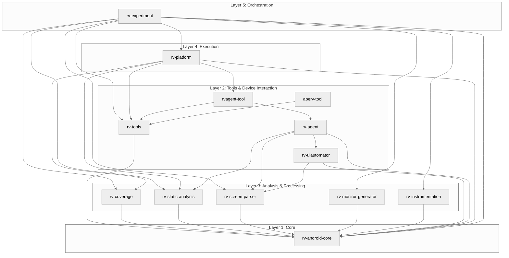
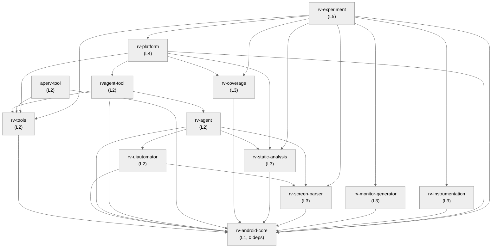
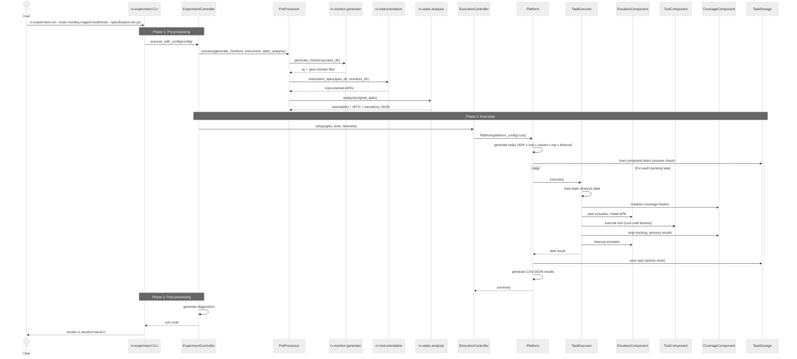
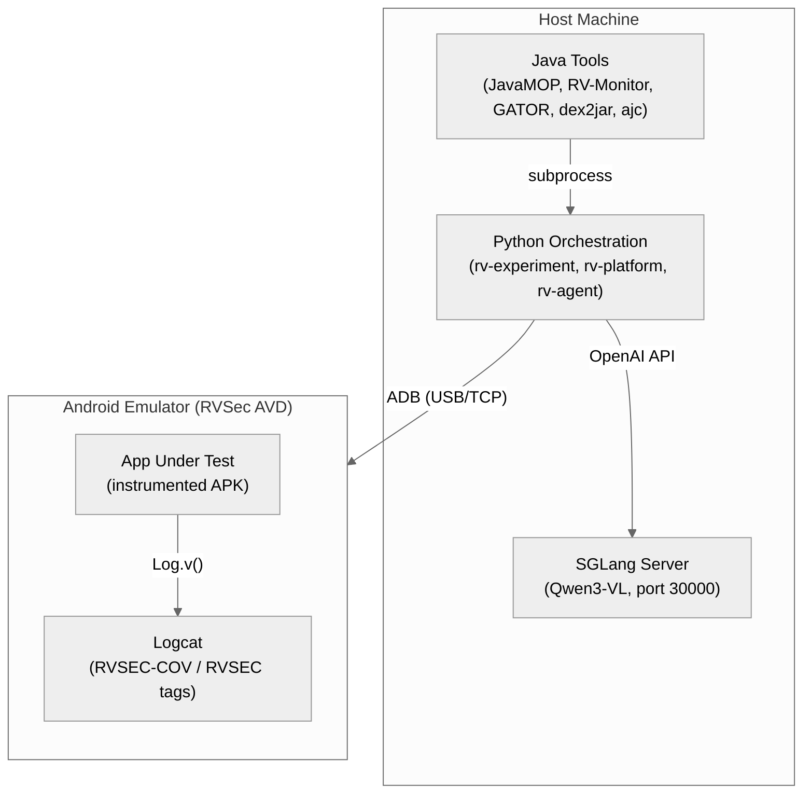

# RV-Android Project Architecture

## 1. Overview

RV-Android is a modular framework for runtime verification of Android applications, developed as part of a PhD thesis at the University of Brasilia (UnB). The framework combines static analysis, dynamic testing, formal verification through Monitoring-Oriented Programming (MOP), and LLM-guided exploration to detect violations in Android applications. It instruments APKs with runtime monitors generated from formal property specifications, then exercises the application using automated testing tools to trigger and detect property violations.

The framework is built as a **uv workspace** with 14 Python modules, each with a well-defined responsibility. A single `uv sync` at the project root installs all modules in editable mode, so source changes take effect immediately without reinstallation.

### Purpose

RV-Android addresses three research questions:
1. How to apply runtime verification techniques to Android applications at scale
2. How to use LLM-driven exploration to improve coverage of monitored operations
3. How to compare and calibrate different testing strategies for maximum effectiveness

### Target Audience

This document is intended for developers and researchers who need to understand the system as a whole. For module-level details, see the individual architecture documents linked in Section 14.

---

## 2. Key Architectural Decisions

| Decision | Choice | Rationale |
|----------|--------|-----------|
| **Workspace Management** | uv workspace with `modules/*` members | Single lockfile, shared `.venv`, editable installs. Enables independent module development with coordinated dependencies. |
| **Modular Decomposition** | 14 modules grouped by layer | Each module has a single responsibility, clear dependencies, and can be tested independently. Layers enforce dependency direction. |
| **Component-Based Execution** | Pluggable `ITaskComponent` pipeline | Task execution concerns (emulator, coverage, logcat, static analysis, tool invocation) are isolated into components with a uniform lifecycle (`initialize`/`execute`/`cleanup`). |
| **Three-Phase Workflow** | Pre-process, Execute, Post-process | Experiment workflow has a natural ordering: prepare artifacts (monitors, instrumented APKs, static analysis), execute testing tasks, generate diagnostics. |
| **Tool Plugin System** | `ToolRegistry` + `ToolFactory` + `AbstractTool` | Tools are registered at import time, discovered via registry, and instantiated via factory with variant configuration. Adding a tool requires no modification to platform code. |
| **Validation Strategy** | Environment-aware Pydantic (`RV_PYDANTIC`) | Full validation during development, minimal overhead in production. `BaseValidatedModel` provides the common base for all domain entities. |
| **LLM Integration** | LangGraph workflow with SGLang backend | Workflow orchestration via LangGraph state machine; Qwen3-VL vision-language model accessed through OpenAI-compatible API. |
| **Error Handling** | Registry-based dispatch via `ErrorHandler` | Singleton handler with 16 registered callbacks classifies exceptions into absorbed (operation continues) or propagated (exception re-raised) categories. |
| **Persistence** | File-based JSON with atomic writes | `TaskStorage` uses write-to-temp-then-rename for crash recovery and experiment resume, avoiding database dependencies. |
| **Distribution** | Host machine + Android emulator | Python orchestration runs on the host; testing tools interact with the application running inside an Android emulator via ADB. |

---

## 3. Architectural Patterns

### Pattern: Layered Architecture

The 13 modules are organized into 5 layers with strict dependency direction (higher layers depend on lower layers, never the reverse).

| Layer | Modules | Responsibility |
|-------|---------|----------------|
| **L5 - Orchestration** | rv-experiment | Experiment coordination |
| **L4 - Execution** | rv-platform | Task generation, execution pipeline, result processing |
| **L3 - Analysis** | rv-coverage, rv-static-analysis, rv-screen-parser, rv-monitor-generator, rv-instrumentation | Domain-specific analysis and processing |
| **L2 - Tools** | rv-tools, rv-uiautomator, rv-agent, rvagent-tool, aperv-tool | Testing tools and device interaction |
| **L1 - Core** | rv-android-core | Foundation: domain models, error handling, logging, validation |

### Pattern: Component-Based Execution

`TaskExecutor` registers pluggable components (`ITaskComponent`) that handle specific execution concerns. Components follow a three-phase lifecycle and execute in a fixed order around the emulator session boundary:

- **Phase 1** (outside emulator): Static analysis data loading, coverage initialization
- **Phase 2** (emulator session): App installation, logcat capture, coverage tracking, tool execution
- **Phase 3** (cleanup): Coverage processing, logcat export, component cleanup

### Pattern: Factory + Registry

`ToolRegistry` stores tool classes, specifications, and variant configurations. `ToolFactory` resolves variants, merges parameters, and produces configured `AbstractTool` instances. External tools (rvagent, aperv) register lazily on module import via rv-platform's `__init__.py`.

### Pattern: Template Method

`AbstractTool.execute()` implements the invariant execution lifecycle (logging, timeout conversion, process cleanup, error handling) and delegates to `execute_tool_specific_logic()` which each tool implements.

### Pattern: Facade

Both `Platform.run()` and `ExperimentController.run()` hide multi-step workflows behind single entry points. Callers need only a configuration object and a `run()` call.

### Pattern: Adapter

`ExecutionController` translates `ExperimentConfig` into `PlatformConfig`, bridging the experiment-layer vocabulary with the platform-layer vocabulary without coupling either module to the other's internal format.

---

## 4. Logical View

### Module Ecosystem



### Key Abstractions

| Abstraction | Module | Purpose |
|-------------|--------|---------|
| `BaseValidatedModel` | rv-android-core | Pydantic base class for all domain entities; environment-aware validation |
| `AbstractTool` | rv-android-core | Template method defining the tool execution lifecycle |
| `ITaskComponent` | rv-platform | ABC defining the component lifecycle contract (initialize/execute/cleanup) |
| `ITaskStorage` | rv-platform | ABC defining the task persistence contract |
| `ExplorationStrategy` | rv-agent | ABC defining the exploration algorithm contract (select_next_action, record_transition, should_backtrack) |
| `Scorer` | rv-agent | ABC for action ranking scorers; 9 implementations compose action priorities |
| `BaseAnalyzer[T]` | rv-android-core | Generic ABC for analysis components with static data initialization |
| `AbstractScreenVisitor` | rv-screen-parser | Visitor pattern ABC for UI tree traversal with pluggable output formats |

---

## 5. Development View

### Project Directory Structure

```
rv-android/
├── pyproject.toml              # Workspace root: declares all 13 module members
├── uv.lock                     # Shared lockfile for all modules
├── CLAUDE.md                   # Project-wide development guide
├── modules/
│   ├── rv-android-core/        # L1: Foundation infrastructure
│   ├── rv-tools/               # L2: Tool registry and plugin system
│   ├── rv-uiautomator/         # L2: Shared UIAutomator components
│   ├── rv-agent/               # L2: LLM-driven testing agent
│   ├── rvagent-tool/           # L2: rv-agent wrapper for rv-platform
│   ├── aperv-tool/             # L2: APE-RV tool wrapper
│   ├── rv-coverage/            # L3: Coverage analysis and tracking
│   ├── rv-static-analysis/     # L3: GATOR-based static analysis
│   ├── rv-screen-parser/       # L3: Android UI parsing
│   ├── rv-monitor-generator/   # L3: JavaMOP/RV-Monitor integration
│   ├── rv-instrumentation/     # L3: APK instrumentation pipeline
│   ├── rv-platform/            # L4: Central execution engine
│   └── rv-experiment/          # L5: Experiment orchestration
├── apks_examples/              # Source APKs for testing
├── results/                    # Persistent experiment results
├── out/                        # Temporary artifacts (monitors, instrumented APKs)
├── docker/                     # Docker configuration for parallel execution
├── openspec/                   # Spec-Driven Development artifacts
├── docs/                       # Project documentation
└── .claude/                    # Claude Code skills and configuration
```

### Module Dependency Graph



### Build Dependencies Summary

| Module | Internal Dependencies | Key External Dependencies |
|--------|----------------------|--------------------------|
| rv-android-core | None | pydantic, androguard, psutil, networkx |
| rv-tools | rv-android-core | pydantic |
| rv-uiautomator | rv-android-core, rv-screen-parser | uiautomator2, pillow |
| rv-screen-parser | rv-android-core | lxml, beautifulsoup4, uiautomator2, pytesseract, opencv, pillow |
| rv-coverage | rv-android-core | regex, python-dateutil |
| rv-static-analysis | rv-android-core | pydantic |
| rv-monitor-generator | rv-android-core | pydantic |
| rv-instrumentation | rv-android-core | pydantic |
| rv-agent | rv-android-core, rv-screen-parser, rv-uiautomator, rv-static-analysis | langchain, langgraph, scipy, faker, pillow, httpx |
| rvagent-tool | rv-android-core, rv-agent, rv-tools | pydantic |
| aperv-tool | rv-android-core, rv-tools | -- |
| rv-platform | rv-android-core, rv-tools, rv-coverage, rv-static-analysis, rvagent-tool | pydantic, pandas |
| rv-experiment | rv-platform, rv-android-core, rv-tools, rv-monitor-generator, rv-instrumentation, rv-static-analysis, rv-coverage, rv-screen-parser | pydantic, matplotlib |

---

## 6. Process View

### End-to-End Experiment Execution



### Concurrency Model

RV-Android executes tasks sequentially on a single machine. The primary concurrency boundary is between the host (Python orchestration) and the Android emulator (app execution via ADB). Within rv-agent, a background thread in `CoverageTracker` monitors logcat output during tool execution. Docker-based parallel execution is supported by running multiple containers, each with its own emulator instance on different ports.

---

## 7. Physical View

### Deployment Topology



### Hardware Requirements

| Component | Requirement |
|-----------|-------------|
| Host CPU | 4+ cores (emulator + Python + optional SGLang) |
| Host RAM | 16 GB minimum (emulator: 4 GB, SGLang: 8 GB for 4B model) |
| GPU | Required only for SGLang (Qwen3-VL inference) |
| Storage | 50 GB (Android SDK, APKs, results) |
| Android SDK | Platform 29+ with system images |

---

## 8. Module Descriptions

Brief descriptions of each module's role. For detailed architecture, see module-level documentation.

### Layer 1: Core

**rv-android-core** -- Foundation library with zero internal dependencies. Provides domain models (`Task`, `App`, `ToolConfig`, `CoverageMetrics`, `LogcatRepository`), error handling (`ErrorHandler` singleton with 23-type exception hierarchy), logging (`LoggingManager`), command execution (`Command` with process tree management), tool contract (`AbstractTool` template method), and Pydantic validation (`BaseValidatedModel`). Fan-in: all 12 other modules depend on it.

### Layer 2: Tools & Device Interaction

**rv-tools** -- Tool registry and plugin system. `ToolRegistry` (singleton) stores tool classes and variants. `ToolFactory` creates configured instances. Ships 8 built-in tools (Monkey, DroidBot, APE, FastBot, ARES, DroidMate, Humanoid, QTesting) with multiple variants each.

**rv-uiautomator** -- Shared UIAutomator components. `UIAdapter` abstract interface with `UIAutomator2Adapter` implementation. `UIAutomatorActionExecutor` translates actions to device commands. `StateConverter` bridges UIAutomator and DroidBot state formats.

**rv-agent** -- LLM-driven testing agent using LangGraph for workflow orchestration. Supports three modes: `pure_algorithm` (DFS-based exploration with 9-scorer action ranking), `llm_only` (Qwen3-VL vision-language model), and `multimode` (70/30 hybrid). Includes memory systems, WTG-guided navigation, MOP prioritization, successor tracking, plateau detection, and proactive backtracking.

**rvagent-tool** -- Thin wrapper that implements `AbstractTool` for rv-agent, enabling it to run as a tool within rv-platform's task execution pipeline.

**aperv-tool** -- Wrapper for APE with runtime verification extensions.

### Layer 3: Analysis & Processing

**rv-coverage** -- Real-time coverage tracking during tool execution. `CoverageTracker` monitors logcat for `RVSEC-COV` (method calls) and `RVSEC` (property violations) entries. Calculates method, activity, and MOP coverage metrics incrementally.

**rv-static-analysis** -- Runs unified GATOR-based static analysis on APKs. Produces a single JSON with three sections: reachability (method-level MOP flags), windows (UI widgets and event listeners), and transitions (Window Transition Graph). Parser recovers partial data when analysis times out. Provides navigation guidance data to rv-agent.

**rv-screen-parser** -- Parses Android UI hierarchy (UIAutomator XML, DroidBot JSON) into `ScreenDescription` objects using the visitor pattern. Three visitor implementations (Basic, Default, Enhanced) produce different output formats. Screenshot analysis subsystem uses OpenCV and Tesseract for visual element detection.

**rv-monitor-generator** -- Generates runtime verification monitors from MOP specifications using JavaMOP and RV-Monitor. Produces AspectJ aspects (`.aj`) and Java monitor classes (`.java`) consumed by rv-instrumentation. Supports JCA (23 specs) and generic (118+ specs) specification sets.

**rv-instrumentation** -- Instruments APKs by weaving generated monitors into bytecode. Pipeline: decompile (dex2jar), inject monitors (AspectJ), recompile (d8), sign (jarsigner). Produces instrumented APKs that log coverage events and property violations via logcat.

### Layer 4: Execution

**rv-platform** -- Central execution engine. Discovers APKs, generates task combinations (APK x tool x variant x repetition x timeout), manages the component-based execution pipeline, and produces standardized CSV/JSON results. `TaskStorage` provides atomic persistence for crash recovery and experiment resume. Supports both CLI and programmatic usage.

### Layer 5: Orchestration

**rv-experiment** -- Top-level experiment orchestration. Three-phase workflow: pre-processing (monitor generation, instrumentation, static analysis), execution (delegation to rv-platform), post-processing (diagnostics). CLI interface (`rv-experiment` command) for experiment automation. Supports Docker-based parallel execution.

---

## 9. NFR Support

| NFR | Architectural Support |
|-----|-----------------------|
| **Maintainability** | 13 fine-grained modules with single responsibilities. Each module has its own `pyproject.toml`, tests, and documentation. Component-based execution isolates concerns. Clear layer boundaries prevent tangled dependencies. |
| **Extensibility** | Tool plugin system allows adding tools without modifying platform code. `ITaskComponent` allows adding execution phases. `ExplorationStrategy` and `Scorer` ABCs allow adding exploration algorithms and ranking criteria. Specification sets are directory-based and extensible. |
| **Testability** | All domain models are Pydantic-based with factory methods. Environment-aware validation can be toggled for tests. Dependency injection in rv-agent enables full unit testing. Each module has independent test suites. Test categories: unit, integration, smoke, online, performance, regression. |
| **Reliability** | `ErrorHandler` classifies 23 exception types into absorbed vs propagated categories. `TaskStorage` uses atomic writes for crash recovery. Experiment resume skips completed tasks. Pre-processing failures do not block execution (graceful degradation). Tool timeouts are treated as successful completion. |
| **Reproducibility** | `ExperimentConfig` and `PlatformConfig` are saved as JSON in results directories. `ExperimentMetadata` stores config checksums for continuation compatibility. Deterministic task generation from configuration. |
| **Performance** | Static analysis and coverage initialization run outside the emulator session. rv-android-core validation is disabled in production (`RV_PYDANTIC`). Lazy imports for optional modules. |

### Key Trade-off: Performance vs Safety

Full Pydantic validation runs during development (`RV_PYDANTIC=true`). In production, validation is minimal. This trade-off is controlled by a single environment variable and applies uniformly across all modules through `BaseValidatedModel`.

---

## 10. Key Interfaces

### AbstractTool (Tool Contract)

Defined in rv-android-core, implemented by all testing tools:

```python
class AbstractTool(ABC):
    def execute(self, task: Task, app: App) -> None:
        """Template method: log -> delegate -> cleanup -> handle errors."""

    @abstractmethod
    def execute_tool_specific_logic(self, task: Task, app: App) -> None: ...

    @classmethod
    @abstractmethod
    def get_variants(cls) -> Dict[str, Dict[str, Any]]: ...

    @abstractmethod
    def configure(self, config: Dict[str, Any]) -> None: ...

    @classmethod
    @abstractmethod
    def get_tool_spec(cls) -> ToolSpec: ...
```

### ITaskComponent (Execution Component Contract)

Defined in rv-platform, implemented by 5 execution components:

```python
class ITaskComponent(ABC):
    @abstractmethod
    def initialize(self, context: Dict[str, Any]) -> bool: ...

    @abstractmethod
    def execute(self, context: Dict[str, Any]) -> bool: ...

    @abstractmethod
    def cleanup(self, context: Dict[str, Any]) -> bool: ...

    @property
    @abstractmethod
    def name(self) -> str: ...
```

### ExplorationStrategy (Agent Strategy Contract)

Defined in rv-agent, implemented by RVAgentStrategy, DFSStrategy, BFSStrategy, GreedyStrategy:

```python
class ExplorationStrategy(ABC):
    @abstractmethod
    def select_next_action(self, current_hash: str, screen_desc: ScreenDescription) -> Optional[ItemAction]: ...

    @abstractmethod
    def record_transition(self, from_hash: str, to_hash: str, action: ItemAction): ...

    @abstractmethod
    def should_backtrack(self, current_hash: str) -> bool: ...
```

---

## 11. Scenarios

### Scenario 1: Run a Full Experiment

**Description**: Researcher executes a complete experiment with monitor generation, APK instrumentation, static analysis, and multi-tool testing.

**Flow**:
1. User runs `rv-experiment run --tools monkey,rvagent:multimode --specification-set jca --apks-dir ./apks/`
2. PreProcessor generates monitors from 23 JCA `.mop` specs, instruments APKs, runs GATOR static analysis on original APKs
3. ExecutionController creates `PlatformConfig` and delegates to `Platform`
4. Platform generates tasks (e.g., 10 APKs x 2 tools x 1 rep = 20 tasks)
5. For each task: emulator boots, APK installs, tool runs until timeout, coverage and violations are tracked via logcat
6. ResultProcessorComponent generates `coverage.csv`, `errors.csv`, `summary.csv`, `results.json`
7. PostProcessor generates diagnostics

### Scenario 2: Resume an Interrupted Experiment

**Description**: An experiment is interrupted after completing 12 of 20 tasks. The user re-runs the same command.

**Flow**:
1. User runs the same `rv-experiment run` command with `--name my_exp`
2. CLI detects `results/my_exp/tasks.json` exists, activates resume mode
3. All pre-processing flags are forced to `False` (artifacts already exist)
4. Platform loads `tasks.json`, matches 12 completed tasks by identity tuple `(apk_name, tool, variant, rep, timeout)`
5. Only 8 remaining tasks execute
6. Result processing consolidates all 20 tasks (reconstructing MOP violations from logcat files for resumed tasks)

### Scenario 3: Add a New Testing Tool

**Description**: A developer adds a new testing tool to the framework.

**Flow**:
1. Create a new module (e.g., `modules/newtool-tool/`) with `pyproject.toml` depending on rv-android-core and rv-tools
2. Implement `AbstractTool` subclass with `execute_tool_specific_logic()`, `get_variants()`, `get_tool_spec()`, `configure()`
3. Register the tool in rv-platform's `__init__.py` via try/except import
4. Add the module to the workspace root `pyproject.toml`
5. Run `uv sync` -- the tool is immediately available via CLI: `rv-experiment run --tools newtool`

### Scenario 4: Standalone Platform Execution

**Description**: A user runs rv-platform directly without the experiment wrapper, using pre-instrumented APKs.

**Flow**:
1. User runs `rv-platform run --tools droidbot:dfs_greedy --apks-dir ./instrumented_apks/ --timeout 600`
2. Platform discovers APKs, generates tasks, executes them through the component pipeline
3. No pre-processing occurs (rv-platform does not generate monitors or instrument APKs)
4. Results are written to the default results directory

---

## 12. Extension Points

| Extension | How | Module |
|-----------|-----|--------|
| **Add a testing tool** | Implement `AbstractTool`, register via `ToolRegistry` | rv-tools, tool module |
| **Add an execution component** | Implement `ITaskComponent`, register via `TaskExecutor.register_component()` | rv-platform |
| **Add an exploration strategy** | Implement `ExplorationStrategy` ABC | rv-agent |
| **Add an action scorer** | Implement `Scorer` ABC, register with `ActionRanker` | rv-agent |
| **Add a specification set** | Create directory under `$RVSEC_HOME/rvsec/rvsec-mop/src/main/resources/`, update ExperimentConfig validation | rv-experiment |
| **Add a pre-processing phase** | Add method to PreProcessor, flag to ExperimentConfig | rv-experiment |
| **Add a storage backend** | Implement `ITaskStorage` | rv-platform |
| **Add a UI visitor** | Implement `AbstractScreenVisitor` | rv-screen-parser |
| **Add an error handler** | Call `ErrorHandler.register_handler(ExceptionType, handler_fn)` | rv-android-core |
| **Add a domain model** | Subclass `BaseValidatedModel` | rv-android-core |

---

## 13. Testing Strategy

### Project-Wide Approach

Tests are organized per module, each with its own `tests/` directory. The root `pyproject.toml` includes shared dev dependencies (pytest, black, flake8, mypy). CI runs tests per-module with `--import-mode=importlib` to isolate conftest plugins.

```bash
uv run pytest                                    # All tests across all modules
uv run pytest modules/MODULE_NAME/tests/ -v      # Specific module
uv run pytest -m "not slow" -v                   # Fast tests only
```

### Test Categories by Module

| Module | Test Types | Test Count (approx) |
|--------|-----------|---------------------|
| rv-android-core | Unit (domain, commands, error, logging, validation) | 80+ |
| rv-tools | Unit (registry, factory) | 10+ |
| rv-coverage | Unit (parser, tracker) | 40+ |
| rv-static-analysis | Unit (parser, analyzer, config) | 75+ |
| rv-screen-parser | Unit (parsers, visitors, screenshot analysis) | 60+ |
| rv-agent | Unit, integration, smoke, online, performance, regression | 200+ |
| rv-platform | Unit (config, executor, resume, components) | 40+ |
| rv-experiment | Unit (controller), integration (resume CLI) | 15+ |

### Quality Tools

```bash
uv run black modules/                            # Code formatting
uv run flake8 modules/                           # Linting
uv run mypy modules/                             # Type checking
uv run vulture modules/                          # Dead code detection
```

---

## 14. Related Documentation

### Module-Level Architecture Documents

| Module | Path |
|--------|------|
| rv-android-core | `modules/rv-android-core/docs/architecture.md` |
| rv-platform | `modules/rv-platform/docs/architecture.md` |
| rv-experiment | `modules/rv-experiment/docs/architecture.md` |
| rv-agent | `modules/rv-agent/docs/architecture.md` |

### Project-Level Documents

| Document | Path | Description |
|----------|------|-------------|
| CLAUDE.md | `CLAUDE.md` | Project-wide development guide and principles |
| PRD | `docs/PRD.md` | Product Requirements Document (37 FRs, 8 NFRs) |
| Workflow | `docs/WORKFLOW.md` | SDD workflow reference (3 tracks) |
| Domain Specs | `openspec/specs/*/spec.md` | 7 domain specifications |

### Module Quick References

Each module has a `CLAUDE.md` at `modules/<name>/CLAUDE.md` with directory structure, CLI usage, dependencies, and development commands.
