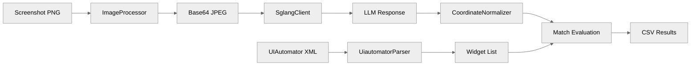

# aperv-llm-validation

Offline validation module for the APE-RV LLM coordinate mapping pipeline.

## Overview

aperv-llm-validation validates the accuracy of LLM-driven coordinate prediction for Android UI interaction. It replicates the APE-RV Java pipeline in Python to enable offline evaluation: sending screenshots to a Qwen3-VL model via SGLang, parsing the predicted coordinates, and matching them against ground-truth widget bounds from UIAutomator XML dumps. This module is used to benchmark prompt variants, image processing modes, and coordinate normalization strategies without running the full APE-RV exploration loop.

## Installation

```bash
# Install all rv-android modules (from project root)
uv sync
```

This module is part of the RV-Android uv workspace. All modules are installed in editable mode — source changes are reflected immediately.

## Quick Start

### Pre-validation (per-widget grounding test)

Tests VLM coordinate accuracy by asking Qwen3-VL to click on specific widgets by name:

```bash
uv run python modules/aperv-llm-validation/scripts/prevalidation.py \
    --screenshots-dir /path/to/screenshots \
    --sglang-url http://192.168.0.36:30000/v1 \
    --output-dir results/prevalidation
```

The screenshots directory must contain subdirectories per app, each with paired `.png` and `.uiautomator` files:

```
screenshots/
  app_name/
    screen_001.png
    screen_001.uiautomator
    screen_002.png
    screen_002.uiautomator
```

### Programmatic Usage

```python
from aperv_llm_validation.pipeline.sglang_client import SglangClient
from aperv_llm_validation.pipeline.image_processor import process_screenshot
from aperv_llm_validation.pipeline.coordinate_normalizer import qwen_to_pixel
from aperv_llm_validation.data.uiautomator_parser import parse_uiautomator

# Process a screenshot for LLM consumption
b64_image = process_screenshot("screenshot.png", mode="max_edge")

# Convert Qwen3-VL normalized coordinates to device pixels
pixel_x, pixel_y = qwen_to_pixel(qwen_x=500, qwen_y=300)

# Parse widgets from UIAutomator XML
widgets = parse_uiautomator(Path("screenshot.uiautomator"))
```

## Features

- **Image processing**: Three resize modes — `max_edge` (longest edge <= 1000px), `smart_resize` (Qwen3-VL vision encoder optimized), and `raw` (no resize)
- **Coordinate normalization**: Bidirectional conversion between Qwen3-VL normalized [0, 1000) space and device pixel coordinates
- **UIAutomator parsing**: Extracts clickable widgets from XML dumps with filtering for system UI, zero-area nodes, and always-clickable widget types
- **Response caching**: SQLite-backed cache for LLM responses, enabling reproducible evaluation runs and crash resilience
- **Widget matching**: Bounds-hit (strict) and center-hit (50px tolerance) accuracy metrics
- **Pre-validation script**: Automated per-widget grounding tests across multiple image modes and temperatures

## Configuration

### CLI Options (prevalidation.py)

| Option | Default | Description |
|--------|---------|-------------|
| `--screenshots-dir` | (required) | Directory with app_name/screenshot.png + .uiautomator pairs |
| `--sglang-url` | `http://192.168.0.36:30000/v1` | SGLang server URL |
| `--output-dir` | `results/` | Output directory for CSV results |
| `--cache-dir` | `.cache/` | SQLite cache directory |
| `--max-screenshots` | None | Limit number of screenshots (for quick tests) |
| `--modes` | all 3 | Image processing modes to test |
| `--temperatures` | `0.01, 0.7` | Temperatures to test |
| `--model` | `default` | Model name for the SGLang server |
| `--disable-thinking` | False | Disable thinking mode (Qwen3.5+ models) |

### Environment Variables

| Variable | Description | Required |
|----------|-------------|----------|
| No environment variables required | | |

### SGLang Server Constants

| Constant | Value | Description |
|----------|-------|-------------|
| `DEFAULT_SGLANG_URL` | `http://192.168.0.36:30000/v1` | Default SGLang endpoint |
| `DEFAULT_TEMPERATURE` | `0.3` | Default sampling temperature |
| `DEFAULT_MAX_TOKENS` | `1024` | Default max output tokens |
| `DEFAULT_TIMEOUT_SECONDS` | `15` | Per-request timeout |
| `DEFAULT_RETRIES` | `3` | Retry count with exponential backoff |

## Pipeline Components



## Dependencies

### External
- `openai` - OpenAI-compatible client for SGLang server
- `Pillow` - Image processing (resize, JPEG compression)
- `pydantic` - Data validation
- `rich` - Terminal output formatting
- `defusedxml` - Safe XML parsing for UIAutomator dumps
- `scipy` - Statistical analysis

## Testing

```bash
# From project root
uv run pytest modules/aperv-llm-validation/tests/ -v

# With coverage
uv run pytest modules/aperv-llm-validation/tests/ --cov=aperv_llm_validation --cov-report=html
```

## License

Part of the rv-android project.
