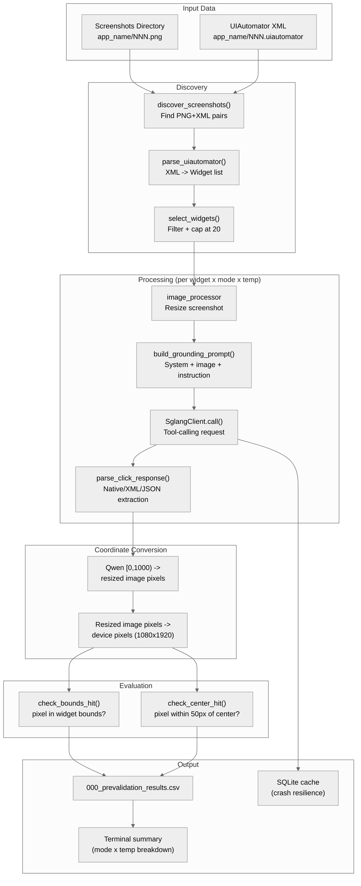
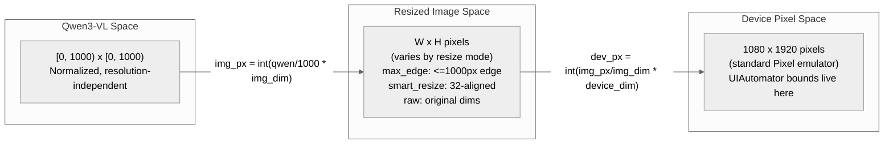
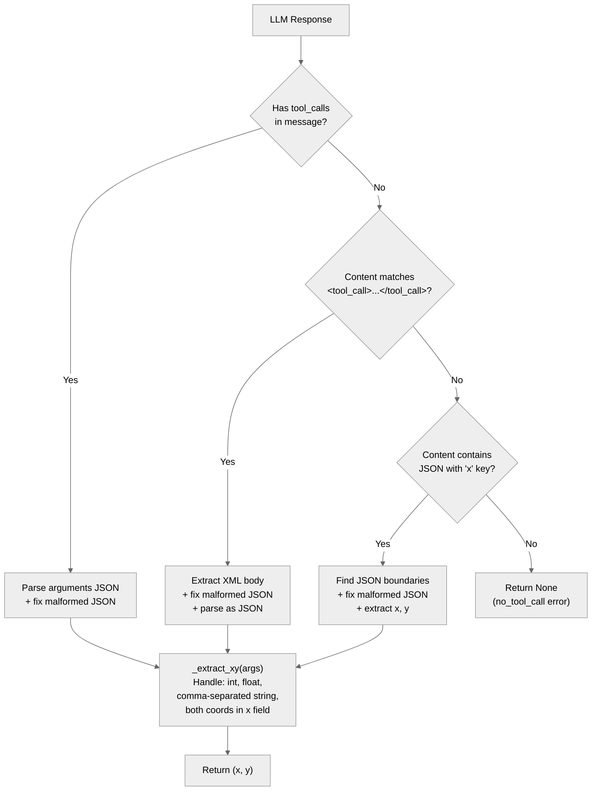
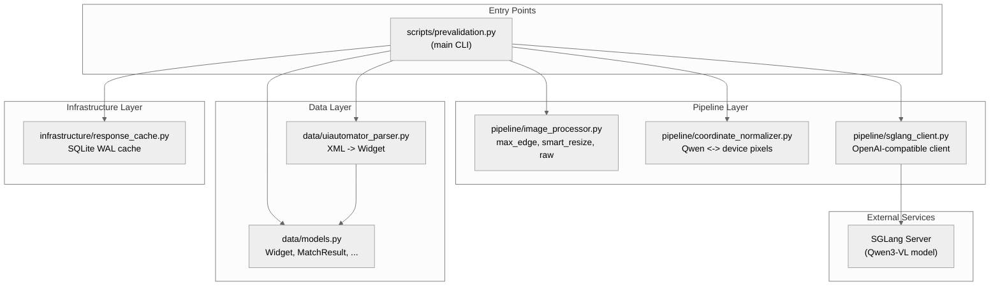

# aperv-llm-validation Architecture

## Overview

aperv-llm-validation is a temporary offline validation module for the APE-RV LLM coordinate mapping pipeline. It tests whether Qwen3-VL can accurately ground UI element coordinates from Android screenshots by comparing predicted tap coordinates against UIAutomator widget bounds. The module validates image preprocessing modes (max_edge, smart_resize, raw) and LLM parameters before deploying them in APE-RV's Java codebase.

This module is temporary -- it exists to support the thesis validation phase and is excluded from production release checklists.

## Key Architectural Decisions

### Decision 1: Standalone Module (No rv-android-core Dependency)

**Choice**: aperv-llm-validation has zero internal module dependencies. It only depends on external packages (openai, Pillow, pydantic, defusedxml, scipy).

**Why**: This module replicates Java pipeline logic from APE-RV's Java codebase (commit b2852dd) in Python for offline validation. It needs to run independently of the RV-Android runtime infrastructure -- no emulators, no RVSEC_HOME, no Android SDK. Coupling it to rv-android-core would add unnecessary setup requirements for a validation-only tool. The constants, coordinate math, and image processing are self-contained reimplementations from the Java sources.

### Decision 2: Frozen Dataclasses (Not Pydantic)

**Choice**: All domain models (`Widget`, `ParsedAction`, `MatchResult`, `EvaluationResult`) use `@dataclass(frozen=True)` instead of Pydantic BaseModel.

**Why**: The validation pipeline processes thousands of results in a tight loop. Frozen dataclasses have negligible construction overhead compared to Pydantic models, which matters when creating a `MatchResult` for every widget-mode-temperature combination. Immutability (frozen) prevents accidental mutation of results during aggregation. Pydantic is listed as a dependency for potential future use but the core pipeline avoids it.

### Decision 3: Two-Step Coordinate Conversion

**Choice**: Convert Qwen3-VL coordinates to device pixels in two explicit steps: (1) Qwen [0,1000) -> resized image pixels, (2) resized image pixels -> device pixels.

**Why**: This matches the actual coordinate flow in APE-RV's Java codebase (`CoordinateNormalizer.normalize()`). Qwen3-VL returns coordinates relative to the resized image it received, not the original device resolution. The two-step conversion makes the coordinate space transitions explicit and testable. A direct Qwen-to-device conversion would hide the intermediate image-pixel space and make it harder to diagnose whether coordinate errors come from the LLM's prediction or the resize scaling.

### Decision 4: SQLite Cache with Write-Only Strategy in Pre-validation

**Choice**: Cache LLM responses in SQLite (WAL mode) but disable cache reads during pre-validation runs.

**Why**: Pre-validation measures real LLM accuracy, so every call must go to the actual model -- reading cached responses would compromise the measurement. However, cache writes are kept active so that if the SGLang server crashes mid-experiment, the script can be re-run without losing already-computed results (crash resilience). The cache also enables post-hoc analysis of raw LLM responses without re-running the model.

### Decision 5: Three Resize Modes as Independent Variables

**Choice**: Test three image preprocessing modes (max_edge, smart_resize, raw) as controlled independent variables.

**Why**: The pre-validation's primary research question is whether image preprocessing affects Qwen3-VL's coordinate accuracy. The `max_edge` mode (longest edge <= 1000px) matches the original Java implementation. The `smart_resize` mode aligns dimensions to Qwen3-VL's vision encoder patch size (16x2=32), which avoids padding waste and produces deterministic token counts. The `raw` mode (no resize) serves as a control. By testing all three modes with the same prompts and widgets, the pipeline isolates the image preprocessing variable.

### Decision 6: Constants Replicated from Java Codebase

**Choice**: All pipeline constants (device dimensions, coordinate ranges, matching thresholds, widget class lists) are defined in `constants.py` with explicit references to the Java source commit.

**Why**: The validation module must produce results that are directly comparable to APE-RV's Java runtime behavior. Using different thresholds, coordinate ranges, or widget filtering rules would invalidate the comparison. The commit reference (b2852dd) creates a traceable link between the Python and Java implementations.

## Data Flow

### Pre-validation Pipeline

The pre-validation script is the primary entry point. It orchestrates the complete flow from screenshot discovery through LLM invocation to CSV output.



### Coordinate Space Transformations

The coordinate pipeline converts between three distinct coordinate spaces. Understanding these spaces is critical because errors at each stage compound.



### LLM Response Parsing Strategy

Qwen3-VL produces tool calls in three different formats depending on the version and server configuration. The parser handles all three in priority order.



## Module Structure

```
modules/aperv-llm-validation/
├── src/
│   └── aperv_llm_validation/
│       ├── __init__.py               # Package marker
│       ├── constants.py              # Pipeline constants (from Java b2852dd)
│       ├── data/
│       │   ├── __init__.py
│       │   ├── models.py            # Widget, ParsedAction, MatchResult, EvaluationResult
│       │   └── uiautomator_parser.py # XML -> Widget list
│       ├── pipeline/
│       │   ├── __init__.py
│       │   ├── coordinate_normalizer.py  # Qwen <-> device pixel conversion
│       │   ├── image_processor.py        # Resize modes (max_edge, smart_resize, raw)
│       │   └── sglang_client.py          # OpenAI-compatible HTTP client with retry
│       ├── infrastructure/
│       │   ├── __init__.py
│       │   └── response_cache.py     # SQLite-backed LLM response cache
│       ├── evaluation/               # Placeholder for evaluation engine
│       │   └── __init__.py
│       └── prompts/                  # Placeholder for prompt variants
│           └── __init__.py
├── scripts/
│   └── prevalidation.py             # Main CLI: per-widget grounding test
├── tests/
│   ├── fixtures/                    # UIAutomator XML test data
│   ├── test_coordinate_normalizer.py
│   ├── test_image_processor.py
│   ├── test_response_cache.py
│   └── test_uiautomator_parser.py
├── results/                          # Output directory (gitignored)
├── pyproject.toml
├── CLAUDE.md
└── README.md
```

## Core Components

### data/models.py -- Domain Models

Six frozen dataclasses representing the pipeline's core domain.

| Model | Fields | Purpose |
|-------|--------|---------|
| `Widget` | class_name, text, content_desc, resource_id, bounds, clickable, ... | Parsed UI element from UIAutomator XML. Computed properties: `center`, `area`, `width`, `height`, `has_semantic_info`. |
| `ParsedAction` | action_type, x, y, text, reasoning, parse_level, element_id | Result of parsing an LLM response into a structured action. `parse_level` indicates which parser stage succeeded (native, xml_tag, inline_json). |
| `MatchResult` | matched, step, widget, action_type, pixel_x, pixel_y, ... | Full result of matching an LLM action against widgets. Includes both Qwen and device-pixel coordinates and distance metrics. |
| `EvaluationResult` | screenshot_id, app_name, prompt_variant, repetition, ... | One row of evaluation output -- one LLM call with all metadata. |
| `PromptConfig` | name, description, build_system_message, build_widget_list, build_tool_schema | Configuration for a prompt variant. Uses callables for message construction. |
| `EvaluatorConfig` | sglang_url, model, temperature, resize_mode, ... | Configuration for the evaluation engine. |

### data/uiautomator_parser.py -- XML Parser

Parses UIAutomator XML dumps into `Widget` instances. Filtering rules replicate APE-RV's Java `ApePromptBuilder`:

- Enabled AND (clickable OR in `ALWAYS_CLICKABLE_TYPES`)
- Bounds area > 0
- Not from `com.android.systemui` package
- Spinner/tab widgets inherit text from first child `TextView` when their own text is empty

Uses `defusedxml` for secure XML parsing (prevents XML entity attacks).

### pipeline/coordinate_normalizer.py -- Coordinate Conversion

Two pure functions implementing bidirectional coordinate conversion:

- `qwen_to_pixel(qwen_x, qwen_y, device_w, device_h)`: Qwen [0,1000) -> device pixels with clamping
- `pixel_to_qwen(pixel_x, pixel_y, device_w, device_h)`: Device pixels -> Qwen [0,1000) with clamping

Replicates `CoordinateNormalizer.normalize()` from Java commit b2852dd.

### pipeline/image_processor.py -- Screenshot Preprocessing

Three resize modes, each producing a base64-encoded JPEG:

| Mode | Algorithm | Rationale |
|------|-----------|-----------|
| `max_edge` | Scale longest edge to 1000px, preserve aspect ratio | Matches original Java `ImageProcessor` behavior. Control condition for experiments. |
| `smart_resize` | Scale to fit patch-aligned dimensions (multiples of 32), area in [3136, 10M] pixels | Optimized for Qwen3-VL's vision encoder. Avoids padding waste and produces deterministic token counts. |
| `raw` | No resize, JPEG compress only | Baseline control -- sends original resolution to the model. |

### pipeline/sglang_client.py -- LLM HTTP Client

Wraps the OpenAI Python client for communication with SGLang inference servers. Supports multimodal messages (image + text) and tool calling. Implements exponential backoff retry (default: 3 attempts) on timeout/connection errors. Health check via `GET /v1/models`.

### infrastructure/response_cache.py -- SQLite Cache

SQLite-backed cache using WAL mode for thread safety. Key: SHA-256 hash of `screenshot|prompt|rep_seed|temperature|resize_mode`. Stores the full LLM response JSON, token counts, and latency. Used for crash resilience during long pre-validation runs.

### scripts/prevalidation.py -- Main Entry Point

CLI script orchestrating the pre-validation experiment. For each screenshot+XML pair, for each resize mode, for each temperature, for each eligible widget: sends a grounding prompt to Qwen3-VL, parses the response, converts coordinates, checks bounds/center hits, and writes results to CSV. Includes a comprehensive `_fix_malformed_json()` function ported from APE-RV's Java `ToolCallParser` that handles six common Qwen3-VL JSON quirks.

## Component Architecture



## Scenarios

### Scenario 1: Pre-validation Run

**Description**: A researcher runs the pre-validation to compare resize modes before updating APE-RV's Java code.

**Flow**:
1. `prevalidation.py --screenshots-dir /screenshots --sglang-url http://host:30000/v1`
2. `SglangClient.health_check()` verifies the SGLang server is reachable
3. `discover_screenshots()` finds all PNG+UIAutomator pairs across app directories
4. For each pair, `parse_uiautomator()` extracts clickable widgets, `select_widgets()` caps at 20
5. For each mode (max_edge, smart_resize, raw) and temperature (0.01, 0.7):
   - `process_screenshot_with_dims()` resizes the screenshot and returns base64 + dimensions
   - For each widget, `build_grounding_prompt()` creates a multimodal message asking the LLM to click the widget by name
   - `SglangClient.call()` sends the request with tool schema; response is cached to SQLite
   - `parse_click_response()` extracts (x, y) from native tool_calls, XML tags, or inline JSON
   - Two-step coordinate conversion: Qwen -> image pixels -> device pixels
   - `check_bounds_hit()` and `check_center_hit()` evaluate accuracy
6. Results written to `000_prevalidation_results.csv`; summary printed to terminal

### Scenario 2: Malformed LLM Response Handling

**Description**: Qwen3-VL returns coordinates in a non-standard format.

**Flow**:
1. The LLM returns `{"x": 498, 549}` (missing "y" key -- a common Qwen quirk)
2. `parse_click_response()` attempts native tool_calls parsing: success, but `arguments` is `'{"x": 498, 549}'`
3. `json.loads()` fails on the malformed JSON
4. `_fix_malformed_json()` applies regex: `"x": 498, 549` -> `"x": 498, "y": 549`
5. Second `json.loads()` succeeds: `{"x": 498, "y": 549}`
6. `_extract_xy()` returns `(498, 549)`
7. Coordinate conversion and evaluation proceed normally

## Dependencies

### External Packages

| Package | Version | Purpose |
|---------|---------|---------|
| openai | >=1.0.0 | OpenAI-compatible client for SGLang server communication |
| Pillow | >=10.0.0 | Image resizing and JPEG compression |
| pydantic | >=2.9.0 | Available for future use; core models use dataclasses |
| rich | >=13.0.0 | Terminal formatting for summary output |
| defusedxml | >=0.7.0 | Secure XML parsing of UIAutomator dumps |
| scipy | >=1.14.0 | Statistical analysis of validation results |

### External Services

| Service | Purpose |
|---------|---------|
| SGLang Server | Hosts Qwen3-VL model for multimodal inference. OpenAI-compatible API at `/v1/chat/completions`. Default: `http://192.168.0.36:30000/v1` |

### Internal Module Dependencies

None. This module is completely standalone within the rv-android workspace.

## Testing Strategy

| Type | Location | Purpose |
|------|----------|---------|
| Unit | `tests/test_coordinate_normalizer.py` | Qwen-to-pixel and pixel-to-Qwen conversion accuracy |
| Unit | `tests/test_image_processor.py` | Resize dimension calculations for all three modes |
| Unit | `tests/test_response_cache.py` | SQLite cache get/put/stats operations |
| Unit | `tests/test_uiautomator_parser.py` | XML parsing, widget filtering, system UI exclusion |
| Fixture | `tests/fixtures/cryptoapp/001.uiautomator` | Real UIAutomator XML from CryptoApp for parsing tests |

## Constants Reference

Key constants from `constants.py` (sourced from Java codebase commit b2852dd):

| Constant | Value | Source |
|----------|-------|--------|
| `QWEN_COORD_RANGE` | 1000 | Qwen3-VL normalized coordinate range [0, 1000) |
| `DEVICE_WIDTH` / `DEVICE_HEIGHT` | 1080 / 1920 | Standard Pixel emulator resolution |
| `MAX_EDGE_PX` | 1000 | Maximum edge for max_edge resize mode |
| `SMART_RESIZE_FACTOR` | 32 | Qwen3-VL patch_size (16) x merge_size (2) |
| `BOUNDARY_TOP_RATIO` / `BOUNDARY_BOTTOM_RATIO` | 0.05 / 0.94 | Status/nav bar rejection zones |
| `MIN_EUCLIDEAN_TOLERANCE` | 50.0 | Minimum fallback tolerance for widget matching |
| `MAX_WIDGETS_PER_SCREENSHOT` | 20 | Cap for pre-validation to limit cost on complex screens |

## Related Documentation

- [Module CLAUDE.md](../CLAUDE.md) - Module-specific reference with CLI usage and development commands
- [CLAUDE.md](../../CLAUDE.md) - Project-level reference for Claude Code
