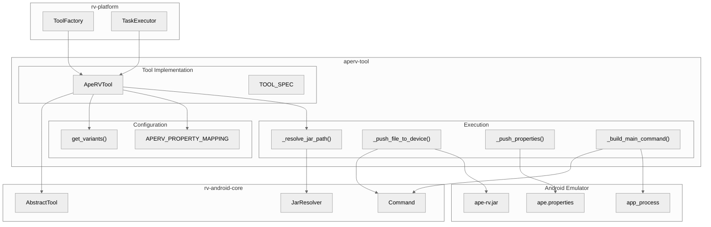
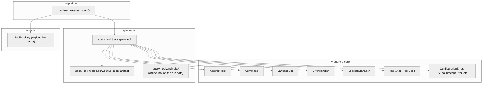
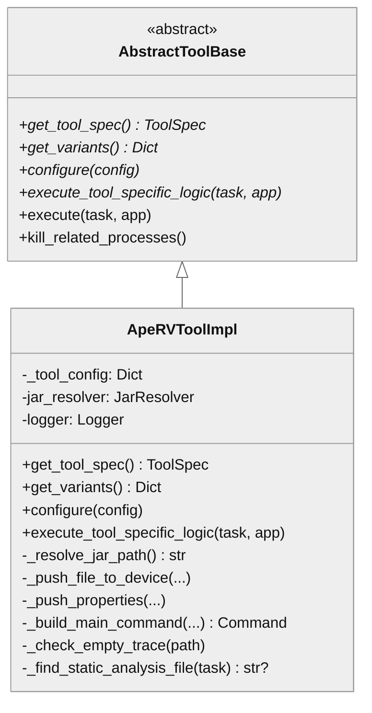
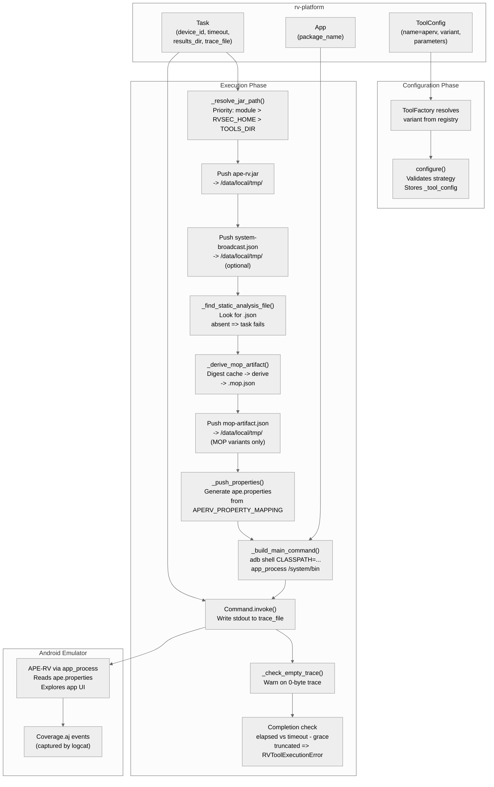

# APE-RV Tool Architecture

## Overview

The aperv-tool module wraps the APE-RV binary (`ape-rv.jar`) as an `AbstractTool` plugin for rv-platform integration. APE-RV is an enhanced fork of the AOSP Monkey tool that implements model-based UI exploration via the Widget Table Graph (WTG) model with adaptive random testing (SATA) and random strategies. The module handles JAR deployment to the Android device, strategy configuration via `ape.properties`, optional MOP-guided scoring using static analysis data, and optional LLM-guided exploration via an OpenAI-compatible endpoint. It runs inside the Android emulator via `app_process`, not as a standard JVM process.

## Specification Alignment

This module implements requirements from `openspec/specs/tools/spec.md` as an external tool registered by rv-platform.

### Functional Requirements

| FR | Description | Architectural Support |
|----|-------------|----------------------|
| FR18 | Plugin system with registry and factory patterns | `ApeRVTool` extends `AbstractTool` (rv-android-core) and registers via `ToolRegistry` in rv-platform's `_register_external_tools()` |
| FR20 | Per-tool variant system | `get_variants()` returns 8 named variants as `preset` + `overrides`; `configure()` validates strategy, preset and overrides eagerly, and folds tool-DSL overrides into place (INV-APV-39) |

### Key Invariants

| Invariant | Description | Enforcement Mechanism |
|-----------|-------------|----------------------|
| INV-TOOL-02 | Every registered tool must have a "default" variant | `get_variants()` returns a dictionary containing the "default" key, mapping to sata strategy |
| INV-TOOL-05 | Factory must call `configure()` before returning tool | `configure()` stores validated config in `_tool_config`; `execute_tool_specific_logic()` checks truthiness of `_tool_config` |
| INV-TOOL-06 | `execute()` must convert `RVCommandTimeoutError` to `RVToolTimeoutError` | `execute_tool_specific_logic()` catches `RVCommandTimeoutError` and re-raises as `RVToolTimeoutError` |
| INV-APV-01 | JAR resolution follows priority search order | `_resolve_jar_path()` searches: module directory, `$RVSEC_HOME/ape/target/`, `$TOOLS_DIR/aperv/` |
| INV-APV-02 | Invalid strategy must be rejected before device interaction | `configure()` validates strategy against `APERV_AVAILABLE_STRATEGIES` and raises `ConfigurationError` immediately |
| INV-APV-04 | Working directory must be `/system/bin` | `_build_main_command()` passes `/system/bin` as the working directory argument to `app_process` |
| INV-APV-07 | APE and APE-RV must not run concurrently | `TOOL_SPEC.process_pattern` is `com.android.commands.monkey`, shared with the builtin APE tool, so rv-platform's `kill_related_processes()` terminates either before launch |
| INV-APV-60 | A run that did not explore its budget must not be reported as successful | `execute_tool_specific_logic()` measures the exploration against `time.monotonic()` and raises `RVToolExecutionError` when a non-timeout return came back more than `APERV_TEARDOWN_GRACE_S` short of `task.config.timeout` |

### Specification Scenarios

Scenarios from `openspec/specs/tools/spec.md` that validate this architecture:
- **External tool registration**: rv-platform imports `ApeRVTool` in `_register_external_tools()`, checks `is_tool_registered("aperv")` for idempotency, and registers the tool class with all 8 variants -- traces through `rv_platform/__init__.py` -> `ToolRegistry` -> `ApeRVTool.get_tool_spec()` / `get_variants()`
- **Tool execution with variant**: rv-platform calls `ToolFactory.create_tool(tool_config)` which instantiates `ApeRVTool`, resolves the variant config, merges parameters, calls `configure()`, then `execute_tool_specific_logic()` -- traces through `ToolFactory` -> `ApeRVTool.configure()` -> `execute_tool_specific_logic()`

## Key Architectural Decisions

| Decision | Choice | Rationale |
|----------|--------|-----------|
| Application Type | Library (rv-platform plugin) | aperv-tool is a tool plugin, not standalone; rv-platform manages its lifecycle |
| Structuring | One execution class plus two read-only satellites | `ApeRVTool` owns the device interaction. `derive_mop_artifact` is a separate pure module because the MOP substrate's parse-time semantics are a single authority that must be testable without a device, and `analysis/` is a separate package because nothing in it may be reachable from the run path |
| Primary Pattern | Template Method (via AbstractTool) | Inherits the `execute()` -> `execute_tool_specific_logic()` template from AbstractTool, gaining consistent timeout and cleanup handling |
| Control Strategy | Call-based, sequential | rv-platform calls `configure()` then `execute_tool_specific_logic()` in sequence; no internal concurrency |
| Configuration | Properties file injection | APE-RV reads `ape.properties` from the device; the tool generates this file from Python config and pushes via ADB |
| JAR Resolution | Priority search with JarResolver | Module-local JAR takes precedence over Maven build output, ensuring packaged JAR is used by default for reproducibility |
| Process Pattern | Shared with builtin APE | Both APE and APE-RV use `com.android.commands.monkey` -- mutual exclusion enforced by rv-platform process cleanup |
| LLM URL Override | Environment variable `APERV_LLM_BASE_URL` | Emulator uses `10.0.2.2` (host loopback alias); Docker and physical devices need different addresses |

### Why Properties File Injection?

APE-RV is a Java application running inside the Android emulator via `app_process`. It reads configuration from `ape.properties` on the device filesystem at startup. The Python wrapper generates this file dynamically, and since stage 2 of the re-architecture it writes only what distinguishes the arm: `ape.preset=<name>` first, `ape.mopDataPath` when the derived MOP artifact was pushed, then one line per `overrides` entry. What a preset contains is resolved inside the jar, so the file no longer restates 18-33 keys the two sides had to agree on. Keys not in `APERV_PROPERTY_MAPPING` — the eight in `APERV_ORCHESTRATION_KEYS` — are Python-only control parameters and never reach the device.

### Why Shared Process Pattern with APE?

Both the builtin APE tool (from rv-tools) and APE-RV run as `com.android.commands.monkey` on the Android device. This shared process pattern is a deliberate safety mechanism (INV-APV-07): rv-platform's `kill_related_processes()` terminates any running APE/APE-RV process before launching a new one. Since both tools use the same Android Monkey entry point (`app_process` with `CLASSPATH`), they cannot coexist on the same device. The shared pattern ensures stale processes from a previous experiment are cleaned up before the next run.

### Why Working Directory is /system/bin?

The `app_process` command requires the working directory as its first argument. APE-RV uses `/system/bin` (INV-APV-04) rather than `/data/local/tmp/` because the enhanced binary resolves internal Android framework classes relative to the system path. Using `/data/local/tmp/` causes `ClassNotFoundException` on some API levels because `app_process` cannot locate required system resources from that directory. This was discovered empirically during development and is a hard requirement.

### Why Module-Local JAR Has Highest Priority?

The JAR resolution priority (INV-APV-01) places the module directory first because experiment reproducibility requires using the exact binary that was packaged with the tool. If `$RVSEC_HOME/ape/target/` were checked first, a developer rebuilding the Java project mid-experiment would silently change the binary being used. The module-local JAR (shipped alongside `tool.py`) provides a stable reference point.

### Why Timeout is Expected Exit?

Exploration tools like APE-RV are designed to run indefinitely, exploring the application until killed. The `--running-minutes` flag sets a soft limit, but the tool may exceed it during state serialization. The `APERV_TEARDOWN_GRACE_S` (45 s) grace period on the Command timeout gives APE-RV time to flush its WTG model to disk and emit its coverage dump before the process is forcibly killed. `RVCommandTimeoutError` is re-raised as `RVToolTimeoutError`, which rv-platform treats as a completed run (not a failure) and proceeds to collect coverage from logcat.

### Why the Exit Code Cannot Decide Whether a Run Happened

Timeout being the normal ending means a *normal* return is the anomalous one, and the exit code cannot classify it (INV-APV-60). APE-RV exits non-zero when it detects an application crash during exploration — data the campaign exists to collect — so an emulator that vanished (exit 255) and an application that crashed (exit 1) arrive through the same channel carrying the same information.

Elapsed time separates them because the exploration is budget-bound by construction: an APE-RV asked for 1800 s and back at 1012 s did not do the work, whatever ended it. `execute_tool_specific_logic()` therefore stamps `time.monotonic()` before launching and, on the non-timeout return path only, raises `RVToolExecutionError` when the elapsed time is below `task.config.timeout - APERV_TEARDOWN_GRACE_S`. The single constant is read from opposite sides by the two users that must agree: `_build_main_command()` adds it to the command timeout, and the completion check subtracts it to obtain the floor.

Raising is what makes the failure recoverable. rv-platform stores the task as ERROR with a non-empty `error_message`, and its ordinary resume re-executes the identity — the same path that already recovers a failed `adb install`. Before this check such a run was stored COMPLETED with `error_message` null, which no resume could reach.

## Architectural Patterns

### Pattern: Template Method (AbstractTool)

**Description**: `ApeRVTool` extends `AbstractTool` from rv-android-core. The base class defines `execute()` which calls the abstract `execute_tool_specific_logic()`, handles `RVCommandTimeoutError` conversion, and performs process cleanup via `kill_related_processes()`. ApeRVTool implements only the tool-specific logic.

**When Used**: Every tool in the rv-android system uses this pattern. It ensures consistent timeout handling (timeouts are expected, not errors), process cleanup, and error handling across all tools.

**Advantages**:
- Consistent behavior: timeout handling, cleanup, and error reporting are identical across tools
- Tool implementors focus only on tool-specific logic

**Disadvantages**:
- Inheritance coupling: changes to AbstractTool affect all tools

### Pattern: Variant Configuration

**Description**: `get_variants()` returns a dictionary of named configurations, each a `preset` name plus an `overrides` dict. `configure()` validates the shape, folds any tool-DSL override into `overrides`, and raises on a top-level key it cannot honour -- without that fold a DSL override would produce no property line and no error, which is the silent-discard failure the preset mechanism exists to remove. `_push_properties()` then translates `overrides` through `APERV_PROPERTY_MAPPING`. Python-only keys are excluded automatically because they have no mapping entry.

**When Used**: When the experiment configuration specifies a variant (e.g., `aperv:sata_mop`), `ToolFactory` resolves the variant config, merges any parameter overrides, and calls `configure()`.

**Advantages**:
- Declarative variant definitions: adding a variant requires only a dictionary entry
- Type safety: `configure()` validates strategy eagerly before device interaction

**Disadvantages**:
- All variants defined statically in code; no file-based variant definitions

---

## Logical View

Shows key domain entities and their relationships.

### Domain Entities

| Entity | Responsibility |
|--------|----------------|
| ApeRVTool | Wraps APE-RV binary as an AbstractTool; manages JAR push, properties push, command execution, and trace capture |
| ToolSpec | Metadata describing the tool: name, description, URL, version, process pattern |
| JarResolver | Resolves the path to `ape-rv.jar` via priority search across configured directories |
| Command | Encapsulates an ADB shell command with timeout; used for both file push and main execution |
| APERV_PROPERTY_MAPPING | Maps Python config keys to Java `ape.properties` keys; controls what is written to the device |
| MOP artifact (`<apk>.mop.json`) | The lossy projection of static analysis that the device reads; derived host-side, cached by the source digest, and readable by no module outside aperv-tool (INV-ANA-53) |

### Component Architecture



---

## Development View

Shows code organization for developers.

### Module Structure

```
aperv-tool/
├── src/
│   └── aperv_tool/
│       ├── __init__.py
│       ├── tools/                          # the run path — everything that touches a device
│       │   ├── __init__.py
│       │   └── aperv/
│       │       ├── __init__.py
│       │       ├── tool.py                 # ApeRVTool class, constants, property mapping
│       │       ├── derive_mop_artifact.py  # pure derivation of the device's MOP artifact
│       │       ├── ape-rv.jar              # APE-RV binary (gitignored; built from ape source at Docker image build)
│       │       └── system-broadcast.json   # Broadcast intent catalog for component triggering
│       └── analysis/                       # read-only over recorded runs; never imported by the run path
│           ├── __init__.py
│           ├── trace_ndjson.py             # native reader of the stage-4 NDJSON trace
│           ├── coverage_dump.py            # parser of the jar's UICOV / UICOV-ACT dump
│           └── clock_logcat_join.py        # places RVSEC violations on the exploration timeline
├── tests/
│   ├── __init__.py
│   ├── test_aperv_tool.py                  # spec, variants, configure/DSL fold, commands, properties, arms
│   ├── test_derive_mop_artifact.py         # one named test per derivation rule + cryptoapp ground truth
│   ├── test_trace_ndjson.py                # reader semantics against the golden NDJSON
│   ├── test_coverage_dump.py               # coverage-dump parsing
│   ├── test_clock_logcat_join.py           # heartbeat placement, including both routes to UNALIGNED
│   ├── fixtures/                           # cryptoapp.apk.json, trace_ndjson_golden.ndjson (provenance in README.md)
│   └── migration/                          # one-time regeneration diff, retirement list, jar tables, mapping sweep
└── pyproject.toml
```

The `tools/` ÷ `analysis/` split is load-bearing rather than cosmetic: `analysis/` reads artifacts a run already produced and rv-platform never calls into it, so a change there cannot alter what any arm does on a device.

### Package Dependencies



`AnalysisPkg` has no inbound edge on purpose: nothing imports it, which is what keeps offline analysis unable to affect a run.

---

## Process View

Shows the runtime execution sequence when rv-platform dispatches an APE-RV task.

### Execution Flow

```mermaid
%%{init: {'theme': 'neutral'}}%%
sequenceDiagram
    participant Platform as rv-platform<br/>TaskExecutor
    participant Tool as ApeRVTool
    participant Resolver as JarResolver
    participant ADB as ADB / Device
    participant APE as APE-RV<br/>(app_process)

    Platform->>Tool: configure(variant_config)
    Tool->>Tool: validate strategy
    Tool->>Tool: store _tool_config

    Platform->>Tool: execute_tool_specific_logic(task, app)

    Tool->>Resolver: resolve_jar_path("ape-rv.jar")
    Resolver-->>Tool: /path/to/ape-rv.jar

    Tool->>ADB: adb push ape-rv.jar /data/local/tmp/
    ADB-->>Tool: OK

    opt system-broadcast.json exists
        Tool->>ADB: adb push system-broadcast.json /data/local/tmp/
        ADB-->>Tool: OK
    end

    opt mop_data == "static_analysis"
        Tool->>Tool: _find_static_analysis_file(task)
        alt static analysis JSON found
            Tool->>Tool: _derive_mop_artifact(task) [cache-or-derive]
            Tool->>ADB: adb push mop-artifact.json /data/local/tmp/
            ADB-->>Tool: OK
        else absent or underivable
            Tool-->>Tool: raise RVToolExecutionError (task fails)
        end
    end

    Tool->>Tool: _push_properties() - generate ape.properties
    Tool->>ADB: adb push ape.properties /data/local/tmp/
    ADB-->>Tool: OK

    opt overrides carry llm_url
        Tool->>Tool: _capture_llm_provenance(llm_url, jar_path)
        Tool->>Tool: write <run>.provenance.json sidecar<br/>(failure logs a warning, never fails the run)
    end

    Tool->>Tool: stamp time.monotonic()
    Tool->>ADB: adb shell CLASSPATH=... app_process /system/bin Monkey -p pkg --ape strategy
    ADB->>APE: start exploration

    alt Timeout (expected)
        APE-->>Tool: RVCommandTimeoutError
        Tool->>Tool: _gzip_trace()
        Tool-->>Platform: RVToolTimeoutError (normal completion)
    else Normal exit, budget explored
        APE-->>Tool: exit code (0 or non-zero)
        Tool->>Tool: _check_empty_trace()
        Tool->>Tool: _gzip_trace()
        Tool-->>Platform: return
    else Normal exit, truncated (elapsed below the floor)
        APE-->>Tool: exit code (0 or non-zero)
        Tool->>Tool: _check_empty_trace()
        Tool->>Tool: _gzip_trace()
        Tool-->>Platform: RVToolExecutionError (INV-APV-60)<br/>rv-platform stores ERROR; resume re-executes
    end
```

`_gzip_trace()` runs on all three paths because timeout is the majority path, not the exception: compressing only on normal exit would exempt most runs. It is write-only and non-fatal — it produces `<run>.trace.ndjson.gz` beside the trace, leaves `task.result.trace_file` byte-identical (INV-APV-52), parses nothing and changes no task status (INV-APV-53).

The two normal-exit branches are one code path that ends differently: compression happens *before* the completion check deliberately, so the artifacts of a truncated run survive as the evidence of what truncated it. The branches are distinguished by the clock, never by the exit code — see "Why the Exit Code Cannot Decide Whether a Run Happened" above.

---

## Core Components

### ApeRVTool

**Purpose**: Implements the `AbstractTool` interface for APE-RV, managing the complete device interaction lifecycle: JAR resolution, file deployment, properties generation, command execution, trace validation and the completion check that establishes a run actually explored its budget.

**Location**: `src/aperv_tool/tools/aperv/tool.py`

**Key Classes**:
- `ApeRVTool`: Main tool class extending `AbstractTool`, covering configuration, JAR resolution, file push, MOP artifact derivation and caching, LLM provenance capture, properties generation, command building, execution, empty-trace detection and trace compression.

**Dependencies**:
- Internal: `rv-android-core` (AbstractTool, Command, JarResolver, ErrorHandler, LoggingManager, domain models, exceptions); `aperv_tool.tools.aperv.derive_mop_artifact`
- External: None (uses only stdlib `gzip`, `hashlib`, `json`, `os`, `re`, `shutil`, `tempfile`, `urllib.request`)

### derive_mop_artifact

**Purpose**: Single authority for the MOP substrate's parse-time semantics. `derive(document) -> dict` projects the full static-analysis JSON into what the device needs; `serialize_canonical(artifact) -> bytes` renders it deterministically so two derivations of the same source are byte-identical.

**Location**: `src/aperv_tool/tools/aperv/derive_mop_artifact.py`

**Why it is a module rather than methods on the tool**: these rules used to run on the device at load time, where the jar parsed the whole call graph and rejected large ones. Moving them host-side made them testable without a device and removed the per-app fairness gap; keeping them pure — no I/O, no device concepts — is what lets `tests/test_derive_mop_artifact.py` name one test per rule and check the cryptoapp ground truth directly.

### analysis package

**Purpose**: Read-only utilities over the artifacts of a recorded run.

**Location**: `src/aperv_tool/analysis/`

| Module | Reads | Produces |
|--------|-------|----------|
| `trace_ndjson.py` | the stage-4 NDJSON trace | one row per exploration step, with the `ACT`/`STATE` dictionaries resolved, omitted defaults materialized, and the run-relative clock expanded through `RUN_START.t0` |
| `coverage_dump.py` | the `UICOV` / `UICOV-ACT` lines of the trace | parsed coverage records; unaffected by the NDJSON change, which does not touch those lines |
| `clock_logcat_join.py` | a run's logcat plus `trace_ndjson` rows | each `RVSEC` violation placed at the step of the last `ApeRvHb` heartbeat at or before it |

**Constraint**: nothing here is imported by the run path, and none of it holds a clock reconstruction. `clock_logcat_join` works because both series come out of the same logcat, so their identical unknowns (no year, no zone) cancel in the difference.

### Constants and Configuration Mapping

**Purpose**: Define device paths, available strategies, and the Python-to-Java property name mapping.

**Location**: `src/aperv_tool/tools/aperv/tool.py` (module-level constants)

**Key Constants**:
- `APERV_TOOL_NAME = "aperv"` -- registry key
- `APERV_JAR_NAME = "ape-rv.jar"` -- JAR filename for resolution
- `APERV_DEVICE_JAR_PATH = "/data/local/tmp/ape-rv.jar"` -- target path on device
- `APERV_DEVICE_PROPERTIES_PATH = "/data/local/tmp/ape.properties"` -- properties target
- `APERV_MAIN_CLASS = "com.android.commands.monkey.Monkey"` -- Java entry point
- `APERV_TEARDOWN_GRACE_S = 45` -- seconds of teardown allowed beyond the exploration budget. Stated once because two users must agree on it: the command timeout is the budget *plus* this value, and the completion floor is the budget *minus* it (INV-APV-60). The value is a hypothesis about censored teardown durations, not a measurement — among iter0 runs whose teardown completed the overrun reaches 12,991 ms, with 32 runs stacked against the previous 15 s ceiling and none beyond it, the signature of a hard wall rather than a natural distribution
- `APERV_AVAILABLE_STRATEGIES = ["sata", "random"]` -- valid strategies. `bfs`/`dfs` were never agent types (`ApeAgent.createAgent` knows `sata`, `random` and `replay`), so accepting them would let a run pass local validation and abort on the device
- `APERV_ORCHESTRATION_KEYS` -- the top-level keys that are Python orchestration rather than jar configuration; anything else at the top level must be a mapped override or `configure()` raises
- `APERV_PROPERTY_MAPPING` -- 50-entry pass-through table mapping Python override keys to Java `ape.*` property names. It contains only keys the deployed jar accepts (INV-APV-41); the sweep against `KeyOwnership.java` lives in `tests/migration/test_mapping_sweep.py`

### Variant System

**Purpose**: Define the experimental matrix as **preset + overrides**: 8 names carrying 7 configurations, each a jar preset name plus a dict of deltas over it.

**Location**: `src/aperv_tool/tools/aperv/tool.py` (`get_variants()` classmethod)

**Variants**:
- **Preset-identity** (4, plus the `default` alias): `sata` (`aperv`), `sata_mop` (`mop`), `sata_llm` (`llm`), `sata_mop_llm` (`llm_mop`) -- empty overrides but for the deployment-specific `llm_url`, since a preset names an arm while a URL names a machine
- **E3 decisive run** (3): `mop_on_llm_off` (reference, on the reach package), `mop_off_llm_off` (control, MOP scoring zeroed but navigation alive), `mop_on_llm_70` (LLM arm at the calibrated dose)

The division of authority is the point: the jar owns what a preset *means*, Python owns *which arms exist*. Adding an ablation means adding a named override set, never a fifth preset.

---

## NFR Support

How the architecture supports non-functional requirements from the PRD.

| NFR | PRD ID | Priority | Architectural Support |
|-----|--------|----------|----------------------|
| Modularity | NFR01 | P0 | Standalone uv workspace module with clear dependency on rv-android-core and rv-tools only; registered lazily by rv-platform |
| Extensibility | NFR02 | P0 | A new arm is a named entry in `get_variants()` carrying a preset plus override deltas; a new tunable is an entry in `APERV_PROPERTY_MAPPING`. New presets are not added here — the preset vocabulary belongs to the jar's `Presets.java` |
| Testability | NFR03 | P1 | `tests/test_aperv_tool.py` covers spec metadata, variant shape, `configure()` validation, the DSL override fold, JAR paths, command building, constants, empty-trace detection, properties generation and the decisive-run arms; `tests/migration/` holds the sweep of `APERV_PROPERTY_MAPPING` against the jar's accepted-key table, the pinned jar tables and the decisive-run contrasts, and skips silently without `$APE_REPO` |
| Resilience | NFR04 | P1 | Timeout treated as expected exit (re-raised as `RVToolTimeoutError`); non-zero exit codes logged as debug (APE-RV reports app crashes this way) and never used to judge a run; a truncated exploration raises `RVToolExecutionError` so rv-platform's resume re-executes the identity (INV-APV-60); empty trace produces warning, not error |
| Configurability | NFR05 | P1 | `APERV_LLM_BASE_URL` env var overrides LLM URL; `RVSEC_HOME` and `TOOLS_DIR` env vars extend JAR search paths; `ape.properties` generated from `_tool_config` via mapping |
| Reproducibility | NFR08 | P1 | Module-local JAR (`ape-rv.jar` shipped alongside `tool.py`) takes priority in resolution, ensuring experiments use the packaged binary |

---

## Key Interfaces

### AbstractTool (from rv-android-core)

```python
class AbstractTool(ABC):
    """Base class for all testing tools in rv-android."""

    def get_tool_spec(cls) -> ToolSpec: ...
    def get_variants(cls) -> Dict[str, Dict[str, Any]]: ...
    def configure(self, config: Dict[str, Any]) -> None: ...
    def execute_tool_specific_logic(self, task: Task, app: App) -> None: ...
```



---

## Scenarios

### Scenario 1: SATA Exploration with MOP Guidance

**Description**: An experiment runs APE-RV with the `sata_mop` variant — adaptive random exploration biased toward screens where monitored operations are reachable. This arm is preset-identity: it names the `mop` preset and overrides nothing, so it is the shortest properties file the tool can produce.

**Flow**:
1. rv-experiment generates a task with `tool_config = ToolConfig(name="aperv", variant="sata_mop")`
2. rv-platform's `ToolFactory` instantiates `ApeRVTool`, resolves the `sata_mop` variant config (`preset=mop`, `strategy=sata`, `mop_data=static_analysis`, `overrides={}`), and calls `configure()`
3. `configure()` validates `strategy="sata"` against `APERV_AVAILABLE_STRATEGIES`, checks the preset name and the shape of `overrides`, and stores the config. WHEN the experiment adds a DSL override (`aperv:sata_mop@default_epsilon=0.1`) THEN `configure()` folds that top-level key into `overrides` AND an unmappable key raises `ConfigurationError` here, before any device interaction
4. `execute_tool_specific_logic()` resolves `ape-rv.jar` via `JarResolver` and pushes it to the device
5. The tool finds the static analysis JSON in `task.results_dir`, derives the compact MOP artifact from it (or reuses the cached `<apk_name>.mop.json` when its recorded digest still matches), and pushes **only the artifact** as `/data/local/tmp/mop-artifact.json`
6. `_push_properties()` generates a two-line `ape.properties`: `ape.preset=mop` followed by `ape.mopDataPath=/data/local/tmp/mop-artifact.json`. Nothing else is written — the throttle, the epsilon and the MOP weights are all supplied by the `mop` preset inside the jar
7. APE-RV runs via `app_process` on the device, resolves the preset, and uses the artifact to bias action selection toward MOP-relevant screens
8. After timeout, `RVCommandTimeoutError` is caught and re-raised as `RVToolTimeoutError` (normal completion)
9. rv-platform collects coverage from logcat independently

### Scenario 2: LLM-Guided Exploration at a Calibrated Dose

**Description**: An experiment runs `mop_on_llm_70`, the E3 decisive run's LLM arm: the `llm_mop` preset plus the reach package and the calibrated LLM dose. It is the longest properties file of any surviving arm, which makes it the useful illustration of how overrides stack on a preset.

**Flow**:
1. rv-experiment specifies `aperv:mop_on_llm_70` in the tool configuration
2. `ToolFactory` resolves the variant: `preset=llm_mop`, `mop_data=static_analysis`, and nine overrides — the reach package (`mop_activity_source_components=True`, `frontier_boost_weight=200`, `mop_frontier_weight=200`, `activity_trigger_enabled=True`) plus the LLM dose (`llm_url=http://10.0.2.2:30000/v1`, `llm_prompt_variant=v13`, `llm_percentage=0.7`, `llm_temperature=0`) and `llm_snap_tolerance_px=150`
3. `configure()` validates the shape and checks `APERV_LLM_BASE_URL` for a URL override, which Docker and physical-device deployments need because `10.0.2.2` is an emulator-only alias for host loopback
4. Execution pushes the JAR, the derived MOP artifact and the broadcast catalog, then writes `ape.properties`: `ape.preset=llm_mop`, `ape.mopDataPath=...`, and one line per override in `APERV_PROPERTY_MAPPING` order. The identity of the jar being pushed is measured, not declared: `_capture_llm_provenance()` digests it into the run's `jar_sha256`, and no arm names a build (INV-APV-59)
5. APE-RV queries the SGLang server at the configured URL during exploration, using the `v13` prompt for 70% of decisions and snapping answered coordinates to a widget within 150 px

---

## Data Flow

This section describes how data flows through aperv-tool from rv-platform input to APE-RV execution on the Android device.

### End-to-End Data Flow



### Properties Generation Flow

`_push_properties()` writes only what distinguishes the arm. The file leads with `ape.preset=<name>`; when the derived MOP artifact was pushed it adds `ape.mopDataPath=/data/local/tmp/mop-artifact.json`; then it emits one line per `overrides` entry, translated through `APERV_PROPERTY_MAPPING`. What a preset contains is resolved inside the jar, so no line restates a preset value — a `sata_mop` run ships a two-line file. The emission loop walks the mapping rather than the `overrides` dict, so line order follows the table and two runs of the same arm produce byte-identical properties.

Python-only control keys are the eight in `APERV_ORCHESTRATION_KEYS` and never reach the device: `preset` and `overrides` (the arm's shape itself), `strategy` (the `--ape` flag), `mop_data` (whether the artifact is pushed), `seed`, and `device_port` / `device_serial` / `device_id` (device addressing that rv-experiment's `ExecutionController` injects into every tool's parameters whenever `--device-port` is set). Any other top-level key must resolve through `APERV_PROPERTY_MAPPING`, or `configure()` raises `ConfigurationError` before a device is touched.

`APERV_PROPERTY_MAPPING` has 50 entries. Most exist so an ablation can be expressed as an override set without a code change; the entries a surviving arm actually sets are:

| Python override key | Java property | Category | Set by |
|-----------|--------------|----------|--------|
| `llm_url` | `ape.llmUrl` | LLM | `sata_llm`, `sata_mop_llm`, `mop_on_llm_70` |
| `mop_activity_source_components` | `ape.mopActivitySourceComponents` | MOP reach | the three E3 arms |
| `frontier_boost_weight` | `ape.frontierBoostWeight` | Navigation | the three E3 arms |
| `mop_frontier_weight` | `ape.mopFrontierWeight` | MOP reach | `mop_on_llm_off`, `mop_on_llm_70` |
| `activity_trigger_enabled` | `ape.activityTriggerEnabled` | MOP reach | `mop_on_llm_off`, `mop_on_llm_70` |
| `mop_weight_direct` | `ape.mopWeightDirect` | MOP scoring | `mop_off_llm_off` (at `0`) |
| `mop_weight_transitive` | `ape.mopWeightTransitive` | MOP scoring | `mop_off_llm_off` (at `0`) |
| `mop_weight_open_menu` | `ape.mopWeightOpenMenu` | MOP scoring | `mop_off_llm_off` (at `0`) |
| `mop_weight_wtg` | `ape.mopWeightWtg` | MOP scoring | `mop_off_llm_off` (at `0`) |
| `llm_prompt_variant` | `ape.llmPromptVariant` | LLM | `mop_on_llm_70` (`v13`) |
| `llm_percentage` | `ape.llmPercentage` | LLM | `mop_on_llm_70` (`0.7`) |
| `llm_temperature` | `ape.llmTemperature` | LLM | `mop_on_llm_70` (`0`) |
| `llm_snap_tolerance_px` | `ape.llmSnapTolerancePx` | LLM | `mop_on_llm_70` (`150`) |

`throttle_ms` -> `ape.defaultGUIThrottle` is mapped but set by no arm: the `aperv` preset already states `ape.defaultGUIThrottle=200`, and an override restating a preset value would be a delta that is not a delta. Boolean values are serialized as lowercase `true`/`false` to match what the jar's `Config` loader parses.

`corpus_basis` -> `ape.corpusBasis` is mapped, set by no arm, and supplied per campaign through the tool DSL. It is deployment provenance, not configuration: it names the application list a run was drawn from, as `<corpus-id>:<sha256>` (`CORPUS_BASIS_PATTERN`). The jar recognises the key, echoes it into the trace's opening record and reads it nowhere, so it changes no behaviour. `configure()` validates only the shape — whether the digest matches the list is verified where the list lives, by recomputing it from the file — because a value that is not `<corpus-id>:<sha256>` produces a run whose provenance line looks populated while nothing can be checked against it. The check runs after the DSL fold, so it covers both an arm's own `overrides` dict and an `@corpus_basis=…` parameter. When unstated the key is omitted entirely.

### MOP Data Flow (sata_mop variants)

For MOP-guided variants, static analysis data flows from rv-platform's pre-processing through to APE-RV's scoring engine:

1. rv-experiment runs GATOR static analysis during pre-processing, producing `<apk_name>.json` in `task.results_dir`
2. `_find_static_analysis_file(task)` locates this JSON by constructing the expected path
3. `_derive_mop_artifact(task)` projects it into `<apk_name>.mop.json` — widget MOP flags, both MOP-activity sets, the OPTIONSMENU records, the click-only WTG view and the component trigger surface — reusing the cache when the recorded `source.digest` matches the current JSON, otherwise deriving and writing atomically. `derive_mop_artifact.py` is the single authority for those rules; they used to run on the device at load time
4. Only the artifact is pushed, to `/data/local/tmp/mop-artifact.json`. The full JSON stays byte-identical on the host as the archived source every metric reads, and never travels
5. `_push_properties()` includes `ape.mopDataPath` pointing to the pushed artifact
6. APE-RV reads the artifact at startup instead of parsing a call graph, and biases action selection toward screens where monitored operations are reachable

If the static analysis file is not found, or the derivation refuses the document, the task **fails** with `RVToolExecutionError`. A MOP arm that cannot arm is not degraded to pure strategy-based exploration: such a run is labelled a MOP arm while behaving like the baseline, which is indistinguishable from a real MOP arm in the results directory.

### LLM Data Flow (LLM variants)

For LLM-guided variants, the data flow involves network communication between the emulator and the host:

1. `configure()` checks `APERV_LLM_BASE_URL` environment variable for URL override
2. `_push_properties()` writes `ape.preset=llm` or `ape.preset=llm_mop` plus the arm's LLM overrides. The model, timeout, top_p and top_k come from the preset inside the jar; `llm_url` is always an override because it names a machine rather than an arm, and `mop_on_llm_70` additionally overrides the prompt variant, the percentage, the temperature and the snap tolerance
3. APE-RV resolves the preset at startup and initializes its LLM client
4. During exploration, APE-RV sends requests to the SGLang server at the configured URL
5. Inside the emulator, `10.0.2.2` routes to the host machine's loopback address
6. The SGLang server returns action suggestions that APE-RV integrates with its WTG model

The `APERV_LLM_BASE_URL` override exists because the emulator's `10.0.2.2` alias does not work in Docker containers (where the SGLang server is at the Docker host's IP) or on physical devices (where the server is at the development machine's network IP).

---

## Extension Points

- **Adding an arm**: Add an entry to the dictionary returned by `get_variants()` naming one of the jar's four presets and the deltas over it. An ablation is always a named override set, never a fifth preset — the jar owns what a preset means. If a delta uses a tunable not yet listed, add it to `APERV_PROPERTY_MAPPING` first, and only if the deployed jar accepts the key (INV-APV-41); `tests/migration/test_mapping_sweep.py` sweeps the mapping against the jar's `KeyOwnership.java` vocabulary.
- **Adding a strategy**: Add the strategy name to `APERV_AVAILABLE_STRATEGIES`. The string is passed directly to APE-RV's `--ape` flag, so it must be an agent type `ApeAgent.createAgent` knows (`sata`, `random`, `replay`) — anything else passes local validation and aborts on the device.
- **Changing the JAR**: The shipped jar is built from `ape` source at Docker image build (`docker/rvandroid/Dockerfile`: clone → `mvn package` → copy); it is gitignored, never committed. To change what ships, change the `ape` source (or pin the clone ref in the Dockerfile). For local non-Docker runs, place a built `ape-rv.jar` in `src/aperv_tool/tools/aperv/` — the module-local path has highest resolution priority.
- **LLM URL override**: Set `APERV_LLM_BASE_URL` environment variable to redirect LLM requests to a different endpoint (used in Docker environments).

## Dependencies

### Internal (rv-android modules)

| Module | Purpose |
|--------|---------|
| rv-android-core | AbstractTool base class, Command for ADB invocation, JarResolver for JAR lookup, ErrorHandler for error management, LoggingManager for structured logging, domain models (Task, App, ToolSpec), exception classes |
| rv-tools | ToolRegistry where the tool is registered (registration performed by rv-platform) |

### External

| Package | Version | Purpose |
|---------|---------|---------|
| (none) | - | aperv-tool has no external dependencies beyond rv-android-core and rv-tools |

## Testing Strategy

| Type | Location | Purpose |
|------|----------|---------|
| Unit | tests/test_aperv_tool.py | ToolSpec metadata, variant structure (INV-APV-05), `configure()` validation (INV-APV-02) including the `corpus_basis` shape, the DSL override fold (INV-APV-39), JAR search paths (INV-APV-01), command building (INV-APV-04), constants (INV-APV-03), empty-trace detection, trace compression, the completion check (INV-APV-60, `TestCompletionIsEstablished`: a truncated run raises naming elapsed and budget and still compresses, a full budget with a non-zero exit does not raise, a return inside the grace does not raise, and the timeout path is untouched), properties generation, the decisive-run arms and their contrasts, the ban on declaring an external artifact's identity in source (INV-APV-59), MOP artifact derivation and the `.mop.json` audit (INV-ANA-53), and the frozen-corpus carve-out |
| Unit | tests/test_derive_mop_artifact.py | One named test per relocated derivation rule, plus the cryptoapp ground truth in `tests/fixtures/cryptoapp.apk.json` |
| Unit | tests/test_trace_ndjson.py, tests/test_coverage_dump.py, tests/test_clock_logcat_join.py | The offline readers: NDJSON row semantics against `tests/fixtures/trace_ndjson_golden.ndjson`, coverage-dump parsing, and heartbeat placement including both routes to `UNALIGNED` |
| Migration | tests/migration/ | The explicit retirement list, the pinned jar tables (preset sizes and accepted vocabulary read off the ape source), the sweep of `APERV_PROPERTY_MAPPING` against the jar's accepted-key table, and the decisive-run contrasts. The one-time regeneration diff that proved each surviving arm's effective configuration unchanged under `preset + overrides` was deleted at owner sign-off (2026-08-07); its baseline and executed result are archived under `docs/gh95-migration-record/`, because a one-time measurement kept running becomes a constant-vs-constant guard (INV-APV-44) |

## Related Documentation

- [Tool Infrastructure Spec](../../openspec/specs/tools/spec.md) - Requirements and invariants for the tool plugin system
- [PRD](../../docs/PRD.md) - Product Requirements Document (FR18-FR20, NFR01-08)
- [CLAUDE.md](../../CLAUDE.md) - Quick reference for Claude Code
- [rv-platform Architecture](../rv-platform/docs/architecture.md) - How rv-platform registers and dispatches external tools
