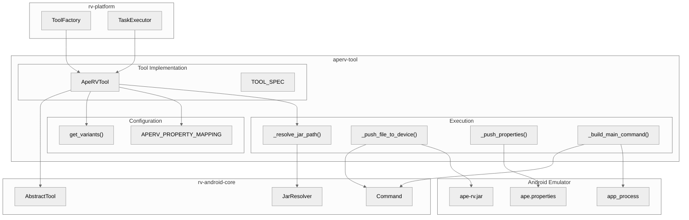
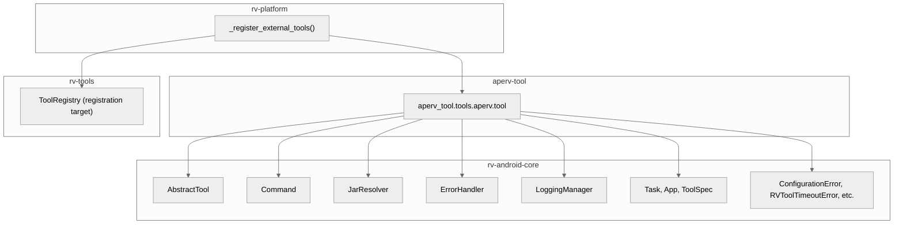
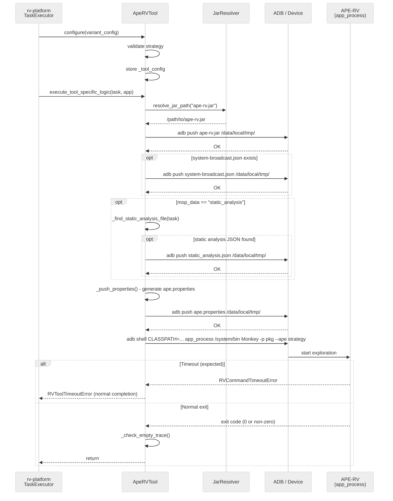
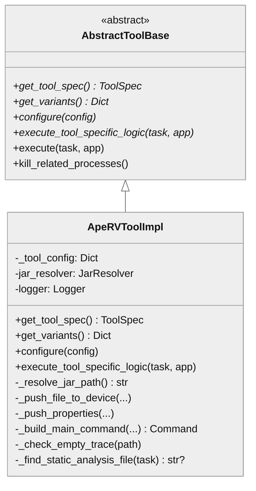
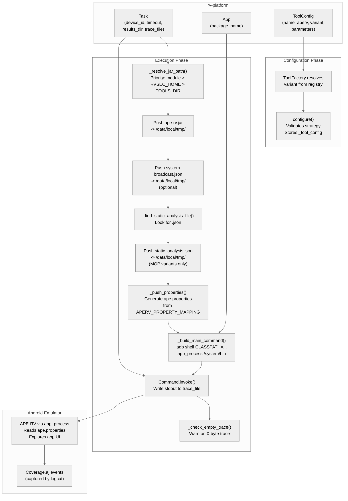

# APE-RV Tool Architecture

## Overview

The aperv-tool module wraps the APE-RV binary (`ape-rv.jar`) as an `AbstractTool` plugin for rv-platform integration. APE-RV is an enhanced fork of the AOSP Monkey tool that implements model-based UI exploration via the Widget Table Graph (WTG) model with adaptive random testing (SATA), BFS, DFS, and random strategies. The module handles JAR deployment to the Android device, strategy configuration via `ape.properties`, optional MOP-guided scoring using static analysis data, and optional LLM-guided exploration via an OpenAI-compatible endpoint. It runs inside the Android emulator via `app_process`, not as a standard JVM process.

## Specification Alignment

This module implements requirements from `openspec/specs/tools/spec.md` as an external tool registered by rv-platform.

### Functional Requirements

| FR | Description | Architectural Support |
|----|-------------|----------------------|
| FR18 | Plugin system with registry and factory patterns | `ApeRVTool` extends `AbstractTool` (rv-android-core) and registers via `ToolRegistry` in rv-platform's `_register_external_tools()` |
| FR20 | Per-tool variant system | `get_variants()` returns 13 named variants (default, sata, sata_mop, bfs, random, sata_llm, sata_mop_llm, plus 6 prompt experiment variants); `configure()` validates strategy eagerly |

### Key Invariants

| Invariant | Description | Enforcement Mechanism |
|-----------|-------------|----------------------|
| INV-TOOL-02 | Every registered tool must have a "default" variant | `get_variants()` returns a dictionary containing the "default" key, mapping to sata strategy |
| INV-TOOL-05 | Factory must call `configure()` before returning tool | `configure()` stores validated config in `_tool_config`; `execute_tool_specific_logic()` checks truthiness of `_tool_config` |
| INV-TOOL-06 | `execute()` must convert `RVCommandTimeoutError` to `RVToolTimeoutError` | `execute_tool_specific_logic()` catches `RVCommandTimeoutError` and re-raises as `RVToolTimeoutError` |
| INV-APV-01 | JAR resolution follows priority search order | `_resolve_jar_path()` searches: module directory, `$RVSEC_HOME/ape/target/`, `$TOOLS_DIR/aperv/` |
| INV-APV-02 | Invalid strategy must be rejected before device interaction | `configure()` validates strategy against `APERV_AVAILABLE_STRATEGIES` and raises `ConfigurationError` immediately |
| INV-APV-04 | Working directory must be `/system/bin` | `_build_main_command()` passes `/system/bin` as the working directory argument to `app_process` |
| INV-APV-07 | APE and APE-RV must not run concurrently | `TOOL_SPEC.process_pattern` is `com.android.commands.monkey`, shared with the builtin APE tool, so rv-platform's `kill_related_processes()` terminates either before launch |

### Specification Scenarios

Scenarios from `openspec/specs/tools/spec.md` that validate this architecture:
- **External tool registration**: rv-platform imports `ApeRVTool` in `_register_external_tools()`, checks `is_tool_registered("aperv")` for idempotency, and registers the tool class with all 13 variants -- traces through `rv_platform/__init__.py` -> `ToolRegistry` -> `ApeRVTool.get_tool_spec()` / `get_variants()`
- **Tool execution with variant**: rv-platform calls `ToolFactory.create_tool(tool_config)` which instantiates `ApeRVTool`, resolves the variant config, merges parameters, calls `configure()`, then `execute_tool_specific_logic()` -- traces through `ToolFactory` -> `ApeRVTool.configure()` -> `execute_tool_specific_logic()`

## Key Architectural Decisions

| Decision | Choice | Rationale |
|----------|--------|-----------|
| Application Type | Library (rv-platform plugin) | aperv-tool is a tool plugin, not standalone; rv-platform manages its lifecycle |
| Structuring | Single-class module | The tool has one responsibility (wrap APE-RV binary); a single `ApeRVTool` class with helper methods is sufficient |
| Primary Pattern | Template Method (via AbstractTool) | Inherits the `execute()` -> `execute_tool_specific_logic()` template from AbstractTool, gaining consistent timeout and cleanup handling |
| Control Strategy | Call-based, sequential | rv-platform calls `configure()` then `execute_tool_specific_logic()` in sequence; no internal concurrency |
| Configuration | Properties file injection | APE-RV reads `ape.properties` from the device; the tool generates this file from Python config and pushes via ADB |
| JAR Resolution | Priority search with JarResolver | Module-local JAR takes precedence over Maven build output, ensuring packaged JAR is used by default for reproducibility |
| Process Pattern | Shared with builtin APE | Both APE and APE-RV use `com.android.commands.monkey` -- mutual exclusion enforced by rv-platform process cleanup |
| LLM URL Override | Environment variable `APERV_LLM_BASE_URL` | Emulator uses `10.0.2.2` (host loopback alias); Docker and physical devices need different addresses |

### Why Properties File Injection?

APE-RV is a Java application running inside the Android emulator via `app_process`. It reads configuration from `ape.properties` on the device filesystem at startup. The Python wrapper generates this file dynamically because: (1) different variants need different configurations (throttle, MOP weights, LLM parameters), (2) configuration must be applied per-experiment without rebuilding the JAR, and (3) the `APERV_PROPERTY_MAPPING` dictionary serves as an explicit contract between Python config keys and Java property names, making the translation auditable. Keys not in the mapping (like `strategy` and `mop_data`) are Python-only control parameters consumed during execution, not configuration for the Java binary.

### Why Shared Process Pattern with APE?

Both the builtin APE tool (from rv-tools) and APE-RV run as `com.android.commands.monkey` on the Android device. This shared process pattern is a deliberate safety mechanism (INV-APV-07): rv-platform's `kill_related_processes()` terminates any running APE/APE-RV process before launching a new one. Since both tools use the same Android Monkey entry point (`app_process` with `CLASSPATH`), they cannot coexist on the same device. The shared pattern ensures stale processes from a previous experiment are cleaned up before the next run.

### Why Working Directory is /system/bin?

The `app_process` command requires the working directory as its first argument. APE-RV uses `/system/bin` (INV-APV-04) rather than `/data/local/tmp/` because the enhanced binary resolves internal Android framework classes relative to the system path. Using `/data/local/tmp/` causes `ClassNotFoundException` on some API levels because `app_process` cannot locate required system resources from that directory. This was discovered empirically during development and is a hard requirement.

### Why Module-Local JAR Has Highest Priority?

The JAR resolution priority (INV-APV-01) places the module directory first because experiment reproducibility requires using the exact binary that was packaged with the tool. If `$RVSEC_HOME/ape/target/` were checked first, a developer rebuilding the Java project mid-experiment would silently change the binary being used. The module-local JAR (shipped alongside `tool.py`) provides a stable reference point.

### Why Timeout is Expected Exit?

Exploration tools like APE-RV are designed to run indefinitely, exploring the application until killed. The `--running-minutes` flag sets a soft limit, but the tool may exceed it during state serialization. The +45s grace period on the Command timeout gives APE-RV time to flush its WTG model to disk and emit its coverage dump before the process is forcibly killed. `RVCommandTimeoutError` is re-raised as `RVToolTimeoutError`, which rv-platform treats as a completed run (not a failure) and proceeds to collect coverage from logcat.

## Architectural Patterns

### Pattern: Template Method (AbstractTool)

**Description**: `ApeRVTool` extends `AbstractTool` from rv-android-core. The base class defines `execute()` which calls the abstract `execute_tool_specific_logic()`, handles `RVCommandTimeoutError` conversion, and performs process cleanup via `kill_related_processes()`. ApeRVTool implements only the tool-specific logic.

**When Used**: Every tool in the rv-android system uses this pattern. It ensures consistent timeout handling (timeouts are expected, not errors), process cleanup, and error handling across all tools.

**Advantages**:
- Consistent behavior: timeout handling, cleanup, and error reporting are identical across tools
- Tool implementors focus only on tool-specific logic

**Disadvantages**:
- Inheritance coupling: changes to AbstractTool affect all tools

### Pattern: Variant Configuration

**Description**: `get_variants()` returns a dictionary of named configurations. Each variant is a frozen dictionary of parameters that `configure()` merges into `_tool_config`. The `APERV_PROPERTY_MAPPING` dictionary translates Python config keys to Java property names for `ape.properties` generation. Python-only keys (e.g., `strategy`, `mop_data`) are excluded from the properties file automatically because they have no mapping entry.

**When Used**: When the experiment configuration specifies a variant (e.g., `aperv:sata_mop`), `ToolFactory` resolves the variant config, merges any parameter overrides, and calls `configure()`.

**Advantages**:
- Declarative variant definitions: adding a variant requires only a dictionary entry
- Type safety: `configure()` validates strategy eagerly before device interaction

**Disadvantages**:
- All variants defined statically in code; no file-based variant definitions

---

## Logical View

Shows key domain entities and their relationships.

### Domain Entities

| Entity | Responsibility |
|--------|----------------|
| ApeRVTool | Wraps APE-RV binary as an AbstractTool; manages JAR push, properties push, command execution, and trace capture |
| ToolSpec | Metadata describing the tool: name, description, URL, version, process pattern |
| JarResolver | Resolves the path to `ape-rv.jar` via priority search across configured directories |
| Command | Encapsulates an ADB shell command with timeout; used for both file push and main execution |
| APERV_PROPERTY_MAPPING | Maps Python config keys to Java `ape.properties` keys; controls what is written to the device |

### Component Architecture



---

## Development View

Shows code organization for developers.

### Module Structure

```
aperv-tool/
├── src/
│   └── aperv_tool/
│       ├── __init__.py
│       └── tools/
│           ├── __init__.py
│           └── aperv/
│               ├── __init__.py
│               ├── tool.py              # ApeRVTool class, constants, property mapping
│               ├── ape-rv.jar           # APE-RV binary (gitignored; built from ape source at Docker image build)
│               └── system-broadcast.json # Broadcast intent catalog for component triggering
├── tests/
│   ├── __init__.py
│   └── test_aperv_tool.py              # 9 test classes covering spec, variants, config, commands
└── pyproject.toml
```

### Package Dependencies



---

## Process View

Shows the runtime execution sequence when rv-platform dispatches an APE-RV task.

### Execution Flow



---

## Core Components

### ApeRVTool

**Purpose**: Implements the `AbstractTool` interface for APE-RV, managing the complete device interaction lifecycle: JAR resolution, file deployment, properties generation, command execution, and trace validation.

**Location**: `src/aperv_tool/tools/aperv/tool.py`

**Key Classes**:
- `ApeRVTool`: Main tool class extending `AbstractTool`. Single class with 8 methods covering configuration, JAR resolution, file push, properties generation, command building, execution, and trace checking.

**Dependencies**:
- Internal: `rv-android-core` (AbstractTool, Command, JarResolver, ErrorHandler, LoggingManager, domain models, exceptions)
- External: None (uses only stdlib `os`, `tempfile`)

### Constants and Configuration Mapping

**Purpose**: Define device paths, available strategies, and the Python-to-Java property name mapping.

**Location**: `src/aperv_tool/tools/aperv/tool.py` (module-level constants)

**Key Constants**:
- `APERV_TOOL_NAME = "aperv"` -- registry key
- `APERV_JAR_NAME = "ape-rv.jar"` -- JAR filename for resolution
- `APERV_DEVICE_JAR_PATH = "/data/local/tmp/ape-rv.jar"` -- target path on device
- `APERV_DEVICE_PROPERTIES_PATH = "/data/local/tmp/ape.properties"` -- properties target
- `APERV_MAIN_CLASS = "com.android.commands.monkey.Monkey"` -- Java entry point
- `APERV_AVAILABLE_STRATEGIES = ["sata", "random", "bfs", "dfs"]` -- valid strategies
- `APERV_PROPERTY_MAPPING` -- 18-entry dictionary mapping Python config keys to Java `ape.*` property names (exploration, MOP weight, and LLM parameters)

### Variant System

**Purpose**: Define 13 named configurations covering base strategies, MOP-guided scoring, LLM guidance, and prompt experiment variants.

**Location**: `src/aperv_tool/tools/aperv/tool.py` (`get_variants()` classmethod)

**Variants**:
- **Base** (5): `default` (sata), `sata`, `bfs`, `random`, `sata_mop` (sata + static analysis MOP data)
- **LLM** (2): `sata_llm` (sata + LLM), `sata_mop_llm` (sata + MOP + LLM)
- **Prompt experiment** (6): `sata_mop_llm_{variant}` for `ape_current`, `ape_reasoning`, `compact_v1`, `v13`, `v17`, `visual_only` -- all use sata + MOP + LLM at 70% rate, differing only in `llm_prompt_variant`

---

## NFR Support

How the architecture supports non-functional requirements from the PRD.

| NFR | PRD ID | Priority | Architectural Support |
|-----|--------|----------|----------------------|
| Modularity | NFR01 | P0 | Standalone uv workspace module with clear dependency on rv-android-core and rv-tools only; registered lazily by rv-platform |
| Extensibility | NFR02 | P0 | New variants added by appending to `get_variants()` dictionary; new properties added by extending `APERV_PROPERTY_MAPPING` |
| Testability | NFR03 | P1 | 9 test classes with 30+ test methods covering spec, variants, configure validation, JAR paths, command building, constants, empty trace, LLM properties, and calibration parameters |
| Resilience | NFR04 | P1 | Timeout treated as expected exit (re-raised as `RVToolTimeoutError`); non-zero exit codes logged as debug (APE-RV reports app crashes this way); empty trace produces warning, not error |
| Configurability | NFR05 | P1 | `APERV_LLM_BASE_URL` env var overrides LLM URL; `RVSEC_HOME` and `TOOLS_DIR` env vars extend JAR search paths; `ape.properties` generated from `_tool_config` via mapping |
| Reproducibility | NFR08 | P1 | Module-local JAR (`ape-rv.jar` shipped alongside `tool.py`) takes priority in resolution, ensuring experiments use the packaged binary |

---

## Key Interfaces

### AbstractTool (from rv-android-core)

```python
class AbstractTool(ABC):
    """Base class for all testing tools in rv-android."""

    def get_tool_spec(cls) -> ToolSpec: ...
    def get_variants(cls) -> Dict[str, Dict[str, Any]]: ...
    def configure(self, config: Dict[str, Any]) -> None: ...
    def execute_tool_specific_logic(self, task: Task, app: App) -> None: ...
```



---

## Scenarios

### Scenario 1: SATA Exploration with MOP Guidance

**Description**: An experiment runs APE-RV with the `sata_mop` variant, which uses adaptive random exploration biased toward screens containing monitored operations.

**Flow**:
1. rv-experiment generates a task with `tool_config = ToolConfig(name="aperv", variant="sata_mop")`
2. rv-platform's `ToolFactory` instantiates `ApeRVTool`, resolves the `sata_mop` variant config (`strategy=sata`, `mop_data=static_analysis`, `throttle_ms=200`), and calls `configure()`
3. `configure()` validates `strategy="sata"` against `APERV_AVAILABLE_STRATEGIES` and stores the config
4. `execute_tool_specific_logic()` resolves `ape-rv.jar` via `JarResolver` and pushes it to the device
5. The tool finds the static analysis JSON in `task.results_dir` and pushes it as `/data/local/tmp/static_analysis.json`
6. `_push_properties()` generates `ape.properties` with `ape.defaultGUIThrottle=200` and `ape.mopDataPath=/data/local/tmp/static_analysis.json`
7. APE-RV runs via `app_process` on the device, using the static analysis data to bias exploration toward MOP-relevant screens
8. After timeout, `RVCommandTimeoutError` is caught and re-raised as `RVToolTimeoutError` (normal completion)
9. rv-platform collects coverage from logcat independently

### Scenario 2: LLM-Guided Exploration with Prompt Variant

**Description**: An experiment runs the `sata_mop_llm_v17` prompt variant, which uses SATA + MOP + LLM at 70% rate with the `v17` prompt variant.

**Flow**:
1. rv-experiment specifies `aperv:sata_mop_llm_v17` in the tool configuration
2. `ToolFactory` resolves the variant, which includes `llm_url=http://10.0.2.2:30000/v1`, `llm_percentage=0.7`, `llm_prompt_variant=v17`
3. `configure()` validates strategy and checks `APERV_LLM_BASE_URL` env var for URL override
4. Execution pushes JAR, static analysis JSON, broadcast catalog, and generates `ape.properties` with all 18 mapped properties (exploration + MOP weights + LLM parameters)
5. APE-RV queries the SGLang server at the configured URL during exploration, using the v17 prompt variant for 70% of decisions

---

## Data Flow

This section describes how data flows through aperv-tool from rv-platform input to APE-RV execution on the Android device.

### End-to-End Data Flow



### Properties Generation Flow

The `_push_properties()` method translates Python configuration keys to Java property names using `APERV_PROPERTY_MAPPING`. This is a deliberate filtering mechanism: only keys that appear in the mapping are written to the device. Python-only control keys (`strategy`, `mop_data`) are excluded automatically because they have no mapping entry.

| Python Key | Java Property | Category |
|-----------|--------------|----------|
| `throttle_ms` | `ape.defaultGUIThrottle` | Exploration |
| `default_epsilon` | `ape.defaultEpsilon` | Exploration |
| `graph_stable_restart_threshold` | `ape.graphStableRestartThreshold` | Exploration |
| `mop_weight_direct` | `ape.mopWeightDirect` | MOP scoring |
| `mop_weight_transitive` | `ape.mopWeightTransitive` | MOP scoring |
| `mop_weight_activity` | `ape.mopWeightActivity` | MOP scoring |
| `llm_url` | `ape.llmUrl` | LLM |
| `llm_percentage` | `ape.llmPercentage` | LLM |
| `llm_prompt_variant` | `ape.llmPromptVariant` | LLM |

When `mop_json_pushed` is True, the generated properties also include `ape.mopDataPath=/data/local/tmp/static_analysis.json`, pointing APE-RV to the static analysis JSON pushed earlier.

### MOP Data Flow (sata_mop variants)

For MOP-guided variants, static analysis data flows from rv-platform's pre-processing through to APE-RV's scoring engine:

1. rv-experiment runs GATOR static analysis during pre-processing, producing `<apk_name>.json` in `task.results_dir`
2. `_find_static_analysis_file(task)` locates this JSON by constructing the expected path
3. The JSON is pushed to `/data/local/tmp/static_analysis.json` on the device
4. `_push_properties()` includes `ape.mopDataPath` pointing to the pushed file
5. APE-RV reads the JSON at startup, mapping activities to monitored operations
6. During exploration, APE-RV biases action selection toward screens where monitored operations are reachable

If the static analysis file is not found, the tool logs a warning and runs without MOP data -- APE-RV degrades gracefully to pure strategy-based exploration.

### LLM Data Flow (LLM variants)

For LLM-guided variants, the data flow involves network communication between the emulator and the host:

1. `configure()` checks `APERV_LLM_BASE_URL` environment variable for URL override
2. `_push_properties()` writes LLM configuration (URL, model, temperature, top_p, top_k, timeout, percentage, prompt variant) to `ape.properties`
3. APE-RV reads these properties at startup and initializes its LLM client
4. During exploration, APE-RV sends requests to the SGLang server at the configured URL
5. Inside the emulator, `10.0.2.2` routes to the host machine's loopback address
6. The SGLang server returns action suggestions that APE-RV integrates with its WTG model

The `APERV_LLM_BASE_URL` override exists because the emulator's `10.0.2.2` alias does not work in Docker containers (where the SGLang server is at the Docker host's IP) or on physical devices (where the server is at the development machine's network IP).

---

## Extension Points

- **Adding a variant**: Add an entry to the dictionary returned by `get_variants()`. If the variant uses new configuration parameters, add corresponding entries to `APERV_PROPERTY_MAPPING`.
- **Adding a strategy**: Add the strategy name to `APERV_AVAILABLE_STRATEGIES`. The strategy string is passed directly to APE-RV's `--ape` flag.
- **Changing the JAR**: The shipped jar is built from `ape` source at Docker image build (`docker/rvandroid/Dockerfile`: clone → `mvn package` → copy); it is gitignored, never committed. To change what ships, change the `ape` source (or pin the clone ref in the Dockerfile). For local non-Docker runs, place a built `ape-rv.jar` in `src/aperv_tool/tools/aperv/` — the module-local path has highest resolution priority.
- **LLM URL override**: Set `APERV_LLM_BASE_URL` environment variable to redirect LLM requests to a different endpoint (used in Docker environments).

## Dependencies

### Internal (rv-android modules)

| Module | Purpose |
|--------|---------|
| rv-android-core | AbstractTool base class, Command for ADB invocation, JarResolver for JAR lookup, ErrorHandler for error management, LoggingManager for structured logging, domain models (Task, App, ToolSpec), exception classes |
| rv-tools | ToolRegistry where the tool is registered (registration performed by rv-platform) |

### External

| Package | Version | Purpose |
|---------|---------|---------|
| (none) | - | aperv-tool has no external dependencies beyond rv-android-core and rv-tools |

## Testing Strategy

| Type | Location | Purpose |
|------|----------|---------|
| Unit | tests/test_aperv_tool.py | 9 test classes: ToolSpec metadata, variant structure (INV-APV-05), configure validation (INV-APV-02), JAR search paths (INV-APV-01), command building (INV-APV-04), constants (INV-APV-03), empty trace detection, LLM properties generation, calibration parameter mapping |

## Related Documentation

- [Tool Infrastructure Spec](../../openspec/specs/tools/spec.md) - Requirements and invariants for the tool plugin system
- [PRD](../../docs/PRD.md) - Product Requirements Document (FR18-FR20, NFR01-08)
- [CLAUDE.md](../../CLAUDE.md) - Quick reference for Claude Code
- [rv-platform Architecture](../rv-platform/docs/architecture.md) - How rv-platform registers and dispatches external tools
