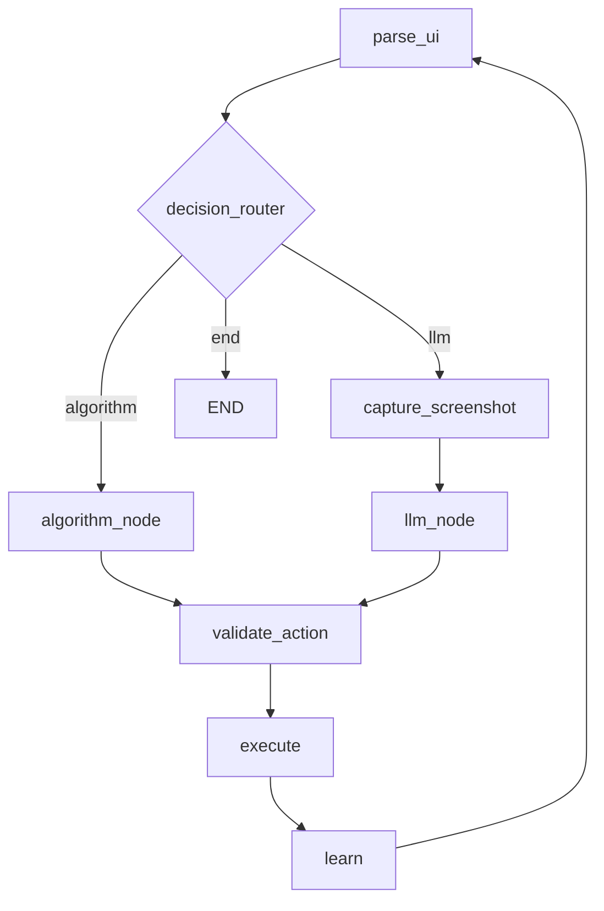

# rv-agent

Autonomous Android testing agent with LangChain and SGLang for vision-based UI exploration.

## Overview

RV-Agent is the LLM-driven testing module for Android application exploration in the rv-android framework. It uses Qwen3-VL vision-language models to understand Android UI screenshots and interact with applications intelligently. The agent combines LLM-based semantic understanding with algorithmic exploration strategies using LangGraph for workflow orchestration.

## Installation

```bash
# Install with all rv-android modules
cd modules && ./install.sh

# Or install just this module
cd modules && ./install.sh rv-agent
```

## Prerequisites

- Python 3.12+
- Android emulator or device (connected via ADB)
- SGLang server running with Qwen3-VL model (for LLM modes)

## Quick Start

### CLI Usage

```bash
# Basic usage with multimode (70% LLM / 30% algorithm)
poetry run rv-agent run --package com.example.app

# With specific device and timeout
poetry run rv-agent run --package com.example.app --device emulator-5554 --timeout 600

# With debug logging
poetry run rv-agent run --package com.example.app --debug

# Test configuration and connections
poetry run rv-agent test
```

### Programmatic Usage

```python
from rv_agent.config.agent_config import RVAgentConfig
from rv_agent.agent.agent_factory import AgentFactory

# Create configuration
config = RVAgentConfig(
    package_name="com.example.app",
    device_id="emulator-5554",
    agent_mode="multimode",
    llm_probability=0.7,
    timeout=300,
    strategy="rvagent"
)

# Create agent with factory
agent = AgentFactory.create_agent(config)

# Run exploration
results = agent.run()
print(f"Explored {results['unique_states']} states in {results['iterations']} iterations")
```

### Integration with rv-platform

```bash
# Run via rv-experiment
poetry run rv-experiment run --tools rv-agent:multimode --apks-dir ./apks_examples

# Run via rv-platform directly
poetry run rv-platform run --tools rv-agent --apks-dir ./apks_examples
```

## Features

- **Vision-Based UI Understanding**: Uses Qwen3-VL multimodal model to analyze screenshots and identify interactive elements
- **Hybrid Exploration**: Combines LLM intelligence with algorithmic strategies for optimal coverage
- **Three Execution Modes**: `pure_algorithm` (no LLM), `llm_only`, and `multimode` (hybrid)
- **WTG-Guided Navigation**: Uses Window Transition Graph from static analysis for navigation guidance
- **MOP-Aware Prioritization**: Prioritizes actions that reach monitored operations
- **Coordinate Normalization**: Handles Qwen3-VL [0, 1000) coordinate space conversion to device pixels
- **Stateless LLM Context**: Fresh context each iteration (~2500 tokens) prevents context overflow

## Execution Modes

| Mode | Description | Use Case |
|------|-------------|----------|
| `pure_algorithm` | Algorithmic exploration only | Baseline testing, no LLM server |
| `llm_only` | LLM-driven exploration | Maximum semantic understanding |
| `multimode` | 70% LLM / 30% algorithm (default) | Balanced coverage and intelligence |

Set mode via environment variable or configuration:

```bash
# Via environment variable
RVAGENT_MODE=pure_algorithm poetry run rv-agent run --package com.example.app

# Via configuration
config = RVAgentConfig(package_name="com.example.app", agent_mode="llm_only")
```

## Configuration

### CLI Options

| Option | Short | Default | Description |
|--------|-------|---------|-------------|
| `--package` | `-p` | (required) | Android package name to test |
| `--device` | `-d` | `emulator-5554` | Device ID for connection |
| `--timeout` | `-t` | `300` | Execution timeout in seconds |
| `--output-dir` | `-o` | `./rvagent_results` | Output directory for results |
| `--debug` | `-v` | `false` | Enable debug logging |
| `--objective` | | `explore_application` | Testing objective description |

### Configuration Options

| Option | Type | Default | Description |
|--------|------|---------|-------------|
| `package_name` | str | (required) | Target application package name |
| `device_id` | str | `emulator-5554` | Android device/emulator ID |
| `agent_mode` | str | `multimode` | Execution mode |
| `llm_probability` | float | `0.7` | LLM probability in multimode (0.0-1.0) |
| `timeout` | int | `300` | Execution timeout in seconds |
| `strategy` | str | `rvagent` | Exploration strategy (rvagent, dfs, bfs, greedy) |
| `llm_model` | str | `Qwen/Qwen3-VL-4B-Instruct` | LLM model identifier |
| `llm_base_url` | str | `http://192.168.0.36:30000/v1` | SGLang server URL |
| `llm_temperature` | float | `0.01` | LLM temperature |
| `prompt_version` | str | `v13` | Prompt version (v12-v16) |
| `stochastic_probability` | float | `0.3` | Gumbel-max stochastic selection probability |
| `static_analysis_path` | str | `None` | Path to GATOR output for WTG guidance |

### Environment Variables

| Variable | Description | Default |
|----------|-------------|---------|
| `RVAGENT_MODE` | Override agent mode | (from config) |
| `RVAGENT_LOG_LEVEL` | Log level (DEBUG, INFO, WARNING, ERROR) | `INFO` |
| `RVAGENT_VERBOSE_COUNTERS` | Enable detailed counter logging | `false` |

## Usage Examples

### Example 1: Basic App Exploration

```bash
# Explore an app for 5 minutes
poetry run rv-agent run --package br.unb.cic.cryptoapp --timeout 300

# Results saved to ./rvagent_results/
```

### Example 2: Targeted Testing with Custom Objective

```bash
poetry run rv-agent run \
  --package com.example.app \
  --objective "Test the login flow and verify authentication" \
  --timeout 600 \
  --debug
```

### Example 3: Pure Algorithm Mode (No LLM)

```python
from rv_agent.config.agent_config import RVAgentConfig
from rv_agent.agent.agent_factory import AgentFactory

config = RVAgentConfig(
    package_name="com.example.app",
    agent_mode="pure_algorithm",
    strategy="rvagent",
    timeout=600
)

agent = AgentFactory.create_agent(config)
results = agent.run()
```

### Example 4: With Static Analysis Data

```python
from rv_agent.config.agent_config import RVAgentConfig
from rv_agent.agent.agent_factory import AgentFactory

config = RVAgentConfig(
    package_name="com.example.app",
    agent_mode="multimode",
    static_analysis_path="/path/to/gator_output",  # WTG and MOP data
    timeout=600
)

agent = AgentFactory.create_agent(config)
results = agent.run()
```

## SGLang Server Setup

RV-Agent uses SGLang with Qwen3-VL as the LLM backend:

```bash
# Install SGLang
pip install sglang[all]

# Start SGLang server with Qwen3-VL
python -m sglang.launch_server \
    --model-path Qwen/Qwen3-VL-4B-Instruct \
    --port 30000 \
    --attention-backend flashinfer \
    --tool-call-parser qwen \
    --trust-remote-code
```

Connect RV-Agent to a remote SGLang server:

```bash
# Remote SGLang server
poetry run rv-agent run --package com.example.app

# With custom URL (via configuration)
config = RVAgentConfig(
    package_name="com.example.app",
    llm_base_url="http://192.168.0.21:30000/v1"
)
```

## Workflow Overview

The agent uses a LangGraph workflow with the following nodes:

```
%%{init: {'theme': 'neutral'}}%%
```



1. **parse_ui** - Capture and parse the current UI state
2. **decision_router** - Route to LLM, algorithm, or end
3. **algorithm / llm** - Generate action based on mode
4. **validate_action** - Validate the proposed action
5. **execute** - Execute the action on device
6. **learn** - Update memory and detect stuck states

## Dependencies

### Internal (rv-android)

| Module | Purpose |
|--------|---------|
| rv-android-core | Foundation: domain models, event system, logging |
| rv-screen-parser | UI parsing with visitor patterns |
| rv-uiautomator | UIAutomator2 adapter for device interaction |
| rv-static-analysis | GATOR/GESDA integration for WTG and MOP data |

### External

| Package | Purpose |
|---------|---------|
| langchain | LLM framework |
| langchain-openai | OpenAI-compatible API (SGLang) |
| langgraph | Workflow orchestration |
| pydantic | Configuration validation |
| pillow | Image processing for screenshots |
| click | CLI framework |
| faker | Test data generation |

## Documentation

| Document | Purpose |
|----------|---------|
| [CLAUDE.md](./CLAUDE.md) | Development reference for Claude Code |

## Testing

```bash
cd modules/rv-agent

# Run all unit tests (fast, no external dependencies)
PYTHONPATH=../rv-android-core/src:src poetry run pytest tests/unit/ -v

# Run smoke tests (quick sanity checks)
PYTHONPATH=../rv-android-core/src:src poetry run pytest tests/smoke/ -v

# Run integration tests
PYTHONPATH=../rv-android-core/src:src poetry run pytest tests/integration/ -v

# Run online tests (requires device and LLM server)
PYTHONPATH=../rv-android-core/src:src poetry run pytest tests/online/ -v

# Run with coverage
PYTHONPATH=../rv-android-core/src:src poetry run pytest tests/ -v --cov=src/rv_agent
```

### Test Structure

| Directory | Purpose |
|-----------|---------|
| `tests/unit/` | Isolated unit tests (no external deps) |
| `tests/integration/` | Component integration tests |
| `tests/smoke/` | Quick sanity checks |
| `tests/online/` | Tests requiring device/LLM server |
| `tests/performance/` | Performance and latency tests |

## Troubleshooting

### SGLang Connection Issues

If the agent cannot connect to SGLang:

1. Verify server is running: `curl http://localhost:30000/health`
2. Check firewall: Ensure port 30000 is accessible
3. Verify model loaded: Check SGLang logs for model initialization

### Tool Calling Not Working

If the LLM outputs text instead of tool calls:

1. Ensure `--tool-call-parser qwen` is passed to SGLang server
2. Check model: Only Qwen3-VL models support native tool calling
3. The hybrid parser in `tool_call_parser.py` handles both native and XML formats

## License

Part of the rv-android project.
