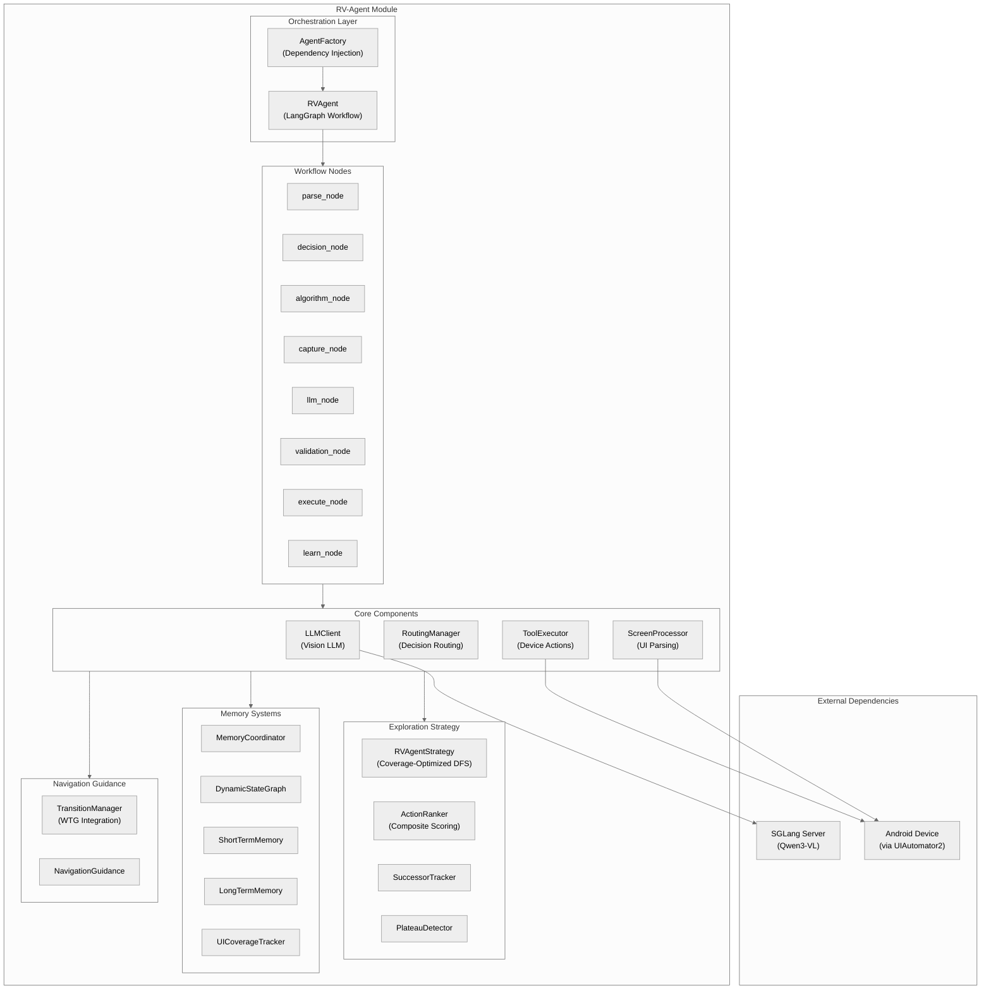
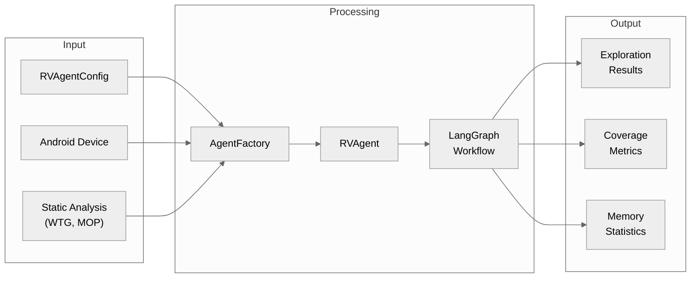
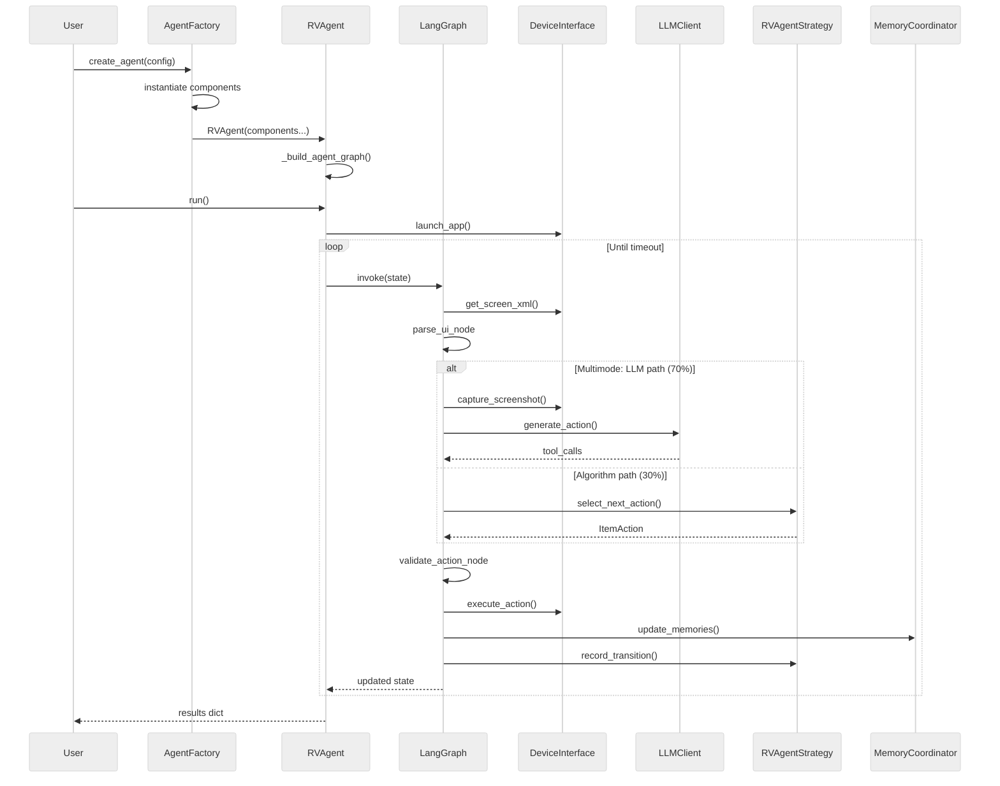
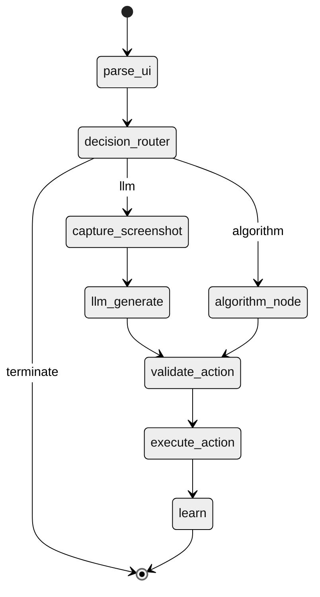
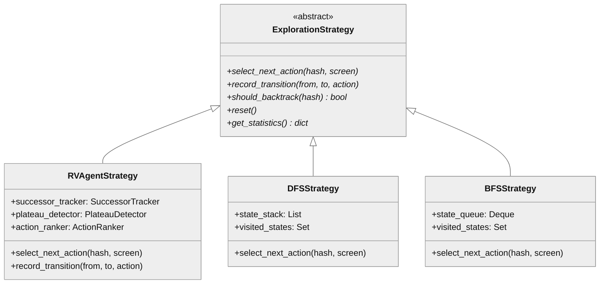
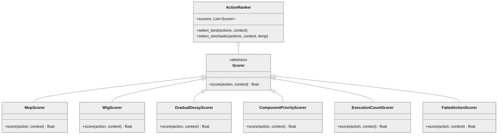

# RV-Agent Architecture

## Overview

RV-Agent is an autonomous Android testing agent that combines vision-language models (Qwen3-VL via SGLang) with algorithmic exploration strategies to systematically explore Android applications. It uses LangGraph for workflow orchestration and supports three execution modes: pure algorithm, LLM-only, and multimode (hybrid).

The module serves as the primary LLM-driven testing component in the rv-android framework, enabling intelligent UI exploration that understands semantic context through visual analysis while maintaining coverage guarantees through algorithmic fallbacks.

## Design Principles

- **Component-Based Architecture**: All dependencies injected via constructor, enabling testing and flexible composition
- **Stateless LLM Context**: Fresh messages built each iteration (~2500 tokens) to prevent context overflow
- **Hybrid Exploration**: Probabilistic mixing of LLM intelligence (70%) with algorithmic coverage (30%)
- **Coordinate-Based Tracking**: Actions tracked by screen coordinates, not volatile UI element IDs
- **Pre-Marking Execution**: Actions marked as executed before execution to prevent crash loops
- **Continuous Exploration**: No "exhausted" state - explores until timeout using least-executed actions

## Component Architecture



## Core Components

### RVAgent

**Purpose**: Main orchestrator that builds and executes the LangGraph workflow for Android exploration.

**Location**: `src/rv_agent/agent/rv_agent.py`

**Key Classes**:
- `RVAgent`: Orchestrates exploration workflow, manages external timeout loop, coordinates component interactions

**Responsibilities**:
- Build LangGraph workflow with conditional routing
- Execute timeout-controlled exploration loop
- Coordinate stuck detection and recovery
- Report exploration metrics and results

**Dependencies**:
- Internal: All injected components (device, strategy, LLM client, memory)
- External: langgraph, langchain-core

### AgentFactory

**Purpose**: Factory pattern for centralized dependency injection and agent creation.

**Location**: `src/rv_agent/agent/agent_factory.py`

**Key Classes**:
- `AgentFactory`: Creates fully configured RVAgent instances with all dependencies

**Responsibilities**:
- Instantiate all components in correct dependency order
- Wire dependency injection relationships
- Validate configuration before instantiation
- Support device injection for testing

### LLMClient

**Purpose**: Vision LLM communication for multimodal action generation.

**Location**: `src/rv_agent/llm/llm_client.py`

**Key Classes**:
- `LLMClient`: Wraps LangChain ChatOpenAI for SGLang backend

**Responsibilities**:
- Build multimodal messages with screenshot and UI elements
- Handle hybrid tool call parsing (native + fallback XML/JSON)
- Track token usage and latency metrics
- Manage stateless context construction

**Dependencies**:
- Internal: RVAgentConfig, prompt modules
- External: langchain-openai, langchain-core

### RVAgentStrategy

**Purpose**: Coverage-optimized DFS exploration with successor tracking and MOP prioritization.

**Location**: `src/rv_agent/strategies/rvagent_strategy/rvagent_strategy.py`

**Key Classes**:
- `RVAgentStrategy`: Main exploration strategy with action ranking
- `SuccessorTracker`: Tracks action destinations for re-enabling
- `PlateauDetector`: Detects exploration stagnation
- `ActionRanker`: Composite scoring for action selection

**Responsibilities**:
- Select next action using coverage-optimized algorithm
- Track and re-enable actions with incomplete successors
- Generate test values for input fields
- Calculate action priority scores

**Dependencies**:
- Internal: DynamicStateGraph, UICoverageTracker, TransitionManager
- External: scipy (for Gumbel-max selection)

### RoutingManager

**Purpose**: Decision routing between LLM and algorithmic exploration paths.

**Location**: `src/rv_agent/routing/routing_manager.py`

**Key Classes**:
- `RoutingManager`: Routes decisions based on mode and probability
- `FallbackManager`: Manages fallback strategy selection
- `StuckRecovery`: Backtrack BFS for stuck state recovery

**Responsibilities**:
- Implement three execution modes (pure_algorithm, llm_only, multimode)
- Validate actions before execution
- Track decision counters for 70/30 proportion validation
- Handle stuck state recovery

### MemoryCoordinator

**Purpose**: Coordinates updates across all memory systems and generates summaries.

**Location**: `src/rv_agent/memory/memory_coordinator.py`

**Key Classes**:
- `MemoryCoordinator`: Facade for all memory operations
- `DynamicStateGraph`: Graph-based state tracking
- `ShortTermMemory`: Recent iteration records
- `LongTermMemory`: State visit patterns
- `UICoverageTracker`: Element interaction tracking

**Responsibilities**:
- Update all memory systems after action execution
- Generate stateless summaries for LLM context
- Track state discovery and transitions
- Provide continuation logic based on timeout

### TransitionManager

**Purpose**: Integrates static WTG (Window Transition Graph) with dynamic exploration.

**Location**: `src/rv_agent/services/transition_manager.py`

**Key Classes**:
- `TransitionManager`: Maps static navigation knowledge to runtime
- `NavigationGuidance`: Unified hints for LLM and algorithm

**Responsibilities**:
- Map activity names to static Window IDs
- Identify unvisited targets reachable from current screen
- Calculate priority scores for navigation targets
- Provide navigation hints to guide exploration

## Data Flow



## Execution Flow



## LangGraph Workflow Structure



## Key Interfaces

### ExplorationStrategy

```python
class ExplorationStrategy(ABC):
    """Abstract base class for exploration strategies."""

    @abstractmethod
    def select_next_action(
        self,
        current_hash: str,
        screen_desc: ScreenDescription
    ) -> Optional[ItemAction]:
        """Select next action to execute."""
        ...

    @abstractmethod
    def record_transition(
        self,
        from_hash: str,
        to_hash: str,
        action: ItemAction
    ):
        """Record state transition after action execution."""
        ...

    @abstractmethod
    def should_backtrack(self, current_hash: str) -> bool:
        """Determine if backtracking is needed."""
        ...
```



### Action Scoring System



| Scorer | Score Range | Purpose |
|--------|-------------|---------|
| GradualDecayScorer | 200 * 0.7^visits | Exponential decay prevents premature abandonment |
| MopScorer | +100 (DM), +50 (M) | Prioritize MOP-reaching actions |
| WtgScorer | +100 | Prioritize WTG-guided transitions |
| ComponentPriorityScorer | +50 (buttons), +40 (toggles) | Widget type priority |
| ExecutionCountScorer | 10/(1+count) | Lower count = higher score |
| FailedActionScorer | -9999 | Blacklist crash-causing actions |

## Extension Points

- **Custom Strategies**: Implement `ExplorationStrategy` abstract class to add new exploration algorithms
- **Custom Scorers**: Implement `Scorer` abstract class and register with `ActionRanker` for custom prioritization
- **Prompt Versions**: Create new modules in `prompts/` directory (v12.py, v13.py, etc.) for different LLM instruction sets
- **Tool Parsers**: Add parsing strategies in `tool_call_parser.py` for new LLM output formats

## Dependencies

### Internal (rv-android modules)

| Module | Purpose |
|--------|---------|
| rv-android-core | Foundation: domain models, event system, logging, validation |
| rv-screen-parser | UI parsing with visitor patterns for screen analysis |
| rv-uiautomator | UIAutomator2 adapter for device interaction |
| rv-static-analysis | GATOR/GESDA/REACH integration for WTG and MOP data |

### External

| Package | Version | Purpose |
|---------|---------|---------|
| langchain | ^0.3 | LLM framework |
| langchain-openai | ^0.3 | OpenAI-compatible API (SGLang) |
| langgraph | ^0.3 | Workflow orchestration |
| pydantic | ^2.9 | Configuration validation |
| pillow | ^10.0 | Image processing for screenshots |
| httpx | ^0.28 | HTTP client for LLM API |
| click | ^8.1 | CLI framework |
| faker | ^29.0 | Test data generation |
| scipy | ^1.14 | Statistical functions (Gumbel-max) |

## Testing Strategy

| Type | Location | Purpose |
|------|----------|---------|
| Unit | tests/unit/ | Isolated component tests (no external deps) |
| Integration | tests/integration/ | Component interaction tests |
| Smoke | tests/smoke/ | Quick sanity checks (imports, connectivity) |
| Online | tests/online/ | Tests requiring device/LLM server |
| Performance | tests/performance/ | Latency and proportion validation |
| Regression | tests/regression/ | Baseline comparison tests |

### Running Tests

```bash
# Unit tests (fast, no external dependencies)
uv run pytest tests/unit/ -v

# Smoke tests (quick sanity checks)
uv run pytest tests/smoke/ -v

# All tests with coverage
uv run pytest tests/ -v --cov=src/rv_agent
```

## Related Documentation

- [CLAUDE.md](../CLAUDE.md) - Quick reference for Claude Code assistance
- [RV-Android Architecture](../../../docs/rv_android_architecture.md) - Overall system architecture
