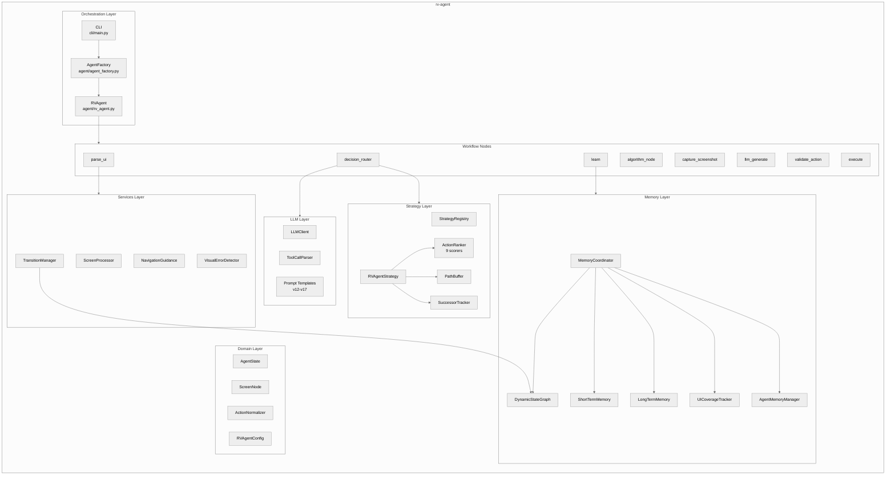
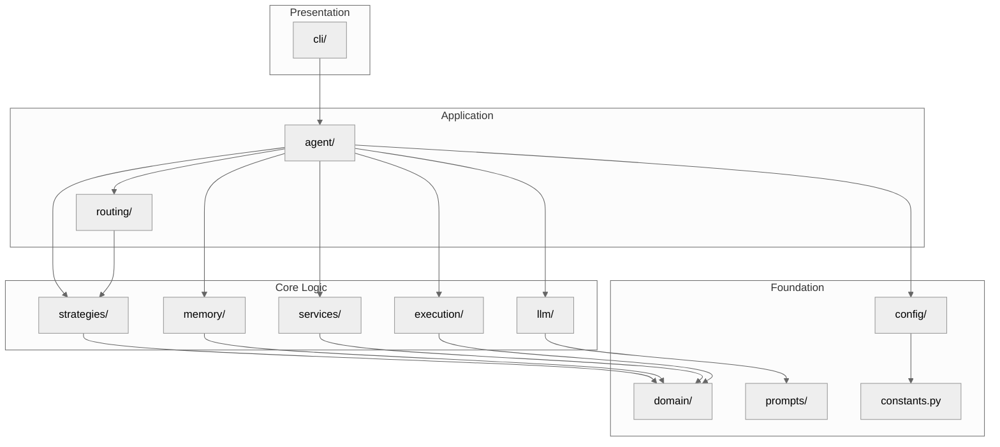
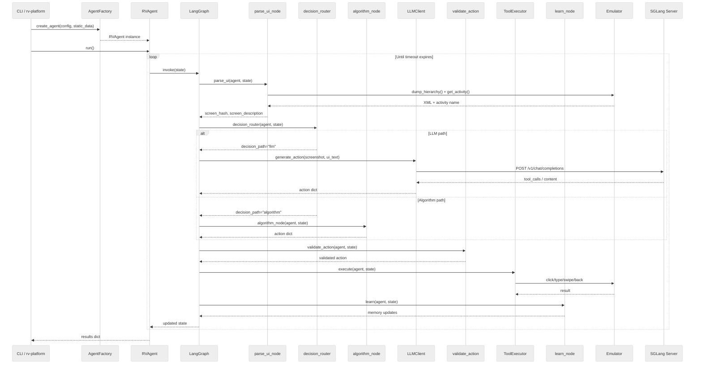
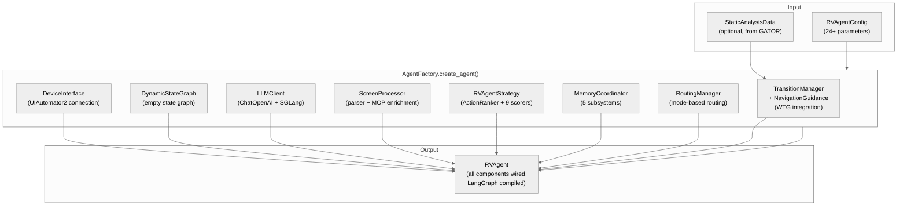
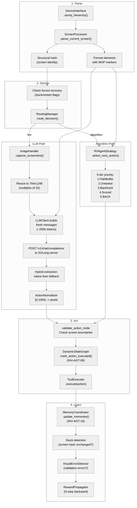
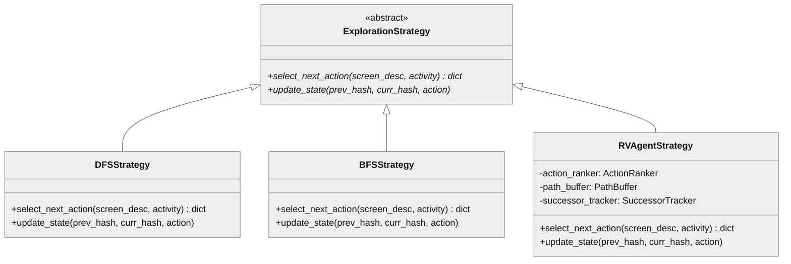
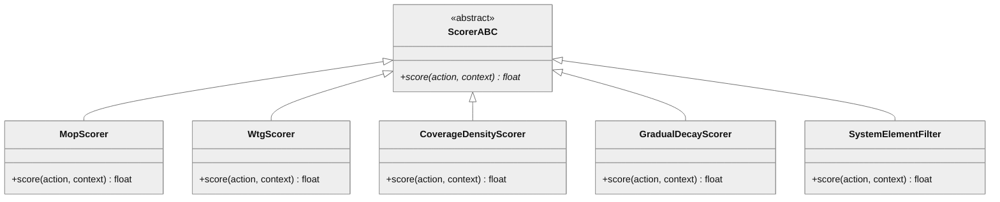

# rv-agent Architecture

## Overview

rv-agent is the LLM-driven testing module of RV-Android, implementing an autonomous Android application exploration agent. It combines vision-language model (Qwen3-VL) intelligence with algorithmic graph traversal strategies to explore Android applications running on an emulator, generating test inputs to maximize coverage of methods monitored by runtime verification specifications (MOP methods). The module uses LangGraph for workflow orchestration, a composite scoring system for action ranking, and five coordinated memory subsystems for exploration state management.

## Specification Alignment

This module implements requirements from `openspec/specs/agent/spec.md`.

### Functional Requirements

| FR | Description | Architectural Support |
|----|-------------|----------------------|
| FR21 | LangGraph workflow with externalized nodes | `RVAgent._build_agent_graph()` compiles a `StateGraph` with 8 nodes in `agent/nodes/`; external timeout loop in `rv_agent.py` |
| FR22 | Three execution modes (pure_algorithm, llm_only, multimode) | `RoutingManager.route_decision()` in `routing/routing_manager.py`; `RVAgentConfig.agent_mode` with env var override |
| FR23 | UI parsing via UIAutomator XML + Screen Processor | `ScreenProcessor` in `services/screen_analyzer.py` coordinates `DeviceInterface`, rv-screen-parser, and MOP enrichment |
| FR24 | Vision-based exploration via Qwen3-VL and SGLang | `LLMClient` in `llm/llm_client.py` with `ChatOpenAI`; hybrid tool call extraction in `llm/tools/tool_call_parser.py` |
| FR25 | Probabilistic routing | `RoutingManager` uses `random.random() < llm_probability` for stochastic mode selection |
| FR26 | Coverage-optimized DFS strategy | `RVAgentStrategy` in `strategies/rvagent_strategy/` with 5-tier action selection, proactive backtracking, and path buffer |
| FR27 | Composite action ranking | `ActionRanker` in `strategies/rvagent_strategy/ranking/` with 9 registered scorers |
| FR29 | Tarpit detection | `TarpitDetector` with configurable threshold and reset conditions |
| FR32 | Validation error detection and recovery | `VisualErrorDetector` in `services/error_detection.py`; spatial association in `algorithm_node.py` |

### Key Invariants

| Invariant | Description | Enforcement Mechanism |
|-----------|-------------|----------------------|
| INV-AGT-01 | LLM client not None for LLM/multimode | `ValueError` raised in `RVAgent.__init__()` if `llm_client is None` and mode requires LLM |
| INV-AGT-02 | Workflow has exactly 8 nodes with `parse_ui` entry | `_build_agent_graph()` hardcodes node registration and entry point |
| INV-AGT-05 | Qwen3-VL [0,1000) coords converted to device pixels | `ActionNormalizer.from_llm()` in `domain/action.py` applies `int((x/1000) * device_dim)` |
| INV-AGT-06 | Actions pre-marked before device execution | `DynamicStateGraph.mark_action_executed()` called before `ToolExecutor.execute()` |
| INV-AGT-07 | Timeout is the only termination condition | External loop in `rv_agent.py` checks only `time.time() - start_time >= timeout` |
| INV-AGT-08 | Stateless LLM context per iteration | `LLMClient._build_messages()` constructs fresh messages from summaries (~2500 tokens) |
| INV-AGT-09 | Hybrid tool call extraction (native then fallback) | `LLMClient` checks `response.tool_calls` first, then `tool_call_parser.py` strategies |
| INV-AGT-14 | Package filtering in strategy | `RVAgentStrategy` filters actions to target package, allowing `SYSTEM_DIALOG_PACKAGES` |
| INV-AGT-16 | Coordinated memory updates | `MemoryCoordinator.update_memories()` updates all 5 systems; partial failures do not block others |

### Specification Scenarios

Scenarios from `openspec/specs/agent/spec.md` that validate this architecture:

- **Workflow Builds Successfully**: Traces through `AgentFactory.create_agent()` -> `RVAgent.__init__()` -> `_build_agent_graph()`, validating that all 8 nodes are registered and the graph compiles without errors.
- **External Loop Respects Timeout**: Traces through `RVAgent.run()` -> external `while` loop -> `graph.invoke()` -> timeout check. Validates INV-AGT-07.
- **Form-First Action Sequencing (CryptoApp)**: Traces through `RVAgentStrategy.select_next_action()` Tier 2 (untested actions) -> MopScorer deferral for CLICK when SET_TEXT exists (INV-AGT-39) -> Tier 4 (scored continuous) with full MOP scoring -> valid MOP trigger after form fill. Validates FR26 and FR27 interaction.
- **Pure Algorithm Fast Path**: Traces through `decision_router_node` -> `"algorithm"` routing -> `algorithm_node` directly, skipping `capture_screenshot_node` and `llm_generate_node`. Validates FR24 speed optimization.

## Key Architectural Decisions

| Decision | Choice | Rationale |
|----------|--------|-----------|
| Application Type | CLI tool + library (standalone and managed modes) | Supports both interactive development (`rv-agent run`) and automated execution (via rv-platform/rvagent-tool) |
| Structuring | Modular with layered packages | Separates orchestration (agent/), strategies, LLM interaction, memory, routing, services, and domain models for independent evolution |
| Primary Pattern | State Machine (LangGraph StateGraph) | Workflow orchestration with conditional branching (LLM vs algorithm path) fits the iterative exploration loop naturally |
| Control Strategy | External timeout loop + internal state graph | External loop provides simple timeout enforcement; internal graph handles per-iteration sequencing with conditional edges |
| Dependency Injection | Constructor injection via AgentFactory | All components are created in correct dependency order and injected via constructor; enables testing with mocks |
| LLM Integration | OpenAI-compatible API via langchain-openai | SGLang serves Qwen3-VL with OpenAI-compatible endpoints; langchain provides tool binding and message formatting |
| Action Selection | Composite scoring with 9 scorers | Balances multiple concerns (MOP priority, WTG navigation, coverage density, visitation decay) through weighted sum |
| Memory Architecture | 5 specialized subsystems behind Facade | Each memory system tracks a different aspect (states, short-term, long-term, UI coverage, LLM context); MemoryCoordinator provides unified updates |

### Why External Timeout Loop + Internal State Graph?

The timeout enforcement lives in `rv_agent.py`'s `while` loop, not inside LangGraph. This separation exists because LangGraph's `StateGraph` is designed for per-iteration sequencing (parse -> decide -> act -> learn), not for managing a long-running execution loop with error recovery and timeout checks. Putting timeout logic inside a LangGraph node would require either: (a) a self-looping edge from `learn` back to `parse_ui` (which complicates error recovery and interrupt handling), or (b) checking elapsed time in every node (which scatters timeout logic). The external loop keeps timeout enforcement simple -- one `time.time()` check per iteration -- while LangGraph handles the per-iteration workflow (INV-AGT-07).

### Why Stateless LLM Context Per Iteration?

Each LLM call constructs fresh messages from summaries (~2500 tokens) rather than accumulating conversation history (INV-AGT-08). This prevents context window overflow: at 200-500ms per iteration over a 300-second timeout, the agent can execute 600+ iterations. Full conversation history would exceed any context window within minutes. Stateless context also eliminates path-dependent LLM behavior where early poor decisions would bias later ones through accumulated context.

### Why Pre-Mark Actions Before Execution?

Actions are marked as executed in `DynamicStateGraph` BEFORE device execution (INV-AGT-06). This prevents a crash loop: if an action causes the app to crash and the agent restarts, the unmarked action would be selected again as the top-priority untested action, causing another crash. Pre-marking ensures crash-causing actions are recorded as tested regardless of execution outcome. The tradeoff is that an action that fails due to transient reasons (e.g., ADB timeout) is also marked, but the continuous exploration strategy mitigates this by revisiting actions with low execution counts.

### Why Composite Scoring with 9 Scorers?

Action selection requires balancing competing objectives: MOP coverage, UI coverage, WTG navigation, exploration breadth, and system element avoidance. A single heuristic cannot capture these concerns without becoming an unmaintainable conditional chain. The composite scorer pattern allows each concern to be isolated, weighted, and calibrated independently. Scorer weights are exposed as `RVAgentConfig` parameters, enabling calibration experiments to find optimal weights without code changes. The scorer architecture also supports the form-first sequencing requirement (INV-AGT-39): `MopScorer` defers MOP scoring when untested SET_TEXT actions exist, ensuring input fields are filled before MOP-triggering actions.

### Why 5 Memory Subsystems Behind a Facade?

Each memory system tracks a different temporal and spatial aspect of exploration: `DynamicStateGraph` (state topology), `ShortTermMemory` (recent iterations for LLM context), `LongTermMemory` (state visit patterns), `UICoverageTracker` (per-element interaction counts), and `AgentMemoryManager` (summary generation). These could be merged into a single class, but that class would have 5+ unrelated responsibilities. The `MemoryCoordinator` facade (INV-AGT-16) provides the single `update_memories()` entry point that `learn_node` needs, while keeping each subsystem independently testable. Partial failures in one subsystem do not block updates to others -- if `UICoverageTracker` throws, `DynamicStateGraph` still gets updated.

### Why Hybrid Tool Call Extraction?

SGLang does not have official tool calling support for Qwen3-VL. In practice, ~50% of responses include native `tool_calls` objects, while ~50% embed tool calls as XML or JSON in the content field. The hybrid approach (INV-AGT-09) tries native extraction first (zero-cost when available), then falls back to content parsing via multiple strategies (XML Hermes, JSON array, JSON object, markdown, pythonic). This combined approach achieves near-100% extraction success for well-formed responses, compared to ~50% with either approach alone. The fallback parser is implemented in `tool_call_parser.py` with strategy statistics for monitoring extraction success rates.

## Architectural Patterns

### Pattern: State Machine (LangGraph StateGraph)

**Description**: The agent workflow is implemented as a directed graph of processing nodes. Each node receives the current `AgentState` TypedDict and returns state updates. LangGraph compiles the graph into an executable that handles node sequencing and conditional routing.

**When Used**: Each iteration of exploration follows a fixed sequence of steps (parse, decide, act, learn) with one conditional branch (LLM vs algorithm path). The state machine pattern maps directly to this workflow.

**Advantages**:
- Clear visual representation of the exploration pipeline
- Conditional edges enable mode-based routing without if/else chains in a monolithic function
- Each node is an independently testable function

**Disadvantages**:
- Overhead of graph compilation and invocation for each iteration
- `AgentState` TypedDict grows with new features (currently 20+ fields)

### Pattern: Factory + Dependency Injection (AgentFactory)

**Description**: `AgentFactory.create_agent()` instantiates all components in dependency order and wires them together via constructor injection. The factory is the single place where component creation and wiring logic resides.

**When Used**: rv-agent has 15+ collaborating components with complex dependency relationships. The factory centralizes this wiring, preventing scattered construction logic and enabling test configurations with mocked dependencies.

**Advantages**:
- Single location for all dependency wiring
- Components are decoupled from their creation
- Test configurations can inject mocks at any level

**Disadvantages**:
- Factory method grows as components are added (~180 lines)

### Pattern: Composite Scoring (ActionRanker)

**Description**: `ActionRanker` maintains a list of 9 `Scorer` implementations. Each scorer evaluates one aspect of action priority (MOP relevance, WTG guidance, coverage density, visitation decay, etc.). Scores are summed to produce a final ranking.

**When Used**: Action selection requires balancing multiple competing objectives. The composite pattern allows adding, removing, or reweighting scorers without changing the ranking infrastructure.

**Advantages**:
- Each scoring concern is isolated in its own class
- Weights are configurable via `RVAgentConfig` for calibration experiments
- New scoring dimensions can be added by implementing the `Scorer` ABC

**Disadvantages**:
- Score interactions can be non-obvious (e.g., MopScorer deferral logic for form-first sequencing)

### Pattern: Strategy (ExplorationStrategy)

**Description**: `ExplorationStrategy` is an abstract base class with a `select_next_action()` method. Four implementations exist: `DFSStrategy`, `BFSStrategy`, `GreedyStrategy`, and `RVAgentStrategy`. The `StrategyRegistry` maps string names to strategy classes.

**When Used**: Different exploration algorithms can be selected via configuration. `RVAgentStrategy` is the default and most complex implementation, featuring a 5-tier action selection system.

**Advantages**:
- New strategies can be added without modifying existing code
- Strategy selection via string name in configuration

**Disadvantages**:
- `RVAgentStrategy` at 679 SLOC is significantly more complex than alternatives

### Pattern: Facade (MemoryCoordinator)

**Description**: `MemoryCoordinator` provides a unified `update_memories()` method that updates all 5 memory subsystems (DynamicStateGraph, ShortTermMemory, LongTermMemory, UICoverageTracker, AgentMemoryManager) in a single call. Partial failures in one subsystem do not block updates to others.

**When Used**: The `learn_node` needs to update all memory systems after each iteration. The facade prevents the node from knowing about each subsystem's update API.

**Advantages**:
- Single call to update all memory
- Fault isolation between subsystems
- Simplified interface for callers

**Disadvantages**:
- Coordinator must know about all subsystems (coupling at the facade level)

---

## Logical View

Shows key domain entities and their relationships.

### Domain Entities

| Entity | Responsibility |
|--------|----------------|
| RVAgent | Main orchestrator: builds LangGraph workflow, runs external timeout loop, holds references to all components |
| AgentState | TypedDict carrying all per-iteration state through LangGraph nodes (screen hash, activity, action, decision path) |
| RVAgentConfig | Pydantic model with 24+ calibration parameters for mode, LLM settings, scorer weights, thresholds |
| ScreenNode | Represents a unique UI state in DynamicStateGraph with action tracking, saturation metrics, and successor data |
| ActionNormalizer | Converts between Qwen3-VL [0,1000) normalized coordinates and device pixel coordinates |
| DynamicStateGraph | Graph of explored states and transitions using structural screen hashing |
| RVAgentStrategy | 5-tier action selection: path buffer > untested > proactive backtrack > scored continuous > BACK |
| ActionRanker | Composite scorer system summing 9 independent Scorer implementations |
| LLMClient | Qwen3-VL interaction via SGLang with hybrid tool call extraction |
| MemoryCoordinator | Facade coordinating 5 memory subsystems |
| ScreenProcessor | Coordinates UI parsing, element formatting, and MOP enrichment |
| RoutingManager | Mode-based probabilistic routing between LLM and algorithm paths |
| TransitionManager | Integrates static WTG with runtime DynamicStateGraph |
| NavigationGuidance | Provides navigation hints for both LLM prompts and algorithm scoring |

### Component Architecture



---

## Development View

Shows code organization for developers.

### Module Structure

```
modules/rv-agent/
├── src/rv_agent/
│   ├── agent/                    # Core orchestration
│   │   ├── rv_agent.py           # Main RVAgent class + LangGraph workflow
│   │   ├── agent_factory.py      # Factory with dependency injection
│   │   ├── device_interface.py   # UIAutomator2 device wrapper
│   │   ├── dynamic_state_graph.py# State graph with structural hashing
│   │   └── nodes/                # 8 LangGraph workflow nodes
│   ├── strategies/               # Exploration strategies (Strategy pattern)
│   │   ├── base_strategy.py      # ExplorationStrategy ABC
│   │   ├── strategy_registry.py  # Registry + factory
│   │   ├── dfs_strategy.py, bfs_strategy.py, greedy_strategy.py
│   │   └── rvagent_strategy/     # Main strategy (5-tier selection)
│   │       ├── rvagent_strategy.py
│   │       ├── successor_tracker.py, plateau_detector.py
│   │       ├── path_buffer.py, reward_propagator.py
│   │       ├── input_value_generator.py, coverage_metrics.py
│   │       └── ranking/          # Composite scorer (9 scorers)
│   ├── llm/                      # LLM interaction
│   │   ├── llm_client.py         # Qwen3-VL via SGLang
│   │   └── tools/                # Tool definitions + hybrid parser
│   ├── memory/                   # 5 memory subsystems + coordinator
│   ├── routing/                  # Decision routing + fallback + stuck recovery
│   ├── services/                 # Screen analysis, transitions, navigation, errors
│   ├── domain/                   # AgentState, ActionNormalizer, ScreenNode, exceptions
│   ├── config/                   # RVAgentConfig (Pydantic)
│   ├── prompts/                  # v12-v17 prompt templates
│   ├── execution/                # ToolExecutor (device action execution)
│   ├── ui/                       # RVAgentVisitor (custom rv-screen-parser visitor)
│   ├── metrics/                  # Metrics exporter
│   ├── cli/                      # Click CLI entry point
│   ├── constants.py
│   └── tracking.py               # [RVTRACK] structured logging
├── tests/
│   ├── unit/                     # Isolated component tests
│   ├── integration/              # Component interaction tests
│   ├── smoke/                    # Quick sanity checks
│   ├── online/                   # Tests requiring device/LLM
│   ├── performance/              # Latency and throughput tests
│   ├── regression/               # Regression prevention
│   ├── system/                   # End-to-end tests
│   └── fixtures/                 # Test data and mocks
└── pyproject.toml
```

### Package Dependencies



---

## Process View

The agent has meaningful concurrency through its interaction with external systems.

### Runtime Processes

| Process | Purpose | Type |
|---------|---------|------|
| Main thread | LangGraph workflow execution (parse -> decide -> act -> learn loop) | Thread |
| Logcat monitor | Background thread capturing coverage and violation events (managed by rv-platform) | Thread |
| SGLang server | External LLM inference process (Qwen3-VL model serving) | External process |
| Android emulator | App execution environment (managed by rv-platform or user) | External process |

### Execution Flow



### Concurrency Model

rv-agent itself is single-threaded within its main loop. Concurrency exists at the system level:
- The **logcat monitor thread** (managed by rv-platform's `LogcatComponent`) runs in parallel, capturing coverage events while the agent executes actions.
- The **SGLang server** processes inference requests asynchronously. The agent blocks on each LLM call (~200-500ms per iteration).
- The **emulator** executes UI actions concurrently with the agent's state management.

---

## Data Flow

This section describes how data flows through rv-agent during initialization, per-iteration execution, and between subsystems.

### Initialization Data Flow



### Per-Iteration Data Flow

Each LangGraph iteration follows a fixed data pipeline with one conditional branch:



### Memory Update Data Flow

The `MemoryCoordinator.update_memories()` call in `learn_node` distributes state updates to all 5 subsystems. Each subsystem receives the data it needs and updates independently:

| Subsystem | Input Data | What It Updates |
|-----------|-----------|-----------------|
| DynamicStateGraph | screen_hash, action, activity | State nodes, transitions, action execution counts |
| ShortTermMemory | iteration, action, screen_hash | Rolling window of last 10 iterations |
| LongTermMemory | screen_hash, action, outcome | State visit patterns, up to 1000 states |
| UICoverageTracker | screen elements, executed action | Per-element interaction counts |
| AgentMemoryManager | iteration data | Rolling summary for LLM context |

Partial failures are isolated: if one subsystem throws an exception, the coordinator catches it and continues updating the remaining subsystems (INV-AGT-16). This ensures a bug in, say, `LongTermMemory` does not prevent `DynamicStateGraph` from recording a state transition.

### Action Ranking Data Flow

When `RVAgentStrategy` reaches Tier 4 (scored continuous), the `ActionRanker` evaluates each available action through all 9 scorers:

1. `RVAgentStrategy` builds a `RankingContext` with: screen node, target package, MOP methods, WTG navigation hints, coverage gaps, and visitation counts
2. For each candidate action, `ActionRanker` calls `scorer.score(action, context)` on all 9 scorers
3. Scores are summed to produce a final ranking value per action
4. Actions are sorted by total score; the top action is selected (with stochastic Gumbel-max perturbation at `stochastic_probability` rate)

The scoring is a single pass over all actions with no inter-action dependencies, making it O(n * k) where n = number of actions and k = 9 scorers.

### WTG Integration Data Flow

When static analysis data is available, the Window Transition Graph (WTG) provides navigation guidance:

1. `TransitionManager` receives `StaticAnalysisData` at initialization
2. It maps static Window IDs to runtime activities as the agent discovers them
3. `NavigationGuidance` queries `TransitionManager` for: unvisited activities, transition paths, MOP-reachable screens
4. Navigation hints are formatted two ways:
   - `format_for_llm()`: text description included in LLM prompts (e.g., "Navigate to SettingsActivity via the menu button")
   - `WtgScorer`: +150 bonus for actions that match WTG-suggested transitions

---

## Core Components

### RVAgent

**Purpose**: Main orchestrator that builds the LangGraph workflow, runs the external timeout loop, and holds references to all components.

**Location**: `src/rv_agent/agent/rv_agent.py`

**Key Classes**:
- `RVAgent`: Builds `StateGraph`, compiles it, and invokes it in a loop until timeout. Tracks consecutive errors (max 10) and total errors (max 30).

**Dependencies**:
- Internal: All other rv-agent components (injected via constructor)
- External: langgraph (`StateGraph`, `END`)

### AgentFactory

**Purpose**: Creates all components in correct dependency order and wires them via constructor injection. Single entry point for agent instantiation.

**Location**: `src/rv_agent/agent/agent_factory.py`

**Key Classes**:
- `AgentFactory`: Static `create_agent()` method that builds ~15 components in dependency order.

**Dependencies**:
- Internal: All rv-agent component classes
- External: None (pure wiring)

### LangGraph Workflow Nodes

**Purpose**: Eight externalized node functions implementing the per-iteration exploration pipeline. Each node receives `(agent: RVAgent, state: AgentState)` and returns `dict` of state updates.

**Location**: `src/rv_agent/agent/nodes/`

**Key Functions**:
- `parse_ui_node`: Captures UI hierarchy, computes structural hash, detects external apps
- `decision_router_node`: Routes to LLM or algorithm path; checks stuck recovery flags first (INV-AGT-13)
- `algorithm_node`: Generates action via `ExplorationStrategy.select_next_action()`
- `capture_screenshot_node`: Captures and optimizes screenshot for LLM
- `llm_generate_node`: Sends screenshot + UI text to LLM, extracts tool calls
- `validate_action_node`: Checks coordinates against screen boundaries (INV-AGT-12)
- `execute_node`: Pre-marks action then executes on device via `ToolExecutor`
- `learn_node`: Updates all memory systems, runs stuck detection, handles validation errors

### RVAgentStrategy

**Purpose**: 5-tier coverage-optimized DFS exploration strategy with composite scoring, proactive backtracking, and path buffer integration.

**Location**: `src/rv_agent/strategies/rvagent_strategy/rvagent_strategy.py`

**Key Classes**:
- `RVAgentStrategy`: Implements `ExplorationStrategy.select_next_action()` with 5 priority tiers

**Dependencies**:
- Internal: `ActionRanker`, `PathBuffer`, `SuccessorTracker`, `PlateauDetector`, `DynamicStateGraph`, `UICoverageTracker`
- External: None

### ActionRanker and Scorers

**Purpose**: Composite scoring system that ranks available actions by summing scores from 9 independent scorers.

**Location**: `src/rv_agent/strategies/rvagent_strategy/ranking/`

**Key Classes**:
- `ActionRanker`: Registers scorers, calls `score()` on each, sums results
- `MopScorer`: +500 direct MOP, +300 transitive MOP (deferred when untested inputs exist)
- `WtgScorer`: +150 for WTG-guided navigation to unvisited screens
- `CoverageDensityScorer`: +200 * coverage_gap for cross-screen coverage guidance
- `GradualDecayScorer`: 200 * 0.7^visits for smooth visitation decay
- `SaturationScorer`: +100 * (1 - saturation) for unsaturated states
- `ComponentPriorityScorer`: +50 buttons/inputs, +40 toggles/sliders
- `StrengthScorer`: +50 * success_rate + cumulative reward
- `SystemElementFilter`: -5000 for system UI elements
- `VisitationPenaltyScorer`: -15 * log(1 + visits)

### LLMClient

**Purpose**: Manages interaction with Qwen3-VL via SGLang's OpenAI-compatible API. Handles message construction, tool binding, and hybrid tool call extraction.

**Location**: `src/rv_agent/llm/llm_client.py`

**Key Classes**:
- `LLMClient`: Constructs multimodal messages (system + human with text + image), invokes `ChatOpenAI`, extracts tool calls via native then fallback parsing

**Dependencies**:
- Internal: `tool_call_parser.py`, prompt templates
- External: langchain-openai (`ChatOpenAI`), langchain-core (`SystemMessage`, `HumanMessage`)

### MemoryCoordinator

**Purpose**: Facade that coordinates updates to 5 memory subsystems in a single call. Ensures partial failures do not block other subsystem updates.

**Location**: `src/rv_agent/memory/memory_coordinator.py`

**Key Classes**:
- `MemoryCoordinator`: Holds references to `DynamicStateGraph`, `ShortTermMemory`, `LongTermMemory`, `UICoverageTracker`, `AgentMemoryManager`

**Dependencies**:
- Internal: All 5 memory subsystem classes
- External: None

### RoutingManager

**Purpose**: Mode-based routing between LLM and algorithm paths. Maintains decision counters for metrics.

**Location**: `src/rv_agent/routing/routing_manager.py`

**Key Classes**:
- `RoutingManager`: `route_decision()` returns `"llm"` or `"algorithm"` based on mode and probability
- `FallbackManager`: Handles LLM failures by falling back to algorithm
- `StuckRecovery`: Level 2 stuck detection with Backtrack BFS

**Dependencies**:
- Internal: `ExplorationStrategy`, `FallbackManager`
- External: None

### TransitionManager and NavigationGuidance

**Purpose**: Integrates static WTG (from GATOR) with runtime DynamicStateGraph. Provides navigation hints for both LLM prompts and algorithm scoring.

**Location**: `src/rv_agent/services/transition_manager.py`, `src/rv_agent/services/navigation_guidance.py`

**Key Classes**:
- `TransitionManager`: Maps static window IDs to runtime activities, provides WTG-based guidance
- `NavigationGuidance`: Unified interface with `format_for_llm()` (text hints) and data for `WtgScorer`

**Dependencies**:
- Internal: `DynamicStateGraph`, `StaticAnalysisData` (from rv-static-analysis)
- External: None

---

## NFR Support

How the architecture supports non-functional requirements from `docs/PRD.md` Section 7.

| NFR | PRD ID | Architectural Support |
|-----|--------|----------------------|
| Modularity | NFR01 | rv-agent is a self-contained uv workspace module with clear internal package structure (agent/, strategies/, llm/, memory/, routing/, services/, domain/) |
| Extensibility | NFR02 | Strategy pattern (`ExplorationStrategy` ABC + `StrategyRegistry`), composite scorers (add new `Scorer` implementations), prompt versioning (v12-v17), `AgentFactory` for component wiring |
| Testability | NFR03 | Externalized LangGraph nodes testable in isolation; constructor injection via `AgentFactory` enables mock injection; 6 test categories (unit, integration, smoke, online, performance, regression) |
| Resilience | NFR04 | Consecutive error tolerance (max 10, continues execution); `FallbackManager` routes to algorithm on LLM failure; `StuckRecovery` with Backtrack BFS; pre-marking prevents crash-causing action retry |
| Configurability | NFR05 | `RVAgentConfig` Pydantic model with 24+ parameters; `RVAGENT_MODE` env var override; scorer weights configurable for calibration experiments |
| Observability | NFR06 | `[RVTRACK:<CATEGORY>]` logging (10 categories); LLM metrics (tokens, latency); decision counters via `RoutingManager`; metrics exporter to JSON |
| Compatibility | NFR07 | SGLang via OpenAI-compatible API (`ChatOpenAI`); hybrid tool call parsing handles non-deterministic Qwen3-VL responses; `ActionNormalizer` handles [0,1000) coordinate system |
| Reproducibility | NFR08 | Configurable `seed` parameter for `random.seed()` ensures deterministic routing sequences; stateless LLM context prevents history-dependent behavior |

---

## Key Interfaces

### ExplorationStrategy

```python
class ExplorationStrategy(ABC):
    """Base class for exploration strategies."""

    @abstractmethod
    def select_next_action(
        self, screen_description: ScreenDescription, activity: str
    ) -> dict | None:
        """Select the next action to execute on the current screen."""
        ...

    @abstractmethod
    def update_state(self, previous_hash: str, current_hash: str, action: dict) -> None:
        """Update strategy state after action execution."""
        ...
```



### Scorer

```python
class Scorer(ABC):
    """Base class for action scoring components."""

    @abstractmethod
    def score(self, action: ItemAction, context: ScoringContext) -> float:
        """Score an action based on this scorer's criteria."""
        ...
```



---

## Scenarios

### Scenario 1: Complete Exploration Iteration (Happy Path)

**Description**: One full iteration of the agent exploration loop in multimode.

**Flow**:
1. `RVAgent.run()` checks timeout -- not expired, invokes `graph.invoke(state)`
2. `parse_ui_node` calls `ScreenProcessor.parse_current_screen()` which dumps UI hierarchy from emulator, computes structural hash, formats elements with MOP markers
3. `decision_router_node` checks stuck recovery flags (none set), calls `RoutingManager.route_decision()` which rolls `random.random()` -> 0.45 < 0.7, returns `"llm"`
4. `capture_screenshot_node` captures and optimizes screenshot to 704x1248
5. `llm_generate_node` calls `LLMClient.generate_action()` which constructs multimodal messages with screenshot + UI text + navigation hints, posts to SGLang, extracts tool call (native or fallback)
6. `validate_action_node` checks coordinates against screen boundaries (top 5%, bottom 6%), action is valid
7. `execute_node` pre-marks action in `DynamicStateGraph`, then `ToolExecutor` executes click on emulator
8. `learn_node` calls `MemoryCoordinator.update_memories()` to update all 5 memory systems, checks stuck detection (screen changed -- no stuck), returns state updates
9. Graph returns to `RVAgent.run()`, loop continues

### Scenario 2: Stuck Detection and Recovery

**Description**: The agent detects being stuck on an unchanged screen and recovers.

**Flow**:
1. `learn_node` observes the same `current_screen_hash` for N consecutive iterations (threshold = `max(BASE_STUCK_THRESHOLD, num_elements * STUCK_THRESHOLD_FACTOR)`)
2. Level 1: `force_back_action = True` set in state
3. Next iteration: `decision_router_node` detects `force_back_action`, generates BACK action directly (INV-AGT-13)
4. If screen still unchanged after `max_blocks` more iterations: Level 2 (`StuckRecovery`)
5. `SuccessorTracker.find_nearest_unsaturated()` performs BFS to find ancestor with unexplored actions
6. If found: forces BACK navigation toward unsaturated ancestor
7. If not found: `force_restart_app = True` -- app force-stopped and relaunched

### Scenario 3: LLM Failure with Algorithm Fallback

**Description**: The LLM server fails to respond and the agent falls back to algorithmic action selection.

**Flow**:
1. `llm_generate_node` calls `LLMClient.generate_action()`
2. SGLang server returns timeout or malformed response
3. `LLMError` is raised
4. `FallbackManager` catches the failure, routes to `ExplorationStrategy.select_next_action()`
5. `RVAgentStrategy` selects action via its 5-tier system
6. Execution continues normally through `validate_action` -> `execute` -> `learn`
7. `RoutingManager` increments `llm_validation_failed` counter

---

## Extension Points

- **New Exploration Strategy**: Implement `ExplorationStrategy` ABC and register with `StrategyRegistry`
- **New Action Scorer**: Implement `Scorer` ABC and register with `ActionRanker` in `AgentFactory`
- **New Prompt Version**: Add a new module in `prompts/` (e.g., `v18.py`) and reference via `RVAgentConfig.prompt_version`
- **New LLM Backend**: Replace SGLang URL in `RVAgentConfig.llm_base_url`; any OpenAI-compatible API works
- **New Action Type**: Add to `sglang_tools.py` tool definitions and `ToolExecutor` action handlers

## Dependencies

### Internal (rv-android modules)

| Module | Purpose |
|--------|---------|
| rv-android-core | Domain models (`StaticAnalysisData`, `BaseValidatedModel`), error handling, logging, constants |
| rv-screen-parser | `ScreenDescription` and `ItemAction` from UIAutomator XML parsing; `ErrorDetector` for validation error detection |
| rv-uiautomator | UIAutomator2 adapter (`DeviceInterface` wraps this for screenshot capture and action execution) |

### External

| Package | Version | Purpose |
|---------|---------|---------|
| langgraph | ^0.3 | StateGraph workflow orchestration with conditional edges |
| langchain-openai | ^0.3 | ChatOpenAI client for SGLang communication |
| langchain-core | ^0.3 | Message types (SystemMessage, HumanMessage), tool binding |
| scipy | ^1.14 | Statistical functions for calibration and analysis |
| pillow | ^10.0 | Screenshot capture, optimization, and image processing |
| pydantic | ^2.9.0 | RVAgentConfig validation |
| click | ^8.0 | CLI entry point |
| uiautomator2 | ^3.3.1 | Device interaction (via rv-uiautomator) |

## Testing Strategy

| Type | Location | Purpose |
|------|----------|---------|
| Unit | tests/unit/ | Isolated component tests (scorers, action normalizer, tool call parser, memory systems) |
| Integration | tests/integration/ | Component interaction tests (strategy + ranker, memory coordinator + subsystems) |
| Smoke | tests/smoke/ | Quick sanity checks for imports and basic instantiation |
| Online | tests/online/ | Tests requiring running emulator and/or SGLang server |
| Performance | tests/performance/ | Latency measurement for LLM calls and action execution |
| Regression | tests/regression/ | Tests preventing recurrence of fixed bugs |
| System | tests/system/ | End-to-end exploration tests |

## Related Documentation

- [Agent Domain Spec](../../../openspec/specs/agent/spec.md) - Requirements, invariants, and scenarios for rv-agent
- [PRD](../../../docs/PRD.md) - Product Requirements Document (FR21-FR32, NFR01-NFR08)
- [CLAUDE.md](../../../CLAUDE.md) - Quick reference for Claude Code
- [Vision Model Evaluation](../../../docs/VISION.md) - Qwen3-VL selection methodology and results
