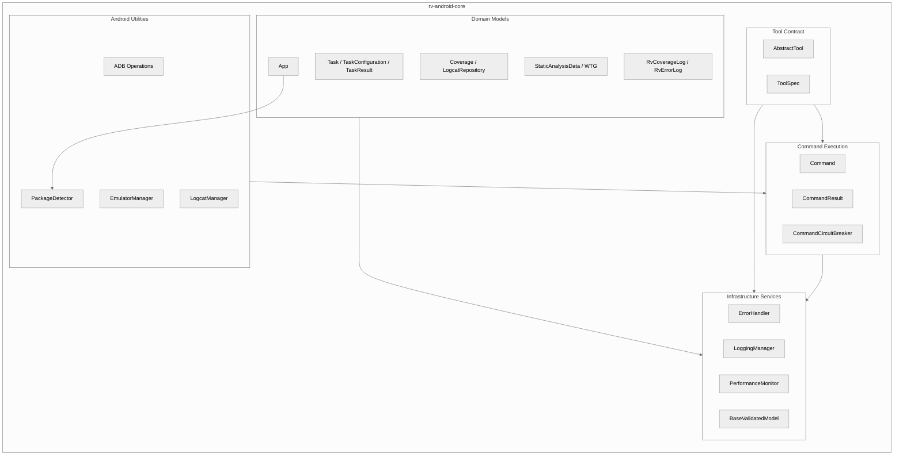
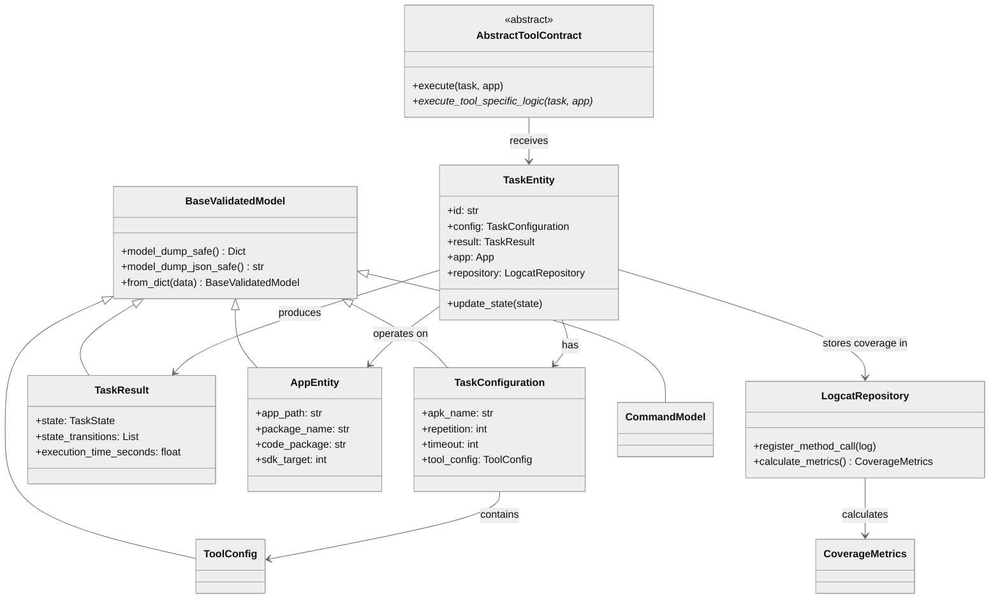
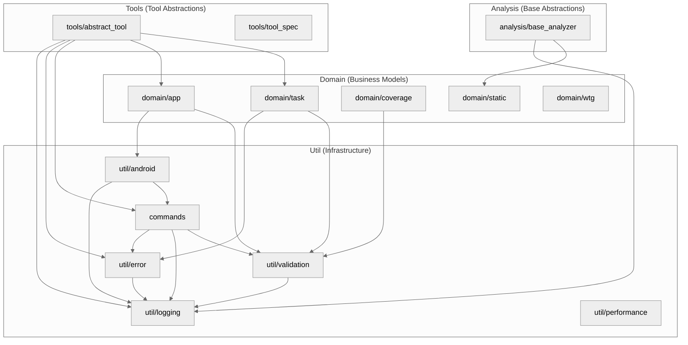
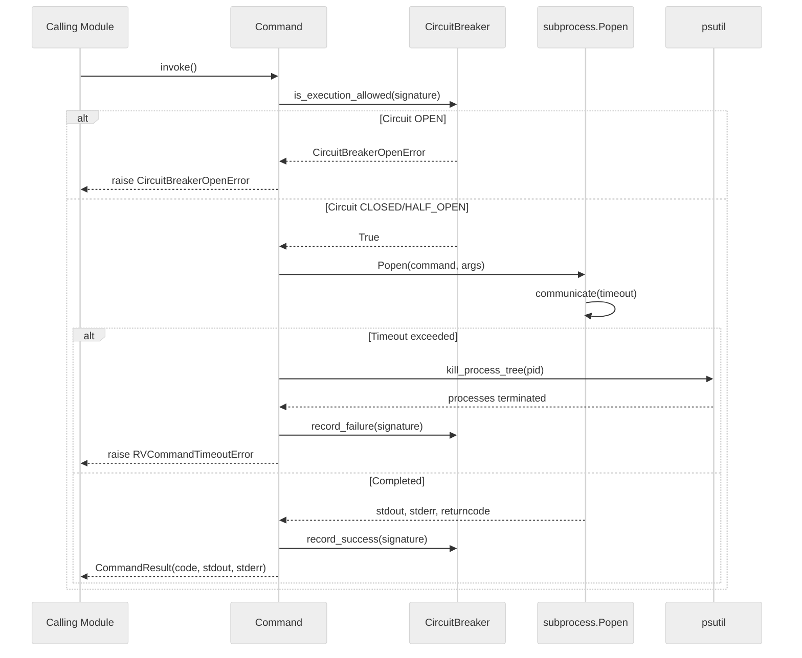
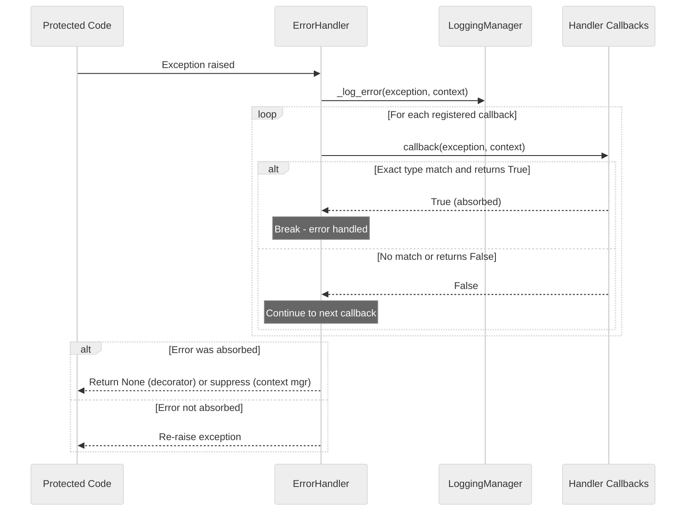
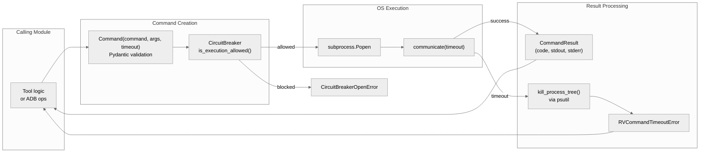
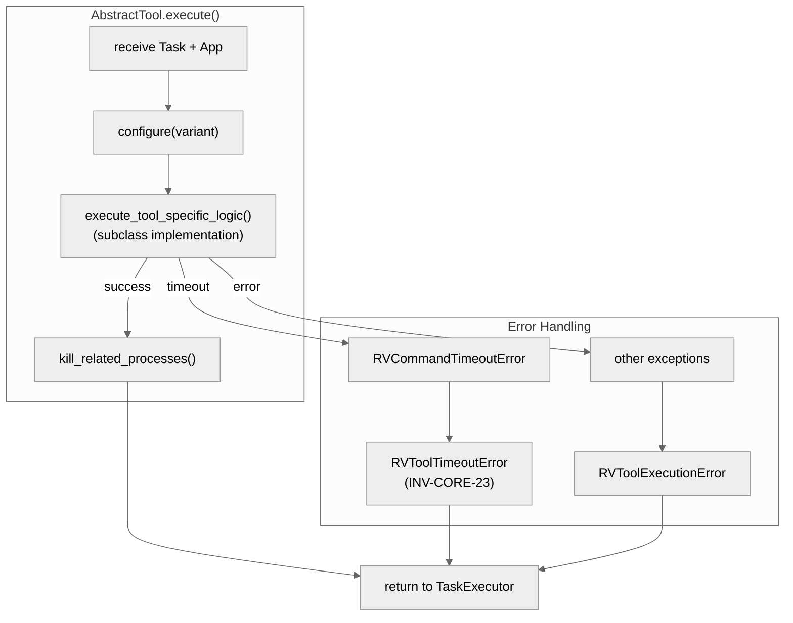
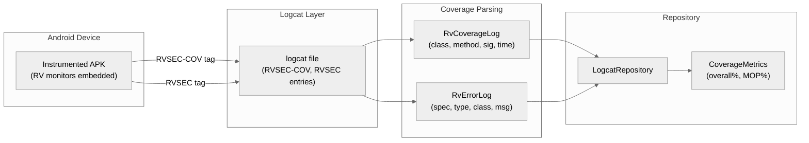
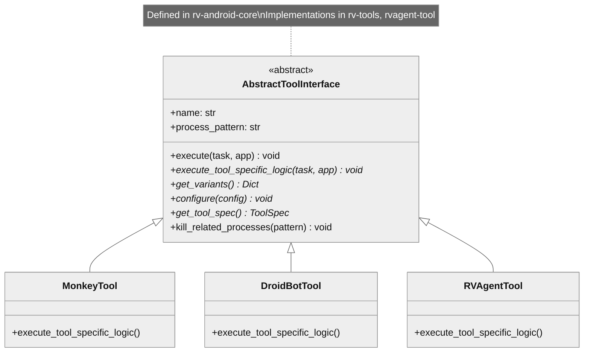

# rv-android-core Architecture

## Overview

rv-android-core is the foundational infrastructure module for the RV-Android framework. It provides shared domain models, error handling, logging, command execution, validation, and Android device utilities that every other module depends on. With zero internal dependencies and 12 dependents, it sits at the root of the dependency graph, defining the contracts and abstractions that unify the framework.

## Specification Alignment

This module implements requirements from `openspec/specs/core/spec.md`.

### Functional Requirements

| FR | Description | Architectural Support |
|----|-------------|----------------------|
| FR33 | Domain Models | `domain/` package: Task, TaskConfiguration, App, ToolConfig, coverage and log models -- all built on BaseValidatedModel |
| FR34 | Error Handling with Recovery Strategies | `util/error/error_handler.py`: ErrorHandler singleton with 27+ type-specific handlers, decorator pattern, callback system |
| FR35 | Pydantic Validation | `util/validation/`: BaseValidatedModel, @validated_model decorator, ValidationConfig (RV_PYDANTIC env var) |
| FR36 | Centralized Logging | `util/logging/`: LoggingManager singleton, ContextAdapter, StructuredFormatter, custom log levels |
| FR37 | Performance Monitoring | `util/performance/`: PerformanceMonitor singleton, measure_time() context manager, subscriber pattern |

### Key Invariants

| Invariant | Description | Enforcement Mechanism |
|-----------|-------------|----------------------|
| INV-CORE-06 | ErrorHandler is a thread-safe singleton | Double-checked locking in `get_instance()` with `_lock` |
| INV-CORE-07 | Handler lookup uses exact type matching | `type(e) == error_type` comparison in handler registry |
| INV-CORE-09 | Validation errors propagate (never suppressed) | `_handle_generic_exception` returns False for ValueError, ConfigurationError, RVValidationError |
| INV-CORE-10 | BaseValidatedModel enforces strict field rules | Pydantic model_config: `extra='forbid'`, `str_strip_whitespace=True`, `validate_assignment=True` |
| INV-CORE-13 | Command validates non-empty command string | Field validator raises `CommandValidationError` for empty/whitespace-only strings |
| INV-CORE-14 | Command kills process tree on timeout | `kill_process_tree()` via psutil before raising `RVCommandTimeoutError` |
| INV-CORE-16 | Circuit breaker tracks failures per command signature | SHA-256 hash of command + args; transitions CLOSED -> OPEN after `failure_threshold` failures |
| INV-CORE-17 | App validates APK path existence | Raises `ConfigurationError` if file does not exist or is not a valid APK |
| INV-CORE-19 | Task.id is always a UUID | `uuid.uuid4()` auto-generation when no explicit ID provided |
| INV-CORE-20 | Task state follows defined lifecycle | CREATED -> INITIALIZING -> READY -> RUNNING -> COMPLETED\|ERROR\|CANCELED; transitions recorded in `state_transitions` |
| INV-CORE-21 | LoggingManager is a thread-safe singleton | Cached logger instances by name + context; returns ContextAdapter wrappers |
| INV-CORE-22 | PerformanceMonitor is zero-overhead when disabled | `measure_time()` yields immediately; `record_metric()` is a no-op when `enabled=False` |
| INV-CORE-23 | AbstractTool converts command timeouts to tool timeouts | `execute()` catches `RVCommandTimeoutError` and raises `RVToolTimeoutError` |
| INV-CORE-24 | Coverage repository ignores unknown methods | `register_method_call()` silently ignores classes not in static analysis data |
| INV-CORE-25 | RvErrorLog deduplication via unique_msg | Computed as `"{class}:::{method}:::{spec}:::{error_type}:::{message}"` |

### Specification Scenarios

Scenarios from `openspec/specs/core/spec.md` that validate this architecture:

- **Decorator with reraise=False suppresses handled exception**: An `RVToolTimeoutError` raised inside a decorated method is caught by ErrorHandler, logged, and suppressed -- the method returns None. Traces through ErrorHandler -> handler registry -> `_handle_tool_timeout_error`.
- **Command timeout with process tree kill**: A long-running subprocess exceeds timeout, triggering `kill_process_tree()` via psutil and raising `RVCommandTimeoutError`. Traces through Command -> Popen -> psutil -> exception hierarchy.
- **Circuit breaker opens after threshold failures**: Three consecutive failures for the same command transition the circuit from CLOSED to OPEN, blocking subsequent executions. Traces through CommandCircuitBreaker state machine.
- **App package mismatch detection**: App creation detects when the manifest package differs from the implementation package (observed in ~27.5% of APKs), logging the mismatch. Traces through App -> PackageDetector -> logging.
- **Task state lifecycle**: A Task transitions through CREATED -> RUNNING -> COMPLETED, with each transition recorded in `state_transitions`. Traces through Task -> TaskState -> TaskResult.

## Key Architectural Decisions

### AD-1: Library Module with Zero Internal Dependencies

**Choice**: rv-android-core is a pure library with no standalone execution capability and zero dependencies on other rv-android modules.

**Why**: As the foundation layer consumed by all 12 other modules, any dependency on a higher-level module would create a circular dependency. The zero-dependency constraint ensures rv-android-core can be imported by any module without pulling in the full dependency graph. This is why `domain/task.py` uses `TYPE_CHECKING` guards for imports of `App` and `LogcatRepository` -- the types are needed for annotations but the actual modules are not required at import time.

### AD-2: Thread-Safe Singletons for Cross-Cutting Services

**Choice**: ErrorHandler, LoggingManager, and PerformanceMonitor use double-checked locking singletons with `_instance` and `_lock`.

**Why**: These services must maintain consistent state across the entire framework. When rv-platform's background coverage tracking thread logs an error, it must use the same ErrorHandler instance (with the same error statistics) as the main execution thread. When rv-agent's LLM client logs a metric, it must go to the same PerformanceMonitor that rv-platform's executor uses. Singletons guarantee this consistency. The double-checked locking pattern avoids acquiring the lock on every access while remaining thread-safe.

**Invariant cross-reference**: INV-CORE-06 (ErrorHandler singleton), INV-CORE-21 (LoggingManager singleton), INV-CORE-22 (PerformanceMonitor singleton).

### AD-3: Registry with Exact-Type Error Dispatch

**Choice**: ErrorHandler uses exact type matching (`type(e) == error_type`) for handler lookup, not `isinstance()`.

**Why**: The exception hierarchy has ~40 types organized in a tree (e.g., `RVToolError` -> `RVToolTimeoutError`). Using `isinstance()` would mean that a `RVToolTimeoutError` matches both its own handler and the parent `RVToolError` handler, requiring careful ordering to avoid wrong handler invocation. Exact type matching eliminates this ambiguity -- each exception type gets exactly one handler, and the most specific behavior is guaranteed. The trade-off is that every exception type in the hierarchy needs an explicit handler registration, but this is done once at initialization time.

**Invariant cross-reference**: INV-CORE-07 mandates exact type matching. INV-CORE-09 ensures validation errors always propagate (the catch-all handler returns `False` for ValueError, ConfigurationError, RVValidationError).

### AD-4: Environment-Controlled Validation

**Choice**: All domain models inherit from `BaseValidatedModel` (Pydantic v2) with validation depth controlled by the `RV_PYDANTIC` environment variable.

**Why**: Full Pydantic validation (field type checking, extra field rejection, whitespace stripping) catches configuration errors early during development but adds overhead in production. The environment toggle allows the same code to run with full validation during development and testing (`RV_PYDANTIC=true`) while minimizing overhead during long-running experiments. The `@validated_model` decorator adds positional argument support, maintaining compatibility with pre-Pydantic constructors that used positional arguments.

**Invariant cross-reference**: INV-CORE-10 enforces `extra='forbid'`, `str_strip_whitespace=True`, `validate_assignment=True`. INV-CORE-12 governs the environment variable reading.

### AD-5: Template Method for Tool Contract

**Choice**: `AbstractTool.execute()` is the template method that orchestrates tool lifecycle; subclasses implement only `execute_tool_specific_logic()`.

**Why**: All 8+ testing tools (Monkey, DroidBot, APE, ARES, QTesting, Humanoid, rv-agent, APE-RV) share the same execution lifecycle: validate configuration, invoke the tool, handle timeout conversion (`RVCommandTimeoutError` to `RVToolTimeoutError`), and clean up related processes. Duplicating this logic in each tool would be error-prone. The template method centralizes the shared workflow in `AbstractTool.execute()` while allowing each tool to implement only its unique testing logic.

**Invariant cross-reference**: INV-CORE-23 requires `execute()` to convert `RVCommandTimeoutError` to `RVToolTimeoutError`.

### AD-6: Recursive Process Tree Kill

**Choice**: `Command.invoke()` kills the entire process tree (via psutil) on timeout, not just the root process.

**Why**: Testing tools (especially DroidBot and rv-agent) spawn child processes -- DroidBot runs `adb shell input` commands via subprocess, rv-agent manages ADB interactions through nested processes. Killing only the root process would orphan these children, which continue consuming emulator resources and can cause port conflicts for subsequent tasks. The recursive tree kill via `psutil.Process(pid).children(recursive=True)` ensures complete cleanup.

**Invariant cross-reference**: INV-CORE-14 requires process tree kill before raising `RVCommandTimeoutError`.

### AD-7: Dual Package Identity for Android APKs

**Choice**: `App` exposes both `package_name` (from AndroidManifest.xml) and `code_package` (detected via `PackageDetector`).

**Why**: In ~27.5% of APKs (empirically measured across 188 APKs in the ICST study), the manifest package name differs from the actual implementation package. For example, Godot engine games declare `ir.hsn6.trans` in the manifest but implement all code under `org.godotengine.godot`. Device operations (install, launch, force-stop) require the manifest package name; static analysis class filtering requires the implementation package. Using a single package name would cause either ADB operations to fail or coverage tracking to miss all methods.

**Invariant cross-reference**: INV-CORE-17 validates APK existence, INV-CORE-18 documents the mismatch detection.

### AD-8: Circuit Breaker for Command Resilience

**Choice**: `CommandCircuitBreaker` tracks failures per command signature (SHA-256 hash) and blocks execution after `failure_threshold` consecutive failures.

**Why**: During experiment execution, transient failures (ADB connection drops, emulator crashes) can cause the same command to fail repeatedly. Without a circuit breaker, each retry consumes the full timeout duration before failing again, wasting significant execution time. The circuit breaker (CLOSED -> OPEN after threshold failures, HALF_OPEN for test recovery) prevents this cascading waste by blocking known-failing commands and periodically testing for recovery.

**Invariant cross-reference**: INV-CORE-16 defines the failure tracking and state transitions.

## Architectural Patterns

### Pattern: Singleton (Thread-Safe)

**Description**: ErrorHandler, LoggingManager, and PerformanceMonitor use double-checked locking singletons. Each maintains a class-level `_instance` protected by a `_lock`, ensuring a single instance across all modules in the framework.

**When Used**: For cross-cutting services that must maintain consistent state across the entire framework -- error statistics, logger caches, and performance metrics.

**Advantages**:
- Guarantees consistent behavior regardless of which module invokes the service
- Thread-safe for concurrent access from background threads (e.g., logcat monitoring)

**Disadvantages**:
- Global state makes unit testing harder (requires reset between tests)
- Implicit dependency -- callers import and use the singleton rather than receiving it via injection

### Pattern: Registry with Exact-Type Dispatch

**Description**: ErrorHandler maintains a dictionary mapping exception types to handler functions. At initialization, 27+ handlers are registered. On error, the handler is looked up by exact type match (`type(e) == error_type`), ensuring the most specific handler is invoked.

**When Used**: To provide per-exception-type error handling with consistent classification and logging.

**Advantages**:
- Each error type gets specialized handling (e.g., tool timeouts logged at INFO, validation errors always propagated)
- Higher-level modules can register callbacks without circular dependencies

**Disadvantages**:
- Exact type matching means subclass hierarchies require explicit handler registration for each type

### Pattern: Template Method (AbstractTool)

**Description**: AbstractTool.execute() is the template method that orchestrates tool execution: it calls the abstract `execute_tool_specific_logic()`, handles `RVCommandTimeoutError` conversion, and performs process cleanup. Subclasses only implement the extension point.

**When Used**: All 8 built-in testing tools and rv-agent's tool wrapper inherit from AbstractTool.

**Advantages**:
- Consistent timeout handling and process cleanup across all tools
- Tools only implement their specific logic; lifecycle is managed by the base class

**Disadvantages**:
- Deep inheritance chain can be rigid; changes to the template method affect all tools

### Pattern: Validated Model (BaseValidatedModel)

**Description**: All domain models inherit from BaseValidatedModel, which extends Pydantic v2 BaseModel with `extra='forbid'`, `str_strip_whitespace=True`, and `validate_assignment=True`. The `@validated_model` decorator adds positional argument support.

**When Used**: Every configuration and domain model in the framework.

**Advantages**:
- Consistent validation rules across all models
- Environment-controlled validation depth (development vs. production)
- Positional argument compatibility for concise construction

**Disadvantages**:
- Pydantic overhead in tight loops (mitigated by environment toggle)

---

## Logical View

Shows key domain entities and their relationships.

### Domain Entities

| Entity | Responsibility |
|--------|----------------|
| Task | Represents a single test execution unit with configuration, result, and coverage data |
| TaskConfiguration | Immutable configuration for a Task: APK, tool, variant, timeout, repetition |
| TaskResult | Mutable result of task execution: state, timing, coverage metrics |
| ToolConfig | Single source of truth for one (tool, variant, parameters) combination |
| App | Android APK metadata extracted via Androguard: packages, SDK version, permissions |
| Command | Validated subprocess execution with timeout enforcement and process tree management |
| CommandResult | Structured result of command execution: exit code, stdout, stderr |
| CommandCircuitBreaker | Resilience mechanism preventing cascading failures from repeated command failures |
| ErrorHandler | Centralized error management with registry-based handler lookup |
| LoggingManager | Thread-safe logging singleton with context injection |
| PerformanceMonitor | Metrics collection singleton with timing and subscriber support |
| AbstractTool | Base class for all testing tools with template method lifecycle |
| BaseValidatedModel | Foundation for all Pydantic domain models with consistent validation |
| LogcatRepository | Coverage and error data store for a task execution |
| CoverageMetrics | Calculated coverage percentages (overall and MOP method coverage) |
| RvCoverageLog | Parsed coverage event from logcat (class, method, signature, timestamp) |
| RvErrorLog | Parsed specification violation from logcat (spec, error type, class, message) |
| WindowTransitionGraph | Static navigation structure of an Android app (windows and transitions) |
| StaticAnalysisData | Combined GATOR + GESDA + REACH analysis results |

### Component Architecture



### Entity Relationships



---

## Development View

Shows code organization for developers.

### Module Structure

```
rv-android-core/
├── src/
│   └── rv_android_core/
│       ├── __init__.py              # Module exports
│       ├── constants.py             # File extensions, env vars, column names
│       ├── analysis/
│       │   └── base_analyzer.py     # BaseAnalyzer[T] ABC, BaseRepository
│       ├── commands/
│       │   ├── command.py           # Subprocess execution (Pydantic model)
│       │   ├── command_result.py    # Structured results
│       │   ├── circuit_breaker.py   # CLOSED/OPEN/HALF_OPEN state machine
│       │   ├── command_exception.py
│       │   └── command_not_found_error.py
│       ├── domain/
│       │   ├── task.py              # Task, TaskConfiguration, TaskResult (480 SLOC)
│       │   ├── app.py               # APK metadata via Androguard
│       │   ├── coverage.py          # Coverage tracking models (491 SLOC)
│       │   ├── static.py            # StaticAnalysisData
│       │   ├── log.py               # RvCoverageLog, RvErrorLog
│       │   ├── classes.py           # Java class/method models
│       │   ├── window.py            # Window models for WTG
│       │   ├── widget.py            # UI widget models
│       │   ├── wtg.py               # WindowTransitionGraph
│       │   ├── dynamic_wtg.py       # Dynamic WTG (NetworkX)
│       │   └── components.py        # Component models
│       ├── tools/
│       │   ├── abstract_tool.py     # Template Method base (340 SLOC)
│       │   └── tool_spec.py         # Tool specification model
│       └── util/
│           ├── utils.py             # General utilities
│           ├── decorators.py        # Utility decorators
│           ├── diagnostics.py       # Diagnostic utilities
│           ├── jar_resolver.py      # JAR resolution with search paths
│           ├── json_helpers.py      # JSON serialization helpers
│           ├── android/
│           │   ├── android.py             # ADB operations (install, boot wait)
│           │   ├── emulator_manager.py    # Emulator lifecycle
│           │   ├── logcat_manager.py      # Logcat capture
│           │   ├── package_detector.py    # Code package detection (CC=20)
│           │   ├── signature_normalizer.py # Inner class notation
│           │   └── repository_initializer.py
│           ├── error/
│           │   ├── error_handler.py   # ErrorHandler singleton (253 SLOC)
│           │   └── exceptions.py      # Exception hierarchy (~40 classes)
│           ├── logging/
│           │   ├── manager.py         # LoggingManager singleton
│           │   ├── context_adapter.py # Context-aware logging
│           │   ├── formatters.py      # Structured/JSON formatters
│           │   └── constants.py       # Log context keys, custom levels
│           ├── performance/
│           │   ├── performance_monitor.py  # PerformanceMonitor singleton
│           │   └── configuration.py       # PerformanceMonitorConfig
│           └── validation/
│               ├── base.py            # BaseValidatedModel
│               ├── config.py          # ValidationConfig (RV_PYDANTIC)
│               └── decorators.py      # @validated_model decorator
├── tests/
│   ├── analysis/
│   ├── commands/
│   ├── domain/
│   ├── tools/
│   └── util/
└── pyproject.toml
```

### Package Dependencies



---

## Process View

rv-android-core is a library module with no event loop or independent runtime processes. However, several of its components are used in concurrent contexts by consuming modules, and the Command subsystem manages OS-level processes.

### Concurrency-Relevant Components

| Component | Concurrency Concern | Thread Safety Mechanism |
|-----------|-------------------|------------------------|
| ErrorHandler | Accessed from main thread and background logcat thread | Thread-safe singleton with `_lock`; handler registry read-only after initialization |
| LoggingManager | Loggers requested from multiple threads | Thread-safe singleton; logger cache protected by `_lock` |
| PerformanceMonitor | Metrics recorded from multiple components simultaneously | Thread-safe singleton; metrics list protected by `_lock` |
| Command.invoke() | Spawns OS subprocesses with timeout monitoring | Process tree kill via psutil ensures cleanup on timeout |
| LogcatRepository | Updated by background coverage tracking thread | Thread safety managed by consuming module (rv-coverage) |

### Command Execution Flow



### Error Handler Dispatch Flow



---

## Data Flow

rv-android-core is a library module, so data flow describes how consuming modules interact with its services and models. Three primary data flows traverse the module.

### Command Execution Data Flow

The Command subsystem handles all external process invocations across the framework. Data flows from the calling module through validation, execution, and result processing:



1. **Creation**: A `Command` is constructed with validated fields (INV-CORE-13 rejects empty commands).
2. **Circuit check**: Before execution, the circuit breaker verifies the command signature is not blocked (INV-CORE-16).
3. **Execution**: `subprocess.Popen` spawns the process; `communicate(timeout)` blocks until completion or timeout.
4. **Result**: On success, `CommandResult` wraps the exit code and output. On timeout, the process tree is killed (INV-CORE-14) before raising `RVCommandTimeoutError`.

### Tool Execution Data Flow

The AbstractTool template method manages the execution lifecycle for all testing tools:



The critical data transformation here is the timeout conversion (INV-CORE-23): `RVCommandTimeoutError` (a low-level command error) is converted to `RVToolTimeoutError` (a high-level tool-lifecycle event). This allows rv-platform's `ToolExecutionComponent` to handle tool timeouts uniformly without knowing which specific command timed out.

### Coverage Data Flow

Coverage data flows from the Android device through logcat, parsing, and repository storage:



1. **Instrumented APK** produces `RVSEC-COV` entries (method coverage) and `RVSEC` entries (specification violations) in Android logcat.
2. **LogcatManager** captures raw logcat to a file on disk.
3. **CoverageTracker** (in rv-coverage) parses entries into `RvCoverageLog` and `RvErrorLog` objects (defined here in rv-android-core).
4. **LogcatRepository** stores these objects and correlates with static analysis data. `register_method_call()` only registers calls to methods present in the static analysis data (INV-CORE-24). `RvErrorLog` instances are deduplicated via `unique_msg` (INV-CORE-25).
5. **CoverageMetrics** are calculated on demand, providing overall and MOP-specific coverage percentages.

---

## Core Components

### ErrorHandler

**Purpose**: Centralized error management with type-specific handlers, decorator pattern, and callback system for cross-module error notification.

**Location**: `src/rv_android_core/util/error/error_handler.py`

**Key Classes**:
- `ErrorHandler`: Thread-safe singleton with 27+ registered handlers, `@handle_errors` decorator, `error_context()` context manager, error statistics tracking

**Error Classification**:
- **Absorbed** (return True): `CommandValidationError`, `LogcatValidationError`, `RVValidationError`, `ToolNotFoundError`, `ToolRegistrationError`, `RVToolTimeoutError`, `RVToolExecutionError`
- **Propagated** (return False): `RVToolError`, `RVExperimentError`, `RVParsingError`, `RVCommandTimeoutError`, `JarNotFoundError`
- **Special**: `FileNotFoundError` (context-aware), `RVAndroidError` (generic catch-all), `Exception` (fallback)

**Dependencies**:
- Internal: `exceptions.py` (exception hierarchy), `util/logging` (LoggingManager)
- External: threading (for lock)

### LoggingManager

**Purpose**: Consistent logging configuration across all modules with context injection, custom log levels, and structured formatting.

**Location**: `src/rv_android_core/util/logging/manager.py`

**Key Classes**:
- `LoggingManager`: Thread-safe singleton, logger cache, `get_logger()` returns ContextAdapter
- `ContextAdapter`: Wraps standard loggers with automatic context injection, `with_context()` for scoped context
- `StructuredFormatter` / `JsonFormatter`: Output formatting with context data

**Custom Log Levels**: EXPERIMENT_START (25), EXPERIMENT_END (26), TASK_START (27), TASK_END (28)

**Dependencies**:
- Internal: `constants.py` (context keys, custom levels)
- External: logging (stdlib)

### Command

**Purpose**: Validated subprocess execution with timeout enforcement, process tree management, and circuit breaker integration.

**Location**: `src/rv_android_core/commands/command.py`

**Key Classes**:
- `Command(BaseValidatedModel)`: Pydantic model with `invoke()`, `invoke_as_deamon()`, `invoke_as_process()` methods
- `CommandResult(BaseValidatedModel)`: Structured result with `is_success()`, `is_failure()`
- `CommandCircuitBreaker`: CLOSED/OPEN/HALF_OPEN state machine per command signature (SHA-256 hash)

**Dependencies**:
- Internal: `BaseValidatedModel`, `exceptions.py`
- External: subprocess, psutil, hashlib

### AbstractTool

**Purpose**: Template method base class defining the contract for all testing tools in the framework.

**Location**: `src/rv_android_core/tools/abstract_tool.py`

**Key Classes**:
- `AbstractTool(ABC)`: Template method `execute()` orchestrates lifecycle; abstract methods: `get_variants()`, `get_tool_spec()`, `configure()`, `execute_tool_specific_logic()`

**Dependencies**:
- Internal: Command, ErrorHandler, CommandCircuitBreaker
- External: abc (ABC)

### Domain Models

**Purpose**: Core data models representing tasks, Android applications, coverage tracking, and static analysis data.

**Location**: `src/rv_android_core/domain/`

**Key Classes**:
- `Task`: Central execution unit with config, result, repository, and static data references
- `TaskConfiguration(BaseValidatedModel)`: Immutable task parameters (APK name, timeout, tool config, repetition)
- `TaskResult(BaseValidatedModel)`: Mutable execution results with state transitions
- `ToolConfig(BaseValidatedModel)`: Single source of truth for (tool, variant, parameters) -- imported by all modules
- `App(BaseValidatedModel)`: APK metadata via Androguard; exposes both `package_name` (manifest) and `code_package` (implementation, lazy-computed via PackageDetector)
- `LogcatRepository`: Coverage and error log storage with metrics calculation
- `CoverageMetrics`: Calculated percentages (overall and MOP method coverage)
- `RvCoverageLog` / `RvErrorLog`: Parsed logcat events

**Dependencies**:
- Internal: BaseValidatedModel, PackageDetector, ErrorHandler
- External: androguard, uuid

### BaseValidatedModel

**Purpose**: Foundation Pydantic model for all validated data models, with environment-controlled validation depth.

**Location**: `src/rv_android_core/util/validation/base.py`

**Key Classes**:
- `BaseValidatedModel(BaseModel)`: Pydantic v2 base with `extra='forbid'`, `str_strip_whitespace=True`, `validate_assignment=True`
- `ValidationConfig`: Singleton reading `RV_PYDANTIC` env var
- `@validated_model`: Decorator enabling positional argument construction

**Dependencies**:
- External: pydantic v2

### Exception Hierarchy

**Purpose**: A ~40-type exception tree rooted at `RVAndroidError` that provides structured error classification across the entire framework.

**Location**: `src/rv_android_core/util/error/exceptions.py`

**Key Structure**:
```
RVAndroidError (message, cause)
├── ConfigurationError
│   └── RVValidationError (field_name)
│       ├── CommandValidationError
│       └── LogcatValidationError
├── NetworkError
│   └── ADBError
├── EmulatorError
├── InstrumentationError
├── AnalysisError
├── ExecutionError
│   └── TaskExecutionError (task_id)
├── EventProcessingError (event_type)
├── RVCommandTimeoutError (timeout_seconds, command)
├── JarNotFoundError (jar_name, search_paths)
├── RVToolError (tool_name)
│   ├── RVToolExecutionError
│   ├── RVToolTimeoutError (timeout_seconds)
│   ├── ToolNotFoundError
│   └── ToolRegistrationError
├── RVExperimentError (experiment_id)
│   └── RVExperimentExecutionError
└── RVParsingError (parser_type)
```

### Android Utilities

**Purpose**: ADB operations, emulator lifecycle management, logcat capture, and APK package detection.

**Location**: `src/rv_android_core/util/android/`

**Key Classes**:
- `Android`: Static methods for ADB operations (install, uninstall, boot wait)
- `EmulatorManager`: Emulator start/stop and port allocation
- `LogcatManager`: Logcat capture to file
- `PackageDetector`: Detects implementation package vs. manifest package using 6 detection strategies (CC=20). In ~27.5% of APKs, these differ (e.g., Godot engine games).
- `SignatureNormalizer`: Normalizes inner class notation (Outer.Inner <-> Outer$Inner)

**Dependencies**:
- Internal: Command, CommandResult
- External: subprocess, psutil

### PerformanceMonitor

**Purpose**: Metrics collection with timing measurement, custom metric recording, and subscriber notification.

**Location**: `src/rv_android_core/util/performance/performance_monitor.py`

**Key Classes**:
- `PerformanceMonitor`: Thread-safe singleton with `measure_time()` context manager, `record_metric()`, `get_metrics_stats()`, and subscriber pattern (`subscribe(name, callback)`)
- `PerformanceMonitorConfig`: Configuration with `enabled` flag and `max_samples` limit

**Dependencies**:
- External: threading, time

---

## NFR Support

How the architecture supports non-functional requirements from `docs/PRD.md` Section 7.

| NFR | PRD ID | Architectural Support |
|-----|--------|----------------------|
| Modularity | NFR01 | Zero internal dependencies; all 12 other modules depend on rv-android-core without coupling to each other through it. Clean package boundaries (domain, commands, tools, util) |
| Extensibility | NFR02 | AbstractTool template method allows new tools without modifying core. ErrorHandler callback system lets modules react to errors without circular dependencies. BaseValidatedModel provides a consistent extension point for new domain models. BaseAnalyzer[T] generic ABC for analysis components |
| Testability | NFR03 | 46 test files organized by package. @validated_model enables both positional and named construction for test readability. ValidationConfig toggle allows testing with and without validation. Singleton reset methods for test isolation |
| Resilience | NFR04 | ErrorHandler with 27+ type-specific handlers and configurable suppression/propagation. CommandCircuitBreaker prevents cascading failures (CLOSED/OPEN/HALF_OPEN). Process tree kill prevents orphaned processes on timeout. Tool timeouts treated as expected behavior (INFO level, not ERROR) |
| Configurability | NFR05 | Environment-controlled validation (RV_PYDANTIC). BaseValidatedModel as foundation for all configuration classes. PerformanceMonitorConfig for enabling/disabling metrics collection |
| Observability | NFR06 | LoggingManager with context injection (task ID, app name, tool name, component, phase). PerformanceMonitor with timing and custom metrics. Custom log levels (EXPERIMENT_START/END, TASK_START/END). StructuredFormatter and JsonFormatter for machine-readable output |
| Compatibility | NFR07 | Python 3.11+ via Pydantic v2. Android SDK interaction abstracted through ADB command wrappers. Platform-independent command execution via subprocess |
| Reproducibility | NFR08 | Task UUID generation for deterministic identification. TaskResult state transition recording for audit trail. CommandResult structured output for post-hoc analysis |

---

## Key Interfaces

### AbstractTool (Tool Contract)

```python
class AbstractTool(ABC):
    """Base class for all testing tools.

    Template method: execute() handles lifecycle (timeout conversion,
    process cleanup). Subclasses implement only the extension points.
    """

    @abstractmethod
    def get_variants(self) -> list[dict]:
        """Return available variant configurations."""
        ...

    @abstractmethod
    def get_tool_spec(self) -> ToolSpec:
        """Return tool specification for registry."""
        ...

    @abstractmethod
    def configure(self, variant: str, **kwargs) -> None:
        """Apply variant parameters."""
        ...

    @abstractmethod
    def execute_tool_specific_logic(self) -> None:
        """Tool-specific testing logic (extension point)."""
        ...
```



### BaseAnalyzer[T] (Analyzer Contract)

```python
class BaseAnalyzer(Generic[T], ABC):
    """Base class for all analysis components."""

    @abstractmethod
    def _initialize_from_static_data(self) -> None:
        """Initialize internal state from static analysis data."""
        ...

    @abstractmethod
    def analyze(self, data: Any) -> T:
        """Analyze data and return typed result."""
        ...

    @abstractmethod
    def get_metrics(self) -> Dict[str, Any]:
        """Return computed metrics."""
        ...
```

### ErrorHandler (Usage Patterns)

```python
# Pattern 1: Decorator
@ErrorHandler.handle_errors(component="TaskExecutor", phase="execution")
def execute_task(self, task):
    ...

# Pattern 2: Context manager
with error_handler.error_context(component="TaskExecutor", phase="setup"):
    risky_operation()

# Pattern 3: Register callback (avoids circular dependencies)
error_handler.register_error_callback(my_callback_fn)
```

---

## Scenarios

Key use cases that validate the architecture.

### Scenario 1: Tool Execution with Timeout Handling

**Description**: A testing tool runs on an Android emulator and exceeds its configured timeout. The framework kills the process tree, converts the exception, and records the result.

**Flow**:
1. rv-platform's TaskExecutor calls `AbstractTool.execute()` with a configured timeout
2. `execute()` delegates to the subclass's `execute_tool_specific_logic()`
3. Inside the tool, `Command.invoke()` spawns a subprocess with the timeout
4. The subprocess exceeds timeout; `Command` calls `kill_process_tree(pid)` via psutil
5. `Command` raises `RVCommandTimeoutError`
6. `AbstractTool.execute()` catches it and raises `RVToolTimeoutError` (INV-CORE-23)
7. ErrorHandler (via decorator on TaskExecutor) logs at INFO level and suppresses -- tool timeout is expected behavior

### Scenario 2: APK Metadata Extraction with Package Mismatch

**Description**: An Android APK has a manifest package name that differs from its implementation package (occurs in ~27.5% of APKs).

**Flow**:
1. rv-platform creates an `App(app_path="/path/to/app.apk")` (INV-CORE-17 validates APK exists)
2. App's `model_post_init()` loads the APK via Androguard, extracting `package_name` from the manifest
3. On first access of `code_package`, `PackageDetector.detect_package()` analyzes the DEX bytecode using 6 strategies
4. If `package_name != code_package`, a log message reports the mismatch (INV-CORE-18)
5. Downstream modules use `package_name` for device operations and `code_package` for static analysis path matching

### Scenario 3: Circuit Breaker Prevents Cascading Failures

**Description**: A command fails repeatedly (e.g., ADB connection drops), and the circuit breaker prevents further attempts.

**Flow**:
1. `Command.invoke()` calls `circuit_breaker.is_execution_allowed(signature)` -- returns True (CLOSED state)
2. The command fails; `circuit_breaker.record_failure(signature)` increments the failure count
3. After 3 consecutive failures (default threshold), the circuit transitions to OPEN (INV-CORE-16)
4. The next `is_execution_allowed()` call raises `CircuitBreakerOpenError`
5. After `retry_count` attempts, the circuit transitions to HALF_OPEN, allowing one test execution
6. If the test succeeds, the circuit resets to CLOSED; if it fails, it returns to OPEN

---

## Extension Points

- **New Testing Tools**: Subclass `AbstractTool`, implement the four abstract methods, register via `ToolSpec` in rv-tools' registry
- **New Analysis Components**: Subclass `BaseAnalyzer[T]`, implement `_initialize_from_static_data()`, `analyze()`, `get_metrics()`
- **New Domain Models**: Inherit from `BaseValidatedModel` with `@validated_model` for positional argument support
- **Error Callbacks**: Register via `ErrorHandler.register_error_callback()` to react to errors from any module without circular dependencies
- **Custom Log Levels**: Add to `util/logging/constants.py` using `logging.addLevelName()`
- **Performance Subscribers**: Subscribe to `PerformanceMonitor` for specific metric names or `"*"` for all

## Dependencies

### Internal (rv-android modules)

| Module | Purpose |
|--------|---------|
| (none) | rv-android-core is the foundation with zero internal dependencies |

**Dependents** (12 modules depend on rv-android-core):

| Module | What it uses |
|--------|-------------|
| rv-tools | AbstractTool, ToolSpec, ErrorHandler, Command, LoggingManager, exceptions |
| rv-uiautomator | ErrorHandler, LoggingManager, Widget, Window domain models |
| rv-screen-parser | Widget, Window, BaseValidatedModel, LoggingManager |
| rv-static-analysis | StaticAnalysisData, ClassData, Command, ErrorHandler, constants |
| rv-coverage | LogcatRepository, CoverageMetrics, RvCoverageLog, RvErrorLog |
| rv-monitor-generator | Command, ErrorHandler, constants |
| rv-instrumentation | Command, App, ErrorHandler, constants |
| rv-platform | Task, TaskConfiguration, App, ErrorHandler, LoggingManager, all domain models |
| rv-agent | App, Task, Widget, Window, DynamicTransitionGraph, LoggingManager, PerformanceMonitor |
| rv-experiment | Task, ToolConfig, TaskConfiguration, App, Command, constants |
| rvagent-tool | AbstractTool, App, Task, ErrorHandler |
| rv-agent-validation | App, Task, LoggingManager |

### External

| Package | Version | Purpose |
|---------|---------|---------|
| pydantic | >=2.9.0 | Data validation, serialization, model configuration for all domain entities |
| androguard | 3.4.0a1 | Android APK metadata extraction (package name, permissions, SDK versions) |
| psutil | >=7.0.0 | Process tree management for Command timeout cleanup |
| networkx | >=3.5 | Graph data structures for dynamic window transition graph |

## Known Architectural Issues

1. **Circular dependency with rv-coverage**: `domain/task.py` contains a lazy import of `rv_coverage.parser.log.logcat_parser`. This creates a cycle between the foundation layer (rv-android-core) and a higher-level module. The import should be moved to rv-coverage or rv-platform, or injected via a callback/protocol.

2. **PackageDetector complexity**: `package_detector.py:detect_package` has cyclomatic complexity of 20. The six detection strategies are logically separated but exist in a single function. Extracting each into its own method would improve testability and reduce per-function complexity.

## Testing Strategy

| Type | Location | Purpose |
|------|----------|---------|
| Unit | tests/domain/ | Domain model validation, serialization, state transitions |
| Unit | tests/commands/ | Command execution, timeout handling, result parsing |
| Unit | tests/util/ | Error handler dispatch, logging configuration, validation config |
| Unit | tests/tools/ | AbstractTool contract, variant system |
| Unit | tests/analysis/ | BaseAnalyzer interface compliance |

Tests are run via:
```bash
uv run pytest modules/rv-android-core/tests/ -v
```

## Related Documentation

- [Domain Spec](../../openspec/specs/core/spec.md) - Requirements and invariants for this module (FR33-FR37, INV-CORE-06 through INV-CORE-25)
- [PRD](../../docs/PRD.md) - Product Requirements Document (FR01-37, NFR01-08)
- [CLAUDE.md](../../CLAUDE.md) - Project-level quick reference for Claude Code
