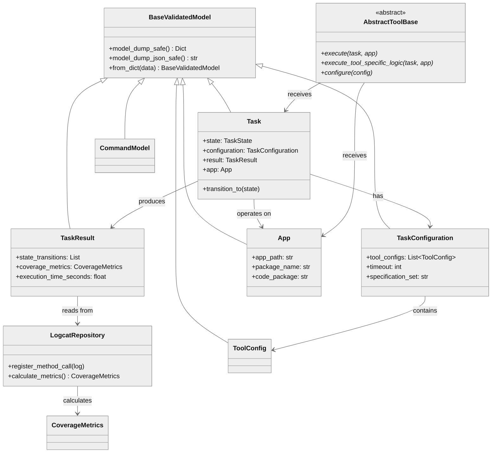
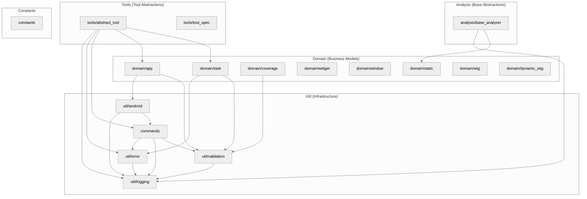
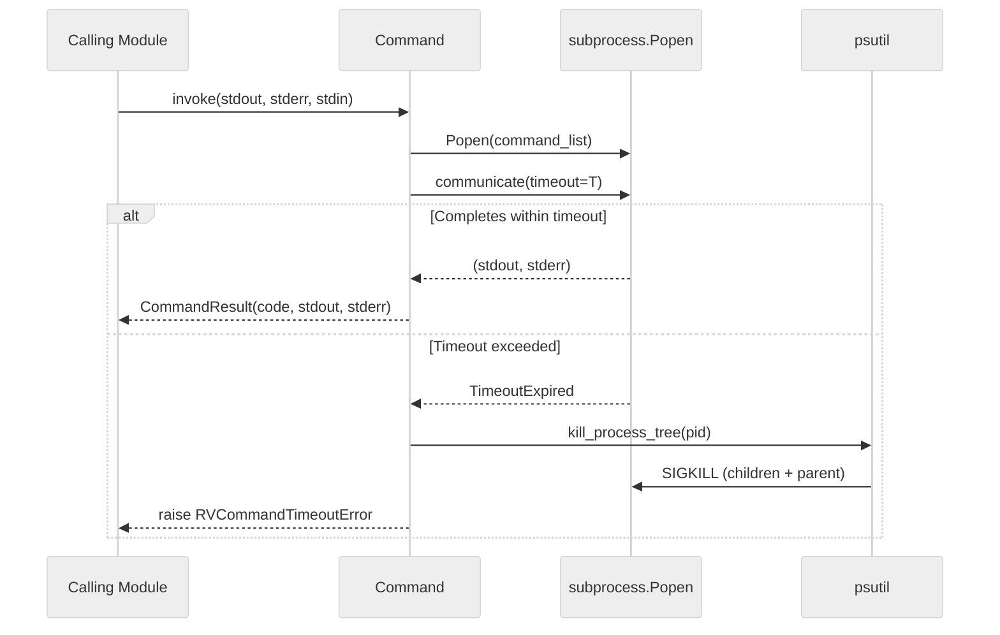
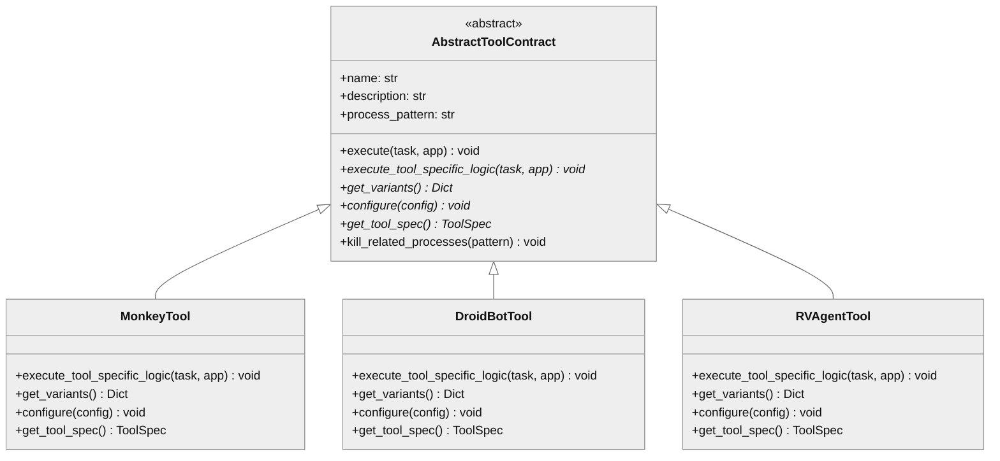

# rv-android-core Architecture

## Overview

rv-android-core is the foundation infrastructure module for the RV-Android runtime verification framework. It provides the shared domain models, error handling, logging, command execution, and utility components that all 11 other modules in the workspace depend on. As the sole Layer 1 module with a fan-in of 11 (every other module imports from it), rv-android-core establishes the architectural patterns, type-safe validation through Pydantic, and consistent behavior that the entire system relies upon. It has zero internal module dependencies -- it depends only on four external packages (pydantic, androguard, psutil, networkx).

## Key Architectural Decisions

| Decision | Choice | Rationale |
|----------|--------|-----------|
| Application Type | Library (no entry point) | Foundation module consumed by all other modules; never executed directly |
| Structuring | Package-by-feature within a flat layer | Groups related concerns (domain, commands, tools, util) without deep nesting; each package is self-contained |
| Primary Pattern | Singleton + Template Method | Core services (ErrorHandler, LoggingManager, ValidationConfig) need exactly one instance; AbstractTool defines the execution contract for all testing tools |
| Control Strategy | Call-based (synchronous) | Library module responds to direct method calls from consuming modules; no event loop or async processing |
| Validation Strategy | Environment-aware Pydantic | Full validation during development (`RV_PYDANTIC=true`), minimal overhead in production; `BaseValidatedModel` provides the common base |
| Error Strategy | Registry-based dispatch | ErrorHandler dispatches to exact-type-matched handlers; handlers return True (absorbed) or False (propagated) |
| Dependency Direction | Strictly downward | rv-android-core has zero internal dependencies; all other modules depend on it, not vice versa |

## Architectural Patterns

### Pattern: Singleton (Thread-Safe)

**Description**: Core services use the double-checked locking singleton pattern to guarantee exactly one instance per service across all threads. The pattern uses a class-level `_lock` (threading.Lock) and `_instance` field with two-phase null check.

**Application**: `ErrorHandler`, `LoggingManager`, and `ValidationConfig` all implement this pattern. They are accessed via `ClassName.get_instance()` class methods. Consuming modules call these methods at initialization time to obtain the shared instance.

**When Used**: For services that must maintain global state consistency -- error handler registrations, logging configuration, and validation settings apply system-wide.

**Advantages**:
- Guarantees consistent behavior across all modules (one error handler, one logging config)
- Thread-safe initialization without requiring explicit setup ordering
- Lazy initialization delays creation until first use

**Disadvantages**:
- Global state complicates unit testing (requires instance reset between tests)
- Implicit dependency -- consuming code depends on a global instance rather than an injected dependency

### Pattern: Template Method

**Description**: `AbstractTool` defines a fixed execution workflow in its `execute()` method that calls the abstract `execute_tool_specific_logic()` method, which concrete tools must implement. The template method handles logging, timeout conversion, process cleanup, and error propagation.

**Application**: All testing tools (Monkey, DroidBot, rv-agent, UIAutomator) inherit from `AbstractTool` and implement `execute_tool_specific_logic()`. The base class manages the invariant execution lifecycle: log start, delegate to subclass, cleanup processes, log completion.

**When Used**: When multiple tool implementations share the same execution lifecycle but differ in their core testing logic.

**Advantages**:
- Enforces consistent execution lifecycle across all tools
- Centralizes timeout handling and process cleanup
- New tools only need to implement the varying part

**Disadvantages**:
- Inheritance-based coupling between AbstractTool and all tool implementations
- Subclasses must understand the base class contract (e.g., that `RVCommandTimeoutError` is converted to `RVToolTimeoutError`)

### Pattern: Registry with Exact-Type Dispatch

**Description**: `ErrorHandler` maintains a list of handler callbacks. Each callback is wrapped to match a specific exception type using exact type comparison (`type(e) == error_type`). When an error occurs, callbacks are iterated in registration order; the first callback returning `True` absorbs the error.

**Application**: 16 built-in handlers are registered during `ErrorHandler.__init__()`. Handlers are partitioned into absorbed types (8 types including `CommandValidationError`, `RVToolTimeoutError`) and propagated types (5 types including `RVExperimentError`, `JarNotFoundError`), plus 3 special handlers (`FileNotFoundError`, `RVAndroidError` catch-all, `Exception` fallback).

**When Used**: When different error types require different handling strategies (absorb vs propagate) and the handling policy must be configurable at runtime.

**Advantages**:
- Decouples error handling policy from error generation
- New error types can be registered without modifying existing code
- Consuming modules can register additional handlers

**Disadvantages**:
- Exact-type matching means subclass errors fall through to more generic handlers
- Linear iteration through callbacks on every error

### Pattern: Factory (Generic)

**Description**: `TaskFactory[T]` is a generic factory class parameterized by the concrete task type. It creates configured task instances with proper initialization.

**Application**: Used by rv-platform to create Task instances with the appropriate configuration, app metadata, and tool settings.

**When Used**: When task creation involves multiple configuration steps that should be encapsulated.

**Advantages**:
- Encapsulates task creation complexity
- Type-safe through generics

**Disadvantages**:
- Additional indirection for a relatively straightforward creation process

---

## Logical View

Shows the key domain entities, their responsibilities, and relationships.

### Domain Entities

| Entity | Responsibility |
|--------|----------------|
| `Task` | Represents a single execution unit with lifecycle state management (CREATED -> RUNNING -> COMPLETED/ERROR) |
| `TaskConfiguration` | Holds all parameters for task execution: APK paths, timeouts, specification sets, tool settings |
| `TaskResult` | Captures execution outcomes: state transitions, coverage data, error logs, timing information |
| `ToolConfig` | Describes a (tool, variant, parameters) combination for experiment specification |
| `App` | Represents an Android APK with metadata extracted via Androguard: package name, permissions, SDK versions |
| `MethodCoverageData` | Tracks coverage state of individual methods: static reachability, dynamic call status, timing |
| `ClassCoverageData` | Aggregates method coverage data at the class level |
| `CoverageMetrics` | Computes and holds coverage percentages: activity, method, and MOP-reachable coverage |
| `LogcatRepository` | Central store for coverage and error data populated from logcat during execution |
| `Command` | Encapsulates system command execution with timeout, process tree management, and result capture |
| `Widget` / `WidgetEvent` | Represents Android UI elements and their interaction events |
| `Window` / `DynamicTransitionGraph` | Models Android activities/windows and navigation transitions between them |
| `StaticAnalysisData` | Holds results from static analysis tools (GATOR, GESDA, REACH) |
| `BaseValidatedModel` | Pydantic base class providing validation, serialization, and environment-aware configuration |
| `ErrorHandler` | Singleton registry dispatching exceptions to type-matched handlers |
| `LoggingManager` | Singleton providing context-aware structured logging across all modules |

### Entity Relationships



### Key Abstractions

- **BaseValidatedModel**: The type-safe foundation. All domain entities inherit from this Pydantic base class, gaining automatic validation (controlled by `RV_PYDANTIC` env var), serialization, and equality semantics.
- **AbstractTool**: The tool contract. Defines the execution lifecycle that all testing tools must follow, providing the template method (`execute()`) that handles cross-cutting concerns.
- **BaseAnalyzer[T]**: The analysis contract. Generic abstract base for analysis components, supporting static data initialization and standardized metrics output.
- **ErrorHandler**: The error policy engine. Centralizes how each exception type is handled across the system, preventing inconsistent error management.

---

## Development View

Shows code organization for developers navigating the module.

### Module Structure

```
modules/rv-android-core/
├── src/
│   └── rv_android_core/
│       ├── __init__.py
│       ├── constants.py                  # File extensions, env vars, coverage column names, UI constants
│       ├── analysis/
│       │   └── base_analyzer.py          # BaseAnalyzer[T] ABC, BaseRepository
│       ├── commands/
│       │   ├── command.py                # Command model with subprocess, timeout, process tree kill
│       │   ├── command_exception.py      # Base command exception
│       │   ├── command_not_found_error.py # OSError wrapper for missing binaries
│       │   └── command_result.py         # Structured command output (stdout, stderr, exit code)
│       ├── domain/
│       │   ├── app.py                    # App model with Androguard APK metadata
│       │   ├── classes.py                # Java class/method models
│       │   ├── coverage.py              # MethodCoverageData, ClassCoverageData, CoverageMetrics, LogcatRepository
│       │   ├── dynamic_wtg.py           # NetworkX-based dynamic window transition graph
│       │   ├── log.py                   # RvCoverageLog, RvErrorLog models
│       │   ├── static.py               # StaticAnalysisData models
│       │   ├── task.py                  # TaskState, ToolConfig, TaskConfiguration, TaskResult, Task, TaskFactory
│       │   ├── widget.py               # Widget and WidgetEvent models
│       │   ├── window.py               # Window and Windows models
│       │   └── wtg.py                  # Window Transition Graph models
│       ├── tools/
│       │   ├── abstract_tool.py         # AbstractTool template method base class
│       │   └── tool_spec.py            # ToolSpec registration model
│       └── util/
│           ├── decorators.py            # Utility decorators
│           ├── diagnostics.py           # System diagnostics
│           ├── jar_resolver.py          # JAR file resolution with env-aware paths
│           ├── json_helpers.py          # JSON serialization utilities
│           ├── utils.py                 # Environment helpers, file operations
│           ├── android/
│           │   ├── android.py           # ADB operations (install, uninstall, permissions, boot)
│           │   ├── emulator_manager.py  # Emulator lifecycle control
│           │   ├── logcat_manager.py    # Logcat capture management
│           │   ├── package_detector.py  # Code package vs manifest package detection (7 strategies)
│           │   ├── repository_initializer.py # StaticAnalysisData -> LogcatRepository initialization
│           │   └── signature_normalizer.py   # Inner class notation normalization
│           ├── error/
│           │   ├── error_handler.py     # ErrorHandler singleton with decorator + context manager
│           │   └── exceptions.py        # 23-type exception hierarchy
│           ├── logging/
│           │   ├── constants.py         # Logging context keys
│           │   ├── context_adapter.py   # Context-aware logging adapter
│           │   ├── formatters.py        # JsonFormatter, StructuredFormatter
│           │   └── manager.py           # LoggingManager singleton
│           └── validation/
│               ├── base.py              # BaseValidatedModel (Pydantic base class)
│               ├── config.py            # ValidationConfig singleton (RV_PYDANTIC env var)
│               └── decorators.py        # @validated_model decorator
├── tests/
│   ├── analysis/
│   ├── commands/
│   ├── domain/
│   ├── tools/
│   └── util/
└── pyproject.toml
```

### Package Dependencies

The internal package dependency graph shows that `domain` is the central package, while `util` provides cross-cutting infrastructure.



### Build Dependencies

| Dependency | Version | Type | Purpose |
|------------|---------|------|---------|
| pydantic | >=2.9.0 | External | Data validation, serialization, model configuration for all domain entities |
| androguard | 3.4.0a1 | External | Android APK static metadata extraction (package name, permissions, SDK) |
| psutil | >=7.0.0 | External | Process tree management for command timeout cleanup |
| networkx | >=3.5 | External | Graph data structures for dynamic window transition graph |

---

## Process View

rv-android-core is a library module with no autonomous processes. However, two runtime behaviors involve process-level concerns.

### Command Execution and Timeout Handling

When a `Command` is invoked, it spawns a subprocess via Python's `subprocess.Popen`. If the subprocess exceeds its configured timeout, `Command` uses psutil to kill the entire process tree (parent + all children), then raises `RVCommandTimeoutError`.



### Error Handler Dispatch Flow

When an exception reaches the `ErrorHandler` (via decorator or context manager), the handler iterates through registered callbacks using exact-type matching. The first callback returning `True` absorbs the error; returning `False` allows propagation.

```mermaid
%%{init: {'theme': 'neutral'}}%%
sequenceDiagram
    participant Code as Protected Code
    participant EH as ErrorHandler
    participant Log as LoggingManager
    participant CB as Handler Callbacks

    Code->>EH: Exception raised
    EH->>Log: _log_error(exception, context)

    loop For each registered callback
        EH->>CB: callback(exception, context)
        alt Exact type match + returns True
            CB-->>EH: True (absorbed)
            Note over EH: Break - error handled
        else No match or returns False/None
            CB-->>EH: None/False
            Note over EH: Continue to next callback
        end
    end

    alt Error was absorbed
        EH-->>Code: Return None (decorator) or continue (context manager)
    else Error not absorbed
        EH-->>Code: Re-raise exception
    end
```



---

## Core Components

### ErrorHandler

**Purpose**: Centralized error management system that classifies exceptions and determines whether each should be absorbed (operation continues) or propagated (exception re-raised).

**Location**: `src/rv_android_core/util/error/error_handler.py`

**Key Classes**:
- `ErrorHandler`: Singleton with two usage modes -- `@ErrorHandler.handle_errors()` decorator and `error_handler.error_context()` context manager. Registers 16 built-in handlers partitioned into absorbed types (8), propagated types (5), and special handlers (3).

**Error Classification**:
- **Absorbed** (return True): `CommandValidationError`, `LogcatValidationError`, `EventProcessingError`, `RVValidationError`, `ToolNotFoundError`, `ToolRegistrationError`, `RVToolTimeoutError`, `RVToolExecutionError`
- **Propagated** (return False): `RVToolError`, `RVExperimentError`, `RVParsingError`, `RVCommandTimeoutError`, `JarNotFoundError`
- **Special**: `FileNotFoundError` (context-aware -- absorbed for expected operations like `check_if_instrumented`), `RVAndroidError` (generic catch-all, propagated), `Exception` (fallback -- critical types propagated, non-critical operations absorbed)

**Dependencies**:
- Internal: `util/logging` (LoggingManager), `util/error/exceptions` (exception types)
- External: threading (for thread-safe singleton)

### LoggingManager

**Purpose**: Centralized logging configuration that attaches structured formatters to the root logger. All loggers created via `logging.getLogger()` inherit this configuration. Provides context-aware logging through `ContextAdapter`.

**Location**: `src/rv_android_core/util/logging/manager.py`

**Key Classes**:
- `LoggingManager`: Singleton that configures console and file handlers, formatter selection (plain, structured, JSON), and log level management. The `get_logger()` method returns a `ContextAdapter`-wrapped logger with context injection (component name, tool name).

**Output Modes**:
- Console: Enabled by default at INFO level with plain formatting
- File: Disabled by default; activated per-experiment with timestamped filenames and configurable JSON or structured formatting

**Dependencies**:
- Internal: `util/logging/context_adapter`, `util/logging/formatters`, `util/logging/constants`
- External: Python standard `logging`, `os`, `sys`, `threading`

### BaseValidatedModel

**Purpose**: Pydantic base class for all domain models. Provides consistent validation configuration, environment-aware validation behavior, safe serialization methods, and equality/hash semantics.

**Location**: `src/rv_android_core/util/validation/base.py`

**Key Classes**:
- `BaseValidatedModel`: Configures Pydantic with `validate_assignment=True`, `extra='forbid'`, `arbitrary_types_allowed=True`. Delegates to `ValidationConfig` for environment-aware behavior. Provides `model_dump_safe()` and `model_dump_json_safe()` with exception fallbacks.
- `ValidationConfig` (`config.py`): Singleton reading `RV_PYDANTIC`, `RV_PYDANTIC_STRICT`, and `RV_PYDANTIC_LOG` environment variables to control validation depth.

**Dependencies**:
- Internal: `util/logging` (for ValidationConfig logging)
- External: pydantic (BaseModel, ConfigDict, Field)

### Command

**Purpose**: System command execution with Pydantic-validated parameters, subprocess management, configurable timeout enforcement, and process tree cleanup via psutil.

**Location**: `src/rv_android_core/commands/command.py`

**Key Classes**:
- `Command`: Inherits from `BaseValidatedModel`. Validates command name, argument list, and timeout. The `invoke()` method spawns a subprocess, captures stdout/stderr, and on timeout calls `kill_process_tree()` to recursively terminate the process and all its children via SIGKILL.
- `CommandResult` (`command_result.py`): Encapsulates exit code, stdout bytes, stderr bytes, with convenience methods `is_success()`, `is_failure()`, `get_stdout_text()`, `get_stderr_text()`.

**Dependencies**:
- Internal: `util/validation` (BaseValidatedModel), `util/logging` (LoggingManager), `util/error` (ErrorHandler, exceptions)
- External: subprocess, psutil, signal, os

### AbstractTool

**Purpose**: Base class defining the contract and execution lifecycle for all testing tools. Implements the template method pattern: the `execute()` method orchestrates logging, delegation to `execute_tool_specific_logic()`, process cleanup, and error handling.

**Location**: `src/rv_android_core/tools/abstract_tool.py`

**Key Classes**:
- `AbstractTool` (ABC): Requires subclasses to implement `execute_tool_specific_logic()`, `get_variants()`, `get_tool_spec()`, and `configure()`. Provides `_execute_and_check_command()` for standardized command execution with timeout conversion, and `kill_related_processes()` for ADB-based process cleanup on the device.

**Dependencies**:
- Internal: `domain/task` (Task), `domain/app` (App), `commands` (Command, CommandResult), `util/error` (ErrorHandler, exceptions), `util/logging` (LoggingManager)
- External: os (for process pattern cleanup)

### Exception Hierarchy

**Purpose**: A 23-type exception tree rooted at `RVAndroidError` that provides structured error classification across the entire framework. Each exception type carries domain-specific context (tool name, timeout seconds, experiment ID, task ID, JAR name, parser type).

**Location**: `src/rv_android_core/util/error/exceptions.py`

**Key Structure**:
```
RVAndroidError (message, cause)
├── ConfigurationError
│   └── RVValidationError (field_name)
│       ├── CommandValidationError
│       └── LogcatValidationError
├── NetworkError
│   └── ADBError
├── EmulatorError
├── InstrumentationError
├── AnalysisError
├── ExecutionError
│   └── TaskExecutionError (task_id)
├── EventProcessingError (event_type)
├── RVCommandTimeoutError (timeout_seconds, command)
├── JarNotFoundError (jar_name, search_paths)
├── RVToolError (tool_name)
│   ├── RVToolExecutionError
│   ├── RVToolTimeoutError (timeout_seconds)
│   ├── ToolNotFoundError
│   └── ToolRegistrationError
├── RVExperimentError (experiment_id)
│   └── RVExperimentExecutionError
└── RVParsingError (parser_type)
```

### BaseAnalyzer[T]

**Purpose**: Generic abstract base class for all analysis components. Defines a standard interface for static data initialization, runtime data analysis, and metrics output.

**Location**: `src/rv_android_core/analysis/base_analyzer.py`

**Key Classes**:
- `BaseAnalyzer[T]` (ABC, Generic): Requires subclasses to implement `_initialize_from_static_data()`, `analyze(data) -> T`, and `get_metrics() -> Dict`. Auto-initializes from `StaticAnalysisData` if provided at construction.
- `BaseRepository`: Base class for data storage layers used by analyzers. Provides standardized logging but no abstract methods -- serves as a typed base with common infrastructure.

**Dependencies**:
- Internal: `domain/static` (StaticAnalysisData), `util/logging` (LoggingManager)
- External: None beyond typing

### Android Utilities

**Purpose**: Device interaction layer providing ADB command wrappers, emulator lifecycle management, logcat capture, package detection, and signature normalization.

**Location**: `src/rv_android_core/util/android/`

**Key Classes**:
- `Android` (`android.py`): Static methods for ADB operations: install/uninstall APK, grant permissions, check device boot state. Provides `create_emulator()` context manager for emulator lifecycle.
- `EmulatorManager` (`emulator_manager.py`): Controls emulator start/stop/wait operations.
- `LogcatManager` (`logcat_manager.py`): Manages logcat capture sessions with start/stop/clear operations.
- `PackageDetector` (`package_detector.py`): Detects the actual code package of an APK using 7 strategies in priority order. In ~27.5% of APKs, the code package differs from the manifest package (e.g., Godot games).
- `SignatureNormalizer` (`signature_normalizer.py`): Converts inner class notation between Java source format (Outer.Inner) and bytecode format (Outer$Inner) for matching static analysis signatures with runtime signatures.

---

## NFR Support

How the architecture supports the non-functional requirements defined in the PRD.

| NFR | Priority | Architectural Support |
|-----|----------|----------------------|
| Maintainability | P0 | Fine-grained package decomposition (7 packages). Each package is self-contained with clear responsibilities. All domain models inherit from `BaseValidatedModel` for consistent behavior. Structured exception hierarchy enables precise error handling. |
| Extensibility | P1 | `AbstractTool` template method allows adding tools by implementing 4 abstract methods. `BaseAnalyzer[T]` allows adding analyzers by implementing 3 abstract methods. `ErrorHandler.register_handler()` allows modules to add custom error handlers. |
| Performance | P1 | Environment-aware validation (disabled in production via `RV_PYDANTIC`). Lazy initialization of singletons. Logger caching in `LoggingManager`. Lazy `code_package` computation in `App`. Process tree kill prevents orphan processes. |
| Reliability | P1 | `ErrorHandler` classifies 23 exception types into absorbed vs propagated categories, preventing unexpected crashes from non-critical errors. `Command` enforces timeouts and kills process trees on timeout. Context managers ensure cleanup. |
| Testability | P2 | All domain models are Pydantic models with `from_dict()` factory methods. `ValidationConfig.set_enabled()` allows overriding validation for tests. `ErrorHandler` and `LoggingManager` singletons can be reset. Tests are organized by package (analysis, commands, domain, tools, util). |

### Trade-off: Performance vs Safety

**Decision**: Favor safety during development, performance during production.

**Implementation**: The `RV_PYDANTIC` environment variable controls the trade-off. When `true`, all model construction goes through full Pydantic validation (type checking, constraint enforcement, field stripping). When `false` (the default), validation is minimal. The `BaseValidatedModel.__init__()` delegates to `ValidationConfig` to determine the validation depth.

---

## Key Interfaces

### AbstractTool (Tool Contract)

```python
class AbstractTool(ABC):
    """Base class for all testing tools."""

    def execute(self, task: Task, app: App) -> None:
        """Template method: log -> delegate -> cleanup -> handle errors."""
        ...

    @abstractmethod
    def execute_tool_specific_logic(self, task: Task, app: App) -> None:
        """Extension point for tool-specific testing logic."""
        ...

    @classmethod
    @abstractmethod
    def get_variants(cls) -> Dict[str, Dict[str, Any]]:
        """Provide variant configurations (must include 'default')."""
        ...

    @abstractmethod
    def configure(self, config: Dict[str, Any]) -> None:
        """Configure tool with resolved variant parameters."""
        ...

    @classmethod
    @abstractmethod
    def get_tool_spec(cls) -> ToolSpec:
        """Provide tool specification for registry registration."""
        ...
```



### BaseAnalyzer[T] (Analyzer Contract)

```python
class BaseAnalyzer(Generic[T], ABC):
    """Base class for all analysis components."""

    @abstractmethod
    def _initialize_from_static_data(self) -> None:
        """Initialize internal state from static analysis data."""
        ...

    @abstractmethod
    def analyze(self, data: Any) -> T:
        """Analyze data and return typed result."""
        ...

    @abstractmethod
    def get_metrics(self) -> Dict[str, Any]:
        """Return computed metrics."""
        ...
```

### ErrorHandler (Usage Patterns)

```python
# Pattern 1: Decorator
@ErrorHandler.handle_errors(component="TaskExecutor", phase="execution")
def execute_task(self, task):
    ...

# Pattern 2: Context manager
with error_handler.error_context(component="TaskExecutor", phase="setup"):
    risky_operation()

# Pattern 3: Register custom handler
error_handler.register_handler(CustomError, custom_handler_fn)
```

---

## Scenarios

Key use cases that validate the architecture.

### Scenario 1: Task Lifecycle

**Description**: A testing tool (e.g., Monkey) executes against an Android application, producing coverage results.

**Flow**:
1. rv-experiment creates a `TaskConfiguration` with `ToolConfig(name="monkey", variant="default")`, timeout, and specification set.
2. rv-platform's `TaskFactory` creates a `Task` in `CREATED` state with the configuration and an `App` instance loaded from the APK path.
3. The `Task` transitions through `INITIALIZING` -> `READY` as the emulator boots and the instrumented APK is installed.
4. rv-platform resolves the tool via `ToolFactory`, calls `tool.configure(config)`, then `tool.execute(task, app)`.
5. `AbstractTool.execute()` logs the start, delegates to `MonkeyTool.execute_tool_specific_logic()`, which uses `Command` to run the Monkey binary.
6. If `Command` times out, `kill_process_tree()` terminates the process; `RVCommandTimeoutError` is converted to `RVToolTimeoutError` by `AbstractTool.execute()`.
7. On completion, the `Task` transitions to `COMPLETED`. `TaskResult` captures `execution_time_seconds`, coverage metrics from `LogcatRepository`, and any `RvErrorLog` entries.

### Scenario 2: Error Absorption During Execution

**Description**: A non-critical error occurs during static analysis file copy, and the system continues execution.

**Flow**:
1. A component decorated with `@ErrorHandler.handle_errors(component="StaticAnalysis", phase="file_copy")` raises a `FileNotFoundError` when copying optional analysis artifacts.
2. `ErrorHandler._handle_error_internal()` logs the error via `LoggingManager`.
3. The handler iterates callbacks. The `_handle_file_not_found_error` callback matches `FileNotFoundError` by exact type.
4. Since the operation context does not match an expected operation (`check_if_instrumented`, etc.), it falls through.
5. The `_handle_generic_exception` fallback matches. The phase is not a decorator phase, and `file_copy` matches `non_critical_operations`, so the handler returns `True`.
6. The decorator receives `handled=True`, logs the absorption, and returns `None` to the caller.
7. Execution continues without the optional artifacts.

### Scenario 3: Package Name Resolution

**Description**: An APK with mismatched manifest and code packages is analyzed.

**Flow**:
1. `App` is initialized with an APK path. Androguard extracts the manifest `package_name` (e.g., `ir.hsn6.trans`).
2. On first access of `App.code_package`, `PackageDetector.detect_package()` is called (lazy computation).
3. `PackageDetector` applies 7 detection strategies in priority order: game engine detection, single-package APK, common prefix analysis, etc.
4. The detector finds that the actual code package is `org.godotengine.godot` (a Godot engine game).
5. A `PackageDetectionResult` is returned with `code_package="org.godotengine.godot"` and `confidence` score.
6. `App` logs a WARNING about the mismatch and caches the result.
7. Static analysis modules use `app.code_package` for class filtering, while device operations continue using `app.package_name`.

---

## Extension Points

- **Adding a testing tool**: Subclass `AbstractTool`, implement `execute_tool_specific_logic()`, `get_variants()`, `get_tool_spec()`, and `configure()`. Register with `ToolRegistry` in rv-tools.
- **Adding an analysis component**: Subclass `BaseAnalyzer[T]`, implement `_initialize_from_static_data()`, `analyze()`, and `get_metrics()`.
- **Adding a custom error handler**: Call `ErrorHandler.get_instance().register_handler(ExceptionType, handler_fn)`. The handler receives the exception and context dict, returns `True` to absorb or `False` to propagate.
- **Adding a domain model**: Subclass `BaseValidatedModel`, use Pydantic `Field()` annotations. Optionally apply `@validated_model()` decorator for positional constructor support.
- **Configuring validation**: Set `RV_PYDANTIC=true` for full development validation, `RV_PYDANTIC_STRICT=true` for extra strict mode, or leave unset for production performance.

## Dependencies

### Internal (rv-android modules)

rv-android-core has **zero** internal module dependencies. It is the Layer 1 foundation -- all dependency arrows point inward toward it.

**Consumed by** (all 11 modules):

| Module | What it uses |
|--------|-------------|
| rv-tools | AbstractTool, ToolSpec, ErrorHandler, Command, LoggingManager, exceptions |
| rv-uiautomator | ErrorHandler, LoggingManager, Widget, Window domain models |
| rv-screen-parser | Widget, Window, BaseValidatedModel, LoggingManager |
| rv-static-analysis | StaticAnalysisData, ClassData, Command, ErrorHandler, constants |
| rv-coverage | LogcatRepository, CoverageMetrics, RvCoverageLog, RvErrorLog |
| rv-monitor-generator | Command, ErrorHandler, constants |
| rv-instrumentation | Command, App, ErrorHandler, constants |
| rv-platform | Task, TaskConfiguration, App, ErrorHandler, LoggingManager, all domain models |
| rv-agent | App, Task, Widget, Window, DynamicTransitionGraph, LoggingManager |
| rv-experiment | Task, ToolConfig, TaskConfiguration, App, Command, constants |
| rv-agent-validation | App, Task, LoggingManager |

### External

| Package | Version | Purpose |
|---------|---------|---------|
| pydantic | >=2.9.0 | Data validation, serialization, model configuration for all domain entities |
| androguard | 3.4.0a1 | Android APK static metadata extraction (package name, permissions, SDK versions) |
| psutil | >=7.0.0 | Process tree management for command timeout cleanup |
| networkx | >=3.5 | Graph data structures for dynamic window transition graph |

## Testing Strategy

| Type | Location | Purpose |
|------|----------|---------|
| Unit | tests/domain/ | Domain model validation, serialization, state transitions |
| Unit | tests/commands/ | Command execution, timeout handling, result parsing |
| Unit | tests/util/ | Error handler dispatch, logging configuration, validation config |
| Unit | tests/tools/ | AbstractTool contract, variant system |
| Unit | tests/analysis/ | BaseAnalyzer interface compliance |

Tests are run via:
```bash
uv run pytest modules/rv-android-core/tests/ -v
```

## Related Documentation

- [CLAUDE.md](../../../CLAUDE.md) - Project-level quick reference
- [Module CLAUDE.md](../CLAUDE.md) - Module-specific development guide
- [PRD](../../../docs/PRD.md) - Product Requirements Document (FR33-FR37 cover core infrastructure)
- [Core Spec](../../../openspec/specs/core/spec.md) - Formal specification for rv-android-core
