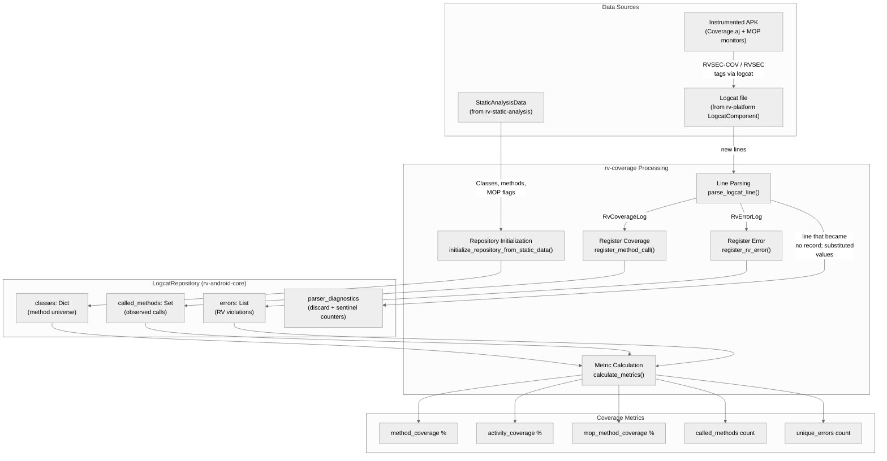
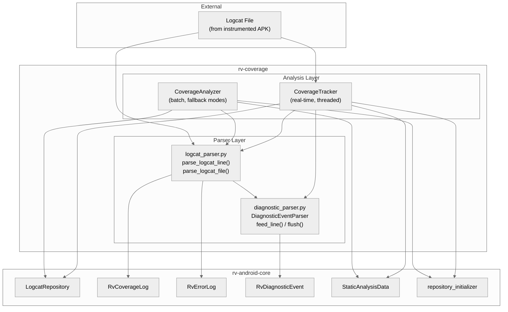
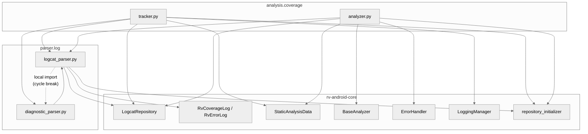
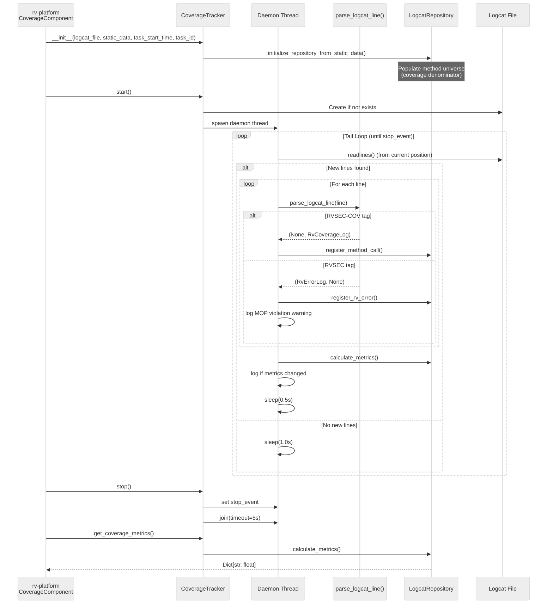
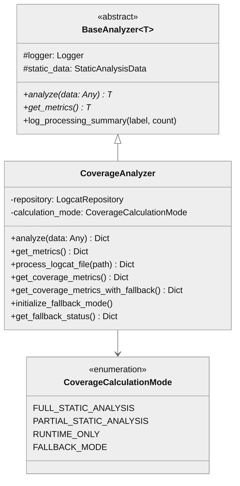

# rv-coverage Architecture

## Overview

rv-coverage is the runtime coverage tracking module for RV-Android. It parses Android logcat output to extract method coverage events (tagged `RVSEC-COV`) and specification violation events (tagged `RVSEC`), then computes coverage metrics against the reachable method universe provided by static analysis. The module operates in two modes: real-time tracking during test execution (via `CoverageTracker`) and batch analysis of logcat files (via `CoverageAnalyzer` and `parse_logcat_file`). It occupies the execution phase of the experiment lifecycle, running in parallel with tool execution inside rv-platform's `TaskExecutor`.

## Specification Alignment

This module implements requirements from `openspec/specs/analysis/spec.md`.

### Functional Requirements

| FR | Description | Architectural Support |
|----|-------------|----------------------|
| FR12 | Method Coverage Tracking -- track overall and MOP method coverage in real-time | `CoverageTracker` runs a background daemon thread tailing the logcat file, parsing lines via `LogcatParser`, and registering entries in `LogcatRepository`. Metrics are calculated with change detection optimization. |
| FR13 | Specification Violation Detection -- detect and record MOP specification violations | `LogcatParser._parse_error_message()` supports three error formats (JCA, FSM, generic). `CoverageTracker` logs violations immediately upon detection and registers them in the repository. |

### Key Invariants

| Invariant | Description | Enforcement Mechanism |
|-----------|-------------|----------------------|
| INV-ANA-04 | CoverageTracker MUST log coverage metric updates when metrics change, and log MOP errors immediately | `_update_coverage_metrics()` uses change detection (`_data_changed_since_last_update` flag) and `_previous_metrics` comparison. MOP errors are logged in `_process_line()` via `self.logger.warning()` immediately. |
| INV-ANA-05 | CoverageTracker MUST be thread-safe with RLock protection; background thread MUST be a daemon | `_reader_lock` (RLock) protects file reads. Thread is created with `daemon=True`. `_stop_event` (threading.Event) signals termination. |
| INV-ANA-07 | LogcatParser MUST support the Soot-signature (`<class: retType method(params)>`) and triple-colon (`class:::method:::params`) coverage formats | `_parse_coverage_message()` tries the Soot regex first, then the triple-colon split. Both produce valid `RvCoverageLog`. |
| INV-ANA-08 | LogcatParser MUST support three error formats (JCA CSV, FSM `:::`, generic spec error); malformed messages return None with warning | `_parse_error_message()` tries generic spec error first, then JCA CSV (6+ fields), then FSM triple-colon. Unmatched messages log a warning and return `None`. |
| INV-ANA-46 | `parse_logcat_line` MUST keep its `Tuple[Optional[RvErrorLog], Optional[RvCoverageLog]]` return type and RVSEC/RVSEC-COV behavior | Diagnostics are parsed by a separate stateful component rather than widening the return type (ADR-001). The added `diagnostics` parameter is optional and does not change the return type or the parse; it only names where the counters land. The sanctioned behavioral exceptions are frame-form normalization (INV-ANA-50) and envelope decoding (INV-ANA-63). |
| INV-ANA-47 | Diagnostic tags MUST be matched on the parsed tag field, not a line substring | `DiagnosticEventParser` classifies using the `tag` field produced by `_parse_logcat_line()`, so a substring such as `isAndroidRuntime()` cannot trigger a false positive. |
| INV-ANA-50 | `parse_logcat_line` MUST NOT return an `RvErrorLog` whose `class_full_name` or `method` ends with a `(<file>:<line>)` group | `_normalize_frame()` runs inside `_parse_error_message()` before the `RvErrorLog` is constructed, on the JCA CSV branch (the only branch whose fields arrive pre-split from Java). |
| INV-ANA-51 | Normalization MUST be idempotent and a byte-identical no-op on well-formed values | `_FRAME_SUFFIX` requires the trailing group to end in `:<digits>`, which a well-formed class or method never does. No match returns `None`, and the caller leaves its fields untouched. |
| INV-ANA-52 | The normalization guard MUST be anchored on the trailing group only, never constraining the prefix | `_FRAME_SUFFIX = r"\(([^()]+:\d+)\)$"` — the prefix is unconstrained because real method names in the corpus (Kotlin backtick test names) contain spaces and their own parenthesis pairs. |
| INV-ANA-56 | A line whose parsed tag is not a diagnostic tag MUST be transparent to diagnostic block assembly: no event, and no close of an open block | `DiagnosticEventParser.feed_line()` returns `None` for any non-diagnostic tag before it touches the buffer. Logcat merges every process into one timestamp-ordered stream, so a foreign-tag line between two lines of a block is the expected case and carries no information about whether the block ended; closing on it truncated the event and silently discarded the exception class, the app frame and the frame count. |
| INV-ANA-57 | A caller driving `DiagnosticEventParser` directly MUST call `flush()` at end of input | With foreign-tag lines transparent, a block is closed by a diagnostic key change, a new block start, a non-threadtime line (INV-ANA-48), or `flush()` — so a block open at end of input is emitted only by the flush. `parse_logcat_file` flushes internally; `CoverageTracker` flushes after its final drain, in that order. |
| INV-ANA-62 | No logcat line MUST be discarded silently; records registered plus counted lines MUST equal lines read | Every non-record line increments exactly one of the seven `ParserDiagnostics` discard counters, and every substituted value increments its `sentinel_*` counter. The object is owned by `LogcatRepository`; `CoverageTracker` passes `self.repository.parser_diagnostics` and `parse_logcat_file` uses the repository's own, so the two paths count onto the same totals. `parse_logcat_file` logs the 1-based line number and re-raises instead of returning a partial repository. |
| INV-ANA-63 | An envelope whose last quoted value is unclosed MUST be a truncated record, and a value containing `:::` MUST be kept verbatim and counted | `_parse_envelope()` reads quoted values by hand: a missing closing quote sets `truncated=True`, keeps the fields parsed before the cut, drops nothing else into the record, and counts `truncated_envelopes`. `_apply_envelope()` counts `envelope_forbidden_chars` once per record and repairs nothing — the producer contract, not the parser, forbids the character. |
| INV-ANA-15 | Coverage metrics MUST use reachability data as denominator; without it, only absolute counts are valid | `CoverageTracker` and `CoverageAnalyzer` initialize `LogcatRepository` from `StaticAnalysisData.classes` when available. `CoverageCalculationMode` degrades to `RUNTIME_ONLY`/`FALLBACK_MODE` without static data. |

### Specification Scenarios

Scenarios from `openspec/specs/analysis/spec.md` that validate this architecture:
- **Real-time coverage tracking with CoverageTracker**: Validates the daemon thread lifecycle (start, initial drain, seek-to-end, tail loop with adaptive sleep) -- traces through `CoverageTracker.start()` -> `_track_coverage()` -> `parse_logcat_line()` -> `LogcatRepository`
- **Coverage log parsing (Soot signature format)**: Validates `RVSEC-COV` parsing with the angle-bracket signature -- traces through `LogcatParser._parse_coverage_message()` -> `RvCoverageLog`
- **Coverage log parsing (triple-colon format)**: Validates the `:::` layout emitted by APKs carrying an older Coverage aspect -- traces through `LogcatParser._parse_coverage_message()`
- **Reachability data used as coverage denominator**: Validates that `method_coverage` and `mop_method_coverage` use static analysis as denominator -- traces through `CoverageTracker._initialize_from_static_data()` -> `LogcatRepository.calculate_metrics()`
- **Coverage without reachability data (fallback)**: Validates graceful degradation -- traces through `CoverageAnalyzer._determine_calculation_mode()` -> `RUNTIME_ONLY`/`FALLBACK_MODE`
- **Standard (JCA) error format parsing**: Validates CSV-based error parsing -- traces through `LogcatParser._parse_error_message()`
- **FSM error format parsing**: Validates triple-colon error parsing
- **Generic error format parsing**: Validates spec error with source location parsing
- **Malformed error message handling**: Validates that unparseable messages return `None` with warning log
- **Frame-form normalization of violation records**: Validates that a whole `StackTraceElement` arriving in the class and method fields is recovered into `(class, method, source)` -- traces through `LogcatParser._parse_error_message()` -> `_normalize_frame()` -> `RvErrorLog`
- **Multi-line diagnostic event assembly**: Validates that crash, `VerifyError` and ANR lines are grouped by `(tag, pid, tid)`, that a foreign-tag line interleaved by the shared stream is transparent (INV-ANA-56), and that a block open at end of input is emitted only by `flush()` (INV-ANA-57) -- traces through `DiagnosticEventParser.feed_line()` / `flush()` -> `LogcatRepository.diagnostic_events`
- **Discard and sentinel accounting**: Validates that records registered plus counted lines equals lines read, and that no field is invented (INV-ANA-62) -- traces through `parse_logcat_line(line, diagnostics)` -> `ParserDiagnostics`
- **v1 envelope decoding and truncation**: Validates `code`/`event`/`obj`/`val`/`exp`/`msg` extraction, the `UNSPECIFIED` sentinels for a non-envelope message, and an unclosed quote as truncation (INV-ANA-63) -- traces through `_parse_envelope()` / `_apply_envelope()` -> `RvErrorLog`

## Key Architectural Decisions

### ADR-1: Background Daemon Thread for Real-Time Tracking

`CoverageTracker` spawns a daemon thread that continuously tails the logcat file, rather than polling on demand or using an event-driven architecture.

**Why**: Logcat data arrives asynchronously during tool execution. A polling-on-demand approach would miss data if the caller does not poll frequently enough, and would couple the tool execution loop to coverage processing. A daemon thread with file-tailing decouples the two: the testing tool writes to logcat at its own pace, and the tracker processes lines independently. The daemon flag (`daemon=True`) ensures the thread terminates when the main process exits, even if `stop()` is not called. This satisfies INV-ANA-05 (thread MUST be a daemon).

**Spec reference**: The "Real-time coverage tracking with CoverageTracker" scenario validates the full lifecycle: start, initial drain, seek-to-end, tail loop with adaptive sleep.

### ADR-2: File-Tailing Instead of ADB Logcat Stream

The tracker reads from a logcat file on disk rather than piping directly from `adb logcat`.

**Why**: rv-platform's `LogcatComponent` manages the `adb logcat` process and redirects its output to a file. The file serves multiple consumers: `CoverageTracker` reads it in real-time, and the file persists as a result artifact for post-experiment batch analysis. Tailing a file is simpler than managing a subprocess pipe and avoids the complexity of buffering issues with `adb logcat` output streams.

### ADR-3: Adaptive Sleep (0.5s Active / 1.0s Idle)

The tail loop uses a shorter sleep interval (0.5s) when data is flowing and a longer interval (1.0s) when idle.

**Why**: A fixed interval forces a tradeoff between latency and CPU usage. With adaptive sleep, the tracker responds quickly when the instrumented APK is actively executing (many logcat lines per second) and reduces CPU consumption during idle periods (e.g., between test actions). The 0.5s active interval provides sub-second metric update latency, sufficient for rv-agent's exploration loop which operates on a 2-3 second cycle.

### ADR-4: Change Detection for Metric Calculation

`CoverageTracker` maintains a `_data_changed_since_last_update` flag and a `_previous_metrics` snapshot. Metrics are only recalculated when new data has arrived, and only logged when values have actually changed.

**Why**: `LogcatRepository.calculate_metrics()` iterates all classes and methods to compute coverage percentages. In an experiment with 5000+ methods, this is measurably expensive. During idle periods (no new logcat lines), recalculating every second wastes CPU. The change detection flag skips the calculation entirely when no new data has arrived. The metrics snapshot comparison prevents log spam from repeated identical metric values. This satisfies INV-ANA-04 (log coverage metric updates when metrics change).

### ADR-5: Multi-Format Parser with Ordered Fallback

`LogcatParser._parse_error_message()` tries three formats in a specific order: generic spec error, JCA CSV, FSM triple-colon. `_parse_coverage_message()` tries the Soot angle-bracket format, then triple-colon.

**Why**: Three error formats exist because different RV-Monitor/RVSEC versions emit different message structures, and an APK is instrumented once but replayed across many runs, so older layouts never fully disappear from the corpus. The order matters: the generic spec error format (ending with "went into an error state.") is tried first because the JCA CSV split would match generic messages too, producing garbled fields. The Soot-signature coverage format is tried before triple-colon because it is more specific (angle-bracket delimiters vs. triple-colon, which could appear in class names). This satisfies INV-ANA-07 (support both coverage formats) and INV-ANA-08 (support three error formats; malformed messages return None with warning).

Two refinements make the cascade safe rather than merely ordered. Selection of Format 1 requires the spaced ` ::: ` separator **as well as** the error-state suffix, because Format 3 ends in the same words with an unspaced separator. And a line that is selected as Format 1 but whose regex fails is dropped and counted, never allowed to fall through: a generic class or method name bearing five commas satisfies the JCA comma count and comes out as a record whose every field is a fragment of a value.

### ADR-6: Reachability Data as Coverage Denominator

Coverage percentages are computed as `called_methods / total_reachable_methods`. Without reachability data from static analysis, only absolute counts are valid (INV-ANA-15).

**Why**: Using "all methods in the APK" as the denominator would include unreachable dead code, framework methods, and library code, producing artificially low coverage percentages (often <1%). The reachability analysis in rv-static-analysis identifies which methods are actually reachable from framework entry points, providing a meaningful denominator. When static data is unavailable (analysis timed out with no reachability section), `CoverageCalculationMode` degrades gracefully to `RUNTIME_ONLY` mode, reporting only absolute counts.

### ADR-7: Separate Stateful Parser for Diagnostic Events

Diagnostic events (crashes, `VerifyError`s, ANRs) are assembled by a distinct `DiagnosticEventParser` holding multi-line state, rather than by widening `parse_logcat_line()` into a three-way return.

**Why**: RVSEC/RVSEC-COV parsing is a pure "one line to at most one record" mapping, while a diagnostic event spans many lines that must be grouped by `(tag, pid, tid)` and closed when the key changes. Folding stateful assembly into the stateless function would have changed a re-exported public signature and put churn on the exact code path whose output every experiment baseline depends on. Keeping the two orthogonal makes the non-regression guarantee hold by construction, at the cost of a second per-line pass and the caller's obligation to `flush()` at end of input. The full option analysis is recorded in `docs/adr/ADR-001-separate-stateful-diagnostic-parser.md`.

### ADR-8: Frame-Form Normalization at Parse Time

When the Java `ErrorSummary` cannot split a `StackTraceElement` into class and method, it copies the entire frame into both fields. `_normalize_frame()` recovers the correct triple in the Python parser instead of relying solely on the upstream fix.

**Why**: Two reasons, one about correctness and one about reach. Correctness: the source position rides inside the `(apk, class, method, spec)` key that every downstream analysis treats as a violation's identity, so a single misuse gets counted once per line number it occurs at (issue #89). Reach: an APK is instrumented once and replayed across many runs, so every APK already built with an uncorrected monitor jar keeps emitting the broken form regardless of what the Java does afterwards — a parser-side recovery is what makes existing corpora usable.

The algorithm deliberately avoids describing what a method name looks like, since that is precisely the assumption that failed upstream. It strips the trailing `(<file>:<line>)` group and splits the remainder at its last dot, relying only on two facts that always hold: the class part is a dotted path, and a method name contains no dot. Requiring the trailing group to end in `:<digits>` is what separates a source position from a parenthesis belonging to the name, so a well-formed value can never be truncated by accident (INV-ANA-51). A frame-shaped value with no dot at all cannot come from a real `StackTraceElement`; it is left untouched with a warning rather than mangled on a guess.

### ADR-9: Count Every Discarded Line Instead of Fabricating a Field

Every line that leaves the parser without becoming a record increments a named counter on `ParserDiagnostics`, and every value the producer did not supply becomes the explicit sentinel `UNSPECIFIED` rather than a plausible substitute.

**Why**: Whatever the parser drops is invisible in every count downstream of it, and whatever it substitutes reads as a measurement everywhere it reaches. The alternative -- writing a plausible stand-in (`Unknown Source:1` for an absent position, `No additional message` for an absent message) and letting an unparseable line vanish -- does both silently, so a campaign cannot distinguish "the monitor said nothing" from "the parser could not read it", and cannot tell after the fact which of the two it read. Making the account arithmetic (records plus counted lines equals lines read, INV-ANA-62) turns a silent loss into a number a report can carry.

`ParserDiagnostics` is defined in rv-android-core beside `LogcatRepository` rather than here, because the repository is what carries it to its readers and rv-android-core cannot import rv-coverage -- the dependency runs the other way. rv-coverage constructs nothing: it increments the object the repository already owns, which is what makes the live `CoverageTracker` path and the offline `parse_logcat_file` path count onto the same totals.

### ADR-10: `unique_msg` Composed Once, at Event Granularity

The violation key is built only in `RvErrorLog.unique_msg` (rv-android-core) and carries seven `:::` parts: `class:::method:::spec:::error_type:::code:::event:::message`.

**Why**: Recomposing the key wherever it is needed puts several compositions on the path from logcat to `errors.csv`, and compositions can disagree; a single definition cannot. An absent CSV column is therefore a `KeyError`, never a fallback that quietly rebuilds a second key. `code` and `event` come from the message envelope and name which automaton transition failed. Without `event`, two distinct causes at the same call site collapse into one record, and which of them survives the collector's `HashSet` is arrival order. `code` alone does not refine anything, since every specification in the set has at most one `@fail` -- its code is a function of the specification name. Records with no envelope hold `UNSPECIFIED` in both positions, which is what lets a reader tell a pre-envelope record apart from one whose event was named. The key is deliberately finer than the `(apk, class, method, spec)` key used downstream to count unique *misuses*; the two are different questions and are not interchangeable.

| Decision | Choice | Rationale |
|----------|--------|-----------|
| Application Type | Library module | Consumed by rv-platform (real-time tracking) and rv-android-core (batch parsing). No CLI or service interface. |
| Structuring | Two-package split: `parser/` and `analysis/` | Separates data extraction (logcat parsing) from metric computation (coverage tracking/analysis). Each concern evolves independently. |
| Primary Pattern | Producer-Consumer with background thread | Logcat data is produced by the instrumented APK and consumed by a daemon thread. Decouples test execution from coverage processing. |
| Control Strategy | File-tailing with adaptive sleep | The tracker tails the logcat file using file position tracking (`seek`/`readlines`), with 0.5s sleep when data flows and 1.0s when idle. Balances latency and CPU usage. |
| Metric Delegation | Delegate to `LogcatRepository.calculate_metrics()` | Metric calculation logic lives in rv-android-core's `LogcatRepository`, keeping rv-coverage focused on data acquisition and tracking lifecycle. |
| Error Format Support | Multi-format parser with ordered fallback | Three error formats and two coverage formats exist due to different RV-Monitor/RVSEC versions. The parser tries the most specific format first to avoid ambiguous matches. |
| Diagnostic Events | Separate stateful parser, isolated repository collection | Multi-line assembly does not fit the stateless per-line contract, and diagnostics must never perturb coverage/MOP metrics. |
| Unreadable Input | Counted under a named counter, never dropped silently | A dropped line is invisible downstream; a counted one is a number a report can carry (INV-ANA-62). |
| Missing Values | Explicit `UNSPECIFIED` sentinel, never a substitute | An invented value reads as a measurement in every file it reaches, and there is no way back from it. |
| Emitter Defects | Normalized in the parser, not only at the source | Instrumented APKs are replayed long after the emitter is fixed, so the parser is the only place that can repair historical corpora. |

## Data Flow

The module operates at the intersection of three data streams: static analysis data (method universe), logcat output (runtime events), and coverage metrics (computed output).

### End-to-End Data Flow



### Data Transformation Pipeline

1. **Repository initialization**: When `CoverageTracker` (or `CoverageAnalyzer`) is created with `StaticAnalysisData`, it calls `initialize_repository_from_static_data()` to populate `LogcatRepository.classes` with all known classes and methods from the reachability section. This establishes the denominator for coverage percentages. Each method entry carries `reachable`, `reaches_target`, and `directly_reaches_target` flags.

2. **Logcat line parsing**: The background thread reads new lines from the logcat file. Each line is passed to `parse_logcat_line()`, which:
   - Extracts date, time, PID, TID, level, tag, and message via regex matching against the Android logcat "threadtime" format
   - If the tag is `RVSEC-COV`: tries the Soot angle-bracket format (`<class: retType method(params)>`) first, then triple-colon (`class:::method:::params`), producing an `RvCoverageLog`
   - If the tag is `RVSEC`: tries generic spec error, JCA CSV, then FSM triple-colon, producing an `RvErrorLog`. On the JCA CSV branch, `_normalize_frame()` repairs class/method fields that arrived as a whole stack frame before the record is built, and `_apply_envelope()` decodes the v1 envelope in the message field into `code`, `event`, `obj`, `val`, `exp`, `msg`
   - If the line becomes no record at all, exactly one `ParserDiagnostics` counter is incremented, and every value the parser had to substitute increments its `sentinel_*` counter (INV-ANA-62). The counters belong to the repository, so the account is the run's, not a caller's
   - Both domain objects carry `time_occurred` (parsed from the logcat timestamp with year inference) and `original_msg` (raw line)

   In parallel, every line -- whatever its tag -- is fed to a `DiagnosticEventParser` instance, which buffers crash/`VerifyError`/ANR content and emits a completed `RvDiagnosticEvent` when the `(tag, pid, tid)` key changes, a new block starts, a non-threadtime line arrives, or the caller flushes. Lines under foreign tags pass through it without closing the open block (INV-ANA-56).

3. **Repository registration**: Coverage entries are registered via `register_method_call()`, which marks the method as "called" in the repository. Error entries are registered via `register_rv_error()`, which adds the violation to the error list. Both operations set `_data_changed_since_last_update` to trigger metric recalculation. Diagnostic events go to `register_diagnostic_event()`, which stores them in an isolated collection excluded from all metrics.

4. **Metric calculation**: `LogcatRepository.calculate_metrics()` computes:
   - `method_coverage`: called reachable methods / total reachable methods
   - `activity_coverage`: activities with at least one called method / total activities
   - `mop_method_coverage`: called methods that reach MOP / total methods that reach MOP
   - `called_methods`: absolute count of unique methods observed
   - `unique_errors`: absolute count of distinct RV violations, at event granularity (`RvErrorLog.unique_msg`, seven `:::` parts including `code` and `event`)

### Logcat Line Format and Tag Routing

Every line is routed by its parsed tag. The two branches below are mutually exclusive; the
diagnostic pass on the right runs over the same line regardless of which branch matched.

```
MM-DD HH:MM:SS.mmm  PID  TID  LEVEL  TAG: message
                                        |
                +-----------------------+-----------------------+
                |                       |                       |
          TAG == RVSEC          TAG == RVSEC-COV        TAG in {AndroidRuntime,
                |                       |                art/dalvikvm, ActivityManager}
    _parse_error_message()   _parse_coverage_message()          |
          |     |     |            |          |          DiagnosticEventParser
      generic  JCA   FSM         Soot     triple-colon      .feed_line()
      spec     CSV   :::         <sig>        :::          (buffer until
      error    6+f  split        regex       split       (tag,pid,tid) changes,
                |                                          block starts, non-
        _normalize_frame()                                 threadtime line, flush)
     (repair frame-form fields)
                |
        _apply_envelope()
     (decode v1 envelope / sentinels)
```

A line that reaches none of the three branches is not lost: it increments exactly one
`ParserDiagnostics` discard counter. Diagnostic-tag lines are neither records nor
discards on this pass -- they are the raw material of the right-hand branch, and lines
under any other foreign tag are transparent to it.

## Architectural Patterns

### Pattern: Producer-Consumer (Background Thread)

**Description**: `CoverageTracker` spawns a daemon thread that continuously reads new logcat lines (producer: instrumented APK writing to logcat; consumer: background thread reading the file). The thread registers parsed entries in `LogcatRepository`, which is queried by the main thread for metrics.

**When Used**: During real-time test execution, when the testing tool and coverage tracking run concurrently.

**Advantages**:
- Non-blocking: test execution proceeds without waiting for coverage processing
- Incremental: processes only new lines via file position tracking
- Adaptive: sleep duration adjusts to data flow rate

**Disadvantages**:
- Requires thread safety (RLock) for shared `LogcatRepository` access
- File-based communication introduces latency (up to 0.5-1.0s polling interval)

### Pattern: Template Method (BaseAnalyzer)

**Description**: `CoverageAnalyzer` extends `BaseAnalyzer[Dict[str, Any]]` from rv-android-core, implementing the `analyze()` and `get_metrics()` abstract methods. The base class provides logging infrastructure and processing summary utilities.

**When Used**: For batch (offline) analysis of logcat files, supporting multiple input types (file path, individual log entries, lists).

**Advantages**:
- Consistent interface across analyzer types in rv-android

**Disadvantages**:
- Adds an inheritance layer for a class with no confirmed external callers

### Pattern: Strategy (Calculation Modes)

**Description**: `CoverageCalculationMode` enum defines four modes (`FULL_STATIC_ANALYSIS`, `PARTIAL_STATIC_ANALYSIS`, `RUNTIME_ONLY`, `FALLBACK_MODE`) that govern how metrics are calculated based on available data.

**When Used**: In `CoverageAnalyzer` to gracefully degrade when static analysis data is incomplete or absent.

**Advantages**:
- Explicit representation of data availability states
- Each mode can add metadata explaining limitations

**Disadvantages**:
- The fallback infrastructure has no confirmed external callers

---

## Logical View

Shows key domain entities and their relationships.

### Domain Entities

| Entity | Responsibility |
|--------|----------------|
| `CoverageTracker` | Real-time logcat monitoring via background thread; primary consumer interface for rv-platform |
| `CoverageAnalyzer` | Batch logcat analysis with fallback modes; extends `BaseAnalyzer` |
| `LogcatParser` (module-level functions) | Stateless parsing of individual logcat lines and complete files |
| `DiagnosticEventParser` | Stateful multi-line assembly of crash / `VerifyError` / ANR events, grouped by `(tag, pid, tid)` |
| `LogcatRepository` (from rv-android-core) | Storage and metric calculation for coverage and error data; holds the isolated `diagnostic_events` collection |
| `RvCoverageLog` (from rv-android-core) | Domain object representing a single method call event |
| `RvErrorLog` (from rv-android-core) | Domain object representing a single specification violation |
| `RvDiagnosticEvent` (from rv-android-core) | Domain object representing one assembled diagnostic event, with its category |
| `CoverageCalculationMode` | Enum governing metric calculation strategy in `CoverageAnalyzer` |

### Component Architecture



---

## Development View

Shows code organization for developers.

### Module Structure

```
rv-coverage/
├── src/
│   └── rv_coverage/
│       ├── __init__.py                    # Public API: CoverageAnalyzer, CoverageTracker,
│       │                                  #   parse_logcat_file, parse_logcat_line
│       ├── parser/
│       │   └── log/
│       │       ├── logcat_parser.py       # Line/file parsing, frame-form normalization,
│       │       │                          #   v1 envelope, discard accounting (343 SLOC)
│       │       └── diagnostic_parser.py   # Stateful multi-line diagnostics (180 SLOC)
│       └── analysis/
│           └── coverage/
│               ├── analyzer.py            # Batch analysis with fallback (202 SLOC)
│               └── tracker.py             # Real-time background tracking (261 SLOC)
├── tests/
│   ├── parser/
│   │   └── log/
│   │       ├── test_logcat_parser.py
│   │       ├── test_diagnostic_parser.py
│   │       ├── test_diagnostic_integration.py
│   │       ├── test_frame_form_normalization.py
│   │       ├── test_gh104_collector_transport.py
│   │       └── fixtures/                  # Golden logcat + frame-form corner-case corpus
│   └── analysis/
│       └── coverage/
│           ├── test_tracker.py
│           ├── test_tracker_branches.py
│           ├── test_tracker_lifecycle.py
│           ├── test_tracker_final_drain.py
│           ├── test_analyzer.py
│           ├── test_analyzer_branches.py
│           └── test_analyzer_fallback.py
├── docs/
│   ├── architecture.md
│   └── adr/ADR-001-separate-stateful-diagnostic-parser.md
├── pyproject.toml
├── README.md
└── CLAUDE.md
```

`diagnostic_parser.py` imports `_parse_logcat_line` and `_convert_to_datetime` from
`logcat_parser.py` so both parsers agree on what a well-formed logcat line is.
`parse_logcat_file` imports `DiagnosticEventParser` locally inside the function body,
which is what keeps that shared-helper reuse from becoming a module-load cycle.

### Package Dependencies



---

## Process View

Shows runtime behavior during test execution.

### Real-Time Coverage Tracking (Primary Use Case)



### Thread Safety Model

The `CoverageTracker` uses two synchronization primitives:
- **`_reader_lock` (RLock)**: Protects concurrent file reads when `_track_coverage()` reads lines. The lock is reentrant, allowing the same thread to acquire it recursively.
- **`_stop_event` (threading.Event)**: Signals the daemon thread to terminate. Checked at the top of each tail loop iteration.

The background thread is created as a daemon thread (`daemon=True`), ensuring it terminates when the main process exits even if `stop()` is not called explicitly.

---

## Core Components

### LogcatParser (`parser/log/logcat_parser.py`)

**Purpose**: Stateless parsing of Android logcat lines into typed domain objects. Entry point for all logcat data in rv-coverage.

**Location**: `src/rv_coverage/parser/log/logcat_parser.py`

**Key Functions**:
- `parse_logcat_line(line, diagnostics=None) -> Tuple[Optional[RvErrorLog], Optional[RvCoverageLog]]`: Parse a single line. Returns a mutually exclusive tuple (at most one non-None). `diagnostics` is the `ParserDiagnostics` object to increment; `None` means "count nowhere" (a throwaway object), which changes no parse result.
- `parse_logcat_file(log_file, static_data, tool_execution_start) -> LogcatRepository`: Parse an entire file into a populated repository, stamping `time_since_task_start` when the epoch is given. An error raised while iterating is logged with its 1-based line number and re-raised, never swallowed.
- `_parse_error_message(message, diagnostics, thread_key) -> Optional[RvErrorLog]`: Try three error formats in specificity order. `thread_key` is the `(pid, tid)` used to recognise the second half of a payload logcat split on a newline.
- `_parse_envelope(message) -> Optional[Tuple[Dict[str, str], bool]]`: Decompose a v1 envelope into its keys, returning `(fields, truncated)`; `None` when the text is not an envelope.
- `_apply_envelope(error, message, diagnostics) -> None`: Fill the envelope fields of a record, or its sentinels, and count both.
- `_parse_coverage_message(message) -> Optional[RvCoverageLog]`: Try the Soot signature format, then triple-colon.
- `_normalize_frame(value) -> Optional[Tuple[str, str, str]]`: Recover `(class, method, source)` from a whole stack frame. Returns `None` when the value is not in frame form -- the signal to leave the caller's fields untouched.
- `_convert_to_datetime(date, time) -> datetime`: Infer year from current date (handles December-January transitions).

**Dependencies**:
- Internal: `diagnostic_parser.DiagnosticEventParser` (imported locally inside `parse_logcat_file` to avoid a load cycle)
- External: `rv_android_core.domain.log` (RvErrorLog, RvCoverageLog, TAG_RVSEC, TAG_RVSEC_COV), `rv_android_core.domain.coverage` (LogcatRepository, ParserDiagnostics), `rv_android_core.util.android.repository_initializer`

### DiagnosticEventParser (`parser/log/diagnostic_parser.py`)

**Purpose**: Assemble multi-line execution-level diagnostics -- application crashes (`AndroidRuntime`), class-load `VerifyError`s (`art`/`dalvikvm`), and ANRs (`ActivityManager`) -- into `RvDiagnosticEvent` records. These make an otherwise invisible confounder visible: an instrumented APK that crashes early is indistinguishable from a weak tool result when only coverage is recorded.

**Location**: `src/rv_coverage/parser/log/diagnostic_parser.py`

**Key Methods**:
- `feed_line(line) -> Optional[RvDiagnosticEvent]`: Accumulate content, returning a completed event when the buffered block is closed -- by a `(tag, pid, tid)` key change, a new block start, or a non-threadtime line (INV-ANA-48). A line under a tag that is not a diagnostic tag is transparent: it yields no event and does not close the open block (INV-ANA-56), because logcat merges every process into one timestamp-ordered stream and an interleaved foreign line says nothing about whether the block ended.
- `flush() -> Optional[RvDiagnosticEvent]`: Emit whatever is still buffered. Required at end of input (INV-ANA-57) -- with foreign lines transparent, a block open at end of input is emitted only here, so without it a final crash is lost entirely.

**Dependencies**:
- Internal: `_parse_logcat_line`, `_convert_to_datetime` from `logcat_parser.py`
- External: `rv_android_core.domain.log` (RvDiagnosticEvent)

**Note**: Tag matching uses the parsed tag field rather than a substring search, so text such as `isAndroidRuntime()` inside a message cannot open a spurious event (INV-ANA-47).

### CoverageTracker (`analysis/coverage/tracker.py`)

**Purpose**: Real-time logcat monitoring during test execution. The primary component used by rv-platform's `CoverageComponent`.

**Location**: `src/rv_coverage/analysis/coverage/tracker.py`

**Key Methods**:
- `start()`: Create logcat file if needed, spawn daemon thread
- `stop()`: Signal thread termination, join with 5s timeout
- `get_coverage_metrics() -> Dict[str, float]`: Thread-safe metric query
- `track_coverage()`: Context manager wrapping start/stop
- `_track_coverage()`: Main tail loop (drain existing lines, seek to EOF, read new lines in loop)
- `_process_line(line)`: Parse one line, compute relative timestamp, register in repository; also feeds the line to the diagnostic parser
- `_update_coverage_metrics()`: Calculate metrics only when data has changed
- `flush_diagnostics()`: Emit the still-buffered diagnostic event, called when the tail loop ends so a crash at EOF is not lost

**Dependencies**:
- Internal: `parse_logcat_line` from `rv_coverage.parser.log.logcat_parser`, `DiagnosticEventParser` from `rv_coverage.parser.log.diagnostic_parser`
- External: `LogcatRepository`, `StaticAnalysisData`, `LoggingManager`, `initialize_repository_from_static_data` from rv-android-core

### CoverageAnalyzer (`analysis/coverage/analyzer.py`)

**Purpose**: Batch coverage analysis with graceful degradation when static analysis data is unavailable.

**Location**: `src/rv_coverage/analysis/coverage/analyzer.py`

**Key Methods**:
- `analyze(data) -> Dict`: Accept file path, log entries, or lists; return metrics
- `process_logcat_file(logcat_file) -> Dict`: Parse file and merge into repository
- `get_coverage_metrics() -> Dict`: Calculate metrics from repository
- `get_coverage_metrics_with_fallback() -> Dict`: Metrics with mode metadata
- `get_fallback_status() -> Dict`: Detailed capability report

**Dependencies**:
- Internal: `parse_logcat_file` from `rv_coverage.parser.log.logcat_parser`
- External: `BaseAnalyzer`, `LogcatRepository`, `StaticAnalysisData`, `ErrorHandler` from rv-android-core

**Note**: This class has no confirmed external callers. rv-platform uses `CoverageTracker` for real-time tracking and `parse_logcat_file` for batch processing.

---

## NFR Support

How the architecture supports non-functional requirements from the PRD.

| NFR | PRD ID | Priority | Architectural Support |
|-----|--------|----------|----------------------|
| Modularity | NFR01 | P0 | rv-coverage is a standalone uv workspace module with a single dependency (rv-android-core). Domain models live in rv-android-core; rv-coverage focuses on parsing and tracking. |
| Extensibility | NFR02 | P0 | `CoverageAnalyzer` extends `BaseAnalyzer` via Template Method pattern. `CoverageCalculationMode` enum allows adding new degradation modes. New logcat formats can be added to `_parse_error_message()` / `_parse_coverage_message()` cascade. |
| Testability | NFR03 | P1 | Stateless parser functions are directly unit-testable. `CoverageTracker` accepts file paths, enabling test with fixture files. Tests exist in `tests/parser/` and `tests/analysis/`. |
| Resilience | NFR04 | P1 | `CoverageTracker` catches all exceptions in the daemon thread (never crashes). `parse_logcat_line` returns `(None, None)` for unparseable lines, with a warning log and a counted discard. `CoverageAnalyzer` degrades gracefully through four calculation modes. File-not-found creates an empty file. Degradation stops at the file level: `parse_logcat_file` re-raises rather than returning a repository built from the prefix that happened to parse, which would look exactly like a complete result. |
| Observability | NFR06 | P1 | `CoverageTracker` logs metric updates on change, MOP violations immediately, and processing events via `LoggingManager`. Metrics include `method_coverage`, `activity_coverage`, `mop_method_coverage`, `called_methods`, `unique_errors`. `LogcatRepository.parser_diagnostics` reports why each unread line was unread and every value the parser had to substitute (`to_dict()` for a report, `discarded_lines` for the total). Diagnostic events surface crashes and ANRs that would otherwise be an invisible confounder. Frame-form normalizations are logged at debug level so a campaign run against APKs carrying an old monitor jar stays auditable after the fact. |
| Reproducibility | NFR08 | P1 | Logcat files are persistent artifacts in the results directory. `parse_logcat_file` enables deterministic re-analysis of any previous execution. |

---

## Key Interfaces

### Public API (module-level)

```python
# rv_coverage/__init__.py exports
from rv_coverage import CoverageTracker       # Real-time tracking
from rv_coverage import CoverageAnalyzer      # Batch analysis
from rv_coverage import parse_logcat_line     # Single-line parsing
from rv_coverage import parse_logcat_file     # File parsing
```

### CoverageTracker Lifecycle

```python
class CoverageTracker:
    def __init__(
        self,
        logcat_file: str,
        static_data: Optional[StaticAnalysisData] = None,
        task_start_time: Optional[datetime] = None,
        task_id: Optional[str] = None,
    ): ...

    def start(self) -> None: ...
    def stop(self) -> None: ...
    def get_coverage_metrics(self) -> Dict[str, float]: ...

    @contextmanager
    def track_coverage(self): ...
```

### BaseAnalyzer Integration



---

## Scenarios

Key use cases that validate the architecture.

### Scenario 1: Real-Time Coverage During Tool Execution

**Description**: rv-platform's `CoverageComponent` creates a `CoverageTracker` before tool execution starts, and reads final metrics after the tool completes.

**Flow**:
1. `CoverageComponent` constructs `CoverageTracker` with the task's logcat file path, static analysis data (providing the method universe), tool execution start time, and task ID
2. `CoverageTracker._initialize_from_static_data()` populates `LogcatRepository` with all reachable classes and methods from the analysis JSON's reachability section
3. `CoverageTracker.start()` spawns a daemon thread that drains existing lines, seeks to EOF, then enters the tail loop
4. As the testing tool exercises the instrumented APK, Coverage.aj logs method signatures with `RVSEC-COV` tag and MOP monitors log violations with `RVSEC` tag
5. The daemon thread reads new lines, parses them via `parse_logcat_line()`, registers entries in `LogcatRepository`, and logs metric changes
6. When the tool completes, `CoverageComponent` calls `tracker.stop()` and `tracker.get_coverage_metrics()` to read the final coverage dictionary

### Scenario 2: Batch Logcat Analysis

**Description**: After an experiment completes, logcat files are re-analyzed for coverage metrics.

**Flow**:
1. Caller invokes `parse_logcat_file(log_file, static_data)`
2. The function initializes a `LogcatRepository`, optionally populated with static data
3. The file is read line-by-line; each line is parsed via `parse_logcat_line()`
4. `RvErrorLog` entries are registered via `register_rv_error()`; `RvCoverageLog` entries via `register_method_call()`
5. The populated `LogcatRepository` is returned for metric calculation

### Scenario 3: Graceful Degradation Without Static Data

**Description**: When static analysis data is unavailable (e.g., analysis timed out with no reachability section), coverage tracking continues with absolute counts only.

**Flow**:
1. `CoverageTracker` is initialized without `static_data` (or with empty `Classes`)
2. `LogcatRepository` is created empty -- no method universe for the denominator
3. The daemon thread still parses and registers coverage/error events
4. `calculate_metrics()` returns 0.0 for percentage-based metrics (`method_coverage`, `mop_method_coverage`) since the denominator is zero
5. Absolute counts (`called_methods`, `unique_errors`) remain valid

---

## Extension Points

- **New logcat formats**: Add a new parsing branch to `_parse_error_message()` or `_parse_coverage_message()` in `logcat_parser.py`. The ordered fallback cascade ensures new formats are tried without breaking existing ones.
- **New diagnostic categories**: Add the base tag to the recognised set in `diagnostic_parser.py` and extend the classification. Matching is on the parsed tag field, so no catch-all priority filter is introduced.
- **New coverage calculation modes**: Add a value to `CoverageCalculationMode` and implement the corresponding metric adjustment in `CoverageAnalyzer`.
- **Alternative tracking backends**: `CoverageTracker` reads from a file path. Replacing the file-tailing loop with a different data source (e.g., ADB logcat stream) would require modifying `_track_coverage()` while preserving the `parse_logcat_line()` -> `LogcatRepository` pipeline.

## Dependencies

### Internal (rv-android modules)

| Module | Purpose |
|--------|---------|
| rv-android-core | Domain models (`LogcatRepository`, `ParserDiagnostics`, `RvErrorLog`, `RvCoverageLog`, `StaticAnalysisData`), infrastructure (`LoggingManager`, `ErrorHandler`, `BaseAnalyzer`), repository initialization (`initialize_repository_from_static_data`) |

### External

| Package | Version | Purpose |
|---------|---------|---------|
| pydantic | >=2.9.0 | Configuration validation (inherited from rv-android-core patterns) |
| regex | >=2024.9.11 | Declared dependency (standard `re` is used in practice for logcat parsing) |
| python-dateutil | >=2.9.0 | Date/time utilities (logcat timestamp handling uses `datetime.strptime` directly) |
| hypothesis | >=6.135.26 | Dev dependency: property-based tests over the envelope grammar and the discard accounting |

## Testing Strategy

| Type | Location | Purpose |
|------|----------|---------|
| Unit | tests/parser/log/test_logcat_parser.py | Logcat line/file parsing across all error and coverage formats |
| Unit | tests/parser/log/test_frame_form_normalization.py | Frame-form corner-case corpus: idempotence, byte-identical pass-through on well-formed values, backtick names with nested parentheses |
| Unit | tests/parser/log/test_diagnostic_parser.py | Multi-line assembly, `flush()`, categories, tag false-positive guards |
| Integration | tests/parser/log/test_diagnostic_integration.py | Both parsers driven over the same stream, including the RVSEC/COV golden re-parse guarding the hot path |
| Integration | tests/parser/log/test_gh104_collector_transport.py | End-to-end transport of a **recorded** fixture (`data/gh104/evidence/collector_lines.logcat`, a transcription of the compiled `ErrorCollector.buildLine`): line -> `parse_logcat_line` -> `RvErrorLog` with the envelope keys and a seven-part `unique_msg`. The Java side pins the same file against the live `buildLine`, so neither end can drift in silence |
| Unit | tests/analysis/coverage/test_tracker*.py | CoverageTracker lifecycle, line processing, metric calculation, branch coverage |
| Unit | tests/analysis/coverage/test_analyzer*.py | CoverageAnalyzer batch analysis, calculation modes, fallback behavior |

## Related Documentation

- [ADR-001](adr/ADR-001-separate-stateful-diagnostic-parser.md) - Why diagnostics use a separate stateful parser instead of a widened `parse_logcat_line` return type
- [Domain Spec](../../../openspec/specs/analysis/spec.md) - Requirements and invariants for rv-coverage (FR12, FR13, INV-ANA-04 through INV-ANA-08, INV-ANA-15, INV-ANA-46 through INV-ANA-52, INV-ANA-56/57, INV-ANA-62/63)
- [PRD](../../../docs/PRD.md) - Product Requirements Document (FR12-FR13, NFR01-08)
- [CLAUDE.md](../CLAUDE.md) - Module-level quick reference for Claude Code
