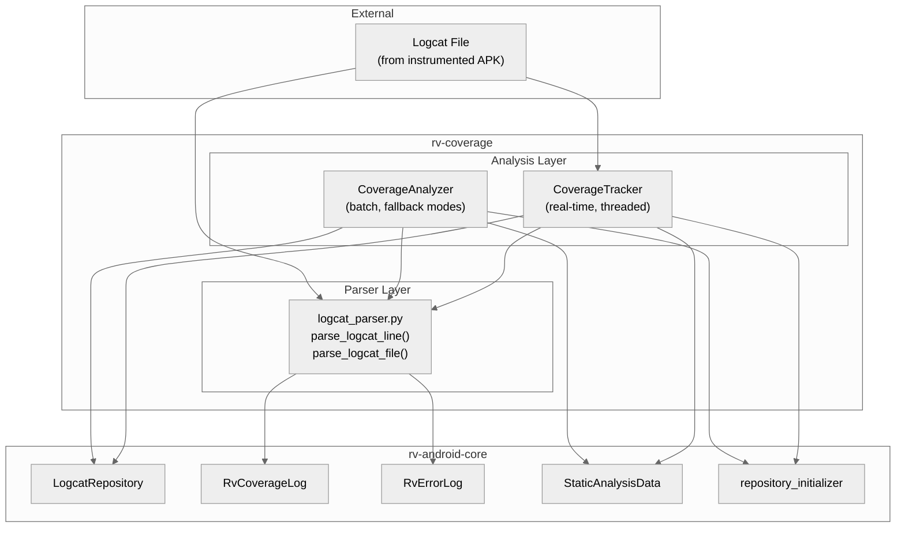
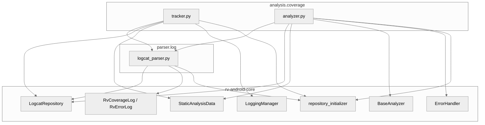
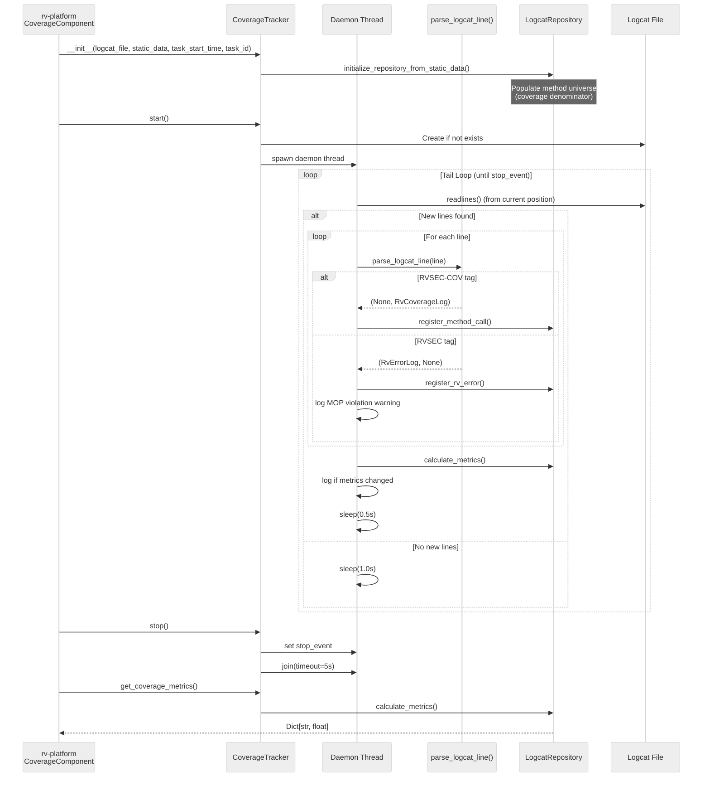
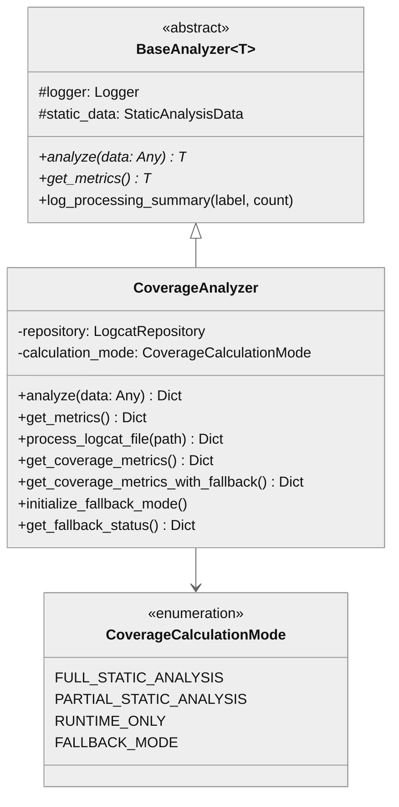

# rv-coverage Architecture

## Overview

rv-coverage is the runtime coverage tracking module for RV-Android. It parses Android logcat output to extract method coverage events (tagged `RVSEC-COV`) and specification violation events (tagged `RVSEC`), then computes coverage metrics against the reachable method universe provided by static analysis. The module operates in two modes: real-time tracking during test execution (via `CoverageTracker`) and batch analysis of logcat files (via `CoverageAnalyzer` and `parse_logcat_file`). It occupies the execution phase of the experiment lifecycle, running in parallel with tool execution inside rv-platform's `TaskExecutor`.

## Specification Alignment

This module implements requirements from `openspec/specs/analysis/spec.md`.

### Functional Requirements

| FR | Description | Architectural Support |
|----|-------------|----------------------|
| FR12 | Method Coverage Tracking -- track overall and MOP method coverage in real-time | `CoverageTracker` runs a background daemon thread tailing the logcat file, parsing lines via `LogcatParser`, and registering entries in `LogcatRepository`. Metrics are calculated with change detection optimization. |
| FR13 | Specification Violation Detection -- detect and record MOP specification violations | `LogcatParser._parse_error_message()` supports three error formats (JCA, FSM, generic). `CoverageTracker` logs violations immediately upon detection and registers them in the repository. |

### Key Invariants

| Invariant | Description | Enforcement Mechanism |
|-----------|-------------|----------------------|
| INV-ANA-04 | CoverageTracker MUST log coverage metric updates when metrics change, and log MOP errors immediately | `_update_coverage_metrics()` uses change detection (`_data_changed_since_last_update` flag) and `_previous_metrics` comparison. MOP errors are logged in `_process_line()` via `self.logger.warning()` immediately. |
| INV-ANA-05 | CoverageTracker MUST be thread-safe with RLock protection; background thread MUST be a daemon | `_reader_lock` (RLock) protects file reads. Thread is created with `daemon=True`. `_stop_event` (threading.Event) signals termination. |
| INV-ANA-07 | LogcatParser MUST support modern (`<class: retType method(params)>`) and legacy (`class:::method:::params`) coverage formats | `_parse_coverage_message()` tries modern regex first, then legacy triple-colon split. Both produce valid `RvCoverageLog`. |
| INV-ANA-08 | LogcatParser MUST support three error formats (JCA CSV, FSM `:::`, generic spec error); malformed messages return None with warning | `_parse_error_message()` tries generic spec error first, then JCA CSV (6+ fields), then FSM triple-colon. Unmatched messages log a warning and return `None`. |
| INV-ANA-15 | Coverage metrics MUST use reachability data as denominator; without it, only absolute counts are valid | `CoverageTracker` and `CoverageAnalyzer` initialize `LogcatRepository` from `StaticAnalysisData.classes` when available. `CoverageCalculationMode` degrades to `RUNTIME_ONLY`/`FALLBACK_MODE` without static data. |

### Specification Scenarios

Scenarios from `openspec/specs/analysis/spec.md` that validate this architecture:
- **Real-time coverage tracking with CoverageTracker**: Validates the daemon thread lifecycle (start, initial drain, seek-to-end, tail loop with adaptive sleep) -- traces through `CoverageTracker.start()` -> `_track_coverage()` -> `parse_logcat_line()` -> `LogcatRepository`
- **Coverage log parsing (modern format)**: Validates `RVSEC-COV` parsing with Soot signature format -- traces through `LogcatParser._parse_coverage_message()` -> `RvCoverageLog`
- **Coverage log parsing (legacy format)**: Validates backward-compatible `:::` format -- traces through `LogcatParser._parse_coverage_message()`
- **Reachability data used as coverage denominator**: Validates that `method_coverage` and `mop_method_coverage` use static analysis as denominator -- traces through `CoverageTracker._initialize_from_static_data()` -> `LogcatRepository.calculate_metrics()`
- **Coverage without reachability data (fallback)**: Validates graceful degradation -- traces through `CoverageAnalyzer._determine_calculation_mode()` -> `RUNTIME_ONLY`/`FALLBACK_MODE`
- **Standard (JCA) error format parsing**: Validates CSV-based error parsing -- traces through `LogcatParser._parse_error_message()`
- **FSM error format parsing**: Validates triple-colon error parsing
- **Generic error format parsing**: Validates spec error with source location parsing
- **Malformed error message handling**: Validates that unparseable messages return `None` with warning log

## Key Architectural Decisions

| Decision | Choice | Rationale |
|----------|--------|-----------|
| Application Type | Library module | Consumed by rv-platform (real-time tracking) and rv-android-core (batch parsing). No CLI or service interface. |
| Structuring | Two-package split: `parser/` and `analysis/` | Separates data extraction (logcat parsing) from metric computation (coverage tracking/analysis). Each concern evolves independently. |
| Primary Pattern | Producer-Consumer with background thread | Logcat data is produced by the instrumented APK and consumed by a daemon thread. Decouples test execution from coverage processing. |
| Control Strategy | File-tailing with adaptive sleep | The tracker tails the logcat file using file position tracking (`seek`/`readlines`), with 0.5s sleep when data flows and 1.0s when idle. Balances latency and CPU usage. |
| Metric Delegation | Delegate to `LogcatRepository.calculate_metrics()` | Metric calculation logic lives in rv-android-core's `LogcatRepository`, keeping rv-coverage focused on data acquisition and tracking lifecycle. |
| Error Format Support | Multi-format parser with ordered fallback | Three error formats and two coverage formats exist due to different RV-Monitor/RVSEC versions. The parser tries the most specific format first to avoid ambiguous matches. |

## Architectural Patterns

### Pattern: Producer-Consumer (Background Thread)

**Description**: `CoverageTracker` spawns a daemon thread that continuously reads new logcat lines (producer: instrumented APK writing to logcat; consumer: background thread reading the file). The thread registers parsed entries in `LogcatRepository`, which is queried by the main thread for metrics.

**When Used**: During real-time test execution, when the testing tool and coverage tracking run concurrently.

**Advantages**:
- Non-blocking: test execution proceeds without waiting for coverage processing
- Incremental: processes only new lines via file position tracking
- Adaptive: sleep duration adjusts to data flow rate

**Disadvantages**:
- Requires thread safety (RLock) for shared `LogcatRepository` access
- File-based communication introduces latency (up to 0.5-1.0s polling interval)

### Pattern: Template Method (BaseAnalyzer)

**Description**: `CoverageAnalyzer` extends `BaseAnalyzer[Dict[str, Any]]` from rv-android-core, implementing the `analyze()` and `get_metrics()` abstract methods. The base class provides logging infrastructure and processing summary utilities.

**When Used**: For batch (offline) analysis of logcat files, supporting multiple input types (file path, individual log entries, lists).

**Advantages**:
- Consistent interface across analyzer types in rv-android

**Disadvantages**:
- Adds an inheritance layer for a class with no confirmed external callers

### Pattern: Strategy (Calculation Modes)

**Description**: `CoverageCalculationMode` enum defines four modes (`FULL_STATIC_ANALYSIS`, `PARTIAL_STATIC_ANALYSIS`, `RUNTIME_ONLY`, `FALLBACK_MODE`) that govern how metrics are calculated based on available data.

**When Used**: In `CoverageAnalyzer` to gracefully degrade when static analysis data is incomplete or absent.

**Advantages**:
- Explicit representation of data availability states
- Each mode can add metadata explaining limitations

**Disadvantages**:
- The fallback infrastructure has no confirmed external callers

---

## Logical View

Shows key domain entities and their relationships.

### Domain Entities

| Entity | Responsibility |
|--------|----------------|
| `CoverageTracker` | Real-time logcat monitoring via background thread; primary consumer interface for rv-platform |
| `CoverageAnalyzer` | Batch logcat analysis with fallback modes; extends `BaseAnalyzer` |
| `LogcatParser` (module-level functions) | Stateless parsing of individual logcat lines and complete files |
| `LogcatRepository` (from rv-android-core) | Storage and metric calculation for coverage and error data |
| `RvCoverageLog` (from rv-android-core) | Domain object representing a single method call event |
| `RvErrorLog` (from rv-android-core) | Domain object representing a single specification violation |
| `CoverageCalculationMode` | Enum governing metric calculation strategy in `CoverageAnalyzer` |

### Component Architecture



---

## Development View

Shows code organization for developers.

### Module Structure

```
rv-coverage/
├── src/
│   └── rv_coverage/
│       ├── __init__.py                    # Public API: CoverageAnalyzer, CoverageTracker,
│       │                                  #   parse_logcat_file, parse_logcat_line
│       ├── parser/
│       │   └── log/
│       │       └── logcat_parser.py       # Line/file parsing (143 SLOC)
│       └── analysis/
│           └── coverage/
│               ├── analyzer.py            # Batch analysis with fallback (202 SLOC)
│               └── tracker.py             # Real-time background tracking (224 SLOC)
├── tests/
│   ├── parser/
│   │   └── log/
│   │       └── test_logcat_parser.py
│   └── analysis/
│       └── coverage/
│           └── test_tracker.py
├── pyproject.toml
└── CLAUDE.md
```

### Package Dependencies



---

## Process View

Shows runtime behavior during test execution.

### Real-Time Coverage Tracking (Primary Use Case)



### Thread Safety Model

The `CoverageTracker` uses two synchronization primitives:
- **`_reader_lock` (RLock)**: Protects concurrent file reads when `_track_coverage()` reads lines. The lock is reentrant, allowing the same thread to acquire it recursively.
- **`_stop_event` (threading.Event)**: Signals the daemon thread to terminate. Checked at the top of each tail loop iteration.

The background thread is created as a daemon thread (`daemon=True`), ensuring it terminates when the main process exits even if `stop()` is not called explicitly.

---

## Core Components

### LogcatParser (`parser/log/logcat_parser.py`)

**Purpose**: Stateless parsing of Android logcat lines into typed domain objects. Entry point for all logcat data in rv-coverage.

**Location**: `src/rv_coverage/parser/log/logcat_parser.py`

**Key Functions**:
- `parse_logcat_line(line) -> Tuple[Optional[RvErrorLog], Optional[RvCoverageLog]]`: Parse a single line. Returns a mutually exclusive tuple (at most one non-None).
- `parse_logcat_file(log_file, static_data) -> LogcatRepository`: Parse an entire file into a populated repository.
- `_parse_error_message(message) -> Optional[RvErrorLog]`: Try three error formats in specificity order.
- `_parse_coverage_message(message) -> Optional[RvCoverageLog]`: Try modern then legacy coverage format.
- `_convert_to_datetime(date, time) -> datetime`: Infer year from current date (handles December-January transitions).

**Dependencies**:
- Internal: none
- External: `rv_android_core.domain.log` (RvErrorLog, RvCoverageLog, TAG_RVSEC, TAG_RVSEC_COV), `rv_android_core.domain.coverage` (LogcatRepository), `rv_android_core.util.android.repository_initializer`

### CoverageTracker (`analysis/coverage/tracker.py`)

**Purpose**: Real-time logcat monitoring during test execution. The primary component used by rv-platform's `CoverageComponent`.

**Location**: `src/rv_coverage/analysis/coverage/tracker.py`

**Key Methods**:
- `start()`: Create logcat file if needed, spawn daemon thread
- `stop()`: Signal thread termination, join with 5s timeout
- `get_coverage_metrics() -> Dict[str, float]`: Thread-safe metric query
- `track_coverage()`: Context manager wrapping start/stop
- `_track_coverage()`: Main tail loop (drain existing lines, seek to EOF, read new lines in loop)
- `_process_line(line)`: Parse one line, compute relative timestamp, register in repository
- `_update_coverage_metrics()`: Calculate metrics only when data has changed

**Dependencies**:
- Internal: `parse_logcat_line` from `rv_coverage.parser.log.logcat_parser`
- External: `LogcatRepository`, `StaticAnalysisData`, `LoggingManager`, `initialize_repository_from_static_data` from rv-android-core

### CoverageAnalyzer (`analysis/coverage/analyzer.py`)

**Purpose**: Batch coverage analysis with graceful degradation when static analysis data is unavailable.

**Location**: `src/rv_coverage/analysis/coverage/analyzer.py`

**Key Methods**:
- `analyze(data) -> Dict`: Accept file path, log entries, or lists; return metrics
- `process_logcat_file(logcat_file) -> Dict`: Parse file and merge into repository
- `get_coverage_metrics() -> Dict`: Calculate metrics from repository
- `get_coverage_metrics_with_fallback() -> Dict`: Metrics with mode metadata
- `get_fallback_status() -> Dict`: Detailed capability report

**Dependencies**:
- Internal: `parse_logcat_file` from `rv_coverage.parser.log.logcat_parser`
- External: `BaseAnalyzer`, `LogcatRepository`, `StaticAnalysisData`, `ErrorHandler` from rv-android-core

**Note**: This class has no confirmed external callers. rv-platform uses `CoverageTracker` for real-time tracking and `parse_logcat_file` for batch processing.

---

## NFR Support

How the architecture supports non-functional requirements from the PRD.

| NFR | PRD ID | Priority | Architectural Support |
|-----|--------|----------|----------------------|
| Modularity | NFR01 | P0 | rv-coverage is a standalone uv workspace module with a single dependency (rv-android-core). Domain models live in rv-android-core; rv-coverage focuses on parsing and tracking. |
| Extensibility | NFR02 | P0 | `CoverageAnalyzer` extends `BaseAnalyzer` via Template Method pattern. `CoverageCalculationMode` enum allows adding new degradation modes. New logcat formats can be added to `_parse_error_message()` / `_parse_coverage_message()` cascade. |
| Testability | NFR03 | P1 | Stateless parser functions are directly unit-testable. `CoverageTracker` accepts file paths, enabling test with fixture files. Tests exist in `tests/parser/` and `tests/analysis/`. |
| Resilience | NFR04 | P1 | `CoverageTracker` catches all exceptions in the daemon thread (never crashes). `parse_logcat_line` returns `(None, None)` for unparseable lines with warning log. `CoverageAnalyzer` degrades gracefully through four calculation modes. File-not-found creates an empty file. |
| Observability | NFR06 | P1 | `CoverageTracker` logs metric updates on change, MOP violations immediately, and processing events via `LoggingManager`. Metrics include `method_coverage`, `activity_coverage`, `mop_method_coverage`, `called_methods`, `unique_errors`. |
| Reproducibility | NFR08 | P1 | Logcat files are persistent artifacts in the results directory. `parse_logcat_file` enables deterministic re-analysis of any previous execution. |

---

## Key Interfaces

### Public API (module-level)

```python
# rv_coverage/__init__.py exports
from rv_coverage import CoverageTracker       # Real-time tracking
from rv_coverage import CoverageAnalyzer      # Batch analysis
from rv_coverage import parse_logcat_line     # Single-line parsing
from rv_coverage import parse_logcat_file     # File parsing
```

### CoverageTracker Lifecycle

```python
class CoverageTracker:
    def __init__(
        self,
        logcat_file: str,
        static_data: Optional[StaticAnalysisData] = None,
        task_start_time: Optional[datetime] = None,
        task_id: Optional[str] = None,
    ): ...

    def start(self) -> None: ...
    def stop(self) -> None: ...
    def get_coverage_metrics(self) -> Dict[str, float]: ...

    @contextmanager
    def track_coverage(self): ...
```

### BaseAnalyzer Integration



---

## Scenarios

Key use cases that validate the architecture.

### Scenario 1: Real-Time Coverage During Tool Execution

**Description**: rv-platform's `CoverageComponent` creates a `CoverageTracker` before tool execution starts, and reads final metrics after the tool completes.

**Flow**:
1. `CoverageComponent` constructs `CoverageTracker` with the task's logcat file path, static analysis data (providing the method universe), tool execution start time, and task ID
2. `CoverageTracker._initialize_from_static_data()` populates `LogcatRepository` with all reachable classes and methods from the analysis JSON's reachability section
3. `CoverageTracker.start()` spawns a daemon thread that drains existing lines, seeks to EOF, then enters the tail loop
4. As the testing tool exercises the instrumented APK, Coverage.aj logs method signatures with `RVSEC-COV` tag and MOP monitors log violations with `RVSEC` tag
5. The daemon thread reads new lines, parses them via `parse_logcat_line()`, registers entries in `LogcatRepository`, and logs metric changes
6. When the tool completes, `CoverageComponent` calls `tracker.stop()` and `tracker.get_coverage_metrics()` to read the final coverage dictionary

### Scenario 2: Batch Logcat Analysis

**Description**: After an experiment completes, logcat files are re-analyzed for coverage metrics.

**Flow**:
1. Caller invokes `parse_logcat_file(log_file, static_data)`
2. The function initializes a `LogcatRepository`, optionally populated with static data
3. The file is read line-by-line; each line is parsed via `parse_logcat_line()`
4. `RvErrorLog` entries are registered via `register_rv_error()`; `RvCoverageLog` entries via `register_method_call()`
5. The populated `LogcatRepository` is returned for metric calculation

### Scenario 3: Graceful Degradation Without Static Data

**Description**: When static analysis data is unavailable (e.g., analysis timed out with no reachability section), coverage tracking continues with absolute counts only.

**Flow**:
1. `CoverageTracker` is initialized without `static_data` (or with empty `Classes`)
2. `LogcatRepository` is created empty -- no method universe for the denominator
3. The daemon thread still parses and registers coverage/error events
4. `calculate_metrics()` returns 0.0 for percentage-based metrics (`method_coverage`, `mop_method_coverage`) since the denominator is zero
5. Absolute counts (`called_methods`, `unique_errors`) remain valid

---

## Extension Points

- **New logcat formats**: Add a new parsing branch to `_parse_error_message()` or `_parse_coverage_message()` in `logcat_parser.py`. The ordered fallback cascade ensures new formats are tried without breaking existing ones.
- **New coverage calculation modes**: Add a value to `CoverageCalculationMode` and implement the corresponding metric adjustment in `CoverageAnalyzer`.
- **Alternative tracking backends**: `CoverageTracker` reads from a file path. Replacing the file-tailing loop with a different data source (e.g., ADB logcat stream) would require modifying `_track_coverage()` while preserving the `parse_logcat_line()` -> `LogcatRepository` pipeline.

## Dependencies

### Internal (rv-android modules)

| Module | Purpose |
|--------|---------|
| rv-android-core | Domain models (`LogcatRepository`, `RvErrorLog`, `RvCoverageLog`, `StaticAnalysisData`), infrastructure (`LoggingManager`, `ErrorHandler`, `BaseAnalyzer`), repository initialization (`initialize_repository_from_static_data`) |

### External

| Package | Version | Purpose |
|---------|---------|---------|
| pydantic | >=2.9.0 | Configuration validation (inherited from rv-android-core patterns) |
| regex | >=2024.9.11 | Declared dependency (standard `re` is used in practice for logcat parsing) |
| python-dateutil | >=2.9.0 | Date/time utilities (logcat timestamp handling uses `datetime.strptime` directly) |

## Testing Strategy

| Type | Location | Purpose |
|------|----------|---------|
| Unit | tests/parser/log/test_logcat_parser.py | Logcat line/file parsing across all error and coverage formats |
| Unit | tests/analysis/coverage/test_tracker.py | CoverageTracker lifecycle, line processing, metric calculation |

## Related Documentation

- [Domain Spec](../../../openspec/specs/analysis/spec.md) - Requirements and invariants for rv-coverage (FR12, FR13, INV-ANA-04 through INV-ANA-08, INV-ANA-15)
- [PRD](../../../docs/PRD.md) - Product Requirements Document (FR12-FR13, NFR01-08)
- [CLAUDE.md](../CLAUDE.md) - Module-level quick reference for Claude Code
