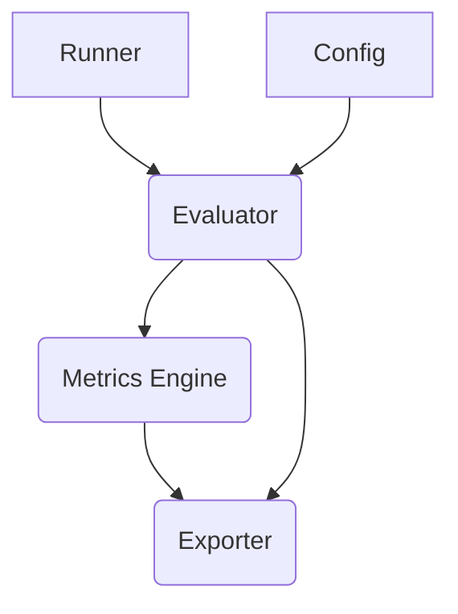

# `rv-evaluator` Module Architecture

This document outlines the architecture of the `rv-evaluator` module, a component within the `rv-android` project. Its purpose is to provide a systematic framework for evaluating and comparing Large Language Model (LLM) configurations specifically for the task of generating Android testing actions. The module runs a series of tests using different models, parameters, and prompts, collects detailed performance and quality metrics, and generates reports to support data-driven decisions on the optimal LLM setup.

## Architectural Overview

The architecture is composed of five core components that orchestrate the evaluation process. The data flows unidirectionally, beginning with configuration definition and concluding with results exportation.

1.  **Config (`config.py`)**: Defines the search space for the evaluation.
2.  **Runner (`runner.py`)**: The entry point that initiates and manages the execution.
3.  **Evaluator (`evaluator.py`)**: The core engine that executes the test runs.
4.  **Metrics Engine (`metrics.py`)**: Collects, calculates, and summarizes metrics.
5.  **Exporter (`export.py`)**: Persists raw data and generates analytical reports.

---

## Core Components

### 1. Config (`config.py`)

This component centralizes all evaluation parameters to ensure reproducibility. It defines the boundaries of the experiment.

**Responsibilities:**
-   **Model Definition**: Specifies the list of LLM models to be tested (e.g., `gemma3:1b`, `llama3.2:1b`).
-   **Parameter Space**: Defines the ranges of values for hyperparameters such as `temperature`, `top_p`, `max_tokens`, and `top_k`.
-   **Execution Settings**: Sets global parameters like the number of repetitions per test, warm-up runs, and generation timeouts.
-   **Prompt Management**: The `get_prompt_pairs` function discovers and loads pairs of system and user prompts from a designated directory.
-   **Configuration Generation**: The `generate_all_configurations` function computes the Cartesian product of all models and parameters, producing a complete list of `LLMConfig` objects for evaluation.

### 2. Runner (`runner.py`)

This script serves as the main entry point for executing an evaluation run. It handles the setup, execution, and reporting phases from a user perspective.

**Responsibilities:**
-   **Entry Point**: Contains the `main` function that initializes and starts the evaluation.
-   **Initial Setup**: Configures the logging system (leveraging `rv_android_core`) and displays the evaluation plan.
-   **Orchestration**: Instantiates the `LLMEvaluator` and calls its `run_evaluation` method.
-   **User Feedback**: Prints progress updates, a final summary, and the location of the output files to the console.
-   **Error Handling**: Manages exceptions and keyboard interrupts for a controlled shutdown.

### 3. Evaluator (`evaluator.py`)

The `LLMEvaluator` is the central component of the system. It orchestrates the entire testing workflow, from model management to data collection.

**Responsibilities:**
-   **Evaluation Orchestration**: Iterates through every configuration generated by the `Config` component.
-   **Model Management**: Groups test configurations by model name to minimize the overhead of loading models into GPU memory.
-   **Test Execution**: For each configuration, it executes the generation task for every prompt pair and repetition.
-   **Timeout Handling**: Uses a `ThreadPoolExecutor` to run the LLM generation call with a timeout, preventing the system from stalling on non-responsive configurations.
-   **Result Collection**: Aggregates the detailed results from each individual run into a `detailed_results` list.
-   **Summarization**: After all runs are complete, it uses the `StatisticsCalculator` to compute aggregate statistics for each configuration, storing them in the `summary_results` list.

### 4. Metrics Engine (`metrics.py`)

This module is responsible for converting the raw outputs from the LLM into quantitative metrics and statistics. It is composed of two classes:

-   **`MetricsCollector`**:
    -   **Per-Run Metrics**: Processes a single `LLMResponse` object to extract a dictionary of metrics.
    -   **Performance Metrics**: Captures `total_duration`, `load_duration`, and token counts (input/output).
    -   **Quality Metrics**: Assesses the success of parsing the response, counts the number of valid actions generated, and scores the quality of the `explanation` field.
    -   **Derived Metrics**: Calculates values like `tokens_per_second` and `generation_latency_ms`.
    -   **Error Metrics**: Logs the occurrence of errors, including timeouts.

-   **`StatisticsCalculator`**:
    -   **Statistical Aggregation**: Takes a list of results from multiple runs of the same configuration and computes summary statistics.
    -   **Calculations**: Determines the mean, median, standard deviation, min, and max for each numerical metric.
    -   **Success Rates**: Calculates the parsing success rate, error rate, and an overall success rate.
    -   **Overall Score**: Computes a weighted `overall_score` that combines success, performance, and quality metrics to rank configurations.

### 5. Exporter (`export.py`)

The `ResultsExporter` is the final component in the pipeline. It is responsible for persisting all collected data into user-friendly formats.

**Responsibilities:**
-   **CSV Export**:
    -   **Detailed Results**: Writes the full data from every individual run to `detailed_results.csv`.
    -   **Summary Results**: Writes the aggregated statistics for each configuration to `summary_results.csv`.
    -   **Ranked Views**: Creates additional CSV files that rank configurations by specific metrics (e.g., `tokens_per_second_ranking.csv`, `latency_ranking.csv`).
-   **Analysis Report Generation**:
    -   Produces a comprehensive analysis report in Markdown format (`analysis_report.md`).
    -   The report includes an executive summary, configuration rankings, metric analysis, observed patterns, and actionable recommendations.

---

## Data Flow

The flow of data through the system is sequential:

1.  The **Runner** is executed, which initializes the system.
2.  The **Config** component provides the list of `LLMConfig` objects and the prompt pairs to test.
3.  The **Evaluator** receives the configurations and prompts. For each combination, it invokes the LLM (via the `rv-llm` module).
4.  The resulting `LLMResponse` object is passed to the **MetricsCollector**, which converts it into a dictionary of detailed metrics.
5.  These dictionaries are collected in the `detailed_results` list within the **Evaluator**.
6.  After all runs are finished, the **Evaluator** groups the results by configuration and passes them to the **StatisticsCalculator**.
7.  The **StatisticsCalculator** returns a dictionary of summary statistics for each configuration, which is collected in the `summary_results` list.
8.  Finally, the `detailed_results` and `summary_results` lists are passed to the **Exporter**.
9.  The **Exporter** writes the data to multiple CSV files and generates the final Markdown analysis report.
10. The **Runner** prints the location of the generated files to the console.
