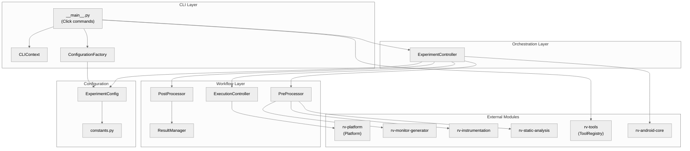
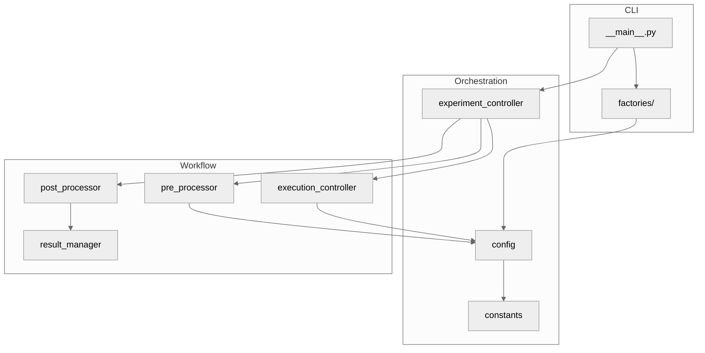
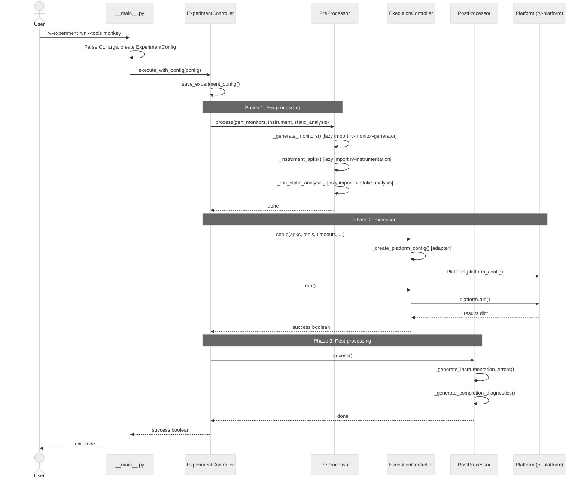
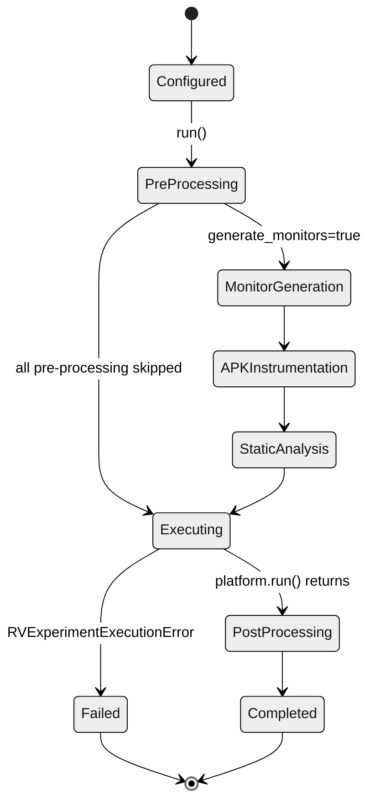
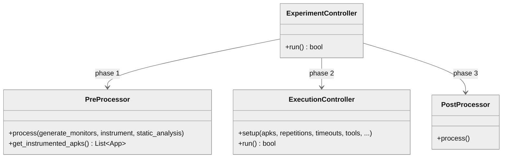

# rv-experiment Architecture

## Overview

rv-experiment is the top-level experiment orchestration module (Layer 5) for the RV-Android framework. It provides the primary CLI interface (`rv-experiment` command) and implements a three-phase sequential workflow: pre-processing (monitor generation, APK instrumentation, static analysis), execution (delegation to rv-platform), and post-processing (instrumentation error tracking and completion diagnostics). The module acts as a thin coordination layer -- all task execution, emulator lifecycle management, and result processing are delegated to rv-platform.

## Key Architectural Decisions

| Decision | Choice | Rationale |
|----------|--------|-----------|
| Application Type | CLI tool with Click framework | Primary user interaction through command-line for experiment automation and Docker integration |
| Structuring | Three-phase sequential pipeline | Experiment workflow has natural ordering: prepare artifacts, execute tasks, generate diagnostics |
| Primary Pattern | Facade | ExperimentController facades the three workflow phases behind a single `run()` method |
| Control Strategy | Call-based, sequential | Each phase completes before the next begins; no concurrency within rv-experiment |
| Configuration | Pydantic model with JIT sub-configs | Type-safe validation at boundaries; sub-module configs created only when needed to reduce coupling |
| Data Ownership | No data transfer from rv-platform | rv-experiment coordinates; rv-platform owns all task execution data and result processing |
| Distribution | Single-process, delegates to rv-platform | Orchestration is lightweight; heavy lifting happens in rv-platform and external Java tools |
| Module Coordination | Lazy imports with ImportError fallback | Pre-processing modules (rv-monitor-generator, rv-instrumentation, rv-static-analysis) imported only when needed; graceful degradation if unavailable |

## Architectural Patterns

### Pattern: Facade

**Description**: ExperimentController provides a single `run()` method that orchestrates three workflow phases (PreProcessor, ExecutionController, PostProcessor), hiding the complexity of multi-phase experiment execution from callers.

**Application**: The CLI's `run` command calls `execute_with_config(config)`, which creates an ExperimentController and calls `run()`. The caller does not need to know about the three phases or their ordering.

**When Used**: Experiment execution always follows the same three-phase sequence, making a facade the natural simplification.

**Advantages**:
- Callers interact with a single method regardless of workflow complexity
- Phase ordering is encapsulated and cannot be violated

**Disadvantages**:
- Limited flexibility for callers that need only specific phases (mitigated by `--skip-*` CLI flags that disable individual phases)

---

### Pattern: Adapter

**Description**: ExecutionController translates ExperimentConfig into PlatformConfig, adapting the experiment-layer configuration vocabulary to the platform-layer vocabulary.

**Application**: `_create_platform_config()` maps experiment parameters (tool_configs, repetitions, timeouts, apks) into a PlatformConfig instance, injecting device_port into tool parameters for parallel execution support.

**When Used**: rv-experiment and rv-platform use different configuration models. The adapter bridges them without coupling either module to the other's internal format.

**Advantages**:
- Each module maintains its own configuration model independently
- Configuration translation logic is localized in one method

**Disadvantages**:
- Changes to PlatformConfig require updating the adapter method

---

### Pattern: Factory

**Description**: ConfigurationFactory provides factory methods for creating ExperimentConfig instances from different sources (CLI arguments, dictionaries, templates).

**Application**: The CLI uses ConfigurationFactory to parse tool specification DSL strings (`tool:variant@param=value`) and create properly configured ExperimentConfig instances. Template methods (`create_basic_template`, `create_advanced_template`, `create_llm_template`) generate pre-configured templates for different experiment scenarios.

**When Used**: Configuration creation involves parsing, validation, and default-value resolution that should be centralized rather than spread across CLI handlers.

**Advantages**:
- Consistent configuration creation regardless of source
- Template methods provide documented starting points for experiments

**Disadvantages**:
- Factory methods may drift from ExperimentConfig's evolving field set

---

## Logical View

### Domain Entities

| Entity | Responsibility |
|--------|----------------|
| ExperimentConfig | Pydantic model holding all experiment parameters; provides JIT sub-module configuration methods |
| ExperimentController | Orchestrates the three-phase workflow: pre-processing, execution, post-processing |
| PreProcessor | Coordinates monitor generation, APK instrumentation, and static analysis |
| ExecutionController | Translates experiment config to platform config and delegates execution to rv-platform |
| PostProcessor | Generates instrumentation error reports and completion diagnostics |
| ResultManager | Reads completed tasks from TaskStorage and generates instrumentation errors JSON |
| ConfigurationFactory | Creates ExperimentConfig instances from CLI arguments, dictionaries, and templates |
| CLIContext | Manages CLI state (logging, error handling, tool registry access) across Click commands |

### Component Architecture



---

## Development View

### Module Structure

```
modules/rv-experiment/
├── src/rv_experiment/
│   ├── __init__.py
│   ├── __main__.py                          # CLI entry point (Click commands: run, config, list-tools, validate)
│   ├── config.py                            # ExperimentConfig Pydantic model with JIT sub-configs
│   ├── constants.py                         # Directory paths, defaults, specification sets
│   ├── experiment/
│   │   ├── __init__.py
│   │   ├── experiment_controller.py         # Facade: 3-phase orchestration
│   │   └── workflow/
│   │       ├── __init__.py
│   │       ├── pre_processor.py             # Phase 1: monitors, instrumentation, static analysis
│   │       ├── execution_controller.py      # Phase 2: rv-platform coordination (adapter)
│   │       ├── post_processor.py            # Phase 3: diagnostics and error tracking
│   │       ├── result_manager.py            # Instrumentation error JSON generation
│   │       └── workflow_factory.py          # (unused)
│   └── factories/
│       ├── __init__.py
│       └── configuration_factory.py         # Config templates and creation from CLI/dict
├── tests/
│   ├── experiment/
│   │   └── test_experiment_controller.py
│   └── test_resume_cli.py
├── pyproject.toml
├── CLAUDE.md
└── docs/
    └── architecture.md                      # This document
```

### Package Dependencies



### Build Dependencies

| Module | Depends On | Type | Purpose |
|--------|------------|------|---------|
| rv-experiment | rv-android-core | Internal | Domain models (App, ToolConfig, TaskState), ErrorHandler, LoggingManager |
| rv-experiment | rv-platform | Internal | Execution engine (Platform, PlatformConfig), result storage (TaskStorage) |
| rv-experiment | rv-tools | Internal | Tool registry (ToolRegistry) and factory (ToolFactory) |
| rv-experiment | rv-monitor-generator | Internal | Pre-processing: monitor generation from .mop specs |
| rv-experiment | rv-instrumentation | Internal | Pre-processing: APK instrumentation with monitors |
| rv-experiment | rv-static-analysis | Internal | Pre-processing: GATOR-based static analysis |
| rv-experiment | pydantic | External | Configuration model validation and serialization |
| rv-experiment | click | External | CLI framework (via rv-android-core) |

---

## Process View

rv-experiment is a single-threaded, sequential pipeline. There is no concurrency within the module itself. The execution phase delegates to rv-platform, which manages its own concurrency (emulator lifecycle, tool execution).

### Execution Flow



### State Transitions



---

## Core Components

### ExperimentConfig

**Purpose**: Central configuration model for all experiment parameters. Provides type-safe field definitions with Pydantic validation and JIT (just-in-time) methods that create sub-module configurations on demand.

**Location**: `src/rv_experiment/config.py`

**Key Classes**:
- `ExperimentConfig(BaseValidatedModel)`: 20+ fields covering experiment metadata, tool configs, execution params, pre-processing flags, specification set, APK sources, and results directory. JIT methods: `get_monitored_operations_config()`, `get_instrumentation_config()`, `get_static_analysis_config()`.

**Dependencies**:
- Internal: rv-android-core (BaseValidatedModel, ToolConfig, ErrorHandler), rv-monitor-generator (RVGeneratorConfig), rv-instrumentation (RVInstrumentationConfig), rv-static-analysis (RVStaticAnalysisConfig)
- External: pydantic

### ExperimentController

**Purpose**: Facade orchestrating the three-phase experiment workflow. Initializes PreProcessor, ExecutionController, and PostProcessor, then runs them in sequence.

**Location**: `src/rv_experiment/experiment/experiment_controller.py`

**Key Classes**:
- `ExperimentController`: `run()` executes pre-processing, execution, post-processing. `_get_configured_tools()` creates tool instances via ToolFactory.
- `execute_with_config(config)`: Module-level convenience function that creates controller and runs it.

**Dependencies**:
- Internal: PreProcessor, ExecutionController, PostProcessor, ExperimentConfig, rv-tools (ToolFactory)

### PreProcessor

**Purpose**: Coordinates the three pre-processing sub-phases: monitor generation (JavaMOP/RV-Monitor), APK instrumentation (monitor weaving), and static analysis (GATOR). Each sub-phase uses lazy imports and degrades gracefully if the module is unavailable.

**Location**: `src/rv_experiment/experiment/workflow/pre_processor.py`

**Key Classes**:
- `PreProcessor`: `process(generate_monitors, instrument, static_analysis)` runs enabled sub-phases. `get_instrumented_apks()` returns App objects from the instrumented directory (or falls back to originals). `_copy_original_apks()` provides fallback when instrumentation fails or the module is unavailable.

**Dependencies**:
- Internal: rv-monitor-generator, rv-instrumentation, rv-static-analysis (all lazy-imported), rv-android-core (App, ErrorHandler)

**Important constraint**: Static analysis always runs on original APKs, not instrumented ones, because GATOR/Soot cannot process AspectJ-woven bytecode (TypeResolver errors). The output goes to `out/instrumented_apks/` so rv-platform finds the JSON alongside the instrumented APK.

### ExecutionController

**Purpose**: Adapter between rv-experiment and rv-platform. Translates ExperimentConfig parameters into PlatformConfig and delegates execution to Platform.

**Location**: `src/rv_experiment/experiment/workflow/execution_controller.py`

**Key Classes**:
- `ExecutionController`: `setup()` creates PlatformConfig and Platform instance. `run()` calls `platform.run()` and reports success/failure. `_create_platform_config()` performs the configuration translation, including device_port injection for parallel execution.

**Dependencies**:
- Internal: rv-platform (Platform, PlatformConfig), rv-android-core (App, AbstractTool, ToolConfig)

### PostProcessor

**Purpose**: Generates post-experiment artifacts: instrumentation errors JSON (via ResultManager) and completion diagnostics JSON.

**Location**: `src/rv_experiment/experiment/workflow/post_processor.py`

**Key Classes**:
- `PostProcessor`: `process()` calls `_generate_instrumentation_errors()` and `_generate_completion_diagnostics()`. Uses TaskStorage to load completed tasks for ResultManager.

**Dependencies**:
- Internal: rv-platform (TaskStorage), ResultManager

### ResultManager

**Purpose**: Reads completed tasks from TaskStorage and generates `instrument_errors.json` with any instrumentation errors found across tasks.

**Location**: `src/rv_experiment/experiment/workflow/result_manager.py`

**Key Classes**:
- `ResultManager`: `generate_reports()` loads completed tasks, collects instrumentation errors per APK, writes JSON file.

**Dependencies**:
- Internal: rv-platform (TaskStorage), rv-android-core (TaskState)

---

## NFR Support

| NFR | Priority | Architectural Support |
|-----|----------|----------------------|
| Maintainability | P0 | Fine-grained workflow components (PreProcessor, ExecutionController, PostProcessor) with single responsibilities. Lazy imports isolate pre-processing modules. JIT configuration avoids unnecessary coupling. |
| Extensibility | P1 | Tool plugin system via rv-tools ToolRegistry allows adding tools without modifying rv-experiment. Specification sets (jca, generic, custom) support different monitoring configurations. |
| Reliability | P1 | ErrorHandler decorators on all public methods with context-aware logging. Pre-processing failures do not block execution (fallback to original APKs). Post-processing failures are logged but swallowed. Resume mode re-executes only pending tasks after interruption. |
| Reproducibility | P1 | ExperimentConfig saved as `experiment_config.json` in results directory. `from_file()`/`save_to_file()` enable experiment recreation. Deterministic workflow ordering (pre -> execute -> post). |
| Performance | P2 | Pre-processing is the bottleneck (monitor generation, instrumentation, static analysis involve external Java tools). rv-experiment itself adds minimal overhead as a thin orchestration layer. Docker-based parallel execution supported via `--device-port`. |

---

## Key Interfaces

### ExperimentConfig JIT Configuration

ExperimentConfig provides JIT methods that create typed sub-module configurations on demand. This avoids importing and validating sub-module configs until they are needed.

```python
class ExperimentConfig(BaseValidatedModel):
    def get_monitored_operations_config(self) -> RVGeneratorConfig: ...
    def get_instrumentation_config(self) -> RVInstrumentationConfig: ...
    def get_static_analysis_config(self) -> RVStaticAnalysisConfig: ...
    def get_effective_rvsec_root(self) -> str: ...
```

### Workflow Component Interface

Each workflow phase component follows the same implicit interface: initialization with configuration, then a `process()` or `run()` method.



---

## Scenarios

### Scenario 1: Run Experiment with Instrumentation

**Description**: User executes a full experiment with monitor generation, APK instrumentation, static analysis, and tool execution.

**Flow**:
1. User runs `rv-experiment run --tools monkey --specification-set jca --apks-dir ./apks/`
2. CLI parses tool specifications, creates ExperimentConfig with all pre-processing flags enabled
3. ExperimentController saves config to `results/<name>/experiment_config.json`
4. PreProcessor generates monitors from JCA `.mop` specs via rv-monitor-generator
5. PreProcessor instruments APKs with generated monitors via rv-instrumentation
6. PreProcessor runs GATOR static analysis on original APKs (instrumented bytecode crashes Soot); output goes to `out/instrumented_apks/` alongside APKs
7. ExecutionController creates PlatformConfig from ExperimentConfig and instantiates Platform
8. Platform executes tasks (emulator lifecycle, tool execution, result CSV/JSON generation)
9. PostProcessor reads completed tasks, generates `instrument_errors.json` and `experiment_completion.json`
10. CLI returns exit code 0 on success

### Scenario 2: Resume Interrupted Experiment

**Description**: An experiment was interrupted (crash, timeout, manual stop). User resumes it.

**Flow**:
1. User runs `rv-experiment run --tools monkey --name my_exp` (same command as original)
2. CLI detects `results/my_exp/tasks.json` exists, sets `resume_mode=True`
3. All pre-processing flags are forced to `False` (artifacts already exist from first run)
4. PreProcessor phase effectively no-ops
5. ExecutionController delegates to Platform, which loads `tasks.json` and skips completed tasks
6. Only pending/failed tasks are executed
7. Results are consolidated across sessions

### Scenario 3: Skip Pre-processing (Use Pre-instrumented APKs)

**Description**: User has pre-instrumented APKs from a previous run and wants to execute only the testing phase.

**Flow**:
1. User runs `rv-experiment run --tools ape --skip-monitors --skip-instrument --skip-static --apks-dir results/prev_exp/instrumented_apks/`
2. All pre-processing flags are `False`; `apks_dir` points to instrumented APKs
3. PreProcessor phase is entirely skipped
4. ExecutionController uses APKs from `apks_dir` directly (no instrumented directory fallback needed)
5. Platform executes tasks with pre-instrumented APKs

---

## Extension Points

- **Adding a Tool**: Register a new tool class in rv-tools via rv-platform's `_register_external_tools()`. rv-experiment discovers it through ToolRegistry without modification.
- **Adding a Specification Set**: Add a new directory under `$RVSEC_HOME/rvsec/rvsec-mop/src/main/resources/`, then update the `specification_set` validation in ExperimentConfig to accept the new name.
- **Adding a Pre-processing Phase**: Add a new method to PreProcessor, a new flag to ExperimentConfig, and wire it in ExperimentController's `_run_pre_processing()`.
- **Configuration Templates**: Add a new `create_*_template()` method to ConfigurationFactory.

## Dependencies

### Internal (rv-android modules)

| Module | Purpose |
|--------|---------|
| rv-android-core | Domain models (App, ToolConfig, TaskState), ErrorHandler, LoggingManager, BaseValidatedModel |
| rv-platform | Task execution engine (Platform, PlatformConfig), result storage (TaskStorage) |
| rv-tools | Tool registry (ToolRegistry) and factory (ToolFactory) for creating tool instances |
| rv-monitor-generator | Pre-processing: generates JavaMOP/RV-Monitor monitors from `.mop` specification files |
| rv-instrumentation | Pre-processing: instruments APKs by weaving generated monitors into bytecode |
| rv-static-analysis | Pre-processing: runs GATOR-based static analysis producing reachability, windows, and transitions data |

### External

| Package | Version | Purpose |
|---------|---------|---------|
| pydantic | >=2.9.0 | Configuration model validation and serialization |
| click | (via rv-android-core) | CLI framework for command parsing |
| matplotlib | >=3.9.0 | Declared dependency (result visualization) |

## Testing Strategy

| Type | Location | Purpose |
|------|----------|---------|
| Unit | tests/experiment/test_experiment_controller.py | ExperimentController orchestration logic |
| Integration | tests/test_resume_cli.py | Resume CLI behavior (implicit and explicit resume modes) |

---

## Related Documentation

- [CLAUDE.md](../CLAUDE.md) - Module-specific development guidance
- [Root CLAUDE.md](../../../CLAUDE.md) - Project-wide architecture and development principles
- [PRD](../../../docs/PRD.md) - Product Requirements Document (FR15-FR17 cover rv-experiment)
- [Experiment Spec](../../../openspec/specs/experiment/spec.md) - Domain specification for rv-experiment
