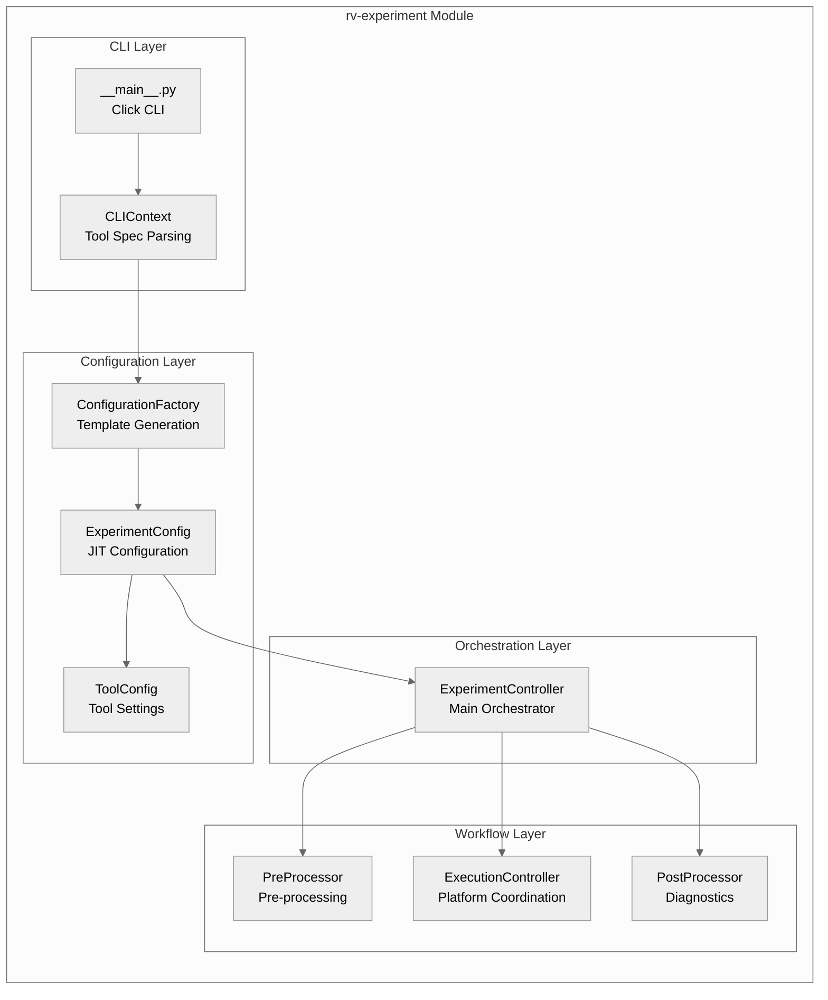
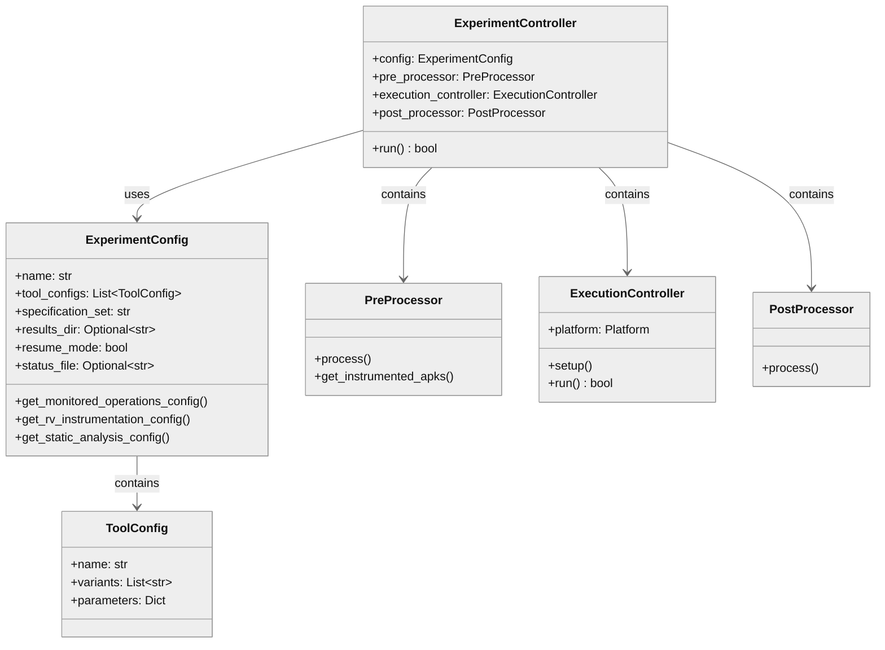
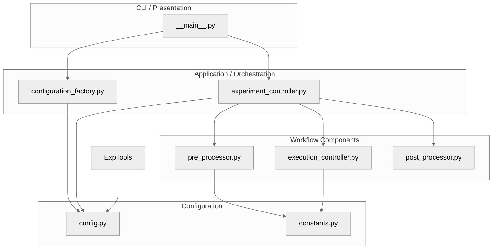
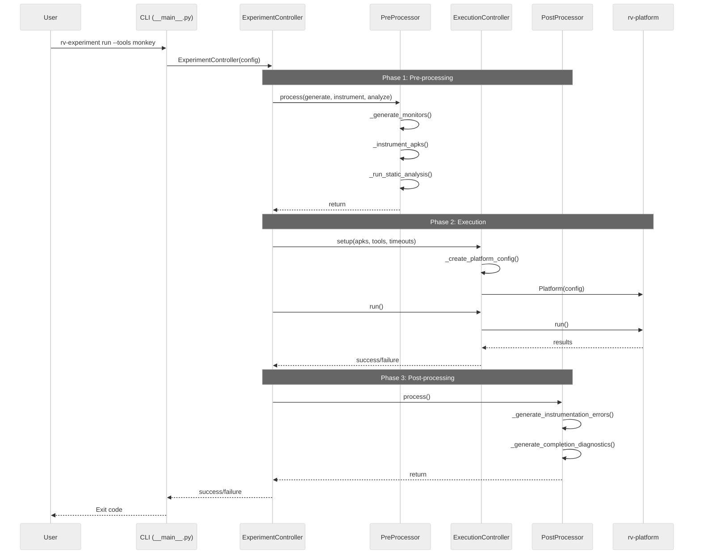
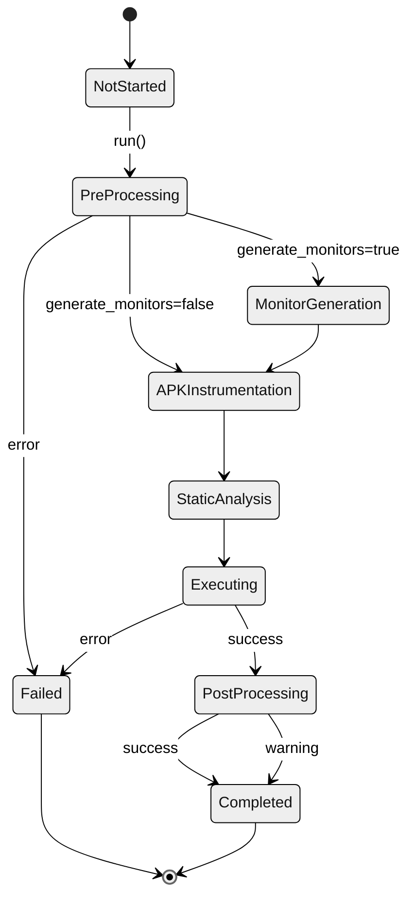
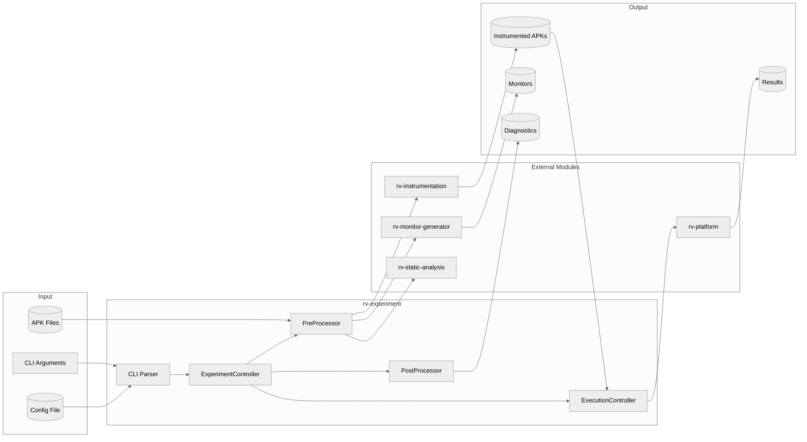

# rv-experiment Architecture

## Overview

rv-experiment is the experiment orchestration module for the RV-Android framework. It provides the primary CLI interface and implements a three-phase workflow for executing Android testing experiments with runtime verification monitors. The module coordinates but does not duplicate functionality from rv-platform, maintaining clean separation between orchestration (rv-experiment) and execution (rv-platform).

## Key Architectural Decisions

| Decision | Choice | Rationale |
|----------|--------|-----------|
| Application Type | CLI tool with orchestration | Primary entry point for experiment execution |
| Structuring | Layered/Modular | Clear separation between CLI, configuration, and workflow phases |
| Primary Pattern | Three-Phase Workflow | Sequential processing with distinct pre-processing, execution, and post-processing phases |
| Control Strategy | Direct method calls | Explicit coordination between workflow phases |
| Configuration | Just-in-Time (JIT) | Sub-module configs created only when needed |
| Data Transfer | None | rv-platform handles all results; rv-experiment provides coordination only |

## Architectural Patterns

### Pattern: Three-Phase Workflow

**Description**: Organizes experiment execution into three distinct sequential phases with clear boundaries and responsibilities.

**Application**: ExperimentController orchestrates PreProcessor, ExecutionController, and PostProcessor in sequence.

**When Used**: Multi-step processes with clear stage boundaries where each phase has distinct inputs and outputs.

**Advantages**:
- Clear separation of concerns
- Easier testing of individual phases
- Predictable execution flow
- Graceful error handling per phase

**Disadvantages**:
- Sequential execution limits parallelism
- Phase transitions add coordination overhead

### Pattern: Factory (Just-in-Time Configuration)

**Description**: Sub-module configurations are created only when accessed, not at initialization time.

**Application**: ExperimentConfig creates RVGeneratorConfig, RVInstrumentationConfig, and RVStaticAnalysisConfig through JIT factory methods.

**When Used**: Configuration objects are expensive to create or may not be needed in all execution paths.

**Advantages**:
- Reduces initialization time
- Avoids creating unused configurations
- Enables lazy validation

**Disadvantages**:
- Configuration errors discovered late
- Harder to validate complete configuration upfront

---

## Logical View

Shows key domain entities and their relationships.

### Domain Entities

| Entity | Responsibility |
|--------|----------------|
| ExperimentConfig | Central configuration holder with JIT sub-module config creation |
| ExperimentController | Main orchestrator for three-phase workflow execution |
| PreProcessor | Pre-processing phase: monitor generation, APK instrumentation, static analysis |
| ExecutionController | Execution phase: rv-platform coordination for task execution |
| PostProcessor | Post-processing phase: basic completion diagnostics |
| ToolConfig | Individual tool configuration (name, variants, parameters) |
| ConfigurationFactory | Factory for creating experiment configurations |

### Component Architecture



### Entity Relationships



---

## Development View

Shows code organization for developers.

### Module Structure

```
modules/rv-experiment/
├── src/
│   └── rv_experiment/
│       ├── __init__.py
│       ├── __main__.py              # CLI entry point (Click commands)
│       ├── config.py                # ExperimentConfig Pydantic model
│       ├── constants.py             # Directory paths and defaults
│       ├── experiment/
│       │   ├── __init__.py
│       │   ├── experiment_controller.py    # Main orchestrator
│       │   └── workflow/
│       │       ├── __init__.py
│       │       ├── pre_processor.py        # Phase 1: Pre-processing
│       │       ├── execution_controller.py # Phase 2: Execution
│       │       ├── post_processor.py       # Phase 3: Post-processing
│       │       ├── result_manager.py       # Instrumentation error tracking
│       │       └── workflow_factory.py     # Workflow component factory
│       └── factories/
│           ├── __init__.py
│           └── configuration_factory.py    # Configuration factory
├── tests/
│   └── experiment/
│       └── test_experiment_controller.py
└── pyproject.toml
```

### Package Dependencies



### Build Dependencies

| Module | Depends On | Type |
|--------|------------|------|
| rv-experiment | rv-android-core | Internal |
| rv-experiment | rv-platform | Internal |
| rv-experiment | rv-monitor-generator | Internal |
| rv-experiment | rv-instrumentation | Internal |
| rv-experiment | rv-static-analysis | Internal |
| rv-experiment | rv-tools | Internal |
| rv-experiment | pydantic | External |
| rv-experiment | click | External |

---

## Process View

Shows run-time behavior and execution flow.

### Three-Phase Execution Flow



### Resume Execution Path

When an experiment is resumed (via `--name` with existing `tasks.json` or via `--resume-dir`), the execution flow diverges from the standard three-phase workflow. The CLI sets `resume_mode=True` on ExperimentConfig, which causes all pre-processing flags (`generate_monitors`, `instrument_apks`, `run_static_analysis`) to be auto-set to `False` regardless of their CLI values, disabling all pre-processing phases. This ensures that no redundant monitor generation, instrumentation, or static analysis occurs during resume. ExperimentController uses `config.results_dir` directly as the output location (flat directory structure, no subdirectory nesting), and rv-platform loads completed tasks from `tasks.json`, skipping them and executing only the remaining pending tasks. ResultProcessorComponent consolidates results from all sessions, reconstructing MOP violation data from persisted logcat files for resumed tasks.

### State Transitions



---

## Core Components

### ExperimentConfig

**Purpose**: Central configuration holder with just-in-time sub-module configuration creation.

**Location**: `src/rv_experiment/config.py`

**Key Classes**:
- `ExperimentConfig`: Main Pydantic model for experiment configuration

**Key Methods**:
- `get_monitored_operations_config()`: Creates RVGeneratorConfig for monitor generation
- `get_rv_instrumentation_config()`: Creates RVInstrumentationConfig for APK instrumentation
- `get_static_analysis_config()`: Creates RVStaticAnalysisConfig for static analysis
- `validate()`: Comprehensive configuration validation

**Dependencies**:
- Internal: rv-android-core (BaseValidatedModel), rv-platform (ToolConfig)
- External: pydantic

### ExperimentController

**Purpose**: Main orchestrator for three-phase experiment workflow.

**Location**: `src/rv_experiment/experiment/experiment_controller.py`

**Key Classes**:
- `ExperimentController`: Orchestrates PreProcessor, ExecutionController, PostProcessor

**Key Methods**:
- `run()`: Execute complete experiment workflow
- `_run_pre_processing()`: Delegate to PreProcessor
- `_run_execution()`: Delegate to ExecutionController
- `_get_configured_tools()`: Create tool instances from configuration

**Dependencies**:
- Internal: rv-android-core (ErrorHandler, LoggingManager), rv-tools (ToolFactory)
- Workflow: PreProcessor, ExecutionController, PostProcessor

### PreProcessor

**Purpose**: Phase 1 - Monitor generation, APK instrumentation, and static analysis.

**Location**: `src/rv_experiment/experiment/workflow/pre_processor.py`

**Key Methods**:
- `process()`: Execute pre-processing phase
- `_generate_monitors()`: Generate JavaMOP/RV-Monitor monitors
- `_instrument_apks()`: Instrument APKs with monitors
- `_run_static_analysis()`: Run GATOR, GESDA, REACH analysis
- `get_instrumented_apks()`: Return list of instrumented APKs

**Dependencies**:
- Internal: rv-monitor-generator, rv-instrumentation, rv-static-analysis, rv-android-core

### ExecutionController

**Purpose**: Phase 2 - Coordinate execution through rv-platform.

**Location**: `src/rv_experiment/experiment/workflow/execution_controller.py`

**Key Methods**:
- `setup()`: Configure rv-platform with experiment parameters
- `run()`: Delegate execution to rv-platform
- `_create_platform_config()`: Translate experiment config to platform config

**Architectural Role**:
- Bridge between rv-experiment orchestration and rv-platform execution
- No data transfer back from rv-platform
- Only coordination and status tracking

**Dependencies**:
- Internal: rv-platform (Platform, PlatformConfig), rv-android-core

### PostProcessor

**Purpose**: Phase 3 - Basic completion diagnostics.

**Location**: `src/rv_experiment/experiment/workflow/post_processor.py`

**Key Methods**:
- `process()`: Generate completion diagnostics
- `_generate_instrumentation_errors()`: Create instrumentation errors JSON
- `_generate_completion_diagnostics()`: Create experiment_completion.json

**Architectural Role**:
- Provides basic diagnostics only
- All CSV/JSON result processing handled by rv-platform
- No data access from tasks or storage (except for instrumentation errors)

**Dependencies**:
- Internal: rv-android-core, rv-platform (TaskStorage)

---

## NFR Support

How the architecture supports non-functional requirements.

| NFR | Priority | Architectural Support |
|-----|----------|----------------------|
| Maintainability | P0 | Clean separation between orchestration and execution; modular workflow components |
| Extensibility | P1 | Tool plugin system via rv-tools; configurable pre-processing phases |
| Testability | P1 | Isolated workflow phases; dependency injection ready configuration |
| Usability | P1 | CLI with tool specification DSL; configuration templates |
| Reliability | P2 | Error handling decorators; event-based coordination; fallback mechanisms |

### NFR: Maintainability

**Priority**: P0

**Metric**: Number of lines changed for adding new tool type

**Target**: < 50 lines for new tool integration

**Architectural Support**:
- Three-phase workflow isolates concerns
- No data transfer between rv-experiment and rv-platform
- JIT configuration reduces coupling
- Direct coordination between workflow phases

**Trade-offs**:
- Sequential phase execution limits optimization opportunities

### NFR: Extensibility

**Priority**: P1

**Metric**: Steps to add new tool or analysis phase

**Target**: < 5 steps for new tool integration

**Architectural Support**:
- Tool registry pattern via rv-tools
- Factory pattern for configuration creation
- Configurable pre-processing phases (generate_monitors, instrument_apks, run_static_analysis)

**Verification**:
- Unit tests for tool registration
- Integration tests for new tool execution

---

## Key Interfaces

### ExperimentConfig (Configuration Protocol)

```python
class ExperimentConfig(BaseValidatedModel):
    """Central experiment configuration with JIT sub-module config creation."""

    # Core fields
    name: str
    tool_configs: List[ToolConfig]
    specification_set: str  # "jca", "generic", "custom"

    # Execution parameters
    repetitions: int
    timeouts: List[int]

    # Pre-processing flags
    generate_monitors: bool
    instrument_apks: bool
    run_static_analysis: bool

    # Directories
    results_dir: Optional[str]  # Flat results directory (no subdirectory nesting)

    # Resume
    resume_mode: bool  # Auto-set when --name detects existing tasks.json
    status_file: Optional[str]  # Path to tasks.json for continuation

    # JIT configuration methods
    def get_monitored_operations_config(self) -> RVGeneratorConfig:
        """Create monitor generator configuration on demand."""
        ...

    def get_rv_instrumentation_config(self) -> RVInstrumentationConfig:
        """Create instrumentation configuration on demand."""
        ...

    def get_static_analysis_config(self) -> RVStaticAnalysisConfig:
        """Create static analysis configuration on demand."""
        ...
```

### Tool Specification DSL

Format: `tool_name[:variant1][:variant2][@param1=value1,param2=value2]`

```
# Examples
monkey                           # Basic tool usage
droidbot:dfs_greedy              # Tool with variant
rvagent:multimode                # Tool with variant
rvagent:multimode@temperature=0.3  # Tool with parameters
monkey,droidbot:dfs_greedy,ape   # Multiple tools (comma-separated)
```

---

## Scenarios

Key use cases that validate the architecture.

### Scenario 1: Execute Experiment with Multiple Tools

**Description**: User executes experiment with monkey and droidbot tools on a set of APKs.

**Flow**:
1. User invokes CLI: `rv-experiment run --tools monkey,droidbot:dfs_greedy --apks-dir ./apks/`
2. CLI parses tool specifications via CLIContext
3. ConfigurationFactory creates ExperimentConfig with tool configurations
4. ExperimentController receives config and initializes workflow components
5. PreProcessor instruments APKs and runs static analysis
6. ExecutionController creates PlatformConfig and delegates to rv-platform
7. rv-platform executes tasks and processes results (internal)
8. PostProcessor generates completion diagnostics
9. ExperimentController publishes EXPERIMENT_COMPLETED event
10. CLI returns exit code to user

### Scenario 2: Resume Interrupted Experiment

**Description**: User resumes an experiment that was interrupted during execution.

**Flow**:
1. User invokes CLI with `--name` matching existing `results/<name>/tasks.json`, or with `--resume-dir` pointing to a specific results directory
2. CLI detects existing results and sets `resume_mode=True`; all pre-processing flags are forced to `False` (disabled) regardless of their CLI values
3. ExperimentController initializes with `resume_mode=True` and uses `config.results_dir` directly as the output location (flat directory, no subdirectory nesting)
4. PreProcessor skips all phases (monitors, instrumentation, static analysis)
5. ExecutionController creates PlatformConfig and delegates to rv-platform
6. rv-platform loads completed tasks from `tasks.json`, skips them, executes remaining
7. ResultProcessorComponent consolidates results from all sessions, reconstructing MOP violation data from logcat for resumed tasks
8. PostProcessor generates completion diagnostics
9. CLI reports total tasks including skipped count

### Scenario 3: Generate Configuration Template

**Description**: User generates a configuration template for a research experiment.

**Flow**:
1. User invokes: `rv-experiment config --template-type research --output research.json`
2. CLI calls ConfigurationFactory.create_research_template()
3. Factory creates ExperimentConfig with research-appropriate defaults
4. Config serialized to JSON and saved to output file
5. User can modify template and use with `--config` option

### End-to-End Flow Diagram



---

## Docker Execution Mode

rv-experiment supports execution inside Docker containers through `docker/rvandroid/docker-entrypoint.sh`. The entrypoint script translates environment variables into CLI arguments, enabling fully declarative experiment configuration via Docker Compose or `docker run` without modifying the container image.

The entrypoint builds a `uv run rv-experiment run` command from the following environment variables:

| Environment Variable | CLI Argument | Description |
|---------------------|--------------|-------------|
| `RV_TOOLS` | `--tools` | Tool specification (same DSL as CLI) |
| `RV_TIMEOUTS` | `--timeout` | Execution timeout in seconds |
| `RV_REPETITIONS` | `--repetitions` | Number of repetitions |
| `RV_APKS_DIR` | `--apks-dir` | APK directory path |
| `RV_NO_WINDOW` | `--no-window / --window` | Emulator headless mode (`true`/`false`) |
| `RV_SPEC_SET` | `--specification-set` | Specification set name |
| `RV_JCA_SPEC` | `--specification-set` | Legacy boolean: `true` maps to `jca`, `false` to `generic` |
| `RV_SKIP_MONITORS` | `--skip-monitors` | Skip monitor generation |
| `RV_SKIP_INSTRUMENT` | `--skip-instrument` | Skip APK instrumentation |
| `RV_SKIP_STATIC_ANALYSIS` | `--skip-static` | Skip static analysis |
| `RV_DEVICE_PORT` | `--device-port` | Emulator port for parallel execution |
| `RV_APKS_FILTER` | `--apks-filter` | APK filter file path |
| `RV_EXPERIMENT_NAME` | `--name` | Experiment name (enables implicit resume) |
| `RV_RESUME_DIR` | `--resume-dir` | Explicit resume directory |
| `RV_DEBUG` | `--debug` | Enable debug logging |
| `RV_DELAY` | (startup delay) | Seconds to wait before starting (for staggering parallel containers) |

The entrypoint also supports interactive mode: passing `bash` or `shell` as the first argument drops into a shell instead of running the experiment.

---

## Extension Points

- **New Tools**: Register via `_register_external_tools()` in `rv-platform/__init__.py`
- **New Pre-processing Phases**: Add methods to PreProcessor with configuration flags
- **Configuration Templates**: Add factory methods to ConfigurationFactory
## Dependencies

### Internal (rv-android modules)

| Module | Purpose |
|--------|---------|
| rv-android-core | Foundation services (ErrorHandler, logging, domain models) |
| rv-platform | Central execution engine for task execution and result processing |
| rv-monitor-generator | JavaMOP/RV-Monitor monitor generation |
| rv-instrumentation | APK instrumentation with monitors |
| rv-static-analysis | GATOR, GESDA, REACH static analysis tools |
| rv-tools | Tool registry and factory patterns |

### External

| Package | Version | Purpose |
|---------|---------|---------|
| pydantic | ^2.0 | Configuration validation and serialization |
| click | ^8.0 | CLI framework |

## Testing Strategy

| Type | Location | Purpose |
|------|----------|---------|
| Unit | tests/experiment/ | Isolated component tests |
| Integration | tests/ | Workflow phase interaction tests |

**Current Coverage**: Limited (3 test files). Recommended additions:
- PreProcessor unit tests
- ExecutionController unit tests
- PostProcessor unit tests
- ConfigurationFactory unit tests
- CLI command tests

## Related Documentation

- [Module CLAUDE.md](../CLAUDE.md) - Quick reference for development
- [Root CLAUDE.md](../../../CLAUDE.md) - Project-wide architecture and conventions
