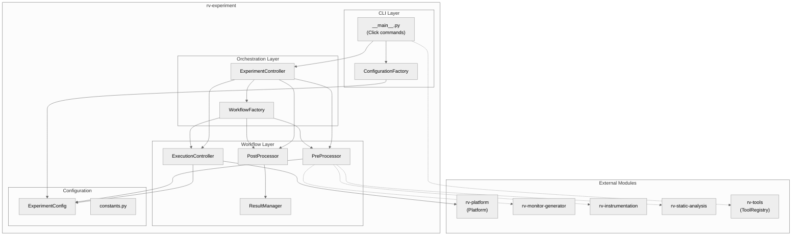
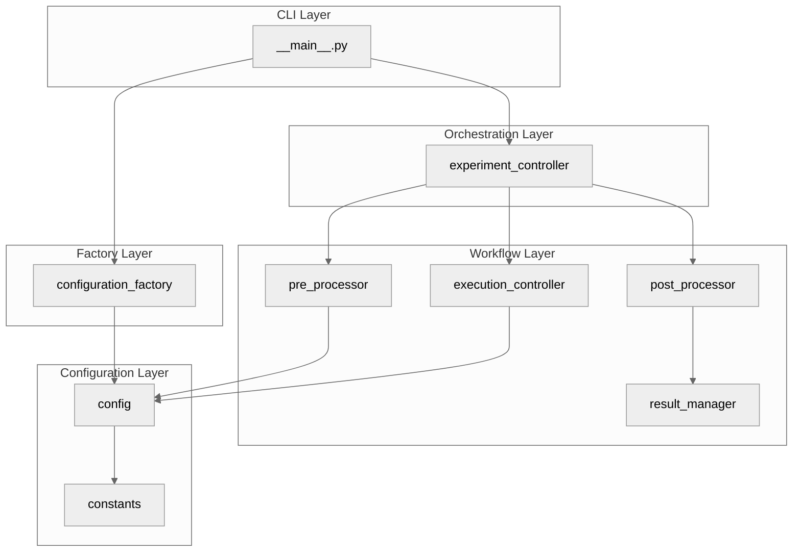
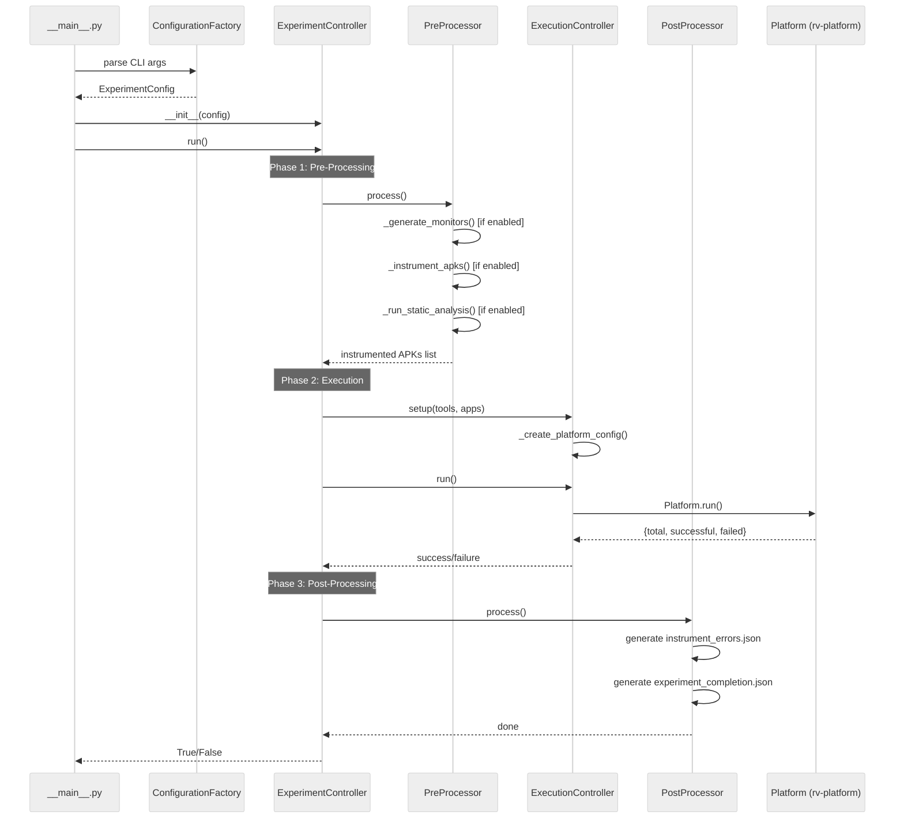
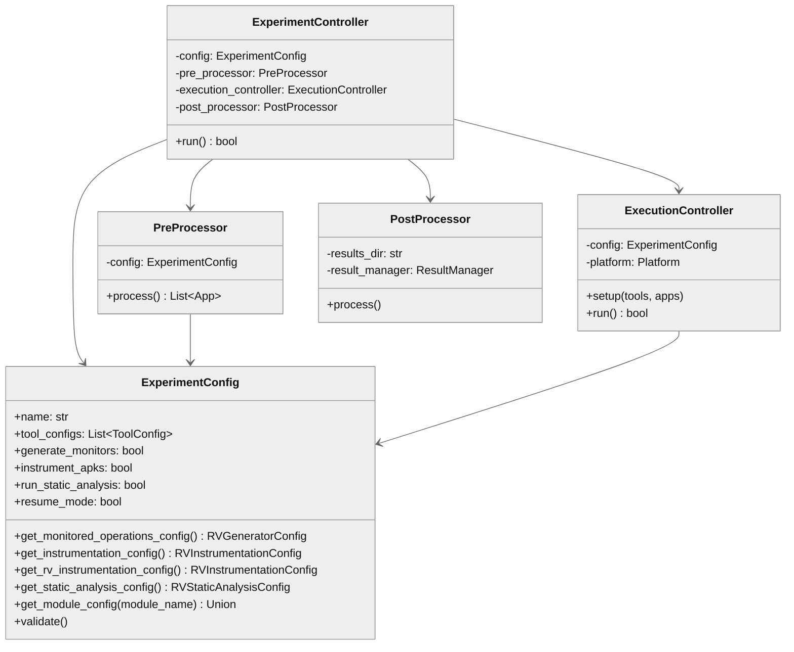

# rv-experiment Architecture

## Overview

rv-experiment is the top-level experiment orchestration module for the RV-Android framework. It provides the primary CLI interface (`rv-experiment` command) and coordinates a three-phase workflow: (1) pre-processing (monitor generation, APK instrumentation, static analysis), (2) execution (delegated to rv-platform), and (3) post-processing (instrumentation error tracking and completion diagnostics). rv-experiment handles orchestration only -- all task execution, emulator management, and result processing stay in rv-platform.

## Specification Alignment

This module implements requirements from `openspec/specs/experiment/spec.md`.

### Functional Requirements

| FR | Description | Architectural Support |
|----|-------------|----------------------|
| FR15 | Three-phase workflow for experiment lifecycle | `ExperimentController` orchestrates `PreProcessor`, `ExecutionController`, and `PostProcessor` in strict sequential order |
| FR16 | CLI with tool specification DSL | Click-based CLI in `__main__.py` with DSL parser; supports `run`, `config`, `list-tools`, `validate` commands |
| FR16-ext | Experiment resume via CLI | `--resume-dir` (explicit) and `--name` (implicit) resume mechanisms with auto-skip of pre-processing |
| FR16-ext | Docker execution mode | `docker-entrypoint.sh` translates environment variables to CLI arguments |
| FR17 | Just-in-time sub-module configuration | `ExperimentConfig.get_*_config()` methods create sub-module configs on demand |

### Key Invariants

| Invariant | Description | Enforcement Mechanism |
|-----------|-------------|----------------------|
| INV-EXP-01 | Phases execute in strict sequential order | `ExperimentController.run()` calls Phase 1, 2, 3 sequentially |
| INV-EXP-02 | No data transfer from rv-platform back to rv-experiment | `ExecutionController` reads only aggregate success/failure counts from `Platform.run()` |
| INV-EXP-03 | ExperimentConfig validation before execution | `ExperimentConfig.validate()` checks name, tools, repetitions, timeouts, APK directory, specification set |
| INV-EXP-05 | RVSEC_HOME three-level priority resolution | JIT config methods check: (1) `rvsec_root` field, (2) `RVSEC_HOME` env var, (3) raise `ConfigurationError` |
| INV-EXP-06 | `ExecutionController.setup()` before `run()` | `run()` raises `RVExperimentExecutionError` if `setup()` was not called |
| INV-EXP-07 | Skip flags respected in pre-processing | `PreProcessor.process()` checks boolean flags before each step |
| INV-EXP-08 | Instrumentation failure fallback | `PreProcessor` copies original APKs to instrumented directory on failure |
| INV-EXP-09 | Correct DSL comma handling | Parser distinguishes tool separators from parameter separators by detecting `=` tokens |
| INV-EXP-13 | Resume auto-skips pre-processing | CLI forces all skip flags to `True` when resume is detected |
| INV-EXP-14 | Flat results directory | `ExperimentController` uses `config.results_dir` directly without appending subdirectories |

### Specification Scenarios

Scenarios from `openspec/specs/experiment/spec.md` that validate this architecture:

- **Full experiment with all phases enabled**: Exercises the complete three-phase pipeline -- PreProcessor generates monitors and instruments APKs, ExecutionController delegates to Platform, PostProcessor generates diagnostics.
- **Experiment with all pre-processing skipped**: PreProcessor respects skip flags and returns original APKs; execution proceeds with 0% coverage.
- **Pre-processing failure does not abort experiment**: PreProcessor catches instrumentation errors and copies original APKs as fallback; Phase 2 and 3 still execute.
- **Resume with --name detecting existing results**: CLI detects `tasks.json` in named results directory, auto-skips pre-processing, platform skips completed tasks.

## Key Architectural Decisions

| Decision | Choice | Rationale |
|----------|--------|-----------|
| Application Type | CLI tool with Click framework | Experiments are invoked from command line or Docker entrypoint; Click provides argument parsing, help generation, and command grouping |
| Structuring | Three-phase pipeline with facade | Experiment lifecycle has three distinct concerns (preparation, execution, analysis) with different failure modes and skip capabilities |
| Primary Pattern | Facade + Pipeline | ExperimentController acts as a facade over three workflow components; PreProcessor implements a sequential pipeline |
| Control Strategy | Sequential call-based | Phases depend on each other (instrumentation before execution, execution before diagnostics); no concurrency within the orchestrator |
| Configuration | JIT sub-module configs via Pydantic | Avoids eager validation of modules that may be skipped or not installed; reduces initialization overhead |
| Data Flow | One-way (experiment -> platform) | rv-experiment provides configuration; rv-platform handles execution and results independently, preventing coupling |
| Resume Strategy | tasks.json detection + auto-skip | Docker containers are killed and restarted routinely; resume avoids redundant pre-processing and re-execution of completed tasks |

## Architectural Patterns

### Pattern: Facade (ExperimentController)

**Description**: `ExperimentController` presents a single `run()` method that coordinates three internal workflow components (`PreProcessor`, `ExecutionController`, `PostProcessor`), hiding the complexity of phase sequencing, error handling, and configuration persistence.

**When Used**: The experiment lifecycle involves coordinating multiple independent sub-modules (monitor generation, instrumentation, static analysis, platform execution, diagnostics). The facade provides a single entry point that manages the sequencing.

**Advantages**:
- Callers (CLI, Docker entrypoint) interact with one class and one method
- Phase ordering is enforced in one place

**Disadvantages**:
- All three phases must be understood to modify the workflow

### Pattern: Pipeline (PreProcessor)

**Description**: `PreProcessor.process()` executes three steps sequentially: monitor generation, APK instrumentation, and static analysis. Each step is independently skippable via boolean flags and uses lazy imports for optional sub-modules.

**When Used**: Pre-processing involves three ordered operations where each step produces artifacts consumed by the next (monitors -> instrumentation -> static analysis on instrumented APKs).

**Advantages**:
- Individual steps can be skipped without affecting the pipeline structure
- Lazy imports allow operation when optional modules are not installed

**Disadvantages**:
- Fixed ordering; cannot parallelize steps

### Pattern: Bridge (ExecutionController)

**Description**: `ExecutionController` translates `ExperimentConfig` (orchestration domain) into `PlatformConfig` (execution domain), bridging the two layers without exposing platform internals to the experiment layer.

**When Used**: rv-experiment and rv-platform use different configuration models. The bridge pattern keeps them decoupled.

**Advantages**:
- Changes to PlatformConfig do not propagate to ExperimentConfig
- Clear separation between orchestration and execution concerns

**Disadvantages**:
- Configuration mapping logic must be maintained when either config evolves

### Pattern: Factory (ConfigurationFactory)

**Description**: `ConfigurationFactory` creates `ExperimentConfig` instances from various sources: CLI arguments, JSON files, dictionaries, and templates. Centralizes configuration creation logic.

**When Used**: Experiment configurations can originate from CLI arguments, JSON files, or programmatic construction. The factory normalizes all paths into a single validated config object.

**Advantages**:
- Single place to add new configuration sources
- Template generation for common experiment setups

**Disadvantages**:
- Additional indirection for simple cases

---

## Logical View

Shows key domain entities and their relationships.

### Domain Entities

| Entity | Responsibility |
|--------|----------------|
| ExperimentConfig | Holds all experiment parameters; provides JIT sub-module configuration methods |
| ExperimentController | Facade orchestrating the three-phase workflow |
| PreProcessor | Phase 1: monitor generation, APK instrumentation, static analysis |
| ExecutionController | Phase 2: translates config and delegates to rv-platform |
| PostProcessor | Phase 3: instrumentation error tracking, completion diagnostics |
| ResultManager | Generates `instrument_errors.json` from TaskStorage data |
| ConfigurationFactory | Creates ExperimentConfig from CLI args, JSON files, templates |
| WorkflowFactory | Creates workflow components (PreProcessor, ExecutionController, PostProcessor) |

### Component Architecture



---

## Development View

Shows code organization for developers.

### Module Structure

```
modules/rv-experiment/
├── src/
│   └── rv_experiment/
│       ├── __init__.py
│       ├── __main__.py                    # CLI entry point (Click: run, config, list-tools, validate)
│       ├── config.py                      # ExperimentConfig Pydantic model with JIT configs
│       ├── constants.py                   # Directory paths, defaults, spec set constants
│       ├── experiment/
│       │   ├── __init__.py
│       │   ├── experiment_controller.py   # Three-phase workflow orchestrator
│       │   └── workflow/
│       │       ├── __init__.py
│       │       ├── workflow_factory.py    # Factory for workflow components
│       │       ├── pre_processor.py       # Phase 1: monitors, instrumentation, static analysis
│       │       ├── execution_controller.py # Phase 2: rv-platform bridge
│       │       ├── post_processor.py      # Phase 3: diagnostics and error tracking
│       │       └── result_manager.py      # Instrumentation error JSON generation
│       └── factories/
│           ├── __init__.py
│           └── configuration_factory.py   # Factory for ExperimentConfig creation
├── tests/
│   ├── conftest.py
│   ├── helpers.py
│   ├── experiment/                        # Controller tests
│   ├── test_config_jit.py                 # JIT configuration tests
│   ├── test_config_json.py                # JSON serialization tests
│   ├── test_config_validation.py          # Validation tests
│   ├── test_configuration_factory.py      # Factory tests
│   ├── test_constants.py                  # Constants tests
│   ├── test_post_processor.py             # Post-processing tests
│   └── test_resume_cli.py                 # Resume mechanism tests
└── pyproject.toml
```

### Package Dependencies



---

## Process View

Shows run-time behavior during a complete experiment execution.

### Execution Flow



### Resume Flow

When resume mode is detected (existing `tasks.json`), the flow differs:

1. CLI detects existing results directory and sets `resume_mode=True`
2. All pre-processing flags are forced to `False` (INV-EXP-13)
3. Phase 1 (`PreProcessor.process()`) executes but all steps are skipped
4. Phase 2 delegates to rv-platform, which loads `tasks.json` and skips completed tasks
5. Phase 3 runs normally to update diagnostics

---

## Core Components

### ExperimentController

**Purpose**: Central orchestrator that coordinates the three-phase experiment workflow.

**Location**: `src/rv_experiment/experiment/experiment_controller.py`

**Key Classes**:
- `ExperimentController`: Facade over PreProcessor, ExecutionController, and PostProcessor. Manages experiment lifecycle from initialization through completion.

**Dependencies**:
- Internal: `config.py`, `workflow/pre_processor.py`, `workflow/execution_controller.py`, `workflow/post_processor.py`
- External: rv-android-core (ErrorHandler, LoggingManager, AbstractTool), rv-tools (ToolFactory)

### ExperimentConfig

**Purpose**: Type-safe experiment configuration with Pydantic validation and JIT sub-module config creation.

**Location**: `src/rv_experiment/config.py`

**Key Classes**:
- `ExperimentConfig(BaseValidatedModel)`: Holds all experiment parameters. Provides `get_monitored_operations_config()`, `get_instrumentation_config()`, `get_static_analysis_config()`, and `get_module_config()` for on-demand sub-module configuration. `get_rv_instrumentation_config()` is an alias for `get_instrumentation_config()`.

**Dependencies**:
- Internal: `constants.py`
- External: rv-android-core (BaseValidatedModel, ToolConfig, ConfigurationError), rv-monitor-generator (RVGeneratorConfig), rv-instrumentation (RVInstrumentationConfig), rv-static-analysis (RVStaticAnalysisConfig)

### PreProcessor

**Purpose**: Phase 1 -- executes monitor generation, APK instrumentation, and static analysis as a sequential pipeline with independent skip capabilities.

**Location**: `src/rv_experiment/experiment/workflow/pre_processor.py`

**Key Classes**:
- `PreProcessor`: Manages three ordered pre-processing steps. Uses lazy imports for optional sub-modules (rv-monitor-generator, rv-instrumentation, rv-static-analysis).

**Dependencies**:
- Internal: `config.py`
- External: rv-monitor-generator (optional), rv-instrumentation (optional), rv-static-analysis (optional)

### ExecutionController

**Purpose**: Phase 2 -- bridges rv-experiment configuration to rv-platform, translating `ExperimentConfig` into `PlatformConfig` and delegating execution.

**Location**: `src/rv_experiment/experiment/workflow/execution_controller.py`

**Key Classes**:
- `ExecutionController`: Creates PlatformConfig from ExperimentConfig, instantiates Platform, calls `Platform.run()`. Returns only aggregate success/failure counts (INV-EXP-02).

**Dependencies**:
- Internal: `config.py`
- External: rv-platform (Platform, PlatformConfig, TaskStorage)

### PostProcessor

**Purpose**: Phase 3 -- generates instrumentation error reports and experiment completion diagnostics.

**Location**: `src/rv_experiment/experiment/workflow/post_processor.py`

**Key Classes**:
- `PostProcessor`: Coordinates ResultManager for error JSON generation and writes `experiment_completion.json`.

**Dependencies**:
- Internal: `workflow/result_manager.py`
- External: rv-platform (TaskStorage)

### CLI (__main__.py)

**Purpose**: Click-based CLI providing four commands (`run`, `config`, `list-tools`, `validate`) and tool specification DSL parsing.

**Location**: `src/rv_experiment/__main__.py`

**Key Functions**:
- `run()`: Main experiment execution command with tool DSL, skip flags, resume support
- `config()`: Configuration template generation
- `list_tools()`: Tool discovery and display
- `validate()`: Configuration file validation

**Dependencies**:
- Internal: `config.py`, `factories/configuration_factory.py`, `experiment/experiment_controller.py`
- External: Click, rv-tools (ToolRegistry)

### ConfigurationFactory

**Purpose**: Factory for creating ExperimentConfig from CLI arguments, JSON files, dictionaries, and templates.

**Location**: `src/rv_experiment/factories/configuration_factory.py`

**Key Classes**:
- `ConfigurationFactory`: Provides `create_cli_config()`, `create_basic_template()`, `create_advanced_template()`, `create_llm_template()`, and `parse_tool_specifications()`.

**Dependencies**:
- Internal: `config.py`
- External: rv-android-core (ToolConfig)

---

## NFR Support

How the architecture supports non-functional requirements from `docs/PRD.md` Section 7.

| NFR | PRD ID | Priority | Architectural Support |
|-----|--------|----------|----------------------|
| Modularity | NFR01 | P0 | rv-experiment is an independent uv workspace module with clear boundaries; orchestrates other modules without embedding their logic |
| Extensibility | NFR02 | P1 | Tool discovery via ToolRegistry; new tools are added to rv-tools or as external modules without modifying rv-experiment |
| Testability | NFR03 | P1 | 12 test files covering configuration validation, JIT configs, JSON serialization, resume CLI, and post-processing; test fixtures mock sub-modules |
| Resilience | NFR04 | P1 | Instrumentation failure fallback (INV-EXP-08); optional module import error handling; ErrorHandler decorators on key methods |
| Configurability | NFR05 | P0 | ExperimentConfig Pydantic model with JIT sub-module configs; CLI with DSL; JSON config files; environment variable support; priority-based RVSEC_HOME resolution |
| Reproducibility | NFR08 | P0 | Experiment config persistence (`experiment_config.json`); resume via `tasks.json` detection; deterministic results directory naming |

---

## Key Interfaces

### ExperimentConfig JIT Configuration

```python
class ExperimentConfig(BaseValidatedModel):
    """Central configuration for Android testing experiments.

    JIT methods create sub-module configs on demand, avoiding
    eager validation of modules that may be skipped or not installed.
    """

    def get_monitored_operations_config(self) -> "RVGeneratorConfig":
        """Create monitor generation config with RVSEC_HOME resolution."""
        ...

    def get_instrumentation_config(self) -> "RVInstrumentationConfig":
        """Create instrumentation config with validated paths."""
        ...

    def get_rv_instrumentation_config(self) -> "RVInstrumentationConfig":
        """Alias for get_instrumentation_config()."""
        ...

    def get_static_analysis_config(self) -> "RVStaticAnalysisConfig":
        """Create static analysis config for GATOR/GESDA/REACH."""
        ...

    def get_module_config(self, module_name: str) -> Union[...]:
        """Dispatch to the appropriate get_*_config() method by module name."""
        ...
```

### ExperimentController Workflow

```python
class ExperimentController:
    """Orchestrate three-phase experiment workflow."""

    def __init__(self, config: ExperimentConfig, experiment_id: str = None):
        """Initialize with workflow components."""
        ...

    def run(self) -> bool:
        """Execute Phase 1 -> Phase 2 -> Phase 3 sequentially."""
        ...
```

### Workflow Component Interaction



---

## Scenarios

Key use cases that validate the architecture.

### Scenario 1: Full Experiment Run

**Description**: A researcher runs a complete experiment with JCA specifications, two tools, and all pre-processing enabled.

**Flow**:
1. User invokes `rv-experiment run --tools monkey,droidbot:dfs_greedy --specification-set jca --apks-dir ./apks/`
2. CLI parses DSL into two `ToolConfig` objects; `ConfigurationFactory` creates `ExperimentConfig`
3. `ExperimentController.run()` starts Phase 1: `PreProcessor` generates monitors from JCA `.mop` files, instruments APKs with monitors, runs GATOR/GESDA/REACH static analysis
4. Phase 2: `ExecutionController` translates config to `PlatformConfig`, delegates to `Platform.run()` which manages emulators, executes tools, tracks coverage
5. Phase 3: `PostProcessor` generates `instrument_errors.json` and `experiment_completion.json`
6. Controller returns `True`

### Scenario 2: Docker Resume After Container Restart

**Description**: A Docker container running an experiment is killed mid-execution and restarted with the same configuration.

**Flow**:
1. Container starts with `RV_EXPERIMENT_NAME=batch_01`; `docker-entrypoint.sh` translates to `--name batch_01`
2. CLI detects `results/batch_01/tasks.json` exists; enables resume mode
3. All pre-processing skip flags are forced to `True` (INV-EXP-13)
4. Phase 1: `PreProcessor.process()` executes but all steps are skipped
5. Phase 2: rv-platform loads `tasks.json`, skips completed tasks, executes remaining tasks
6. Phase 3: `PostProcessor` updates diagnostics with new completion data

### Scenario 3: Missing Sub-Module Graceful Degradation

**Description**: rv-monitor-generator is not installed, but the experiment should proceed with pre-instrumented APKs.

**Flow**:
1. User invokes `rv-experiment run --tools monkey --skip-monitors --apks-dir ./instrumented_apks/`
2. `PreProcessor` skips monitor generation (flag is `False`)
3. If instrumentation step encounters `ImportError` for rv-instrumentation, it logs a warning and copies original APKs as fallback
4. Execution and post-processing proceed normally

---

## Extension Points

- **Adding tools**: Register new tools in rv-tools via `ToolRegistry`. rv-experiment discovers them automatically through `list-tools` and the DSL parser.
- **Custom specification sets**: Use `--specification-set custom --custom-specs-dir /path/to/mop/files` to provide user-defined MOP specifications without modifying rv-experiment code.
- **Configuration templates**: Add new template methods to `ConfigurationFactory` for specialized experiment configurations.
- **Docker deployment patterns**: Create new Docker Compose files with different container counts, port assignments, and delay configurations for parallel experiments.

## Dependencies

### Internal (rv-android modules)

| Module | Purpose |
|--------|---------|
| rv-android-core | Domain models (App, ToolConfig), ErrorHandler, LoggingManager, BaseValidatedModel, constants |
| rv-platform | Platform execution engine, PlatformConfig, TaskStorage |
| rv-tools | ToolRegistry for tool discovery, ToolFactory for tool instantiation |
| rv-monitor-generator | Phase 1 Step 1: monitor generation from MOP specifications (optional import) |
| rv-instrumentation | Phase 1 Step 2: APK instrumentation with monitor weaving (optional import) |
| rv-static-analysis | Phase 1 Step 3: GATOR/GESDA/REACH static analysis (optional import) |

Note: rv-screen-parser and rv-coverage are declared in `pyproject.toml` but have no imports in source code. They are unused dependencies.

### External

| Package | Version | Purpose |
|---------|---------|---------|
| pydantic | >=2.9.0 | Configuration validation (ExperimentConfig extends BaseValidatedModel) |
| matplotlib | >=3.9.0 | Declared dependency (used for result visualization) |
| click | (via rv-android-core) | CLI framework for command parsing and help generation |

## Testing Strategy

| Type | Location | Purpose |
|------|----------|---------|
| Unit | tests/test_config_validation.py | ExperimentConfig field validation and defaults |
| Unit | tests/test_config_jit.py | JIT sub-module configuration creation |
| Unit | tests/test_config_json.py | JSON serialization/deserialization round-trips |
| Unit | tests/test_configuration_factory.py | ConfigurationFactory creation methods |
| Unit | tests/test_constants.py | Directory constants and path utilities |
| Unit | tests/test_post_processor.py | PostProcessor diagnostics generation |
| Integration | tests/experiment/ | ExperimentController three-phase workflow |
| Integration | tests/test_resume_cli.py | Resume mechanism (--name, --resume-dir) |

## Related Documentation

- [Domain Spec](../../openspec/specs/experiment/spec.md) - Requirements and invariants for the experiment orchestration domain
- [PRD](../../docs/PRD.md) - Product Requirements Document (FR15-FR17, NFR01-08)
- [CLAUDE.md](../../CLAUDE.md) - Quick reference for Claude Code
- [Module CLAUDE.md](../CLAUDE.md) - rv-experiment development guide
