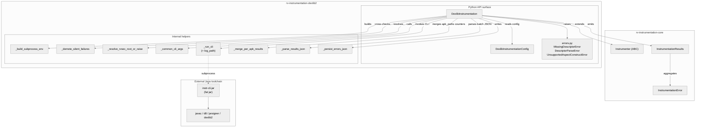
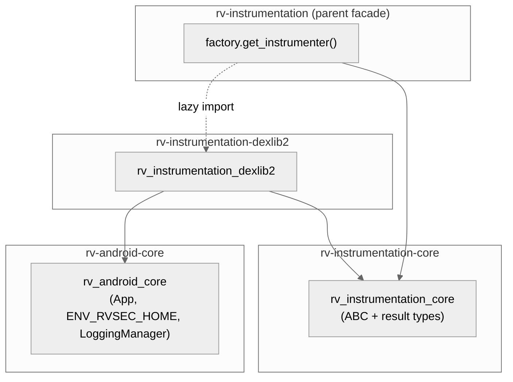
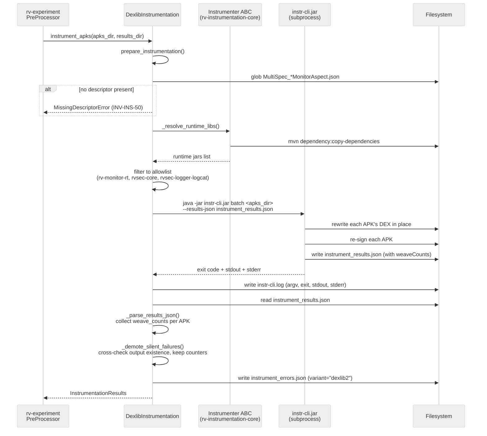
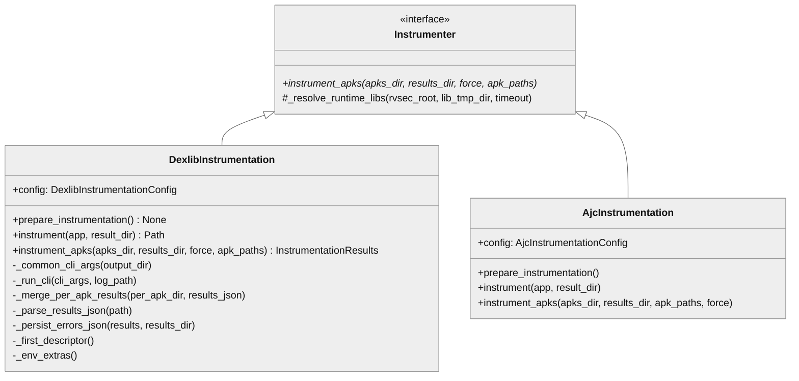

# rv-instrumentation-dexlib2 Architecture

## Overview

`rv-instrumentation-dexlib2` is the DEX-native instrumentation backend for rv-android. It is a thin Python wrapper around a Java CLI fat jar (`instr-cli.jar`, produced by the Maven aggregator `rvsec-instrumentation-dexlib2`) that rewrites Android DEX bytecode in place using the dexlib2 library, weaving runtime-verification monitors and the Coverage hook directly into the application's `classes*.dex`. The module implements the `Instrumenter` ABC defined in `rv-instrumentation-core`; the parent `rv-instrumentation` dispatches to it through `get_instrumenter("dexlib2", config)`. It is spec-set agnostic — the Java CLI handles both JCA and Generic specifications uniformly via the JSON descriptor contract emitted by `rv-monitor-generator`.

## Specification Alignment

This module implements requirements from `openspec/specs/instrumentation/spec.md`.

### Functional Requirements

| FR | Description | Architectural Support |
|----|-------------|-----------------------|
| FR01 | Monitor generation produces artifacts consumed downstream | This module consumes the JSON descriptors emitted by `rv-monitor-generator` (`--emit-descriptor`) — `prepare_instrumentation()` validates their presence before any APK is processed. |
| FR02 | APK instrumentation weaves monitors into bytecode | `DexlibInstrumentation.instrument_apks()` shells out to `instr-cli.jar`, which rewrites DEX in place — bypassing the legacy `dex2jar -> ajc -> d8` chain and its JVMS §4.10.1.9 type-consistency conflict on R8-optimized APKs. |
| FR03 | Specification set support (JCA, Generic) | Spec-set agnostic by construction — the Java weaver consumes whichever descriptor JSONs are present in `monitor_output_dir`, with no Python-side branching on spec set. |

### Key Invariants

| Invariant | Description | Enforcement Mechanism |
|-----------|-------------|----------------------|
| INV-INS-06 | Instrumented APK hash differs from original | The Java CLI rewrites and re-signs every APK; the wrapper cross-checks output existence in `_demote_silent_failures`. |
| INV-INS-41 | Variant impls depend only on `-core`, not on parent or sibling | `pyproject.toml` declares dependencies on `rv-android-core` and `rv-instrumentation-core` only. No import of `rv_instrumentation` or `rv_instrumentation_ajc`. |
| INV-INS-50 | Missing descriptor halts the dexlib2 variant | `prepare_instrumentation()` raises `MissingDescriptorError` when no `MultiSpec_*MonitorAspect.json` is found. |
| INV-INS-52 | Multidex preservation | Delegated to the Java weaver, which rewrites each `classes*.dex` independently rather than collapsing into a single DEX. |
| INV-INS-53 | Canonical Coverage exclusion filter honored | Java weaver re-implements the `Coverage.aj` exclusion rules natively in the `coverage-weaver` submodule. |
| INV-INS-55 | `instrument_apks(apks_dir, results_dir) -> InstrumentationResults` contract uniform across variants | `DexlibInstrumentation` extends the `Instrumenter` ABC; results are tagged `variant="dexlib2"` and persisted to `instrument_errors.json`. |
| INV-INS-105 | Every run leaves an `instrument_results.json` of the same shape, whichever path produced it | The `batch` path takes the file the Java CLI writes; the `apk_paths` path collects one file per APK under `instrument_results.d/` and `_merge_per_apk_results` concatenates their `results` arrays into the same document. |
| INV-INS-122 | `advicesExcludedByArity` measures without filtering | The Java `WrapperEmitter` evaluates the positional-arity rule in its grouping loop and publishes the figure; no advice is removed from any wrapper. The wrapper carries the counter through to `weave_counts` unchanged. |

### Specification Scenarios

Scenarios from `openspec/specs/instrumentation/spec.md` that validate this architecture:

- **DEX-native instrumentation of an R8-optimized APK previously failing under ajc** — exercises `instrument_apks` against APKs in the JCA-400 corpus that emit `VerifyError` under the AJC variant (e.g., `hateitorrateit`); the dexlib2 variant must produce a hash-distinct, boot-successful APK.
- **Missing descriptor when dexlib2 variant is selected** — `prepare_instrumentation()` MUST raise `MissingDescriptorError` when the `.aj` is present but the `.json` is not.
- **Multidex preservation under DEX-native weaving** — input APK with `classes.dex` + `classes2.dex` retains both DEX entries after weaving.
- **Variant tag propagates through the new -core types** — `InstrumentationResults.variant == "dexlib2"` after a run, and the value is persisted to `instrument_errors.json`.

## Key Architectural Decisions

| Decision | Choice | Rationale |
|----------|--------|-----------|
| Application Type | Library + thin subprocess wrapper | Heavy lifting (DEX rewriting, javac, d8, jarsigner) lives in the Java CLI; Python orchestrates and observes. |
| Structuring | Flat single-package layout | The module is small (4 files, ~815 SLOC); a layered split would add ceremony without abstraction value (P1). |
| Primary Pattern | Adapter (subprocess wrapper) | Translates Pydantic config and Python call into Java CLI argv + env. |
| Dispatch Strategy | Lazy factory in parent module | `rv_instrumentation.get_instrumenter("dexlib2", config)` imports `DexlibInstrumentation` only when the variant is selected — selecting `"ajc"` never imports this module. |
| Process Isolation | One JVM invocation per batch (or per APK) | Avoids state leakage between APKs; per-APK mode (one JVM per APK) is the only way to honor strict subsets without a symlink farm. |
| Failure Detection | Cross-check post-condition (file existence) | The CLI may exit 0 with `success` recorded in JSON yet drop the output APK silently (gh53 root cause); `_demote_silent_failures` rebuilds the results map by checking the filesystem. |
| Observability | Persist CLI stdout/stderr to a file per invocation | `subprocess.run(capture_output=True)` takes the weaver's report — resolved `android.jar`, per-advice skips, javac/d8 diagnostics — off the terminal. Without `_run_cli(log_path=...)` that output lives only for the duration of the call, and the silent-failure guard would point the operator at a stdout that had already been discarded. |
| Counter Propagation | Merge per-APK counters after the loop, not inside it | The Java CLI writes its results JSON whether the weave succeeded or failed. Globbing `instrument_results.d/` once the loop is done picks up the counters of APKs the guard demoted to errors — exactly the runs a post-mortem needs them for. |

## Architectural Patterns

### Pattern: Adapter / Subprocess Wrapper

**Description**: `DexlibInstrumentation` adapts the Python-side `Instrumenter` ABC contract onto a Java fat-jar CLI invoked via `subprocess.run`. The wrapper translates `DexlibInstrumentationConfig` fields and the `instrument_apks(apks_dir, results_dir)` call into argv (`java -jar instr-cli.jar [batch|instrument] ...`) and environment variables (`RVSEC_KEYSTORE`, `RVSEC_KEYSTORE_PASS`, classpath hints). Results are read back from `instrument_results.json`, parsed into `InstrumentationResults`, and tagged `variant="dexlib2"`.

**When Used**: Whenever `instrumentation_variant == "dexlib2"` is selected in `ExperimentConfig` or via `--instrumentation-variant dexlib2`.

**Advantages**:

- Decouples Python orchestration from Java weaving — the Java CLI can evolve (new dexlib2 versions, new aspect constructs) without changing the Python contract.
- Subprocess isolation prevents JVM state from leaking into rv-experiment's Python runtime.
- The same Python wrapper runs against any rebuild of `instr-cli.jar` (development builds, Docker-mounted overrides).

**Disadvantages**:

- Two-language toolchain — debugging requires reading both Python and Java traces.
- Subprocess startup cost paid per JVM invocation; mitigated by a batch subcommand that processes a whole directory in one JVM.

### Pattern: Template Method (inherited)

**Description**: `prepare_instrumentation()` calls the inherited `_resolve_runtime_libs()` method from the `Instrumenter` ABC, then applies a variant-specific allowlist (rv-monitor-rt, rvsec-core, rvsec-logger-logcat — `aspectjrt` is filtered out because the rv-monitor-emitted `MultiSpec_*RuntimeMonitor.java` does not import any AspectJ types).

**When Used**: Once per instrumentation run, before any APK is processed.

**Advantages**: Maven dependency resolution logic lives in `-core` and is shared with the AJC variant.

**Disadvantages**: Allowlist drift — adding a new runtime jar requires updating both variants explicitly.

### Pattern: Pydantic Configuration Object

**Description**: `DexlibInstrumentationConfig` mirrors the public field names of `RVInstrumentationConfig` (the AJC variant's config) so callers in `rv-experiment` can swap variants without renaming arguments.

**When Used**: Construction of `DexlibInstrumentation`.

**Advantages**: Variant swap is a one-line change in `ExperimentConfig` plumbing; no caller rewrite.

**Disadvantages**: Field parity must be maintained manually — no compile-time check forces the two configs to stay aligned.

---

## Logical View

Reference: `checklists/architectural-views.md`.

Shows the domain entities and their relationships within the dexlib2 instrumentation pipeline.

### Domain Entities

| Entity | Responsibility |
|--------|----------------|
| `DexlibInstrumentation` | Concrete `Instrumenter` for the `dexlib2` variant — orchestrates subprocess invocation, descriptor validation, runtime classpath assembly, results parsing. |
| `DexlibInstrumentationConfig` | Validated configuration: CLI jar path, monitor descriptor directory, instrumented-APK output directory, signing material, extra Java args/classpath. |
| `MissingDescriptorError` | Raised at preparation time when no `MultiSpec_*MonitorAspect.json` is found. |
| `DescriptorParseError` | Raised when Jackson (Java side) rejects a descriptor JSON; surfaced through subprocess error parsing. |
| `UnsupportedAspectConstructError` | Raised when a descriptor references an out-of-scope construct (`around`, `cflow`, etc. — see `rv-android/docs/LIMITATIONS.md`). |
| `InstrumentationResults` (from `-core`) | Aggregated per-batch result with `variant="dexlib2"` tag and `weave_counts` (per-APK weaver counters keyed by APK name); errors persisted to `instrument_errors.json`. |
| `InstrumentationError` (from `-core`) | Per-APK error record: phase, tool, code, message. |
| `instr-cli.jar` (external) | Java fat jar that performs DEX rewriting; produced by Maven module `rvsec-instrumentation-dexlib2/cli`. |

### Component Architecture



---

## Development View

Shows code organization for developers maintaining the module.

### Module Structure

```
modules/rv-instrumentation-dexlib2/
├── src/rv_instrumentation_dexlib2/
│   ├── __init__.py                  # Public API re-exports
│   ├── config.py                    # DexlibInstrumentationConfig (Pydantic)
│   ├── dexlib_instrumentation.py    # DexlibInstrumentation(Instrumenter)
│   └── errors.py                    # 3 module-specific exceptions
├── lib/                             # gitignored — Maven copies instr-cli.jar here
├── docs/
│   └── architecture.md              # this document
├── tests/
│   └── test_dexlib_instrumentation.py  # 26 unit tests, Java CLI mocked
├── CLAUDE.md
├── README.md
└── pyproject.toml
```

The flat single-package layout is intentional: the module is a thin subprocess wrapper, so a `domain/`/`services/` split would introduce indirection without abstraction value (P1 — Simplicity).

`pyproject.toml` declares a `rv-instrumentation-dexlib2` console script bound to `rv_instrumentation_dexlib2.__main__:main`, but the package has no `__main__.py`. The module is reached programmatically — through `rv_instrumentation.get_instrumenter("dexlib2", config)` or by constructing `DexlibInstrumentation` directly — so the declared script is dangling and fails on invocation.

### Package Dependencies



This module has fan-in 2 (parent factory + `rv-experiment` configuration glue, both via lazy imports) and fan-out 2 (`-core`, `rv-android-core`). Instability `I = 0.5`. No dependency on the parent `rv-instrumentation` module nor on the sibling `rv-instrumentation-ajc` — INV-INS-41 keeps the dependency graph acyclic.

---

## Process View

Shows run-time behavior of a single instrumentation invocation.

### Execution Flow: Batch Path (apk_paths=None)



### Execution Flow: Per-APK Path (apk_paths=[...])

When `apk_paths` is a strict subset, the wrapper invokes the CLI once per APK (one JVM per APK). This is the only way to honor strict subsets without staging a symlink farm. Each item is a complete path — the wrapper does not re-join it with `apks_dir`.

Per APK, the wrapper:

1. Runs `instr-cli instrument <apk> --results-json instrument_results.d/<apk>.json`, with the CLI output persisted to `instrument_results.d/<apk>.log`.
2. Cross-checks that `results_dir/<basename>` exists. A clean exit is not proof of success — the single-APK subcommand prints compilation errors to stdout and exits 0 — so a missing output raises, pointing the operator at the log file.
3. Demotes any `RuntimeError` or `SubprocessError` to an `InstrumentationError` entry rather than aborting the batch.

After the loop, `_merge_per_apk_results` globs `instrument_results.d/*.json` and concatenates their `results` arrays into `instrument_results.json`, returning the per-APK counters. The merge runs after the loop rather than inside it precisely so that APKs the guard demoted still contribute their counters: the Java CLI writes its results JSON whether the weave succeeded or failed, and a failed APK's counters are what a post-mortem needs. A missing or malformed per-APK file is logged and skipped — losing a counter must not turn a successful batch into a failed one.

### Artefacts written under `results_dir`

| Artefact | Path | Written by |
|---|---|---|
| Merged results | `instrument_results.json` | Java CLI (`batch`) or `_merge_per_apk_results` (`apk_paths`) |
| Per-APK results | `instrument_results.d/<apk>.json` | Java CLI, `apk_paths` path only |
| CLI output | `instrument_results.d/<apk>.log` (per-APK), `instr-cli.log` (batch) | `_run_cli(log_path=...)` |
| Error report | `instrument_errors.json` | `_persist_errors_json` (writes `{}` when clean) |

---

## Core Components

### DexlibInstrumentation

**Purpose**: Concrete `Instrumenter` for the `dexlib2` variant — orchestrates subprocess invocation, descriptor validation, runtime classpath assembly, and results parsing.

**Location**: `src/rv_instrumentation_dexlib2/dexlib_instrumentation.py`

**Key Class**:

- `DexlibInstrumentation(Instrumenter)` — public methods `prepare_instrumentation() -> None`, `instrument(app, result_dir) -> Path`, `instrument_apks(apks_dir, results_dir, force_instrumentation=False, apk_paths=None) -> InstrumentationResults`. Holds `config: DexlibInstrumentationConfig` and a structured `_logger`. Only `instrument_apks` is required by the ABC; the other two are variant-specific and reached through the concrete class.

**Internal helpers**:

- `_common_cli_args(output_dir)` — argv shared by both subcommands: `--descriptor`, `--output`, `--work-dir`, `--monitor-src-dir`, plus signing material and `--classpath` when configured. With `--monitor-src-dir` set the CLI runs the full compile+merge+sign pipeline; without it it stops at written DEXes (`phase=dex_only`).
- `_run_cli(cli_args, log_path=None)` — builds `java [extra_java_args] -jar instr-cli.jar ...`, runs it with an explicit env and no wallclock timeout, writes argv/exit/elapsed/stdout/stderr to `log_path`, and raises `RuntimeError` on a non-zero exit.
- `_merge_per_apk_results(per_apk_dir, results_json)` — concatenates the per-APK results into the merged document and returns the counters (INV-INS-105).
- `_parse_results_json(path)` — reads the batch document into `InstrumentationResults`, collecting `weaveCounts` and per-APK errors. An absent file yields a single `__run__` error: the CLI writes the JSON even when every APK fails, so its absence means the subprocess died first.
- `_persist_errors_json(results, results_dir)` — writes `instrument_errors.json`.
- `_first_descriptor()` — the first glob match; the corpus emits one merged descriptor per spec-set run, so "first" is canonical.

### Weaver counters

`InstrumentationResults.weave_counts` carries the Java `BatchRunner`'s per-APK counters, keyed by APK name. They exist so a side effect of a weaving change is measurable rather than inferred.

| Group | Keys | Reads as |
|---|---|---|
| Reach | `classesSeen`, `methodsSeen`, `matchesApplied` | How much of the APK the weaver walked and changed. |
| Declined | `plansSkipped`, `plansSkippedAliasing`, `plansSkippedUnresolvedBinding` (INV-INS-71), `plansSkippedHighRegister` | What the weaver did not apply. `plansSkippedHighRegister` is where emitting more invokes per site pushing a method over its register budget shows up. |
| Wrappers | `wrappersGenerated`, `wrappersSubstituted`, `wrappersAliasedToSubtype`, `constructorInlineApplied`, `constructorInlineSkippedAliasing` | Wrapper emission and call-site substitution. |
| Arity | `advicesExcludedByArity` (INV-INS-122) | Advice/overload pairs whose positional `args()` arity does not fit the overload they are grouped onto. A measurement only — every one of them still fires. Always written, so `0` means "measured none" rather than "not measured", and it covers wrapper-path after-advices only: before-side and constructor advices never reach the grouping loop. |
| Coverage | `coverageInstrumented`, `coverageSpillFailed` | Present only when the coverage weaver ran. |

The figure also depends on the resolved `android.jar`, not only on the descriptor — an overload set can widen between API levels — which is why `_run_cli` persists the CLI log that names the resolved platform jar.

**Dependencies**:

- Internal: `DexlibInstrumentationConfig`, `MissingDescriptorError`.
- External: `rv_instrumentation_core` (`Instrumenter`, `InstrumentationResults`, `InstrumentationError`), `rv_android_core` (`App`, `ENV_RVSEC_HOME`, `LoggingManager`), `subprocess`, `pathlib`.

### DexlibInstrumentationConfig

**Purpose**: Validated configuration. Mirrors `RVInstrumentationConfig` field names so callers can swap variants without renaming.

**Location**: `src/rv_instrumentation_dexlib2/config.py`

**Key Fields**:

- `cli_jar_path: Path` — defaults to `../../lib/instr-cli.jar` (auto-copied by Maven).
- `monitor_output_dir: Path` — directory containing the descriptor JSONs and supporting Java sources.
- `descriptor_glob: str` — defaults to `MultiSpec_*MonitorAspect.json`.
- `instrumented_dir: Path` — output directory.
- `working_dir: Path` — scratch.
- `keystore_file`, `keystore_password`, `keystore_alias`, `key_password` — signing material (all optional, fall back to env vars on the Java side).
- `extra_java_args: List[str]`, `extra_classpath: List[Path]`.

**Notable absence**: no wallclock timeout. Weave time scales with method count; APKs in the JCA-400 corpus legitimately take 10-30+ minutes (e.g. `io.github.eucsoh.android_9.apk`: 14m14s, 249k methods). If hung-CLI detection is ever needed, an inactivity-based watchdog is the right tool — not a wallclock cap that aborts legitimate slow runs.

### errors.py

**Purpose**: Module-specific exceptions raised at preparation or surfaced from the Java CLI.

**Location**: `src/rv_instrumentation_dexlib2/errors.py`

**Classes**:

- `MissingDescriptorError` — INV-INS-50.
- `DescriptorParseError` — Java-side Jackson failure surfaced through subprocess parsing.
- `UnsupportedAspectConstructError` — descriptor references an out-of-scope construct (`around`, `cflow`, `cflowbelow`, `handler`, `get`, `set`, `initialization`, `preinitialization`).

---

## NFR Support

Reference: `docs/PRD.md` Section 7.

| NFR | PRD ID | Priority | Architectural Support |
|-----|--------|----------|-----------------------|
| Performance | NFR01 | P0 | Single-JVM batch path (one `instr-cli.jar` invocation for the whole `apks_dir`) eliminates per-APK JVM startup cost, which dominates throughput when processing hundreds of APKs. |
| Maintainability | NFR02 | P0 | Flat package structure; one public class; descriptor JSON is the single contract surface with `rv-monitor-generator`. |
| Extensibility | NFR03 | P1 | Variant selection lives in the parent factory — adding a future `dexlib3` variant requires only a new `Instrumenter` impl and a factory branch, no changes here. |
| Reliability | NFR04 | P1 | Silent-failure cross-check (`_demote_silent_failures`) catches CLI bugs where exit code 0 ships a missing output APK; per-APK demotion prevents one APK from poisoning the batch. Persisted CLI logs and per-APK counters make a failed run diagnosable after the fact rather than only while it runs. |
| Testability | NFR07 | P1 | Subprocess invocation is the only side-effect, making mock-based unit tests straightforward; `DexlibInstrumentationConfig` is fully constructible from in-memory paths. |

---

## Key Interfaces

### Instrumenter (from `rv-instrumentation-core`)

`instrument_apks` is the ABC's only abstract method. Single-APK helpers, `check_if_instrumented` and `prepare_instrumentation` are deliberately variant-specific: consumers needing them import the concrete class. The ABC also supplies `_resolve_runtime_libs` as a Template Method shared with the AJC variant.

```python
class Instrumenter(ABC):
    """Contract every instrumentation variant MUST satisfy."""

    @abstractmethod
    def instrument_apks(
        self,
        apks_dir,
        results_dir,
        force_instrumentation: bool = False,
        apk_paths: Optional[List[str]] = None,
    ) -> InstrumentationResults:
        """Instrument every APK in apks_dir (or the strict subset apk_paths).

        Each apk_paths item is a complete path; the variant must NOT re-join
        it with apks_dir.
        """
        ...

    def _resolve_runtime_libs(
        self,
        rvsec_root: Path,
        lib_tmp_dir: Path,
        timeout_seconds: int = 600,
    ) -> List[Path]:
        """mvn dependency:copy-dependencies into lib_tmp_dir; returns jar paths."""
```



### Variant selection contract

```python
from rv_instrumentation import get_instrumenter

instr = get_instrumenter("dexlib2", config)  # lazy imports DexlibInstrumentation
results = instr.instrument_apks(apks_dir, results_dir)
assert results.variant == "dexlib2"
```

---

## Scenarios

### Scenario 1: Batch instrumentation of an experiment's APK directory

**Description**: `rv-experiment` runs Phase 1 pre-processing with `instrumentation_variant="dexlib2"`.

**Flow**:

1. `PreProcessor._instrument_apks()` calls `get_instrumenter("dexlib2", config)`.
2. Parent factory lazy-imports `DexlibInstrumentation` and constructs an instance with the JIT-built `DexlibInstrumentationConfig`.
3. `instrument_apks(apks_dir, results_dir)` is called with `apk_paths=None`.
4. `prepare_instrumentation()` validates descriptor presence and resolves the runtime classpath.
5. The wrapper invokes `instr-cli.jar batch <apks_dir>` in one subprocess.
6. The Java CLI rewrites each APK's DEX, re-signs, writes `instrument_results.json`.
7. The wrapper parses the JSON, runs `_demote_silent_failures` to catch missing outputs, persists `instrument_errors.json` with `variant="dexlib2"`.
8. `InstrumentationResults` returned to the caller.

### Scenario 2: Strict-subset reinstrumentation

**Description**: A re-run targets only APKs that failed in a previous batch.

**Flow**:

1. Caller passes `apk_paths=[apk1, apk2, apk3]`.
2. The wrapper switches to per-APK mode: one `instr-cli.jar instrument <apk>` invocation per APK.
3. Per-APK errors are demoted to entries in `InstrumentationResults.errors` rather than aborting the batch.
4. Aggregated results returned with `variant="dexlib2"`.

### Scenario 3: Silent-failure detection (gh53 root cause)

**Description**: The Java CLI exits 0 and records `success` for an APK in `instrument_results.json`, but a downstream javac/d8/jarsigner step silently dropped the output file.

**Flow**:

1. Wrapper parses `instrument_results.json` — the entry shows success.
2. `_demote_silent_failures` re-reads `results_dir/instrument_results.json` — the parsed `InstrumentationResults` no longer carries per-APK success flags — and for each entry claiming success checks whether `results_dir/<apkName>` is a file.
3. The missing entry is rebuilt as an `InstrumentationError(phase="dexlib2_pipeline", ...)` and `success_count` is decremented. `weave_counts` survives the rebuild: demotion changes the verdict on an APK, not what the weaver did to it.
4. The corrected `InstrumentationResults` is returned to the caller and persisted, preventing phantom successes from poisoning downstream coverage analysis.

The `apk_paths` path does not use this function — it checks each output APK inline, immediately after the run that should have produced it.

---

## Extension Points

- **New aspect construct support**: extend the descriptor schema in `rv-monitor-generator` and the corresponding weaver in the Java CLI. The Python wrapper requires no changes — descriptor parsing happens entirely on the Java side.
- **Alternative CLI override**: set `cli_jar_path` to a development build or a Docker-mounted jar to test weaver changes without reinstalling.
- **Extra classpath entries**: append to `extra_classpath` to pull additional libraries into the Java CLI's javac classpath when the rv-monitor-emitted Java sources reference them.
- **Subprocess environment**: `_build_subprocess_env` forwards only `PATH`, `HOME`, `JAVA_HOME`, `ANDROID_HOME` and `RVSEC_HOME`, layering on `RVSEC_KEYSTORE` / `RVSEC_KEYSTORE_PASS` when `keystore_file` / `keystore_password` are set so the Java CLI falls back to its own defaults otherwise. Wholesale `os.environ` propagation is forbidden by INV-EXP-30 — it would leak user-facing `RV_*` values past Layer Purity boundaries into the Java process. Alias and key password travel as `--key-alias` / `--key-pass` argv, not env.

## Dependencies

### Internal (rv-android modules)

| Module | Purpose |
|--------|---------|
| `rv-android-core` | `App` domain model, `ENV_RVSEC_HOME` constant, `LoggingManager` for structured per-APK logs. |
| `rv-instrumentation-core` | `Instrumenter` ABC, `InstrumentationResults` and `InstrumentationError` Pydantic types, `_resolve_runtime_libs` Template Method. |

### External

| Package | Version | Purpose |
|---------|---------|---------|
| `pydantic` | `>=2.9.0` | `DexlibInstrumentationConfig` validation. |
| `instr-cli.jar` | Built from `rvsec/rvsec-android/rvsec-instrumentation-dexlib2` | Java fat jar performing DEX rewriting; auto-copied to `lib/instr-cli.jar` by the Maven build (design D9). The Docker image build gates on its presence. |
| Android SDK / JDK | `ANDROID_HOME` / `JAVA_HOME` | Resolved by the Java CLI's `ConfigResolver`; the Python wrapper does not look at these. |

## Testing Strategy

| Type | Location | Purpose |
|------|----------|---------|
| Unit | `tests/test_dexlib_instrumentation.py` (26 tests) | Argv assembly, env injection, descriptor presence checks, results parsing, `_demote_silent_failures` cross-check logic, runtime-jar allowlist, per-APK results merge and counter propagation (including an APK that never landed), CLI log persistence, and `advicesExcludedByArity` reaching Python — all with the Java CLI mocked. |
| End-to-end (validator) | `rvsec/rvsec-android/rvsec-instrumentation-dexlib2/validator/` | `BaksmaliDiffer`, `BootValidator`, `TraceComparator`, `BatchValidator`, `CoverageValidator`, `FeatureMappingChecker` exercise the full pipeline against real APKs from the JCA-400 dataset (Java side; not part of this Python module's tests). |

## Related Documentation

- [Domain Spec](../../../openspec/specs/instrumentation/spec.md) — Instrumentation requirements and invariants.
- [PRD](../../../docs/PRD.md) — Product Requirements Document (FR01-37, NFR01-08).
- [CLAUDE.md](../CLAUDE.md) — Quick reference for Claude Code.
- [rv-instrumentation-core README](../../rv-instrumentation-core/README.md) — Pure abstractions module.
- [rv-instrumentation parent](../../rv-instrumentation/) — Parent facade with `get_instrumenter()` factory.
- [rv-instrumentation-ajc architecture](../../rv-instrumentation-ajc/docs/architecture.md) — Sibling AJC variant (for comparison).
- `rvsec/rvsec-android/rvsec-instrumentation-dexlib2/` — Java aggregator implementing the weaver.
- [`rv-android/docs/LIMITATIONS.md`](../../../docs/LIMITATIONS.md) — Out-of-scope AspectJ constructs.
- [`rv-android/docs/AJ_TO_DEXLIB2_MAPPING.md`](../../../docs/AJ_TO_DEXLIB2_MAPPING.md) — Construct-to-component mapping.
