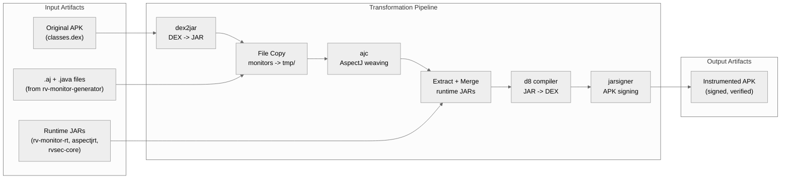
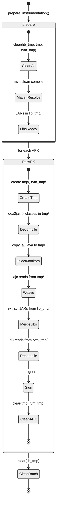
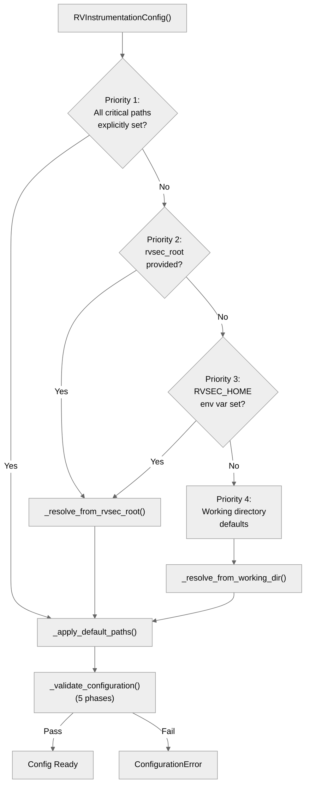
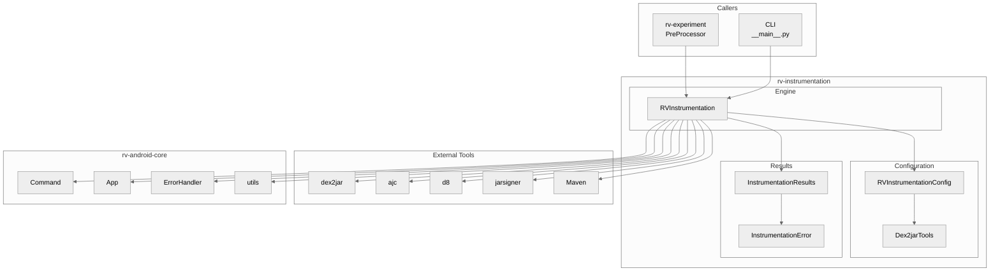
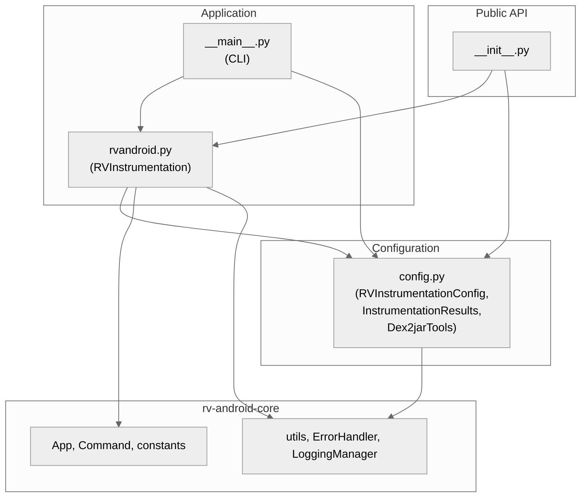
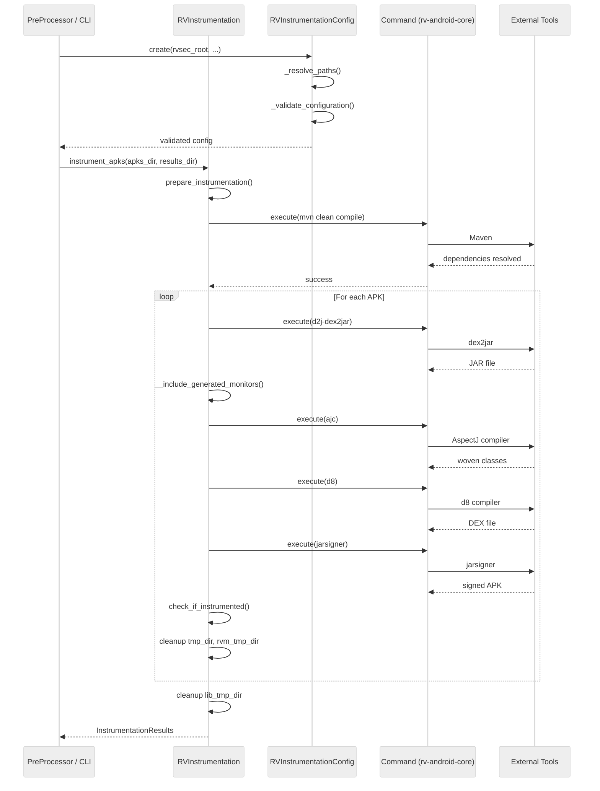
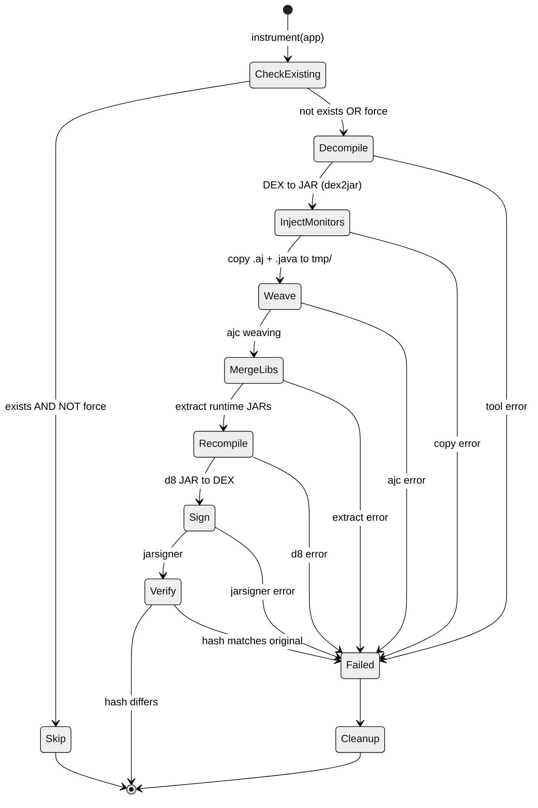
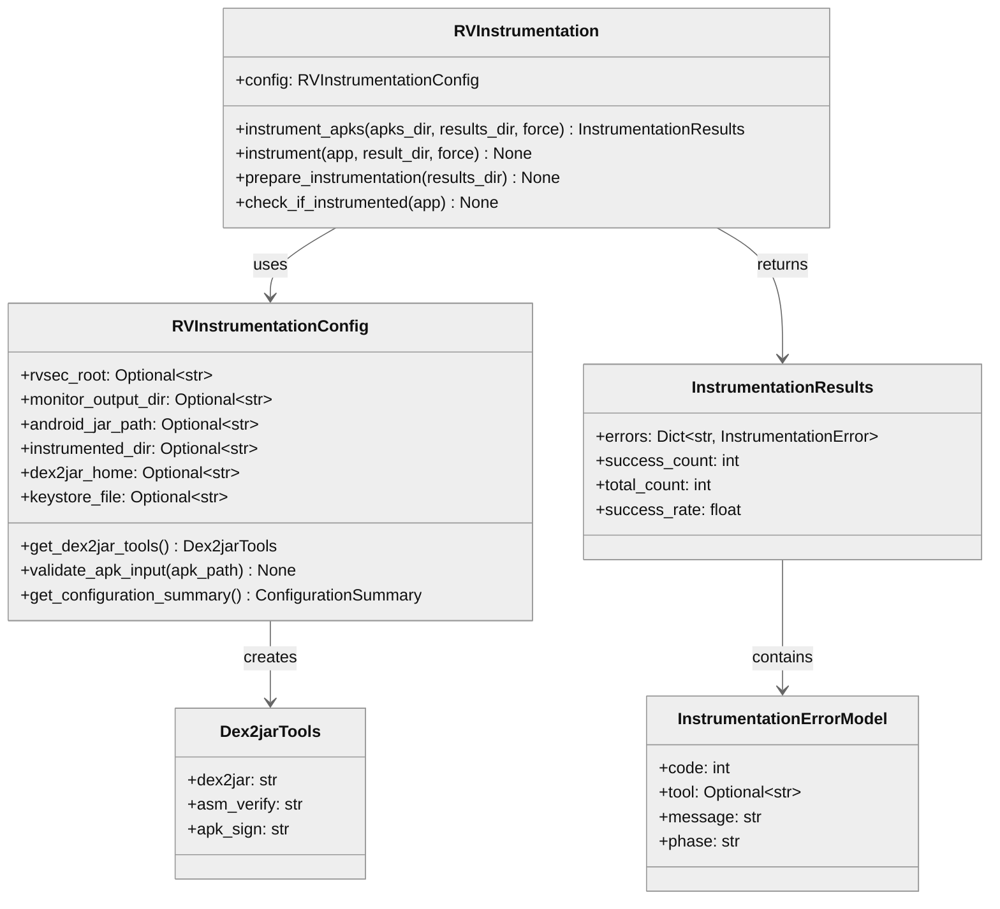

# rv-instrumentation Architecture

## Overview

rv-instrumentation transforms standard Android APKs into runtime-verification-enabled artifacts by orchestrating a six-phase pipeline: DEX-to-JAR decompilation (dex2jar), monitor artifact injection (AspectJ aspects and Java monitor classes), AspectJ weaving (ajc), runtime library merging, JAR-to-DEX recompilation (d8), and APK signing (jarsigner). The module acts as the bridge between monitor artifacts produced by rv-monitor-generator and deployable instrumented APKs consumed by rv-platform during experiment execution.

## Specification Alignment

This module implements requirements from `openspec/specs/instrumentation/spec.md`.

### Functional Requirements

| FR | Description | Architectural Support |
|----|-------------|----------------------|
| FR01 | Monitor generation from JavaMOP specifications | Upstream dependency -- rv-instrumentation consumes the .aj and .java artifacts produced by rv-monitor-generator (FR01). The `_validate_monitor_artifacts()` method in `RVInstrumentationConfig` enforces that both artifact types exist before instrumentation begins. |
| FR02 | APK instrumentation with monitors | Core responsibility. `RVInstrumentation` implements the complete six-phase pipeline: decompile, inject, weave, merge, recompile, sign. Batch processing with error isolation is provided by `instrument_apks()`. |
| FR03 | Specification set support | Indirect. The module is specification-set-agnostic -- it instruments APKs with whatever monitors are present in `monitor_output_dir`. Specification set selection is handled upstream by rv-experiment and rv-monitor-generator. |

### Key Invariants

| Invariant | Description | Enforcement Mechanism |
|-----------|-------------|----------------------|
| INV-INS-06 | Instrumented APK hash MUST differ from original | `check_if_instrumented()` compares file hashes and raises `CommandException` if they match |
| INV-INS-07 | `monitor_output_dir` MUST contain .aj and .java files | `RVInstrumentationConfig._validate_monitor_artifacts()` raises `ConfigurationError` during initialization |
| INV-INS-08 | Temporary directories MUST be cleaned after each APK | `finally` block in `instrument()` cleans `tmp_dir` and `rvm_tmp_dir`; `instrument_apks()` cleans `lib_tmp_dir` after the batch |
| INV-INS-10 | Instrumented APK MUST be signed with a valid keystore | `__create_apk()` executes `d2j-apk-sign` followed by `jarsigner` with SHA256withRSA and `jarsigner -verify` |
| INV-INS-11 | dex2jar tools MUST exist and be executable | `Dex2jarTools` field validators raise `ValueError` on missing or non-executable tools |
| INV-INS-12 | Missing RVSEC_HOME without explicit paths MUST fail at init | `_resolve_paths()` raises `ConfigurationError` during `__init__` if no configuration source resolves |

### Specification Scenarios

Scenarios from `openspec/specs/instrumentation/spec.md` that validate this architecture:

- **Successful single APK instrumentation**: Traces through `instrument()` -> `__decompile_apk()` -> `__include_generated_monitors()` -> `__weave_monitors()` -> `__create_apk()` -> `check_if_instrumented()`, exercising the full pipeline.
- **Batch instrumentation with mixed results**: Traces through `instrument_apks()` error isolation -- each APK is processed in a try/except, failures are recorded in `InstrumentationResults.errors`, and processing continues.
- **Skip existing instrumented APK**: Traces through `instrument()` early return when the output file exists and `force_instrumentation=False`.
- **Maven dependency resolution failure**: Traces through `prepare_instrumentation()` -> `__execute_maven()` failure -> error recorded with key `"setup_error"` and phase `"preparation"`.

## Key Architectural Decisions

### Decision 1: Two-Class Module (Config + Engine)

**Choice**: Separate configuration resolution/validation (`RVInstrumentationConfig`) from pipeline execution (`RVInstrumentation`).

**Why**: Configuration involves four different resolution strategies, five validation phases, and multiple file-system probes. Mixing this logic with the six-phase pipeline would create a class with too many responsibilities. By isolating config, the engine receives a fully validated object and never performs path resolution -- it just executes the pipeline. This also enables unit testing config logic without requiring external tools.

### Decision 2: Sequential Pipeline (not parallel)

**Choice**: Process pipeline phases strictly in order: decompile -> inject -> weave -> merge -> recompile -> sign.

**Why**: Each phase transforms artifacts produced by the previous phase. You cannot weave aspects before decompiling, and you cannot sign before recompiling. While batch APKs could theoretically be processed in parallel, the external tools (dex2jar, ajc, d8) are not designed for concurrent invocation from the same working directory -- shared temp directories and classpath resources would conflict. The sequential approach keeps the system predictable and debuggable.

### Decision 3: Error Isolation Per APK in Batch Mode

**Choice**: When one APK fails instrumentation, record the error and continue processing the next APK.

**Why**: In the ICST study, the instrumentation pipeline achieved only 34.6% success rate (193 of 557 APKs). If a single failure aborted the batch, most experiments would never complete. Error isolation ensures maximum throughput while collecting structured error data (`InstrumentationResults`) for post-mortem analysis. Each error records the failing tool, phase, and error code.

### Decision 4: Priority-Based Configuration Resolution

**Choice**: Support four configuration levels: explicit paths > rvsec_root > RVSEC_HOME env var > working directory defaults.

**Why**: The module runs in three different contexts: (1) via rv-experiment, which provides an `rvsec_root` from `ExperimentConfig`; (2) via CLI for development/debugging, where `RVSEC_HOME` is typically set; (3) in CI environments, where explicit paths are injected. The priority system accommodates all contexts without code changes.

### Decision 5: Bundled Development Keystore

**Choice**: Ship a default `keystore.jks` in the module's `assets/` directory.

**Why**: APK signing is mandatory for Android deployment, but the research context does not require production-grade signing. A bundled keystore with a known password ("password") eliminates a configuration step for researchers while still producing valid signed APKs that can be installed on emulators. Custom keystores are supported via the `keystore_file` parameter.

### Decision 6: External Tool Execution via Command Abstraction

**Choice**: Invoke all external tools (dex2jar, ajc, d8, jarsigner, Maven) through the `Command` class from rv-android-core.

**Why**: The `Command` abstraction provides consistent logging, timeout handling, and exit-code checking across all tool invocations. It also enables test mocking -- unit tests can mock `utils.execute_command()` without spawning real processes.

## Data Flow

### End-to-End Artifact Transformation

The instrumentation pipeline transforms artifacts through a chain of external tools. Each transformation produces a new artifact type that feeds into the next phase.



### Temporary Directory Lifecycle

The module creates and destroys temporary directories at specific points to manage disk space during batch processing. Understanding this lifecycle is important because premature cleanup causes pipeline failures, and missing cleanup causes disk exhaustion.



### Configuration Resolution Flow

Configuration data flows through a four-level priority cascade during `RVInstrumentationConfig.__init__()`. Each level fills in paths not already set by a higher-priority level.



## Architectural Patterns

### Pattern: Sequential Pipeline

**Description**: The instrumentation process follows a fixed six-phase sequence where each phase transforms artifacts produced by the previous phase. The `RVInstrumentation.instrument()` method orchestrates the phases in order: decompile -> inject -> weave -> merge/recompile/sign.

**When Used**: The APK transformation is inherently sequential -- you cannot weave aspects before decompiling, and you cannot sign before recompiling.

**Advantages**:
- Simple to understand and debug -- each phase has clear inputs and outputs
- Failed phases produce clear error context (which tool failed, at which phase)

**Disadvantages**:
- No parallelism within a single APK instrumentation
- A failure in any phase aborts the entire APK (no partial recovery)

### Pattern: Facade

**Description**: `RVInstrumentation` hides the complexity of six external tool invocations behind two public methods (`instrument_apks()` and `instrument()`). Callers do not need to know about dex2jar, ajc, d8, or jarsigner.

**When Used**: The module is consumed by rv-experiment's `PreProcessor`, which calls `instrument_apks()` without knowledge of the internal pipeline.

**Advantages**:
- Clean API for callers -- single method call for batch instrumentation
- Internal pipeline changes do not affect callers

**Disadvantages**:
- Limited control for callers who need to customize individual phases

### Pattern: Configuration Object with Fail-Fast Validation

**Description**: `RVInstrumentationConfig` encapsulates all configuration with priority-based path resolution and five-phase validation during initialization.

**When Used**: Configuration is resolved once at initialization. The engine receives a fully validated config object and does not perform additional path resolution.

**Advantages**:
- Fails fast -- configuration errors surface before any APK processing begins
- Single source of truth for all paths and tool locations

**Disadvantages**:
- Complex initialization logic with multiple resolution strategies

---

## Logical View

### Domain Entities

| Entity | Responsibility |
|--------|----------------|
| `RVInstrumentation` | Pipeline orchestrator -- coordinates the six-phase APK transformation |
| `RVInstrumentationConfig` | Configuration authority -- resolves, validates, and provides all paths and tool locations |
| `Dex2jarTools` | Tool locator -- validated paths to three dex2jar executables |
| `InstrumentationResults` | Batch outcome -- tracks success count, total count, and per-APK errors |
| `InstrumentationError` | Error record -- structured data for a single APK failure (code, tool, message, phase) |
| `ConfigurationSummary` | Diagnostic report -- structured configuration snapshot for logging |

### Component Architecture



---

## Development View

### Module Structure

```
modules/rv-instrumentation/
├── src/
│   └── rv_instrumentation/
│       ├── __init__.py          # Public API: RVInstrumentation, RVInstrumentationConfig
│       ├── __main__.py          # CLI entry point (instrument/batch subcommands)
│       ├── config.py            # Configuration models (Pydantic): Config, Dex2jarTools, Results
│       └── rvandroid.py         # Core instrumentation engine (6-phase pipeline)
├── tests/
│   ├── __init__.py
│   ├── conftest.py              # Test fixtures (temp_workspace, mock_tools_directory)
│   └── test_config.py           # Configuration unit tests
├── assets/
│   └── keystore.jks             # Bundled development keystore for APK signing
└── pyproject.toml
```

### Package Dependencies



---

## Process View

### Batch Instrumentation Flow



### Single APK Pipeline Phases



---

## Core Components

### RVInstrumentation

**Purpose**: Orchestrates the complete APK instrumentation pipeline, coordinating six external tools to transform standard APKs into runtime-verification-enabled artifacts.

**Location**: `src/rv_instrumentation/rvandroid.py`

**Key Classes**:
- `RVInstrumentation`: Facade that exposes `instrument_apks()` for batch processing and `instrument()` for single APK processing. Internally delegates to private methods for each pipeline phase (`__decompile_apk`, `__include_generated_monitors`, `__weave_monitors`, `__create_apk`).

**Key Methods**:
- `instrument_apks(apks_dir, results_dir, force)`: Batch entry point with error isolation per APK
- `instrument(app, result_dir, force)`: Single APK pipeline orchestration
- `prepare_instrumentation(results_dir)`: Environment setup (temp dir cleanup, Maven dependency resolution)
- `check_if_instrumented(app)`: Post-instrumentation verification via file hash comparison (INV-INS-06)

**Dependencies**:
- Internal: `RVInstrumentationConfig`, `InstrumentationResults`, `InstrumentationError`
- External (rv-android-core): `Command`, `App`, `ErrorHandler`, `utils` (file operations, hash computation)

### RVInstrumentationConfig

**Purpose**: Resolves, validates, and provides all configuration for the instrumentation pipeline. Implements a priority-based path resolution system that supports multiple deployment scenarios.

**Location**: `src/rv_instrumentation/config.py`

**Key Classes**:
- `RVInstrumentationConfig`: Pydantic model with 13 fields, priority-based path resolution in `__init__`, and five-phase validation (`_validate_configuration`)
- `Dex2jarTools`: Pydantic model for three dex2jar tool paths with existence/executability validation
- `ConfigurationSummary`: Structured diagnostic report for logging

**Resolution Priority**:
1. Explicit individual paths (highest)
2. Explicit `rvsec_root` parameter
3. `RVSEC_HOME` environment variable
4. Working directory defaults (lowest)

**Validation Phases**:
1. Critical directory existence and accessibility
2. Android SDK integration (`android.jar`)
3. Keystore file accessibility
4. Monitor artifact presence (.aj and .java)
5. Output directory creation

**Dependencies**:
- External (rv-android-core): `BaseValidatedModel`, `ErrorHandler`, `LoggingManager`, `ConfigurationError`, `constants`

### InstrumentationResults

**Purpose**: Aggregates batch instrumentation outcomes for reporting and post-processing.

**Location**: `src/rv_instrumentation/config.py`

**Key Classes**:
- `InstrumentationResults`: Pydantic model with `errors` dict (keyed by APK name), `success_count`, `total_count`, and computed `success_rate` property
- `InstrumentationError`: Pydantic model for structured error data (code, tool, message, phase)

### CLI

**Purpose**: Provides command-line access to instrumentation for development, debugging, and standalone usage.

**Location**: `src/rv_instrumentation/__main__.py`

**Subcommands**:
- `instrument`: Single APK instrumentation
- `batch`: Batch instrumentation of all APKs in a directory

**Features**: Dry-run mode (configuration validation only), verbose logging, instrumentation summary, force re-instrumentation

---

## NFR Support

How the architecture supports non-functional requirements from the PRD (`docs/PRD.md` Section 7).

| NFR | PRD ID | Priority | Architectural Support |
|-----|--------|----------|----------------------|
| Modularity | NFR01 | P0 | Module is a standalone uv workspace package with a single dependency (rv-android-core). Monitor artifacts are consumed as files, not Python imports -- no code coupling with rv-monitor-generator. |
| Extensibility | NFR02 | P0 | Not a primary concern for this module. The pipeline is fixed by the nature of the transformation. New tool integrations would require code changes. |
| Testability | NFR03 | P1 | Configuration is isolated in `RVInstrumentationConfig` with Pydantic validation, enabling unit testing without external tools. Test fixtures in `conftest.py` provide mock workspaces. |
| Resilience | NFR04 | P1 | Error isolation per APK in batch mode -- one failure does not stop the batch. Temporary directories are cleaned in `finally` blocks. Errors are collected in `InstrumentationResults` for post-mortem analysis. |
| Configurability | NFR05 | P1 | Priority-based path resolution supports four configuration levels (explicit paths, rvsec_root, env var, defaults). CLI provides granular options for all configuration parameters. |
| Compatibility | NFR07 | P1 | Targets Android SDK (d8, android-29), Java 8+ (JavaMOP, RV-Monitor), and standard Unix tools (zip). dex2jar and ajc are invoked via `Command` abstraction for cross-platform compatibility. |
| Reproducibility | NFR08 | P1 | Deterministic pipeline -- same APK + same monitors = same instrumented output. `force_instrumentation` flag enables re-instrumentation when monitors change. Hash verification ensures instrumentation had effect. |

---

## Key Interfaces

### Public API

```python
class RVInstrumentation:
    """Core instrumentation engine."""

    def __init__(self, config: Optional[RVInstrumentationConfig] = None): ...

    def instrument_apks(
        self, apks_dir: str, results_dir: str,
        force_instrumentation: bool = False,
        apk_paths: Optional[List[str]] = None,
    ) -> InstrumentationResults: ...

    def instrument(
        self, app: App, result_dir: str,
        force_instrumentation: bool = False,
    ) -> None: ...

    def prepare_instrumentation(self, results_dir: str) -> None: ...

    def check_if_instrumented(self, app: App) -> None: ...
```

### Class Diagram



---

## Scenarios

### Scenario 1: Batch Instrumentation via rv-experiment

**Description**: The rv-experiment `PreProcessor` instruments all APKs in a directory during the pre-processing phase of an experiment.

**Flow**:
1. `PreProcessor` creates `RVInstrumentationConfig` from `ExperimentConfig.get_rv_instrumentation_config()` -- path resolution and validation occur during initialization (INV-INS-07, INV-INS-12)
2. `PreProcessor` creates `RVInstrumentation(config)` and calls `instrument_apks(apks_dir, results_dir)`
3. `instrument_apks()` calls `prepare_instrumentation()` which cleans temp dirs and runs Maven dependency resolution
4. For each APK: the six-phase pipeline executes; on failure, the error is recorded in `InstrumentationResults.errors` and processing continues with the next APK (INV-INS-08)
5. After the loop, `lib_tmp_dir` is cleaned and `instrument_errors.json` is written if errors occurred
6. `InstrumentationResults` is returned to `PreProcessor` with success count, total count, and error details

### Scenario 2: Force Re-instrumentation After Monitor Update

**Description**: After regenerating monitors with a different specification set, a developer re-instruments previously processed APKs.

**Flow**:
1. Developer runs `rv-instrumentation batch --apks-dir /apks --output /output --force`
2. CLI creates `RVInstrumentationConfig` and `RVInstrumentation`
3. `instrument_apks()` is called with `force_instrumentation=True`
4. For each APK where an instrumented version exists, the existing file is deleted and the full pipeline re-executes
5. `check_if_instrumented()` verifies the new APK differs from the original (INV-INS-06)

### Scenario 3: dex2jar Conversion Failure

**Description**: An APK with obfuscated or multidex bytecode fails during the decompilation phase.

**Flow**:
1. `__d2j_dex2jar()` executes dex2jar and detects an exception file, raising `CommandException` with tool="dex2jar"
2. The exception propagates to `instrument_apks()` which catches `CommandException`
3. An `InstrumentationErrorModel` is created with `phase="command_execution"`, `tool="dex2jar"`, and the error code
4. The error is stored in `InstrumentationResults.errors[app.name]`
5. The `finally` block cleans `tmp_dir` and `rvm_tmp_dir`
6. Processing continues with the next APK

---

## Extension Points

- **Custom keystore**: Provide a custom keystore via `--keystore` CLI option or `keystore_file` config parameter for production signing
- **Android SDK version**: Currently defaults to `android-29`; the `android_jar_path` and `android_platforms_dir` parameters allow targeting other API levels
- **Monitor source**: The `monitor_output_dir` parameter accepts any directory containing .aj and .java files, enabling use with custom (non-MOP) monitors

## Dependencies

### Internal (rv-android modules)

| Module | Purpose |
|--------|---------|
| rv-android-core | `App` domain model, `Command` for external tool execution, `ErrorHandler` for error management, `LoggingManager` for structured logging, `utils` for file operations (hash, zip, folder management), `constants` for shared values |

### External

| Package | Version | Purpose |
|---------|---------|---------|
| pydantic | ^2.0 | Configuration validation, data models, computed fields |

### External Tools (runtime)

| Tool | Purpose | Configuration |
|------|---------|---------------|
| dex2jar | DEX-to-JAR conversion (d2j-dex2jar.sh, d2j-asm-verify.sh, d2j-apk-sign.sh) | `dex2jar_home` config parameter |
| ajc (AspectJ) | Monitor weaving into application bytecode | System PATH |
| d8 (Android SDK) | JAR-to-DEX recompilation with `--min-api 26` | `ANDROID_HOME` env var |
| jarsigner (JDK) | APK signing with SHA256withRSA | System PATH |
| Maven | Runtime dependency resolution (rv-monitor-rt, aspectjrt, rvsec-core) | System PATH |
| zip | APK manipulation (DEX replacement, META-INF cleanup) | System PATH |

## Testing Strategy

| Type | Location | Purpose |
|------|----------|---------|
| Unit | tests/test_config.py | Configuration model validation, path resolution, Dex2jarTools validation |
| Fixtures | tests/conftest.py | Mock workspace directories, mock tool binaries for isolated testing |

## Related Documentation

- [Domain Spec](../../openspec/specs/instrumentation/spec.md) - Requirements, invariants, and scenarios for the instrumentation pipeline
- [PRD](../../docs/PRD.md) - Product Requirements Document (FR01-03, NFR01-08)
- [CLAUDE.md](../../CLAUDE.md) - Project-level reference for Claude Code
- [Module CLAUDE.md](../CLAUDE.md) - Module-specific reference with CLI usage and examples
