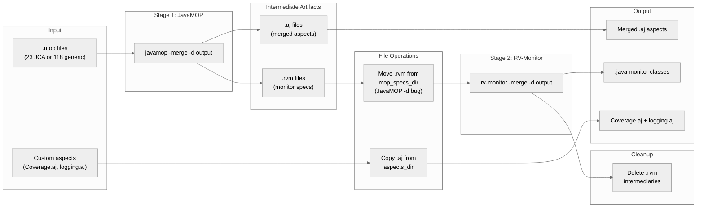
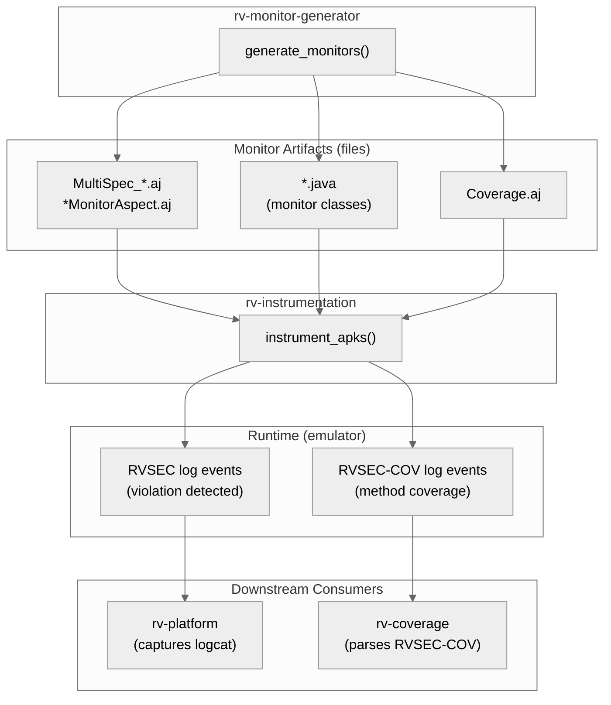
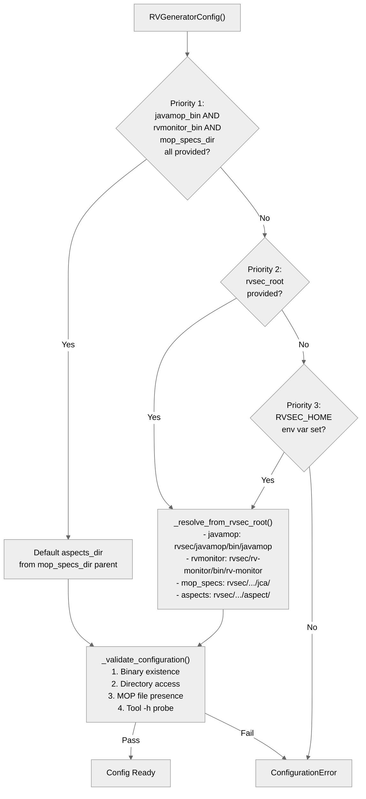
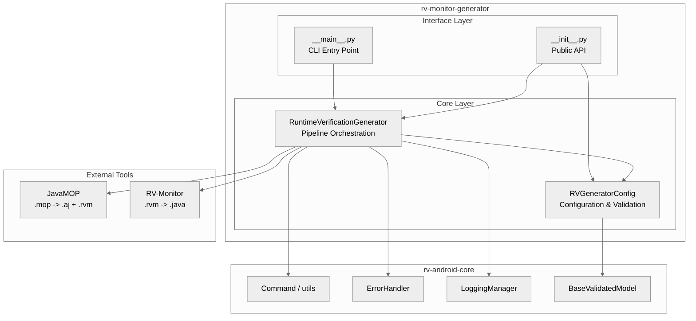
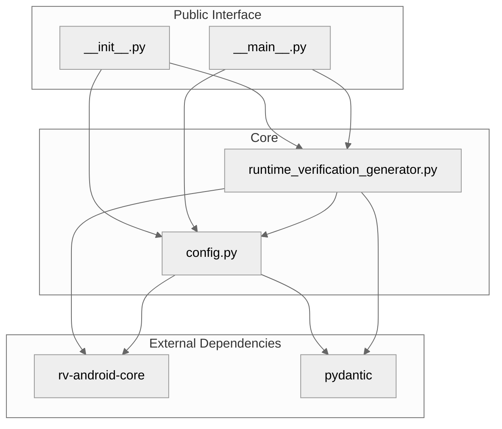
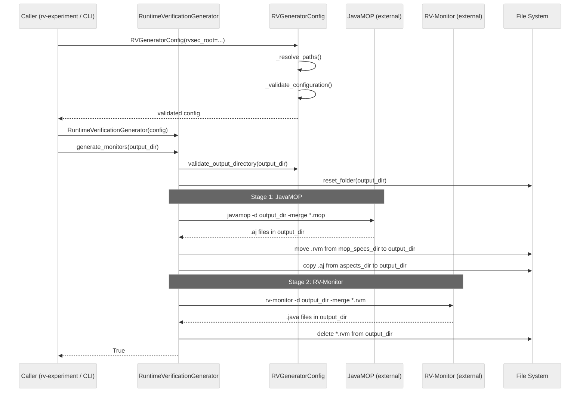
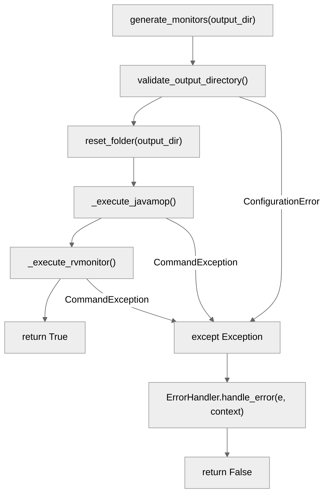
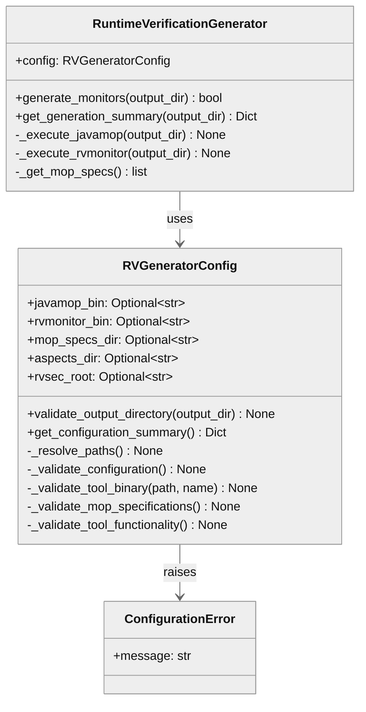

# rv-monitor-generator Architecture

## Overview

rv-monitor-generator transforms Monitoring-Oriented Programming (MOP) specification files into executable runtime verification artifacts -- AspectJ aspects and Java monitor classes. It orchestrates two external tools, JavaMOP and RV-Monitor, in a coordinated pipeline and copies custom aspects (Coverage.aj, logging.aj) into the output. The generated artifacts are consumed by rv-instrumentation, which weaves them into Android APK bytecode for runtime verification.

## Specification Alignment

This module implements requirements from `openspec/specs/instrumentation/spec.md`.

### Functional Requirements

| FR | Description | Architectural Support |
|----|-------------|----------------------|
| FR01 | Monitor generation from JavaMOP specifications | `RuntimeVerificationGenerator.generate_monitors()` orchestrates the JavaMOP -> RV-Monitor pipeline, including the `-d` bug workaround, custom aspect copying, and `.rvm` cleanup |
| FR03 | Specification set support | `RVGeneratorConfig` resolves `mop_specs_dir` to JCA, generic, or custom specification directories; defaults to JCA when only `rvsec_root` is provided |

### Key Invariants

| Invariant | Description | Enforcement Mechanism |
|-----------|-------------|----------------------|
| INV-INS-01 | Generation MUST produce at least one `.aj` and one `.java` file | `generate_monitors()` returns `False` on any pipeline failure; `get_generation_summary()` reports artifact counts |
| INV-INS-02 | `mop_specs_dir` MUST contain at least one `.mop` file | `RVGeneratorConfig._validate_mop_specifications()` raises `ConfigurationError` listing available specification sets |
| INV-INS-03 | `javamop_bin` and `rvmonitor_bin` MUST be existing, executable files that produce output with `-h` | `RVGeneratorConfig._validate_tool_binary()` checks existence and permissions; `_validate_tool_functionality()` runs `-h` and checks for output |
| INV-INS-04 | No `.rvm` files MUST remain in output after generation | `_execute_rvmonitor()` calls `utils.delete_files_by_extension(EXTENSION_RVM, output_dir)` after RV-Monitor completes |
| INV-INS-05 | Custom aspects (Coverage.aj) MUST be copied into the output | `_execute_javamop()` calls `utils.copy_files_by_extension(EXTENSION_AJ, aspects_dir, output_dir)` |
| INV-INS-09 | Specification sets MUST NOT be mixed within a single run | `RVGeneratorConfig` accepts a single `mop_specs_dir`; the upstream `ExperimentConfig.specification_set` field enforces set isolation |
| INV-INS-12 | Missing `RVSEC_HOME` with no explicit paths MUST raise `ConfigurationError` at initialization | `RVGeneratorConfig._resolve_paths()` raises `ConfigurationError` in priority 4 fallback |

### Specification Scenarios

Scenarios from `openspec/specs/instrumentation/spec.md` that validate this architecture:

- **Successful generation with JCA specifications**: Traces through `RVGeneratorConfig` (path resolution + validation) -> `RuntimeVerificationGenerator.generate_monitors()` -> `_execute_javamop()` -> `_execute_rvmonitor()` -> returns `True` with `.aj` and `.java` files present, no `.rvm` remnants
- **Generation with empty specification directory**: Traces through `RVGeneratorConfig._validate_mop_specifications()` raising `ConfigurationError` during `model_post_init`
- **JavaMOP binary not found**: Traces through `RVGeneratorConfig._validate_tool_binary()` raising `ConfigurationError` with descriptive message
- **RV-Monitor execution failure**: Traces through `generate_monitors()` catching `CommandException` in the `except` block, delegating to `ErrorHandler.handle_error()`, returning `False`

## Key Architectural Decisions

### Decision 1: Two-Class Module (Config + Generator)

**Choice**: Separate configuration resolution/validation (`RVGeneratorConfig`) from pipeline execution (`RuntimeVerificationGenerator`).

**Why**: Configuration validation is non-trivial for this module -- it probes external tool binaries by running them with `-h`, scans directories for `.mop` files, and resolves paths through four priority levels. This complexity belongs in a dedicated class so that the generator itself remains focused on pipeline orchestration. The separation also enables testing each concern independently: config tests mock the filesystem, generator tests mock `Command` execution.

### Decision 2: JavaMOP `-d` Bug Workaround

**Choice**: After JavaMOP execution, explicitly move `.rvm` files from `mop_specs_dir` to `output_dir`.

**Why**: JavaMOP's `-d` flag is supposed to place all output in the specified directory, but it only moves `.aj` files -- `.rvm` intermediary files remain in the source `mop_specs_dir`. Rather than patching JavaMOP (Java 8+ dependency), the generator implements a file-move workaround. This is documented in the spec (FR01) and has been stable across JavaMOP versions used in this project.

### Decision 3: `-merge` Flag for Unified Artifacts

**Choice**: Invoke both JavaMOP and RV-Monitor with the `-merge` flag.

**Why**: Without `-merge`, each `.mop` file produces a separate AspectJ aspect. With 23 JCA specifications, this would create 23 individual aspects that each intercept different methods, multiplying the runtime overhead due to separate pointcut matching passes. The `-merge` flag combines all specifications into a single unified aspect that intercepts all methods in one pass, reducing instrumented APK runtime overhead. This is a fundamental design choice inherited from the original RV-Android project by Daian et al.

### Decision 4: Tool Functionality Probing at Config Time

**Choice**: Run `javamop -h` and `rv-monitor -h` during configuration validation to verify the tools are functional.

**Why**: Tool binary existence and executable permissions alone do not guarantee the tool works. Java version mismatches, missing JARs in the tool's `lib/` directory, or corrupted installations can pass basic file checks but fail during actual execution. The `-h` probe catches these failures at config time with a clear error message, rather than mid-pipeline when the cause is harder to diagnose. Both tools may return non-zero exit codes with `-h`, so the validation checks for any output (stdout or stderr) rather than exit code.

### Decision 5: Default to JCA Specification Set

**Choice**: When `mop_specs_dir` is not explicitly provided, default to the JCA specification directory.

**Why**: The JCA (Java Cryptography Architecture) specification set is the primary focus of this research project -- detecting cryptographic API misuses in Android applications. Defaulting to JCA reduces configuration burden for the most common use case while still allowing explicit specification of generic or custom sets.

### Decision 6: Coverage.aj as Custom Aspect

**Choice**: Include `Coverage.aj` as a custom aspect copied alongside generated monitors, rather than generating it from a MOP specification.

**Why**: `Coverage.aj` intercepts all method executions (excluding system packages) and logs unique signatures via `Log.v("RVSEC-COV", signature)`. This broad interception pattern does not follow the state-machine structure of MOP specifications -- it is a simple "log on execution" behavior. Writing it as a standalone `.aj` file is clearer and more maintainable than encoding it as a degenerate MOP specification. The aspect is stored in the `aspects_dir` and copied during the JavaMOP phase.

## Data Flow

### Generation Pipeline Data Flow

The generation pipeline transforms `.mop` specification files through two external tools and a file-copy operation to produce the final monitor artifacts.



### Artifact Consumption Chain

Generated artifacts flow from rv-monitor-generator through rv-instrumentation to the final instrumented APK, and ultimately produce runtime events consumed by rv-coverage and rv-platform.



### Configuration Resolution Flow

Configuration data flows through a four-level priority cascade during `RVGeneratorConfig.model_post_init()`. The process resolves tool binary paths, specification directories, and aspects directory.



## Architectural Patterns

### Pattern: Sequential Pipeline

**Description**: `generate_monitors()` executes a fixed sequence of stages: validate output -> reset directory -> execute JavaMOP -> execute RV-Monitor. Each stage depends on the previous stage's artifacts.

**When Used**: Every invocation of monitor generation. The pipeline is the only execution path.

**Advantages**:
- Simple to reason about; each stage has clear pre/post conditions
- Matches the inherent dependency between JavaMOP output (.rvm files) and RV-Monitor input

**Disadvantages**:
- No parallelism; generation time is the sum of all stage durations
- A failure in any stage aborts the entire pipeline

### Pattern: Priority-Based Configuration Resolution

**Description**: `RVGeneratorConfig._resolve_paths()` checks four configuration sources in priority order: explicit individual paths, explicit `rvsec_root`, `RVSEC_HOME` environment variable, or raises `ConfigurationError`. Each level fills in only the paths not already set.

**When Used**: At `RVGeneratorConfig` initialization (`model_post_init`).

**Advantages**:
- Supports development (env var), CI (explicit root), and testing (individual paths) without code changes
- Fail-fast: all paths are resolved and validated before any generation begins

**Disadvantages**:
- Default to JCA specification set when `mop_specs_dir` is not provided may surprise users expecting an error

### Pattern: Defensive Tool Probing

**Description**: Configuration validation not only checks file existence and permissions, but actively runs each tool binary with `-h` to verify it produces output. This catches Java version mismatches, corrupted installations, and missing classpath dependencies.

**When Used**: During `_validate_tool_functionality()` in the config validation phase.

**Advantages**:
- Catches subtle tool failures that file-level checks would miss
- Provides clear diagnostic messages at config time rather than mid-pipeline

**Disadvantages**:
- Adds latency to initialization (two subprocess calls)
- Tools that legitimately produce no output on `-h` would fail validation

---

## Logical View

### Domain Entities

| Entity | Responsibility |
|--------|----------------|
| `RVGeneratorConfig` | Encapsulates and validates all configuration: tool binary paths, specification directory, aspects directory, and RVSEC root |
| `RuntimeVerificationGenerator` | Orchestrates the generation pipeline: coordinates JavaMOP and RV-Monitor execution, manages file operations |
| `ConfigurationError` | Domain exception for configuration validation failures; inherits from `RVAndroidError` |

### Component Architecture



---

## Development View

### Module Structure

```
rv-monitor-generator/
├── src/
│   └── rv_monitor_generator/
│       ├── __init__.py                        # Public API: RuntimeVerificationGenerator, RVGeneratorConfig, ConfigurationError
│       ├── __main__.py                        # CLI entry point (argparse-based)
│       ├── config.py                          # RVGeneratorConfig, ConfigurationError
│       └── runtime_verification_generator.py  # Core pipeline orchestration
├── tests/
│   ├── test_runtime_verification_generator.py          # Unit tests with mocking
│   └── test_runtime_verification_generator_complete.py # Extended coverage tests
└── pyproject.toml                             # uv workspace member; depends on rv-android-core, pydantic
```

### Package Dependencies



---

## Process View

### Generation Pipeline Execution Flow



### Error Handling During Generation



---

## Core Components

### RuntimeVerificationGenerator

**Purpose**: Orchestrates the monitor generation pipeline, coordinating JavaMOP and RV-Monitor execution with file management operations.

**Location**: `src/rv_monitor_generator/runtime_verification_generator.py`

**Key Methods**:
- `generate_monitors(output_dir: str) -> bool`: Executes the full pipeline; returns `True` on success, `False` on any failure
- `get_generation_summary(output_dir: str) -> Dict`: Returns artifact counts and specification info for the output directory
- `_execute_javamop(output_dir: str)`: Runs JavaMOP with `-merge` flag, moves `.rvm` files (workaround), copies custom aspects
- `_execute_rvmonitor(output_dir: str)`: Runs RV-Monitor with `-merge` flag, deletes intermediate `.rvm` files

**Dependencies**:
- Internal: `RVGeneratorConfig`
- External (rv-android-core): `Command`, `utils`, `ErrorHandler`, `LoggingManager`, `BaseValidatedModel`

### RVGeneratorConfig

**Purpose**: Manages configuration with priority-based path resolution and comprehensive validation. Ensures all tools and directories are available before generation begins.

**Location**: `src/rv_monitor_generator/config.py`

**Key Methods**:
- `model_post_init()`: Triggers path resolution and validation after Pydantic model initialization
- `_resolve_paths()`: Implements the 4-level priority resolution (explicit paths -> rvsec_root -> RVSEC_HOME -> error)
- `_validate_configuration()`: Runs 4 validation phases: binary existence, directory access, specification availability, tool functionality
- `validate_output_directory(output_dir: str)`: Verifies write permissions for the target directory (creates dir, writes test file, deletes test file)
- `get_configuration_summary() -> Dict`: Returns configuration state for logging

**Validation Phases**:
1. Binary existence and executable permissions (`_validate_tool_binary`)
2. Directory existence and accessibility (`_validate_directory`)
3. MOP specification file presence (`_validate_mop_specifications`)
4. Tool functionality probe via `-h` flag (`_validate_tool_functionality`)

**Dependencies**:
- External: `pydantic` (Field, BaseValidatedModel), `subprocess` (tool probing), `rv_android_core.constants`

### CLI (__main__.py)

**Purpose**: Provides a command-line interface for standalone monitor generation via `rv-monitor-generator generate`.

**Location**: `src/rv_monitor_generator/__main__.py`

**Key Points**:
- Uses `argparse` with subcommands (`generate`)
- Maps CLI arguments to `RVGeneratorConfig` fields

---

## NFR Support

How the architecture supports non-functional requirements from `docs/PRD.md` Section 7.

| NFR | PRD ID | Priority | Architectural Support |
|-----|--------|----------|----------------------|
| Modularity | NFR01 | P0 | Standalone uv workspace module with a single dependency (rv-android-core); installable in editable mode via root `uv sync` |
| Configurability | NFR05 | P0 | Priority-based path resolution supporting explicit paths, `rvsec_root`, and `RVSEC_HOME` env var; Pydantic validation at initialization |
| Observability | NFR06 | P1 | Structured logging via `LoggingManager` with component context; `get_configuration_summary()` and `get_generation_summary()` for diagnostic output |
| Compatibility | NFR07 | P1 | Wraps JavaMOP and RV-Monitor (Java 8+); validated at config time via `-h` probe; standard RVSEC directory layout assumed |
| Testability | NFR03 | P1 | Clean separation of config from generator enables unit testing with mocked tools; test fixtures create mock RVSEC directory structures |
| Resilience | NFR04 | P1 | `generate_monitors()` catches all exceptions, delegates to `ErrorHandler`, and returns `False` instead of propagating; `ConfigurationError` provides detailed diagnostic messages |
| Reproducibility | NFR08 | P2 | Deterministic pipeline: same MOP specs + same tool versions produce identical artifacts; `reset_folder()` ensures clean output directory on each run |

---

## Key Interfaces

### RuntimeVerificationGenerator (Public API)

```python
class RuntimeVerificationGenerator(BaseValidatedModel):
    """Orchestrates MOP specification transformation into monitor artifacts."""

    config: RVGeneratorConfig

    def generate_monitors(self, output_dir: str) -> bool:
        """Execute the complete generation pipeline. Returns True on success."""
        ...

    def get_generation_summary(self, output_dir: str) -> Dict[str, Any]:
        """Return artifact counts and spec info for the output directory."""
        ...
```

### RVGeneratorConfig (Configuration)

```python
class RVGeneratorConfig(BaseValidatedModel):
    """Configuration with priority-based path resolution and fail-fast validation."""

    javamop_bin: Optional[str]
    rvmonitor_bin: Optional[str]
    mop_specs_dir: Optional[str]
    aspects_dir: Optional[str]
    rvsec_root: Optional[str]

    def validate_output_directory(self, output_dir: str) -> None:
        """Verify write access to output directory."""
        ...

    def get_configuration_summary(self) -> Dict[str, Any]:
        """Return current configuration state for logging."""
        ...
```

### Class Diagram



---

## Scenarios

### Scenario 1: JCA Monitor Generation via rv-experiment

**Description**: The experiment orchestration system generates JCA monitors during pre-processing.

**Flow**:
1. `PreProcessor._generate_monitors()` calls `ExperimentConfig.get_monitored_operations_config()` with `specification_set="jca"`, producing an `RVGeneratorConfig` with `mop_specs_dir` pointing to the JCA directory
2. `RuntimeVerificationGenerator(config)` initializes, triggering path resolution and validation (binary checks, spec file existence, tool probing)
3. `generate_monitors(output_dir)` resets the output directory, executes JavaMOP (producing `.aj` and `.rvm` files), moves `.rvm` files from `mop_specs_dir` to `output_dir`, copies `Coverage.aj` and `logging.aj`, executes RV-Monitor (producing `.java` monitor classes), and deletes `.rvm` intermediaries
4. The output directory contains merged `.aj` aspects, `.java` monitor classes, and custom aspects -- ready for rv-instrumentation

### Scenario 2: Configuration Failure with Missing RVSEC_HOME

**Description**: A user attempts to generate monitors without configuring any paths.

**Flow**:
1. `RVGeneratorConfig()` is created with all defaults (no explicit paths, no `rvsec_root`)
2. `model_post_init()` calls `_resolve_paths()`
3. Priority 1 (explicit paths) fails: `javamop_bin` and `rvmonitor_bin` are `None`
4. Priority 2 (`rvsec_root`) fails: not provided
5. Priority 3 (`RVSEC_HOME` env var) fails: not set
6. `ConfigurationError` is raised with a message listing all three configuration options
7. No files are created; no external tools are invoked

### Scenario 3: RV-Monitor Execution Failure

**Description**: RV-Monitor fails during `.rvm` file processing due to a malformed specification.

**Flow**:
1. JavaMOP completes successfully, producing `.aj` and `.rvm` files in `output_dir`
2. `_execute_rvmonitor()` runs `rv-monitor -d output_dir -merge *.rvm`
3. RV-Monitor returns non-zero exit code; `utils.execute_command()` raises `CommandException`
4. The exception propagates to the `except` block in `generate_monitors()`
5. `ErrorHandler.handle_error(e, context)` logs the error with component, operation, output_dir, and mop_specs_dir
6. `generate_monitors()` returns `False`
7. Note: `.rvm` files remain in `output_dir` because the cleanup step was not reached

---

## Extension Points

- **Specification sets**: Add new MOP specification directories under `$RVSEC_HOME/rvsec/rvsec-mop/src/main/resources/` and point `mop_specs_dir` to them
- **Custom aspects**: Add `.aj` files to the `aspects_dir` directory; they are automatically copied into the output during JavaMOP execution
- **Tool replacement**: Replace JavaMOP or RV-Monitor paths via explicit configuration without code changes

## Dependencies

### Internal (rv-android modules)

| Module | Purpose |
|--------|---------|
| rv-android-core | `Command` for external process execution, `utils` for file operations, `ErrorHandler` for error management, `LoggingManager` for structured logging, `BaseValidatedModel` for Pydantic base class, `constants` for file extensions and environment variable names |

### External

| Package | Version | Purpose |
|---------|---------|---------|
| pydantic | >=2.9.0 | Configuration validation, field descriptors, model lifecycle hooks |
| subprocess (stdlib) | -- | Tool functionality probing (`-h` flag) during configuration validation |
| glob (stdlib) | -- | MOP specification file discovery |

### External Tools (not Python packages)

| Tool | Version Constraint | Purpose |
|------|-------------------|---------|
| JavaMOP | Java 8+ | Process `.mop` files, generate `.aj` aspects and `.rvm` intermediaries |
| RV-Monitor | Java 8+ | Transform `.rvm` files into `.java` monitor classes |

## Testing Strategy

| Type | Location | Purpose |
|------|----------|---------|
| Unit | `tests/test_runtime_verification_generator.py` | Isolated tests with mocked RVSEC directory structure and tool binaries |
| Unit (extended) | `tests/test_runtime_verification_generator_complete.py` | Extended coverage tests for edge cases |
| Integration | Marked with `@pytest.mark.slow` | End-to-end tests requiring a real RVSEC installation; skipped if RVSEC not found |

## Related Documentation

- [Instrumentation Domain Spec](../../openspec/specs/instrumentation/spec.md) - Requirements and invariants for rv-monitor-generator and rv-instrumentation
- [PRD](../../docs/PRD.md) - Product Requirements Document (FR01-37, NFR01-08)
- [CLAUDE.md](../../CLAUDE.md) - Project-level reference for Claude Code
- [Module CLAUDE.md](../CLAUDE.md) - Module-specific reference for rv-monitor-generator
