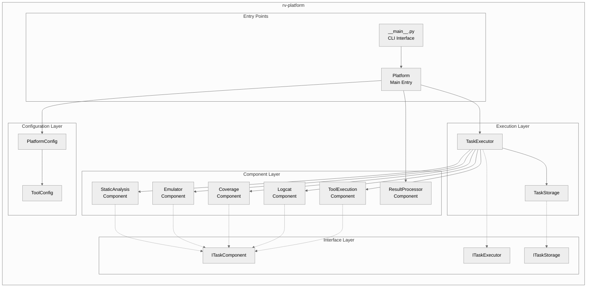
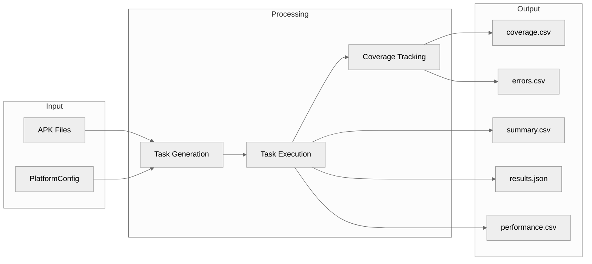
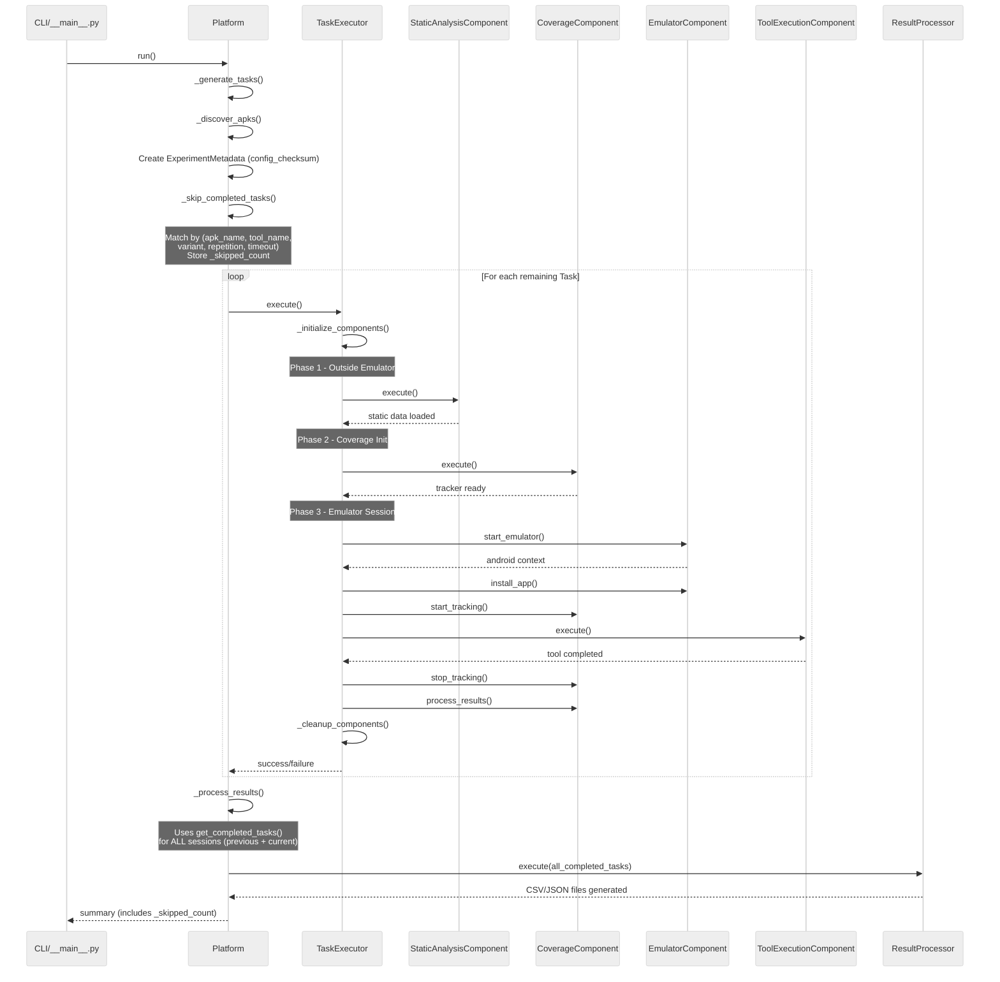
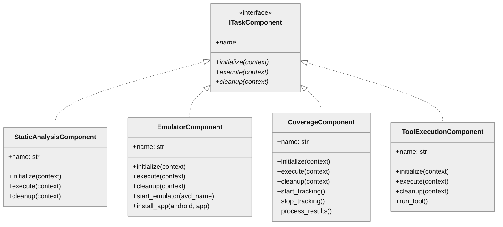
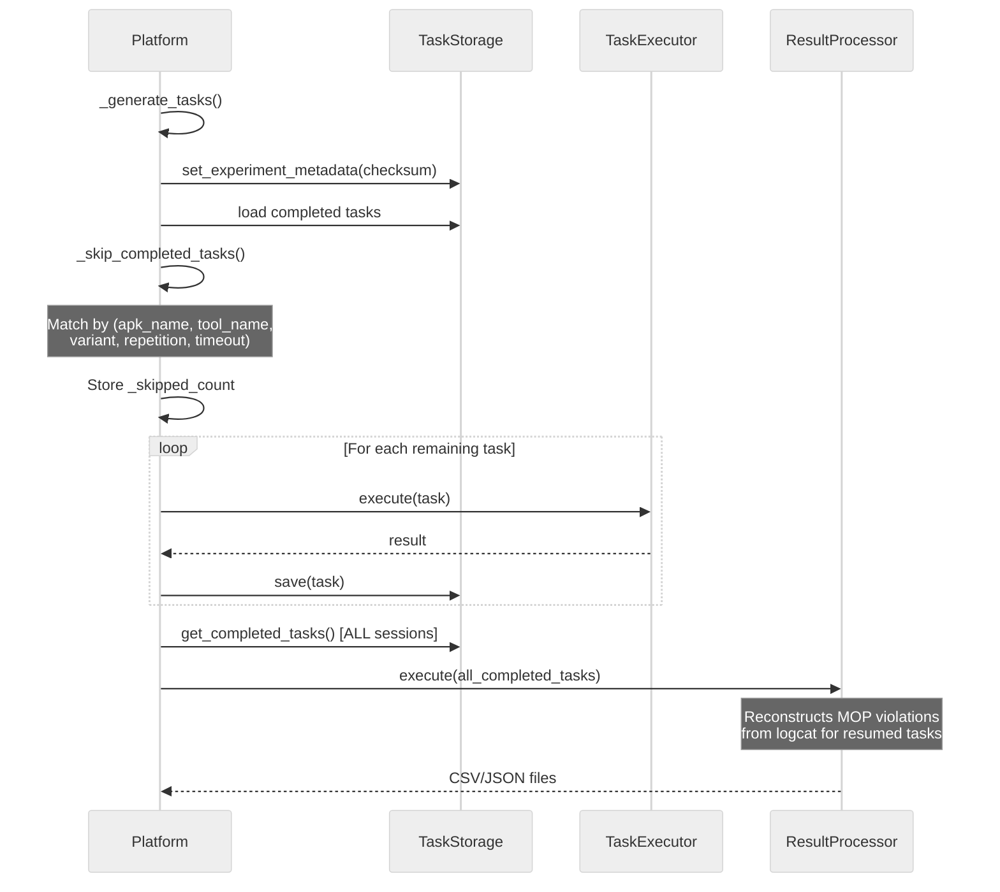

# rv-platform Architecture

## Overview

rv-platform is the central execution engine for Android testing experiments in the RV-Android framework. It orchestrates task generation from APK discovery, manages task execution through a component-based architecture, coordinates emulator lifecycle and tool execution, and processes results into standardized CSV/JSON output files. The platform provides a clean separation between experiment orchestration (rv-experiment) and the actual task execution mechanics, enabling both standalone usage via CLI and integration as a service within larger experiment workflows.

## Design Principles

- **Component-Based Execution**: TaskExecutor uses pluggable components with standardized lifecycle (initialize/execute/cleanup)
- **Event-Driven Communication**: EventBus integration for publishing task lifecycle events and enabling external monitoring
- **Coordinated Execution Phases**: Components execute in specific phases to ensure proper resource management
- **Persistent Storage**: Atomic file operations with transaction support for experiment continuation
- **Configuration Validation**: Pydantic models with comprehensive field validators for configuration integrity
- **Error Handler Integration**: Consistent error management across all components using decorator patterns

## Component Architecture



## Core Components

### Platform

**Purpose**: Main entry point that orchestrates task generation and execution coordination.

**Location**: `src/rv_platform/platform.py`

**Key Classes**:
- `Platform`: Discovers APKs, generates tasks, coordinates execution, and processes results

**Responsibilities**:
- APK discovery from configured directory
- Task generation for each APK/tool/variant/repetition/timeout combination
- Task execution coordination through TaskExecutor
- Result aggregation and summary generation

**Dependencies**:
- Internal: TaskExecutor, TaskStorage, all component classes
- External: rv-android-core (domain models, EventBus), rv-tools (ToolFactory)

### TaskExecutor

**Purpose**: Manages task lifecycle with component-based execution and comprehensive error handling.

**Location**: `src/rv_platform/execution/executor.py`

**Key Classes**:
- `TaskExecutor`: Coordinates component execution with proper lifecycle management

**Responsibilities**:
- Component registration and lifecycle management
- Coordinated phase execution (static analysis, coverage, emulator session)
- Performance monitoring and metrics collection
- Event publication for task lifecycle states
- Pre/post execution hooks for extensibility

**Dependencies**:
- Internal: All ITaskComponent implementations
- External: rv-android-core (EventBus, ErrorHandler)

### TaskStorage

**Purpose**: Persistent task storage with atomic operations and transaction support.

**Location**: `src/rv_platform/storage/task_storage.py`

**Key Classes**:
- `TaskStorage`: Thread-safe storage with transaction support
- `ExperimentMetadata`: Minimal runtime metadata for continuation
- `ExperimentStatistics`: Calculated statistics from task data
- `StorageConfig`: Storage behavior configuration

**Responsibilities**:
- Atomic file operations for data integrity
- Transaction support for multi-step operations
- Experiment continuation via config checksum validation
- Task querying and filtering by state

**Dependencies**:
- Internal: ITaskStorage interface
- External: rv-android-core (Task, TaskFactory, TaskState)

### EmulatorComponent

**Purpose**: Manages emulator lifecycle, app installation, and dynamic port allocation.

**Location**: `src/rv_platform/components/emulator.py`

**Key Classes**:
- `EmulatorComponent`: Emulator lifecycle management

**Responsibilities**:
- Emulator startup with context manager pattern
- Dynamic port allocation for parallel execution
- App installation on target device
- Logcat buffer management

**Dependencies**:
- External: rv-android-core (EmulatorManager, App)

### CoverageComponent

**Purpose**: Coverage tracker initialization and result processing.

**Location**: `src/rv_platform/components/coverage.py`

**Key Classes**:
- `CoverageComponent`: Coverage tracking lifecycle

**Responsibilities**:
- CoverageTracker initialization and configuration
- Real-time coverage tracking during tool execution
- Post-execution coverage data processing
- Repository population with method calls and errors

**Dependencies**:
- External: rv-coverage (CoverageTracker, logcat_parser), rv-android-core (LogcatRepository)

### ToolExecutionComponent

**Purpose**: Tool invocation and result processing.

**Location**: `src/rv_platform/components/tool_execution.py`

**Key Classes**:
- `ToolExecutionComponent`: Tool execution management

**Responsibilities**:
- Tool invocation through AbstractTool interface
- Event publication for tool lifecycle
- Timeout handling (considered successful completion)
- Process cleanup after execution

**Dependencies**:
- External: rv-android-core (AbstractTool)

### ResultProcessorComponent

**Purpose**: Generates CSV/JSON output files from completed experiment tasks.

**Location**: `src/rv_platform/components/result_processor.py`

**Key Classes**:
- `ResultProcessorComponent`: Result file generation

**Responsibilities**:
- Per-method coverage data extraction (coverage.csv)
- Monitored operations violations formatting (errors.csv)
- Aggregate metrics calculation (summary.csv)
- Hierarchical JSON generation (results.json)
- Performance metrics generation (performance.csv)

**Dependencies**:
- External: rv-android-core (Task, TaskState)

### PlatformConfig

**Purpose**: Configuration schema with Pydantic validation.

**Location**: `src/rv_platform/config/platform_config.py`

**Key Classes**:
- `PlatformConfig`: Main configuration schema
- `ToolConfig`: Tool-specific configuration

**Responsibilities**:
- Configuration validation with comprehensive field validators
- File-based configuration loading and saving
- Total task count calculation
- Dependency validation (APK files, tools)

**Dependencies**:
- External: rv-android-core (BaseValidatedModel)

## Data Flow



## Execution Flow



## Key Interfaces

### ITaskComponent

```python
class ITaskComponent(ABC):
    """Interface for task execution components."""

    @abstractmethod
    def initialize(self, context: Dict[str, Any]) -> bool:
        """Initialize the component with task-specific context."""
        pass

    @abstractmethod
    def execute(self, context: Dict[str, Any]) -> bool:
        """Execute the component's primary function."""
        pass

    @abstractmethod
    def cleanup(self, context: Dict[str, Any]) -> bool:
        """Clean up any resources used by the component."""
        pass

    @property
    @abstractmethod
    def name(self) -> str:
        """Get the component name."""
        pass
```



### ITaskStorage

```python
class ITaskStorage(ABC):
    """Interface for task storage providers."""

    @abstractmethod
    def load(self) -> bool:
        """Load tasks from storage."""
        pass

    @abstractmethod
    def save(self) -> bool:
        """Save tasks to storage."""
        pass

    @abstractmethod
    def add_task(self, task: Any) -> None:
        """Add a task to storage."""
        pass

    @abstractmethod
    def update_task(self, task: Any) -> None:
        """Update a task in storage."""
        pass

    @abstractmethod
    def get_task(self, task_id: str) -> Optional[Any]:
        """Get a task by ID."""
        pass

    @abstractmethod
    def get_pending_tasks(self) -> List[Any]:
        """Get tasks that are not yet completed."""
        pass
```

## Experiment Resume

The platform supports resuming interrupted or expanding completed experiments through `TaskStorage`-backed persistence.

### Resume Flow



### MOP Violation Reconstruction

Tasks loaded from `tasks.json` have `repository=None` because the in-memory `LogcatRepository` is not serialized. During `_process_results()`, `ResultProcessorComponent` detects this condition and reconstructs violation data by calling `parse_logcat_file(task.result.logcat_file)` from rv-coverage. This function parses the persisted logcat file and returns a `LogcatRepository` containing all `RVSEC` log entries (MOP violations).

The reconstruction is used in three result-generation methods:

- **`_write_task_error_data()`**: If `task.repository` is None, reconstructs a `LogcatRepository` from the logcat file. The reconstructed violations are written as rows in `errors.csv`.
- **`_extract_task_data()`**: Same reconstruction logic. Violation details are included in the hierarchical `results.json` output.
- **`_write_task_coverage_data()`**: Per-method coverage data **cannot** be reconstructed from logcat because `register_method_call()` requires static analysis class data (the list of classes belonging to the application). For tasks loaded from `tasks.json`, this method writes a single summary row using `task.result.coverage_metrics` instead of per-method rows.

## Extension Points

- **Custom Components**: Implement ITaskComponent interface to add new execution phases
- **Tool Integration**: Implement AbstractTool from rv-tools to add new testing tools
- **Storage Backends**: Implement ITaskStorage for alternative storage mechanisms
- **Pre/Post Hooks**: Register callbacks via TaskExecutor.add_pre_execution_hook() and add_post_execution_hook()
- **Event Handlers**: Subscribe to EventBus channels for custom monitoring and integration

## Dependencies

### Internal (rv-android modules)

| Module | Purpose |
|--------|---------|
| rv-android-core | Domain models (Task, App), EventBus, ErrorHandler, LoggingManager |
| rv-tools | ToolFactory, ToolRegistry for tool creation and discovery |
| rv-coverage | CoverageTracker, logcat_parser for coverage analysis |
| rv-static-analysis | static_analysis_parser for loading GATOR/GESDA/REACH data |

### External

| Package | Version | Purpose |
|---------|---------|---------|
| pydantic | ^2.9.0 | Configuration validation and serialization |
| pandas | ^2.3.1 | Data processing support |

## Testing Strategy

| Type | Location | Purpose |
|------|----------|---------|
| Unit | tests/config/ | PlatformConfig validation tests |
| Unit | tests/execution/ | TaskExecutor logic tests |
| Unit | tests/execution/test_resume.py | Resume and result consolidation tests (U1-U10, U15-U17) |
| Unit | tests/components/ | Individual component tests |
| Manual | tests/manual_tests/ | Debug scripts for development |

```bash
# Run all tests
PYTHONPATH=../rv-android-core/src:../rv-tools/src:src poetry run pytest tests/ -v

# Run specific category
poetry run pytest tests/execution/ -v
poetry run pytest tests/components/ -v
```

## Output Files

| File | Description |
|------|-------------|
| coverage.csv | Per-method coverage data with timing and progressive metrics |
| errors.csv | Monitored operations violations with timing and context |
| summary.csv | Aggregate metrics per task (activities, methods, MOP coverage, errors) |
| results.json | Hierarchical JSON with complete experiment data |
| performance.csv | Task execution timing and performance metrics |
| tasks.json | Task state persistence for experiment continuation (includes ExperimentMetadata with config_checksum and per-task coverage_metrics) |

## Related Documentation

- [CLAUDE.md](../CLAUDE.md) - Quick reference for Claude Code
- [rv-android-core](../../rv-android-core/docs/architecture.md) - Core infrastructure documentation
- [rv-tools](../../rv-tools/docs/architecture.md) - Tool plugin system documentation
