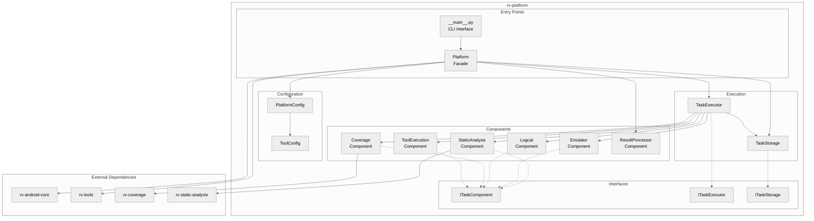
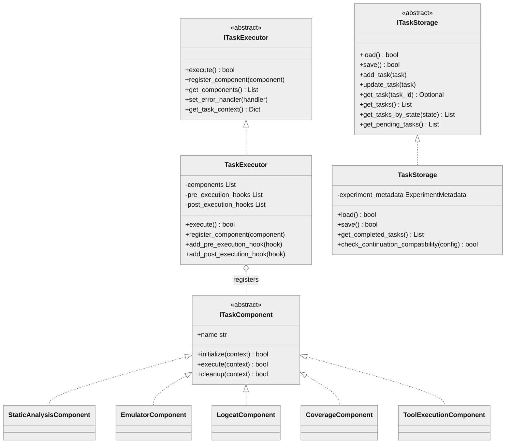
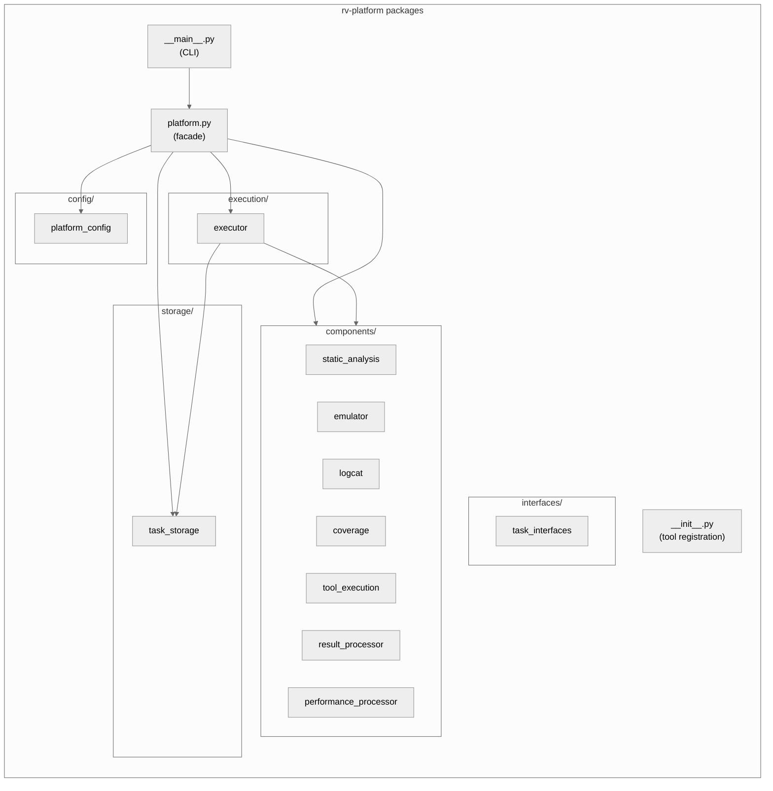
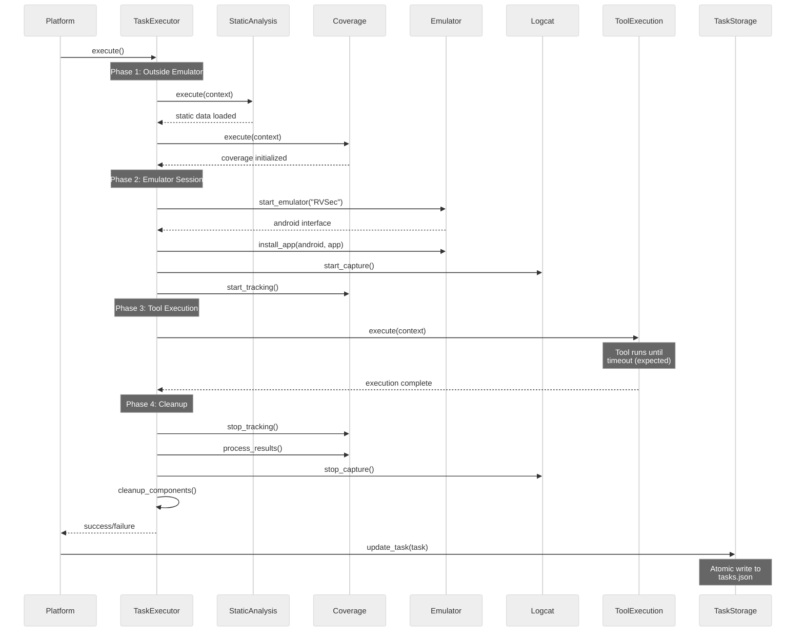
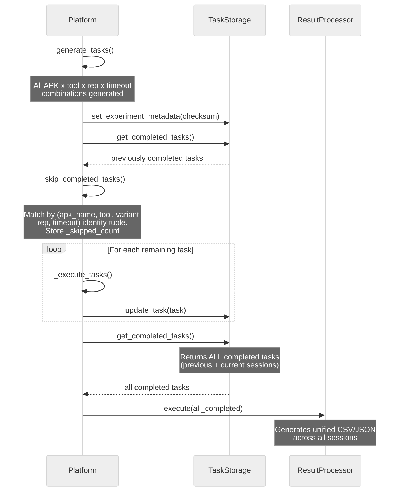
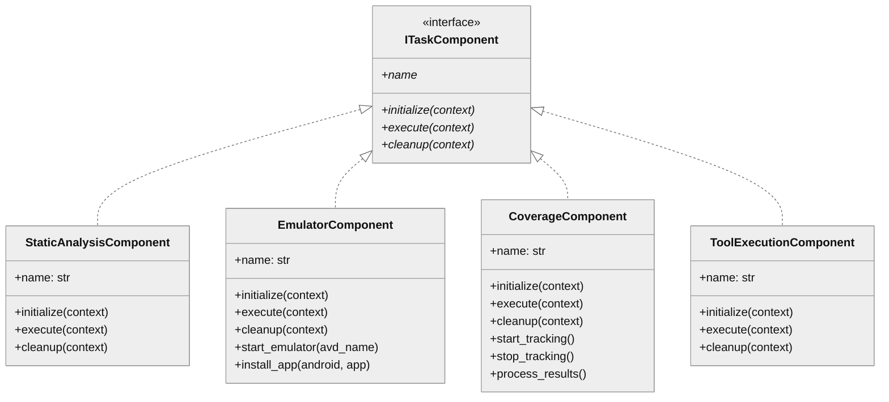

# rv-platform Architecture

## Overview

rv-platform is the central execution engine for Android testing experiments in the RV-Android framework. It orchestrates the full lifecycle of experiment tasks: discovering APK files, generating task combinations (APK x tool x variant x repetition x timeout), executing each task through a component-based pipeline that coordinates emulator lifecycle, coverage tracking, and tool invocation, and producing standardized CSV/JSON output for analysis. The module serves as the bridge between experiment orchestration (rv-experiment) and the mechanics of running tools against Android applications, supporting both standalone CLI usage and programmatic integration.

## Key Architectural Decisions

| Decision | Choice | Rationale |
|----------|--------|-----------|
| Application Type | CLI tool + Library | Supports both standalone execution via CLI and programmatic use by rv-experiment |
| Structuring | Layered with components | Separates orchestration (Platform), execution coordination (TaskExecutor), and specialized concerns (components) |
| Primary Pattern | Component-Based Architecture | Each execution concern (emulator, coverage, logcat, static analysis, tool invocation) is an independent component with a uniform lifecycle |
| Control Strategy | Call-based, sequential | Platform drives task execution sequentially; TaskExecutor coordinates components in a fixed phase order |
| Persistence | File-based JSON with atomic writes | TaskStorage uses atomic file operations for crash recovery and experiment resume without requiring a database |
| Configuration | Pydantic validation | PlatformConfig validates all parameters at construction time, before any execution begins |
| Tool Loading | Lazy registry with try/except | External tools (rvagent, rvsmart, aperv) register on import with graceful fallback if unavailable |

## Architectural Patterns

### Pattern: Component-Based Execution

**Description**: TaskExecutor registers pluggable components that each handle a specific execution concern. Components follow a three-phase lifecycle: `initialize()`, `execute()`, and `cleanup()`. The executor coordinates these phases in a fixed order, managing the emulator session boundary.

**Application**: Five component types exist: `StaticAnalysisComponent`, `EmulatorComponent`, `LogcatComponent`, `CoverageComponent`, and `ToolExecutionComponent`. The executor dispatches them in phases: static analysis and coverage initialization run outside the emulator session, while logcat, coverage tracking, and tool execution run inside the emulator context.

**When Used**: Every task execution uses this pattern. The fixed component set and phase ordering ensure consistent behavior across all tools.

**Advantages**:
- Each concern is isolated in its own component with clear boundaries
- Component lifecycle (initialize/execute/cleanup) provides consistent resource management
- Pre/post execution hooks enable extension without modifying core logic

**Disadvantages**:
- The executor uses `isinstance` checks to identify component types, coupling it to concrete classes rather than the `ITaskComponent` interface
- Component ordering is hardcoded in `_execute_coordinated_components`, not configurable

### Pattern: Facade

**Description**: The `Platform` class provides a single `run()` entry point that hides the internal complexity of task generation, resume logic, execution coordination, and result processing.

**Application**: Both CLI and rv-experiment call `Platform(config).run()`. The method returns a summary dictionary. All internal orchestration is invisible to callers.

**When Used**: All entry points to the platform use this pattern.

**Advantages**:
- Callers need only `PlatformConfig` and `Platform.run()` to execute experiments
- Internal restructuring does not affect the external interface

**Disadvantages**:
- Limited control over individual phases from outside (e.g., cannot skip task generation programmatically beyond config flags)

### Pattern: Factory + Registry

**Description**: `ToolFactory` creates configured tool instances from `ToolConfig` specifications. `ToolRegistry` maintains a catalog of available tools. External tools register themselves lazily on module import.

**Application**: `rv_platform/__init__.py` registers external tools (rvagent, rvsmart, aperv) into the shared `ToolRegistry` via try/except imports. During task execution, `Platform._load_tool()` uses `ToolFactory.create_tool(tool_config)` to instantiate the appropriate tool.

**When Used**: Tool instantiation happens once per task in `_execute_tasks()`.

**Advantages**:
- New tools can be added without modifying platform code
- Variant resolution and parameter merging are centralized in the factory

**Disadvantages**:
- Lazy import registration in `__init__.py` creates an inverted layer dependency (L4 importing L5 tools)

---

## Logical View

### Domain Entities

| Entity | Responsibility |
|--------|----------------|
| `Platform` | Facade that orchestrates the full experiment workflow |
| `TaskExecutor` | Coordinates component lifecycle for a single task |
| `PlatformConfig` | Validated configuration schema for platform execution |
| `TaskStorage` | Persistent task state with atomic writes and resume support |
| `ExperimentMetadata` | Config checksum and metadata for experiment continuation |
| `ITaskComponent` | ABC defining the component lifecycle contract (initialize/execute/cleanup) |
| `ITaskExecutor` | ABC defining the task executor contract |
| `ITaskStorage` | ABC defining the task persistence contract |
| `ResultProcessorComponent` | Generates CSV/JSON output from completed tasks |

### Component Architecture



### Entity Relationships



---

## Development View

### Module Structure

```
modules/rv-platform/
├── src/rv_platform/
│   ├── __init__.py              # External tool registration (rvagent, rvsmart, aperv)
│   ├── __main__.py              # CLI entry point (run, list-tools, validate-config)
│   ├── platform.py              # Platform facade — task generation, execution, results
│   ├── config/
│   │   └── platform_config.py   # PlatformConfig (Pydantic model)
│   ├── execution/
│   │   └── executor.py          # TaskExecutor — component coordination
│   ├── components/
│   │   ├── coverage.py          # Coverage tracker lifecycle
│   │   ├── emulator.py          # Emulator startup, app install, port allocation
│   │   ├── logcat.py            # Logcat capture and filtering
│   │   ├── performance_processor.py  # Timing CSV generation
│   │   ├── result_processor.py  # CSV/JSON result generation
│   │   ├── static_analysis.py   # Static analysis data loading
│   │   └── tool_execution.py    # Tool invocation wrapper
│   ├── interfaces/
│   │   └── task_interfaces.py   # ITaskComponent, ITaskExecutor, ITaskStorage (ABCs)
│   └── storage/
│       └── task_storage.py      # Persistent storage with transactions
├── tests/
│   ├── components/
│   │   └── test_tool_execution.py
│   ├── config/
│   │   └── test_platform_config.py
│   ├── execution/
│   │   ├── test_executor.py
│   │   └── test_resume.py
│   └── manual_tests/
│       └── debug_executor.py
└── pyproject.toml
```

### Package Dependencies



### Build Dependencies

| Dependency | Type | Purpose |
|------------|------|---------|
| rv-android-core | Internal (workspace) | Domain models (Task, App, ToolConfig, TaskState), ErrorHandler, LoggingManager |
| rv-tools | Internal (workspace) | ToolFactory, ToolRegistry for tool creation and discovery |
| rv-coverage | Internal (workspace) | CoverageTracker, logcat_parser for coverage analysis |
| rv-static-analysis | Internal (workspace) | StaticAnalysisParser for loading GATOR analysis data |
| rvagent-tool | Internal (workspace) | RVAgentTool (registered lazily on import) |
| pydantic | External (>=2.9.0) | Configuration validation and serialization |
| pandas | External (>=2.3.1) | Data processing for result generation |

---

## Process View

rv-platform executes tasks sequentially (one task at a time). The primary concurrency boundary is between the host machine (Python orchestration) and the Android emulator (app execution). Within a single task, the process view captures how components coordinate around the emulator session.

### Task Execution Flow



### Experiment Resume Flow



---

## Core Components

### Platform

**Purpose**: Facade that provides the `run()` entry point for experiment execution. Handles APK discovery, task generation, resume logic, execution dispatch, and result processing.

**Location**: `src/rv_platform/platform.py`

**Key Classes**:
- `Platform`: Discovers APKs, generates tasks, coordinates execution, processes results

**Key Responsibilities**:
- Discovers APK files in the configured directory (with optional filter file)
- Generates task combinations from APKs, tools, repetitions, and timeouts
- Skips previously completed tasks by matching identity tuples against TaskStorage
- Dispatches each task to a fresh TaskExecutor with registered components
- Triggers result processing via ResultProcessorComponent after all tasks complete

**Dependencies**:
- Internal: TaskExecutor, TaskStorage, PlatformConfig, all components, ToolFactory
- External: rv-android-core (Task, App, TaskFactory, ErrorHandler)

### TaskExecutor

**Purpose**: Coordinates the component lifecycle for a single task execution. Manages the phased ordering of components and the emulator session boundary.

**Location**: `src/rv_platform/execution/executor.py`

**Key Classes**:
- `TaskExecutor`: Coordinates component execution with lifecycle management

**Key Responsibilities**:
- Maintains a component registry and executes components in three phases
- Manages the emulator session as a context manager (Phase 2-3)
- Handles pre/post execution hooks for extensibility
- Performs cleanup of all components on both success and failure paths

**Dependencies**:
- Internal: All five component types (by concrete class), TaskStorage
- External: rv-android-core (Task, TaskState, AbstractTool, ErrorHandler)

### TaskStorage

**Purpose**: Persistent task state with atomic file operations, enabling experiment resume and crash recovery.

**Location**: `src/rv_platform/storage/task_storage.py`

**Key Classes**:
- `TaskStorage`: Thread-safe storage with transaction support
- `ExperimentMetadata`: Minimal runtime metadata for continuation
- `ExperimentStatistics`: Calculated statistics from task data

**Key Responsibilities**:
- Persists task state to `tasks.json` with atomic writes (write-to-temp then rename)
- Stores `ExperimentMetadata` with config checksum for continuation compatibility checks
- Provides filtering by task state (completed, pending, error)
- Preserves `coverage_metrics` in serialized form for resume reconstruction

**Dependencies**:
- External: rv-android-core (Task, TaskFactory, TaskState)

### PlatformConfig

**Purpose**: Validated configuration schema for platform execution parameters.

**Location**: `src/rv_platform/config/platform_config.py`

**Key Classes**:
- `PlatformConfig`: Pydantic model with field validators

**Key Responsibilities**:
- Validates all configuration fields at construction time via Pydantic field validators
- Supports loading from and saving to JSON files
- Calculates total expected task count from configuration
- Validates that the APKs directory exists and contains APK files

**Dependencies**:
- External: rv-android-core (ToolConfig, BaseValidatedModel), pydantic

### ResultProcessorComponent

**Purpose**: Generates standardized CSV/JSON output files from completed tasks.

**Location**: `src/rv_platform/components/result_processor.py`

**Key Responsibilities**:
- Produces `coverage.csv`, `errors.csv`, `summary.csv`, `results.json`, and `performance.csv`
- Reconstructs MOP violation data from persisted logcat files for resumed tasks (since in-memory `LogcatRepository` is not serialized)
- Falls back to serialized `coverage_metrics` when per-method coverage data cannot be reconstructed

**Dependencies**:
- External: rv-coverage (logcat_parser), pandas

### EmulatorComponent

**Purpose**: Manages Android emulator lifecycle including startup, app installation, and port allocation.

**Location**: `src/rv_platform/components/emulator.py`

**Key Responsibilities**:
- Emulator startup with context manager pattern for proper resource cleanup
- Dynamic port allocation for parallel execution scenarios
- App installation on target device, raising `EmulatorError` on failure

**Dependencies**:
- External: rv-android-core (EmulatorManager, App)

### CoverageComponent

**Purpose**: Coverage tracker initialization and result processing.

**Location**: `src/rv_platform/components/coverage.py`

**Key Responsibilities**:
- CoverageTracker initialization and configuration
- Real-time coverage tracking during tool execution via `RVSEC-COV` logcat entries
- Post-execution coverage data processing

**Dependencies**:
- External: rv-coverage (CoverageTracker, logcat_parser)

### ToolExecutionComponent

**Purpose**: Tool invocation and result processing.

**Location**: `src/rv_platform/components/tool_execution.py`

**Key Responsibilities**:
- Tool invocation through AbstractTool interface
- Timeout handling (tool timeouts are treated as successful completion)
- Process cleanup after execution

**Dependencies**:
- External: rv-android-core (AbstractTool)

---

## NFR Support

| NFR | Priority | Architectural Support |
|-----|----------|----------------------|
| Reliability | P0 | Atomic task persistence via TaskStorage ensures no data loss on crashes. Each task is saved immediately after completion. Experiment resume reconstructs state from `tasks.json`. |
| Maintainability | P0 | Component-based architecture isolates concerns. Each component is self-contained with a clear lifecycle. Adding a new component requires implementing the three-phase contract (initialize/execute/cleanup). |
| Extensibility | P1 | Tool plugin system via ToolRegistry/ToolFactory allows new tools without platform changes. Pre/post execution hooks on TaskExecutor enable monitoring integration. |
| Performance | P1 | Static analysis and coverage initialization run outside the emulator session (Phase 1-2), reducing emulator uptime per task. Sequential execution avoids resource contention on single-machine setups. |
| Reproducibility | P1 | PlatformConfig captures all parameters. ExperimentMetadata stores config checksum. Deterministic task generation from configuration ensures identical task sets across runs. |

---

## Key Interfaces

### ITaskComponent

```python
class ITaskComponent(ABC):
    """Contract for task execution components."""

    @abstractmethod
    def initialize(self, context: Dict[str, Any]) -> bool: ...

    @abstractmethod
    def execute(self, context: Dict[str, Any]) -> bool: ...

    @abstractmethod
    def cleanup(self, context: Dict[str, Any]) -> bool: ...

    @property
    @abstractmethod
    def name(self) -> str: ...
```

The `ITaskComponent` interface defines the lifecycle contract that all execution components follow. The `context` dictionary carries task-specific data (task_id, apk_name, tool_name, repetition, timeout) and is enriched during execution with runtime data (android interface, device_id).



### ITaskStorage

```python
class ITaskStorage(ABC):
    """Contract for task persistence providers."""

    @abstractmethod
    def load(self) -> bool: ...

    @abstractmethod
    def save(self) -> bool: ...

    @abstractmethod
    def add_task(self, task: Any) -> None: ...

    @abstractmethod
    def update_task(self, task: Any) -> None: ...

    @abstractmethod
    def get_task(self, task_id: str) -> Optional[Any]: ...

    @abstractmethod
    def get_tasks_by_state(self, state: 'TaskState') -> List[Any]: ...

    @abstractmethod
    def get_pending_tasks(self) -> List[Any]: ...
```

---

## Scenarios

### Scenario 1: Execute Experiment with Resume

**Description**: A user runs an experiment that is interrupted after completing 5 of 10 tasks. The user re-runs the same command to complete the remaining tasks.

**Flow**:
1. User runs `rv-platform run --tools monkey --apks-dir ./apks --repetitions 2`
2. Platform generates 10 tasks (5 APKs x 1 tool x 2 repetitions)
3. TaskStorage loads `tasks.json` from the results directory
4. `_skip_completed_tasks()` finds 5 completed tasks matching by identity tuple `(apk_name, tool_name, variant, repetition, timeout)` and removes them from the execution list, storing `_skipped_count = 5`
5. Platform executes the remaining 5 tasks, saving each atomically to TaskStorage
6. `_process_results()` calls `task_storage.get_completed_tasks()` to retrieve all 10 completed tasks (5 from previous + 5 from current session)
7. ResultProcessorComponent generates unified CSV/JSON covering all 10 tasks
8. Summary reports 5 executed + 5 skipped

### Scenario 2: Task Execution with Coverage Tracking

**Description**: A single task executes with full coverage tracking, producing per-method coverage data.

**Flow**:
1. TaskExecutor initializes all registered components
2. Phase 1: StaticAnalysisComponent loads GATOR analysis data (reachable methods, WTG) from the APKs directory
3. Phase 2: CoverageComponent initializes the coverage tracker with static analysis data as the coverage denominator
4. Phase 3: EmulatorComponent starts the emulator and installs the APK
5. LogcatComponent begins capturing device logs
6. CoverageComponent starts tracking `RVSEC-COV` log entries
7. ToolExecutionComponent invokes the tool (e.g., monkey), which runs until timeout
8. CoverageComponent stops tracking and processes results (per-method coverage metrics)
9. LogcatComponent stops capture and saves the logcat file
10. All components clean up; task is marked COMPLETED

### Scenario 3: Tool Timeout (Expected Behavior)

**Description**: A tool execution exceeds its configured timeout. Timeouts are treated as successful completion because tools are expected to run for the full allocated time.

**Flow**:
1. ToolExecutionComponent invokes the tool with configured timeout
2. Tool raises `RVToolTimeoutError` after the timeout period
3. Platform's `_extract_meaningful_error_message()` recognizes `RVToolTimeoutError` and produces a message: `"tool_name execution timed out after N seconds (expected behavior)"`
4. The error message is stored in the task result, but the task is recorded with its collected coverage data
5. Execution continues to the next task

### Scenario 4: MOP Violation Reconstruction on Resume

**Description**: During result processing after a resumed experiment, tasks loaded from `tasks.json` lack the in-memory `LogcatRepository` (it is not serialized). The result processor reconstructs violation data from persisted logcat files.

**Flow**:
1. `_process_results()` retrieves all completed tasks from TaskStorage
2. For each resumed task, `task.repository` is `None`
3. `_write_task_error_data()` detects the missing repository and calls `parse_logcat_file(task.result.logcat_file)` from rv-coverage to reconstruct a `LogcatRepository`
4. Reconstructed violations are written to `errors.csv`
5. `_write_task_coverage_data()` cannot reconstruct per-method data (requires static analysis class list), so it writes a single summary row using `task.result.coverage_metrics` from `tasks.json`

---

## Extension Points

- **New Tools**: Register a new tool class in `ToolRegistry` (either in `__init__.py` or via the tool's own module). The tool must extend `AbstractTool` from rv-android-core. No platform code changes required.
- **Custom Components**: Implement `ITaskComponent` to add new execution phases. Register via `TaskExecutor.register_component()`.
- **Storage Backends**: Implement `ITaskStorage` for alternative storage mechanisms (database, cloud storage).
- **Execution Hooks**: Use `TaskExecutor.add_pre_execution_hook()` and `add_post_execution_hook()` to inject custom logic before/after task execution.
- **Configuration**: `PlatformConfig` accepts additional parameters through Pydantic field definitions. New fields with defaults maintain backward compatibility with existing config files.

## Dependencies

### Internal (rv-android modules)

| Module | Layer | Purpose |
|--------|-------|---------|
| rv-android-core | L1 | Domain models (Task, App, ToolConfig, TaskState), ErrorHandler, LoggingManager |
| rv-tools | L2 | ToolFactory, ToolRegistry for tool creation and discovery |
| rv-coverage | L3 | CoverageTracker, logcat_parser for coverage analysis |
| rv-static-analysis | L3 | StaticAnalysisParser for loading GATOR analysis data |
| rvagent-tool | L5 | RVAgentTool (lazily registered on import) |
| rvsmart-tool | L5 | RVSmartTool (lazily registered on import, undeclared in pyproject.toml) |
| aperv-tool | L5 | ApeRVTool (lazily registered on import) |

### External

| Package | Version | Purpose |
|---------|---------|---------|
| pydantic | >=2.9.0 | Configuration validation and serialization |
| pandas | >=2.3.1 | Data processing for result generation |

## Testing Strategy

| Type | Location | Purpose |
|------|----------|---------|
| Unit | tests/config/test_platform_config.py | PlatformConfig validation rules |
| Unit | tests/execution/test_executor.py | TaskExecutor component coordination |
| Unit | tests/execution/test_resume.py | Resume and result consolidation (17 test cases) |
| Unit | tests/components/test_tool_execution.py | Tool invocation component |
| Manual | tests/manual_tests/debug_executor.py | Interactive debugging of executor flow |

## Output Files

| File | Description |
|------|-------------|
| `coverage.csv` | Per-method coverage data with timing and progressive metrics |
| `errors.csv` | Monitored operations violations with timing and context |
| `summary.csv` | Aggregate metrics per task (activities, methods, MOP coverage, errors) |
| `results.json` | Hierarchical JSON with complete experiment data |
| `performance.csv` | Task execution timing and performance metrics |
| `tasks.json` | Task state persistence for experiment continuation (includes ExperimentMetadata with config_checksum and per-task coverage_metrics) |

## Related Documentation

- [CLAUDE.md](../CLAUDE.md) - Module-level quick reference for Claude Code
- [Root CLAUDE.md](../../../CLAUDE.md) - Project-wide architecture and development guidelines
- [PRD](../../../docs/PRD.md) - Product Requirements Document (FR07-FR11, FR14 cover rv-platform)
- [Platform Spec](../../../openspec/specs/platform/spec.md) - Domain specification for rv-platform
