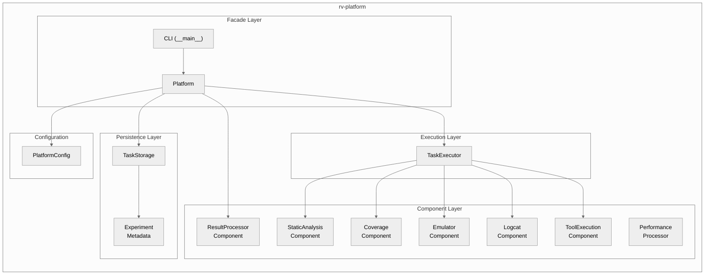
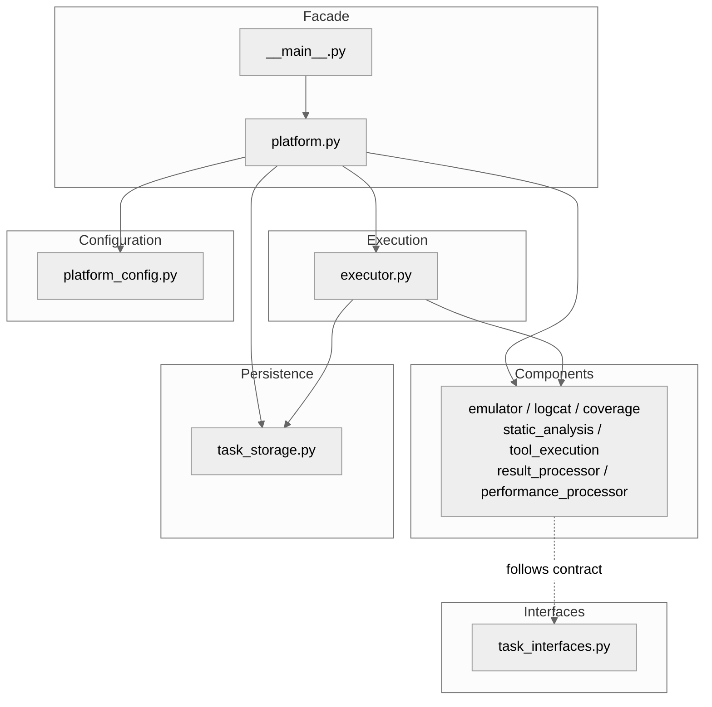
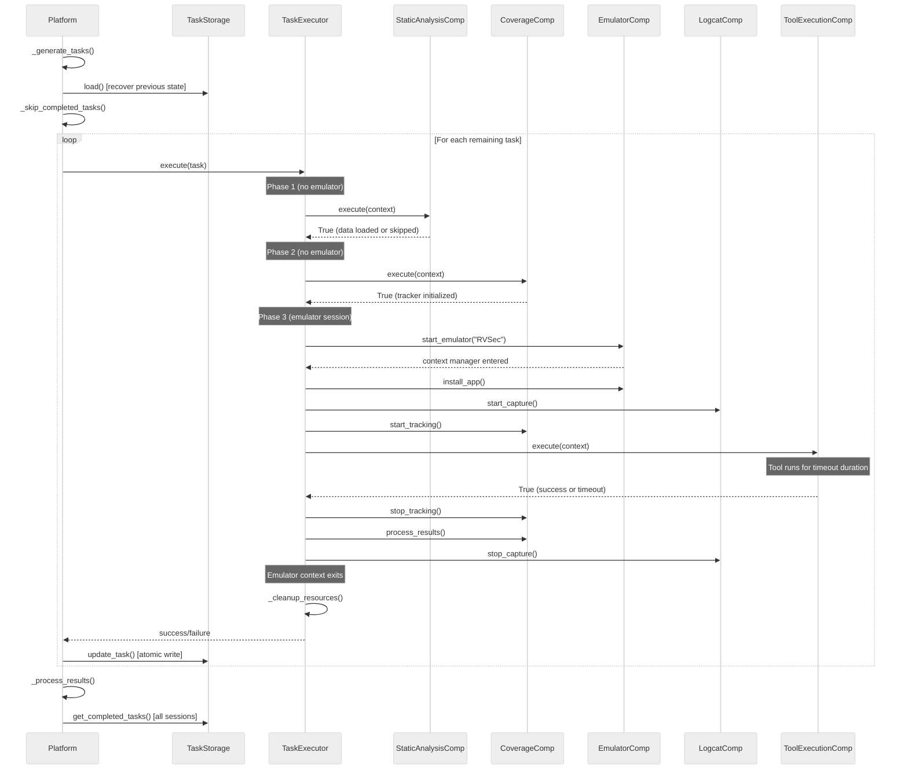
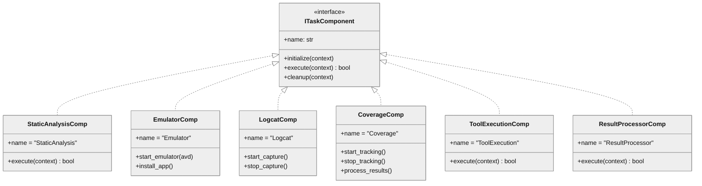

# rv-platform Architecture

## Overview

rv-platform is the central execution engine for Android testing experiments in the RV-Android framework. It bridges the gap between experiment orchestration (rv-experiment) and individual testing tools by transforming a declarative experiment configuration into concrete task executions with measurable results. Given a set of APK files, testing tools with variants, repetition counts, and timeout values, the platform generates the Cartesian product of all combinations, executes each task on an Android emulator while tracking method coverage and specification violations in real-time, and produces standardized CSV/JSON output files for research analysis. The platform supports both standalone CLI usage and programmatic integration via rv-experiment.

## Specification Alignment

This module implements requirements from `openspec/specs/platform/spec.md`.

### Functional Requirements

| FR | Description | Architectural Support |
|----|-------------|----------------------|
| FR07 | Android Emulator Management | `EmulatorComponent` delegates to `EmulatorManager` with context-manager lifecycle and dynamic port allocation |
| FR08 | Task Generation | `Platform._generate_tasks()` computes the Cartesian product of APKs x tools x repetitions x timeouts |
| FR09 | Component-Based Task Execution | `TaskExecutor` coordinates 5 pluggable `ITaskComponent` implementations through 3 execution phases |
| FR10 | Persistent Task Storage | `TaskStorage` provides atomic file writes (write-temp-then-rename), transactions, and experiment resume via checksum validation |
| FR11 | Logcat Capture and Parsing | `LogcatComponent` delegates to `LogcatManager` for background logcat capture; rv-coverage parses `RVSEC-COV` and `RVSEC` entries |
| FR14 | Result Generation | `ResultProcessorComponent` generates `coverage.csv`, `errors.csv`, `summary.csv`, `results.json`, `performance.csv` from completed tasks |

### Key Invariants

| Invariant | Description | Enforcement Mechanism |
|-----------|-------------|----------------------|
| INV-PLT-01 | Task count = \|APKs\| x \|tool_configs\| x repetitions x \|timeouts\| | `Platform._generate_tasks()` iterates nested loops over all dimensions; validated by the calling test scenarios |
| INV-PLT-02 | Tasks follow valid state transitions; terminal states are COMPLETED and ERROR | `TaskExecutor.execute()` transitions RUNNING -> COMPLETED or RUNNING -> ERROR; `TaskStorage.update_task()` persists the final state |
| INV-PLT-03 | `TaskStorage.save()` uses atomic file operations (temp + fsync + rename) | Implemented in `TaskStorage.save()` with `shutil.move()` after `os.fsync()` |
| INV-PLT-04 | `RVToolTimeoutError` is treated as successful completion | `ToolExecutionComponent.execute()` catches `RVToolTimeoutError` and returns `True` |
| INV-PLT-05 | Static analysis failure does not prevent task execution | `StaticAnalysisComponent.execute()` returns `True` on failure, logging a warning |
| INV-PLT-06 | All component `cleanup()` methods are called even if a preceding component fails | `TaskExecutor._cleanup_resources()` iterates all registered components in a try/except per component |
| INV-PLT-07 | `TaskStorage` is thread-safe via `RLock` | All public methods acquire `self._lock` before accessing shared state |
| INV-PLT-09 | `PlatformConfig` validates all fields at construction time | Pydantic field validators check `apks_dir` existence, tool count, repetitions, timeouts, and log level |
| INV-PLT-10 | Result processing only includes COMPLETED tasks | `ResultProcessorComponent` filters tasks by `TaskState.COMPLETED` before generating output |
| INV-PLT-13 | Phase 3 executes within the emulator context manager | `TaskExecutor._execute_coordinated_components()` wraps Phase 3 in `EmulatorComponent.start_emulator()` context |

### Specification Scenarios

Scenarios from `openspec/specs/platform/spec.md` that validate this architecture:

- **Successful Three-Phase Execution**: Traces through `TaskExecutor._execute_coordinated_components()` executing Phase 1 (StaticAnalysisComponent outside emulator), Phase 2 (CoverageComponent outside emulator), and Phase 3 (EmulatorComponent context manager -> install app -> LogcatComponent -> CoverageComponent tracking -> ToolExecutionComponent -> cleanup in reverse). Validates the Logical View component coordination and the Process View phase ordering.

- **Resume With Same Configuration**: Traces through `Platform.run()` -> `TaskStorage.load()` (recovers completed tasks from `tasks.json`) -> `_skip_completed_tasks()` (identity-tuple matching) -> only remaining tasks execute -> `_process_results()` uses `TaskStorage.get_completed_tasks()` to include all sessions. Validates the persistent storage architecture and result consolidation across sessions.

- **Component Execution Failure with Cleanup**: Traces through `TaskExecutor.execute()` where a component raises `TaskExecutionError` -> task state set to ERROR -> `_cleanup_resources()` calls `cleanup()` on all registered components regardless of which failed -> post-execution hooks called with `success=False`. Validates INV-PLT-06 enforcement.

## Key Architectural Decisions

| Decision | Choice | Rationale |
|----------|--------|-----------|
| Application Type | CLI tool + library (dual interface) | Standalone CLI via `rv-platform run` for direct use; programmatic API via `Platform(config).run()` for rv-experiment integration |
| Structuring | Component-based modular | Each execution concern (emulator, logcat, coverage, static analysis, tool) is an independent component with standardized lifecycle |
| Primary Pattern | Component with lifecycle (initialize/execute/cleanup) | Task execution involves 5 orthogonal concerns with strict ordering requirements; components encapsulate each concern while the executor coordinates them |
| Control Strategy | Call-based with phase coordination | `TaskExecutor` explicitly calls components in 3 phases; no event-driven dispatch because execution order is deterministic and critical |
| Persistence Strategy | Atomic file operations with transactions | Experiments run for hours; atomic writes (temp + fsync + rename) prevent data loss on interruption; transactions enable batched updates |
| Timeout Handling | Timeout as success | Testing tools run for a configured duration; timeout is the normal termination mechanism, not an error |
| Static Analysis | Non-critical (graceful degradation) | Static analysis data enriches coverage tracking but is not required; execution continues without it to avoid blocking experiments due to analysis failures |

## Architectural Patterns

### Pattern: Component Lifecycle

**Description**: Each execution concern is encapsulated in a component implementing the `ITaskComponent` interface with three lifecycle methods: `initialize(context)`, `execute(context)`, and `cleanup(context)`. The `TaskExecutor` manages the lifecycle of all registered components.

**When Used**: Task execution involves 5 orthogonal concerns (static analysis, emulator, logcat, coverage, tool execution) that must execute in a specific phase order. Components enable adding new execution phases without modifying the executor.

**Advantages**:
- Each component is self-contained and testable in isolation
- Adding a new execution concern requires only implementing `ITaskComponent` and registering it
- Cleanup is guaranteed for all components via the executor's cleanup loop

**Disadvantages**:
- Phase assignment is based on string matching on component names, which is fragile
- Components identified by name rather than type make the phase routing implicit

### Pattern: Facade

**Description**: `Platform` provides a single `run()` method that hides the complexity of task generation, resume detection, component registration, sequential execution, and result processing.

**When Used**: Callers (rv-experiment, CLI) need a simple interface to execute experiments without managing internal orchestration details.

**Advantages**:
- Simple API for callers
- Internal restructuring does not affect callers

**Disadvantages**:
- `Platform.run()` is a long method coordinating multiple steps; understanding the full flow requires reading through it

### Pattern: Registry + Factory

**Description**: `ToolRegistry` (singleton) stores tool classes and their specifications. `ToolFactory` creates configured tool instances from `ToolConfig` by resolving the tool class from the registry, applying variant configuration, and calling `tool.configure()`.

**When Used**: The platform supports 8+ testing tools with multiple variants each. New tools can be registered at import time (e.g., rvagent-tool registers in rv-platform's `__init__.py`).

**Advantages**:
- Tool discovery is automatic via import-time registration
- Adding a new tool does not require modifying the platform code

**Disadvantages**:
- Import-time side effects (tool registration in `__init__.py`) create an implicit dependency on module import order

---

## Logical View

### Domain Entities

| Entity | Responsibility |
|--------|----------------|
| `Platform` | Facade orchestrating task generation, execution, resume, and result processing |
| `TaskExecutor` | Coordinates component lifecycle across 3 execution phases |
| `ITaskComponent` | Interface for pluggable execution components (initialize/execute/cleanup) |
| `TaskStorage` | Persistent task state with atomic writes, transactions, and experiment metadata |
| `PlatformConfig` | Validated experiment configuration (Pydantic model) |
| `ExperimentMetadata` | Experiment identifier, start time, config checksum for resume validation |
| `ResultProcessorComponent` | Generates CSV/JSON output from completed tasks across all sessions |

### Component Architecture



---

## Development View

### Module Structure

```
modules/rv-platform/
├── src/
│   └── rv_platform/
│       ├── __init__.py              # External tool registration
│       ├── __main__.py              # CLI entry point (run, list-tools, validate-config)
│       ├── platform.py              # Platform facade
│       ├── config/
│       │   └── platform_config.py   # PlatformConfig (Pydantic)
│       ├── execution/
│       │   └── executor.py          # TaskExecutor
│       ├── components/
│       │   ├── emulator.py          # EmulatorComponent
│       │   ├── logcat.py            # LogcatComponent
│       │   ├── coverage.py          # CoverageComponent
│       │   ├── static_analysis.py   # StaticAnalysisComponent
│       │   ├── tool_execution.py    # ToolExecutionComponent
│       │   ├── result_processor.py  # ResultProcessorComponent
│       │   └── performance_processor.py  # PerformanceProcessorComponent
│       ├── interfaces/
│       │   └── task_interfaces.py   # ITaskComponent, ITaskExecutor, ITaskStorage
│       └── storage/
│           └── task_storage.py      # TaskStorage + ExperimentMetadata
├── tests/
│   ├── components/
│   ├── config/
│   ├── execution/
│   └── manual_tests/
└── pyproject.toml
```

### Package Dependencies



---

## Process View

The process view is relevant because rv-platform manages concurrent concerns during task execution: emulator lifecycle, background logcat capture, real-time coverage tracking, and tool execution.

### Execution Flow



### Concurrency Model

- **Sequential task execution**: Tasks are executed one at a time (parallel execution is a future feature controlled by `max_parallel_tasks`, currently defaulting to 1)
- **Background logcat capture**: `LogcatManager` starts a background process that writes logcat output to a file on disk
- **Background coverage tracking**: `CoverageTracker` runs a background thread monitoring the logcat file for `RVSEC-COV` entries, publishing `COVERAGE_UPDATED` events to the EventBus
- **Thread-safe storage**: `TaskStorage` uses `RLock` for all public methods (INV-PLT-07), supporting concurrent reads from the coverage tracking thread and writes from the main execution thread

---

## Core Components

### Platform

**Purpose**: Facade that orchestrates the entire experiment lifecycle: APK discovery, task generation, resume detection, sequential task execution, and result processing.

**Location**: `src/rv_platform/platform.py`

**Key Classes**:
- `Platform`: Main entry point with `run()` method returning an execution summary dict

**Dependencies**:
- Internal: `TaskExecutor`, `TaskStorage`, `PlatformConfig`, all component classes
- External: `ToolFactory` (rv-tools), `Task`/`App`/`TaskFactory` (rv-android-core)

### TaskExecutor

**Purpose**: Coordinates the 3-phase component execution lifecycle for a single task. Manages component registration, phase assignment (by component name), and guaranteed cleanup.

**Location**: `src/rv_platform/execution/executor.py`

**Key Classes**:
- `TaskExecutor`: Registers components, executes them in coordinated phases, manages pre/post execution hooks

**Dependencies**:
- Internal: `ITaskComponent` implementations, `TaskStorage`
- External: `ErrorHandler` (rv-android-core)

### EmulatorComponent

**Purpose**: Manages the Android emulator lifecycle during task execution. Starts the emulator with a named AVD, installs the APK under test, and ensures cleanup on exit via context manager.

**Location**: `src/rv_platform/components/emulator.py`

**Key Classes**:
- `EmulatorComponent`: Implements `ITaskComponent`; delegates to `EmulatorManager` from rv-android-core

**Dependencies**:
- External: `EmulatorManager` (rv-android-core)

### TaskStorage

**Purpose**: Provides persistent task state with atomic file operations, thread safety, transaction support, and experiment metadata for resume validation.

**Location**: `src/rv_platform/storage/task_storage.py`

**Key Classes**:
- `TaskStorage`: Thread-safe persistent storage with atomic save (temp + fsync + rename)
- `ExperimentMetadata`: Experiment ID, start time, SHA-256 config checksum
- `StorageConfig`: Storage behavior configuration (auto-save, compression, backup count)
- `ExperimentStatistics`: Computed metrics (completion percentage, average execution time)

**Dependencies**:
- External: `TaskFactory` (rv-android-core) for task deserialization

### ResultProcessorComponent

**Purpose**: Generates the 5 standardized output files (CSV/JSON) from completed tasks. Handles result consolidation across sessions by re-reading logcat files for MOP violation reconstruction when `task.repository` is `None` (tasks loaded from `tasks.json`).

**Location**: `src/rv_platform/components/result_processor.py`

**Key Classes**:
- `ResultProcessorComponent`: Implements `ITaskComponent`; uses `ErrorHandler` per file generation for fault isolation

**Dependencies**:
- External: `parse_logcat_file` (rv-coverage) for MOP violation reconstruction, `pandas` for CSV operations

### ToolExecutionComponent

**Purpose**: Invokes the configured testing tool and handles the timeout-as-success semantic. Catches `RVToolTimeoutError` (returns `True`) and `RVToolExecutionError` (returns `False`).

**Location**: `src/rv_platform/components/tool_execution.py`

**Key Classes**:
- `ToolExecutionComponent`: Implements `ITaskComponent`; delegates to `AbstractTool.execute()`

**Dependencies**:
- External: `AbstractTool` (rv-android-core)

---

## NFR Support

How the architecture supports non-functional requirements from `docs/PRD.md` Section 7.

| NFR | PRD ID | Priority | Architectural Support |
|-----|--------|----------|----------------------|
| Modularity | NFR01 | P0 | rv-platform is one of 14 uv workspace modules; internally organized into 4 packages (components, execution, storage, config) with clear boundaries |
| Extensibility | NFR02 | P0 | `ITaskComponent` interface allows adding new execution phases; `ToolRegistry`/`ToolFactory` enable adding new tools without modifying platform code; pre/post execution hooks for cross-cutting behavior |
| Testability | NFR03 | P1 | Components are independently testable; `PlatformConfig` validates at construction; interfaces define clear contracts; test directories mirror source structure |
| Resilience | NFR04 | P1 | Tool timeouts treated as success (INV-PLT-04); static analysis is non-critical (INV-PLT-05); guaranteed component cleanup (INV-PLT-06); `ErrorHandler` decorators on all component methods |
| Configurability | NFR05 | P1 | `PlatformConfig` (Pydantic) with field validators; CLI arguments; JSON config files; environment variable support for device ports |
| Observability | NFR06 | P1 | `PerformanceMonitor` tracks execution timing; 5 CSV/JSON output files; structured logging throughout all components |
| Reproducibility | NFR08 | P1 | Atomic `TaskStorage` with transactions; experiment resume via SHA-256 config checksum; deterministic task generation (sorted APK discovery, deterministic Cartesian product) |

---

## Key Interfaces

### ITaskComponent

```python
class ITaskComponent(ABC):
    """Interface for pluggable execution components with lifecycle management."""

    @property
    def name(self) -> str:
        """Component name used for phase assignment."""
        ...

    def initialize(self, context: Dict[str, Any]) -> None:
        """Prepare the component for execution."""
        ...

    def execute(self, context: Dict[str, Any]) -> bool:
        """Execute the component's primary responsibility. Returns True on success."""
        ...

    def cleanup(self, context: Dict[str, Any]) -> None:
        """Release resources. Called even if execute() fails."""
        ...
```



---

## Scenarios

### Scenario 1: Execute a Single-Tool Experiment

**Description**: A researcher runs an experiment with one tool (Monkey) on 2 APKs with 1 repetition and a 300-second timeout.

**Flow**:
1. CLI parses arguments into `PlatformConfig` with `tools=[ToolConfig(name="monkey", variant="default")]`, `repetitions=1`, `timeouts=[300]`
2. `Platform._discover_apks()` finds 2 APK files in `apks_dir` (sorted alphabetically)
3. `Platform._generate_tasks()` produces 2 tasks (2 APKs x 1 tool x 1 rep x 1 timeout)
4. `Platform._skip_completed_tasks()` finds no previous tasks (first run)
5. For each task, `Platform` creates a `TaskExecutor`, registers 5 components, and calls `execute()`
6. `TaskExecutor._execute_coordinated_components()` runs Phase 1 (static analysis), Phase 2 (coverage init), Phase 3 (emulator session with tool execution for 300 seconds)
7. `ToolExecutionComponent` catches `RVToolTimeoutError` after 300 seconds and returns `True`
8. `TaskStorage.update_task()` persists the completed task atomically
9. After both tasks complete, `Platform._process_results()` generates 5 output files from all completed tasks

### Scenario 2: Resume an Interrupted Experiment

**Description**: An experiment with 10 tasks was interrupted after completing 6. The researcher re-runs the same command.

**Flow**:
1. `Platform._generate_tasks()` produces the same 10 tasks
2. `TaskStorage.load()` reads `tasks.json` and recovers 6 completed tasks
3. `Platform._skip_completed_tasks()` matches task identities (apk, tool, variant, rep, timeout) and removes 6 tasks from the execution list; stores `_skipped_count = 6`
4. Only 4 remaining tasks are executed through the normal component lifecycle
5. `Platform._process_results()` calls `TaskStorage.get_completed_tasks()` which returns all 10 completed tasks (6 from previous session + 4 from current session)
6. `ResultProcessorComponent` generates output files covering all 10 tasks, using logcat re-reading (`parse_logcat_file()`) for MOP violation reconstruction on the 6 previously completed tasks
7. Execution summary reports "4 executed, 6 skipped from previous runs"

---

## Extension Points

- **New testing tools**: Implement `AbstractTool` (from rv-android-core), register via `ToolRegistry.register_tool()` at import time. The platform discovers and executes the tool without any modifications.
- **New execution components**: Implement `ITaskComponent`, register with `TaskExecutor.register_component()`. Phase assignment is based on the component's `name` property.
- **Pre/post execution hooks**: Register via `TaskExecutor.add_pre_execution_hook()` and `add_post_execution_hook()` for cross-cutting behavior (used by rv-experiment for event publishing).
- **Custom result processing**: `ResultProcessorComponent` can be subclassed or replaced to generate additional output formats.

## Dependencies

### Internal (rv-android modules)

| Module | Purpose |
|--------|---------|
| rv-android-core | Domain models (Task, App, TaskFactory, ToolConfig, TaskState), ErrorHandler, LoggingManager, EmulatorManager, LogcatManager, PerformanceMonitor |
| rv-tools | ToolFactory and ToolRegistry for resolving tool names/variants to configured tool instances |
| rv-coverage | CoverageTracker for real-time method coverage tracking; `parse_logcat_file()` for MOP violation reconstruction on resume |
| rv-static-analysis | `static_analysis_parser` for loading GATOR/GESDA/REACH data files |
| rvagent-tool | RVAgentTool registered at import time via `__init__.py` (runtime discovery only) |

### External

| Package | Version | Purpose |
|---------|---------|---------|
| pydantic | ^2.9.0 | Configuration validation and serialization (PlatformConfig, ExperimentMetadata, StorageConfig) |
| pandas | ^2.3.1 | Data processing for CSV output generation |

## Testing Strategy

| Type | Location | Purpose |
|------|----------|---------|
| Unit | tests/components/ | Isolated component tests (e.g., ToolExecutionComponent timeout handling) |
| Unit | tests/config/ | PlatformConfig validation tests |
| Unit | tests/execution/ | TaskExecutor lifecycle and resume logic tests |
| Manual | tests/manual_tests/ | Debug scripts for executor behavior |

## Related Documentation

- [Platform Domain Spec](../../../openspec/specs/platform/spec.md) - Requirements, invariants, and scenarios for this module
- [PRD](../../../docs/PRD.md) - Product Requirements Document (FR07-11, FR14, NFR01-08)
- [CLAUDE.md](../../../CLAUDE.md) - Quick reference for Claude Code
