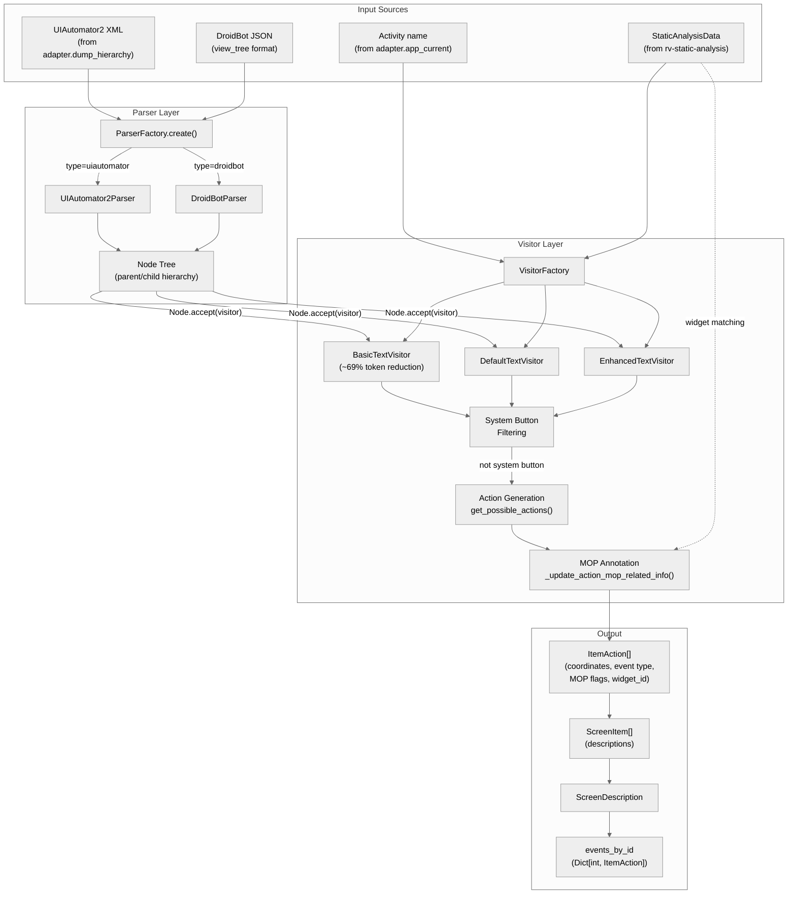
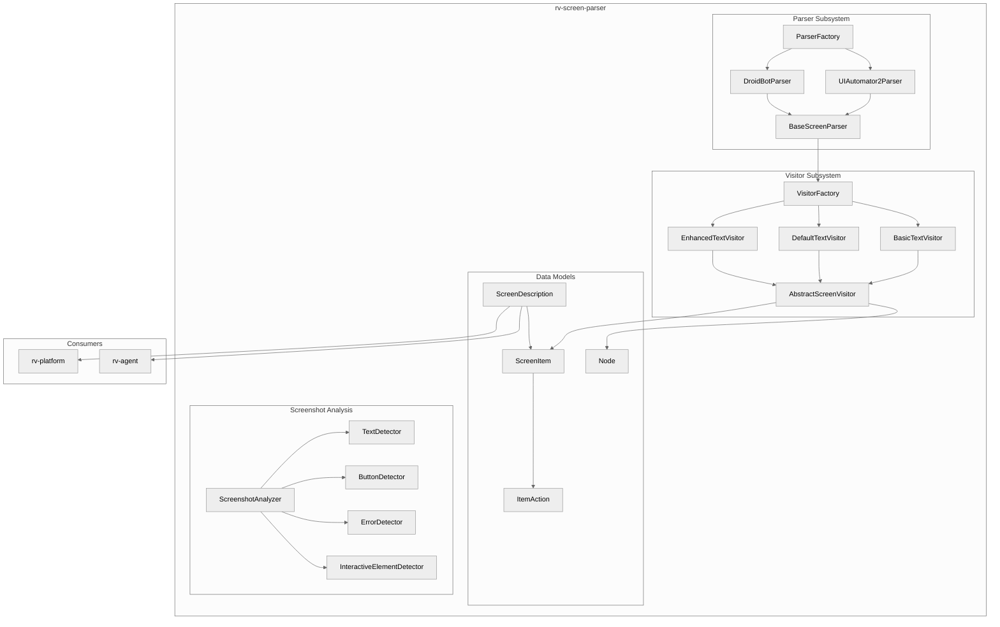
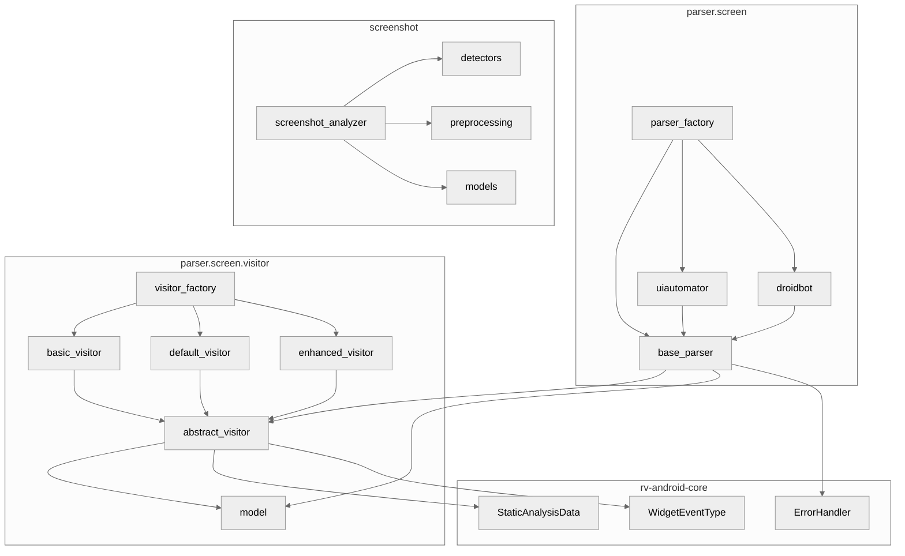
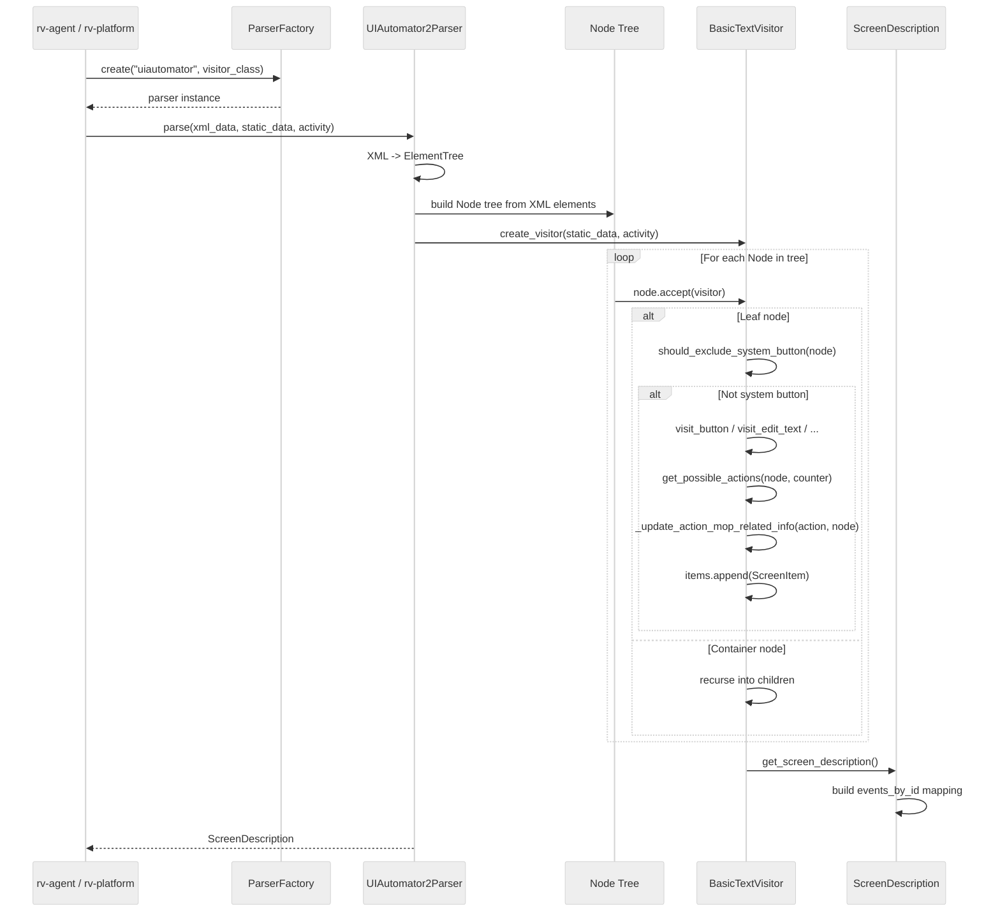
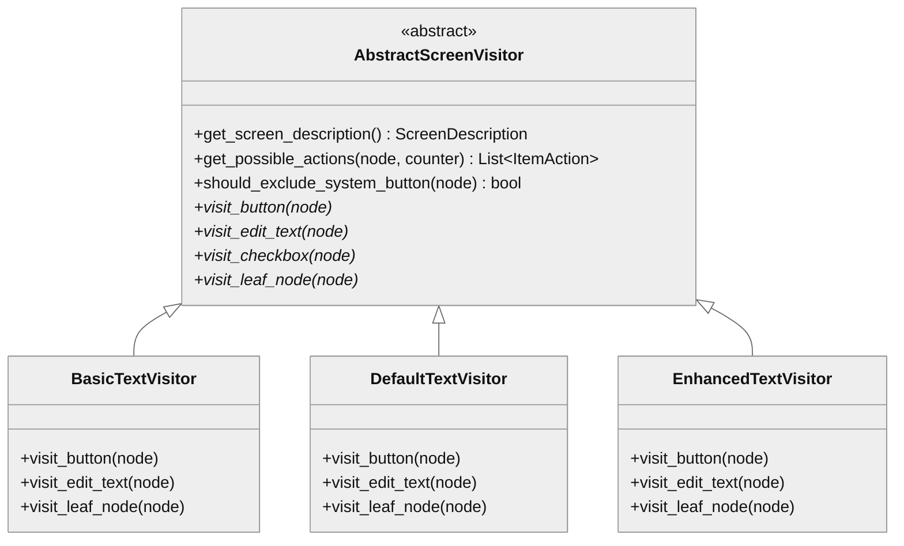
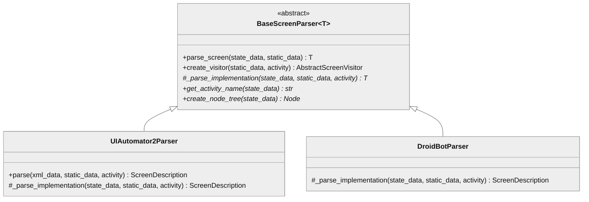

# rv-screen-parser Architecture

## Overview

The rv-screen-parser module provides structured Android UI state parsing for the RV-Android framework. It transforms raw UIAutomator2 XML hierarchy dumps and DroidBot JSON state data into standardized `ScreenDescription` objects that downstream consumers (rv-agent, rv-platform) use for action selection, LLM prompt generation, and algorithmic exploration. The module also includes a screenshot analysis subsystem that uses OpenCV and Tesseract OCR to detect visual UI elements not present in the UI hierarchy, such as game interfaces and custom-rendered components.

## Specification Alignment

This module implements requirements from `openspec/specs/analysis/spec.md`.

### Functional Requirements

| FR | Description | Architectural Support |
|----|-------------|----------------------|
| FR23 | UI Screen Parsing (Analysis Component) | `UIAutomator2Parser` and `DroidBotParser` with visitor pattern produce `ScreenDescription` objects. `ParserFactory` selects the parser; `VisitorFactory` selects the visitor. `Node.accept(visitor)` dispatches to element-specific methods. |

### Key Invariants

| Invariant | Description | Enforcement Mechanism |
|-----------|-------------|----------------------|
| INV-ANA-09 | `ItemAction.action_type` derives from `WidgetEventType` via `WIDGET_EVENT_TO_ACTION_TYPE` mapping as single source of truth | `@computed_field` in `ItemAction` uses the mapping dict; text parsing is only used for scroll direction refinement |
| INV-ANA-10 | `ScreenDescription` builds `events_by_id` mapping from all `ItemAction` objects | `ScreenDescription.__init__` iterates all `ScreenItem.actions` and indexes by `ItemAction.id` |
| INV-ANA-12 | `Node.accept(visitor)` dispatches to element-specific visitor methods; system button filtering applies to leaf nodes only | `accept()` checks `view_class` for dispatch; `should_exclude_system_button()` called only for leaf nodes, never containers |
| INV-ANA-13 | `ItemAction.coordinates` validated as non-negative integer 2-tuple or None; `get_execution_coordinates()` resolves via priority | `field_validator` on `coordinates`; resolution priority: (1) explicit coordinates, (2) target view bounds center |

### Specification Scenarios

Scenarios from `openspec/specs/analysis/spec.md` that validate this architecture:

- **UIAutomator XML parsing to ScreenDescription**: `UIAutomator2Parser.parse()` produces a `ScreenDescription` with correct activity, `ScreenItem` objects for each actionable element, and `events_by_id` mapping -- traces through `UIAutomator2Parser` -> `Node` tree construction -> visitor traversal -> `ScreenDescription`
- **Visitor pattern dispatch for widget types**: `Node.accept(visitor)` dispatches `android.widget.Button` to `visit_button()`, Material Design variants to the same method, and unknown classes to `visit_leaf_node()` -- traces through `Node.accept()` dispatch logic
- **System button filtering for leaf nodes only**: Leaf nodes identified as system buttons are skipped; container nodes are never filtered -- traces through `AbstractScreenVisitor.should_exclude_system_button()` called in `Node.accept()`
- **MOP tracking in ItemAction**: Actions for widgets with `WidgetEvent` data carry `reaches_mop`/`directly_reaches_mop` flags -- traces through `AbstractScreenVisitor._update_action_mop_related_info()`
- **ItemAction coordinate resolution**: `get_execution_coordinates()` returns explicit coordinates first, falls back to target view bounds center -- traces through `ItemAction.get_execution_coordinates()`
- **ScreenDescription action lookup by ID**: `get_action_by_id(id)` returns the correct `ItemAction` via `events_by_id` dict -- traces through `ScreenDescription.get_action_by_id()`

## Key Architectural Decisions

### ADR-1: Visitor Pattern for Extensible UI Output Formats

The module uses the visitor pattern (`Node.accept(visitor)`) to separate UI tree traversal from description generation. Three concrete visitors produce different output formats from the same Node tree.

**Why**: rv-agent needs compact text for LLM prompts (token budget), but debugging requires detailed coordinate information. Without the visitor pattern, supporting multiple output formats would require either duplicating the entire parser or adding format-conditional branches throughout the traversal logic. The visitor pattern isolates format-specific logic into separate classes (BasicTextVisitor, DefaultTextVisitor, EnhancedTextVisitor) while sharing common logic (action generation, MOP tracking, system button filtering) in `AbstractScreenVisitor`. Adding a new output format requires only implementing 14 abstract methods without modifying parsers or the Node hierarchy. This satisfies INV-ANA-12 (Node.accept(visitor) dispatches to element-specific visitor methods).

### ADR-2: BasicTextVisitor as Default for LLM Prompt Generation

`BasicTextVisitor` produces compact one-line descriptions like `Button 'Submit'. Actions: CLICK (7)` instead of verbose multi-line output.

**Why**: Qwen3-VL (the LLM backend) has a limited context window, and each token costs inference time. An average Android screen has 20-40 actionable elements. Raw UIAutomator XML for such a screen is 2000-5000 tokens. `BasicTextVisitor` achieves approximately 69% token reduction, bringing the same screen to 600-1500 tokens. This leaves sufficient context for the system prompt, conversation history, and LLM reasoning. The reduced representation also improves LLM accuracy because the signal-to-noise ratio is higher -- the model sees only actionable elements and their IDs, not framework boilerplate.

### ADR-3: ALWAYS_CLICKABLE_TYPES Override Set

A hardcoded set of 20+ widget class names (`ActionBar$Tab`, `Chip`, `FloatingActionButton`, `BottomNavigationItemView`, etc.) overrides the `clickable` attribute from UIAutomator.

**Why**: UIAutomator dumps often report `clickable=false` for elements that are interactive. This is a known Android framework issue: custom views and Material Design components handle click events via `OnTouchListener` or `RippleDrawable` rather than `View.setClickable(true)`. Without this override, the visitor would silently drop valid actions for tabs, navigation items, chips, and FABs -- some of the most important interactive elements in modern Android apps. The set includes both simple class names and fully-qualified names because UIAutomator inconsistently reports either.

### ADR-4: Factory + Registry for Parser and Visitor Selection

`ParserFactory` and `VisitorFactory` use registry dictionaries to map type constants to implementation classes. New parsers or visitors can be registered at runtime via `register_parser_type()` or `register_visitor_type()`.

**Why**: rv-agent needs to select the parser (UIAutomator vs DroidBot) and visitor (basic vs enhanced) at runtime based on the tool being used and the current exploration mode. A factory with dynamic registration follows the open/closed principle: adding a new parser or visitor requires no changes to existing code, only a registration call. This also enables test code to register mock parsers/visitors.

### ADR-5: MOP Tracking via Widget Matching

`AbstractScreenVisitor._update_action_mop_related_info()` matches runtime UI nodes to GATOR-analyzed widgets via resource ID or text content, then checks whether the widget's event handler reaches a monitored operation.

**Why**: rv-agent's exploration strategy uses MOP reachability to prioritize actions that trigger specification-relevant code paths. Without this annotation, the agent would explore blindly. The matching uses resource ID first (exact match) and falls back to text content (fuzzy match) because not all widgets have resource IDs. The markers `[M]` (transitively reaches MOP) and `[DM]` (directly reaches MOP) are appended to the action text so the LLM can see them in the screen description. This satisfies INV-ANA-09 (ItemAction.action_type derives from WidgetEventType mapping).

### ADR-6: System Button and Keyboard Filtering

`AbstractScreenVisitor.should_exclude_system_button()` uses multiple heuristics to filter out non-app UI elements: resource ID patterns, package names, class names, bounds-based position checks, content descriptions, and small-button detection.

**Why**: System navigation buttons (home, back, recents) and on-screen keyboard keys appear in UIAutomator dumps but produce meaningless actions for app testing. Without filtering, the action space is polluted with 10-20 irrelevant actions per screen, reducing LLM decision accuracy. The multi-heuristic approach is necessary because no single signal reliably identifies system elements across all Android versions and OEM skins. This satisfies INV-ANA-12 (system button filtering applies to leaf nodes only).

| Decision | Choice | Rationale |
|----------|--------|-----------|
| Application Type | Library | Consumed by rv-agent and rv-platform; no standalone CLI entry point |
| Structuring | Modular (parser + screenshot subsystems) | Parser and screenshot analysis are independent concerns with different dependencies |
| Primary Pattern | Visitor | Separates UI tree traversal from description generation, enabling multiple output formats without modifying parsers |
| Control Strategy | Call-based (synchronous) | Parsing is a stateless transformation; no need for event-driven or async patterns |
| Parser Selection | Factory + Registry | Enables adding new parser formats without modifying existing code |
| Visitor Selection | Factory + Registry | Three built-in visitors (basic, default, enhanced) with dynamic registration for new implementations |
| Token Optimization | BasicTextVisitor as default for LLM | Achieves ~69% token reduction vs. raw XML, critical for LLM prompt efficiency |

## Data Flow

The module transforms raw device state representations into structured action-annotated screen descriptions. Two independent data flows exist: UI hierarchy parsing (primary) and screenshot analysis (supplementary).

### UI Hierarchy Parsing Data Flow



### Data Transformation Stages

1. **XML/JSON to Node Tree**: The parser converts raw device state data into a hierarchical `Node` tree. `UIAutomator2Parser` parses XML via `ElementTree`, extracting attributes (bounds, clickable, scrollable, editable, resource-id, text, content-description) into `Node` properties. `DroidBotParser` parses JSON `view_tree` format with DroidBot-specific property names. Both produce identical `Node` trees with parent/child references.

2. **Node traversal with visitor dispatch**: Each `Node` in the tree calls `accept(visitor)`, which inspects the `view_class` attribute to dispatch to the correct visitor method. The dispatch logic maps 30+ Android widget classes (including standard, AppCompat, and Material Design variants) to 14 visitor methods (`visit_button`, `visit_edit_text`, `visit_checkbox`, etc.). Unknown classes fall through to `visit_leaf_node()`. Container nodes recurse into their children.

3. **System button filtering**: Before processing a leaf node, the visitor checks `should_exclude_system_button()` using six heuristics: resource ID patterns, keyboard package names, keyboard class names, bounds-based position (system navigation area), content descriptions, and small-button detection. Filtered nodes produce no `ScreenItem` or `ItemAction` output.

4. **Action generation**: `get_possible_actions()` inspects node properties to build `ItemAction` objects:
   - `clickable` (or in ALWAYS_CLICKABLE_TYPES) and not editable: CLICK action
   - `long_clickable` (excluding EditText/TextView): LONG_CLICK action
   - `checkable`: CHECK/UNCHECK action (via WidgetEventType.CLICK)
   - `scrollable`: SCROLL actions (direction restricted by widget type)
   - `editable`: TEXT_CHANGE action
   Each action carries coordinates (center of node bounds), a sequential ID from `Counter`, and the source `WidgetEventType`.

5. **MOP annotation**: For each generated action, `_update_action_mop_related_info()` matches the runtime UI node to a GATOR-analyzed widget (by resource ID or text), then checks whether the widget's event handler reaches a monitored operation. Matching actions get `reaches_mop=True` and/or `directly_reaches_mop=True`, and `[M]`/`[DM]` markers are appended to the action text.

6. **ScreenDescription assembly**: The visitor collects all `ScreenItem` objects and creates a `ScreenDescription` with the activity name, items list, and `events_by_id` mapping (INV-ANA-10: ScreenDescription builds events_by_id from all ItemAction objects).

### Screenshot Analysis Data Flow

The screenshot analysis subsystem operates independently of UI hierarchy parsing:

1. `ScreenshotAnalyzer.analyze(path)` loads the screenshot and creates grayscale/binary representations via `ImagePreprocessor`
2. Four detectors run in sequence: `TextDetector` (Tesseract OCR), `ButtonDetector` (contour analysis), `ErrorDetector` (visual pattern matching), `InteractiveElementDetector` (game UI shapes)
3. Results are aggregated into `ScreenshotAnalysisResult` with bounding boxes and confidence scores
4. rv-agent uses this data when the UIAutomator hierarchy is empty or unreliable (games, custom views)

## Architectural Patterns

### Pattern: Visitor

**Description**: The visitor pattern separates UI tree traversal from output generation. `Node.accept(visitor)` dispatches to element-specific methods (`visit_button`, `visit_edit_text`, `visit_checkbox`, etc.) based on the node's `view_class`. Each concrete visitor produces `ScreenItem` objects with different levels of detail.

**When Used**: Every time a UIAutomator XML dump or DroidBot state is parsed into a `ScreenDescription`.

**Advantages**:
- Multiple output formats from the same tree structure (compact for LLM, detailed for debugging)
- Adding new output formats does not require modifying parsers or the Node hierarchy
- Common logic (action generation, MOP tracking, system button filtering) lives in `AbstractScreenVisitor`

**Disadvantages**:
- Adding new element types requires updating all visitor implementations
- Dispatch logic in `Node.accept()` maps 30+ widget classes to visitor methods

### Pattern: Factory + Registry

**Description**: `ParserFactory` and `VisitorFactory` use a registry dictionary to map type constants to implementation classes. New parsers or visitors can be registered at runtime via `register_parser_type()` or `register_visitor_type()`.

**When Used**: Parser and visitor instantiation at the start of each parse operation.

**Advantages**:
- Open/closed principle: new implementations require no factory code changes
- Centralized creation logic with consistent error handling

**Disadvantages**:
- Registry must be populated before use (lazy initialization with `register_default_parsers()`)

### Pattern: Component Architecture (Screenshot Analysis)

**Description**: `ScreenshotAnalyzer` orchestrates four specialized detector components (`TextDetector`, `ButtonDetector`, `ErrorDetector`, `InteractiveElementDetector`) that each analyze different aspects of a screenshot image.

**When Used**: When rv-agent needs to detect UI elements not present in the UIAutomator hierarchy (games, custom views).

**Advantages**:
- Each detector is independently testable and replaceable
- New detection capabilities can be added without modifying existing detectors

**Disadvantages**:
- Requires system-level dependencies (Tesseract OCR, OpenCV)

---

## Logical View

### Domain Entities

| Entity | Responsibility |
|--------|----------------|
| `Node` | Hierarchical UI element from UIAutomator/DroidBot with properties (clickable, scrollable, editable, bounds) and visitor pattern dispatch via `accept()` |
| `ScreenDescription` | Complete screen state: activity name, list of `ScreenItem` objects, and `events_by_id` action lookup |
| `ScreenItem` | Single UI element with human-readable description and list of available `ItemAction` objects |
| `ItemAction` | Executable action on a UI element: coordinates, event type, MOP tracking flags, and text input value |
| `ScreenshotAnalysisResult` | Visual analysis output with detected texts, buttons, errors, and interactive elements |

### Component Architecture



---

## Development View

### Module Structure

```
modules/rv-screen-parser/
├── src/rv_screen_parser/
│   ├── __init__.py
│   ├── constants.py                    # ScreenParserType, VisitorType, ActionType, SystemActionType
│   ├── parser/
│   │   └── screen/
│   │       ├── base_parser.py          # BaseScreenParser (abstract, generic)
│   │       ├── parser_factory.py       # ParserFactory (registry pattern)
│   │       ├── droidbot/
│   │       │   └── droidbot_parser.py  # DroidBotParser (JSON state data)
│   │       ├── uiautomator/
│   │       │   └── uiautomator_parser.py  # UIAutomator2Parser (XML hierarchy)
│   │       └── visitor/
│   │           ├── abstract_visitor.py # AbstractScreenVisitor (base + MOP tracking)
│   │           ├── basic_visitor.py    # BasicTextVisitor (~69% token reduction)
│   │           ├── default_visitor.py  # DefaultTextVisitor (standard output)
│   │           ├── enhanced_visitor.py # EnhancedTextVisitor (detailed coordinates)
│   │           ├── model.py           # Node, ScreenItem, ItemAction, ScreenDescription
│   │           └── visitor_factory.py  # VisitorFactory (registry pattern)
│   └── screenshot/
│       ├── models.py                   # Pydantic models for analysis results
│       ├── screenshot_analyzer.py      # ScreenshotAnalyzer orchestrator
│       ├── screenshot_manager.py       # Screenshot capture management
│       ├── converters.py               # Image format converters
│       ├── detectors/
│       │   ├── button_detector.py      # Shape-based button detection
│       │   ├── error_detector.py       # Error indicator detection
│       │   ├── interactive_element_detector.py  # Game UI element detection
│       │   └── text_detector.py        # OCR-based text extraction
│       ├── preprocessing/
│       │   └── image_preprocessor.py   # Grayscale, binary conversion
│       └── utils/
│           └── geometry_utils.py       # Bounding box calculations
├── tests/
│   ├── parser/screen/
│   │   ├── droidbot/                   # DroidBot parser tests
│   │   ├── uiautomator/               # UIAutomator parser tests
│   │   └── visitor/                    # Visitor tests (all three variants)
│   └── analysis/screenshot/            # Screenshot analyzer tests
└── pyproject.toml
```

### Package Dependencies



---

## Process View

### UI Hierarchy Parsing Flow



---

## Core Components

### BaseScreenParser

**Purpose**: Abstract base class defining the parser contract. Manages visitor creation, error handling, and logging. Concrete parsers implement `_parse_implementation()`, `get_activity_name()`, and `create_node_tree()`.

**Location**: `src/rv_screen_parser/parser/screen/base_parser.py`

**Key Classes**:
- `BaseScreenParser[T]`: Generic abstract class parameterized by `ScreenDescription` subtype

**Dependencies**:
- Internal: `AbstractScreenVisitor`, `Node`, `ScreenDescription`
- External: `rv-android-core` (`StaticAnalysisData`, `ErrorHandler`, `LoggingManager`)

### UIAutomator2Parser

**Purpose**: Parses UIAutomator2 XML hierarchy dumps into `Node` trees and applies visitors to produce `ScreenDescription` objects. Handles XML attribute normalization, bounds parsing, and coordinate extraction.

**Location**: `src/rv_screen_parser/parser/screen/uiautomator/uiautomator_parser.py`

**Key Classes**:
- `UIAutomator2Parser`: Extends `BaseScreenParser[ScreenDescription]`

**Dependencies**:
- Internal: `BaseScreenParser`, `Node`, `ScreenDescription`
- External: `xml.etree.ElementTree`

### DroidBotParser

**Purpose**: Parses DroidBot JSON state data (`view_tree` format) into `Node` trees. Handles DroidBot-specific property names and nested structure.

**Location**: `src/rv_screen_parser/parser/screen/droidbot/droidbot_parser.py`

**Key Classes**:
- `DroidBotParser`: Extends `BaseScreenParser[ScreenDescription]`

### AbstractScreenVisitor

**Purpose**: Base visitor class providing shared infrastructure: action generation (`get_possible_actions()`), MOP tracking (`_update_action_mop_related_info()`), system button filtering (`should_exclude_system_button()`), widget matching against static analysis data, and coordinate formatting helpers.

**Location**: `src/rv_screen_parser/parser/screen/visitor/abstract_visitor.py`

**Key Classes**:
- `AbstractScreenVisitor`: ABC with 14 abstract `visit_*` methods for different widget types

**Dependencies**:
- Internal: `Node`, `ScreenItem`, `ItemAction`, `Counter`
- External: `rv-android-core` (`StaticAnalysisData`, `Widget`, `WidgetEventType`)

### Concrete Visitors

**Purpose**: Three visitor implementations producing different output formats from the same Node tree.

| Visitor | Location | Output Style | Use Case |
|---------|----------|-------------|----------|
| `BasicTextVisitor` | `visitor/basic_visitor.py` | Compact (`Button {text}. Actions: CLICK (id)`) | LLM prompt generation (~69% token reduction) |
| `DefaultTextVisitor` | `visitor/default_visitor.py` | Standard formatting | General-purpose parsing |
| `EnhancedTextVisitor` | `visitor/enhanced_visitor.py` | Detailed with coordinates and bounds | Debugging, coordinate validation |

### Data Models (model.py)

**Purpose**: Core data structures for the entire module.

**Location**: `src/rv_screen_parser/parser/screen/visitor/model.py`

**Key Classes**:
- `Node`: UI hierarchy element with `accept(visitor)` dispatch, properties (clickable, scrollable, editable, bounds), and parent/child references
- `ScreenDescription`: Complete screen state with `items`, `events_by_id` mapping, and `get_action_by_id()` lookup
- `ScreenItem`: UI element with `base_description` and list of `ItemAction` objects
- `ItemAction`: Executable action with `coordinates`, `event` type, `reaches_mop`/`directly_reaches_mop` flags, and computed `action_type`
- `Counter`: Sequential ID generator for unique action identifiers

### ScreenshotAnalyzer

**Purpose**: Orchestrates visual analysis of Android screenshots using specialized detector components. Detects text (OCR), buttons (shape analysis), errors (visual patterns), and interactive game elements.

**Location**: `src/rv_screen_parser/screenshot/screenshot_analyzer.py`

**Key Classes**:
- `ScreenshotAnalyzer`: Extends `BaseAnalyzer[ScreenshotAnalysisResult]`

**Dependencies**:
- Internal: `TextDetector`, `ButtonDetector`, `ErrorDetector`, `InteractiveElementDetector`, `ImagePreprocessor`
- External: `opencv-python`, `pytesseract`, `numpy`, `pillow`

---

## NFR Support

How the architecture supports non-functional requirements from `docs/PRD.md` Section 7.

| NFR | PRD ID | Priority | Architectural Support |
|-----|--------|----------|----------------------|
| Modularity | NFR01 | P0 | Independent uv workspace module with clean boundary. Parser and screenshot subsystems are separate packages with no cross-dependencies. |
| Extensibility | NFR02 | P0 | Factory + registry patterns for parsers and visitors. New parsers registered via `ParserFactory.register_parser_type()`, new visitors via `VisitorFactory.register_visitor_type()`. |
| Testability | NFR03 | P1 | Each visitor and parser is independently testable. Test fixtures in `tests/parser/screen/*/fixtures/`. Screenshot detectors testable with static images. |
| Resilience | NFR04 | P1 | `BaseScreenParser.parse_screen()` wraps parsing in `ErrorHandler.error_context()`. Individual parse failures produce empty results rather than propagating exceptions. |
| Configurability | NFR05 | P1 | Parser type and visitor type selected via constants (`ScreenParserType`, `VisitorType`). Visitor class injectable via constructor parameter. |
| Compatibility | NFR07 | P1 | Supports UIAutomator2 XML dumps (standard Android tooling) and DroidBot JSON format. Screenshot analysis requires system packages (tesseract-ocr, libopencv-dev). |

---

## Key Interfaces

### AbstractScreenVisitor

```python
class AbstractScreenVisitor(ABC):
    """Visitor pattern contract for traversing Android UI trees."""

    def __init__(self, static_info: Optional[StaticAnalysisData], activity: str): ...

    def get_screen_description(self) -> ScreenDescription: ...
    def get_possible_actions(self, node: Node, counter: Counter, ...) -> List[ItemAction]: ...
    def should_exclude_system_button(self, node: Node) -> bool: ...

    # Element-specific dispatch methods (14 abstract methods)
    @abstractmethod
    def visit_node(self, node: Node) -> None: ...
    @abstractmethod
    def visit_leaf_node(self, node: Node) -> None: ...
    @abstractmethod
    def visit_button(self, node: Node) -> None: ...
    @abstractmethod
    def visit_edit_text(self, node: Node) -> None: ...
    @abstractmethod
    def visit_checkbox(self, node: Node) -> None: ...
    # ... visit_text_view, visit_toggle_button, visit_switch,
    #     visit_image_button, visit_image, visit_radio_button,
    #     visit_radio_group, visit_spinner, visit_slider,
    #     visit_checked_text
```



### BaseScreenParser



---

## Scenarios

### Scenario 1: LLM-Optimized Screen Parsing

**Description**: rv-agent captures a UIAutomator XML dump and needs a compact text representation for LLM prompt construction.

**Flow**:
1. rv-agent calls `ParserFactory.create("uiautomator", visitor_class=BasicTextVisitor)`
2. `UIAutomator2Parser.parse(xml_string, static_data, activity)` converts XML to `Node` tree
3. `BasicTextVisitor` traverses the tree, filtering system buttons, generating compact descriptions
4. For each interactive node, `get_possible_actions()` creates `ItemAction` objects with coordinates
5. `_update_action_mop_related_info()` annotates actions with `[M]`/`[DM]` markers from static analysis
6. `get_screen_description()` returns `ScreenDescription` with `events_by_id` mapping
7. rv-agent uses `ScreenDescription.items` to build the LLM prompt and `get_action_by_id()` to execute selected actions

### Scenario 2: Screenshot Analysis for Game UI

**Description**: An application uses custom-rendered game UI that does not appear in the UIAutomator hierarchy.

**Flow**:
1. rv-agent captures a screenshot and calls `ScreenshotAnalyzer.analyze(screenshot_path)`
2. `ImagePreprocessor` converts to grayscale and binary representations
3. `ButtonDetector` identifies button-like shapes via contour analysis
4. `TextDetector` extracts text via Tesseract OCR
5. `InteractiveElementDetector` identifies joysticks, sliders, and D-pads
6. `ErrorDetector` checks for error dialogs and indicators
7. `ScreenshotAnalysisResult` aggregates all detected elements with bounding boxes and confidence scores

---

## Extension Points

- **New parser format**: Implement `BaseScreenParser`, register via `ParserFactory.register_parser_type(name, class)`
- **New visitor output format**: Implement `AbstractScreenVisitor` (14 visit methods), register via `VisitorFactory.register_visitor_type(name, class)`
- **New screenshot detector**: Create a detector class, inject into `ScreenshotAnalyzer`
- **Widget type mapping**: Extend `Node.accept()` dispatch table to map new Android widget classes to existing or new visitor methods

## Dependencies

### Internal (rv-android modules)

| Module | Purpose |
|--------|---------|
| rv-android-core | Domain models (`StaticAnalysisData`, `WidgetEventType`, `Widget`), error handling (`ErrorHandler`), logging (`LoggingManager`), validation (`BaseValidatedModel`) |

### External

| Package | Version | Purpose |
|---------|---------|---------|
| pydantic | ^2.9.0 | Data validation for `ItemAction`, `ScreenDescription`, screenshot models |
| lxml | ^5.3.0 | XML parsing |
| beautifulsoup4 | ^4.12.0 | Alternative XML/HTML parsing |
| uiautomator2 | ^3.3.1 | UIAutomator integration types |
| pytesseract | ^0.3.0 | OCR-based text extraction (requires `tesseract-ocr` system package) |
| opencv-python-headless | ^4.10.0 | Computer vision for screenshot analysis (requires `libopencv-dev`) |
| pillow | ^10.4.0 | Image manipulation |
| numpy | ^2.1.0 | Numerical operations for image processing |

## Testing Strategy

| Type | Location | Purpose |
|------|----------|---------|
| Unit | `tests/parser/screen/visitor/` | Isolated visitor tests (basic, default, enhanced) and model tests |
| Unit | `tests/parser/screen/droidbot/` | DroidBot parser tests including edge cases |
| Unit | `tests/parser/screen/uiautomator/` | UIAutomator parser tests including edge cases |
| Integration | `tests/parser/screen/uiautomator/test_visitor_integration.py` | Parser + visitor interaction tests |
| Unit | `tests/analysis/screenshot/` | Screenshot analyzer tests with static images |
| Unit | `tests/parser/screen/test_parser_factory.py` | Factory registration and creation tests |

## Related Documentation

- [Domain Spec](../../openspec/specs/analysis/spec.md) - Requirements and invariants for this module (Analysis and Coverage domain)
- [PRD](../../docs/PRD.md) - Product Requirements Document (FR01-37, NFR01-08)
- [CLAUDE.md](../../CLAUDE.md) - Quick reference for Claude Code
- [Module CLAUDE.md](../CLAUDE.md) - Module-specific reference
