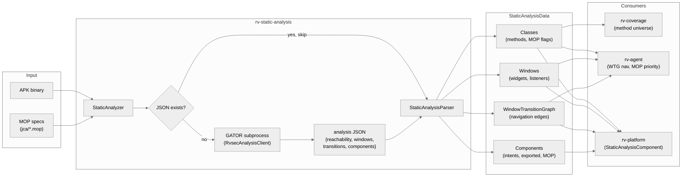
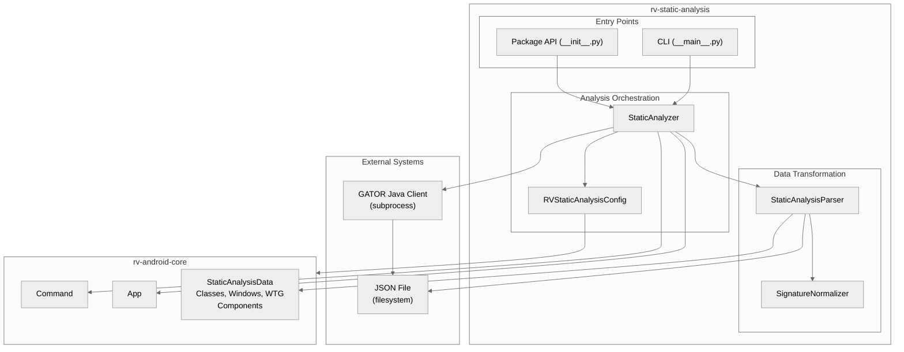
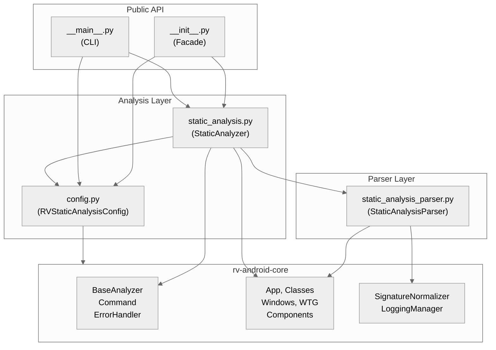
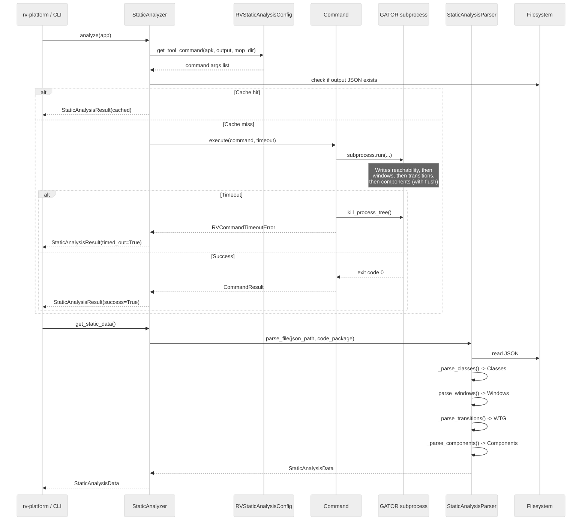
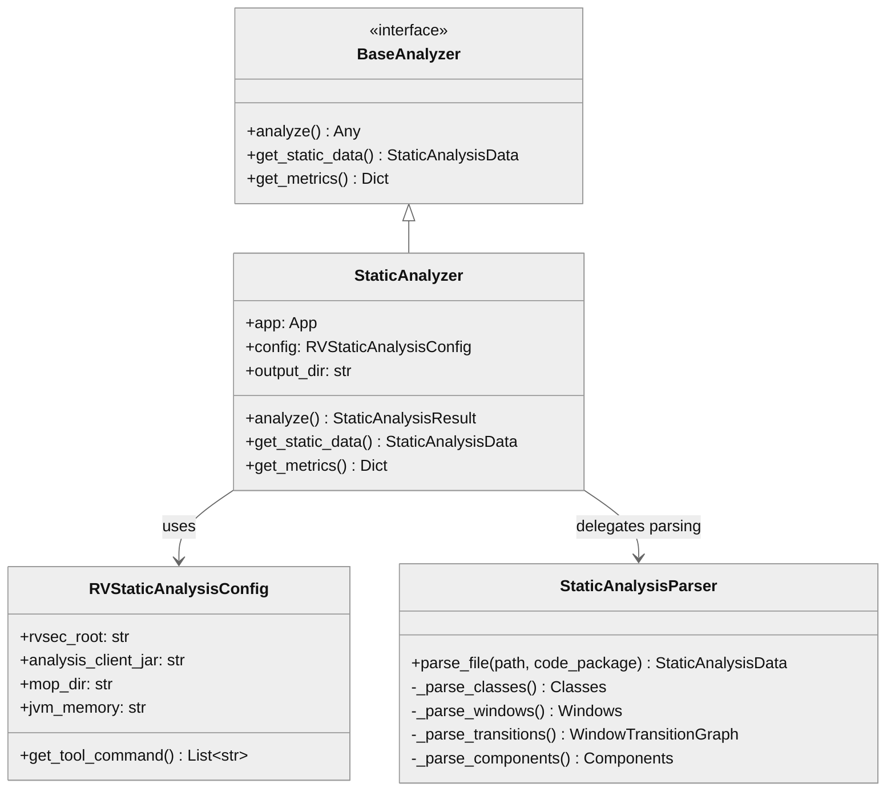

# rv-static-analysis Architecture

## Overview

rv-static-analysis runs unified GATOR-based static analysis on Android APKs and parses the resulting JSON into domain objects consumed by the rest of the RV-Android system. It provides two distinct capabilities: (1) analysis orchestration -- invoking the Java GATOR client as a subprocess with timeout handling and file-level caching, and (2) data transformation -- converting the raw JSON output into `StaticAnalysisData` domain objects (Classes, Windows, WindowTransitionGraph, Components). The module occupies the pre-processing phase of the experiment pipeline, producing the method universe for coverage calculations and the navigation graph for LLM-driven exploration.

## Specification Alignment

This module implements requirements from `openspec/specs/analysis/spec.md`.

### Functional Requirements

| FR | Description | Architectural Support |
|----|-------------|----------------------|
| FR04 | GATOR analysis producing Window Transition Graph | `StaticAnalysisParser._parse_transitions()` builds `WindowTransitionGraph` from the `transitions` JSON section |
| FR05 | GESDA analysis extracting GUI elements (activities, widgets, listeners) | `StaticAnalysisParser._parse_windows()` builds `Windows` with widgets, events, inputType, hint, entries from the `windows` JSON section |
| FR06 | REACH analysis computing method reachability relative to MOP | `StaticAnalysisParser._parse_classes()` builds `Classes` with `reachable`, `reaches_mop`, `directly_reaches_mop` flags from the `reachability` JSON section |

All three FRs are satisfied by a single GATOR client invocation (`RvsecAnalysisClient`) that writes all four JSON sections in one pass. The previous three-tool pipeline (GESDA + GATOR + REACH) was unified into this single-client architecture.

### Key Invariants

| Invariant | Description | Enforcement Mechanism |
|-----------|-------------|----------------------|
| INV-ANA-02 | SignatureNormalizer applied to all class names and method signatures | `StaticAnalysisParser` calls `SignatureNormalizer` in all three JSON section parsers before storing names in domain models |
| INV-ANA-03 | Parser receives `code_package` (not `package_name`) for class filtering | `parse_file()` requires `code_package` parameter; filters classes and windows by checking `code_package in class_name` |
| INV-ANA-06 | Parser does not propagate exceptions; returns empty domain objects per-section | Each `_parse_*()` method is wrapped in try/except; failures produce `Classes()`, `Windows()`, `WindowTransitionGraph()`, or `Components()` |
| INV-ANA-11 | Intelligent caching -- skip execution if output JSON exists | `StaticAnalyzer._execute_command()` checks file existence before invoking GATOR; returns `CommandResult(0, b"", b"")` on cache hit |
| INV-ANA-14 | PackageDetector applies heuristics in priority order | `PackageDetector` (in rv-android-core) resolves `code_package` via 7-strategy priority chain before passing to parser |

### Specification Scenarios

Scenarios from `openspec/specs/analysis/spec.md` that validate this architecture:

- **Successful static analysis with valid APK**: Traces through `StaticAnalyzer._run_analysis()` -> GATOR subprocess -> JSON file -> `StaticAnalysisParser.parse_file()` -> `StaticAnalysisData` with non-empty Classes, Windows, WTG, and Components
- **Timeout with partial JSON output**: Traces through `Command` timeout -> `kill_process_tree()` -> partial JSON preserved -> `StaticAnalysisParser` truncated JSON recovery via bracket completion -> valid sections parsed, missing sections return empty domain objects
- **Analysis result is cached**: Traces through `StaticAnalyzer._execute_command()` -> file existence check -> execution skipped -> `CommandResult(0, b"", b"")` returned with `execution_status='cached'` log
- **Partial JSON parse failure**: Individual section parsing fails -> `_parse_classes()` catches exception, returns empty `Classes()` -> other sections (`_parse_windows()`, `_parse_transitions()`) parse independently and succeed

## Key Architectural Decisions

### ADR-1: Single GATOR Client Instead of Three Separate Tools

The original pipeline ran three separate Java tools in sequence -- GESDA (GUI element extraction), GATOR (window transition graph), and REACH (method reachability). This was replaced by a single `RvsecAnalysisClient` invocation that produces all four data sections (reachability, windows, transitions, components) in one JSON file.

**Why**: Running three Java processes per APK tripled JVM startup overhead (~10s each) and required coordinating intermediate files between tools. A single invocation reduces wall-clock time by 20-30s per APK and eliminates file coordination bugs. The client writes sections in priority order with explicit `flush()` between each, so timeout still preserves the most critical data first.

**Spec reference**: This decision directly enables FR04, FR05, and FR06 from a single process. The priority-ordered output satisfies INV-ANA-06 (parser does not propagate exceptions; returns empty domain objects per-section).

### ADR-2: File-Level Caching Without Content Validation

`StaticAnalyzer._execute_command()` checks whether the output JSON file exists before invoking GATOR. If the file exists, execution is skipped entirely -- no content validation, no checksum, no schema check.

**Why**: GATOR analysis takes 2-10 minutes per APK. In experiments with 100+ APKs, re-running the pre-processing phase after a crash would waste hours. File existence is a sufficient signal because: (a) a complete run produces valid JSON, and (b) a timed-out run produces truncated JSON that the parser can recover via bracket completion. The only scenario where the file exists but is unusable is a disk-full write, which is rare and detectable at the experiment level. This satisfies INV-ANA-11.

### ADR-3: Two-Layer Architecture (Analysis + Parser)

The module is split into two independent layers: analysis orchestration (`StaticAnalyzer`) and data transformation (`StaticAnalysisParser`). The parser has no dependency on the analyzer and can operate on any JSON file matching the expected schema.

**Why**: This separation serves two use cases. In the experiment pipeline, the analyzer runs GATOR and then the parser transforms the output. In batch/offline scenarios, researchers parse pre-existing JSON files without running GATOR. The parser's independence also enables unit testing with JSON fixtures (55 tests) without requiring GATOR installation.

### ADR-4: Per-Section Independent Parsing with Graceful Degradation

Each JSON section (reachability, windows, transitions, components) is parsed in its own `_parse_*()` method wrapped in try/except. A failure in one section does not prevent parsing of others (INV-ANA-06).

**Why**: The GATOR client writes sections sequentially and flushes between each. On timeout (the most common failure mode at 600s default), the file is truncated mid-section. Reachability is written first because it provides the coverage denominator -- the most critical data for experiment validity. Even if transitions are entirely lost, the coverage calculation and MOP tracking still function. This pattern is validated by the "Timeout with partial JSON output" scenario from the spec.

### ADR-5: SignatureNormalizer as Defensive Safety Net

`StaticAnalysisParser` applies `SignatureNormalizer` to all class names (INV-ANA-02), converting `.` inner-class notation to `$` notation. The GATOR client already writes `$` notation via `SootClass.getName()`, so the normalizer is expected to be a no-op on well-formed output.

**Why**: The normalizer exists as a guard against upstream changes in the GATOR client. If a future version of Soot or GATOR changes its output format, the parser continues to produce consistent class names. The cost is negligible (string scan per class name), and the safety benefit was validated when a GATOR version briefly produced mixed notation.

### ADR-6: ETL Pipeline Pattern

The module follows an Extract-Transform-Load pattern: `StaticAnalyzer` extracts raw data by running GATOR as a subprocess, `StaticAnalysisParser` transforms the JSON into domain objects, and the resulting `StaticAnalysisData` is loaded into downstream consumers.

**Why**: GATOR is a Java program that cannot be imported as a Python library, so subprocess invocation with file-based I/O is the natural integration pattern. The file-based intermediate step also provides an audit trail -- the raw JSON is preserved in the results directory for post-experiment inspection.

| Decision | Choice | Rationale |
|----------|--------|-----------|
| Application Type | Library with CLI entry point | Consumed programmatically by rv-platform/rv-experiment; CLI for standalone/batch use |
| Structuring | Two-layer (analysis + parser) | Clean separation between GATOR execution orchestration and JSON data transformation |
| Primary Pattern | ETL Pipeline (Extract-Transform-Load) | APK -> GATOR subprocess (extract) -> JSON parsing (transform) -> domain objects (load) |
| Control Strategy | Call-based, synchronous | Single subprocess execution with timeout; no concurrency within the module |
| Distribution | Single machine, subprocess | GATOR runs as a Java subprocess on the same host; no network communication |
| Caching Strategy | File-level existence check | If output JSON exists, execution is skipped entirely. No content validation -- existence implies usable data |

## Data Flow

The module participates in a linear data pipeline that transforms an APK binary into structured domain objects consumed by three downstream modules.

### End-to-End Data Flow



### Data Transformation Stages

1. **Extract**: `StaticAnalyzer` builds a GATOR command line from `RVStaticAnalysisConfig` paths (JVM, android.jar, MOP dir, analysis client JAR) and invokes it as a subprocess with configurable timeout (default 600s). The GATOR client performs Soot-based analysis of the APK bytecode.

2. **Intermediate file**: The GATOR client writes a single JSON file with four sections in priority order: `reachability` (classes with MOP flags), `windows` (widgets with event listeners and XML attribute extensions `prompt`/`spinnerMode`/`contentDescription`/`tooltipText` plus populated OPTIONSMENU widgets), `transitions` (window-to-window edges), and `components` (non-Activity component data). Each section is flushed before starting the next, so timeout preserves sections in priority order. When `skip_wtg=True` is set, the client returns after writing reachability and windows, leaving `transitions[]` empty by design (not a failure).

3. **Transform**: `StaticAnalysisParser.parse_file()` reads the JSON and produces four domain objects:
   - `Classes`: one `Clazz` per app class (filtered by `code_package` per INV-ANA-03), each containing `Method` objects with `reachable`, `reaches_mop`, and `directly_reaches_mop` flags.
   - `Windows`: one `Window` per UI screen with `Widget` objects carrying event listeners (`WidgetEvent` with handler signatures).
   - `WindowTransitionGraph`: a `networkx.DiGraph` where nodes are `Window` objects and edges carry `WindowTransition` lists (widget ID, event type, handler method). Widgets referenced in transitions but absent from windows are back-filled on the fly.
   - `Components`: activities, receivers, services, and providers with intent filters, exported status, and MOP reachability data.

4. **Load**: The `StaticAnalysisData` aggregate is passed to downstream consumers. rv-coverage uses `Classes.methods` as the denominator for coverage percentages. rv-agent uses the WTG for navigation guidance and MOP flags for action prioritization. rv-platform makes the data available to all task executor components.

### JSON Section Priority and Timeout Behavior

When the GATOR client is killed by timeout, the JSON file is truncated at the point of interruption. The parser's bracket-recovery mechanism finds the last complete `]` and closes the root object with `}`. This yields:

| Timeout point | Reachability | Windows | Transitions | Components | Impact |
|---------------|-------------|---------|-------------|------------|--------|
| After reachability flush | Complete | Empty | Empty | Empty | Coverage denominator preserved; no navigation data |
| During windows write | Complete | Partial | Empty | Empty | Coverage + partial widget data for MOP matching |
| After windows flush | Complete | Complete | Empty | Empty | Coverage + full widget matching; no WTG navigation |
| During transitions write | Complete | Complete | Partial | Empty | Full data except some WTG edges and all components |
| After transitions flush | Complete | Complete | Complete | Empty | Full navigation data; missing component-level MOP |
| Complete | Complete | Complete | Complete | Complete | All data available |
| `skip_wtg=True` (deliberate) | Complete | Complete | Empty | Empty | Reachability + widget data for MOP matching; WTG construction bypassed by client choice (not failure) |

## Architectural Patterns

### Pattern: ETL Pipeline

**Description**: The module follows an Extract-Transform-Load pattern. The `StaticAnalyzer` extracts raw analysis data by running the GATOR Java client as a subprocess, which produces a JSON file. The `StaticAnalysisParser` transforms this JSON into structured domain objects. The resulting `StaticAnalysisData` is loaded into downstream consumers (rv-platform, rv-agent, rv-coverage).

**When Used**: Processing external tool output into internal domain models. The GATOR client is a Java program that cannot be imported as a Python library, so subprocess invocation with file-based I/O is the natural integration pattern.

**Advantages**:
- Clear separation between execution and parsing concerns
- Parser can operate independently on pre-existing JSON files
- Graceful degradation: partial extraction still yields usable data

**Disadvantages**:
- File I/O overhead for intermediate JSON storage
- No streaming -- entire JSON must be written before parsing begins

### Pattern: Facade

**Description**: The `__init__.py` exports four symbols (`StaticAnalyzer`, `StaticAnalysisResult`, `StaticAnalysisException`, `RVStaticAnalysisConfig`), hiding the internal directory structure. Consumers import from `rv_static_analysis` without knowledge of the `analysis/static/` or `parser/static/` subdirectories.

**When Used**: Providing a stable public API while allowing internal restructuring.

**Advantages**:
- Consumers are decoupled from internal package organization
- Adding new analysis types does not change the import surface

**Disadvantages**:
- Parser is not part of the public API and must be imported directly when needed outside `StaticAnalyzer`

### Pattern: Graceful Degradation

**Description**: The parser processes each JSON section (reachability, windows, transitions, components) independently. A failure in one section does not prevent parsing of others. The GATOR client writes sections in priority order with explicit flush, so a timeout preserves the most critical data first (reachability).

**When Used**: Handling timeout scenarios where the GATOR subprocess is killed mid-write. Also handles malformed JSON sections caused by GATOR bugs.

**Advantages**:
- Partial data is always recovered and usable
- Reachability (coverage denominator) is written first and most likely to survive

**Disadvantages**:
- Consumers must handle potentially empty sections in `StaticAnalysisData`

---

## Logical View

### Domain Entities

| Entity | Responsibility |
|--------|----------------|
| `StaticAnalyzer` | Orchestrates GATOR execution with caching, timeout handling, and result packaging |
| `RVStaticAnalysisConfig` | Validates and resolves paths for GATOR tools; generates command lines |
| `StaticAnalysisParser` | Converts GATOR JSON output into `StaticAnalysisData` domain objects |
| `StaticAnalysisResult` | Value object capturing analysis outcome (file path, success, timeout, errors) |
| `StaticAnalysisData` | Aggregate domain object holding Classes, Windows, WTG, and Components (defined in rv-android-core) |

### Component Architecture



---

## Development View

### Module Structure

```
rv-static-analysis/
├── src/rv_static_analysis/
│   ├── __init__.py                     # Facade: 4 public exports
│   ├── __main__.py                     # CLI: analyze + batch subcommands
│   ├── config.py                       # RVStaticAnalysisConfig (Pydantic)
│   ├── analysis/
│   │   └── static/
│   │       └── static_analysis.py      # StaticAnalyzer, StaticAnalysisResult
│   └── parser/
│       └── static/
│           └── static_analysis_parser.py  # StaticAnalysisParser (JSON -> domain)
├── tests/
│   ├── conftest.py                     # Shared fixtures
│   ├── test_config.py                  # Config validation tests
│   ├── analysis/static/
│   │   └── test_static_analysis.py     # Analyzer tests (13 tests)
│   ├── parser/static/
│   │   └── test_static_analysis_parser.py  # Parser tests (55 tests)
│   └── resources/
│       └── cryptoapp.apk.json          # Reference analysis output
└── pyproject.toml
```

### Package Dependencies



### Build Dependencies

| Dependency | Type | Purpose |
|------------|------|---------|
| rv-android-core | Internal (workspace) | Domain models, base classes, error handling, logging |
| pydantic | External (>=2.9.0) | Configuration validation and model definitions |
| pytest | Dev | Testing framework |
| pytest-cov | Dev | Coverage reporting |

---

## Process View

The module does not use concurrency internally. It executes as a synchronous pipeline: configure -> run subprocess -> parse output. The GATOR Java client runs as a separate process with timeout enforcement via `Command.kill_process_tree()`.

### Execution Flow



---

## Core Components

### StaticAnalyzer

**Purpose**: Orchestrates GATOR execution with file-level caching and timeout handling. Provides `analyze()` for running the analysis and `get_static_data()` for retrieving parsed results.

**Location**: `src/rv_static_analysis/analysis/static/static_analysis.py`

**Key Classes**:
- `StaticAnalyzer(BaseValidatedModel, BaseAnalyzer)`: Dual inheritance -- Pydantic for validated construction, BaseAnalyzer for the `analyze()`/`get_metrics()` interface
- `StaticAnalysisResult(BaseValidatedModel)`: Value object for analysis outcomes
- `StaticAnalysisException(RVAndroidError)`: Domain-specific exception

**Dependencies**:
- Internal: `RVStaticAnalysisConfig`, `StaticAnalysisParser`
- External: rv-android-core (`Command`, `App`, `BaseAnalyzer`, `ErrorHandler`)

### RVStaticAnalysisConfig

**Purpose**: Validates paths for GATOR tools (launcher, analysis JAR, Android SDK, MOP directory) and generates command lines. Uses a 4-level priority chain for path resolution: explicit parameters > rvsec_root layout > RVSEC_HOME env var > CWD parent.

**Location**: `src/rv_static_analysis/config.py`

**Key Classes**:
- `RVStaticAnalysisConfig(BaseValidatedModel)`: Pydantic model with field validators and `model_post_init` for path resolution. Notable fields: `cg_algorithm` (default `spark`), `jvm_memory`, `analysis_timeout`, `skip_wtg` (default `False` — when True the generated command includes `-clientParam skipWtg=true`). `get_tool_command()` resolves the launcher under `sys.executable` (the running interpreter) to remain portable across hosts without `/usr/bin/python`.

**Dependencies**:
- External: rv-android-core (`BaseValidatedModel`, `ConfigurationError`, constants)

### StaticAnalysisParser

**Purpose**: Converts GATOR JSON output into `StaticAnalysisData` domain objects. Handles four JSON sections independently (reachability, windows, transitions, components), enabling graceful degradation when sections are missing or corrupt. Implements truncated JSON recovery for timeout scenarios. Widgets carry XML attribute fields (`prompt`, `spinnerMode`, `contentDescription`, `tooltipText`) which default to `None` when absent.

**Location**: `src/rv_static_analysis/parser/static/static_analysis_parser.py`

**Key Classes**:
- `StaticAnalysisParser`: Stateful parser with `SignatureNormalizer`; a module-level singleton (`_instance`) provides convenience functions (`parse_file()`)

**Dependencies**:
- External: rv-android-core (all domain models: `Classes`, `Method`, `Windows`, `Window`, `Widget`, `WidgetEvent`, `WindowTransitionGraph`, `Components`, `ComponentInfo`, `IntentFilter`, `SignatureNormalizer`)

### CLI Entry Point

**Purpose**: Provides `analyze` (single APK) and `batch` (directory of APKs) subcommands for standalone use outside the rv-platform pipeline.

**Location**: `src/rv_static_analysis/__main__.py`

**Dependencies**:
- Internal: `StaticAnalyzer`, `RVStaticAnalysisConfig`

**CLI Library**: `argparse` (NOT Click). This matters for env-var handling: `argparse` has no `envvar=` analogue, so this entry-point does NOT honor `RV_SA_TIMEOUT` or `RV_JVM_MEMORY` directly. The env-var bridge only exists through `rv-experiment` (gh55 §9 Click `envvar=` gambiarra). Standalone runs must pass `--analysis-timeout` (gh55 added) or `--jvm-memory` explicitly. The architectural fix that gives every L5 entry-point uniform env-var resolution lives at `openspec/changes/gh-tbd-env-vars-architecture/`.

**CLI Flags (selected)**: `--analysis-timeout SECS` overrides per-APK GATOR timeout; `--skip-wtg` (gh57) propagates to GATOR as `-clientParam skipWtg=true` so the client emits reachability + `windows[]` and returns without invoking `WTGBuilder.build()`; `--jvm-memory SIZE` sets the JVM `-Xmx` for the GATOR subprocess.

---

## NFR Support

How the architecture supports non-functional requirements from `docs/PRD.md` Section 7.

| NFR | PRD ID | Priority | Architectural Support |
|-----|--------|----------|----------------------|
| Modularity | NFR01 | P0 | Single uv workspace module with one internal dependency (rv-android-core). Clean Facade API via `__init__.py`. Analysis and parser layers are independent packages. |
| Extensibility | NFR02 | P0 | `BaseAnalyzer` interface allows adding new analysis types. Parser sections are independent -- adding a new JSON section requires only a new `_parse_*()` method. |
| Testability | NFR03 | P1 | Parser tests (55) operate on JSON fixtures without GATOR. Analyzer tests use mocked `Command`. Reference JSON (`cryptoapp.apk.json`) enables baseline equivalence tests. |
| Resilience | NFR04 | P1 | Graceful degradation: per-section error isolation (INV-ANA-06). Truncated JSON recovery via bracket completion. File-level caching avoids redundant execution. Timeout handling preserves partial results. |
| Configurability | NFR05 | P1 | Pydantic model with 4-level path resolution. Environment variables (`RVSEC_HOME`, `ANDROID_HOME`). CLI arguments for standalone use. Configurable JVM memory and analysis timeout. |
| Reproducibility | NFR08 | P2 | File-level caching ensures re-runs produce identical results. Deterministic JSON output from GATOR. Reference test fixtures for parser validation. |

---

## Key Interfaces

### BaseAnalyzer Protocol

```python
class BaseAnalyzer(Protocol):
    """Interface for analysis tools that produce structured results."""

    def analyze(self) -> Any:
        """Execute analysis and return result."""
        ...

    def get_static_data(self) -> StaticAnalysisData:
        """Return parsed analysis data."""
        ...

    def get_metrics(self) -> Dict[str, Any]:
        """Return execution metrics."""
        ...
```



---

## Scenarios

### Scenario 1: Pre-Processing in Experiment Pipeline

**Description**: rv-experiment's `PreProcessor` runs static analysis on each APK before test execution begins. The results feed into the coverage tracker (method universe) and rv-agent (navigation guidance).

**Flow**:
1. `PreProcessor` creates `StaticAnalyzer` with `App` and `RVStaticAnalysisConfig`
2. `StaticAnalyzer.analyze()` checks if output JSON exists (cache); if not, invokes GATOR subprocess
3. GATOR writes reachability, windows, transitions, components to JSON in priority order
4. `StaticAnalyzer.get_static_data()` delegates to `StaticAnalysisParser.parse_file()`
5. Parser produces `StaticAnalysisData` with `Classes`, `Windows`, `WTG`, `Components`
6. `StaticAnalysisComponent` in rv-platform passes data to `CoverageTracker` (method universe) and makes it available to rv-agent (WTG navigation, MOP prioritization)

### Scenario 2: Timeout with Partial Data Recovery

**Description**: GATOR exceeds the configured timeout (default: 600s) and is killed, but the most critical data is preserved.

**Flow**:
1. `Command` detects timeout and calls `kill_process_tree()`
2. GATOR had already flushed the reachability section and part of the windows section
3. `StaticAnalysisResult` is returned with `timed_out=True`
4. `StaticAnalysisParser.parse_file()` attempts to load the truncated JSON
5. `json.loads()` fails; parser finds last complete `]` bracket, truncates, closes JSON
6. Reachability section parses successfully into `Classes` (coverage denominator preserved)
7. Windows section partially recovers; transitions and components return empty domain objects
8. Downstream consumers receive partial but usable `StaticAnalysisData`

### Scenario 3: Batch Analysis via CLI

**Description**: A researcher runs batch analysis on a directory of APKs for offline processing.

**Flow**:
1. CLI receives `batch --apks-dir /apks --output /output` command
2. `handle_batch_command()` iterates APK files in the directory
3. For each APK, creates `StaticAnalyzer` and calls `analyze()`
4. File-level caching skips previously analyzed APKs
5. Continue-on-error flag allows the batch to proceed past individual failures
6. Aggregate summary reports total, successful, failed, cached counts

---

## Extension Points

- **New analysis sections**: Add a new `_parse_*()` method to `StaticAnalysisParser` and extend `StaticAnalysisData` in rv-android-core. The per-section independence means existing sections are unaffected.
- **Alternative analysis backends**: Implement `BaseAnalyzer` interface with a different tool (e.g., FlowDroid, Amandroid). The parser layer can be reused if the tool produces compatible JSON.
- **Configuration**: `RVStaticAnalysisConfig` accepts explicit paths at each level, enabling custom tool installations and non-standard directory layouts.

## Dependencies

### Internal (rv-android modules)

| Module | Purpose |
|--------|---------|
| rv-android-core | Domain models (`App`, `StaticAnalysisData`, `Classes`, `Windows`, `WTG`, `Components`), base classes (`BaseAnalyzer`, `BaseValidatedModel`), utilities (`Command`, `ErrorHandler`, `SignatureNormalizer`, `LoggingManager`), constants |

### External

| Package | Version | Purpose |
|---------|---------|---------|
| pydantic | >=2.9.0 | Configuration validation and model definitions |
| networkx | (transitive via rv-android-core) | `WindowTransitionGraph` directed graph representation |

### Downstream Consumers

| Module | What It Uses |
|--------|-------------|
| rv-platform | `StaticAnalysisComponent` calls `StaticAnalyzer.analyze()` and `parser.parse_file()` |
| rv-experiment | `PreProcessor` orchestrates static analysis during pre-processing phase |
| rv-agent | `TransitionManager` uses WTG; `MopScorer` uses reachability MOP flags |
| rv-coverage | `CoverageTracker` uses `Classes` as the method universe for coverage % |

## Testing Strategy

| Type | Location | Purpose |
|------|----------|---------|
| Unit (parser) | `tests/parser/static/test_static_analysis_parser.py` | 55 tests covering all JSON sections, edge cases, truncated JSON recovery, SignatureNormalizer, class filtering |
| Unit (analyzer) | `tests/analysis/static/test_static_analysis.py` | 13 tests covering caching, timeout handling, error scenarios (mocked Command) |
| Unit (config) | `tests/test_config.py` | 8 tests covering path resolution, validation, command generation |
| Fixture | `tests/resources/cryptoapp.apk.json` | Reference analysis output for baseline equivalence tests |

## Related Documentation

- [Domain Spec](../../openspec/specs/analysis/spec.md) - Requirements, invariants, and scenarios for the Analysis and Coverage domain
- [PRD](../../docs/PRD.md) - Product Requirements Document (FR04-FR06, NFR01-NFR08)
- [CLAUDE.md](../../CLAUDE.md) - Project-wide development guidance
- [Module CLAUDE.md](../CLAUDE.md) - Module-specific development guidance
